 


 2306.02728 
 Minjoon Jung et el. 
 



↗ arXiv


↗ Hugging Face


↗ Papers with Code


### TL;DR



비디오 순간 검색(VMR)은 자연어 질의에 맞는 비디오 내 특정 순간을 찾는 과제입니다. 하지만 기존 VMR 모델들은 비디오 데이터셋의 고유한 모호성으로 인해 **약한 정렬 문제**를 겪습니다. 즉, 질의어가 해당 순간의 세부 정보를 완전히 포괄하지 못하거나, 순간에 관련 없는 프레임이 포함될 수 있습니다. 이로 인해 성능 향상에 제약이 발생합니다.

본 논문에서는 이러한 문제를 해결하기 위해 **배경 정보를 활용하는 새로운 모델인 BM-DETR**을 제안합니다. BM-DETR은 대조 학습 방식을 채택하여, 비디오 내 다른 순간에 매칭되는 부정적인 질의어를 활용합니다.  모델은 각 프레임과 양성 질의어 및 부정적 질의어의 보완적인 관계를 학습하여, 타겟 순간을 예측합니다. 이를 통해 **주변 배경 정보를 효과적으로 활용**하여 순간 감지 능력을 향상시키고, 비디오 내 전반적인 정렬을 개선합니다.  실험 결과, BM-DETR은 기존 모델들에 비해 **성능이 뛰어나고 효율적**임을 보여줍니다.



#### Key Takeaways


 배경 정보를 활용한 새로운 비디오 순간 검색(VMR) 모델 BM-DETR 제안 



 기존 VMR 모델의 약한 정렬 문제를 효과적으로 해결하여 성능 향상 



 단순하고 효율적인 구조로 계산 비용 절감 및 다양한 데이터셋에서의 우수한 성능 확인 


#### Why does it matter?
본 논문은 **약한 정렬 문제**로 어려움을 겪는 비디오 순간 검색(VMR) 분야에 중요한 기여를 합니다. 제안된 BM-DETR 모델은 기존 방법보다 **성능이 우수**하며, **효율성이 높아** 연구자들이 비디오 이해와 관련된 다양한 문제를 해결하는 데 도움이 될 수 있습니다. 특히, **대규모 데이터셋에 대한 접근성이 부족한 상황에서도 효과적**으로 작동하여, 향후 연구의 새로운 가능성을 제시합니다.  비디오-텍스트 정렬 문제에 대한 새로운 해결책을 제공하며,  다양한 비디오 이해 작업에 적용될 수 있는 잠재력이 있습니다.

------
#### Visual Insights

> 🔼 그림 1은 논문의 약한 정렬 문제와 제안된 방법을 보여줍니다. 상단은 질의어와 비디오 구간의 경계가 일치하지 않는 약한 정렬 문제의 예시를 보여줍니다. 하단은 기존 방법(왼쪽)과 제안된 방법(오른쪽)의 비교를 보여줍니다. 제안된 방법은 배경 정보를 활용하여 더욱 정확하게 비디오 구간을 검출하는 것을 보여줍니다.
> 

> 
read the caption

> Figure 1:  Top: An example of the weak alignment problem. Bottom: Comparison between traditional (left) and proposed (right) methods.
> 


| Dataset | Domain | #Videos | #Queries | Avg (sec) Moment/Video | Avg (sec) Query |
|---|---|---|---|---|---| 
| CharadesSTA | Activity | 6.7K | 16.1K | 8.1 / 30.6 | 7.2 |
| Anet-Cap | Activity | 15K | 72K | 36.2 / 117.6 | 14.8 |
| TACoS | Cooking | 127 | 18K | 5.4 / 287.1 | 10 |
| QVHighlights | Vlog / News | 10.2K | 10.3K | 24.6 / 150 | 11.3 |

> 🔼 표 1은 VMR(Video Moment Retrieval) 데이터셋의 통계를 보여줍니다.  각 데이터셋(Charades-STA, ActivityNet-Captions, TACOS, QVHighlights)에 대해 비디오 수, 질의 수, 비디오 당 평균 모먼트 길이(초), 질의 당 평균 단어 수를 나타냅니다.  'Avg Moment/Video'는 각 비디오에서 모먼트의 평균 길이(초)를, 'Avg Query'는 질의 문장의 평균 단어 수를 의미합니다. 이 표는 다양한 VMR 데이터셋의 크기와 특징을 비교하여 모델 성능 평가에 사용되는 데이터셋의 특성을 이해하는 데 도움을 줍니다.
> 

> 
read the caption

> Table 1:  Statistics of VMR datasets. Avg Moment/Video denotes an average length of moment/video in seconds. Avg Query means an average number of words in query sentences.
> 

### In-depth insights

#### Weak Alignment Issue
연구 논문에서 자주 언급되는 "Weak Alignment Issue"는 비디오 데이터셋에서 흔히 발생하는 문제점을 지칭합니다. **자연어 질의어와 비디오의 시맨틱 정보 간 정확한 매칭이 어렵다는 점**을 의미합니다.  질의어가 비디오의 특정 순간을 완벽히 포괄하지 못하거나, 해당 순간에 관련 없는 프레임들이 포함될 수 있습니다. 이는 **모델의 정확도를 저하시키는 주요 원인**이 됩니다.  **데이터셋의 애매모호한 주석(annotation) 또한 이 문제를 심화**시키는 요소입니다.  예를 들어, "사람이 유리에 물을 따른다"라는 질의어는 "물을 마신다"라는 동작을 포함하는 어노테이션과 정확히 일치하지 않을 수 있습니다.  이러한 Weak Alignment 문제는 모델이 특정 비디오 순간을 정확히 예측하는 것을 어렵게 만들고,  결과적으로 성능 향상에 제약을 초래합니다.  따라서, 본 논문에서는 이러한 문제를 해결하기 위한 새로운 접근 방식을 제시하고 있습니다.  **다양한 기술들을 통해 Weak Alignment 문제를 완화하고 성능 향상을 도모**하는데 초점을 맞추고 있습니다.

#### BM-DETR Model
BM-DETR 모델은 기존 VMR(Video Moment Retrieval) 모델의 약한 정렬 문제를 해결하기 위해 제안된 **배경 인식** 기반의 트랜스포머 모델입니다.  **긍정적 질의와 부정적 질의를 모두 활용**하여 타겟 모멘트와 관련 없는 배경 정보까지 고려함으로써 모멘트 감지의 정확도를 높였습니다.  **프레임-질의 확률 매처(PFM)**를 통해 각 프레임과 질의 간의 관계를 효과적으로 모델링하고, **시간적 이동(temporal shifting)** 기법을 통해 모델의 시간 불변성을 향상시켰습니다.  또한, **미세한 의미적 정렬(fine-grained semantic alignment)**을 통해 영상과 질의 간의 의미적 일치성을 개선하여 전반적인 성능 향상을 이끌어냈습니다.  **다양한 VMR 벤치마크에서 우수한 성능**을 보이며, 특히 약한 정렬 문제가 심각한 데이터셋에서 뛰어난 성능을 입증했습니다.  **계산 효율성**도 높아 기존의 contrastive learning 기반 방법들보다 효율적입니다.

#### Contrastive Approach
본 논문에서 제안하는 **대조적 접근법(Contrastive Approach)**은 비디오 순간 검색(VMR) 과제에서의 약한 정렬 문제를 해결하기 위한 핵심 전략입니다.  기존의 단일 쿼리 기반 방법론의 한계를 극복하고자, **긍정적 쿼리와 부정적 쿼리를 동시에 활용**, 목표 순간과 주변 배경 간의 상호작용을 효과적으로 학습합니다.  **부정적 쿼리의 활용**은 모델이 목표 순간에 대한 이해도를 높이고, 관련 없는 프레임을 걸러내는 데 중요한 역할을 합니다. 이는 단순히 긍정적 쿼리만 사용하는 기존 방법보다 **정확도와 민감도를 향상**시킵니다.  **프레임-쿼리 매칭 확률**을 계산하여 프레임 어텐션 스코어를 생성하는 방식은 모델의 **순간 감지 성능을 높이고 정확한 정렬**을 가능하게 합니다.  결론적으로, 제안된 대조적 접근법은 VMR 성능 향상에 크게 기여하며, 특히 약한 정렬 문제가 심각한 데이터셋에서 효과적임을 보여줍니다.

#### Ablation Experiments
본 논문에서 제시된 배경 인식 모멘트 검출 트랜스포머(BM-DETR)의 성능을 객관적으로 평가하기 위해 **에이블레이션 실험(Ablation Experiments)**이 수행되었습니다.  이는 모델의 각 구성 요소 및 손실 함수의 중요성을 규명하고, 모델의 성능 향상에 기여하는 요인을 분석하기 위한 필수적인 과정입니다. 구체적으로, 배경 정보 활용, 정교한 의미적 정렬, 학습 가능한 구간, 그리고 시간적 이동 기법 등의 영향을 개별적으로 평가하여 BM-DETR의 성능에 미치는 영향을 정량적으로 분석하였습니다. 이러한 분석을 통해 **각 모듈의 기여도를 명확하게 파악**하고, 모델 설계의 **합리성과 효율성을 검증**하는데 도움이 됩니다. 또한, 다양한 손실 함수의 조합을 실험하여 최적의 성능을 달성하는 조합을 찾고, 각 손실 함수의 중요성을 확인했습니다.  결과적으로, **모든 구성 요소와 손실 함수가 모델 성능에 상당한 영향을 미치는 것**으로 나타났으며, 이를 통해 제시된 BM-DETR의 효과적인 설계를 입증했습니다.

#### OOD Robustness
본 논문에서 제시된 BM-DETR 모델의 OOD(Out-of-Distribution) 강건성은 기존 VMR(Video Moment Retrieval) 모델들이 훈련 데이터셋에 과도하게 의존하는 경향을 극복하고자 하는 시도에서 비롯됩니다.  **기존 모델들은 훈련 데이터의 통계적 특성에 지나치게 최적화되어, 훈련 데이터와 다른 특성을 가진 데이터(OOD 데이터)에 대해서는 성능이 급격히 저하되는 현상**을 보였습니다.  BM-DETR은 **배경 정보를 활용하여 특정 모멘트에 대한 이해도를 높이고, 다양한 쿼리와의 상관관계를 학습**함으로써 OOD 데이터에 대한 강건성을 확보하고자 합니다.  특히, Charades-CD 데이터셋의 test-ood split을 사용한 실험 결과는 BM-DETR이 **기존 모델들보다 OOD 데이터에 대해 훨씬 뛰어난 성능**을 보임을 보여줍니다.  이는 **BM-DETR의 모델 설계가 데이터셋의 편향성에 덜 의존적이며, 보다 일반화된 특징을 학습**할 수 있음을 시사합니다.  따라서, BM-DETR의 OOD 강건성은 단순히 성능 향상을 넘어, **실제 환경에서의 VMR 모델의 신뢰성과 안정성**을 높이는 데 크게 기여할 것으로 기대됩니다.  하지만,  **데이터셋 자체의 품질 개선** 없이 모델의 강건성만으로 완벽한 해결책을 제시하기는 어렵다는 점을 유념해야 합니다.

### More visual insights

More on tables


| Method | Video Feat | Charades-STA (IoU=0.5) | Charades-STA (IoU=0.7) |
|---|---|---|---| 
| 2D-TAN [56] | C3D | 39.70 | 27.10 |
| DRN [51] | C3D | 45.40 | 26.40 |
| VSLNet [54] | C3D | 47.31 | 30.19 |
| CBLN [24] | C3D | 47.94 | 28.22 |
| IVG-DCL [30] | C3D | 50.24 | 32.88 |
| MomentDiff [22] | C3D | 53.79 | 30.18 |
| **BM-DETR (ours)** | C3D | **54.42** | **33.84** |
| 2D-TAN [56] | VGG | 41.34 | 23.91 |
| DRN [51] | VGG | 42.90 | 23.68 |
| CBLN [24] | VGG | 43.67 | 24.44 |
| FVMR [11] | VGG | 42.36 | 24.14 |
| SSCS [7] | VGG | 43.15 | 25.54 |
| MMN [44] | VGG | 47.31 | 27.28 |
| QD-DETR [28] | VGG | 52.77 | 31.13 |
| G2L [21] | VGG | 47.91 | 28.42 |
| MomentDiff [22] | VGG | 51.94 | 28.25 |
| **BM-DETR (ours)** | VGG | **54.22** | **35.54** |
| MDETR [19] | SF+C | 53.63 | 31.37 |
| QD-DETR [28] | SF+C | 57.31 | 32.55 |
| UniVTG [23] | SF+C | 58.01 | 35.65 |
| MomentDiff [22] | SF+C | 55.57 | 32.42 |
| **BM-DETR (ours)** | SF+C | **59.48** | **38.33** |
> 🔼 표 2는 Charades-STA 데이터셋에 대한 다양한 비디오 순간 검색(VMR) 방법들의 성능을 보여줍니다.  각 방법은 비디오 특징 추출에 사용된 방법 (Video Feat) 과 텍스트 특징 추출에 사용된 방법 (Text Feat) 에 따라 성능이 다르게 나타납니다.  표에는  IoU(Intersection over Union) 값이 0.5 및 0.7일 때의 R@1 (Top-1 정확도) 및 평균 평균 정밀도(mAP)가 제시되어 있습니다. 이를 통해 각 모델의 순간 검출 정확도를 비교 분석할 수 있습니다.
> 

> 
read the caption

> Table 2: Performance results on Charades-STA.
> 


| Method | Text Feat | ActivityNet-Captions (Video Feat: C3D) |  | TACoS (Video Feat: C3D) |  | 
|---|---|---|---|---|---| 
|  |  | IoU=0.5 | IoU=0.7 | IoU=0.3 | IoU=0.5 | 
| 2D-TAN [56] | Glove | 44.51 | 26.54 | 37.29 | 25.32 | 
| VSLNet [54] | Glove | 43.22 | 26.16 | 29.61 | 24.27 | 
| DRN [51] | Glove | 45.45 | 24.39 | - | 23.17 | 
| CBLN [24] | Glove | 48.12 | 27.60 | 38.98 | 27.65 | 
| DeNet [59] | Glove | 43.79 | - | - | - | 
| IVG-DCL [30] | Glove | 43.84 | 27.10 | 38.84 | 29.07 | 
| SSCS [7] | Glove | 46.67 | 27.56 | 41.33 | 29.56 | 
| GTR [2] | Glove | **50.57** | <ins>29.11</ins> | <ins>40.39</ins> | <ins>30.22</ins> | 
| **BM-DETR (ours)** | Glove | <ins>49.62</ins> | **30.61** | **49.87** | **33.67** | 
| MMN [44] | DistilBERT | 48.59 | 29.26 | 39.24 | 26.17 | 
| G2L [21] | BERT | **51.68** | **33.35** | <ins>42.74</ins> | <ins>30.95</ins> | 
| **BM-DETR (ours)** | BERT | <ins>49.98</ins> | <ins>30.88</ins> | **50.46** | **35.87** | 
> 🔼 표 3은 ActivityNet-Captions와 TACoS 두 비디오 데이터셋에 대한 모델 성능 결과를 보여줍니다.  각 데이터셋에 대해 IoU(Intersection over Union) 임계값 0.3과 0.5를 사용하여 R@1 (top-1 정확도)과 IoU 임계값 0.5와 0.75를 사용한 mAP (평균 정밀도)를 측정했습니다. 다양한 비디오 특징(C3D, Glove)과 텍스트 특징(Glove, BERT, DistilBERT) 조합에 따른 BM-DETR을 포함한 여러 최첨단 VMR(Video Moment Retrieval) 방법의 성능을 비교 분석하여 제안된 BM-DETR 모델의 우수성을 보여줍니다.
> 

> 
read the caption

> Table 3:  Performance results on ActivityNet-Captions and TACoS.
> 


| Method | Text Feat | IoU=0.5 | IoU=0.7 | mAP@0.5 | mAP@0.75 | Avg. |
|---|---|---|---|---|---|---|
| MCN [1] | CLIP | 11.41 | 2.72 | 24.94 | 8.22 | 10.67 |
| CAL [8] | CLIP | 25.49 | 11.54 | 23.40 | 7.65 | 9.89 |
| XML [20] | CLIP | 41.83 | 30.35 | 44.63 | 31.73 | 32.14 |
| XML+ [19] | CLIP | 46.69 | 33.46 | 47.89 | 34.67 | 34.90 |
| MDETR [19] | CLIP | 52.89 | 33.02 | 54.82 | 29.40 | 30.73 |
| UMT [26] | CLIP | 56.23 | 41.18 | 53.83 | 37.01 | 36.12 |
| QD-DETR [28] | CLIP | 62.40 | 44.98 | 62.52 | 39.88 | 39.86 |
| UniVTG [23] | CLIP | 58.86 | 40.86 | 57.60 | 35.59 | 35.47 |
| MomentDiff [22] | CLIP | 57.42 | 39.66 | 54.02 | 35.73 | 35.95 |
| **BM-DETR (ours)** | CLIP | **60.12** | **43.05** | **63.08** | **40.18** | **40.08** |
> 🔼 표 4는 QVHighlights 데이터셋에 대한 제안된 BM-DETR 모델의 성능 결과를 보여줍니다.  다양한 평가 지표(IoU=0.5, IoU=0.7, mAP@0.5, mAP@0.75, 평균 mAP)를 사용하여 기존의 최첨단 VMR 방법들과 비교 분석하여 BM-DETR의 우수성을 보여줍니다. 비디오 특징 추출 방법(SF+C) 및 텍스트 특징 추출 방법(CLIP)도 함께 제시되어 있습니다.
> 

> 
read the caption

> Table 4:  Performance results on QVHighlights.
> 


| Method | Text Feat | Charades-CD (Video Feat: I3D) | Charades-CD (Video Feat: I3D) | 
|---|---|---|---|
|  |  | IoU=0.5 | IoU=0.7 |
| 2D-TAN [56] | Glove | 35.88 | 13.91 |
| LG [29] | Glove | 42.90 | 19.29 |
| DRN [51] | Glove | 31.11 | 15.17 |
| VSLNet [54] | Glove | 34.10 | 17.87 |
| DCM [47] | Glove | 45.47 | 22.70 |
| Shuffling [13] | Glove | 46.67 | 27.08 |
| **BM-DETR (ours)** | Glove | **53.37** | **30.12** |
> 🔼 표 5는 Charades-CD 데이터셋에 대한 실험 결과를 보여줍니다.  Charades-CD는 기존 Charades-STA 데이터셋과 달리, 훈련 데이터와 테스트 데이터의 시간적 분포가 다르게 구성되어 있습니다. 따라서 이 표는 모델의 일반화 성능과 시간적 편향에 대한 강건성을 평가하기 위한 것입니다.  표에는 다양한 방법들의 IoU(Intersection over Union) 0.5와 0.7 기준의 R@1 및 평균 mAP(Mean Average Precision) 성능이 제시되어 있으며,  BM-DETR 모델의 우수성을 보여주는 결과가 포함되어 있습니다.
> 

> 
read the caption

> Table 5: Performance results on Charades-CD.
> 


| Method | Charades-STA GT ↑ | Charades-STA Non-GT ↓ | Charades-STA △ ↑ | TACoS GT ↑ | TACoS Non-GT ↓ | TACoS △ ↑ | ActivityNet-Captions GT ↑ | ActivityNet-Captions Non-GT ↓ | ActivityNet-Captions △ ↑ | QVHighlights GT ↑ | QVHighlights Non-GT ↓ | QVHighlights △ ↑ |
|---|---|---|---|---|---|---|---|---|---|---|---|---|
| Baseline | 0.42 | 0.20 | 0.22 | 0.56 | 0.18 | 0.38 | 0.52 | 0.24 | 0.28 | 0.67 | 0.35 | 0.32 |
| **BM-DETR (ours)** | **0.56** | **0.13** | **0.43** | **0.60** | **0.11** | **0.49** | **0.56** | **0.21** | **0.35** | **0.73** | **0.28** | **0.45** |
> 🔼 표 6은 비디오-텍스트 정렬 평가 결과를 보여줍니다.  정확한 비디오-텍스트 정렬 여부를 확인하기 위해, 식 (6)에서 계산된 각 프레임의 결합 확률 평균값을 지상 진실 모멘트 내부(GT)와 외부(Non-GT)로 나누어 비교 분석했습니다. GT는 지상 진실 모멘트에 속한 프레임들의 결합 확률 평균이고, Non-GT는 지상 진실 모멘트에 속하지 않은 프레임들의 결합 확률 평균입니다.  두 값의 차이를 통해 모델이 얼마나 정확하게 지상 진실 모멘트를 식별하는지 평가할 수 있습니다.  값이 클수록 모델의 정렬 성능이 좋음을 나타냅니다.
> 

> 
read the caption

> Table 6:  Evaluation of video-text alignment. The average of the joint probabilities of frames p (in Equation 6) inside and outside the ground-truth moment, denoted as GT and Non-GT, respectively.
> 


| BMD | FS | LS | TS | Charades-STA (IoU=0.5) | Charades-STA (IoU=0.7) |
|---|---|---|---|---|---| 
|  |  |  |  | 51.43 | 28.87 |
| ✓ |  |  |  | 54.73 | 33.28 |
|  | ✓ |  |  | 53.76 | 32.13 |
|  |  | ✓ |  | 54.39 | 32.23 |
|  |  |  | ✓ | 53.47 | 31.12 |
| ✓ | ✓ |  |  | 55.02 | 33.64 |
| ✓ |  | ✓ |  | 53.98 | 33.53 |
| ✓ |  | ✓ | ✓ | 58.79 | 35.04 |
| ✓ | ✓ | ✓ | ✓ | **59.48** | **38.33** |
> 🔼 표 7은 BM-DETR 모델의 성능에 각 구성 요소가 미치는 영향을 분석한 결과를 보여줍니다.  BMD(Background-aware Moment Detection), FS(Fine-grained Semantic Alignment), LS(Learnable Spans), TS(Temporal Shifting) 등 네 가지 주요 구성 요소를 제거했을 때의 성능 변화를 IoU 0.5와 0.7 기준으로 정량적으로 비교 분석하여 각 구성 요소의 중요성을 보여줍니다.  각 구성요소의 기여도를 명확히 이해하는 데 도움이 되는 표입니다.
> 

> 
read the caption

> Table 7:  Ablations on model components. BMD: background-aware moment detection, FS: fine-grained semantic alignment, LS: learnable spans, and TS: temporal shifting.
> 


| \mathcal{L} | \mathcal{L}_m | \mathcal{L}_s | \mathcal{L}_p | Charades-STA | Charades-STA |
|---|---|---|---|---|---| 
|  | IoU=0.5 | IoU=0.7 | IoU=0.5 | IoU=0.7 |
|---|---|---|---|---|---| 
|  | ✓ | ✓ | ✓ | 18.36 | 5.31 |
| ✓ |  |  |  | 29.02 | 14.63 |
| ✓ | ✓ |  |  | 56.49 | 36.11 |
| ✓ |  | ✓ |  | 57.42 | 36.01 |
| ✓ |  |  | ✓ | 56.32 | 35.45 |
| ✓ | ✓ |  | ✓ | 58.10 | 36.23 |
| ✓ |  | ✓ | ✓ | 57.84 | 36.70 |
| ✓ | ✓ | ✓ |  | 58.68 | 37.59 |
| ✓ | ✓ | ✓ | ✓ | **59.48** | **38.33** |
> 🔼 표 8은 손실 함수들에 대한 ablation study 결과를 보여줍니다.  각 손실 함수의 기여도를 분석하기 위해, 모멘트 위치 찾기 손실과 클래스 손실을 결합한  ℒ (ℒcaligraphic_L), 프레임 마진 손실  ℒm (ℒmsubscriptℒm  caligraphic_Lstart_POSTSUBSCRIPT roman_m end_POSTSUBSCRIPT), 의미적 정렬 손실  ℒs (ℒssubscriptℒs  caligraphic_Lstart_POSTSUBSCRIPT roman_s end_POSTSUBSCRIPT), 그리고 프레임 확률 손실  ℒp (ℒpsubscriptℒp  caligraphic_Lstart_POSTSUBSCRIPT roman_p end_POSTSUBSCRIPT)  등 네 가지 손실 함수의 조합에 따른 성능 변화를 비교 분석합니다.  각 손실 함수의 유무에 따른 성능 차이를 통해 각 손실 함수의 모델 성능에 대한 중요도를 확인할 수 있습니다.
> 

> 
read the caption

> Table 8:  Ablations on losses. We denote each loss as ℒℒ\mathcal{L}caligraphic_L: combination of moment localization loss and class loss, ℒmsubscriptℒm\mathcal{L}_{\rm m}caligraphic_L start_POSTSUBSCRIPT roman_m end_POSTSUBSCRIPT: frame margin loss, ℒssubscriptℒs\mathcal{L}_{\rm s}caligraphic_L start_POSTSUBSCRIPT roman_s end_POSTSUBSCRIPT: semantic align loss, and ℒpsubscriptℒp\mathcal{L}_{\rm p}caligraphic_L start_POSTSUBSCRIPT roman_p end_POSTSUBSCRIPT: frame probability loss.
> 


| Method | Iteration | Total Inference | Total Training | #GPU |
|---|---|---|---|---|
| MMN [44] | 0.32s | 37s | 10h | 6 |
| G2L [21] | 0.84s | 43s | - | 8 |
| BM-DETR (ours) | 0.19s | 21s | 3h | 1 |
> 🔼 표 9는 ActivityNet-Captions 데이터셋을 사용한 비디오 순간 검색(VMR) 작업에서 제안된 BM-DETR 모델과 기존 방법들의 효율성을 비교한 표입니다.  BM-DETR의 추론 및 학습 시간, 총 학습 시간, 사용된 GPU 수를 기존 방법들(MMN, G2L)과 비교하여 BM-DETR의 효율성을 보여줍니다.  기존 연구들의 결과는 해당 논문의 원래 결과를 따릅니다.
> 

> 
read the caption

> Table 9:  Efficiency comparison on Anet-Cap. The results of the other studies follow the original papers.
> 

### Full paper


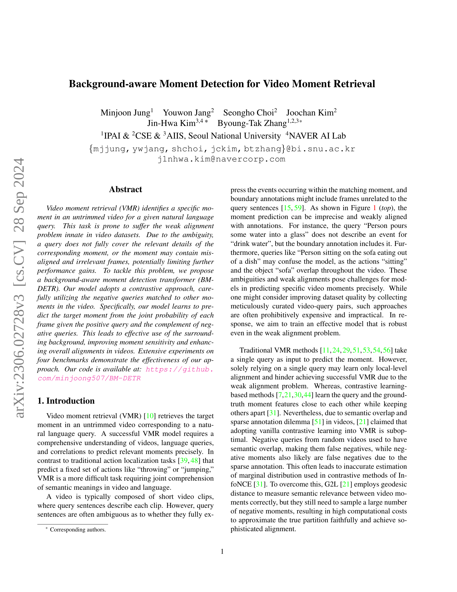
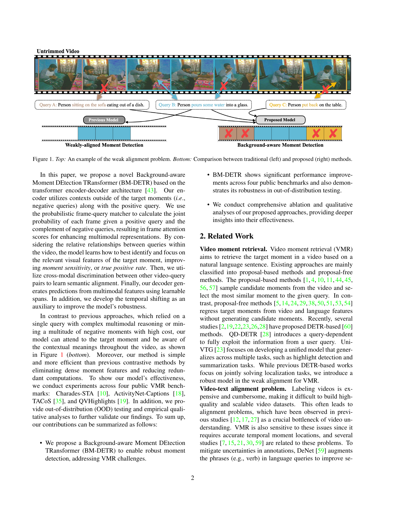
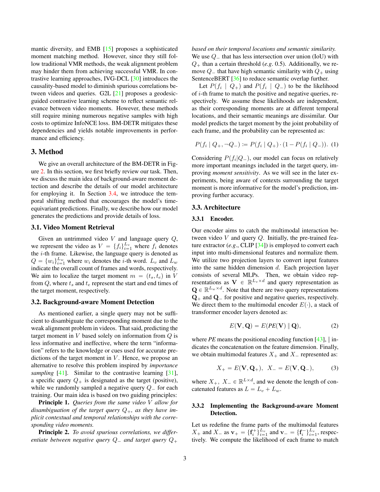
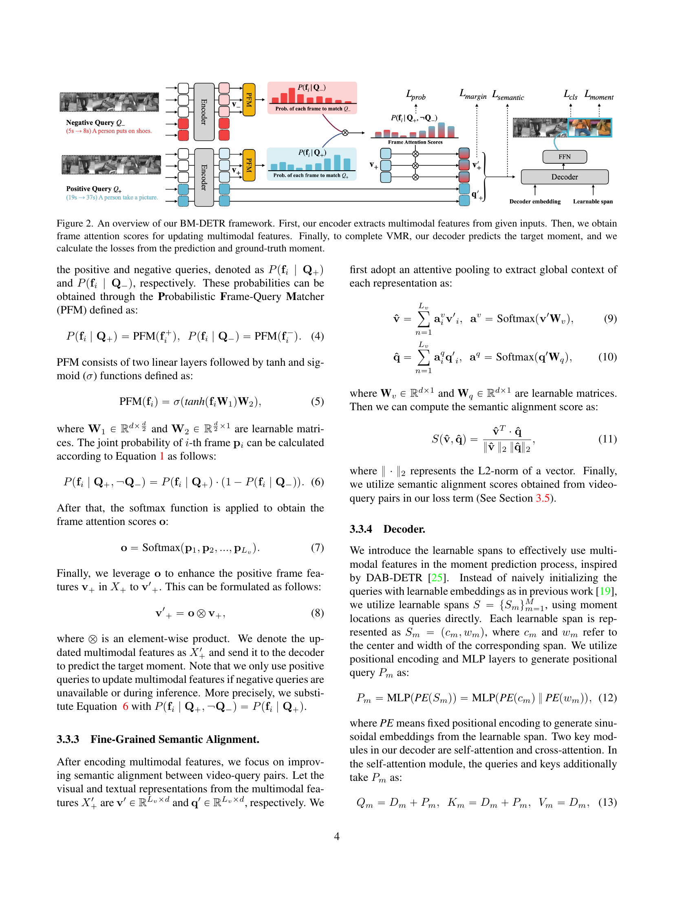
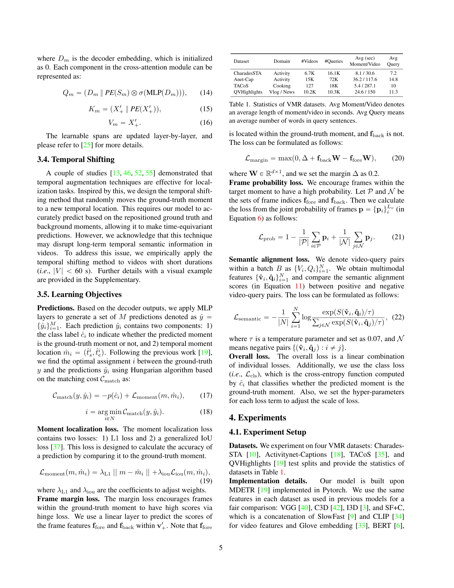
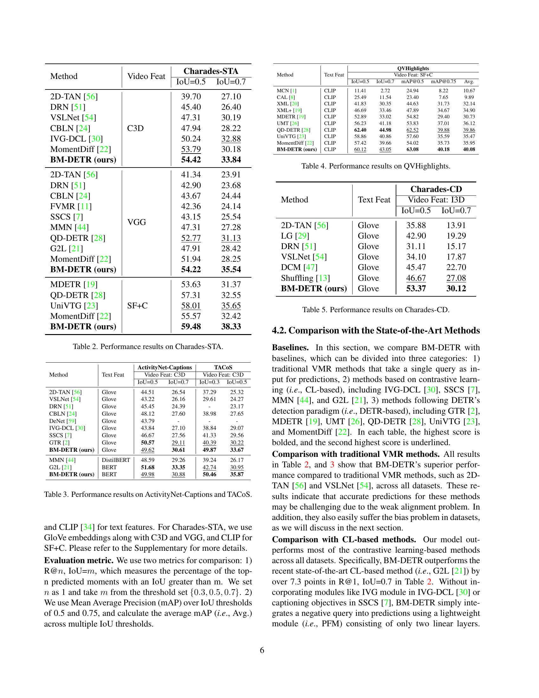
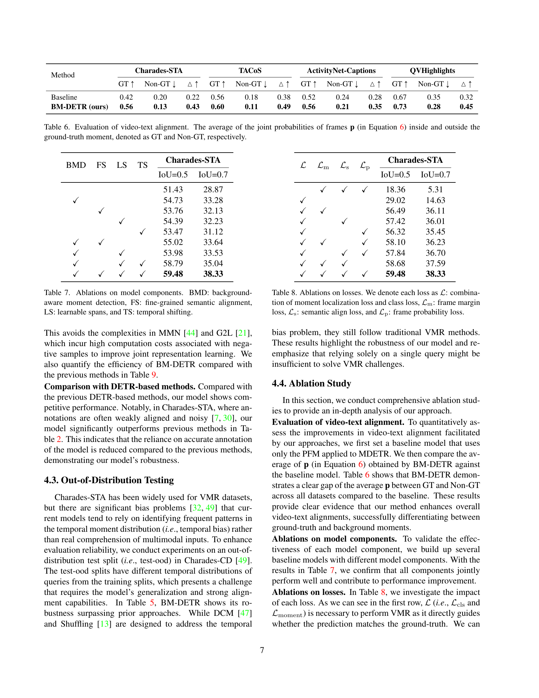
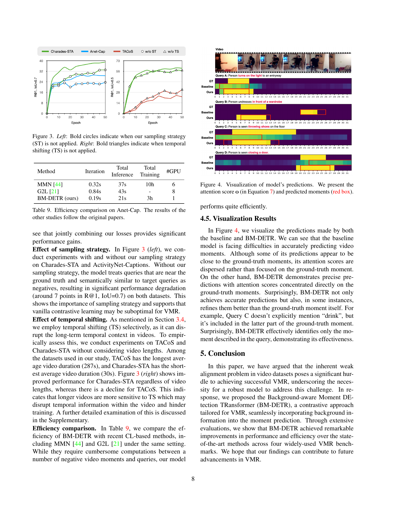
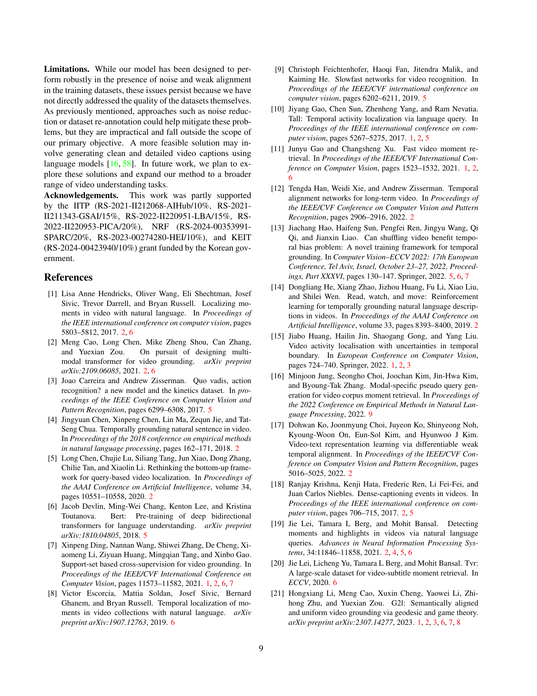
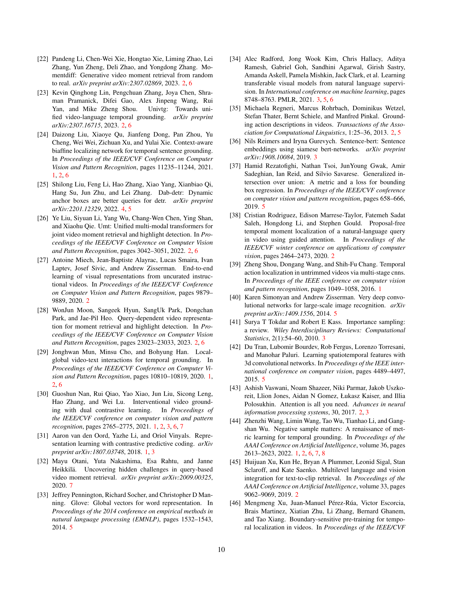
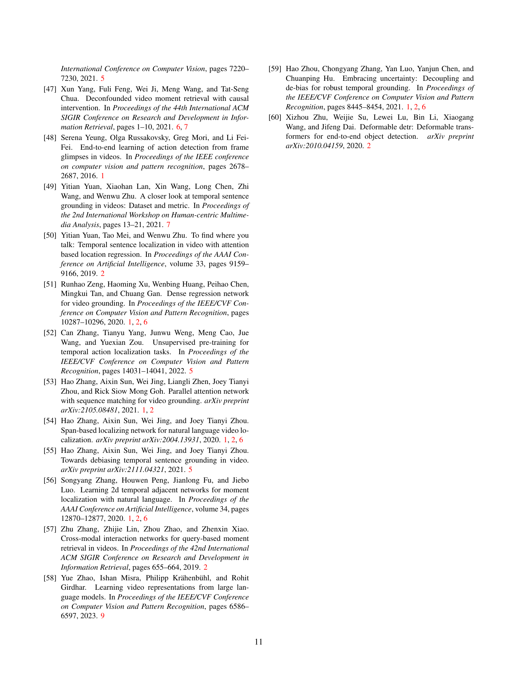
