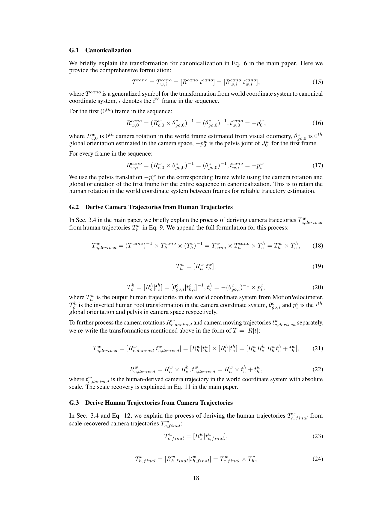

 


 2403.12959 
 Wanqi Yin et el. 
 
 🤗 2025-02-24 
 



↗ arXiv


↗ Hugging Face


↗ Papers with Code


### TL;DR



기존의 인간 자세 및 형태 추정(EHPS) 방법들은 주로 카메라 좌표계에 국한되어 움직이는 카메라와 피사체를 동시에 다루는 데 어려움이 있었습니다. 특히 3D 궤적을 추정하는 데 필요한 깊이 정보가 부족하여 정확한 스케일을 복원하는 것이 어려웠습니다. 이러한 문제는 3D-to-2D 투영 과정에서 중요한 공간 정보가 손실되기 때문입니다.

본 논문에서는 세계, 사람, 카메라 간의 상호작용을 활용하여 이 문제를 해결하는 새로운 프레임워크인 WHAC를 제시합니다. WHAC는 카메라 프레임 SMPL-X 추정 방법을 통해 절대적인 사람의 깊이를 복원하고, 인간의 움직임이 본질적으로 절대적인 공간적 단서를 제공한다는 점을 활용합니다. 또한, 정확하게 주석이 달린 사람과 카메라 데이터를 포함하는 새로운 합성 데이터셋인 WHAC-A-Mole을 공개하여 모델 성능 평가를 향상시켰습니다. 실험 결과는 WHAC의 우수한 성능을 보여주며, 코드와 데이터셋을 공개하여 향후 연구에 기여할 것입니다.



#### Key Takeaways


 단일 카메라 비디오를 사용하여 세계 좌표계에서 사람과 카메라의 궤적을 정확한 스케일로 추정하는 새로운 방법 제시 



 기존 방법의 한계를 극복하는 정확하고 효율적인 솔루션 제공을 위한 새로운 합성 데이터셋(WHAC-A-Mole) 공개 



 다양한 벤치마크 실험을 통해 우수한 성능을 검증하며, 세계 좌표계 기반의 인간 동작 및 카메라 움직임 추정 기술 발전에 기여 


#### Why does it matter?
이 논문은 **단일 카메라 비디오만을 사용하여 세계 좌표계에서 정확한 스케일로 사람과 카메라의 궤적을 추정**하는 새로운 방법을 제시함으로써 컴퓨터 비전 연구자들에게 중요한 의미를 가집니다. 기존의 방법들이 갖고 있던 제한점들을 극복하고, **합성 데이터셋을 통해 더욱 정확하고 효율적인 모델 학습**을 가능하게 합니다. 또한, **새로운 연구 방향을 제시**하여, 향후 연구자들이 세계 좌표계 기반의 인간 동작 및 카메라 움직임 추정 기술을 더욱 발전시키는데 도움을 줄 것입니다.

------
#### Visual Insights

> 🔼 그림 1은 제안된 WHAC 프레임워크가 세계 좌표계에서 사람과 카메라의 궤적을 생성하기 위해 세 가지 요소(카메라 프레임 SMPL-X 추정, 시각적 오도메트리, 그리고 제안된 MotionVelocimeter)를 어떻게 통합하는지 보여줍니다.  카메라 프레임 SMPL-X 추정은 사람의 자세와 모양을 카메라 좌표계에서 추정합니다. 시각적 오도메트리는 카메라의 움직임을 나타내는 궤적을 제공하고, MotionVelocimeter는 사람의 움직임에서 얻은 공간적 단서를 활용하여 세계 좌표계에서 사람의 움직임을 추정합니다. 이 세 가지 정보를 결합하여 WHAC는 사람의 움직임과 카메라의 움직임 모두를 세계 좌표계에서 정확한 스케일로 복원합니다.
> 

> 
read the caption

> Figure 1: WHAC synergizes human-camera (camera-frame SMPL-X estimation), camera-world (visual odometry), and human-world (our proposed MotionVelocimeter) modeling for constructing world-grounded human and camera trajectories.
> 


| Dataset | #Inst. | #Seq. | R/S | Multi. | Track. | Contact | HHI | Camera | Human |
|---|---|---|---|---|---|---|---|---|---| 
| 3DPW [41] | 74.6K | 60 | R | ✓ | × | × | ✓ | Moving | SMPL |
| RICH [16] | 476K | 141 | R | ✓ | ✓ | ✓ | ✓ | Static* | SMPL |
| HCM [21] | ‡ | 25 | S | ✓ | ‡ | × | × | Moving | SMPL |
| EMDB [19] | 109K | 81 | R | × | N.A. | × | N.A. | Moving | SMPL |
| EgoBody† [47] | 175K | 125 | R | ✓ | ✓ | × | ✓ | Moving | SMPL-X |
| BEDLAM [3] | 951K | 10.4K⋄ | S | ✓ | ✓ | × | × | Static | SMPL-X |
| SynBody [42] | 2.7M | 27K⋄ | S | ✓ | ✓ | × | × | Static | SMPL-X |
| WHAC-A-Mole | 1.46M | 2434 | S | ✓ | ✓ | ✓ | ✓ | Moving | SMPL-X |

> 🔼 표 1은 다양한 인체 동작 데이터셋을 비교 분석한 표입니다.  #Inst.는 사람의 수 (영상 자르기 단위), #Seq.는 비디오 시퀀스 수, R/S는 실제/합성 데이터 여부, Multi.는 여러 사람이 등장하는 장면 유무, Track.은 ID 추적 레이블 존재 여부, HHI는 사람 간 상호 작용 동작 유무를 나타냅니다. †는 EgoSet, ‡는 논문 작성 시점에 데이터가 공개되지 않아 알 수 없는 항목, ⋄는 일반적으로 짧은(100프레임 미만) 클립임을 의미합니다.  각 데이터셋의 특징을 비교하여 WHAC-A-Mole 데이터셋의 우수성을 보여줍니다.
> 

> 
read the caption

> Table 1: Dataset Comparison. #Inst.: number of human instances (crops). #Seq.: number of video sequences. R/S: Real or Synthetic. Multi.: multiperson scenes. Track.: track ID labels. HHI: human-human interaction motions. ††\dagger†: EgoSet. ‡‡\ddagger‡: unknown as the data is not released when this paper is written. ⋄⋄\diamond⋄: typically short (<100 frames) clips.
> 

### In-depth insights

#### World-Grounded EHPS
본 논문에서 제시된 "World-Grounded EHPS"는 기존의 카메라 중심의 EHPS(Expressive Human Pose and Shape Estimation) 방식의 한계를 극복하기 위한 새로운 접근법입니다. **기존 방식은 카메라 좌표계 내에서만 인간의 자세와 형태를 추정**하기 때문에, **카메라와 피사체가 동시에 움직이는 역동적인 상황에서는 정확한 3D 궤적을 복원하는 데 어려움**을 겪습니다.  반면 World-Grounded EHPS는 **세계 좌표계에서 인간과 카메라의 궤적을 정확한 스케일로 추정**하는 것을 목표로 합니다. 이를 위해 **세계, 인간, 카메라라는 세 가지 주요 요소 간의 상호작용**을 활용합니다.  **카메라 프레임 SMPL-X 추정 방식**을 통해 절대적인 인간의 깊이를 복원하고, **인간의 움직임이 제공하는 절대적인 공간 정보**를 통합하여 보다 정확하고 표현력 있는 인간 자세 및 형태 추정을 가능하게 합니다.  **새로운 합성 데이터셋**을 통해 다양한 상호작용 동작과 사실적인 카메라 궤적을 제공함으로써, 이러한 방식의 성능을 더욱 효과적으로 평가할 수 있도록 합니다.  즉, **단순한 카메라 관점에서 벗어나 세계 좌표계를 기반으로 인간과 카메라의 상호작용을 포괄적으로 고려**함으로써, 보다 현실적이고 정확한 인간 자세 및 형태 추정을 달성하는 것이 World-Grounded EHPS의 핵심 목표입니다.

#### WHAC Framework
WHAC 프레임워크는 단일 카메라 비디오로부터 세계 좌표계에서 정확한 스케일을 가진 사람과 카메라의 궤적을 추정하는 문제를 해결하기 위한 혁신적인 시도입니다.  **세계, 사람, 카메라**라는 세 가지 주요 요소 간의 상호작용을 이용하여, 기존의 어려운 최적화 기법에 의존하지 않고 **카메라 프레임 SMPL-X 추정과 시각적 오도메트리**를 결합하는 독창적인 접근 방식을 제시합니다.  **카메라 프레임 SMPL-X 추정을 통해 절대적인 사람의 깊이 정보를 얻고, 사람의 움직임 자체가 절대적인 공간적 단서를 제공한다는 점**에 착안하여, 이러한 통찰력을 통합하는 것이 핵심입니다.  **새로운 합성 데이터셋인 WHAC-A-Mole**을 제시하여 다양한 상호작용적 인간 움직임과 현실적인 카메라 궤적을 포함한 정확한 주석 데이터를 제공하며, 이를 통해 다양한 벤치마크에서 우수한 성능을 입증합니다.  **전체적으로 WHAC 프레임워크는 세계 좌표계에서의 표현력 있는 인간 자세 및 형태 추정과 카메라 자세 추정을 동시에 수행하는 효율적이고 정확한 방법**을 제시하며,  향후 연구 및 응용 분야에 중요한 기여를 할 것으로 예상됩니다.

#### WHAC-A-Mole Dataset
본 논문에서 제시된 WHAC-A-Mole 데이터셋은 **합성 데이터**임에도 불구하고, **다양한 상호작용, 역동적인 움직임, 현실적인 카메라 궤적** 등을 포함하여 기존의 실제 데이터셋과 비교할 수 있을 만큼의 풍부한 정보를 제공한다는 점에서 주목할 만합니다.  **SMPL-X 모델 기반의 정확한 휴먼 포즈 및 모양, 다양한 카메라 움직임**을 포함하여 **세밀한 주석**이 부여되어 있어, 세계 좌표계 기반의 표현력 있는 휴먼 포즈 및 모양 추정(EHPS) 모델의 성능 평가에 유용하게 활용될 수 있습니다.  특히, **다양한 종류의 인간 행동(AMASS, DD100, DLP-MoCap)**을 포함하고 **영화 촬영 기법을 모방한 현실적인 카메라 궤적**을 제공함으로써, 모델의 일반화 능력 및 실제 환경 적용 가능성을 평가하는 데 도움이 될 것으로 예상됩니다.  **정교한 카메라 움직임 생성 방법** 또한 제시되어 있어, 향후 합성 데이터셋 생성 연구에도 중요한 참고 자료가 될 수 있습니다.  하지만 **합성 데이터의 한계**로 인해 실제 데이터셋에서 발생할 수 있는 **잡음이나 예외적인 상황**을 완벽하게 반영하지 못할 수 있다는 점은 고려해야 할 부분입니다.

#### Benchmark Analyses
본 논문의 벤치마크 분석 부분은 제안된 방법의 우수성을 입증하기 위해 **다양한 기준과 척도**를 사용하여 수행되었을 것입니다.  기존의 최첨단(SOTA) 방법들과의 비교를 통해 **정량적 성능 비교**를 제시하며, 특히 **정확도와 효율성** 측면에서의 비교가 중요할 것입니다.  여기에는 정밀도, 재현율, F1-스코어와 같은 일반적인 지표뿐 아니라, **문제의 특수성을 고려한 특정 지표**들도 포함될 수 있습니다. 예를 들어, 인체 자세 추정의 경우 관절 위치 오차, 3D 자세 정확도 등이 사용될 수 있고, 카메라 자세 추정의 경우에는 추정된 궤적의 정확도와 일관성 등을 평가하는 지표가 사용될 수 있습니다.  또한, **실험 결과의 시각적 분석**을 통해 제안된 방법의 장점과 한계를 보다 명확하게 제시했을 것으로 예상되며, 특히 **실제 환경 데이터**에서의 성능 비교는 중요한 의미를 가집니다.  **합성 데이터셋을 사용한 실험** 결과는 모델의 일반화 성능과 견고성을 평가하는 데 도움이 되었을 것입니다.  전반적으로, 벤치마크 분석은 제안된 방법의 실용성과 효과성을 객관적으로 평가하고, 향후 연구 방향을 제시하는 데 중요한 역할을 수행했을 것입니다.

#### Future of WHAC
WHAC의 미래는 **더욱 정교하고 강력한 세계 기반 표현형 인간 자세 및 형태 추정(EHPS) 시스템**으로의 발전에 달려 있습니다.  이는 **더욱 다양하고 복잡한 시나리오**를 처리할 수 있도록 모델의 강건성과 일반화 능력을 향상시키는 것을 의미합니다.  예를 들어, **다중 인물 상호 작용, 심각한 폐색, 역동적인 조명 조건** 등을 더 잘 처리하는 알고리즘 개발이 중요합니다. 또한, **합성 데이터의 품질과 다양성을 개선**하여 보다 현실적인 시나리오에서 모델의 성능을 향상시키는 것도 필요합니다.  **실시간 성능 최적화**는 WHAC의 실세계 적용 가능성을 높이는 중요한 과제입니다.  마지막으로, **개인 정보 보호** 및 **윤리적 고려 사항**에 대한 주의 깊은 고려는 WHAC의 지속 가능한 발전에 필수적입니다. 이러한 과제들을 해결함으로써, WHAC는 **엔터테인먼트, 의료, 보안 등 다양한 분야에서 혁신적인 응용 프로그램**을 가능하게 할 수 있을 것입니다.

### More visual insights

More on figures

> 🔼 그림 2는 제안된 WHAC 프레임워크의 개요를 보여줍니다. 먼저, 카메라 프레임 기반의 SMPL-X 추정기를 사용하여 더미 깊이 값을 가진 SMPL-X 매개변수를 추출합니다. 이후 3.2절에서 설명하는 방법으로 실제 깊이 값을 복원합니다. 그 다음, 시각적 오도메트리(VO)를 사용하여 추정된 스케일이 없는 카메라 궤적을 이용해 3.3절에서 설명하는 방식으로 사람의 궤적을 정규화하여 속도와 스케일을 추정합니다.  마지막으로, 정렬 및 스케일 복구를 위해 새로운 카메라 궤적을 도출하고, 이를 이용해 3.4절에서 설명하는 방식으로 사람의 궤적을 업데이트합니다.  즉, 세계 좌표계에서 정확한 스케일을 가진 사람과 카메라 궤적을 추정하는 과정을 단계별로 보여줍니다.
> 

> 
read the caption

> Figure 2: Overview of WHAC. SMPL-X estimator extracts camera-frame SMPL-X with dummy depth, which is recovered in Sec. 3.2. The scaleless camera trajectory estimated by VO is then used to canonicalize the human trajectory to estimate its velocity and thus scale in Sec. 3.3. A camera trajectory is then derived for alignment and scale recovery, which subsequently updates the human trajectory in Sec. 3.4.
> 

> 🔼 그림 3은 카메라 궤적의 스케일이 다를 때 동일한 카메라 프레임의 사람 깊이(dt)와 변환(tch)을 사용하더라도 사람 궤적(H)이 모양과 방향이 크게 달라질 수 있음을 보여줍니다.  (a)는 스케일 차이에 따른 사람 궤적의 변화를, (b)는 초점 거리(f)와 깊이(tz)의 서로 다른 조합이 동일한 이미지를 생성할 수 있음을 시각적으로 보여줍니다.  이는 카메라 궤적의 스케일 추정이 얼마나 중요한지를 강조합니다.
> 

> 
read the caption

> Figure 3: a) Human trajectories H𝐻Hitalic_H derived from camera trajectories C𝐶Citalic_C of different scales can be vastly different in both shape and direction, despite that the same camera-frame human root depth dtsubscript𝑑𝑡d_{t}italic_d start_POSTSUBSCRIPT italic_t end_POSTSUBSCRIPT and translations thcsubscriptsuperscript𝑡𝑐ℎt^{c}_{h}italic_t start_POSTSUPERSCRIPT italic_c end_POSTSUPERSCRIPT start_POSTSUBSCRIPT italic_h end_POSTSUBSCRIPT are used. b) Different pairs of focal length f𝑓fitalic_f and tzsubscript𝑡𝑧t_{z}italic_t start_POSTSUBSCRIPT italic_z end_POSTSUBSCRIPT can correspond to the same image.
> 

> 🔼 그림 4는 WHAC-A-Mole 데이터셋의 샘플 시퀀스들을 보여줍니다.  AMASS(a), DLP-MoCap(b-c), DD100(d-e) 데이터셋의 모션 데이터를 사용하여 애니메이션을 제작했습니다. 각 샘플의 첫 번째 줄은 전체적인 오버뷰를 보여주며, 카메라의 궤적은 밝은 선으로 표시되어 있습니다. 두 번째 줄과 세 번째 줄은 카메라의 시점과 SMPL-X 어노테이션이 오버레이된 이미지를 보여줍니다. 이 그림은 다양한 유형의 동작과 카메라 움직임을 보여주어,  WHAC-A-Mole 데이터셋의 다양성과 현실성을 강조합니다.
> 

> 
read the caption

> Figure 4: Visualization of WHAC-A-Mole sample sequences, animated with a) AMASS, b-c) DLP-MoCap, and d-e) DD100. In each sample, the first row depicts the overview (note the camera trajectory shown in bright rays), and the second and the third rows show the camera view and overlaid SMPL-X annotations.
> 

> 🔼 그림 5는 실제 환경에서 어려운 경우에 대한 시각화를 보여줍니다.  WHAC는 모션 정보만으로는 해결하기 어려운 경우 (예: a) 스케이트보딩, b) 러닝머신)에 대해 사람-카메라-장면 간의 상호 작용을 활용하여 해결합니다. c)는 WHAC이 빠른 움직임도 처리할 수 있음을 보여줍니다.
> 

> 
read the caption

> Figure 5: Visualization on in-the-wild hard cases. WHAC leverages human-camera-scene collaboration to resolve cases where motion prior alone would fail: a) Skateboarding and b) Treadmill. c) WHAC can also handle fast cases.
> 

> 🔼 그림 6은 EMDB 데이터셋에서 세계 좌표계 기반의 결과를 시각화한 것입니다. a1)과 b1)은 카메라 궤적을, a2)와 b2)는 사람의 궤적을 보여줍니다. 특히 b 시퀀스에서 사람이 계단을 내려오는 모습을 보여주는데, WHAC는 사람의 하강 방향을 정확하게 나타내는 전역 궤적을 효과적으로 포착하고 세계 좌표계에서 절대적인 궤적 크기를 복원합니다. 플롯의 격자 크기는 2m입니다.
> 

> 
read the caption

> Figure 6: Visualization of world space results on the EMDB dataset. a1) and b1) depict camera trajectories, while a2) and b2) illustrate human trajectories. Notably, in sequence b, the human is descending stairs, and WHAC effectively captures the global trajectory, indicating a downward direction besides recovering the absolute trajectory scale in the world space. The grid size in the plots is 2m.
> 

> 🔼 그림 7은 WHAC-A-Mole 데이터셋에서 카메라 공간 결과를 시각화한 것입니다. 각 샘플은 두 행으로 구성되는데, 첫 번째 행은 시퀀스의 원본 입력 프레임을, 두 번째 행은 SMPL-X 결과를 겹쳐서 보여줍니다. 이 시각화는 심각한 폐색, 복잡한 인간 상호 작용, 역동적인 춤 동작 등의 어려운 장면에서 WHAC의 성능을 보여줍니다.  다양한 시나리오(심각한 폐색, 복잡한 상호작용, 역동적인 춤 동작 포함)에서 WHAC의 성능을 보여주는 다양한 시각적 예시를 제공합니다.
> 

> 
read the caption

> Figure 7: Visualization of camera space results on WHAC-A-Mole dataset. Each sample comprises two rows: the first row displays the original input frames from the sequence, while the second row overlays the SMPL-X results. This visualization showcases WHAC’s performance on challenging scenes, including sequences with severe occlusions, intricate human interactions, and dynamic dancing poses.
> 

> 🔼 그림 8은 논문의 3.3절 'Methodology'에 속한 'MotionVelocimeter' 모듈의 구조를 보여줍니다. SMPL-X 메시에서 회귀된 정규화된 3D 관절을 입력받아 정규화된 공간에서 루트 속도를 출력합니다.  이 모듈은 카메라 움직임의 스케일을 복구하는 데 중요한 역할을 합니다. 2D 키포인트를 입력으로 사용하는 WHAM과 달리 3D 관절 정보를 사용하여 세계 좌표계에서의 속도 추정을 향상시키고 복잡한 움직임 패턴을 더욱 포괄적으로 나타냅니다.
> 

> 
read the caption

> Figure 8: Illustration of MotionVelocimeter module. The inputs are canonicalized 3D joints regressed from SMPL-X meshes, and the outputs are root velocities in the canonical space.
> 

More on tables


| Method | PA-MPJPE ↓ | W-MPJPE ↓ | WA-MPJPE ↓ | H-ATE ↓ | H-AS | C-ATE ↓ | C-AS |
|---|---|---|---|---|---|---|---| 
| OSX* [24] + DPVO [39] | 90.1 | 1036.1 | 390.7 | 180.5 | 0.5 | 0.5 | 7.3 |
| SMPLer-X-B* [6] + DPVO [39] | 76.7 | 842.3 | 335.4 | 138.3 | 0.5 | 0.5 | 7.3 |
| WHAC (GT Gyro) | 76.5 | 343.8 | 182.0 | **103.5** | **0.9** | **0.5** | **1.3** |
| WHAC | **76.5** | **343.3** | **182.0** | **103.5** | **0.9** | **0.5** | **1.3** |
> 🔼 표 2는 WHAC-A-Mole 데이터셋에서 세계 좌표계를 기준으로 평가한 결과를 보여줍니다.  세계 좌표계 기반 평가에 맞춰 조정된 방법(* 표시)과,  카메라와 사람의 자세 정확도를 나타내는 지표(H-AS, C-AS)가 포함되어 있습니다. H-AS와 C-AS 값이 1.0에 가까울수록 더 정확한 결과를 의미합니다. 표에는 PA-MPJPE, W-MPJPE, WA-MPJPE, H-ATE, H-AS, C-ATE, C-AS 등의 다양한 평가 지표가 제시되어 있으며,  각 지표의 값은 제시된 방법들의 성능을 비교하는 데 사용됩니다.
> 

> 
read the caption

> Table 2: World-frame evaluation on WHAC-A-Mole. *: adapted to world-grounded evaluation. H-AS and C-AS: the closer to 1.0, the better.
> 


| Method | PA-MPJPE ↓ | W-MPJPE ↓ | WA-MPJPE ↓ | H-ATE ↓ | H-AS | C-ATE ↓ | C-AS |
|---|---|---|---|---|---|---|---| 
| GLAMR [45] | 56.0 | 756.1 | 286.2 | - | - | - | - |
| SLAHMR [43] | 61.5 | 807.4 | 336.9 | 207.8 | 1.9 | - | - |
| WHAM [35] (GT Gyro) | 41.9 | 436.4 | 165.9 | 83.2 | 1.5 | - | - |
| OSX-L* [24] + DPVO [39] | 99.9 | 1186.2 | 458.8 | 235.4 | 2.3 | **14.8** | 5.1 |
| SMPLer-X-B* [6] + DPVO [39] | 42.5 | 930.1 | 375.8 | 200.6 | 2.0 | **14.8** | 5.1 |
| WHAC (GT Gyro) | **39.4** | 392.5 | 143.1 | **75.8** | **1.1** | **14.8** | 1.5 |
| WHAC | **39.4** | **389.4** | **142.2** | 76.7 | **1.1** | **14.8** | **1.4** |
> 🔼 표 3은 EMDB2 데이터셋에 대한 world-frame 평가 결과를 보여줍니다.  * 표시는 world-grounded 평가에 맞춰 조정되었음을 나타냅니다.  H-AS와 C-AS는 1.0에 가까울수록 정확도가 높음을 의미합니다.  이 표는 다양한 방법(GLAMR, SLAHMR, WHAM, OSX, SMPLer-X, WHAC)의 world-frame human pose 및 camera trajectory 추정 성능을 평가한 결과를 보여줍니다.  특히, PA-MPJPE, W-MPJPE, WA-MPJPE, H-ATE, H-AS, C-ATE, C-AS와 같은 지표를 사용하여 정확도와 스케일 정확성을 측정합니다.
> 

> 
read the caption

> Table 3: World-frame evaluation on EMDB2. *: adapted to world-grounded evaluation. H-AS and C-AS: the closer to 1.0, the better.
> 


| Method | PA-MPJPE ↓ | PA-PVE-all ↓ | PVE-all ↓ | PVE-hand ↓ | PVE-face ↓ | Accl. ↓ |
|---|---|---|---|---|---|---|
| GLAMR [45] | 114.3 | - | - | - | - | 173.5 |
| SLAHMR [43] | 79.1 | - | - | - | - | 25.8 |
| Hand4Whole [28] | 71.0 | 59.8 | 127.6 | 48.0 | 41.2 | 27.2 |
| OSX-L [24] | 66.5 | 54.6 | 115.7 | 50.5 | 41.0 | 24.7 |
| SMPLer-X-B [6] | 47.1 | 40.7 | 72.7 | 43.7 | 32.4 | 18.9 |
| **WHAC** | **46.9** | **39.0** | **64.7** | **41.0** | **26.3** | **11.6** |
> 🔼 표 4는 SMPL-X 기반의 전체 신체(전신) 방법에 대해서만 PVE 변형을 측정하여 EgoBody(EgoSet) 데이터셋에서 카메라 프레임 방법의 결과를 보여줍니다.  표에는 PA-MPJPE, PA-PVE-all, PVE-all, PVE-hand, PVE-face 및 Accl.과 같은 다양한 지표들이 포함되어 있으며, 각 지표는 추정된 자세의 정확도를 다양한 측면에서 평가합니다.  PA-MPJPE는 Procrustes 정렬된 MPJPE (Mean Per Joint Position Error)를 나타내고, PVE는 버텍스 오차(Per Vertex Error), Accl.은 가속도 오차(Acceleration Error)를 의미합니다.  PVE 변형은 손과 얼굴을 포함하여 신체의 전반적인 자세 정확도를 보다 세부적으로 평가합니다.
> 

> 
read the caption

> Table 4: Results of camera-frame methods on EgoBody (EgoSet) with SMPL-X ground truths. PVE variants are measured for whole-body (SMPL-X) methods only.
> 


| Method | EMDB1 [19] |  |  |  | 3DPW [41] |  |  |  | 
|---|---|---|---|---|---|---|---|---| 
| PA-PVE ↓ | PVE ↓ | T-PVE ↓ | Accl. ↓ | PA-PVE ↓ | PVE ↓ | T-PVE ↓ | Accl. ↓ | 
|---|---|---|---|---|---|---|---|---| 
| Hand4Whole [28] | 99.5 | 143.1 | 36851.8 | 34.2 | 81.7 | 124.7 | 30279.0 | 31.0 |
| OSX-L [24] | 93.3 | 134.0 | 45526.0 | 30.3 | 76.9 | 117.8 | 38472.2 | 24.9 |
| SMPLer-X-B [6] | 68.2 | 99.3 | 41298.0 | 24.4 | 62.6 | 95.6 | 32532.0 | 24.8 |
| WHAC | 61.0 | 91.2 | 140.2 | 18.4 | 62.8 | 91.9 | 260.8 | 20.3 |
> 🔼 표 5는 EMDB1 및 3DPW 데이터셋에 대한 추가적인 카메라 프레임 평가 결과를 보여줍니다. 기존의 주류 EHPS 방법들과 비교하여 WHAC는 의미있는 사람의 깊이(T-PVE)를 복원하고 더 낮은 가속도 오차(Accl.)를 달성합니다.  즉, 기존 방법들보다 사람의 3차원 위치 정확도가 높고, 움직임의 부드러움도 향상되었음을 의미합니다.
> 

> 
read the caption

> Table 5: More camera-frame evaluations on EMDB1 and 3DPW. Compared to existing mainstream EHPS methods, WHAC recovers meaningful human depths (T-PVE) and achieves lower acceleration errors (Accl.).
> 


| Method | PA-MPJPE ↓ | PA-PVE-all ↓ | PVE-all ↓ | PVE-hand ↓ | PVE-face ↓ | Accl. ↓ |
|---|---|---|---|---|---|---|
| OSX-L [24] | 90.1 | 88.1 | 155.7 | 83.3 | 85.0 | 38.9 |
| SMPLer-X-B [6] | 76.7 | 74.8 | 116.2 | 70.6 | 63.1 | 44.0 |
| WHAC | 76.5 | 74.8 | 117.8 | 77.7 | 63.2 | 31.2 |
> 🔼 표 6은 WHAC-A-Mole 데이터셋에서 카메라 프레임 기반 방법들의 결과를 보여줍니다. 가속도 오차를 제외하고는 WHAC의 성능이 SMPLer-X와 유사함을 보여줍니다.  WHAC는 가속도 오차가 더 낮은 것을 확인할 수 있습니다. 이는 WHAC가 시간적 일관성을 더 잘 유지한다는 것을 시사합니다.
> 

> 
read the caption

> Table 6: Results of camera-frame methods on WHAC-A-Mole. WHAC is on par with SMPLer-X but produces a lower acceleration error.
> 


| Method | WA-MPJPE↓ | H-ATE↓ | C-ATE↓ | C-AS |
|---|---|---|---|---|
| DPVO | 376.0 | 177.8 | **14.8** | 5.10 |
| MV | 233.2 | 129.9 | 134.1 | **1.10** |
| MV + DPVO | **142.2** | **76.7** | **14.8** | 1.40 |
> 🔼 표 7은 WHAC 모델의 주요 구성 요소에 대한 ablation study 결과를 보여줍니다. DPVO는 시각적 오도메트리(visual odometry), MV는 MotionVelocimeter를 나타냅니다.  표에는 DPVO, MV, 그리고 두 가지 모두를 사용한 경우의 WA-MPJPE, H-ATE, C-ATE, C-AS 값이 제시되어 있습니다. 이를 통해 각 구성 요소가 WHAC 모델의 성능에 미치는 영향을 정량적으로 분석하고, 최적의 구성을 확인할 수 있습니다. WA-MPJPE는 세계 좌표계에서의 평균 관절 위치 오차, H-ATE는 사람의 궤적 오차, C-ATE는 카메라 궤적 오차, C-AS는 카메라 궤적의 스케일 정확도를 나타냅니다.
> 

> 
read the caption

> Table 7: Ablation on key components. DPVO represents visual odometry, MV represents MotionVelocimeter.
> 


| Metric | T-MPJPE ↓ | W-MPJPE ↓ | WA-MPJPE ↓ |
|---|---|---|---| 
| Dummy(5,000) | 36020.4 | 6239.9 | 604.6 |
| Assumed [20] | 179.7 | 391.2 | 144.0 |
| GT | **100.3** | **389.4** | **142.2** |
> 🔼 표 8은 카메라의 내부 매개변수(intrinsic parameters)가 사람의 몸통(root) 위치 추정에 미치는 영향을 보여줍니다.  합리적인 내부 매개변수를 사용하면 사람의 몸통 위치 추정 성능이 크게 향상됨을 보여주는 실험 결과를 제시합니다.  구체적으로는, 다양한 내부 매개변수 설정(임의의 값, 추정된 값, 실제 값) 하에서  T-MPJPE, W-MPJPE, WA-MPJPE 에 대한 결과를 비교 분석합니다.  이를 통해 내부 매개변수의 정확성이 결과에 얼마나 중요한 영향을 주는지 확인할 수 있습니다.
> 

> 
read the caption

> Table 8: Ablation on intrinsic sources. A reasonable intrinsic drastically improve human root translation estiamtion.
> 


| Method | GLAMR[45] | SLAHMR[43] | PACE[21] | WHAM[35] | WHAC | WHAC* |
|---|---|---|---|---|---|---|
| FPS | 2.4 | 0.04 | 2.1 | 200 | 165 | 2500 |
> 🔼 표 8은 카메라 내부 매개변수의 영향을 평가한 실험 결과를 보여줍니다.  정확한 내부 매개변수(초점거리 등)를 사용했을 때, 사람의 몸통 위치 추정의 정확도가 크게 향상됨을 보여줍니다.  이는 정확한 내부 매개변수가 3D 공간에서 사람의 위치를 더 정확하게 추정하는 데 중요한 역할을 한다는 것을 시사합니다.
> 

> 
read the caption

> Table 8: Ablation on intrinsic sources. A reasonable intrinsic drastically improve human root translation estiamtion.
> 

### Full paper



