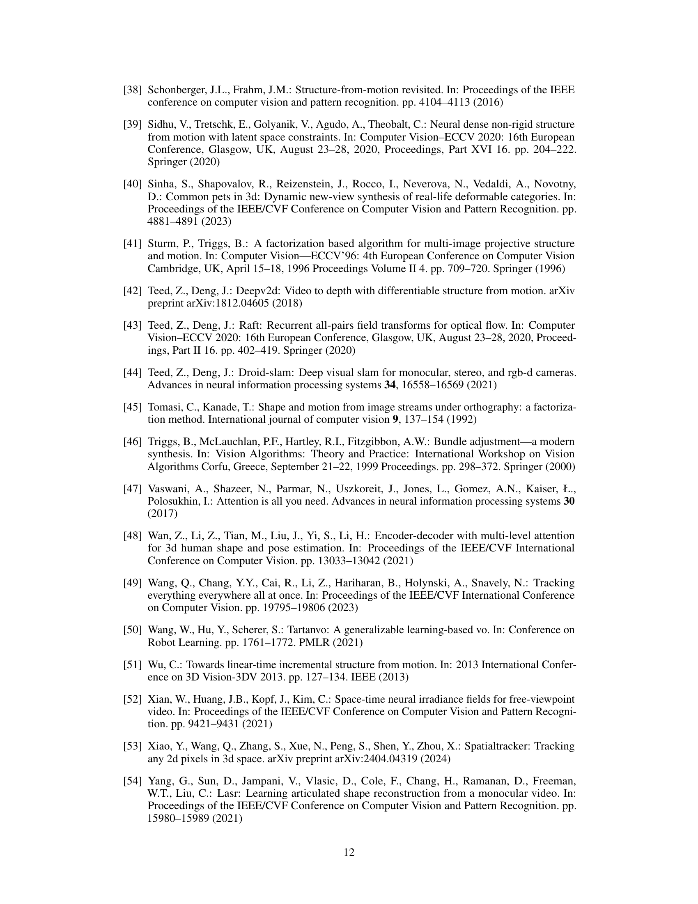
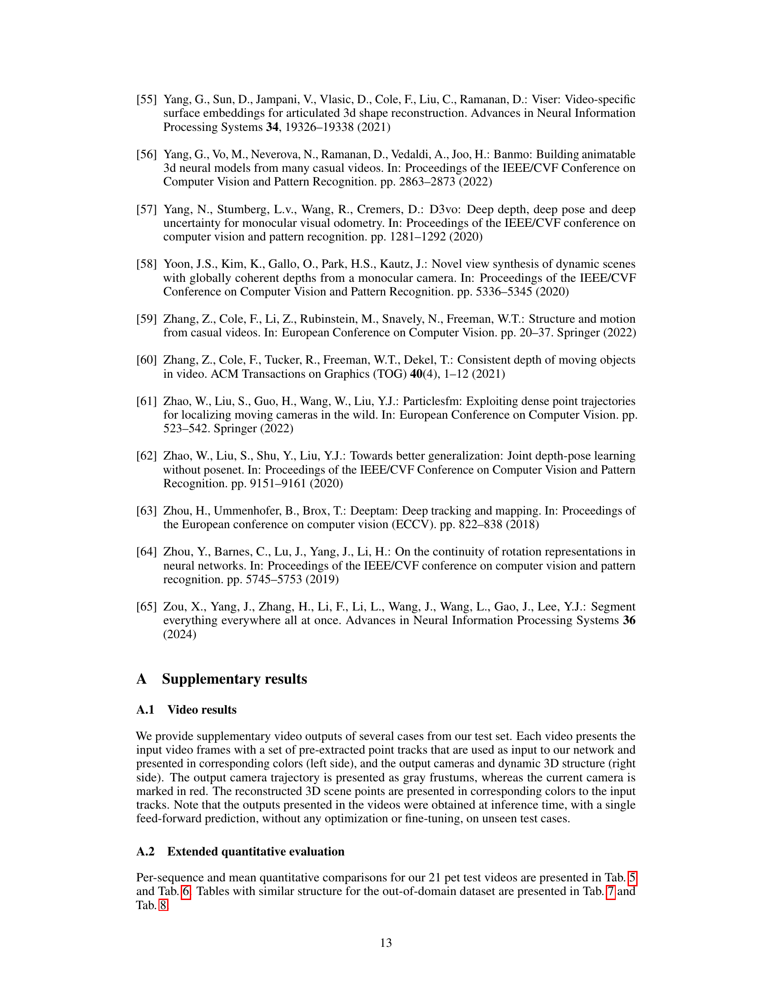

 


 2404.07097 
 Yoni Kasten et el. 
 
 🤗 2025-02-03 
 



↗ arXiv


↗ Hugging Face


↗ Papers with Code


### TL;DR



**3D 환경 재구성은 자율 주행 및 로봇 공학 등 다양한 분야에서 중요하지만, 움직이는 물체가 있는 비정형 동영상으로부터 3D 정보를 추출하는 것은 오랫동안 어려운 문제였습니다.**  기존의 방법들은 계산량이 많고 특정 조건에 의존적이거나, 정확도가 떨어지는 문제가 있었습니다. 특히, 일반적인 카메라로 촬영된 자연스러운 동영상에 적용하기 어려웠습니다.

본 논문은 이러한 문제를 해결하기 위해 **TRACKSTO4D라는 새로운 딥러닝 기반 접근 방식을 제시합니다.** TRACKSTO4D는 동영상에서 추출된 2D 포인트 트랙을 직접 처리하여 효율성을 높이고, 움직임 패턴을 저차원 근사를 통해 효과적으로 표현합니다. **비지도 학습을 통해 훈련된 TRACKSTO4D는 기존 최첨단 방법과 비슷한 정확도를 유지하면서 처리 시간을 최대 95%까지 줄였습니다.** 이는 다양한 종류의 동영상에 적용 가능하며, 새로운 영상 분류에도 잘 일반화됩니다.



#### Key Takeaways


 비정형 동영상의 움직이는 콘텐츠에서 3D 구조와 카메라 위치를 효율적으로 추론하는 학습 기반 방법 제시 



 2D 포인트 트랙을 직접 처리하여 효율성과 일반화 성능을 높임 



 최첨단 방법에 필적하는 정확도를 유지하면서 처리 시간을 최대 95%까지 단축 


#### Why does it matter?
**본 논문은 비정형 동영상으로부터 3D 구조를 빠르게 재구성하는 새로운 방법을 제시하여, 기존의 어려움을 극복하고 연구 분야에 큰 영향을 미칠 것으로 예상됩니다.** 이는 효율적인 처리와 일반화 성능 향상을 통해 자율 주행, 로봇 내비게이션 등 다양한 분야에 적용 가능성을 높입니다. 또한 제안된 방법의 성능과 한계, 향후 연구 방향을 제시하여 관련 연구자들에게 유용한 정보를 제공합니다.  **특히, 기존의 복잡하고 시간 소모적인 방법들과 비교하여 효율성을 크게 개선한 점은 높이 평가할 만합니다.**

------
#### Visual Insights

> 🔼 그림 1은 TRACKSTO4D의 개념을 보여줍니다. 이 방법은 일상적인 동적 비디오에서 추출된 2D 점 트랙 집합을 해당 3D 위치와 카메라 움직임에 매핑하는 방법입니다. 추론 시 네트워크는 단일 순방향 전달을 통해 동적 구조와 카메라 움직임을 예측합니다. 네트워크는 입력으로 2D 점 트랙 집합(왼쪽)을 받고 시간 차원과 트랙 차원을 번갈아 가며 여러 다중 헤드 어텐션 계층을 사용합니다(가운데). 네트워크는 카메라, 프레임별 3D 점, 전역 점 이동 값을 예측합니다(오른쪽). 3D 점의 내부 색상은 예측된 3D 이동 수준 값을 나타내며, 3D 이동이 높은/낮은 점은 각각 빨간색/보라색으로 표시됩니다. 이러한 출력은 재투영 오류 손실을 계산하기 위해 예측된 점을 프레임에 재투영하는 데 사용됩니다. 자세한 내용은 본문을 참조하세요. 보충 비디오 시각화를 시청하는 것이 좋습니다.
> 

> 
read the caption

> Figure 1: We present TracksTo4D, a method for mapping a set of 2D point tracks extracted from casual dynamic videos into their corresponding 3D locations and camera motion. At inference time, our network predicts the dynamic structure and camera motion in a single feed-forward pass. Our network takes as input a set of 2D point tracks (left) and uses several multi-head attention layers while alternating between the time dimension and the track dimension (middle). The network predicts cameras, per-frame 3D points, and per-world point movement value (right). The 3D point internal colors illustrate the predicted 3D movement level values, such that points with high/low 3D motion are presented in red/purple colors respectively. These outputs are used to reproject the predicted points into the frames for calculating the reprojection error losses. See details in the text. The reader is encouraged to watch the supplementary video visualizations.
> 


| Method | Abs Rel ↓ | δ<1.25 ↑ | δ<1.25² ↑ | δ<1.25³ ↑ | ATE ↓ | RPE Trans ↓ | RPE Rot ↓ | Time (min) |
|---|---|---|---|---|---|---|---|---|
| D-SLAM [44] | - | - | - | - | - | - | - | 0.16 |
| ParticleSFM [61] | - | - | - | - | - | - | - | 11.00 |
| RCVD [22] | 3.6E+07 | 0.43 | 0.75 | 0.92 | 0.90 | 0.96 | 20.00 |
| CasualSAM [59] | **0.06** | **0.97** | **0.99** | **1.00** | **0.99** | **1.00** | 1.3E+02 |
| MiDaS [4] | 6.2E+04 | 0.78 | 0.97 | **1.00** | 0.88 | 0.93 | **0.15** |
| Ours (C) | 0.08 | 0.92 | 0.99 | **1.00** | 0.98 | **1.00** | 0.15 |
| Ours (C)+BA | 0.08 | 0.92 | 0.99 | **1.00** | 0.98 | **1.00** | **0.15** |
| Ours (C)+FT | **0.06** | 0.96 | **1.00** | **1.00** | **0.99** | **1.00** | 4.86 |
| Ours (D) | 0.08 | 0.91 | 0.99 | **1.00** | **0.99** | **1.00** | **0.15** |
| Ours (D)+BA | 0.08 | 0.91 | 0.99 | **1.00** | **0.99** | **1.00** | **0.15** |
| Ours (D)+FT | **0.06** | 0.96 | **1.00** | **1.00** | **0.99** | **1.00** | 4.86 |
| Ours (CD) | 0.08 | 0.91 | 0.98 | **1.00** | 0.98 | **1.00** | **0.15** |
| Ours (CD)+BA | 0.08 | 0.91 | 0.98 | **1.00** | 0.98 | **1.00** | **0.15** |
| Ours (CD)+FT | **0.06** | 0.96 | **1.00** | **1.00** | **0.99** | **1.00** | 4.86 |

> 🔼 표 1은 애완동물(고양이 또는 강아지) 비디오에 대한 3D 구조 및 카메라 자세 추정 결과를 보여줍니다. 상단 부분은 기존 방법들의 성능을, 하단 부분은 제안된 TRACKSTO4D 방법의 여러 설정(고양이, 강아지 또는 둘 다 학습 데이터로 사용)에 따른 결과를 나타냅니다. BA는 번들 조정(Bundle Adjustment) 후처리를, FT는 미세 조정을 의미합니다.  각 설정은 정량적 평가 지표(Abs Rel, δ < 1.25, ATE, RPE Trans, RPE Rot)와 추론 시간을 보여줍니다.
> 

> 
read the caption

> Table 1:  Pet evaluation. Top: Baseline method results for structure or camera estimation (or both). Bottom: Our results with several configurations. (C),(D), or (CD) respectively indicate the object categories in the training set: cats, dogs, or both. BA and FT respectively indicate a post-processing of Bundle Adjustment or fine-tuning.
> 

### In-depth insights

#### Fast 3D Reconstruction
본 논문은 **비디오에서 3D 구조를 빠르게 재구성하는 방법**을 제시합니다. 기존의 방법들은 계산 비용이 많이 들고, 일반적인 카메라로 촬영한 비디오에 적용하기 어려웠습니다. 이에 본 논문에서는 **단일 전방향 패스로 동적 콘텐츠의 3D 구조와 카메라 위치를 추론**하는 학습 기반 방법을 제안합니다. 핵심 아이디어는 2D 점 추적 데이터를 직접 처리하여 효율성을 높이는 것입니다. **대칭성과 저차원 근사**라는 두 가지 원칙을 통해 설계된 아키텍처는 비지도 학습 방식으로 훈련됩니다. 실험 결과, 제안된 방법은 기존 최첨단 방법과 비교하여 **정확도는 유지하면서 처리 시간을 최대 95%까지 단축**하는 것으로 나타났습니다. 또한, **다양한 시각적 범주에 대한 일반화 성능**도 확인되었습니다. 이러한 결과들은 빠른 3D 재구성 기술의 발전에 크게 기여할 것으로 예상됩니다.

#### Point Track Networks
포인트 트랙 네트워크는 비디오의 움직임을 나타내는 2D 포인트 트랙을 직접 처리하여 효율적인 3D 재구성을 가능하게 하는 새로운 접근 방식입니다. **기존의 방법들과 달리 이미지 시퀀스 대신 포인트 트랙 텐서를 입력으로 사용**하여 장면 특정 픽셀이나 특징보다 일반적인 움직임 패턴을 학습함으로써 다양한 비디오 유형에 대한 일반화 능력을 향상시킵니다. 이는 **시간 및 공간적 대칭성을 고려한 네트워크 아키텍처**를 통해 가능해집니다. **저차원 근사를 가정**하여 문제의 불확실성을 해결하며, **비지도 학습**으로 효율적인 추론을 수행합니다. 이 네트워크는 3D 동적 점 구름, 카메라 자세 및 움직임 수준 값을 예측하며, 재투영 오차를 최소화하여 정확성을 높입니다.  **단일 전방향 패스로 동적 구조와 카메라 움직임을 효율적으로 추론**하는 것이 주요 장점이며, 기존 방법 대비 속도 향상을 가져옵니다. 그러나 이 방법은 빠른 움직임이나 제한된 시야에는 적용이 어려울 수 있다는 한계가 있습니다.

#### Equivariant Layers
본 논문에서 제안하는 Equivariant Layers는 **2D point track 데이터의 고유한 대칭성을 활용**하여 3D 구조 및 카메라 위치를 효율적으로 추론하는 데 중점을 둡니다.  입력 데이터의 순서 변경(permutation)이나 시간적 변화(translation)에 대해 **변환 불변성(invariant)** 또는 **변환 등변성(equivariant)**을 유지하는 것이 핵심입니다.  즉, 입력 데이터의 순서가 바뀌거나 시간이 경과하더라도 네트워크의 출력이 일관성 있게 유지되도록 설계되었습니다. 이를 통해 **데이터의 본질적인 특징을 포착**하고 **잡음이나 불필요한 정보에 영향을 덜 받는 강건한 모델**을 구축할 수 있습니다.  **다양한 유형의 비디오에 대한 일반화 성능을 향상**시키는 데 크게 기여하며, **단일 전방향 패스만으로 3D 구조 추론을 가능**하게 합니다. 이러한 Equivariant Layers의 설계는 기존의 비효율적인 최적화 기법을 대체하여 **속도 향상**에도 기여합니다.

#### Low-Rank Dynamics
**저차원 역동성(Low-Rank Dynamics)**은 동영상에서 움직이는 물체의 3D 움직임을 효율적으로 모델링하는 데 중요한 개념입니다.  **고차원 데이터**를 사용하는 대신 저차원 공간에서 주요한 움직임 패턴을 표현하여 계산 비용을 줄이고 일반화 성능을 높입니다. 이는 많은 수의 점들을 추적할 때 특히 유용합니다.  **기존의 방법**들은 움직임을 나타내는 데 많은 변수를 필요로 하는 반면, 저차원 역동성 모델은 **제한된 수의 기저(basis)**를 사용하여 전체 움직임을 효과적으로 근사합니다.  이러한 기저들은 데이터에서 **주요 움직임 패턴**을 학습하고 이를 통해 새로운 동영상에 대한 일반화가 가능해집니다.  **하지만** 저차원 근사는 **정보 손실**을 초래할 수 있으며, 복잡한 움직임이나 변형에는 적합하지 않을 수 있습니다. 따라서, 적절한 차원의 선택과 모델의 설계는 저차원 역동성 접근 방식의 성공에 매우 중요합니다.  본 논문에서는 저차원 역동성을 활용하여 효율적이고 정확한 3D 재구성을 달성하고 있으며, 이는 제한된 자원 환경에서도 실시간 처리에 중요한 역할을 합니다.

#### Future Work
본 논문의 "향후 연구" 부분은 **추가적인 데이터 및 더욱 정교한 모델링을 통한 성능 개선**에 초점을 맞출 것으로 예상됩니다. 특히, **빠른 움직임이나 모션 패럴랙스가 부족한 상황**에서의 정확도 향상을 위한 연구가 필요하며, **다양한 유형의 비디오에 대한 일반화 능력 강화**를 위한 노력도 중요합니다.  **포인트 트래킹 알고리즘의 정확도 향상**이 전체 시스템의 성능에 직접적인 영향을 미치므로, 이 부분에 대한 연구도 병행되어야 합니다.  **더욱 복잡한 동적 장면**에 대한 적용 가능성을 높이기 위해 모델의 복잡도를 높이거나, **추가적인 제약 조건**을 도입하는 방안도 고려될 수 있습니다.  마지막으로, **실시간 처리를 위한 효율적인 알고리즘 개발**은 실제 응용 분야에서의 활용 가능성을 높이는 데 중요한 역할을 할 것입니다. 이러한 연구들을 통해 더욱 강건하고 효율적인 3D 재구성 시스템을 구축할 수 있을 것으로 기대됩니다.

### More visual insights

More on figures

> 🔼 그림 2는 제안된 방법의 입력 데이터인 포인트 트랙 텐서의 대칭 구조를 보여줍니다. 세로축은 프레임(시간)을 나타내며, 시간적 변환 대칭성(time translation symmetry)을 가집니다. 즉, 시간축을 따라 시프트해도 결과가 일관되게 시프트됩니다. 가로축은 추적되는 점들을 나타내며, 집합 순열 대칭성(set permutation symmetry)을 가집니다. 다시 말해, 점들의 순서를 바꿔도 문제 자체에는 영향이 없습니다. 이러한 대칭성은 모델이 데이터의 구조를 효과적으로 학습하는 데 도움이 됩니다.
> 

> 
read the caption

> Figure 2: The symmetry structure of our problem. Frames (vertical) have time translation symmetry while points (horizontal) have set permutation symmetry.
> 

> 🔼 그림 3은 제안된 방법의 정성적 결과를 보여줍니다. 상단에는 두 개의 서로 다른 테스트 비디오 시퀀스의 프레임이 표시되며, 각 프레임에는 대응하는 색상으로 표시된 점 추적이 포함되어 있습니다. 하단에는 제안된 방법의 출력을 두 개의 시간 스탬프에서 3D 시각화한 결과가 나와 있습니다. 카메라 궤적은 회색 평면으로 표시되고, 현재 카메라 위치는 빨간색으로 표시됩니다. 재구성된 3D 장면 점은 상단의 입력 트랙과 일치하는 색상으로 표시됩니다. 장면은 동일한 관점에서 관찰하여 동적으로 재구성된 구조를 시각화할 수 있습니다.
> 

> 
read the caption

> Figure 3: Qualitative Results.  Top. Frames from 2 different test video sequences with point tracks marked with corresponding colors. Bottom. A 3D visualization of our method’s outputs, from two time stamps. The camera trajectory is present as gray frustums, whereas the current camera is marked in red. The reconstructed 3D scene points are presented in corresponding colors to the input tracks on the top. The scene is observed from the same viewpoint, enabling the visualization of the dynamic reconstructed structure.
> 

> 🔼 그림 4는 논문의 2.2절에서 설명하는 네트워크 출력값인 감마(γ) 값을 시각화한 것입니다. 각 비디오 시퀀스에서 입력 트랙을 보여주고, 각 색상은 해당 지점의 움직임 수준 값(γ)을 나타냅니다. 보라색은 γ 값이 낮은 정적 지점을, 빨간색은 γ 값이 높은 동적 지점을 나타냅니다. 네트워크는 이러한 값에 대해 직접적인 감독을 받지 않았고, [18]의 원시 점 추적 예측만을 사용했습니다. 고양이에 대한 γ 시각화는 개만으로 학습된 모델에 의해 생성되었고, 그 반대의 경우도 마찬가지입니다. 이는 제안된 모델이 도메인 외(비-애완동물) 사례로도 잘 일반화됨을 보여줍니다.
> 

> 
read the caption

> Figure 4: γ𝛾\gammaitalic_γ Visualization. We show a visualization of the γ𝛾\gammaitalic_γ outputs of our network that are described in Sec. 2.2. In each video sequence, we show the input tracks, where each color visualizes its movement level value, γ𝛾\gammaitalic_γ. Purple marks static points with low γ𝛾\gammaitalic_γ whereas red marks dynamic points with high γ𝛾\gammaitalic_γ. Note, that our network did not get any direct supervision for these values, but only the raw point tracks predictions from [18]. The γ𝛾\gammaitalic_γ visualizations for cats were produced by the model that was only trained on dogs and vice versa. We note that our model generalizes well to out-of-domain (non-pet) cases as well.
> 

More on tables


| Method | Abs Rel ↓ | δ<1.25 ↑ | δ<1.25² ↑ | δ<1.25³ ↑ | ATE ↓ | RPE Trans ↓ | RPE Rot ↓ | Time (min) | Dyn. | All | Dyn. | All | Dyn. | All | Dyn. | All | Dyn. | All |
|---|---|---|---|---|---|---|---|---|---|---|---|---|---|---|---|---|---|---|
| D-SLAM [44] | - | - | - | - | - | - | - | 7.96 | 10.91 | 0.07 | 0.18 |
| ParticleSFM [61] | - | - | - | - | - | - | - | 26.66 | 23.83 | 0.20 | 2.13 |
| RCVD [22] | 0.19 | 2.6E+05 | 0.69 | 0.75 | 0.95 | 0.95 | 0.96 | 0.98 | 1.6E+02 | 3.2E+02 | 3.43 | 7.00 |
| CasualSAM [59] | **0.05** | **0.03** | 0.95 | **0.99** | **0.99** | **1.00** | **1.00** | **1.00** | **7.81** | **10.09** | **0.06** | 22.00 |
| MiDaS [4] | 2.8E+04 | 2.7E+05 | 0.59 | 0.58 | 0.73 | 0.72 | 0.83 | 0.80 | - | - | - | **0.02** |
| Ours (C) | 0.08 | 0.06 | 0.89 | 0.95 | **0.99** | 0.99 | 0.99 | **1.00** | 32.06 | 47.99 | 0.45 | 0.04 |
| Ours (C)+BA | 0.08 | 0.06 | 0.89 | 0.95 | **0.99** | 0.99 | 0.99 | **1.00** | 8.67 | 12.36 | 0.08 | 0.04 |
| Ours (C)+FT | 0.07 | **0.03** | 0.94 | 0.98 | **0.99** | **1.00** | **1.00** | **1.00** | 7.98 | 11.64 | 0.08 | 0.59 |
| Ours (D) | 0.08 | 0.07 | 0.92 | 0.93 | **0.99** | 0.98 | 0.99 | **1.00** | 33.77 | 51.64 | 0.61 | 0.04 |
| Ours (D)+BA | 0.08 | 0.07 | 0.92 | 0.93 | **0.99** | 0.98 | 0.99 | **1.00** | 8.40 | 12.06 | 0.08 | 0.04 |
| Ours (D)+FT | **0.05** | **0.03** | **0.97** | **0.99** | **0.99** | **1.00** | 0.99 | **1.00** | 8.15 | 11.88 | 0.09 | 0.59 |
| Ours (CD) | 0.10 | 0.08 | 0.93 | 0.94 | **0.99** | 0.99 | **1.00** | **1.00** | 36.17 | 53.94 | 0.67 | 0.04 |
| Ours (CD)+BA | 0.10 | 0.08 | 0.93 | 0.94 | **0.99** | 0.99 | **1.00** | **1.00** | 8.62 | 12.49 | 0.08 | 0.04 |
| Ours (CD)+FT | 0.06 | **0.03** | **0.97** | **0.99** | **0.99** | **1.00** | **1.00** | **1.00** | 8.04 | 11.84 | 0.09 | 0.59 |
> 🔼 표 2는 본 논문에서 제안하는 방법의 훈련 영역 밖 데이터에 대한 평가 결과를 보여줍니다.  [58]의 단안 비디오에 대한 평가 지표를 사용하여, 제안하는 방법이 다양한 시나리오에서 얼마나 잘 일반화되는지 보여줍니다. 표의 구조는 표 1과 동일하며, 절대 오차(ATE), 상대적 평행 이동 오차(RPE Trans), 상대적 회전 오차(RPE Rot)와 같은 카메라 자세 정확도와, 절대 상대 오차(Abs Rel), 깊이 오차(δ < 1.25, δ < 1.25², δ < 1.25³)와 같은 구조 정확도 지표를 포함합니다.
> 

> 
read the caption

> Table 2:  Out-of-training-domain evaluation . Evaluation metrics on monocular videos from [58]. The table has the same structure as Tab. 1.
> 


|                       | Abs Rel ↓ Dyn. | Abs Rel ↓ All | δ<1.25↑ Dyn. | δ<1.25↑ All | δ<1.25²↑ Dyn. | δ<1.25²↑ All | δ<1.25³↑ Dyn. | δ<1.25³↑ All | Rep.(pix.) ↓ Dyn. | Rep.(pix.) ↓ All | ATE ↓ (mm) | RPE Trans (mm) | RPE Rot (deg) |
| :-------------------- | :-------------: | :------------: | :------------: | :------------: | :-------------: | :------------: | :-------------: | :------------: | :---------------: | :--------------: | :-------------: | :---------------: | :-------------: |
| Set of Sets           |      0.27       |      0.15      |      0.60       |      0.77      |      0.87       |      0.94      |      0.97       |      0.99      |       9.86        |       5.33       |      16.87      |       5.53        |      0.39       |
| No ℒStatic   |      0.77       |      0.36      |      0.25       |      0.46      |      0.48       |      0.70      |      0.68       |      0.82      |       1.00        |       0.86       |      96.20      |       29.86        |      0.99       |
| No γ                  |      0.22       |      0.16      |      0.66       |      0.73      |      0.93       |      0.91      |      0.99       |      0.97      |       4.54        |       2.41       |      13.91      |       4.86        |      0.29       |
| K=30                  |      0.14       |      0.09      |      0.81       |      0.90      |      0.97       |      0.98      |      0.99       |      0.99      |       4.88        |       2.78       |      9.39       |       3.68        |      0.23       |
| K=2                   |      0.11       |      0.08      |      0.88       |      0.91      |      0.98       |      0.98      |      1.00       |      1.00      |       8.58        |       3.56       |      9.31       |       3.86        |      0.25       |
| DSS                   |      1.65       |      0.58      |      0.19       |      0.35      |      0.34       |      0.60      |      0.47       |      0.74      |      63.75        |      70.60       |      34.90      |       22.63        |      1.64       |
| No ℒSparse  |      0.17       |      0.13      |      0.79       |      0.80      |      0.95       |      0.94      |      1.00       |      0.99      |       4.57        |       2.73       |      11.79      |       7.99        |      0.55       |
| Full                  |      0.11       |      0.08      |      0.88       |      0.92      |      0.99       |      0.98      |      1.00       |      1.00      |       3.98        |       1.97       |      8.96       |       3.79        |      0.23       |
> 🔼 표 3은 제안된 방법의 각 구성 요소의 기여도를 분석한 결과를 보여줍니다.  자세한 내용은 본문을 참조하십시오.  구체적으로,  제안된 방법의 성능에 대한 다양한 변형(예: 다른 손실 함수 사용,  층의 제거,  저차원 근사의 차수 변경 등)의 영향을 정량적으로 평가하여 각 구성 요소의 중요성을 보여줍니다.
> 

> 
read the caption

> Table 3: Ablation study.  The contribution of different parts from our method. See details in the text.
> 


|       | Grid size | ATE ↓ (mm) | RPE Trans ↓ (mm) | RPE Rot ↓ (deg) | Inference ↓ Time | 
|---|---|---|---|---|---| 
| Ours (cats only) | 15 | 8.96 | 3.79 | 0.23 | 0.16(+8.6) seconds | 
| Ours (cats only)+BA | 15 | 4.22 | 2.86 | 0.17 | 0.40(+8.6) seconds | 
| Ours (cats only) | 12 | 9.18 | 3.81 | 0.24 | 0.09(+7.8) seconds | 
| Ours (cats only)+BA | 12 | 4.36 | 2.97 | 0.17 | 0.24(+7.8) seconds | 
| Ours (cats only) | 10 | 8.91 | 3.91 | 0.23 | 0.05(+7.7) seconds | 
| Ours (cats only)+BA | 10 | 4.44 | 3.01 | 0.18 | 0.16(+7.7) seconds | 
| Ours (cats only) | 7 | 9.06 | 4.11 | 0.25 | 0.02(+7.6) seconds | 
| Ours (cats only)+BA | 7 | 4.93 | 3.52 | 0.20 | 0.08(+7.6) seconds | 
| Ours (cats only) | 5 | 10.29 | 4.97 | 0.31 | 0.01(+7.6) seconds | 
| Ours (cats only)+BA | 5 | 8.08 | 6.33 | 0.38 | 0.05(+7.6) seconds | 
> 🔼 표 4는 추론 시 사용되는 점 추적의 수를 줄이는 효과에 대한 정량적 평가를 보여줍니다. 카메라 자세 정확도와 실행 시간을 측정했습니다. 또한, 전처리 과정으로 [18]에서 수행된 점 추적 추출 시간도 괄호 안에 표시했습니다 (예: +8.6초). 표에서 알 수 있듯이, 제안된 방법은 더 적은 점으로도 처리할 수 있지만, 점의 수가 줄어들수록 정확도는 약간 감소합니다.
> 

> 
read the caption

> Table 4: Tracking Grid Size Effect  Quantitative evaluation of the effect of reducing the number of sampled point tracks at inference time. We measure the camera pose accuracy and the running time. We also mention the point tracks extraction time in parenthesis (e.g. +8.6 seconds) which is performed by [18] as a preprocess. As can be seen, our method can handle a smaller number of points but the accuracy slightly drops with fewer sampled points
> 


<table class="ltx_tabular" id="A2.T5.92">
<tr class="ltx_tr" id="A2.T5.92.93">
<td class="ltx_td ltx_border_r ltx_border_tt ltx_border_t" id="A2.T5.92.93.1"></td>
<td class="ltx_td ltx_border_r ltx_border_tt ltx_border_t" id="A2.T5.92.93.2"></td>
<td class="ltx_td ltx_border_r ltx_border_tt ltx_border_t" id="A2.T5.92.93.3"></td>
<td class="ltx_td ltx_align_center ltx_border_r ltx_border_tt ltx_border_t" id="A2.T5.92.93.4">
RCVD <cite class="ltx_cite ltx_citemacro_cite">[<a class="ltx_ref" href="https://arxiv.org/html/2404.07097v2#bib.bib22" title="">22</a>]</cite>
</td>
<td class="ltx_td ltx_align_center ltx_border_r ltx_border_tt ltx_border_t" id="A2.T5.92.93.5">
MiDaS<cite class="ltx_cite ltx_citemacro_cite">[<a class="ltx_ref" href="https://arxiv.org/html/2404.07097v2#bib.bib4" title="">4</a>]</cite>
</td>
<td class="ltx_td ltx_align_center ltx_border_r ltx_border_tt ltx_border_t" id="A2.T5.92.93.6">
CasualSAM<cite class="ltx_cite ltx_citemacro_cite">[<a class="ltx_ref" href="https://arxiv.org/html/2404.07097v2#bib.bib59" title="">59</a>]</cite>
</td>
<td class="ltx_td ltx_align_center ltx_border_r ltx_border_tt ltx_border_t" id="A2.T5.92.93.7">Ours (C&amp;D)</td>
<td class="ltx_td ltx_align_center ltx_border_r ltx_border_tt ltx_border_t" id="A2.T5.92.93.8">Ours (C&amp;D) FT</td>
<td class="ltx_td ltx_align_center ltx_border_r ltx_border_tt ltx_border_t" id="A2.T5.92.93.9">Our (C)</td>
<td class="ltx_td ltx_align_center ltx_border_tt ltx_border_t" id="A2.T5.92.93.10">Our (C) FT</td>
</tr>
<tr class="ltx_tr" id="A2.T5.1.1">
<td class="ltx_td ltx_align_left ltx_border_r" id="A2.T5.1.1.2" rowspan="8">Seq0</td>
<td class="ltx_td ltx_align_left ltx_border_r" id="A2.T5.1.1.1" rowspan="2">Abs Rel<math alttext="\downarrow" class="ltx_Math" display="inline" id="A2.T5.1.1.1.1.m1.1"><semantics id="A2.T5.1.1.1.1.m1.1a"><mo id="A2.T5.1.1.1.1.m1.1.1" stretchy="false" xref="A2.T5.1.1.1.1.m1.1.1.cmml">↓</mo><annotation-xml encoding="MathML-Content" id="A2.T5.1.1.1.1.m1.1b"><ci id="A2.T5.1.1.1.1.m1.1.1.cmml" xref="A2.T5.1.1.1.1.m1.1.1">↓</ci></annotation-xml><annotation encoding="application/x-tex" id="A2.T5.1.1.1.1.m1.1c">\downarrow</annotation><annotation encoding="application/x-llamapun" id="A2.T5.1.1.1.1.m1.1d">↓</annotation></semantics></math></td>
<td class="ltx_td ltx_align_left ltx_border_r" id="A2.T5.1.1.3">Dyn</td>
<td class="ltx_td ltx_align_center ltx_border_r" id="A2.T5.1.1.4">0.11</td>
<td class="ltx_td ltx_align_center ltx_border_r" id="A2.T5.1.1.5">0.12</td>
<td class="ltx_td ltx_align_center ltx_border_r" id="A2.T5.1.1.6">0.05</td>
<td class="ltx_td ltx_align_center ltx_border_r" id="A2.T5.1.1.7">0.05</td>
<td class="ltx_td ltx_align_center ltx_border_r" id="A2.T5.1.1.8">0.06</td>
<td class="ltx_td ltx_align_center ltx_border_r" id="A2.T5.1.1.9">0.05</td>
<td class="ltx_td ltx_align_center" id="A2.T5.1.1.10">0.06</td>
</tr>
<tr class="ltx_tr" id="A2.T5.92.94">
<td class="ltx_td ltx_align_left ltx_border_r" id="A2.T5.92.94.1">All</td>
<td class="ltx_td ltx_align_center ltx_border_r" id="A2.T5.92.94.2">1.90E+08</td>
<td class="ltx_td ltx_align_center ltx_border_r" id="A2.T5.92.94.3">8.80E+05</td>
<td class="ltx_td ltx_align_center ltx_border_r" id="A2.T5.92.94.4">0.11</td>
<td class="ltx_td ltx_align_center ltx_border_r" id="A2.T5.92.94.5">0.06</td>
<td class="ltx_td ltx_align_center ltx_border_r" id="A2.T5.92.94.6">0.06</td>
<td class="ltx_td ltx_align_center ltx_border_r" id="A2.T5.92.94.7">0.06</td>
<td class="ltx_td ltx_align_center" id="A2.T5.92.94.8">0.06</td>
</tr>
<tr class="ltx_tr" id="A2.T5.2.2">
<td class="ltx_td ltx_align_left ltx_border_r ltx_border_t" id="A2.T5.2.2.1" rowspan="2"><math alttext="\delta&lt;1.25\uparrow" class="ltx_Math" display="inline" id="A2.T5.2.2.1.1.m1.1"><semantics id="A2.T5.2.2.1.1.m1.1a"><mrow id="A2.T5.2.2.1.1.m1.1.1" xref="A2.T5.2.2.1.1.m1.1.1.cmml"><mi id="A2.T5.2.2.1.1.m1.1.1.2" xref="A2.T5.2.2.1.1.m1.1.1.2.cmml">δ</mi><mo id="A2.T5.2.2.1.1.m1.1.1.3" xref="A2.T5.2.2.1.1.m1.1.1.3.cmml">&lt;</mo><mn id="A2.T5.2.2.1.1.m1.1.1.4" xref="A2.T5.2.2.1.1.m1.1.1.4.cmml">1.25</mn><mo id="A2.T5.2.2.1.1.m1.1.1.5" stretchy="false" xref="A2.T5.2.2.1.1.m1.1.1.5.cmml">↑</mo><mi id="A2.T5.2.2.1.1.m1.1.1.6" xref="A2.T5.2.2.1.1.m1.1.1.6.cmml"></mi></mrow><annotation-xml encoding="MathML-Content" id="A2.T5.2.2.1.1.m1.1b"><apply id="A2.T5.2.2.1.1.m1.1.1.cmml" xref="A2.T5.2.2.1.1.m1.1.1"><and id="A2.T5.2.2.1.1.m1.1.1a.cmml" xref="A2.T5.2.2.1.1.m1.1.1"></and><apply id="A2.T5.2.2.1.1.m1.1.1b.cmml" xref="A2.T5.2.2.1.1.m1.1.1"><lt id="A2.T5.2.2.1.1.m1.1.1.3.cmml" xref="A2.T5.2.2.1.1.m1.1.1.3"></lt><ci id="A2.T5.2.2.1.1.m1.1.1.2.cmml" xref="A2.T5.2.2.1.1.m1.1.1.2">𝛿</ci><cn id="A2.T5.2.2.1.1.m1.1.1.4.cmml" type="float" xref="A2.T5.2.2.1.1.m1.1.1.4">1.25</cn></apply><apply id="A2.T5.2.2.1.1.m1.1.1c.cmml" xref="A2.T5.2.2.1.1.m1.1.1"><ci id="A2.T5.2.2.1.1.m1.1.1.5.cmml" xref="A2.T5.2.2.1.1.m1.1.1.5">↑</ci><share href="https://arxiv.org/html/2404.07097v2#A2.T5.2.2.1.1.m1.1.1.4.cmml" id="A2.T5.2.2.1.1.m1.1.1d.cmml" xref="A2.T5.2.2.1.1.m1.1.1"></share><csymbol cd="latexml" id="A2.T5.2.2.1.1.m1.1.1.6.cmml" xref="A2.T5.2.2.1.1.m1.1.1.6">absent</csymbol></apply></apply></annotation-xml><annotation encoding="application/x-tex" id="A2.T5.2.2.1.1.m1.1c">\delta&lt;1.25\uparrow</annotation><annotation encoding="application/x-llamapun" id="A2.T5.2.2.1.1.m1.1d">italic_δ &lt; 1.25 ↑</annotation></semantics></math></td>
<td class="ltx_td ltx_align_left ltx_border_r ltx_border_t" id="A2.T5.2.2.2">Dyn</td>
<td class="ltx_td ltx_align_center ltx_border_r ltx_border_t" id="A2.T5.2.2.3">0.94</td>
<td class="ltx_td ltx_align_center ltx_border_r ltx_border_t" id="A2.T5.2.2.4">0.87</td>
<td class="ltx_td ltx_align_center ltx_border_r ltx_border_t" id="A2.T5.2.2.5">1.00</td>
<td class="ltx_td ltx_align_center ltx_border_r ltx_border_t" id="A2.T5.2.2.6">0.99</td>
<td class="ltx_td ltx_align_center ltx_border_r ltx_border_t" id="A2.T5.2.2.7">0.98</td>
<td class="ltx_td ltx_align_center ltx_border_r ltx_border_t" id="A2.T5.2.2.8">0.99</td>
<td class="ltx_td ltx_align_center ltx_border_t" id="A2.T5.2.2.9">0.98</td>
</tr>
<tr class="ltx_tr" id="A2.T5.92.95">
<td class="ltx_td ltx_align_left ltx_border_r" id="A2.T5.92.95.1">All</td>
<td class="ltx_td ltx_align_center ltx_border_r" id="A2.T5.92.95.2">0.71</td>
<td class="ltx_td ltx_align_center ltx_border_r" id="A2.T5.92.95.3">0.74</td>
<td class="ltx_td ltx_align_center ltx_border_r" id="A2.T5.92.95.4">0.96</td>
<td class="ltx_td ltx_align_center ltx_border_r" id="A2.T5.92.95.5">0.98</td>
<td class="ltx_td ltx_align_center ltx_border_r" id="A2.T5.92.95.6">0.97</td>
<td class="ltx_td ltx_align_center ltx_border_r" id="A2.T5.92.95.7">0.98</td>
<td class="ltx_td ltx_align_center" id="A2.T5.92.95.8">0.97</td>
</tr>
<tr class="ltx_tr" id="A2.T5.3.3">
<td class="ltx_td ltx_align_left ltx_border_r ltx_border_t" id="A2.T5.3.3.1" rowspan="2"><math alttext="\delta&lt;1.25^{2}\uparrow" class="ltx_Math" display="inline" id="A2.T5.3.3.1.1.m1.1"><semantics id="A2.T5.3.3.1.1.m1.1a"><mrow id="A2.T5.3.3.1.1.m1.1.1" xref="A2.T5.3.3.1.1.m1.1.1.cmml"><mi id="A2.T5.3.3.1.1.m1.1.1.2" xref="A2.T5.3.3.1.1.m1.1.1.2.cmml">δ</mi><mo id="A2.T5.3.3.1.1.m1.1.1.3" xref="A2.T5.3.3.1.1.m1.1.1.3.cmml">&lt;</mo><msup id="A2.T5.3.3.1.1.m1.1.1.4" xref="A2.T5.3.3.1.1.m1.1.1.4.cmml"><mn id="A2.T5.3.3.1.1.m1.1.1.4.2" xref="A2.T5.3.3.1.1.m1.1.1.4.2.cmml">1.25</mn><mn id="A2.T5.3.3.1.1.m1.1.1.4.3" xref="A2.T5.3.3.1.1.m1.1.1.4.3.cmml">2</mn></msup><mo id="A2.T5.3.3.1.1.m1.1.1.5" stretchy="false" xref="A2.T5.3.3.1.1.m1.1.1.5.cmml">↑</mo><mi id="A2.T5.3.3.1.1.m1.1.1.6" xref="A2.T5.3.3.1.1.m1.1.1.6.cmml"></mi></mrow><annotation-xml encoding="MathML-Content" id="A2.T5.3.3.1.1.m1.1b"><apply id="A2.T5.3.3.1.1.m1.1.1.cmml" xref="A2.T5.3.3.1.1.m1.1.1"><and id="A2.T5.3.3.1.1.m1.1.1a.cmml" xref="A2.T5.3.3.1.1.m1.1.1"></and><apply id="A2.T5.3.3.1.1.m1.1.1b.cmml" xref="A2.T5.3.3.1.1.m1.1.1"><lt id="A2.T5.3.3.1.1.m1.1.1.3.cmml" xref="A2.T5.3.3.1.1.m1.1.1.3"></lt><ci id="A2.T5.3.3.1.1.m1.1.1.2.cmml" xref="A2.T5.3.3.1.1.m1.1.1.2">𝛿</ci><apply id="A2.T5.3.3.1.1.m1.1.1.4.cmml" xref="A2.T5.3.3.1.1.m1.1.1.4"><csymbol cd="ambiguous" id="A2.T5.3.3.1.1.m1.1.1.4.1.cmml" xref="A2.T5.3.3.1.1.m1.1.1.4">superscript</csymbol><cn id="A2.T5.3.3.1.1.m1.1.1.4.2.cmml" type="float" xref="A2.T5.3.3.1.1.m1.1.1.4.2">1.25</cn><cn id="A2.T5.3.3.1.1.m1.1.1.4.3.cmml" type="integer" xref="A2.T5.3.3.1.1.m1.1.1.4.3">2</cn></apply></apply><apply id="A2.T5.3.3.1.1.m1.1.1c.cmml" xref="A2.T5.3.3.1.1.m1.1.1"><ci id="A2.T5.3.3.1.1.m1.1.1.5.cmml" xref="A2.T5.3.3.1.1.m1.1.1.5">↑</ci><share href="https://arxiv.org/html/2404.07097v2#A2.T5.3.3.1.1.m1.1.1.4.cmml" id="A2.T5.3.3.1.1.m1.1.1d.cmml" xref="A2.T5.3.3.1.1.m1.1.1"></share><csymbol cd="latexml" id="A2.T5.3.3.1.1.m1.1.1.6.cmml" xref="A2.T5.3.3.1.1.m1.1.1.6">absent</csymbol></apply></apply></annotation-xml><annotation encoding="application/x-tex" id="A2.T5.3.3.1.1.m1.1c">\delta&lt;1.25^{2}\uparrow</annotation><annotation encoding="application/x-llamapun" id="A2.T5.3.3.1.1.m1.1d">italic_δ &lt; 1.25 start_POSTSUPERSCRIPT 2 end_POSTSUPERSCRIPT ↑</annotation></semantics></math></td>
<td class="ltx_td ltx_align_left ltx_border_r ltx_border_t" id="A2.T5.3.3.2">Dyn</td>
<td class="ltx_td ltx_align_center ltx_border_r ltx_border_t" id="A2.T5.3.3.3">1.00</td>
<td class="ltx_td ltx_align_center ltx_border_r ltx_border_t" id="A2.T5.3.3.4">1.00</td>
<td class="ltx_td ltx_align_center ltx_border_r ltx_border_t" id="A2.T5.3.3.5">1.00</td>
<td class="ltx_td ltx_align_center ltx_border_r ltx_border_t" id="A2.T5.3.3.6">1.00</td>
<td class="ltx_td ltx_align_center ltx_border_r ltx_border_t" id="A2.T5.3.3.7">1.00</td>
<td class="ltx_td ltx_align_center ltx_border_r ltx_border_t" id="A2.T5.3.3.8">1.00</td>
<td class="ltx_td ltx_align_center ltx_border_t" id="A2.T5.3.3.9">1.00</td>
</tr>
<tr class="ltx_tr" id="A2.T5.92.96">
<td class="ltx_td ltx_align_left ltx_border_r" id="A2.T5.92.96.1">All</td>
<td class="ltx_td ltx_align_center ltx_border_r" id="A2.T5.92.96.2">0.85</td>
<td class="ltx_td ltx_align_center ltx_border_r" id="A2.T5.92.96.3">0.87</td>
<td class="ltx_td ltx_align_center ltx_border_r" id="A2.T5.92.96.4">0.97</td>
<td class="ltx_td ltx_align_center ltx_border_r" id="A2.T5.92.96.5">1.00</td>
<td class="ltx_td ltx_align_center ltx_border_r" id="A2.T5.92.96.6">0.99</td>
<td class="ltx_td ltx_align_center ltx_border_r" id="A2.T5.92.96.7">1.00</td>
<td class="ltx_td ltx_align_center" id="A2.T5.92.96.8">0.99</td>
</tr>
<tr class="ltx_tr" id="A2.T5.4.4">
<td class="ltx_td ltx_align_left ltx_border_r ltx_border_t" id="A2.T5.4.4.1" rowspan="2"><math alttext="\delta&lt;1.25^{3}\uparrow" class="ltx_Math" display="inline" id="A2.T5.4.4.1.1.m1.1"><semantics id="A2.T5.4.4.1.1.m1.1a"><mrow id="A2.T5.4.4.1.1.m1.1.1" xref="A2.T5.4.4.1.1.m1.1.1.cmml"><mi id="A2.T5.4.4.1.1.m1.1.1.2" xref="A2.T5.4.4.1.1.m1.1.1.2.cmml">δ</mi><mo id="A2.T5.4.4.1.1.m1.1.1.3" xref="A2.T5.4.4.1.1.m1.1.1.3.cmml">&lt;</mo><msup id="A2.T5.4.4.1.1.m1.1.1.4" xref="A2.T5.4.4.1.1.m1.1.1.4.cmml"><mn id="A2.T5.4.4.1.1.m1.1.1.4.2" xref="A2.T5.4.4.1.1.m1.1.1.4.2.cmml">1.25</mn><mn id="A2.T5.4.4.1.1.m1.1.1.4.3" xref="A2.T5.4.4.1.1.m1.1.1.4.3.cmml">3</mn></msup><mo id="A2.T5.4.4.1.1.m1.1.1.5" stretchy="false" xref="A2.T5.4.4.1.1.m1.1.1.5.cmml">↑</mo><mi id="A2.T5.4.4.1.1.m1.1.1.6" xref="A2.T5.4.4.1.1.m1.1.1.6.cmml"></mi></mrow><annotation-xml encoding="MathML-Content" id="A2.T5.4.4.1.1.m1.1b"><apply id="A2.T5.4.4.1.1.m1.1.1.cmml" xref="A2.T5.4.4.1.1.m1.1.1"><and id="A2.T5.4.4.1.1.m1.1.1a.cmml" xref="A2.T5.4.4.1.1.m1.1.1"></and><apply id="A2.T5.4.4.1.1.m1.1.1b.cmml" xref="A2.T5.4.4.1.1.m1.1.1"><lt id="A2.T5.4.4.1.1.m1.1.1.3.cmml" xref="A2.T5.4.4.1.1.m1.1.1.3"></lt><ci id="A2.T5.4.4.1.1.m1.1.1.2.cmml" xref="A2.T5.4.4.1.1.m1.1.1.2">𝛿</ci><apply id="A2.T5.4.4.1.1.m1.1.1.4.cmml" xref="A2.T5.4.4.1.1.m1.1.1.4"><csymbol cd="ambiguous" id="A2.T5.4.4.1.1.m1.1.1.4.1.cmml" xref="A2.T5.4.4.1.1.m1.1.1.4">superscript</csymbol><cn id="A2.T5.4.4.1.1.m1.1.1.4.2.cmml" type="float" xref="A2.T5.4.4.1.1.m1.1.1.4.2">1.25</cn><cn id="A2.T5.4.4.1.1.m1.1.1.4.3.cmml" type="integer" xref="A2.T5.4.4.1.1.m1.1.1.4.3">3</cn></apply></apply><apply id="A2.T5.4.4.1.1.m1.1.1c.cmml" xref="A2.T5.4.4.1.1.m1.1.1"><ci id="A2.T5.4.4.1.1.m1.1.1.5.cmml" xref="A2.T5.4.4.1.1.m1.1.1.5">↑</ci><share href="https://arxiv.org/html/2404.07097v2#A2.T5.4.4.1.1.m1.1.1.4.cmml" id="A2.T5.4.4.1.1.m1.1.1d.cmml" xref="A2.T5.4.4.1.1.m1.1.1"></share><csymbol cd="latexml" id="A2.T5.4.4.1.1.m1.1.1.6.cmml" xref="A2.T5.4.4.1.1.m1.1.1.6">absent</csymbol></apply></apply></annotation-xml><annotation encoding="application/x-tex" id="A2.T5.4.4.1.1.m1.1c">\delta&lt;1.25^{3}\uparrow</annotation><annotation encoding="application/x-llamapun" id="A2.T5.4.4.1.1.m1.1d">italic_δ &lt; 1.25 start_POSTSUPERSCRIPT 3 end_POSTSUPERSCRIPT ↑</annotation></semantics></math></td>
<td class="ltx_td ltx_align_left ltx_border_r ltx_border_t" id="A2.T5.4.4.2">Dyn</td>
<td class="ltx_td ltx_align_center ltx_border_r ltx_border_t" id="A2.T5.4.4.3">1.00</td>
<td class="ltx_td ltx_align_center ltx_border_r ltx_border_t" id="A2.T5.4.4.4">1.00</td>
<td class="ltx_td ltx_align_center ltx_border_r ltx_border_t" id="A2.T5.4.4.5">1.00</td>
<td class="ltx_td ltx_align_center ltx_border_r ltx_border_t" id="A2.T5.4.4.6">1.00</td>
<td class="ltx_td ltx_align_center ltx_border_r ltx_border_t" id="A2.T5.4.4.7">1.00</td>
<td class="ltx_td ltx_align_center ltx_border_r ltx_border_t" id="A2.T5.4.4.8">1.00</td>
<td class="ltx_td ltx_align_center ltx_border_t" id="A2.T5.4.4.9">1.00</td>
</tr>
<tr class="ltx_tr" id="A2.T5.92.97">
<td class="ltx_td ltx_align_left ltx_border_r" id="A2.T5.92.97.1">All</td>
<td class="ltx_td ltx_align_center ltx_border_r" id="A2.T5.92.97.2">0.89</td>
<td class="ltx_td ltx_align_center ltx_border_r" id="A2.T5.92.97.3">0.91</td>
<td class="ltx_td ltx_align_center ltx_border_r" id="A2.T5.92.97.4">0.97</td>
<td class="ltx_td ltx_align_center ltx_border_r" id="A2.T5.92.97.5">1.00</td>
<td class="ltx_td ltx_align_center ltx_border_r" id="A2.T5.92.97.6">1.00</td>
<td class="ltx_td ltx_align_center ltx_border_r" id="A2.T5.92.97.7">1.00</td>
<td class="ltx_td ltx_align_center" id="A2.T5.92.97.8">1.00</td>
</tr>
<tr class="ltx_tr" id="A2.T5.5.5">
<td class="ltx_td ltx_align_left ltx_border_r ltx_border_t" id="A2.T5.5.5.2" rowspan="8">Seq1</td>
<td class="ltx_td ltx_align_left ltx_border_r ltx_border_t" id="A2.T5.5.5.1" rowspan="2">Abs Rel<math alttext="\downarrow" class="ltx_Math" display="inline" id="A2.T5.5.5.1.1.m1.1"><semantics id="A2.T5.5.5.1.1.m1.1a"><mo id="A2.T5.5.5.1.1.m1.1.1" stretchy="false" xref="A2.T5.5.5.1.1.m1.1.1.cmml">↓</mo><annotation-xml encoding="MathML-Content" id="A2.T5.5.5.1.1.m1.1b"><ci id="A2.T5.5.5.1.1.m1.1.1.cmml" xref="A2.T5.5.5.1.1.m1.1.1">↓</ci></annotation-xml><annotation encoding="application/x-tex" id="A2.T5.5.5.1.1.m1.1c">\downarrow</annotation><annotation encoding="application/x-llamapun" id="A2.T5.5.5.1.1.m1.1d">↓</annotation></semantics></math></td>
<td class="ltx_td ltx_align_left ltx_border_r ltx_border_t" id="A2.T5.5.5.3">Dyn</td>
<td class="ltx_td ltx_align_center ltx_border_r ltx_border_t" id="A2.T5.5.5.4">0.29</td>
<td class="ltx_td ltx_align_center ltx_border_r ltx_border_t" id="A2.T5.5.5.5">0.16</td>
<td class="ltx_td ltx_align_center ltx_border_r ltx_border_t" id="A2.T5.5.5.6">0.16</td>
<td class="ltx_td ltx_align_center ltx_border_r ltx_border_t" id="A2.T5.5.5.7">0.14</td>
<td class="ltx_td ltx_align_center ltx_border_r ltx_border_t" id="A2.T5.5.5.8">0.12</td>
<td class="ltx_td ltx_align_center ltx_border_r ltx_border_t" id="A2.T5.5.5.9">0.13</td>
<td class="ltx_td ltx_align_center ltx_border_t" id="A2.T5.5.5.10">0.11</td>
</tr>
<tr class="ltx_tr" id="A2.T5.92.98">
<td class="ltx_td ltx_align_left ltx_border_r" id="A2.T5.92.98.1">All</td>
<td class="ltx_td ltx_align_center ltx_border_r" id="A2.T5.92.98.2">0.19</td>
<td class="ltx_td ltx_align_center ltx_border_r" id="A2.T5.92.98.3">0.18</td>
<td class="ltx_td ltx_align_center ltx_border_r" id="A2.T5.92.98.4">0.09</td>
<td class="ltx_td ltx_align_center ltx_border_r" id="A2.T5.92.98.5">0.09</td>
<td class="ltx_td ltx_align_center ltx_border_r" id="A2.T5.92.98.6">0.07</td>
<td class="ltx_td ltx_align_center ltx_border_r" id="A2.T5.92.98.7">0.09</td>
<td class="ltx_td ltx_align_center" id="A2.T5.92.98.8">0.07</td>
</tr>
<tr class="ltx_tr" id="A2.T5.6.6">
<td class="ltx_td ltx_align_left ltx_border_r ltx_border_t" id="A2.T5.6.6.1" rowspan="2"><math alttext="\delta&lt;1.25\uparrow" class="ltx_Math" display="inline" id="A2.T5.6.6.1.1.m1.1"><semantics id="A2.T5.6.6.1.1.m1.1a"><mrow id="A2.T5.6.6.1.1.m1.1.1" xref="A2.T5.6.6.1.1.m1.1.1.cmml"><mi id="A2.T5.6.6.1.1.m1.1.1.2" xref="A2.T5.6.6.1.1.m1.1.1.2.cmml">δ</mi><mo id="A2.T5.6.6.1.1.m1.1.1.3" xref="A2.T5.6.6.1.1.m1.1.1.3.cmml">&lt;</mo><mn id="A2.T5.6.6.1.1.m1.1.1.4" xref="A2.T5.6.6.1.1.m1.1.1.4.cmml">1.25</mn><mo id="A2.T5.6.6.1.1.m1.1.1.5" stretchy="false" xref="A2.T5.6.6.1.1.m1.1.1.5.cmml">↑</mo><mi id="A2.T5.6.6.1.1.m1.1.1.6" xref="A2.T5.6.6.1.1.m1.1.1.6.cmml"></mi></mrow><annotation-xml encoding="MathML-Content" id="A2.T5.6.6.1.1.m1.1b"><apply id="A2.T5.6.6.1.1.m1.1.1.cmml" xref="A2.T5.6.6.1.1.m1.1.1"><and id="A2.T5.6.6.1.1.m1.1.1a.cmml" xref="A2.T5.6.6.1.1.m1.1.1"></and><apply id="A2.T5.6.6.1.1.m1.1.1b.cmml" xref="A2.T5.6.6.1.1.m1.1.1"><lt id="A2.T5.6.6.1.1.m1.1.1.3.cmml" xref="A2.T5.6.6.1.1.m1.1.1.3"></lt><ci id="A2.T5.6.6.1.1.m1.1.1.2.cmml" xref="A2.T5.6.6.1.1.m1.1.1.2">𝛿</ci><cn id="A2.T5.6.6.1.1.m1.1.1.4.cmml" type="float" xref="A2.T5.6.6.1.1.m1.1.1.4">1.25</cn></apply><apply id="A2.T5.6.6.1.1.m1.1.1c.cmml" xref="A2.T5.6.6.1.1.m1.1.1"><ci id="A2.T5.6.6.1.1.m1.1.1.5.cmml" xref="A2.T5.6.6.1.1.m1.1.1.5">↑</ci><share href="https://arxiv.org/html/2404.07097v2#A2.T5.6.6.1.1.m1.1.1.4.cmml" id="A2.T5.6.6.1.1.m1.1.1d.cmml" xref="A2.T5.6.6.1.1.m1.1.1"></share><csymbol cd="latexml" id="A2.T5.6.6.1.1.m1.1.1.6.cmml" xref="A2.T5.6.6.1.1.m1.1.1.6">absent</csymbol></apply></apply></annotation-xml><annotation encoding="application/x-tex" id="A2.T5.6.6.1.1.m1.1c">\delta&lt;1.25\uparrow</annotation><annotation encoding="application/x-llamapun" id="A2.T5.6.6.1.1.m1.1d">italic_δ &lt; 1.25 ↑</annotation></semantics></math></td>
<td class="ltx_td ltx_align_left ltx_border_r ltx_border_t" id="A2.T5.6.6.2">Dyn</td>
<td class="ltx_td ltx_align_center ltx_border_r ltx_border_t" id="A2.T5.6.6.3">0.45</td>
<td class="ltx_td ltx_align_center ltx_border_r ltx_border_t" id="A2.T5.6.6.4">0.75</td>
<td class="ltx_td ltx_align_center ltx_border_r ltx_border_t" id="A2.T5.6.6.5">0.81</td>
<td class="ltx_td ltx_align_center ltx_border_r ltx_border_t" id="A2.T5.6.6.6">0.81</td>
<td class="ltx_td ltx_align_center ltx_border_r ltx_border_t" id="A2.T5.6.6.7">0.86</td>
<td class="ltx_td ltx_align_center ltx_border_r ltx_border_t" id="A2.T5.6.6.8">0.90</td>
<td class="ltx_td ltx_align_center ltx_border_t" id="A2.T5.6.6.9">0.87</td>
</tr>
<tr class="ltx_tr" id="A2.T5.92.99">
<td class="ltx_td ltx_align_left ltx_border_r" id="A2.T5.92.99.1">All</td>
<td class="ltx_td ltx_align_center ltx_border_r" id="A2.T5.92.99.2">0.68</td>
<td class="ltx_td ltx_align_center ltx_border_r" id="A2.T5.92.99.3">0.76</td>
<td class="ltx_td ltx_align_center ltx_border_r" id="A2.T5.92.99.4">0.92</td>
<td class="ltx_td ltx_align_center ltx_border_r" id="A2.T5.92.99.5">0.90</td>
<td class="ltx_td ltx_align_center ltx_border_r" id="A2.T5.92.99.6">0.92</td>
<td class="ltx_td ltx_align_center ltx_border_r" id="A2.T5.92.99.7">0.94</td>
<td class="ltx_td ltx_align_center" id="A2.T5.92.99.8">0.92</td>
</tr>
<tr class="ltx_tr" id="A2.T5.7.7">
<td class="ltx_td ltx_align_left ltx_border_r ltx_border_t" id="A2.T5.7.7.1" rowspan="2"><math alttext="\delta&lt;1.25^{2}\uparrow" class="ltx_Math" display="inline" id="A2.T5.7.7.1.1.m1.1"><semantics id="A2.T5.7.7.1.1.m1.1a"><mrow id="A2.T5.7.7.1.1.m1.1.1" xref="A2.T5.7.7.1.1.m1.1.1.cmml"><mi id="A2.T5.7.7.1.1.m1.1.1.2" xref="A2.T5.7.7.1.1.m1.1.1.2.cmml">δ</mi><mo id="A2.T5.7.7.1.1.m1.1.1.3" xref="A2.T5.7.7.1.1.m1.1.1.3.cmml">&lt;</mo><msup id="A2.T5.7.7.1.1.m1.1.1.4" xref="A2.T5.7.7.1.1.m1.1.1.4.cmml"><mn id="A2.T5.7.7.1.1.m1.1.1.4.2" xref="A2.T5.7.7.1.1.m1.1.1.4.2.cmml">1.25</mn><mn id="A2.T5.7.7.1.1.m1.1.1.4.3" xref="A2.T5.7.7.1.1.m1.1.1.4.3.cmml">2</mn></msup><mo id="A2.T5.7.7.1.1.m1.1.1.5" stretchy="false" xref="A2.T5.7.7.1.1.m1.1.1.5.cmml">↑</mo><mi id="A2.T5.7.7.1.1.m1.1.1.6" xref="A2.T5.7.7.1.1.m1.1.1.6.cmml"></mi></mrow><annotation-xml encoding="MathML-Content" id="A2.T5.7.7.1.1.m1.1b"><apply id="A2.T5.7.7.1.1.m1.1.1.cmml" xref="A2.T5.7.7.1.1.m1.1.1"><and id="A2.T5.7.7.1.1.m1.1.1a.cmml" xref="A2.T5.7.7.1.1.m1.1.1"></and><apply id="A2.T5.7.7.1.1.m1.1.1b.cmml" xref="A2.T5.7.7.1.1.m1.1.1"><lt id="A2.T5.7.7.1.1.m1.1.1.3.cmml" xref="A2.T5.7.7.1.1.m1.1.1.3"></lt><ci id="A2.T5.7.7.1.1.m1.1.1.2.cmml" xref="A2.T5.7.7.1.1.m1.1.1.2">𝛿</ci><apply id="A2.T5.7.7.1.1.m1.1.1.4.cmml" xref="A2.T5.7.7.1.1.m1.1.1.4"><csymbol cd="ambiguous" id="A2.T5.7.7.1.1.m1.1.1.4.1.cmml" xref="A2.T5.7.7.1.1.m1.1.1.4">superscript</csymbol><cn id="A2.T5.7.7.1.1.m1.1.1.4.2.cmml" type="float" xref="A2.T5.7.7.1.1.m1.1.1.4.2">1.25</cn><cn id="A2.T5.7.7.1.1.m1.1.1.4.3.cmml" type="integer" xref="A2.T5.7.7.1.1.m1.1.1.4.3">2</cn></apply></apply><apply id="A2.T5.7.7.1.1.m1.1.1c.cmml" xref="A2.T5.7.7.1.1.m1.1.1"><ci id="A2.T5.7.7.1.1.m1.1.1.5.cmml" xref="A2.T5.7.7.1.1.m1.1.1.5">↑</ci><share href="https://arxiv.org/html/2404.07097v2#A2.T5.7.7.1.1.m1.1.1.4.cmml" id="A2.T5.7.7.1.1.m1.1.1d.cmml" xref="A2.T5.7.7.1.1.m1.1.1"></share><csymbol cd="latexml" id="A2.T5.7.7.1.1.m1.1.1.6.cmml" xref="A2.T5.7.7.1.1.m1.1.1.6">absent</csymbol></apply></apply></annotation-xml><annotation encoding="application/x-tex" id="A2.T5.7.7.1.1.m1.1c">\delta&lt;1.25^{2}\uparrow</annotation><annotation encoding="application/x-llamapun" id="A2.T5.7.7.1.1.m1.1d">italic_δ &lt; 1.25 start_POSTSUPERSCRIPT 2 end_POSTSUPERSCRIPT ↑</annotation></semantics></math></td>
<td class="ltx_td ltx_align_left ltx_border_r ltx_border_t" id="A2.T5.7.7.2">Dyn</td>
<td class="ltx_td ltx_align_center ltx_border_r ltx_border_t" id="A2.T5.7.7.3">0.85</td>
<td class="ltx_td ltx_align_center ltx_border_r ltx_border_t" id="A2.T5.7.7.4">0.99</td>
<td class="ltx_td ltx_align_center ltx_border_r ltx_border_t" id="A2.T5.7.7.5">0.89</td>
<td class="ltx_td ltx_align_center ltx_border_r ltx_border_t" id="A2.T5.7.7.6">1.00</td>
<td class="ltx_td ltx_align_center ltx_border_r ltx_border_t" id="A2.T5.7.7.7">1.00</td>
<td class="ltx_td ltx_align_center ltx_border_r ltx_border_t" id="A2.T5.7.7.8">0.99</td>
<td class="ltx_td ltx_align_center ltx_border_t" id="A2.T5.7.7.9">1.00</td>
</tr>
<tr class="ltx_tr" id="A2.T5.92.100">
<td class="ltx_td ltx_align_left ltx_border_r" id="A2.T5.92.100.1">All</td>
<td class="ltx_td ltx_align_center ltx_border_r" id="A2.T5.92.100.2">0.93</td>
<td class="ltx_td ltx_align_center ltx_border_r" id="A2.T5.92.100.3">0.95</td>
<td class="ltx_td ltx_align_center ltx_border_r" id="A2.T5.92.100.4">0.96</td>
<td class="ltx_td ltx_align_center ltx_border_r" id="A2.T5.92.100.5">1.00</td>
<td class="ltx_td ltx_align_center ltx_border_r" id="A2.T5.92.100.6">1.00</td>
<td class="ltx_td ltx_align_center ltx_border_r" id="A2.T5.92.100.7">1.00</td>
<td class="ltx_td ltx_align_center" id="A2.T5.92.100.8">1.00</td>
</tr>
<tr class="ltx_tr" id="A2.T5.8.8">
<td class="ltx_td ltx_align_left ltx_border_r ltx_border_t" id="A2.T5.8.8.1" rowspan="2"><math alttext="\delta&lt;1.25^{3}\uparrow" class="ltx_Math" display="inline" id="A2.T5.8.8.1.1.m1.1"><semantics id="A2.T5.8.8.1.1.m1.1a"><mrow id="A2.T5.8.8.1.1.m1.1.1" xref="A2.T5.8.8.1.1.m1.1.1.cmml"><mi id="A2.T5.8.8.1.1.m1.1.1.2" xref="A2.T5.8.8.1.1.m1.1.1.2.cmml">δ</mi><mo id="A2.T5.8.8.1.1.m1.1.1.3" xref="A2.T5.8.8.1.1.m1.1.1.3.cmml">&lt;</mo><msup id="A2.T5.8.8.1.1.m1.1.1.4" xref="A2.T5.8.8.1.1.m1.1.1.4.cmml"><mn id="A2.T5.8.8.1.1.m1.1.1.4.2" xref="A2.T5.8.8.1.1.m1.1.1.4.2.cmml">1.25</mn><mn id="A2.T5.8.8.1.1.m1.1.1.4.3" xref="A2.T5.8.8.1.1.m1.1.1.4.3.cmml">3</mn></msup><mo id="A2.T5.8.8.1.1.m1.1.1.5" stretchy="false" xref="A2.T5.8.8.1.1.m1.1.1.5.cmml">↑</mo><mi id="A2.T5.8.8.1.1.m1.1.1.6" xref="A2.T5.8.8.1.1.m1.1.1.6.cmml"></mi></mrow><annotation-xml encoding="MathML-Content" id="A2.T5.8.8.1.1.m1.1b"><apply id="A2.T5.8.8.1.1.m1.1.1.cmml" xref="A2.T5.8.8.1.1.m1.1.1"><and id="A2.T5.8.8.1.1.m1.1.1a.cmml" xref="A2.T5.8.8.1.1.m1.1.1"></and><apply id="A2.T5.8.8.1.1.m1.1.1b.cmml" xref="A2.T5.8.8.1.1.m1.1.1"><lt id="A2.T5.8.8.1.1.m1.1.1.3.cmml" xref="A2.T5.8.8.1.1.m1.1.1.3"></lt><ci id="A2.T5.8.8.1.1.m1.1.1.2.cmml" xref="A2.T5.8.8.1.1.m1.1.1.2">𝛿</ci><apply id="A2.T5.8.8.1.1.m1.1.1.4.cmml" xref="A2.T5.8.8.1.1.m1.1.1.4"><csymbol cd="ambiguous" id="A2.T5.8.8.1.1.m1.1.1.4.1.cmml" xref="A2.T5.8.8.1.1.m1.1.1.4">superscript</csymbol><cn id="A2.T5.8.8.1.1.m1.1.1.4.2.cmml" type="float" xref="A2.T5.8.8.1.1.m1.1.1.4.2">1.25</cn><cn id="A2.T5.8.8.1.1.m1.1.1.4.3.cmml" type="integer" xref="A2.T5.8.8.1.1.m1.1.1.4.3">3</cn></apply></apply><apply id="A2.T5.8.8.1.1.m1.1.1c.cmml" xref="A2.T5.8.8.1.1.m1.1.1"><ci id="A2.T5.8.8.1.1.m1.1.1.5.cmml" xref="A2.T5.8.8.1.1.m1.1.1.5">↑</ci><share href="https://arxiv.org/html/2404.07097v2#A2.T5.8.8.1.1.m1.1.1.4.cmml" id="A2.T5.8.8.1.1.m1.1.1d.cmml" xref="A2.T5.8.8.1.1.m1.1.1"></share><csymbol cd="latexml" id="A2.T5.8.8.1.1.m1.1.1.6.cmml" xref="A2.T5.8.8.1.1.m1.1.1.6">absent</csymbol></apply></apply></annotation-xml><annotation encoding="application/x-tex" id="A2.T5.8.8.1.1.m1.1c">\delta&lt;1.25^{3}\uparrow</annotation><annotation encoding="application/x-llamapun" id="A2.T5.8.8.1.1.m1.1d">italic_δ &lt; 1.25 start_POSTSUPERSCRIPT 3 end_POSTSUPERSCRIPT ↑</annotation></semantics></math></td>
<td class="ltx_td ltx_align_left ltx_border_r ltx_border_t" id="A2.T5.8.8.2">Dyn</td>
<td class="ltx_td ltx_align_center ltx_border_r ltx_border_t" id="A2.T5.8.8.3">0.99</td>
<td class="ltx_td ltx_align_center ltx_border_r ltx_border_t" id="A2.T5.8.8.4">1.00</td>
<td class="ltx_td ltx_align_center ltx_border_r ltx_border_t" id="A2.T5.8.8.5">1.00</td>
<td class="ltx_td ltx_align_center ltx_border_r ltx_border_t" id="A2.T5.8.8.6">1.00</td>
<td class="ltx_td ltx_align_center ltx_border_r ltx_border_t" id="A2.T5.8.8.7">1.00</td>
<td class="ltx_td ltx_align_center ltx_border_r ltx_border_t" id="A2.T5.8.8.8">1.00</td>
<td class="ltx_td ltx_align_center ltx_border_t" id="A2.T5.8.8.9">1.00</td>
</tr>
<tr class="ltx_tr" id="A2.T5.92.101">
<td class="ltx_td ltx_align_left ltx_border_r" id="A2.T5.92.101.1">All</td>
<td class="ltx_td ltx_align_center ltx_border_r" id="A2.T5.92.101.2">1.00</td>
<td class="ltx_td ltx_align_center ltx_border_r" id="A2.T5.92.101.3">0.99</td>
<td class="ltx_td ltx_align_center ltx_border_r" id="A2.T5.92.101.4">1.00</td>
<td class="ltx_td ltx_align_center ltx_border_r" id="A2.T5.92.101.5">1.00</td>
<td class="ltx_td ltx_align_center ltx_border_r" id="A2.T5.92.101.6">1.00</td>
<td class="ltx_td ltx_align_center ltx_border_r" id="A2.T5.92.101.7">1.00</td>
<td class="ltx_td ltx_align_center" id="A2.T5.92.101.8">1.00</td>
</tr>
<tr class="ltx_tr" id="A2.T5.9.9">
<td class="ltx_td ltx_align_left ltx_border_r ltx_border_t" id="A2.T5.9.9.2" rowspan="8">Seq2</td>
<td class="ltx_td ltx_align_left ltx_border_r ltx_border_t" id="A2.T5.9.9.1" rowspan="2">Abs Rel<math alttext="\downarrow" class="ltx_Math" display="inline" id="A2.T5.9.9.1.1.m1.1"><semantics id="A2.T5.9.9.1.1.m1.1a"><mo id="A2.T5.9.9.1.1.m1.1.1" stretchy="false" xref="A2.T5.9.9.1.1.m1.1.1.cmml">↓</mo><annotation-xml encoding="MathML-Content" id="A2.T5.9.9.1.1.m1.1b"><ci id="A2.T5.9.9.1.1.m1.1.1.cmml" xref="A2.T5.9.9.1.1.m1.1.1">↓</ci></annotation-xml><annotation encoding="application/x-tex" id="A2.T5.9.9.1.1.m1.1c">\downarrow</annotation><annotation encoding="application/x-llamapun" id="A2.T5.9.9.1.1.m1.1d">↓</annotation></semantics></math></td>
<td class="ltx_td ltx_align_left ltx_border_r ltx_border_t" id="A2.T5.9.9.3">Dyn</td>
<td class="ltx_td ltx_align_center ltx_border_r ltx_border_t" id="A2.T5.9.9.4">0.54</td>
<td class="ltx_td ltx_align_center ltx_border_r ltx_border_t" id="A2.T5.9.9.5">0.10</td>
<td class="ltx_td ltx_align_center ltx_border_r ltx_border_t" id="A2.T5.9.9.6">0.06</td>
<td class="ltx_td ltx_align_center ltx_border_r ltx_border_t" id="A2.T5.9.9.7">0.06</td>
<td class="ltx_td ltx_align_center ltx_border_r ltx_border_t" id="A2.T5.9.9.8">0.03</td>
<td class="ltx_td ltx_align_center ltx_border_r ltx_border_t" id="A2.T5.9.9.9">0.03</td>
<td class="ltx_td ltx_align_center ltx_border_t" id="A2.T5.9.9.10">0.04</td>
</tr>
<tr class="ltx_tr" id="A2.T5.92.102">
<td class="ltx_td ltx_align_left ltx_border_r" id="A2.T5.92.102.1">All</td>
<td class="ltx_td ltx_align_center ltx_border_r" id="A2.T5.92.102.2">0.20</td>
<td class="ltx_td ltx_align_center ltx_border_r" id="A2.T5.92.102.3">0.55</td>
<td class="ltx_td ltx_align_center ltx_border_r" id="A2.T5.92.102.4">0.06</td>
<td class="ltx_td ltx_align_center ltx_border_r" id="A2.T5.92.102.5">0.07</td>
<td class="ltx_td ltx_align_center ltx_border_r" id="A2.T5.92.102.6">0.06</td>
<td class="ltx_td ltx_align_center ltx_border_r" id="A2.T5.92.102.7">0.06</td>
<td class="ltx_td ltx_align_center" id="A2.T5.92.102.8">0.06</td>
</tr>
<tr class="ltx_tr" id="A2.T5.10.10">
<td class="ltx_td ltx_align_left ltx_border_r ltx_border_t" id="A2.T5.10.10.1" rowspan="2"><math alttext="\delta&lt;1.25\uparrow" class="ltx_Math" display="inline" id="A2.T5.10.10.1.1.m1.1"><semantics id="A2.T5.10.10.1.1.m1.1a"><mrow id="A2.T5.10.10.1.1.m1.1.1" xref="A2.T5.10.10.1.1.m1.1.1.cmml"><mi id="A2.T5.10.10.1.1.m1.1.1.2" xref="A2.T5.10.10.1.1.m1.1.1.2.cmml">δ</mi><mo id="A2.T5.10.10.1.1.m1.1.1.3" xref="A2.T5.10.10.1.1.m1.1.1.3.cmml">&lt;</mo><mn id="A2.T5.10.10.1.1.m1.1.1.4" xref="A2.T5.10.10.1.1.m1.1.1.4.cmml">1.25</mn><mo id="A2.T5.10.10.1.1.m1.1.1.5" stretchy="false" xref="A2.T5.10.10.1.1.m1.1.1.5.cmml">↑</mo><mi id="A2.T5.10.10.1.1.m1.1.1.6" xref="A2.T5.10.10.1.1.m1.1.1.6.cmml"></mi></mrow><annotation-xml encoding="MathML-Content" id="A2.T5.10.10.1.1.m1.1b"><apply id="A2.T5.10.10.1.1.m1.1.1.cmml" xref="A2.T5.10.10.1.1.m1.1.1"><and id="A2.T5.10.10.1.1.m1.1.1a.cmml" xref="A2.T5.10.10.1.1.m1.1.1"></and><apply id="A2.T5.10.10.1.1.m1.1.1b.cmml" xref="A2.T5.10.10.1.1.m1.1.1"><lt id="A2.T5.10.10.1.1.m1.1.1.3.cmml" xref="A2.T5.10.10.1.1.m1.1.1.3"></lt><ci id="A2.T5.10.10.1.1.m1.1.1.2.cmml" xref="A2.T5.10.10.1.1.m1.1.1.2">𝛿</ci><cn id="A2.T5.10.10.1.1.m1.1.1.4.cmml" type="float" xref="A2.T5.10.10.1.1.m1.1.1.4">1.25</cn></apply><apply id="A2.T5.10.10.1.1.m1.1.1c.cmml" xref="A2.T5.10.10.1.1.m1.1.1"><ci id="A2.T5.10.10.1.1.m1.1.1.5.cmml" xref="A2.T5.10.10.1.1.m1.1.1.5">↑</ci><share href="https://arxiv.org/html/2404.07097v2#A2.T5.10.10.1.1.m1.1.1.4.cmml" id="A2.T5.10.10.1.1.m1.1.1d.cmml" xref="A2.T5.10.10.1.1.m1.1.1"></share><csymbol cd="latexml" id="A2.T5.10.10.1.1.m1.1.1.6.cmml" xref="A2.T5.10.10.1.1.m1.1.1.6">absent</csymbol></apply></apply></annotation-xml><annotation encoding="application/x-tex" id="A2.T5.10.10.1.1.m1.1c">\delta&lt;1.25\uparrow</annotation><annotation encoding="application/x-llamapun" id="A2.T5.10.10.1.1.m1.1d">italic_δ &lt; 1.25 ↑</annotation></semantics></math></td>
<td class="ltx_td ltx_align_left ltx_border_r ltx_border_t" id="A2.T5.10.10.2">Dyn</td>
<td class="ltx_td ltx_align_center ltx_border_r ltx_border_t" id="A2.T5.10.10.3">0.20</td>
<td class="ltx_td ltx_align_center ltx_border_r ltx_border_t" id="A2.T5.10.10.4">0.94</td>
<td class="ltx_td ltx_align_center ltx_border_r ltx_border_t" id="A2.T5.10.10.5">0.99</td>
<td class="ltx_td ltx_align_center ltx_border_r ltx_border_t" id="A2.T5.10.10.6">0.99</td>
<td class="ltx_td ltx_align_center ltx_border_r ltx_border_t" id="A2.T5.10.10.7">0.99</td>
<td class="ltx_td ltx_align_center ltx_border_r ltx_border_t" id="A2.T5.10.10.8">0.99</td>
<td class="ltx_td ltx_align_center ltx_border_t" id="A2.T5.10.10.9">0.99</td>
</tr>
<tr class="ltx_tr" id="A2.T5.92.103">
<td class="ltx_td ltx_align_left ltx_border_r" id="A2.T5.92.103.1">All</td>
<td class="ltx_td ltx_align_center ltx_border_r" id="A2.T5.92.103.2">0.66</td>
<td class="ltx_td ltx_align_center ltx_border_r" id="A2.T5.92.103.3">0.66</td>
<td class="ltx_td ltx_align_center ltx_border_r" id="A2.T5.92.103.4">0.98</td>
<td class="ltx_td ltx_align_center ltx_border_r" id="A2.T5.92.103.5">0.96</td>
<td class="ltx_td ltx_align_center ltx_border_r" id="A2.T5.92.103.6">0.98</td>
<td class="ltx_td ltx_align_center ltx_border_r" id="A2.T5.92.103.7">0.97</td>
<td class="ltx_td ltx_align_center" id="A2.T5.92.103.8">0.98</td>
</tr>
<tr class="ltx_tr" id="A2.T5.11.11">
<td class="ltx_td ltx_align_left ltx_border_r ltx_border_t" id="A2.T5.11.11.1" rowspan="2"><math alttext="\delta&lt;1.25^{2}\uparrow" class="ltx_Math" display="inline" id="A2.T5.11.11.1.1.m1.1"><semantics id="A2.T5.11.11.1.1.m1.1a"><mrow id="A2.T5.11.11.1.1.m1.1.1" xref="A2.T5.11.11.1.1.m1.1.1.cmml"><mi id="A2.T5.11.11.1.1.m1.1.1.2" xref="A2.T5.11.11.1.1.m1.1.1.2.cmml">δ</mi><mo id="A2.T5.11.11.1.1.m1.1.1.3" xref="A2.T5.11.11.1.1.m1.1.1.3.cmml">&lt;</mo><msup id="A2.T5.11.11.1.1.m1.1.1.4" xref="A2.T5.11.11.1.1.m1.1.1.4.cmml"><mn id="A2.T5.11.11.1.1.m1.1.1.4.2" xref="A2.T5.11.11.1.1.m1.1.1.4.2.cmml">1.25</mn><mn id="A2.T5.11.11.1.1.m1.1.1.4.3" xref="A2.T5.11.11.1.1.m1.1.1.4.3.cmml">2</mn></msup><mo id="A2.T5.11.11.1.1.m1.1.1.5" stretchy="false" xref="A2.T5.11.11.1.1.m1.1.1.5.cmml">↑</mo><mi id="A2.T5.11.11.1.1.m1.1.1.6" xref="A2.T5.11.11.1.1.m1.1.1.6.cmml"></mi></mrow><annotation-xml encoding="MathML-Content" id="A2.T5.11.11.1.1.m1.1b"><apply id="A2.T5.11.11.1.1.m1.1.1.cmml" xref="A2.T5.11.11.1.1.m1.1.1"><and id="A2.T5.11.11.1.1.m1.1.1a.cmml" xref="A2.T5.11.11.1.1.m1.1.1"></and><apply id="A2.T5.11.11.1.1.m1.1.1b.cmml" xref="A2.T5.11.11.1.1.m1.1.1"><lt id="A2.T5.11.11.1.1.m1.1.1.3.cmml" xref="A2.T5.11.11.1.1.m1.1.1.3"></lt><ci id="A2.T5.11.11.1.1.m1.1.1.2.cmml" xref="A2.T5.11.11.1.1.m1.1.1.2">𝛿</ci><apply id="A2.T5.11.11.1.1.m1.1.1.4.cmml" xref="A2.T5.11.11.1.1.m1.1.1.4"><csymbol cd="ambiguous" id="A2.T5.11.11.1.1.m1.1.1.4.1.cmml" xref="A2.T5.11.11.1.1.m1.1.1.4">superscript</csymbol><cn id="A2.T5.11.11.1.1.m1.1.1.4.2.cmml" type="float" xref="A2.T5.11.11.1.1.m1.1.1.4.2">1.25</cn><cn id="A2.T5.11.11.1.1.m1.1.1.4.3.cmml" type="integer" xref="A2.T5.11.11.1.1.m1.1.1.4.3">2</cn></apply></apply><apply id="A2.T5.11.11.1.1.m1.1.1c.cmml" xref="A2.T5.11.11.1.1.m1.1.1"><ci id="A2.T5.11.11.1.1.m1.1.1.5.cmml" xref="A2.T5.11.11.1.1.m1.1.1.5">↑</ci><share href="https://arxiv.org/html/2404.07097v2#A2.T5.11.11.1.1.m1.1.1.4.cmml" id="A2.T5.11.11.1.1.m1.1.1d.cmml" xref="A2.T5.11.11.1.1.m1.1.1"></share><csymbol cd="latexml" id="A2.T5.11.11.1.1.m1.1.1.6.cmml" xref="A2.T5.11.11.1.1.m1.1.1.6">absent</csymbol></apply></apply></annotation-xml><annotation encoding="application/x-tex" id="A2.T5.11.11.1.1.m1.1c">\delta&lt;1.25^{2}\uparrow</annotation><annotation encoding="application/x-llamapun" id="A2.T5.11.11.1.1.m1.1d">italic_δ &lt; 1.25 start_POSTSUPERSCRIPT 2 end_POSTSUPERSCRIPT ↑</annotation></semantics></math></td>
<td class="ltx_td ltx_align_left ltx_border_r ltx_border_t" id="A2.T5.11.11.2">Dyn</td>
<td class="ltx_td ltx_align_center ltx_border_r ltx_border_t" id="A2.T5.11.11.3">0.52</td>
<td class="ltx_td ltx_align_center ltx_border_r ltx_border_t" id="A2.T5.11.11.4">1.00</td>
<td class="ltx_td ltx_align_center ltx_border_r ltx_border_t" id="A2.T5.11.11.5">0.99</td>
<td class="ltx_td ltx_align_center ltx_border_r ltx_border_t" id="A2.T5.11.11.6">1.00</td>
<td class="ltx_td ltx_align_center ltx_border_r ltx_border_t" id="A2.T5.11.11.7">1.00</td>
<td class="ltx_td ltx_align_center ltx_border_r ltx_border_t" id="A2.T5.11.11.8">1.00</td>
<td class="ltx_td ltx_align_center ltx_border_t" id="A2.T5.11.11.9">1.00</td>
</tr>
<tr class="ltx_tr" id="A2.T5.92.104">
<td class="ltx_td ltx_align_left ltx_border_r" id="A2.T5.92.104.1">All</td>
<td class="ltx_td ltx_align_center ltx_border_r" id="A2.T5.92.104.2">0.89</td>
<td class="ltx_td ltx_align_center ltx_border_r" id="A2.T5.92.104.3">0.75</td>
<td class="ltx_td ltx_align_center ltx_border_r" id="A2.T5.92.104.4">0.99</td>
<td class="ltx_td ltx_align_center ltx_border_r" id="A2.T5.92.104.5">0.99</td>
<td class="ltx_td ltx_align_center ltx_border_r" id="A2.T5.92.104.6">0.99</td>
<td class="ltx_td ltx_align_center ltx_border_r" id="A2.T5.92.104.7">0.99</td>
<td class="ltx_td ltx_align_center" id="A2.T5.92.104.8">0.99</td>
</tr>
<tr class="ltx_tr" id="A2.T5.12.12">
<td class="ltx_td ltx_align_left ltx_border_r ltx_border_t" id="A2.T5.12.12.1" rowspan="2"><math alttext="\delta&lt;1.25^{3}\uparrow" class="ltx_Math" display="inline" id="A2.T5.12.12.1.1.m1.1"><semantics id="A2.T5.12.12.1.1.m1.1a"><mrow id="A2.T5.12.12.1.1.m1.1.1" xref="A2.T5.12.12.1.1.m1.1.1.cmml"><mi id="A2.T5.12.12.1.1.m1.1.1.2" xref="A2.T5.12.12.1.1.m1.1.1.2.cmml">δ</mi><mo id="A2.T5.12.12.1.1.m1.1.1.3" xref="A2.T5.12.12.1.1.m1.1.1.3.cmml">&lt;</mo><msup id="A2.T5.12.12.1.1.m1.1.1.4" xref="A2.T5.12.12.1.1.m1.1.1.4.cmml"><mn id="A2.T5.12.12.1.1.m1.1.1.4.2" xref="A2.T5.12.12.1.1.m1.1.1.4.2.cmml">1.25</mn><mn id="A2.T5.12.12.1.1.m1.1.1.4.3" xref="A2.T5.12.12.1.1.m1.1.1.4.3.cmml">3</mn></msup><mo id="A2.T5.12.12.1.1.m1.1.1.5" stretchy="false" xref="A2.T5.12.12.1.1.m1.1.1.5.cmml">↑</mo><mi id="A2.T5.12.12.1.1.m1.1.1.6" xref="A2.T5.12.12.1.1.m1.1.1.6.cmml"></mi></mrow><annotation-xml encoding="MathML-Content" id="A2.T5.12.12.1.1.m1.1b"><apply id="A2.T5.12.12.1.1.m1.1.1.cmml" xref="A2.T5.12.12.1.1.m1.1.1"><and id="A2.T5.12.12.1.1.m1.1.1a.cmml" xref="A2.T5.12.12.1.1.m1.1.1"></and><apply id="A2.T5.12.12.1.1.m1.1.1b.cmml" xref="A2.T5.12.12.1.1.m1.1.1"><lt id="A2.T5.12.12.1.1.m1.1.1.3.cmml" xref="A2.T5.12.12.1.1.m1.1.1.3"></lt><ci id="A2.T5.12.12.1.1.m1.1.1.2.cmml" xref="A2.T5.12.12.1.1.m1.1.1.2">𝛿</ci><apply id="A2.T5.12.12.1.1.m1.1.1.4.cmml" xref="A2.T5.12.12.1.1.m1.1.1.4"><csymbol cd="ambiguous" id="A2.T5.12.12.1.1.m1.1.1.4.1.cmml" xref="A2.T5.12.12.1.1.m1.1.1.4">superscript</csymbol><cn id="A2.T5.12.12.1.1.m1.1.1.4.2.cmml" type="float" xref="A2.T5.12.12.1.1.m1.1.1.4.2">1.25</cn><cn id="A2.T5.12.12.1.1.m1.1.1.4.3.cmml" type="integer" xref="A2.T5.12.12.1.1.m1.1.1.4.3">3</cn></apply></apply><apply id="A2.T5.12.12.1.1.m1.1.1c.cmml" xref="A2.T5.12.12.1.1.m1.1.1"><ci id="A2.T5.12.12.1.1.m1.1.1.5.cmml" xref="A2.T5.12.12.1.1.m1.1.1.5">↑</ci><share href="https://arxiv.org/html/2404.07097v2#A2.T5.12.12.1.1.m1.1.1.4.cmml" id="A2.T5.12.12.1.1.m1.1.1d.cmml" xref="A2.T5.12.12.1.1.m1.1.1"></share><csymbol cd="latexml" id="A2.T5.12.12.1.1.m1.1.1.6.cmml" xref="A2.T5.12.12.1.1.m1.1.1.6">absent</csymbol></apply></apply></annotation-xml><annotation encoding="application/x-tex" id="A2.T5.12.12.1.1.m1.1c">\delta&lt;1.25^{3}\uparrow</annotation><annotation encoding="application/x-llamapun" id="A2.T5.12.12.1.1.m1.1d">italic_δ &lt; 1.25 start_POSTSUPERSCRIPT 3 end_POSTSUPERSCRIPT ↑</annotation></semantics></math></td>
<td class="ltx_td ltx_align_left ltx_border_r ltx_border_t" id="A2.T5.12.12.2">Dyn</td>
<td class="ltx_td ltx_align_center ltx_border_r ltx_border_t" id="A2.T5.12.12.3">0.91</td>
<td class="ltx_td ltx_align_center ltx_border_r ltx_border_t" id="A2.T5.12.12.4">1.00</td>
<td class="ltx_td ltx_align_center ltx_border_r ltx_border_t" id="A2.T5.12.12.5">1.00</td>
<td class="ltx_td ltx_align_center ltx_border_r ltx_border_t" id="A2.T5.12.12.6">1.00</td>
<td class="ltx_td ltx_align_center ltx_border_r ltx_border_t" id="A2.T5.12.12.7">1.00</td>
<td class="ltx_td ltx_align_center ltx_border_r ltx_border_t" id="A2.T5.12.12.8">1.00</td>
<td class="ltx_td ltx_align_center ltx_border_t" id="A2.T5.12.12.9">1.00</td>
</tr>
<tr class="ltx_tr" id="A2.T5.92.105">
<td class="ltx_td ltx_align_left ltx_border_r" id="A2.T5.92.105.1">All</td>
<td class="ltx_td ltx_align_center ltx_border_r" id="A2.T5.92.105.2">0.98</td>
<td class="ltx_td ltx_align_center ltx_border_r" id="A2.T5.92.105.3">0.80</td>
<td class="ltx_td ltx_align_center ltx_border_r" id="A2.T5.92.105.4">0.99</td>
<td class="ltx_td ltx_align_center ltx_border_r" id="A2.T5.92.105.5">0.99</td>
<td class="ltx_td ltx_align_center ltx_border_r" id="A2.T5.92.105.6">0.99</td>
<td class="ltx_td ltx_align_center ltx_border_r" id="A2.T5.92.105.7">0.99</td>
<td class="ltx_td ltx_align_center" id="A2.T5.92.105.8">0.99</td>
</tr>
<tr class="ltx_tr" id="A2.T5.13.13">
<td class="ltx_td ltx_align_left ltx_border_r ltx_border_t" id="A2.T5.13.13.2" rowspan="8">Seq3</td>
<td class="ltx_td ltx_align_left ltx_border_r ltx_border_t" id="A2.T5.13.13.1" rowspan="2">Abs Rel<math alttext="\downarrow" class="ltx_Math" display="inline" id="A2.T5.13.13.1.1.m1.1"><semantics id="A2.T5.13.13.1.1.m1.1a"><mo id="A2.T5.13.13.1.1.m1.1.1" stretchy="false" xref="A2.T5.13.13.1.1.m1.1.1.cmml">↓</mo><annotation-xml encoding="MathML-Content" id="A2.T5.13.13.1.1.m1.1b"><ci id="A2.T5.13.13.1.1.m1.1.1.cmml" xref="A2.T5.13.13.1.1.m1.1.1">↓</ci></annotation-xml><annotation encoding="application/x-tex" id="A2.T5.13.13.1.1.m1.1c">\downarrow</annotation><annotation encoding="application/x-llamapun" id="A2.T5.13.13.1.1.m1.1d">↓</annotation></semantics></math></td>
<td class="ltx_td ltx_align_left ltx_border_r ltx_border_t" id="A2.T5.13.13.3">Dyn</td>
<td class="ltx_td ltx_align_center ltx_border_r ltx_border_t" id="A2.T5.13.13.4">0.79</td>
<td class="ltx_td ltx_align_center ltx_border_r ltx_border_t" id="A2.T5.13.13.5">0.25</td>
<td class="ltx_td ltx_align_center ltx_border_r ltx_border_t" id="A2.T5.13.13.6">0.07</td>
<td class="ltx_td ltx_align_center ltx_border_r ltx_border_t" id="A2.T5.13.13.7">0.15</td>
<td class="ltx_td ltx_align_center ltx_border_r ltx_border_t" id="A2.T5.13.13.8">0.05</td>
<td class="ltx_td ltx_align_center ltx_border_r ltx_border_t" id="A2.T5.13.13.9">0.07</td>
<td class="ltx_td ltx_align_center ltx_border_t" id="A2.T5.13.13.10">0.05</td>
</tr>
<tr class="ltx_tr" id="A2.T5.92.106">
<td class="ltx_td ltx_align_left ltx_border_r" id="A2.T5.92.106.1">All</td>
<td class="ltx_td ltx_align_center ltx_border_r" id="A2.T5.92.106.2">0.22</td>
<td class="ltx_td ltx_align_center ltx_border_r" id="A2.T5.92.106.3">0.24</td>
<td class="ltx_td ltx_align_center ltx_border_r" id="A2.T5.92.106.4">0.06</td>
<td class="ltx_td ltx_align_center ltx_border_r" id="A2.T5.92.106.5">0.09</td>
<td class="ltx_td ltx_align_center ltx_border_r" id="A2.T5.92.106.6">0.06</td>
<td class="ltx_td ltx_align_center ltx_border_r" id="A2.T5.92.106.7">0.08</td>
<td class="ltx_td ltx_align_center" id="A2.T5.92.106.8">0.06</td>
</tr>
<tr class="ltx_tr" id="A2.T5.14.14">
<td class="ltx_td ltx_align_left ltx_border_r ltx_border_t" id="A2.T5.14.14.1" rowspan="2"><math alttext="\delta&lt;1.25\uparrow" class="ltx_Math" display="inline" id="A2.T5.14.14.1.1.m1.1"><semantics id="A2.T5.14.14.1.1.m1.1a"><mrow id="A2.T5.14.14.1.1.m1.1.1" xref="A2.T5.14.14.1.1.m1.1.1.cmml"><mi id="A2.T5.14.14.1.1.m1.1.1.2" xref="A2.T5.14.14.1.1.m1.1.1.2.cmml">δ</mi><mo id="A2.T5.14.14.1.1.m1.1.1.3" xref="A2.T5.14.14.1.1.m1.1.1.3.cmml">&lt;</mo><mn id="A2.T5.14.14.1.1.m1.1.1.4" xref="A2.T5.14.14.1.1.m1.1.1.4.cmml">1.25</mn><mo id="A2.T5.14.14.1.1.m1.1.1.5" stretchy="false" xref="A2.T5.14.14.1.1.m1.1.1.5.cmml">↑</mo><mi id="A2.T5.14.14.1.1.m1.1.1.6" xref="A2.T5.14.14.1.1.m1.1.1.6.cmml"></mi></mrow><annotation-xml encoding="MathML-Content" id="A2.T5.14.14.1.1.m1.1b"><apply id="A2.T5.14.14.1.1.m1.1.1.cmml" xref="A2.T5.14.14.1.1.m1.1.1"><and id="A2.T5.14.14.1.1.m1.1.1a.cmml" xref="A2.T5.14.14.1.1.m1.1.1"></and><apply id="A2.T5.14.14.1.1.m1.1.1b.cmml" xref="A2.T5.14.14.1.1.m1.1.1"><lt id="A2.T5.14.14.1.1.m1.1.1.3.cmml" xref="A2.T5.14.14.1.1.m1.1.1.3"></lt><ci id="A2.T5.14.14.1.1.m1.1.1.2.cmml" xref="A2.T5.14.14.1.1.m1.1.1.2">𝛿</ci><cn id="A2.T5.14.14.1.1.m1.1.1.4.cmml" type="float" xref="A2.T5.14.14.1.1.m1.1.1.4">1.25</cn></apply><apply id="A2.T5.14.14.1.1.m1.1.1c.cmml" xref="A2.T5.14.14.1.1.m1.1.1"><ci id="A2.T5.14.14.1.1.m1.1.1.5.cmml" xref="A2.T5.14.14.1.1.m1.1.1.5">↑</ci><share href="https://arxiv.org/html/2404.07097v2#A2.T5.14.14.1.1.m1.1.1.4.cmml" id="A2.T5.14.14.1.1.m1.1.1d.cmml" xref="A2.T5.14.14.1.1.m1.1.1"></share><csymbol cd="latexml" id="A2.T5.14.14.1.1.m1.1.1.6.cmml" xref="A2.T5.14.14.1.1.m1.1.1.6">absent</csymbol></apply></apply></annotation-xml><annotation encoding="application/x-tex" id="A2.T5.14.14.1.1.m1.1c">\delta&lt;1.25\uparrow</annotation><annotation encoding="application/x-llamapun" id="A2.T5.14.14.1.1.m1.1d">italic_δ &lt; 1.25 ↑</annotation></semantics></math></td>
<td class="ltx_td ltx_align_left ltx_border_r ltx_border_t" id="A2.T5.14.14.2">Dyn</td>
<td class="ltx_td ltx_align_center ltx_border_r ltx_border_t" id="A2.T5.14.14.3">0.10</td>
<td class="ltx_td ltx_align_center ltx_border_r ltx_border_t" id="A2.T5.14.14.4">0.53</td>
<td class="ltx_td ltx_align_center ltx_border_r ltx_border_t" id="A2.T5.14.14.5">0.97</td>
<td class="ltx_td ltx_align_center ltx_border_r ltx_border_t" id="A2.T5.14.14.6">0.95</td>
<td class="ltx_td ltx_align_center ltx_border_r ltx_border_t" id="A2.T5.14.14.7">0.99</td>
<td class="ltx_td ltx_align_center ltx_border_r ltx_border_t" id="A2.T5.14.14.8">0.97</td>
<td class="ltx_td ltx_align_center ltx_border_t" id="A2.T5.14.14.9">0.98</td>
</tr>
<tr class="ltx_tr" id="A2.T5.92.107">
<td class="ltx_td ltx_align_left ltx_border_r" id="A2.T5.92.107.1">All</td>
<td class="ltx_td ltx_align_center ltx_border_r" id="A2.T5.92.107.2">0.76</td>
<td class="ltx_td ltx_align_center ltx_border_r" id="A2.T5.92.107.3">0.74</td>
<td class="ltx_td ltx_align_center ltx_border_r" id="A2.T5.92.107.4">0.97</td>
<td class="ltx_td ltx_align_center ltx_border_r" id="A2.T5.92.107.5">0.91</td>
<td class="ltx_td ltx_align_center ltx_border_r" id="A2.T5.92.107.6">0.97</td>
<td class="ltx_td ltx_align_center ltx_border_r" id="A2.T5.92.107.7">0.92</td>
<td class="ltx_td ltx_align_center" id="A2.T5.92.107.8">0.97</td>
</tr>
<tr class="ltx_tr" id="A2.T5.15.15">
<td class="ltx_td ltx_align_left ltx_border_r ltx_border_t" id="A2.T5.15.15.1" rowspan="2"><math alttext="\delta&lt;1.25^{2}\uparrow" class="ltx_Math" display="inline" id="A2.T5.15.15.1.1.m1.1"><semantics id="A2.T5.15.15.1.1.m1.1a"><mrow id="A2.T5.15.15.1.1.m1.1.1" xref="A2.T5.15.15.1.1.m1.1.1.cmml"><mi id="A2.T5.15.15.1.1.m1.1.1.2" xref="A2.T5.15.15.1.1.m1.1.1.2.cmml">δ</mi><mo id="A2.T5.15.15.1.1.m1.1.1.3" xref="A2.T5.15.15.1.1.m1.1.1.3.cmml">&lt;</mo><msup id="A2.T5.15.15.1.1.m1.1.1.4" xref="A2.T5.15.15.1.1.m1.1.1.4.cmml"><mn id="A2.T5.15.15.1.1.m1.1.1.4.2" xref="A2.T5.15.15.1.1.m1.1.1.4.2.cmml">1.25</mn><mn id="A2.T5.15.15.1.1.m1.1.1.4.3" xref="A2.T5.15.15.1.1.m1.1.1.4.3.cmml">2</mn></msup><mo id="A2.T5.15.15.1.1.m1.1.1.5" stretchy="false" xref="A2.T5.15.15.1.1.m1.1.1.5.cmml">↑</mo><mi id="A2.T5.15.15.1.1.m1.1.1.6" xref="A2.T5.15.15.1.1.m1.1.1.6.cmml"></mi></mrow><annotation-xml encoding="MathML-Content" id="A2.T5.15.15.1.1.m1.1b"><apply id="A2.T5.15.15.1.1.m1.1.1.cmml" xref="A2.T5.15.15.1.1.m1.1.1"><and id="A2.T5.15.15.1.1.m1.1.1a.cmml" xref="A2.T5.15.15.1.1.m1.1.1"></and><apply id="A2.T5.15.15.1.1.m1.1.1b.cmml" xref="A2.T5.15.15.1.1.m1.1.1"><lt id="A2.T5.15.15.1.1.m1.1.1.3.cmml" xref="A2.T5.15.15.1.1.m1.1.1.3"></lt><ci id="A2.T5.15.15.1.1.m1.1.1.2.cmml" xref="A2.T5.15.15.1.1.m1.1.1.2">𝛿</ci><apply id="A2.T5.15.15.1.1.m1.1.1.4.cmml" xref="A2.T5.15.15.1.1.m1.1.1.4"><csymbol cd="ambiguous" id="A2.T5.15.15.1.1.m1.1.1.4.1.cmml" xref="A2.T5.15.15.1.1.m1.1.1.4">superscript</csymbol><cn id="A2.T5.15.15.1.1.m1.1.1.4.2.cmml" type="float" xref="A2.T5.15.15.1.1.m1.1.1.4.2">1.25</cn><cn id="A2.T5.15.15.1.1.m1.1.1.4.3.cmml" type="integer" xref="A2.T5.15.15.1.1.m1.1.1.4.3">2</cn></apply></apply><apply id="A2.T5.15.15.1.1.m1.1.1c.cmml" xref="A2.T5.15.15.1.1.m1.1.1"><ci id="A2.T5.15.15.1.1.m1.1.1.5.cmml" xref="A2.T5.15.15.1.1.m1.1.1.5">↑</ci><share href="https://arxiv.org/html/2404.07097v2#A2.T5.15.15.1.1.m1.1.1.4.cmml" id="A2.T5.15.15.1.1.m1.1.1d.cmml" xref="A2.T5.15.15.1.1.m1.1.1"></share><csymbol cd="latexml" id="A2.T5.15.15.1.1.m1.1.1.6.cmml" xref="A2.T5.15.15.1.1.m1.1.1.6">absent</csymbol></apply></apply></annotation-xml><annotation encoding="application/x-tex" id="A2.T5.15.15.1.1.m1.1c">\delta&lt;1.25^{2}\uparrow</annotation><annotation encoding="application/x-llamapun" id="A2.T5.15.15.1.1.m1.1d">italic_δ &lt; 1.25 start_POSTSUPERSCRIPT 2 end_POSTSUPERSCRIPT ↑</annotation></semantics></math></td>
<td class="ltx_td ltx_align_left ltx_border_r ltx_border_t" id="A2.T5.15.15.2">Dyn</td>
<td class="ltx_td ltx_align_center ltx_border_r ltx_border_t" id="A2.T5.15.15.3">0.27</td>
<td class="ltx_td ltx_align_center ltx_border_r ltx_border_t" id="A2.T5.15.15.4">0.99</td>
<td class="ltx_td ltx_align_center ltx_border_r ltx_border_t" id="A2.T5.15.15.5">1.00</td>
<td class="ltx_td ltx_align_center ltx_border_r ltx_border_t" id="A2.T5.15.15.6">1.00</td>
<td class="ltx_td ltx_align_center ltx_border_r ltx_border_t" id="A2.T5.15.15.7">1.00</td>
<td class="ltx_td ltx_align_center ltx_border_r ltx_border_t" id="A2.T5.15.15.8">1.00</td>
<td class="ltx_td ltx_align_center ltx_border_t" id="A2.T5.15.15.9">1.00</td>
</tr>
<tr class="ltx_tr" id="A2.T5.92.108">
<td class="ltx_td ltx_align_left ltx_border_r" id="A2.T5.92.108.1">All</td>
<td class="ltx_td ltx_align_center ltx_border_r" id="A2.T5.92.108.2">0.85</td>
<td class="ltx_td ltx_align_center ltx_border_r" id="A2.T5.92.108.3">0.92</td>
<td class="ltx_td ltx_align_center ltx_border_r" id="A2.T5.92.108.4">0.99</td>
<td class="ltx_td ltx_align_center ltx_border_r" id="A2.T5.92.108.5">0.98</td>
<td class="ltx_td ltx_align_center ltx_border_r" id="A2.T5.92.108.6">0.99</td>
<td class="ltx_td ltx_align_center ltx_border_r" id="A2.T5.92.108.7">0.98</td>
<td class="ltx_td ltx_align_center" id="A2.T5.92.108.8">0.99</td>
</tr>
<tr class="ltx_tr" id="A2.T5.16.16">
<td class="ltx_td ltx_align_left ltx_border_r ltx_border_t" id="A2.T5.16.16.1" rowspan="2"><math alttext="\delta&lt;1.25^{3}\uparrow" class="ltx_Math" display="inline" id="A2.T5.16.16.1.1.m1.1"><semantics id="A2.T5.16.16.1.1.m1.1a"><mrow id="A2.T5.16.16.1.1.m1.1.1" xref="A2.T5.16.16.1.1.m1.1.1.cmml"><mi id="A2.T5.16.16.1.1.m1.1.1.2" xref="A2.T5.16.16.1.1.m1.1.1.2.cmml">δ</mi><mo id="A2.T5.16.16.1.1.m1.1.1.3" xref="A2.T5.16.16.1.1.m1.1.1.3.cmml">&lt;</mo><msup id="A2.T5.16.16.1.1.m1.1.1.4" xref="A2.T5.16.16.1.1.m1.1.1.4.cmml"><mn id="A2.T5.16.16.1.1.m1.1.1.4.2" xref="A2.T5.16.16.1.1.m1.1.1.4.2.cmml">1.25</mn><mn id="A2.T5.16.16.1.1.m1.1.1.4.3" xref="A2.T5.16.16.1.1.m1.1.1.4.3.cmml">3</mn></msup><mo id="A2.T5.16.16.1.1.m1.1.1.5" stretchy="false" xref="A2.T5.16.16.1.1.m1.1.1.5.cmml">↑</mo><mi id="A2.T5.16.16.1.1.m1.1.1.6" xref="A2.T5.16.16.1.1.m1.1.1.6.cmml"></mi></mrow><annotation-xml encoding="MathML-Content" id="A2.T5.16.16.1.1.m1.1b"><apply id="A2.T5.16.16.1.1.m1.1.1.cmml" xref="A2.T5.16.16.1.1.m1.1.1"><and id="A2.T5.16.16.1.1.m1.1.1a.cmml" xref="A2.T5.16.16.1.1.m1.1.1"></and><apply id="A2.T5.16.16.1.1.m1.1.1b.cmml" xref="A2.T5.16.16.1.1.m1.1.1"><lt id="A2.T5.16.16.1.1.m1.1.1.3.cmml" xref="A2.T5.16.16.1.1.m1.1.1.3"></lt><ci id="A2.T5.16.16.1.1.m1.1.1.2.cmml" xref="A2.T5.16.16.1.1.m1.1.1.2">𝛿</ci><apply id="A2.T5.16.16.1.1.m1.1.1.4.cmml" xref="A2.T5.16.16.1.1.m1.1.1.4"><csymbol cd="ambiguous" id="A2.T5.16.16.1.1.m1.1.1.4.1.cmml" xref="A2.T5.16.16.1.1.m1.1.1.4">superscript</csymbol><cn id="A2.T5.16.16.1.1.m1.1.1.4.2.cmml" type="float" xref="A2.T5.16.16.1.1.m1.1.1.4.2">1.25</cn><cn id="A2.T5.16.16.1.1.m1.1.1.4.3.cmml" type="integer" xref="A2.T5.16.16.1.1.m1.1.1.4.3">3</cn></apply></apply><apply id="A2.T5.16.16.1.1.m1.1.1c.cmml" xref="A2.T5.16.16.1.1.m1.1.1"><ci id="A2.T5.16.16.1.1.m1.1.1.5.cmml" xref="A2.T5.16.16.1.1.m1.1.1.5">↑</ci><share href="https://arxiv.org/html/2404.07097v2#A2.T5.16.16.1.1.m1.1.1.4.cmml" id="A2.T5.16.16.1.1.m1.1.1d.cmml" xref="A2.T5.16.16.1.1.m1.1.1"></share><csymbol cd="latexml" id="A2.T5.16.16.1.1.m1.1.1.6.cmml" xref="A2.T5.16.16.1.1.m1.1.1.6">absent</csymbol></apply></apply></annotation-xml><annotation encoding="application/x-tex" id="A2.T5.16.16.1.1.m1.1c">\delta&lt;1.25^{3}\uparrow</annotation><annotation encoding="application/x-llamapun" id="A2.T5.16.16.1.1.m1.1d">italic_δ &lt; 1.25 start_POSTSUPERSCRIPT 3 end_POSTSUPERSCRIPT ↑</annotation></semantics></math></td>
<td class="ltx_td ltx_align_left ltx_border_r ltx_border_t" id="A2.T5.16.16.2">Dyn</td>
<td class="ltx_td ltx_align_center ltx_border_r ltx_border_t" id="A2.T5.16.16.3">0.59</td>
<td class="ltx_td ltx_align_center ltx_border_r ltx_border_t" id="A2.T5.16.16.4">1.00</td>
<td class="ltx_td ltx_align_center ltx_border_r ltx_border_t" id="A2.T5.16.16.5">1.00</td>
<td class="ltx_td ltx_align_center ltx_border_r ltx_border_t" id="A2.T5.16.16.6">1.00</td>
<td class="ltx_td ltx_align_center ltx_border_r ltx_border_t" id="A2.T5.16.16.7">1.00</td>
<td class="ltx_td ltx_align_center ltx_border_r ltx_border_t" id="A2.T5.16.16.8">1.00</td>
<td class="ltx_td ltx_align_center ltx_border_t" id="A2.T5.16.16.9">1.00</td>
</tr>
<tr class="ltx_tr" id="A2.T5.92.109">
<td class="ltx_td ltx_align_left ltx_border_r" id="A2.T5.92.109.1">All</td>
<td class="ltx_td ltx_align_center ltx_border_r" id="A2.T5.92.109.2">0.92</td>
<td class="ltx_td ltx_align_center ltx_border_r" id="A2.T5.92.109.3">0.95</td>
<td class="ltx_td ltx_align_center ltx_border_r" id="A2.T5.92.109.4">0.99</td>
<td class="ltx_td ltx_align_center ltx_border_r" id="A2.T5.92.109.5">0.99</td>
<td class="ltx_td ltx_align_center ltx_border_r" id="A2.T5.92.109.6">0.99</td>
<td class="ltx_td ltx_align_center ltx_border_r" id="A2.T5.92.109.7">0.99</td>
<td class="ltx_td ltx_align_center" id="A2.T5.92.109.8">0.99</td>
</tr>
<tr class="ltx_tr" id="A2.T5.17.17">
<td class="ltx_td ltx_align_left ltx_border_r ltx_border_t" id="A2.T5.17.17.2" rowspan="8">Seq4</td>
<td class="ltx_td ltx_align_left ltx_border_r ltx_border_t" id="A2.T5.17.17.1" rowspan="2">Abs Rel<math alttext="\downarrow" class="ltx_Math" display="inline" id="A2.T5.17.17.1.1.m1.1"><semantics id="A2.T5.17.17.1.1.m1.1a"><mo id="A2.T5.17.17.1.1.m1.1.1" stretchy="false" xref="A2.T5.17.17.1.1.m1.1.1.cmml">↓</mo><annotation-xml encoding="MathML-Content" id="A2.T5.17.17.1.1.m1.1b"><ci id="A2.T5.17.17.1.1.m1.1.1.cmml" xref="A2.T5.17.17.1.1.m1.1.1">↓</ci></annotation-xml><annotation encoding="application/x-tex" id="A2.T5.17.17.1.1.m1.1c">\downarrow</annotation><annotation encoding="application/x-llamapun" id="A2.T5.17.17.1.1.m1.1d">↓</annotation></semantics></math></td>
<td class="ltx_td ltx_align_left ltx_border_r ltx_border_t" id="A2.T5.17.17.3">Dyn</td>
<td class="ltx_td ltx_align_center ltx_border_r ltx_border_t" id="A2.T5.17.17.4">0.31</td>
<td class="ltx_td ltx_align_center ltx_border_r ltx_border_t" id="A2.T5.17.17.5">0.08</td>
<td class="ltx_td ltx_align_center ltx_border_r ltx_border_t" id="A2.T5.17.17.6">0.06</td>
<td class="ltx_td ltx_align_center ltx_border_r ltx_border_t" id="A2.T5.17.17.7">0.27</td>
<td class="ltx_td ltx_align_center ltx_border_r ltx_border_t" id="A2.T5.17.17.8">0.15</td>
<td class="ltx_td ltx_align_center ltx_border_r ltx_border_t" id="A2.T5.17.17.9">0.19</td>
<td class="ltx_td ltx_align_center ltx_border_t" id="A2.T5.17.17.10">0.15</td>
</tr>
<tr class="ltx_tr" id="A2.T5.92.110">
<td class="ltx_td ltx_align_left ltx_border_r" id="A2.T5.92.110.1">All</td>
<td class="ltx_td ltx_align_center ltx_border_r" id="A2.T5.92.110.2">0.17</td>
<td class="ltx_td ltx_align_center ltx_border_r" id="A2.T5.92.110.3">0.27</td>
<td class="ltx_td ltx_align_center ltx_border_r" id="A2.T5.92.110.4">0.09</td>
<td class="ltx_td ltx_align_center ltx_border_r" id="A2.T5.92.110.5">0.12</td>
<td class="ltx_td ltx_align_center ltx_border_r" id="A2.T5.92.110.6">0.11</td>
<td class="ltx_td ltx_align_center ltx_border_r" id="A2.T5.92.110.7">0.10</td>
<td class="ltx_td ltx_align_center" id="A2.T5.92.110.8">0.11</td>
</tr>
<tr class="ltx_tr" id="A2.T5.18.18">
<td class="ltx_td ltx_align_left ltx_border_r ltx_border_t" id="A2.T5.18.18.1" rowspan="2"><math alttext="\delta&lt;1.25\uparrow" class="ltx_Math" display="inline" id="A2.T5.18.18.1.1.m1.1"><semantics id="A2.T5.18.18.1.1.m1.1a"><mrow id="A2.T5.18.18.1.1.m1.1.1" xref="A2.T5.18.18.1.1.m1.1.1.cmml"><mi id="A2.T5.18.18.1.1.m1.1.1.2" xref="A2.T5.18.18.1.1.m1.1.1.2.cmml">δ</mi><mo id="A2.T5.18.18.1.1.m1.1.1.3" xref="A2.T5.18.18.1.1.m1.1.1.3.cmml">&lt;</mo><mn id="A2.T5.18.18.1.1.m1.1.1.4" xref="A2.T5.18.18.1.1.m1.1.1.4.cmml">1.25</mn><mo id="A2.T5.18.18.1.1.m1.1.1.5" stretchy="false" xref="A2.T5.18.18.1.1.m1.1.1.5.cmml">↑</mo><mi id="A2.T5.18.18.1.1.m1.1.1.6" xref="A2.T5.18.18.1.1.m1.1.1.6.cmml"></mi></mrow><annotation-xml encoding="MathML-Content" id="A2.T5.18.18.1.1.m1.1b"><apply id="A2.T5.18.18.1.1.m1.1.1.cmml" xref="A2.T5.18.18.1.1.m1.1.1"><and id="A2.T5.18.18.1.1.m1.1.1a.cmml" xref="A2.T5.18.18.1.1.m1.1.1"></and><apply id="A2.T5.18.18.1.1.m1.1.1b.cmml" xref="A2.T5.18.18.1.1.m1.1.1"><lt id="A2.T5.18.18.1.1.m1.1.1.3.cmml" xref="A2.T5.18.18.1.1.m1.1.1.3"></lt><ci id="A2.T5.18.18.1.1.m1.1.1.2.cmml" xref="A2.T5.18.18.1.1.m1.1.1.2">𝛿</ci><cn id="A2.T5.18.18.1.1.m1.1.1.4.cmml" type="float" xref="A2.T5.18.18.1.1.m1.1.1.4">1.25</cn></apply><apply id="A2.T5.18.18.1.1.m1.1.1c.cmml" xref="A2.T5.18.18.1.1.m1.1.1"><ci id="A2.T5.18.18.1.1.m1.1.1.5.cmml" xref="A2.T5.18.18.1.1.m1.1.1.5">↑</ci><share href="https://arxiv.org/html/2404.07097v2#A2.T5.18.18.1.1.m1.1.1.4.cmml" id="A2.T5.18.18.1.1.m1.1.1d.cmml" xref="A2.T5.18.18.1.1.m1.1.1"></share><csymbol cd="latexml" id="A2.T5.18.18.1.1.m1.1.1.6.cmml" xref="A2.T5.18.18.1.1.m1.1.1.6">absent</csymbol></apply></apply></annotation-xml><annotation encoding="application/x-tex" id="A2.T5.18.18.1.1.m1.1c">\delta&lt;1.25\uparrow</annotation><annotation encoding="application/x-llamapun" id="A2.T5.18.18.1.1.m1.1d">italic_δ &lt; 1.25 ↑</annotation></semantics></math></td>
<td class="ltx_td ltx_align_left ltx_border_r ltx_border_t" id="A2.T5.18.18.2">Dyn</td>
<td class="ltx_td ltx_align_center ltx_border_r ltx_border_t" id="A2.T5.18.18.3">0.44</td>
<td class="ltx_td ltx_align_center ltx_border_r ltx_border_t" id="A2.T5.18.18.4">0.98</td>
<td class="ltx_td ltx_align_center ltx_border_r ltx_border_t" id="A2.T5.18.18.5">1.00</td>
<td class="ltx_td ltx_align_center ltx_border_r ltx_border_t" id="A2.T5.18.18.6">0.54</td>
<td class="ltx_td ltx_align_center ltx_border_r ltx_border_t" id="A2.T5.18.18.7">0.75</td>
<td class="ltx_td ltx_align_center ltx_border_r ltx_border_t" id="A2.T5.18.18.8">0.65</td>
<td class="ltx_td ltx_align_center ltx_border_t" id="A2.T5.18.18.9">0.77</td>
</tr>
<tr class="ltx_tr" id="A2.T5.92.111">
<td class="ltx_td ltx_align_left ltx_border_r" id="A2.T5.92.111.1">All</td>
<td class="ltx_td ltx_align_center ltx_border_r" id="A2.T5.92.111.2">0.80</td>
<td class="ltx_td ltx_align_center ltx_border_r" id="A2.T5.92.111.3">0.65</td>
<td class="ltx_td ltx_align_center ltx_border_r" id="A2.T5.92.111.4">0.96</td>
<td class="ltx_td ltx_align_center ltx_border_r" id="A2.T5.92.111.5">0.84</td>
<td class="ltx_td ltx_align_center ltx_border_r" id="A2.T5.92.111.6">0.92</td>
<td class="ltx_td ltx_align_center ltx_border_r" id="A2.T5.92.111.7">0.89</td>
<td class="ltx_td ltx_align_center" id="A2.T5.92.111.8">0.92</td>
</tr>
<tr class="ltx_tr" id="A2.T5.19.19">
<td class="ltx_td ltx_align_left ltx_border_r ltx_border_t" id="A2.T5.19.19.1" rowspan="2"><math alttext="\delta&lt;1.25^{2}\uparrow" class="ltx_Math" display="inline" id="A2.T5.19.19.1.1.m1.1"><semantics id="A2.T5.19.19.1.1.m1.1a"><mrow id="A2.T5.19.19.1.1.m1.1.1" xref="A2.T5.19.19.1.1.m1.1.1.cmml"><mi id="A2.T5.19.19.1.1.m1.1.1.2" xref="A2.T5.19.19.1.1.m1.1.1.2.cmml">δ</mi><mo id="A2.T5.19.19.1.1.m1.1.1.3" xref="A2.T5.19.19.1.1.m1.1.1.3.cmml">&lt;</mo><msup id="A2.T5.19.19.1.1.m1.1.1.4" xref="A2.T5.19.19.1.1.m1.1.1.4.cmml"><mn id="A2.T5.19.19.1.1.m1.1.1.4.2" xref="A2.T5.19.19.1.1.m1.1.1.4.2.cmml">1.25</mn><mn id="A2.T5.19.19.1.1.m1.1.1.4.3" xref="A2.T5.19.19.1.1.m1.1.1.4.3.cmml">2</mn></msup><mo id="A2.T5.19.19.1.1.m1.1.1.5" stretchy="false" xref="A2.T5.19.19.1.1.m1.1.1.5.cmml">↑</mo><mi id="A2.T5.19.19.1.1.m1.1.1.6" xref="A2.T5.19.19.1.1.m1.1.1.6.cmml"></mi></mrow><annotation-xml encoding="MathML-Content" id="A2.T5.19.19.1.1.m1.1b"><apply id="A2.T5.19.19.1.1.m1.1.1.cmml" xref="A2.T5.19.19.1.1.m1.1.1"><and id="A2.T5.19.19.1.1.m1.1.1a.cmml" xref="A2.T5.19.19.1.1.m1.1.1"></and><apply id="A2.T5.19.19.1.1.m1.1.1b.cmml" xref="A2.T5.19.19.1.1.m1.1.1"><lt id="A2.T5.19.19.1.1.m1.1.1.3.cmml" xref="A2.T5.19.19.1.1.m1.1.1.3"></lt><ci id="A2.T5.19.19.1.1.m1.1.1.2.cmml" xref="A2.T5.19.19.1.1.m1.1.1.2">𝛿</ci><apply id="A2.T5.19.19.1.1.m1.1.1.4.cmml" xref="A2.T5.19.19.1.1.m1.1.1.4"><csymbol cd="ambiguous" id="A2.T5.19.19.1.1.m1.1.1.4.1.cmml" xref="A2.T5.19.19.1.1.m1.1.1.4">superscript</csymbol><cn id="A2.T5.19.19.1.1.m1.1.1.4.2.cmml" type="float" xref="A2.T5.19.19.1.1.m1.1.1.4.2">1.25</cn><cn id="A2.T5.19.19.1.1.m1.1.1.4.3.cmml" type="integer" xref="A2.T5.19.19.1.1.m1.1.1.4.3">2</cn></apply></apply><apply id="A2.T5.19.19.1.1.m1.1.1c.cmml" xref="A2.T5.19.19.1.1.m1.1.1"><ci id="A2.T5.19.19.1.1.m1.1.1.5.cmml" xref="A2.T5.19.19.1.1.m1.1.1.5">↑</ci><share href="https://arxiv.org/html/2404.07097v2#A2.T5.19.19.1.1.m1.1.1.4.cmml" id="A2.T5.19.19.1.1.m1.1.1d.cmml" xref="A2.T5.19.19.1.1.m1.1.1"></share><csymbol cd="latexml" id="A2.T5.19.19.1.1.m1.1.1.6.cmml" xref="A2.T5.19.19.1.1.m1.1.1.6">absent</csymbol></apply></apply></annotation-xml><annotation encoding="application/x-tex" id="A2.T5.19.19.1.1.m1.1c">\delta&lt;1.25^{2}\uparrow</annotation><annotation encoding="application/x-llamapun" id="A2.T5.19.19.1.1.m1.1d">italic_δ &lt; 1.25 start_POSTSUPERSCRIPT 2 end_POSTSUPERSCRIPT ↑</annotation></semantics></math></td>
<td class="ltx_td ltx_align_left ltx_border_r ltx_border_t" id="A2.T5.19.19.2">Dyn</td>
<td class="ltx_td ltx_align_center ltx_border_r ltx_border_t" id="A2.T5.19.19.3">0.87</td>
<td class="ltx_td ltx_align_center ltx_border_r ltx_border_t" id="A2.T5.19.19.4">1.00</td>
<td class="ltx_td ltx_align_center ltx_border_r ltx_border_t" id="A2.T5.19.19.5">1.00</td>
<td class="ltx_td ltx_align_center ltx_border_r ltx_border_t" id="A2.T5.19.19.6">0.88</td>
<td class="ltx_td ltx_align_center ltx_border_r ltx_border_t" id="A2.T5.19.19.7">1.00</td>
<td class="ltx_td ltx_align_center ltx_border_r ltx_border_t" id="A2.T5.19.19.8">0.99</td>
<td class="ltx_td ltx_align_center ltx_border_t" id="A2.T5.19.19.9">1.00</td>
</tr>
<tr class="ltx_tr" id="A2.T5.92.112">
<td class="ltx_td ltx_align_left ltx_border_r" id="A2.T5.92.112.1">All</td>
<td class="ltx_td ltx_align_center ltx_border_r" id="A2.T5.92.112.2">0.97</td>
<td class="ltx_td ltx_align_center ltx_border_r" id="A2.T5.92.112.3">0.90</td>
<td class="ltx_td ltx_align_center ltx_border_r" id="A2.T5.92.112.4">0.98</td>
<td class="ltx_td ltx_align_center ltx_border_r" id="A2.T5.92.112.5">0.98</td>
<td class="ltx_td ltx_align_center ltx_border_r" id="A2.T5.92.112.6">0.99</td>
<td class="ltx_td ltx_align_center ltx_border_r" id="A2.T5.92.112.7">1.00</td>
<td class="ltx_td ltx_align_center" id="A2.T5.92.112.8">0.99</td>
</tr>
<tr class="ltx_tr" id="A2.T5.20.20">
<td class="ltx_td ltx_align_left ltx_border_r ltx_border_t" id="A2.T5.20.20.1" rowspan="2"><math alttext="\delta&lt;1.25^{3}\uparrow" class="ltx_Math" display="inline" id="A2.T5.20.20.1.1.m1.1"><semantics id="A2.T5.20.20.1.1.m1.1a"><mrow id="A2.T5.20.20.1.1.m1.1.1" xref="A2.T5.20.20.1.1.m1.1.1.cmml"><mi id="A2.T5.20.20.1.1.m1.1.1.2" xref="A2.T5.20.20.1.1.m1.1.1.2.cmml">δ</mi><mo id="A2.T5.20.20.1.1.m1.1.1.3" xref="A2.T5.20.20.1.1.m1.1.1.3.cmml">&lt;</mo><msup id="A2.T5.20.20.1.1.m1.1.1.4" xref="A2.T5.20.20.1.1.m1.1.1.4.cmml"><mn id="A2.T5.20.20.1.1.m1.1.1.4.2" xref="A2.T5.20.20.1.1.m1.1.1.4.2.cmml">1.25</mn><mn id="A2.T5.20.20.1.1.m1.1.1.4.3" xref="A2.T5.20.20.1.1.m1.1.1.4.3.cmml">3</mn></msup><mo id="A2.T5.20.20.1.1.m1.1.1.5" stretchy="false" xref="A2.T5.20.20.1.1.m1.1.1.5.cmml">↑</mo><mi id="A2.T5.20.20.1.1.m1.1.1.6" xref="A2.T5.20.20.1.1.m1.1.1.6.cmml"></mi></mrow><annotation-xml encoding="MathML-Content" id="A2.T5.20.20.1.1.m1.1b"><apply id="A2.T5.20.20.1.1.m1.1.1.cmml" xref="A2.T5.20.20.1.1.m1.1.1"><and id="A2.T5.20.20.1.1.m1.1.1a.cmml" xref="A2.T5.20.20.1.1.m1.1.1"></and><apply id="A2.T5.20.20.1.1.m1.1.1b.cmml" xref="A2.T5.20.20.1.1.m1.1.1"><lt id="A2.T5.20.20.1.1.m1.1.1.3.cmml" xref="A2.T5.20.20.1.1.m1.1.1.3"></lt><ci id="A2.T5.20.20.1.1.m1.1.1.2.cmml" xref="A2.T5.20.20.1.1.m1.1.1.2">𝛿</ci><apply id="A2.T5.20.20.1.1.m1.1.1.4.cmml" xref="A2.T5.20.20.1.1.m1.1.1.4"><csymbol cd="ambiguous" id="A2.T5.20.20.1.1.m1.1.1.4.1.cmml" xref="A2.T5.20.20.1.1.m1.1.1.4">superscript</csymbol><cn id="A2.T5.20.20.1.1.m1.1.1.4.2.cmml" type="float" xref="A2.T5.20.20.1.1.m1.1.1.4.2">1.25</cn><cn id="A2.T5.20.20.1.1.m1.1.1.4.3.cmml" type="integer" xref="A2.T5.20.20.1.1.m1.1.1.4.3">3</cn></apply></apply><apply id="A2.T5.20.20.1.1.m1.1.1c.cmml" xref="A2.T5.20.20.1.1.m1.1.1"><ci id="A2.T5.20.20.1.1.m1.1.1.5.cmml" xref="A2.T5.20.20.1.1.m1.1.1.5">↑</ci><share href="https://arxiv.org/html/2404.07097v2#A2.T5.20.20.1.1.m1.1.1.4.cmml" id="A2.T5.20.20.1.1.m1.1.1d.cmml" xref="A2.T5.20.20.1.1.m1.1.1"></share><csymbol cd="latexml" id="A2.T5.20.20.1.1.m1.1.1.6.cmml" xref="A2.T5.20.20.1.1.m1.1.1.6">absent</csymbol></apply></apply></annotation-xml><annotation encoding="application/x-tex" id="A2.T5.20.20.1.1.m1.1c">\delta&lt;1.25^{3}\uparrow</annotation><annotation encoding="application/x-llamapun" id="A2.T5.20.20.1.1.m1.1d">italic_δ &lt; 1.25 start_POSTSUPERSCRIPT 3 end_POSTSUPERSCRIPT ↑</annotation></semantics></math></td>
<td class="ltx_td ltx_align_left ltx_border_r ltx_border_t" id="A2.T5.20.20.2">Dyn</td>
<td class="ltx_td ltx_align_center ltx_border_r ltx_border_t" id="A2.T5.20.20.3">1.00</td>
<td class="ltx_td ltx_align_center ltx_border_r ltx_border_t" id="A2.T5.20.20.4">1.00</td>
<td class="ltx_td ltx_align_center ltx_border_r ltx_border_t" id="A2.T5.20.20.5">1.00</td>
<td class="ltx_td ltx_align_center ltx_border_r ltx_border_t" id="A2.T5.20.20.6">1.00</td>
<td class="ltx_td ltx_align_center ltx_border_r ltx_border_t" id="A2.T5.20.20.7">1.00</td>
<td class="ltx_td ltx_align_center ltx_border_r ltx_border_t" id="A2.T5.20.20.8">1.00</td>
<td class="ltx_td ltx_align_center ltx_border_t" id="A2.T5.20.20.9">1.00</td>
</tr>
<tr class="ltx_tr" id="A2.T5.92.113">
<td class="ltx_td ltx_align_left ltx_border_r" id="A2.T5.92.113.1">All</td>
<td class="ltx_td ltx_align_center ltx_border_r" id="A2.T5.92.113.2">1.00</td>
<td class="ltx_td ltx_align_center ltx_border_r" id="A2.T5.92.113.3">0.94</td>
<td class="ltx_td ltx_align_center ltx_border_r" id="A2.T5.92.113.4">0.99</td>
<td class="ltx_td ltx_align_center ltx_border_r" id="A2.T5.92.113.5">1.00</td>
<td class="ltx_td ltx_align_center ltx_border_r" id="A2.T5.92.113.6">1.00</td>
<td class="ltx_td ltx_align_center ltx_border_r" id="A2.T5.92.113.7">1.00</td>
<td class="ltx_td ltx_align_center" id="A2.T5.92.113.8">1.00</td>
</tr>
<tr class="ltx_tr" id="A2.T5.21.21">
<td class="ltx_td ltx_align_left ltx_border_r ltx_border_t" id="A2.T5.21.21.2" rowspan="8">Seq5</td>
<td class="ltx_td ltx_align_left ltx_border_r ltx_border_t" id="A2.T5.21.21.1" rowspan="2">Abs Rel<math alttext="\downarrow" class="ltx_Math" display="inline" id="A2.T5.21.21.1.1.m1.1"><semantics id="A2.T5.21.21.1.1.m1.1a"><mo id="A2.T5.21.21.1.1.m1.1.1" stretchy="false" xref="A2.T5.21.21.1.1.m1.1.1.cmml">↓</mo><annotation-xml encoding="MathML-Content" id="A2.T5.21.21.1.1.m1.1b"><ci id="A2.T5.21.21.1.1.m1.1.1.cmml" xref="A2.T5.21.21.1.1.m1.1.1">↓</ci></annotation-xml><annotation encoding="application/x-tex" id="A2.T5.21.21.1.1.m1.1c">\downarrow</annotation><annotation encoding="application/x-llamapun" id="A2.T5.21.21.1.1.m1.1d">↓</annotation></semantics></math></td>
<td class="ltx_td ltx_align_left ltx_border_r ltx_border_t" id="A2.T5.21.21.3">Dyn</td>
<td class="ltx_td ltx_align_center ltx_border_r ltx_border_t" id="A2.T5.21.21.4">0.09</td>
<td class="ltx_td ltx_align_center ltx_border_r ltx_border_t" id="A2.T5.21.21.5">0.08</td>
<td class="ltx_td ltx_align_center ltx_border_r ltx_border_t" id="A2.T5.21.21.6">0.05</td>
<td class="ltx_td ltx_align_center ltx_border_r ltx_border_t" id="A2.T5.21.21.7">0.07</td>
<td class="ltx_td ltx_align_center ltx_border_r ltx_border_t" id="A2.T5.21.21.8">0.07</td>
<td class="ltx_td ltx_align_center ltx_border_r ltx_border_t" id="A2.T5.21.21.9">0.06</td>
<td class="ltx_td ltx_align_center ltx_border_t" id="A2.T5.21.21.10">0.07</td>
</tr>
<tr class="ltx_tr" id="A2.T5.92.114">
<td class="ltx_td ltx_align_left ltx_border_r" id="A2.T5.92.114.1">All</td>
<td class="ltx_td ltx_align_center ltx_border_r" id="A2.T5.92.114.2">0.12</td>
<td class="ltx_td ltx_align_center ltx_border_r" id="A2.T5.92.114.3">3.75E+05</td>
<td class="ltx_td ltx_align_center ltx_border_r" id="A2.T5.92.114.4">0.03</td>
<td class="ltx_td ltx_align_center ltx_border_r" id="A2.T5.92.114.5">0.08</td>
<td class="ltx_td ltx_align_center ltx_border_r" id="A2.T5.92.114.6">0.05</td>
<td class="ltx_td ltx_align_center ltx_border_r" id="A2.T5.92.114.7">0.06</td>
<td class="ltx_td ltx_align_center" id="A2.T5.92.114.8">0.04</td>
</tr>
<tr class="ltx_tr" id="A2.T5.22.22">
<td class="ltx_td ltx_align_left ltx_border_r ltx_border_t" id="A2.T5.22.22.1" rowspan="2"><math alttext="\delta&lt;1.25\uparrow" class="ltx_Math" display="inline" id="A2.T5.22.22.1.1.m1.1"><semantics id="A2.T5.22.22.1.1.m1.1a"><mrow id="A2.T5.22.22.1.1.m1.1.1" xref="A2.T5.22.22.1.1.m1.1.1.cmml"><mi id="A2.T5.22.22.1.1.m1.1.1.2" xref="A2.T5.22.22.1.1.m1.1.1.2.cmml">δ</mi><mo id="A2.T5.22.22.1.1.m1.1.1.3" xref="A2.T5.22.22.1.1.m1.1.1.3.cmml">&lt;</mo><mn id="A2.T5.22.22.1.1.m1.1.1.4" xref="A2.T5.22.22.1.1.m1.1.1.4.cmml">1.25</mn><mo id="A2.T5.22.22.1.1.m1.1.1.5" stretchy="false" xref="A2.T5.22.22.1.1.m1.1.1.5.cmml">↑</mo><mi id="A2.T5.22.22.1.1.m1.1.1.6" xref="A2.T5.22.22.1.1.m1.1.1.6.cmml"></mi></mrow><annotation-xml encoding="MathML-Content" id="A2.T5.22.22.1.1.m1.1b"><apply id="A2.T5.22.22.1.1.m1.1.1.cmml" xref="A2.T5.22.22.1.1.m1.1.1"><and id="A2.T5.22.22.1.1.m1.1.1a.cmml" xref="A2.T5.22.22.1.1.m1.1.1"></and><apply id="A2.T5.22.22.1.1.m1.1.1b.cmml" xref="A2.T5.22.22.1.1.m1.1.1"><lt id="A2.T5.22.22.1.1.m1.1.1.3.cmml" xref="A2.T5.22.22.1.1.m1.1.1.3"></lt><ci id="A2.T5.22.22.1.1.m1.1.1.2.cmml" xref="A2.T5.22.22.1.1.m1.1.1.2">𝛿</ci><cn id="A2.T5.22.22.1.1.m1.1.1.4.cmml" type="float" xref="A2.T5.22.22.1.1.m1.1.1.4">1.25</cn></apply><apply id="A2.T5.22.22.1.1.m1.1.1c.cmml" xref="A2.T5.22.22.1.1.m1.1.1"><ci id="A2.T5.22.22.1.1.m1.1.1.5.cmml" xref="A2.T5.22.22.1.1.m1.1.1.5">↑</ci><share href="https://arxiv.org/html/2404.07097v2#A2.T5.22.22.1.1.m1.1.1.4.cmml" id="A2.T5.22.22.1.1.m1.1.1d.cmml" xref="A2.T5.22.22.1.1.m1.1.1"></share><csymbol cd="latexml" id="A2.T5.22.22.1.1.m1.1.1.6.cmml" xref="A2.T5.22.22.1.1.m1.1.1.6">absent</csymbol></apply></apply></annotation-xml><annotation encoding="application/x-tex" id="A2.T5.22.22.1.1.m1.1c">\delta&lt;1.25\uparrow</annotation><annotation encoding="application/x-llamapun" id="A2.T5.22.22.1.1.m1.1d">italic_δ &lt; 1.25 ↑</annotation></semantics></math></td>
<td class="ltx_td ltx_align_left ltx_border_r ltx_border_t" id="A2.T5.22.22.2">Dyn</td>
<td class="ltx_td ltx_align_center ltx_border_r ltx_border_t" id="A2.T5.22.22.3">0.97</td>
<td class="ltx_td ltx_align_center ltx_border_r ltx_border_t" id="A2.T5.22.22.4">0.98</td>
<td class="ltx_td ltx_align_center ltx_border_r ltx_border_t" id="A2.T5.22.22.5">1.00</td>
<td class="ltx_td ltx_align_center ltx_border_r ltx_border_t" id="A2.T5.22.22.6">0.99</td>
<td class="ltx_td ltx_align_center ltx_border_r ltx_border_t" id="A2.T5.22.22.7">0.98</td>
<td class="ltx_td ltx_align_center ltx_border_r ltx_border_t" id="A2.T5.22.22.8">0.99</td>
<td class="ltx_td ltx_align_center ltx_border_t" id="A2.T5.22.22.9">0.98</td>
</tr>
<tr class="ltx_tr" id="A2.T5.92.115">
<td class="ltx_td ltx_align_left ltx_border_r" id="A2.T5.92.115.1">All</td>
<td class="ltx_td ltx_align_center ltx_border_r" id="A2.T5.92.115.2">0.86</td>
<td class="ltx_td ltx_align_center ltx_border_r" id="A2.T5.92.115.3">0.86</td>
<td class="ltx_td ltx_align_center ltx_border_r" id="A2.T5.92.115.4">0.98</td>
<td class="ltx_td ltx_align_center ltx_border_r" id="A2.T5.92.115.5">0.91</td>
<td class="ltx_td ltx_align_center ltx_border_r" id="A2.T5.92.115.6">0.97</td>
<td class="ltx_td ltx_align_center ltx_border_r" id="A2.T5.92.115.7">0.96</td>
<td class="ltx_td ltx_align_center" id="A2.T5.92.115.8">0.98</td>
</tr>
<tr class="ltx_tr" id="A2.T5.23.23">
<td class="ltx_td ltx_align_left ltx_border_r ltx_border_t" id="A2.T5.23.23.1" rowspan="2"><math alttext="\delta&lt;1.25^{2}\uparrow" class="ltx_Math" display="inline" id="A2.T5.23.23.1.1.m1.1"><semantics id="A2.T5.23.23.1.1.m1.1a"><mrow id="A2.T5.23.23.1.1.m1.1.1" xref="A2.T5.23.23.1.1.m1.1.1.cmml"><mi id="A2.T5.23.23.1.1.m1.1.1.2" xref="A2.T5.23.23.1.1.m1.1.1.2.cmml">δ</mi><mo id="A2.T5.23.23.1.1.m1.1.1.3" xref="A2.T5.23.23.1.1.m1.1.1.3.cmml">&lt;</mo><msup id="A2.T5.23.23.1.1.m1.1.1.4" xref="A2.T5.23.23.1.1.m1.1.1.4.cmml"><mn id="A2.T5.23.23.1.1.m1.1.1.4.2" xref="A2.T5.23.23.1.1.m1.1.1.4.2.cmml">1.25</mn><mn id="A2.T5.23.23.1.1.m1.1.1.4.3" xref="A2.T5.23.23.1.1.m1.1.1.4.3.cmml">2</mn></msup><mo id="A2.T5.23.23.1.1.m1.1.1.5" stretchy="false" xref="A2.T5.23.23.1.1.m1.1.1.5.cmml">↑</mo><mi id="A2.T5.23.23.1.1.m1.1.1.6" xref="A2.T5.23.23.1.1.m1.1.1.6.cmml"></mi></mrow><annotation-xml encoding="MathML-Content" id="A2.T5.23.23.1.1.m1.1b"><apply id="A2.T5.23.23.1.1.m1.1.1.cmml" xref="A2.T5.23.23.1.1.m1.1.1"><and id="A2.T5.23.23.1.1.m1.1.1a.cmml" xref="A2.T5.23.23.1.1.m1.1.1"></and><apply id="A2.T5.23.23.1.1.m1.1.1b.cmml" xref="A2.T5.23.23.1.1.m1.1.1"><lt id="A2.T5.23.23.1.1.m1.1.1.3.cmml" xref="A2.T5.23.23.1.1.m1.1.1.3"></lt><ci id="A2.T5.23.23.1.1.m1.1.1.2.cmml" xref="A2.T5.23.23.1.1.m1.1.1.2">𝛿</ci><apply id="A2.T5.23.23.1.1.m1.1.1.4.cmml" xref="A2.T5.23.23.1.1.m1.1.1.4"><csymbol cd="ambiguous" id="A2.T5.23.23.1.1.m1.1.1.4.1.cmml" xref="A2.T5.23.23.1.1.m1.1.1.4">superscript</csymbol><cn id="A2.T5.23.23.1.1.m1.1.1.4.2.cmml" type="float" xref="A2.T5.23.23.1.1.m1.1.1.4.2">1.25</cn><cn id="A2.T5.23.23.1.1.m1.1.1.4.3.cmml" type="integer" xref="A2.T5.23.23.1.1.m1.1.1.4.3">2</cn></apply></apply><apply id="A2.T5.23.23.1.1.m1.1.1c.cmml" xref="A2.T5.23.23.1.1.m1.1.1"><ci id="A2.T5.23.23.1.1.m1.1.1.5.cmml" xref="A2.T5.23.23.1.1.m1.1.1.5">↑</ci><share href="https://arxiv.org/html/2404.07097v2#A2.T5.23.23.1.1.m1.1.1.4.cmml" id="A2.T5.23.23.1.1.m1.1.1d.cmml" xref="A2.T5.23.23.1.1.m1.1.1"></share><csymbol cd="latexml" id="A2.T5.23.23.1.1.m1.1.1.6.cmml" xref="A2.T5.23.23.1.1.m1.1.1.6">absent</csymbol></apply></apply></annotation-xml><annotation encoding="application/x-tex" id="A2.T5.23.23.1.1.m1.1c">\delta&lt;1.25^{2}\uparrow</annotation><annotation encoding="application/x-llamapun" id="A2.T5.23.23.1.1.m1.1d">italic_δ &lt; 1.25 start_POSTSUPERSCRIPT 2 end_POSTSUPERSCRIPT ↑</annotation></semantics></math></td>
<td class="ltx_td ltx_align_left ltx_border_r ltx_border_t" id="A2.T5.23.23.2">Dyn</td>
<td class="ltx_td ltx_align_center ltx_border_r ltx_border_t" id="A2.T5.23.23.3">1.00</td>
<td class="ltx_td ltx_align_center ltx_border_r ltx_border_t" id="A2.T5.23.23.4">1.00</td>
<td class="ltx_td ltx_align_center ltx_border_r ltx_border_t" id="A2.T5.23.23.5">1.00</td>
<td class="ltx_td ltx_align_center ltx_border_r ltx_border_t" id="A2.T5.23.23.6">1.00</td>
<td class="ltx_td ltx_align_center ltx_border_r ltx_border_t" id="A2.T5.23.23.7">1.00</td>
<td class="ltx_td ltx_align_center ltx_border_r ltx_border_t" id="A2.T5.23.23.8">1.00</td>
<td class="ltx_td ltx_align_center ltx_border_t" id="A2.T5.23.23.9">1.00</td>
</tr>
<tr class="ltx_tr" id="A2.T5.92.116">
<td class="ltx_td ltx_align_left ltx_border_r" id="A2.T5.92.116.1">All</td>
<td class="ltx_td ltx_align_center ltx_border_r" id="A2.T5.92.116.2">0.97</td>
<td class="ltx_td ltx_align_center ltx_border_r" id="A2.T5.92.116.3">0.95</td>
<td class="ltx_td ltx_align_center ltx_border_r" id="A2.T5.92.116.4">1.00</td>
<td class="ltx_td ltx_align_center ltx_border_r" id="A2.T5.92.116.5">0.97</td>
<td class="ltx_td ltx_align_center ltx_border_r" id="A2.T5.92.116.6">1.00</td>
<td class="ltx_td ltx_align_center ltx_border_r" id="A2.T5.92.116.7">0.98</td>
<td class="ltx_td ltx_align_center" id="A2.T5.92.116.8">1.00</td>
</tr>
<tr class="ltx_tr" id="A2.T5.24.24">
<td class="ltx_td ltx_align_left ltx_border_r ltx_border_t" id="A2.T5.24.24.1" rowspan="2"><math alttext="\delta&lt;1.25^{3}\uparrow" class="ltx_Math" display="inline" id="A2.T5.24.24.1.1.m1.1"><semantics id="A2.T5.24.24.1.1.m1.1a"><mrow id="A2.T5.24.24.1.1.m1.1.1" xref="A2.T5.24.24.1.1.m1.1.1.cmml"><mi id="A2.T5.24.24.1.1.m1.1.1.2" xref="A2.T5.24.24.1.1.m1.1.1.2.cmml">δ</mi><mo id="A2.T5.24.24.1.1.m1.1.1.3" xref="A2.T5.24.24.1.1.m1.1.1.3.cmml">&lt;</mo><msup id="A2.T5.24.24.1.1.m1.1.1.4" xref="A2.T5.24.24.1.1.m1.1.1.4.cmml"><mn id="A2.T5.24.24.1.1.m1.1.1.4.2" xref="A2.T5.24.24.1.1.m1.1.1.4.2.cmml">1.25</mn><mn id="A2.T5.24.24.1.1.m1.1.1.4.3" xref="A2.T5.24.24.1.1.m1.1.1.4.3.cmml">3</mn></msup><mo id="A2.T5.24.24.1.1.m1.1.1.5" stretchy="false" xref="A2.T5.24.24.1.1.m1.1.1.5.cmml">↑</mo><mi id="A2.T5.24.24.1.1.m1.1.1.6" xref="A2.T5.24.24.1.1.m1.1.1.6.cmml"></mi></mrow><annotation-xml encoding="MathML-Content" id="A2.T5.24.24.1.1.m1.1b"><apply id="A2.T5.24.24.1.1.m1.1.1.cmml" xref="A2.T5.24.24.1.1.m1.1.1"><and id="A2.T5.24.24.1.1.m1.1.1a.cmml" xref="A2.T5.24.24.1.1.m1.1.1"></and><apply id="A2.T5.24.24.1.1.m1.1.1b.cmml" xref="A2.T5.24.24.1.1.m1.1.1"><lt id="A2.T5.24.24.1.1.m1.1.1.3.cmml" xref="A2.T5.24.24.1.1.m1.1.1.3"></lt><ci id="A2.T5.24.24.1.1.m1.1.1.2.cmml" xref="A2.T5.24.24.1.1.m1.1.1.2">𝛿</ci><apply id="A2.T5.24.24.1.1.m1.1.1.4.cmml" xref="A2.T5.24.24.1.1.m1.1.1.4"><csymbol cd="ambiguous" id="A2.T5.24.24.1.1.m1.1.1.4.1.cmml" xref="A2.T5.24.24.1.1.m1.1.1.4">superscript</csymbol><cn id="A2.T5.24.24.1.1.m1.1.1.4.2.cmml" type="float" xref="A2.T5.24.24.1.1.m1.1.1.4.2">1.25</cn><cn id="A2.T5.24.24.1.1.m1.1.1.4.3.cmml" type="integer" xref="A2.T5.24.24.1.1.m1.1.1.4.3">3</cn></apply></apply><apply id="A2.T5.24.24.1.1.m1.1.1c.cmml" xref="A2.T5.24.24.1.1.m1.1.1"><ci id="A2.T5.24.24.1.1.m1.1.1.5.cmml" xref="A2.T5.24.24.1.1.m1.1.1.5">↑</ci><share href="https://arxiv.org/html/2404.07097v2#A2.T5.24.24.1.1.m1.1.1.4.cmml" id="A2.T5.24.24.1.1.m1.1.1d.cmml" xref="A2.T5.24.24.1.1.m1.1.1"></share><csymbol cd="latexml" id="A2.T5.24.24.1.1.m1.1.1.6.cmml" xref="A2.T5.24.24.1.1.m1.1.1.6">absent</csymbol></apply></apply></annotation-xml><annotation encoding="application/x-tex" id="A2.T5.24.24.1.1.m1.1c">\delta&lt;1.25^{3}\uparrow</annotation><annotation encoding="application/x-llamapun" id="A2.T5.24.24.1.1.m1.1d">italic_δ &lt; 1.25 start_POSTSUPERSCRIPT 3 end_POSTSUPERSCRIPT ↑</annotation></semantics></math></td>
<td class="ltx_td ltx_align_left ltx_border_r ltx_border_t" id="A2.T5.24.24.2">Dyn</td>
<td class="ltx_td ltx_align_center ltx_border_r ltx_border_t" id="A2.T5.24.24.3">1.00</td>
<td class="ltx_td ltx_align_center ltx_border_r ltx_border_t" id="A2.T5.24.24.4">1.00</td>
<td class="ltx_td ltx_align_center ltx_border_r ltx_border_t" id="A2.T5.24.24.5">1.00</td>
<td class="ltx_td ltx_align_center ltx_border_r ltx_border_t" id="A2.T5.24.24.6">1.00</td>
<td class="ltx_td ltx_align_center ltx_border_r ltx_border_t" id="A2.T5.24.24.7">1.00</td>
<td class="ltx_td ltx_align_center ltx_border_r ltx_border_t" id="A2.T5.24.24.8">1.00</td>
<td class="ltx_td ltx_align_center ltx_border_t" id="A2.T5.24.24.9">1.00</td>
</tr>
<tr class="ltx_tr" id="A2.T5.92.117">
<td class="ltx_td ltx_align_left ltx_border_r" id="A2.T5.92.117.1">All</td>
<td class="ltx_td ltx_align_center ltx_border_r" id="A2.T5.92.117.2">0.99</td>
<td class="ltx_td ltx_align_center ltx_border_r" id="A2.T5.92.117.3">0.98</td>
<td class="ltx_td ltx_align_center ltx_border_r" id="A2.T5.92.117.4">1.00</td>
<td class="ltx_td ltx_align_center ltx_border_r" id="A2.T5.92.117.5">0.99</td>
<td class="ltx_td ltx_align_center ltx_border_r" id="A2.T5.92.117.6">1.00</td>
<td class="ltx_td ltx_align_center ltx_border_r" id="A2.T5.92.117.7">1.00</td>
<td class="ltx_td ltx_align_center" id="A2.T5.92.117.8">1.00</td>
</tr>
<tr class="ltx_tr" id="A2.T5.25.25">
<td class="ltx_td ltx_align_left ltx_border_r ltx_border_t" id="A2.T5.25.25.2" rowspan="8">Seq6</td>
<td class="ltx_td ltx_align_left ltx_border_r ltx_border_t" id="A2.T5.25.25.1" rowspan="2">Abs Rel<math alttext="\downarrow" class="ltx_Math" display="inline" id="A2.T5.25.25.1.1.m1.1"><semantics id="A2.T5.25.25.1.1.m1.1a"><mo id="A2.T5.25.25.1.1.m1.1.1" stretchy="false" xref="A2.T5.25.25.1.1.m1.1.1.cmml">↓</mo><annotation-xml encoding="MathML-Content" id="A2.T5.25.25.1.1.m1.1b"><ci id="A2.T5.25.25.1.1.m1.1.1.cmml" xref="A2.T5.25.25.1.1.m1.1.1">↓</ci></annotation-xml><annotation encoding="application/x-tex" id="A2.T5.25.25.1.1.m1.1c">\downarrow</annotation><annotation encoding="application/x-llamapun" id="A2.T5.25.25.1.1.m1.1d">↓</annotation></semantics></math></td>
<td class="ltx_td ltx_align_left ltx_border_r ltx_border_t" id="A2.T5.25.25.3">Dyn</td>
<td class="ltx_td ltx_align_center ltx_border_r ltx_border_t" id="A2.T5.25.25.4">0.35</td>
<td class="ltx_td ltx_align_center ltx_border_r ltx_border_t" id="A2.T5.25.25.5">0.10</td>
<td class="ltx_td ltx_align_center ltx_border_r ltx_border_t" id="A2.T5.25.25.6">0.04</td>
<td class="ltx_td ltx_align_center ltx_border_r ltx_border_t" id="A2.T5.25.25.7">0.05</td>
<td class="ltx_td ltx_align_center ltx_border_r ltx_border_t" id="A2.T5.25.25.8">0.03</td>
<td class="ltx_td ltx_align_center ltx_border_r ltx_border_t" id="A2.T5.25.25.9">0.04</td>
<td class="ltx_td ltx_align_center ltx_border_t" id="A2.T5.25.25.10">0.03</td>
</tr>
<tr class="ltx_tr" id="A2.T5.92.118">
<td class="ltx_td ltx_align_left ltx_border_r" id="A2.T5.92.118.1">All</td>
<td class="ltx_td ltx_align_center ltx_border_r" id="A2.T5.92.118.2">0.14</td>
<td class="ltx_td ltx_align_center ltx_border_r" id="A2.T5.92.118.3">0.15</td>
<td class="ltx_td ltx_align_center ltx_border_r" id="A2.T5.92.118.4">0.05</td>
<td class="ltx_td ltx_align_center ltx_border_r" id="A2.T5.92.118.5">0.04</td>
<td class="ltx_td ltx_align_center ltx_border_r" id="A2.T5.92.118.6">0.05</td>
<td class="ltx_td ltx_align_center ltx_border_r" id="A2.T5.92.118.7">0.05</td>
<td class="ltx_td ltx_align_center" id="A2.T5.92.118.8">0.05</td>
</tr>
<tr class="ltx_tr" id="A2.T5.26.26">
<td class="ltx_td ltx_align_left ltx_border_r ltx_border_t" id="A2.T5.26.26.1" rowspan="2"><math alttext="\delta&lt;1.25\uparrow" class="ltx_Math" display="inline" id="A2.T5.26.26.1.1.m1.1"><semantics id="A2.T5.26.26.1.1.m1.1a"><mrow id="A2.T5.26.26.1.1.m1.1.1" xref="A2.T5.26.26.1.1.m1.1.1.cmml"><mi id="A2.T5.26.26.1.1.m1.1.1.2" xref="A2.T5.26.26.1.1.m1.1.1.2.cmml">δ</mi><mo id="A2.T5.26.26.1.1.m1.1.1.3" xref="A2.T5.26.26.1.1.m1.1.1.3.cmml">&lt;</mo><mn id="A2.T5.26.26.1.1.m1.1.1.4" xref="A2.T5.26.26.1.1.m1.1.1.4.cmml">1.25</mn><mo id="A2.T5.26.26.1.1.m1.1.1.5" stretchy="false" xref="A2.T5.26.26.1.1.m1.1.1.5.cmml">↑</mo><mi id="A2.T5.26.26.1.1.m1.1.1.6" xref="A2.T5.26.26.1.1.m1.1.1.6.cmml"></mi></mrow><annotation-xml encoding="MathML-Content" id="A2.T5.26.26.1.1.m1.1b"><apply id="A2.T5.26.26.1.1.m1.1.1.cmml" xref="A2.T5.26.26.1.1.m1.1.1"><and id="A2.T5.26.26.1.1.m1.1.1a.cmml" xref="A2.T5.26.26.1.1.m1.1.1"></and><apply id="A2.T5.26.26.1.1.m1.1.1b.cmml" xref="A2.T5.26.26.1.1.m1.1.1"><lt id="A2.T5.26.26.1.1.m1.1.1.3.cmml" xref="A2.T5.26.26.1.1.m1.1.1.3"></lt><ci id="A2.T5.26.26.1.1.m1.1.1.2.cmml" xref="A2.T5.26.26.1.1.m1.1.1.2">𝛿</ci><cn id="A2.T5.26.26.1.1.m1.1.1.4.cmml" type="float" xref="A2.T5.26.26.1.1.m1.1.1.4">1.25</cn></apply><apply id="A2.T5.26.26.1.1.m1.1.1c.cmml" xref="A2.T5.26.26.1.1.m1.1.1"><ci id="A2.T5.26.26.1.1.m1.1.1.5.cmml" xref="A2.T5.26.26.1.1.m1.1.1.5">↑</ci><share href="https://arxiv.org/html/2404.07097v2#A2.T5.26.26.1.1.m1.1.1.4.cmml" id="A2.T5.26.26.1.1.m1.1.1d.cmml" xref="A2.T5.26.26.1.1.m1.1.1"></share><csymbol cd="latexml" id="A2.T5.26.26.1.1.m1.1.1.6.cmml" xref="A2.T5.26.26.1.1.m1.1.1.6">absent</csymbol></apply></apply></annotation-xml><annotation encoding="application/x-tex" id="A2.T5.26.26.1.1.m1.1c">\delta&lt;1.25\uparrow</annotation><annotation encoding="application/x-llamapun" id="A2.T5.26.26.1.1.m1.1d">italic_δ &lt; 1.25 ↑</annotation></semantics></math></td>
<td class="ltx_td ltx_align_left ltx_border_r ltx_border_t" id="A2.T5.26.26.2">Dyn</td>
<td class="ltx_td ltx_align_center ltx_border_r ltx_border_t" id="A2.T5.26.26.3">0.47</td>
<td class="ltx_td ltx_align_center ltx_border_r ltx_border_t" id="A2.T5.26.26.4">0.94</td>
<td class="ltx_td ltx_align_center ltx_border_r ltx_border_t" id="A2.T5.26.26.5">0.98</td>
<td class="ltx_td ltx_align_center ltx_border_r ltx_border_t" id="A2.T5.26.26.6">0.99</td>
<td class="ltx_td ltx_align_center ltx_border_r ltx_border_t" id="A2.T5.26.26.7">0.99</td>
<td class="ltx_td ltx_align_center ltx_border_r ltx_border_t" id="A2.T5.26.26.8">0.99</td>
<td class="ltx_td ltx_align_center ltx_border_t" id="A2.T5.26.26.9">0.99</td>
</tr>
<tr class="ltx_tr" id="A2.T5.92.119">
<td class="ltx_td ltx_align_left ltx_border_r" id="A2.T5.92.119.1">All</td>
<td class="ltx_td ltx_align_center ltx_border_r" id="A2.T5.92.119.2">0.83</td>
<td class="ltx_td ltx_align_center ltx_border_r" id="A2.T5.92.119.3">0.87</td>
<td class="ltx_td ltx_align_center ltx_border_r" id="A2.T5.92.119.4">0.96</td>
<td class="ltx_td ltx_align_center ltx_border_r" id="A2.T5.92.119.5">0.98</td>
<td class="ltx_td ltx_align_center ltx_border_r" id="A2.T5.92.119.6">0.96</td>
<td class="ltx_td ltx_align_center ltx_border_r" id="A2.T5.92.119.7">0.97</td>
<td class="ltx_td ltx_align_center" id="A2.T5.92.119.8">0.96</td>
</tr>
<tr class="ltx_tr" id="A2.T5.27.27">
<td class="ltx_td ltx_align_left ltx_border_r ltx_border_t" id="A2.T5.27.27.1" rowspan="2"><math alttext="\delta&lt;1.25^{2}\uparrow" class="ltx_Math" display="inline" id="A2.T5.27.27.1.1.m1.1"><semantics id="A2.T5.27.27.1.1.m1.1a"><mrow id="A2.T5.27.27.1.1.m1.1.1" xref="A2.T5.27.27.1.1.m1.1.1.cmml"><mi id="A2.T5.27.27.1.1.m1.1.1.2" xref="A2.T5.27.27.1.1.m1.1.1.2.cmml">δ</mi><mo id="A2.T5.27.27.1.1.m1.1.1.3" xref="A2.T5.27.27.1.1.m1.1.1.3.cmml">&lt;</mo><msup id="A2.T5.27.27.1.1.m1.1.1.4" xref="A2.T5.27.27.1.1.m1.1.1.4.cmml"><mn id="A2.T5.27.27.1.1.m1.1.1.4.2" xref="A2.T5.27.27.1.1.m1.1.1.4.2.cmml">1.25</mn><mn id="A2.T5.27.27.1.1.m1.1.1.4.3" xref="A2.T5.27.27.1.1.m1.1.1.4.3.cmml">2</mn></msup><mo id="A2.T5.27.27.1.1.m1.1.1.5" stretchy="false" xref="A2.T5.27.27.1.1.m1.1.1.5.cmml">↑</mo><mi id="A2.T5.27.27.1.1.m1.1.1.6" xref="A2.T5.27.27.1.1.m1.1.1.6.cmml"></mi></mrow><annotation-xml encoding="MathML-Content" id="A2.T5.27.27.1.1.m1.1b"><apply id="A2.T5.27.27.1.1.m1.1.1.cmml" xref="A2.T5.27.27.1.1.m1.1.1"><and id="A2.T5.27.27.1.1.m1.1.1a.cmml" xref="A2.T5.27.27.1.1.m1.1.1"></and><apply id="A2.T5.27.27.1.1.m1.1.1b.cmml" xref="A2.T5.27.27.1.1.m1.1.1"><lt id="A2.T5.27.27.1.1.m1.1.1.3.cmml" xref="A2.T5.27.27.1.1.m1.1.1.3"></lt><ci id="A2.T5.27.27.1.1.m1.1.1.2.cmml" xref="A2.T5.27.27.1.1.m1.1.1.2">𝛿</ci><apply id="A2.T5.27.27.1.1.m1.1.1.4.cmml" xref="A2.T5.27.27.1.1.m1.1.1.4"><csymbol cd="ambiguous" id="A2.T5.27.27.1.1.m1.1.1.4.1.cmml" xref="A2.T5.27.27.1.1.m1.1.1.4">superscript</csymbol><cn id="A2.T5.27.27.1.1.m1.1.1.4.2.cmml" type="float" xref="A2.T5.27.27.1.1.m1.1.1.4.2">1.25</cn><cn id="A2.T5.27.27.1.1.m1.1.1.4.3.cmml" type="integer" xref="A2.T5.27.27.1.1.m1.1.1.4.3">2</cn></apply></apply><apply id="A2.T5.27.27.1.1.m1.1.1c.cmml" xref="A2.T5.27.27.1.1.m1.1.1"><ci id="A2.T5.27.27.1.1.m1.1.1.5.cmml" xref="A2.T5.27.27.1.1.m1.1.1.5">↑</ci><share href="https://arxiv.org/html/2404.07097v2#A2.T5.27.27.1.1.m1.1.1.4.cmml" id="A2.T5.27.27.1.1.m1.1.1d.cmml" xref="A2.T5.27.27.1.1.m1.1.1"></share><csymbol cd="latexml" id="A2.T5.27.27.1.1.m1.1.1.6.cmml" xref="A2.T5.27.27.1.1.m1.1.1.6">absent</csymbol></apply></apply></annotation-xml><annotation encoding="application/x-tex" id="A2.T5.27.27.1.1.m1.1c">\delta&lt;1.25^{2}\uparrow</annotation><annotation encoding="application/x-llamapun" id="A2.T5.27.27.1.1.m1.1d">italic_δ &lt; 1.25 start_POSTSUPERSCRIPT 2 end_POSTSUPERSCRIPT ↑</annotation></semantics></math></td>
<td class="ltx_td ltx_align_left ltx_border_r ltx_border_t" id="A2.T5.27.27.2">Dyn</td>
<td class="ltx_td ltx_align_center ltx_border_r ltx_border_t" id="A2.T5.27.27.3">0.65</td>
<td class="ltx_td ltx_align_center ltx_border_r ltx_border_t" id="A2.T5.27.27.4">0.99</td>
<td class="ltx_td ltx_align_center ltx_border_r ltx_border_t" id="A2.T5.27.27.5">0.99</td>
<td class="ltx_td ltx_align_center ltx_border_r ltx_border_t" id="A2.T5.27.27.6">1.00</td>
<td class="ltx_td ltx_align_center ltx_border_r ltx_border_t" id="A2.T5.27.27.7">1.00</td>
<td class="ltx_td ltx_align_center ltx_border_r ltx_border_t" id="A2.T5.27.27.8">1.00</td>
<td class="ltx_td ltx_align_center ltx_border_t" id="A2.T5.27.27.9">1.00</td>
</tr>
<tr class="ltx_tr" id="A2.T5.92.120">
<td class="ltx_td ltx_align_left ltx_border_r" id="A2.T5.92.120.1">All</td>
<td class="ltx_td ltx_align_center ltx_border_r" id="A2.T5.92.120.2">0.91</td>
<td class="ltx_td ltx_align_center ltx_border_r" id="A2.T5.92.120.3">0.95</td>
<td class="ltx_td ltx_align_center ltx_border_r" id="A2.T5.92.120.4">0.99</td>
<td class="ltx_td ltx_align_center ltx_border_r" id="A2.T5.92.120.5">0.99</td>
<td class="ltx_td ltx_align_center ltx_border_r" id="A2.T5.92.120.6">0.98</td>
<td class="ltx_td ltx_align_center ltx_border_r" id="A2.T5.92.120.7">0.99</td>
<td class="ltx_td ltx_align_center" id="A2.T5.92.120.8">0.98</td>
</tr>
<tr class="ltx_tr" id="A2.T5.28.28">
<td class="ltx_td ltx_align_left ltx_border_r ltx_border_t" id="A2.T5.28.28.1" rowspan="2"><math alttext="\delta&lt;1.25^{3}\uparrow" class="ltx_Math" display="inline" id="A2.T5.28.28.1.1.m1.1"><semantics id="A2.T5.28.28.1.1.m1.1a"><mrow id="A2.T5.28.28.1.1.m1.1.1" xref="A2.T5.28.28.1.1.m1.1.1.cmml"><mi id="A2.T5.28.28.1.1.m1.1.1.2" xref="A2.T5.28.28.1.1.m1.1.1.2.cmml">δ</mi><mo id="A2.T5.28.28.1.1.m1.1.1.3" xref="A2.T5.28.28.1.1.m1.1.1.3.cmml">&lt;</mo><msup id="A2.T5.28.28.1.1.m1.1.1.4" xref="A2.T5.28.28.1.1.m1.1.1.4.cmml"><mn id="A2.T5.28.28.1.1.m1.1.1.4.2" xref="A2.T5.28.28.1.1.m1.1.1.4.2.cmml">1.25</mn><mn id="A2.T5.28.28.1.1.m1.1.1.4.3" xref="A2.T5.28.28.1.1.m1.1.1.4.3.cmml">3</mn></msup><mo id="A2.T5.28.28.1.1.m1.1.1.5" stretchy="false" xref="A2.T5.28.28.1.1.m1.1.1.5.cmml">↑</mo><mi id="A2.T5.28.28.1.1.m1.1.1.6" xref="A2.T5.28.28.1.1.m1.1.1.6.cmml"></mi></mrow><annotation-xml encoding="MathML-Content" id="A2.T5.28.28.1.1.m1.1b"><apply id="A2.T5.28.28.1.1.m1.1.1.cmml" xref="A2.T5.28.28.1.1.m1.1.1"><and id="A2.T5.28.28.1.1.m1.1.1a.cmml" xref="A2.T5.28.28.1.1.m1.1.1"></and><apply id="A2.T5.28.28.1.1.m1.1.1b.cmml" xref="A2.T5.28.28.1.1.m1.1.1"><lt id="A2.T5.28.28.1.1.m1.1.1.3.cmml" xref="A2.T5.28.28.1.1.m1.1.1.3"></lt><ci id="A2.T5.28.28.1.1.m1.1.1.2.cmml" xref="A2.T5.28.28.1.1.m1.1.1.2">𝛿</ci><apply id="A2.T5.28.28.1.1.m1.1.1.4.cmml" xref="A2.T5.28.28.1.1.m1.1.1.4"><csymbol cd="ambiguous" id="A2.T5.28.28.1.1.m1.1.1.4.1.cmml" xref="A2.T5.28.28.1.1.m1.1.1.4">superscript</csymbol><cn id="A2.T5.28.28.1.1.m1.1.1.4.2.cmml" type="float" xref="A2.T5.28.28.1.1.m1.1.1.4.2">1.25</cn><cn id="A2.T5.28.28.1.1.m1.1.1.4.3.cmml" type="integer" xref="A2.T5.28.28.1.1.m1.1.1.4.3">3</cn></apply></apply><apply id="A2.T5.28.28.1.1.m1.1.1c.cmml" xref="A2.T5.28.28.1.1.m1.1.1"><ci id="A2.T5.28.28.1.1.m1.1.1.5.cmml" xref="A2.T5.28.28.1.1.m1.1.1.5">↑</ci><share href="https://arxiv.org/html/2404.07097v2#A2.T5.28.28.1.1.m1.1.1.4.cmml" id="A2.T5.28.28.1.1.m1.1.1d.cmml" xref="A2.T5.28.28.1.1.m1.1.1"></share><csymbol cd="latexml" id="A2.T5.28.28.1.1.m1.1.1.6.cmml" xref="A2.T5.28.28.1.1.m1.1.1.6">absent</csymbol></apply></apply></annotation-xml><annotation encoding="application/x-tex" id="A2.T5.28.28.1.1.m1.1c">\delta&lt;1.25^{3}\uparrow</annotation><annotation encoding="application/x-llamapun" id="A2.T5.28.28.1.1.m1.1d">italic_δ &lt; 1.25 start_POSTSUPERSCRIPT 3 end_POSTSUPERSCRIPT ↑</annotation></semantics></math></td>
<td class="ltx_td ltx_align_left ltx_border_r ltx_border_t" id="A2.T5.28.28.2">Dyn</td>
<td class="ltx_td ltx_align_center ltx_border_r ltx_border_t" id="A2.T5.28.28.3">0.99</td>
<td class="ltx_td ltx_align_center ltx_border_r ltx_border_t" id="A2.T5.28.28.4">0.99</td>
<td class="ltx_td ltx_align_center ltx_border_r ltx_border_t" id="A2.T5.28.28.5">1.00</td>
<td class="ltx_td ltx_align_center ltx_border_r ltx_border_t" id="A2.T5.28.28.6">1.00</td>
<td class="ltx_td ltx_align_center ltx_border_r ltx_border_t" id="A2.T5.28.28.7">1.00</td>
<td class="ltx_td ltx_align_center ltx_border_r ltx_border_t" id="A2.T5.28.28.8">1.00</td>
<td class="ltx_td ltx_align_center ltx_border_t" id="A2.T5.28.28.9">1.00</td>
</tr>
<tr class="ltx_tr" id="A2.T5.92.121">
<td class="ltx_td ltx_align_left ltx_border_r" id="A2.T5.92.121.1">All</td>
<td class="ltx_td ltx_align_center ltx_border_r" id="A2.T5.92.121.2">0.99</td>
<td class="ltx_td ltx_align_center ltx_border_r" id="A2.T5.92.121.3">0.98</td>
<td class="ltx_td ltx_align_center ltx_border_r" id="A2.T5.92.121.4">1.00</td>
<td class="ltx_td ltx_align_center ltx_border_r" id="A2.T5.92.121.5">1.00</td>
<td class="ltx_td ltx_align_center ltx_border_r" id="A2.T5.92.121.6">0.99</td>
<td class="ltx_td ltx_align_center ltx_border_r" id="A2.T5.92.121.7">1.00</td>
<td class="ltx_td ltx_align_center" id="A2.T5.92.121.8">0.99</td>
</tr>
<tr class="ltx_tr" id="A2.T5.29.29">
<td class="ltx_td ltx_align_left ltx_border_r ltx_border_t" id="A2.T5.29.29.2" rowspan="8">Seq7</td>
<td class="ltx_td ltx_align_left ltx_border_r ltx_border_t" id="A2.T5.29.29.1" rowspan="2">Abs Rel<math alttext="\downarrow" class="ltx_Math" display="inline" id="A2.T5.29.29.1.1.m1.1"><semantics id="A2.T5.29.29.1.1.m1.1a"><mo id="A2.T5.29.29.1.1.m1.1.1" stretchy="false" xref="A2.T5.29.29.1.1.m1.1.1.cmml">↓</mo><annotation-xml encoding="MathML-Content" id="A2.T5.29.29.1.1.m1.1b"><ci id="A2.T5.29.29.1.1.m1.1.1.cmml" xref="A2.T5.29.29.1.1.m1.1.1">↓</ci></annotation-xml><annotation encoding="application/x-tex" id="A2.T5.29.29.1.1.m1.1c">\downarrow</annotation><annotation encoding="application/x-llamapun" id="A2.T5.29.29.1.1.m1.1d">↓</annotation></semantics></math></td>
<td class="ltx_td ltx_align_left ltx_border_r ltx_border_t" id="A2.T5.29.29.3">Dyn</td>
<td class="ltx_td ltx_align_center ltx_border_r ltx_border_t" id="A2.T5.29.29.4">0.39</td>
<td class="ltx_td ltx_align_center ltx_border_r ltx_border_t" id="A2.T5.29.29.5">0.08</td>
<td class="ltx_td ltx_align_center ltx_border_r ltx_border_t" id="A2.T5.29.29.6">0.09</td>
<td class="ltx_td ltx_align_center ltx_border_r ltx_border_t" id="A2.T5.29.29.7">0.15</td>
<td class="ltx_td ltx_align_center ltx_border_r ltx_border_t" id="A2.T5.29.29.8">0.11</td>
<td class="ltx_td ltx_align_center ltx_border_r ltx_border_t" id="A2.T5.29.29.9">0.12</td>
<td class="ltx_td ltx_align_center ltx_border_t" id="A2.T5.29.29.10">0.10</td>
</tr>
<tr class="ltx_tr" id="A2.T5.92.122">
<td class="ltx_td ltx_align_left ltx_border_r" id="A2.T5.92.122.1">All</td>
<td class="ltx_td ltx_align_center ltx_border_r" id="A2.T5.92.122.2">0.22</td>
<td class="ltx_td ltx_align_center ltx_border_r" id="A2.T5.92.122.3">0.17</td>
<td class="ltx_td ltx_align_center ltx_border_r" id="A2.T5.92.122.4">0.06</td>
<td class="ltx_td ltx_align_center ltx_border_r" id="A2.T5.92.122.5">0.10</td>
<td class="ltx_td ltx_align_center ltx_border_r" id="A2.T5.92.122.6">0.06</td>
<td class="ltx_td ltx_align_center ltx_border_r" id="A2.T5.92.122.7">0.09</td>
<td class="ltx_td ltx_align_center" id="A2.T5.92.122.8">0.06</td>
</tr>
<tr class="ltx_tr" id="A2.T5.30.30">
<td class="ltx_td ltx_align_left ltx_border_r ltx_border_t" id="A2.T5.30.30.1" rowspan="2"><math alttext="\delta&lt;1.25\uparrow" class="ltx_Math" display="inline" id="A2.T5.30.30.1.1.m1.1"><semantics id="A2.T5.30.30.1.1.m1.1a"><mrow id="A2.T5.30.30.1.1.m1.1.1" xref="A2.T5.30.30.1.1.m1.1.1.cmml"><mi id="A2.T5.30.30.1.1.m1.1.1.2" xref="A2.T5.30.30.1.1.m1.1.1.2.cmml">δ</mi><mo id="A2.T5.30.30.1.1.m1.1.1.3" xref="A2.T5.30.30.1.1.m1.1.1.3.cmml">&lt;</mo><mn id="A2.T5.30.30.1.1.m1.1.1.4" xref="A2.T5.30.30.1.1.m1.1.1.4.cmml">1.25</mn><mo id="A2.T5.30.30.1.1.m1.1.1.5" stretchy="false" xref="A2.T5.30.30.1.1.m1.1.1.5.cmml">↑</mo><mi id="A2.T5.30.30.1.1.m1.1.1.6" xref="A2.T5.30.30.1.1.m1.1.1.6.cmml"></mi></mrow><annotation-xml encoding="MathML-Content" id="A2.T5.30.30.1.1.m1.1b"><apply id="A2.T5.30.30.1.1.m1.1.1.cmml" xref="A2.T5.30.30.1.1.m1.1.1"><and id="A2.T5.30.30.1.1.m1.1.1a.cmml" xref="A2.T5.30.30.1.1.m1.1.1"></and><apply id="A2.T5.30.30.1.1.m1.1.1b.cmml" xref="A2.T5.30.30.1.1.m1.1.1"><lt id="A2.T5.30.30.1.1.m1.1.1.3.cmml" xref="A2.T5.30.30.1.1.m1.1.1.3"></lt><ci id="A2.T5.30.30.1.1.m1.1.1.2.cmml" xref="A2.T5.30.30.1.1.m1.1.1.2">𝛿</ci><cn id="A2.T5.30.30.1.1.m1.1.1.4.cmml" type="float" xref="A2.T5.30.30.1.1.m1.1.1.4">1.25</cn></apply><apply id="A2.T5.30.30.1.1.m1.1.1c.cmml" xref="A2.T5.30.30.1.1.m1.1.1"><ci id="A2.T5.30.30.1.1.m1.1.1.5.cmml" xref="A2.T5.30.30.1.1.m1.1.1.5">↑</ci><share href="https://arxiv.org/html/2404.07097v2#A2.T5.30.30.1.1.m1.1.1.4.cmml" id="A2.T5.30.30.1.1.m1.1.1d.cmml" xref="A2.T5.30.30.1.1.m1.1.1"></share><csymbol cd="latexml" id="A2.T5.30.30.1.1.m1.1.1.6.cmml" xref="A2.T5.30.30.1.1.m1.1.1.6">absent</csymbol></apply></apply></annotation-xml><annotation encoding="application/x-tex" id="A2.T5.30.30.1.1.m1.1c">\delta&lt;1.25\uparrow</annotation><annotation encoding="application/x-llamapun" id="A2.T5.30.30.1.1.m1.1d">italic_δ &lt; 1.25 ↑</annotation></semantics></math></td>
<td class="ltx_td ltx_align_left ltx_border_r ltx_border_t" id="A2.T5.30.30.2">Dyn</td>
<td class="ltx_td ltx_align_center ltx_border_r ltx_border_t" id="A2.T5.30.30.3">0.45</td>
<td class="ltx_td ltx_align_center ltx_border_r ltx_border_t" id="A2.T5.30.30.4">0.95</td>
<td class="ltx_td ltx_align_center ltx_border_r ltx_border_t" id="A2.T5.30.30.5">0.92</td>
<td class="ltx_td ltx_align_center ltx_border_r ltx_border_t" id="A2.T5.30.30.6">0.84</td>
<td class="ltx_td ltx_align_center ltx_border_r ltx_border_t" id="A2.T5.30.30.7">0.91</td>
<td class="ltx_td ltx_align_center ltx_border_r ltx_border_t" id="A2.T5.30.30.8">0.90</td>
<td class="ltx_td ltx_align_center ltx_border_t" id="A2.T5.30.30.9">0.91</td>
</tr>
<tr class="ltx_tr" id="A2.T5.92.123">
<td class="ltx_td ltx_align_left ltx_border_r" id="A2.T5.92.123.1">All</td>
<td class="ltx_td ltx_align_center ltx_border_r" id="A2.T5.92.123.2">0.65</td>
<td class="ltx_td ltx_align_center ltx_border_r" id="A2.T5.92.123.3">0.80</td>
<td class="ltx_td ltx_align_center ltx_border_r" id="A2.T5.92.123.4">0.97</td>
<td class="ltx_td ltx_align_center ltx_border_r" id="A2.T5.92.123.5">0.86</td>
<td class="ltx_td ltx_align_center ltx_border_r" id="A2.T5.92.123.6">0.96</td>
<td class="ltx_td ltx_align_center ltx_border_r" id="A2.T5.92.123.7">0.91</td>
<td class="ltx_td ltx_align_center" id="A2.T5.92.123.8">0.97</td>
</tr>
<tr class="ltx_tr" id="A2.T5.31.31">
<td class="ltx_td ltx_align_left ltx_border_r ltx_border_t" id="A2.T5.31.31.1" rowspan="2"><math alttext="\delta&lt;1.25^{2}\uparrow" class="ltx_Math" display="inline" id="A2.T5.31.31.1.1.m1.1"><semantics id="A2.T5.31.31.1.1.m1.1a"><mrow id="A2.T5.31.31.1.1.m1.1.1" xref="A2.T5.31.31.1.1.m1.1.1.cmml"><mi id="A2.T5.31.31.1.1.m1.1.1.2" xref="A2.T5.31.31.1.1.m1.1.1.2.cmml">δ</mi><mo id="A2.T5.31.31.1.1.m1.1.1.3" xref="A2.T5.31.31.1.1.m1.1.1.3.cmml">&lt;</mo><msup id="A2.T5.31.31.1.1.m1.1.1.4" xref="A2.T5.31.31.1.1.m1.1.1.4.cmml"><mn id="A2.T5.31.31.1.1.m1.1.1.4.2" xref="A2.T5.31.31.1.1.m1.1.1.4.2.cmml">1.25</mn><mn id="A2.T5.31.31.1.1.m1.1.1.4.3" xref="A2.T5.31.31.1.1.m1.1.1.4.3.cmml">2</mn></msup><mo id="A2.T5.31.31.1.1.m1.1.1.5" stretchy="false" xref="A2.T5.31.31.1.1.m1.1.1.5.cmml">↑</mo><mi id="A2.T5.31.31.1.1.m1.1.1.6" xref="A2.T5.31.31.1.1.m1.1.1.6.cmml"></mi></mrow><annotation-xml encoding="MathML-Content" id="A2.T5.31.31.1.1.m1.1b"><apply id="A2.T5.31.31.1.1.m1.1.1.cmml" xref="A2.T5.31.31.1.1.m1.1.1"><and id="A2.T5.31.31.1.1.m1.1.1a.cmml" xref="A2.T5.31.31.1.1.m1.1.1"></and><apply id="A2.T5.31.31.1.1.m1.1.1b.cmml" xref="A2.T5.31.31.1.1.m1.1.1"><lt id="A2.T5.31.31.1.1.m1.1.1.3.cmml" xref="A2.T5.31.31.1.1.m1.1.1.3"></lt><ci id="A2.T5.31.31.1.1.m1.1.1.2.cmml" xref="A2.T5.31.31.1.1.m1.1.1.2">𝛿</ci><apply id="A2.T5.31.31.1.1.m1.1.1.4.cmml" xref="A2.T5.31.31.1.1.m1.1.1.4"><csymbol cd="ambiguous" id="A2.T5.31.31.1.1.m1.1.1.4.1.cmml" xref="A2.T5.31.31.1.1.m1.1.1.4">superscript</csymbol><cn id="A2.T5.31.31.1.1.m1.1.1.4.2.cmml" type="float" xref="A2.T5.31.31.1.1.m1.1.1.4.2">1.25</cn><cn id="A2.T5.31.31.1.1.m1.1.1.4.3.cmml" type="integer" xref="A2.T5.31.31.1.1.m1.1.1.4.3">2</cn></apply></apply><apply id="A2.T5.31.31.1.1.m1.1.1c.cmml" xref="A2.T5.31.31.1.1.m1.1.1"><ci id="A2.T5.31.31.1.1.m1.1.1.5.cmml" xref="A2.T5.31.31.1.1.m1.1.1.5">↑</ci><share href="https://arxiv.org/html/2404.07097v2#A2.T5.31.31.1.1.m1.1.1.4.cmml" id="A2.T5.31.31.1.1.m1.1.1d.cmml" xref="A2.T5.31.31.1.1.m1.1.1"></share><csymbol cd="latexml" id="A2.T5.31.31.1.1.m1.1.1.6.cmml" xref="A2.T5.31.31.1.1.m1.1.1.6">absent</csymbol></apply></apply></annotation-xml><annotation encoding="application/x-tex" id="A2.T5.31.31.1.1.m1.1c">\delta&lt;1.25^{2}\uparrow</annotation><annotation encoding="application/x-llamapun" id="A2.T5.31.31.1.1.m1.1d">italic_δ &lt; 1.25 start_POSTSUPERSCRIPT 2 end_POSTSUPERSCRIPT ↑</annotation></semantics></math></td>
<td class="ltx_td ltx_align_left ltx_border_r ltx_border_t" id="A2.T5.31.31.2">Dyn</td>
<td class="ltx_td ltx_align_center ltx_border_r ltx_border_t" id="A2.T5.31.31.3">0.68</td>
<td class="ltx_td ltx_align_center ltx_border_r ltx_border_t" id="A2.T5.31.31.4">1.00</td>
<td class="ltx_td ltx_align_center ltx_border_r ltx_border_t" id="A2.T5.31.31.5">0.99</td>
<td class="ltx_td ltx_align_center ltx_border_r ltx_border_t" id="A2.T5.31.31.6">0.98</td>
<td class="ltx_td ltx_align_center ltx_border_r ltx_border_t" id="A2.T5.31.31.7">0.98</td>
<td class="ltx_td ltx_align_center ltx_border_r ltx_border_t" id="A2.T5.31.31.8">0.98</td>
<td class="ltx_td ltx_align_center ltx_border_t" id="A2.T5.31.31.9">0.98</td>
</tr>
<tr class="ltx_tr" id="A2.T5.92.124">
<td class="ltx_td ltx_align_left ltx_border_r" id="A2.T5.92.124.1">All</td>
<td class="ltx_td ltx_align_center ltx_border_r" id="A2.T5.92.124.2">0.86</td>
<td class="ltx_td ltx_align_center ltx_border_r" id="A2.T5.92.124.3">0.92</td>
<td class="ltx_td ltx_align_center ltx_border_r" id="A2.T5.92.124.4">0.99</td>
<td class="ltx_td ltx_align_center ltx_border_r" id="A2.T5.92.124.5">0.98</td>
<td class="ltx_td ltx_align_center ltx_border_r" id="A2.T5.92.124.6">0.99</td>
<td class="ltx_td ltx_align_center ltx_border_r" id="A2.T5.92.124.7">0.98</td>
<td class="ltx_td ltx_align_center" id="A2.T5.92.124.8">0.99</td>
</tr>
<tr class="ltx_tr" id="A2.T5.32.32">
<td class="ltx_td ltx_align_left ltx_border_r ltx_border_t" id="A2.T5.32.32.1" rowspan="2"><math alttext="\delta&lt;1.25^{3}\uparrow" class="ltx_Math" display="inline" id="A2.T5.32.32.1.1.m1.1"><semantics id="A2.T5.32.32.1.1.m1.1a"><mrow id="A2.T5.32.32.1.1.m1.1.1" xref="A2.T5.32.32.1.1.m1.1.1.cmml"><mi id="A2.T5.32.32.1.1.m1.1.1.2" xref="A2.T5.32.32.1.1.m1.1.1.2.cmml">δ</mi><mo id="A2.T5.32.32.1.1.m1.1.1.3" xref="A2.T5.32.32.1.1.m1.1.1.3.cmml">&lt;</mo><msup id="A2.T5.32.32.1.1.m1.1.1.4" xref="A2.T5.32.32.1.1.m1.1.1.4.cmml"><mn id="A2.T5.32.32.1.1.m1.1.1.4.2" xref="A2.T5.32.32.1.1.m1.1.1.4.2.cmml">1.25</mn><mn id="A2.T5.32.32.1.1.m1.1.1.4.3" xref="A2.T5.32.32.1.1.m1.1.1.4.3.cmml">3</mn></msup><mo id="A2.T5.32.32.1.1.m1.1.1.5" stretchy="false" xref="A2.T5.32.32.1.1.m1.1.1.5.cmml">↑</mo><mi id="A2.T5.32.32.1.1.m1.1.1.6" xref="A2.T5.32.32.1.1.m1.1.1.6.cmml"></mi></mrow><annotation-xml encoding="MathML-Content" id="A2.T5.32.32.1.1.m1.1b"><apply id="A2.T5.32.32.1.1.m1.1.1.cmml" xref="A2.T5.32.32.1.1.m1.1.1"><and id="A2.T5.32.32.1.1.m1.1.1a.cmml" xref="A2.T5.32.32.1.1.m1.1.1"></and><apply id="A2.T5.32.32.1.1.m1.1.1b.cmml" xref="A2.T5.32.32.1.1.m1.1.1"><lt id="A2.T5.32.32.1.1.m1.1.1.3.cmml" xref="A2.T5.32.32.1.1.m1.1.1.3"></lt><ci id="A2.T5.32.32.1.1.m1.1.1.2.cmml" xref="A2.T5.32.32.1.1.m1.1.1.2">𝛿</ci><apply id="A2.T5.32.32.1.1.m1.1.1.4.cmml" xref="A2.T5.32.32.1.1.m1.1.1.4"><csymbol cd="ambiguous" id="A2.T5.32.32.1.1.m1.1.1.4.1.cmml" xref="A2.T5.32.32.1.1.m1.1.1.4">superscript</csymbol><cn id="A2.T5.32.32.1.1.m1.1.1.4.2.cmml" type="float" xref="A2.T5.32.32.1.1.m1.1.1.4.2">1.25</cn><cn id="A2.T5.32.32.1.1.m1.1.1.4.3.cmml" type="integer" xref="A2.T5.32.32.1.1.m1.1.1.4.3">3</cn></apply></apply><apply id="A2.T5.32.32.1.1.m1.1.1c.cmml" xref="A2.T5.32.32.1.1.m1.1.1"><ci id="A2.T5.32.32.1.1.m1.1.1.5.cmml" xref="A2.T5.32.32.1.1.m1.1.1.5">↑</ci><share href="https://arxiv.org/html/2404.07097v2#A2.T5.32.32.1.1.m1.1.1.4.cmml" id="A2.T5.32.32.1.1.m1.1.1d.cmml" xref="A2.T5.32.32.1.1.m1.1.1"></share><csymbol cd="latexml" id="A2.T5.32.32.1.1.m1.1.1.6.cmml" xref="A2.T5.32.32.1.1.m1.1.1.6">absent</csymbol></apply></apply></annotation-xml><annotation encoding="application/x-tex" id="A2.T5.32.32.1.1.m1.1c">\delta&lt;1.25^{3}\uparrow</annotation><annotation encoding="application/x-llamapun" id="A2.T5.32.32.1.1.m1.1d">italic_δ &lt; 1.25 start_POSTSUPERSCRIPT 3 end_POSTSUPERSCRIPT ↑</annotation></semantics></math></td>
<td class="ltx_td ltx_align_left ltx_border_r ltx_border_t" id="A2.T5.32.32.2">Dyn</td>
<td class="ltx_td ltx_align_center ltx_border_r ltx_border_t" id="A2.T5.32.32.3">0.93</td>
<td class="ltx_td ltx_align_center ltx_border_r ltx_border_t" id="A2.T5.32.32.4">1.00</td>
<td class="ltx_td ltx_align_center ltx_border_r ltx_border_t" id="A2.T5.32.32.5">1.00</td>
<td class="ltx_td ltx_align_center ltx_border_r ltx_border_t" id="A2.T5.32.32.6">1.00</td>
<td class="ltx_td ltx_align_center ltx_border_r ltx_border_t" id="A2.T5.32.32.7">0.99</td>
<td class="ltx_td ltx_align_center ltx_border_r ltx_border_t" id="A2.T5.32.32.8">1.00</td>
<td class="ltx_td ltx_align_center ltx_border_t" id="A2.T5.32.32.9">0.99</td>
</tr>
<tr class="ltx_tr" id="A2.T5.92.125">
<td class="ltx_td ltx_align_left ltx_border_r" id="A2.T5.92.125.1">All</td>
<td class="ltx_td ltx_align_center ltx_border_r" id="A2.T5.92.125.2">0.97</td>
<td class="ltx_td ltx_align_center ltx_border_r" id="A2.T5.92.125.3">0.98</td>
<td class="ltx_td ltx_align_center ltx_border_r" id="A2.T5.92.125.4">1.00</td>
<td class="ltx_td ltx_align_center ltx_border_r" id="A2.T5.92.125.5">0.99</td>
<td class="ltx_td ltx_align_center ltx_border_r" id="A2.T5.92.125.6">1.00</td>
<td class="ltx_td ltx_align_center ltx_border_r" id="A2.T5.92.125.7">0.99</td>
<td class="ltx_td ltx_align_center" id="A2.T5.92.125.8">1.00</td>
</tr>
<tr class="ltx_tr" id="A2.T5.33.33">
<td class="ltx_td ltx_align_left ltx_border_r ltx_border_t" id="A2.T5.33.33.2" rowspan="8">Seq8</td>
<td class="ltx_td ltx_align_left ltx_border_r ltx_border_t" id="A2.T5.33.33.1" rowspan="2">Abs Rel<math alttext="\downarrow" class="ltx_Math" display="inline" id="A2.T5.33.33.1.1.m1.1"><semantics id="A2.T5.33.33.1.1.m1.1a"><mo id="A2.T5.33.33.1.1.m1.1.1" stretchy="false" xref="A2.T5.33.33.1.1.m1.1.1.cmml">↓</mo><annotation-xml encoding="MathML-Content" id="A2.T5.33.33.1.1.m1.1b"><ci id="A2.T5.33.33.1.1.m1.1.1.cmml" xref="A2.T5.33.33.1.1.m1.1.1">↓</ci></annotation-xml><annotation encoding="application/x-tex" id="A2.T5.33.33.1.1.m1.1c">\downarrow</annotation><annotation encoding="application/x-llamapun" id="A2.T5.33.33.1.1.m1.1d">↓</annotation></semantics></math></td>
<td class="ltx_td ltx_align_left ltx_border_r ltx_border_t" id="A2.T5.33.33.3">Dyn</td>
<td class="ltx_td ltx_align_center ltx_border_r ltx_border_t" id="A2.T5.33.33.4">0.47</td>
<td class="ltx_td ltx_align_center ltx_border_r ltx_border_t" id="A2.T5.33.33.5">0.23</td>
<td class="ltx_td ltx_align_center ltx_border_r ltx_border_t" id="A2.T5.33.33.6">0.05</td>
<td class="ltx_td ltx_align_center ltx_border_r ltx_border_t" id="A2.T5.33.33.7">0.09</td>
<td class="ltx_td ltx_align_center ltx_border_r ltx_border_t" id="A2.T5.33.33.8">0.05</td>
<td class="ltx_td ltx_align_center ltx_border_r ltx_border_t" id="A2.T5.33.33.9">0.09</td>
<td class="ltx_td ltx_align_center ltx_border_t" id="A2.T5.33.33.10">0.05</td>
</tr>
<tr class="ltx_tr" id="A2.T5.92.126">
<td class="ltx_td ltx_align_left ltx_border_r" id="A2.T5.92.126.1">All</td>
<td class="ltx_td ltx_align_center ltx_border_r" id="A2.T5.92.126.2">0.20</td>
<td class="ltx_td ltx_align_center ltx_border_r" id="A2.T5.92.126.3">3.80E+04</td>
<td class="ltx_td ltx_align_center ltx_border_r" id="A2.T5.92.126.4">0.03</td>
<td class="ltx_td ltx_align_center ltx_border_r" id="A2.T5.92.126.5">0.08</td>
<td class="ltx_td ltx_align_center ltx_border_r" id="A2.T5.92.126.6">0.04</td>
<td class="ltx_td ltx_align_center ltx_border_r" id="A2.T5.92.126.7">0.07</td>
<td class="ltx_td ltx_align_center" id="A2.T5.92.126.8">0.04</td>
</tr>
<tr class="ltx_tr" id="A2.T5.34.34">
<td class="ltx_td ltx_align_left ltx_border_r ltx_border_t" id="A2.T5.34.34.1" rowspan="2"><math alttext="\delta&lt;1.25\uparrow" class="ltx_Math" display="inline" id="A2.T5.34.34.1.1.m1.1"><semantics id="A2.T5.34.34.1.1.m1.1a"><mrow id="A2.T5.34.34.1.1.m1.1.1" xref="A2.T5.34.34.1.1.m1.1.1.cmml"><mi id="A2.T5.34.34.1.1.m1.1.1.2" xref="A2.T5.34.34.1.1.m1.1.1.2.cmml">δ</mi><mo id="A2.T5.34.34.1.1.m1.1.1.3" xref="A2.T5.34.34.1.1.m1.1.1.3.cmml">&lt;</mo><mn id="A2.T5.34.34.1.1.m1.1.1.4" xref="A2.T5.34.34.1.1.m1.1.1.4.cmml">1.25</mn><mo id="A2.T5.34.34.1.1.m1.1.1.5" stretchy="false" xref="A2.T5.34.34.1.1.m1.1.1.5.cmml">↑</mo><mi id="A2.T5.34.34.1.1.m1.1.1.6" xref="A2.T5.34.34.1.1.m1.1.1.6.cmml"></mi></mrow><annotation-xml encoding="MathML-Content" id="A2.T5.34.34.1.1.m1.1b"><apply id="A2.T5.34.34.1.1.m1.1.1.cmml" xref="A2.T5.34.34.1.1.m1.1.1"><and id="A2.T5.34.34.1.1.m1.1.1a.cmml" xref="A2.T5.34.34.1.1.m1.1.1"></and><apply id="A2.T5.34.34.1.1.m1.1.1b.cmml" xref="A2.T5.34.34.1.1.m1.1.1"><lt id="A2.T5.34.34.1.1.m1.1.1.3.cmml" xref="A2.T5.34.34.1.1.m1.1.1.3"></lt><ci id="A2.T5.34.34.1.1.m1.1.1.2.cmml" xref="A2.T5.34.34.1.1.m1.1.1.2">𝛿</ci><cn id="A2.T5.34.34.1.1.m1.1.1.4.cmml" type="float" xref="A2.T5.34.34.1.1.m1.1.1.4">1.25</cn></apply><apply id="A2.T5.34.34.1.1.m1.1.1c.cmml" xref="A2.T5.34.34.1.1.m1.1.1"><ci id="A2.T5.34.34.1.1.m1.1.1.5.cmml" xref="A2.T5.34.34.1.1.m1.1.1.5">↑</ci><share href="https://arxiv.org/html/2404.07097v2#A2.T5.34.34.1.1.m1.1.1.4.cmml" id="A2.T5.34.34.1.1.m1.1.1d.cmml" xref="A2.T5.34.34.1.1.m1.1.1"></share><csymbol cd="latexml" id="A2.T5.34.34.1.1.m1.1.1.6.cmml" xref="A2.T5.34.34.1.1.m1.1.1.6">absent</csymbol></apply></apply></annotation-xml><annotation encoding="application/x-tex" id="A2.T5.34.34.1.1.m1.1c">\delta&lt;1.25\uparrow</annotation><annotation encoding="application/x-llamapun" id="A2.T5.34.34.1.1.m1.1d">italic_δ &lt; 1.25 ↑</annotation></semantics></math></td>
<td class="ltx_td ltx_align_left ltx_border_r ltx_border_t" id="A2.T5.34.34.2">Dyn</td>
<td class="ltx_td ltx_align_center ltx_border_r ltx_border_t" id="A2.T5.34.34.3">0.18</td>
<td class="ltx_td ltx_align_center ltx_border_r ltx_border_t" id="A2.T5.34.34.4">0.68</td>
<td class="ltx_td ltx_align_center ltx_border_r ltx_border_t" id="A2.T5.34.34.5">0.99</td>
<td class="ltx_td ltx_align_center ltx_border_r ltx_border_t" id="A2.T5.34.34.6">0.97</td>
<td class="ltx_td ltx_align_center ltx_border_r ltx_border_t" id="A2.T5.34.34.7">0.99</td>
<td class="ltx_td ltx_align_center ltx_border_r ltx_border_t" id="A2.T5.34.34.8">0.98</td>
<td class="ltx_td ltx_align_center ltx_border_t" id="A2.T5.34.34.9">0.99</td>
</tr>
<tr class="ltx_tr" id="A2.T5.92.127">
<td class="ltx_td ltx_align_left ltx_border_r" id="A2.T5.92.127.1">All</td>
<td class="ltx_td ltx_align_center ltx_border_r" id="A2.T5.92.127.2">0.72</td>
<td class="ltx_td ltx_align_center ltx_border_r" id="A2.T5.92.127.3">0.64</td>
<td class="ltx_td ltx_align_center ltx_border_r" id="A2.T5.92.127.4">0.99</td>
<td class="ltx_td ltx_align_center ltx_border_r" id="A2.T5.92.127.5">0.89</td>
<td class="ltx_td ltx_align_center ltx_border_r" id="A2.T5.92.127.6">0.99</td>
<td class="ltx_td ltx_align_center ltx_border_r" id="A2.T5.92.127.7">0.97</td>
<td class="ltx_td ltx_align_center" id="A2.T5.92.127.8">0.99</td>
</tr>
<tr class="ltx_tr" id="A2.T5.35.35">
<td class="ltx_td ltx_align_left ltx_border_r ltx_border_t" id="A2.T5.35.35.1" rowspan="2"><math alttext="\delta&lt;1.25^{2}\uparrow" class="ltx_Math" display="inline" id="A2.T5.35.35.1.1.m1.1"><semantics id="A2.T5.35.35.1.1.m1.1a"><mrow id="A2.T5.35.35.1.1.m1.1.1" xref="A2.T5.35.35.1.1.m1.1.1.cmml"><mi id="A2.T5.35.35.1.1.m1.1.1.2" xref="A2.T5.35.35.1.1.m1.1.1.2.cmml">δ</mi><mo id="A2.T5.35.35.1.1.m1.1.1.3" xref="A2.T5.35.35.1.1.m1.1.1.3.cmml">&lt;</mo><msup id="A2.T5.35.35.1.1.m1.1.1.4" xref="A2.T5.35.35.1.1.m1.1.1.4.cmml"><mn id="A2.T5.35.35.1.1.m1.1.1.4.2" xref="A2.T5.35.35.1.1.m1.1.1.4.2.cmml">1.25</mn><mn id="A2.T5.35.35.1.1.m1.1.1.4.3" xref="A2.T5.35.35.1.1.m1.1.1.4.3.cmml">2</mn></msup><mo id="A2.T5.35.35.1.1.m1.1.1.5" stretchy="false" xref="A2.T5.35.35.1.1.m1.1.1.5.cmml">↑</mo><mi id="A2.T5.35.35.1.1.m1.1.1.6" xref="A2.T5.35.35.1.1.m1.1.1.6.cmml"></mi></mrow><annotation-xml encoding="MathML-Content" id="A2.T5.35.35.1.1.m1.1b"><apply id="A2.T5.35.35.1.1.m1.1.1.cmml" xref="A2.T5.35.35.1.1.m1.1.1"><and id="A2.T5.35.35.1.1.m1.1.1a.cmml" xref="A2.T5.35.35.1.1.m1.1.1"></and><apply id="A2.T5.35.35.1.1.m1.1.1b.cmml" xref="A2.T5.35.35.1.1.m1.1.1"><lt id="A2.T5.35.35.1.1.m1.1.1.3.cmml" xref="A2.T5.35.35.1.1.m1.1.1.3"></lt><ci id="A2.T5.35.35.1.1.m1.1.1.2.cmml" xref="A2.T5.35.35.1.1.m1.1.1.2">𝛿</ci><apply id="A2.T5.35.35.1.1.m1.1.1.4.cmml" xref="A2.T5.35.35.1.1.m1.1.1.4"><csymbol cd="ambiguous" id="A2.T5.35.35.1.1.m1.1.1.4.1.cmml" xref="A2.T5.35.35.1.1.m1.1.1.4">superscript</csymbol><cn id="A2.T5.35.35.1.1.m1.1.1.4.2.cmml" type="float" xref="A2.T5.35.35.1.1.m1.1.1.4.2">1.25</cn><cn id="A2.T5.35.35.1.1.m1.1.1.4.3.cmml" type="integer" xref="A2.T5.35.35.1.1.m1.1.1.4.3">2</cn></apply></apply><apply id="A2.T5.35.35.1.1.m1.1.1c.cmml" xref="A2.T5.35.35.1.1.m1.1.1"><ci id="A2.T5.35.35.1.1.m1.1.1.5.cmml" xref="A2.T5.35.35.1.1.m1.1.1.5">↑</ci><share href="https://arxiv.org/html/2404.07097v2#A2.T5.35.35.1.1.m1.1.1.4.cmml" id="A2.T5.35.35.1.1.m1.1.1d.cmml" xref="A2.T5.35.35.1.1.m1.1.1"></share><csymbol cd="latexml" id="A2.T5.35.35.1.1.m1.1.1.6.cmml" xref="A2.T5.35.35.1.1.m1.1.1.6">absent</csymbol></apply></apply></annotation-xml><annotation encoding="application/x-tex" id="A2.T5.35.35.1.1.m1.1c">\delta&lt;1.25^{2}\uparrow</annotation><annotation encoding="application/x-llamapun" id="A2.T5.35.35.1.1.m1.1d">italic_δ &lt; 1.25 start_POSTSUPERSCRIPT 2 end_POSTSUPERSCRIPT ↑</annotation></semantics></math></td>
<td class="ltx_td ltx_align_left ltx_border_r ltx_border_t" id="A2.T5.35.35.2">Dyn</td>
<td class="ltx_td ltx_align_center ltx_border_r ltx_border_t" id="A2.T5.35.35.3">0.69</td>
<td class="ltx_td ltx_align_center ltx_border_r ltx_border_t" id="A2.T5.35.35.4">0.97</td>
<td class="ltx_td ltx_align_center ltx_border_r ltx_border_t" id="A2.T5.35.35.5">1.00</td>
<td class="ltx_td ltx_align_center ltx_border_r ltx_border_t" id="A2.T5.35.35.6">1.00</td>
<td class="ltx_td ltx_align_center ltx_border_r ltx_border_t" id="A2.T5.35.35.7">1.00</td>
<td class="ltx_td ltx_align_center ltx_border_r ltx_border_t" id="A2.T5.35.35.8">1.00</td>
<td class="ltx_td ltx_align_center ltx_border_t" id="A2.T5.35.35.9">1.00</td>
</tr>
<tr class="ltx_tr" id="A2.T5.92.128">
<td class="ltx_td ltx_align_left ltx_border_r" id="A2.T5.92.128.1">All</td>
<td class="ltx_td ltx_align_center ltx_border_r" id="A2.T5.92.128.2">0.91</td>
<td class="ltx_td ltx_align_center ltx_border_r" id="A2.T5.92.128.3">0.84</td>
<td class="ltx_td ltx_align_center ltx_border_r" id="A2.T5.92.128.4">1.00</td>
<td class="ltx_td ltx_align_center ltx_border_r" id="A2.T5.92.128.5">0.99</td>
<td class="ltx_td ltx_align_center ltx_border_r" id="A2.T5.92.128.6">1.00</td>
<td class="ltx_td ltx_align_center ltx_border_r" id="A2.T5.92.128.7">1.00</td>
<td class="ltx_td ltx_align_center" id="A2.T5.92.128.8">1.00</td>
</tr>
<tr class="ltx_tr" id="A2.T5.36.36">
<td class="ltx_td ltx_align_left ltx_border_r ltx_border_t" id="A2.T5.36.36.1" rowspan="2"><math alttext="\delta&lt;1.25^{3}\uparrow" class="ltx_Math" display="inline" id="A2.T5.36.36.1.1.m1.1"><semantics id="A2.T5.36.36.1.1.m1.1a"><mrow id="A2.T5.36.36.1.1.m1.1.1" xref="A2.T5.36.36.1.1.m1.1.1.cmml"><mi id="A2.T5.36.36.1.1.m1.1.1.2" xref="A2.T5.36.36.1.1.m1.1.1.2.cmml">δ</mi><mo id="A2.T5.36.36.1.1.m1.1.1.3" xref="A2.T5.36.36.1.1.m1.1.1.3.cmml">&lt;</mo><msup id="A2.T5.36.36.1.1.m1.1.1.4" xref="A2.T5.36.36.1.1.m1.1.1.4.cmml"><mn id="A2.T5.36.36.1.1.m1.1.1.4.2" xref="A2.T5.36.36.1.1.m1.1.1.4.2.cmml">1.25</mn><mn id="A2.T5.36.36.1.1.m1.1.1.4.3" xref="A2.T5.36.36.1.1.m1.1.1.4.3.cmml">3</mn></msup><mo id="A2.T5.36.36.1.1.m1.1.1.5" stretchy="false" xref="A2.T5.36.36.1.1.m1.1.1.5.cmml">↑</mo><mi id="A2.T5.36.36.1.1.m1.1.1.6" xref="A2.T5.36.36.1.1.m1.1.1.6.cmml"></mi></mrow><annotation-xml encoding="MathML-Content" id="A2.T5.36.36.1.1.m1.1b"><apply id="A2.T5.36.36.1.1.m1.1.1.cmml" xref="A2.T5.36.36.1.1.m1.1.1"><and id="A2.T5.36.36.1.1.m1.1.1a.cmml" xref="A2.T5.36.36.1.1.m1.1.1"></and><apply id="A2.T5.36.36.1.1.m1.1.1b.cmml" xref="A2.T5.36.36.1.1.m1.1.1"><lt id="A2.T5.36.36.1.1.m1.1.1.3.cmml" xref="A2.T5.36.36.1.1.m1.1.1.3"></lt><ci id="A2.T5.36.36.1.1.m1.1.1.2.cmml" xref="A2.T5.36.36.1.1.m1.1.1.2">𝛿</ci><apply id="A2.T5.36.36.1.1.m1.1.1.4.cmml" xref="A2.T5.36.36.1.1.m1.1.1.4"><csymbol cd="ambiguous" id="A2.T5.36.36.1.1.m1.1.1.4.1.cmml" xref="A2.T5.36.36.1.1.m1.1.1.4">superscript</csymbol><cn id="A2.T5.36.36.1.1.m1.1.1.4.2.cmml" type="float" xref="A2.T5.36.36.1.1.m1.1.1.4.2">1.25</cn><cn id="A2.T5.36.36.1.1.m1.1.1.4.3.cmml" type="integer" xref="A2.T5.36.36.1.1.m1.1.1.4.3">3</cn></apply></apply><apply id="A2.T5.36.36.1.1.m1.1.1c.cmml" xref="A2.T5.36.36.1.1.m1.1.1"><ci id="A2.T5.36.36.1.1.m1.1.1.5.cmml" xref="A2.T5.36.36.1.1.m1.1.1.5">↑</ci><share href="https://arxiv.org/html/2404.07097v2#A2.T5.36.36.1.1.m1.1.1.4.cmml" id="A2.T5.36.36.1.1.m1.1.1d.cmml" xref="A2.T5.36.36.1.1.m1.1.1"></share><csymbol cd="latexml" id="A2.T5.36.36.1.1.m1.1.1.6.cmml" xref="A2.T5.36.36.1.1.m1.1.1.6">absent</csymbol></apply></apply></annotation-xml><annotation encoding="application/x-tex" id="A2.T5.36.36.1.1.m1.1c">\delta&lt;1.25^{3}\uparrow</annotation><annotation encoding="application/x-llamapun" id="A2.T5.36.36.1.1.m1.1d">italic_δ &lt; 1.25 start_POSTSUPERSCRIPT 3 end_POSTSUPERSCRIPT ↑</annotation></semantics></math></td>
<td class="ltx_td ltx_align_left ltx_border_r ltx_border_t" id="A2.T5.36.36.2">Dyn</td>
<td class="ltx_td ltx_align_center ltx_border_r ltx_border_t" id="A2.T5.36.36.3">0.97</td>
<td class="ltx_td ltx_align_center ltx_border_r ltx_border_t" id="A2.T5.36.36.4">1.00</td>
<td class="ltx_td ltx_align_center ltx_border_r ltx_border_t" id="A2.T5.36.36.5">1.00</td>
<td class="ltx_td ltx_align_center ltx_border_r ltx_border_t" id="A2.T5.36.36.6">1.00</td>
<td class="ltx_td ltx_align_center ltx_border_r ltx_border_t" id="A2.T5.36.36.7">1.00</td>
<td class="ltx_td ltx_align_center ltx_border_r ltx_border_t" id="A2.T5.36.36.8">1.00</td>
<td class="ltx_td ltx_align_center ltx_border_t" id="A2.T5.36.36.9">1.00</td>
</tr>
<tr class="ltx_tr" id="A2.T5.92.129">
<td class="ltx_td ltx_align_left ltx_border_r" id="A2.T5.92.129.1">All</td>
<td class="ltx_td ltx_align_center ltx_border_r" id="A2.T5.92.129.2">0.99</td>
<td class="ltx_td ltx_align_center ltx_border_r" id="A2.T5.92.129.3">0.92</td>
<td class="ltx_td ltx_align_center ltx_border_r" id="A2.T5.92.129.4">1.00</td>
<td class="ltx_td ltx_align_center ltx_border_r" id="A2.T5.92.129.5">1.00</td>
<td class="ltx_td ltx_align_center ltx_border_r" id="A2.T5.92.129.6">1.00</td>
<td class="ltx_td ltx_align_center ltx_border_r" id="A2.T5.92.129.7">1.00</td>
<td class="ltx_td ltx_align_center" id="A2.T5.92.129.8">1.00</td>
</tr>
<tr class="ltx_tr" id="A2.T5.37.37">
<td class="ltx_td ltx_align_left ltx_border_r ltx_border_t" id="A2.T5.37.37.2" rowspan="8">Seq9</td>
<td class="ltx_td ltx_align_left ltx_border_r ltx_border_t" id="A2.T5.37.37.1" rowspan="2">Abs Rel<math alttext="\downarrow" class="ltx_Math" display="inline" id="A2.T5.37.37.1.1.m1.1"><semantics id="A2.T5.37.37.1.1.m1.1a"><mo id="A2.T5.37.37.1.1.m1.1.1" stretchy="false" xref="A2.T5.37.37.1.1.m1.1.1.cmml">↓</mo><annotation-xml encoding="MathML-Content" id="A2.T5.37.37.1.1.m1.1b"><ci id="A2.T5.37.37.1.1.m1.1.1.cmml" xref="A2.T5.37.37.1.1.m1.1.1">↓</ci></annotation-xml><annotation encoding="application/x-tex" id="A2.T5.37.37.1.1.m1.1c">\downarrow</annotation><annotation encoding="application/x-llamapun" id="A2.T5.37.37.1.1.m1.1d">↓</annotation></semantics></math></td>
<td class="ltx_td ltx_align_left ltx_border_r ltx_border_t" id="A2.T5.37.37.3">Dyn</td>
<td class="ltx_td ltx_align_center ltx_border_r ltx_border_t" id="A2.T5.37.37.4">0.86</td>
<td class="ltx_td ltx_align_center ltx_border_r ltx_border_t" id="A2.T5.37.37.5">0.26</td>
<td class="ltx_td ltx_align_center ltx_border_r ltx_border_t" id="A2.T5.37.37.6">0.18</td>
<td class="ltx_td ltx_align_center ltx_border_r ltx_border_t" id="A2.T5.37.37.7">0.22</td>
<td class="ltx_td ltx_align_center ltx_border_r ltx_border_t" id="A2.T5.37.37.8">0.17</td>
<td class="ltx_td ltx_align_center ltx_border_r ltx_border_t" id="A2.T5.37.37.9">0.22</td>
<td class="ltx_td ltx_align_center ltx_border_t" id="A2.T5.37.37.10">0.18</td>
</tr>
<tr class="ltx_tr" id="A2.T5.92.130">
<td class="ltx_td ltx_align_left ltx_border_r" id="A2.T5.92.130.1">All</td>
<td class="ltx_td ltx_align_center ltx_border_r" id="A2.T5.92.130.2">0.33</td>
<td class="ltx_td ltx_align_center ltx_border_r" id="A2.T5.92.130.3">0.20</td>
<td class="ltx_td ltx_align_center ltx_border_r" id="A2.T5.92.130.4">0.09</td>
<td class="ltx_td ltx_align_center ltx_border_r" id="A2.T5.92.130.5">0.21</td>
<td class="ltx_td ltx_align_center ltx_border_r" id="A2.T5.92.130.6">0.09</td>
<td class="ltx_td ltx_align_center ltx_border_r" id="A2.T5.92.130.7">0.22</td>
<td class="ltx_td ltx_align_center" id="A2.T5.92.130.8">0.09</td>
</tr>
<tr class="ltx_tr" id="A2.T5.38.38">
<td class="ltx_td ltx_align_left ltx_border_r ltx_border_t" id="A2.T5.38.38.1" rowspan="2"><math alttext="\delta&lt;1.25\uparrow" class="ltx_Math" display="inline" id="A2.T5.38.38.1.1.m1.1"><semantics id="A2.T5.38.38.1.1.m1.1a"><mrow id="A2.T5.38.38.1.1.m1.1.1" xref="A2.T5.38.38.1.1.m1.1.1.cmml"><mi id="A2.T5.38.38.1.1.m1.1.1.2" xref="A2.T5.38.38.1.1.m1.1.1.2.cmml">δ</mi><mo id="A2.T5.38.38.1.1.m1.1.1.3" xref="A2.T5.38.38.1.1.m1.1.1.3.cmml">&lt;</mo><mn id="A2.T5.38.38.1.1.m1.1.1.4" xref="A2.T5.38.38.1.1.m1.1.1.4.cmml">1.25</mn><mo id="A2.T5.38.38.1.1.m1.1.1.5" stretchy="false" xref="A2.T5.38.38.1.1.m1.1.1.5.cmml">↑</mo><mi id="A2.T5.38.38.1.1.m1.1.1.6" xref="A2.T5.38.38.1.1.m1.1.1.6.cmml"></mi></mrow><annotation-xml encoding="MathML-Content" id="A2.T5.38.38.1.1.m1.1b"><apply id="A2.T5.38.38.1.1.m1.1.1.cmml" xref="A2.T5.38.38.1.1.m1.1.1"><and id="A2.T5.38.38.1.1.m1.1.1a.cmml" xref="A2.T5.38.38.1.1.m1.1.1"></and><apply id="A2.T5.38.38.1.1.m1.1.1b.cmml" xref="A2.T5.38.38.1.1.m1.1.1"><lt id="A2.T5.38.38.1.1.m1.1.1.3.cmml" xref="A2.T5.38.38.1.1.m1.1.1.3"></lt><ci id="A2.T5.38.38.1.1.m1.1.1.2.cmml" xref="A2.T5.38.38.1.1.m1.1.1.2">𝛿</ci><cn id="A2.T5.38.38.1.1.m1.1.1.4.cmml" type="float" xref="A2.T5.38.38.1.1.m1.1.1.4">1.25</cn></apply><apply id="A2.T5.38.38.1.1.m1.1.1c.cmml" xref="A2.T5.38.38.1.1.m1.1.1"><ci id="A2.T5.38.38.1.1.m1.1.1.5.cmml" xref="A2.T5.38.38.1.1.m1.1.1.5">↑</ci><share href="https://arxiv.org/html/2404.07097v2#A2.T5.38.38.1.1.m1.1.1.4.cmml" id="A2.T5.38.38.1.1.m1.1.1d.cmml" xref="A2.T5.38.38.1.1.m1.1.1"></share><csymbol cd="latexml" id="A2.T5.38.38.1.1.m1.1.1.6.cmml" xref="A2.T5.38.38.1.1.m1.1.1.6">absent</csymbol></apply></apply></annotation-xml><annotation encoding="application/x-tex" id="A2.T5.38.38.1.1.m1.1c">\delta&lt;1.25\uparrow</annotation><annotation encoding="application/x-llamapun" id="A2.T5.38.38.1.1.m1.1d">italic_δ &lt; 1.25 ↑</annotation></semantics></math></td>
<td class="ltx_td ltx_align_left ltx_border_r ltx_border_t" id="A2.T5.38.38.2">Dyn</td>
<td class="ltx_td ltx_align_center ltx_border_r ltx_border_t" id="A2.T5.38.38.3">0.05</td>
<td class="ltx_td ltx_align_center ltx_border_r ltx_border_t" id="A2.T5.38.38.4">0.59</td>
<td class="ltx_td ltx_align_center ltx_border_r ltx_border_t" id="A2.T5.38.38.5">0.80</td>
<td class="ltx_td ltx_align_center ltx_border_r ltx_border_t" id="A2.T5.38.38.6">0.46</td>
<td class="ltx_td ltx_align_center ltx_border_r ltx_border_t" id="A2.T5.38.38.7">0.63</td>
<td class="ltx_td ltx_align_center ltx_border_r ltx_border_t" id="A2.T5.38.38.8">0.45</td>
<td class="ltx_td ltx_align_center ltx_border_t" id="A2.T5.38.38.9">0.60</td>
</tr>
<tr class="ltx_tr" id="A2.T5.92.131">
<td class="ltx_td ltx_align_left ltx_border_r" id="A2.T5.92.131.1">All</td>
<td class="ltx_td ltx_align_center ltx_border_r" id="A2.T5.92.131.2">0.65</td>
<td class="ltx_td ltx_align_center ltx_border_r" id="A2.T5.92.131.3">0.74</td>
<td class="ltx_td ltx_align_center ltx_border_r" id="A2.T5.92.131.4">0.92</td>
<td class="ltx_td ltx_align_center ltx_border_r" id="A2.T5.92.131.5">0.55</td>
<td class="ltx_td ltx_align_center ltx_border_r" id="A2.T5.92.131.6">0.88</td>
<td class="ltx_td ltx_align_center ltx_border_r" id="A2.T5.92.131.7">0.52</td>
<td class="ltx_td ltx_align_center" id="A2.T5.92.131.8">0.87</td>
</tr>
<tr class="ltx_tr" id="A2.T5.39.39">
<td class="ltx_td ltx_align_left ltx_border_r ltx_border_t" id="A2.T5.39.39.1" rowspan="2"><math alttext="\delta&lt;1.25^{2}\uparrow" class="ltx_Math" display="inline" id="A2.T5.39.39.1.1.m1.1"><semantics id="A2.T5.39.39.1.1.m1.1a"><mrow id="A2.T5.39.39.1.1.m1.1.1" xref="A2.T5.39.39.1.1.m1.1.1.cmml"><mi id="A2.T5.39.39.1.1.m1.1.1.2" xref="A2.T5.39.39.1.1.m1.1.1.2.cmml">δ</mi><mo id="A2.T5.39.39.1.1.m1.1.1.3" xref="A2.T5.39.39.1.1.m1.1.1.3.cmml">&lt;</mo><msup id="A2.T5.39.39.1.1.m1.1.1.4" xref="A2.T5.39.39.1.1.m1.1.1.4.cmml"><mn id="A2.T5.39.39.1.1.m1.1.1.4.2" xref="A2.T5.39.39.1.1.m1.1.1.4.2.cmml">1.25</mn><mn id="A2.T5.39.39.1.1.m1.1.1.4.3" xref="A2.T5.39.39.1.1.m1.1.1.4.3.cmml">2</mn></msup><mo id="A2.T5.39.39.1.1.m1.1.1.5" stretchy="false" xref="A2.T5.39.39.1.1.m1.1.1.5.cmml">↑</mo><mi id="A2.T5.39.39.1.1.m1.1.1.6" xref="A2.T5.39.39.1.1.m1.1.1.6.cmml"></mi></mrow><annotation-xml encoding="MathML-Content" id="A2.T5.39.39.1.1.m1.1b"><apply id="A2.T5.39.39.1.1.m1.1.1.cmml" xref="A2.T5.39.39.1.1.m1.1.1"><and id="A2.T5.39.39.1.1.m1.1.1a.cmml" xref="A2.T5.39.39.1.1.m1.1.1"></and><apply id="A2.T5.39.39.1.1.m1.1.1b.cmml" xref="A2.T5.39.39.1.1.m1.1.1"><lt id="A2.T5.39.39.1.1.m1.1.1.3.cmml" xref="A2.T5.39.39.1.1.m1.1.1.3"></lt><ci id="A2.T5.39.39.1.1.m1.1.1.2.cmml" xref="A2.T5.39.39.1.1.m1.1.1.2">𝛿</ci><apply id="A2.T5.39.39.1.1.m1.1.1.4.cmml" xref="A2.T5.39.39.1.1.m1.1.1.4"><csymbol cd="ambiguous" id="A2.T5.39.39.1.1.m1.1.1.4.1.cmml" xref="A2.T5.39.39.1.1.m1.1.1.4">superscript</csymbol><cn id="A2.T5.39.39.1.1.m1.1.1.4.2.cmml" type="float" xref="A2.T5.39.39.1.1.m1.1.1.4.2">1.25</cn><cn id="A2.T5.39.39.1.1.m1.1.1.4.3.cmml" type="integer" xref="A2.T5.39.39.1.1.m1.1.1.4.3">2</cn></apply></apply><apply id="A2.T5.39.39.1.1.m1.1.1c.cmml" xref="A2.T5.39.39.1.1.m1.1.1"><ci id="A2.T5.39.39.1.1.m1.1.1.5.cmml" xref="A2.T5.39.39.1.1.m1.1.1.5">↑</ci><share href="https://arxiv.org/html/2404.07097v2#A2.T5.39.39.1.1.m1.1.1.4.cmml" id="A2.T5.39.39.1.1.m1.1.1d.cmml" xref="A2.T5.39.39.1.1.m1.1.1"></share><csymbol cd="latexml" id="A2.T5.39.39.1.1.m1.1.1.6.cmml" xref="A2.T5.39.39.1.1.m1.1.1.6">absent</csymbol></apply></apply></annotation-xml><annotation encoding="application/x-tex" id="A2.T5.39.39.1.1.m1.1c">\delta&lt;1.25^{2}\uparrow</annotation><annotation encoding="application/x-llamapun" id="A2.T5.39.39.1.1.m1.1d">italic_δ &lt; 1.25 start_POSTSUPERSCRIPT 2 end_POSTSUPERSCRIPT ↑</annotation></semantics></math></td>
<td class="ltx_td ltx_align_left ltx_border_r ltx_border_t" id="A2.T5.39.39.2">Dyn</td>
<td class="ltx_td ltx_align_center ltx_border_r ltx_border_t" id="A2.T5.39.39.3">0.28</td>
<td class="ltx_td ltx_align_center ltx_border_r ltx_border_t" id="A2.T5.39.39.4">0.85</td>
<td class="ltx_td ltx_align_center ltx_border_r ltx_border_t" id="A2.T5.39.39.5">0.95</td>
<td class="ltx_td ltx_align_center ltx_border_r ltx_border_t" id="A2.T5.39.39.6">0.91</td>
<td class="ltx_td ltx_align_center ltx_border_r ltx_border_t" id="A2.T5.39.39.7">1.00</td>
<td class="ltx_td ltx_align_center ltx_border_r ltx_border_t" id="A2.T5.39.39.8">0.85</td>
<td class="ltx_td ltx_align_center ltx_border_t" id="A2.T5.39.39.9">1.00</td>
</tr>
<tr class="ltx_tr" id="A2.T5.92.132">
<td class="ltx_td ltx_align_left ltx_border_r" id="A2.T5.92.132.1">All</td>
<td class="ltx_td ltx_align_center ltx_border_r" id="A2.T5.92.132.2">0.78</td>
<td class="ltx_td ltx_align_center ltx_border_r" id="A2.T5.92.132.3">0.91</td>
<td class="ltx_td ltx_align_center ltx_border_r" id="A2.T5.92.132.4">0.98</td>
<td class="ltx_td ltx_align_center ltx_border_r" id="A2.T5.92.132.5">0.89</td>
<td class="ltx_td ltx_align_center ltx_border_r" id="A2.T5.92.132.6">0.99</td>
<td class="ltx_td ltx_align_center ltx_border_r" id="A2.T5.92.132.7">0.86</td>
<td class="ltx_td ltx_align_center" id="A2.T5.92.132.8">0.98</td>
</tr>
<tr class="ltx_tr" id="A2.T5.40.40">
<td class="ltx_td ltx_align_left ltx_border_r ltx_border_t" id="A2.T5.40.40.1" rowspan="2"><math alttext="\delta&lt;1.25^{3}\uparrow" class="ltx_Math" display="inline" id="A2.T5.40.40.1.1.m1.1"><semantics id="A2.T5.40.40.1.1.m1.1a"><mrow id="A2.T5.40.40.1.1.m1.1.1" xref="A2.T5.40.40.1.1.m1.1.1.cmml"><mi id="A2.T5.40.40.1.1.m1.1.1.2" xref="A2.T5.40.40.1.1.m1.1.1.2.cmml">δ</mi><mo id="A2.T5.40.40.1.1.m1.1.1.3" xref="A2.T5.40.40.1.1.m1.1.1.3.cmml">&lt;</mo><msup id="A2.T5.40.40.1.1.m1.1.1.4" xref="A2.T5.40.40.1.1.m1.1.1.4.cmml"><mn id="A2.T5.40.40.1.1.m1.1.1.4.2" xref="A2.T5.40.40.1.1.m1.1.1.4.2.cmml">1.25</mn><mn id="A2.T5.40.40.1.1.m1.1.1.4.3" xref="A2.T5.40.40.1.1.m1.1.1.4.3.cmml">3</mn></msup><mo id="A2.T5.40.40.1.1.m1.1.1.5" stretchy="false" xref="A2.T5.40.40.1.1.m1.1.1.5.cmml">↑</mo><mi id="A2.T5.40.40.1.1.m1.1.1.6" xref="A2.T5.40.40.1.1.m1.1.1.6.cmml"></mi></mrow><annotation-xml encoding="MathML-Content" id="A2.T5.40.40.1.1.m1.1b"><apply id="A2.T5.40.40.1.1.m1.1.1.cmml" xref="A2.T5.40.40.1.1.m1.1.1"><and id="A2.T5.40.40.1.1.m1.1.1a.cmml" xref="A2.T5.40.40.1.1.m1.1.1"></and><apply id="A2.T5.40.40.1.1.m1.1.1b.cmml" xref="A2.T5.40.40.1.1.m1.1.1"><lt id="A2.T5.40.40.1.1.m1.1.1.3.cmml" xref="A2.T5.40.40.1.1.m1.1.1.3"></lt><ci id="A2.T5.40.40.1.1.m1.1.1.2.cmml" xref="A2.T5.40.40.1.1.m1.1.1.2">𝛿</ci><apply id="A2.T5.40.40.1.1.m1.1.1.4.cmml" xref="A2.T5.40.40.1.1.m1.1.1.4"><csymbol cd="ambiguous" id="A2.T5.40.40.1.1.m1.1.1.4.1.cmml" xref="A2.T5.40.40.1.1.m1.1.1.4">superscript</csymbol><cn id="A2.T5.40.40.1.1.m1.1.1.4.2.cmml" type="float" xref="A2.T5.40.40.1.1.m1.1.1.4.2">1.25</cn><cn id="A2.T5.40.40.1.1.m1.1.1.4.3.cmml" type="integer" xref="A2.T5.40.40.1.1.m1.1.1.4.3">3</cn></apply></apply><apply id="A2.T5.40.40.1.1.m1.1.1c.cmml" xref="A2.T5.40.40.1.1.m1.1.1"><ci id="A2.T5.40.40.1.1.m1.1.1.5.cmml" xref="A2.T5.40.40.1.1.m1.1.1.5">↑</ci><share href="https://arxiv.org/html/2404.07097v2#A2.T5.40.40.1.1.m1.1.1.4.cmml" id="A2.T5.40.40.1.1.m1.1.1d.cmml" xref="A2.T5.40.40.1.1.m1.1.1"></share><csymbol cd="latexml" id="A2.T5.40.40.1.1.m1.1.1.6.cmml" xref="A2.T5.40.40.1.1.m1.1.1.6">absent</csymbol></apply></apply></annotation-xml><annotation encoding="application/x-tex" id="A2.T5.40.40.1.1.m1.1c">\delta&lt;1.25^{3}\uparrow</annotation><annotation encoding="application/x-llamapun" id="A2.T5.40.40.1.1.m1.1d">italic_δ &lt; 1.25 start_POSTSUPERSCRIPT 3 end_POSTSUPERSCRIPT ↑</annotation></semantics></math></td>
<td class="ltx_td ltx_align_left ltx_border_r ltx_border_t" id="A2.T5.40.40.2">Dyn</td>
<td class="ltx_td ltx_align_center ltx_border_r ltx_border_t" id="A2.T5.40.40.3">0.68</td>
<td class="ltx_td ltx_align_center ltx_border_r ltx_border_t" id="A2.T5.40.40.4">1.00</td>
<td class="ltx_td ltx_align_center ltx_border_r ltx_border_t" id="A2.T5.40.40.5">1.00</td>
<td class="ltx_td ltx_align_center ltx_border_r ltx_border_t" id="A2.T5.40.40.6">1.00</td>
<td class="ltx_td ltx_align_center ltx_border_r ltx_border_t" id="A2.T5.40.40.7">1.00</td>
<td class="ltx_td ltx_align_center ltx_border_r ltx_border_t" id="A2.T5.40.40.8">1.00</td>
<td class="ltx_td ltx_align_center ltx_border_t" id="A2.T5.40.40.9">1.00</td>
</tr>
<tr class="ltx_tr" id="A2.T5.92.133">
<td class="ltx_td ltx_align_left ltx_border_r" id="A2.T5.92.133.1">All</td>
<td class="ltx_td ltx_align_center ltx_border_r" id="A2.T5.92.133.2">0.90</td>
<td class="ltx_td ltx_align_center ltx_border_r" id="A2.T5.92.133.3">0.98</td>
<td class="ltx_td ltx_align_center ltx_border_r" id="A2.T5.92.133.4">1.00</td>
<td class="ltx_td ltx_align_center ltx_border_r" id="A2.T5.92.133.5">0.97</td>
<td class="ltx_td ltx_align_center ltx_border_r" id="A2.T5.92.133.6">1.00</td>
<td class="ltx_td ltx_align_center ltx_border_r" id="A2.T5.92.133.7">0.97</td>
<td class="ltx_td ltx_align_center" id="A2.T5.92.133.8">0.99</td>
</tr>
<tr class="ltx_tr" id="A2.T5.41.41">
<td class="ltx_td ltx_align_left ltx_border_r ltx_border_t" id="A2.T5.41.41.2" rowspan="8">Seq10</td>
<td class="ltx_td ltx_align_left ltx_border_r ltx_border_t" id="A2.T5.41.41.1" rowspan="2">Abs Rel<math alttext="\downarrow" class="ltx_Math" display="inline" id="A2.T5.41.41.1.1.m1.1"><semantics id="A2.T5.41.41.1.1.m1.1a"><mo id="A2.T5.41.41.1.1.m1.1.1" stretchy="false" xref="A2.T5.41.41.1.1.m1.1.1.cmml">↓</mo><annotation-xml encoding="MathML-Content" id="A2.T5.41.41.1.1.m1.1b"><ci id="A2.T5.41.41.1.1.m1.1.1.cmml" xref="A2.T5.41.41.1.1.m1.1.1">↓</ci></annotation-xml><annotation encoding="application/x-tex" id="A2.T5.41.41.1.1.m1.1c">\downarrow</annotation><annotation encoding="application/x-llamapun" id="A2.T5.41.41.1.1.m1.1d">↓</annotation></semantics></math></td>
<td class="ltx_td ltx_align_left ltx_border_r ltx_border_t" id="A2.T5.41.41.3">Dyn</td>
<td class="ltx_td ltx_align_center ltx_border_r ltx_border_t" id="A2.T5.41.41.4">0.08</td>
<td class="ltx_td ltx_align_center ltx_border_r ltx_border_t" id="A2.T5.41.41.5">0.06</td>
<td class="ltx_td ltx_align_center ltx_border_r ltx_border_t" id="A2.T5.41.41.6">0.02</td>
<td class="ltx_td ltx_align_center ltx_border_r ltx_border_t" id="A2.T5.41.41.7">0.02</td>
<td class="ltx_td ltx_align_center ltx_border_r ltx_border_t" id="A2.T5.41.41.8">0.02</td>
<td class="ltx_td ltx_align_center ltx_border_r ltx_border_t" id="A2.T5.41.41.9">0.02</td>
<td class="ltx_td ltx_align_center ltx_border_t" id="A2.T5.41.41.10">0.02</td>
</tr>
<tr class="ltx_tr" id="A2.T5.92.134">
<td class="ltx_td ltx_align_left ltx_border_r" id="A2.T5.92.134.1">All</td>
<td class="ltx_td ltx_align_center ltx_border_r" id="A2.T5.92.134.2">0.11</td>
<td class="ltx_td ltx_align_center ltx_border_r" id="A2.T5.92.134.3">0.24</td>
<td class="ltx_td ltx_align_center ltx_border_r" id="A2.T5.92.134.4">0.03</td>
<td class="ltx_td ltx_align_center ltx_border_r" id="A2.T5.92.134.5">0.03</td>
<td class="ltx_td ltx_align_center ltx_border_r" id="A2.T5.92.134.6">0.02</td>
<td class="ltx_td ltx_align_center ltx_border_r" id="A2.T5.92.134.7">0.04</td>
<td class="ltx_td ltx_align_center" id="A2.T5.92.134.8">0.02</td>
</tr>
<tr class="ltx_tr" id="A2.T5.42.42">
<td class="ltx_td ltx_align_left ltx_border_r ltx_border_t" id="A2.T5.42.42.1" rowspan="2"><math alttext="\delta&lt;1.25\uparrow" class="ltx_Math" display="inline" id="A2.T5.42.42.1.1.m1.1"><semantics id="A2.T5.42.42.1.1.m1.1a"><mrow id="A2.T5.42.42.1.1.m1.1.1" xref="A2.T5.42.42.1.1.m1.1.1.cmml"><mi id="A2.T5.42.42.1.1.m1.1.1.2" xref="A2.T5.42.42.1.1.m1.1.1.2.cmml">δ</mi><mo id="A2.T5.42.42.1.1.m1.1.1.3" xref="A2.T5.42.42.1.1.m1.1.1.3.cmml">&lt;</mo><mn id="A2.T5.42.42.1.1.m1.1.1.4" xref="A2.T5.42.42.1.1.m1.1.1.4.cmml">1.25</mn><mo id="A2.T5.42.42.1.1.m1.1.1.5" stretchy="false" xref="A2.T5.42.42.1.1.m1.1.1.5.cmml">↑</mo><mi id="A2.T5.42.42.1.1.m1.1.1.6" xref="A2.T5.42.42.1.1.m1.1.1.6.cmml"></mi></mrow><annotation-xml encoding="MathML-Content" id="A2.T5.42.42.1.1.m1.1b"><apply id="A2.T5.42.42.1.1.m1.1.1.cmml" xref="A2.T5.42.42.1.1.m1.1.1"><and id="A2.T5.42.42.1.1.m1.1.1a.cmml" xref="A2.T5.42.42.1.1.m1.1.1"></and><apply id="A2.T5.42.42.1.1.m1.1.1b.cmml" xref="A2.T5.42.42.1.1.m1.1.1"><lt id="A2.T5.42.42.1.1.m1.1.1.3.cmml" xref="A2.T5.42.42.1.1.m1.1.1.3"></lt><ci id="A2.T5.42.42.1.1.m1.1.1.2.cmml" xref="A2.T5.42.42.1.1.m1.1.1.2">𝛿</ci><cn id="A2.T5.42.42.1.1.m1.1.1.4.cmml" type="float" xref="A2.T5.42.42.1.1.m1.1.1.4">1.25</cn></apply><apply id="A2.T5.42.42.1.1.m1.1.1c.cmml" xref="A2.T5.42.42.1.1.m1.1.1"><ci id="A2.T5.42.42.1.1.m1.1.1.5.cmml" xref="A2.T5.42.42.1.1.m1.1.1.5">↑</ci><share href="https://arxiv.org/html/2404.07097v2#A2.T5.42.42.1.1.m1.1.1.4.cmml" id="A2.T5.42.42.1.1.m1.1.1d.cmml" xref="A2.T5.42.42.1.1.m1.1.1"></share><csymbol cd="latexml" id="A2.T5.42.42.1.1.m1.1.1.6.cmml" xref="A2.T5.42.42.1.1.m1.1.1.6">absent</csymbol></apply></apply></annotation-xml><annotation encoding="application/x-tex" id="A2.T5.42.42.1.1.m1.1c">\delta&lt;1.25\uparrow</annotation><annotation encoding="application/x-llamapun" id="A2.T5.42.42.1.1.m1.1d">italic_δ &lt; 1.25 ↑</annotation></semantics></math></td>
<td class="ltx_td ltx_align_left ltx_border_r ltx_border_t" id="A2.T5.42.42.2">Dyn</td>
<td class="ltx_td ltx_align_center ltx_border_r ltx_border_t" id="A2.T5.42.42.3">0.99</td>
<td class="ltx_td ltx_align_center ltx_border_r ltx_border_t" id="A2.T5.42.42.4">1.00</td>
<td class="ltx_td ltx_align_center ltx_border_r ltx_border_t" id="A2.T5.42.42.5">1.00</td>
<td class="ltx_td ltx_align_center ltx_border_r ltx_border_t" id="A2.T5.42.42.6">1.00</td>
<td class="ltx_td ltx_align_center ltx_border_r ltx_border_t" id="A2.T5.42.42.7">1.00</td>
<td class="ltx_td ltx_align_center ltx_border_r ltx_border_t" id="A2.T5.42.42.8">1.00</td>
<td class="ltx_td ltx_align_center ltx_border_t" id="A2.T5.42.42.9">1.00</td>
</tr>
<tr class="ltx_tr" id="A2.T5.92.135">
<td class="ltx_td ltx_align_left ltx_border_r" id="A2.T5.92.135.1">All</td>
<td class="ltx_td ltx_align_center ltx_border_r" id="A2.T5.92.135.2">0.92</td>
<td class="ltx_td ltx_align_center ltx_border_r" id="A2.T5.92.135.3">0.73</td>
<td class="ltx_td ltx_align_center ltx_border_r" id="A2.T5.92.135.4">1.00</td>
<td class="ltx_td ltx_align_center ltx_border_r" id="A2.T5.92.135.5">1.00</td>
<td class="ltx_td ltx_align_center ltx_border_r" id="A2.T5.92.135.6">1.00</td>
<td class="ltx_td ltx_align_center ltx_border_r" id="A2.T5.92.135.7">0.99</td>
<td class="ltx_td ltx_align_center" id="A2.T5.92.135.8">1.00</td>
</tr>
<tr class="ltx_tr" id="A2.T5.43.43">
<td class="ltx_td ltx_align_left ltx_border_r ltx_border_t" id="A2.T5.43.43.1" rowspan="2"><math alttext="\delta&lt;1.25^{2}\uparrow" class="ltx_Math" display="inline" id="A2.T5.43.43.1.1.m1.1"><semantics id="A2.T5.43.43.1.1.m1.1a"><mrow id="A2.T5.43.43.1.1.m1.1.1" xref="A2.T5.43.43.1.1.m1.1.1.cmml"><mi id="A2.T5.43.43.1.1.m1.1.1.2" xref="A2.T5.43.43.1.1.m1.1.1.2.cmml">δ</mi><mo id="A2.T5.43.43.1.1.m1.1.1.3" xref="A2.T5.43.43.1.1.m1.1.1.3.cmml">&lt;</mo><msup id="A2.T5.43.43.1.1.m1.1.1.4" xref="A2.T5.43.43.1.1.m1.1.1.4.cmml"><mn id="A2.T5.43.43.1.1.m1.1.1.4.2" xref="A2.T5.43.43.1.1.m1.1.1.4.2.cmml">1.25</mn><mn id="A2.T5.43.43.1.1.m1.1.1.4.3" xref="A2.T5.43.43.1.1.m1.1.1.4.3.cmml">2</mn></msup><mo id="A2.T5.43.43.1.1.m1.1.1.5" stretchy="false" xref="A2.T5.43.43.1.1.m1.1.1.5.cmml">↑</mo><mi id="A2.T5.43.43.1.1.m1.1.1.6" xref="A2.T5.43.43.1.1.m1.1.1.6.cmml"></mi></mrow><annotation-xml encoding="MathML-Content" id="A2.T5.43.43.1.1.m1.1b"><apply id="A2.T5.43.43.1.1.m1.1.1.cmml" xref="A2.T5.43.43.1.1.m1.1.1"><and id="A2.T5.43.43.1.1.m1.1.1a.cmml" xref="A2.T5.43.43.1.1.m1.1.1"></and><apply id="A2.T5.43.43.1.1.m1.1.1b.cmml" xref="A2.T5.43.43.1.1.m1.1.1"><lt id="A2.T5.43.43.1.1.m1.1.1.3.cmml" xref="A2.T5.43.43.1.1.m1.1.1.3"></lt><ci id="A2.T5.43.43.1.1.m1.1.1.2.cmml" xref="A2.T5.43.43.1.1.m1.1.1.2">𝛿</ci><apply id="A2.T5.43.43.1.1.m1.1.1.4.cmml" xref="A2.T5.43.43.1.1.m1.1.1.4"><csymbol cd="ambiguous" id="A2.T5.43.43.1.1.m1.1.1.4.1.cmml" xref="A2.T5.43.43.1.1.m1.1.1.4">superscript</csymbol><cn id="A2.T5.43.43.1.1.m1.1.1.4.2.cmml" type="float" xref="A2.T5.43.43.1.1.m1.1.1.4.2">1.25</cn><cn id="A2.T5.43.43.1.1.m1.1.1.4.3.cmml" type="integer" xref="A2.T5.43.43.1.1.m1.1.1.4.3">2</cn></apply></apply><apply id="A2.T5.43.43.1.1.m1.1.1c.cmml" xref="A2.T5.43.43.1.1.m1.1.1"><ci id="A2.T5.43.43.1.1.m1.1.1.5.cmml" xref="A2.T5.43.43.1.1.m1.1.1.5">↑</ci><share href="https://arxiv.org/html/2404.07097v2#A2.T5.43.43.1.1.m1.1.1.4.cmml" id="A2.T5.43.43.1.1.m1.1.1d.cmml" xref="A2.T5.43.43.1.1.m1.1.1"></share><csymbol cd="latexml" id="A2.T5.43.43.1.1.m1.1.1.6.cmml" xref="A2.T5.43.43.1.1.m1.1.1.6">absent</csymbol></apply></apply></annotation-xml><annotation encoding="application/x-tex" id="A2.T5.43.43.1.1.m1.1c">\delta&lt;1.25^{2}\uparrow</annotation><annotation encoding="application/x-llamapun" id="A2.T5.43.43.1.1.m1.1d">italic_δ &lt; 1.25 start_POSTSUPERSCRIPT 2 end_POSTSUPERSCRIPT ↑</annotation></semantics></math></td>
<td class="ltx_td ltx_align_left ltx_border_r ltx_border_t" id="A2.T5.43.43.2">Dyn</td>
<td class="ltx_td ltx_align_center ltx_border_r ltx_border_t" id="A2.T5.43.43.3">1.00</td>
<td class="ltx_td ltx_align_center ltx_border_r ltx_border_t" id="A2.T5.43.43.4">1.00</td>
<td class="ltx_td ltx_align_center ltx_border_r ltx_border_t" id="A2.T5.43.43.5">1.00</td>
<td class="ltx_td ltx_align_center ltx_border_r ltx_border_t" id="A2.T5.43.43.6">1.00</td>
<td class="ltx_td ltx_align_center ltx_border_r ltx_border_t" id="A2.T5.43.43.7">1.00</td>
<td class="ltx_td ltx_align_center ltx_border_r ltx_border_t" id="A2.T5.43.43.8">1.00</td>
<td class="ltx_td ltx_align_center ltx_border_t" id="A2.T5.43.43.9">1.00</td>
</tr>
<tr class="ltx_tr" id="A2.T5.92.136">
<td class="ltx_td ltx_align_left ltx_border_r" id="A2.T5.92.136.1">All</td>
<td class="ltx_td ltx_align_center ltx_border_r" id="A2.T5.92.136.2">0.99</td>
<td class="ltx_td ltx_align_center ltx_border_r" id="A2.T5.92.136.3">0.87</td>
<td class="ltx_td ltx_align_center ltx_border_r" id="A2.T5.92.136.4">1.00</td>
<td class="ltx_td ltx_align_center ltx_border_r" id="A2.T5.92.136.5">1.00</td>
<td class="ltx_td ltx_align_center ltx_border_r" id="A2.T5.92.136.6">1.00</td>
<td class="ltx_td ltx_align_center ltx_border_r" id="A2.T5.92.136.7">1.00</td>
<td class="ltx_td ltx_align_center" id="A2.T5.92.136.8">1.00</td>
</tr>
<tr class="ltx_tr" id="A2.T5.44.44">
<td class="ltx_td ltx_align_left ltx_border_r ltx_border_t" id="A2.T5.44.44.1" rowspan="2"><math alttext="\delta&lt;1.25^{3}\uparrow" class="ltx_Math" display="inline" id="A2.T5.44.44.1.1.m1.1"><semantics id="A2.T5.44.44.1.1.m1.1a"><mrow id="A2.T5.44.44.1.1.m1.1.1" xref="A2.T5.44.44.1.1.m1.1.1.cmml"><mi id="A2.T5.44.44.1.1.m1.1.1.2" xref="A2.T5.44.44.1.1.m1.1.1.2.cmml">δ</mi><mo id="A2.T5.44.44.1.1.m1.1.1.3" xref="A2.T5.44.44.1.1.m1.1.1.3.cmml">&lt;</mo><msup id="A2.T5.44.44.1.1.m1.1.1.4" xref="A2.T5.44.44.1.1.m1.1.1.4.cmml"><mn id="A2.T5.44.44.1.1.m1.1.1.4.2" xref="A2.T5.44.44.1.1.m1.1.1.4.2.cmml">1.25</mn><mn id="A2.T5.44.44.1.1.m1.1.1.4.3" xref="A2.T5.44.44.1.1.m1.1.1.4.3.cmml">3</mn></msup><mo id="A2.T5.44.44.1.1.m1.1.1.5" stretchy="false" xref="A2.T5.44.44.1.1.m1.1.1.5.cmml">↑</mo><mi id="A2.T5.44.44.1.1.m1.1.1.6" xref="A2.T5.44.44.1.1.m1.1.1.6.cmml"></mi></mrow><annotation-xml encoding="MathML-Content" id="A2.T5.44.44.1.1.m1.1b"><apply id="A2.T5.44.44.1.1.m1.1.1.cmml" xref="A2.T5.44.44.1.1.m1.1.1"><and id="A2.T5.44.44.1.1.m1.1.1a.cmml" xref="A2.T5.44.44.1.1.m1.1.1"></and><apply id="A2.T5.44.44.1.1.m1.1.1b.cmml" xref="A2.T5.44.44.1.1.m1.1.1"><lt id="A2.T5.44.44.1.1.m1.1.1.3.cmml" xref="A2.T5.44.44.1.1.m1.1.1.3"></lt><ci id="A2.T5.44.44.1.1.m1.1.1.2.cmml" xref="A2.T5.44.44.1.1.m1.1.1.2">𝛿</ci><apply id="A2.T5.44.44.1.1.m1.1.1.4.cmml" xref="A2.T5.44.44.1.1.m1.1.1.4"><csymbol cd="ambiguous" id="A2.T5.44.44.1.1.m1.1.1.4.1.cmml" xref="A2.T5.44.44.1.1.m1.1.1.4">superscript</csymbol><cn id="A2.T5.44.44.1.1.m1.1.1.4.2.cmml" type="float" xref="A2.T5.44.44.1.1.m1.1.1.4.2">1.25</cn><cn id="A2.T5.44.44.1.1.m1.1.1.4.3.cmml" type="integer" xref="A2.T5.44.44.1.1.m1.1.1.4.3">3</cn></apply></apply><apply id="A2.T5.44.44.1.1.m1.1.1c.cmml" xref="A2.T5.44.44.1.1.m1.1.1"><ci id="A2.T5.44.44.1.1.m1.1.1.5.cmml" xref="A2.T5.44.44.1.1.m1.1.1.5">↑</ci><share href="https://arxiv.org/html/2404.07097v2#A2.T5.44.44.1.1.m1.1.1.4.cmml" id="A2.T5.44.44.1.1.m1.1.1d.cmml" xref="A2.T5.44.44.1.1.m1.1.1"></share><csymbol cd="latexml" id="A2.T5.44.44.1.1.m1.1.1.6.cmml" xref="A2.T5.44.44.1.1.m1.1.1.6">absent</csymbol></apply></apply></annotation-xml><annotation encoding="application/x-tex" id="A2.T5.44.44.1.1.m1.1c">\delta&lt;1.25^{3}\uparrow</annotation><annotation encoding="application/x-llamapun" id="A2.T5.44.44.1.1.m1.1d">italic_δ &lt; 1.25 start_POSTSUPERSCRIPT 3 end_POSTSUPERSCRIPT ↑</annotation></semantics></math></td>
<td class="ltx_td ltx_align_left ltx_border_r ltx_border_t" id="A2.T5.44.44.2">Dyn</td>
<td class="ltx_td ltx_align_center ltx_border_r ltx_border_t" id="A2.T5.44.44.3">1.00</td>
<td class="ltx_td ltx_align_center ltx_border_r ltx_border_t" id="A2.T5.44.44.4">1.00</td>
<td class="ltx_td ltx_align_center ltx_border_r ltx_border_t" id="A2.T5.44.44.5">1.00</td>
<td class="ltx_td ltx_align_center ltx_border_r ltx_border_t" id="A2.T5.44.44.6">1.00</td>
<td class="ltx_td ltx_align_center ltx_border_r ltx_border_t" id="A2.T5.44.44.7">1.00</td>
<td class="ltx_td ltx_align_center ltx_border_r ltx_border_t" id="A2.T5.44.44.8">1.00</td>
<td class="ltx_td ltx_align_center ltx_border_t" id="A2.T5.44.44.9">1.00</td>
</tr>
<tr class="ltx_tr" id="A2.T5.92.137">
<td class="ltx_td ltx_align_left ltx_border_r" id="A2.T5.92.137.1">All</td>
<td class="ltx_td ltx_align_center ltx_border_r" id="A2.T5.92.137.2">1.00</td>
<td class="ltx_td ltx_align_center ltx_border_r" id="A2.T5.92.137.3">0.95</td>
<td class="ltx_td ltx_align_center ltx_border_r" id="A2.T5.92.137.4">1.00</td>
<td class="ltx_td ltx_align_center ltx_border_r" id="A2.T5.92.137.5">1.00</td>
<td class="ltx_td ltx_align_center ltx_border_r" id="A2.T5.92.137.6">1.00</td>
<td class="ltx_td ltx_align_center ltx_border_r" id="A2.T5.92.137.7">1.00</td>
<td class="ltx_td ltx_align_center" id="A2.T5.92.137.8">1.00</td>
</tr>
<tr class="ltx_tr" id="A2.T5.45.45">
<td class="ltx_td ltx_align_left ltx_border_r ltx_border_t" id="A2.T5.45.45.2" rowspan="8">Seq11</td>
<td class="ltx_td ltx_align_left ltx_border_r ltx_border_t" id="A2.T5.45.45.1" rowspan="2">Abs Rel<math alttext="\downarrow" class="ltx_Math" display="inline" id="A2.T5.45.45.1.1.m1.1"><semantics id="A2.T5.45.45.1.1.m1.1a"><mo id="A2.T5.45.45.1.1.m1.1.1" stretchy="false" xref="A2.T5.45.45.1.1.m1.1.1.cmml">↓</mo><annotation-xml encoding="MathML-Content" id="A2.T5.45.45.1.1.m1.1b"><ci id="A2.T5.45.45.1.1.m1.1.1.cmml" xref="A2.T5.45.45.1.1.m1.1.1">↓</ci></annotation-xml><annotation encoding="application/x-tex" id="A2.T5.45.45.1.1.m1.1c">\downarrow</annotation><annotation encoding="application/x-llamapun" id="A2.T5.45.45.1.1.m1.1d">↓</annotation></semantics></math></td>
<td class="ltx_td ltx_align_left ltx_border_r ltx_border_t" id="A2.T5.45.45.3">Dyn</td>
<td class="ltx_td ltx_align_center ltx_border_r ltx_border_t" id="A2.T5.45.45.4">0.34</td>
<td class="ltx_td ltx_align_center ltx_border_r ltx_border_t" id="A2.T5.45.45.5">0.14</td>
<td class="ltx_td ltx_align_center ltx_border_r ltx_border_t" id="A2.T5.45.45.6">0.06</td>
<td class="ltx_td ltx_align_center ltx_border_r ltx_border_t" id="A2.T5.45.45.7">0.10</td>
<td class="ltx_td ltx_align_center ltx_border_r ltx_border_t" id="A2.T5.45.45.8">0.07</td>
<td class="ltx_td ltx_align_center ltx_border_r ltx_border_t" id="A2.T5.45.45.9">0.10</td>
<td class="ltx_td ltx_align_center ltx_border_t" id="A2.T5.45.45.10">0.07</td>
</tr>
<tr class="ltx_tr" id="A2.T5.92.138">
<td class="ltx_td ltx_align_left ltx_border_r" id="A2.T5.92.138.1">All</td>
<td class="ltx_td ltx_align_center ltx_border_r" id="A2.T5.92.138.2">0.17</td>
<td class="ltx_td ltx_align_center ltx_border_r" id="A2.T5.92.138.3">0.38</td>
<td class="ltx_td ltx_align_center ltx_border_r" id="A2.T5.92.138.4">0.05</td>
<td class="ltx_td ltx_align_center ltx_border_r" id="A2.T5.92.138.5">0.08</td>
<td class="ltx_td ltx_align_center ltx_border_r" id="A2.T5.92.138.6">0.05</td>
<td class="ltx_td ltx_align_center ltx_border_r" id="A2.T5.92.138.7">0.07</td>
<td class="ltx_td ltx_align_center" id="A2.T5.92.138.8">0.05</td>
</tr>
<tr class="ltx_tr" id="A2.T5.46.46">
<td class="ltx_td ltx_align_left ltx_border_r ltx_border_t" id="A2.T5.46.46.1" rowspan="2"><math alttext="\delta&lt;1.25\uparrow" class="ltx_Math" display="inline" id="A2.T5.46.46.1.1.m1.1"><semantics id="A2.T5.46.46.1.1.m1.1a"><mrow id="A2.T5.46.46.1.1.m1.1.1" xref="A2.T5.46.46.1.1.m1.1.1.cmml"><mi id="A2.T5.46.46.1.1.m1.1.1.2" xref="A2.T5.46.46.1.1.m1.1.1.2.cmml">δ</mi><mo id="A2.T5.46.46.1.1.m1.1.1.3" xref="A2.T5.46.46.1.1.m1.1.1.3.cmml">&lt;</mo><mn id="A2.T5.46.46.1.1.m1.1.1.4" xref="A2.T5.46.46.1.1.m1.1.1.4.cmml">1.25</mn><mo id="A2.T5.46.46.1.1.m1.1.1.5" stretchy="false" xref="A2.T5.46.46.1.1.m1.1.1.5.cmml">↑</mo><mi id="A2.T5.46.46.1.1.m1.1.1.6" xref="A2.T5.46.46.1.1.m1.1.1.6.cmml"></mi></mrow><annotation-xml encoding="MathML-Content" id="A2.T5.46.46.1.1.m1.1b"><apply id="A2.T5.46.46.1.1.m1.1.1.cmml" xref="A2.T5.46.46.1.1.m1.1.1"><and id="A2.T5.46.46.1.1.m1.1.1a.cmml" xref="A2.T5.46.46.1.1.m1.1.1"></and><apply id="A2.T5.46.46.1.1.m1.1.1b.cmml" xref="A2.T5.46.46.1.1.m1.1.1"><lt id="A2.T5.46.46.1.1.m1.1.1.3.cmml" xref="A2.T5.46.46.1.1.m1.1.1.3"></lt><ci id="A2.T5.46.46.1.1.m1.1.1.2.cmml" xref="A2.T5.46.46.1.1.m1.1.1.2">𝛿</ci><cn id="A2.T5.46.46.1.1.m1.1.1.4.cmml" type="float" xref="A2.T5.46.46.1.1.m1.1.1.4">1.25</cn></apply><apply id="A2.T5.46.46.1.1.m1.1.1c.cmml" xref="A2.T5.46.46.1.1.m1.1.1"><ci id="A2.T5.46.46.1.1.m1.1.1.5.cmml" xref="A2.T5.46.46.1.1.m1.1.1.5">↑</ci><share href="https://arxiv.org/html/2404.07097v2#A2.T5.46.46.1.1.m1.1.1.4.cmml" id="A2.T5.46.46.1.1.m1.1.1d.cmml" xref="A2.T5.46.46.1.1.m1.1.1"></share><csymbol cd="latexml" id="A2.T5.46.46.1.1.m1.1.1.6.cmml" xref="A2.T5.46.46.1.1.m1.1.1.6">absent</csymbol></apply></apply></annotation-xml><annotation encoding="application/x-tex" id="A2.T5.46.46.1.1.m1.1c">\delta&lt;1.25\uparrow</annotation><annotation encoding="application/x-llamapun" id="A2.T5.46.46.1.1.m1.1d">italic_δ &lt; 1.25 ↑</annotation></semantics></math></td>
<td class="ltx_td ltx_align_left ltx_border_r ltx_border_t" id="A2.T5.46.46.2">Dyn</td>
<td class="ltx_td ltx_align_center ltx_border_r ltx_border_t" id="A2.T5.46.46.3">0.47</td>
<td class="ltx_td ltx_align_center ltx_border_r ltx_border_t" id="A2.T5.46.46.4">0.79</td>
<td class="ltx_td ltx_align_center ltx_border_r ltx_border_t" id="A2.T5.46.46.5">0.92</td>
<td class="ltx_td ltx_align_center ltx_border_r ltx_border_t" id="A2.T5.46.46.6">0.90</td>
<td class="ltx_td ltx_align_center ltx_border_r ltx_border_t" id="A2.T5.46.46.7">0.92</td>
<td class="ltx_td ltx_align_center ltx_border_r ltx_border_t" id="A2.T5.46.46.8">0.90</td>
<td class="ltx_td ltx_align_center ltx_border_t" id="A2.T5.46.46.9">0.92</td>
</tr>
<tr class="ltx_tr" id="A2.T5.92.139">
<td class="ltx_td ltx_align_left ltx_border_r" id="A2.T5.92.139.1">All</td>
<td class="ltx_td ltx_align_center ltx_border_r" id="A2.T5.92.139.2">0.74</td>
<td class="ltx_td ltx_align_center ltx_border_r" id="A2.T5.92.139.3">0.67</td>
<td class="ltx_td ltx_align_center ltx_border_r" id="A2.T5.92.139.4">0.97</td>
<td class="ltx_td ltx_align_center ltx_border_r" id="A2.T5.92.139.5">0.90</td>
<td class="ltx_td ltx_align_center ltx_border_r" id="A2.T5.92.139.6">0.96</td>
<td class="ltx_td ltx_align_center ltx_border_r" id="A2.T5.92.139.7">0.94</td>
<td class="ltx_td ltx_align_center" id="A2.T5.92.139.8">0.96</td>
</tr>
<tr class="ltx_tr" id="A2.T5.47.47">
<td class="ltx_td ltx_align_left ltx_border_r ltx_border_t" id="A2.T5.47.47.1" rowspan="2"><math alttext="\delta&lt;1.25^{2}\uparrow" class="ltx_Math" display="inline" id="A2.T5.47.47.1.1.m1.1"><semantics id="A2.T5.47.47.1.1.m1.1a"><mrow id="A2.T5.47.47.1.1.m1.1.1" xref="A2.T5.47.47.1.1.m1.1.1.cmml"><mi id="A2.T5.47.47.1.1.m1.1.1.2" xref="A2.T5.47.47.1.1.m1.1.1.2.cmml">δ</mi><mo id="A2.T5.47.47.1.1.m1.1.1.3" xref="A2.T5.47.47.1.1.m1.1.1.3.cmml">&lt;</mo><msup id="A2.T5.47.47.1.1.m1.1.1.4" xref="A2.T5.47.47.1.1.m1.1.1.4.cmml"><mn id="A2.T5.47.47.1.1.m1.1.1.4.2" xref="A2.T5.47.47.1.1.m1.1.1.4.2.cmml">1.25</mn><mn id="A2.T5.47.47.1.1.m1.1.1.4.3" xref="A2.T5.47.47.1.1.m1.1.1.4.3.cmml">2</mn></msup><mo id="A2.T5.47.47.1.1.m1.1.1.5" stretchy="false" xref="A2.T5.47.47.1.1.m1.1.1.5.cmml">↑</mo><mi id="A2.T5.47.47.1.1.m1.1.1.6" xref="A2.T5.47.47.1.1.m1.1.1.6.cmml"></mi></mrow><annotation-xml encoding="MathML-Content" id="A2.T5.47.47.1.1.m1.1b"><apply id="A2.T5.47.47.1.1.m1.1.1.cmml" xref="A2.T5.47.47.1.1.m1.1.1"><and id="A2.T5.47.47.1.1.m1.1.1a.cmml" xref="A2.T5.47.47.1.1.m1.1.1"></and><apply id="A2.T5.47.47.1.1.m1.1.1b.cmml" xref="A2.T5.47.47.1.1.m1.1.1"><lt id="A2.T5.47.47.1.1.m1.1.1.3.cmml" xref="A2.T5.47.47.1.1.m1.1.1.3"></lt><ci id="A2.T5.47.47.1.1.m1.1.1.2.cmml" xref="A2.T5.47.47.1.1.m1.1.1.2">𝛿</ci><apply id="A2.T5.47.47.1.1.m1.1.1.4.cmml" xref="A2.T5.47.47.1.1.m1.1.1.4"><csymbol cd="ambiguous" id="A2.T5.47.47.1.1.m1.1.1.4.1.cmml" xref="A2.T5.47.47.1.1.m1.1.1.4">superscript</csymbol><cn id="A2.T5.47.47.1.1.m1.1.1.4.2.cmml" type="float" xref="A2.T5.47.47.1.1.m1.1.1.4.2">1.25</cn><cn id="A2.T5.47.47.1.1.m1.1.1.4.3.cmml" type="integer" xref="A2.T5.47.47.1.1.m1.1.1.4.3">2</cn></apply></apply><apply id="A2.T5.47.47.1.1.m1.1.1c.cmml" xref="A2.T5.47.47.1.1.m1.1.1"><ci id="A2.T5.47.47.1.1.m1.1.1.5.cmml" xref="A2.T5.47.47.1.1.m1.1.1.5">↑</ci><share href="https://arxiv.org/html/2404.07097v2#A2.T5.47.47.1.1.m1.1.1.4.cmml" id="A2.T5.47.47.1.1.m1.1.1d.cmml" xref="A2.T5.47.47.1.1.m1.1.1"></share><csymbol cd="latexml" id="A2.T5.47.47.1.1.m1.1.1.6.cmml" xref="A2.T5.47.47.1.1.m1.1.1.6">absent</csymbol></apply></apply></annotation-xml><annotation encoding="application/x-tex" id="A2.T5.47.47.1.1.m1.1c">\delta&lt;1.25^{2}\uparrow</annotation><annotation encoding="application/x-llamapun" id="A2.T5.47.47.1.1.m1.1d">italic_δ &lt; 1.25 start_POSTSUPERSCRIPT 2 end_POSTSUPERSCRIPT ↑</annotation></semantics></math></td>
<td class="ltx_td ltx_align_left ltx_border_r ltx_border_t" id="A2.T5.47.47.2">Dyn</td>
<td class="ltx_td ltx_align_center ltx_border_r ltx_border_t" id="A2.T5.47.47.3">0.86</td>
<td class="ltx_td ltx_align_center ltx_border_r ltx_border_t" id="A2.T5.47.47.4">1.00</td>
<td class="ltx_td ltx_align_center ltx_border_r ltx_border_t" id="A2.T5.47.47.5">0.99</td>
<td class="ltx_td ltx_align_center ltx_border_r ltx_border_t" id="A2.T5.47.47.6">0.96</td>
<td class="ltx_td ltx_align_center ltx_border_r ltx_border_t" id="A2.T5.47.47.7">0.98</td>
<td class="ltx_td ltx_align_center ltx_border_r ltx_border_t" id="A2.T5.47.47.8">0.97</td>
<td class="ltx_td ltx_align_center ltx_border_t" id="A2.T5.47.47.9">0.98</td>
</tr>
<tr class="ltx_tr" id="A2.T5.92.140">
<td class="ltx_td ltx_align_left ltx_border_r" id="A2.T5.92.140.1">All</td>
<td class="ltx_td ltx_align_center ltx_border_r" id="A2.T5.92.140.2">0.94</td>
<td class="ltx_td ltx_align_center ltx_border_r" id="A2.T5.92.140.3">0.78</td>
<td class="ltx_td ltx_align_center ltx_border_r" id="A2.T5.92.140.4">0.99</td>
<td class="ltx_td ltx_align_center ltx_border_r" id="A2.T5.92.140.5">0.99</td>
<td class="ltx_td ltx_align_center ltx_border_r" id="A2.T5.92.140.6">0.99</td>
<td class="ltx_td ltx_align_center ltx_border_r" id="A2.T5.92.140.7">0.99</td>
<td class="ltx_td ltx_align_center" id="A2.T5.92.140.8">0.99</td>
</tr>
<tr class="ltx_tr" id="A2.T5.48.48">
<td class="ltx_td ltx_align_left ltx_border_r ltx_border_t" id="A2.T5.48.48.1" rowspan="2"><math alttext="\delta&lt;1.25^{3}\uparrow" class="ltx_Math" display="inline" id="A2.T5.48.48.1.1.m1.1"><semantics id="A2.T5.48.48.1.1.m1.1a"><mrow id="A2.T5.48.48.1.1.m1.1.1" xref="A2.T5.48.48.1.1.m1.1.1.cmml"><mi id="A2.T5.48.48.1.1.m1.1.1.2" xref="A2.T5.48.48.1.1.m1.1.1.2.cmml">δ</mi><mo id="A2.T5.48.48.1.1.m1.1.1.3" xref="A2.T5.48.48.1.1.m1.1.1.3.cmml">&lt;</mo><msup id="A2.T5.48.48.1.1.m1.1.1.4" xref="A2.T5.48.48.1.1.m1.1.1.4.cmml"><mn id="A2.T5.48.48.1.1.m1.1.1.4.2" xref="A2.T5.48.48.1.1.m1.1.1.4.2.cmml">1.25</mn><mn id="A2.T5.48.48.1.1.m1.1.1.4.3" xref="A2.T5.48.48.1.1.m1.1.1.4.3.cmml">3</mn></msup><mo id="A2.T5.48.48.1.1.m1.1.1.5" stretchy="false" xref="A2.T5.48.48.1.1.m1.1.1.5.cmml">↑</mo><mi id="A2.T5.48.48.1.1.m1.1.1.6" xref="A2.T5.48.48.1.1.m1.1.1.6.cmml"></mi></mrow><annotation-xml encoding="MathML-Content" id="A2.T5.48.48.1.1.m1.1b"><apply id="A2.T5.48.48.1.1.m1.1.1.cmml" xref="A2.T5.48.48.1.1.m1.1.1"><and id="A2.T5.48.48.1.1.m1.1.1a.cmml" xref="A2.T5.48.48.1.1.m1.1.1"></and><apply id="A2.T5.48.48.1.1.m1.1.1b.cmml" xref="A2.T5.48.48.1.1.m1.1.1"><lt id="A2.T5.48.48.1.1.m1.1.1.3.cmml" xref="A2.T5.48.48.1.1.m1.1.1.3"></lt><ci id="A2.T5.48.48.1.1.m1.1.1.2.cmml" xref="A2.T5.48.48.1.1.m1.1.1.2">𝛿</ci><apply id="A2.T5.48.48.1.1.m1.1.1.4.cmml" xref="A2.T5.48.48.1.1.m1.1.1.4"><csymbol cd="ambiguous" id="A2.T5.48.48.1.1.m1.1.1.4.1.cmml" xref="A2.T5.48.48.1.1.m1.1.1.4">superscript</csymbol><cn id="A2.T5.48.48.1.1.m1.1.1.4.2.cmml" type="float" xref="A2.T5.48.48.1.1.m1.1.1.4.2">1.25</cn><cn id="A2.T5.48.48.1.1.m1.1.1.4.3.cmml" type="integer" xref="A2.T5.48.48.1.1.m1.1.1.4.3">3</cn></apply></apply><apply id="A2.T5.48.48.1.1.m1.1.1c.cmml" xref="A2.T5.48.48.1.1.m1.1.1"><ci id="A2.T5.48.48.1.1.m1.1.1.5.cmml" xref="A2.T5.48.48.1.1.m1.1.1.5">↑</ci><share href="https://arxiv.org/html/2404.07097v2#A2.T5.48.48.1.1.m1.1.1.4.cmml" id="A2.T5.48.48.1.1.m1.1.1d.cmml" xref="A2.T5.48.48.1.1.m1.1.1"></share><csymbol cd="latexml" id="A2.T5.48.48.1.1.m1.1.1.6.cmml" xref="A2.T5.48.48.1.1.m1.1.1.6">absent</csymbol></apply></apply></annotation-xml><annotation encoding="application/x-tex" id="A2.T5.48.48.1.1.m1.1c">\delta&lt;1.25^{3}\uparrow</annotation><annotation encoding="application/x-llamapun" id="A2.T5.48.48.1.1.m1.1d">italic_δ &lt; 1.25 start_POSTSUPERSCRIPT 3 end_POSTSUPERSCRIPT ↑</annotation></semantics></math></td>
<td class="ltx_td ltx_align_left ltx_border_r ltx_border_t" id="A2.T5.48.48.2">Dyn</td>
<td class="ltx_td ltx_align_center ltx_border_r ltx_border_t" id="A2.T5.48.48.3">0.94</td>
<td class="ltx_td ltx_align_center ltx_border_r ltx_border_t" id="A2.T5.48.48.4">1.00</td>
<td class="ltx_td ltx_align_center ltx_border_r ltx_border_t" id="A2.T5.48.48.5">1.00</td>
<td class="ltx_td ltx_align_center ltx_border_r ltx_border_t" id="A2.T5.48.48.6">0.99</td>
<td class="ltx_td ltx_align_center ltx_border_r ltx_border_t" id="A2.T5.48.48.7">1.00</td>
<td class="ltx_td ltx_align_center ltx_border_r ltx_border_t" id="A2.T5.48.48.8">0.99</td>
<td class="ltx_td ltx_align_center ltx_border_t" id="A2.T5.48.48.9">1.00</td>
</tr>
<tr class="ltx_tr" id="A2.T5.92.141">
<td class="ltx_td ltx_align_left ltx_border_r" id="A2.T5.92.141.1">All</td>
<td class="ltx_td ltx_align_center ltx_border_r" id="A2.T5.92.141.2">0.99</td>
<td class="ltx_td ltx_align_center ltx_border_r" id="A2.T5.92.141.3">0.86</td>
<td class="ltx_td ltx_align_center ltx_border_r" id="A2.T5.92.141.4">1.00</td>
<td class="ltx_td ltx_align_center ltx_border_r" id="A2.T5.92.141.5">1.00</td>
<td class="ltx_td ltx_align_center ltx_border_r" id="A2.T5.92.141.6">1.00</td>
<td class="ltx_td ltx_align_center ltx_border_r" id="A2.T5.92.141.7">1.00</td>
<td class="ltx_td ltx_align_center" id="A2.T5.92.141.8">1.00</td>
</tr>
<tr class="ltx_tr" id="A2.T5.49.49">
<td class="ltx_td ltx_align_left ltx_border_r ltx_border_t" id="A2.T5.49.49.2" rowspan="8">Seq12</td>
<td class="ltx_td ltx_align_left ltx_border_r ltx_border_t" id="A2.T5.49.49.1" rowspan="2">Abs Rel<math alttext="\downarrow" class="ltx_Math" display="inline" id="A2.T5.49.49.1.1.m1.1"><semantics id="A2.T5.49.49.1.1.m1.1a"><mo id="A2.T5.49.49.1.1.m1.1.1" stretchy="false" xref="A2.T5.49.49.1.1.m1.1.1.cmml">↓</mo><annotation-xml encoding="MathML-Content" id="A2.T5.49.49.1.1.m1.1b"><ci id="A2.T5.49.49.1.1.m1.1.1.cmml" xref="A2.T5.49.49.1.1.m1.1.1">↓</ci></annotation-xml><annotation encoding="application/x-tex" id="A2.T5.49.49.1.1.m1.1c">\downarrow</annotation><annotation encoding="application/x-llamapun" id="A2.T5.49.49.1.1.m1.1d">↓</annotation></semantics></math></td>
<td class="ltx_td ltx_align_left ltx_border_r ltx_border_t" id="A2.T5.49.49.3">Dyn</td>
<td class="ltx_td ltx_align_center ltx_border_r ltx_border_t" id="A2.T5.49.49.4">0.37</td>
<td class="ltx_td ltx_align_center ltx_border_r ltx_border_t" id="A2.T5.49.49.5">0.16</td>
<td class="ltx_td ltx_align_center ltx_border_r ltx_border_t" id="A2.T5.49.49.6">0.05</td>
<td class="ltx_td ltx_align_center ltx_border_r ltx_border_t" id="A2.T5.49.49.7">0.10</td>
<td class="ltx_td ltx_align_center ltx_border_r ltx_border_t" id="A2.T5.49.49.8">0.05</td>
<td class="ltx_td ltx_align_center ltx_border_r ltx_border_t" id="A2.T5.49.49.9">0.09</td>
<td class="ltx_td ltx_align_center ltx_border_t" id="A2.T5.49.49.10">0.04</td>
</tr>
<tr class="ltx_tr" id="A2.T5.92.142">
<td class="ltx_td ltx_align_left ltx_border_r" id="A2.T5.92.142.1">All</td>
<td class="ltx_td ltx_align_center ltx_border_r" id="A2.T5.92.142.2">0.16</td>
<td class="ltx_td ltx_align_center ltx_border_r" id="A2.T5.92.142.3">0.13</td>
<td class="ltx_td ltx_align_center ltx_border_r" id="A2.T5.92.142.4">0.05</td>
<td class="ltx_td ltx_align_center ltx_border_r" id="A2.T5.92.142.5">0.08</td>
<td class="ltx_td ltx_align_center ltx_border_r" id="A2.T5.92.142.6">0.06</td>
<td class="ltx_td ltx_align_center ltx_border_r" id="A2.T5.92.142.7">0.08</td>
<td class="ltx_td ltx_align_center" id="A2.T5.92.142.8">0.07</td>
</tr>
<tr class="ltx_tr" id="A2.T5.50.50">
<td class="ltx_td ltx_align_left ltx_border_r ltx_border_t" id="A2.T5.50.50.1" rowspan="2"><math alttext="\delta&lt;1.25\uparrow" class="ltx_Math" display="inline" id="A2.T5.50.50.1.1.m1.1"><semantics id="A2.T5.50.50.1.1.m1.1a"><mrow id="A2.T5.50.50.1.1.m1.1.1" xref="A2.T5.50.50.1.1.m1.1.1.cmml"><mi id="A2.T5.50.50.1.1.m1.1.1.2" xref="A2.T5.50.50.1.1.m1.1.1.2.cmml">δ</mi><mo id="A2.T5.50.50.1.1.m1.1.1.3" xref="A2.T5.50.50.1.1.m1.1.1.3.cmml">&lt;</mo><mn id="A2.T5.50.50.1.1.m1.1.1.4" xref="A2.T5.50.50.1.1.m1.1.1.4.cmml">1.25</mn><mo id="A2.T5.50.50.1.1.m1.1.1.5" stretchy="false" xref="A2.T5.50.50.1.1.m1.1.1.5.cmml">↑</mo><mi id="A2.T5.50.50.1.1.m1.1.1.6" xref="A2.T5.50.50.1.1.m1.1.1.6.cmml"></mi></mrow><annotation-xml encoding="MathML-Content" id="A2.T5.50.50.1.1.m1.1b"><apply id="A2.T5.50.50.1.1.m1.1.1.cmml" xref="A2.T5.50.50.1.1.m1.1.1"><and id="A2.T5.50.50.1.1.m1.1.1a.cmml" xref="A2.T5.50.50.1.1.m1.1.1"></and><apply id="A2.T5.50.50.1.1.m1.1.1b.cmml" xref="A2.T5.50.50.1.1.m1.1.1"><lt id="A2.T5.50.50.1.1.m1.1.1.3.cmml" xref="A2.T5.50.50.1.1.m1.1.1.3"></lt><ci id="A2.T5.50.50.1.1.m1.1.1.2.cmml" xref="A2.T5.50.50.1.1.m1.1.1.2">𝛿</ci><cn id="A2.T5.50.50.1.1.m1.1.1.4.cmml" type="float" xref="A2.T5.50.50.1.1.m1.1.1.4">1.25</cn></apply><apply id="A2.T5.50.50.1.1.m1.1.1c.cmml" xref="A2.T5.50.50.1.1.m1.1.1"><ci id="A2.T5.50.50.1.1.m1.1.1.5.cmml" xref="A2.T5.50.50.1.1.m1.1.1.5">↑</ci><share href="https://arxiv.org/html/2404.07097v2#A2.T5.50.50.1.1.m1.1.1.4.cmml" id="A2.T5.50.50.1.1.m1.1.1d.cmml" xref="A2.T5.50.50.1.1.m1.1.1"></share><csymbol cd="latexml" id="A2.T5.50.50.1.1.m1.1.1.6.cmml" xref="A2.T5.50.50.1.1.m1.1.1.6">absent</csymbol></apply></apply></annotation-xml><annotation encoding="application/x-tex" id="A2.T5.50.50.1.1.m1.1c">\delta&lt;1.25\uparrow</annotation><annotation encoding="application/x-llamapun" id="A2.T5.50.50.1.1.m1.1d">italic_δ &lt; 1.25 ↑</annotation></semantics></math></td>
<td class="ltx_td ltx_align_left ltx_border_r ltx_border_t" id="A2.T5.50.50.2">Dyn</td>
<td class="ltx_td ltx_align_center ltx_border_r ltx_border_t" id="A2.T5.50.50.3">0.19</td>
<td class="ltx_td ltx_align_center ltx_border_r ltx_border_t" id="A2.T5.50.50.4">0.79</td>
<td class="ltx_td ltx_align_center ltx_border_r ltx_border_t" id="A2.T5.50.50.5">0.98</td>
<td class="ltx_td ltx_align_center ltx_border_r ltx_border_t" id="A2.T5.50.50.6">0.98</td>
<td class="ltx_td ltx_align_center ltx_border_r ltx_border_t" id="A2.T5.50.50.7">0.97</td>
<td class="ltx_td ltx_align_center ltx_border_r ltx_border_t" id="A2.T5.50.50.8">0.98</td>
<td class="ltx_td ltx_align_center ltx_border_t" id="A2.T5.50.50.9">0.97</td>
</tr>
<tr class="ltx_tr" id="A2.T5.92.143">
<td class="ltx_td ltx_align_left ltx_border_r" id="A2.T5.92.143.1">All</td>
<td class="ltx_td ltx_align_center ltx_border_r" id="A2.T5.92.143.2">0.73</td>
<td class="ltx_td ltx_align_center ltx_border_r" id="A2.T5.92.143.3">0.85</td>
<td class="ltx_td ltx_align_center ltx_border_r" id="A2.T5.92.143.4">0.98</td>
<td class="ltx_td ltx_align_center ltx_border_r" id="A2.T5.92.143.5">0.95</td>
<td class="ltx_td ltx_align_center ltx_border_r" id="A2.T5.92.143.6">0.94</td>
<td class="ltx_td ltx_align_center ltx_border_r" id="A2.T5.92.143.7">0.95</td>
<td class="ltx_td ltx_align_center" id="A2.T5.92.143.8">0.94</td>
</tr>
<tr class="ltx_tr" id="A2.T5.51.51">
<td class="ltx_td ltx_align_left ltx_border_r ltx_border_t" id="A2.T5.51.51.1" rowspan="2"><math alttext="\delta&lt;1.25^{2}\uparrow" class="ltx_Math" display="inline" id="A2.T5.51.51.1.1.m1.1"><semantics id="A2.T5.51.51.1.1.m1.1a"><mrow id="A2.T5.51.51.1.1.m1.1.1" xref="A2.T5.51.51.1.1.m1.1.1.cmml"><mi id="A2.T5.51.51.1.1.m1.1.1.2" xref="A2.T5.51.51.1.1.m1.1.1.2.cmml">δ</mi><mo id="A2.T5.51.51.1.1.m1.1.1.3" xref="A2.T5.51.51.1.1.m1.1.1.3.cmml">&lt;</mo><msup id="A2.T5.51.51.1.1.m1.1.1.4" xref="A2.T5.51.51.1.1.m1.1.1.4.cmml"><mn id="A2.T5.51.51.1.1.m1.1.1.4.2" xref="A2.T5.51.51.1.1.m1.1.1.4.2.cmml">1.25</mn><mn id="A2.T5.51.51.1.1.m1.1.1.4.3" xref="A2.T5.51.51.1.1.m1.1.1.4.3.cmml">2</mn></msup><mo id="A2.T5.51.51.1.1.m1.1.1.5" stretchy="false" xref="A2.T5.51.51.1.1.m1.1.1.5.cmml">↑</mo><mi id="A2.T5.51.51.1.1.m1.1.1.6" xref="A2.T5.51.51.1.1.m1.1.1.6.cmml"></mi></mrow><annotation-xml encoding="MathML-Content" id="A2.T5.51.51.1.1.m1.1b"><apply id="A2.T5.51.51.1.1.m1.1.1.cmml" xref="A2.T5.51.51.1.1.m1.1.1"><and id="A2.T5.51.51.1.1.m1.1.1a.cmml" xref="A2.T5.51.51.1.1.m1.1.1"></and><apply id="A2.T5.51.51.1.1.m1.1.1b.cmml" xref="A2.T5.51.51.1.1.m1.1.1"><lt id="A2.T5.51.51.1.1.m1.1.1.3.cmml" xref="A2.T5.51.51.1.1.m1.1.1.3"></lt><ci id="A2.T5.51.51.1.1.m1.1.1.2.cmml" xref="A2.T5.51.51.1.1.m1.1.1.2">𝛿</ci><apply id="A2.T5.51.51.1.1.m1.1.1.4.cmml" xref="A2.T5.51.51.1.1.m1.1.1.4"><csymbol cd="ambiguous" id="A2.T5.51.51.1.1.m1.1.1.4.1.cmml" xref="A2.T5.51.51.1.1.m1.1.1.4">superscript</csymbol><cn id="A2.T5.51.51.1.1.m1.1.1.4.2.cmml" type="float" xref="A2.T5.51.51.1.1.m1.1.1.4.2">1.25</cn><cn id="A2.T5.51.51.1.1.m1.1.1.4.3.cmml" type="integer" xref="A2.T5.51.51.1.1.m1.1.1.4.3">2</cn></apply></apply><apply id="A2.T5.51.51.1.1.m1.1.1c.cmml" xref="A2.T5.51.51.1.1.m1.1.1"><ci id="A2.T5.51.51.1.1.m1.1.1.5.cmml" xref="A2.T5.51.51.1.1.m1.1.1.5">↑</ci><share href="https://arxiv.org/html/2404.07097v2#A2.T5.51.51.1.1.m1.1.1.4.cmml" id="A2.T5.51.51.1.1.m1.1.1d.cmml" xref="A2.T5.51.51.1.1.m1.1.1"></share><csymbol cd="latexml" id="A2.T5.51.51.1.1.m1.1.1.6.cmml" xref="A2.T5.51.51.1.1.m1.1.1.6">absent</csymbol></apply></apply></annotation-xml><annotation encoding="application/x-tex" id="A2.T5.51.51.1.1.m1.1c">\delta&lt;1.25^{2}\uparrow</annotation><annotation encoding="application/x-llamapun" id="A2.T5.51.51.1.1.m1.1d">italic_δ &lt; 1.25 start_POSTSUPERSCRIPT 2 end_POSTSUPERSCRIPT ↑</annotation></semantics></math></td>
<td class="ltx_td ltx_align_left ltx_border_r ltx_border_t" id="A2.T5.51.51.2">Dyn</td>
<td class="ltx_td ltx_align_center ltx_border_r ltx_border_t" id="A2.T5.51.51.3">0.97</td>
<td class="ltx_td ltx_align_center ltx_border_r ltx_border_t" id="A2.T5.51.51.4">1.00</td>
<td class="ltx_td ltx_align_center ltx_border_r ltx_border_t" id="A2.T5.51.51.5">1.00</td>
<td class="ltx_td ltx_align_center ltx_border_r ltx_border_t" id="A2.T5.51.51.6">1.00</td>
<td class="ltx_td ltx_align_center ltx_border_r ltx_border_t" id="A2.T5.51.51.7">1.00</td>
<td class="ltx_td ltx_align_center ltx_border_r ltx_border_t" id="A2.T5.51.51.8">1.00</td>
<td class="ltx_td ltx_align_center ltx_border_t" id="A2.T5.51.51.9">1.00</td>
</tr>
<tr class="ltx_tr" id="A2.T5.92.144">
<td class="ltx_td ltx_align_left ltx_border_r" id="A2.T5.92.144.1">All</td>
<td class="ltx_td ltx_align_center ltx_border_r" id="A2.T5.92.144.2">0.98</td>
<td class="ltx_td ltx_align_center ltx_border_r" id="A2.T5.92.144.3">0.98</td>
<td class="ltx_td ltx_align_center ltx_border_r" id="A2.T5.92.144.4">1.00</td>
<td class="ltx_td ltx_align_center ltx_border_r" id="A2.T5.92.144.5">0.99</td>
<td class="ltx_td ltx_align_center ltx_border_r" id="A2.T5.92.144.6">0.98</td>
<td class="ltx_td ltx_align_center ltx_border_r" id="A2.T5.92.144.7">0.99</td>
<td class="ltx_td ltx_align_center" id="A2.T5.92.144.8">0.98</td>
</tr>
<tr class="ltx_tr" id="A2.T5.52.52">
<td class="ltx_td ltx_align_left ltx_border_r ltx_border_t" id="A2.T5.52.52.1" rowspan="2"><math alttext="\delta&lt;1.25^{3}\uparrow" class="ltx_Math" display="inline" id="A2.T5.52.52.1.1.m1.1"><semantics id="A2.T5.52.52.1.1.m1.1a"><mrow id="A2.T5.52.52.1.1.m1.1.1" xref="A2.T5.52.52.1.1.m1.1.1.cmml"><mi id="A2.T5.52.52.1.1.m1.1.1.2" xref="A2.T5.52.52.1.1.m1.1.1.2.cmml">δ</mi><mo id="A2.T5.52.52.1.1.m1.1.1.3" xref="A2.T5.52.52.1.1.m1.1.1.3.cmml">&lt;</mo><msup id="A2.T5.52.52.1.1.m1.1.1.4" xref="A2.T5.52.52.1.1.m1.1.1.4.cmml"><mn id="A2.T5.52.52.1.1.m1.1.1.4.2" xref="A2.T5.52.52.1.1.m1.1.1.4.2.cmml">1.25</mn><mn id="A2.T5.52.52.1.1.m1.1.1.4.3" xref="A2.T5.52.52.1.1.m1.1.1.4.3.cmml">3</mn></msup><mo id="A2.T5.52.52.1.1.m1.1.1.5" stretchy="false" xref="A2.T5.52.52.1.1.m1.1.1.5.cmml">↑</mo><mi id="A2.T5.52.52.1.1.m1.1.1.6" xref="A2.T5.52.52.1.1.m1.1.1.6.cmml"></mi></mrow><annotation-xml encoding="MathML-Content" id="A2.T5.52.52.1.1.m1.1b"><apply id="A2.T5.52.52.1.1.m1.1.1.cmml" xref="A2.T5.52.52.1.1.m1.1.1"><and id="A2.T5.52.52.1.1.m1.1.1a.cmml" xref="A2.T5.52.52.1.1.m1.1.1"></and><apply id="A2.T5.52.52.1.1.m1.1.1b.cmml" xref="A2.T5.52.52.1.1.m1.1.1"><lt id="A2.T5.52.52.1.1.m1.1.1.3.cmml" xref="A2.T5.52.52.1.1.m1.1.1.3"></lt><ci id="A2.T5.52.52.1.1.m1.1.1.2.cmml" xref="A2.T5.52.52.1.1.m1.1.1.2">𝛿</ci><apply id="A2.T5.52.52.1.1.m1.1.1.4.cmml" xref="A2.T5.52.52.1.1.m1.1.1.4"><csymbol cd="ambiguous" id="A2.T5.52.52.1.1.m1.1.1.4.1.cmml" xref="A2.T5.52.52.1.1.m1.1.1.4">superscript</csymbol><cn id="A2.T5.52.52.1.1.m1.1.1.4.2.cmml" type="float" xref="A2.T5.52.52.1.1.m1.1.1.4.2">1.25</cn><cn id="A2.T5.52.52.1.1.m1.1.1.4.3.cmml" type="integer" xref="A2.T5.52.52.1.1.m1.1.1.4.3">3</cn></apply></apply><apply id="A2.T5.52.52.1.1.m1.1.1c.cmml" xref="A2.T5.52.52.1.1.m1.1.1"><ci id="A2.T5.52.52.1.1.m1.1.1.5.cmml" xref="A2.T5.52.52.1.1.m1.1.1.5">↑</ci><share href="https://arxiv.org/html/2404.07097v2#A2.T5.52.52.1.1.m1.1.1.4.cmml" id="A2.T5.52.52.1.1.m1.1.1d.cmml" xref="A2.T5.52.52.1.1.m1.1.1"></share><csymbol cd="latexml" id="A2.T5.52.52.1.1.m1.1.1.6.cmml" xref="A2.T5.52.52.1.1.m1.1.1.6">absent</csymbol></apply></apply></annotation-xml><annotation encoding="application/x-tex" id="A2.T5.52.52.1.1.m1.1c">\delta&lt;1.25^{3}\uparrow</annotation><annotation encoding="application/x-llamapun" id="A2.T5.52.52.1.1.m1.1d">italic_δ &lt; 1.25 start_POSTSUPERSCRIPT 3 end_POSTSUPERSCRIPT ↑</annotation></semantics></math></td>
<td class="ltx_td ltx_align_left ltx_border_r ltx_border_t" id="A2.T5.52.52.2">Dyn</td>
<td class="ltx_td ltx_align_center ltx_border_r ltx_border_t" id="A2.T5.52.52.3">1.00</td>
<td class="ltx_td ltx_align_center ltx_border_r ltx_border_t" id="A2.T5.52.52.4">1.00</td>
<td class="ltx_td ltx_align_center ltx_border_r ltx_border_t" id="A2.T5.52.52.5">1.00</td>
<td class="ltx_td ltx_align_center ltx_border_r ltx_border_t" id="A2.T5.52.52.6">1.00</td>
<td class="ltx_td ltx_align_center ltx_border_r ltx_border_t" id="A2.T5.52.52.7">1.00</td>
<td class="ltx_td ltx_align_center ltx_border_r ltx_border_t" id="A2.T5.52.52.8">1.00</td>
<td class="ltx_td ltx_align_center ltx_border_t" id="A2.T5.52.52.9">1.00</td>
</tr>
<tr class="ltx_tr" id="A2.T5.92.145">
<td class="ltx_td ltx_align_left ltx_border_r" id="A2.T5.92.145.1">All</td>
<td class="ltx_td ltx_align_center ltx_border_r" id="A2.T5.92.145.2">1.00</td>
<td class="ltx_td ltx_align_center ltx_border_r" id="A2.T5.92.145.3">1.00</td>
<td class="ltx_td ltx_align_center ltx_border_r" id="A2.T5.92.145.4">1.00</td>
<td class="ltx_td ltx_align_center ltx_border_r" id="A2.T5.92.145.5">1.00</td>
<td class="ltx_td ltx_align_center ltx_border_r" id="A2.T5.92.145.6">1.00</td>
<td class="ltx_td ltx_align_center ltx_border_r" id="A2.T5.92.145.7">1.00</td>
<td class="ltx_td ltx_align_center" id="A2.T5.92.145.8">1.00</td>
</tr>
<tr class="ltx_tr" id="A2.T5.53.53">
<td class="ltx_td ltx_align_left ltx_border_r ltx_border_t" id="A2.T5.53.53.2" rowspan="8">Seq13</td>
<td class="ltx_td ltx_align_left ltx_border_r ltx_border_t" id="A2.T5.53.53.1" rowspan="2">Abs Rel<math alttext="\downarrow" class="ltx_Math" display="inline" id="A2.T5.53.53.1.1.m1.1"><semantics id="A2.T5.53.53.1.1.m1.1a"><mo id="A2.T5.53.53.1.1.m1.1.1" stretchy="false" xref="A2.T5.53.53.1.1.m1.1.1.cmml">↓</mo><annotation-xml encoding="MathML-Content" id="A2.T5.53.53.1.1.m1.1b"><ci id="A2.T5.53.53.1.1.m1.1.1.cmml" xref="A2.T5.53.53.1.1.m1.1.1">↓</ci></annotation-xml><annotation encoding="application/x-tex" id="A2.T5.53.53.1.1.m1.1c">\downarrow</annotation><annotation encoding="application/x-llamapun" id="A2.T5.53.53.1.1.m1.1d">↓</annotation></semantics></math></td>
<td class="ltx_td ltx_align_left ltx_border_r ltx_border_t" id="A2.T5.53.53.3">Dyn</td>
<td class="ltx_td ltx_align_center ltx_border_r ltx_border_t" id="A2.T5.53.53.4">0.31</td>
<td class="ltx_td ltx_align_center ltx_border_r ltx_border_t" id="A2.T5.53.53.5">0.29</td>
<td class="ltx_td ltx_align_center ltx_border_r ltx_border_t" id="A2.T5.53.53.6">0.09</td>
<td class="ltx_td ltx_align_center ltx_border_r ltx_border_t" id="A2.T5.53.53.7">0.15</td>
<td class="ltx_td ltx_align_center ltx_border_r ltx_border_t" id="A2.T5.53.53.8">0.11</td>
<td class="ltx_td ltx_align_center ltx_border_r ltx_border_t" id="A2.T5.53.53.9">0.14</td>
<td class="ltx_td ltx_align_center ltx_border_t" id="A2.T5.53.53.10">0.11</td>
</tr>
<tr class="ltx_tr" id="A2.T5.92.146">
<td class="ltx_td ltx_align_left ltx_border_r" id="A2.T5.92.146.1">All</td>
<td class="ltx_td ltx_align_center ltx_border_r" id="A2.T5.92.146.2">3.31E+08</td>
<td class="ltx_td ltx_align_center ltx_border_r" id="A2.T5.92.146.3">0.35</td>
<td class="ltx_td ltx_align_center ltx_border_r" id="A2.T5.92.146.4">0.06</td>
<td class="ltx_td ltx_align_center ltx_border_r" id="A2.T5.92.146.5">0.10</td>
<td class="ltx_td ltx_align_center ltx_border_r" id="A2.T5.92.146.6">0.07</td>
<td class="ltx_td ltx_align_center ltx_border_r" id="A2.T5.92.146.7">0.09</td>
<td class="ltx_td ltx_align_center" id="A2.T5.92.146.8">0.07</td>
</tr>
<tr class="ltx_tr" id="A2.T5.54.54">
<td class="ltx_td ltx_align_left ltx_border_r ltx_border_t" id="A2.T5.54.54.1" rowspan="2"><math alttext="\delta&lt;1.25\uparrow" class="ltx_Math" display="inline" id="A2.T5.54.54.1.1.m1.1"><semantics id="A2.T5.54.54.1.1.m1.1a"><mrow id="A2.T5.54.54.1.1.m1.1.1" xref="A2.T5.54.54.1.1.m1.1.1.cmml"><mi id="A2.T5.54.54.1.1.m1.1.1.2" xref="A2.T5.54.54.1.1.m1.1.1.2.cmml">δ</mi><mo id="A2.T5.54.54.1.1.m1.1.1.3" xref="A2.T5.54.54.1.1.m1.1.1.3.cmml">&lt;</mo><mn id="A2.T5.54.54.1.1.m1.1.1.4" xref="A2.T5.54.54.1.1.m1.1.1.4.cmml">1.25</mn><mo id="A2.T5.54.54.1.1.m1.1.1.5" stretchy="false" xref="A2.T5.54.54.1.1.m1.1.1.5.cmml">↑</mo><mi id="A2.T5.54.54.1.1.m1.1.1.6" xref="A2.T5.54.54.1.1.m1.1.1.6.cmml"></mi></mrow><annotation-xml encoding="MathML-Content" id="A2.T5.54.54.1.1.m1.1b"><apply id="A2.T5.54.54.1.1.m1.1.1.cmml" xref="A2.T5.54.54.1.1.m1.1.1"><and id="A2.T5.54.54.1.1.m1.1.1a.cmml" xref="A2.T5.54.54.1.1.m1.1.1"></and><apply id="A2.T5.54.54.1.1.m1.1.1b.cmml" xref="A2.T5.54.54.1.1.m1.1.1"><lt id="A2.T5.54.54.1.1.m1.1.1.3.cmml" xref="A2.T5.54.54.1.1.m1.1.1.3"></lt><ci id="A2.T5.54.54.1.1.m1.1.1.2.cmml" xref="A2.T5.54.54.1.1.m1.1.1.2">𝛿</ci><cn id="A2.T5.54.54.1.1.m1.1.1.4.cmml" type="float" xref="A2.T5.54.54.1.1.m1.1.1.4">1.25</cn></apply><apply id="A2.T5.54.54.1.1.m1.1.1c.cmml" xref="A2.T5.54.54.1.1.m1.1.1"><ci id="A2.T5.54.54.1.1.m1.1.1.5.cmml" xref="A2.T5.54.54.1.1.m1.1.1.5">↑</ci><share href="https://arxiv.org/html/2404.07097v2#A2.T5.54.54.1.1.m1.1.1.4.cmml" id="A2.T5.54.54.1.1.m1.1.1d.cmml" xref="A2.T5.54.54.1.1.m1.1.1"></share><csymbol cd="latexml" id="A2.T5.54.54.1.1.m1.1.1.6.cmml" xref="A2.T5.54.54.1.1.m1.1.1.6">absent</csymbol></apply></apply></annotation-xml><annotation encoding="application/x-tex" id="A2.T5.54.54.1.1.m1.1c">\delta&lt;1.25\uparrow</annotation><annotation encoding="application/x-llamapun" id="A2.T5.54.54.1.1.m1.1d">italic_δ &lt; 1.25 ↑</annotation></semantics></math></td>
<td class="ltx_td ltx_align_left ltx_border_r ltx_border_t" id="A2.T5.54.54.2">Dyn</td>
<td class="ltx_td ltx_align_center ltx_border_r ltx_border_t" id="A2.T5.54.54.3">0.50</td>
<td class="ltx_td ltx_align_center ltx_border_r ltx_border_t" id="A2.T5.54.54.4">0.50</td>
<td class="ltx_td ltx_align_center ltx_border_r ltx_border_t" id="A2.T5.54.54.5">0.93</td>
<td class="ltx_td ltx_align_center ltx_border_r ltx_border_t" id="A2.T5.54.54.6">0.82</td>
<td class="ltx_td ltx_align_center ltx_border_r ltx_border_t" id="A2.T5.54.54.7">0.92</td>
<td class="ltx_td ltx_align_center ltx_border_r ltx_border_t" id="A2.T5.54.54.8">0.85</td>
<td class="ltx_td ltx_align_center ltx_border_t" id="A2.T5.54.54.9">0.95</td>
</tr>
<tr class="ltx_tr" id="A2.T5.92.147">
<td class="ltx_td ltx_align_left ltx_border_r" id="A2.T5.92.147.1">All</td>
<td class="ltx_td ltx_align_center ltx_border_r" id="A2.T5.92.147.2">0.67</td>
<td class="ltx_td ltx_align_center ltx_border_r" id="A2.T5.92.147.3">0.69</td>
<td class="ltx_td ltx_align_center ltx_border_r" id="A2.T5.92.147.4">0.97</td>
<td class="ltx_td ltx_align_center ltx_border_r" id="A2.T5.92.147.5">0.91</td>
<td class="ltx_td ltx_align_center ltx_border_r" id="A2.T5.92.147.6">0.96</td>
<td class="ltx_td ltx_align_center ltx_border_r" id="A2.T5.92.147.7">0.93</td>
<td class="ltx_td ltx_align_center" id="A2.T5.92.147.8">0.97</td>
</tr>
<tr class="ltx_tr" id="A2.T5.55.55">
<td class="ltx_td ltx_align_left ltx_border_r ltx_border_t" id="A2.T5.55.55.1" rowspan="2"><math alttext="\delta&lt;1.25^{2}\uparrow" class="ltx_Math" display="inline" id="A2.T5.55.55.1.1.m1.1"><semantics id="A2.T5.55.55.1.1.m1.1a"><mrow id="A2.T5.55.55.1.1.m1.1.1" xref="A2.T5.55.55.1.1.m1.1.1.cmml"><mi id="A2.T5.55.55.1.1.m1.1.1.2" xref="A2.T5.55.55.1.1.m1.1.1.2.cmml">δ</mi><mo id="A2.T5.55.55.1.1.m1.1.1.3" xref="A2.T5.55.55.1.1.m1.1.1.3.cmml">&lt;</mo><msup id="A2.T5.55.55.1.1.m1.1.1.4" xref="A2.T5.55.55.1.1.m1.1.1.4.cmml"><mn id="A2.T5.55.55.1.1.m1.1.1.4.2" xref="A2.T5.55.55.1.1.m1.1.1.4.2.cmml">1.25</mn><mn id="A2.T5.55.55.1.1.m1.1.1.4.3" xref="A2.T5.55.55.1.1.m1.1.1.4.3.cmml">2</mn></msup><mo id="A2.T5.55.55.1.1.m1.1.1.5" stretchy="false" xref="A2.T5.55.55.1.1.m1.1.1.5.cmml">↑</mo><mi id="A2.T5.55.55.1.1.m1.1.1.6" xref="A2.T5.55.55.1.1.m1.1.1.6.cmml"></mi></mrow><annotation-xml encoding="MathML-Content" id="A2.T5.55.55.1.1.m1.1b"><apply id="A2.T5.55.55.1.1.m1.1.1.cmml" xref="A2.T5.55.55.1.1.m1.1.1"><and id="A2.T5.55.55.1.1.m1.1.1a.cmml" xref="A2.T5.55.55.1.1.m1.1.1"></and><apply id="A2.T5.55.55.1.1.m1.1.1b.cmml" xref="A2.T5.55.55.1.1.m1.1.1"><lt id="A2.T5.55.55.1.1.m1.1.1.3.cmml" xref="A2.T5.55.55.1.1.m1.1.1.3"></lt><ci id="A2.T5.55.55.1.1.m1.1.1.2.cmml" xref="A2.T5.55.55.1.1.m1.1.1.2">𝛿</ci><apply id="A2.T5.55.55.1.1.m1.1.1.4.cmml" xref="A2.T5.55.55.1.1.m1.1.1.4"><csymbol cd="ambiguous" id="A2.T5.55.55.1.1.m1.1.1.4.1.cmml" xref="A2.T5.55.55.1.1.m1.1.1.4">superscript</csymbol><cn id="A2.T5.55.55.1.1.m1.1.1.4.2.cmml" type="float" xref="A2.T5.55.55.1.1.m1.1.1.4.2">1.25</cn><cn id="A2.T5.55.55.1.1.m1.1.1.4.3.cmml" type="integer" xref="A2.T5.55.55.1.1.m1.1.1.4.3">2</cn></apply></apply><apply id="A2.T5.55.55.1.1.m1.1.1c.cmml" xref="A2.T5.55.55.1.1.m1.1.1"><ci id="A2.T5.55.55.1.1.m1.1.1.5.cmml" xref="A2.T5.55.55.1.1.m1.1.1.5">↑</ci><share href="https://arxiv.org/html/2404.07097v2#A2.T5.55.55.1.1.m1.1.1.4.cmml" id="A2.T5.55.55.1.1.m1.1.1d.cmml" xref="A2.T5.55.55.1.1.m1.1.1"></share><csymbol cd="latexml" id="A2.T5.55.55.1.1.m1.1.1.6.cmml" xref="A2.T5.55.55.1.1.m1.1.1.6">absent</csymbol></apply></apply></annotation-xml><annotation encoding="application/x-tex" id="A2.T5.55.55.1.1.m1.1c">\delta&lt;1.25^{2}\uparrow</annotation><annotation encoding="application/x-llamapun" id="A2.T5.55.55.1.1.m1.1d">italic_δ &lt; 1.25 start_POSTSUPERSCRIPT 2 end_POSTSUPERSCRIPT ↑</annotation></semantics></math></td>
<td class="ltx_td ltx_align_left ltx_border_r ltx_border_t" id="A2.T5.55.55.2">Dyn</td>
<td class="ltx_td ltx_align_center ltx_border_r ltx_border_t" id="A2.T5.55.55.3">0.81</td>
<td class="ltx_td ltx_align_center ltx_border_r ltx_border_t" id="A2.T5.55.55.4">0.84</td>
<td class="ltx_td ltx_align_center ltx_border_r ltx_border_t" id="A2.T5.55.55.5">1.00</td>
<td class="ltx_td ltx_align_center ltx_border_r ltx_border_t" id="A2.T5.55.55.6">1.00</td>
<td class="ltx_td ltx_align_center ltx_border_r ltx_border_t" id="A2.T5.55.55.7">1.00</td>
<td class="ltx_td ltx_align_center ltx_border_r ltx_border_t" id="A2.T5.55.55.8">1.00</td>
<td class="ltx_td ltx_align_center ltx_border_t" id="A2.T5.55.55.9">1.00</td>
</tr>
<tr class="ltx_tr" id="A2.T5.92.148">
<td class="ltx_td ltx_align_left ltx_border_r" id="A2.T5.92.148.1">All</td>
<td class="ltx_td ltx_align_center ltx_border_r" id="A2.T5.92.148.2">0.81</td>
<td class="ltx_td ltx_align_center ltx_border_r" id="A2.T5.92.148.3">0.87</td>
<td class="ltx_td ltx_align_center ltx_border_r" id="A2.T5.92.148.4">0.99</td>
<td class="ltx_td ltx_align_center ltx_border_r" id="A2.T5.92.148.5">0.98</td>
<td class="ltx_td ltx_align_center ltx_border_r" id="A2.T5.92.148.6">0.99</td>
<td class="ltx_td ltx_align_center ltx_border_r" id="A2.T5.92.148.7">0.99</td>
<td class="ltx_td ltx_align_center" id="A2.T5.92.148.8">0.99</td>
</tr>
<tr class="ltx_tr" id="A2.T5.56.56">
<td class="ltx_td ltx_align_left ltx_border_r ltx_border_t" id="A2.T5.56.56.1" rowspan="2"><math alttext="\delta&lt;1.25^{3}\uparrow" class="ltx_Math" display="inline" id="A2.T5.56.56.1.1.m1.1"><semantics id="A2.T5.56.56.1.1.m1.1a"><mrow id="A2.T5.56.56.1.1.m1.1.1" xref="A2.T5.56.56.1.1.m1.1.1.cmml"><mi id="A2.T5.56.56.1.1.m1.1.1.2" xref="A2.T5.56.56.1.1.m1.1.1.2.cmml">δ</mi><mo id="A2.T5.56.56.1.1.m1.1.1.3" xref="A2.T5.56.56.1.1.m1.1.1.3.cmml">&lt;</mo><msup id="A2.T5.56.56.1.1.m1.1.1.4" xref="A2.T5.56.56.1.1.m1.1.1.4.cmml"><mn id="A2.T5.56.56.1.1.m1.1.1.4.2" xref="A2.T5.56.56.1.1.m1.1.1.4.2.cmml">1.25</mn><mn id="A2.T5.56.56.1.1.m1.1.1.4.3" xref="A2.T5.56.56.1.1.m1.1.1.4.3.cmml">3</mn></msup><mo id="A2.T5.56.56.1.1.m1.1.1.5" stretchy="false" xref="A2.T5.56.56.1.1.m1.1.1.5.cmml">↑</mo><mi id="A2.T5.56.56.1.1.m1.1.1.6" xref="A2.T5.56.56.1.1.m1.1.1.6.cmml"></mi></mrow><annotation-xml encoding="MathML-Content" id="A2.T5.56.56.1.1.m1.1b"><apply id="A2.T5.56.56.1.1.m1.1.1.cmml" xref="A2.T5.56.56.1.1.m1.1.1"><and id="A2.T5.56.56.1.1.m1.1.1a.cmml" xref="A2.T5.56.56.1.1.m1.1.1"></and><apply id="A2.T5.56.56.1.1.m1.1.1b.cmml" xref="A2.T5.56.56.1.1.m1.1.1"><lt id="A2.T5.56.56.1.1.m1.1.1.3.cmml" xref="A2.T5.56.56.1.1.m1.1.1.3"></lt><ci id="A2.T5.56.56.1.1.m1.1.1.2.cmml" xref="A2.T5.56.56.1.1.m1.1.1.2">𝛿</ci><apply id="A2.T5.56.56.1.1.m1.1.1.4.cmml" xref="A2.T5.56.56.1.1.m1.1.1.4"><csymbol cd="ambiguous" id="A2.T5.56.56.1.1.m1.1.1.4.1.cmml" xref="A2.T5.56.56.1.1.m1.1.1.4">superscript</csymbol><cn id="A2.T5.56.56.1.1.m1.1.1.4.2.cmml" type="float" xref="A2.T5.56.56.1.1.m1.1.1.4.2">1.25</cn><cn id="A2.T5.56.56.1.1.m1.1.1.4.3.cmml" type="integer" xref="A2.T5.56.56.1.1.m1.1.1.4.3">3</cn></apply></apply><apply id="A2.T5.56.56.1.1.m1.1.1c.cmml" xref="A2.T5.56.56.1.1.m1.1.1"><ci id="A2.T5.56.56.1.1.m1.1.1.5.cmml" xref="A2.T5.56.56.1.1.m1.1.1.5">↑</ci><share href="https://arxiv.org/html/2404.07097v2#A2.T5.56.56.1.1.m1.1.1.4.cmml" id="A2.T5.56.56.1.1.m1.1.1d.cmml" xref="A2.T5.56.56.1.1.m1.1.1"></share><csymbol cd="latexml" id="A2.T5.56.56.1.1.m1.1.1.6.cmml" xref="A2.T5.56.56.1.1.m1.1.1.6">absent</csymbol></apply></apply></annotation-xml><annotation encoding="application/x-tex" id="A2.T5.56.56.1.1.m1.1c">\delta&lt;1.25^{3}\uparrow</annotation><annotation encoding="application/x-llamapun" id="A2.T5.56.56.1.1.m1.1d">italic_δ &lt; 1.25 start_POSTSUPERSCRIPT 3 end_POSTSUPERSCRIPT ↑</annotation></semantics></math></td>
<td class="ltx_td ltx_align_left ltx_border_r ltx_border_t" id="A2.T5.56.56.2">Dyn</td>
<td class="ltx_td ltx_align_center ltx_border_r ltx_border_t" id="A2.T5.56.56.3">1.00</td>
<td class="ltx_td ltx_align_center ltx_border_r ltx_border_t" id="A2.T5.56.56.4">1.00</td>
<td class="ltx_td ltx_align_center ltx_border_r ltx_border_t" id="A2.T5.56.56.5">1.00</td>
<td class="ltx_td ltx_align_center ltx_border_r ltx_border_t" id="A2.T5.56.56.6">1.00</td>
<td class="ltx_td ltx_align_center ltx_border_r ltx_border_t" id="A2.T5.56.56.7">1.00</td>
<td class="ltx_td ltx_align_center ltx_border_r ltx_border_t" id="A2.T5.56.56.8">1.00</td>
<td class="ltx_td ltx_align_center ltx_border_t" id="A2.T5.56.56.9">1.00</td>
</tr>
<tr class="ltx_tr" id="A2.T5.92.149">
<td class="ltx_td ltx_align_left ltx_border_r" id="A2.T5.92.149.1">All</td>
<td class="ltx_td ltx_align_center ltx_border_r" id="A2.T5.92.149.2">0.87</td>
<td class="ltx_td ltx_align_center ltx_border_r" id="A2.T5.92.149.3">0.93</td>
<td class="ltx_td ltx_align_center ltx_border_r" id="A2.T5.92.149.4">1.00</td>
<td class="ltx_td ltx_align_center ltx_border_r" id="A2.T5.92.149.5">0.99</td>
<td class="ltx_td ltx_align_center ltx_border_r" id="A2.T5.92.149.6">0.99</td>
<td class="ltx_td ltx_align_center ltx_border_r" id="A2.T5.92.149.7">0.99</td>
<td class="ltx_td ltx_align_center" id="A2.T5.92.149.8">0.99</td>
</tr>
<tr class="ltx_tr" id="A2.T5.57.57">
<td class="ltx_td ltx_align_left ltx_border_r ltx_border_t" id="A2.T5.57.57.2" rowspan="8">Seq14</td>
<td class="ltx_td ltx_align_left ltx_border_r ltx_border_t" id="A2.T5.57.57.1" rowspan="2">Abs Rel<math alttext="\downarrow" class="ltx_Math" display="inline" id="A2.T5.57.57.1.1.m1.1"><semantics id="A2.T5.57.57.1.1.m1.1a"><mo id="A2.T5.57.57.1.1.m1.1.1" stretchy="false" xref="A2.T5.57.57.1.1.m1.1.1.cmml">↓</mo><annotation-xml encoding="MathML-Content" id="A2.T5.57.57.1.1.m1.1b"><ci id="A2.T5.57.57.1.1.m1.1.1.cmml" xref="A2.T5.57.57.1.1.m1.1.1">↓</ci></annotation-xml><annotation encoding="application/x-tex" id="A2.T5.57.57.1.1.m1.1c">\downarrow</annotation><annotation encoding="application/x-llamapun" id="A2.T5.57.57.1.1.m1.1d">↓</annotation></semantics></math></td>
<td class="ltx_td ltx_align_left ltx_border_r ltx_border_t" id="A2.T5.57.57.3">Dyn</td>
<td class="ltx_td ltx_align_center ltx_border_r ltx_border_t" id="A2.T5.57.57.4">0.18</td>
<td class="ltx_td ltx_align_center ltx_border_r ltx_border_t" id="A2.T5.57.57.5">0.17</td>
<td class="ltx_td ltx_align_center ltx_border_r ltx_border_t" id="A2.T5.57.57.6">0.03</td>
<td class="ltx_td ltx_align_center ltx_border_r ltx_border_t" id="A2.T5.57.57.7">0.05</td>
<td class="ltx_td ltx_align_center ltx_border_r ltx_border_t" id="A2.T5.57.57.8">0.04</td>
<td class="ltx_td ltx_align_center ltx_border_r ltx_border_t" id="A2.T5.57.57.9">0.04</td>
<td class="ltx_td ltx_align_center ltx_border_t" id="A2.T5.57.57.10">0.04</td>
</tr>
<tr class="ltx_tr" id="A2.T5.92.150">
<td class="ltx_td ltx_align_left ltx_border_r" id="A2.T5.92.150.1">All</td>
<td class="ltx_td ltx_align_center ltx_border_r" id="A2.T5.92.150.2">0.18</td>
<td class="ltx_td ltx_align_center ltx_border_r" id="A2.T5.92.150.3">0.34</td>
<td class="ltx_td ltx_align_center ltx_border_r" id="A2.T5.92.150.4">0.03</td>
<td class="ltx_td ltx_align_center ltx_border_r" id="A2.T5.92.150.5">0.04</td>
<td class="ltx_td ltx_align_center ltx_border_r" id="A2.T5.92.150.6">0.03</td>
<td class="ltx_td ltx_align_center ltx_border_r" id="A2.T5.92.150.7">0.03</td>
<td class="ltx_td ltx_align_center" id="A2.T5.92.150.8">0.03</td>
</tr>
<tr class="ltx_tr" id="A2.T5.58.58">
<td class="ltx_td ltx_align_left ltx_border_r ltx_border_t" id="A2.T5.58.58.1" rowspan="2"><math alttext="\delta&lt;1.25\uparrow" class="ltx_Math" display="inline" id="A2.T5.58.58.1.1.m1.1"><semantics id="A2.T5.58.58.1.1.m1.1a"><mrow id="A2.T5.58.58.1.1.m1.1.1" xref="A2.T5.58.58.1.1.m1.1.1.cmml"><mi id="A2.T5.58.58.1.1.m1.1.1.2" xref="A2.T5.58.58.1.1.m1.1.1.2.cmml">δ</mi><mo id="A2.T5.58.58.1.1.m1.1.1.3" xref="A2.T5.58.58.1.1.m1.1.1.3.cmml">&lt;</mo><mn id="A2.T5.58.58.1.1.m1.1.1.4" xref="A2.T5.58.58.1.1.m1.1.1.4.cmml">1.25</mn><mo id="A2.T5.58.58.1.1.m1.1.1.5" stretchy="false" xref="A2.T5.58.58.1.1.m1.1.1.5.cmml">↑</mo><mi id="A2.T5.58.58.1.1.m1.1.1.6" xref="A2.T5.58.58.1.1.m1.1.1.6.cmml"></mi></mrow><annotation-xml encoding="MathML-Content" id="A2.T5.58.58.1.1.m1.1b"><apply id="A2.T5.58.58.1.1.m1.1.1.cmml" xref="A2.T5.58.58.1.1.m1.1.1"><and id="A2.T5.58.58.1.1.m1.1.1a.cmml" xref="A2.T5.58.58.1.1.m1.1.1"></and><apply id="A2.T5.58.58.1.1.m1.1.1b.cmml" xref="A2.T5.58.58.1.1.m1.1.1"><lt id="A2.T5.58.58.1.1.m1.1.1.3.cmml" xref="A2.T5.58.58.1.1.m1.1.1.3"></lt><ci id="A2.T5.58.58.1.1.m1.1.1.2.cmml" xref="A2.T5.58.58.1.1.m1.1.1.2">𝛿</ci><cn id="A2.T5.58.58.1.1.m1.1.1.4.cmml" type="float" xref="A2.T5.58.58.1.1.m1.1.1.4">1.25</cn></apply><apply id="A2.T5.58.58.1.1.m1.1.1c.cmml" xref="A2.T5.58.58.1.1.m1.1.1"><ci id="A2.T5.58.58.1.1.m1.1.1.5.cmml" xref="A2.T5.58.58.1.1.m1.1.1.5">↑</ci><share href="https://arxiv.org/html/2404.07097v2#A2.T5.58.58.1.1.m1.1.1.4.cmml" id="A2.T5.58.58.1.1.m1.1.1d.cmml" xref="A2.T5.58.58.1.1.m1.1.1"></share><csymbol cd="latexml" id="A2.T5.58.58.1.1.m1.1.1.6.cmml" xref="A2.T5.58.58.1.1.m1.1.1.6">absent</csymbol></apply></apply></annotation-xml><annotation encoding="application/x-tex" id="A2.T5.58.58.1.1.m1.1c">\delta&lt;1.25\uparrow</annotation><annotation encoding="application/x-llamapun" id="A2.T5.58.58.1.1.m1.1d">italic_δ &lt; 1.25 ↑</annotation></semantics></math></td>
<td class="ltx_td ltx_align_left ltx_border_r ltx_border_t" id="A2.T5.58.58.2">Dyn</td>
<td class="ltx_td ltx_align_center ltx_border_r ltx_border_t" id="A2.T5.58.58.3">0.79</td>
<td class="ltx_td ltx_align_center ltx_border_r ltx_border_t" id="A2.T5.58.58.4">0.72</td>
<td class="ltx_td ltx_align_center ltx_border_r ltx_border_t" id="A2.T5.58.58.5">0.99</td>
<td class="ltx_td ltx_align_center ltx_border_r ltx_border_t" id="A2.T5.58.58.6">0.99</td>
<td class="ltx_td ltx_align_center ltx_border_r ltx_border_t" id="A2.T5.58.58.7">0.99</td>
<td class="ltx_td ltx_align_center ltx_border_r ltx_border_t" id="A2.T5.58.58.8">0.99</td>
<td class="ltx_td ltx_align_center ltx_border_t" id="A2.T5.58.58.9">0.99</td>
</tr>
<tr class="ltx_tr" id="A2.T5.92.151">
<td class="ltx_td ltx_align_left ltx_border_r" id="A2.T5.92.151.1">All</td>
<td class="ltx_td ltx_align_center ltx_border_r" id="A2.T5.92.151.2">0.76</td>
<td class="ltx_td ltx_align_center ltx_border_r" id="A2.T5.92.151.3">0.55</td>
<td class="ltx_td ltx_align_center ltx_border_r" id="A2.T5.92.151.4">1.00</td>
<td class="ltx_td ltx_align_center ltx_border_r" id="A2.T5.92.151.5">0.99</td>
<td class="ltx_td ltx_align_center ltx_border_r" id="A2.T5.92.151.6">0.99</td>
<td class="ltx_td ltx_align_center ltx_border_r" id="A2.T5.92.151.7">0.99</td>
<td class="ltx_td ltx_align_center" id="A2.T5.92.151.8">0.99</td>
</tr>
<tr class="ltx_tr" id="A2.T5.59.59">
<td class="ltx_td ltx_align_left ltx_border_r ltx_border_t" id="A2.T5.59.59.1" rowspan="2"><math alttext="\delta&lt;1.25^{2}\uparrow" class="ltx_Math" display="inline" id="A2.T5.59.59.1.1.m1.1"><semantics id="A2.T5.59.59.1.1.m1.1a"><mrow id="A2.T5.59.59.1.1.m1.1.1" xref="A2.T5.59.59.1.1.m1.1.1.cmml"><mi id="A2.T5.59.59.1.1.m1.1.1.2" xref="A2.T5.59.59.1.1.m1.1.1.2.cmml">δ</mi><mo id="A2.T5.59.59.1.1.m1.1.1.3" xref="A2.T5.59.59.1.1.m1.1.1.3.cmml">&lt;</mo><msup id="A2.T5.59.59.1.1.m1.1.1.4" xref="A2.T5.59.59.1.1.m1.1.1.4.cmml"><mn id="A2.T5.59.59.1.1.m1.1.1.4.2" xref="A2.T5.59.59.1.1.m1.1.1.4.2.cmml">1.25</mn><mn id="A2.T5.59.59.1.1.m1.1.1.4.3" xref="A2.T5.59.59.1.1.m1.1.1.4.3.cmml">2</mn></msup><mo id="A2.T5.59.59.1.1.m1.1.1.5" stretchy="false" xref="A2.T5.59.59.1.1.m1.1.1.5.cmml">↑</mo><mi id="A2.T5.59.59.1.1.m1.1.1.6" xref="A2.T5.59.59.1.1.m1.1.1.6.cmml"></mi></mrow><annotation-xml encoding="MathML-Content" id="A2.T5.59.59.1.1.m1.1b"><apply id="A2.T5.59.59.1.1.m1.1.1.cmml" xref="A2.T5.59.59.1.1.m1.1.1"><and id="A2.T5.59.59.1.1.m1.1.1a.cmml" xref="A2.T5.59.59.1.1.m1.1.1"></and><apply id="A2.T5.59.59.1.1.m1.1.1b.cmml" xref="A2.T5.59.59.1.1.m1.1.1"><lt id="A2.T5.59.59.1.1.m1.1.1.3.cmml" xref="A2.T5.59.59.1.1.m1.1.1.3"></lt><ci id="A2.T5.59.59.1.1.m1.1.1.2.cmml" xref="A2.T5.59.59.1.1.m1.1.1.2">𝛿</ci><apply id="A2.T5.59.59.1.1.m1.1.1.4.cmml" xref="A2.T5.59.59.1.1.m1.1.1.4"><csymbol cd="ambiguous" id="A2.T5.59.59.1.1.m1.1.1.4.1.cmml" xref="A2.T5.59.59.1.1.m1.1.1.4">superscript</csymbol><cn id="A2.T5.59.59.1.1.m1.1.1.4.2.cmml" type="float" xref="A2.T5.59.59.1.1.m1.1.1.4.2">1.25</cn><cn id="A2.T5.59.59.1.1.m1.1.1.4.3.cmml" type="integer" xref="A2.T5.59.59.1.1.m1.1.1.4.3">2</cn></apply></apply><apply id="A2.T5.59.59.1.1.m1.1.1c.cmml" xref="A2.T5.59.59.1.1.m1.1.1"><ci id="A2.T5.59.59.1.1.m1.1.1.5.cmml" xref="A2.T5.59.59.1.1.m1.1.1.5">↑</ci><share href="https://arxiv.org/html/2404.07097v2#A2.T5.59.59.1.1.m1.1.1.4.cmml" id="A2.T5.59.59.1.1.m1.1.1d.cmml" xref="A2.T5.59.59.1.1.m1.1.1"></share><csymbol cd="latexml" id="A2.T5.59.59.1.1.m1.1.1.6.cmml" xref="A2.T5.59.59.1.1.m1.1.1.6">absent</csymbol></apply></apply></annotation-xml><annotation encoding="application/x-tex" id="A2.T5.59.59.1.1.m1.1c">\delta&lt;1.25^{2}\uparrow</annotation><annotation encoding="application/x-llamapun" id="A2.T5.59.59.1.1.m1.1d">italic_δ &lt; 1.25 start_POSTSUPERSCRIPT 2 end_POSTSUPERSCRIPT ↑</annotation></semantics></math></td>
<td class="ltx_td ltx_align_left ltx_border_r ltx_border_t" id="A2.T5.59.59.2">Dyn</td>
<td class="ltx_td ltx_align_center ltx_border_r ltx_border_t" id="A2.T5.59.59.3">0.93</td>
<td class="ltx_td ltx_align_center ltx_border_r ltx_border_t" id="A2.T5.59.59.4">0.97</td>
<td class="ltx_td ltx_align_center ltx_border_r ltx_border_t" id="A2.T5.59.59.5">1.00</td>
<td class="ltx_td ltx_align_center ltx_border_r ltx_border_t" id="A2.T5.59.59.6">1.00</td>
<td class="ltx_td ltx_align_center ltx_border_r ltx_border_t" id="A2.T5.59.59.7">1.00</td>
<td class="ltx_td ltx_align_center ltx_border_r ltx_border_t" id="A2.T5.59.59.8">1.00</td>
<td class="ltx_td ltx_align_center ltx_border_t" id="A2.T5.59.59.9">1.00</td>
</tr>
<tr class="ltx_tr" id="A2.T5.92.152">
<td class="ltx_td ltx_align_left ltx_border_r" id="A2.T5.92.152.1">All</td>
<td class="ltx_td ltx_align_center ltx_border_r" id="A2.T5.92.152.2">0.94</td>
<td class="ltx_td ltx_align_center ltx_border_r" id="A2.T5.92.152.3">0.83</td>
<td class="ltx_td ltx_align_center ltx_border_r" id="A2.T5.92.152.4">1.00</td>
<td class="ltx_td ltx_align_center ltx_border_r" id="A2.T5.92.152.5">1.00</td>
<td class="ltx_td ltx_align_center ltx_border_r" id="A2.T5.92.152.6">1.00</td>
<td class="ltx_td ltx_align_center ltx_border_r" id="A2.T5.92.152.7">1.00</td>
<td class="ltx_td ltx_align_center" id="A2.T5.92.152.8">1.00</td>
</tr>
<tr class="ltx_tr" id="A2.T5.60.60">
<td class="ltx_td ltx_align_left ltx_border_r ltx_border_t" id="A2.T5.60.60.1" rowspan="2"><math alttext="\delta&lt;1.25^{3}\uparrow" class="ltx_Math" display="inline" id="A2.T5.60.60.1.1.m1.1"><semantics id="A2.T5.60.60.1.1.m1.1a"><mrow id="A2.T5.60.60.1.1.m1.1.1" xref="A2.T5.60.60.1.1.m1.1.1.cmml"><mi id="A2.T5.60.60.1.1.m1.1.1.2" xref="A2.T5.60.60.1.1.m1.1.1.2.cmml">δ</mi><mo id="A2.T5.60.60.1.1.m1.1.1.3" xref="A2.T5.60.60.1.1.m1.1.1.3.cmml">&lt;</mo><msup id="A2.T5.60.60.1.1.m1.1.1.4" xref="A2.T5.60.60.1.1.m1.1.1.4.cmml"><mn id="A2.T5.60.60.1.1.m1.1.1.4.2" xref="A2.T5.60.60.1.1.m1.1.1.4.2.cmml">1.25</mn><mn id="A2.T5.60.60.1.1.m1.1.1.4.3" xref="A2.T5.60.60.1.1.m1.1.1.4.3.cmml">3</mn></msup><mo id="A2.T5.60.60.1.1.m1.1.1.5" stretchy="false" xref="A2.T5.60.60.1.1.m1.1.1.5.cmml">↑</mo><mi id="A2.T5.60.60.1.1.m1.1.1.6" xref="A2.T5.60.60.1.1.m1.1.1.6.cmml"></mi></mrow><annotation-xml encoding="MathML-Content" id="A2.T5.60.60.1.1.m1.1b"><apply id="A2.T5.60.60.1.1.m1.1.1.cmml" xref="A2.T5.60.60.1.1.m1.1.1"><and id="A2.T5.60.60.1.1.m1.1.1a.cmml" xref="A2.T5.60.60.1.1.m1.1.1"></and><apply id="A2.T5.60.60.1.1.m1.1.1b.cmml" xref="A2.T5.60.60.1.1.m1.1.1"><lt id="A2.T5.60.60.1.1.m1.1.1.3.cmml" xref="A2.T5.60.60.1.1.m1.1.1.3"></lt><ci id="A2.T5.60.60.1.1.m1.1.1.2.cmml" xref="A2.T5.60.60.1.1.m1.1.1.2">𝛿</ci><apply id="A2.T5.60.60.1.1.m1.1.1.4.cmml" xref="A2.T5.60.60.1.1.m1.1.1.4"><csymbol cd="ambiguous" id="A2.T5.60.60.1.1.m1.1.1.4.1.cmml" xref="A2.T5.60.60.1.1.m1.1.1.4">superscript</csymbol><cn id="A2.T5.60.60.1.1.m1.1.1.4.2.cmml" type="float" xref="A2.T5.60.60.1.1.m1.1.1.4.2">1.25</cn><cn id="A2.T5.60.60.1.1.m1.1.1.4.3.cmml" type="integer" xref="A2.T5.60.60.1.1.m1.1.1.4.3">3</cn></apply></apply><apply id="A2.T5.60.60.1.1.m1.1.1c.cmml" xref="A2.T5.60.60.1.1.m1.1.1"><ci id="A2.T5.60.60.1.1.m1.1.1.5.cmml" xref="A2.T5.60.60.1.1.m1.1.1.5">↑</ci><share href="https://arxiv.org/html/2404.07097v2#A2.T5.60.60.1.1.m1.1.1.4.cmml" id="A2.T5.60.60.1.1.m1.1.1d.cmml" xref="A2.T5.60.60.1.1.m1.1.1"></share><csymbol cd="latexml" id="A2.T5.60.60.1.1.m1.1.1.6.cmml" xref="A2.T5.60.60.1.1.m1.1.1.6">absent</csymbol></apply></apply></annotation-xml><annotation encoding="application/x-tex" id="A2.T5.60.60.1.1.m1.1c">\delta&lt;1.25^{3}\uparrow</annotation><annotation encoding="application/x-llamapun" id="A2.T5.60.60.1.1.m1.1d">italic_δ &lt; 1.25 start_POSTSUPERSCRIPT 3 end_POSTSUPERSCRIPT ↑</annotation></semantics></math></td>
<td class="ltx_td ltx_align_left ltx_border_r ltx_border_t" id="A2.T5.60.60.2">Dyn</td>
<td class="ltx_td ltx_align_center ltx_border_r ltx_border_t" id="A2.T5.60.60.3">0.99</td>
<td class="ltx_td ltx_align_center ltx_border_r ltx_border_t" id="A2.T5.60.60.4">1.00</td>
<td class="ltx_td ltx_align_center ltx_border_r ltx_border_t" id="A2.T5.60.60.5">1.00</td>
<td class="ltx_td ltx_align_center ltx_border_r ltx_border_t" id="A2.T5.60.60.6">1.00</td>
<td class="ltx_td ltx_align_center ltx_border_r ltx_border_t" id="A2.T5.60.60.7">1.00</td>
<td class="ltx_td ltx_align_center ltx_border_r ltx_border_t" id="A2.T5.60.60.8">1.00</td>
<td class="ltx_td ltx_align_center ltx_border_t" id="A2.T5.60.60.9">1.00</td>
</tr>
<tr class="ltx_tr" id="A2.T5.92.153">
<td class="ltx_td ltx_align_left ltx_border_r" id="A2.T5.92.153.1">All</td>
<td class="ltx_td ltx_align_center ltx_border_r" id="A2.T5.92.153.2">0.99</td>
<td class="ltx_td ltx_align_center ltx_border_r" id="A2.T5.92.153.3">0.92</td>
<td class="ltx_td ltx_align_center ltx_border_r" id="A2.T5.92.153.4">1.00</td>
<td class="ltx_td ltx_align_center ltx_border_r" id="A2.T5.92.153.5">1.00</td>
<td class="ltx_td ltx_align_center ltx_border_r" id="A2.T5.92.153.6">1.00</td>
<td class="ltx_td ltx_align_center ltx_border_r" id="A2.T5.92.153.7">1.00</td>
<td class="ltx_td ltx_align_center" id="A2.T5.92.153.8">1.00</td>
</tr>
<tr class="ltx_tr" id="A2.T5.61.61">
<td class="ltx_td ltx_align_left ltx_border_r ltx_border_t" id="A2.T5.61.61.2" rowspan="8">Seq15</td>
<td class="ltx_td ltx_align_left ltx_border_r ltx_border_t" id="A2.T5.61.61.1" rowspan="2">Abs Rel<math alttext="\downarrow" class="ltx_Math" display="inline" id="A2.T5.61.61.1.1.m1.1"><semantics id="A2.T5.61.61.1.1.m1.1a"><mo id="A2.T5.61.61.1.1.m1.1.1" stretchy="false" xref="A2.T5.61.61.1.1.m1.1.1.cmml">↓</mo><annotation-xml encoding="MathML-Content" id="A2.T5.61.61.1.1.m1.1b"><ci id="A2.T5.61.61.1.1.m1.1.1.cmml" xref="A2.T5.61.61.1.1.m1.1.1">↓</ci></annotation-xml><annotation encoding="application/x-tex" id="A2.T5.61.61.1.1.m1.1c">\downarrow</annotation><annotation encoding="application/x-llamapun" id="A2.T5.61.61.1.1.m1.1d">↓</annotation></semantics></math></td>
<td class="ltx_td ltx_align_left ltx_border_r ltx_border_t" id="A2.T5.61.61.3">Dyn</td>
<td class="ltx_td ltx_align_center ltx_border_r ltx_border_t" id="A2.T5.61.61.4">1.22</td>
<td class="ltx_td ltx_align_center ltx_border_r ltx_border_t" id="A2.T5.61.61.5">0.12</td>
<td class="ltx_td ltx_align_center ltx_border_r ltx_border_t" id="A2.T5.61.61.6">0.15</td>
<td class="ltx_td ltx_align_center ltx_border_r ltx_border_t" id="A2.T5.61.61.7">0.27</td>
<td class="ltx_td ltx_align_center ltx_border_r ltx_border_t" id="A2.T5.61.61.8">0.10</td>
<td class="ltx_td ltx_align_center ltx_border_r ltx_border_t" id="A2.T5.61.61.9">0.18</td>
<td class="ltx_td ltx_align_center ltx_border_t" id="A2.T5.61.61.10">0.10</td>
</tr>
<tr class="ltx_tr" id="A2.T5.92.154">
<td class="ltx_td ltx_align_left ltx_border_r" id="A2.T5.92.154.1">All</td>
<td class="ltx_td ltx_align_center ltx_border_r" id="A2.T5.92.154.2">0.33</td>
<td class="ltx_td ltx_align_center ltx_border_r" id="A2.T5.92.154.3">0.39</td>
<td class="ltx_td ltx_align_center ltx_border_r" id="A2.T5.92.154.4">0.09</td>
<td class="ltx_td ltx_align_center ltx_border_r" id="A2.T5.92.154.5">0.15</td>
<td class="ltx_td ltx_align_center ltx_border_r" id="A2.T5.92.154.6">0.09</td>
<td class="ltx_td ltx_align_center ltx_border_r" id="A2.T5.92.154.7">0.18</td>
<td class="ltx_td ltx_align_center" id="A2.T5.92.154.8">0.09</td>
</tr>
<tr class="ltx_tr" id="A2.T5.62.62">
<td class="ltx_td ltx_align_left ltx_border_r ltx_border_t" id="A2.T5.62.62.1" rowspan="2"><math alttext="\delta&lt;1.25\uparrow" class="ltx_Math" display="inline" id="A2.T5.62.62.1.1.m1.1"><semantics id="A2.T5.62.62.1.1.m1.1a"><mrow id="A2.T5.62.62.1.1.m1.1.1" xref="A2.T5.62.62.1.1.m1.1.1.cmml"><mi id="A2.T5.62.62.1.1.m1.1.1.2" xref="A2.T5.62.62.1.1.m1.1.1.2.cmml">δ</mi><mo id="A2.T5.62.62.1.1.m1.1.1.3" xref="A2.T5.62.62.1.1.m1.1.1.3.cmml">&lt;</mo><mn id="A2.T5.62.62.1.1.m1.1.1.4" xref="A2.T5.62.62.1.1.m1.1.1.4.cmml">1.25</mn><mo id="A2.T5.62.62.1.1.m1.1.1.5" stretchy="false" xref="A2.T5.62.62.1.1.m1.1.1.5.cmml">↑</mo><mi id="A2.T5.62.62.1.1.m1.1.1.6" xref="A2.T5.62.62.1.1.m1.1.1.6.cmml"></mi></mrow><annotation-xml encoding="MathML-Content" id="A2.T5.62.62.1.1.m1.1b"><apply id="A2.T5.62.62.1.1.m1.1.1.cmml" xref="A2.T5.62.62.1.1.m1.1.1"><and id="A2.T5.62.62.1.1.m1.1.1a.cmml" xref="A2.T5.62.62.1.1.m1.1.1"></and><apply id="A2.T5.62.62.1.1.m1.1.1b.cmml" xref="A2.T5.62.62.1.1.m1.1.1"><lt id="A2.T5.62.62.1.1.m1.1.1.3.cmml" xref="A2.T5.62.62.1.1.m1.1.1.3"></lt><ci id="A2.T5.62.62.1.1.m1.1.1.2.cmml" xref="A2.T5.62.62.1.1.m1.1.1.2">𝛿</ci><cn id="A2.T5.62.62.1.1.m1.1.1.4.cmml" type="float" xref="A2.T5.62.62.1.1.m1.1.1.4">1.25</cn></apply><apply id="A2.T5.62.62.1.1.m1.1.1c.cmml" xref="A2.T5.62.62.1.1.m1.1.1"><ci id="A2.T5.62.62.1.1.m1.1.1.5.cmml" xref="A2.T5.62.62.1.1.m1.1.1.5">↑</ci><share href="https://arxiv.org/html/2404.07097v2#A2.T5.62.62.1.1.m1.1.1.4.cmml" id="A2.T5.62.62.1.1.m1.1.1d.cmml" xref="A2.T5.62.62.1.1.m1.1.1"></share><csymbol cd="latexml" id="A2.T5.62.62.1.1.m1.1.1.6.cmml" xref="A2.T5.62.62.1.1.m1.1.1.6">absent</csymbol></apply></apply></annotation-xml><annotation encoding="application/x-tex" id="A2.T5.62.62.1.1.m1.1c">\delta&lt;1.25\uparrow</annotation><annotation encoding="application/x-llamapun" id="A2.T5.62.62.1.1.m1.1d">italic_δ &lt; 1.25 ↑</annotation></semantics></math></td>
<td class="ltx_td ltx_align_left ltx_border_r ltx_border_t" id="A2.T5.62.62.2">Dyn</td>
<td class="ltx_td ltx_align_center ltx_border_r ltx_border_t" id="A2.T5.62.62.3">0.01</td>
<td class="ltx_td ltx_align_center ltx_border_r ltx_border_t" id="A2.T5.62.62.4">0.77</td>
<td class="ltx_td ltx_align_center ltx_border_r ltx_border_t" id="A2.T5.62.62.5">0.95</td>
<td class="ltx_td ltx_align_center ltx_border_r ltx_border_t" id="A2.T5.62.62.6">0.62</td>
<td class="ltx_td ltx_align_center ltx_border_r ltx_border_t" id="A2.T5.62.62.7">0.96</td>
<td class="ltx_td ltx_align_center ltx_border_r ltx_border_t" id="A2.T5.62.62.8">0.79</td>
<td class="ltx_td ltx_align_center ltx_border_t" id="A2.T5.62.62.9">0.97</td>
</tr>
<tr class="ltx_tr" id="A2.T5.92.155">
<td class="ltx_td ltx_align_left ltx_border_r" id="A2.T5.92.155.1">All</td>
<td class="ltx_td ltx_align_center ltx_border_r" id="A2.T5.92.155.2">0.65</td>
<td class="ltx_td ltx_align_center ltx_border_r" id="A2.T5.92.155.3">0.65</td>
<td class="ltx_td ltx_align_center ltx_border_r" id="A2.T5.92.155.4">0.97</td>
<td class="ltx_td ltx_align_center ltx_border_r" id="A2.T5.92.155.5">0.80</td>
<td class="ltx_td ltx_align_center ltx_border_r" id="A2.T5.92.155.6">0.94</td>
<td class="ltx_td ltx_align_center ltx_border_r" id="A2.T5.92.155.7">0.70</td>
<td class="ltx_td ltx_align_center" id="A2.T5.92.155.8">0.95</td>
</tr>
<tr class="ltx_tr" id="A2.T5.63.63">
<td class="ltx_td ltx_align_left ltx_border_r ltx_border_t" id="A2.T5.63.63.1" rowspan="2"><math alttext="\delta&lt;1.25^{2}\uparrow" class="ltx_Math" display="inline" id="A2.T5.63.63.1.1.m1.1"><semantics id="A2.T5.63.63.1.1.m1.1a"><mrow id="A2.T5.63.63.1.1.m1.1.1" xref="A2.T5.63.63.1.1.m1.1.1.cmml"><mi id="A2.T5.63.63.1.1.m1.1.1.2" xref="A2.T5.63.63.1.1.m1.1.1.2.cmml">δ</mi><mo id="A2.T5.63.63.1.1.m1.1.1.3" xref="A2.T5.63.63.1.1.m1.1.1.3.cmml">&lt;</mo><msup id="A2.T5.63.63.1.1.m1.1.1.4" xref="A2.T5.63.63.1.1.m1.1.1.4.cmml"><mn id="A2.T5.63.63.1.1.m1.1.1.4.2" xref="A2.T5.63.63.1.1.m1.1.1.4.2.cmml">1.25</mn><mn id="A2.T5.63.63.1.1.m1.1.1.4.3" xref="A2.T5.63.63.1.1.m1.1.1.4.3.cmml">2</mn></msup><mo id="A2.T5.63.63.1.1.m1.1.1.5" stretchy="false" xref="A2.T5.63.63.1.1.m1.1.1.5.cmml">↑</mo><mi id="A2.T5.63.63.1.1.m1.1.1.6" xref="A2.T5.63.63.1.1.m1.1.1.6.cmml"></mi></mrow><annotation-xml encoding="MathML-Content" id="A2.T5.63.63.1.1.m1.1b"><apply id="A2.T5.63.63.1.1.m1.1.1.cmml" xref="A2.T5.63.63.1.1.m1.1.1"><and id="A2.T5.63.63.1.1.m1.1.1a.cmml" xref="A2.T5.63.63.1.1.m1.1.1"></and><apply id="A2.T5.63.63.1.1.m1.1.1b.cmml" xref="A2.T5.63.63.1.1.m1.1.1"><lt id="A2.T5.63.63.1.1.m1.1.1.3.cmml" xref="A2.T5.63.63.1.1.m1.1.1.3"></lt><ci id="A2.T5.63.63.1.1.m1.1.1.2.cmml" xref="A2.T5.63.63.1.1.m1.1.1.2">𝛿</ci><apply id="A2.T5.63.63.1.1.m1.1.1.4.cmml" xref="A2.T5.63.63.1.1.m1.1.1.4"><csymbol cd="ambiguous" id="A2.T5.63.63.1.1.m1.1.1.4.1.cmml" xref="A2.T5.63.63.1.1.m1.1.1.4">superscript</csymbol><cn id="A2.T5.63.63.1.1.m1.1.1.4.2.cmml" type="float" xref="A2.T5.63.63.1.1.m1.1.1.4.2">1.25</cn><cn id="A2.T5.63.63.1.1.m1.1.1.4.3.cmml" type="integer" xref="A2.T5.63.63.1.1.m1.1.1.4.3">2</cn></apply></apply><apply id="A2.T5.63.63.1.1.m1.1.1c.cmml" xref="A2.T5.63.63.1.1.m1.1.1"><ci id="A2.T5.63.63.1.1.m1.1.1.5.cmml" xref="A2.T5.63.63.1.1.m1.1.1.5">↑</ci><share href="https://arxiv.org/html/2404.07097v2#A2.T5.63.63.1.1.m1.1.1.4.cmml" id="A2.T5.63.63.1.1.m1.1.1d.cmml" xref="A2.T5.63.63.1.1.m1.1.1"></share><csymbol cd="latexml" id="A2.T5.63.63.1.1.m1.1.1.6.cmml" xref="A2.T5.63.63.1.1.m1.1.1.6">absent</csymbol></apply></apply></annotation-xml><annotation encoding="application/x-tex" id="A2.T5.63.63.1.1.m1.1c">\delta&lt;1.25^{2}\uparrow</annotation><annotation encoding="application/x-llamapun" id="A2.T5.63.63.1.1.m1.1d">italic_δ &lt; 1.25 start_POSTSUPERSCRIPT 2 end_POSTSUPERSCRIPT ↑</annotation></semantics></math></td>
<td class="ltx_td ltx_align_left ltx_border_r ltx_border_t" id="A2.T5.63.63.2">Dyn</td>
<td class="ltx_td ltx_align_center ltx_border_r ltx_border_t" id="A2.T5.63.63.3">0.12</td>
<td class="ltx_td ltx_align_center ltx_border_r ltx_border_t" id="A2.T5.63.63.4">1.00</td>
<td class="ltx_td ltx_align_center ltx_border_r ltx_border_t" id="A2.T5.63.63.5">0.99</td>
<td class="ltx_td ltx_align_center ltx_border_r ltx_border_t" id="A2.T5.63.63.6">0.93</td>
<td class="ltx_td ltx_align_center ltx_border_r ltx_border_t" id="A2.T5.63.63.7">0.99</td>
<td class="ltx_td ltx_align_center ltx_border_r ltx_border_t" id="A2.T5.63.63.8">0.96</td>
<td class="ltx_td ltx_align_center ltx_border_t" id="A2.T5.63.63.9">0.99</td>
</tr>
<tr class="ltx_tr" id="A2.T5.92.156">
<td class="ltx_td ltx_align_left ltx_border_r" id="A2.T5.92.156.1">All</td>
<td class="ltx_td ltx_align_center ltx_border_r" id="A2.T5.92.156.2">0.81</td>
<td class="ltx_td ltx_align_center ltx_border_r" id="A2.T5.92.156.3">0.83</td>
<td class="ltx_td ltx_align_center ltx_border_r" id="A2.T5.92.156.4">0.99</td>
<td class="ltx_td ltx_align_center ltx_border_r" id="A2.T5.92.156.5">0.97</td>
<td class="ltx_td ltx_align_center ltx_border_r" id="A2.T5.92.156.6">0.99</td>
<td class="ltx_td ltx_align_center ltx_border_r" id="A2.T5.92.156.7">0.92</td>
<td class="ltx_td ltx_align_center" id="A2.T5.92.156.8">0.99</td>
</tr>
<tr class="ltx_tr" id="A2.T5.64.64">
<td class="ltx_td ltx_align_left ltx_border_r ltx_border_t" id="A2.T5.64.64.1" rowspan="2"><math alttext="\delta&lt;1.25^{3}\uparrow" class="ltx_Math" display="inline" id="A2.T5.64.64.1.1.m1.1"><semantics id="A2.T5.64.64.1.1.m1.1a"><mrow id="A2.T5.64.64.1.1.m1.1.1" xref="A2.T5.64.64.1.1.m1.1.1.cmml"><mi id="A2.T5.64.64.1.1.m1.1.1.2" xref="A2.T5.64.64.1.1.m1.1.1.2.cmml">δ</mi><mo id="A2.T5.64.64.1.1.m1.1.1.3" xref="A2.T5.64.64.1.1.m1.1.1.3.cmml">&lt;</mo><msup id="A2.T5.64.64.1.1.m1.1.1.4" xref="A2.T5.64.64.1.1.m1.1.1.4.cmml"><mn id="A2.T5.64.64.1.1.m1.1.1.4.2" xref="A2.T5.64.64.1.1.m1.1.1.4.2.cmml">1.25</mn><mn id="A2.T5.64.64.1.1.m1.1.1.4.3" xref="A2.T5.64.64.1.1.m1.1.1.4.3.cmml">3</mn></msup><mo id="A2.T5.64.64.1.1.m1.1.1.5" stretchy="false" xref="A2.T5.64.64.1.1.m1.1.1.5.cmml">↑</mo><mi id="A2.T5.64.64.1.1.m1.1.1.6" xref="A2.T5.64.64.1.1.m1.1.1.6.cmml"></mi></mrow><annotation-xml encoding="MathML-Content" id="A2.T5.64.64.1.1.m1.1b"><apply id="A2.T5.64.64.1.1.m1.1.1.cmml" xref="A2.T5.64.64.1.1.m1.1.1"><and id="A2.T5.64.64.1.1.m1.1.1a.cmml" xref="A2.T5.64.64.1.1.m1.1.1"></and><apply id="A2.T5.64.64.1.1.m1.1.1b.cmml" xref="A2.T5.64.64.1.1.m1.1.1"><lt id="A2.T5.64.64.1.1.m1.1.1.3.cmml" xref="A2.T5.64.64.1.1.m1.1.1.3"></lt><ci id="A2.T5.64.64.1.1.m1.1.1.2.cmml" xref="A2.T5.64.64.1.1.m1.1.1.2">𝛿</ci><apply id="A2.T5.64.64.1.1.m1.1.1.4.cmml" xref="A2.T5.64.64.1.1.m1.1.1.4"><csymbol cd="ambiguous" id="A2.T5.64.64.1.1.m1.1.1.4.1.cmml" xref="A2.T5.64.64.1.1.m1.1.1.4">superscript</csymbol><cn id="A2.T5.64.64.1.1.m1.1.1.4.2.cmml" type="float" xref="A2.T5.64.64.1.1.m1.1.1.4.2">1.25</cn><cn id="A2.T5.64.64.1.1.m1.1.1.4.3.cmml" type="integer" xref="A2.T5.64.64.1.1.m1.1.1.4.3">3</cn></apply></apply><apply id="A2.T5.64.64.1.1.m1.1.1c.cmml" xref="A2.T5.64.64.1.1.m1.1.1"><ci id="A2.T5.64.64.1.1.m1.1.1.5.cmml" xref="A2.T5.64.64.1.1.m1.1.1.5">↑</ci><share href="https://arxiv.org/html/2404.07097v2#A2.T5.64.64.1.1.m1.1.1.4.cmml" id="A2.T5.64.64.1.1.m1.1.1d.cmml" xref="A2.T5.64.64.1.1.m1.1.1"></share><csymbol cd="latexml" id="A2.T5.64.64.1.1.m1.1.1.6.cmml" xref="A2.T5.64.64.1.1.m1.1.1.6">absent</csymbol></apply></apply></annotation-xml><annotation encoding="application/x-tex" id="A2.T5.64.64.1.1.m1.1c">\delta&lt;1.25^{3}\uparrow</annotation><annotation encoding="application/x-llamapun" id="A2.T5.64.64.1.1.m1.1d">italic_δ &lt; 1.25 start_POSTSUPERSCRIPT 3 end_POSTSUPERSCRIPT ↑</annotation></semantics></math></td>
<td class="ltx_td ltx_align_left ltx_border_r ltx_border_t" id="A2.T5.64.64.2">Dyn</td>
<td class="ltx_td ltx_align_center ltx_border_r ltx_border_t" id="A2.T5.64.64.3">0.46</td>
<td class="ltx_td ltx_align_center ltx_border_r ltx_border_t" id="A2.T5.64.64.4">1.00</td>
<td class="ltx_td ltx_align_center ltx_border_r ltx_border_t" id="A2.T5.64.64.5">0.99</td>
<td class="ltx_td ltx_align_center ltx_border_r ltx_border_t" id="A2.T5.64.64.6">1.00</td>
<td class="ltx_td ltx_align_center ltx_border_r ltx_border_t" id="A2.T5.64.64.7">1.00</td>
<td class="ltx_td ltx_align_center ltx_border_r ltx_border_t" id="A2.T5.64.64.8">1.00</td>
<td class="ltx_td ltx_align_center ltx_border_t" id="A2.T5.64.64.9">1.00</td>
</tr>
<tr class="ltx_tr" id="A2.T5.92.157">
<td class="ltx_td ltx_align_left ltx_border_r" id="A2.T5.92.157.1">All</td>
<td class="ltx_td ltx_align_center ltx_border_r" id="A2.T5.92.157.2">0.90</td>
<td class="ltx_td ltx_align_center ltx_border_r" id="A2.T5.92.157.3">0.89</td>
<td class="ltx_td ltx_align_center ltx_border_r" id="A2.T5.92.157.4">0.99</td>
<td class="ltx_td ltx_align_center ltx_border_r" id="A2.T5.92.157.5">0.99</td>
<td class="ltx_td ltx_align_center ltx_border_r" id="A2.T5.92.157.6">0.99</td>
<td class="ltx_td ltx_align_center ltx_border_r" id="A2.T5.92.157.7">0.99</td>
<td class="ltx_td ltx_align_center" id="A2.T5.92.157.8">0.99</td>
</tr>
<tr class="ltx_tr" id="A2.T5.65.65">
<td class="ltx_td ltx_align_left ltx_border_r ltx_border_t" id="A2.T5.65.65.2" rowspan="8">Seq16</td>
<td class="ltx_td ltx_align_left ltx_border_r ltx_border_t" id="A2.T5.65.65.1" rowspan="2">Abs Rel<math alttext="\downarrow" class="ltx_Math" display="inline" id="A2.T5.65.65.1.1.m1.1"><semantics id="A2.T5.65.65.1.1.m1.1a"><mo id="A2.T5.65.65.1.1.m1.1.1" stretchy="false" xref="A2.T5.65.65.1.1.m1.1.1.cmml">↓</mo><annotation-xml encoding="MathML-Content" id="A2.T5.65.65.1.1.m1.1b"><ci id="A2.T5.65.65.1.1.m1.1.1.cmml" xref="A2.T5.65.65.1.1.m1.1.1">↓</ci></annotation-xml><annotation encoding="application/x-tex" id="A2.T5.65.65.1.1.m1.1c">\downarrow</annotation><annotation encoding="application/x-llamapun" id="A2.T5.65.65.1.1.m1.1d">↓</annotation></semantics></math></td>
<td class="ltx_td ltx_align_left ltx_border_r ltx_border_t" id="A2.T5.65.65.3">Dyn</td>
<td class="ltx_td ltx_align_center ltx_border_r ltx_border_t" id="A2.T5.65.65.4">0.28</td>
<td class="ltx_td ltx_align_center ltx_border_r ltx_border_t" id="A2.T5.65.65.5">0.12</td>
<td class="ltx_td ltx_align_center ltx_border_r ltx_border_t" id="A2.T5.65.65.6">0.07</td>
<td class="ltx_td ltx_align_center ltx_border_r ltx_border_t" id="A2.T5.65.65.7">0.14</td>
<td class="ltx_td ltx_align_center ltx_border_r ltx_border_t" id="A2.T5.65.65.8">0.11</td>
<td class="ltx_td ltx_align_center ltx_border_r ltx_border_t" id="A2.T5.65.65.9">0.14</td>
<td class="ltx_td ltx_align_center ltx_border_t" id="A2.T5.65.65.10">0.11</td>
</tr>
<tr class="ltx_tr" id="A2.T5.92.158">
<td class="ltx_td ltx_align_left ltx_border_r" id="A2.T5.92.158.1">All</td>
<td class="ltx_td ltx_align_center ltx_border_r" id="A2.T5.92.158.2">0.21</td>
<td class="ltx_td ltx_align_center ltx_border_r" id="A2.T5.92.158.3">0.21</td>
<td class="ltx_td ltx_align_center ltx_border_r" id="A2.T5.92.158.4">0.05</td>
<td class="ltx_td ltx_align_center ltx_border_r" id="A2.T5.92.158.5">0.06</td>
<td class="ltx_td ltx_align_center ltx_border_r" id="A2.T5.92.158.6">0.06</td>
<td class="ltx_td ltx_align_center ltx_border_r" id="A2.T5.92.158.7">0.06</td>
<td class="ltx_td ltx_align_center" id="A2.T5.92.158.8">0.06</td>
</tr>
<tr class="ltx_tr" id="A2.T5.66.66">
<td class="ltx_td ltx_align_left ltx_border_r ltx_border_t" id="A2.T5.66.66.1" rowspan="2"><math alttext="\delta&lt;1.25\uparrow" class="ltx_Math" display="inline" id="A2.T5.66.66.1.1.m1.1"><semantics id="A2.T5.66.66.1.1.m1.1a"><mrow id="A2.T5.66.66.1.1.m1.1.1" xref="A2.T5.66.66.1.1.m1.1.1.cmml"><mi id="A2.T5.66.66.1.1.m1.1.1.2" xref="A2.T5.66.66.1.1.m1.1.1.2.cmml">δ</mi><mo id="A2.T5.66.66.1.1.m1.1.1.3" xref="A2.T5.66.66.1.1.m1.1.1.3.cmml">&lt;</mo><mn id="A2.T5.66.66.1.1.m1.1.1.4" xref="A2.T5.66.66.1.1.m1.1.1.4.cmml">1.25</mn><mo id="A2.T5.66.66.1.1.m1.1.1.5" stretchy="false" xref="A2.T5.66.66.1.1.m1.1.1.5.cmml">↑</mo><mi id="A2.T5.66.66.1.1.m1.1.1.6" xref="A2.T5.66.66.1.1.m1.1.1.6.cmml"></mi></mrow><annotation-xml encoding="MathML-Content" id="A2.T5.66.66.1.1.m1.1b"><apply id="A2.T5.66.66.1.1.m1.1.1.cmml" xref="A2.T5.66.66.1.1.m1.1.1"><and id="A2.T5.66.66.1.1.m1.1.1a.cmml" xref="A2.T5.66.66.1.1.m1.1.1"></and><apply id="A2.T5.66.66.1.1.m1.1.1b.cmml" xref="A2.T5.66.66.1.1.m1.1.1"><lt id="A2.T5.66.66.1.1.m1.1.1.3.cmml" xref="A2.T5.66.66.1.1.m1.1.1.3"></lt><ci id="A2.T5.66.66.1.1.m1.1.1.2.cmml" xref="A2.T5.66.66.1.1.m1.1.1.2">𝛿</ci><cn id="A2.T5.66.66.1.1.m1.1.1.4.cmml" type="float" xref="A2.T5.66.66.1.1.m1.1.1.4">1.25</cn></apply><apply id="A2.T5.66.66.1.1.m1.1.1c.cmml" xref="A2.T5.66.66.1.1.m1.1.1"><ci id="A2.T5.66.66.1.1.m1.1.1.5.cmml" xref="A2.T5.66.66.1.1.m1.1.1.5">↑</ci><share href="https://arxiv.org/html/2404.07097v2#A2.T5.66.66.1.1.m1.1.1.4.cmml" id="A2.T5.66.66.1.1.m1.1.1d.cmml" xref="A2.T5.66.66.1.1.m1.1.1"></share><csymbol cd="latexml" id="A2.T5.66.66.1.1.m1.1.1.6.cmml" xref="A2.T5.66.66.1.1.m1.1.1.6">absent</csymbol></apply></apply></annotation-xml><annotation encoding="application/x-tex" id="A2.T5.66.66.1.1.m1.1c">\delta&lt;1.25\uparrow</annotation><annotation encoding="application/x-llamapun" id="A2.T5.66.66.1.1.m1.1d">italic_δ &lt; 1.25 ↑</annotation></semantics></math></td>
<td class="ltx_td ltx_align_left ltx_border_r ltx_border_t" id="A2.T5.66.66.2">Dyn</td>
<td class="ltx_td ltx_align_center ltx_border_r ltx_border_t" id="A2.T5.66.66.3">0.42</td>
<td class="ltx_td ltx_align_center ltx_border_r ltx_border_t" id="A2.T5.66.66.4">0.92</td>
<td class="ltx_td ltx_align_center ltx_border_r ltx_border_t" id="A2.T5.66.66.5">0.98</td>
<td class="ltx_td ltx_align_center ltx_border_r ltx_border_t" id="A2.T5.66.66.6">0.81</td>
<td class="ltx_td ltx_align_center ltx_border_r ltx_border_t" id="A2.T5.66.66.7">0.88</td>
<td class="ltx_td ltx_align_center ltx_border_r ltx_border_t" id="A2.T5.66.66.8">0.80</td>
<td class="ltx_td ltx_align_center ltx_border_t" id="A2.T5.66.66.9">0.90</td>
</tr>
<tr class="ltx_tr" id="A2.T5.92.159">
<td class="ltx_td ltx_align_left ltx_border_r" id="A2.T5.92.159.1">All</td>
<td class="ltx_td ltx_align_center ltx_border_r" id="A2.T5.92.159.2">0.66</td>
<td class="ltx_td ltx_align_center ltx_border_r" id="A2.T5.92.159.3">0.79</td>
<td class="ltx_td ltx_align_center ltx_border_r" id="A2.T5.92.159.4">0.99</td>
<td class="ltx_td ltx_align_center ltx_border_r" id="A2.T5.92.159.5">0.96</td>
<td class="ltx_td ltx_align_center ltx_border_r" id="A2.T5.92.159.6">0.97</td>
<td class="ltx_td ltx_align_center ltx_border_r" id="A2.T5.92.159.7">0.96</td>
<td class="ltx_td ltx_align_center" id="A2.T5.92.159.8">0.97</td>
</tr>
<tr class="ltx_tr" id="A2.T5.67.67">
<td class="ltx_td ltx_align_left ltx_border_r ltx_border_t" id="A2.T5.67.67.1" rowspan="2"><math alttext="\delta&lt;1.25^{2}\uparrow" class="ltx_Math" display="inline" id="A2.T5.67.67.1.1.m1.1"><semantics id="A2.T5.67.67.1.1.m1.1a"><mrow id="A2.T5.67.67.1.1.m1.1.1" xref="A2.T5.67.67.1.1.m1.1.1.cmml"><mi id="A2.T5.67.67.1.1.m1.1.1.2" xref="A2.T5.67.67.1.1.m1.1.1.2.cmml">δ</mi><mo id="A2.T5.67.67.1.1.m1.1.1.3" xref="A2.T5.67.67.1.1.m1.1.1.3.cmml">&lt;</mo><msup id="A2.T5.67.67.1.1.m1.1.1.4" xref="A2.T5.67.67.1.1.m1.1.1.4.cmml"><mn id="A2.T5.67.67.1.1.m1.1.1.4.2" xref="A2.T5.67.67.1.1.m1.1.1.4.2.cmml">1.25</mn><mn id="A2.T5.67.67.1.1.m1.1.1.4.3" xref="A2.T5.67.67.1.1.m1.1.1.4.3.cmml">2</mn></msup><mo id="A2.T5.67.67.1.1.m1.1.1.5" stretchy="false" xref="A2.T5.67.67.1.1.m1.1.1.5.cmml">↑</mo><mi id="A2.T5.67.67.1.1.m1.1.1.6" xref="A2.T5.67.67.1.1.m1.1.1.6.cmml"></mi></mrow><annotation-xml encoding="MathML-Content" id="A2.T5.67.67.1.1.m1.1b"><apply id="A2.T5.67.67.1.1.m1.1.1.cmml" xref="A2.T5.67.67.1.1.m1.1.1"><and id="A2.T5.67.67.1.1.m1.1.1a.cmml" xref="A2.T5.67.67.1.1.m1.1.1"></and><apply id="A2.T5.67.67.1.1.m1.1.1b.cmml" xref="A2.T5.67.67.1.1.m1.1.1"><lt id="A2.T5.67.67.1.1.m1.1.1.3.cmml" xref="A2.T5.67.67.1.1.m1.1.1.3"></lt><ci id="A2.T5.67.67.1.1.m1.1.1.2.cmml" xref="A2.T5.67.67.1.1.m1.1.1.2">𝛿</ci><apply id="A2.T5.67.67.1.1.m1.1.1.4.cmml" xref="A2.T5.67.67.1.1.m1.1.1.4"><csymbol cd="ambiguous" id="A2.T5.67.67.1.1.m1.1.1.4.1.cmml" xref="A2.T5.67.67.1.1.m1.1.1.4">superscript</csymbol><cn id="A2.T5.67.67.1.1.m1.1.1.4.2.cmml" type="float" xref="A2.T5.67.67.1.1.m1.1.1.4.2">1.25</cn><cn id="A2.T5.67.67.1.1.m1.1.1.4.3.cmml" type="integer" xref="A2.T5.67.67.1.1.m1.1.1.4.3">2</cn></apply></apply><apply id="A2.T5.67.67.1.1.m1.1.1c.cmml" xref="A2.T5.67.67.1.1.m1.1.1"><ci id="A2.T5.67.67.1.1.m1.1.1.5.cmml" xref="A2.T5.67.67.1.1.m1.1.1.5">↑</ci><share href="https://arxiv.org/html/2404.07097v2#A2.T5.67.67.1.1.m1.1.1.4.cmml" id="A2.T5.67.67.1.1.m1.1.1d.cmml" xref="A2.T5.67.67.1.1.m1.1.1"></share><csymbol cd="latexml" id="A2.T5.67.67.1.1.m1.1.1.6.cmml" xref="A2.T5.67.67.1.1.m1.1.1.6">absent</csymbol></apply></apply></annotation-xml><annotation encoding="application/x-tex" id="A2.T5.67.67.1.1.m1.1c">\delta&lt;1.25^{2}\uparrow</annotation><annotation encoding="application/x-llamapun" id="A2.T5.67.67.1.1.m1.1d">italic_δ &lt; 1.25 start_POSTSUPERSCRIPT 2 end_POSTSUPERSCRIPT ↑</annotation></semantics></math></td>
<td class="ltx_td ltx_align_left ltx_border_r ltx_border_t" id="A2.T5.67.67.2">Dyn</td>
<td class="ltx_td ltx_align_center ltx_border_r ltx_border_t" id="A2.T5.67.67.3">0.98</td>
<td class="ltx_td ltx_align_center ltx_border_r ltx_border_t" id="A2.T5.67.67.4">1.00</td>
<td class="ltx_td ltx_align_center ltx_border_r ltx_border_t" id="A2.T5.67.67.5">1.00</td>
<td class="ltx_td ltx_align_center ltx_border_r ltx_border_t" id="A2.T5.67.67.6">1.00</td>
<td class="ltx_td ltx_align_center ltx_border_r ltx_border_t" id="A2.T5.67.67.7">1.00</td>
<td class="ltx_td ltx_align_center ltx_border_r ltx_border_t" id="A2.T5.67.67.8">1.00</td>
<td class="ltx_td ltx_align_center ltx_border_t" id="A2.T5.67.67.9">1.00</td>
</tr>
<tr class="ltx_tr" id="A2.T5.92.160">
<td class="ltx_td ltx_align_left ltx_border_r" id="A2.T5.92.160.1">All</td>
<td class="ltx_td ltx_align_center ltx_border_r" id="A2.T5.92.160.2">0.95</td>
<td class="ltx_td ltx_align_center ltx_border_r" id="A2.T5.92.160.3">0.93</td>
<td class="ltx_td ltx_align_center ltx_border_r" id="A2.T5.92.160.4">1.00</td>
<td class="ltx_td ltx_align_center ltx_border_r" id="A2.T5.92.160.5">1.00</td>
<td class="ltx_td ltx_align_center ltx_border_r" id="A2.T5.92.160.6">1.00</td>
<td class="ltx_td ltx_align_center ltx_border_r" id="A2.T5.92.160.7">1.00</td>
<td class="ltx_td ltx_align_center" id="A2.T5.92.160.8">1.00</td>
</tr>
<tr class="ltx_tr" id="A2.T5.68.68">
<td class="ltx_td ltx_align_left ltx_border_r ltx_border_t" id="A2.T5.68.68.1" rowspan="2"><math alttext="\delta&lt;1.25^{3}\uparrow" class="ltx_Math" display="inline" id="A2.T5.68.68.1.1.m1.1"><semantics id="A2.T5.68.68.1.1.m1.1a"><mrow id="A2.T5.68.68.1.1.m1.1.1" xref="A2.T5.68.68.1.1.m1.1.1.cmml"><mi id="A2.T5.68.68.1.1.m1.1.1.2" xref="A2.T5.68.68.1.1.m1.1.1.2.cmml">δ</mi><mo id="A2.T5.68.68.1.1.m1.1.1.3" xref="A2.T5.68.68.1.1.m1.1.1.3.cmml">&lt;</mo><msup id="A2.T5.68.68.1.1.m1.1.1.4" xref="A2.T5.68.68.1.1.m1.1.1.4.cmml"><mn id="A2.T5.68.68.1.1.m1.1.1.4.2" xref="A2.T5.68.68.1.1.m1.1.1.4.2.cmml">1.25</mn><mn id="A2.T5.68.68.1.1.m1.1.1.4.3" xref="A2.T5.68.68.1.1.m1.1.1.4.3.cmml">3</mn></msup><mo id="A2.T5.68.68.1.1.m1.1.1.5" stretchy="false" xref="A2.T5.68.68.1.1.m1.1.1.5.cmml">↑</mo><mi id="A2.T5.68.68.1.1.m1.1.1.6" xref="A2.T5.68.68.1.1.m1.1.1.6.cmml"></mi></mrow><annotation-xml encoding="MathML-Content" id="A2.T5.68.68.1.1.m1.1b"><apply id="A2.T5.68.68.1.1.m1.1.1.cmml" xref="A2.T5.68.68.1.1.m1.1.1"><and id="A2.T5.68.68.1.1.m1.1.1a.cmml" xref="A2.T5.68.68.1.1.m1.1.1"></and><apply id="A2.T5.68.68.1.1.m1.1.1b.cmml" xref="A2.T5.68.68.1.1.m1.1.1"><lt id="A2.T5.68.68.1.1.m1.1.1.3.cmml" xref="A2.T5.68.68.1.1.m1.1.1.3"></lt><ci id="A2.T5.68.68.1.1.m1.1.1.2.cmml" xref="A2.T5.68.68.1.1.m1.1.1.2">𝛿</ci><apply id="A2.T5.68.68.1.1.m1.1.1.4.cmml" xref="A2.T5.68.68.1.1.m1.1.1.4"><csymbol cd="ambiguous" id="A2.T5.68.68.1.1.m1.1.1.4.1.cmml" xref="A2.T5.68.68.1.1.m1.1.1.4">superscript</csymbol><cn id="A2.T5.68.68.1.1.m1.1.1.4.2.cmml" type="float" xref="A2.T5.68.68.1.1.m1.1.1.4.2">1.25</cn><cn id="A2.T5.68.68.1.1.m1.1.1.4.3.cmml" type="integer" xref="A2.T5.68.68.1.1.m1.1.1.4.3">3</cn></apply></apply><apply id="A2.T5.68.68.1.1.m1.1.1c.cmml" xref="A2.T5.68.68.1.1.m1.1.1"><ci id="A2.T5.68.68.1.1.m1.1.1.5.cmml" xref="A2.T5.68.68.1.1.m1.1.1.5">↑</ci><share href="https://arxiv.org/html/2404.07097v2#A2.T5.68.68.1.1.m1.1.1.4.cmml" id="A2.T5.68.68.1.1.m1.1.1d.cmml" xref="A2.T5.68.68.1.1.m1.1.1"></share><csymbol cd="latexml" id="A2.T5.68.68.1.1.m1.1.1.6.cmml" xref="A2.T5.68.68.1.1.m1.1.1.6">absent</csymbol></apply></apply></annotation-xml><annotation encoding="application/x-tex" id="A2.T5.68.68.1.1.m1.1c">\delta&lt;1.25^{3}\uparrow</annotation><annotation encoding="application/x-llamapun" id="A2.T5.68.68.1.1.m1.1d">italic_δ &lt; 1.25 start_POSTSUPERSCRIPT 3 end_POSTSUPERSCRIPT ↑</annotation></semantics></math></td>
<td class="ltx_td ltx_align_left ltx_border_r ltx_border_t" id="A2.T5.68.68.2">Dyn</td>
<td class="ltx_td ltx_align_center ltx_border_r ltx_border_t" id="A2.T5.68.68.3">1.00</td>
<td class="ltx_td ltx_align_center ltx_border_r ltx_border_t" id="A2.T5.68.68.4">1.00</td>
<td class="ltx_td ltx_align_center ltx_border_r ltx_border_t" id="A2.T5.68.68.5">1.00</td>
<td class="ltx_td ltx_align_center ltx_border_r ltx_border_t" id="A2.T5.68.68.6">1.00</td>
<td class="ltx_td ltx_align_center ltx_border_r ltx_border_t" id="A2.T5.68.68.7">1.00</td>
<td class="ltx_td ltx_align_center ltx_border_r ltx_border_t" id="A2.T5.68.68.8">1.00</td>
<td class="ltx_td ltx_align_center ltx_border_t" id="A2.T5.68.68.9">1.00</td>
</tr>
<tr class="ltx_tr" id="A2.T5.92.161">
<td class="ltx_td ltx_align_left ltx_border_r" id="A2.T5.92.161.1">All</td>
<td class="ltx_td ltx_align_center ltx_border_r" id="A2.T5.92.161.2">1.00</td>
<td class="ltx_td ltx_align_center ltx_border_r" id="A2.T5.92.161.3">0.96</td>
<td class="ltx_td ltx_align_center ltx_border_r" id="A2.T5.92.161.4">1.00</td>
<td class="ltx_td ltx_align_center ltx_border_r" id="A2.T5.92.161.5">1.00</td>
<td class="ltx_td ltx_align_center ltx_border_r" id="A2.T5.92.161.6">1.00</td>
<td class="ltx_td ltx_align_center ltx_border_r" id="A2.T5.92.161.7">1.00</td>
<td class="ltx_td ltx_align_center" id="A2.T5.92.161.8">1.00</td>
</tr>
<tr class="ltx_tr" id="A2.T5.69.69">
<td class="ltx_td ltx_align_left ltx_border_r ltx_border_t" id="A2.T5.69.69.2" rowspan="8">Seq17</td>
<td class="ltx_td ltx_align_left ltx_border_r ltx_border_t" id="A2.T5.69.69.1" rowspan="2">Abs Rel<math alttext="\downarrow" class="ltx_Math" display="inline" id="A2.T5.69.69.1.1.m1.1"><semantics id="A2.T5.69.69.1.1.m1.1a"><mo id="A2.T5.69.69.1.1.m1.1.1" stretchy="false" xref="A2.T5.69.69.1.1.m1.1.1.cmml">↓</mo><annotation-xml encoding="MathML-Content" id="A2.T5.69.69.1.1.m1.1b"><ci id="A2.T5.69.69.1.1.m1.1.1.cmml" xref="A2.T5.69.69.1.1.m1.1.1">↓</ci></annotation-xml><annotation encoding="application/x-tex" id="A2.T5.69.69.1.1.m1.1c">\downarrow</annotation><annotation encoding="application/x-llamapun" id="A2.T5.69.69.1.1.m1.1d">↓</annotation></semantics></math></td>
<td class="ltx_td ltx_align_left ltx_border_r ltx_border_t" id="A2.T5.69.69.3">Dyn</td>
<td class="ltx_td ltx_align_center ltx_border_r ltx_border_t" id="A2.T5.69.69.4">0.35</td>
<td class="ltx_td ltx_align_center ltx_border_r ltx_border_t" id="A2.T5.69.69.5">0.12</td>
<td class="ltx_td ltx_align_center ltx_border_r ltx_border_t" id="A2.T5.69.69.6">0.14</td>
<td class="ltx_td ltx_align_center ltx_border_r ltx_border_t" id="A2.T5.69.69.7">0.11</td>
<td class="ltx_td ltx_align_center ltx_border_r ltx_border_t" id="A2.T5.69.69.8">0.12</td>
<td class="ltx_td ltx_align_center ltx_border_r ltx_border_t" id="A2.T5.69.69.9">0.11</td>
<td class="ltx_td ltx_align_center ltx_border_t" id="A2.T5.69.69.10">0.12</td>
</tr>
<tr class="ltx_tr" id="A2.T5.92.162">
<td class="ltx_td ltx_align_left ltx_border_r" id="A2.T5.92.162.1">All</td>
<td class="ltx_td ltx_align_center ltx_border_r" id="A2.T5.92.162.2">0.23</td>
<td class="ltx_td ltx_align_center ltx_border_r" id="A2.T5.92.162.3">0.15</td>
<td class="ltx_td ltx_align_center ltx_border_r" id="A2.T5.92.162.4">0.08</td>
<td class="ltx_td ltx_align_center ltx_border_r" id="A2.T5.92.162.5">0.07</td>
<td class="ltx_td ltx_align_center ltx_border_r" id="A2.T5.92.162.6">0.06</td>
<td class="ltx_td ltx_align_center ltx_border_r" id="A2.T5.92.162.7">0.07</td>
<td class="ltx_td ltx_align_center" id="A2.T5.92.162.8">0.07</td>
</tr>
<tr class="ltx_tr" id="A2.T5.70.70">
<td class="ltx_td ltx_align_left ltx_border_r ltx_border_t" id="A2.T5.70.70.1" rowspan="2"><math alttext="\delta&lt;1.25\uparrow" class="ltx_Math" display="inline" id="A2.T5.70.70.1.1.m1.1"><semantics id="A2.T5.70.70.1.1.m1.1a"><mrow id="A2.T5.70.70.1.1.m1.1.1" xref="A2.T5.70.70.1.1.m1.1.1.cmml"><mi id="A2.T5.70.70.1.1.m1.1.1.2" xref="A2.T5.70.70.1.1.m1.1.1.2.cmml">δ</mi><mo id="A2.T5.70.70.1.1.m1.1.1.3" xref="A2.T5.70.70.1.1.m1.1.1.3.cmml">&lt;</mo><mn id="A2.T5.70.70.1.1.m1.1.1.4" xref="A2.T5.70.70.1.1.m1.1.1.4.cmml">1.25</mn><mo id="A2.T5.70.70.1.1.m1.1.1.5" stretchy="false" xref="A2.T5.70.70.1.1.m1.1.1.5.cmml">↑</mo><mi id="A2.T5.70.70.1.1.m1.1.1.6" xref="A2.T5.70.70.1.1.m1.1.1.6.cmml"></mi></mrow><annotation-xml encoding="MathML-Content" id="A2.T5.70.70.1.1.m1.1b"><apply id="A2.T5.70.70.1.1.m1.1.1.cmml" xref="A2.T5.70.70.1.1.m1.1.1"><and id="A2.T5.70.70.1.1.m1.1.1a.cmml" xref="A2.T5.70.70.1.1.m1.1.1"></and><apply id="A2.T5.70.70.1.1.m1.1.1b.cmml" xref="A2.T5.70.70.1.1.m1.1.1"><lt id="A2.T5.70.70.1.1.m1.1.1.3.cmml" xref="A2.T5.70.70.1.1.m1.1.1.3"></lt><ci id="A2.T5.70.70.1.1.m1.1.1.2.cmml" xref="A2.T5.70.70.1.1.m1.1.1.2">𝛿</ci><cn id="A2.T5.70.70.1.1.m1.1.1.4.cmml" type="float" xref="A2.T5.70.70.1.1.m1.1.1.4">1.25</cn></apply><apply id="A2.T5.70.70.1.1.m1.1.1c.cmml" xref="A2.T5.70.70.1.1.m1.1.1"><ci id="A2.T5.70.70.1.1.m1.1.1.5.cmml" xref="A2.T5.70.70.1.1.m1.1.1.5">↑</ci><share href="https://arxiv.org/html/2404.07097v2#A2.T5.70.70.1.1.m1.1.1.4.cmml" id="A2.T5.70.70.1.1.m1.1.1d.cmml" xref="A2.T5.70.70.1.1.m1.1.1"></share><csymbol cd="latexml" id="A2.T5.70.70.1.1.m1.1.1.6.cmml" xref="A2.T5.70.70.1.1.m1.1.1.6">absent</csymbol></apply></apply></annotation-xml><annotation encoding="application/x-tex" id="A2.T5.70.70.1.1.m1.1c">\delta&lt;1.25\uparrow</annotation><annotation encoding="application/x-llamapun" id="A2.T5.70.70.1.1.m1.1d">italic_δ &lt; 1.25 ↑</annotation></semantics></math></td>
<td class="ltx_td ltx_align_left ltx_border_r ltx_border_t" id="A2.T5.70.70.2">Dyn</td>
<td class="ltx_td ltx_align_center ltx_border_r ltx_border_t" id="A2.T5.70.70.3">0.40</td>
<td class="ltx_td ltx_align_center ltx_border_r ltx_border_t" id="A2.T5.70.70.4">0.88</td>
<td class="ltx_td ltx_align_center ltx_border_r ltx_border_t" id="A2.T5.70.70.5">0.76</td>
<td class="ltx_td ltx_align_center ltx_border_r ltx_border_t" id="A2.T5.70.70.6">0.93</td>
<td class="ltx_td ltx_align_center ltx_border_r ltx_border_t" id="A2.T5.70.70.7">0.89</td>
<td class="ltx_td ltx_align_center ltx_border_r ltx_border_t" id="A2.T5.70.70.8">0.91</td>
<td class="ltx_td ltx_align_center ltx_border_t" id="A2.T5.70.70.9">0.88</td>
</tr>
<tr class="ltx_tr" id="A2.T5.92.163">
<td class="ltx_td ltx_align_left ltx_border_r" id="A2.T5.92.163.1">All</td>
<td class="ltx_td ltx_align_center ltx_border_r" id="A2.T5.92.163.2">0.60</td>
<td class="ltx_td ltx_align_center ltx_border_r" id="A2.T5.92.163.3">0.81</td>
<td class="ltx_td ltx_align_center ltx_border_r" id="A2.T5.92.163.4">0.89</td>
<td class="ltx_td ltx_align_center ltx_border_r" id="A2.T5.92.163.5">0.94</td>
<td class="ltx_td ltx_align_center ltx_border_r" id="A2.T5.92.163.6">0.94</td>
<td class="ltx_td ltx_align_center ltx_border_r" id="A2.T5.92.163.7">0.93</td>
<td class="ltx_td ltx_align_center" id="A2.T5.92.163.8">0.94</td>
</tr>
<tr class="ltx_tr" id="A2.T5.71.71">
<td class="ltx_td ltx_align_left ltx_border_r ltx_border_t" id="A2.T5.71.71.1" rowspan="2"><math alttext="\delta&lt;1.25^{2}\uparrow" class="ltx_Math" display="inline" id="A2.T5.71.71.1.1.m1.1"><semantics id="A2.T5.71.71.1.1.m1.1a"><mrow id="A2.T5.71.71.1.1.m1.1.1" xref="A2.T5.71.71.1.1.m1.1.1.cmml"><mi id="A2.T5.71.71.1.1.m1.1.1.2" xref="A2.T5.71.71.1.1.m1.1.1.2.cmml">δ</mi><mo id="A2.T5.71.71.1.1.m1.1.1.3" xref="A2.T5.71.71.1.1.m1.1.1.3.cmml">&lt;</mo><msup id="A2.T5.71.71.1.1.m1.1.1.4" xref="A2.T5.71.71.1.1.m1.1.1.4.cmml"><mn id="A2.T5.71.71.1.1.m1.1.1.4.2" xref="A2.T5.71.71.1.1.m1.1.1.4.2.cmml">1.25</mn><mn id="A2.T5.71.71.1.1.m1.1.1.4.3" xref="A2.T5.71.71.1.1.m1.1.1.4.3.cmml">2</mn></msup><mo id="A2.T5.71.71.1.1.m1.1.1.5" stretchy="false" xref="A2.T5.71.71.1.1.m1.1.1.5.cmml">↑</mo><mi id="A2.T5.71.71.1.1.m1.1.1.6" xref="A2.T5.71.71.1.1.m1.1.1.6.cmml"></mi></mrow><annotation-xml encoding="MathML-Content" id="A2.T5.71.71.1.1.m1.1b"><apply id="A2.T5.71.71.1.1.m1.1.1.cmml" xref="A2.T5.71.71.1.1.m1.1.1"><and id="A2.T5.71.71.1.1.m1.1.1a.cmml" xref="A2.T5.71.71.1.1.m1.1.1"></and><apply id="A2.T5.71.71.1.1.m1.1.1b.cmml" xref="A2.T5.71.71.1.1.m1.1.1"><lt id="A2.T5.71.71.1.1.m1.1.1.3.cmml" xref="A2.T5.71.71.1.1.m1.1.1.3"></lt><ci id="A2.T5.71.71.1.1.m1.1.1.2.cmml" xref="A2.T5.71.71.1.1.m1.1.1.2">𝛿</ci><apply id="A2.T5.71.71.1.1.m1.1.1.4.cmml" xref="A2.T5.71.71.1.1.m1.1.1.4"><csymbol cd="ambiguous" id="A2.T5.71.71.1.1.m1.1.1.4.1.cmml" xref="A2.T5.71.71.1.1.m1.1.1.4">superscript</csymbol><cn id="A2.T5.71.71.1.1.m1.1.1.4.2.cmml" type="float" xref="A2.T5.71.71.1.1.m1.1.1.4.2">1.25</cn><cn id="A2.T5.71.71.1.1.m1.1.1.4.3.cmml" type="integer" xref="A2.T5.71.71.1.1.m1.1.1.4.3">2</cn></apply></apply><apply id="A2.T5.71.71.1.1.m1.1.1c.cmml" xref="A2.T5.71.71.1.1.m1.1.1"><ci id="A2.T5.71.71.1.1.m1.1.1.5.cmml" xref="A2.T5.71.71.1.1.m1.1.1.5">↑</ci><share href="https://arxiv.org/html/2404.07097v2#A2.T5.71.71.1.1.m1.1.1.4.cmml" id="A2.T5.71.71.1.1.m1.1.1d.cmml" xref="A2.T5.71.71.1.1.m1.1.1"></share><csymbol cd="latexml" id="A2.T5.71.71.1.1.m1.1.1.6.cmml" xref="A2.T5.71.71.1.1.m1.1.1.6">absent</csymbol></apply></apply></annotation-xml><annotation encoding="application/x-tex" id="A2.T5.71.71.1.1.m1.1c">\delta&lt;1.25^{2}\uparrow</annotation><annotation encoding="application/x-llamapun" id="A2.T5.71.71.1.1.m1.1d">italic_δ &lt; 1.25 start_POSTSUPERSCRIPT 2 end_POSTSUPERSCRIPT ↑</annotation></semantics></math></td>
<td class="ltx_td ltx_align_left ltx_border_r ltx_border_t" id="A2.T5.71.71.2">Dyn</td>
<td class="ltx_td ltx_align_center ltx_border_r ltx_border_t" id="A2.T5.71.71.3">0.82</td>
<td class="ltx_td ltx_align_center ltx_border_r ltx_border_t" id="A2.T5.71.71.4">0.99</td>
<td class="ltx_td ltx_align_center ltx_border_r ltx_border_t" id="A2.T5.71.71.5">0.98</td>
<td class="ltx_td ltx_align_center ltx_border_r ltx_border_t" id="A2.T5.71.71.6">0.99</td>
<td class="ltx_td ltx_align_center ltx_border_r ltx_border_t" id="A2.T5.71.71.7">0.98</td>
<td class="ltx_td ltx_align_center ltx_border_r ltx_border_t" id="A2.T5.71.71.8">0.98</td>
<td class="ltx_td ltx_align_center ltx_border_t" id="A2.T5.71.71.9">0.98</td>
</tr>
<tr class="ltx_tr" id="A2.T5.92.164">
<td class="ltx_td ltx_align_left ltx_border_r" id="A2.T5.92.164.1">All</td>
<td class="ltx_td ltx_align_center ltx_border_r" id="A2.T5.92.164.2">0.87</td>
<td class="ltx_td ltx_align_center ltx_border_r" id="A2.T5.92.164.3">0.94</td>
<td class="ltx_td ltx_align_center ltx_border_r" id="A2.T5.92.164.4">0.98</td>
<td class="ltx_td ltx_align_center ltx_border_r" id="A2.T5.92.164.5">0.98</td>
<td class="ltx_td ltx_align_center ltx_border_r" id="A2.T5.92.164.6">0.99</td>
<td class="ltx_td ltx_align_center ltx_border_r" id="A2.T5.92.164.7">0.99</td>
<td class="ltx_td ltx_align_center" id="A2.T5.92.164.8">0.99</td>
</tr>
<tr class="ltx_tr" id="A2.T5.72.72">
<td class="ltx_td ltx_align_left ltx_border_r ltx_border_t" id="A2.T5.72.72.1" rowspan="2"><math alttext="\delta&lt;1.25^{3}\uparrow" class="ltx_Math" display="inline" id="A2.T5.72.72.1.1.m1.1"><semantics id="A2.T5.72.72.1.1.m1.1a"><mrow id="A2.T5.72.72.1.1.m1.1.1" xref="A2.T5.72.72.1.1.m1.1.1.cmml"><mi id="A2.T5.72.72.1.1.m1.1.1.2" xref="A2.T5.72.72.1.1.m1.1.1.2.cmml">δ</mi><mo id="A2.T5.72.72.1.1.m1.1.1.3" xref="A2.T5.72.72.1.1.m1.1.1.3.cmml">&lt;</mo><msup id="A2.T5.72.72.1.1.m1.1.1.4" xref="A2.T5.72.72.1.1.m1.1.1.4.cmml"><mn id="A2.T5.72.72.1.1.m1.1.1.4.2" xref="A2.T5.72.72.1.1.m1.1.1.4.2.cmml">1.25</mn><mn id="A2.T5.72.72.1.1.m1.1.1.4.3" xref="A2.T5.72.72.1.1.m1.1.1.4.3.cmml">3</mn></msup><mo id="A2.T5.72.72.1.1.m1.1.1.5" stretchy="false" xref="A2.T5.72.72.1.1.m1.1.1.5.cmml">↑</mo><mi id="A2.T5.72.72.1.1.m1.1.1.6" xref="A2.T5.72.72.1.1.m1.1.1.6.cmml"></mi></mrow><annotation-xml encoding="MathML-Content" id="A2.T5.72.72.1.1.m1.1b"><apply id="A2.T5.72.72.1.1.m1.1.1.cmml" xref="A2.T5.72.72.1.1.m1.1.1"><and id="A2.T5.72.72.1.1.m1.1.1a.cmml" xref="A2.T5.72.72.1.1.m1.1.1"></and><apply id="A2.T5.72.72.1.1.m1.1.1b.cmml" xref="A2.T5.72.72.1.1.m1.1.1"><lt id="A2.T5.72.72.1.1.m1.1.1.3.cmml" xref="A2.T5.72.72.1.1.m1.1.1.3"></lt><ci id="A2.T5.72.72.1.1.m1.1.1.2.cmml" xref="A2.T5.72.72.1.1.m1.1.1.2">𝛿</ci><apply id="A2.T5.72.72.1.1.m1.1.1.4.cmml" xref="A2.T5.72.72.1.1.m1.1.1.4"><csymbol cd="ambiguous" id="A2.T5.72.72.1.1.m1.1.1.4.1.cmml" xref="A2.T5.72.72.1.1.m1.1.1.4">superscript</csymbol><cn id="A2.T5.72.72.1.1.m1.1.1.4.2.cmml" type="float" xref="A2.T5.72.72.1.1.m1.1.1.4.2">1.25</cn><cn id="A2.T5.72.72.1.1.m1.1.1.4.3.cmml" type="integer" xref="A2.T5.72.72.1.1.m1.1.1.4.3">3</cn></apply></apply><apply id="A2.T5.72.72.1.1.m1.1.1c.cmml" xref="A2.T5.72.72.1.1.m1.1.1"><ci id="A2.T5.72.72.1.1.m1.1.1.5.cmml" xref="A2.T5.72.72.1.1.m1.1.1.5">↑</ci><share href="https://arxiv.org/html/2404.07097v2#A2.T5.72.72.1.1.m1.1.1.4.cmml" id="A2.T5.72.72.1.1.m1.1.1d.cmml" xref="A2.T5.72.72.1.1.m1.1.1"></share><csymbol cd="latexml" id="A2.T5.72.72.1.1.m1.1.1.6.cmml" xref="A2.T5.72.72.1.1.m1.1.1.6">absent</csymbol></apply></apply></annotation-xml><annotation encoding="application/x-tex" id="A2.T5.72.72.1.1.m1.1c">\delta&lt;1.25^{3}\uparrow</annotation><annotation encoding="application/x-llamapun" id="A2.T5.72.72.1.1.m1.1d">italic_δ &lt; 1.25 start_POSTSUPERSCRIPT 3 end_POSTSUPERSCRIPT ↑</annotation></semantics></math></td>
<td class="ltx_td ltx_align_left ltx_border_r ltx_border_t" id="A2.T5.72.72.2">Dyn</td>
<td class="ltx_td ltx_align_center ltx_border_r ltx_border_t" id="A2.T5.72.72.3">0.95</td>
<td class="ltx_td ltx_align_center ltx_border_r ltx_border_t" id="A2.T5.72.72.4">1.00</td>
<td class="ltx_td ltx_align_center ltx_border_r ltx_border_t" id="A2.T5.72.72.5">1.00</td>
<td class="ltx_td ltx_align_center ltx_border_r ltx_border_t" id="A2.T5.72.72.6">0.99</td>
<td class="ltx_td ltx_align_center ltx_border_r ltx_border_t" id="A2.T5.72.72.7">0.99</td>
<td class="ltx_td ltx_align_center ltx_border_r ltx_border_t" id="A2.T5.72.72.8">0.99</td>
<td class="ltx_td ltx_align_center ltx_border_t" id="A2.T5.72.72.9">0.99</td>
</tr>
<tr class="ltx_tr" id="A2.T5.92.165">
<td class="ltx_td ltx_align_left ltx_border_r" id="A2.T5.92.165.1">All</td>
<td class="ltx_td ltx_align_center ltx_border_r" id="A2.T5.92.165.2">0.95</td>
<td class="ltx_td ltx_align_center ltx_border_r" id="A2.T5.92.165.3">0.98</td>
<td class="ltx_td ltx_align_center ltx_border_r" id="A2.T5.92.165.4">1.00</td>
<td class="ltx_td ltx_align_center ltx_border_r" id="A2.T5.92.165.5">0.99</td>
<td class="ltx_td ltx_align_center ltx_border_r" id="A2.T5.92.165.6">1.00</td>
<td class="ltx_td ltx_align_center ltx_border_r" id="A2.T5.92.165.7">1.00</td>
<td class="ltx_td ltx_align_center" id="A2.T5.92.165.8">1.00</td>
</tr>
<tr class="ltx_tr" id="A2.T5.73.73">
<td class="ltx_td ltx_align_left ltx_border_r ltx_border_t" id="A2.T5.73.73.2" rowspan="8">Seq18</td>
<td class="ltx_td ltx_align_left ltx_border_r ltx_border_t" id="A2.T5.73.73.1" rowspan="2">Abs Rel<math alttext="\downarrow" class="ltx_Math" display="inline" id="A2.T5.73.73.1.1.m1.1"><semantics id="A2.T5.73.73.1.1.m1.1a"><mo id="A2.T5.73.73.1.1.m1.1.1" stretchy="false" xref="A2.T5.73.73.1.1.m1.1.1.cmml">↓</mo><annotation-xml encoding="MathML-Content" id="A2.T5.73.73.1.1.m1.1b"><ci id="A2.T5.73.73.1.1.m1.1.1.cmml" xref="A2.T5.73.73.1.1.m1.1.1">↓</ci></annotation-xml><annotation encoding="application/x-tex" id="A2.T5.73.73.1.1.m1.1c">\downarrow</annotation><annotation encoding="application/x-llamapun" id="A2.T5.73.73.1.1.m1.1d">↓</annotation></semantics></math></td>
<td class="ltx_td ltx_align_left ltx_border_r ltx_border_t" id="A2.T5.73.73.3">Dyn</td>
<td class="ltx_td ltx_align_center ltx_border_r ltx_border_t" id="A2.T5.73.73.4">0.48</td>
<td class="ltx_td ltx_align_center ltx_border_r ltx_border_t" id="A2.T5.73.73.5">0.21</td>
<td class="ltx_td ltx_align_center ltx_border_r ltx_border_t" id="A2.T5.73.73.6">0.10</td>
<td class="ltx_td ltx_align_center ltx_border_r ltx_border_t" id="A2.T5.73.73.7">0.12</td>
<td class="ltx_td ltx_align_center ltx_border_r ltx_border_t" id="A2.T5.73.73.8">0.07</td>
<td class="ltx_td ltx_align_center ltx_border_r ltx_border_t" id="A2.T5.73.73.9">0.11</td>
<td class="ltx_td ltx_align_center ltx_border_t" id="A2.T5.73.73.10">0.07</td>
</tr>
<tr class="ltx_tr" id="A2.T5.92.166">
<td class="ltx_td ltx_align_left ltx_border_r" id="A2.T5.92.166.1">All</td>
<td class="ltx_td ltx_align_center ltx_border_r" id="A2.T5.92.166.2">0.14</td>
<td class="ltx_td ltx_align_center ltx_border_r" id="A2.T5.92.166.3">0.32</td>
<td class="ltx_td ltx_align_center ltx_border_r" id="A2.T5.92.166.4">0.05</td>
<td class="ltx_td ltx_align_center ltx_border_r" id="A2.T5.92.166.5">0.10</td>
<td class="ltx_td ltx_align_center ltx_border_r" id="A2.T5.92.166.6">0.09</td>
<td class="ltx_td ltx_align_center ltx_border_r" id="A2.T5.92.166.7">0.08</td>
<td class="ltx_td ltx_align_center" id="A2.T5.92.166.8">0.09</td>
</tr>
<tr class="ltx_tr" id="A2.T5.74.74">
<td class="ltx_td ltx_align_left ltx_border_r ltx_border_t" id="A2.T5.74.74.1" rowspan="2"><math alttext="\delta&lt;1.25\uparrow" class="ltx_Math" display="inline" id="A2.T5.74.74.1.1.m1.1"><semantics id="A2.T5.74.74.1.1.m1.1a"><mrow id="A2.T5.74.74.1.1.m1.1.1" xref="A2.T5.74.74.1.1.m1.1.1.cmml"><mi id="A2.T5.74.74.1.1.m1.1.1.2" xref="A2.T5.74.74.1.1.m1.1.1.2.cmml">δ</mi><mo id="A2.T5.74.74.1.1.m1.1.1.3" xref="A2.T5.74.74.1.1.m1.1.1.3.cmml">&lt;</mo><mn id="A2.T5.74.74.1.1.m1.1.1.4" xref="A2.T5.74.74.1.1.m1.1.1.4.cmml">1.25</mn><mo id="A2.T5.74.74.1.1.m1.1.1.5" stretchy="false" xref="A2.T5.74.74.1.1.m1.1.1.5.cmml">↑</mo><mi id="A2.T5.74.74.1.1.m1.1.1.6" xref="A2.T5.74.74.1.1.m1.1.1.6.cmml"></mi></mrow><annotation-xml encoding="MathML-Content" id="A2.T5.74.74.1.1.m1.1b"><apply id="A2.T5.74.74.1.1.m1.1.1.cmml" xref="A2.T5.74.74.1.1.m1.1.1"><and id="A2.T5.74.74.1.1.m1.1.1a.cmml" xref="A2.T5.74.74.1.1.m1.1.1"></and><apply id="A2.T5.74.74.1.1.m1.1.1b.cmml" xref="A2.T5.74.74.1.1.m1.1.1"><lt id="A2.T5.74.74.1.1.m1.1.1.3.cmml" xref="A2.T5.74.74.1.1.m1.1.1.3"></lt><ci id="A2.T5.74.74.1.1.m1.1.1.2.cmml" xref="A2.T5.74.74.1.1.m1.1.1.2">𝛿</ci><cn id="A2.T5.74.74.1.1.m1.1.1.4.cmml" type="float" xref="A2.T5.74.74.1.1.m1.1.1.4">1.25</cn></apply><apply id="A2.T5.74.74.1.1.m1.1.1c.cmml" xref="A2.T5.74.74.1.1.m1.1.1"><ci id="A2.T5.74.74.1.1.m1.1.1.5.cmml" xref="A2.T5.74.74.1.1.m1.1.1.5">↑</ci><share href="https://arxiv.org/html/2404.07097v2#A2.T5.74.74.1.1.m1.1.1.4.cmml" id="A2.T5.74.74.1.1.m1.1.1d.cmml" xref="A2.T5.74.74.1.1.m1.1.1"></share><csymbol cd="latexml" id="A2.T5.74.74.1.1.m1.1.1.6.cmml" xref="A2.T5.74.74.1.1.m1.1.1.6">absent</csymbol></apply></apply></annotation-xml><annotation encoding="application/x-tex" id="A2.T5.74.74.1.1.m1.1c">\delta&lt;1.25\uparrow</annotation><annotation encoding="application/x-llamapun" id="A2.T5.74.74.1.1.m1.1d">italic_δ &lt; 1.25 ↑</annotation></semantics></math></td>
<td class="ltx_td ltx_align_left ltx_border_r ltx_border_t" id="A2.T5.74.74.2">Dyn</td>
<td class="ltx_td ltx_align_center ltx_border_r ltx_border_t" id="A2.T5.74.74.3">0.46</td>
<td class="ltx_td ltx_align_center ltx_border_r ltx_border_t" id="A2.T5.74.74.4">0.60</td>
<td class="ltx_td ltx_align_center ltx_border_r ltx_border_t" id="A2.T5.74.74.5">0.93</td>
<td class="ltx_td ltx_align_center ltx_border_r ltx_border_t" id="A2.T5.74.74.6">0.87</td>
<td class="ltx_td ltx_align_center ltx_border_r ltx_border_t" id="A2.T5.74.74.7">0.96</td>
<td class="ltx_td ltx_align_center ltx_border_r ltx_border_t" id="A2.T5.74.74.8">0.88</td>
<td class="ltx_td ltx_align_center ltx_border_t" id="A2.T5.74.74.9">0.96</td>
</tr>
<tr class="ltx_tr" id="A2.T5.92.167">
<td class="ltx_td ltx_align_left ltx_border_r" id="A2.T5.92.167.1">All</td>
<td class="ltx_td ltx_align_center ltx_border_r" id="A2.T5.92.167.2">0.86</td>
<td class="ltx_td ltx_align_center ltx_border_r" id="A2.T5.92.167.3">0.65</td>
<td class="ltx_td ltx_align_center ltx_border_r" id="A2.T5.92.167.4">0.98</td>
<td class="ltx_td ltx_align_center ltx_border_r" id="A2.T5.92.167.5">0.91</td>
<td class="ltx_td ltx_align_center ltx_border_r" id="A2.T5.92.167.6">0.96</td>
<td class="ltx_td ltx_align_center ltx_border_r" id="A2.T5.92.167.7">0.95</td>
<td class="ltx_td ltx_align_center" id="A2.T5.92.167.8">0.96</td>
</tr>
<tr class="ltx_tr" id="A2.T5.75.75">
<td class="ltx_td ltx_align_left ltx_border_r ltx_border_t" id="A2.T5.75.75.1" rowspan="2"><math alttext="\delta&lt;1.25^{2}\uparrow" class="ltx_Math" display="inline" id="A2.T5.75.75.1.1.m1.1"><semantics id="A2.T5.75.75.1.1.m1.1a"><mrow id="A2.T5.75.75.1.1.m1.1.1" xref="A2.T5.75.75.1.1.m1.1.1.cmml"><mi id="A2.T5.75.75.1.1.m1.1.1.2" xref="A2.T5.75.75.1.1.m1.1.1.2.cmml">δ</mi><mo id="A2.T5.75.75.1.1.m1.1.1.3" xref="A2.T5.75.75.1.1.m1.1.1.3.cmml">&lt;</mo><msup id="A2.T5.75.75.1.1.m1.1.1.4" xref="A2.T5.75.75.1.1.m1.1.1.4.cmml"><mn id="A2.T5.75.75.1.1.m1.1.1.4.2" xref="A2.T5.75.75.1.1.m1.1.1.4.2.cmml">1.25</mn><mn id="A2.T5.75.75.1.1.m1.1.1.4.3" xref="A2.T5.75.75.1.1.m1.1.1.4.3.cmml">2</mn></msup><mo id="A2.T5.75.75.1.1.m1.1.1.5" stretchy="false" xref="A2.T5.75.75.1.1.m1.1.1.5.cmml">↑</mo><mi id="A2.T5.75.75.1.1.m1.1.1.6" xref="A2.T5.75.75.1.1.m1.1.1.6.cmml"></mi></mrow><annotation-xml encoding="MathML-Content" id="A2.T5.75.75.1.1.m1.1b"><apply id="A2.T5.75.75.1.1.m1.1.1.cmml" xref="A2.T5.75.75.1.1.m1.1.1"><and id="A2.T5.75.75.1.1.m1.1.1a.cmml" xref="A2.T5.75.75.1.1.m1.1.1"></and><apply id="A2.T5.75.75.1.1.m1.1.1b.cmml" xref="A2.T5.75.75.1.1.m1.1.1"><lt id="A2.T5.75.75.1.1.m1.1.1.3.cmml" xref="A2.T5.75.75.1.1.m1.1.1.3"></lt><ci id="A2.T5.75.75.1.1.m1.1.1.2.cmml" xref="A2.T5.75.75.1.1.m1.1.1.2">𝛿</ci><apply id="A2.T5.75.75.1.1.m1.1.1.4.cmml" xref="A2.T5.75.75.1.1.m1.1.1.4"><csymbol cd="ambiguous" id="A2.T5.75.75.1.1.m1.1.1.4.1.cmml" xref="A2.T5.75.75.1.1.m1.1.1.4">superscript</csymbol><cn id="A2.T5.75.75.1.1.m1.1.1.4.2.cmml" type="float" xref="A2.T5.75.75.1.1.m1.1.1.4.2">1.25</cn><cn id="A2.T5.75.75.1.1.m1.1.1.4.3.cmml" type="integer" xref="A2.T5.75.75.1.1.m1.1.1.4.3">2</cn></apply></apply><apply id="A2.T5.75.75.1.1.m1.1.1c.cmml" xref="A2.T5.75.75.1.1.m1.1.1"><ci id="A2.T5.75.75.1.1.m1.1.1.5.cmml" xref="A2.T5.75.75.1.1.m1.1.1.5">↑</ci><share href="https://arxiv.org/html/2404.07097v2#A2.T5.75.75.1.1.m1.1.1.4.cmml" id="A2.T5.75.75.1.1.m1.1.1d.cmml" xref="A2.T5.75.75.1.1.m1.1.1"></share><csymbol cd="latexml" id="A2.T5.75.75.1.1.m1.1.1.6.cmml" xref="A2.T5.75.75.1.1.m1.1.1.6">absent</csymbol></apply></apply></annotation-xml><annotation encoding="application/x-tex" id="A2.T5.75.75.1.1.m1.1c">\delta&lt;1.25^{2}\uparrow</annotation><annotation encoding="application/x-llamapun" id="A2.T5.75.75.1.1.m1.1d">italic_δ &lt; 1.25 start_POSTSUPERSCRIPT 2 end_POSTSUPERSCRIPT ↑</annotation></semantics></math></td>
<td class="ltx_td ltx_align_left ltx_border_r ltx_border_t" id="A2.T5.75.75.2">Dyn</td>
<td class="ltx_td ltx_align_center ltx_border_r ltx_border_t" id="A2.T5.75.75.3">0.55</td>
<td class="ltx_td ltx_align_center ltx_border_r ltx_border_t" id="A2.T5.75.75.4">0.95</td>
<td class="ltx_td ltx_align_center ltx_border_r ltx_border_t" id="A2.T5.75.75.5">0.98</td>
<td class="ltx_td ltx_align_center ltx_border_r ltx_border_t" id="A2.T5.75.75.6">1.00</td>
<td class="ltx_td ltx_align_center ltx_border_r ltx_border_t" id="A2.T5.75.75.7">0.99</td>
<td class="ltx_td ltx_align_center ltx_border_r ltx_border_t" id="A2.T5.75.75.8">0.99</td>
<td class="ltx_td ltx_align_center ltx_border_t" id="A2.T5.75.75.9">0.99</td>
</tr>
<tr class="ltx_tr" id="A2.T5.92.168">
<td class="ltx_td ltx_align_left ltx_border_r" id="A2.T5.92.168.1">All</td>
<td class="ltx_td ltx_align_center ltx_border_r" id="A2.T5.92.168.2">0.91</td>
<td class="ltx_td ltx_align_center ltx_border_r" id="A2.T5.92.168.3">0.84</td>
<td class="ltx_td ltx_align_center ltx_border_r" id="A2.T5.92.168.4">0.99</td>
<td class="ltx_td ltx_align_center ltx_border_r" id="A2.T5.92.168.5">0.98</td>
<td class="ltx_td ltx_align_center ltx_border_r" id="A2.T5.92.168.6">0.98</td>
<td class="ltx_td ltx_align_center ltx_border_r" id="A2.T5.92.168.7">0.98</td>
<td class="ltx_td ltx_align_center" id="A2.T5.92.168.8">0.98</td>
</tr>
<tr class="ltx_tr" id="A2.T5.76.76">
<td class="ltx_td ltx_align_left ltx_border_r ltx_border_t" id="A2.T5.76.76.1" rowspan="2"><math alttext="\delta&lt;1.25^{3}\uparrow" class="ltx_Math" display="inline" id="A2.T5.76.76.1.1.m1.1"><semantics id="A2.T5.76.76.1.1.m1.1a"><mrow id="A2.T5.76.76.1.1.m1.1.1" xref="A2.T5.76.76.1.1.m1.1.1.cmml"><mi id="A2.T5.76.76.1.1.m1.1.1.2" xref="A2.T5.76.76.1.1.m1.1.1.2.cmml">δ</mi><mo id="A2.T5.76.76.1.1.m1.1.1.3" xref="A2.T5.76.76.1.1.m1.1.1.3.cmml">&lt;</mo><msup id="A2.T5.76.76.1.1.m1.1.1.4" xref="A2.T5.76.76.1.1.m1.1.1.4.cmml"><mn id="A2.T5.76.76.1.1.m1.1.1.4.2" xref="A2.T5.76.76.1.1.m1.1.1.4.2.cmml">1.25</mn><mn id="A2.T5.76.76.1.1.m1.1.1.4.3" xref="A2.T5.76.76.1.1.m1.1.1.4.3.cmml">3</mn></msup><mo id="A2.T5.76.76.1.1.m1.1.1.5" stretchy="false" xref="A2.T5.76.76.1.1.m1.1.1.5.cmml">↑</mo><mi id="A2.T5.76.76.1.1.m1.1.1.6" xref="A2.T5.76.76.1.1.m1.1.1.6.cmml"></mi></mrow><annotation-xml encoding="MathML-Content" id="A2.T5.76.76.1.1.m1.1b"><apply id="A2.T5.76.76.1.1.m1.1.1.cmml" xref="A2.T5.76.76.1.1.m1.1.1"><and id="A2.T5.76.76.1.1.m1.1.1a.cmml" xref="A2.T5.76.76.1.1.m1.1.1"></and><apply id="A2.T5.76.76.1.1.m1.1.1b.cmml" xref="A2.T5.76.76.1.1.m1.1.1"><lt id="A2.T5.76.76.1.1.m1.1.1.3.cmml" xref="A2.T5.76.76.1.1.m1.1.1.3"></lt><ci id="A2.T5.76.76.1.1.m1.1.1.2.cmml" xref="A2.T5.76.76.1.1.m1.1.1.2">𝛿</ci><apply id="A2.T5.76.76.1.1.m1.1.1.4.cmml" xref="A2.T5.76.76.1.1.m1.1.1.4"><csymbol cd="ambiguous" id="A2.T5.76.76.1.1.m1.1.1.4.1.cmml" xref="A2.T5.76.76.1.1.m1.1.1.4">superscript</csymbol><cn id="A2.T5.76.76.1.1.m1.1.1.4.2.cmml" type="float" xref="A2.T5.76.76.1.1.m1.1.1.4.2">1.25</cn><cn id="A2.T5.76.76.1.1.m1.1.1.4.3.cmml" type="integer" xref="A2.T5.76.76.1.1.m1.1.1.4.3">3</cn></apply></apply><apply id="A2.T5.76.76.1.1.m1.1.1c.cmml" xref="A2.T5.76.76.1.1.m1.1.1"><ci id="A2.T5.76.76.1.1.m1.1.1.5.cmml" xref="A2.T5.76.76.1.1.m1.1.1.5">↑</ci><share href="https://arxiv.org/html/2404.07097v2#A2.T5.76.76.1.1.m1.1.1.4.cmml" id="A2.T5.76.76.1.1.m1.1.1d.cmml" xref="A2.T5.76.76.1.1.m1.1.1"></share><csymbol cd="latexml" id="A2.T5.76.76.1.1.m1.1.1.6.cmml" xref="A2.T5.76.76.1.1.m1.1.1.6">absent</csymbol></apply></apply></annotation-xml><annotation encoding="application/x-tex" id="A2.T5.76.76.1.1.m1.1c">\delta&lt;1.25^{3}\uparrow</annotation><annotation encoding="application/x-llamapun" id="A2.T5.76.76.1.1.m1.1d">italic_δ &lt; 1.25 start_POSTSUPERSCRIPT 3 end_POSTSUPERSCRIPT ↑</annotation></semantics></math></td>
<td class="ltx_td ltx_align_left ltx_border_r ltx_border_t" id="A2.T5.76.76.2">Dyn</td>
<td class="ltx_td ltx_align_center ltx_border_r ltx_border_t" id="A2.T5.76.76.3">0.84</td>
<td class="ltx_td ltx_align_center ltx_border_r ltx_border_t" id="A2.T5.76.76.4">1.00</td>
<td class="ltx_td ltx_align_center ltx_border_r ltx_border_t" id="A2.T5.76.76.5">0.99</td>
<td class="ltx_td ltx_align_center ltx_border_r ltx_border_t" id="A2.T5.76.76.6">1.00</td>
<td class="ltx_td ltx_align_center ltx_border_r ltx_border_t" id="A2.T5.76.76.7">1.00</td>
<td class="ltx_td ltx_align_center ltx_border_r ltx_border_t" id="A2.T5.76.76.8">1.00</td>
<td class="ltx_td ltx_align_center ltx_border_t" id="A2.T5.76.76.9">1.00</td>
</tr>
<tr class="ltx_tr" id="A2.T5.92.169">
<td class="ltx_td ltx_align_left ltx_border_r" id="A2.T5.92.169.1">All</td>
<td class="ltx_td ltx_align_center ltx_border_r" id="A2.T5.92.169.2">0.97</td>
<td class="ltx_td ltx_align_center ltx_border_r" id="A2.T5.92.169.3">0.92</td>
<td class="ltx_td ltx_align_center ltx_border_r" id="A2.T5.92.169.4">1.00</td>
<td class="ltx_td ltx_align_center ltx_border_r" id="A2.T5.92.169.5">0.99</td>
<td class="ltx_td ltx_align_center ltx_border_r" id="A2.T5.92.169.6">0.98</td>
<td class="ltx_td ltx_align_center ltx_border_r" id="A2.T5.92.169.7">0.99</td>
<td class="ltx_td ltx_align_center" id="A2.T5.92.169.8">0.98</td>
</tr>
<tr class="ltx_tr" id="A2.T5.77.77">
<td class="ltx_td ltx_align_left ltx_border_r ltx_border_t" id="A2.T5.77.77.2" rowspan="8">Seq19</td>
<td class="ltx_td ltx_align_left ltx_border_r ltx_border_t" id="A2.T5.77.77.1" rowspan="2">Abs Rel<math alttext="\downarrow" class="ltx_Math" display="inline" id="A2.T5.77.77.1.1.m1.1"><semantics id="A2.T5.77.77.1.1.m1.1a"><mo id="A2.T5.77.77.1.1.m1.1.1" stretchy="false" xref="A2.T5.77.77.1.1.m1.1.1.cmml">↓</mo><annotation-xml encoding="MathML-Content" id="A2.T5.77.77.1.1.m1.1b"><ci id="A2.T5.77.77.1.1.m1.1.1.cmml" xref="A2.T5.77.77.1.1.m1.1.1">↓</ci></annotation-xml><annotation encoding="application/x-tex" id="A2.T5.77.77.1.1.m1.1c">\downarrow</annotation><annotation encoding="application/x-llamapun" id="A2.T5.77.77.1.1.m1.1d">↓</annotation></semantics></math></td>
<td class="ltx_td ltx_align_left ltx_border_r ltx_border_t" id="A2.T5.77.77.3">Dyn</td>
<td class="ltx_td ltx_align_center ltx_border_r ltx_border_t" id="A2.T5.77.77.4">0.33</td>
<td class="ltx_td ltx_align_center ltx_border_r ltx_border_t" id="A2.T5.77.77.5">0.14</td>
<td class="ltx_td ltx_align_center ltx_border_r ltx_border_t" id="A2.T5.77.77.6">0.06</td>
<td class="ltx_td ltx_align_center ltx_border_r ltx_border_t" id="A2.T5.77.77.7">0.04</td>
<td class="ltx_td ltx_align_center ltx_border_r ltx_border_t" id="A2.T5.77.77.8">0.05</td>
<td class="ltx_td ltx_align_center ltx_border_r ltx_border_t" id="A2.T5.77.77.9">0.05</td>
<td class="ltx_td ltx_align_center ltx_border_t" id="A2.T5.77.77.10">0.05</td>
</tr>
<tr class="ltx_tr" id="A2.T5.92.170">
<td class="ltx_td ltx_align_left ltx_border_r" id="A2.T5.92.170.1">All</td>
<td class="ltx_td ltx_align_center ltx_border_r" id="A2.T5.92.170.2">0.15</td>
<td class="ltx_td ltx_align_center ltx_border_r" id="A2.T5.92.170.3">0.27</td>
<td class="ltx_td ltx_align_center ltx_border_r" id="A2.T5.92.170.4">0.03</td>
<td class="ltx_td ltx_align_center ltx_border_r" id="A2.T5.92.170.5">0.03</td>
<td class="ltx_td ltx_align_center ltx_border_r" id="A2.T5.92.170.6">0.03</td>
<td class="ltx_td ltx_align_center ltx_border_r" id="A2.T5.92.170.7">0.05</td>
<td class="ltx_td ltx_align_center" id="A2.T5.92.170.8">0.03</td>
</tr>
<tr class="ltx_tr" id="A2.T5.78.78">
<td class="ltx_td ltx_align_left ltx_border_r ltx_border_t" id="A2.T5.78.78.1" rowspan="2"><math alttext="\delta&lt;1.25\uparrow" class="ltx_Math" display="inline" id="A2.T5.78.78.1.1.m1.1"><semantics id="A2.T5.78.78.1.1.m1.1a"><mrow id="A2.T5.78.78.1.1.m1.1.1" xref="A2.T5.78.78.1.1.m1.1.1.cmml"><mi id="A2.T5.78.78.1.1.m1.1.1.2" xref="A2.T5.78.78.1.1.m1.1.1.2.cmml">δ</mi><mo id="A2.T5.78.78.1.1.m1.1.1.3" xref="A2.T5.78.78.1.1.m1.1.1.3.cmml">&lt;</mo><mn id="A2.T5.78.78.1.1.m1.1.1.4" xref="A2.T5.78.78.1.1.m1.1.1.4.cmml">1.25</mn><mo id="A2.T5.78.78.1.1.m1.1.1.5" stretchy="false" xref="A2.T5.78.78.1.1.m1.1.1.5.cmml">↑</mo><mi id="A2.T5.78.78.1.1.m1.1.1.6" xref="A2.T5.78.78.1.1.m1.1.1.6.cmml"></mi></mrow><annotation-xml encoding="MathML-Content" id="A2.T5.78.78.1.1.m1.1b"><apply id="A2.T5.78.78.1.1.m1.1.1.cmml" xref="A2.T5.78.78.1.1.m1.1.1"><and id="A2.T5.78.78.1.1.m1.1.1a.cmml" xref="A2.T5.78.78.1.1.m1.1.1"></and><apply id="A2.T5.78.78.1.1.m1.1.1b.cmml" xref="A2.T5.78.78.1.1.m1.1.1"><lt id="A2.T5.78.78.1.1.m1.1.1.3.cmml" xref="A2.T5.78.78.1.1.m1.1.1.3"></lt><ci id="A2.T5.78.78.1.1.m1.1.1.2.cmml" xref="A2.T5.78.78.1.1.m1.1.1.2">𝛿</ci><cn id="A2.T5.78.78.1.1.m1.1.1.4.cmml" type="float" xref="A2.T5.78.78.1.1.m1.1.1.4">1.25</cn></apply><apply id="A2.T5.78.78.1.1.m1.1.1c.cmml" xref="A2.T5.78.78.1.1.m1.1.1"><ci id="A2.T5.78.78.1.1.m1.1.1.5.cmml" xref="A2.T5.78.78.1.1.m1.1.1.5">↑</ci><share href="https://arxiv.org/html/2404.07097v2#A2.T5.78.78.1.1.m1.1.1.4.cmml" id="A2.T5.78.78.1.1.m1.1.1d.cmml" xref="A2.T5.78.78.1.1.m1.1.1"></share><csymbol cd="latexml" id="A2.T5.78.78.1.1.m1.1.1.6.cmml" xref="A2.T5.78.78.1.1.m1.1.1.6">absent</csymbol></apply></apply></annotation-xml><annotation encoding="application/x-tex" id="A2.T5.78.78.1.1.m1.1c">\delta&lt;1.25\uparrow</annotation><annotation encoding="application/x-llamapun" id="A2.T5.78.78.1.1.m1.1d">italic_δ &lt; 1.25 ↑</annotation></semantics></math></td>
<td class="ltx_td ltx_align_left ltx_border_r ltx_border_t" id="A2.T5.78.78.2">Dyn</td>
<td class="ltx_td ltx_align_center ltx_border_r ltx_border_t" id="A2.T5.78.78.3">0.28</td>
<td class="ltx_td ltx_align_center ltx_border_r ltx_border_t" id="A2.T5.78.78.4">0.80</td>
<td class="ltx_td ltx_align_center ltx_border_r ltx_border_t" id="A2.T5.78.78.5">0.97</td>
<td class="ltx_td ltx_align_center ltx_border_r ltx_border_t" id="A2.T5.78.78.6">0.97</td>
<td class="ltx_td ltx_align_center ltx_border_r ltx_border_t" id="A2.T5.78.78.7">0.97</td>
<td class="ltx_td ltx_align_center ltx_border_r ltx_border_t" id="A2.T5.78.78.8">0.98</td>
<td class="ltx_td ltx_align_center ltx_border_t" id="A2.T5.78.78.9">0.97</td>
</tr>
<tr class="ltx_tr" id="A2.T5.92.171">
<td class="ltx_td ltx_align_left ltx_border_r" id="A2.T5.92.171.1">All</td>
<td class="ltx_td ltx_align_center ltx_border_r" id="A2.T5.92.171.2">0.81</td>
<td class="ltx_td ltx_align_center ltx_border_r" id="A2.T5.92.171.3">0.74</td>
<td class="ltx_td ltx_align_center ltx_border_r" id="A2.T5.92.171.4">0.99</td>
<td class="ltx_td ltx_align_center ltx_border_r" id="A2.T5.92.171.5">0.99</td>
<td class="ltx_td ltx_align_center ltx_border_r" id="A2.T5.92.171.6">0.99</td>
<td class="ltx_td ltx_align_center ltx_border_r" id="A2.T5.92.171.7">0.99</td>
<td class="ltx_td ltx_align_center" id="A2.T5.92.171.8">0.99</td>
</tr>
<tr class="ltx_tr" id="A2.T5.79.79">
<td class="ltx_td ltx_align_left ltx_border_r ltx_border_t" id="A2.T5.79.79.1" rowspan="2"><math alttext="\delta&lt;1.25^{2}\uparrow" class="ltx_Math" display="inline" id="A2.T5.79.79.1.1.m1.1"><semantics id="A2.T5.79.79.1.1.m1.1a"><mrow id="A2.T5.79.79.1.1.m1.1.1" xref="A2.T5.79.79.1.1.m1.1.1.cmml"><mi id="A2.T5.79.79.1.1.m1.1.1.2" xref="A2.T5.79.79.1.1.m1.1.1.2.cmml">δ</mi><mo id="A2.T5.79.79.1.1.m1.1.1.3" xref="A2.T5.79.79.1.1.m1.1.1.3.cmml">&lt;</mo><msup id="A2.T5.79.79.1.1.m1.1.1.4" xref="A2.T5.79.79.1.1.m1.1.1.4.cmml"><mn id="A2.T5.79.79.1.1.m1.1.1.4.2" xref="A2.T5.79.79.1.1.m1.1.1.4.2.cmml">1.25</mn><mn id="A2.T5.79.79.1.1.m1.1.1.4.3" xref="A2.T5.79.79.1.1.m1.1.1.4.3.cmml">2</mn></msup><mo id="A2.T5.79.79.1.1.m1.1.1.5" stretchy="false" xref="A2.T5.79.79.1.1.m1.1.1.5.cmml">↑</mo><mi id="A2.T5.79.79.1.1.m1.1.1.6" xref="A2.T5.79.79.1.1.m1.1.1.6.cmml"></mi></mrow><annotation-xml encoding="MathML-Content" id="A2.T5.79.79.1.1.m1.1b"><apply id="A2.T5.79.79.1.1.m1.1.1.cmml" xref="A2.T5.79.79.1.1.m1.1.1"><and id="A2.T5.79.79.1.1.m1.1.1a.cmml" xref="A2.T5.79.79.1.1.m1.1.1"></and><apply id="A2.T5.79.79.1.1.m1.1.1b.cmml" xref="A2.T5.79.79.1.1.m1.1.1"><lt id="A2.T5.79.79.1.1.m1.1.1.3.cmml" xref="A2.T5.79.79.1.1.m1.1.1.3"></lt><ci id="A2.T5.79.79.1.1.m1.1.1.2.cmml" xref="A2.T5.79.79.1.1.m1.1.1.2">𝛿</ci><apply id="A2.T5.79.79.1.1.m1.1.1.4.cmml" xref="A2.T5.79.79.1.1.m1.1.1.4"><csymbol cd="ambiguous" id="A2.T5.79.79.1.1.m1.1.1.4.1.cmml" xref="A2.T5.79.79.1.1.m1.1.1.4">superscript</csymbol><cn id="A2.T5.79.79.1.1.m1.1.1.4.2.cmml" type="float" xref="A2.T5.79.79.1.1.m1.1.1.4.2">1.25</cn><cn id="A2.T5.79.79.1.1.m1.1.1.4.3.cmml" type="integer" xref="A2.T5.79.79.1.1.m1.1.1.4.3">2</cn></apply></apply><apply id="A2.T5.79.79.1.1.m1.1.1c.cmml" xref="A2.T5.79.79.1.1.m1.1.1"><ci id="A2.T5.79.79.1.1.m1.1.1.5.cmml" xref="A2.T5.79.79.1.1.m1.1.1.5">↑</ci><share href="https://arxiv.org/html/2404.07097v2#A2.T5.79.79.1.1.m1.1.1.4.cmml" id="A2.T5.79.79.1.1.m1.1.1d.cmml" xref="A2.T5.79.79.1.1.m1.1.1"></share><csymbol cd="latexml" id="A2.T5.79.79.1.1.m1.1.1.6.cmml" xref="A2.T5.79.79.1.1.m1.1.1.6">absent</csymbol></apply></apply></annotation-xml><annotation encoding="application/x-tex" id="A2.T5.79.79.1.1.m1.1c">\delta&lt;1.25^{2}\uparrow</annotation><annotation encoding="application/x-llamapun" id="A2.T5.79.79.1.1.m1.1d">italic_δ &lt; 1.25 start_POSTSUPERSCRIPT 2 end_POSTSUPERSCRIPT ↑</annotation></semantics></math></td>
<td class="ltx_td ltx_align_left ltx_border_r ltx_border_t" id="A2.T5.79.79.2">Dyn</td>
<td class="ltx_td ltx_align_center ltx_border_r ltx_border_t" id="A2.T5.79.79.3">0.91</td>
<td class="ltx_td ltx_align_center ltx_border_r ltx_border_t" id="A2.T5.79.79.4">0.97</td>
<td class="ltx_td ltx_align_center ltx_border_r ltx_border_t" id="A2.T5.79.79.5">1.00</td>
<td class="ltx_td ltx_align_center ltx_border_r ltx_border_t" id="A2.T5.79.79.6">1.00</td>
<td class="ltx_td ltx_align_center ltx_border_r ltx_border_t" id="A2.T5.79.79.7">0.99</td>
<td class="ltx_td ltx_align_center ltx_border_r ltx_border_t" id="A2.T5.79.79.8">0.99</td>
<td class="ltx_td ltx_align_center ltx_border_t" id="A2.T5.79.79.9">0.99</td>
</tr>
<tr class="ltx_tr" id="A2.T5.92.172">
<td class="ltx_td ltx_align_left ltx_border_r" id="A2.T5.92.172.1">All</td>
<td class="ltx_td ltx_align_center ltx_border_r" id="A2.T5.92.172.2">0.98</td>
<td class="ltx_td ltx_align_center ltx_border_r" id="A2.T5.92.172.3">0.87</td>
<td class="ltx_td ltx_align_center ltx_border_r" id="A2.T5.92.172.4">1.00</td>
<td class="ltx_td ltx_align_center ltx_border_r" id="A2.T5.92.172.5">1.00</td>
<td class="ltx_td ltx_align_center ltx_border_r" id="A2.T5.92.172.6">1.00</td>
<td class="ltx_td ltx_align_center ltx_border_r" id="A2.T5.92.172.7">1.00</td>
<td class="ltx_td ltx_align_center" id="A2.T5.92.172.8">1.00</td>
</tr>
<tr class="ltx_tr" id="A2.T5.80.80">
<td class="ltx_td ltx_align_left ltx_border_r ltx_border_t" id="A2.T5.80.80.1" rowspan="2"><math alttext="\delta&lt;1.25^{3}\uparrow" class="ltx_Math" display="inline" id="A2.T5.80.80.1.1.m1.1"><semantics id="A2.T5.80.80.1.1.m1.1a"><mrow id="A2.T5.80.80.1.1.m1.1.1" xref="A2.T5.80.80.1.1.m1.1.1.cmml"><mi id="A2.T5.80.80.1.1.m1.1.1.2" xref="A2.T5.80.80.1.1.m1.1.1.2.cmml">δ</mi><mo id="A2.T5.80.80.1.1.m1.1.1.3" xref="A2.T5.80.80.1.1.m1.1.1.3.cmml">&lt;</mo><msup id="A2.T5.80.80.1.1.m1.1.1.4" xref="A2.T5.80.80.1.1.m1.1.1.4.cmml"><mn id="A2.T5.80.80.1.1.m1.1.1.4.2" xref="A2.T5.80.80.1.1.m1.1.1.4.2.cmml">1.25</mn><mn id="A2.T5.80.80.1.1.m1.1.1.4.3" xref="A2.T5.80.80.1.1.m1.1.1.4.3.cmml">3</mn></msup><mo id="A2.T5.80.80.1.1.m1.1.1.5" stretchy="false" xref="A2.T5.80.80.1.1.m1.1.1.5.cmml">↑</mo><mi id="A2.T5.80.80.1.1.m1.1.1.6" xref="A2.T5.80.80.1.1.m1.1.1.6.cmml"></mi></mrow><annotation-xml encoding="MathML-Content" id="A2.T5.80.80.1.1.m1.1b"><apply id="A2.T5.80.80.1.1.m1.1.1.cmml" xref="A2.T5.80.80.1.1.m1.1.1"><and id="A2.T5.80.80.1.1.m1.1.1a.cmml" xref="A2.T5.80.80.1.1.m1.1.1"></and><apply id="A2.T5.80.80.1.1.m1.1.1b.cmml" xref="A2.T5.80.80.1.1.m1.1.1"><lt id="A2.T5.80.80.1.1.m1.1.1.3.cmml" xref="A2.T5.80.80.1.1.m1.1.1.3"></lt><ci id="A2.T5.80.80.1.1.m1.1.1.2.cmml" xref="A2.T5.80.80.1.1.m1.1.1.2">𝛿</ci><apply id="A2.T5.80.80.1.1.m1.1.1.4.cmml" xref="A2.T5.80.80.1.1.m1.1.1.4"><csymbol cd="ambiguous" id="A2.T5.80.80.1.1.m1.1.1.4.1.cmml" xref="A2.T5.80.80.1.1.m1.1.1.4">superscript</csymbol><cn id="A2.T5.80.80.1.1.m1.1.1.4.2.cmml" type="float" xref="A2.T5.80.80.1.1.m1.1.1.4.2">1.25</cn><cn id="A2.T5.80.80.1.1.m1.1.1.4.3.cmml" type="integer" xref="A2.T5.80.80.1.1.m1.1.1.4.3">3</cn></apply></apply><apply id="A2.T5.80.80.1.1.m1.1.1c.cmml" xref="A2.T5.80.80.1.1.m1.1.1"><ci id="A2.T5.80.80.1.1.m1.1.1.5.cmml" xref="A2.T5.80.80.1.1.m1.1.1.5">↑</ci><share href="https://arxiv.org/html/2404.07097v2#A2.T5.80.80.1.1.m1.1.1.4.cmml" id="A2.T5.80.80.1.1.m1.1.1d.cmml" xref="A2.T5.80.80.1.1.m1.1.1"></share><csymbol cd="latexml" id="A2.T5.80.80.1.1.m1.1.1.6.cmml" xref="A2.T5.80.80.1.1.m1.1.1.6">absent</csymbol></apply></apply></annotation-xml><annotation encoding="application/x-tex" id="A2.T5.80.80.1.1.m1.1c">\delta&lt;1.25^{3}\uparrow</annotation><annotation encoding="application/x-llamapun" id="A2.T5.80.80.1.1.m1.1d">italic_δ &lt; 1.25 start_POSTSUPERSCRIPT 3 end_POSTSUPERSCRIPT ↑</annotation></semantics></math></td>
<td class="ltx_td ltx_align_left ltx_border_r ltx_border_t" id="A2.T5.80.80.2">Dyn</td>
<td class="ltx_td ltx_align_center ltx_border_r ltx_border_t" id="A2.T5.80.80.3">1.00</td>
<td class="ltx_td ltx_align_center ltx_border_r ltx_border_t" id="A2.T5.80.80.4">0.99</td>
<td class="ltx_td ltx_align_center ltx_border_r ltx_border_t" id="A2.T5.80.80.5">1.00</td>
<td class="ltx_td ltx_align_center ltx_border_r ltx_border_t" id="A2.T5.80.80.6">1.00</td>
<td class="ltx_td ltx_align_center ltx_border_r ltx_border_t" id="A2.T5.80.80.7">1.00</td>
<td class="ltx_td ltx_align_center ltx_border_r ltx_border_t" id="A2.T5.80.80.8">1.00</td>
<td class="ltx_td ltx_align_center ltx_border_t" id="A2.T5.80.80.9">1.00</td>
</tr>
<tr class="ltx_tr" id="A2.T5.92.173">
<td class="ltx_td ltx_align_left ltx_border_r" id="A2.T5.92.173.1">All</td>
<td class="ltx_td ltx_align_center ltx_border_r" id="A2.T5.92.173.2">1.00</td>
<td class="ltx_td ltx_align_center ltx_border_r" id="A2.T5.92.173.3">0.92</td>
<td class="ltx_td ltx_align_center ltx_border_r" id="A2.T5.92.173.4">1.00</td>
<td class="ltx_td ltx_align_center ltx_border_r" id="A2.T5.92.173.5">1.00</td>
<td class="ltx_td ltx_align_center ltx_border_r" id="A2.T5.92.173.6">1.00</td>
<td class="ltx_td ltx_align_center ltx_border_r" id="A2.T5.92.173.7">1.00</td>
<td class="ltx_td ltx_align_center" id="A2.T5.92.173.8">1.00</td>
</tr>
<tr class="ltx_tr" id="A2.T5.81.81">
<td class="ltx_td ltx_align_left ltx_border_r ltx_border_t" id="A2.T5.81.81.2" rowspan="8">Seq20</td>
<td class="ltx_td ltx_align_left ltx_border_r ltx_border_t" id="A2.T5.81.81.1" rowspan="2">Abs Rel<math alttext="\downarrow" class="ltx_Math" display="inline" id="A2.T5.81.81.1.1.m1.1"><semantics id="A2.T5.81.81.1.1.m1.1a"><mo id="A2.T5.81.81.1.1.m1.1.1" stretchy="false" xref="A2.T5.81.81.1.1.m1.1.1.cmml">↓</mo><annotation-xml encoding="MathML-Content" id="A2.T5.81.81.1.1.m1.1b"><ci id="A2.T5.81.81.1.1.m1.1.1.cmml" xref="A2.T5.81.81.1.1.m1.1.1">↓</ci></annotation-xml><annotation encoding="application/x-tex" id="A2.T5.81.81.1.1.m1.1c">\downarrow</annotation><annotation encoding="application/x-llamapun" id="A2.T5.81.81.1.1.m1.1d">↓</annotation></semantics></math></td>
<td class="ltx_td ltx_align_left ltx_border_r ltx_border_t" id="A2.T5.81.81.3">Dyn</td>
<td class="ltx_td ltx_align_center ltx_border_r ltx_border_t" id="A2.T5.81.81.4">0.33</td>
<td class="ltx_td ltx_align_center ltx_border_r ltx_border_t" id="A2.T5.81.81.5">0.27</td>
<td class="ltx_td ltx_align_center ltx_border_r ltx_border_t" id="A2.T5.81.81.6">0.21</td>
<td class="ltx_td ltx_align_center ltx_border_r ltx_border_t" id="A2.T5.81.81.7">0.27</td>
<td class="ltx_td ltx_align_center ltx_border_r ltx_border_t" id="A2.T5.81.81.8">0.29</td>
<td class="ltx_td ltx_align_center ltx_border_r ltx_border_t" id="A2.T5.81.81.9">0.26</td>
<td class="ltx_td ltx_align_center ltx_border_t" id="A2.T5.81.81.10">0.30</td>
</tr>
<tr class="ltx_tr" id="A2.T5.92.174">
<td class="ltx_td ltx_align_left ltx_border_r" id="A2.T5.92.174.1">All</td>
<td class="ltx_td ltx_align_center ltx_border_r" id="A2.T5.92.174.2">2.42E+08</td>
<td class="ltx_td ltx_align_center ltx_border_r" id="A2.T5.92.174.3">0.45</td>
<td class="ltx_td ltx_align_center ltx_border_r" id="A2.T5.92.174.4">0.04</td>
<td class="ltx_td ltx_align_center ltx_border_r" id="A2.T5.92.174.5">0.05</td>
<td class="ltx_td ltx_align_center ltx_border_r" id="A2.T5.92.174.6">0.05</td>
<td class="ltx_td ltx_align_center ltx_border_r" id="A2.T5.92.174.7">0.05</td>
<td class="ltx_td ltx_align_center" id="A2.T5.92.174.8">0.05</td>
</tr>
<tr class="ltx_tr" id="A2.T5.82.82">
<td class="ltx_td ltx_align_left ltx_border_r ltx_border_t" id="A2.T5.82.82.1" rowspan="2"><math alttext="\delta&lt;1.25\uparrow" class="ltx_Math" display="inline" id="A2.T5.82.82.1.1.m1.1"><semantics id="A2.T5.82.82.1.1.m1.1a"><mrow id="A2.T5.82.82.1.1.m1.1.1" xref="A2.T5.82.82.1.1.m1.1.1.cmml"><mi id="A2.T5.82.82.1.1.m1.1.1.2" xref="A2.T5.82.82.1.1.m1.1.1.2.cmml">δ</mi><mo id="A2.T5.82.82.1.1.m1.1.1.3" xref="A2.T5.82.82.1.1.m1.1.1.3.cmml">&lt;</mo><mn id="A2.T5.82.82.1.1.m1.1.1.4" xref="A2.T5.82.82.1.1.m1.1.1.4.cmml">1.25</mn><mo id="A2.T5.82.82.1.1.m1.1.1.5" stretchy="false" xref="A2.T5.82.82.1.1.m1.1.1.5.cmml">↑</mo><mi id="A2.T5.82.82.1.1.m1.1.1.6" xref="A2.T5.82.82.1.1.m1.1.1.6.cmml"></mi></mrow><annotation-xml encoding="MathML-Content" id="A2.T5.82.82.1.1.m1.1b"><apply id="A2.T5.82.82.1.1.m1.1.1.cmml" xref="A2.T5.82.82.1.1.m1.1.1"><and id="A2.T5.82.82.1.1.m1.1.1a.cmml" xref="A2.T5.82.82.1.1.m1.1.1"></and><apply id="A2.T5.82.82.1.1.m1.1.1b.cmml" xref="A2.T5.82.82.1.1.m1.1.1"><lt id="A2.T5.82.82.1.1.m1.1.1.3.cmml" xref="A2.T5.82.82.1.1.m1.1.1.3"></lt><ci id="A2.T5.82.82.1.1.m1.1.1.2.cmml" xref="A2.T5.82.82.1.1.m1.1.1.2">𝛿</ci><cn id="A2.T5.82.82.1.1.m1.1.1.4.cmml" type="float" xref="A2.T5.82.82.1.1.m1.1.1.4">1.25</cn></apply><apply id="A2.T5.82.82.1.1.m1.1.1c.cmml" xref="A2.T5.82.82.1.1.m1.1.1"><ci id="A2.T5.82.82.1.1.m1.1.1.5.cmml" xref="A2.T5.82.82.1.1.m1.1.1.5">↑</ci><share href="https://arxiv.org/html/2404.07097v2#A2.T5.82.82.1.1.m1.1.1.4.cmml" id="A2.T5.82.82.1.1.m1.1.1d.cmml" xref="A2.T5.82.82.1.1.m1.1.1"></share><csymbol cd="latexml" id="A2.T5.82.82.1.1.m1.1.1.6.cmml" xref="A2.T5.82.82.1.1.m1.1.1.6">absent</csymbol></apply></apply></annotation-xml><annotation encoding="application/x-tex" id="A2.T5.82.82.1.1.m1.1c">\delta&lt;1.25\uparrow</annotation><annotation encoding="application/x-llamapun" id="A2.T5.82.82.1.1.m1.1d">italic_δ &lt; 1.25 ↑</annotation></semantics></math></td>
<td class="ltx_td ltx_align_left ltx_border_r ltx_border_t" id="A2.T5.82.82.2">Dyn</td>
<td class="ltx_td ltx_align_center ltx_border_r ltx_border_t" id="A2.T5.82.82.3">0.34</td>
<td class="ltx_td ltx_align_center ltx_border_r ltx_border_t" id="A2.T5.82.82.4">0.49</td>
<td class="ltx_td ltx_align_center ltx_border_r ltx_border_t" id="A2.T5.82.82.5">0.61</td>
<td class="ltx_td ltx_align_center ltx_border_r ltx_border_t" id="A2.T5.82.82.6">0.44</td>
<td class="ltx_td ltx_align_center ltx_border_r ltx_border_t" id="A2.T5.82.82.7">0.37</td>
<td class="ltx_td ltx_align_center ltx_border_r ltx_border_t" id="A2.T5.82.82.8">0.49</td>
<td class="ltx_td ltx_align_center ltx_border_t" id="A2.T5.82.82.9">0.34</td>
</tr>
<tr class="ltx_tr" id="A2.T5.92.175">
<td class="ltx_td ltx_align_left ltx_border_r" id="A2.T5.92.175.1">All</td>
<td class="ltx_td ltx_align_center ltx_border_r" id="A2.T5.92.175.2">0.50</td>
<td class="ltx_td ltx_align_center ltx_border_r" id="A2.T5.92.175.3">0.42</td>
<td class="ltx_td ltx_align_center ltx_border_r" id="A2.T5.92.175.4">0.97</td>
<td class="ltx_td ltx_align_center ltx_border_r" id="A2.T5.92.175.5">0.95</td>
<td class="ltx_td ltx_align_center ltx_border_r" id="A2.T5.92.175.6">0.95</td>
<td class="ltx_td ltx_align_center ltx_border_r" id="A2.T5.92.175.7">0.95</td>
<td class="ltx_td ltx_align_center" id="A2.T5.92.175.8">0.95</td>
</tr>
<tr class="ltx_tr" id="A2.T5.83.83">
<td class="ltx_td ltx_align_left ltx_border_r ltx_border_t" id="A2.T5.83.83.1" rowspan="2"><math alttext="\delta&lt;1.25^{2}\uparrow" class="ltx_Math" display="inline" id="A2.T5.83.83.1.1.m1.1"><semantics id="A2.T5.83.83.1.1.m1.1a"><mrow id="A2.T5.83.83.1.1.m1.1.1" xref="A2.T5.83.83.1.1.m1.1.1.cmml"><mi id="A2.T5.83.83.1.1.m1.1.1.2" xref="A2.T5.83.83.1.1.m1.1.1.2.cmml">δ</mi><mo id="A2.T5.83.83.1.1.m1.1.1.3" xref="A2.T5.83.83.1.1.m1.1.1.3.cmml">&lt;</mo><msup id="A2.T5.83.83.1.1.m1.1.1.4" xref="A2.T5.83.83.1.1.m1.1.1.4.cmml"><mn id="A2.T5.83.83.1.1.m1.1.1.4.2" xref="A2.T5.83.83.1.1.m1.1.1.4.2.cmml">1.25</mn><mn id="A2.T5.83.83.1.1.m1.1.1.4.3" xref="A2.T5.83.83.1.1.m1.1.1.4.3.cmml">2</mn></msup><mo id="A2.T5.83.83.1.1.m1.1.1.5" stretchy="false" xref="A2.T5.83.83.1.1.m1.1.1.5.cmml">↑</mo><mi id="A2.T5.83.83.1.1.m1.1.1.6" xref="A2.T5.83.83.1.1.m1.1.1.6.cmml"></mi></mrow><annotation-xml encoding="MathML-Content" id="A2.T5.83.83.1.1.m1.1b"><apply id="A2.T5.83.83.1.1.m1.1.1.cmml" xref="A2.T5.83.83.1.1.m1.1.1"><and id="A2.T5.83.83.1.1.m1.1.1a.cmml" xref="A2.T5.83.83.1.1.m1.1.1"></and><apply id="A2.T5.83.83.1.1.m1.1.1b.cmml" xref="A2.T5.83.83.1.1.m1.1.1"><lt id="A2.T5.83.83.1.1.m1.1.1.3.cmml" xref="A2.T5.83.83.1.1.m1.1.1.3"></lt><ci id="A2.T5.83.83.1.1.m1.1.1.2.cmml" xref="A2.T5.83.83.1.1.m1.1.1.2">𝛿</ci><apply id="A2.T5.83.83.1.1.m1.1.1.4.cmml" xref="A2.T5.83.83.1.1.m1.1.1.4"><csymbol cd="ambiguous" id="A2.T5.83.83.1.1.m1.1.1.4.1.cmml" xref="A2.T5.83.83.1.1.m1.1.1.4">superscript</csymbol><cn id="A2.T5.83.83.1.1.m1.1.1.4.2.cmml" type="float" xref="A2.T5.83.83.1.1.m1.1.1.4.2">1.25</cn><cn id="A2.T5.83.83.1.1.m1.1.1.4.3.cmml" type="integer" xref="A2.T5.83.83.1.1.m1.1.1.4.3">2</cn></apply></apply><apply id="A2.T5.83.83.1.1.m1.1.1c.cmml" xref="A2.T5.83.83.1.1.m1.1.1"><ci id="A2.T5.83.83.1.1.m1.1.1.5.cmml" xref="A2.T5.83.83.1.1.m1.1.1.5">↑</ci><share href="https://arxiv.org/html/2404.07097v2#A2.T5.83.83.1.1.m1.1.1.4.cmml" id="A2.T5.83.83.1.1.m1.1.1d.cmml" xref="A2.T5.83.83.1.1.m1.1.1"></share><csymbol cd="latexml" id="A2.T5.83.83.1.1.m1.1.1.6.cmml" xref="A2.T5.83.83.1.1.m1.1.1.6">absent</csymbol></apply></apply></annotation-xml><annotation encoding="application/x-tex" id="A2.T5.83.83.1.1.m1.1c">\delta&lt;1.25^{2}\uparrow</annotation><annotation encoding="application/x-llamapun" id="A2.T5.83.83.1.1.m1.1d">italic_δ &lt; 1.25 start_POSTSUPERSCRIPT 2 end_POSTSUPERSCRIPT ↑</annotation></semantics></math></td>
<td class="ltx_td ltx_align_left ltx_border_r ltx_border_t" id="A2.T5.83.83.2">Dyn</td>
<td class="ltx_td ltx_align_center ltx_border_r ltx_border_t" id="A2.T5.83.83.3">0.93</td>
<td class="ltx_td ltx_align_center ltx_border_r ltx_border_t" id="A2.T5.83.83.4">0.90</td>
<td class="ltx_td ltx_align_center ltx_border_r ltx_border_t" id="A2.T5.83.83.5">1.00</td>
<td class="ltx_td ltx_align_center ltx_border_r ltx_border_t" id="A2.T5.83.83.6">1.00</td>
<td class="ltx_td ltx_align_center ltx_border_r ltx_border_t" id="A2.T5.83.83.7">1.00</td>
<td class="ltx_td ltx_align_center ltx_border_r ltx_border_t" id="A2.T5.83.83.8">1.00</td>
<td class="ltx_td ltx_align_center ltx_border_t" id="A2.T5.83.83.9">1.00</td>
</tr>
<tr class="ltx_tr" id="A2.T5.92.176">
<td class="ltx_td ltx_align_left ltx_border_r" id="A2.T5.92.176.1">All</td>
<td class="ltx_td ltx_align_center ltx_border_r" id="A2.T5.92.176.2">0.77</td>
<td class="ltx_td ltx_align_center ltx_border_r" id="A2.T5.92.176.3">0.72</td>
<td class="ltx_td ltx_align_center ltx_border_r" id="A2.T5.92.176.4">1.00</td>
<td class="ltx_td ltx_align_center ltx_border_r" id="A2.T5.92.176.5">1.00</td>
<td class="ltx_td ltx_align_center ltx_border_r" id="A2.T5.92.176.6">1.00</td>
<td class="ltx_td ltx_align_center ltx_border_r" id="A2.T5.92.176.7">1.00</td>
<td class="ltx_td ltx_align_center" id="A2.T5.92.176.8">1.00</td>
</tr>
<tr class="ltx_tr" id="A2.T5.84.84">
<td class="ltx_td ltx_align_left ltx_border_r ltx_border_t" id="A2.T5.84.84.1" rowspan="2"><math alttext="\delta&lt;1.25^{3}\uparrow" class="ltx_Math" display="inline" id="A2.T5.84.84.1.1.m1.1"><semantics id="A2.T5.84.84.1.1.m1.1a"><mrow id="A2.T5.84.84.1.1.m1.1.1" xref="A2.T5.84.84.1.1.m1.1.1.cmml"><mi id="A2.T5.84.84.1.1.m1.1.1.2" xref="A2.T5.84.84.1.1.m1.1.1.2.cmml">δ</mi><mo id="A2.T5.84.84.1.1.m1.1.1.3" xref="A2.T5.84.84.1.1.m1.1.1.3.cmml">&lt;</mo><msup id="A2.T5.84.84.1.1.m1.1.1.4" xref="A2.T5.84.84.1.1.m1.1.1.4.cmml"><mn id="A2.T5.84.84.1.1.m1.1.1.4.2" xref="A2.T5.84.84.1.1.m1.1.1.4.2.cmml">1.25</mn><mn id="A2.T5.84.84.1.1.m1.1.1.4.3" xref="A2.T5.84.84.1.1.m1.1.1.4.3.cmml">3</mn></msup><mo id="A2.T5.84.84.1.1.m1.1.1.5" stretchy="false" xref="A2.T5.84.84.1.1.m1.1.1.5.cmml">↑</mo><mi id="A2.T5.84.84.1.1.m1.1.1.6" xref="A2.T5.84.84.1.1.m1.1.1.6.cmml"></mi></mrow><annotation-xml encoding="MathML-Content" id="A2.T5.84.84.1.1.m1.1b"><apply id="A2.T5.84.84.1.1.m1.1.1.cmml" xref="A2.T5.84.84.1.1.m1.1.1"><and id="A2.T5.84.84.1.1.m1.1.1a.cmml" xref="A2.T5.84.84.1.1.m1.1.1"></and><apply id="A2.T5.84.84.1.1.m1.1.1b.cmml" xref="A2.T5.84.84.1.1.m1.1.1"><lt id="A2.T5.84.84.1.1.m1.1.1.3.cmml" xref="A2.T5.84.84.1.1.m1.1.1.3"></lt><ci id="A2.T5.84.84.1.1.m1.1.1.2.cmml" xref="A2.T5.84.84.1.1.m1.1.1.2">𝛿</ci><apply id="A2.T5.84.84.1.1.m1.1.1.4.cmml" xref="A2.T5.84.84.1.1.m1.1.1.4"><csymbol cd="ambiguous" id="A2.T5.84.84.1.1.m1.1.1.4.1.cmml" xref="A2.T5.84.84.1.1.m1.1.1.4">superscript</csymbol><cn id="A2.T5.84.84.1.1.m1.1.1.4.2.cmml" type="float" xref="A2.T5.84.84.1.1.m1.1.1.4.2">1.25</cn><cn id="A2.T5.84.84.1.1.m1.1.1.4.3.cmml" type="integer" xref="A2.T5.84.84.1.1.m1.1.1.4.3">3</cn></apply></apply><apply id="A2.T5.84.84.1.1.m1.1.1c.cmml" xref="A2.T5.84.84.1.1.m1.1.1"><ci id="A2.T5.84.84.1.1.m1.1.1.5.cmml" xref="A2.T5.84.84.1.1.m1.1.1.5">↑</ci><share href="https://arxiv.org/html/2404.07097v2#A2.T5.84.84.1.1.m1.1.1.4.cmml" id="A2.T5.84.84.1.1.m1.1.1d.cmml" xref="A2.T5.84.84.1.1.m1.1.1"></share><csymbol cd="latexml" id="A2.T5.84.84.1.1.m1.1.1.6.cmml" xref="A2.T5.84.84.1.1.m1.1.1.6">absent</csymbol></apply></apply></annotation-xml><annotation encoding="application/x-tex" id="A2.T5.84.84.1.1.m1.1c">\delta&lt;1.25^{3}\uparrow</annotation><annotation encoding="application/x-llamapun" id="A2.T5.84.84.1.1.m1.1d">italic_δ &lt; 1.25 start_POSTSUPERSCRIPT 3 end_POSTSUPERSCRIPT ↑</annotation></semantics></math></td>
<td class="ltx_td ltx_align_left ltx_border_r ltx_border_t" id="A2.T5.84.84.2">Dyn</td>
<td class="ltx_td ltx_align_center ltx_border_r ltx_border_t" id="A2.T5.84.84.3">0.99</td>
<td class="ltx_td ltx_align_center ltx_border_r ltx_border_t" id="A2.T5.84.84.4">0.99</td>
<td class="ltx_td ltx_align_center ltx_border_r ltx_border_t" id="A2.T5.84.84.5">1.00</td>
<td class="ltx_td ltx_align_center ltx_border_r ltx_border_t" id="A2.T5.84.84.6">1.00</td>
<td class="ltx_td ltx_align_center ltx_border_r ltx_border_t" id="A2.T5.84.84.7">1.00</td>
<td class="ltx_td ltx_align_center ltx_border_r ltx_border_t" id="A2.T5.84.84.8">1.00</td>
<td class="ltx_td ltx_align_center ltx_border_t" id="A2.T5.84.84.9">1.00</td>
</tr>
<tr class="ltx_tr" id="A2.T5.92.177">
<td class="ltx_td ltx_align_left ltx_border_r" id="A2.T5.92.177.1">All</td>
<td class="ltx_td ltx_align_center ltx_border_r" id="A2.T5.92.177.2">0.83</td>
<td class="ltx_td ltx_align_center ltx_border_r" id="A2.T5.92.177.3">0.85</td>
<td class="ltx_td ltx_align_center ltx_border_r" id="A2.T5.92.177.4">1.00</td>
<td class="ltx_td ltx_align_center ltx_border_r" id="A2.T5.92.177.5">1.00</td>
<td class="ltx_td ltx_align_center ltx_border_r" id="A2.T5.92.177.6">1.00</td>
<td class="ltx_td ltx_align_center ltx_border_r" id="A2.T5.92.177.7">1.00</td>
<td class="ltx_td ltx_align_center" id="A2.T5.92.177.8">1.00</td>
</tr>
<tr class="ltx_tr" id="A2.T5.85.85">
<td class="ltx_td ltx_align_left ltx_border_r ltx_border_t" id="A2.T5.85.85.2" rowspan="8">Mean</td>
<td class="ltx_td ltx_align_left ltx_border_r ltx_border_t" id="A2.T5.85.85.1" rowspan="2">Abs Rel<math alttext="\downarrow" class="ltx_Math" display="inline" id="A2.T5.85.85.1.1.m1.1"><semantics id="A2.T5.85.85.1.1.m1.1a"><mo id="A2.T5.85.85.1.1.m1.1.1" stretchy="false" xref="A2.T5.85.85.1.1.m1.1.1.cmml">↓</mo><annotation-xml encoding="MathML-Content" id="A2.T5.85.85.1.1.m1.1b"><ci id="A2.T5.85.85.1.1.m1.1.1.cmml" xref="A2.T5.85.85.1.1.m1.1.1">↓</ci></annotation-xml><annotation encoding="application/x-tex" id="A2.T5.85.85.1.1.m1.1c">\downarrow</annotation><annotation encoding="application/x-llamapun" id="A2.T5.85.85.1.1.m1.1d">↓</annotation></semantics></math></td>
<td class="ltx_td ltx_align_left ltx_border_r ltx_border_t" id="A2.T5.85.85.3">Dyn</td>
<td class="ltx_td ltx_align_center ltx_border_r ltx_border_t" id="A2.T5.85.85.4">0.40</td>
<td class="ltx_td ltx_align_center ltx_border_r ltx_border_t" id="A2.T5.85.85.5">0.16</td>
<td class="ltx_td ltx_align_center ltx_border_r ltx_border_t" id="A2.T5.85.85.6">0.09</td>
<td class="ltx_td ltx_align_center ltx_border_r ltx_border_t" id="A2.T5.85.85.7">0.12</td>
<td class="ltx_td ltx_align_center ltx_border_r ltx_border_t" id="A2.T5.85.85.8">0.09</td>
<td class="ltx_td ltx_align_center ltx_border_r ltx_border_t" id="A2.T5.85.85.9">0.11</td>
<td class="ltx_td ltx_align_center ltx_border_t" id="A2.T5.85.85.10">0.09</td>
</tr>
<tr class="ltx_tr" id="A2.T5.92.178">
<td class="ltx_td ltx_align_left ltx_border_r" id="A2.T5.92.178.1">All</td>
<td class="ltx_td ltx_align_center ltx_border_r" id="A2.T5.92.178.2">3.63E+07</td>
<td class="ltx_td ltx_align_center ltx_border_r" id="A2.T5.92.178.3">6.16E+04</td>
<td class="ltx_td ltx_align_center ltx_border_r" id="A2.T5.92.178.4">0.06</td>
<td class="ltx_td ltx_align_center ltx_border_r" id="A2.T5.92.178.5">0.08</td>
<td class="ltx_td ltx_align_center ltx_border_r" id="A2.T5.92.178.6">0.06</td>
<td class="ltx_td ltx_align_center ltx_border_r" id="A2.T5.92.178.7">0.08</td>
<td class="ltx_td ltx_align_center" id="A2.T5.92.178.8">0.06</td>
</tr>
<tr class="ltx_tr" id="A2.T5.86.86">
<td class="ltx_td ltx_align_left ltx_border_r ltx_border_t" id="A2.T5.86.86.1" rowspan="2"><math alttext="\delta&lt;1.25\uparrow" class="ltx_Math" display="inline" id="A2.T5.86.86.1.1.m1.1"><semantics id="A2.T5.86.86.1.1.m1.1a"><mrow id="A2.T5.86.86.1.1.m1.1.1" xref="A2.T5.86.86.1.1.m1.1.1.cmml"><mi id="A2.T5.86.86.1.1.m1.1.1.2" xref="A2.T5.86.86.1.1.m1.1.1.2.cmml">δ</mi><mo id="A2.T5.86.86.1.1.m1.1.1.3" xref="A2.T5.86.86.1.1.m1.1.1.3.cmml">&lt;</mo><mn id="A2.T5.86.86.1.1.m1.1.1.4" xref="A2.T5.86.86.1.1.m1.1.1.4.cmml">1.25</mn><mo id="A2.T5.86.86.1.1.m1.1.1.5" stretchy="false" xref="A2.T5.86.86.1.1.m1.1.1.5.cmml">↑</mo><mi id="A2.T5.86.86.1.1.m1.1.1.6" xref="A2.T5.86.86.1.1.m1.1.1.6.cmml"></mi></mrow><annotation-xml encoding="MathML-Content" id="A2.T5.86.86.1.1.m1.1b"><apply id="A2.T5.86.86.1.1.m1.1.1.cmml" xref="A2.T5.86.86.1.1.m1.1.1"><and id="A2.T5.86.86.1.1.m1.1.1a.cmml" xref="A2.T5.86.86.1.1.m1.1.1"></and><apply id="A2.T5.86.86.1.1.m1.1.1b.cmml" xref="A2.T5.86.86.1.1.m1.1.1"><lt id="A2.T5.86.86.1.1.m1.1.1.3.cmml" xref="A2.T5.86.86.1.1.m1.1.1.3"></lt><ci id="A2.T5.86.86.1.1.m1.1.1.2.cmml" xref="A2.T5.86.86.1.1.m1.1.1.2">𝛿</ci><cn id="A2.T5.86.86.1.1.m1.1.1.4.cmml" type="float" xref="A2.T5.86.86.1.1.m1.1.1.4">1.25</cn></apply><apply id="A2.T5.86.86.1.1.m1.1.1c.cmml" xref="A2.T5.86.86.1.1.m1.1.1"><ci id="A2.T5.86.86.1.1.m1.1.1.5.cmml" xref="A2.T5.86.86.1.1.m1.1.1.5">↑</ci><share href="https://arxiv.org/html/2404.07097v2#A2.T5.86.86.1.1.m1.1.1.4.cmml" id="A2.T5.86.86.1.1.m1.1.1d.cmml" xref="A2.T5.86.86.1.1.m1.1.1"></share><csymbol cd="latexml" id="A2.T5.86.86.1.1.m1.1.1.6.cmml" xref="A2.T5.86.86.1.1.m1.1.1.6">absent</csymbol></apply></apply></annotation-xml><annotation encoding="application/x-tex" id="A2.T5.86.86.1.1.m1.1c">\delta&lt;1.25\uparrow</annotation><annotation encoding="application/x-llamapun" id="A2.T5.86.86.1.1.m1.1d">italic_δ &lt; 1.25 ↑</annotation></semantics></math></td>
<td class="ltx_td ltx_align_left ltx_border_r ltx_border_t" id="A2.T5.86.86.2">Dyn</td>
<td class="ltx_td ltx_align_center ltx_border_r ltx_border_t" id="A2.T5.86.86.3">0.43</td>
<td class="ltx_td ltx_align_center ltx_border_r ltx_border_t" id="A2.T5.86.86.4">0.78</td>
<td class="ltx_td ltx_align_center ltx_border_r ltx_border_t" id="A2.T5.86.86.5">0.93</td>
<td class="ltx_td ltx_align_center ltx_border_r ltx_border_t" id="A2.T5.86.86.6">0.85</td>
<td class="ltx_td ltx_align_center ltx_border_r ltx_border_t" id="A2.T5.86.86.7">0.90</td>
<td class="ltx_td ltx_align_center ltx_border_r ltx_border_t" id="A2.T5.86.86.8">0.88</td>
<td class="ltx_td ltx_align_center ltx_border_t" id="A2.T5.86.86.9">0.90</td>
</tr>
<tr class="ltx_tr" id="A2.T5.92.179">
<td class="ltx_td ltx_align_left ltx_border_r" id="A2.T5.92.179.1">All</td>
<td class="ltx_td ltx_align_center ltx_border_r" id="A2.T5.92.179.2">0.72</td>
<td class="ltx_td ltx_align_center ltx_border_r" id="A2.T5.92.179.3">0.71</td>
<td class="ltx_td ltx_align_center ltx_border_r" id="A2.T5.92.179.4">0.97</td>
<td class="ltx_td ltx_align_center ltx_border_r" id="A2.T5.92.179.5">0.91</td>
<td class="ltx_td ltx_align_center ltx_border_r" id="A2.T5.92.179.6">0.96</td>
<td class="ltx_td ltx_align_center ltx_border_r" id="A2.T5.92.179.7">0.92</td>
<td class="ltx_td ltx_align_center" id="A2.T5.92.179.8">0.96</td>
</tr>
<tr class="ltx_tr" id="A2.T5.87.87">
<td class="ltx_td ltx_align_left ltx_border_r ltx_border_t" id="A2.T5.87.87.1" rowspan="2"><math alttext="\delta&lt;1.25^{2}\uparrow" class="ltx_Math" display="inline" id="A2.T5.87.87.1.1.m1.1"><semantics id="A2.T5.87.87.1.1.m1.1a"><mrow id="A2.T5.87.87.1.1.m1.1.1" xref="A2.T5.87.87.1.1.m1.1.1.cmml"><mi id="A2.T5.87.87.1.1.m1.1.1.2" xref="A2.T5.87.87.1.1.m1.1.1.2.cmml">δ</mi><mo id="A2.T5.87.87.1.1.m1.1.1.3" xref="A2.T5.87.87.1.1.m1.1.1.3.cmml">&lt;</mo><msup id="A2.T5.87.87.1.1.m1.1.1.4" xref="A2.T5.87.87.1.1.m1.1.1.4.cmml"><mn id="A2.T5.87.87.1.1.m1.1.1.4.2" xref="A2.T5.87.87.1.1.m1.1.1.4.2.cmml">1.25</mn><mn id="A2.T5.87.87.1.1.m1.1.1.4.3" xref="A2.T5.87.87.1.1.m1.1.1.4.3.cmml">2</mn></msup><mo id="A2.T5.87.87.1.1.m1.1.1.5" stretchy="false" xref="A2.T5.87.87.1.1.m1.1.1.5.cmml">↑</mo><mi id="A2.T5.87.87.1.1.m1.1.1.6" xref="A2.T5.87.87.1.1.m1.1.1.6.cmml"></mi></mrow><annotation-xml encoding="MathML-Content" id="A2.T5.87.87.1.1.m1.1b"><apply id="A2.T5.87.87.1.1.m1.1.1.cmml" xref="A2.T5.87.87.1.1.m1.1.1"><and id="A2.T5.87.87.1.1.m1.1.1a.cmml" xref="A2.T5.87.87.1.1.m1.1.1"></and><apply id="A2.T5.87.87.1.1.m1.1.1b.cmml" xref="A2.T5.87.87.1.1.m1.1.1"><lt id="A2.T5.87.87.1.1.m1.1.1.3.cmml" xref="A2.T5.87.87.1.1.m1.1.1.3"></lt><ci id="A2.T5.87.87.1.1.m1.1.1.2.cmml" xref="A2.T5.87.87.1.1.m1.1.1.2">𝛿</ci><apply id="A2.T5.87.87.1.1.m1.1.1.4.cmml" xref="A2.T5.87.87.1.1.m1.1.1.4"><csymbol cd="ambiguous" id="A2.T5.87.87.1.1.m1.1.1.4.1.cmml" xref="A2.T5.87.87.1.1.m1.1.1.4">superscript</csymbol><cn id="A2.T5.87.87.1.1.m1.1.1.4.2.cmml" type="float" xref="A2.T5.87.87.1.1.m1.1.1.4.2">1.25</cn><cn id="A2.T5.87.87.1.1.m1.1.1.4.3.cmml" type="integer" xref="A2.T5.87.87.1.1.m1.1.1.4.3">2</cn></apply></apply><apply id="A2.T5.87.87.1.1.m1.1.1c.cmml" xref="A2.T5.87.87.1.1.m1.1.1"><ci id="A2.T5.87.87.1.1.m1.1.1.5.cmml" xref="A2.T5.87.87.1.1.m1.1.1.5">↑</ci><share href="https://arxiv.org/html/2404.07097v2#A2.T5.87.87.1.1.m1.1.1.4.cmml" id="A2.T5.87.87.1.1.m1.1.1d.cmml" xref="A2.T5.87.87.1.1.m1.1.1"></share><csymbol cd="latexml" id="A2.T5.87.87.1.1.m1.1.1.6.cmml" xref="A2.T5.87.87.1.1.m1.1.1.6">absent</csymbol></apply></apply></annotation-xml><annotation encoding="application/x-tex" id="A2.T5.87.87.1.1.m1.1c">\delta&lt;1.25^{2}\uparrow</annotation><annotation encoding="application/x-llamapun" id="A2.T5.87.87.1.1.m1.1d">italic_δ &lt; 1.25 start_POSTSUPERSCRIPT 2 end_POSTSUPERSCRIPT ↑</annotation></semantics></math></td>
<td class="ltx_td ltx_align_left ltx_border_r ltx_border_t" id="A2.T5.87.87.2">Dyn</td>
<td class="ltx_td ltx_align_center ltx_border_r ltx_border_t" id="A2.T5.87.87.3">0.75</td>
<td class="ltx_td ltx_align_center ltx_border_r ltx_border_t" id="A2.T5.87.87.4">0.97</td>
<td class="ltx_td ltx_align_center ltx_border_r ltx_border_t" id="A2.T5.87.87.5">0.99</td>
<td class="ltx_td ltx_align_center ltx_border_r ltx_border_t" id="A2.T5.87.87.6">0.98</td>
<td class="ltx_td ltx_align_center ltx_border_r ltx_border_t" id="A2.T5.87.87.7">1.00</td>
<td class="ltx_td ltx_align_center ltx_border_r ltx_border_t" id="A2.T5.87.87.8">0.99</td>
<td class="ltx_td ltx_align_center ltx_border_t" id="A2.T5.87.87.9">1.00</td>
</tr>
<tr class="ltx_tr" id="A2.T5.92.180">
<td class="ltx_td ltx_align_left ltx_border_r" id="A2.T5.92.180.1">All</td>
<td class="ltx_td ltx_align_center ltx_border_r" id="A2.T5.92.180.2">0.90</td>
<td class="ltx_td ltx_align_center ltx_border_r" id="A2.T5.92.180.3">0.88</td>
<td class="ltx_td ltx_align_center ltx_border_r" id="A2.T5.92.180.4">0.99</td>
<td class="ltx_td ltx_align_center ltx_border_r" id="A2.T5.92.180.5">0.98</td>
<td class="ltx_td ltx_align_center ltx_border_r" id="A2.T5.92.180.6">0.99</td>
<td class="ltx_td ltx_align_center ltx_border_r" id="A2.T5.92.180.7">0.98</td>
<td class="ltx_td ltx_align_center" id="A2.T5.92.180.8">0.99</td>
</tr>
<tr class="ltx_tr" id="A2.T5.88.88">
<td class="ltx_td ltx_align_left ltx_border_r ltx_border_t" id="A2.T5.88.88.1" rowspan="2"><math alttext="\delta&lt;1.25^{3}\uparrow" class="ltx_Math" display="inline" id="A2.T5.88.88.1.1.m1.1"><semantics id="A2.T5.88.88.1.1.m1.1a"><mrow id="A2.T5.88.88.1.1.m1.1.1" xref="A2.T5.88.88.1.1.m1.1.1.cmml"><mi id="A2.T5.88.88.1.1.m1.1.1.2" xref="A2.T5.88.88.1.1.m1.1.1.2.cmml">δ</mi><mo id="A2.T5.88.88.1.1.m1.1.1.3" xref="A2.T5.88.88.1.1.m1.1.1.3.cmml">&lt;</mo><msup id="A2.T5.88.88.1.1.m1.1.1.4" xref="A2.T5.88.88.1.1.m1.1.1.4.cmml"><mn id="A2.T5.88.88.1.1.m1.1.1.4.2" xref="A2.T5.88.88.1.1.m1.1.1.4.2.cmml">1.25</mn><mn id="A2.T5.88.88.1.1.m1.1.1.4.3" xref="A2.T5.88.88.1.1.m1.1.1.4.3.cmml">3</mn></msup><mo id="A2.T5.88.88.1.1.m1.1.1.5" stretchy="false" xref="A2.T5.88.88.1.1.m1.1.1.5.cmml">↑</mo><mi id="A2.T5.88.88.1.1.m1.1.1.6" xref="A2.T5.88.88.1.1.m1.1.1.6.cmml"></mi></mrow><annotation-xml encoding="MathML-Content" id="A2.T5.88.88.1.1.m1.1b"><apply id="A2.T5.88.88.1.1.m1.1.1.cmml" xref="A2.T5.88.88.1.1.m1.1.1"><and id="A2.T5.88.88.1.1.m1.1.1a.cmml" xref="A2.T5.88.88.1.1.m1.1.1"></and><apply id="A2.T5.88.88.1.1.m1.1.1b.cmml" xref="A2.T5.88.88.1.1.m1.1.1"><lt id="A2.T5.88.88.1.1.m1.1.1.3.cmml" xref="A2.T5.88.88.1.1.m1.1.1.3"></lt><ci id="A2.T5.88.88.1.1.m1.1.1.2.cmml" xref="A2.T5.88.88.1.1.m1.1.1.2">𝛿</ci><apply id="A2.T5.88.88.1.1.m1.1.1.4.cmml" xref="A2.T5.88.88.1.1.m1.1.1.4"><csymbol cd="ambiguous" id="A2.T5.88.88.1.1.m1.1.1.4.1.cmml" xref="A2.T5.88.88.1.1.m1.1.1.4">superscript</csymbol><cn id="A2.T5.88.88.1.1.m1.1.1.4.2.cmml" type="float" xref="A2.T5.88.88.1.1.m1.1.1.4.2">1.25</cn><cn id="A2.T5.88.88.1.1.m1.1.1.4.3.cmml" type="integer" xref="A2.T5.88.88.1.1.m1.1.1.4.3">3</cn></apply></apply><apply id="A2.T5.88.88.1.1.m1.1.1c.cmml" xref="A2.T5.88.88.1.1.m1.1.1"><ci id="A2.T5.88.88.1.1.m1.1.1.5.cmml" xref="A2.T5.88.88.1.1.m1.1.1.5">↑</ci><share href="https://arxiv.org/html/2404.07097v2#A2.T5.88.88.1.1.m1.1.1.4.cmml" id="A2.T5.88.88.1.1.m1.1.1d.cmml" xref="A2.T5.88.88.1.1.m1.1.1"></share><csymbol cd="latexml" id="A2.T5.88.88.1.1.m1.1.1.6.cmml" xref="A2.T5.88.88.1.1.m1.1.1.6">absent</csymbol></apply></apply></annotation-xml><annotation encoding="application/x-tex" id="A2.T5.88.88.1.1.m1.1c">\delta&lt;1.25^{3}\uparrow</annotation><annotation encoding="application/x-llamapun" id="A2.T5.88.88.1.1.m1.1d">italic_δ &lt; 1.25 start_POSTSUPERSCRIPT 3 end_POSTSUPERSCRIPT ↑</annotation></semantics></math></td>
<td class="ltx_td ltx_align_left ltx_border_r ltx_border_t" id="A2.T5.88.88.2">Dyn</td>
<td class="ltx_td ltx_align_center ltx_border_r ltx_border_t" id="A2.T5.88.88.3">0.92</td>
<td class="ltx_td ltx_align_center ltx_border_r ltx_border_t" id="A2.T5.88.88.4">1.00</td>
<td class="ltx_td ltx_align_center ltx_border_r ltx_border_t" id="A2.T5.88.88.5">1.00</td>
<td class="ltx_td ltx_align_center ltx_border_r ltx_border_t" id="A2.T5.88.88.6">1.00</td>
<td class="ltx_td ltx_align_center ltx_border_r ltx_border_t" id="A2.T5.88.88.7">1.00</td>
<td class="ltx_td ltx_align_center ltx_border_r ltx_border_t" id="A2.T5.88.88.8">1.00</td>
<td class="ltx_td ltx_align_center ltx_border_t" id="A2.T5.88.88.9">1.00</td>
</tr>
<tr class="ltx_tr" id="A2.T5.92.181">
<td class="ltx_td ltx_align_left ltx_border_r" id="A2.T5.92.181.1">All</td>
<td class="ltx_td ltx_align_center ltx_border_r" id="A2.T5.92.181.2">0.96</td>
<td class="ltx_td ltx_align_center ltx_border_r" id="A2.T5.92.181.3">0.93</td>
<td class="ltx_td ltx_align_center ltx_border_r" id="A2.T5.92.181.4">1.00</td>
<td class="ltx_td ltx_align_center ltx_border_r" id="A2.T5.92.181.5">1.00</td>
<td class="ltx_td ltx_align_center ltx_border_r" id="A2.T5.92.181.6">1.00</td>
<td class="ltx_td ltx_align_center ltx_border_r" id="A2.T5.92.181.7">1.00</td>
<td class="ltx_td ltx_align_center" id="A2.T5.92.181.8">1.00</td>
</tr>
<tr class="ltx_tr" id="A2.T5.89.89">
<td class="ltx_td ltx_align_left ltx_border_bb ltx_border_b ltx_border_r ltx_border_t" id="A2.T5.89.89.2" rowspan="8">STD</td>
<td class="ltx_td ltx_align_left ltx_border_r ltx_border_t" id="A2.T5.89.89.1" rowspan="2">Abs Rel<math alttext="\downarrow" class="ltx_Math" display="inline" id="A2.T5.89.89.1.1.m1.1"><semantics id="A2.T5.89.89.1.1.m1.1a"><mo id="A2.T5.89.89.1.1.m1.1.1" stretchy="false" xref="A2.T5.89.89.1.1.m1.1.1.cmml">↓</mo><annotation-xml encoding="MathML-Content" id="A2.T5.89.89.1.1.m1.1b"><ci id="A2.T5.89.89.1.1.m1.1.1.cmml" xref="A2.T5.89.89.1.1.m1.1.1">↓</ci></annotation-xml><annotation encoding="application/x-tex" id="A2.T5.89.89.1.1.m1.1c">\downarrow</annotation><annotation encoding="application/x-llamapun" id="A2.T5.89.89.1.1.m1.1d">↓</annotation></semantics></math></td>
<td class="ltx_td ltx_align_left ltx_border_r ltx_border_t" id="A2.T5.89.89.3">Dyn</td>
<td class="ltx_td ltx_align_center ltx_border_r ltx_border_t" id="A2.T5.89.89.4">0.27</td>
<td class="ltx_td ltx_align_center ltx_border_r ltx_border_t" id="A2.T5.89.89.5">0.07</td>
<td class="ltx_td ltx_align_center ltx_border_r ltx_border_t" id="A2.T5.89.89.6">0.05</td>
<td class="ltx_td ltx_align_center ltx_border_r ltx_border_t" id="A2.T5.89.89.7">0.08</td>
<td class="ltx_td ltx_align_center ltx_border_r ltx_border_t" id="A2.T5.89.89.8">0.06</td>
<td class="ltx_td ltx_align_center ltx_border_r ltx_border_t" id="A2.T5.89.89.9">0.07</td>
<td class="ltx_td ltx_align_center ltx_border_t" id="A2.T5.89.89.10">0.06</td>
</tr>
<tr class="ltx_tr" id="A2.T5.92.182">
<td class="ltx_td ltx_align_left ltx_border_r" id="A2.T5.92.182.1">All</td>
<td class="ltx_td ltx_align_center ltx_border_r" id="A2.T5.92.182.2">9.39E+07</td>
<td class="ltx_td ltx_align_center ltx_border_r" id="A2.T5.92.182.3">2.04E+05</td>
<td class="ltx_td ltx_align_center ltx_border_r" id="A2.T5.92.182.4">0.02</td>
<td class="ltx_td ltx_align_center ltx_border_r" id="A2.T5.92.182.5">0.04</td>
<td class="ltx_td ltx_align_center ltx_border_r" id="A2.T5.92.182.6">0.02</td>
<td class="ltx_td ltx_align_center ltx_border_r" id="A2.T5.92.182.7">0.04</td>
<td class="ltx_td ltx_align_center" id="A2.T5.92.182.8">0.02</td>
</tr>
<tr class="ltx_tr" id="A2.T5.90.90">
<td class="ltx_td ltx_align_left ltx_border_r ltx_border_t" id="A2.T5.90.90.1" rowspan="2"><math alttext="\delta&lt;1.25\uparrow" class="ltx_Math" display="inline" id="A2.T5.90.90.1.1.m1.1"><semantics id="A2.T5.90.90.1.1.m1.1a"><mrow id="A2.T5.90.90.1.1.m1.1.1" xref="A2.T5.90.90.1.1.m1.1.1.cmml"><mi id="A2.T5.90.90.1.1.m1.1.1.2" xref="A2.T5.90.90.1.1.m1.1.1.2.cmml">δ</mi><mo id="A2.T5.90.90.1.1.m1.1.1.3" xref="A2.T5.90.90.1.1.m1.1.1.3.cmml">&lt;</mo><mn id="A2.T5.90.90.1.1.m1.1.1.4" xref="A2.T5.90.90.1.1.m1.1.1.4.cmml">1.25</mn><mo id="A2.T5.90.90.1.1.m1.1.1.5" stretchy="false" xref="A2.T5.90.90.1.1.m1.1.1.5.cmml">↑</mo><mi id="A2.T5.90.90.1.1.m1.1.1.6" xref="A2.T5.90.90.1.1.m1.1.1.6.cmml"></mi></mrow><annotation-xml encoding="MathML-Content" id="A2.T5.90.90.1.1.m1.1b"><apply id="A2.T5.90.90.1.1.m1.1.1.cmml" xref="A2.T5.90.90.1.1.m1.1.1"><and id="A2.T5.90.90.1.1.m1.1.1a.cmml" xref="A2.T5.90.90.1.1.m1.1.1"></and><apply id="A2.T5.90.90.1.1.m1.1.1b.cmml" xref="A2.T5.90.90.1.1.m1.1.1"><lt id="A2.T5.90.90.1.1.m1.1.1.3.cmml" xref="A2.T5.90.90.1.1.m1.1.1.3"></lt><ci id="A2.T5.90.90.1.1.m1.1.1.2.cmml" xref="A2.T5.90.90.1.1.m1.1.1.2">𝛿</ci><cn id="A2.T5.90.90.1.1.m1.1.1.4.cmml" type="float" xref="A2.T5.90.90.1.1.m1.1.1.4">1.25</cn></apply><apply id="A2.T5.90.90.1.1.m1.1.1c.cmml" xref="A2.T5.90.90.1.1.m1.1.1"><ci id="A2.T5.90.90.1.1.m1.1.1.5.cmml" xref="A2.T5.90.90.1.1.m1.1.1.5">↑</ci><share href="https://arxiv.org/html/2404.07097v2#A2.T5.90.90.1.1.m1.1.1.4.cmml" id="A2.T5.90.90.1.1.m1.1.1d.cmml" xref="A2.T5.90.90.1.1.m1.1.1"></share><csymbol cd="latexml" id="A2.T5.90.90.1.1.m1.1.1.6.cmml" xref="A2.T5.90.90.1.1.m1.1.1.6">absent</csymbol></apply></apply></annotation-xml><annotation encoding="application/x-tex" id="A2.T5.90.90.1.1.m1.1c">\delta&lt;1.25\uparrow</annotation><annotation encoding="application/x-llamapun" id="A2.T5.90.90.1.1.m1.1d">italic_δ &lt; 1.25 ↑</annotation></semantics></math></td>
<td class="ltx_td ltx_align_left ltx_border_r ltx_border_t" id="A2.T5.90.90.2">Dyn</td>
<td class="ltx_td ltx_align_center ltx_border_r ltx_border_t" id="A2.T5.90.90.3">0.29</td>
<td class="ltx_td ltx_align_center ltx_border_r ltx_border_t" id="A2.T5.90.90.4">0.17</td>
<td class="ltx_td ltx_align_center ltx_border_r ltx_border_t" id="A2.T5.90.90.5">0.10</td>
<td class="ltx_td ltx_align_center ltx_border_r ltx_border_t" id="A2.T5.90.90.6">0.18</td>
<td class="ltx_td ltx_align_center ltx_border_r ltx_border_t" id="A2.T5.90.90.7">0.15</td>
<td class="ltx_td ltx_align_center ltx_border_r ltx_border_t" id="A2.T5.90.90.8">0.16</td>
<td class="ltx_td ltx_align_center ltx_border_t" id="A2.T5.90.90.9">0.16</td>
</tr>
<tr class="ltx_tr" id="A2.T5.92.183">
<td class="ltx_td ltx_align_left ltx_border_r" id="A2.T5.92.183.1">All</td>
<td class="ltx_td ltx_align_center ltx_border_r" id="A2.T5.92.183.2">0.10</td>
<td class="ltx_td ltx_align_center ltx_border_r" id="A2.T5.92.183.3">0.11</td>
<td class="ltx_td ltx_align_center ltx_border_r" id="A2.T5.92.183.4">0.03</td>
<td class="ltx_td ltx_align_center ltx_border_r" id="A2.T5.92.183.5">0.10</td>
<td class="ltx_td ltx_align_center ltx_border_r" id="A2.T5.92.183.6">0.03</td>
<td class="ltx_td ltx_align_center ltx_border_r" id="A2.T5.92.183.7">0.11</td>
<td class="ltx_td ltx_align_center" id="A2.T5.92.183.8">0.03</td>
</tr>
<tr class="ltx_tr" id="A2.T5.91.91">
<td class="ltx_td ltx_align_left ltx_border_r ltx_border_t" id="A2.T5.91.91.1" rowspan="2"><math alttext="\delta&lt;1.25^{2}\uparrow" class="ltx_Math" display="inline" id="A2.T5.91.91.1.1.m1.1"><semantics id="A2.T5.91.91.1.1.m1.1a"><mrow id="A2.T5.91.91.1.1.m1.1.1" xref="A2.T5.91.91.1.1.m1.1.1.cmml"><mi id="A2.T5.91.91.1.1.m1.1.1.2" xref="A2.T5.91.91.1.1.m1.1.1.2.cmml">δ</mi><mo id="A2.T5.91.91.1.1.m1.1.1.3" xref="A2.T5.91.91.1.1.m1.1.1.3.cmml">&lt;</mo><msup id="A2.T5.91.91.1.1.m1.1.1.4" xref="A2.T5.91.91.1.1.m1.1.1.4.cmml"><mn id="A2.T5.91.91.1.1.m1.1.1.4.2" xref="A2.T5.91.91.1.1.m1.1.1.4.2.cmml">1.25</mn><mn id="A2.T5.91.91.1.1.m1.1.1.4.3" xref="A2.T5.91.91.1.1.m1.1.1.4.3.cmml">2</mn></msup><mo id="A2.T5.91.91.1.1.m1.1.1.5" stretchy="false" xref="A2.T5.91.91.1.1.m1.1.1.5.cmml">↑</mo><mi id="A2.T5.91.91.1.1.m1.1.1.6" xref="A2.T5.91.91.1.1.m1.1.1.6.cmml"></mi></mrow><annotation-xml encoding="MathML-Content" id="A2.T5.91.91.1.1.m1.1b"><apply id="A2.T5.91.91.1.1.m1.1.1.cmml" xref="A2.T5.91.91.1.1.m1.1.1"><and id="A2.T5.91.91.1.1.m1.1.1a.cmml" xref="A2.T5.91.91.1.1.m1.1.1"></and><apply id="A2.T5.91.91.1.1.m1.1.1b.cmml" xref="A2.T5.91.91.1.1.m1.1.1"><lt id="A2.T5.91.91.1.1.m1.1.1.3.cmml" xref="A2.T5.91.91.1.1.m1.1.1.3"></lt><ci id="A2.T5.91.91.1.1.m1.1.1.2.cmml" xref="A2.T5.91.91.1.1.m1.1.1.2">𝛿</ci><apply id="A2.T5.91.91.1.1.m1.1.1.4.cmml" xref="A2.T5.91.91.1.1.m1.1.1.4"><csymbol cd="ambiguous" id="A2.T5.91.91.1.1.m1.1.1.4.1.cmml" xref="A2.T5.91.91.1.1.m1.1.1.4">superscript</csymbol><cn id="A2.T5.91.91.1.1.m1.1.1.4.2.cmml" type="float" xref="A2.T5.91.91.1.1.m1.1.1.4.2">1.25</cn><cn id="A2.T5.91.91.1.1.m1.1.1.4.3.cmml" type="integer" xref="A2.T5.91.91.1.1.m1.1.1.4.3">2</cn></apply></apply><apply id="A2.T5.91.91.1.1.m1.1.1c.cmml" xref="A2.T5.91.91.1.1.m1.1.1"><ci id="A2.T5.91.91.1.1.m1.1.1.5.cmml" xref="A2.T5.91.91.1.1.m1.1.1.5">↑</ci><share href="https://arxiv.org/html/2404.07097v2#A2.T5.91.91.1.1.m1.1.1.4.cmml" id="A2.T5.91.91.1.1.m1.1.1d.cmml" xref="A2.T5.91.91.1.1.m1.1.1"></share><csymbol cd="latexml" id="A2.T5.91.91.1.1.m1.1.1.6.cmml" xref="A2.T5.91.91.1.1.m1.1.1.6">absent</csymbol></apply></apply></annotation-xml><annotation encoding="application/x-tex" id="A2.T5.91.91.1.1.m1.1c">\delta&lt;1.25^{2}\uparrow</annotation><annotation encoding="application/x-llamapun" id="A2.T5.91.91.1.1.m1.1d">italic_δ &lt; 1.25 start_POSTSUPERSCRIPT 2 end_POSTSUPERSCRIPT ↑</annotation></semantics></math></td>
<td class="ltx_td ltx_align_left ltx_border_r ltx_border_t" id="A2.T5.91.91.2">Dyn</td>
<td class="ltx_td ltx_align_center ltx_border_r ltx_border_t" id="A2.T5.91.91.3">0.26</td>
<td class="ltx_td ltx_align_center ltx_border_r ltx_border_t" id="A2.T5.91.91.4">0.05</td>
<td class="ltx_td ltx_align_center ltx_border_r ltx_border_t" id="A2.T5.91.91.5">0.02</td>
<td class="ltx_td ltx_align_center ltx_border_r ltx_border_t" id="A2.T5.91.91.6">0.03</td>
<td class="ltx_td ltx_align_center ltx_border_r ltx_border_t" id="A2.T5.91.91.7">0.01</td>
<td class="ltx_td ltx_align_center ltx_border_r ltx_border_t" id="A2.T5.91.91.8">0.03</td>
<td class="ltx_td ltx_align_center ltx_border_t" id="A2.T5.91.91.9">0.01</td>
</tr>
<tr class="ltx_tr" id="A2.T5.92.184">
<td class="ltx_td ltx_align_left ltx_border_r" id="A2.T5.92.184.1">All</td>
<td class="ltx_td ltx_align_center ltx_border_r" id="A2.T5.92.184.2">0.07</td>
<td class="ltx_td ltx_align_center ltx_border_r" id="A2.T5.92.184.3">0.07</td>
<td class="ltx_td ltx_align_center ltx_border_r" id="A2.T5.92.184.4">0.01</td>
<td class="ltx_td ltx_align_center ltx_border_r" id="A2.T5.92.184.5">0.02</td>
<td class="ltx_td ltx_align_center ltx_border_r" id="A2.T5.92.184.6">0.01</td>
<td class="ltx_td ltx_align_center ltx_border_r" id="A2.T5.92.184.7">0.03</td>
<td class="ltx_td ltx_align_center" id="A2.T5.92.184.8">0.01</td>
</tr>
<tr class="ltx_tr" id="A2.T5.92.92">
<td class="ltx_td ltx_align_left ltx_border_bb ltx_border_b ltx_border_r ltx_border_t" id="A2.T5.92.92.1" rowspan="2"><math alttext="\delta&lt;1.25^{3}\uparrow" class="ltx_Math" display="inline" id="A2.T5.92.92.1.1.m1.1"><semantics id="A2.T5.92.92.1.1.m1.1a"><mrow id="A2.T5.92.92.1.1.m1.1.1" xref="A2.T5.92.92.1.1.m1.1.1.cmml"><mi id="A2.T5.92.92.1.1.m1.1.1.2" xref="A2.T5.92.92.1.1.m1.1.1.2.cmml">δ</mi><mo id="A2.T5.92.92.1.1.m1.1.1.3" xref="A2.T5.92.92.1.1.m1.1.1.3.cmml">&lt;</mo><msup id="A2.T5.92.92.1.1.m1.1.1.4" xref="A2.T5.92.92.1.1.m1.1.1.4.cmml"><mn id="A2.T5.92.92.1.1.m1.1.1.4.2" xref="A2.T5.92.92.1.1.m1.1.1.4.2.cmml">1.25</mn><mn id="A2.T5.92.92.1.1.m1.1.1.4.3" xref="A2.T5.92.92.1.1.m1.1.1.4.3.cmml">3</mn></msup><mo id="A2.T5.92.92.1.1.m1.1.1.5" stretchy="false" xref="A2.T5.92.92.1.1.m1.1.1.5.cmml">↑</mo><mi id="A2.T5.92.92.1.1.m1.1.1.6" xref="A2.T5.92.92.1.1.m1.1.1.6.cmml"></mi></mrow><annotation-xml encoding="MathML-Content" id="A2.T5.92.92.1.1.m1.1b"><apply id="A2.T5.92.92.1.1.m1.1.1.cmml" xref="A2.T5.92.92.1.1.m1.1.1"><and id="A2.T5.92.92.1.1.m1.1.1a.cmml" xref="A2.T5.92.92.1.1.m1.1.1"></and><apply id="A2.T5.92.92.1.1.m1.1.1b.cmml" xref="A2.T5.92.92.1.1.m1.1.1"><lt id="A2.T5.92.92.1.1.m1.1.1.3.cmml" xref="A2.T5.92.92.1.1.m1.1.1.3"></lt><ci id="A2.T5.92.92.1.1.m1.1.1.2.cmml" xref="A2.T5.92.92.1.1.m1.1.1.2">𝛿</ci><apply id="A2.T5.92.92.1.1.m1.1.1.4.cmml" xref="A2.T5.92.92.1.1.m1.1.1.4"><csymbol cd="ambiguous" id="A2.T5.92.92.1.1.m1.1.1.4.1.cmml" xref="A2.T5.92.92.1.1.m1.1.1.4">superscript</csymbol><cn id="A2.T5.92.92.1.1.m1.1.1.4.2.cmml" type="float" xref="A2.T5.92.92.1.1.m1.1.1.4.2">1.25</cn><cn id="A2.T5.92.92.1.1.m1.1.1.4.3.cmml" type="integer" xref="A2.T5.92.92.1.1.m1.1.1.4.3">3</cn></apply></apply><apply id="A2.T5.92.92.1.1.m1.1.1c.cmml" xref="A2.T5.92.92.1.1.m1.1.1"><ci id="A2.T5.92.92.1.1.m1.1.1.5.cmml" xref="A2.T5.92.92.1.1.m1.1.1.5">↑</ci><share href="https://arxiv.org/html/2404.07097v2#A2.T5.92.92.1.1.m1.1.1.4.cmml" id="A2.T5.92.92.1.1.m1.1.1d.cmml" xref="A2.T5.92.92.1.1.m1.1.1"></share><csymbol cd="latexml" id="A2.T5.92.92.1.1.m1.1.1.6.cmml" xref="A2.T5.92.92.1.1.m1.1.1.6">absent</csymbol></apply></apply></annotation-xml><annotation encoding="application/x-tex" id="A2.T5.92.92.1.1.m1.1c">\delta&lt;1.25^{3}\uparrow</annotation><annotation encoding="application/x-llamapun" id="A2.T5.92.92.1.1.m1.1d">italic_δ &lt; 1.25 start_POSTSUPERSCRIPT 3 end_POSTSUPERSCRIPT ↑</annotation></semantics></math></td>
<td class="ltx_td ltx_align_left ltx_border_r ltx_border_t" id="A2.T5.92.92.2">Dyn</td>
<td class="ltx_td ltx_align_center ltx_border_r ltx_border_t" id="A2.T5.92.92.3">0.15</td>
<td class="ltx_td ltx_align_center ltx_border_r ltx_border_t" id="A2.T5.92.92.4">0.00</td>
<td class="ltx_td ltx_align_center ltx_border_r ltx_border_t" id="A2.T5.92.92.5">0.00</td>
<td class="ltx_td ltx_align_center ltx_border_r ltx_border_t" id="A2.T5.92.92.6">0.00</td>
<td class="ltx_td ltx_align_center ltx_border_r ltx_border_t" id="A2.T5.92.92.7">0.00</td>
<td class="ltx_td ltx_align_center ltx_border_r ltx_border_t" id="A2.T5.92.92.8">0.00</td>
<td class="ltx_td ltx_align_center ltx_border_t" id="A2.T5.92.92.9">0.00</td>
</tr>
<tr class="ltx_tr" id="A2.T5.92.185">
<td class="ltx_td ltx_align_left ltx_border_bb ltx_border_b ltx_border_r" id="A2.T5.92.185.1">All</td>
<td class="ltx_td ltx_align_center ltx_border_bb ltx_border_b ltx_border_r" id="A2.T5.92.185.2">0.05</td>
<td class="ltx_td ltx_align_center ltx_border_bb ltx_border_b ltx_border_r" id="A2.T5.92.185.3">0.05</td>
<td class="ltx_td ltx_align_center ltx_border_bb ltx_border_b ltx_border_r" id="A2.T5.92.185.4">0.01</td>
<td class="ltx_td ltx_align_center ltx_border_bb ltx_border_b ltx_border_r" id="A2.T5.92.185.5">0.01</td>
<td class="ltx_td ltx_align_center ltx_border_bb ltx_border_b ltx_border_r" id="A2.T5.92.185.6">0.00</td>
<td class="ltx_td ltx_align_center ltx_border_bb ltx_border_b ltx_border_r" id="A2.T5.92.185.7">0.01</td>
<td class="ltx_td ltx_align_center ltx_border_bb ltx_border_b" id="A2.T5.92.185.8">0.00</td>
</tr>
</table>
> 🔼 표 5는 애완동물 테스트 세트에 대한 깊이 정확도를 보여줍니다. 이 표는 점 추적에 대한 예측된 깊이를 실제 깊이와 비교하여 이전 방법과의 비교 결과를 보여줍니다. 본 논문의 방법을 네 가지 방식으로 실행한 결과를 비교합니다. Ours (C&D), Ours (C): 고양이와 개를 모두 학습시킨 모델 또는 고양이만 학습시킨 모델의 추론 시간 출력 결과입니다. Ours (C&D) FT, Ours (C) FT: 각 비디오의 손실을 미세 조정한 후 고양이와 개 또는 고양이만 학습시킨 모델의 출력 결과입니다. 미세 조정을 통해 정확도가 더욱 향상되는 것을 알 수 있습니다.
> 

> 
read the caption

> Table 5: Depth accuracy, pet test set.  We show a comparison to previous methods on the predicted depth for the point trajectories compared to their GT depths. We compare 4 ways of running our method. Ours (C&D), Ours (C): Our inference time outputs for a model that was trained on cats and dogs or only on cats respectively. Ours (C&D) FT, Ours (C) FT: The outputs of our model trained on cats and dogs or cats respectively, after fine-tuning our losses for each specific video. As can be seen, fine-tuning improves our accuracy even more.
> 


## Table 1: Quantitative comparison of the proposed method with state-of-the-art SLAM systems on the KITTI odometry benchmark.

|       |       | DROID-SLAM [44] | ParticleSfM [61] | RCVD [22] | CasualSAM [59] | Ours (C) | Ours (C)+BA | Ours (C)+FT |
| :---- | :---- | :---------------: | :---------------: | :--------: | :------------: | :-------: | :----------: | :----------: |
| Seq0  | ATE(mm) |        3.71       |        6.10       |   64.67    |      5.36      |   5.60    |     5.43     |     4.42     |
|       | RPE T.(mm) |        3.05       |        3.22       |   26.92    |      3.13      |   3.63    |     3.04     |    **2.89**    |
|       | RPE R.(deg.) |      **0.14**      |       0.18       |    0.16    |      0.22      |    0.15    |     **0.14**     |     0.14     |
| Seq1  | ATE(mm) |        1.91       |        3.83       |   38.44    |     10.28      |  13.21    |     4.32     |   **1.76**    |
|       | RPE T.(mm) |      **1.32**      |       1.49       |    3.00    |      2.65      |   1.72    |     **1.32**     |     1.32     |
|       | RPE R.(deg.) |       0.18       |       0.23       |    0.67    |      0.29      |   0.19    |     **0.16**     |     0.16     |
| Seq2  | ATE(mm) |        3.13       |        4.68       |   39.46    |    **2.13**     |   4.57    |     2.78     |     2.53     |
|       | RPE T.(mm) |        3.62       |        5.82       |   27.27    |    **1.97**     |   2.62    |     2.49     |     2.49     |
|       | RPE R.(deg.) |       0.08       |       0.21       |    0.06    |    **0.06**     |    0.09    |     0.09     |     0.09     |
| Seq3  | ATE(mm) |        5.13       |     **2.26**      |   29.55    |      2.49      |   7.83    |     2.66     |     2.92     |
|       | RPE T.(mm) |        5.76       |     **2.00**      |   24.18    |      2.31      |   2.27    |     2.30     |     2.30     |
|       | RPE R.(deg.) |       0.17       |    **0.07**      |    0.08    |      0.13      |    0.07    |     **0.07**     |     0.07     |
| Seq4  | ATE(mm) |        2.59       |        4.38       |   56.16    |      2.65      |   4.21    |     2.38     |   **2.28**    |
|       | RPE T.(mm) |        2.05       |        2.07       |   21.36    |    **1.74**     |   2.05    |     2.04     |     2.04     |
|       | RPE R.(deg.) |       0.11       |       0.11       |    0.09    |    **0.09**     |    0.11    |     0.11     |     0.11     |
| Seq5  | ATE(mm) |        1.07       |      0.83       |   14.22    |     **0.53**      |   1.44    |     0.79     |     0.75     |
|       | RPE T.(mm) |        1.02       |       0.74       |    6.51    |    **0.52**     |   0.68    |     0.68     |     0.68     |
|       | RPE R.(deg.) |       0.09       |      0.07       |    0.05    |    **0.05**     |    0.07    |     0.06     |     0.06     |
| Seq6  | ATE(mm) |       26.08       |       31.07       |   48.31    |      26.12      |  27.10    |    28.28     |    28.98     |
|       | RPE T.(mm) |       10.57       |       11.01       |   24.21    |      10.31      |  10.92    |    10.82     |    10.82     |
|       | RPE R.(deg.) |        0.66       |        0.67       |    0.62    |     **0.62**      |    0.69    |     0.68     |     0.68     |
| Seq7  | ATE(mm) |        2.25       |       28.48       |   47.25    |     **1.78**      |   4.53    |     2.39     |     2.25     |
|       | RPE T.(mm) |        2.34       |        6.13       |   23.81    |     **1.72**      |   1.98    |     1.99     |     1.99     |
|       | RPE R.(deg.) |       0.15       |        0.59       |    0.11    |     **0.11**      |    0.16    |     0.16     |     0.16     |
| Seq8  | ATE(mm) |        1.23       |       38.79       |   44.06    |       2.00       |   4.78    |    **0.84**     |     0.89     |
|       | RPE T.(mm) |        1.07       |       50.57       |   25.46    |       1.24       |   1.54    |    **0.70**     |     0.70     |
|       | RPE R.(deg.) |       0.07       |        4.78       |    0.09    |       0.13       |    0.06    |    **0.05**     |     0.05     |
| Seq9  | ATE(mm) |       21.74       |       18.52       |   43.45    |      34.93      |  24.15    |     3.92     |   **3.22**    |
|       | RPE T.(mm) |        9.04       |        7.96       |   21.35    |      21.06      |   6.89    |    **2.08**     |     2.08     |
|       | RPE R.(deg.) |        0.62       |        0.47       |    0.71    |       0.37       |    0.12    |    **0.10**     |     0.10     |
| Seq10 | ATE(mm) |        1.47       |        1.75       |   22.49    |     **1.40**      |   3.03    |     1.42     |     1.46     |
|       | RPE T.(mm) |        1.84       |        1.15       |   24.22    |     **1.11**      |   1.25    |     1.22     |     1.22     |
|       | RPE R.(deg.) |       0.22       |       0.12       |    0.10    |     **0.10**      |    0.12    |     0.12     |     0.12     |
| Seq11 | ATE(mm) |        1.71       |        3.60       |   19.10    |     **1.32**      |   3.12    |     1.66     |     1.49     |
|       | RPE T.(mm) |        1.65       |        1.54       |   16.34    |     **1.21**      |   1.75    |     1.55     |     1.55     |
|       | RPE R.(deg.) |       0.08       |       0.08       |    0.06    |     **0.06**      |    0.08    |     0.07     |     0.07     |
| Seq12 | ATE(mm) |     **1.70**      |        3.64       |   20.82    |       2.51       |   6.23    |     3.61     |     2.54     |
|       | RPE T.(mm) |     **1.24**      |        2.63       |   18.50    |       2.74       |   3.02    |     2.84     |     2.84     |
|       | RPE R.(deg.) |     **0.09**      |       0.12       |    0.12    |       0.23       |    0.15    |     0.14     |     0.14     |
| Seq13 | ATE(mm) |        1.23       |        2.38       |   33.49    |       1.49       |   4.10    |    **1.17**     |     1.28     |
|       | RPE T.(mm) |        1.19       |        1.40       |   17.33    |     **1.00**      |   1.12    |     1.09     |     1.09     |
|       | RPE R.(deg.) |       0.13       |       0.14       |    0.12    |     **0.12**      |    0.12    |     0.12     |     0.12     |
| Seq14 | ATE(mm) |        5.42       |        5.15       |  1.05E+02  |      24.95      |   6.09    |     5.06     |    **4.93**    |
|       | RPE T.(mm) |        3.40       |     **3.38**      |   69.36    |       4.07       |   3.57    |     3.41     |     3.41     |
|       | RPE R.(deg.) |     **0.18**      |       0.19       |    0.65    |       0.26       |    0.20    |     0.19     |     0.19     |
| Seq15 | ATE(mm) |        7.69       |       61.06       |   36.70    |       7.40       |  36.51    |    **4.98**     |     5.41     |
|       | RPE T.(mm) |        7.95       |       17.57       |   28.18    |       6.93       |  10.19    |    **5.72**     |     5.72     |
|       | RPE R.(deg.) |       0.22       |        0.58       |    0.19    |       0.30       |    0.16    |    **0.15**     |     0.15     |
| Seq16 | ATE(mm) |        5.04       |        5.06       |   36.42    |     **3.69**      |   4.52    |     4.11     |     3.81     |
|       | RPE T.(mm) |        4.53       |        4.54       |   20.11    |     **4.02**      |   4.25    |     4.15     |     4.15     |
|       | RPE R.(deg.) |       0.28       |        0.29       |    0.25    |     **0.25**      |    0.28    |     0.27     |     0.27     |
| Seq17 | ATE(mm) |     **1.12**      |       34.07       |   77.91    |       2.08       |   6.52    |     2.51     |     2.86     |
|       | RPE T.(mm) |     **1.15**      |       12.30       |   39.64    |       1.18       |   1.50    |     1.55     |     1.55     |
|       | RPE R.(deg.) |     **0.10**      |        1.11       |    0.08    |       0.17       |    0.13    |     0.13     |     0.13     |
| Seq18 | ATE(mm) |     **2.98**      |        6.25       |   36.54    |       4.91       |   7.73    |     4.13     |     3.86     |
|       | RPE T.(mm) |        4.05       |        5.21       |   24.78    |       3.89       |   **3.62**    |     3.65     |     3.65     |
|       | RPE R.(deg.) |       0.23       |        0.29       |    0.21    |     **0.21**      |    0.24    |     0.21     |     0.21     |
| Seq19 | ATE(mm) |     **1.45**      |        2.23       |   42.95    |       1.82       |   8.51    |     2.79     |     2.36     |
|       | RPE T.(mm) |        1.65       |        1.72       |   29.12    |     **1.44**      |   2.21    |     2.01     |     2.01     |
|       | RPE R.(deg.) |       0.11       |       0.11       |    0.09    |     **0.09**      |    0.16    |     0.15     |     0.15     |
| Seq20 | ATE(mm) |        8.13       |        4.37       |   66.03    |       4.95       |   4.30    |    **3.43**     |     4.06     |
|       | RPE T.(mm) |        6.20       |        3.57       |   27.34    |       3.00       |   3.30    |     3.06     |     3.06     |
|       | RPE R.(deg.) |       0.36       |       0.20       |    0.18    |     **0.18**      |    0.20    |     0.18     |     0.18     |
| Mean  | ATE(mm) |        5.08       |       12.79       |   43.95    |       6.90       |   8.96    |     4.22     |    **4.00**    |
|       | RPE T.(mm) |        3.60       |        6.95       |   25.77    |       3.95       |   3.79    |    **2.74**     |     2.74     |
|       | RPE R.(deg.) |       0.20       |        0.51       |    0.22    |       0.23       |    0.17    |    **0.16**     |     0.16     |
| STD   | ATE(mm) |        6.63       |       16.32       |   21.22    |       9.55       |   9.06    |    **5.68**     |     5.87     |
|       | RPE T.(mm) |        2.80       |       10.88       |   11.80    |       4.74       |   2.52    |    **2.22**     |     2.22     |
|       | RPE R.(deg.) |       0.16       |        1.01       |    0.22    |       0.13       |    0.13    |    **0.13**     |     0.13     |

> 🔼 표 6은 반려동물 비디오에 대한 카메라 자세 정확도를 보여줍니다. 기존 방법들과 비교하여 제안된 방법의 세 가지 실행 방식(고양이 데이터만으로 학습된 모델에 대한 추론 시간 출력, 짧은 번들 조정 후 고양이 데이터만으로 학습된 모델에 대한 추론 시간 출력, 각 비디오에 대한 손실 미세 조정 후 고양이 데이터만으로 학습된 모델의 출력)을 비교합니다. 번들 조정 후 제안된 방법의 결과가 다른 방법들보다 가장 정확하며, 미세 조정을 통해 정확도가 더욱 향상됨을 알 수 있습니다.
> 

> 
read the caption

> Table 6: Camera poses accuracy for pets.  We show a comparison to previous methods on the predicted camera poses. We compare 3 ways of running our method. Ours (C): Our inference time outputs (total inference time of 0.16 seconds) for a model that was trained only on cats. Ours (C)+BA: Our inference time outputs, followed by a short Bundle Adjustment (total inference time of 0.4 seconds) for a model that was trained only on cats. Ours (C) FT: The outputs of the model that was trained only on cats after fine-tuning our losses for each specific video (total running time of about 5 minutes). As can be seen, after BA, our results are the most accurate compared to the other methods, and fine-tuning improves our accuracy even more.
> 


 | RCVD [22] | MiDaS [4] | CasualSAM [59] | Ours (C&D) | Ours (C&D) FT
|---|---|---|---|---|---|
| Balloon1 | Abs Rel ↓ | Dyn | 0.21 | 0.12 | 0.04 | 0.09 | **0.03**
|  |  | All | 0.14 | 0.34 | 0.02 | 0.06 | **0.01**
| δ<1.25 ↑ | Dyn | 0.42 | 0.89 | **0.98** | **0.98** | **0.98**
|  | All | 0.62 | 0.72 | **0.99** | **0.99** | **0.99**
| δ<1.25² ↑ | Dyn | **1.00** | 0.98 | 0.99 | 0.99 | 0.99
|  | All | **1.00** | 0.81 | **1.00** | **1.00** | **1.00**
| δ<1.25³ ↑ | Dyn | **1.00** | 0.99 | **1.00** | **1.00** | **1.00**
|  | All | **1.00** | 0.88 | **1.00** | **1.00** | **1.00**
| Balloon2 | Abs Rel ↓ | Dyn | 0.10 | 2.21E+05 | 0.04 | 0.04 | **0.03**
|  |  | All | 0.14 | 4.87E+05 | **0.01** | 0.06 | **0.01**
| δ<1.25 ↑ | Dyn | 0.97 | 0.95 | **1.00** | 0.99 | **1.00**
|  | All | 0.83 | 0.76 | **1.00** | 0.97 | **1.00**
| δ<1.25² ↑ | Dyn | **1.00** | 0.99 | **1.00** | **1.00** | **1.00**
|  | All | **1.00** | 0.86 | **1.00** | **1.00** | **1.00**
| δ<1.25³ ↑ | Dyn | **1.00** | 0.99 | **1.00** | **1.00** | **1.00**
|  | All | **1.00** | 0.93 | **1.00** | **1.00** | **1.00**
| DynamicFace | Abs Rel ↓ | Dyn | 0.14 | 0.55 | **0.01** | 0.15 | **0.01**
|  |  | All | 0.05 | 4.75E+04 | **0.01** | 0.06 | **0.01**
| δ<1.25 ↑ | Dyn | 0.94 | 0.03 | **0.99** | 0.98 | 0.98
|  | All | 0.98 | 0.67 | **1.00** | **1.00** | **1.00**
| δ<1.25² ↑ | Dyn | **1.00** | 0.04 | **1.00** | 0.98 | **1.00**
|  | All | **1.00** | 0.82 | **1.00** | **1.00** | **1.00**
| δ<1.25³ ↑ | Dyn | **1.00** | 0.18 | **1.00** | **1.00** | **1.00**
|  | All | **1.00** | 0.86 | **1.00** | **1.00** | **1.00**
| Jumping | Abs Rel ↓ | Dyn | 0.17 | 0.43 | **0.05** | 0.07 | 0.07
|  |  | All | 0.12 | 0.59 | **0.02** | 0.05 | 0.04
| δ<1.25 ↑ | Dyn | 0.77 | 0.07 | **0.99** | 0.96 | 0.96
|  | All | 0.86 | 0.22 | **0.99** | 0.97 | 0.97
| δ<1.25² ↑ | Dyn | **1.00** | 0.30 | **1.00** | **1.00** | 0.99
|  | All | **1.00** | 0.38 | **1.00** | **1.00** | **1.00**
| δ<1.25³ ↑ | Dyn | **1.00** | 0.75 | **1.00** | **1.00** | **1.00**
|  | All | **1.00** | 0.64 | **1.00** | **1.00** | **1.00**
| Playground | Abs Rel ↓ | Dyn | 0.35 | 0.52 | **0.08** | 0.16 | 0.16
|  |  | All | 0.30 | 7.67E+03 | **0.07** | 0.15 | 0.08
| δ<1.25 ↑ | Dyn | 0.36 | 0.49 | **0.93** | 0.64 | 0.89
|  | All | 0.44 | 0.59 | **0.96** | 0.78 | 0.94
| δ<1.25² ↑ | Dyn | 0.61 | 0.72 | **0.99** | 0.98 | 0.94
|  | All | 0.71 | 0.78 | **0.98** | 0.91 | 0.97
| δ<1.25³ ↑ | Dyn | 0.67 | 0.83 | **1.00** | 0.98 | 0.94
|  | All | 0.82 | 0.87 | **0.99** | 0.98 | 0.98
| Skating | Abs Rel ↓ | Dyn | 0.16 | 0.24 | 0.15 | 0.12 | **0.10**
|  |  | All | 0.10 | 1.09 | **0.02** | 0.05 | 0.04
| δ<1.25 ↑ | Dyn | 0.89 | 0.59 | 0.76 | **0.93** | **0.93**
|  | All | 0.92 | 0.29 | 0.99 | **1.00** | 0.99
| δ<1.25² ↑ | Dyn | **1.00** | 0.95 | 0.97 | 0.97 | 0.97
|  | All | **1.00** | 0.42 | **1.00** | **1.00** | **1.00**
| δ<1.25³ ↑ | Dyn | **1.00** | 0.97 | **1.00** | **1.00** | 0.97
|  | All | **1.00** | 0.53 | **1.00** | **1.00** | **1.00**
| Truck | Abs Rel ↓ | Dyn | 0.32 | 0.13 | **0.03** | 0.14 | 0.08
|  |  | All | 2.06E+06 | 0.22 | **0.03** | 0.14 | 0.05
| δ<1.25 ↑ | Dyn | 0.26 | 0.81 | 0.99 | 0.94 | **1.00**
|  | All | 0.50 | 0.71 | **1.00** | 0.79 | **1.00**
| δ<1.25² ↑ | Dyn | 0.99 | 0.99 | **1.00** | **1.00** | **1.00**
|  | All | 0.88 | 0.94 | **1.00** | **1.00** | **1.00**
| δ<1.25³ ↑ | Dyn | **1.00** | **1.00** | **1.00** | **1.00** | **1.00**
|  | All | **1.00** | 0.99 | **1.00** | **1.00** | **1.00**
| Umbrella | Abs Rel ↓ | Dyn | 0.08 | 0.51 | **0.02** | 0.03 | **0.02**
|  |  | All | 0.10 | 1.62E+06 | **0.02** | 0.05 | **0.02**
| δ<1.25 ↑ | Dyn | 0.91 | 0.87 | **1.00** | **1.00** | **1.00**
|  | All | 0.84 | 0.68 | **1.00** | 0.99 | **1.00**
| δ<1.25² ↑ | Dyn | **1.00** | 0.91 | **1.00** | **1.00** | **1.00**
|  | All | **1.00** | 0.71 | **1.00** | **1.00** | **1.00**
| δ<1.25³ ↑ | Dyn | **1.00** | 0.92 | **1.00** | **1.00** | **1.00**
|  | All | **1.00** | 0.72 | **1.00** | **1.00** | **1.00**
| Mean | Abs Rel ↓ | Dyn | 0.19 | 2.76E+04 | **0.05** | 0.10 | 0.06
|  |  | All | 2.58E+05 | 2.70E+05 | **0.03** | 0.08 | **0.03**
| δ<1.25 ↑ | Dyn | 0.69 | 0.59 | 0.95 | 0.93 | **0.97**
|  | All | 0.75 | 0.58 | **0.99** | 0.94 | **0.99**
| δ<1.25² ↑ | Dyn | 0.95 | 0.73 | **0.99** | **0.99** | **0.99**
|  | All | 0.95 | 0.72 | **1.00** | 0.99 | **1.00**
| δ<1.25³ ↑ | Dyn | 0.96 | 0.83 | **1.00** | **1.00** | 0.99
|  | All | 0.98 | 0.80 | **1.00** | **1.00** | **1.00**
| STD | Abs Rel ↓ | Dyn | 0.10 | 7.81E+04 | **0.05** | **0.05** | **0.05**
|  |  | All | 7.28E+05 | 5.69E+05 | **0.02** | 0.04 | **0.02**
| δ<1.25 ↑ | Dyn | 0.29 | 0.37 | 0.08 | 0.12 | **0.04**
|  | All | 0.20 | 0.21 | **0.01** | 0.03 | **0.01**
> 🔼 표 7은 본 논문에서 제시된 방법의 성능을 외부 데이터셋(Nvidia Dynamic Scenes Dataset [58])을 사용하여 평가한 결과를 보여줍니다.  이 표는 고양이와 강아지 데이터로 학습된 모델을 사용하여 추론한 결과(Ours (C&D))와 각 비디오에 대한 손실 함수를 미세 조정한 후의 결과(Ours (C&D) FT)를 비교합니다.  외부 데이터셋은 고양이와 강아지가 아닌 다른 동적인 객체(풍선, 트럭, 우산 등)와 카메라 움직임을 포함하고 있습니다.  따라서 이 표는 제시된 방법의 일반화 성능을 평가하는 데 중요한 역할을 합니다. 미세 조정을 통해 정확도가 더 향상됨을 알 수 있습니다.
> 

> 
read the caption

> Table 7: Depth accuracy for out-of-domain data [58].  We show a comparison to previous methods on the predicted depth for the point trajectories compared to their GT depths. We compare 2 ways of running our method. Ours (C&D): Our inference time outputs for a model that was trained on cats and dogs. Ours (C&D) FT: The outputs of our model trained on cats and dogs, after fine-tuning our losses for each specific video. As can be seen, fine-tuning improves our accuracy even more.
> 


|                     |                     | DROID-SLAM [44] | ParticleSfM [61] | RCVD [22] | CasualSAM [59] | Ours (C) | Ours (C)+BA | Ours (C)+FT |
| :------------------ | :------------------ | :--------------- | :--------------- | :------------ | :------------- | :-------- | :---------- | :---------- |
| Balloon1           | ATE(mm)             | **2.87**          | 5.81             | 1.7E+02       | 5.57           | 21.47      | 4.17         | 4.14        |
|                     | RPE T.(mm)          | **4.58**          | 6.51             | 2.5E+02       | 4.96           | 27.73      | 6.76         | 6.76        |
|                     | RPE R.(deg.)        | **0.05**          | 0.08             | 3.35          | **0.05**        | 0.40       | 0.07         | 0.07        |
| Balloon2           | ATE(mm)             | 7.81             | 13.51            | 3.5E+02       | **7.74**        | 41.25      | 10.22        | 9.92        |
|                     | RPE T.(mm)          | 12.82            | 14.16            | 3.9E+02       | **11.47**       | 77.12      | 16.80        | 16.78       |
|                     | RPE R.(deg.)        | 0.13             | 0.13             | 3.21          | **0.11**        | 0.84       | 0.17         | 0.17        |
| DynamicFace        | ATE(mm)             | **2.80**          | 9.71             | 1.1E+02       | 3.59           | 32.79      | 4.11         | 3.73        |
|                     | RPE T.(mm)          | **1.71**          | 7.93             | 2.4E+02       | 2.05           | 48.39      | 3.20         | 3.16        |
|                     | RPE R.(deg.)        | **0.04**          | 0.17             | 3.34          | 0.05           | 1.04       | 0.07         | 0.06        |
| Jumping            | ATE(mm)             | **7.65**          | 13.31            | 2.8E+02       | 7.74           | 24.24      | 8.38         | 8.61        |
|                     | RPE T.(mm)          | 10.25            | 11.27            | 2.8E+02       | **8.69**        | 36.34      | 11.35        | 12.13       |
|                     | RPE R.(deg.)        | **0.05**          | 0.06             | 3.09          | **0.05**        | 0.21       | 0.07         | 0.08        |
| Playground         | ATE(mm)             | 7.62             | 85.47            | 1.1E+02       | 5.45           | 27.44      | 6.47         | **5.06**       |
|                     | RPE T.(mm)          | 9.51             | 90.10            | 3.3E+02       | 7.68           | 40.28      | **6.42**       | 8.00        |
|                     | RPE R.(deg.)        | **0.10**          | 0.75             | 4.69          | 0.11           | 0.40       | **0.10**       | **0.10**       |
| Skating            | ATE(mm)             | **7.21**          | 19.37            | 78.24         | 7.28           | 27.57      | 9.21         | 8.88        |
|                     | RPE T.(mm)          | **8.64**          | 24.76            | 3.2E+02       | 8.65           | 45.02      | 11.19        | 11.44       |
|                     | RPE R.(deg.)        | **0.04**          | 0.15             | 3.91          | 0.05           | 0.24       | 0.07         | 0.07        |
| Truck              | ATE(mm)             | 22.55            | -                | 1.1E+02       | 17.70          | 42.47      | 19.49        | **17.53**      |
|                     | RPE T.(mm)          | 31.68            | -                | 3.6E+02       | 30.24          | 69.22      | **28.37**      | 34.61       |
|                     | RPE R.(deg.)        | 0.06             | -                | 2.77          | **0.05**        | **0.05**    | **0.05**      | 0.06        |
| Umbrella           | ATE(mm)             | **5.20**          | 39.45            | 66.01         | 7.38           | 39.27      | 7.33         | 5.99        |
|                     | RPE T.(mm)          | 8.11             | 12.08            | 3.7E+02       | 7.01           | **6.98**    | 8.03         | 5.00        |
|                     | RPE R.(deg.)        | 0.04             | 0.05             | 3.05          | **0.03**        | **0.03**    | **0.03**      | 0.03        |
| Mean               | ATE(mm)             | 7.96             | 26.66            | 1.6E+02       | **7.81**        | 32.06      | 8.67         | 7.98        |
|                     | RPE T.(mm)          | 10.91            | 23.83            | 3.2E+02       | **10.09**       | 47.99      | 12.36        | 11.64       |
|                     | RPE R.(deg.)        | 0.07             | 0.20             | 3.43          | **0.06**        | 0.45       | 0.08         | 0.08        |
| STD                | ATE(mm)             | 6.25             | 28.13            | 1.0E+02       | **4.25**        | 8.11       | 4.89         | 4.50        |
|                     | RPE T.(mm)          | 9.06             | 29.82            | 55.63         | 8.60           | 16.82      | 9.86         | **7.95**       |
|                     | RPE R.(deg.)        | **0.03**          | 0.25             | 0.61          | **0.03**        | 0.32       | 0.04         | 0.04        |
> 🔼 표 8은 본 논문에서 제안하는 방법의 성능을 평가하기 위해 사용된 외부 데이터셋 [58]에 대한 카메라 자세 정확도를 보여줍니다. 이 표에서는 제안된 방법을 세 가지 방식(Ours(C): 추론 시간 출력, Ours(C)+BA: 짧은 번들 조정 후 추론 시간 출력, Ours(C) FT: 각 비디오에 대한 손실 미세 조정 후 모델 출력)으로 실행한 결과를 비교하여 보여줍니다. 각 방식은 고양이 데이터만으로 학습된 모델을 사용합니다.  표에는 각 시퀀스에 대한 절대 변환 오차(ATE), 상대적 변환 오차(RPE Trans), 상대적 회전 오차(RPE Rot)가 포함되어 있으며, 제안된 방법이 기존 방법들에 비해 우수한 성능을 보임을 보여줍니다.
> 

> 
read the caption

> Table 8: Camera poses accuracy for out-of-domain data [58].  We show a comparison to previous methods on the predicted camera poses. We compare 3 ways of running our method. Ours (C): Our inference time outputs. Ours (C)+BA: Our inference time outputs, followed by a short Bundle Adjustment for a model that was trained only on cats. Ours (C) FT: The outputs of the model that was trained only on cats after fine-tuning our losses for each specific video
> 

### Full paper



