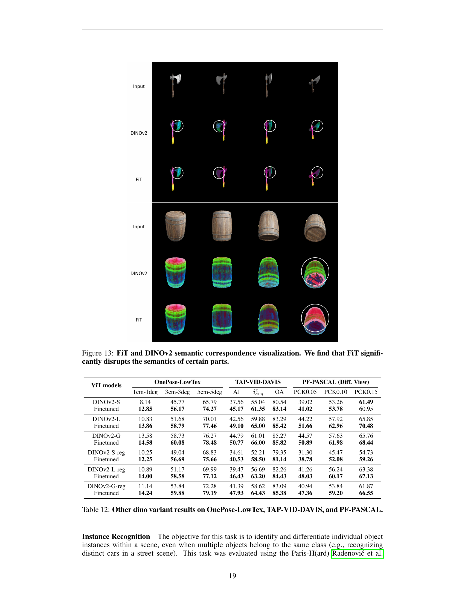

 


 2411.19458 
 Yang You et el. 
 
 🤗 2025-01-27 
 



↗ arXiv


↗ Hugging Face


↗ Papers with Code


### TL;DR



본 논문은 컴퓨터 비전 분야에서 **3D 공간 관계 이해**의 중요성을 강조하며, 기존의 2D 이미지 기반 비전 모델들이 3D 공간 관계를 잘 파악하지 못하는 문제점을 지적합니다. 특히, 다양한 관점에서의 의미론적 임베딩 일관성을 분석하여 **3D 등변성(equivariance)**의 중요성을 강조하고 있습니다. 

이러한 문제를 해결하기 위해, 본 논문에서는 **3D 대응 관계를 기반으로 한 간단하지만 효과적인 미세 조정 전략**을 제시합니다. **단일 합성 객체에 대한 미세 조정만으로도** 기존 모델의 3D 대응 관계 이해 능력을 크게 향상시키고, 자세 추정, 비디오 추적, 의미론적 전이 등 다양한 3D 작업에서 성능을 향상시킬 수 있음을 실험적으로 증명합니다. 특히, 합성 데이터만을 사용하여 학습한 모델이 실제 데이터에서도 성능 향상을 보이는 것은 매우 주목할 만한 결과입니다.



#### Key Takeaways


 제안된 미세 조정 전략은 단일 합성 객체를 사용하여 기존 비전 모델의 3D 공간 관계 이해 능력을 향상시킵니다. 



 미세 조정 전략은 자세 추정, 비디오 추적, 의미론적 전이 등 다양한 3D 작업에서 상당한 성능 향상을 가져옵니다. 



 합성 데이터만을 사용한 미세 조정으로도 실제 데이터 기반 작업의 성능 향상이 가능함을 보여줍니다. 


#### Why does it matter?
본 논문은 **3D 공간 관계에 대한 이해를 향상시키는 간단하면서도 효과적인 미세 조정 전략**을 제시하여 컴퓨터 비전 분야의 3D 인식 기술 발전에 크게 기여합니다. **기존의 2D 영상 기반 모델의 한계를 극복**하고, 다양한 3D 작업에서 성능 향상을 달성하는 방법을 제시하여 **향후 연구 방향에 대한 새로운 가능성**을 제시합니다. 특히, **합성 데이터만을 사용한 미세 조정**을 통해 실제 데이터의 성능을 향상시키는 놀라운 결과는 합성 데이터 활용의 중요성을 보여줍니다. 따라서 다양한 컴퓨터 비전 연구자들에게 중요한 시사점을 제공합니다.

------
#### Visual Insights

> 🔼 그림 1은 특징 등가변환에 대한 미세 조정을 통해 3D 대응 관계 이해도를 향상시키는 방법을 보여줍니다. 왼쪽 패널은 합성 객체 하나에 대한 특징 등가변환 미세 조정만으로도 일반적인 객체에 대한 3D 특징 대응 관계 생성 능력을 향상시킬 수 있음을 보여줍니다. 오른쪽 패널은 이러한 향상이 자세 추정, 비디오 추적, 의미론적 대응 관계를 포함한 여러 3D 작업에서 우수한 성능으로 이어짐을 보여줍니다.  즉, 합성 데이터로 미세 조정을 통해 실제 데이터에서의 성능 향상을 이끌어낼 수 있다는 것을 시각적으로 보여주는 그림입니다.
> 

> 
read the caption

> Figure 1: Improving 3D correspondence understanding through finetuning on feature equivariance. Left: finetuning feature equivariance on one synthetic object can already enhance the vision transformer’s ability to generate better 3D feature correspondences on general objects. Right: This improvement further leads to superior performance across multiple 3D tasks, including pose estimation, video tracking, and semantic correspondence.
> 


|                     | Mountain          |             |             | Fountain         |             |             | Corner           |             |             | Patio            |             |             | Spot             |             |             | Patio-High       |             |             |
| :------------------ | :----------------: | :----------: | :----------: | :---------------: | :----------: | :----------: | :---------------: | :----------: | :----------: | :---------------: | :----------: | :----------: | :---------------: | :----------: | :----------: | :---------------: | :----------: | :----------: |
|                     | PSNR ↑             | SSIM ↑       | LPIPS ↓      | PSNR ↑            | SSIM ↑       | LPIPS ↓      | PSNR ↑            | SSIM ↑       | LPIPS ↓      | PSNR ↑            | SSIM ↑       | LPIPS ↓      | PSNR ↑            | SSIM ↑       | LPIPS ↓      | PSNR ↑            | SSIM ↑       | LPIPS ↓      |
| W-G                 | 20.82             | 0.668        | 0.239        | 20.90            | 0.668        | 0.213        | 23.51            | 0.810        | 0.152        | **21.31**         | 0.802        | 0.134        | 23.96            | 0.777        | 0.165        | 22.04            | 0.734        | 0.202        |
| Ours                | **21.01**         | **0.672**    | **0.234**    | **20.97**        | **0.672**    | **0.212**    | **23.74**         | **0.810**    | **0.151**    | 21.23            | 0.802        | **0.133**    | **24.01**         | **0.778**    | **0.163**    | **22.11**         | 0.734        | **0.201**    |

> 🔼 이 표는 다양한 장면에 대한 새로운 뷰 합성 품질에 대한 정량적 비교를 보여줍니다. 미세 조정된 DINO 특징은 원래 Wild Gaussian 방법보다 성능이 일관되게 향상됨을 보여주며, PSNR 및 SSIM 점수는 더 높고 LPIPS 값은 더 낮습니다. 즉, 미세 조정된 DINO 특징을 사용하여 생성된 이미지는 원래 Wild Gaussian 방법으로 생성된 이미지보다 더 주관적으로 더 나은 품질을 가집니다. PSNR(Peak Signal-to-Noise Ratio)은 이미지의 픽셀 간 차이의 제곱 평균 제곱근을 측정하는 지표로, 값이 클수록 이미지 품질이 좋음을 의미합니다. SSIM(Structural Similarity Index)은 이미지의 구조적 유사성을 측정하는 지표이며, 값이 클수록 이미지 품질이 좋음을 의미합니다. LPIPS(Learned Perceptual Image Patch Similarity)는 이미지의 지각적 유사성을 측정하는 지표이며, 값이 작을수록 이미지 품질이 좋음을 의미합니다.
> 

> 
read the caption

> Table 1: Quantitative comparison of novel view synthesis quality across different scenes. Our fine-tuned DINO features consistently improve performance over the original Wild-Gaussians method, showing higher PSNR and SSIM scores, and lower LPIPS values.
> 

### In-depth insights

#### 3D Equivariance Study
본 논문에서 제시된 3D 등변성 연구는 **기존 2D 영상 모델의 3D 공간 관계 이해 능력을 평가하고 향상시키는 데 중점**을 둡니다.  **다양한 관점에서 얻은 2D 이미지 특징의 일관성(즉, 등변성)**을 분석하여 모델의 3D 인식 능력을 정량적으로 평가합니다. 특히, 다양한 Vision Transformer(ViT) 모델의 3D 등변성 수준을 비교 분석하고, **합성 및 실제 데이터를 사용한 실험을 통해 3D 등변성과 다운스트림 작업(자세 추정, 비디오 추적, 의미론적 대응) 성능 간의 강한 상관관계**를 밝힙니다. 이러한 분석을 바탕으로, **단일 합성 객체에 대한 미세 조정만으로도 3D 등변성을 크게 향상시키는 간단하면서도 효과적인 방법**을 제안합니다. 이는 3D 인식 성능을 상당히 향상시키는 것으로 나타났으며, 특히 소량의 데이터만으로도 효과적임을 보여줍니다.  **결론적으로 본 연구는 3D 인식 성능 향상에 있어 3D 등변성의 중요성을 강조**하고,  기존 Vision 모델의 3D 인식 능력을 향상시킬 수 있는 효율적인 방법을 제시합니다.

#### Multiview Finetuning
본 논문에서 제시된 다중 뷰 파인튜닝(Multiview Finetuning)은 **3D 공간 관계에 대한 이해를 향상시키기 위해 다양한 시각에서 얻은 이미지 특징 간의 일관성을 강화**하는 전략입니다.  기존의 2D 이미지 학습 모델은 3D 정보를 제대로 파악하지 못하는 한계를 지니는데, 본 연구는 **합성 및 실제 이미지 데이터를 활용하여 모델의 3D 인식 능력을 향상**시키는 접근법을 제시합니다.  핵심은 **단일 합성 객체에 대한 파인튜닝만으로도 상당한 성능 향상**을 달성할 수 있다는 점이며, 이는 효율적인 3D 학습 전략임을 보여줍니다.  **다중 뷰 일관성(Multiview Equivariance)** 개념을 기반으로, **SmoothAP 손실 함수**를 사용하여 서로 다른 시각에서의 동일한 3D 점을 나타내는 2D 특징 간의 유사성을 강화합니다.  **이를 통해 자세 추정, 비디오 추적, 의미론적 대응 등 다양한 하위 작업에서 성능이 향상**되는 것을 확인했으며, 특히 **DINOv2 모델에서 효과가 탁월**함을 보였습니다.  결론적으로, 이 연구는 제한된 데이터로도 3D 인식 능력을 향상시킬 수 있는 효과적이고 효율적인 파인튜닝 전략을 제시하고 있습니다.

#### Task Performance Links
논문의 "Task Performance Links" 제목은 다양한 3D 시각 과제(자세 추정, 비디오 추적, 의미론적 대응)에서 **다중 뷰 불변성(multiview equivariance)**과 **과제 성능 간의 강력한 상관 관계**를 보여주는 내용을 담고 있을 것으로 예상됩니다.  **높은 다중 뷰 불변성을 가진 모델은 모든 과제에서 우수한 성능**을 보였을 것이며, 이는 다중 뷰 이미지에서 일관된 특징을 추출하는 모델의 능력이 3D 공간 관계 이해와 밀접하게 연결되어 있음을 시사합니다.  본 연구는 단순히 2D 이미지 인식에 특화된 기존 비전 모델의 한계를 극복하고, **3D 인식 능력 향상을 위한 효과적인 접근법**을 제시하는 데 중요한 의미를 지닙니다.  특히, **합성 데이터만을 사용한 단일 객체 미세 조정**으로도 상당한 성능 향상을 이끌어냈다는 점은 실제 응용 측면에서 **비용 효율적인 3D 비전 모델 개발** 가능성을 높여줍니다. 이러한 결과는 향후 3D 인식 분야에서 다중 뷰 불변성의 중요성을 강조하고, 더욱 **강력하고 효율적인 3D 인식 모델 개발**을 위한 새로운 방향을 제시할 것으로 예상됩니다.

#### Few-Shot Learning
본 논문에서 제시된 연구는 **극소량의 데이터만으로도 3D 공간 이해 능력을 향상시키는 몇-샷 학습(few-shot learning)** 전략의 효과를 보여줍니다.  특히, 하나의 합성 객체에 대한 미세 조정만으로도 다양한 3D 작업에서 성능 향상을 가져온다는 점이 인상적입니다. 이는 기존의 많은 데이터를 필요로 하는 딥러닝 모델 학습 방식과 대조되는 부분으로, **데이터 효율성을 극대화**하는 새로운 가능성을 제시합니다.  **단일 객체에 대한 1회 반복 학습만으로도 상당한 성능 향상**이 나타난다는 사실은 몇-샷 학습의 강력함을 더욱 부각합니다.  **합성 데이터를 활용한 미세 조정을 통해 실제 데이터에 대한 성능 향상**도 이끌어낸다는 점은 실제 응용에 있어서도 큰 의미를 가집니다.  **다양한 하위 작업들(자세 추정, 비디오 추적, 의미론적 대응)** 에서 일관된 성능 개선이 관찰되었다는 것은 제안된 방법의 견고성을 시사합니다.  결론적으로, 이 연구는 제한된 데이터 환경에서도 3D 비전 모델의 성능을 향상시킬 수 있는 **효율적인 몇-샷 학습 전략**을 제시하며, **향후 3D 비전 분야의 발전에 크게 기여**할 것으로 기대됩니다.

#### Future Directions
본 논문은 3D 공간 관계 이해를 향상시키기 위해 **멀티뷰 불변성(multiview equivariance)** 개념을 활용한 비전 트랜스포머의 특징 개선에 초점을 맞추었습니다.  미래 연구 방향으로는, **다양한 3D 데이터셋과 과제에 대한 일반화 성능 향상**을 위한 추가 연구가 필요합니다.  **합성 데이터와 실제 데이터 간의 도메인 격차를 줄이는 전략**을 개발하는 것이 중요하며,  **단일 객체에 대한 미세 조정만으로도 상당한 성능 향상**을 보인 점을 고려하여, 보다 효율적인 학습 방법과 데이터 활용 전략을 모색해야 합니다.  또한, **다양한 비전 트랜스포머 구조 및 훈련 방법에 대한 범용성**을 검증하고,  **다른 3D 비전 과제(예: 3D 객체 검출, 3D 장면 재구성)**에 대한 적용 가능성을 탐구하는 것이 필요합니다.  **더욱 정교한 3D 공간 관계를 이해**하기 위해, **기하학적 제약 조건(geometric constraints)**을 활용한 모델 개선 및 새로운 손실 함수(loss function) 개발 연구가 중요할 것입니다.  마지막으로, **인간의 멀티뷰 지각 능력을 모방**하는 보다 고차원적인 3D 공간 이해 모델 개발을 위한 연구가 필요합니다.

### More visual insights

More on figures

> 🔼 그림 2는 다양한 비전 트랜스포머 모델(ViT)의 특징을 시각화하여 3D 공간 관계 이해 능력을 비교 분석한 그림입니다. Objaverse 데이터셋에서 렌더링된 이미지를 사용하여 각 모델이 추출한 고차원 특징을 PCA(주성분 분석)를 통해 저차원으로 변환하고 색상으로 표현했습니다. 그림을 통해 MAE 모델은 객체의 서로 다른 부분(예: 머리와 몸통)을 구분하는 데 어려움을 겪고, CLIP과 DeiT 모델은 특정 영역(예: 가슴 부위)에서 두 관점 간의 특징 일관성이 부족함을 확인할 수 있습니다. 반면에 DINOv2 모델은 다른 모델들에 비해 관점 간의 특징 일관성이 가장 높아 3D 공간 관계를 가장 잘 이해하고 있음을 보여줍니다.
> 

> 
read the caption

> Figure 2: Feature visualizations of different models. The sample image is rendered from Objeverse. Colors are computed from the high-dimensional features using PCA. We can see that MAE struggles to distinguish different parts of the content (e.g.similar features between head and body). Both CLIP and DeiT produce inconsistent features for the chest region between View 1 and View 2. DINOv2 gives the best correspondence.
> 

> 🔼 그림 3은 다중 뷰 특징 등가변환과 작업 성능 간의 상관관계를 보여줍니다. 가로축은 낮은 APE 값이 더 나은 특징 등가변환을 나타내는 반면, 세로축은 네 개의 그래프 모두에서 더 높은 작업 성능을 나타냅니다. 데이터 점들은 왼쪽 상단에서 오른쪽 하단으로 대각선 방향으로 거의 일직선으로 정렬되어 있으며, 이는 향상된 특징 등가변환과 더 나은 작업 성능 간의 강력한 상관관계를 시사합니다.
> 

> 
read the caption

> Figure 3: Correlation between multiview feature equivariance and the task performances. Along the horizontal axis, lower APE indicates better feature equivariance, while the vertical axis reflects higher task performance across all four plots. The data points align roughly along the diagonal from the top left to the bottom right, suggesting a strong correlation between improved feature equivariance and better task performance.
> 

> 🔼 본 논문의 그림 4는 연구에서 평가한 세 가지 유형의 대응 작업을 보여줍니다.  왼쪽부터 차례로, 단일 객체에 대한 강체 변환(SE(3)) 하에서의 대응 관계를 평가하는 자세 추정, 비강체 또는 관절 변환 하에서 동일한 객체에 대한 대응 관계를 평가하는 비디오 추적, 그리고 의미론적으로 유사한 서로 다른 객체들 간의 대응 관계를 평가하는 의미론적 대응이 포함되어 있습니다. 각 작업의 복잡성은 자세 추정에서 의미론적 대응으로 증가하며, 3D 대응 이해의 다양한 측면을 포괄합니다.
> 

> 
read the caption

> Figure 4: Illustration of different types of correspondence tasks evaluated in our work.
> 

> 🔼 그림 5는 합성 이미지(Objaverse)에서 실제 이미지(MVImgNet)로의 일반화 능력을 보여줍니다. 왼쪽 그래프는 두 데이터셋에서 평가된 평균 픽셀 오차(APE) 간의 상관관계를 보여줍니다. 데이터 포인트가 왼쪽 아래에서 오른쪽 위로 대각선 방향으로 분포되어 있는 것은 두 데이터셋 간의 상관관계가 높음을 시사합니다. 모델 이름 옆에 있는 * 표시는 미세 조정된 모델임을 나타냅니다. 모든 미세 조정은 Objaverse의 합성 데이터만 사용하여 수행되었습니다. 오른쪽 그래프는 Objaverse에서 미세 조정된 모델의 특징 등가변성(PCDP 측정)이 MVImgNet에서 향상되었음을 보여줍니다.
> 

> 
read the caption

> Figure 5:  Generalization from synthetic images (Objaverse) to real images (MVImgNet). Left: Data points roughly around the diagonal from the bottom left to the upper right indicate the correlation between the APE tested on the two datasets. The * next to the model name means it is finetuned. All finetuning is done on Objaverse with only synthetic data. Right: Finetuned on Objaverse, the feature equivariance of the model (measured in PCDP) improves on MVImgNet.
> 

> 🔼 그림 6은 MVImgNet 객체(왼쪽 두 열)과 TAP-VID-DAVIS 장면(오른쪽 한 열)에 대한 미세 조정 전후 DINOv2의 특징 시각화를 보여줍니다. 각 예시에 대해 세 가지 다른 뷰를 선택했습니다. 첫 번째 열은 PCA에 의해 생성된 기준 색상을 제공하고, 두 번째와 세 번째 열은 예측된 특징 대응을 보여줍니다. 미세 조정된 모델은 특히 톱니 모양 가장자리의 감소에서 알 수 있듯이 노이즈가 줄고 특징 경계가 더 매끄러워짐을 보여줍니다. 이 그림은 미세 조정을 통해 3D 특징 대응 이해가 향상되었음을 시각적으로 보여줍니다.  다양한 각도에서 본 동일한 물체의 특징 벡터가 얼마나 일관성있게 표현되는지 보여주는 것입니다.  미세조정 전에는 특징 벡터가 불규칙적이고 잡음이 많지만, 미세조정 후에는 더욱 매끄럽고 일관된 특징 벡터를 보여줍니다.
> 

> 
read the caption

> Figure 6: Feature visualization of DINOv2 before and after finetuning on MVImgNet objects (left two) and TAP-VID-DAVIS scenes (right one). For each example, we select three different views. The first column provides a reference color produced by PCA, while the second and third columns show the predicted feature correspondences. Our finetuned model demonstrates reduced noise and smoother feature boundaries, particularly noticeable in the reduction of jagged edges.
> 

> 🔼 그림 7은 특징 등가변환 미세 조정 전후의 원샷 자세 추정 결과를 보여줍니다.  다양한 비전 트랜스포머 모델들에 대해 OnePose-LowTex와 YCB-Video 데이터셋에서의 자세 추정 정확도 변화를 1cm-1deg, 3cm-3deg, 5cm-5deg 오차 한계를 기준으로 평가하여 시각적으로 보여줍니다.  미세 조정 전과 후의 성능 차이를 비교하여 특징 등가변환 미세 조정이 원샷 자세 추정 성능 향상에 미치는 영향을 명확히 제시합니다. 각 그래프는 모델별 평균 재현율 (AR) 또는 자세 정확도(%)를 나타냅니다.
> 

> 
read the caption

> Figure 7: One-shot pose estimation results before and after feature equivariance finetuning.
> 

> 🔼 그림 8은 특징 등가변환 미세 조정 전후의 비디오 추적 결과를 보여줍니다. 여러 모델에 대한 추적 결과가 다양한 색상으로 표시되어 있으며, 각 점의 궤적은 빨간색 선으로 표시됩니다. 미세 조정 전에는 궤적이 매우 불규칙하고 일관성이 없지만, 미세 조정 후에는 추적이 훨씬 더 안정적이고 정확해집니다. 이는 특징 등가변환 미세 조정이 비디오 추적 성능을 크게 향상시킨다는 것을 보여줍니다.
> 

> 
read the caption

> Figure 8: Video tracking results before and after feature equivariance finetuning.
> 

> 🔼 그림 9는 특징 등변량 미세 조정 전후의 의미적 대응 결과를 보여줍니다. 다양한 비전 변환기 모델(DINOv2, DINOv2-Reg, MAE, CLIP, DeiT)에 대해, 동일한 객체의 서로 다른 관점에서 촬영된 이미지 쌍에 대한 특징 매칭 정확도를 평가합니다. 각 모델에 대해, 미세 조정 전과 후의 PCK(Percentage of Correct Keypoints)@0.05, PCK@0.10, PCK@0.15 지표를 다양한 관점(서로 다른 관점과 동일한 관점)에서 비교 분석하여, 제안된 미세 조정 기법이 의미적 대응 성능을 향상시키는 효과를 시각적으로 보여줍니다. 특히, 동일한 관점의 이미지 쌍에서는 성능 향상이 더욱 두드러집니다.
> 

> 
read the caption

> Figure 9: Semantic correspondence results before and after feature equivariance finetuneing.
> 

> 🔼 그림 10은 DINOv2 모델을 0, 1, 5, 10, 20, 50, 100개의 객체를 사용하여 미세 조정했을 때 세 가지 과제(자세 추정, 비디오 추적, 의미론적 대응)에서의 성능을 보여줍니다.  이 그림은 제한된 양의 데이터만으로도 3D 대응 이해 능력을 향상시키는 데 효과적임을 보여줍니다. 특히, 단 하나의 객체만으로 미세 조정을 수행해도 상당한 성능 향상을 달성할 수 있음을 시사합니다.  이는 제안된 방법의 효율성과 실용성을 강조합니다.
> 

> 
read the caption

> Figure 10: Finetuned performances w.r.t.  #training objects. We evaluate the performances of the DINOv2 model finetuned with 0, 1, 5, 10, 20, 50, 100 objects on the three tasks.
> 

> 🔼 본 그림은 다양한 물체를 사용하여 특징 미세조정을 수행한 결과를 보여줍니다.  모든 결과는 미세조정된 DINOv2 모델을 사용하여 테스트되었습니다. 점선은 원래 사전 훈련된 모델의 성능을 나타냅니다.  단 하나의 물체만으로도 특징 미세조정 방법이 효과적임을 보여주며, 물체의 질감이 제한적이거나 일상 생활에서 흔하지 않은 물체일지라도 특정 물체의 선택에 대한 민감도가 낮음을 보여줍니다.  즉, 다양한 종류의 물체에 대해서도 뛰어난 성능을 보임을 의미합니다.
> 

> 
read the caption

> Figure 11: Finetuning with different objects. All results are tested with finetuned DINOv2. Dashed lines indicate the performances of the original pretrained model. The feature finetuning method is effective with as few as one single object. It also shows insensitivity to the specific choice of the object, even if the object has limited textures or is uncommon in daily life.
> 

> 🔼 그림 12는 하나의 물체만을 사용하여 훈련된 반복 횟수(0, 1, 5, 10, 20, 50, 100, 1000, 10000)에 따른 미세 조정된 DINOv2의 성능을 보여줍니다. 이 그래프는 다양한 훈련 반복 횟수에 따른 세 가지 주요 과제(One-shot Pose Estimation, Video Tracking, Semantic Correspondence)에서의 성능 변화를 보여줍니다.  특히, 놀랍게도 단 한 번의 반복만으로도 성능 향상이 나타남을 보여주는 결과가 시각적으로 잘 나타나 있습니다. 이는 제한된 데이터로도 3D 공간 관계 이해 능력을 향상시킬 수 있음을 의미합니다.
> 

> 
read the caption

> Figure 12: Finetuned DINOv2 performances w.r.t.  #training iterations, trained with only one object over 0, 1, 5, 10, 20, 50, 100, 1000, 10000 training iterations.
> 

> 🔼 그림 13은 FiT과 DINOv2의 의미적 대응 관계를 시각적으로 보여줍니다. FiT은 특정 부분의 의미를 상당히 왜곡하는 반면, DINOv2는 더 나은 의미적 일관성을 유지합니다. 이는 FiT이 이미지의 특징을 추출하는 방식에 차이가 있음을 시사합니다.  FiT이 특정 부분에 대한 의미적 정보를 제대로 포착하지 못하여 의미적 대응 관계를 정확하게 파악하지 못하는 것을 보여줍니다. 반면, DINOv2는 이미지의 전반적인 의미적 맥락을 잘 이해하여 더 정확한 대응 관계를 생성합니다.  이 그림은 FiT과 DINOv2의 차이점을 명확하게 보여주어,  3D 공간적 관계를 이해하는 데 있어 FiT의 한계를 보여줍니다.
> 

> 
read the caption

> Figure 13: FiT and DINOv2 semantic correspondence visualization. We find that FiT significantly disrupts the semantics of certain parts.
> 

> 🔼 그림 14는 LERF의 관련성 맵 시각화를 보여줍니다. '접시'라는 질의어에 대해, 미세 조정된 DINO 특징은 원래 DINO 특징과 비교하여 더욱 집중적이고 정확한 관련성 맵을 생성합니다. 접시 영역의 위치를 더 잘 파악하고 쿠키와 같은 관련 없는 영역의 노이즈를 줄였습니다. 이는 미세 조정된 DINO 특징이 더욱 개선된 일반적인 목적의 특징을 생성하고 다양한 응용 프로그램을 향상시킨다는 것을 보여줍니다.
> 

> 
read the caption

> Figure 14: Visualization of LERF relevancy maps for the query “plate”. Our finetuned DINO features produce a more focused and accurate relevancy map compared to the original DINO features, with better localization of the plate region and reduced noise in irrelevant areas such as cookies.
> 

> 🔼 그림 15는 다양한 합성곱층을 사용하여 특징 시각화를 비교한 것입니다. 하나 이상의 합성곱층을 추가하면 강조 표시된 영역에서 볼 수 있듯이 노이즈가 발생하고 특징의 일관성이 저하됩니다. 즉, 여러 개의 합성곱 층을 사용하면 시각적 특징 표현의 질이 떨어져서, 이미지의 세부 정보를 더 잘 나타내지 못하고, 오히려 이미지 내부의 노이즈나 부정확한 정보들을 더 강조하는 결과를 보입니다. 이는 모델의 성능 저하로 이어질 수 있습니다.
> 

> 
read the caption

> Figure 15: Comparison of feature visualizations with varying convolutional layers. Adding more than one convolutional layer introduces noise and reduces feature coherence, as shown by the highlighted regions.
> 

> 🔼 그림 16은 텍스처가 없는 반구의 다양한 시점에서의 특징 시각화를 보여줍니다.  상단 행은 네 가지 다른 각도에서 렌더링된 입력 반구를 보여줍니다. 중간 행은 RGB 매핑을 사용하여 시각화된 DINOv2의 특징 임베딩을 보여주는데, 시점 간에 일관성 없는 특징과 가장자리(흰색 원으로 강조 표시됨)가 나타납니다. 하단 행은 미세 조정된 DINOv2가 시점 간에 대응 관계를 더 잘 유지하는 더욱 일관된 특징을 생성함을 보여줍니다. 특히 가장자리와 안쪽/바깥쪽 시점에서 그 효과가 두드러집니다.
> 

> 
read the caption

> Figure 16: Feature visualization of an untextured hemisphere from different viewpoints. Top row: Input hemisphere rendered from four different angles. Middle row: Feature embeddings from DINOv2 visualized using RGB mapping, showing inconsistent features across views and edges (highlighted by white circles). Bottom row: Our fine-tuned DINOv2 produces more consistent features that better preserve correspondences across viewpoints, particularly at edges and inward outward views.
> 

More on tables


| ViT models | OnePose-LowTex | OnePose-LowTex | OnePose-LowTex | TAP-VID-DAVIS | TAP-VID-DAVIS | TAP-VID-DAVIS | PF-PASCAL (Diff. View) | PF-PASCAL (Diff. View) | PF-PASCAL (Diff. View) |
|---|---|---|---|---|---|---|---|---|---| 
|  | 1cm-1deg | 3cm-3deg | 5cm-5deg | AJ | OA | PCK0.05 | PCK0.10 | PCK0.15 |
| DINOv2-FT (Conv 0) | 11.69 | 53.85 | 72.83 | 44.50 | 60.79 | 84.08 | 44.82 | 57.14 | 65.26 |
| DINOv2-FT (Conv 1) | **13.58** | **58.03** | **77.35** | 46.85 | **63.84** | **84.15** | **47.25** | **60.76** | **67.57** |
| DINOv2-FT (Conv 2) | 13.12 | 56.14 | 75.45 | **47.42** | 63.25 | 84.12 | 46.32 | 58.05 | 64.90 |
| DINOv2-FT (Conv 3) | 12.15 | 53.63 | 74.46 | 46.84 | 62.14 | 82.90 | 41.60 | 53.97 | 60.22 |
> 🔼 표 2는 비전 트랜스포머 모델에 추가된 합성곱층의 수에 따른 성능 변화를 보여줍니다. 추가된 합성곱 층의 수가 증가함에 따라, 특히 3D 대응 관계 이해를 요구하는 다운스트림 작업에서 성능이 향상되는 것을 보여주는 실험 결과를 제시합니다. 그러나, 합성곱 층의 수가 지나치게 많아지면 오히려 성능 저하가 발생하는 것을 확인할 수 있습니다.  이는 과적합으로 인해 밀집된 픽셀별 특징들의 일관성이 저하되기 때문으로 해석됩니다. 이 표는 3D 대응 관계 이해를 향상시키기 위한 최적의 합성곱 층 수를 찾는 데 도움이 됩니다.
> 

> 
read the caption

> Table 2: Ablation on the number of appended conv layers.
> 


| ViT models | OnePose-LowTex |  |  | TAP-VID-DAVIS |  |  | PF-PASCAL (Diff. View) |  |  |
|---|---|---|---|---|---|---|---|---|---|---|
|  | 1cm-1deg | 3cm-3deg | 5cm-5deg | AJ | δavgx | OA | PCK0.05 | PCK0.10 | PCK0.15 |
|---|---|---|---|---|---|---|---|---|---|---|
| DINOv2-FT (Objaverse) | 13.58 | 58.03 | **77.35** | 46.85 | **63.84** | **84.15** | **47.25** | **60.76** | **67.57** |
| DINOv2-FT (MVImgNet) | 13.65 | 56.98 | 74.61 | 41.53 | 58.89 | 82.67 | 45.13 | 57.93 | 65.40 |
| DINOv2-FT (Scene-Centric) | **15.95** | **60.79** | 76.35 | **47.36** | 63.07 | 80.27 | 41.73 | 52.33 | 60.33 |

> 🔼 본 표는 논문의 Feature Finetuning with Multiview Equivariance 섹션에서, 다양한 모델에 대한 특징 미세 조정을 위해 사용된 데이터셋의 영향을 분석한 결과를 보여줍니다.  Objaverse, MVImgNet, 그리고 Scene-centric 데이터셋을 사용한 미세 조정 결과를 비교하여 각 데이터셋이 세 가지 하위 작업(자세 추정, 비디오 추적, 의미적 대응)의 성능에 미치는 영향을 정량적으로 제시합니다.  Objaverse는 합성 데이터셋이고, MVImgNet은 실제 이미지 데이터셋이며, Scene-centric은 복잡한 배경을 포함하는 장면 중심 데이터셋입니다. 이를 통해 각 데이터셋의 특징과 강점 및 약점을 파악하고, 모델의 3D 이해도 향상에 가장 효과적인 데이터셋을 선택하는 데 도움이 되는 정보를 제공합니다.
> 

> 
read the caption

> Table 3: Ablation on the dataset used for finetuning.
> 


| **ViT models** | **OnePose-LowTex** | **OnePose-LowTex** | **OnePose-LowTex** | **TAP-VID-DAVIS** | **TAP-VID-DAVIS** | **TAP-VID-DAVIS** | **PF-PASCAL (Diff. View)** | **PF-PASCAL (Diff. View)** | **PF-PASCAL (Diff. View)** |
|---|---|---|---|---|---|---|---|---|---| 
|  | 1cm-1deg | 3cm-3deg | 5cm-5deg | AJ | <math alttext="\delta_{avg}^{x}" display="inline">\delta_{avg}^{x}</math> | OA | PCK0.05 | PCK0.10 | PCK0.15 |
|---|---|---|---|---|---|---|---|---|---| 
| DINOv2-FT (SmoothAP) | **13.58** | **58.03** | **77.35** | **46.85** | **63.84** | **84.15** | **47.25** | **60.76** | **67.57** |
| DINOv2-FT (Contrastive) | 13.28 | 55.57 | 75.68 | 43.79 | 62.20 | 81.84 | 46.70 | 58.08 | 66.21 |
| DINOv2-FT (DiffProc) | 12.92 | 55.00 | 74.86 | 43.60 | 61.32 | 82.74 | 43.89 | 57.22 | 64.66 |
> 🔼 표 4는 다양한 손실 함수를 사용했을 때의 성능을 비교 분석한 결과를 보여줍니다. 실험 결과, SmoothAP 손실 함수가 다른 손실 함수들보다 전반적으로 가장 우수한 성능을 보였음을 확인할 수 있습니다.  다양한 비전 트랜스포머 모델에 대한 정량적 평가 결과(pose estimation, video tracking, semantic correspondence 세 가지 과제에 대한 평가 지표 포함)를 제시하여 SmoothAP의 효과를 명확하게 보여줍니다.
> 

> 
read the caption

> Table 4: Ablation on the loss function used. SmoothAP delivers the best overall performance.
> 


| Model | 0.05↑ | 0.1↑ | 0.2↑ | APE(%)↓ | 
|---|---|---|---|---| 
| DINOv2 [Oquab et al. (2023)] | 22.60 | 36.84 | 58.88 | 19.12 | 
| finetuned | **30.61** | **43.65** | **61.78** | **17.98** | 
| DINOv2-Reg [Darcet et al. (2023)] | **23.05** | **37.24** | **58.23** | 19.51 | 
| finetuned | 22.81 | 36.39 | 57.84 | **19.48** | 
| MAE [He et al. (2022a)] | 16.25 | 30.71 | 55.46 | 20.58 | 
| finetuned | **22.57** | **35.94** | **56.93** | **19.88** | 
| CLIP [Radford et al. (2021)] | 17.05 | 33.00 | 57.17 | 20.11 | 
| finetuned | **22.54** | **38.01** | **59.71** | **19.17** | 
| DeiT [Touvron et al. (2022)] | 18.07 | 33.89 | 58.05 | 19.72 | 
| finetuned | **23.39** | **38.47** | **59.95** | **19.00** |
> 🔼 이 표는 Objaverse 데이터셋에서 다양한 Vision Transformer 모델의 3D 등가변성(equivariance) 성능을 평가한 결과를 보여줍니다.  평가 지표로는 Average Pixel Error (APE)와 Percentage of Correct Dense Points (PCDP)를 사용했습니다. APE는 예측된 픽셀 대응점과 실제 대응점 사이의 평균 거리를 나타내며, PCDP는 특정 임계값 이내에 예측된 점들의 비율을 나타냅니다.  표에는 DINOv2, DINOv2-Reg, MAE, CLIP, DeiT 모델의 성능이 미세 조정 전과 후로 나뉘어 제시되어 있으며, 미세 조정을 통해 성능이 향상되었음을 보여줍니다.  각 모델의 APE 값과 PCDP(0.05, 0.1, 0.2) 값이 제시되어 있습니다.  낮은 APE 값과 높은 PCDP 값은 더 높은 정확도를 의미합니다.
> 

> 
read the caption

> Table 5: Evaluation of dense correspondence on Objaverse.
> 


| Model | PCDP(%) 0.05↑ | PCDP(%) 0.1↑ | PCDP(%) 0.2↑ | APE(%)↓ | 
|---|---|---|---|---| 
| DINOv2 [Oquab et al. (2023)] | 62.09 | 77.94 | 92.49 | 6.24 | 
| finetuned | **71.74** | **83.12** | **93.41** | **4.96** | 
| DINOv2-Reg [Darcet et al. (2023)] | **64.54** | **78.99** | 92.25 | 6.06 | 
| finetuned | 64.35 | 78.38 | **92.36** | **5.90** | 
| MAE [He et al. (2022a)] | 59.10 | 75.82 | 91.42 | 6.73 | 
| finetuned | **73.76** | **82.58** | **92.75** | **4.76** | 
| CLIP [Radford et al. (2021)] | 46.63 | 63.49 | 80.53 | 11.34 | 
| finetuned | **60.23** | **72.78** | **85.69** | **8.42** | 
| DeiT [Touvron et al. (2022)] | 54.63 | 72.36 | 87.64 | 8.34 | 
| finetuned | **67.31** | **80.12** | **91.63** | **5.89** |
> 🔼 이 표는 MVImgNet 데이터셋에서 다양한 Vision Transformer 모델들의 3D 등가변환 성능을 평가한 결과를 보여줍니다.  Average Pixel Error (APE)와 Percentage of Correct Dense Points (PCDP) 지표를 사용하여 모델들의 다중 뷰 특징 일관성을 정량적으로 측정하였습니다.  PCDP는 다양한 임계값 (0.05, 0.1, 0.2)에서 계산되어 모델의 정확도를 다각적으로 평가합니다.  APE는 예측된 픽셀 대응점과 실제 대응점 사이의 평균 거리를 나타내며, 값이 낮을수록 성능이 우수함을 의미합니다.  표에는 각 모델의 사전 훈련된 버전과 미세 조정된 버전의 결과가 모두 포함되어 있어, 미세 조정이 모델 성능에 미치는 영향을 비교 분석하는 데 유용합니다.
> 

> 
read the caption

> Table 6: Evaluation of dense correspondence on MVImgNet.
> 


| Method | OnePose-LowTex |  |  | 
|---|---|---|---|
|  | 1cm-1deg | 3cm-3deg | 5cm-5deg |
| OnePose++ [He et al. (2022b)](https://arxiv.org/html/2411.19458v1#bib.bib20) | 16.8 | 57.7 | 72.1 |
| DUSt3R [Wang et al. (2024)](https://arxiv.org/html/2411.19458v1#bib.bib46) | 2.88 | 16.61 | 26.79 |
| FiT [Yue et al. (2024)](https://arxiv.org/html/2411.19458v1#bib.bib51) | 1.05 | 9.18 | 16.52 |
| FiT-Reg [Yue et al. (2024)](https://arxiv.org/html/2411.19458v1#bib.bib51) | 3.44 | 23.51 | 37.68 |
| DINOv2 [Oquab et al. (2023)](https://arxiv.org/html/2411.19458v1#bib.bib34) | 9.43 | 48.45 | 67.45 |
| Finetuned | **13.58** | **58.03** | **77.35** |
| DINOv2-Reg [Darcet et al. (2023)](https://arxiv.org/html/2411.19458v1#bib.bib8) | 9.95 | 52.65 | 71.72 |
| Finetuned | **13.41** | **59.32** | **78.64** |
| MAE [He et al. (2022a)](https://arxiv.org/html/2411.19458v1#bib.bib19) | 4.41 | 20.76 | 32.27 |
| Finetuned | **10.27** | **39.37** | **52.97** |
| CLIP [Radford et al. (2021)](https://arxiv.org/html/2411.19458v1#bib.bib37) | 2.85 | 19.65 | 33.84 |
| Finetuned | **6.72** | **35.63** | **52.94** |
| DeiT [Touvron et al. (2022)](https://arxiv.org/html/2411.19458v1#bib.bib42) | 2.55 | 16.85 | 31.67 |
| Finetuned | **7.20** | **33.24** | **49.43** |
> 🔼 표 7은 논문의 One-Shot Object Pose Estimation 실험 결과를 보여줍니다. OnePose-LowTex 데이터셋을 사용하여 1cm-1deg, 3cm-3deg, 5cm-5deg 오차 범위 내에서의 정확도를 평가했습니다. 다양한 Vision Transformer 모델들(DINOv2, DINOv2-Reg, MAE, CLIP, DeiT)의 성능을 비교 분석하고, 본 논문에서 제안하는 특징 개선 기법을 적용했을 때의 성능 향상을 보여줍니다. 각 모델의 원래 성능과 Fine-tuning 이후의 성능을 비교하여, 제안된 방법의 효과를 수치적으로 제시합니다.
> 

> 
read the caption

> Table 7: Quantitative results of one-shot pose estimation on OnePose-LowTex.
> 


| Method | VSD | MSSD | MSPD | AR |
|---|---|---|---|---|
| MegaPose [Labbé et al. (2022)](https://arxiv.org/html/2411.19458v1#bib.bib30) | 53.5 | 59.7 | 72.8 | 62.0 |
| DUSt3R [Wang et al. (2024)](https://arxiv.org/html/2411.19458v1#bib.bib46) | 11.6 | 11.5 | 15.8 | 13.0 |
| FiT [Yue et al. (2024)](https://arxiv.org/html/2411.19458v1#bib.bib51) | 4.4 | 3.2 | 3.4 | 3.7 |
| FiT-Reg [Yue et al. (2024)](https://arxiv.org/html/2411.19458v1#bib.bib51) | 10.2 | 9.4 | 11.3 | 10.3 |
| DINOv2 [Oquab et al. (2023)](https://arxiv.org/html/2411.19458v1#bib.bib34) | 34.9 | 39.4 | 58.8 | 44.4 |
| Finetuned | **39.9** | **44.4** | **63.9** | **49.4** |
| DINOv2-Reg [Darcet et al. (2023)](https://arxiv.org/html/2411.19458v1#bib.bib8) | 34.2 | 37.9 | 55.4 | 42.5 |
| Finetuned | **38.1** | **42.3** | **60.0** | **46.8** |
| MAE [He et al. (2022a)](https://arxiv.org/html/2411.19458v1#bib.bib19) | 15.9 | 17.9 | 26.8 | 20.2 |
| Finetuned | **32.2** | **36.8** | **54.0** | **41.0** |
| CLIP [Radford et al. (2021)](https://arxiv.org/html/2411.19458v1#bib.bib37) | 17.0 | 19.1 | 31.0 | 22.4 |
| Finetuned | **28.3** | **31.3** | **35.6** | **28.3** |
| DeiT [Touvron et al. (2022)](https://arxiv.org/html/2411.19458v1#bib.bib42) | 19.4 | 19.8 | 31.2 | 23.5 |
| Finetuned | **29.4** | **31.1** | **45.6** | **35.4** |
> 🔼 표 8은 YCB-Video 데이터셋에서의 one-shot pose estimation 결과를 보여줍니다.  각 모델(DINOv2, DINOv2-Reg, MAE, CLIP, DeiT)에 대해, fine-tuning 전과 후의 성능을 VSD, MSSD, MSPD, AR 지표로 비교 분석합니다.  YCB-Video 데이터셋은 다양한 물체의 pose를 추정하는 데 사용되는 대표적인 benchmark 데이터셋으로, 본 표는 제시된 모델들의 3D 공간 이해 능력을 평가하는 데 중요한 역할을 합니다.  각 지표는 pose estimation의 정확도를 나타내며, 낮을수록 더 높은 정확도를 의미합니다.
> 

> 
read the caption

> Table 8: Quantitative results of one-shot pose estimation on YCB-Video.
> 


| Method | TAP-VID-DAVIS |  |  |  
|---|---|---|---| 
|  | AJ | <math alttext="\delta_{avg}^{x}" class="ltx_Math" display="inline" id="A1.T9.1.1.1.1.m1.1"><semantics id="A1.T9.1.1.1.1.m1.1a"><msubsup id="A1.T9.1.1.1.1.m1.1.1" xref="A1.T9.1.1.1.1.m1.1.1.cmml"><mi id="A1.T9.1.1.1.1.m1.1.1.2.2" xref="A1.T9.1.1.1.1.m1.1.1.2.2.cmml">δ</mi><mrow id="A1.T9.1.1.1.1.m1.1.1.2.3" xref="A1.T9.1.1.1.1.m1.1.1.2.3.cmml"><mi id="A1.T9.1.1.1.1.m1.1.1.2.3.2" xref="A1.T9.1.1.1.1.m1.1.1.2.3.2.cmml">a</mi><mo id="A1.T9.1.1.1.1.m1.1.1.2.3.1" xref="A1.T9.1.1.1.1.m1.1.1.2.3.1.cmml">⁢</mo><mi id="A1.T9.1.1.1.1.m1.1.1.2.3.3" xref="A1.T9.1.1.1.1.m1.1.1.2.3.3.cmml">v</mi><mo id="A1.T9.1.1.1.1.m1.1.1.2.3.1a" xref="A1.T9.1.1.1.1.m1.1.1.2.3.1.cmml">⁢</mo><mi id="A1.T9.1.1.1.1.m1.1.1.2.3.4" xref="A1.T9.1.1.1.1.m1.1.1.2.3.4.cmml">g</mi></mrow><mi id="A1.T9.1.1.1.1.m1.1.1.3" xref="A1.T9.1.1.1.1.m1.1.1.3.cmml">x</mi></msubsup><annotation-xml encoding="MathML-Content" id="A1.T9.1.1.1.1.m1.1b"><apply id="A1.T9.1.1.1.1.m1.1.1.cmml" xref="A1.T9.1.1.1.1.m1.1.1"><csymbol cd="ambiguous" id="A1.T9.1.1.1.1.m1.1.1.1.cmml" xref="A1.T9.1.1.1.1.m1.1.1">superscript</csymbol><apply id="A1.T9.1.1.1.1.m1.1.1.2.cmml" xref="A1.T9.1.1.1.1.m1.1.1"><csymbol cd="ambiguous" id="A1.T9.1.1.1.1.m1.1.1.2.1.cmml" xref="A1.T9.1.1.1.1.m1.1.1">subscript</csymbol><ci id="A1.T9.1.1.1.1.m1.1.1.2.2.cmml" xref="A1.T9.1.1.1.1.m1.1.1.2.2">𝛿</ci><apply id="A1.T9.1.1.1.1.m1.1.1.2.3.cmml" xref="A1.T9.1.1.1.1.m1.1.1.2.3"><times id="A1.T9.1.1.1.1.m1.1.1.2.3.1.cmml" xref="A1.T9.1.1.1.1.m1.1.1.2.3.1"></times><ci id="A1.T9.1.1.1.1.m1.1.1.2.3.2.cmml" xref="A1.T9.1.1.1.1.m1.1.1.2.3.2">𝑎</ci><ci id="A1.T9.1.1.1.1.m1.1.1.2.3.3.cmml" xref="A1.T9.1.1.1.1.m1.1.1.2.3.3">𝑣</ci><ci id="A1.T9.1.1.1.1.m1.1.1.2.3.4.cmml" xref="A1.T9.1.1.1.1.m1.1.1.2.3.4">𝑔</ci></apply></apply><ci id="A1.T9.1.1.1.1.m1.1.1.3.cmml" xref="A1.T9.1.1.1.1.m1.1.1.3">𝑥</ci></apply></annotation-xml><annotation encoding="application/x-tex" id="A1.T9.1.1.1.1.m1.1c">\delta_{avg}^{x}</annotation><annotation encoding="application/x-llamapun" id="A1.T9.1.1.1.1.m1.1d">italic_δ start_POSTSUBSCRIPT italic_a italic_v italic_g end_POSTSUBSCRIPT start_POSTSUPERSCRIPT italic_x end_POSTSUPERSCRIPT</annotation></semantics></math> | OA |  
| Co-Tracker [Karaev et al. (2023)](https://arxiv.org/html/2411.19458v1#bib.bib25) | 65.6 | 79.4 | 89.5 |  
| DUSt3R [Wang et al. (2024)](https://arxiv.org/html/2411.19458v1#bib.bib46) | 13.06 | 22.64 | 77.27 |  
| FiT [Yue et al. (2024)](https://arxiv.org/html/2411.19458v1#bib.bib51) | 20.45 | 33.46 | 77.27 |  
| FiT-Reg | 23.28 | 37.30 | 77.27 |  
| DINOv2 [Oquab et al. (2023)](https://arxiv.org/html/2411.19458v1#bib.bib34) | 40.40 | 58.11 | 81.46 |  
| Finetuned | **46.85** | **63.84** | **84.15** |  
| DINOv2-Reg [Darcet et al. (2023)](https://arxiv.org/html/2411.19458v1#bib.bib8) | 37.89 | 55.43 | 80.77 |  
| Finetuned | **44.91** | **62.23** | **83.85** |  
| MAE [He et al. (2022a)](https://arxiv.org/html/2411.19458v1#bib.bib19) | 29.99 | 48.16 | **77.27** |  
| Finetuned | **36.04** | **54.97** | **77.27** |  
| CLIP [Radford et al. (2021)](https://arxiv.org/html/2411.19458v1#bib.bib37) | 25.86 | 41.17 | **79.28** |  
| Finetuned | **32.13** | **49.31** | 79.09 |  
| DeiT [Touvron et al. (2022)](https://arxiv.org/html/2411.19458v1#bib.bib42) | 26.80 | 42.06 | 78.45 |  
| Finetuned | **32.55** | **48.41** | **78.49** | 
> 🔼 표 9는 TAP-VID-DAVIS 데이터셋에서 다양한 비전 트랜스포머 모델의 비디오 추적 성능을 정량적으로 비교 분석한 결과를 보여줍니다.  각 모델에 대해 평균 자카드 지수(AJ), 평균 위치 정확도(avg), 폐색 정확도(OA) 세 가지 지표를 사용하여 성능을 측정했습니다.  표에는 미세 조정 전과 후의 성능을 모두 제시하여, 제안된 방법의 효과를 명확히 보여줍니다. 특히, DINOv2 모델이 미세 조정 후에 가장 우수한 성능을 보임을 알 수 있습니다. 
> 

> 
read the caption

> Table 9: Quantitative results of tracking on TAP-VID-DAVIS.
> 


| Method | PF-PASCAL |  |  |  | 
|---|---|---|---|---|
|  | PCK0.05 | PCK0.10 | PCK0.15 |  | 
| DUSt3R [Wang et al. (2024)](https://arxiv.org/html/2411.19458v1#bib.bib46) | 4.70 | 8.21 | 13.01 |  | 
| FiT [Yue et al. (2024)](https://arxiv.org/html/2411.19458v1#bib.bib51) | 13.10 | 23.99 | 33.45 |  | 
| FiT-Reg [Yue et al. (2024)](https://arxiv.org/html/2411.19458v1#bib.bib51) | 22.39 | 36.45 | 45.27 |  | 
| DINOv2 [Oquab et al. (2023)](https://arxiv.org/html/2411.19458v1#bib.bib34) | 42.18 | 56.90 | 65.59 |  | 
| Ours | **47.24** | **60.76** | **67.57** |  | 
| DINOv2-Reg [Darcet et al. (2023)](https://arxiv.org/html/2411.19458v1#bib.bib8) | 38.29 | 53.74 | 61.94 |  | 
| Finetuned | **44.44** | **57.27** | **65.27** |  | 
| MAE [He et al. (2022a)](https://arxiv.org/html/2411.19458v1#bib.bib19) | 11.98 | 20.16 | 28.16 |  | 
| Finetuned | **14.45** | **23.79** | **32.56** |  | 
| CLIP [Radford et al. (2021)](https://arxiv.org/html/2411.19458v1#bib.bib37) | 13.87 | 24.85 | 35.13 |  | 
| Finetuned | **20.39** | **32.36** | **42.58** |  | 
| DeiT [Touvron et al. (2022)](https://arxiv.org/html/2411.19458v1#bib.bib42) | 17.73 | 31.17 | 41.17 |  | 
| Finetuned | **20.24** | **33.29** | **41.62** |  | 
> 🔼 표 10은 PF-PASCAL 데이터셋에서 서로 다른 뷰포인트를 가진 이미지 쌍에 대한 정량적 결과를 보여줍니다.  PF-PASCAL은 객체의 다양한 시점에서 촬영된 이미지 쌍으로 이루어진 데이터셋으로, 모델이 다른 시점에서 동일한 객체를 인식하고 대응점을 찾는 능력을 평가하는 데 사용됩니다.  표는 다양한 비전 변환기 모델(DINOv2, DINOv2-Reg, MAE, CLIP, DeiT)에 대해, 미세 조정 전과 후의 PCK@0.05, PCK@0.10, PCK@0.15 지표를 제시합니다. PCK는 예측된 키포인트와 실제 키포인트 사이의 오차를 측정하는 지표입니다.  이 표를 통해 다양한 모델의 다중 뷰 일관성과 3D 대응 이해 능력을 비교 분석할 수 있습니다.
> 

> 
read the caption

> Table 10: Quantitative results of PF-PASCAL (Different Viewpoints).
> 


| Method | PF-PASCAL |  |  |  |
|---|---|---|---|---|
|  | PCK0.05 | PCK0.10 | PCK0.15 |  |
| DUSt3R [Wang et al. (2024)](https://arxiv.org/html/2411.19458v1#bib.bib46) | 2.64 | 8.01 | 15.00 |  |
| FiT [Yue et al. (2024)](https://arxiv.org/html/2411.19458v1#bib.bib51) | 13.96 | 27.42 | 37.39 |  |
| FiT-Reg [Yue et al. (2024)](https://arxiv.org/html/2411.19458v1#bib.bib51) | 26.47 | 45.74 | 55.32 |  |
| DINOv2 [Oquab et al. (2023)](https://arxiv.org/html/2411.19458v1#bib.bib34) | 60.22 | 79.05 | 85.95 |  |
| Finetuned | **69.16** | **84.94** | **89.82** |  |
| DINOv2-Reg [Darcet et al. (2023)](https://arxiv.org/html/2411.19458v1#bib.bib8) | 52.86 | 71.93 | 80.11 |  |
| Finetuned | **62.63** | **79.24** | **86.69** |  |
| MAE [He et al. (2022a)](https://arxiv.org/html/2411.19458v1#bib.bib19) | 17.16 | 31.52 | 43.54 |  |
| Finetuned | **21.26** | **36.16** | **48.52** |  |
| CLIP [Radford et al. (2021)](https://arxiv.org/html/2411.19458v1#bib.bib37) | 17.44 | 31.38 | 41.81 |  |
| Finetuned | **27.40** | **42.72** | **52.67** |  |
| DeiT [Touvron et al. (2022)](https://arxiv.org/html/2411.19458v1#bib.bib42) | 21.21 | 38.96 | 50.36 |  |
| Finetuned | **30.18** | **49.69** | **60.34** |  |
> 🔼 표 11은 PF-PASCAL 데이터셋에서 같은 시점(Same Viewpoint)으로 촬영된 이미지 쌍에 대한 정량적 결과를 보여줍니다.  다양한 비전 트랜스포머 모델들의 성능을 PCK@0.05, PCK@0.10, PCK@0.15 세 가지 지표를 사용하여 평가하였습니다.  각 지표는 예측된 키포인트와 실제 키포인트 사이의 거리 오차를 기준으로 계산되며, 값이 클수록 정확도가 높음을 의미합니다.  본 표는 다양한 모델들(예: DINOv2, MAE, CLIP, DeiT)의 기본 성능과 미세 조정(Finetuned) 후 성능을 비교하여, 제안된 미세 조정 기법의 효과를 보여줍니다.  특히, 같은 시점에서 촬영된 이미지 쌍을 사용하여 모델의 3D 공간 이해 능력을 보다 정확하게 평가합니다.
> 

> 
read the caption

> Table 11: Quantitative results of PF-PASCAL (Same Viewpoint).
> 


| ViT models | OnePose-LowTex |  |  | TAP-VID-DAVIS |  |  | PF-PASCAL (Diff. View) |  |  |
|---|---|---|---|---|---|---|---|---|---|---|
|  | 1cm-1deg | 3cm-3deg | 5cm-5deg | AJ |  δxavg | OA | PCK0.05 | PCK0.10 | PCK0.15 |
|---|---|---|---|---|---|---|---|---|---|---|
| DINOv2-S | 8.14 | 45.77 | 65.79 | 37.56 | 55.04 | 80.54 | 39.02 | 53.26 | **61.49** |
| Finetuned | **12.85** | **56.17** | **74.27** | **45.17** | **61.35** | **83.14** | **41.02** | **53.78** | 60.95 |
| DINOv2-L | 10.83 | 51.68 | 70.01 | 42.56 | 59.88 | 83.29 | 44.22 | 57.92 | 65.85 |
| Finetuned | **13.86** | **58.79** | **77.46** | **49.10** | **65.00** | **85.42** | **51.66** | **62.96** | **70.48** |
| DINOv2-G | 13.58 | 58.73 | 76.27 | 44.79 | 61.01 | 85.27 | 44.57 | 57.63 | 65.76 |
| Finetuned | **14.58** | **60.08** | **78.48** | **50.77** | **66.00** | **85.82** | **50.89** | **61.98** | **68.44** |
| DINOv2-S-reg | 10.25 | 49.04 | 68.83 | 34.61 | 52.21 | 79.35 | 31.30 | 45.47 | 54.73 |
| Finetuned | **12.25** | **56.69** | **75.66** | **40.53** | **58.50** | **81.14** | **38.78** | **52.08** | **59.26** |
| DINOv2-L-reg | 10.89 | 51.17 | 69.99 | 39.47 | 56.69 | 82.26 | 41.26 | 56.24 | 63.38 |
| Finetuned | **14.00** | **58.58** | **77.12** | **46.43** | **63.20** | **84.43** | **48.03** | **60.17** | **67.13** |
| DINOv2-G-reg | 11.14 | 53.84 | 72.28 | 41.39 | 58.62 | 83.09 | 40.94 | 53.84 | 61.87 |
| Finetuned | **14.24** | **59.88** | **79.19** | **47.93** | **64.43** | **85.38** | **47.36** | **59.20** | **66.55** |
> 🔼 표 12는 본 논문에서 제시된 특징 개선 방법을 적용했을 때 다양한 DINO 변형 모델(DINOv2-S, DINOv2-L, DINOv2-G, DINOv2-S-reg, DINOv2-L-reg, DINOv2-G-reg)의 성능을 OnePose-LowTex, TAP-VID-DAVIS, PF-PASCAL 데이터셋에서 평가한 결과를 보여줍니다. 각 데이터셋은 서로 다른 3D 이해 작업 (One-shot pose estimation, Video tracking, Semantic correspondence)을 나타내며, 표에는 각 모델과 데이터셋 조합에 대한 정량적 성능 지표(1cm-1deg, 3cm-3deg, 5cm-5deg, AJ,  δα , OA, PCK@0.05, PCK@0.10, PCK@0.15)가 제시되어 있습니다. 이를 통해 다양한 모델 변형 및 데이터셋에 따른 성능 변화를 비교 분석하고, 제시된 특징 개선 기법의 일반화 성능을 확인할 수 있습니다.
> 

> 
read the caption

> Table 12: Other dino variant results on OnePose-LowTex, TAP-VID-DAVIS, and PF-PASCAL.
> 


|               | OnePose-LowTex             |                   |                   | TAP-VID-DAVIS       |                   | PF-PASCAL             |                   |                   |               |
| :------------- | :--------------------------: | :------------------: | :------------------: | :------------------: | :------------------: | :---------------------: | :------------------: | :------------------: | :------------- |
|               | 1cm 1deg                     | 3cm 3deg             | 5cm 5deg             | AJ                  | δavg       | OA                     | PCK0.05             | PCK0.10             | PCK0.15        |
| ConvNext-small | 3.25                         | 13.46                 | 21.39                 | 15.98                | 26.08                | **74.72**              | 10.32                 | 16.30                 | 22.17         |
| small-finetuned | **5.28**                      | **19.98**              | **28.23**              | **16.70**             | **26.56**             | 74.54                 | **11.61**              | **19.38**              | **25.56**       |
| ConvNext-base  | 5.10                         | 22.22                 | 34.81                 | 17.57                | 28.21                | **72.47**              | 13.62                 | 21.03                 | 27.81         |
| base-finetuned | **8.05**                      | **32.69**              | **46.41**              | **18.53**             | **28.48**             | 71.24                 | **15.64**              | **25.37**              | **32.13**       |
| ConvNext-large | 4.71                         | 25.33                 | 36.48                 | 19.43                | 30.24                | 73.71                 | 11.05                 | 17.57                 | 24.19         |
| large-finetuned | **7.21**                      | **30.68**              | **44.47**              | **19.45**             | **30.68**             | **74.33**              | **14.56**              | **24.04**              | **31.57**       |
> 🔼 표 13은 ConvNeXt 모델에 대한 특징 미세조정 결과를 보여줍니다. OnePose-LowTex, TAP-VID-DAVIS 및 PF-PASCAL 세 가지 다른 데이터셋에서의 1cm-1deg, 3cm-3deg, 5cm-5deg, 평균 Jaccard 지수(AJ), 평균 정확도(avg), 폐색 정확도(OA), PCK@0.05, PCK@0.10, PCK@0.15 성능을 보여줍니다.  미세조정 전후의 성능을 비교하여 ConvNeXt 모델의 미세조정 효과를 확인할 수 있습니다.
> 

> 
read the caption

> Table 13: ConvNext finetuning results on OnePose-LowTex, TAP-VID-DAVIS, and PF-PASCAL.
> 


| Model | Paris-H Inst. Recognition |  | VOC2012 Segmentation |  | NYUv2 Depth Estimation |  | 
|---|---|---|---|---|---|---| 
|  | Cls↑ | Cls+Patch↑ | mIoU↑ | mAcc↑ | δ₁↑ | abs rel↓ | 
| DINOv2 Oquab et al. (2023) | 75.92 | 73.69 | **83.60** | **90.82** | **86.88** | **0.1238** | 
| Finetuned | **76.23** | **75.43** | 82.65 | 90.21 | 85.48 | 0.1299 | 
> 🔼 표 14는 본 논문에서 제시된 3가지 작업, 즉 인스턴스 인식, 의미론적 분할 및 깊이 추정에 대한 정량적 결과를 보여줍니다. 각 작업에 대해 여러 모델의 성능을 평가하고 비교합니다. 이 표는 다양한 모델의 성능을 비교하여 각 작업에 대한 성능을 정량적으로 보여주는 지표들을 포함합니다.  세부적으로는 인스턴스 인식 작업에 대해서는 mAP(평균 정밀도) 점수를, 의미론적 분할 작업에 대해서는 mIoU(평균 IoU) 및 mAcc(평균 정확도) 점수를, 깊이 추정 작업에 대해서는 d1 점수와 절대 상대 오차(abs rel)를 제시합니다. 이를 통해 제시된 방법의 성능을 다양한 측면에서 종합적으로 비교 분석하는 데 도움을 줍니다.
> 

> 
read the caption

> Table 14: Quantitative results of instance recoginition, semantic segmentation and depth estimation.
> 


| ViT models | OnePose-LowTex |  |  | TAP-VID-DAVIS |  |  | PF-PASCAL (Diff. View) |  |  |
|---|---|---|---|---|---|---|---|---|---|---|
|  | 1cm-1deg | 3cm-3deg | 5cm-5deg | AJ |  δavgx  | OA | PCK0.05 | PCK0.10 | PCK0.15 |
|---|---|---|---|---|---|---|---|---|---|---|
| DINOv2-FT (LR 1e-6) | 11.86 | 55.03 | 73.12 | 44.79 | 62.56 | 83.17 | **47.34** | 60.10 | **68.23** |
| DINOv2-FT (LR 3e-6) | 13.05 | 57.45 | 75.89 | 45.93 | 63.32 | 83.73 | 47.20 | 60.50 | 67.21 |
| DINOv2-FT (LR 1e-5) | **13.58** | 58.03 | 77.35 | **46.85** | **63.84** | **84.15** | 47.25 | **60.76** | 67.57 |
| DINOv2-FT (LR 3e-5) | 13.15 | **58.33** | **77.49** | 46.70 | 63.45 | 83.35 | 45.70 | 57.96 | 65.99 |
> 🔼 이 표는 논문의 Feature Finetuning with Multiview Equivariance 섹션에 있는 표로, 학습률을 변경하면서 fine-tuning을 수행했을 때의 성능 변화를 보여줍니다.  다양한 학습률(1e-6, 3e-6, 1e-5, 3e-5)을 사용하여 DINOv2 모델을 fine-tuning 했을 때 OnePose-LowTex, TAP-VID-DAVIS, 그리고 PF-PASCAL 데이터셋에서의 성능 지표 (1cm-1deg, 3cm-3deg, 5cm-5deg, AJ, δavg, OA, PCK@0.05, PCK@0.10, PCK@0.15) 변화를 비교 분석한 결과가 나타나 있습니다.  이를 통해 최적의 학습률을 찾고, 학습률 변화에 따른 모델 성능의 민감도를 파악하는 데 도움이 됩니다.
> 

> 
read the caption

> Table 15: Ablation on the learning rate for finetuning.
> 


| Method | #Inliers |
|---|---| 
| DINOv2 [Oquab et al. (2023)] | 99 |
| Finetuned | **159** |
| DINOv2-Reg [Darcet et al. (2023)] | 76 |
| Finetuned | **148** |
| MAE [He et al. (2022a)] | 97 |
| Finetuned | **196** |
| CLIP [Radford et al. (2021)] | 18 |
| Finetuned | **61** |
| DeiT [Touvron et al. (2022)] | 25 |
| Finetuned | **81** |
> 🔼 이 표는 배경이 없는 객체 중심 데이터셋에서 학습된 모델과 배경이 포함된 객체 중심 데이터셋에서 학습된 모델의 특징 불변성을 정량적으로 비교 분석한 결과를 보여줍니다.  구체적으로, 각 모델에 대해 배경에 불변적인 특징점(Inlier)의 수를 측정하여 배경의 영향을 최소화하는 모델의 성능을 평가합니다.  각 모델은 미세 조정 전과 후의 결과를 모두 포함합니다.  즉, 각 모델의 배경 불변성 수치가 미세 조정을 통해 얼마나 향상되었는지 보여줍니다.
> 

> 
read the caption

> Table 16: Quantitative results on the number of feature inliers that are background-invariant.
> 

### Full paper



