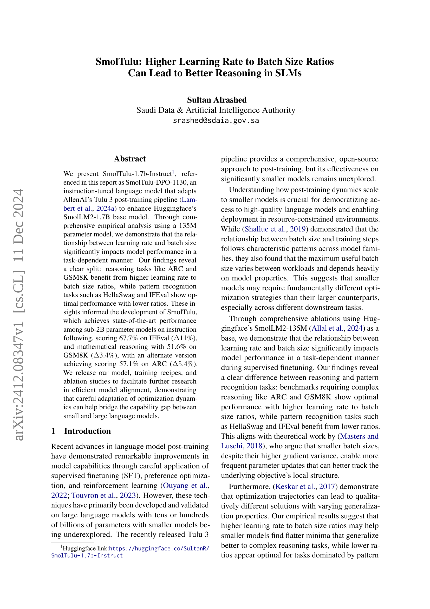
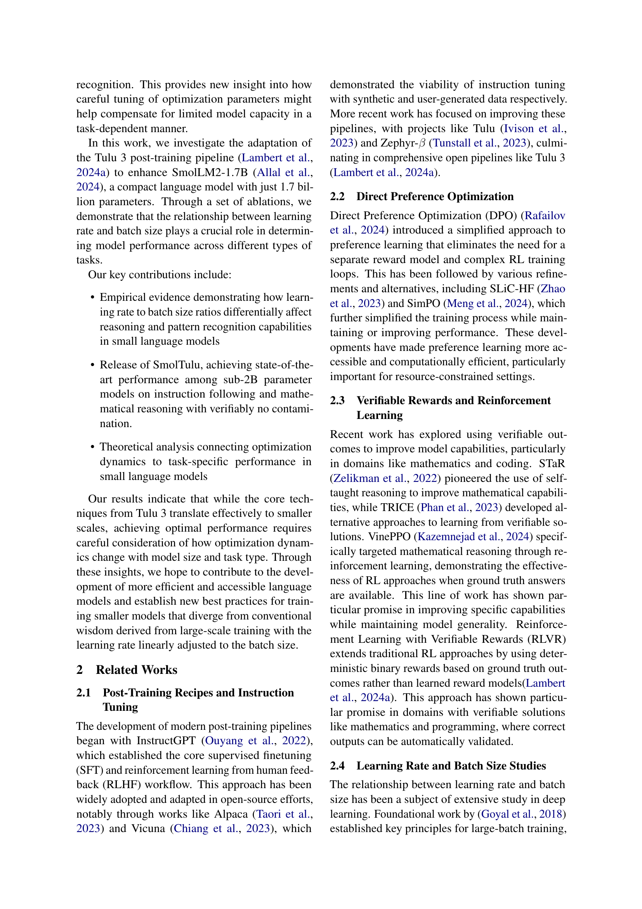
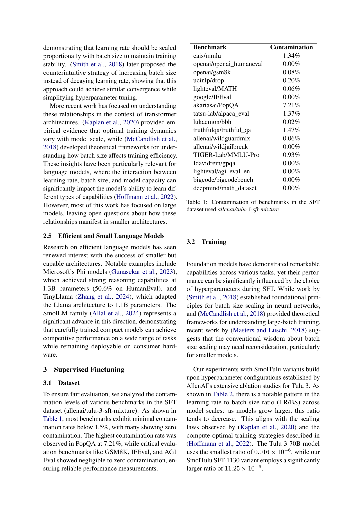
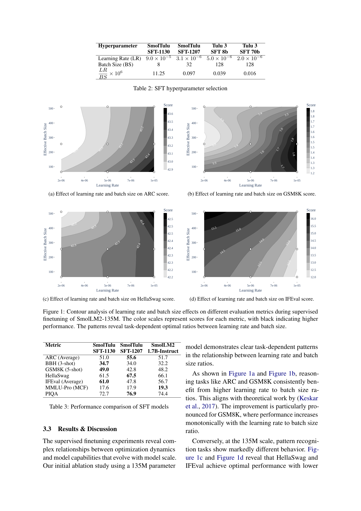
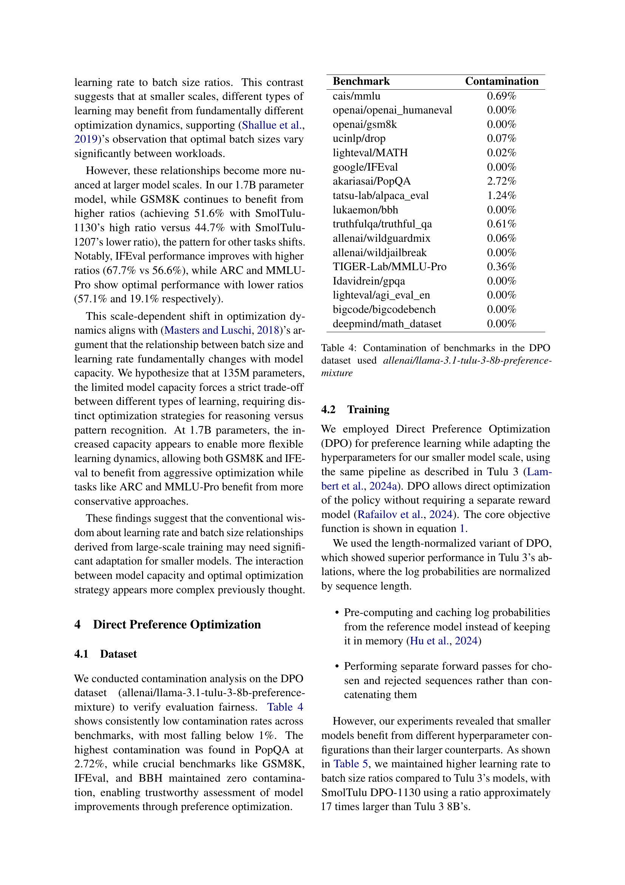
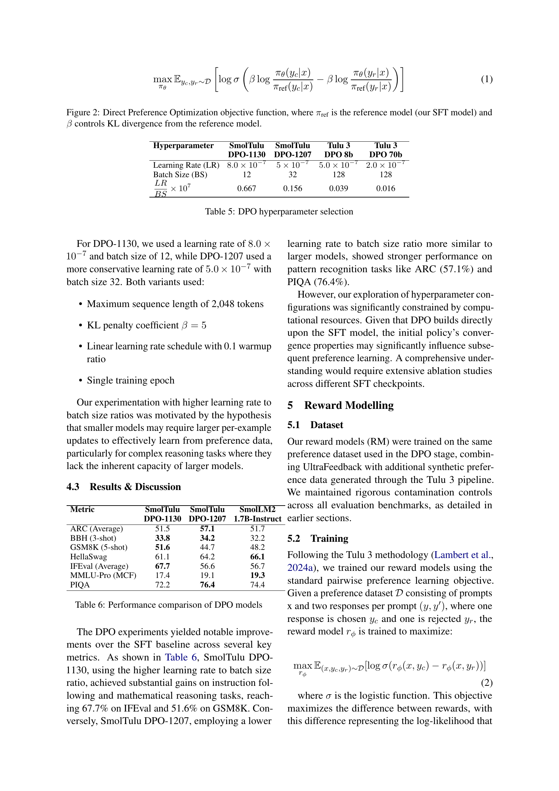
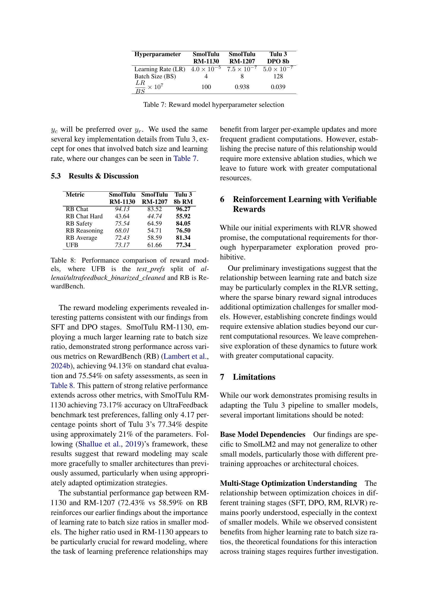
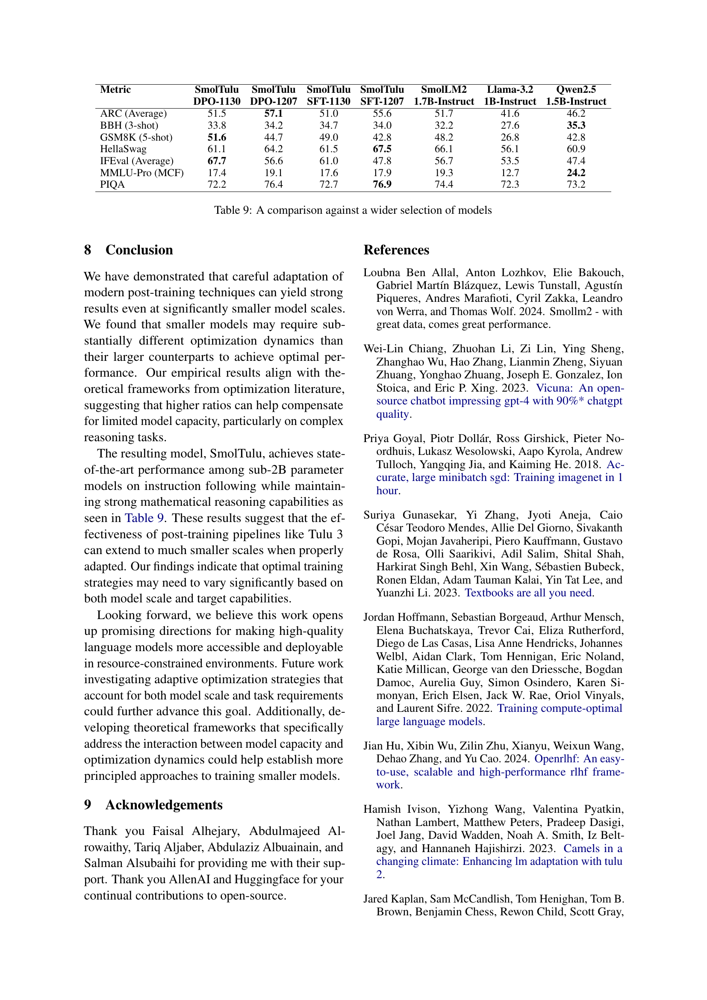
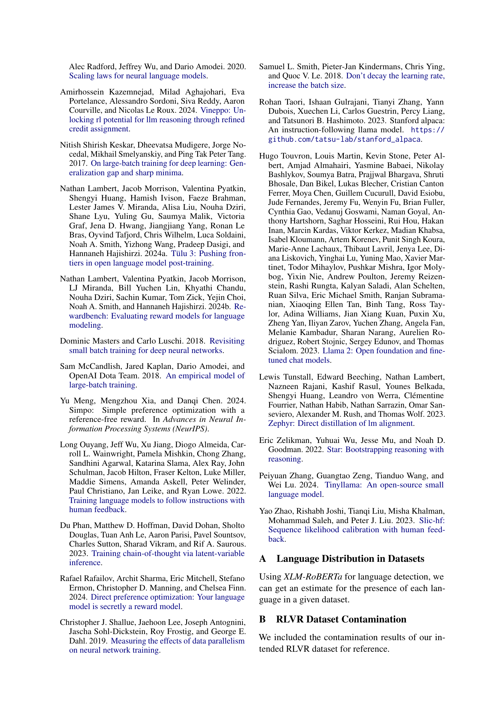
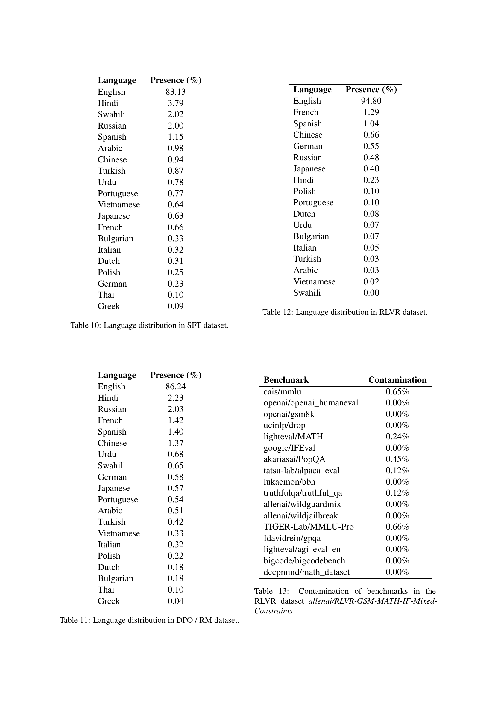

 


 2412.08347 
 Sultan Alrashed et el. 
 
 🤗 2024-12-16 
 



↗ arXiv


↗ Hugging Face


↗ Papers with Code


### TL;DR



**Large language models (LLMs) excel, but smaller models are crucial for broader access**.  Existing post-training techniques, effective on LLMs, remain underexplored on smaller scales, hindering efficient model deployment in resource-limited settings. It also raises a problem on the lack of understanding in scaling these techniques into SLMs, particularly on various optimization strategies.  This research tackles efficient post-training for smaller language models. **Existing training strategies for large language models (LLMs) might not suit smaller ones.**

This paper explores how training dynamics, specifically the learning rate to batch size ratio, impact smaller model performance.  By adapting AllenAI's Tulu 3 pipeline to a 1.7B parameter model, the research demonstrates that **optimizing this ratio is crucial**, especially for complex reasoning tasks. **Higher ratios boosted reasoning**, while lower ones benefited pattern recognition. This careful tuning yielded state-of-the-art results for smaller models, demonstrating that efficient model adaptation can bridge the gap between smaller and larger language models.



#### Key Takeaways


 Reasoning tasks in small language models (SLMs) benefit from higher learning rate to batch size ratios, while pattern recognition tasks favor lower ratios. 



 Careful optimization is crucial for maximizing SLM performance, sometimes surpassing larger models on specific tasks. 



 The Tulu 3 training pipeline, adapted for smaller models, proves effective, democratizing access to powerful language models and showing potential for even greater efficiency with careful tuning of training parameters such as learning rate and batch size 


#### Why does it matter?
**Smaller language models (SLMs) are crucial for democratizing access to AI but often underperform larger models**. This research demonstrates how careful tuning, especially of the learning rate to batch size ratio, can **significantly enhance SLM capabilities**, opening new avenues for efficient model deployment. The study's insights into optimization dynamics and task-specific tuning are valuable for researchers exploring efficient deep learning and contribute to the growing field of SLM optimization, pushing the boundaries of what's possible with smaller, more accessible models.

------
#### Visual Insights

> 🔼 이 그림은 SmolLM2-135M 모델의 지도 미세 조정(Supervised Fine-tuning) 과정에서 학습률과 배치 크기가 ARC 점수에 미치는 영향을 등고선 분석으로 보여줍니다. 색상 스케일은 각 지표에 대한 점수를 나타내며, 검은색일수록 성능이 높다는 것을 의미합니다. 이 그림을 통해 학습률과 배치 크기 비율의 최적값이 작업에 따라 다르다는 것을 알 수 있습니다.
> 

> 
read the caption

> (a) Effect of learning rate and batch size on ARC score.
> 


| Benchmark | Contamination |
|---|---| 
| cais/mmlu | 1.34% |
| openai/openai_humaneval | 0.00% |
| openai/gsm8k | 0.08% |
| ucinlp/drop | 0.20% |
| lighteval/MATH | 0.06% |
| google/IFEval | 0.00% |
| akariasai/PopQA | 7.21% |
| tatsu-lab/alpaca_eval | 1.37% |
| lukaemon/bbh | 0.02% |
| truthfulqa/truthful_qa | 1.47% |
| allenai/wildguardmix | 0.06% |
| allenai/wildjailbreak | 0.00% |
| TIGER-Lab/MMLU-Pro | 0.93% |
| Idavidrein/gpqa | 0.00% |
| lighteval/agi_eval_en | 0.00% |
| bigcode/bigcodebench | 0.00% |
| deepmind/math_dataset | 0.00% |

> 🔼 이 표는 SFT 데이터셋(allenai/tulu-3-sft-mixture)에 사용된 벤치마크들의 오염률을 보여줍니다. 오염률이란, 훈련 데이터셋에 평가 데이터셋의 내용이 포함되어 있는 비율을 의미하며, 이는 모델 평가의 신뢰도를 떨어뜨릴 수 있습니다. 표에서 볼 수 있듯이 대부분의 벤치마크는 1.5% 미만의 낮은 오염률을 보이고 있으며, GSM8K, IFEval, AGI Eval과 같은 주요 평가 벤치마크는 오염률이 거의 0에 가깝습니다.
> 

> 
read the caption

> Table 1: Contamination of benchmarks in the SFT dataset used allenai/tulu-3-sft-mixture
> 

### In-depth insights

#### LR/BS Ratios in SLMs
**학습률(LR) 대 배치 크기(BS) 비율은 소규모 언어 모델(SLM)의 성능에 큰 영향을 미칩니다.** 본 연구는 추론과 패턴 인식 작업에서 LR/BS 비율의 효과를 분석했습니다. 추론 작업의 경우, 더 높은 LR/BS 비율이 성능 향상을 가져오는 것으로 나타났으며, 이는 더 잦은 매개변수 업데이트와 일치합니다. 반대로 패턴 인식 작업은 더 낮은 비율에서 최적의 성능을 보였습니다. 이러한 차이는 모델 용량의 제약과 최적화 전략의 필요성을 강조합니다. **흥미롭게도, 더 큰 모델에서는 LR/BS 비율의 영향이 작업 유형에 따라 덜 뚜렷해지는 경향이 있었습니다.** 이러한 관찰은 모델 용량이 증가함에 따라 최적화의 유연성이 향상됨을 시사합니다. **SLM 교육을 위한 최적의 LR/BS 비율을 결정하는 데 있어 모델 크기와 작업 유형 간의 복잡한 상호 작용에 대한 추가 조사가 필요합니다.**

#### SmolTulu Optimization
**SmolTulu 최적화**는 작은 언어 모델의 효율적인 미세 조정에 중점을 둡니다. 주요 목표는 **학습률과 배치 크기 비율을 조정하여** 추론 및 패턴 인식 작업 모두에서 성능을 향상시키는 것입니다. 연구에 따르면 더 높은 비율은 GSM8K와 같은 **추론 벤치마크**에 유익한 반면 낮은 비율은 HellaSwag 및 IFEval과 같은 **패턴 인식**에서 더 나은 결과를 산출합니다. 이러한 발견은 모델 크기와 작업 유형에 따라 **최적의 비율이 다름**을 시사합니다. SmolTulu는 또한 **Direct Preference Optimization(DPO)**를 활용하여 보상 모델 없이 정책을 직접 최적화합니다. 이 방법은 계산 효율성을 향상시키고 더 작은 모델에 적합합니다. 또한 연구는 **검증 가능한 보상을 사용한 강화 학습(RLVR)**의 잠재력을 탐구하지만 계산 제약으로 인해 철저한 탐색이 제한됩니다. 전반적으로 SmolTulu 최적화는 **작은 언어 모델을 위한 효율적이고 효과적인 훈련 전략을** 향상시키는 데 중점을 둡니다.

#### Task-Specific Dynamics
**작업별 동적 특성**은 다양한 작업에서 모델 최적화의 복잡성을 강조합니다. 추론과 패턴 인식은 서로 다른 최적화 전략이 필요함이 분명합니다. 예를 들어 GSM8K와 같은 추론 벤치마크는 높은 학습률 대 배치 크기 비율에서 이점을 얻는 반면 HellaSwag 및 IFEval과 같은 패턴 인식 작업은 낮은 비율에서 더 나은 성능을 보입니다. 이러한 차이는 작업 유형에 따라 **모델 용량 할당** 방식이 다름을 시사합니다. 흥미롭게도 이러한 동적 특성은 모델 규모에 따라 변합니다. 소규모 모델의 경우 이러한 차이는 더욱 두드러지지만, 대규모 모델에서는 이러한 경계가 모호해집니다. 이러한 관찰은 작업의 복잡성, 모델 크기 및 최적화 전략 간의 **복잡한 상호 작용**을 보여줍니다. 이러한 복잡성을 완전히 이해하려면 추가 연구가 필요하지만, 이러한 초기 결과는 더 효율적이고 작업별 모델 최적화를 위한 **맞춤형 전략** 개발의 중요성을 보여줍니다.

#### Scaling Laws in SFT/DPO
**SFT(Supervised Fine-tuning)**와 **DPO(Direct Preference Optimization)**에서 스케일링 법칙은 모델 크기, 데이터셋 크기, 학습률, 배치 크기 등 다양한 요소가 모델 성능에 미치는 영향을 분석하는 데 중요한 역할을 합니다. 일반적으로 모델과 데이터셋 크기가 증가할수록 성능이 향상되는 경향이 있지만, 최적의 학습률과 배치 크기는 작업 및 모델 아키텍처에 따라 다릅니다. 스케일링 법칙을 이해하면 **계산 효율성을 유지하면서 최상의 성능을 달성**하기 위한 적절한 하이퍼파라미터를 선택하는 데 도움이 됩니다. 특히 작은 모델의 경우, 스케일링 법칙을 신중하게 조정하여 **대규모 모델과의 성능 격차를 줄이는 것**이 중요합니다. 이러한 법칙은 모델의 일반화 능력과 최적화 과정에도 영향을 미치므로, SFT 및 DPO에서 스케일링 법칙을 탐구하는 것은 효율적이고 효과적인 모델 학습에 필수적입니다.

#### RLVR Challenges
**RLVR(Reinforcement Learning with Verifiable Rewards)은 언어 모델 학습에 유망한 접근 방식이지만, 특히 작은 모델에 적용할 때 몇 가지 어려움이 있습니다.** 첫째, 검증 가능한 보상 신호는 본질적으로 sparse합니다. 모든 출력에 대해 명확한 옳고 그름이 있는 것은 아니므로 모델이 효과적으로 학습하기 어려울 수 있습니다. 둘째, 작은 모델은 큰 모델보다 최적화하기 까다로울 수 있습니다. **학습률과 배치 크기의 관계는 모델 성능에 큰 영향을 미칩니다**, 적절한 균형을 찾기가 어려울 수 있습니다. 마지막으로, **계산 리소스의 제약**은 철저한 실험을 어렵게 만들고 최적의 hyperparameter 설정을 찾는 것을 방해합니다. 이러한 문제에도 불구하고, **RLVR은 추론 능력 향상에 큰 잠재력을 가지고 있기에 추가 연구가 필요**합니다.

### More visual insights

More on figures

> 🔼 SmolLM2-135M 모델의 지도 미세 조정 중 학습률과 배치 크기가 GSM8K 점수에 미치는 영향을 보여주는 등고선 분석입니다. 색상 척도는 각 지표의 점수를 나타내며 검은색일수록 성능이 더 높다는 것을 의미합니다. 이 패턴은 학습률과 배치 크기의 최적 비율이 작업에 따라 다르다는 것을 보여줍니다. GSM8K와 같은 추론 작업은 학습률 대 배치 크기 비율이 높을수록 성능이 향상됩니다.
> 

> 
read the caption

> (b) Effect of learning rate and batch size on GSM8K score.
> 

> 🔼 SmolLM2-135M 모델의 지도 미세 조정 중 학습률과 배치 크기가 HellaSwag 점수에 미치는 영향을 등고선 분석으로 보여주는 그림입니다. 색상 척도는 각 지표의 점수를 나타내며, 검은색일수록 성능이 높습니다. 이 패턴은 학습률과 배치 크기 간의 작업별 최적 비율을 보여줍니다. HellaSwag에서 학습률과 배치 크기 비율이 낮을 때 최적의 성능을 달성하는 것을 확인할 수 있습니다.
> 

> 
read the caption

> (c) Effect of learning rate and batch size on HellaSwag score.
> 

> 🔼 SmolLM2-135M 모델의 지도 미세 조정 중 학습률과 배치 크기가 IFEval 점수에 미치는 영향을 등고선 분석으로 보여주는 그림입니다. 색상 척도는 각 지표의 점수를 나타내며, 검은색일수록 성능이 높다는 것을 나타냅니다. 이 그림은 학습률과 배치 크기의 비율이 작업에 따라 최적의 값을 가짐을 보여줍니다. 특히 IFEval의 경우, 낮은 학습률 대 배치 크기 비율에서 최적의 성능을 달성하는 것을 볼 수 있습니다. 이는 추론 작업과 패턴 인식 작업에 대해 서로 다른 최적화 전략이 필요함을 시사합니다.
> 

> 
read the caption

> (d) Effect of learning rate and batch size on IFEval score.
> 

More on tables


| Hyperparameter | SmolTulu | SmolTulu | Tulu 3 | Tulu 3 |
|---|---|---|---|---| 
|  | **SFT-1130** | **SFT-1207** | **SFT 8b** | **SFT 70b** |
| Learning Rate (LR) | 9.0e-5 | 3.1e-6 | 5.0e-6 | 2.0e-6 |
| Batch Size (BS) | 8 | 32 | 128 | 128 |
| LR/BS x 10^6 | 11.25 | 0.097 | 0.039 | 0.016 |
> 🔼 이 표는 지도 미세 조정(SFT) 단계에서 사용된 하이퍼파라미터를 보여줍니다. 다양한 크기의 모델(SmolTulu, Tulu 3)에 대한 학습률, 배치 크기 및 학습률 대 배치 크기 비율을 비교합니다. SmolTulu 모델은 더 큰 학습률 대 배치 크기 비율을 사용하는 반면 Tulu 3 모델은 더 작은 비율을 사용하는 것을 보여줍니다. 이러한 비율은 모델 크기 및 작업 유형에 따라 최적의 학습 역학이 어떻게 변하는지 보여줍니다.
> 

> 
read the caption

> Table 2: SFT hyperparameter selection
> 


| Metric | SmolTulu SFT-1130 | SmolTulu SFT-1207 | SmolLM2 1.7B-Instruct |
|---|---|---|---| 
| ARC (Average) | 51.0 | **55.6** | 51.7 |
| BBH (3-shot) | **34.7** | 34.0 | 32.2 |
| GSM8K (5-shot) | **49.0** | 42.8 | 48.2 |
| HellaSwag | 61.5 | **67.5** | 66.1 |
| IFEval (Average) | **61.0** | 47.8 | 56.7 |
| MMLU-Pro (MCF) | 17.6 | 17.9 | **19.3** |
| PIQA | 72.7 | **76.9** | 74.4 |
> 🔼 SFT 모델 성능 비교표: SmolTulu SFT-1130, SmolTulu SFT-1207, SmolLM2 1.7B-Instruct 모델의 ARC, BBH, GSM8K, HellaSwag, IFEval, MMLU-Pro, PIQA 벤치마크 점수 비교
> 

> 
read the caption

> Table 3: Performance comparison of SFT models
> 


| Benchmark | Contamination |
|---|---| 
| cais/mmlu | 0.69% |
| openai/openai_humaneval | 0.00% |
| openai/gsm8k | 0.00% |
| ucinlp/drop | 0.07% |
| lighteval/MATH | 0.02% |
| google/IFEval | 0.00% |
| akariasai/PopQA | 2.72% |
| tatsu-lab/alpaca_eval | 1.24% |
| lukaemon/bbh | 0.00% |
| truthfulqa/truthful_qa | 0.61% |
| allenai/wildguardmix | 0.06% |
| allenai/wildjailbreak | 0.00% |
| TIGER-Lab/MMLU-Pro | 0.36% |
| Idavidrein/gpqa | 0.00% |
| lighteval/agi_eval_en | 0.00% |
| bigcode/bigcodebench | 0.00% |
| deepmind/math_dataset | 0.00% |
> 🔼 이 표는 사전 훈련된 언어 모델(llama-3.1-tulu-3-8b-preference-mixture)을 미세 조정하는 데 사용된 DPO 데이터 세트에서 벤치마크의 오염 비율을 보여줍니다. 대부분의 벤치마크는 1% 미만의 낮은 오염률을 보이며, GSM8K, IFEval, BBH와 같은 핵심 벤치마크는 오염이 전혀 없습니다. PopQA에서 가장 높은 오염률인 2.72%가 관찰되었습니다.
> 

> 
read the caption

> Table 4: Contamination of benchmarks in the DPO dataset used allenai/llama-3.1-tulu-3-8b-preference-mixture
> 


| Hyperparameter | SmolTulu DPO-1130 | SmolTulu DPO-1207 | Tulu 3 DPO 8b | Tulu 3 DPO 70b |
|---|---|---|---|---| 
| Learning Rate (LR) | $8.0 \times 10^{-7}$ | $5 \times 10^{-7}$ | $5.0 \times 10^{-7}$ | $2.0 \times 10^{-7}$ |
| Batch Size (BS) | 12 | 32 | 128 | 128 |
| $\frac{LR}{BS} \times 10^{7}$ | 0.667 | 0.156 | 0.039 | 0.016 |
> 🔼 이 표는 SmolTulu, Tulu 3 모델의 DPO 단계에서 사용된 하이퍼파라미터 설정을 보여줍니다. 학습률, 배치 크기, 그리고 그 비율이 모델 크기에 따라 어떻게 다른지를 나타냅니다.
> 

> 
read the caption

> Table 5: DPO hyperparameter selection
> 


| Metric | SmolTulu DPO-1130 | SmolTulu DPO-1207 | SmolLM2 1.7B-Instruct |
|---|---|---|---| 
| ARC (Average) | 51.5 | **57.1** | 51.7 |
| BBH (3-shot) | **33.8** | **34.2** | 32.2 |
| GSM8K (5-shot) | **51.6** | 44.7 | 48.2 |
| HellaSwag | 61.1 | 64.2 | **66.1** |
| IFEval (Average) | **67.7** | 56.6 | 56.7 |
| MMLU-Pro (MCF) | 17.4 | 19.1 | **19.3** |
| PIQA | 72.2 | **76.4** | 74.4 |
> 🔼 이 표는 Direct Preference Optimization(DPO) 모델들의 성능 비교를 보여줍니다. SmolTulu DPO-1130과 SmolTulu DPO-1207 두 가지 DPO 모델의 성능을  SmolLM2 1.7B-Instruct 모델과 여러 벤치마크에서 비교하고 있습니다. SmolTulu DPO-1130은 IFEval과 GSM8K에서 가장 좋은 성능을 보여주는 반면 다른 모델들은 ARC와 PIQA에서 더 나은 결과를 보여줍니다.
> 

> 
read the caption

> Table 6: Performance comparison of DPO models
> 


| Hyperparameter | SmolTulu | SmolTulu | Tulu 3 |
|---|---|---|---| 
|  | **RM-1130** | **RM-1207** | **DPO 8b** |
| Learning Rate (LR) | 4.0 × 10⁻⁵ | 7.5 × 10⁻⁷ | 5.0 × 10⁻⁷ |
| Batch Size (BS) | 4 | 8 | 128 |
| LR/BS × 10⁷ | 100 | 0.938 | 0.039 |
> 🔼 이 표는 보상 모델(Reward Model, RM) 학습에 사용된 하이퍼파라미터를 보여줍니다. SmolTulu RM-1130, SmolTulu RM-1207, 그리고 Tulu 3 DPO 8b 모델의 학습률(Learning Rate), 배치 크기(Batch Size), 그리고 학습률과 배치 크기의 비율(LR/BS)이 제시되어 있습니다. SmolTulu 모델들은 Tulu 3 모델에 비해 더 높은 LR/BS 비율을 사용한 것이 특징입니다.
> 

> 
read the caption

> Table 7: Reward model hyperparameter selection
> 


| Metric | SmolTulu RM-1130 | SmolTulu RM-1207 | Tulu 3 8b RM |
|---|---|---|---| 
| RB Chat | *94.13* | 83.52 | **96.27** |
| RB Chat Hard | 43.64 | *44.74* | **55.92** |
| RB Safety | *75.54* | 64.59 | **84.05** |
| RB Reasoning | *68.01* | 54.71 | **76.50** |
| RB Average | *72.43* | 58.59 | **81.34** |
| UFB | *73.17* | 61.66 | **77.34** |
> 🔼 이 표는 보상 모델의 성능을 비교한 표입니다. UFB는 allenai/ultrafeedback_binarized_cleaned의 test_prefs 분할이고 RB는 RewardBench입니다. SmolTulu RM-1130은 표준 채팅 평가에서 94.13%, 안전 평가에서 75.54%를 달성하는 등 다양한 지표에서 RewardBench에서 강력한 성능을 보였습니다. 이러한 강력한 상대적 성능 패턴은 다른 지표에도 적용되며, SmolTulu RM-1130은 UltraFeedback 벤치마크 테스트 선호도에서 73.17%의 정확도를 달성하여 매개변수의 약 21%만 사용함에도 불구하고 Tulu 3의 77.34%에 불과 4.17% 포인트 차이로 뒤처졌습니다. (Shallue et al., 2019)의 프레임워크에 따르면, 이러한 결과는 특히 적절하게 조  된 최적화 전략을 사용할 때 보상 모델링이 이전에 가정했던 것보다 더 작은 아키텍처로 더 우아하게 확장될 수 있음을 시사합니다. RM-1130과 RM-1207(RB에서 72.43% 대 58.59%) 간의 상당한 성능 격차는 소규모 모델에서 학습률 대 배치 크기 비율의 중요성에 대한 이전 결과를 강화합니다. RM-1130에서 사용된 더 높은 비율은 특히 선호도 관계를 학습하는 작업에서 보상 모델링에 중요한 것으로 보입니다. 여기서 더 큰 예시당 업데이트와 더 빈번한 그라데이션 계산의 이점을 얻을 수 있습니다. 그러나 이러한 관계의 정확한 특성을 확립하려면 더 광범위한 절제 연구가 필요하며, 이는 더 큰 계산 리소스를 사용한 향후 작업으로 남겨둡니다.
> 

> 
read the caption

> Table 8: Performance comparison of reward models, where UFB is the test_prefs split of allenai/ultrafeedback_binarized_cleaned and RB is RewardBench.
> 


| Metric | SmolTulu DPO-1130 | SmolTulu DPO-1207 | SmolTulu SFT-1130 | SmolTulu SFT-1207 | SmolLM2 1.7B-Instruct | Llama-3.2 1B-Instruct | Qwen2.5 1.5B-Instruct |
|---|---|---|---|---|---|---|---|
| ARC (Average) | 51.5 | **57.1** | 51.0 | 55.6 | 51.7 | 41.6 | 46.2 |
| BBH (3-shot) | 33.8 | 34.2 | 34.7 | 34.0 | 32.2 | 27.6 | **35.3** |
| GSM8K (5-shot) | **51.6** | 44.7 | 49.0 | 42.8 | 48.2 | 26.8 | 42.8 |
| HellaSwag | 61.1 | 64.2 | 61.5 | **67.5** | 66.1 | 56.1 | 60.9 |
| IFEval (Average) | **67.7** | 56.6 | 61.0 | 47.8 | 56.7 | 53.5 | 47.4 |
| MMLU-Pro (MCF) | 17.4 | 19.1 | 17.6 | 17.9 | 19.3 | 12.7 | **24.2** |
| PIQA | 72.2 | 76.4 | 72.7 | **76.9** | 74.4 | 72.3 | 73.2 |
> 🔼 다양한 모델들과 SmolTulu의 성능을 비교한 표입니다. SmolTulu DPO-1130, SmolTulu DPO-1207, SmolTulu SFT-1130, SmolTulu SFT-1207, SmolLM2 1.7B-Instruct, Llama-3.2 1B-Instruct, Qwen2.5 1.5B-Instruct 모델들의 ARC, BBH, GSM8K, HellaSwag, IFEval, MMLU-Pro, PIQA 벤치마크에서의 성능을 비교하여 SmolTulu의 성능 우위를 보여줍니다.
> 

> 
read the caption

> Table 9: A comparison against a wider selection of models
> 


| Language | Presence (%) |
|---|---| 
| English | 83.13 |
| Hindi | 3.79 |
| Swahili | 2.02 |
| Russian | 2.00 |
| Spanish | 1.15 |
| Arabic | 0.98 |
| Chinese | 0.94 |
| Turkish | 0.87 |
| Urdu | 0.78 |
| Portuguese | 0.77 |
| Vietnamese | 0.64 |
| Japanese | 0.63 |
| French | 0.66 |
| Bulgarian | 0.33 |
| Italian | 0.32 |
| Dutch | 0.31 |
| Polish | 0.25 |
| German | 0.23 |
| Thai | 0.10 |
| Greek | 0.09 |
> 🔼 SFT 데이터셋에 사용된 allenai/tulu-3-sft-mixture의 언어 분포를 나타낸 표입니다. 데이터셋에서 영어가 83.13%로 가장 많이 사용되었고, 그 뒤를 힌디어(3.79%), 스와힐리어(2.02%), 러시아어(2.00%) 등이 차지하고 있습니다.
> 

> 
read the caption

> Table 10: Language distribution in SFT dataset.
> 


| Language | Presence (%) |
|---|---| 
| English | 86.24 |
| Hindi | 2.23 |
| Russian | 2.03 |
| French | 1.42 |
| Spanish | 1.40 |
| Chinese | 1.37 |
| Urdu | 0.68 |
| Swahili | 0.65 |
| German | 0.58 |
| Japanese | 0.57 |
| Portuguese | 0.54 |
| Arabic | 0.51 |
| Turkish | 0.42 |
| Vietnamese | 0.33 |
| Italian | 0.32 |
| Polish | 0.22 |
| Dutch | 0.18 |
| Bulgarian | 0.18 |
| Thai | 0.10 |
| Greek | 0.04 |
> 🔼 이 표는 DPO(Direct Preference Optimization) 및 RM(Reward Modeling) 데이터셋에서 각 언어가 차지하는 비율을 보여줍니다. 표에서 볼 수 있듯이 영어가 가장 큰 비중을 차지하고 있으며, 그 외 다양한 언어들이 포함되어 있습니다.
> 

> 
read the caption

> Table 11: Language distribution in DPO / RM dataset.
> 


| Language | Presence (%) |
|---|---| 
| English | 94.80 |
| French | 1.29 |
| Spanish | 1.04 |
| Chinese | 0.66 |
| German | 0.55 |
| Russian | 0.48 |
| Japanese | 0.40 |
| Hindi | 0.23 |
| Polish | 0.10 |
| Portuguese | 0.10 |
| Dutch | 0.08 |
| Urdu | 0.07 |
| Bulgarian | 0.07 |
| Italian | 0.05 |
| Turkish | 0.03 |
| Arabic | 0.03 |
| Vietnamese | 0.02 |
| Swahili | 0.00 |
> 🔼 RLVR 데이터셋의 언어 분포를 보여주는 표입니다. 주로 영어로 구성되어 있으며, 프랑스어, 스페인어, 중국어, 독일어, 러시아어, 일본어 등 다양한 언어가 소량 포함되어 있습니다.
> 

> 
read the caption

> Table 12: Language distribution in RLVR dataset.
> 


| Benchmark | Contamination |
|---|---| 
| cais/mmlu | 0.65% |
| openai/openai_humaneval | 0.00% |
| openai/gsm8k | 0.00% |
| ucinlp/drop | 0.00% |
| lighteval/MATH | 0.24% |
| google/IFEval | 0.00% |
| akariasai/PopQA | 0.45% |
| tatsu-lab/alpaca_eval | 0.12% |
| lukaemon/bbh | 0.00% |
| truthfulqa/truthful_qa | 0.12% |
| allenai/wildguardmix | 0.00% |
| allenai/wildjailbreak | 0.00% |
| TIGER-Lab/MMLU-Pro | 0.66% |
| Idavidrein/gpqa | 0.00% |
| lighteval/agi_eval_en | 0.00% |
| bigcode/bigcodebench | 0.00% |
| deepmind/math_dataset | 0.00% |
> 🔼 RLVR 데이터셋(allenai/RLVR-GSM-MATH-IF-Mixed-Constraints)의 벤치마크별 오염도를 나타낸 표입니다. 대부분의 벤치마크에서 오염도는 1% 미만으로 낮게 나타났으며, GSM8K, IFEval, BBH와 같은 중요 벤치마크는 오염도 0%를 기록했습니다.
> 

> 
read the caption

> Table 13: Contamination of benchmarks in the RLVR dataset allenai/RLVR-GSM-MATH-IF-Mixed-Constraints
> 

### Full paper



