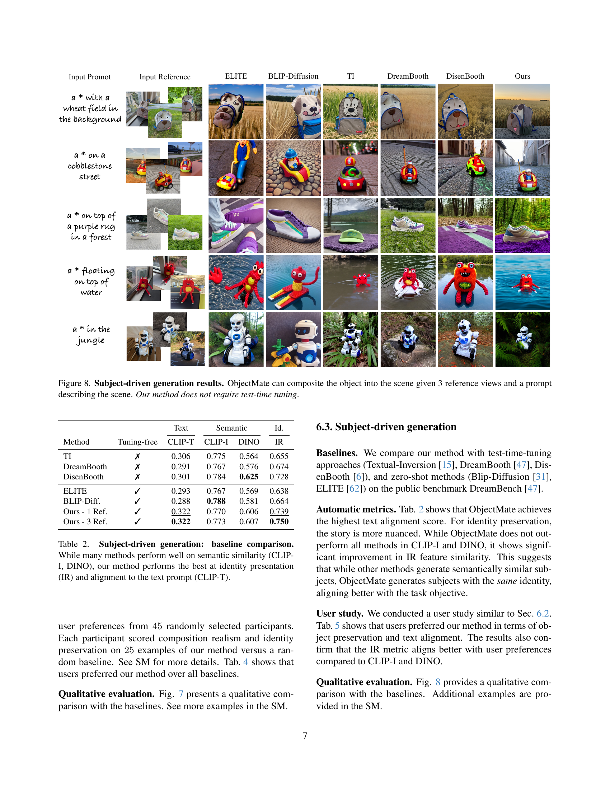

 


 2412.08645 
 Daniel Winter et el. 
 
 🤗 2024-12-16 
 



↗ arXiv


↗ Hugging Face


↗ Papers with Code


### TL;DR



**객체 삽입 및 주체 기반 생성은 어려운 작업**이며, 기존 방법은 사진처럼 사실적인 포즈 및 조명으로 객체를 장면에 매끄럽게 합성하고 객체의 ID를 유지하는 데 어려움을 겪음. 대규모 감독이 이러한 목표를 달성하는 데 필수적이지만 충분한 데이터를 수동으로 수집하는 것은 비용이 많이 듦.

이 논문에서는 **객체 반복 우선순위**를 소개하며, 이는 대량 생산된 많은 객체가 다양한 장면, 포즈 및 조명 조건에서 대규모 레이블이 지정되지 않은 데이터 세트에 걸쳐 반복된다는 것을 보여줌. 이 우선순위를 활용하여, 저자는 대규모 감독 데이터 세트를 만들고 **ObjectMate**라는 새로운 객체 합성 방법을 훈련시킴. ObjectMate는 **객체 ID 보존 및 사실적인 합성 측면에서 최첨단 결과**를 달성. 또한, 저자는 지상 진실 예제를 포함하는 **새로운 평가 데이터 세트 및 ID 보존에 대한 새로운 메트릭**을 제안함.



#### Key Takeaways


 ObjectMate는 객체 반복 우선순위를 활용하여 대규모의 감독 데이터 세트를 생성하여 튜닝 없이 객체 삽입 및 주체 기반 생성을 가능하게 함. 



 ObjectMate는 ID 보존 및 사실적 구성 측면에서 기존 객체 삽입 및 주체 기반 생성 방법을 능가. 



 ObjectMate는 지상 진실 예제를 포함하는 새로운 평가 데이터 세트와 ID 보존에 대한 새로운 메트릭을 제공하여 평가 프로토콜을 개선함. 


#### Why does it matter?
**객체 합성에 대한 대규모 감독 데이터 세트 생성으로 획기적인 연구**. 기존 방법보다 **더 나은 ID 보존 및 사실적인 합성**을 달성하며, 튜닝이 필요 없음. 이를 통해 연구자들은 **효율적인 훈련 및 추론**을 할 수 있고 **새로운 객체 합성 모델 개발**을 위한 길을 열어줍니다. 벤치마크 데이터 세트 및 메트릭은 **미래 연구를 위한 새로운 표준**을 제시.

------
#### Visual Insights

> 🔼 ObjectMate는 객체 합성을 위한 튜닝 없는 새로운 방법입니다. 객체 삽입과 주제 기반 생성이라는 두 가지 하위 작업을 병합합니다. 그림 1은 ObjectMate가 사진처럼 사실적인 포즈와 조명으로 장면에 객체를 합성하면서 객체의 정체성을 유지하는 방법을 보여줍니다. 장면은 이미지나 텍스트를 통해 지정할 수 있으며 테스트 시점 튜닝을 사용하지 않습니다. ObjectMate는 참조 이미지와 배경 이미지의 조명, 포즈, 구성을 조화시키는 데 탁월합니다.
> 

> 
read the caption

> Figure 1: Our method composes objects into scenes with photorealistic pose and lighting, while preserving their identity. The scene can be specified via an image or text. We do not use test-time tuning.
> 


| Method | Composition | Identity | 
|---|---|---| 
| | CLIP-I | DINO | IR |
| Paint-by-Example | 0.898 | 0.800 | 0.544 |
| ObjectStitch | 0.905 | 0.793 | 0.564 |
| AnyDoor | 0.916 | 0.822 | 0.738 |
| Ours - 1 Ref. | 0.934 | 0.868 | 0.803 |
| Ours - 3 Ref. | **0.940** | **0.885** | **0.858** |

> 🔼 객체 삽입에 대한 여러 기준 모델과 ObjectMate를 비교한 표입니다. ObjectMate는 구성 및 ID 보존 측면에서 다른 모든 기준선보다 성능이 뛰어납니다.
> 

> 
read the caption

> Table 1: Object insertion: baseline comparison. Our method achieves better composition and identity preservation.
> 

### In-depth insights

#### Recurrence Prior
**객체 반복 사전 확률**은 대규모 데이터셋에서 동일한 객체가 다양한 장면, 포즈, 조명 조건에서 반복해서 나타나는 경향을 나타냅니다. 대량 생산되는 객체의 경우 이러한 경향이 더욱 두드러집니다. 본 논문에서는 이러한 사전 확률을 활용하여 객체 삽입 및 주체 중심 생성을 위한 대규모 지도 학습 데이터셋을 생성합니다. 이 데이터셋은 단순한 확산 모델조차 최첨단 성능을 달성할 수 있도록 합니다. 즉, 사전 확률을 활용하면 **수동 데이터 수집의 한계를 극복**하고 더욱 사실적이고 효율적인 객체 합성 모델을 학습시킬 수 있습니다.

#### ObjectMate Method
**ObjectMate**는 객체 삽입 및 주제 기반 생성을 위한 튜닝 없는 새로운 방법입니다. 대규모 자율 학습 이미지 데이터셋에서 객체의 반복을 활용하여 튜닝이 필요 없는 획기적인 접근 방식을 제시합니다. 이 방법은 객체의 다양한 시점, 장면, 조명 조건, 포즈를 포함하는 방대한 감독 데이터셋을 생성합니다. 객체 삽입의 경우, ObjectMate는 그림자와 반사를 제거하는 **카운터팩츄얼 객체 제거 모델**을 사용하여 배경 이미지를 추출합니다. 주제 기반 생성의 경우, 이미지-텍스트 모델을 사용하여 텍스트 설명을 추출합니다. ObjectMate는 이 데이터셋을 사용하여 장면 설명과 객체 뷰를 합성 이미지에 매핑하는 확산 모델을 훈련합니다. **대규모 감독 데이터셋**을 통해 간단한 아키텍처로도 최첨단 결과를 달성할 수 있습니다. ObjectMate는 객체 삽입과 주제 기반 생성 모두에서 최첨단 결과를 달성하며, **여러 참조 뷰를 활용**할 수 있는 빠른 제로샷 방법입니다. 또한, **객체 ID 보존** 및 사실적인 합성을 위한 새로운 메트릭을 도입하여 평가 프로토콜을 개선합니다.

#### Dataset Creation
**ObjectMate는 대규모 감독 데이터 세트를 생성하는 데 중점을 둡니다.** 이는 기존 방법의 한계를 해결하기 위한 핵심 단계입니다. 수동 수집은 비용이 많이 들고, 단일 이미지 보강은 다양성이 부족하며, 비디오 기반 방법은 포즈, 조명 및 장면의 다양성이 제한됩니다. ObjectMate는 **객체 재발생 사전**을 활용하여 감독되지 않은 이미지 데이터 세트에서 대규모 멀티 뷰 데이터를 추출합니다. 이 접근 방식을 통해 **다양한 포즈, 조명 조건 및 장면에서 객체의 여러 보기를 포함하는 풍부한 데이터 세트를 만들 수 있습니다.** 웹 기반 데이터 세트에서 객체를 감지 및 자르고 인스턴스 검색(IR) 기능을 사용하여 유사한 객체를 검색합니다. 객체 제거 모델을 사용하여 객체 삽입을 위한 배경 이미지를 추출합니다. 결과 데이터 세트에는 450만 개 이상의 객체가 포함되며 각 객체에는 최소 3개의 고유한 검색된 뷰가 있습니다. 이러한 **대규모 감독 데이터 세트를 통해 ObjectMate는 객체 삽입 및 주체 기반 생성 모두에서 최첨단 결과를 달성**할 수 있습니다.

#### Evaluation Metrics
**객체 삽입** 작업의 평가는 **사실성**과 **객체 ID 보존**에 중점을 둡니다. **DINO 점수**와 같은 기존 메트릭은 합성 이미지와 장면의 시각적 조화를 측정하지만 **객체 ID 보존**을 제대로 평가하지는 못합니다. 저희는 사용자 연구를 통해 검증된 **인스턴스 검색(IR) 기능을 사용한 새로운 메트릭**을 제안합니다. **주제 기반 생성** 작업의 경우, **CLIP-T**는 텍스트 프롬프트와의 정렬을 측정하고, **CLIP-I**와 **DINO**는 의미적 유사성을 평가합니다. 그러나 이러한 메트릭은 객체 ID 보존을 포착하지 못합니다. 따라서 IR 기능을 기반으로 **새로운 ID 보존 메트릭**을 제안합니다. 사용자 연구를 통해 이 메트릭이 사용자 선호도와 더 잘 일치함을 확인했습니다.

#### Scaling Limits
**확장성 제한**은 시스템이나 프로세스가 더 큰 입력 또는 더 높은 부하를 처리할 때 발생하는 성능 저하 또는 실패를 나타냅니다. 이는 입력 데이터 크기 증가, 트래픽 증가, 사용자 수 증가 또는 기타 관련 요인에 의해 발생할 수 있습니다. 확장성 제한을 이해하고 해결하는 것은 모든 시스템 또는 애플리케이션의 **장기적인 성공**에 매우 중요합니다. 이러한 제한을 평가하려면 **벤치마킹 및 부하 테스트**를 사용하여 시스템 동작을 다양한 조건에서 관찰할 수 있습니다. 확장성 제한은 알고리즘, **하드웨어, 소프트웨어 또는 네트워크 인프라**를 포함한 다양한 요인에서 발생할 수 있습니다. 예를 들어, **O(n^2) 시간 복잡도**를 가진 알고리즘은 입력 크기가 커짐에 따라 매우 느려질 수 있으며 이는 확장성 제한을 나타낼 수 있습니다. 마찬가지로, **제한된 대역폭** 또는 **처리 능력**을 가진 하드웨어는 증가된 트래픽을 처리하지 못하여 확장성 문제를 일으킬 수 있습니다. 확장성 제한을 해결하려면 **수직적 또는 수평적 확장,** **알고리즘 최적화,** **캐싱,** **부하 분산** 및 **데이터베이스 최적화**와 같은 다양한 전략을 사용할 수 있습니다. 예를 들어, 수평적 확장은 **더 많은 시스템을 네트워크에 추가**하는 것을 포함하는 반면, 수직적 확장은 **개별 시스템의 리소스를 증가**시킵니다. 데이터베이스 샤딩 및 캐싱과 같은 추가 전략은 **전반적인 시스템 성능**에 기여할 수도 있습니다. 결론적으로, **확장성 제한을 해결**하고 **견고하고 확장 가능한 시스템을 구축**하는 것은 **지속 가능한 성장과 성공**을 보장하는 데 필수적입니다.

### More visual insights

More on figures

> 🔼 이 그림은 서로 다른 특징 추출 모델을 사용한 이미지 검색 결과를 비교합니다. 오른쪽의 DINO 특징을 사용한 검색은 의미적으로 유사한 객체들을 찾아내지만(예: 축구공, 농구공), 가운데의 인스턴스 검색(IR) 특징을 사용한 검색은 동일한 객체의 다른 이미지들을 찾아냅니다. 즉, IR 특징은 객체의 종류가 아닌 객체의 개별적인 identity를 구분하여 검색합니다. 논문에서는 객체 삽입 과제에서 identity 보존을 위해 IR 특징이 중요하다고 주장합니다.
> 

> 
read the caption

> Figure 2: Retrieval feature comparison. Retrieval with DINO features (right) produces semantic matches, while instance retrieval features [51] (middle) find identical objects.
> 

> 🔼 (a) 검색 정밀도 대 유사성 임계값. 0.93의 임계값은 70%의 정밀도를 산출합니다. 검색 정밀도는 검색된 이웃 중 실제로 동일한 객체인 이웃의 비율입니다. 유사도 점수는 객체의 IR 임베딩 간의 코사인 유사도입니다. 본 논문에서는 0.93의 임계값을 사용하여 검색된 객체와 주어진 객체 사이의 최소 유사도를 보장합니다. 0.93보다 낮은 값은 일반적으로 서로 다른 객체를 나타내는 반면, 0.975보다 높은 값은 종종 거의 중복된 객체를 나타냅니다. 따라서 유사도 값이 0.93에서 0.975 사이인 객체 쌍을 유지합니다.
> 

> 
read the caption

> (a)
> 

> 🔼 이 그림은 객체와 그 3개의 최근접 이웃 간의 유사성 점수 분포를 보여주고, 범례는 [0.93, 0.975] 범위 내에 있는 객체의 비율을 나타냅니다. 이 그래프는 WebLI, COCO, Open Images 데이터셋에서 검색된 객체들에 대한 유사성 점수 분포를 보여줍니다. 대부분의 객체가 높은 유사성 점수를 가지고 있어 객체 반복 사전의 타당성을 뒷받침합니다. 즉, 많은 일상적인 객체들이 다양한 장면, 포즈, 조명 조건에서 대규모 인터넷 기반 데이터셋에 걸쳐 반복적으로 나타납니다.
> 

> 
read the caption

> (b)
> 

> 🔼 WebLI 데이터셋의 크기가 증가함에 따라 재발생 객체의 비율도 초선형적으로 증가하는 것을 보여줍니다. 즉, 데이터셋 크기가 클수록 객체 재발생 비율이 높아진다는 것을 의미합니다.
> 

> 
read the caption

> (c)
> 

> 🔼 이 그림은 객체 반복 발생 사전에 대한 분석을 보여줍니다. (a)는 유사도 임계값에 따른 검색 정밀도를 나타냅니다. 임계값 0.93에서 정밀도 70%를 달성합니다. (b)는 3개의 데이터셋(COCO, Open Images, WebLI)에서 객체와 3개의 최근접 이웃 간의 유사도 점수 분포를 보여주며, 범례는 [0.93, 0.975] 범위 내 객체의 비율을 나타냅니다. (c)는 WebLI의 서브셋 크기가 커짐에 따라 이 범위 내 객체의 비율이 초선형적으로 증가함을 보여줍니다. 즉, 데이터셋의 크기가 클수록 동일한 객체의 다양한 보기를 더 많이 찾을 수 있음을 의미합니다.
> 

> 
read the caption

> Figure 3: Object recurrence analysis: (a) Retrieval precision vs. similarity threshold. A threshold of 0.930.930.930.93 yields 70%percent70~{}70\%70 % precision. (b) Similarity score distribution for 3 datasets between an object and its 3 nearest neighbors. The legend shows the percentage of objects within the range of [0.93,0.975]0.930.975[0.93,0.975][ 0.93 , 0.975 ]. (c) The percentage of objects in this range grows super-linearly as we use larger subsets of WebLI.
> 

> 🔼 이 그림은 WebLI 데이터셋에서 최소 3번 이상 검색된 일상적인 물체들의 비율을 보여줍니다. 냉장고, 비행기, 농구공, 축구공, 천장 선풍기, 헬멧, 자동차, 오토바이, 풍선, 와인 잔, 노트북, 마스크와 같은 대량 생산되는 물체들이 높은 재발생률을 보이는 것을 알 수 있습니다. 이는 이러한 물체들이 다양한 장면, 포즈, 조명 조건에서 여러 이미지에 걸쳐 반복적으로 나타나는 것을 의미하며, 이러한 특징을 객체 재발생 사전 지식으로 활용하여 객체 삽입 및 주체 기반 생성을 위한 대규모 학습 데이터셋을 생성할 수 있습니다.
> 

> 
read the caption

> Figure 4: Recurring mass-produced objects. Percentage of instances within classes of everyday objects with at least 3 retrieved recurrences in WebLI.
> 

> 🔼 대규모 레이블이 없는 이미지 데이터셋에서 객체 감지 모델을 사용하여 높은 신뢰도로 감지된 객체들을 잘라냅니다. 그런 다음, 인스턴스 검색(IR) 특징 유사도를 기반으로 kNN을 추출하고, 객체 제거 모델을 적용하여 배경 이미지를 생성합니다. 이러한 과정을 통해 지도 학습 데이터셋을 구축합니다.
> 

> 
read the caption

> Figure 5: Creating a supervised dataset. For each unlabeled image, we detect and crop objects with high detection confidence. Next, we extract the kNN of these objects based on IR feature similarity. To generate the background image, we apply an object removal model.
> 

> 🔼 ObjectMate는 수정되지 않은 표준 UNet 아키텍처를 사용합니다. 입력은 3개의 참조 이미지와 노이즈가 있는 대상 이미지로 구성된 2x2 그리드입니다. 손실은 대상 이미지 픽셀에 대해서만 계산됩니다. 객체 삽입의 경우 마스크와 배경을 채널 축을 따라 연결합니다. 다시 말해, 이미지 합성을 위한 ObjectMate의 아키텍처는 2x2 입력 그리드가 있는 UNet으로 구성되며, 여기서 3개의 셀에는 참조 이미지가 포함되고 나머지 셀에는 노이즈가 있는 대상 이미지가 포함됩니다. 손실 함수는 대상 이미지의 픽셀 값과 생성된 이미지의 픽셀 값 차이를 계산하는 L2 손실입니다. 객체 삽입 작업의 경우, 장면 설명 S에는 배경 이미지와 마스크가 포함됩니다. 배경 이미지는 객체가 제거된 원본 이미지이고, 마스크는 삽입될 객체의 위치를 나타냅니다. 이러한 입력은 노이즈가 있는 이미지와 함께 UNet에 입력됩니다.
> 

> 
read the caption

> Figure 6: Architecture. We use an unmodified standard UNet. The input is a 2×2222\times 22 × 2 grid of 3 reference images and a noisy target image. We calculate the loss only for the target image pixels. In object insertion, we concatenate the mask and background along the channel axis.
> 

> 🔼 ObjectMate 객체 삽입 결과는 참조 이미지의 객체를 다양한 배경에 합성한 결과를 보여줍니다.  ObjectMate는 객체의 고유한 특징(예: 모양, 색상)을 유지하면서 배경의 조명과 포즈에 맞춰 자연스럽게 합성합니다. 비교 모델들(PbE, ObjectStich, AnyDoor)은 객체의 특징을 유지하는 데 어려움을 겪거나, 배경과의 조화가 부자연스러운 것을 확인할 수 있습니다. 특히 ObjectMate는 여러 장의 참조 이미지(3 Refs)를 사용할 경우 더욱 정확하고 사실적인 합성 결과를 생성합니다. 마지막 열의 'Ground Truth'는 사진 촬영을 통해 직접 만든 실제 합성 이미지로, ObjectMate 결과의 사실성을 입증합니다.
> 

> 
read the caption

> Figure 7: Object insertion results. Our method better harmonizes the pose and lighting with the scene while preserving object identity.
> 

> 🔼 ObjectMate는 텍스트 프롬프트와 3개의 참조 이미지를 사용하여 객체를 새로운 장면에 합성합니다. 예를 들어, '밀밭을 배경으로 한 오리 인형', '자갈길 위의 오리 인형', '숲 속 보라색 깔개 위의 오리 인형', '물 위에 떠 있는 오리 인형', '정글 속 오리 인형'과 같은 프롬프트를 사용하여 오리 인형을 다양한 장면에 합성한 결과를 보여줍니다. ObjectMate는 테스트 타임 튜닝 없이도 고품질의 결과물을 생성합니다.
> 

> 
read the caption

> Figure 8: Subject-driven generation results. ObjectMate can composite the object into the scene given 3 reference views and a prompt describing the scene. Our method does not require test-time tuning.
> 

> 🔼 이 그림은 ObjectMate 모델이 공개적으로 사용 가능한 데이터셋과 특징 추출기를 사용하여 학습되었을 때의 성능을 보여줍니다. IR 특징을 기반으로 한 데이터를 사용한 결과, CLIP 및 DINO를 사용한 것보다 우수한 성능을 보였습니다. 이는 공개적으로 이용 가능한 데이터셋과 특징 추출기를 사용하더라도 강력한 성능을 달성할 수 있음을 시사합니다.
> 

> 
read the caption

> Figure 9: Open features and data. Using data based on IR features outperforms CLIP and DINO. Public datasets and feature encoders achieve strong performance.
> 

> 🔼 이 그래프는 비지도 학습 데이터셋 크기가 객체 삽입 메트릭에 미치는 영향을 보여줍니다. 객체의 ID 보존과 합성의 사실성 모두 데이터셋 크기가 커짐에 따라 향상되는 것을 알 수 있습니다. 특히 WebLI와 같이 수십억 개의 이미지를 포함하는 대규모 데이터셋은 최상의 결과를 가져옵니다. 이는 객체 반복 사전의 효과를 보여주는 것으로, 더 큰 데이터셋에는 더 다양한 장면, 포즈, 조명 조건에서 동일한 객체의 여러 뷰가 포함되어 있음을 시사합니다.
> 

> 
read the caption

> Figure 10: Effect of dataset size on object insertion metrics. Larger unsupervised datasets yield better results.
> 

> 🔼 이 그림은 주제 기반 생성 모델의 아키텍처를 보여줍니다. 텍스트 인코더는 텍스트 프롬프트를 처리하고 교차 주의 레이어를 통해 UNet 아키텍처에 통합합니다. UNet은 노이즈가 있는 이미지를 입력으로 받아 노이즈 제거된 대상 이미지를 출력합니다. 훈련 과정에서 참조 이미지는 사용되지 않습니다.
> 

> 
read the caption

> Figure 11: Subject-driven generation model’s architecture.
> 

> 🔼 사용자 연구 설문지의 스크린샷입니다. 참가자에게는 참조 이미지와 프롬프트가 주어지며, 두 이미지 중 어떤 이미지가 참조와 더 유사하고 프롬프트와 더 일치하는지 질문합니다.
> 

> 
read the caption

> Figure 12: A screenshot of the user study questionnaire.
> 

> 🔼 이 그림은 논문에서 제안하는 객체 삽입 벤치마크 데이터셋 생성 과정을 보여주는 예시입니다. 4개의 이미지로 구성된 쿼드플렛에서 하나의 이미지는 정답 이미지(ground truth)로 사용되고, 나머지 3개의 이미지는 참조 이미지(reference images)로 활용됩니다. 정답 이미지는 객체가 배경에 합성된 최종 결과물이며, 참조 이미지는 합성할 객체의 다양한 모습을 보여줍니다. 이러한 구성을 통해 객체 삽입 모델은 참조 이미지를 기반으로 다양한 배경에 객체를 사실적으로 합성하는 방법을 학습할 수 있습니다.
> 

> 
read the caption

> Figure 13: Example of a quadruplet from out test set. From each quadruplet we extract 4 samples, where one object is used as the ground truth and the remaining 3 serve as the reference condition.
> 

> 🔼 객체 삽입 작업에서 인스턴스 검색(IR) 기능의 중요성에 대한 절제 연구 결과를 보여줍니다. CLIP 또는 DINO 기능을 사용하는 경우 객체 ID를 유지하기 어렵지만 특수화된 IR 기능을 사용하면 훨씬 더 나은 결과를 얻을 수 있으며 공개적으로 사용 가능한 IR 모델 [51]은 내부 모델과 비슷한 성능을 보입니다.
> 

> 
read the caption

> Figure 14: Ablation study on the importance of IR features for object insertion. Using CLIP or DINO features for instance retrieval during object insertion training is insufficient to achieve identity preservation. Using specialized instance-retrieval (IR) features achieve much stronger results. In addition, the publicly available IR model from [51] is comparable to our internal model.
> 

> 🔼 이 그림은 주제 기반 생성에서 IR 기능의 중요성에 대한 절제 연구 결과를 보여줍니다. IR로 표시된 주제 생성 모델은 DINO 기반 검색으로 훈련된 모델에 비해 우수한 ID 보존을 보여줍니다. 즉, IR 기반 모델은 물체의 세부적인 시각적 특징을 더 잘 유지합니다. DINO 기반 검색 모델은 시맨틱 유사성에 따라 검색하므로 생성된 이미지의 객체가 참조 이미지와 시각적으로 다를 수 있습니다. 반면, IR 기반 모델은 동일한 객체의 여러 보기를 검색하므로 생성된 이미지가 참조 이미지와 시각적으로 일치할 가능성이 높습니다.
> 

> 
read the caption

> Figure 15: Ablation study on the importance of IR features for subject generation. Our subject generation model, denoted as IR, demonstrates superior identity preservation compared to a model trained using DINO-based retrievals.
> 

> 🔼 이 그림은 다양한 데이터 소스를 사용하여 훈련된 모델의 성능을 비교한 ablation study 결과를 보여줍니다. 공개적으로 사용 가능한 IR 특징을 사용하여 Open Images 데이터셋으로 훈련된 모델과 웹에서 수집한 데이터셋을 내부 IR 모델로 훈련한 모델 모두 최신 객체 삽입 모델인 AnyDoor보다 성능이 뛰어났습니다.
> 

> 
read the caption

> Figure 16: Ablation study on data sources. We compare the effectiveness of different data sources for training. Training on Open Images with publicly available IR features and on a web-scraped dataset using our internal IR model both outperform the current state-of-the-art insertion model, AnyDoor.
> 

> 🔼 ObjectMate는 객체 삽입을 위한 새로운 접근 방식으로, ObjectDrop과 유사한 모델과 비교됩니다. ObjectDrop은 객체를 새 장면에 붙여넣기만 하고 그림자와 반사만 생성하지만 객체의 포즈나 조명을 조정하지는 않습니다. 반면, ObjectMate는 객체의 포즈와 조명을 장면에 맞춰 사실적으로 조화시키는 기능이 있습니다. 그림에서 ObjectMate는 카운터팩츄얼 모델과 달리 객체를 장면에 자연스럽게 통합하는 것을 보여줍니다.
> 

> 
read the caption

> Figure 17: Comparison with counterfactual object insertion. We compare to a model similar ObjectDrop. Our model is able to realistically harmonize the object’s pose and lighting, while the counterfactual model pastes the object without adjustments.
> 

> 🔼 ObjectMate의 객체 삽입 결과를 야생 이미지에서 추가적으로 보여줍니다. ObjectMate는 다양한 객체와 배경 장면에 대해 사실적이고 자연스러운 합성 결과를 생성합니다. 참조 객체의 포즈와 조명이 배경과 잘 어울리도록 조정됩니다.
> 

> 
read the caption

> Figure 18: Additional in-the-wild object insertion results.
> 

> 🔼 ObjectMate가 SuTI와 비교한 결과입니다. ObjectMate는 피사체의 세부적인 부분을 더 잘 보존합니다. SuTI는 검색에 CLIP의 의미론적 특징을 사용하는 반면, ObjectMate는 특수화된 인스턴스 검색 특징을 사용합니다. 이로 인해 ObjectMate의 쌍 데이터가 동일성 보존에 더 적합합니다. SuTI의 결과는 SuTI의 논문에서 가져왔습니다. 여기서 SuTI는 5개의 참조를 사용하고 ObjectMate는 3개의 참조를 사용합니다.
> 

> 
read the caption

> Figure 19: Comparison with SuTI. Our method better preserves the fine details of the subjects. SuTI uses semantic features (CLIP) for retrieval, while we use specialized instance-retrieval features. This makes our paired data more suitable for identity preservation. Results of SuTI are taken from their manuscript. Here, SuTI uses 5 references, while we use 3.
> 

> 🔼 ObjectMate 모델과 SuTI 모델을 비교한 결과입니다. ObjectMate 모델은 참조 이미지가 1장일 때와 3장일 때 모두 객체의 세부적인 부분을 더 잘 보존하는 것을 보여줍니다. SuTI의 결과는 해당 논문에서 가져왔습니다.
> 

> 
read the caption

> Figure 20: Comparison with SuTI. Our model demonstrates superior capability in preserving fine details of the object, regardless of whether 1 or 3 reference images are provided by the user. Results of SuTI are taken from their manuscript.
> 

> 🔼 ObjectMate와 Instruct-Imagen을 비교한 결과입니다. ObjectMate는 그릇의 텍스트 장식과 같은 세부적인 부분을 더 잘 보존합니다. Instruct-Imagen은 SuTI와 유사한 데이터를 사용하며, 의미론적 클러스터링을 기반으로 합니다. Instruct-Imagen의 결과는 해당 논문에서 가져왔습니다. 그림에서 ObjectMate는 그릇에 쓰인 'Bon Appetit'이라는 문구를 잘 보존하는 반면, Instruct-Imagen은 텍스트 장식을 제대로 생성하지 못하는 것을 알 수 있습니다.
> 

> 
read the caption

> Figure 21: Comparison with Instruct-Imagen. Our method better preserves the fine details of the bowl (e.g., text decoration). Instruct-Imagen uses similar data to SuTI, which is based on semantic clustering. Results of Instruct-Imagen are taken from their manuscript.
> 

> 🔼 ObjectMate는 일반적으로 동일한 객체의 세 가지 참조 이미지로 훈련되지만, 이 그림에서는 서로 다른 세 객체의 참조 이미지를 입력으로 제공하여 모델의 일반화 능력을 테스트합니다. 모델은 참조 이미지를 단일 객체로 합성하거나 세 객체를 개별적으로 생성하여 훈련 데이터를 넘어 일반화할 수 있음을 보여줍니다.
> 

> 
read the caption

> Figure 22: Creative application. We test the model’s generalization by providing it with three references of different objects. This setup represents a significant deviation from the training distribution, where the model received three references of the same object. Remarkably, the model demonstrates an ability to generalize beyond its training data by either synthesizing the references into a single unified object or generating the three objects separately.
> 

> 🔼 (a) 검색 정밀도 대 유사성 임계값. 임계값 0.93은 70%의 정밀도를 제공합니다. 검색 정밀도는 유사성 임계값에 따라 달라지며, 검색된 객체의 비율은 임계값이 증가함에 따라 감소합니다. 회색 점선은 논문에서 선택한 최종 임계값과 그에 상응하는 정밀도를 나타냅니다. 이 그래프는 객체 반복 분석을 보여주고, 0.93의 임계값이 70%의 정밀도를 산출함을 보여줍니다.
> 

> 
read the caption

> (a)
> 

> 🔼 이 그림은 객체와 그 3개의 최근접 이웃 간의 유사성 점수 분포를 세 가지 데이터셋(COCO, Open Images, WebLI)에 대해 보여줍니다. 범례는 [0.93, 0.975] 범위 내에 있는 객체의 백분율을 나타냅니다.
> 

> 
read the caption

> (b)
> 

> 🔼 이 그림은 ObjectMate 모델의 한계점을 보여줍니다. (a)는 색상이나 모양과 같은 피사체의 속성을 변경해야 하는 시나리오에서 품질 변동이 발생할 수 있음을 보여줍니다. (b)는 훈련 데이터가 주로 실제 사진으로 구성되어 있기 때문에 프롬프트가 예술적 스타일을 지정할 때 모델이 가끔 그림 사진을 생성한다는 것을 보여줍니다. 즉, ObjectMate는 피사체의 정체성 보존에 중점을 두기 때문에 색상이나 모양 변경과 같은 속성 편집은 품질이 떨어질 수 있으며, 또한 학습 데이터의 특성상 그림과 같은 스타일의 이미지 생성에 어려움을 겪을 수 있습니다.
> 

> 
read the caption

> Figure 23: Limitations. (a) This study primarily focuses on preserving subject identity, which may result in quality variability in scenarios that require changing some of the subject’s properties, such as changes in color or shape. (b) Given that the training data is predominantly composed of real photographs, the model occasionally generates photos of paintings when the prompt specifies an artistic style.
> 

> 🔼 이 그림은 논문에서 제안한 객체 삽입 벤치마크 데이터셋에 대한 추가적인 객체 삽입 비교 결과를 보여줍니다. 각 행은 다른 객체와 배경 장면을 나타내며, 각 열은 PbE, ObjectStitch, AnyDoor와 같은 기존 방법과 ObjectMate의 1개 레퍼런스 이미지, 3개 레퍼런스 이미지를 사용한 결과, 그리고 Ground Truth 이미지를 보여줍니다. 이 그림을 통해 ObjectMate가 다양한 객체와 배경에서 사실적인 객체 삽입 결과를 생성하고 기존 방법보다 Ground Truth에 더 가까운 결과를 생성함을 알 수 있습니다.
> 

> 
read the caption

> Figure 24: Additional object insertion comparisons on our benchmark with the provided ground truth.
> 

More on tables


| Task | CLIP-I | DINO | IR |
|---|---|---|---| 
| Subject Generation | 64.7% | 68.4% | **72.9%** |
| Object Insertion | 60.4% | 71.8% | **79.5%** |
> 🔼 이 표는 주체 기반 생성(Subject-driven generation)에서 다양한 생성 모델의 성능을 비교합니다. 의미론적 유사성(CLIP-I, DINO)에서는 많은 모델들이 좋은 성능을 보이지만, 객체 일치(IR) 및 텍스트 프롬프트 정렬(CLIP-T)에서는 본 연구의 ObjectMate가 가장 우수한 성능을 나타냅니다.
> 

> 
read the caption

> Table 2: Subject-driven generation: baseline comparison. While many methods perform well on semantic similarity (CLIP-I, DINO), our method performs the best at identity presentation (IR) and alignment to the text prompt (CLIP-T).
> 


| Dataset | # Images | # Objects | Detection type | 1 NN | 3 NNs |
|---|---|---|---|---|---| 
| COCO | 108,151 | 362,684 | Human annotations | 31,445 (8.7%) | 17,119 (4.7%) |
| Open Images | 1,743,042 | 8,067,907 | Human annotations | 471,091 (5.8%) | 64,991 (2.4%) |
| Web-based | 47,992,480 | 55,232,441 | Object detection model | 9,947,017 (18%) | 4,550,770 (8.2%) |
> 🔼 사용자 응답 예측에서 다양한 유사도 측정 지표(CLIP-I, DINO, IR)의 정확도를 비교한 표입니다. IR 지표가 가장 정확한 것으로 나타났습니다.
> 

> 
read the caption

> Table 3: Identity metric comparison. Accuracy of metrics in predicting user responses. IR is the most accurate.
> 

### Full paper



