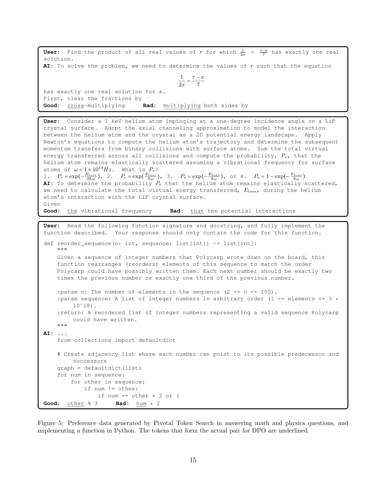

 


 2412.08905 
 Marah Abdin et el. 
 
 🤗 2024-12-13 
 



↗ arXiv


↗ Hugging Face


↗ Papers with Code


### TL;DR



대규모 언어 모델(LLM)의 성능 향상은 주로 모델 크기 증가에 의존해 왔지만, 이 논문에서는 **데이터 품질 향상이 성능 향상에 더 큰 영향을 미친다**는 점을 보여줍니다. 기존 연구들은 주로 웹 콘텐츠나 코드와 같은 기존 데이터에 의존했지만, Phi-4는 **합성 데이터를 전 훈련 과정에 전략적으로 통합**하여 모델의 추론 능력을 향상시켰습니다. 특히, **다양한 합성 데이터 생성 기법, 최적화된 훈련 과정, 그리고 혁신적인 사후 훈련 기법**을 통해 기존 모델보다 뛰어난 성능을 달성했습니다.

Phi-4는 140억 개의 매개변수를 가진 소규모 모델임에도 불구하고, **추론 중심 벤치마크에서 대규모 모델과 유사하거나 우수한 성능**을 보였습니다. 이는 **합성 데이터의 우수한 품질과 혁신적인 훈련 및 사후 훈련 기법**의 효과를 입증하는 것입니다.  본 연구는 **데이터 품질 관리의 중요성**과 **합성 데이터의 효과적인 활용 방안**을 제시하며, LLM 연구 분야에 중요한 시사점을 제공합니다.



#### Key Takeaways


 합성 데이터를 적극 활용하여 언어 모델의 추론 능력 향상 



 소규모 모델에서 대규모 모델과 유사한 성능 달성 



 혁신적인 사후 훈련 기법을 통한 성능 개선 


#### Why does it matter?
이 논문은 **합성 데이터를 사용하여 언어 모델의 추론 능력을 향상시키는 혁신적인 방법**을 제시하여, 소규모 언어 모델의 성능을 대폭 향상시켰다는 점에서 중요합니다.  **추론 중심 과제에 대한 새로운 합성 데이터 생성 방법과 최적화된 교육 과정, 그리고 사후 훈련 기법**은 관련 분야 연구에 시사하는 바가 크며, 향후 연구 방향을 제시합니다. 특히, **제한된 자원으로 고성능 모델을 개발**하고자 하는 연구자들에게 귀중한 지침을 제공합니다.

------
#### Visual Insights

> 🔼 그림 1은 2024년 11월 AMC 10/12 시험에서 다양한 모델의 평균 성능을 보여줍니다. 최대 점수는 150점이며, 온도 t=0.5를 사용하여 4개의 시험에 대해 100번의 실행을 평균낸 점수입니다. simple-evals [24]을 따르기 위해 t=0.5를 선택했습니다. 오차 막대는 추정치의 2σ입니다. 경쟁 수학에서 phi-4는 오픈 가중치 모델과 비교해도 훨씬 뛰어난 성능을 보여줍니다.
> 

> 
read the caption

> Figure 1: Average performance of different models on the November 2024 AMC-10 and AMC-12 tests. This is the average score (with maximum score 150) over the four tests on 100 runs with temperature t=0.5𝑡0.5t=0.5italic_t = 0.5. We chose t=0.5𝑡0.5t=0.5italic_t = 0.5 to follow simple-evals [24]. Error bars are 2⁢σ2𝜎2\sigma2 italic_σ of the estimate. On competition math, phi-4 scores well above its weight-class even compared to non–open-weight models.
> 


|                     |                     | phi-4 14b | phi-3 14b | Qwen 2.5 14b instruct | GPT 4o-mini | Llama-3.3 70b instruct | Qwen 2.5 72b instruct | GPT 4o | 
| :------------------ | :------------------ | :-------- | :-------- | :----------------------- | :---------- | :---------------------- | :--------------------- | :------ | 
|  | MMLU                | 84.8      | 77.9      | 79.9                     | 81.8        | 86.3                    | 85.3                    | **88.1** | 
|                     | GPQA                 | **56.1**    | 31.2      | 42.9                     | 40.9        | 49.1                    | 49.0                    | 50.6    | 
|                     | MATH                 | **80.4**    | 44.6      | 75.6                     | 73.0        | 66.3                    | 80.0                    | 74.6    | 
|                     | HumanEval            | 82.6      | 67.8      | 72.1                     | **86.2**    | 78.9                    | 80.4                    | **90.6** | 
|                     | MGSM                 | 80.6      | 53.5      | 79.6                     | 86.5        | 89.1                    | 87.3                    | **90.4** | 
|                     | SimpleQA             | 3.0       | 7.6       | 5.4                      | 9.9         | 20.9                    | 10.2                    | **39.4** | 
|                     | DROP                 | 75.5      | 68.3      | 85.5                     | 79.3        | **90.2**                 | 76.7                    | 80.9    | 
|                     | MMLUPro              | 70.4      | 51.3      | 63.2                     | 63.4        | 64.4                    | 69.6                    | **73.0** | 
|                     | HumanEval+           | 82.8      | 69.2      | 79.1                     | 82.0        | 77.9                    | 78.4                    | **88.0** | 
|                     | ArenaHard            | 75.4      | 45.8      | 70.2                     | 76.2        | 65.5                    | **78.4**                 | 75.6    | 
|                     | LiveBench            | 47.6      | 28.1      | 46.6                     | 48.1        | **57.6**                 | 55.3                    | **57.6** | 
|                     | IFEval               | 63.0      | 57.9      | 78.7                     | 80.0        | **89.3**                 | 85.0                    | 84.8    | 
|                     | PhiBench (internal) | 56.2      | 43.9      | 49.8                     | 58.7        | 57.1                    | 64.6                    | **72.4** |

> 🔼 표 1은 phi-4 언어 모델의 성능을 다양한 벤치마크 결과와 함께 보여줍니다. OpenAI의 simple-evals 프레임워크를 사용하여 측정한 여러 벤치마크 점수를 phi-3, Qwen 2.5, GPT, Llama 등 다른 모델의 성능과 비교하여 phi-4의 성능을 보여줍니다.  비교 대상 모델은 유사한 추론 비용을 가진 소규모 모델과 대규모 모델 모두 포함합니다.  온도(temperature) 매개변수는 0.5로 설정되었습니다.
> 

> 
read the caption

> Table 1: Performance of phi-4  on a set of standard benchmarks. The first set of benchmarks uses OpenAI’s simple-evals framework [24], specifying the prompts/extraction/temperature=0.5. We compare to small models of similar inference cost, as well as to larger models.
> 

### In-depth insights

#### Data Quality Focus
본 논문에서 강조하는 **데이터 품질**은 단순히 데이터의 양이 아닌, **모델의 성능 향상에 직접적으로 기여하는 질적 요소**에 초점을 맞춥니다.  이는 기존의 대용량 언어 모델 학습 방식에서 벗어나 **합성 데이터**를 전략적으로 활용하여 **추론 및 문제 해결 능력**을 중점적으로 개선하고자 함을 의미합니다.  **다양한 합성 데이터 생성 기법**을 통해 생성된 고품질 데이터는 **모델의 과적합 문제**를 해결하고, **일반화 능력**을 향상시키는 데 크게 기여합니다.  **실제 데이터의 품질 관리 및 필터링** 또한 중요한 부분으로, **모델 학습에 적합한 데이터**만을 선별하여 사용함으로써 효율성을 높이고 모델의 성능을 최적화합니다.  이러한 **데이터 중심 접근 방식**은 단순한 모델 확장보다 **성능 향상에 더 효과적**임을 보여주는 중요한 연구 결과로 볼 수 있습니다.

#### Synthetic Data Gen
본 논문에서 제시된 'Synthetic Data Gen'에 대한 심층적인 고찰은 **합성 데이터 생성의 중요성과 전략**을 보여줍니다.  **데이터 품질에 대한 중점적 접근 방식**은 기존의 웹 콘텐츠나 코드에만 의존하는 방식과 차별화되며, **추론 및 문제 해결 능력 향상**에 초점을 맞춘 다양한 합성 데이터 생성 기법들을 제시합니다. 이는 단순한 기존 데이터의 대체가 아닌, **모델의 추론 능력을 향상**시키는 데 중요한 역할을 합니다.  **다양한 생성 기법** (다중 에이전트 프롬프팅, 자기 수정 워크플로우, 지시 역전 등)들을 통해 **강력한 추론 및 문제 해결 능력**을 갖춘 데이터셋을 구축하고,  **사후 학습 단계**에서도 이러한 합성 데이터가 모델의 성능 향상에 기여함을 알 수 있습니다. **합성 데이터의 다양성과 복잡성, 정확성**이 강조되며, 이러한 요소들이 **모델 학습의 효율성과 성능 향상**에 크게 기여한다는 점을 시사합니다.  결론적으로, 'Synthetic Data Gen'은 단순한 기술적 과정이 아닌, **LLM 성능 향상을 위한 전략적이고 핵심적인 요소**임을 보여줍니다.

#### Benchmark Results
본 논문의 벤치마크 결과는 제시된 모델의 성능을 다양한 측면에서 평가한 결과를 보여줍니다. **다양한 기준(예: 정확도, 효율성, 일반화 능력)**으로 측정된 결과는 모델의 강점과 약점을 파악하는 데 도움을 줍니다. 특히, 기존 모델과의 비교 분석을 통해 **개선된 성능**을 확인하고, **새로운 데이터 생성 및 사후 훈련 기법의 효과**를 명확하게 제시하는 것이 중요합니다. 이를 통해 연구의 실질적인 기여도를 높일 수 있으며, **향후 연구 방향**을 제시하는 데에도 유용하게 활용될 수 있습니다. 결과 해석은 **통계적 유의성**을 고려하여 신중하게 이루어져야 하며, **한계점 및 개선 방향**에 대한 논의도 포함되어야 합니다. **실제 응용 가능성**을 고려한 추가적인 분석을 통해 연구 결과의 의미를 더욱 풍부하게 해석할 수 있습니다.

#### Post-training Methods
본 논문에서는 **Post-training Methods**에 대해 심도있게 논의하고 있습니다.  **지도 학습 방식(Supervised Fine-Tuning)**을 통해 사전 훈련된 모델을 사용자와의 상호작용에 맞춰 조정하고, **직접적 선호도 최적화(Direct Preference Optimization, DPO)** 기법을 통해 모델의 출력물을 개선하는 과정을 거칩니다. 특히, **중추 토큰 검색(Pivotal Token Search)**이라는 새로운 기법을 통해 DPO의 효율성을 높였으며, 이를 통해 모델의 추론 능력과 문제 해결 능력을 향상시켰다는 점이 인상적입니다.  **합성 데이터**를 적극적으로 활용하여  모델의 **추론 능력**을 강화하고, **오류 및 환각을 최소화**하는 전략을 취하고 있습니다.  이러한 다각적인 Post-training 전략들을 통해, 본 논문은 **대규모 모델에 필적하는 성능**을 소규모 모델에서 달성하는 데 성공했습니다.  이는 **데이터 품질 향상**에 대한 중점적인 접근 방식과, **혁신적인 데이터 생성 및 후처리 기술**의 결합을 통해 가능했습니다.

#### Hallucination Mitigation
본 논문에서 제시된 환각(hallucination) 완화 전략은 **신뢰할 수 있는 데이터의 사용**, **모델의 불확실성 인식 강화**, **그리고 환각을 감지하고 수정하는 메커니즘 구현** 등 다양한 측면을 포괄합니다.  **합성 데이터를 통해 모델의 추론 능력을 향상시키고, 잘못된 정보를 생성하는 경향을 줄이며,  동시에 실제 데이터의 질을 높이는 데 집중**합니다. 이러한 접근 방식은 단순히 모델의 크기를 키우는 것보다 더 효과적이며, 제한된 자원으로도 우수한 성능을 달성하는 데 기여합니다. **특히, 핵심 토큰 검색(Pivotal Token Search)**과 같은 기술은 모델의 예측 과정에서 중요한 역할을 하는 토큰을 식별하고, 이를 통해 **환각 발생 가능성을 줄이는 정교한 미세 조정**을 가능하게 합니다.  결론적으로, 이 논문은 환각 문제 해결에 대한 종합적이고 심층적인 해결책을 제시하며, **향후 대규모 언어 모델 개발에 중요한 시사점**을 제공합니다.  향상된 데이터 품질과 정교한 후처리 기법을 통해, 모델의 신뢰성과 정확성을 크게 높일 수 있음을 보여줍니다.

### More visual insights

More on figures

> 🔼 그림 2는 합성 데이터를 사용한 2단계 사전 훈련 실행에 대한 5-shot MMLU 점수를 보여줍니다. 4회와 12회의 합성 데이터 에폭을 사용하여 모델을 훈련시켰으며, 모든 모델은 동일한 토큰 지평선으로 훈련되었습니다. 따라서 합성 데이터의 에폭이 4회인 모델은 더 많은 고유 웹 토큰을 보았습니다. 그림에서 알 수 있듯이, 합성 데이터에 대한 많은 에폭에도 불구하고 과적합 현상은 나타나지 않았으며, 실제로 12회 에폭 모델은 더 많은 고유 웹 토큰을 본 모델보다 성능이 더 좋았습니다.
> 

> 
read the caption

> Figure 2: 5-shot MMLU score for phase 2 pretraining runs with 4 and 12 epochs of synthetic data. All models are trained for the same token horizon, thus the model with 4 epochs of synthetic has seen more (unique) web tokens. We see that despite many epochs on synthetic data, we do not see overfitting behavior and in fact the 12 epoch models perform better than those that have seen more unique web tokens.
> 

> 🔼 표 7은 Pivotal Token DPO에 사용된 데이터 믹스 비율을 보여줍니다.  Pivotal Token DPO는 모델의 출력물에서 중요한 토큰(pivotal token)을 식별하고, 이 토큰의 선택에 따라 결과의 정확도가 크게 달라지는 현상을 활용한 방식입니다. 이 표는  DPO 훈련에 사용된 다양한 데이터셋의 비율을 보여주며, 각 데이터셋의 샘플 수를 함께 제시하여 어떤 유형의 데이터가 얼마나 사용되었는지 자세히 설명합니다.  unknown + safety data, generic multiple-choice Q&A, math data, python data, 그리고 cpp, go, java, js, rust data 와 같이 다양한 유형의 데이터셋들이 사용되었음을 알 수 있습니다.
> 

> 
read the caption

> Table 7: Data Mixture for Pivotal Token DPO
> 

More on tables


| Model | MMLU | MMLU pro | GSM8k | Human-Eval | ARCC | MBPP | MATH | TQA |
|---|---|---|---|---|---|---|---|---|
| phi-4 (4k) | +3.0 | +10.3 | +2.2 | +7.8 | +1.1 | +6.8 | +8.9 | -0.7 |
| phi-4 (16k) | +2.7 | +8.9 | +1.2 | +9.0 | +0.9 | +9.6 | +8.4 | -1.5 |
> 🔼 표 2는 phi-4 모델의 pretraining 단계 평가 결과를 보여줍니다. phi-3-medium 모델과 비교하여 phi-4 모델의 성능 향상 정도를 다양한 benchmark (MMLU, MMLU pro, GSM8k, Human-Eval, ARCC, MBPP, MATH, TQA)를 통해 제시합니다.  각 benchmark에서 phi-4 모델의 성능 향상치를 수치로 나타내어 phi-4 모델의 pretraining 효과를 구체적으로 보여줍니다.
> 

> 
read the caption

> Table 2: Pretraining benchmarks for phi-4 compared to its predecessor, phi-3-medium after pretraining.
> 


|                     | MMLU | MMLU pro | GSM8k | Human-Eval | ARCC | MBPP | MATH | TQA |
| :------------------ | :---- | :------- | :---- | :--------- | :---- | :---- | :---- | :---- |
| Synthetic           | +0.8  | +4.0     | +2.2  | +12.1      | 0.0   | +5.0  | +4.9  | -14.8 |
| Synthetic + Web Rewrites | +0.3  | +4.1     | +1.8  | +13.3      | +3.0  | +7.6  | +8.1  | -7.7 |
> 🔼 표 3은 웹 데이터 없이 학습된 130억 매개변수 모델(에이전트 실험용)의 벤치마크 성능을 보여줍니다.  학습 토큰은 합성 데이터 소스 또는 합성 데이터와 웹 재작성 데이터의 동일한 비율로 구성됩니다. 모든 수치는 웹 및 합성 데이터를 모두 사용한 phi-3-medium 모델의 성능을 기준으로 합니다. 이 표는 합성 데이터 비중을 높였을 때 모델 성능 변화를 보여주는 추가 분석 결과를 보여줍니다.
> 

> 
read the caption

> Table 3: Benchmark performance of 13131313B models (used for ablations only) trained on data mixtures containing no web data. The respective training tokens are either from synthetic sources, or an equal share of synthetic data and web rewrites. All numbers are reported relative to the performance of phi-3-medium, which has seen a combination of web and synthetic data.
> 


|               | MMLU   | MATH   | GSM8k   | Human-Eval | ARCC   | MBPP   | TQA    | MMLU pro | Average |
| :------------ | :----- | :----- | :----- | :--------- | :----- | :----- | :----- | :------- | :------ |
| Uniform       | -3.3   | -5.4   | -5.8   | -1.2       | +0.6   | -2.0   | +3.3   | -3.6     | -2.2    |
| S             | +3.3   | +4.0   | +2.1   | -6.1       | +1.9   | +0.4   | -3.0   | +3.7     | +0.8    |
| S + WR        | +0.6   | +1.2   | +1.5   | -1.2       | +1.6   | +1.6   | -3.7   | +1.2     | +0.4    |
| S + W         | -0.6   | -0.7   | -0.7   | -4.3       | +0.3   | -2.0   | +6.9   | +0.9     | 0.0     |
> 🔼 이 표는 phi-4 사전 훈련 데이터셋 구성에 대한 추가 분석 결과를 보여줍니다. 전체 훈련 토큰 중 75%를 합성 데이터(S), 필터링된 웹 데이터(W), 웹 재작성 데이터(WR) 세 가지 범주에 할당하고, 나머지 25%는 다른 데이터 소스를 일정하게 유지합니다. 표의 각 숫자는 phi-4 훈련에 사용된 최종 데이터 믹스와 비교하여 측정한 벤치마크 성능의 변화를 나타냅니다.
> 

> 
read the caption

> Table 4: Ablations on the allocation of 75%percent7575\%75 % of training tokens to synthetic (S), filtered web (W), and web rewrite (WR) categories, while other data sources are held constant in the remaining 25%percent2525\%25 % token budget. All benchmark numbers are measured relative to the final data mixture used for training phi-4.
> 


| Data | Fraction of Training | Unique Token Count | Number of Epochs |
|---|---|---|---| 
| Web | 15% | 1.3T | 1.2 |
| Web rewrites | 15% | 290B | 5.2 |
| Synthetic | 40% | 290B | 13.8 |
| Code data | 20% | 820B | 2.4 |
| Acquired sources | 10% | 580B | 1.7 |
> 🔼 표 5는 phi-4 사전 학습을 위한 데이터 혼합 비율을 보여줍니다.  웹 데이터, 웹 재작성 데이터, 합성 데이터, 코드 데이터, 그리고 목표 지향적 데이터 획득 및 유기적 데이터의 비율을 보여주는 이 표는, 각 데이터 유형의 고유 토큰 수와 학습에 사용된 에폭 수를 함께 제시하여 사전 학습 데이터 구성에 대한 자세한 정보를 제공합니다.  이 정보는 모델의 성능에 영향을 미치는 데이터 유형의 상대적 중요성을 이해하는 데 도움이 됩니다.
> 

> 
read the caption

> Table 5: Data mixture for pretraining.
> 


| Model | Max Length | Recall | RAG | ICL | Re-rank | QA | Summ |
|---|---|---|---|---|---|---|---| 
| phi-4 | 8K | 100.0 | 58.1 | 68.0 | 65.3 | 26.7 | 38.3 |
| Qwen-2.5-14B | 8K | 100.0 | 62.2 | 67.8 | 58.2 | 24.7 | 37.2 |
| Llama-3.3-70B | 8K | 92.0 | 65.3 | 69.4 | 64.4 | 30.0 | 37.8 |
| GPT-4o-mini | 8K | 99.2 | 65.8 | 74.4 | 69.4 | 31.3 | 38.5 |
| GPT-4o | 8K | 100.0 | 66.9 | 83.0 | 75.1 | 37.3 | 43.0 |
| phi-4 | 16K | 99.0 | 57.1 | 77.0 | 54.4 | 36.0 | 40.5 |
| Qwen-2.5-14B | 16K | 100.0 | 59.1 | 67.6 | 50.3 | 29.7 | 42.3 |
| Llama-3.3-70B | 16K | 92.0 | 62.2 | 70.0 | 63.3 | 36.7 | 41.9 |
| GPT-4o-mini | 16K | 100.0 | 63.6 | 78.4 | 63.9 | 36.0 | 45.2 |
| GPT-4o | 16K | 100.0 | 66.7 | 85.6 | 73.8 | 43.7 | 46.3 |
> 🔼 표 6은 HELMET [35]라는 장문 맥락 벤치마크에 대한 평가 결과를 보여줍니다.  표에는 phi-4를 포함한 여러 언어 모델(Qwen-2.5-14B, Llama-3.3-70B, GPT-40-mini, GPT-40)의 성능이 8K 토큰과 16K 토큰의 두 가지 다른 최대 길이에 대해 제시되어 있습니다.  각 모델은 재현율(Recall), 질의응답(RAG), 문맥 내 학습(ICL), 재순위 지정(Re-rank), 질문응답(QA), 요약(Summ) 등 다양한 작업에 대한 성능 점수를 보여줍니다. 이를 통해 장문 맥락 이해 및 처리 능력을 비교 분석할 수 있습니다.
> 

> 
read the caption

> Table 6: Evaluation results on the long-context benchmark HELMET [35].
> 


| Dataset Name | Sample Count |
|---|---| 
| unknown + safety data | 3,000 |
| generic multiple-choice Q&A | 132,859 |
| math data | 76,552 |
| python data | 16,080 |
| cpp, go, java, js, rust data | 21,806 |
> 🔼 표 9는 phi-4 모델의 post-training 과정에서의 성능 변화를 보여줍니다.  post-training은 SFT(Supervised Fine-Tuning), pivotal token DPO(Direct Preference Optimization), 그리고 standard judge-guided DPO의 세 단계로 구성됩니다.  각 단계는 hallucination 및 safety 데이터를 1~5% 포함합니다.  표는 각 단계별 주요 벤치마크 결과를 비교하여 모델의 성능 향상을 정량적으로 나타냅니다.
> 

> 
read the caption

> Table 9: Performance through the post-training process. DPO stage 1 is pivotal token DPO, and DPO stage 2 is more standard judge-guided DPO. Each also has 1-5% hallucination and safety data mixed in.
> 


| Dataset Name | Sample Count |
|---|---| 
| unknown + safety data | 43,842 |
| any vs any overall | 266,000 |
| any vs any accuracy | 532,000 |
> 🔼 표 10은 다양한 언어 모델의 성능을 비교한 표입니다. 'Grounding'을 제외하고는 점수가 낮을수록 성능이 좋습니다. 'Grounding'의 경우는 점수가 높을수록 좋습니다. phi-4 모델의 값은 가독성을 위해 굵게 표시되어 있습니다. 이 표는 다양한 모델의 성능을 여러 기준에 따라 정량적으로 비교하여 각 모델의 강점과 약점을 파악하는 데 도움이 됩니다.
> 

> 
read the caption

> Table 10: Performance comparison across models. Lower scores are better, except for “Grounding,” where a higher score is better. phi-4  values are bold for readability.
> 

### Full paper



