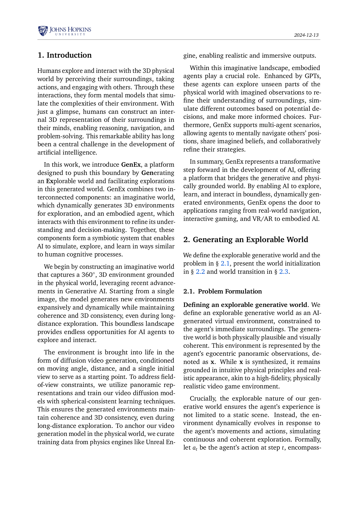

 


 2412.09624 
 Taiming Lu et el. 
 
 🤗 2024-12-16 
 



↗ arXiv


↗ Hugging Face


↗ Papers with Code


### TL;DR



**3D 물리 세계를 이해하고 탐색하는 것은 인공지능 분야의 핵심 과제**였습니다. 기존 AI는 주변 환경에 대한 완전한 정보 없이는 효과적인 의사 결정을 내리는 데 어려움을 겪었습니다. 또한 실제 환경에서의 데이터 수집은 비용과 시간 측면에서 제약이 많았습니다.

**GenEx는 단일 RGB 이미지에서 3D 가상 세계를 생성**하여 이러한 문제를 해결합니다. Unreal Engine에서 생성된 데이터를 기반으로 훈련된 GenEx는 **360도 파노라마 비디오 스트림을 통해 현실적인 3D 환경을 생성**합니다. 사용자 또는 GPT는 에이전트를 제어하여 이 가상 세계를 탐색하고, 목표 지향 작업을 수행할 수 있습니다. GenEx는 **장거리 탐색에서도 일관성과 3D 기능을 유지**하며, 상상력 기반 에이전트가 **예측, 시뮬레이션 및 정보에 입각한 의사 결정을 내릴 수 있도록 지원**합니다.



#### Key Takeaways


 단일 이미지 입력으로 3D 일관성을 갖춘 몰입형 환경 생성. 



 GPT 기반 에이전트를 활용한 대화형 및 목표 지향 탐색 지원. 



 상상력 증강 정책을 통해 에이전트의 정보 기반 의사 결정 능력 향상 


#### Why does it matter?
**GenEx는 상상력 기반 임바디드 AI 연구에 중요한 발전을 의미합니다.** 이는 기존 3D 환경 탐색의 한계를 극복하고, 에이전트가 현실 세계를 반영한 가상 환경에서 학습 및 탐색할 수 있도록 합니다. 이러한 능력은 **로봇 공학, 자율 주행, 게임 개발 등 다양한 분야에 응용**될 수 있으며, **새로운 연구 방향을 제시**합니다. 특히, GenEx의 **상상력 증강 정책은 의사 결정 능력 향상에 큰 잠재력**을 보여주며, 인간과 AI의 협업 가능성을 높입니다.

------
#### Visual Insights

> 🔼 이 그림은 GenEx의 데이터 수집 과정을 보여줍니다. GenEx는 Unreal Engine 5(UE5)에서 가져온 사실적인 도시 자산과 Unity에서 가져온 애니메이션 세계 자산을 활용하여 현실적인 물리 엔진을 기반으로 데이터를 생성합니다. 왼쪽 이미지는 UE5의 도시 환경을, 오른쪽 이미지는 Unity의 애니메이션 세계 자산을 보여줍니다. 이러한 물리 엔진을 통해 다양하고 현실적인 가상 환경을 만들고, 이를 탐색하는 과정을 시뮬레이션하여 데이터를 효율적으로 수집할 수 있습니다.
> 

> 
read the caption

> Figure 1: Our data curation leverages physical engines, utilizing realistic city assets from UE5 and animated world assets from Unity.
> 


| Model | Representation | FVD ↓ | MSE ↓ | LPIPS ↓ | PSNR ↑ | SSIM ↑ |
|---|---|---|---|---|---|---| 
| Baseline | 6-view cubemaps | 196.7 | 0.10 | 0.09 | 26.1 | 0.88 |
| GenEx w/o SCL | panorama | 81.9 | 0.05 | 0.05 | 29.4 | 0.91 |
| **GenEx** | panorama | **69.5** | **0.04** | **0.03** | **30.2** | **0.94** |


> 🔼 이 표는 GenEx의 생성 비디오 품질을 FVD, MSE, LPIPS, PSNR, SSIM과 같은 다양한 메트릭을 사용하여 측정한 결과를 보여줍니다. GenEx는 모든 메트릭에서 높은 비디오 생성 품질을 달성했습니다.
> 

> 
read the caption

> Table 1: GenEx with high generation quality.
> 

### In-depth insights

#### Generative 3D Worlds
**생성형 3D 세계**는 단일 이미지에서 **역동적이고 탐색 가능한 환경**을 만드는 획기적인 발전입니다. 이러한 세계는 사용자 또는 AI 에이전트가 상호 작용하고 탐색할 수 있는 풍부하고 몰입적인 경험을 제공합니다. 3D 일관성을 유지하면서 광범위한 탐색이 가능하다는 것이 핵심 기능입니다. **GenEx와 같은 플랫폼**은 이러한 세계를 구축하고, 사용자가 단일 이미지와 텍스트 프롬프트에서 **상상 속 환경**을 만들 수 있도록 지원합니다. 이러한 가상 세계는 **실제 세계 데이터에 기반**하여 실제와 같은 시각적 사실감과 물리적 타당성을 보장합니다. **GPT와 같은 대규모 언어 모델과 통합**하면 에이전트는 **상상력을 활용**하여 정보에 입각한 결정을 내릴 수 있습니다. 이 접근 방식은 실제 탐색의 비효율성과 비용을 줄입니다. 게다가 생성형 3D 세계는 **능동적인 3D 매핑 및 다중 에이전트 상호 작용과 같은 다양한 애플리케이션**으로 확장됩니다. 이를 통해 AI는 인간과 유사한 인지 능력에 더 가까워지고 실제 세계의 네비게이션, 대화형 게임 및 협업 문제 해결과 같은 영역의 발전 가능성을 열어줍니다.

#### Imagination-Aug. AI
**상상력 증강 AI**는 실제 행동 없이 **잠재적 결과를 시뮬레이션**하여 의사 결정을 강화하는 인지 능력 향상을 목표로 합니다. 이는 물리적 탐색의 비효율성과 비용, 위험을 완화합니다. GenEx에서 상상력 증강 정책은 상상된 관찰을 기반으로 행동을 선택하여 **정보에 입각한 의사 결정**을 내립니다. 이는 실제 관찰만 사용하는 일반 정책과 대조됩니다. 상상력 증강 AI는 **공간적 추론**이 필요한 다중 에이전트 시나리오에서 특히 유용합니다. 그러나 현재 물리적 엔진에 의존하는 한계가 있으며, 향후 연구에서는 sim-to-real 적용, 센서 통합, 동적 조건 및 윤리적 안전장치와 같은 문제를 해결해야 합니다.

#### Loop Consistency
**루프 일관성**은 생성된 환경을 탐색하는 에이전트의 **장기적인 신뢰성**을 평가하는 데 중요한 개념입니다. 탐색 경로가 **루프를 형성**할 때, 시작 지점과 끝 지점에서의 관측값이 **일치**해야 합니다. GenEx는 **구형 일관성 학습(SCL)**을 통해 이러한 루프 일관성을 유지합니다. 즉, 360도 파노라마 이미지에서 모든 방향의 픽셀 값이 **부드럽게 연결**되도록 학습하여 탐색 중 **시각적 왜곡**을 최소화합니다. 이를 통해 에이전트가 장거리 탐색 후에도 **초기 상태와 유사한 관측값**을 얻을 수 있도록 보장합니다. **IELC(Imaginative Exploration Loop Consistency)** 지표는 이러한 루프 일관성을 정량적으로 측정하며, GenEx는 다양한 회전 및 거리를 가진 루프에서도 높은 IELC 값을 유지함을 보여줍니다. 이는 GenEx가 생성한 환경의 **안정성과 신뢰성**을 입증하는 중요한 결과입니다.

#### Embodied Agent Eval
**GenEx의 핵심은 구현된 에이전트 평가**입니다. 가상 환경 탐색을 통해 에이전트의 **판단력, 계획 수립, 내비게이션 능력**을 평가합니다. 단일 이미지나 GPT 명령어를 기반으로 생성된 360도 환경에서 에이전트는 목표를 향해 움직이며, 예측하지 못한 상황에 대처해야 합니다. 이 과정에서 GenEx는 에이전트의 **상황 인식, 의사 결정, 장기적인 계획 수립 능력**을 측정합니다. 특히, 다중 에이전트 시나리오에서는 다른 에이전트의 **관점 추론 및 협력적 의사 결정** 능력 또한 평가 대상이 됩니다. GenEx는 **실제 환경 구현의 어려움과 비용을 줄이며,** 에이전트의 성능과 한계점에 대한 **심층적인 분석**을 제공합니다.

#### Sim-to-Real Gap
**Sim-to-Real 격차**는 시뮬레이션 환경과 실제 환경의 차이로 인해 발생하는 문제입니다. 시뮬레이션에서는 단순화된 모델과 완벽한 정보를 가정하지만, 실제 환경은 예측 불가능하고 복잡합니다. 이러한 차이는 시뮬레이션에서 훈련된 모델이 실제 환경에서 제대로 작동하지 못하게 합니다.  **GenEx와 같은 생성 모델은 실제 환경 데이터를 활용하여 3D 환경을 구축함으로써 Sim-to-Real 격차를 줄이는 데 기여**할 수 있습니다. 하지만 시뮬레이션의 한계를 완전히 극복하기는 어려우며, 센서 통합, 동적 조건, 안전장치 등 **실제 환경 적용을 위한 추가 연구가 필요**합니다. 궁극적으로는 시뮬레이션과 실제 환경의 차이를 최소화하고, 다양한 실제 환경에서 안정적인 배포를 가능하게 하는 것이 중요합니다.

### More visual insights

More on figures

> 🔼 이 그림은 큐브맵, 구형 파노라마, 등장 파노라마의 세 가지 파노라마 표현을 보여줍니다. 큐브맵은 360도 시야를 큐브의 6면에 투영한 것입니다. 각 면은 90도 시야를 캡처하여 원활하게 이어붙일 수 있는 6개의 원근 이미지를 생성합니다. 구형 파노라마는 구형 좌표계를 사용하여 장면을 나타내며, 여기서 각 점은 방위각, 고도 및 반지름으로 정의됩니다. 등장 파노라마는 2차원 이미지 평면에 구형 좌표계를 투영하여 구형 파노라마를 펼친 표현입니다. 이러한 세 가지 표현은 서로 변환될 수 있으며, 360도 이미지를 표현하는 데 사용되는 다양한 방법을 제공합니다.
> 

> 
read the caption

> Figure 2: Three panorama representations that can be transformed into one another.
> 

> 🔼 이 그림은 GenEx가 어떻게 단일 이미지 입력을 사용하여 360도 파노라마를 생성하는지 보여줍니다. 먼저, 단일 시점 이미지가 제공됩니다. 그런 다음 이미지 왜곡을 통해 이미지의 숨겨진 부분이 예측되어 전체 360도 보기가 생성됩니다. 마지막으로 텍스트-이미지 확산 모델을 사용하여 고품질 파노라마가 생성됩니다.
> 

> 
read the caption

> Figure 3: From single view to 360∘ panorama.
> 

> 🔼 이 그림은 GenEx의 세계 변환 과정을 보여줍니다. GenEx는 이전에 탐색된 360도 파노라마 이미지와 뷰 스피어를 회전하는 행동을 입력받아, 새로운 파노라마 뷰 시퀀스를 생성합니다. 즉, 에이전트가 가상 환경에서 움직일 때마다 GenEx는 이전 뷰와 에이전트의 움직임(회전 각도 및 이동 거리)을 기반으로 다음에 보게 될 360도 뷰를 생성하는 방식입니다. 이를 통해 에이전트는 마치 실제 환경을 탐험하는 것처럼 연속적이고 일관된 뷰를 경험할 수 있습니다.
> 

> 
read the caption

> Figure 4: We model the world transition as a panoramic video generation process. Given the last explored 360∘ panorama and an action that rotates the viewing sphere, the model produces a sequence of newly generated panoramic views
> 

> 🔼 이 그림은 GenEx의 세 가지 탐색 모드, 즉 대화형 탐색, GPT 지원 자유 탐색, 목표 지향 탐색을 보여줍니다. 각 모드는 서로 다른 탐색 지침으로 정의됩니다. 대화형 탐색에서 사용자는 에이전트의 움직임과 거리를 제어하여 가상 세계를 자유롭게 탐색할 수 있습니다. GPT 지원 자유 탐색은 GPT-40을 '파일럿'으로 사용하여 탐색 구성을 결정하고 생성된 세계의 충실도를 극대화합니다. 목표 지향 탐색에서 에이전트는 목표와 탐색 지침을 받고 GPT는 이를 기반으로 고급 계획을 수행하여 저수준 탐색 구성을 생성합니다. GenEx는 이러한 구성을 단계별로 처리하여 가상 탐색 과정에서 이미지를 점진적으로 업데이트합니다.
> 

> 
read the caption

> Figure 5: Three exploration modes — interactive, GPT-assisted, and goal-driven — each defined by distinct exploration instructions.
> 

> 🔼 이 그림은 GenEx의 세 가지 탐색 모드, 즉 (a) 대화형 탐색, (b) GPT 지원 자유 탐색, (c) 목표 지향 탐색을 보여줍니다. 각 모드는 서로 다른 탐색 지침으로 정의됩니다. 대화형 탐색에서 사용자는 에이전트의 움직임 방향과 거리를 제어하여 가상 세계를 지속적으로 탐색할 수 있습니다. GPT 지원 자유 탐색에서는 GPT-40이 '파일럿' 역할을 하여 360도 탐색 가능한 방향과 거리를 포함하는 탐색 구성을 결정합니다. 목표 지향 탐색에서 에이전트는 '파란색 자동차의 위치와 방향으로 이동'과 같은 탐색 지침과 함께 목표를 받습니다. GPT는 지침과 초기 이미지를 기반으로 상위 수준 계획을 수행하고 반복적으로 하위 수준 탐색 구성을 생성합니다. 그런 다음 GenEx는 이러한 구성을 단계별로 처리하고 가상 탐색 과정에서 이미지를 점진적으로 업데이트합니다.
> 

> 
read the caption

> Figure 6: GenEx-driven imaginative exploration can gather observations that are just as informed as those obtained through physical exploration.
> 

> 🔼 이 그림은 GenEx를 사용한 단일 에이전트 및 다중 에이전트 추론 과정을 보여줍니다. (a) 단일 에이전트는 이전에 관찰하지 못한 뷰를 상상하여 환경을 더 잘 이해할 수 있습니다. 즉, 에이전트는 주변 환경을 더 잘 이해하기 위해 상상력을 통해 이전에 관찰하지 못했던 시야를 예측합니다. (b) 다중 에이전트 시나리오에서는 에이전트가 다른 에이전트의 관점을 추론하여 상황에 대한 더 완벽한 이해를 바탕으로 의사 결정을 내립니다. 즉, 여러 에이전트가 있는 경우, 각 에이전트는 다른 에이전트의 시점을 추론하여 상황을 종합적으로 이해하고 더 나은 결정을 내립니다. 입력 및 생성된 이미지는 파노라마 형태이며, 시각화를 위해 큐브 형태로 추출되었습니다.
> 

> 
read the caption

> Figure 7: Single agent reasoning with imagination and multi-agent reasoning and planning with imagination. (a) The single agent can imagine previously unobserved views to better understand the environment. (b) In the multi-agent scenario, the agent infers the perspective of others to make decisions based on a more complete understanding of the situation. Input and generated images are panoramic; cubes are extracted for visualization.
> 

> 🔼 이 그림은 GenEx의 상상적인 탐색 루프 일관성(IELC)을 보여줍니다. x축은 총 회전량을 나타내고, y축은 이동 거리를 나타냅니다. 1000개의 무작위로 샘플링된 닫힌 루프 경로 각각에 대해 초기 실제 이미지와 최종 생성 이미지 간의 잠재 MSE를 계산하고, 이러한 값을 평균하여 IELC를 측정합니다. 결과적으로 20m 루프 및 여러 개의 연속된 비디오에 대해서도 IELC가 높게 유지되고 잠재 MSE는 0.1 미만으로 유지되어 최소 드리프트를 나타냅니다. 이러한 견고성은 구형 일관성을 유지하여 회전으로 인해 이미지 품질이 저하되지 않도록 합니다.
> 

> 
read the caption

> Figure 8: Imaginative Exploration Loop Consistency (IELC) varying distance and rotations.
> 

> 🔼 이 그림은 GenEx가 z축을 따라 위쪽으로 탐색하여 현재 장면의 2D 조감도를 생성하는 방법을 보여줍니다. 즉, 단일 파노라마 이미지에서 에이전트의 시점을 위로 이동시켜 마치 새가 하늘에서 내려다보는 것과 같은 뷰를 생성합니다. 이러한 탑다운 레이아웃은 에이전트에게 장면에 대한 객관적인 3인칭 시점의 이해를 제공하여 추론 능력을 향상시킵니다.
> 

> 
read the caption

> Figure 9: Through generative exploration in z-axis, we are able to generate the 2D bird-eye world view of the current scene.
> 

> 🔼 이 그림은 GenEx가 단일 파노라마 이미지에서 객체의 새로운 뷰 합성을 위한 더 높은 품질과 배경 합성에서 더 나은 일관성을 달성하는 방법을 보여줍니다. 기존의 최첨단 3D 재구성 모델(Voleti et al., 2024; Tochilkin et al., 2024; StabilityAI, 2023)과 비교하여 GenEx가 생성한 이미지에서 객체와 배경의 더 높은 품질과 일관성을 확인할 수 있습니다. 특히 z축을 따라 위쪽으로 탐색하여 파노라마 이미지에서 직접 하향식(조감도) 맵을 생성하는 기능을 보여주고, 이러한 오버헤드 레이아웃은 에이전트에게 장면에 대한 객관적인 3인칭 시점 이해를 제공하여 추론 능력을 향상합니다.
> 

> 
read the caption

> Figure 10: Through exploration, our model achieves higher quality in novel view synthesis for objects and better consistency in background synthesis, compared to SOTA 3D reconstruction models (Voleti et al., 2024; Tochilkin et al., 2024; StabilityAI, 2023).
> 

> 🔼 이 그림은 단일 이미지에서 능동 3D 매핑을 수행하는 방법을 보여줍니다. 에이전트가 생성된 환경을 탐색하면서 관측값을 수집하고 이를 사용하여 DUSt3R을 통해 3D 맵을 재구성합니다. 왼쪽에는 입력 이미지가 있고, 오른쪽에는 3D로 재구성된 맵이 있습니다. 즉, 단일 이미지에서 장면의 기하학적 구조와 객체의 위치를 파악하여 3D 공간으로 변환하는 것을 의미합니다.
> 

> 
read the caption

> Figure 11: Active 3D mapping from a single image.
> 

> 🔼 이 그림은 360도 파노라마 이미지를 나타내는 다양한 좌표계와 변환을 보여줍니다. 왼쪽 부분은 픽셀 격자 좌표계와 구면 극좌표계를 보여주며, 가운데 부분은 구면 좌표계에서의 회전이 2D 이미지의 회전에 대응하는 방식을 나타냅니다. 오른쪽 부분은 파노라마에서 큐브맵으로 확장하거나 반대로 구성하는 방법을 보여줍니다. 큐브맵은 360도 이미지를 6개의 정사각형 면으로 투영하여 2D 이미지로 표현하는 방식입니다. 다시 말해, 360도 파노라마 이미지를 큐브의 6개 면에 투영하여 각 면을 2D 이미지로 저장하고, 필요할 때 다시 이 6개의 이미지를 결합하여 원래의 파노라마 이미지를 복원할 수 있습니다. 이러한 변환을 통해 다양한 이미지 처리 작업과 3D 공간에서의 탐색 및 상호 작용을 용이하게 합니다.
> 

> 
read the caption

> Figure 12: Left: Pixel Grid coordinate and Spherical Polar coordinate systems; Middle: rotation in Spherical coordinates corresponds to rotation in 2D image; Right: expansion from panorama to cubemap or composition in reverse.
> 

More on tables


| Method | Acc. (%) | Confidence (%) | Logic Acc. (%) |
|---|---|---|---| 
| Random | 25.00 | 25.00 | - |
| Human Text-only | 44.82 | 52.19 | 46.82 |
| Human with Image | 91.50 | 80.22 | 70.93 |
| Human with **GenEx** | **94.00** | **90.77** | **86.19** |
| Unimodal Gemini-1.5 | 30.56 | 29.46 | 13.89 |
| Unimodal GPT-4o | 27.71 | 26.38 | 20.22 |
| Multimodal Gemini-1.5 | 46.73 | 36.70 | 0.0 |
| Multimodal GPT-4o | 46.10 | 44.10 | 12.51 |
| **GPT4-o with GenEx** | **85.22** | **77.68** | **83.88** |
> 🔼 이 표는 상상력 증강 정책(Imagination-Augmented Policy)에 대한 평가 결과를 보여줍니다. 단일 모드(Unimodal)는 텍스트만 제공받는 에이전트를 나타내고, 다중 모드(Multimodal)는 자기중심적 시각과 텍스트가 모두 제공된 경우 LLM의 의사 결정을 보여줍니다. GenEx는 생성적 세계 탐색기가 장착된 에이전트의 성능을 나타냅니다. 표의 각 셀은 정확도, 신뢰도, 논리적 정확도를 백분율로 나타냅니다.
> 

> 
read the caption

> Table 2: Eval of Imagination-Augmented Policy.
> 


| Method | Acc. (%) | Confidence (%) | Logic Acc. (%) |
|---|---|---|---| 
| Random | 25.00 | 25.00 | - | 
| Human Text-only | 21.21 | 11.56 | 13.50 |
| Human with Image | 55.24 | 58.67 | 46.49 |
| Human with **GenEx** | **77.41** | **71.54** | **72.73** |
| Unimodal Gemini-1.5 | 26.04 | 24.37 | 5.56 |
| Unimodal GPT-4o | 25.88 | 26.99 | 5.00 |
| Multimodal Gemini-1.5 | 11.54 | 15.35 | 0.0 |
| Multimodal GPT-4o | 21.88 | 21.16 | 6.25 |
| **GPT4-o with GenEx** | **94.87** | **69.21** | **72.11** |
> 🔼 표 3은 다중 에이전트 상황에서 상상력 증강 정책의 성능을 평가한 결과를 보여줍니다. 표에는 랜덤 정책, 텍스트만 사용하는 인간 정책, 이미지와 함께 텍스트를 사용하는 인간 정책, GenEx를 사용하는 인간 정책, 그리고 단일 모달 및 다중 모달 Gemini 1.5와 GPT-40의 성능이 비교되어 있습니다. GenEx를 사용하는 인간 정책은 다른 모든 정책보다 월등한 성능을 보여줍니다. 특히 GenEx가 인간의 인지 능력과 사회적 협력 및 상황 인식을 향상시킬 수 있는 잠재력이 있음을 시사합니다.
> 

> 
read the caption

> Table 3: Evaluation of Multi-Agent Imagination-Augmented Policy.
> 

### Full paper



