 


 2412.09626 
 Haonan Qiu et el. 
 
 🤗 2024-12-16 
 



↗ arXiv


↗ Hugging Face


↗ Papers with Code


### TL;DR



**고해상도 이미지 및 비디오 생성**은 최근 생성 모델의 주요 과제입니다. 기존 모델은 훈련 데이터 및 계산 리소스의 제약으로 인해 제한된 해상도로 훈련되는 경우가 많아 고품질 콘텐츠 생성에 어려움을 겪습니다. 튜닝 없는 방법들이 등장했지만, **반복적인 패턴 및 낮은 품질** 문제는 여전히 해결 과제로 남아있습니다.

이러한 문제를 해결하기 위해 FreeScale은 **튜닝 없는 스케일 융합**을 통해 고해상도 시각 생성을 가능하게 하는 새로운 패러다임을 제시합니다. **다양한 수용 스케일의 정보 처리 및 융합**을 통해 반복적인 패턴을 제거하고, **원하는 주파수 성분 추출**을 통해 시각적 품질을 향상시킵니다. 텍스트-이미지 및 텍스트-비디오 모델 모두에서 효과적이며, 특히 **8k 해상도 이미지 생성**을 최초로 구현하여 고해상도 생성 모델 연구에 **새로운 지평**을 열었습니다.



#### Key Takeaways


 FreeScale은 튜닝 없이 사전 훈련된 확산 모델의 해상도를 높입니다. 



 다중 수용 스케일에서 정보를 처리하고 원하는 주파수를 추출하여 융합합니다. 



 이미지 및 비디오 모델 모두에서 고해상도 시각 생성 기능을 확장합니다. 특히 8k 해상도 이미지 생성을 처음으로 가능하게 합니다.  


#### Why does it matter?
**고해상도 이미지 및 비디오 생성에 있어 튜닝 없는 혁신적인 접근 방식을 제시**하며, 기존 사전 훈련된 모델의 성능을 향상시키는 데 중요한 역할을 합니다. 8k 해상도 이미지 생성을 가능하게 함으로써, **고품질 시각 콘텐츠 생성**에 대한 새로운 가능성을 열어줍니다. 뿐만 아니라, **다양한 스케일의 정보 융합 및 주파수 추출**이라는 핵심 개념은 다른 생성 모델 연구에도 영향을 미칠 수 있으며, 향후 튜닝 없는 고해상도 생성 모델 연구의 **새로운 연구 방향**을 제시합니다.

------
#### Visual Insights

> 🔼 FreeScale은 튜닝 없이 SDXL을 확장하여 최대 8192² 해상도의 이미지를 생성할 수 있습니다. 원본 SDXL은 품질 저하 없이 최대 1024² 해상도의 이미지만 생성할 수 있습니다. 그림의 모든 이미지는 단일 A800 GPU를 사용하여 생성되었습니다.
> 

> 
read the caption

> Figure 1:  Gallery of FreeScale. Original SDXL citesdxl can only generate images with a resolution of up to 10242superscript102421024^{2}1024 start_POSTSUPERSCRIPT 2 end_POSTSUPERSCRIPT without losing quality, while FreeScale successfully extends SDXL to generate 81922superscript819228192^{2}8192 start_POSTSUPERSCRIPT 2 end_POSTSUPERSCRIPT images without any fine-tuning. All generated images are produced using a single A800 GPU. Best viewed ZOOMED-IN.
> 


| Method | 2048² | | | | 4096² | | | | |
|---|---|---|---|---|---|---|---|---|---|---| 
| | FID ↓ | KID ↓ | FID↓c | KID↓c | Time (min) ↓ | FID ↓ | KID ↓ | FID↓c | KID↓c | Time (min) ↓ |
| SDXL-DI [36] | 64.313 | 0.008 | **31.042** | **0.004** | **0.648** | 134.075 | 0.044 | **42.383** | **0.009** | **5.456** |
| ScaleCrafter [18] | 67.545 | 0.013 | 60.151 | 0.020 | <ins>0.653</ins> | 100.419 | 0.033 | 116.179 | 0.053 | 9.255 |
| DemoFusion [13] | <ins>65.864</ins> | <ins>0.016</ins> | 63.001 | 0.024 | 1.441 | <ins>72.378</ins> | <ins>0.020</ins> | 94.975 | 0.045 | 11.382 |
| FouriScale [23] | 68.965 | 0.016 | 69.655 | 0.026 | 1.224 | 93.079 | 0.029 | 128.862 | 0.068 | 8.446 |
| Ours | **44.723** | **0.001** | <ins>36.276</ins> | <ins>0.006</ins> | 0.853 | **49.796** | **0.004** | <ins>71.369</ins> | <ins>0.029</ins> | <ins>6.240</ins> |

> 🔼 이 표는 다양한 텍스트-이미지 모델의 품질 관련 메트릭 점수를 비교하여 FreeScale의 성능을 보여줍니다. FreeScale은 모든 품질 관련 메트릭에서 최고 또는 두 번째로 좋은 점수를 달성했으며 추가 시간 비용은 거의 없습니다. 2048x2048 및 4096x4096 해상도에서 FID, KID, 시간을 측정하여 다른 기준선과 비교합니다.
> 

> 
read the caption

> Table 1: Image quantitative comparisons with other baselines. FreeScale achieves the best or second-best scores for all quality-related metrics with negligible additional time costs. The best results are marked in bold, and the second best results are marked by underline.
> 

### In-depth insights

#### Resolution Limits
**해상도 제한**은 이미지 및 비디오 생성에서 중요한 과제입니다. 모델이 학습한 해상도를 넘어 콘텐츠를 생성하려고 할 때 반복적인 패턴과 품질 저하가 발생하는 경우가 많습니다. 이러한 제한은 컨볼루션 수용 영역의 **제한된 범위**와 고주파 정보 증가로 인해 발생합니다. **고해상도 데이터 부족**과 **계산 리소스 제약**으로 인해 문제가 더욱 악화됩니다. 이러한 문제는 텍스트-이미지 및 텍스트-비디오 모델 모두에 영향을 미칩니다. 해상도 제한을 해결하려면 확장 및 융합과 같은 고급 기술이 필요하며, **품질과 충실도**를 유지하면서 **계산 효율성**의 균형을 맞춰야 합니다.

#### Tuning-Free Scaling
**튜닝 없는 스케일링**은 사전 훈련된 모델을 미세 조정하지 않고 **고해상도 시각 콘텐츠**를 생성하는 것을 목표로 합니다. 이는 **고해상도 데이터 부족**과 계산 리소스 제약을 해결합니다. 이 접근 방식은 **기존 모델의 강점을 활용**하여 고해상도 생성을 위한 추가 훈련의 필요성을 줄입니다. 하지만, **반복적인 패턴 및 낮은 품질의 콘텐츠**가 생성될 수 있다는 문제에 직면해 있습니다. 이러한 문제는 수용 영역의 한계와 **고주파 정보 증가**로 인해 발생하며, 궁극적으로 원치 않는 시각적 아티팩트가 발생합니다.

#### Scale Fusion
**FreeScale의 핵심은 Scale Fusion**입니다. 이는 서로 다른 수용 범위의 정보를 처리하고 원하는 주파수 성분을 추출하여 융합하는 방식입니다. 전역 정보 추출을 위해 **전역 self-attention**을 활용하고, 지역 정보 추출을 위해 **지역 self-attention**을 사용합니다. **Gaussian blur를 통해 고주파 및 저주파**를 융합하여 **전역적 일관성과 지역적 품질**을 모두 확보합니다. 이러한 융합은 기존 self-attention 레이어에 통합되어 **추가 시간 오버헤드를 최소화**합니다. 결과적으로 반복 패턴 없이 고해상도 이미지 및 비디오 생성이 가능해집니다.

#### 8k Image Gen.
**FreeScale**은 8K 이미지 생성을 위한 튜닝 없는 추론 패러다임을 제시합니다. 이는 **고해상도 이미지 생성에서 반복 패턴 및 품질 저하 문제를 해결**하는 데 중점을 둡니다. FreeScale은 다중 스케일 융합 및 선택적 주파수 추출을 활용하여 시각적 반복의 다양한 형태를 제거할 뿐만 아니라 생성된 비주얼의 세부 선명도와 구조적 일관성을 보장합니다. 기존 방법과 비교하여 FreeScale은 시각적 품질이 뛰어날 뿐만 아니라 추론 시간도 크게 단축됩니다. FreeScale은 **8K 해상도 이미지 생성을 달성**하여 고해상도 이미지 합성의 새로운 지평을 열었습니다.

#### Detail Control
**세부 제어(Detail Control)**는 이미지 생성에서 중요한 요소입니다. FreeScale은 단순히 해상도만 높이는 것이 아니라, 디테일 수준을 조정하는 메커니즘을 제공합니다. 이를 통해 원본 이미지의 시각적 구조를 유지하면서, **선택적으로 세부 사항을 강화**할 수 있습니다. 예를 들어, 특정 영역의 디테일은 유지하면서 다른 영역의 디테일은 줄이는 등 **유연한 제어**가 가능합니다. FreeScale은 **마스크 기반 제어**를 통해 이미지의 각 영역에 대한 세부 사항을 정밀하게 조정할 수 있도록 지원합니다. 이러한 기능은 이미지 생성에서 **사실성과 시각적 품질**을 향상시키는 데 중요한 역할을 합니다. 특히 고해상도 이미지 생성에서 디테일 제어는 **지키지 않으면 이미지가 과포화되거나 불균형**해질 수 있는 부분이기에 더욱 중요합니다.

### More visual insights

More on figures

> 🔼 FreeScale은 두 가지 주요 구성 요소인 '맞춤형 자체 캐스케이드 업스케일링(Tailored Self-Cascade Upscaling)'과 '스케일 퓨전(Scale Fusion)'으로 이루어져 있습니다.  맞춤형 자체 캐스케이드 업스케일링은 저해상도에서 노이즈 제거를 시작하고, VAE 디코더를 통해 이미지를 생성한 후 업스케일링합니다. 고해상도 이미지의 잠재 공간에 노이즈를 추가하고, 이 노이즈를 제한된 확장 컨볼루션을 사용하여 고해상도 잠재 공간의 노이즈 제거 프로세스에 통합합니다. 또한 중간 잠재 단계에서 이미지에서 파생된 마스크를 사용하여 영역 인식 디테일 제어를 적용하여 고주파 디테일을 향상시킵니다. 스케일 퓨전은 노이즈 제거 과정에서 자기 주의 레이어를 전역 및 지역 주의 구조에 맞춰 조정합니다. 가우시안 블러를 활용하여 전역 주의로부터 고주파 디테일을, 지역 주의로부터 저주파 의미를 융합하여 자기 주의 레이어의 최종 출력을 생성합니다.
> 

> 
read the caption

> Figure 2:  Overall framework of FreeScale. (a) Tailored Self-Cascade Upscaling. FreeScale starts with pure Gaussian noise and progressively denoises it using the training resolution. An image is then generated via the VAE decoder, followed by upscaling to obtain a higher-resolution one. We gradually add noise to the latent of this higher-resolution image and incorporate this forward noise into the denoising process of the higher-resolution latent with the use of restrained dilated convolution. Additionally, for intermediate latent steps, we enhance high-frequency details by applying region-aware detail control using masks derived from the image. (b) Scale Fusion. During denoising, we adapt the self-attention layer to a global and local attention structure. By utilizing Gaussian blur, we fuse high-frequency details from global attention and low-frequency semantics from local attention, serving as the final output of the self-attention layer.
> 

> 🔼 이 그림은 FreeScale과 다른 벤치마크 모델(SDXL, SDXL-DI, ScaleCrafter, DemoFusion, FouriScale)의 텍스트-이미지 생성 결과를 비교하여 질적으로 보여줍니다. FreeScale은 2048x2048 및 4096x4096 해상도에서 더 나은 콘텐츠 일관성과 풍부한 로컬 디테일을 가진 이미지를 생성합니다.
> 

> 
read the caption

> Figure 3: Image qualitative comparisons with other baselines. Our method generates both 20482superscript204822048^{2}2048 start_POSTSUPERSCRIPT 2 end_POSTSUPERSCRIPT and 40962superscript409624096^{2}4096 start_POSTSUPERSCRIPT 2 end_POSTSUPERSCRIPT vivid images with better content coherence and local details. Best viewed ZOOMED-IN.
> 

> 🔼 이 그림은 FreeScale의 디테일 수준에 대한 유연한 제어 기능을 보여주는 예시입니다. 그리핀 영역의 계수 가중치를 높이고 다른 영역의 계수 가중치를 낮춤으로써 더 나은 결과를 얻을 수 있습니다.
> 

> 
read the caption

> Figure 4: Qualitative results of flexible control for detail level. A better result will be generated by adding the coefficient weight in the area of Griffons and reducing the coefficient weight in the other regions. Best viewed ZOOMED-IN.
> 

> 🔼 이 그림은 비디오 생성에서 FreeScale과 다른 기준선을 질적으로 비교한 것입니다. 다른 기준선이 비디오 생성에 실패하는 반면, FreeScale은 높은 충실도로 고해상도 비디오를 효과적으로 생성합니다.
> 

> 
read the caption

> Figure 5: Video qualitative comparisons with other baselines. While other baselines fail in video generation, FreeScale effectively generates higher-resolution videos with high fidelity. Best viewed ZOOMED-IN.
> 

> 🔼 이 그림은 다양한 FreeScale의 ablation study 결과를 비교하여 보여줍니다. 각 ablation study는 FreeScale의 특정 구성 요소를 제거하여 수행되었습니다. 전체 메서드가 가장 좋은 성능을 보입니다. 결과 이미지의 해상도는 다양한 전략 간의 차이를 더 잘 시각화하기 위해 4096x4096입니다.
> 

> 
read the caption

> Figure 6: Qualitative image comparisons with ablations. Our full method performs the best. The resolution of results is 40962superscript409624096^{2}4096 start_POSTSUPERSCRIPT 2 end_POSTSUPERSCRIPT for better visualizing the difference between the various strategies. Best viewed ZOOMED-IN.
> 

> 🔼 이 그림은 FreeScale이 8k 이미지의 세부 정보를 어떻게 향상시키는지 보여줍니다. 아래쪽 행에 표시된 것처럼 원래 흐릿했던 두 얼굴이 FreeScale을 통해 8k 해상도에서 선명하게 윤곽이 드러납니다. FreeScale은 모델이 학습한 사전 지식을 기반으로 저해상도에서 원래 흐릿했던 영역을 재생성할 수 있습니다. 단순한 초고해상도와는 달리 FreeScale은 8K 이미지의 세밀한 부분을 효과적으로 개선하고 있습니다.
> 

> 
read the caption

> Figure 7: Zoomed in details for the 8k image. FreeScale may regenerate the original blurred areas at low resolution based on the prior knowledge that the model has learned. As shown in the bottom row, two originally chaotic and blurry faces are clearly outlined at 8k resolution. Best viewed ZOOMED-IN.
> 

More on tables


| Method | 2048² | | | | 4096² | | | | | |
|---|---|---|---|---|---|---|---|---|---|---| 
| | FID ↓ | KID ↓ | FID*c* ↓ | KID*c* ↓ | Time (min) ↓ | FID ↓ | KID ↓ | FID*c* ↓ | KID*c* ↓ | Time (min) ↓ |
| w/o Scale Fusion | 75.717 | 0.017 | 76.536 | 0.026 | **0.614** | 68.115 | 0.012 | 100.065 | 0.037 | **4.566** |
| Dilated Up-Blocks | 75.372 | 0.017 | 76.673 | 0.025 | 0.861 | 67.447 | 0.011 | 98.558 | 0.035 | 6.245 |
| Latent Space Upsampling | 72.454 | 0.015 | 71.793 | 0.023 | 0.840 | 65.081 | 0.009 | 88.632 | **0.029** | 6.113 |
| Ours | **44.723** | **0.001** | **36.276** | **0.006** | 0.853 | **49.796** | **0.004** | **71.369** | **0.029** | 6.240 |
> 🔼 이 표는 다양한 실험 설정에서 FreeScale의 성능을 다른 ablation 연구들과 비교하여 정량적으로 보여줍니다. FreeScale은 모든 실험 설정에서 FID, KID, FIDc, KIDc 와 같은 품질 관련 지표 점수가 가장 높거나 두 번째로 높은 점수를 달성하며 최고의 성능을 보여줍니다. 굵은 글씨는 최고 점수를 나타냅니다.
> 

> 
read the caption

> Table 2: Image quantitative comparisons with other ablations. Our final FreeScale achieves better quality-related metric scores in all experiment settings. The best results are marked in bold.
> 


| Method | FVD ↓ | Dynamic Degree ↑ | Aesthetic Quality ↑ | Time (min) ↓ |
|---|---|---|---|---| 
| VC2-DI [10] | 611.087 | 0.191 | 0.580 | 4.077 |
| ScaleCrafter [18] | 723.756 | 0.104 | 0.584 | 4.098 |
| DemoFusion [13] | 537.613 | 0.342 | 0.614 | 9.302 |
| Ours | **484.711** | **0.383** | **0.621** | **3.787** |
> 🔼 이 표는 비디오 생성 품질에 대한 정량적 비교를 보여줍니다. FreeScale은 모든 지표에서 최고 점수를 달성했습니다. 즉, FVD는 가장 낮고, Dynamic Degree와 Aesthetic Quality는 가장 높습니다. 또한 FreeScale은 다른 기준선보다 추론 시간이 짧습니다.
> 

> 
read the caption

> Table 3: Video quantitative comparisons with baselines. FreeScale achieves the best scores for all metrics.
> 


| Method | FVD ↓ | Dynamic Degree ↑ | Aesthetic Quality ↑ | Time (min) ↓ |
|---|---|---|---|---| 
| Dilated Up-Blocks | 523.323 | 0.363 | **0.611** | **3.788** |
| RGB Upsampling | **422.245** | **0.381** | 0.604 | 3.799 |
| Ours | **484.711** | **0.383** | **0.621** | **3.787** |
> 🔼 이 표는 비디오 생성에 대한 추가적인 ablation 연구 결과를 보여줍니다. 최종 설정(FreeScale)이 모든 메트릭에서 최고 또는 두 번째로 좋은 점수를 달성했음을 보여줍니다. 굵은 글씨는 최고 점수를, 밑줄은 두 번째로 좋은 점수를 나타냅니다.
> 

> 
read the caption

> Table 4: Video quantitative comparisons with other ablations. Our final setting achieves the best or second-best scores for all metrics. The best results are marked in bold, and the second best results are marked by underline.
> 


| Method | Text Alignment | Image Quality | Visual Structure |
|---|---|---|---| 
| SDXL-DI [36] | 0.87% | 0.00% | 0.00% |
| ScaleCrafter [18] | 7.83% | 5.22% | 7.83% |
| DemoFusion [13] | 17.39% | 14.35% | 18.26% |
| FouriScale [23] | 2.17% | 2.61% | 1.74% |
| Ours | **71.74%** | **77.83%** | **72.17%** |
> 🔼 사용자 연구를 통해 이미지-텍스트 정렬, 이미지 품질 및 시각적 구조 측면에서 제안된 FreeScale과 다른 기준선 방법 중 어떤 것이 가장 좋은지 사용자에게 선택하도록 요청했습니다. 총 23명의 사용자가 각 평가 측면에서 최고의 이미지를 선택했습니다.
> 

> 
read the caption

> Table 5: User study. Users are required to pick the best one among our proposed FreeScale with the other baseline methods in terms of image-text alignment, image quality, and visual structure.
> 

### Full paper


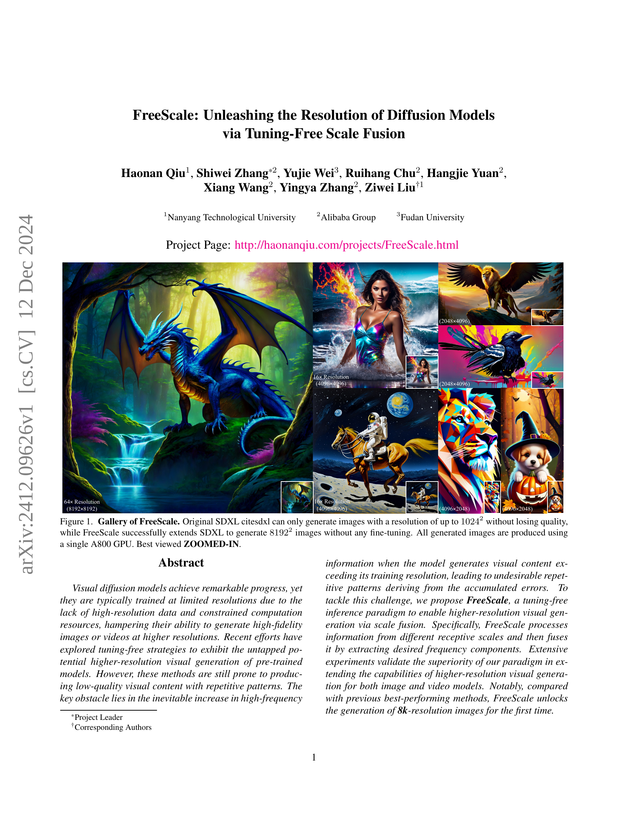
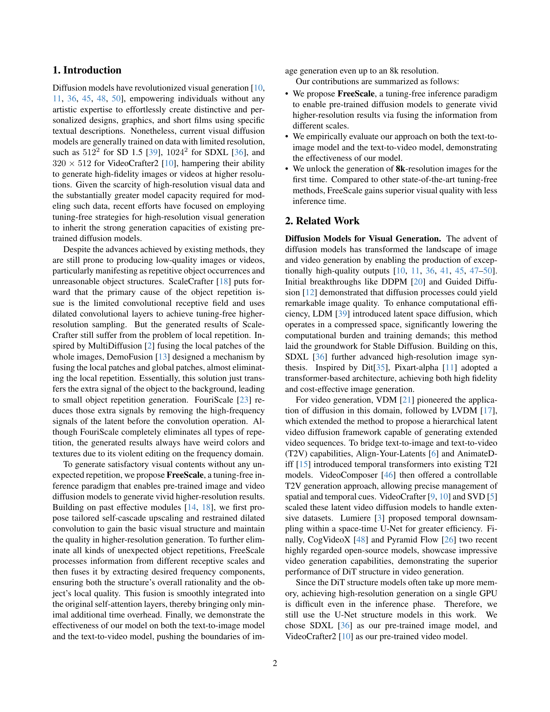
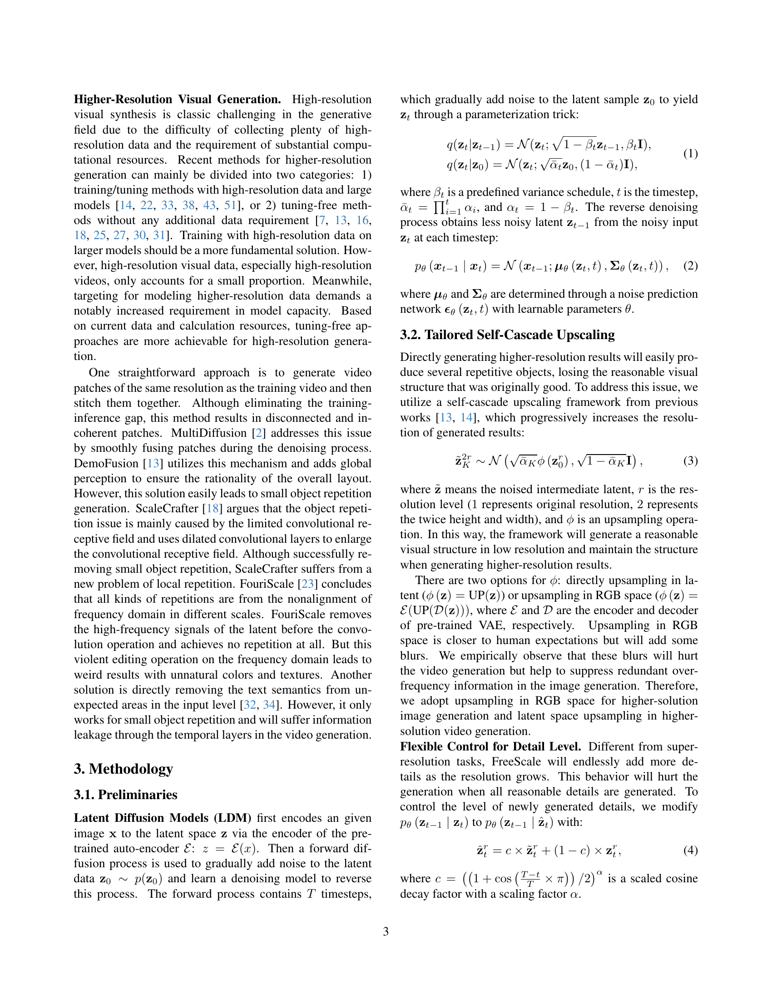
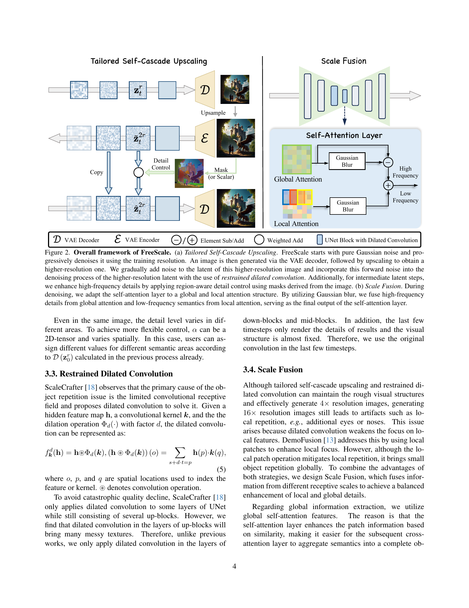
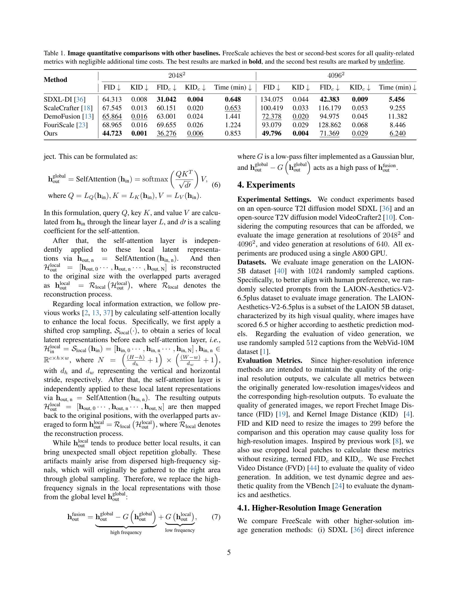
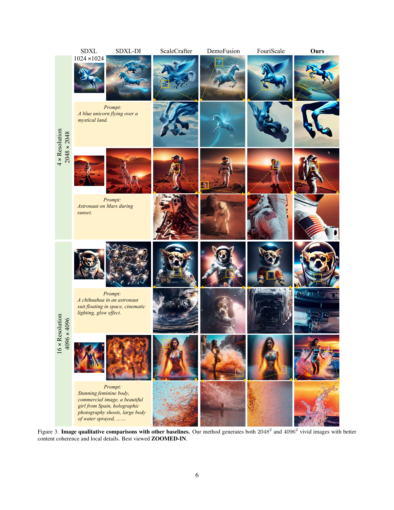
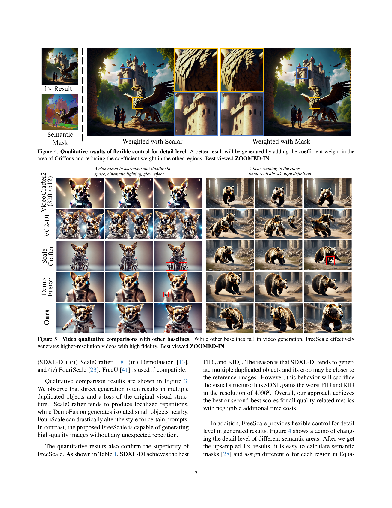
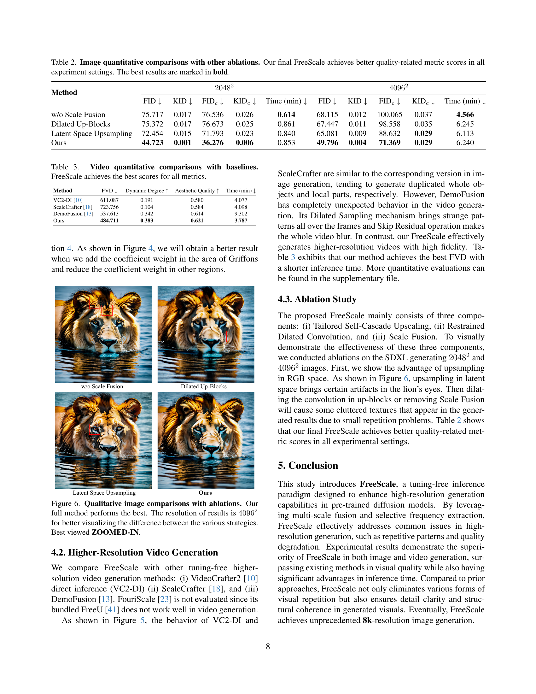
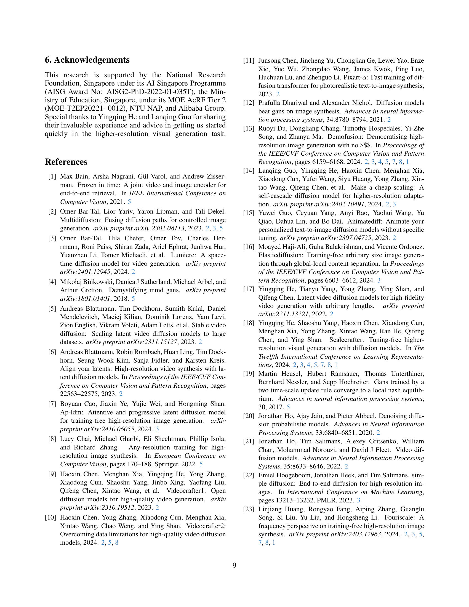
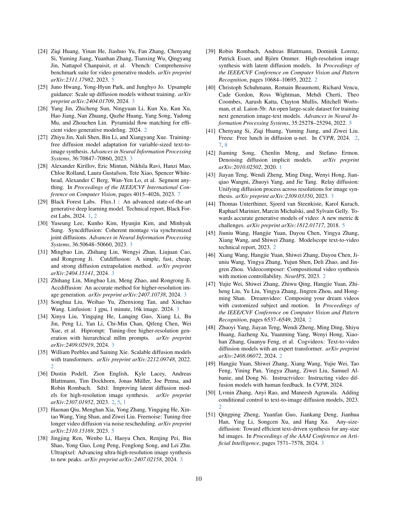
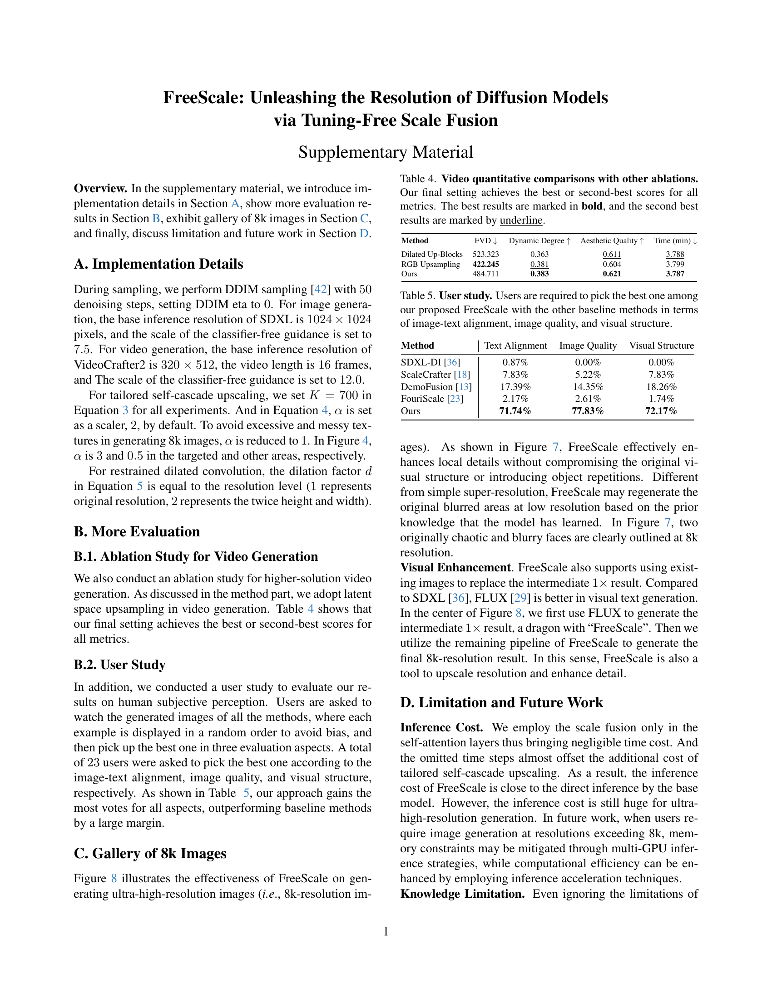
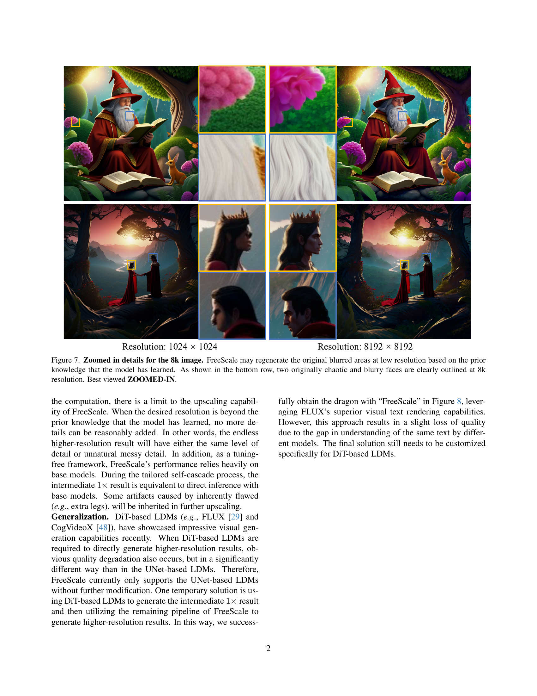
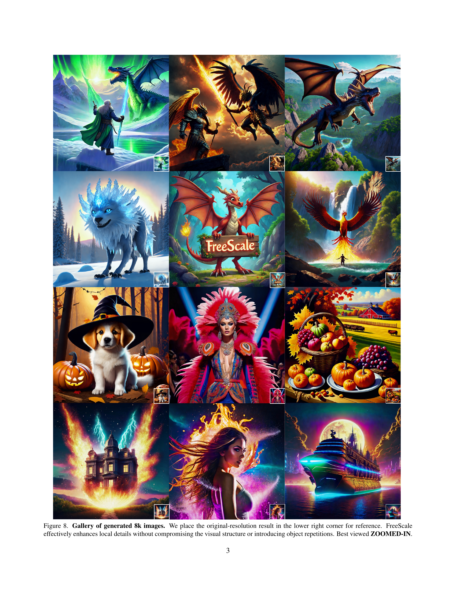
