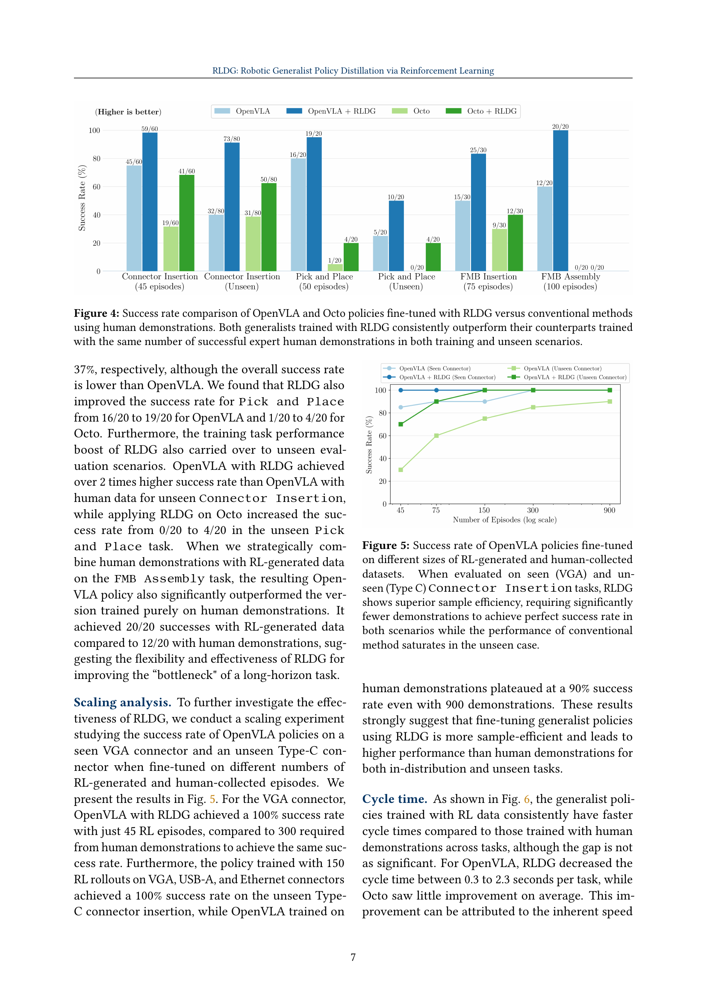
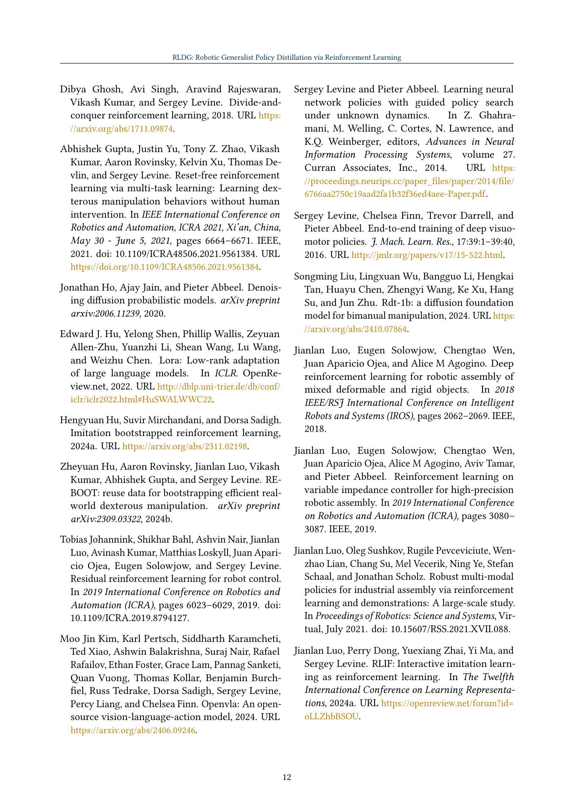
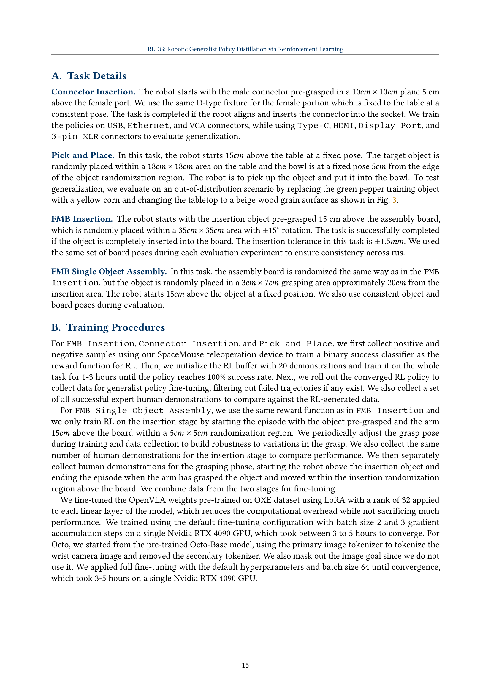

 


 2412.09858 
 Charles Xu et el. 
 
 🤗 2024-12-17 
 



↗ arXiv


↗ Hugging Face


↗ Papers with Code


### TL;DR



**최근 로봇 공학의 기초 모델은 다양한 작업에 적응할 수 있는 범용 정책 개발을 가능하게 했습니다.** 하지만 이러한 모델의 성능은 훈련 데이터의 품질에 크게 좌우되며, 인간 시연은 작업의 복잡성과 정밀도 측면에서 한계를 보입니다. 특히 정밀한 제어와 손재주가 요구되는 접촉이 많은 조작 작업에서 인간 시연은 일관성과 품질 면에서 부족하여 로봇이 강력한 정책을 학습하는 데 어려움을 겪습니다.

**이 논문은 강화 학습 기반 범용 정책 증류(RLDG)라는 새로운 방법을 제시합니다.** RLDG는 강화 학습을 활용하여 고품질 훈련 데이터를 생성하고, 이를 통해 범용 정책을 미세 조정합니다. 실험 결과, RLDG로 훈련된 정책은 인간 시연으로 훈련된 정책보다 최대 40% 더 높은 성공률을 달성했으며, 새로운 작업에도 더 잘 일반화되었습니다. 이는 작업별 RL과 범용 정책 증류를 결합하면 기초 모델의 유연성을 유지하면서 특수 컨트롤러의 성능을 달성하는 더욱 유능하고 효율적인 로봇 조작 시스템을 개발할 수 있음을 시사합니다.



#### Key Takeaways


 RLDG는 인간 시연보다 최대 40% 높은 성공률을 보이며 범용 로봇 정책의 성능을 향상시킵니다. 



 RL 생성 데이터로 훈련된 정책은 새로운 작업에 더 잘 일반화됩니다. 



 RLDG는 작업별 RL과 범용 정책 증류를 결합하여 더욱 유능하고 효율적인 로봇 조작 시스템 개발을 위한 유망한 접근 방식을 제공합니다. 


#### Why does it matter?
**로봇 공학 분야 연구자들에게 이 논문은 매우 중요합니다.** 좀 더 효율적이고 자동화된 훈련 데이터 생성 방식을 제시하여 범용 로봇 정책의 성능을 향상시키는 방법을 보여주기 때문입니다. **RLDG는 특히 정밀한 조작이 필요한 작업에서 인간 시연보다 뛰어난 성능을 달성했으며**, 이는 자율 시스템에서 더욱 복잡한 작업을 수행할 수 있는 가능성을 열어줍니다. 또한, **RL과 기초 모델의 시너지 효과**는 더욱 발전된 로봇 학습 연구의 새로운 방향을 제시합니다.

------
#### Visual Insights

> 🔼 RLDG는 OpenVLA 및 Octo와 같은 일반 로봇 정책을 전문 RL 정책으로 학습시키고 이를 사용하여 고품질 미세 조정 데이터 세트를 생성하여 개선합니다. 개별적으로 범위가 좁은 작업에 대해 학습된 여러 RL 정책에서 얻은 지식을 단일 일반 정책으로 추출할 수 있는 유연성을 제공합니다. 또한 장기 조작 작업의 가장 중요한 하위 작업에 적용하여 '병목 현상'의 성공률을 개선하는 동시에 충분한 작업 부분에 대한 인간 데모를 활용할 수 있습니다.
> 

> 
read the caption

> Figure 1: RLDG improves generalist robot policies like OpenVLA and Octo by training with specialist RL policies and using them to generate high-quality fine-tuning datasets. It has the flexibility to distill knowledge from multiple RL policies trained on individual narrowly scoped tasks into a single generalist. It can also be applied to the most critical sub-task of a long-horizon manipulation task, improving the success rate at the “bottleneck' while leveraging human demonstrations on parts of the task where it suffices.
> 

### In-depth insights

#### RL-Driven Data
**강화 학습(RL) 기반 데이터**는 로봇 공학의 판도를 바꿀 수 있는 잠재력을 가지고 있습니다. 기존의 인간 시연 데이터는 비일관성과 편향성을 포함할 수 있는 반면, RL은 보상 함수를 최대화하여 **최적의 행동**을 학습하는 에이전트를 생성합니다. 이를 통해 **고품질의 일관된 데이터**를 얻을 수 있으며, 이는 일반화 정책의 미세 조정에 매우 중요합니다. RLDG와 같은 방법은 작업별 RL 정책을 사용하여 **전문가 수준의 데이터**를 생성하고, 이 데이터를 활용하여 일반화 정책을 개선합니다. 이러한 접근 방식은 특히 접촉이 많은 조작과 같이 **정밀한 제어가 필요한 작업**에서 유효하며, RL 데이터의 장점은 행동 분포 최적화 및 상태 공간의 향상된 범위에서 비롯됩니다. 결과적으로 RL 기반 데이터는 로봇이 **더 빠르고 효율적**으로 학습할 수 있도록 하여 **더욱 강력하고 유연한 로봇 시스템** 개발을 촉진합니다.

#### Generalist Bots
**범용 로봇**은 다양한 작업에 적용 가능한 유연성이 **장점**입니다. 사전 훈련된 기반 모델을 활용하여 다양한 작업에 대한 지식을 습득하고 자연어 명령을 통해 새로운 작업에도 적응할 수 있습니다. 하지만 **정밀한 조작 작업**에서는 성능이 떨어지는 **단점**을 보입니다. 인간 시연 데이터의 불완전성과 모달 불일치, 그리고 RL 정책의 일반화 능력 부족이 주요 원인입니다. RLDG와 같은 방법은 RL의 **최적화 능력**과 기반 모델의 **일반화 능력**을 결합하여 이러한 문제를 해결하고자 합니다.

#### Precise Actions
**정밀한 행동**은 로봇 조작에서 중요한 측면입니다. 특히 연결부 삽입 및 조립과 같은 정밀한 조작 작업의 경우 **성공적인 작업 완료에 매우 중요**합니다. 이러한 작업은 **정확한 움직임과 제어가 필요**하며, 약간의 오차라도 작업이 실패할 수 있습니다. 따라서 로봇이 효과적이고 안정적으로 작동하려면 **정밀한 행동 생성 능력**이 필수적입니다. RLDG와 같이 RL 기반의 방법은 **최적화된 행동 분포를 학습**하여 인간 시연에서 학습된 정책보다 **더 높은 정밀도를 달성**하는 데 도움이 될 수 있습니다. 이러한 정책은 **정밀한 움직임의 미묘한 차이를 포착**하여 로봇이 정밀한 조작 작업을 효과적으로 수행할 수 있도록 합니다. 또한, RL은 **다양한 환경 조건에 적응**할 수 있는 정책을 학습하여 다양한 상황에서 **높은 정밀도를 유지**할 수 있도록 합니다. 결론적으로, 정밀한 행동은 **로봇 조작에서 성공을 위한 핵심 요소**이며, RLDG와 같은 RL 기반의 학습 방법을 사용하여 달성할 수 있습니다.

#### Scaling RLDG
**RLDG의 확장성**은 로봇 학습의 미래를 결정하는 중요한 요소입니다. 본 연구에서는 OpenVLA의 성능을 다양한 크기의 RL 및 인간 데모 데이터셋에서 측정하는 스케일링 실험을 진행했습니다. 그 결과, **RLDG가 인간 데모보다 훨씬 샘플 효율적**임을 확인했습니다. RLDG는 45개의 RL 에피소드만으로 100% 성공률을 달성한 반면, 인간 데모는 동일한 성공률에 도달하기 위해 300개의 에피소드가 필요했습니다.  이는 **RLDG가 대규모 데이터셋 없이도 효과적인 정책 학습을 가능하게** 함을 시사합니다. 하지만 실험 규모가 제한적이므로 향후 더 **광범위한 조건에서 RLDG의 확장성**을 검증할 필요가 있습니다. 특히, **다양한 작업 및 로봇 플랫폼에 대한 RLDG의 적용 가능성과 성능**을 평가하는 것이 중요합니다. 또한, **컴퓨팅 리소스 및 훈련 시간 측면에서의 확장성** 분석도 필요합니다. 이러한 연구는 RLDG를 실제 로봇 시스템에 배포하고 로봇 범용 학습의 발전에 기여하는 데 중요한 역할을 할 것입니다.

#### Auto-RL Training
**Auto-RL Training**은 로봇 학습에서 인간 개입을 최소화하는 강력한 학습 패러다임입니다. 이 방식은 에이전트가 환경과의 상호 작용을 통해 자율적으로 학습하도록 하여, **데이터 수집 및 라벨링과 관련된 비용을 줄여줍니다.** Auto-RL은 특히 **대규모 데이터 세트가 필요한 파운데이션 모델**을 훈련할 때 유용합니다. 강화 학습 알고리즘은 보상 함수를 최대화하여 최적의 행동 분포를 학습할 수 있으므로 사람이 만든 데모보다 우수한 성능을 보이는 정책을 생성할 수 있습니다. 또한 Auto-RL을 사용하면 사람이 하기 어려운 **복잡하고 미묘한 조작 작업**에서 효과적인 정책을 학습할 수 있습니다. 하지만 Auto-RL에는 보상 함수를 정의해야 하고, 일반화 능력이 떨어지며, 특정 작업에 과적합될 수 있는 등 몇 가지 단점도 있습니다. 향후 연구에서는 보상 함수 없이 Auto-RL을 수행하고, 일반화 능력을 향상시키며, 실제 로봇 시스템에 Auto-RL을 배포하는 방법을 모색해야 합니다.

### More visual insights

More on figures

> 🔼 이 그림은 RLDG 실험에 사용된 로봇 설정을 보여줍니다. Franka Emika Panda 팔, 평행 턱 그리퍼, 3Dconnexion SpaceMouse, 손목에 장착된 RealSense D405 카메라로 구성되어 있습니다. SpaceMouse는 로봇 팔을 원격 조작하는 데 사용되며, RealSense 카메라는 로봇의 손목 관점에서 이미지 관측값을 제공합니다.
> 

> 
read the caption

> Figure 2: We use a Franka Emika Panda arm with a parallel jaw gripper teleoperated by a 3Dconnexion SpaceMouse device. There is a single RealSense D405 camera mounted on the robot’s wrist for image observations.
> 

> 🔼 이 그림은 RLDG를 평가하기 위해 사용된 작업들을 보여줍니다. (A) 정밀 커넥터 삽입은 정책 일반화를 평가하기 위한 3개의 훈련 객체와 4개의 보이지 않는 테스트 객체를 포함합니다. (B) 픽 앤 플레이스는 정책의 다양한 배경 및 객체에 대한 시각적 견고성을 테스트하는 보이지 않는 시나리오를 포함합니다. (C) FMB 삽입은 움직이는 보드에 미리 잡은 물체를 삽입하는 작업을 포함하는 반면 (D) FMB 조립은 테이블 위의 물체에서 시작하여 추가적인 잡기 단계를 포함합니다. 즉, RLDG는 RL 정책에서 생성된 고품질 데이터로 일반화 정책을 미세 조정하는 간단한 방법입니다. RL로 훈련된 정책은 특정 작업에서 뛰어난 성능을 달성할 수 있지만 제로샷 일반화 및 교란에 대한 견고성이 부족한 경우가 많습니다. 반대로 일반화 정책은 일반화에는 탁월하지만 사람의 데모로 훈련할 때 높은 성능을 달성하기 어려울 수 있습니다. RLDG는 지식 증류를 통해 이러한 차이를 해소하여 사람의 데모로 미세 조정하는 것보다 더 나은 성능을 보이는 일반화 정책을 만듭니다.
> 

> 
read the caption

> Figure 3: Illustrations of tasks used to evaluate RLDG. (A) Precise Connector Insertion includes three training objects and four unseen test objects for evaluating policy generalization. (B) Pick and Place involves an unseen scenario that tests the policy’s visual robustness to different backgrounds and objects. (C) FMB Insertion involves inserting a pre-grasped object in a moving board while (D) FMB Assembly starts with the object on the table and involves an additional grasping phase.
> 

> 🔼 이 그림은 RLDG로 미세 조정된 OpenVLA 및 Octo 정책과 사람 데모를 사용하는 기존 방법의 성공률 비교를 보여줍니다. RLDG로 훈련된 두 일반 정책 모두 교육 및 미공개 시나리오에서 동일한 수의 성공적인 전문가 인간 데모로 훈련된 정책보다 지속적으로 성능이 뛰어납니다.
> 

> 
read the caption

> Figure 4: Success rate comparison of OpenVLA and Octo policies fine-tuned with RLDG versus conventional methods using human demonstrations. Both generalists trained with RLDG consistently outperform their counterparts trained with the same number of successful expert human demonstrations in both training and unseen scenarios.
> 

> 🔼 이 그림은 OpenVLA 정책을 서로 다른 크기의 RL 생성 및 사람이 수집한 데이터 세트에서 미세 조정한 성공률을 보여줍니다. 본(VGA) 및 미공개(Type C) 커넥터 삽입 작업에서 평가했을 때 RLDG는 뛰어난 샘플 효율성을 보여주며 두 시나리오 모두에서 완벽한 성공률을 달성하는 데 훨씬 적은 데모가 필요합니다. 반면 기존 방법의 성능은 미공개 사례에서 포화 상태입니다.
> 

> 
read the caption

> Figure 5: Success rate of OpenVLA policies fine-tuned on different sizes of RL-generated and human-collected datasets. When evaluated on seen (VGA) and unseen (Type C) Connector Insertion tasks, RLDG shows superior sample efficiency, requiring significantly fewer demonstrations to achieve perfect success rate in both scenarios while the performance of conventional method saturates in the unseen case.
> 

> 🔼 이 그림은 강화 학습(RL) 데이터와 인간 데모 데이터로 학습된 정책 간의 작업 완료 주기 시간을 비교합니다. FMB 조립에서 RL에 대해 'N/A'는 정책이 전체 작업에 대해 학습되지 않았음을 나타내고, 미세 조정된 정책에 대한 'N/A'는 성공이 기록되지 않았음을 나타냅니다. RL로 학습된 정책은 일반적으로 작업에서 더 빠른 실행 시간을 달성하여 정책 학습에 RL 생성 데이터를 사용할 때의 효율성 이점을 보여줍니다.
> 

> 
read the caption

> Figure 6: Cycle time comparison between policies trained with RL data versus human demonstrations. N/A for RL in FMB Assembly denotes policy not trained on the whole task, while N/A for fine-tuned policies denotes no successes recorded. The RL-trained policies generally achieve faster execution times across tasks, demonstrating the efficiency benefits of using RL-generated data for policy training.
> 

> 🔼 이 그림은 FMB 삽입 작업에서 다양한 데이터 소스와 데이터세트 크기에 따른 일반화 정책의 미세 조정 성공률을 보여줍니다. 인간 시연자의 데모 궤적, RL 에이전트가 다시 레이블을 지정한 동일한 인간 데모 궤적, RL 에이전트가 수집한 롤아웃의 세 가지 데이터 소스가 비교됩니다. RL 데이터는 인간 데이터보다 일관되게 더 나은 미세 조정 성능을 제공하며, RL 데이터가 더 나은 행동 품질을 가지고 있음을 시사합니다. 인간 + RL 작업은 인간과 RL 데이터 간의 성능 차이를 대부분 줄여 RL 데이터의 이점이 더 나은 작업 품질에서 비롯됨을 보여줍니다.
> 

> 
read the caption

> Figure 7: Fine-tuning success rate on the FMB insertion task with different fine-tuning data sources and varied dataset sizes (from 25 trajectories to 300 trajectories). Human: demo trajectories collected by human teleoperators. Human + RL actions: the same human demo trajectories but with all the actions relabeled by a trained RL agent. RL: rollouts collected by the RL agent. RL data consistently provide better fine-tuning performance than human data. Human + RL actions closes the gap mostly, suggesting that most of the benefits of RL data come from it having better action quality.
> 

> 🔼 RL 데이터와 사람 데모 데이터에 대한 행동 분포를 시각화한 그래프입니다. FMB 삽입 작업에서 엔드 이펙터 위치가 왼쪽 이미지에 표시된 위치에 가까운 데이터셋의 행동만 필터링하여 시각화했습니다. 로봇 팔은 삽입 지점에 도달하기 위해 -x 및 -y 방향으로 움직여야 합니다. 행동 공간의 처음 두 차원은 엔드 이펙터 위치의 x 및 y 위치 제어에 해당합니다. 사람의 행동은 행동 공간의 중앙에 집중되어 있는 반면, RL 행동은 더 최적화되어 있으며 대부분 행동 공간의 올바른 모서리(왼쪽 아래) 근처에서 발견됩니다.
> 

> 
read the caption

> Figure 8: Action distribution visualization for RL data and human demo data for the FMB insertion task. We visualize the first two dimensions of the dataset actions after filtering all the transitions in the dataset where the end-effector positions are close to the position shown in the image on the left (x𝑥xitalic_x/y𝑦yitalic_y coordinates are both within 4444mm and z𝑧zitalic_z coordinate is within 10101010mm). The robot arm needs to move in the -x𝑥xitalic_x direction and in the -y𝑦yitalic_y direction to reach the insertion point. The first two dimensions of the action space corresponds to the control of the x𝑥xitalic_x and y𝑦yitalic_y position of the end-effector position correspondingly. Human actions are clustered around the center of the action space whereas the RL actions are more optimized, and mostly found near the correct corner (bottom-left) of the action space.
> 

### Full paper



