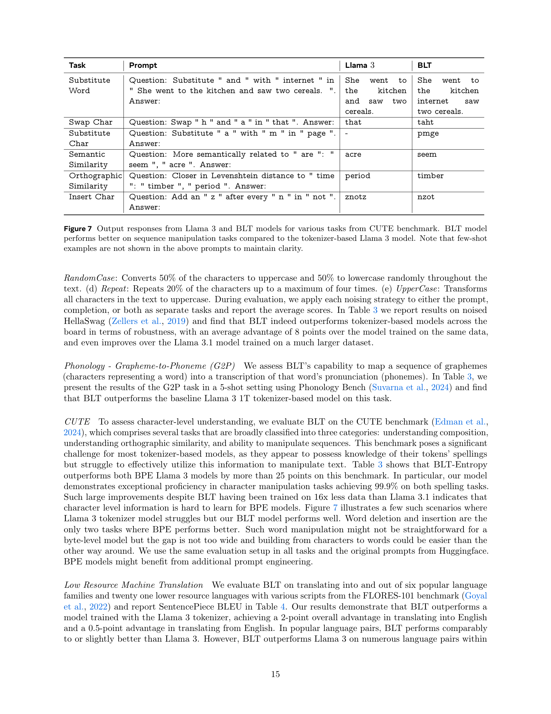

 


 2412.09871 
 Artidoro Pagnoni et el. 
 
 🤗 2024-12-17 
 



↗ arXiv


↗ Hugging Face


↗ Papers with Code


### TL;DR



대규모 언어 모델(LLM)은 일반적으로 바이트를 고정 토큰 집합으로 그룹화하는 토큰화라는 사전 처리 단계에 의존합니다. 이는 도메인 민감도, 입력 노이즈 민감도, 철자 지식 부족, 다국어 불평등과 같은 여러 가지 단점을 초래합니다. 또한 바이트 시퀀스 길이가 길어짐에 따라 바이트에 대한 LLM 교육 비용이 많이 듭니다.

이 논문에서는 바이트 레벨 LLM 아키텍처인 Byte Latent Transformer(BLT)를 소개합니다. BLT는 바이트를 동적으로 크기가 조정되는 패치로 인코딩하며, 이 패치는 계산의 기본 단위 역할을 합니다. 패치는 다음 바이트의 엔트로피를 기반으로 분할되어 데이터 복잡성이 증가하는 경우 더 많은 계산 및 모델 용량을 할당합니다. BLT는 고정 어휘 없이 원시 바이트로 훈련된 모델의 확장 가능성을 보여주고 추론에서 최대 50% FLOPS를 절약하면서 Llama 3와 동등한 성능을 달성합니다. 또한 BLT는 고정 추론 FLOPS 예산으로 모델 및 패치 크기를 동시에 조정할 수 있는 새로운 스케일링 차원을 제공합니다. 전반적으로 BLT는 추론 효율성, 노이즈 입력에 대한 견고성, 장문 일반화에서 토큰 기반 모델보다 성능이 뛰어납니다.



#### Key Takeaways


 동적 패치를 사용하는 바이트 레벨 LLM인 BLT를 소개합니다. 



 BLT는 Llama 3와 동등한 성능을 달성하면서 추론에서 최대 50% FLOPS를 절약합니다. 



 BLT는 고정 추론 FLOPS 예산으로 모델 및 패치 크기를 동시에 조정할 수 있도록 합니다. 


#### Why does it matter?
**바이트 레벨 모델링의 효율성과 견고성을 개선**하여 **토큰 기반 LLM에 필적하는 성능**을 달성하고, **추론 효율성과 견고성을 향상**시킵니다. 고정 추론 예산 내에서 모델 및 패치 크기를 동시에 늘리는 **새로운 스케일링 차원을 제시**하고, 노이즈 입력에 대한 **향상된 견고성과 하위 단어 측면에 대한 인식**을 보여줍니다. **장래 연구에 새로운 길을 열어줍니다.**

------
#### Visual Insights

> 🔼 고정 추론 FLOP 모델에 대한 학습 예산 대비 성능 스케일링 추세를 보여주는 그래프입니다. 토큰 기반 모델에서는 고정 추론 예산에 따라 모델 크기가 결정됩니다. 반면 BLT 아키텍처는 학습 및 추론 예산을 동일하게 유지하면서 모델 및 패치 크기를 동시에 늘릴 수 있는 새로운 스케일링 축을 제공합니다. BLT 패치 크기(ps) 6 및 8 모델은 BPE Llama 2 및 3의 스케일링 추세를 빠르게 따라잡습니다. 더 큰 추론 예산으로 전환하면 더 큰 패치 크기 8 모델이 더 빨리 바람직해집니다. BPE의 계산 최적 지점과 교차 지점이 세로선으로 표시되어 있습니다.
> 

> 
read the caption

> Figure 1:  Scaling trends for fixed inference flop models (fully) trained with varying training budgets. In token-based models, a fixed inference budget determines the model size. In contrast, the BLT architecture provides a new scaling axis allowing simultaneous increases in model and patch size while keeping the same training and inference budget. BLT patch-size (ps) 6 and 8 models quickly overtake scaling trends of bpe Llama 2 and 3. Moving to the larger inference budget makes the larger patch size 8 model more desirable sooner. Both BPE compute-optimal point and crossover point are indicated with vertical lines.
> 


|                       | Llama 3 (1T Tokens) | BLT-Space (6T Bytes) | BLT-Entropy (4.5T Bytes) |
| :-------------------- | :------------------: | :-----------------: | :----------------------: |
| **Arc-E**             |        77.6         |       75.4        |          **79.6**         |
| **Arc-C**             |        **53.3**         |       49.8        |          52.1         |
| **HellaSwag**         |        79.1         |       79.6        |          **80.6**         |
| **PIQA**              |        80.7         |       **81.1**        |          80.6         |
| **MMLU**              |        **58.1**         |       54.8        |          57.4         |
| **MBPP**              |        40.2         |       37.6        |          **41.8**         |
| **HumanEval**         |        31.1         |       27.4        |          **35.4**         |
| **Average**           |        60.0         |       58.0        |          **61.1**         |
| **Bytes/Patch on Train Mix** |        4.4         |       **6.1**        |          4.5         |

> 🔼 BLT-1T 데이터셋에서 학습된 80억 파라미터 BLT 모델과 Llama 3 토크나이저를 사용한 기준 모델을 비교합니다. BLT 모델은 평균적으로 Llama 3보다 성능이 뛰어나며, 패칭 방식에 따라 성능 저하를 최소화하면서 FLOPS를 크게 절감할 수 있습니다.
> 

> 
read the caption

> Table 1: Comparison of flop-matched BLT 8B models trained on the BLT-1T dataset comprising high-quality tokens of text and code from publicly available sources, with baseline models using the Llama 3 tokenizer. BLT performs better than Llama 3 on average, and depending on the patching scheme, achieves significant flops savings with a minor reduction in performance.
> 

### In-depth insights

#### Byte-Level LLMs
**바이트 레벨 LLM**은 토큰화 없이 바이트를 직접 처리하여 도메인 의존성, 노이즈 민감성, 다국어 불균형 문제를 해결합니다. **동적 패칭**을 통해 계산 리소스를 효율적으로 할당하여 **추론 효율성**을 개선합니다. BLT 아키텍처는 **바이트 및 패치 정보를 혼합**하고, 고정 어휘 없이 바이트에서 학습하여 **토큰 기반 모델과 비슷한 성능**을 달성합니다. 또한 추론 FLOP 예산 내에서 **모델 크기와 패치 크기를 동시에 늘릴** 수 있는 새로운 스케일링 차원을 제공합니다. BLT는 입력 노이즈에 대한 **강력한 성능**과 **하위 단어 측면에 대한 인식**을 보여줍니다. 바이트 레벨 모델링은 **일반화 능력 향상**과 **효율적인 리소스 할당**을 통해 LLM의 미래를 위한 유망한 방향을 제시합니다.

#### Dynamic Patching
**동적 패칭**은 입력의 복잡도에 따라 계산을 효율적으로 할당하는 방법입니다. 고정된 토큰화와 달리, 텍스트의 **엔트로피**를 기반으로 바이트를 동적 크기의 패치로 그룹화합니다. 예측하기 어려운 부분에는 더 많은 계산과 모델 용량을 할당하고, 예측하기 쉬운 부분(예: 단어 끝부분)에는 더 적은 리소스를 할당합니다. 이를 통해 **추론 효율성**이 크게 향상됩니다. **패치 크기**를 조정하여 추론 FLOP 예산 내에서 모델 크기를 늘릴 수 있다는 점에서 확장성도 향상됩니다. 또한, **잡음 입력에 대한 견고성**과 문자 수준 이해 능력이 향상됩니다. 하지만 동적 패칭은 엔트로피 모델을 실시간으로 실행해야 하므로 추가적인 계산 오버헤드가 발생할 수 있습니다.

#### BLT Architecture
**BLT 아키텍처는 바이트 수준 입력을 처리하는 데 중점을 둡니다.** 로컬 인코더는 바이트를 패치 표현으로 인코딩하고, 로컬 디코더는 패치 표현을 다시 바이트로 디코딩합니다. **핵심 구성 요소는 패치 표현에서 작동하는 대규모 전역 자동 회귀 언어 모델인 잠재 전역 변환기입니다.** 이 구조를 통해 BLT는 입력 및 출력의 복잡성에 따라 계산을 동적으로 할당할 수 있습니다. **고정 어휘 토큰화에 의존하는 기존 모델과 달리 BLT는 동적으로 패치를 생성합니다.** 바이트 레벨 정보에 직접 액세스하면 입력 노이즈에 대한 견고성이 향상되고 토큰 기반 모델에서 누락되는 경우가 많은 하위 단어 측면에 대한 인식이 향상됩니다.

#### Robustness Gains
**BLT 모델은 토큰 기반 모델보다 잡음에 대한 강건성이 뛰어납니다.** 잡음이 있는 HellaSwag 데이터셋에서 BLT는 같은 데이터로 훈련된 토큰 기반 모델보다 평균 8점 높은 성능을 보였습니다. 심지어 훨씬 더 큰 데이터셋으로 훈련된 Llama 3.1 모델보다도 더 나은 성능을 보였습니다. 문자 수준에서 직접 작동하는 BLT의 특성과 동적 패칭 메커니즘이 이러한 강건성 향상에 기여한 것으로 분석됩니다. BLT는 입력 잡음에 덜 민감할 뿐만 아니라, 토큰 기반 모델이 어려워하는 문자 구성 요소에 대한 이해도도 높습니다. CUTE 벤치마크에서 BLT는 BPE Llama 3 모델보다 25점 이상 높은 점수를 기록했으며, 특히 철자 관련 작업에서 99.9%의 정확도를 달성했습니다. 이는 BLT가 문자 수준 정보를 효과적으로 활용할 수 있음을 보여줍니다. 따라서 BLT는 **토큰 기반 모델의 한계를 극복하고 더욱 강건하고 효율적인 언어 모델을 위한 새로운 가능성을 제시합니다.**

#### Scaling w/ Patches
**패치 기반 스케일링**은 토큰 기반 LLM 대비 **추론 효율성 향상** 및 **견고성**을 보여줍니다. BLT는 고정 어휘 없이 **동적 패치 크기**를 활용하여 **계산량을 효율적으로 할당**합니다. 추론 FLOP가 고정된 상태에서 모델 및 패치 크기 **동시 증가**라는 새로운 스케일링 축을 제공하며, 토큰 기반 모델 대비 **더 나은 스케일링 추세**를 보입니다. 특히 8B 모델에서 Llama 3 대비 **최대 50% 추론 FLOP 절감**이 가능합니다. 패치 크기 증가는 **더 큰 잠재 변환기**를 허용하여 성능 향상에 기여합니다. BLT는 **장문 데이터 예측**에 효율적이며, **잡음 입력에 대한 견고성** 및 **문자 수준 이해 능력** 향상을 보입니다.

### More visual insights

More on figures

> 🔼 BLT는 입력 바이트를 패치 표현으로 인코딩하는 경량 로컬 인코더, 패치 표현에 대한 계산량이 많은 잠재 변환기, 다음 바이트 패치를 디코딩하는 경량 로컬 디코더의 세 가지 모듈로 구성됩니다. BLT는 바이트 n-그램 임베딩과 교차 어텐션 메커니즘을 통합하여 잠재 변환기와 바이트 레벨 모듈 간의 정보 흐름을 극대화합니다(그림 5). 고정 어휘 토큰화와 달리 BLT는 바이트 레벨 정보에 대한 액세스를 유지하면서 바이트를 패치로 동적으로 그룹화합니다.
> 

> 
read the caption

> Figure 2:  BLT comprises three modules, a lightweight Local Encoder that encodes input bytes into patch representations, a computationally expensive Latent Transformer over patch representations, and a lightweight Local Decoder to decode the next patch of bytes. BLT incorporates byte n𝑛nitalic_n-gram embeddings and a cross-attention mechanism to maximize information flow between the Latent Transformer and the byte-level modules (Figure 5). Unlike fixed-vocabulary tokenization, BLT dynamically groups bytes into patches preserving access to the byte-level information.
> 

> 🔼 이 그림은 다양한 패칭 방식을 보여줍니다. 각 방식은 바이트를 패치로 그룹화하는 방식이 다르며, 결과적으로 패치 수가 달라집니다. 각 패치는 큰 변환기 단계를 사용하여 처리되므로 패치 수는 FLOPS 측면에서 소비되는 계산량의 대부분을 직접적으로 결정합니다. 패칭 방식에는 (a) MegaByte(Yu et al., 2023)에서처럼 4바이트마다 스트라이드하는 방식(§2.1), (b) 바이트 페어 인코딩(BPE)으로 토큰화하는 방식(이 경우 Llama-3(Dubey et al., 2024) 토크나이저 사용), (c 및 d) 이 연구에서처럼 엔트로피 기반 패칭 방식(§2.3), (e) 공백 바이트에서 패칭하는 방식(Slagle, 2024), (f) 2바이트 컨텍스트를 가진 작은 CNN 바이트 레벨 모델을 사용하여 엔트로피에서 패칭하는 방식이 있습니다.
> 

> 
read the caption

> Figure 3:  Patching schemes group bytes in different ways, each leading to a different number of resulting patches. Since each patch is processed using a large transformer step, the number of patches directly determines the bulk of the compute expended in terms of flops. These schemes group bytes into patches by (a) striding every four bytes (§2.1) as in MegaByte (Yu et al., 2023), (b) tokenizing with Byte-Pair Encoding (bpe), in this case the Llama-3 (Dubey et al., 2024) tokenizer, (c & d) entropy-based patching as in this work (§2.3), (e) patching on space-bytes (Slagle, 2024), (f) and patching on entropy using a small CNN byte-level model with 2-byte context.
> 

> 🔼 이 그림은 문자열 'Daenerys Targeryen is in Game of Thrones, a fantasy epic by George R.R. Martin.'의 각 바이트에 대한 엔트로피 값을 보여줍니다. 띄어쓰기는 밑줄로 표시되어 있습니다. 빨간색 수평선으로 표시된 전역 임계값 θg를 초과하면 새 패치가 시작됩니다. 새 패치의 시작은 회색 세로선으로 표시됩니다. 예를 들어, 'George R.R. Martin'에서 'G'와 'e'의 엔트로피는 θg를 초과하므로 'G'는 단일 바이트 패치의 시작이고 'e'는 더 큰 패치의 시작입니다. 이후 엔트로피 값이 낮게 유지되므로 추가 패치가 생성되지 않고, 'e'로 시작하는 패치는 이름있는 개체의 끝까지 확장됩니다.
> 

> 
read the caption

> Figure 4:  This figure plots the entropy H⁢(xi)𝐻subscript𝑥𝑖H(x_{i})italic_H ( italic_x start_POSTSUBSCRIPT italic_i end_POSTSUBSCRIPT ) of each byte in “Daenerys Targeryen is in Game of Thrones, a fantasy epic by George R.R. Martin.” with spaces shown as underscores. Patches end when H⁢(xi)𝐻subscript𝑥𝑖H(x_{i})italic_H ( italic_x start_POSTSUBSCRIPT italic_i end_POSTSUBSCRIPT ) exceeds the global threshold θgsubscript𝜃𝑔\theta_{g}italic_θ start_POSTSUBSCRIPT italic_g end_POSTSUBSCRIPT, shown as a red horizontal line. The start of new patches are shown with vertical gray lines. For example, the entropies of “G” and “e” in “George R.R. Martin” exceed θgsubscript𝜃𝑔\theta_{g}italic_θ start_POSTSUBSCRIPT italic_g end_POSTSUBSCRIPT, so “G” is the start of a single byte patch and “e” of a larger patch extending to the end of the named entity as the entropy H⁢(xi)𝐻subscript𝑥𝑖H(x_{i})italic_H ( italic_x start_POSTSUBSCRIPT italic_i end_POSTSUBSCRIPT ) stays low, resulting in no additional patches.
> 

> 🔼 이 그림은 BLT 아키텍처의 로컬 인코더와 로컬 디코더가 어떻게 cross-attention 블록을 사용하는지 보여줍니다. 로컬 인코더는 패치 표현을 쿼리로, 바이트 표현을 키/값으로 사용하여 바이트 표현을 패치 표현으로 인코딩합니다. 로컬 디코더는 바이트 표현을 쿼리로, 패치 표현을 키/값으로 사용하여 cross-attention 블록을 사용합니다. 여기서 Cross-Attn k=2는 cross-attention 블록에서 사용하는 매개변수 k가 2라는 것을 의미합니다. 즉, 각 패치는 이전 레이어에서 해당 패치의 바이트 표현의 2배에 해당하는 키와 값에 주의를 기울입니다.
> 

> 
read the caption

> Figure 5: The local encoder uses a cross-attention block with patch representations as queries, and byte representations as keys/values to encode byte representations into patch representations. The local decoder uses a similar block but with the roles reversed i.e. byte representations are now the queries and patch representations are the keys/values. Here we use Cross-Attn k=2𝑘2k=2italic_k = 2.
> 

> 🔼 이 그림은 다양한 아키텍처 선택지를 사용한 BLT 모델과 기준 BPE 토큰 기반 모델의 스케일링 추세를 보여줍니다. 모델들은 Dubey et al. (2024)에서 계산된 최적 토큰 수에 따라 10억에서 80억 개의 매개변수를 사용하여 다양한 규모로 학습되었으며, 학습 분포에서 추출한 샘플에 대한 비트/바이트를 보고합니다. BLT 모델은 Llama 3와 같은 최첨단 토크나이저 기반 모델과 동등한 성능을 보입니다. PS는 패치 크기를 나타냅니다. 공간 패칭(왼쪽)에 대한 아키텍처 개선 사항을 별도로 보여주고 동적 패칭(오른쪽)과 결합합니다.
> 

> 
read the caption

> Figure 6: Scaling trends for BLT models with different architectural choices, as well as for baseline BPE token-based models. We train models at multiple scales from 1B up to 8B parameters for the optimal number of tokens as computed by Dubey et al. (2024) and report bits-per-byte on a sample from the training distribution. BLT models perform on par with state-of-the-art tokenizer-based models such as Llama 3, at scale. PS denotes patch size. We illustrate separate architecture improvements on space-patching (left) and combine them with dynamic patching (right).
> 

> 🔼 이 그림은 CUTE 벤치마크의 다양한 작업에 대한 Llama 3 및 BLT 모델의 출력 응답을 보여줍니다. BLT 모델은 토크나이저 기반 Llama 3 모델에 비해 시퀀스 조작 작업에서 더 나은 성능을 보입니다. 명확성을 위해 위의 프롬프트에는 few-shot 예제가 표시되지 않았습니다.
> 

> 
read the caption

> Figure 7: Output responses from Llama 3 and BLT models for various tasks from CUTE benchmark. BLT model performs better on sequence manipulation tasks compared to the tokenizer-based Llama 3 model. Note that few-shot examples are not shown in the above prompts to maintain clarity.
> 

> 🔼 이 그림은 400m 및 1b BLT 모델에 대해 학습 FLOPS 대비 bits-per-byte(bpb) 언어 모델링 성능의 변화를 보여주며, 다양한 크기와 컨텍스트 창의 엔트로피 모델로 패치되었습니다. 두 차원 모두 스케일링 성능을 향상시키고, 컨텍스트 창이 512바이트인 50m 매개변수 엔트로피 모델을 넘어서면 감소하는 수익률을 보입니다.
> 

> 
read the caption

> Figure 8: Variation of language modeling performance in bits-per-byte (bpb) with training flops for 400m and 1b BLT models patched with entropy models of different sizes and context windows. Both dimensions improve scaling performance, with diminishing returns beyond 50m parameter entropy models with a context of 512 bytes.
> 

More on tables


| Llama 3 |
| -------- |
| 1T Tokens |
> 🔼 이 표는 고정 추론 FLOP 스케일링 연구에 사용된 모델에 대한 자세한 내용을 보여줍니다. 각 모델의 임베딩 매개변수를 제외한 매개변수와 Llama 2 대비 상대적인 수를 보고합니다. 바이트당 추론 FLOP가 동일한 모델 크기를 선택합니다. 또한 그림 1에서 볼 수 있듯이 BPE의 계산 최적 학습 데이터 양과 BLT가 BPE를 능가하는 교차점을 나타냅니다(둘 다 학습 데이터의 바이트로 표시됨). 이 지점은 많은 최신 학습 예산에 비해 훨씬 작은 규모에서 달성됩니다.
> 

> 
read the caption

> Table 2: Details of models used in the fixed-inference scaling study. We report non-embedding parameters for each model and their relative number compared to Llama 2. We pick model sizes with equal inference flops per byte. We also indicate BPE’s compute-optimal training data quantity and the crossover point where BLT surpasses BPE as seen in Figure 1 (both expressed in bytes of training data). This point is achieved at much smaller scales compared to many modern training budgets.
> 


| BLT-Space |
| :--------: |
| 6T Bytes |
> 🔼 이 표는 노이즈에 대한 강건성 및 언어 구성 요소에 대한 인식을 평가하는 작업에서 80억 개 매개변수 BLT 모델을 1조 개의 토큰으로 학습된 80억 개 매개변수 BPE Llama 3 모델과 비교한 결과를 보여줍니다. 또한 동일한 작업에 대한 Llama 3.1(16조 개의 토큰으로 학습)의 성능도 보고합니다. BLT는 Llama 3 BPE 모델보다 성능이 훨씬 뛰어나며, 많은 작업에서 Llama 3.1보다 더 나은 성능을 보여줍니다. 이는 바이트 수준 인식이 더 많은 데이터만으로는 쉽게 얻을 수 있는 것이 아님을 시사합니다.
> 

> 
read the caption

> Table 3: We compare our 8B BLT model to 8B BPE Llama 3 trained on 1T tokens on tasks that assess robustness to noise and awareness of the constituents of language (best result bold). We also report the performance of Llama 3.1 on the same tasks and underline best result overall. BLT outperforms the Llama 3 BPE model by a large margin and even improves over Llama 3.1 in many tasks indicating that the byte-level awareness is not something that can easily be obtained with more data.
> 


| BLT-Entropy |
| -------- |
| 4.5T Bytes |
> 🔼 FLORES-101 벤치마크에서 6개의 주요 언어와 21개의 저자원 언어에 대한 번역 성능(BLEU 점수)을 1조 토큰으로 학습된 80억 파라미터 BLT 모델과 Llama 3 모델을 비교하여 보여줍니다. BLT 모델은 바이트 수준 모델링을 사용하고 Llama 3는 토큰 기반 모델입니다.
> 

> 
read the caption

> Table 4: Performance of 8B BLT and 8B Llama 3 trained for 1T tokens on translating into and from six widely-used languages and twenty one lower resource languages with various scripts from the FLORES-101 benchmark (Goyal et al., 2022).
> 


| Llama 2 | Llama 3 | Entropy ps=6 | Entropy ps=8 | Inference flops | Compute Optimal (Bytes) | Crossover (Bytes) |
|---|---|---|---|---|---|---| 
| 470m | 450m | 610m (1.2x) | 760m (1.6x) | 3.1E8 | 50B | 150B |
| 3.6B | 3.9B | 5.2B (1.3x) | 6.6B (1.7x) | 2.1E9 | 400B | 1T |
> 🔼 표 5는 BLT 모델의 전역 변환기 매개변수를 Llama 3의 비 임베딩 매개변수로 초기화하면 여러 벤치마크 작업에서 성능이 향상됨을 보여줍니다. BLT, Llama 3, Llama 3.1 모델은 Llama 2 데이터 세트를 사용하여 각 모델 크기에 대해 계산적으로 최적의 단계 수만큼 훈련되었습니다. Llama 3.1 모델은 15T 토큰으로 훈련되었으며, Llama 3와 BLT는 220B 토큰으로 훈련되었습니다.
> 

> 
read the caption

> Table 5: Initializing the global transformer model of BLT from the non-embedding parameters of Llama 3 improves performance on several benchmark tasks. First three models trained on the Llama 2 data for compute-optimal steps.
> 


|                               | Llama 3 (1T tokens) | Llama 3.1 (16T tokens) | BLT (1T tokens) |
| :---------------------------- | :------------------: | :-------------------: | :--------------: |
| **HellaSwag Original**       |        79.1         |         *80.7*        |      **80.6**   |
| **HellaSwag Noise Avg.**      |        56.9         |         64.3         |     ***64.3***  |
| &nbsp;&nbsp;&nbsp;&nbsp;**- AntSpeak** |        45.6         |         *61.3*        |      **57.9**   |
| &nbsp;&nbsp;&nbsp;&nbsp;**- Drop**    |        53.8         |         57.3         |     ***58.2***  |
| &nbsp;&nbsp;&nbsp;&nbsp;**- RandomCase** |        55.3         |         65.0         |     ***65.7***  |
| &nbsp;&nbsp;&nbsp;&nbsp;**- Repeat**   |        57.0         |         61.5         |     ***66.6***  |
| &nbsp;&nbsp;&nbsp;&nbsp;**- UpperCase** |        72.9         |         76.5         |     ***77.3***  |
| **Phonology-G2P**            |        11.8         |         *18.9*        |      **13.0**   |
| **CUTE**                     |        27.5         |         20.0         |     ***54.1***  |
| &nbsp;&nbsp;&nbsp;&nbsp;**- Contains Char** |        0.0          |         0.0          |     ***55.9***  |
| &nbsp;&nbsp;&nbsp;&nbsp;**- Contains Word** |        55.1         |         21.6         |     ***73.5***  |
| &nbsp;&nbsp;&nbsp;&nbsp;**- Del Char**    |        34.6         |         34.3         |     ***35.9***  |
| &nbsp;&nbsp;&nbsp;&nbsp;**- Del Word**    |        **75.5**       |         *84.5*        |      56.1       |
| &nbsp;&nbsp;&nbsp;&nbsp;**- Ins Char**    |        7.5          |         0.0          |      ***7.6***   |
| &nbsp;&nbsp;&nbsp;&nbsp;**- Ins Word**    |        **33.5**       |         *63.3*        |      31.2       |
| &nbsp;&nbsp;&nbsp;&nbsp;**- Orthography**  |        43.1         |         0.0          |     ***52.4***  |
| &nbsp;&nbsp;&nbsp;&nbsp;**- Semantic**   |        65           |         0.0          |     ***90.5***  |
| &nbsp;&nbsp;&nbsp;&nbsp;**- Spelling**    |        1.1          |         -            |     ***99.9***  |
| &nbsp;&nbsp;&nbsp;&nbsp;**- Spelling Inverse** |  30.1 | 3.6 | ***99.9*** |
| &nbsp;&nbsp;&nbsp;&nbsp;**- Substitute Char** | 0.4 | 1.2 | ***48.7*** |
| &nbsp;&nbsp;&nbsp;&nbsp;**- Substitute Word** | 16.4 | 6.8 | ***72.8*** |
| &nbsp;&nbsp;&nbsp;&nbsp;**- Swap Char** | 2.6 | 2.4 | ***11.5*** |
| &nbsp;&nbsp;&nbsp;&nbsp;**- Swap Word** | 20.1 | 4.1 | ***21*** |
> 🔼 이 표는 두 가지 패칭 방식(스페이스 패칭과 엔트로피 패칭)을 사용하는 80억 파라미터 BLT 모델과 BPE 기반 Llama 3 모델의 벤치마크 평가 결과를 비교합니다. 모든 모델은 Llama 2 데이터셋을 사용하여 Dubey 등(2024)에서 제시된 최적의 학습 단계 수만큼 학습되었습니다. 즉, 주어진 컴퓨팅 예산 내에서 최상의 성능을 달성하도록 설계된 설정입니다. 이 표는 BLT 모델의 성능을 기존 토크나이저 기반 모델과 비교하고, 서로 다른 패칭 방식의 효과를 평가하기 위해 사용되었습니다.
> 

> 
read the caption

> Table 6: Benchmark evaluations of two patching schemes for 8b BLT models and BPE Llama3 baseline. These models are trained on the Llama 2 data for the optimal number of steps as determined by Dubey et al. (2024).
> 


| Llama 3 |
| -------- |
| (1T tokens) |
> 🔼 이 표는 10억 바이트로 학습된 10억 매개변수 BLT 모델에 대해 교차 주의력 사용 여부에 따른 성능 변화를 보여줍니다. bits-per-byte (bpb)는 다양한 데이터셋과 학습 데이터의 랜덤 샘플(Train Dist.)에서 측정되었습니다. 'Cross Attn. Enc.'와 'Cross Attn. Dec.' 열은 교차 주의력 블록이 지역 인코더와 지역 디코더의 어떤 변환기 레이어 다음에 적용되었는지 나타냅니다. 지역 디코더의 경우, 교차 주의력 블록은 변환기 레이어 *앞*에 적용됩니다.
> 

> 
read the caption

> Table 7: Ablations on the use of Cross Attention for a 1B BLT model trained on 100B bytes. We report bits-per-byte (bpb) on different datasets. We also report bpb on a random sample of the training data (denoted as Train Dist.) The Cross Attn. Enc. and Dec. columns denote which transformer layers the cross-attention block is applied after (or before for the decoder) in the local encoder and decoder respectively.
> 


| Llama 3.1 |
| --- |
| (16T tokens) |
> 🔼 이 표는 10억 바이트로 학습된 10억 파라미터 BLT 모델에 대해 n-gram 해시 임베딩 테이블을 사용한 결과를 보여줍니다. 해시 n-gram 임베딩은 BPB를 크게 개선하는 매우 효과적인 것으로 나타났습니다. 가장 중요한 파라미터는 n-gram당 어휘 크기이며, 작은 n-gram 크기가 큰 n-gram 크기보다 더 큰 영향을 미칩니다. 표에서 볼 수 있듯이 Wikipedia, Common Crawl, Github 데이터셋과 학습 데이터셋에서의 bits-per-byte(bpb) 성능을 n-gram 크기(Ngram Sizes), n-gram당 어휘 크기(Per Ngram Vocab), 총 어휘 크기(Total Vocab)를 바꿔가며 측정했습니다. BLT 모델은 해시 n-gram 임베딩을 통해 이전 바이트 정보를 효과적으로 통합하여 성능을 향상시킵니다.
> 

> 
read the caption

> Table 8: Ablations on the use of n-gram hash embedding tables for a 1B BLT model trained on 100B bytes. We find that hash n-gram embeddings are very effective with very large improvements in BPB. The most significant parameter is the per-ngram vocab size and that smaller ngram sizes are more impactful than larger ones.
> 


| BLT |
| --- |
| (1T tokens) |
> 🔼 이 표는 BLT 모델에서 해시 n-그램 임베딩을 사용할 때 로컬 인코더와 디코더의 레이어 수를 변경한 결과를 보여줍니다. 해시 n-그램 임베딩과 함께 사용하면 가벼운 로컬 인코더(예: 단일 레이어)로도 충분하며, 더 많은 레이어를 디코더에 할당하여 성능을 향상시킬 수 있습니다.
> 

> 
read the caption

> Table 9:  When paired with hash n-gram embeddings, a light-weight local encoder is sufficient. More layers can then be allocated to the decoder for the same cost.
> 


| Language | Language -> English | | English -> Language | |
|---|---|---|---|---| 
|  | Llama 3 | BLT | Llama 3 | BLT |
| **Arabic** | 22.3 | 24.6 | 10.4 | 8.8 |
| **German** | 41.3 | 42.0 | 29.8 | 31.2 |
| **Hindi** | 20.7 | 20.9 | 7.8 | 7.2 |
| **Italian** | 34.0 | 33.9 | 24.4 | 26.2 |
| **Vietnamese** | 31.2 | 31.0 | 28.4 | 23.7 |
| **Thai** | 17.9 | 18.1 | 10.5 | 7.7 |
| **Armenian** | 1.7 | 6.3 | 0.6 | 0.9 |
| **Amharic** | 1.3 | 3.1 | 0.4 | 0.5 |
| **Assamese** | 2.7 | 5.4 | 0.8 | 1.6 |
| **Bengali** | 4.7 | 12.7 | 1.7 | 4.1 |
| **Bosnian** | 36.0 | 37.3 | 16.9 | 19.6 |
| **Cebuano** | 18.2 | 20.6 | 5.8 | 9.1 |
| **Georgian** | 1.7 | 7.4 | 1.0 | 2.5 |
| **Gujarati** | 2.0 | 5.8 | 1.0 | 2.2 |
| **Hausa** | 5.75 | 5.9 | 1.2 | 1.3 |
| **Icelandic** | 16.1 | 17.9 | 4.8 | 5.3 |
| **Kannada** | 1.6 | 3.9 | 0.7 | 1.7 |
| **Kazakh** | 5.6 | 7.0 | 1.0 | 2.6 |
| **Kabuverdianu** | 20.3 | 20.9 | 5.1 | 6.8 |
| **Khmer** | 4.4 | 9.5 | 0.8 | 0.8 |
| **Kyrgyz** | 4.6 | 5.1 | 0.9 | 2.0 |
| **Malayalam** | 1.8 | 3.5 | 0.7 | 1.4 |
| **Odia** | 1.6 | 2.7 | 0.8 | 1.1 |
| **Somali** | 5.0 | 5.0 | 1.1 | 1.4 |
| **Swahili** | 10.1 | 12.0 | 1.4 | 2.3 |
| **Urdu** | 9.3 | 9.5 | 2.0 | 1.4 |
| **Zulu** | 4.7 | 5.0 | 0.6 | 0.5 |
| **Overall Average** | 12.1 | **14.0** | 5.9 | **6.4** |
> 🔼 이 표는 논문에서 FLOP 제어 실험에 사용된 다양한 BLT 모델 크기에 대한 아키텍처 하이퍼파라미터 설정을 보여줍니다. 각 모델 크기에 대해 로컬 인코더 레이어 수(le), 로컬 인코더 헤드 수, 로컬 인코더의 hidden size, 로컬 인코더 파라미터 수, 전체 레이어 수(lg), 글로벌 latent transformer의 헤드 수, hidden size, 파라미터 수, 로컬 디코더 레이어 수, 헤드 수, hidden size, 파라미터 수, cross-attention 헤드 수, k 값이 표시되어 있습니다.
> 

> 
read the caption

> Table 10: Architectural hyper-parameters for different BLT model sizes that we train for flop-controlled experiments described in this paper.
> 


| Task | Prompt | Llama 3 | BLT | 
|---|---|---|---| 
| Substitute Word | Question: Substitute " and " with " internet " in " She went to the kitchen and saw two cereals. ". Answer: | She went to the kitchen and saw two cereals. | She went to the kitchen internet saw two cereals. | 
| Swap Char | Question: Swap " h " and " a " in " that ". Answer: | that | taht | 
| Substitute Char | Question: Substitute " a " with " m " in " page ". Answer: | - | pmge | 
| Semantic Similarity | Question: More semantically related to " are ": " seem ", " acre ". Answer: | acre | seem | 
| Orthographic Similarity | Question: Closer in Levenshtein distance to " time ": " timber ", " period ". Answer: | period | timber | 
| Insert Char | Question: Add an " z " after every " n " in " not ". Answer: | znotz | nzot |
> 🔼 이 표는 트랜스포머와 BLT 모델에서 사용되는 연산에 대한 FLOPS(부동 소수점 연산) 계산식을 보여줍니다. 여기서 *l*은 레이어 수, *h*는 은닉 차원 크기(*hk*는 어텐션 헤드 수가 *nheads*인 경우 헤드 차원), *m*은 문맥 길이, *dff*는 피드포워드 네트워크의 차원 배율(보통 4), *p*는 패치 크기, *r*은 쿼리와 키의 비율을 나타냅니다. 이 표는 BLT 모델에서 서로 다른 구성 요소의 계산 비용을 추정하고 토큰 기반 모델과 비교하는 데 사용됩니다.
> 

> 
read the caption

> Table 11: flops for operations used in transformer and BLT models. l𝑙litalic_l corresponds to layers, hℎhitalic_h is the hidden dimension (hksubscriptℎ𝑘h_{k}italic_h start_POSTSUBSCRIPT italic_k end_POSTSUBSCRIPT with nh⁢e⁢a⁢d⁢ssubscript𝑛ℎ𝑒𝑎𝑑𝑠n_{heads}italic_n start_POSTSUBSCRIPT italic_h italic_e italic_a italic_d italic_s end_POSTSUBSCRIPT heads), m𝑚mitalic_m is the context length, df⁢f=4subscript𝑑𝑓𝑓4d_{ff}=4italic_d start_POSTSUBSCRIPT italic_f italic_f end_POSTSUBSCRIPT = 4 is the feed-forward dimension multiplier, p𝑝pitalic_p is the patch size, and r𝑟ritalic_r is the ratio of queries to keys.
> 


|                          | Llama 3 8B (220B tokens) | BLT 8B (220B tokens) | BLT from Llama 3.1 8B (220B tokens) | Llama 3.1 8B (15T tokens) |
|--------------------------|---------------------------|-----------------------|------------------------------------|---------------------------|
| **Arc-E**                | 67.4                     | 66.8                 | 66.6                                 | 83.4                     |
| **Arc-C**                | 40.4                     | 38.8                 | 45.8                                 | 55.2                     |
| **HellaSwag**            | 71.2                     | 72.2                 | 76.1                                 | 80.7                     |
| **PIQA**                 | 77.0                     | 78.2                 | 77.4                                 | 80.7                     |
| **MMLU**                 | 26.5                     | 25.2                 | 63.7                                 | 66.3                     |
| **MBPP**                 | 11.8                     | 10.0                 | 38.2                                 | 47.2                     |
| **HumanEval**            | 9.2                      | 7.3                  | 34.2                                 | 37.2                     |
> 🔼 이 표는 10억 바이트로 학습된 10억 매개변수 BLT 모델에 대한 빈도 기반 n-gram 임베딩 테이블과 해시 기반 n-gram 임베딩 테이블 사용에 대한 ablation 연구 결과를 보여줍니다. 해시 기반 n-gram 임베딩이 모든 도메인, 특히 Wikipedia와 Github에서 성능 향상에 도움이 된다는 것을 알 수 있습니다. 가장 중요한 매개변수는 n-gram당 어휘 크기이며, 작은 n-gram 크기가 큰 n-gram 크기보다 더 큰 영향을 미친다는 것을 알 수 있습니다.
> 

> 
read the caption

> Table 12: Ablations on the use of frequency-based as well as hash-based n-gram embedding tables for a 1B BLT model trained on 100B bytes.
> 

### Full paper



