 


 2412.09910 
 Yasamin Medghalchi et el. 
 
 🤗 2024-12-16 
 



↗ arXiv


↗ Hugging Face


↗ Papers with Code


### TL;DR



**딥러닝 모델은 의료 영상 진단에 혁신을 가져왔지만, 적대적 공격에 취약**합니다. 특히 의료 데이터는 부족하고, 자연 영상과의 차이로 인해 기존 공격 방식은 효과적이지 않거나 비현실적인 결과를 초래합니다. 이는 의료 AI 시스템의 신뢰성과 안전성에 대한 우려를 제기합니다.

본 연구에서는 **Prompt2Perturb(P2P)라는 텍스트 기반 공격**을 제시합니다. **P2P는 텍스트 프롬프트를 사용하여 초음파 이미지에 대한 공격을 생성**하며, **별도의 모델 훈련이나 대규모 데이터셋 없이도 작동**합니다. 또한, **초기 역확산 단계 최적화를 통해 효율성을 높이고, 미세한 노이즈를 활용**하여 자연스러운 공격 이미지를 생성합니다. 실험 결과, **P2P는 기존 공격보다 더욱 자연스럽고 효과적**이며, 의료 용어 최적화를 통해 공격의 임상적 정확성과 현실성을 확보했습니다.



#### Key Takeaways


 텍스트 기반 프롬프트를 사용하여 의료 초음파 이미지에 대한 적대적 공격 생성 



 사전 훈련된 모델이나 광범위한 데이터 없이 공격 가능 



 기존 공격보다 더 자연스럽고 효과적인 공격 이미지 생성 


#### Why does it matter?
**의료 영상에서의 적대적 공격에 대한 새로운 접근 방식을 제시**하며, **데이터 부족 상황에서도 효과적인 공격**을 생성할 수 있음을 보여줍니다. 이는 **의료 AI 모델의 취약성**을 평가하고, **더욱 강력한 방어 메커니즘 개발**을 촉진하여 의료 AI 안전성 향상에 기여합니다. 또한, **텍스트 기반 공격**이라는 새로운 연구 방향을 제시하여 의료 영상 분야의 적대적 공격 연구를 확장합니다.

------
#### Visual Insights

> 🔼 이 그림은 Diff-PGD 공격에 대한 P2P(Prompt2Perturb)의 적대적 공격을 보여줍니다. P2P는 텍스트 기반 임베딩 명령을 사용하여 원본 이미지의 변경을 안내하여 분류기를 잘못된 예측으로 유도합니다. 그림에서 볼 수 있듯이 P2P는 Diff-PGD와 달리 이미지 의미의 변화를 나타내지 않습니다. 즉, 공격이 이미지의 내용을 변경하지 않고 분류자만 속입니다.
> 

> 
read the caption

> Figure 1: Illustration of P2P in an adversarial attack against Diff-PGD; note there is no exhibited change of image semantics in our method.
> 


| Attacker | Success Rate | LPIPS | SSIM | FID |
|---|---|---|---|---| 
| **DenseNet121** | | | | |
| FGSM | 0.88 | 0.40 | 0.81 | 123.51 |
| PGD | 0.57 | 0.29 | 0.45 | 378.62 |
| Diff-PGD | **1.0** | 0.30 | **0.87** | 111.03 |
| P2P (Ours) | 0.98 | **0.13** | 0.85 | **45.84** |
| **ResNet34** | | | | |
| FGSM | 0.96 | 0.41 | 0.81 | 131.62 |
| PGD | 0.55 | 0.25 | 0.37 | 332.01 |
| Diff-PGD | **1.0** | 0.31 | **0.84** | 117.49 |
| P2P (Ours) | 0.97 | **0.12** | 0.81 | **43.03** |
| **SqueezeNet1.1** | | | | | 
| FGSM | 0.49 | 0.16 | 0.40 | 118.03 |
| PGD | 0.33 | 0.20 | 0.30 | 250.38 |
| Diff-PGD | 0.74 | 0.14 | 0.56 | 79.51 |
| P2P (Ours) | **0.96** | **0.09** | **0.63** | **47.64** |

> 🔼 표 1은 BUSI 데이터셋에 대해 3가지 분류기(DenseNet121, ResNet34, SqueezeNet1.1)를 사용하여 다양한 공격 모델(FGSM, PGD, Diff-PGD, P2P)의 적대적 공격 성능을 평가한 결과를 보여줍니다. 성공률, LPIPS, SSIM, FID와 같은 지표를 사용하여 공격의 효과와 생성된 적대적 예제의 품질을 평가합니다. 모든 지표는 분류자가 성공적으로 속은 경우에만 측정됩니다.
> 

> 
read the caption

> Table 1: Evaluation of adversarial attacks on different attack models for BUSI dataset [2] with 3 classifiers. LPIPS, SSIM, and FID are reported on successful attack examples.
> 

### In-depth insights

#### Diffusion Attacks
**확산 공격**은 딥러닝 모델의 취약점을 악용하는 새로운 형태의 공격입니다. 이 공격은 미묘하지만 강력한 **섭동**을 생성하여 이미지의 의미론적 내용을 변경하지 않고도 **분류자**를 속일 수 있습니다. 기존 공격과 달리 확산 공격은 **고품질**의 **자연스러운** 이미지를 생성할 수 있으며, 특히 의료 이미지와 같이 데이터가 부족한 분야에서 유용합니다. 또한, 확산 모델은 **텍스트** 기반 지침을 활용하여 **의미론적 편집**을 제어하고 공격의 효과를 높일 수 있습니다. 확산 공격의 등장은 딥러닝 모델의 **보안 취약성**에 대한 우려를 제기하며, 이러한 공격에 대한 방어 메커니즘 개발의 필요성을 강조합니다.

#### Prompt2Perturb (P2P)
**Prompt2Perturb (P2P)**는 텍스트 기반의 공격으로, **의료 영상의 적대적 공격**에 새로운 가능성을 제시합니다. 특히 데이터 부족으로 인해 기존 방식이 어려운 의료 영상 분야에서 P2P는 **사전 훈련된 모델 없이** 효율적인 공격을 가능하게 합니다.  **텍스트 임베딩을 직접 업데이트**하는 방식은 **의미론적으로 중요한 공격**을 생성하며, 초기 역확산 단계 최적화를 통해 **미묘한 노이즈**를 생성하여 **초음파 이미지 품질을 유지**합니다.  이는 공격의 효과를 높이는 동시에, 공격받은 이미지가 **자연스러워 보이도록** 합니다. 결과적으로 P2P는 의료 영상 DNN의 **취약성을 효과적으로 드러내는** 강력한 도구입니다.

#### Text Embedding Attacks
**텍스트 임베딩 공격**은 텍스트 기반 머신러닝 모델의 취약점을 악용합니다. 공격자는 입력 텍스트에 미묘한 변화를 도입하여 모델 출력을 조작하거나 기밀 정보를 추출할 수 있습니다. 이러한 공격은 **의미 유사성 및 벡터 공간에서의 근접성**과 같은 임베딩의 속성을 이용합니다. 예를 들어, 공격자는 원본 텍스트와 의미가 유사하지만 모델이 잘못 분류하도록 설계된 대체 단어나 구문을 찾을 수 있습니다. 텍스트 임베딩 공격으로 인해 **잘못된 정보가 확산**되고, **개인 정보가 유출**되고, **자동화된 시스템이 손상**될 수 있습니다. 따라서 텍스트 기반 시스템의 무결성과 신뢰성을 보장하기 위해 이러한 공격을 완화하는 것이 중요합니다. **견고한 훈련 기법, 입력 유효성 검사 및 감지 메커니즘**은 텍스트 임베딩 공격의 위협으로부터 보호하는 데 도움이 될 수 있습니다.

#### Ultrasound Vulnerabilities
**초음파 영상의 취약점**은 진단의 정확성과 신뢰성에 심각한 영향을 미칠 수 있습니다. 본 연구에서는 **적대적 공격**에 대한 초음파 영상의 취약성을 집중적으로 다룹니다. 인간이 감지하기 어려운 작은 변화를 통해 **분류기를 속일 수 있다는 점**이 우려됩니다. 이러한 공격은 **의료 진단 시스템의 안전성을 위협**하며, **잘못된 진단으로 이어질 가능성**이 있습니다. 특히 딥러닝 모델은 **데이터 부족**과 **다양한 이미징 방식**으로 인해 적대적 공격에 더욱 취약합니다. 따라서 초음파 영상의 **보안 및 강건성 확보**를 위한 연구가 시급합니다.

#### Data Scarcity in Medical AI
**의료 AI 분야의 데이터 부족**은 모델 학습 및 평가를 저해하는 중요한 문제입니다. **데이터 수집의 어려움**, **환자 개인 정보 보호** 및 **데이터 라벨링 비용**과 같은 여러 요인이 이 문제에 기여합니다. 데이터 부족은 특히 **희귀 질환**이나 특정 인구 집단에 대한 AI 모델 개발을 어렵게 만듭니다. 이러한 한계를 해결하기 위해 **전이 학습**, **데이터 증강**, **합성 데이터 생성** 및 **연합 학습**과 같은 다양한 전략이 사용됩니다. 하지만 이러한 방법에도 불구하고 **데이터 품질과 다양성 확보**는 의료 AI 개발의 핵심 과제로 남아 있습니다. 따라서 **데이터 공유 이니셔티브** 및 **데이터 표준화** 노력을 통해 데이터 접근성을 높이는 것이 중요합니다.

### More visual insights

More on figures

> 🔼 이 그림은 제안된 Prompt2Perturb(P2P) 방법의 전체 프레임워크를 보여줍니다. 텍스트 인코더는 텍스트 프롬프트를 입력받아 안상 이미지 생성을 위한 조건부 임베딩을 생성합니다. 그런 다음, Stable Diffusion 모델은 이 임베딩을 사용하여 잠재 공간에서 이미지를 합성합니다. 마지막으로 생성된 이미지는 분류기에 입력되어 이미지의 악성 여부를 예측합니다. 프롬프트 학습 단계에서, 이 접근 방식은 텍스트 인코더 내에서 학습 가능한 프롬프트를 활용하여 미묘하지만 영향력 있는 섭동을 생성하여, 분류자를 목표 결과로 유도하면서 안상 이미지 품질을 유지합니다. P2P는 텍스트 임베딩을 직접 업데이트하여 확산 모델을 다시 학습할 필요성을 없애줍니다. 또한 초기 역방향 확산 단계만 최적화하여 효율성을 높이면서 생성된 적대적 예제가 미묘한 노이즈를 통합하도록 합니다. 따라서 눈에 띄는 아티팩트 없이 안상 이미지 품질을 보존합니다. 참고: 이미지는 [36]에서 가져왔습니다.
> 

> 
read the caption

> Figure 2: Overall framework of the proposed method. Image adapted from [36]
> 

> 🔼 이 그림은 BUSI 데이터셋의 양성 이미지에 대해 DenseNet121 분류기를 사용하여 다양한 공격 방법(FGSM, PGD, Diff-PGD, P2P)을 시각적으로 비교한 것입니다. P2P 공격은 다른 공격 방법들과 비교했을 때 원본 의료 이미지의 분포를 더욱 잘 따르는 공격 예시를 생성합니다. 그 결과 더 자연스럽고 덜 감지될 수 있는 변화를 만들어냅니다. FGSM, PGD, Diff-PGD와 같은 다른 공격 방법들은 눈에 띄는 '텍스처' 모양의 노이즈를 만들어내어 조작된 이미지처럼 보이게 합니다. 두 번째 행은 원본 이미지와 공격된 이미지의 차이로 계산된 perturbation을 보여줍니다.
> 

> 
read the caption

> Figure 3: Visual comparison of different attack methods on a benign image from the BUSI dataset, using DenseNet121 as the classifier. The second row displays the perturbations, calculated as the difference between the original image and the attacked example.
> 

> 🔼 이 그림은 BUS-BRA 데이터셋의 초음파 이미지에 대한 P2P 공격의 효과를 보여줍니다. 윗줄은 원본 이미지와 실제 진단 라벨(녹색 상자)을, 아랫줄은 P2P 공격 후의 이미지와 분류기가 예측한 라벨(빨간색 상자)을 나타냅니다. P2P 공격은 이미지의 시각적 내용을 크게 변경하지 않고 분류기의 예측을 성공적으로 변경한 것을 알 수 있습니다. 즉, 원본 이미지와 공격받은 이미지는 시각적으로 유사하지만, 분류기는 공격받은 이미지에 대해 잘못된 라벨을 예측합니다.
> 

> 
read the caption

> Figure 4: Comparison of original and P2P-attacked ultrasound images from BUS-BRA Dataset, using DenseNet121 as the classifier. The top row shows the original images with their diagnostic labels, while the bottom row displays the same images after applying the P2P attack. Green boxes indicate the true labels, while red boxes show the labels predicted by the classifier after the attack.
> 

More on tables


| Attacker | Success Rate | LPIPS | SSIM | FID |
|---|---|---|---|---| 
| **DenseNet121** | | | | | 
| FGSM | 0.93 | 0.40 | 0.77 | 112.11 |
| PGD | 0.43 | 0.19 | 0.56 | 213.65 |
| Diff-PGD | **1.0** | 0.29 | **0.82** | 90.5 |
| P2P (Ours) | 0.94 | **0.12** | 0.78 | **38.00** |
| **ResNet34** | | | | | 
| FGSM | 0.81 | 0.35 | 0.66 | 133.17 |
| PGD | 0.31 | 0.12 | 0.24 | 158.24 |
| Diff-PGD | **1.0** | 0.29 | **0.78** | 100.2 |
| P2P (Ours) | 0.93 | **0.11** | 0.72 | **44.09** |
| **SqueezeNet1.1** | | | | |
| FGSM | 0.69 | 0.16 | 0.77 | 120.14 |
| PGD | 0.43 | 0.26 | 0.40 | 292.99 |
| Diff-PGD | **0.75** | 0.12 | 0.47 | 89.47 |
| P2P (Ours) | 0.74 | **0.08** | **0.49** | **58.60** |
> 🔼 BUS-BRA 데이터셋에 대한 표입니다. 3가지 분류기(DenseNet121, ResNet34, SqueezeNet1.1)를 사용하여, 성공률, LPIPS, SSIM, FID 측정항목에서 P2P 공격의 성능을 다른 공격 방법(FGSM, PGD, Diff-PGD)과 비교합니다. 성공적인 공격 사례에 대해서만 측정항목을 보고합니다.
> 

> 
read the caption

> Table 2:  Evaluation of adversarial attacks on different attack models for BUS-BRA dataset [18] with 3 classifiers. LPIPS, SSIM, and FID are reported on successful attack examples.
> 


| Attacker | Success Rate | LPIPS | SSIM | FID |
|---|---|---|---|---| 
| **DenseNet121** | | | | | 
| FGSM | 0.97 | 0.37 | 0.77 | 103.07 | 
| PGD | 0.17 | 0.07 | 0.11 | 147.84 | 
| Diff-PGD | **1.0** | 0.27 | **0.80** | 81.31 | 
| P2P (Ours) | 0.86 | **0.12** | 0.62 | **27.18** | 
| **ResNet34** | | | | | 
| FGSM | 0.98 | 0.41 | 0.75 | 103.68 | 
| PGD | 0.23 | 0.10 | 0.19 | 135.95 | 
| Diff-PGD | **1.0** | 0.31 | **0.77** | 80.89 | 
| P2P (Ours) | 0.97 | **0.15** | 0.74 | **20.3** | 
| **SqueezeNet1.1** | | | | | 
| FGSM | 0.59 | 0.20 | 0.42 | 72.51 | 
| PGD | 0.16 | 0.14 | 0.19 | 292.21 | 
| Diff-PGD | **0.77** | 0.16 | **0.54** | 32.47 | 
| P2P (Ours) | 0.76 | **0.10** | 0.52 | **23.50** |
> 🔼 UDIAT 데이터셋에 대한 표입니다. 표에는 세 가지 분류기(DenseNet121, ResNet34, SqueezeNet1.1)를 사용하여 성공적인 공격 사례에 대해 다양한 공격 방법(FGSM, PGD, Diff-PGD, P2P)의 성공률, LPIPS, SSIM 및 FID가 표시됩니다.
> 

> 
read the caption

> Table 3: Evaluation of adversarial attacks on different attack models for UDIAT dataset [62] with 3 classifiers. LPIPS, SSIM, and FID are reported on successful attack examples.
> 


| a) FGSM | b) PGD | 
|---|---| 
|  |  | 
| c) Diff-PGD | d) P2P (Ours) | 
|  |  |
> 🔼 이 표는 P2P 파이프라인의 여러 구성 요소에 대한 절제 연구 비교를 보여줍니다. 기준 구성은 손실 함수에 MSE가 있는 T=50을 사용합니다. 각 행에서 기준선에서 하나의 구성 요소만 수정됩니다. '시간'은 이미지당 공격 생성 프로세스의 기간을 나타냅니다. 이 표는 성공률, LPIPS, SSIM, FID 및 공격당 걸린 시간을 포함하여 다양한 구성 요소를 수정했을 때 공격 성능의 변화를 강조 표시합니다.
> 

> 
read the caption

> Table 4: Comparison of the ablation study on different components of the P2P pipeline. The baseline configuration uses T=50 with MSE in the loss function. In each row, only one component is modified from the baseline. ’Time’ indicates the duration of the generation process for the attack per image.
> 

### Full paper


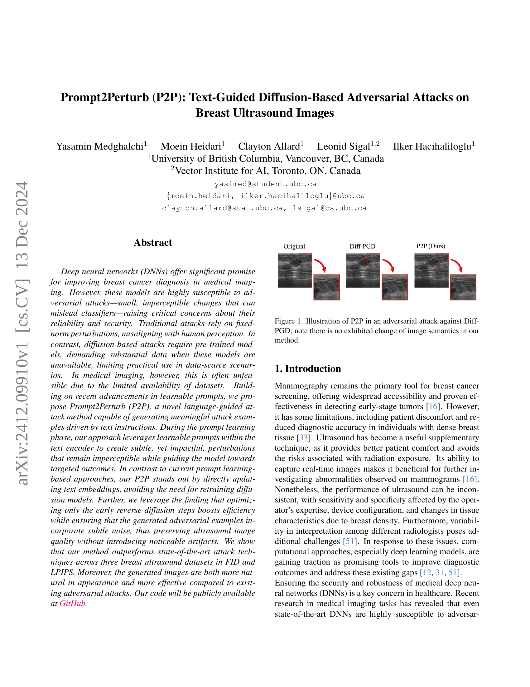
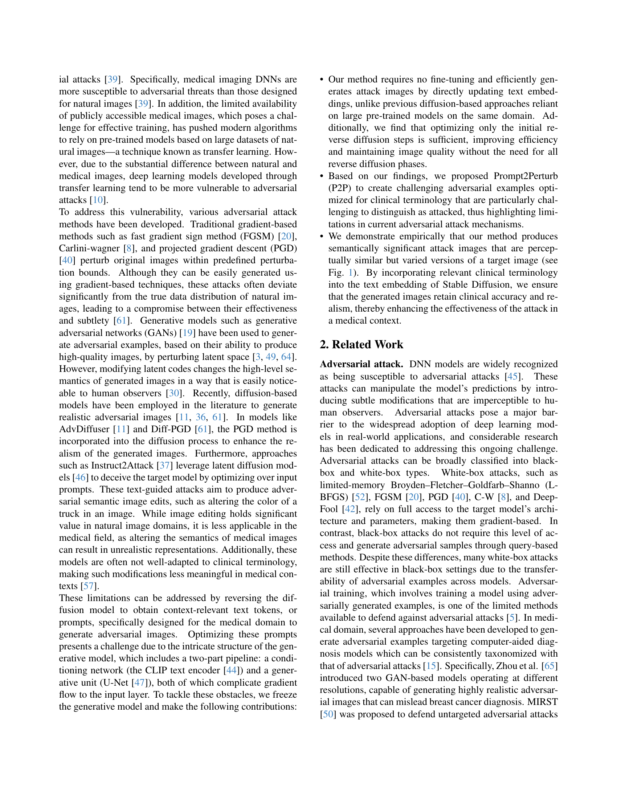
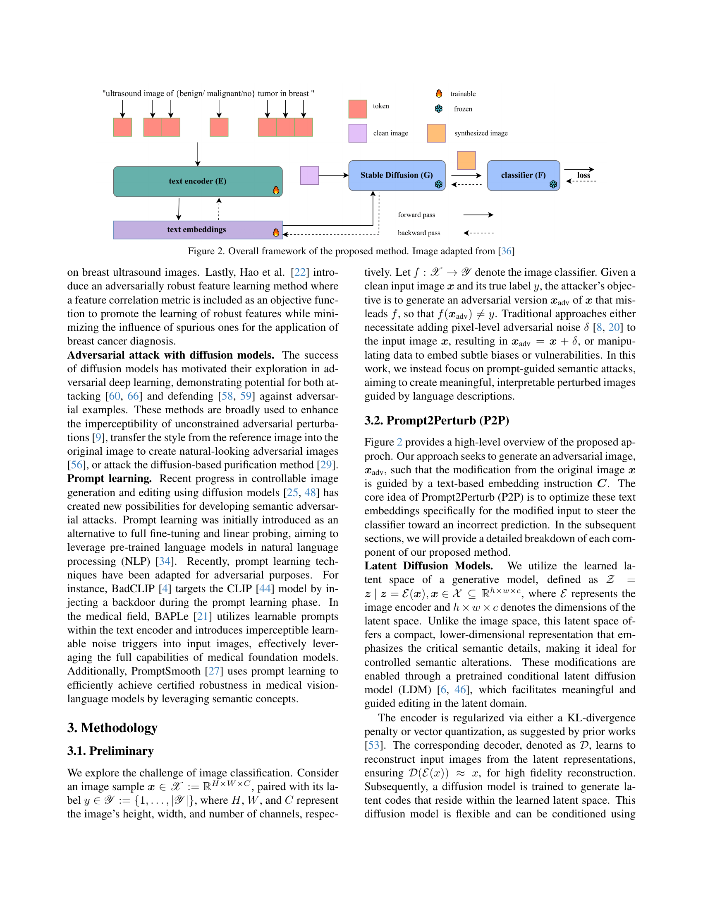
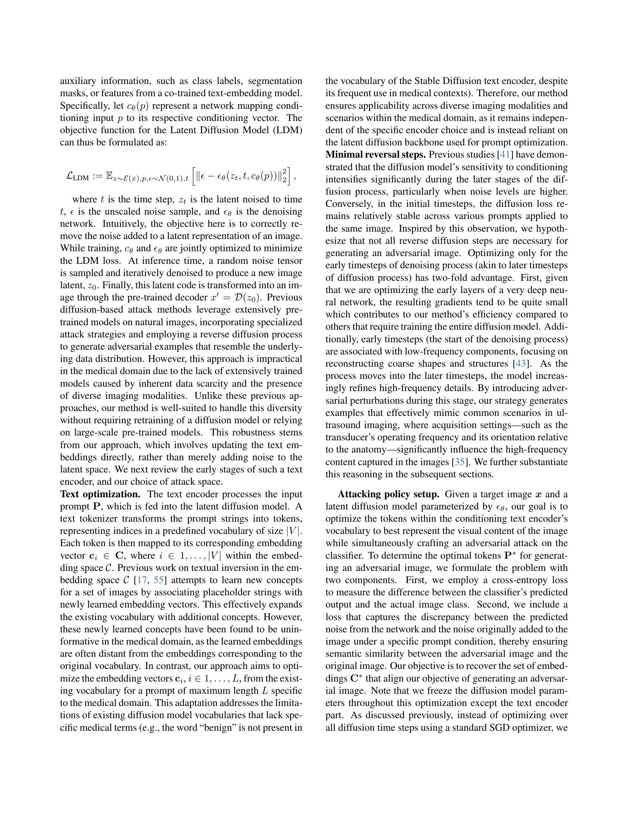
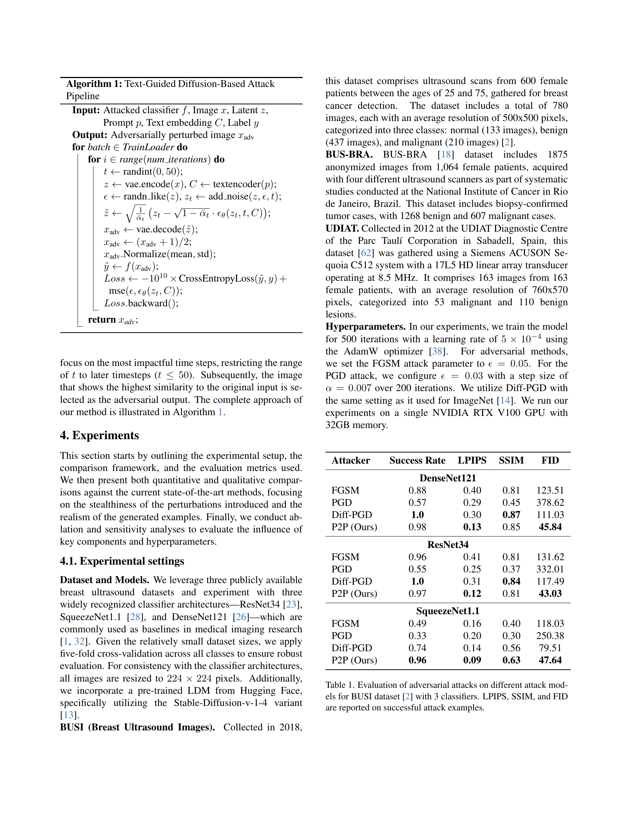
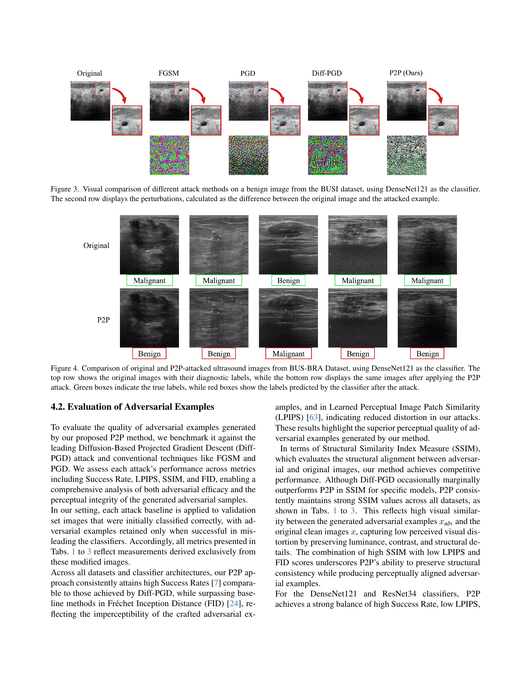
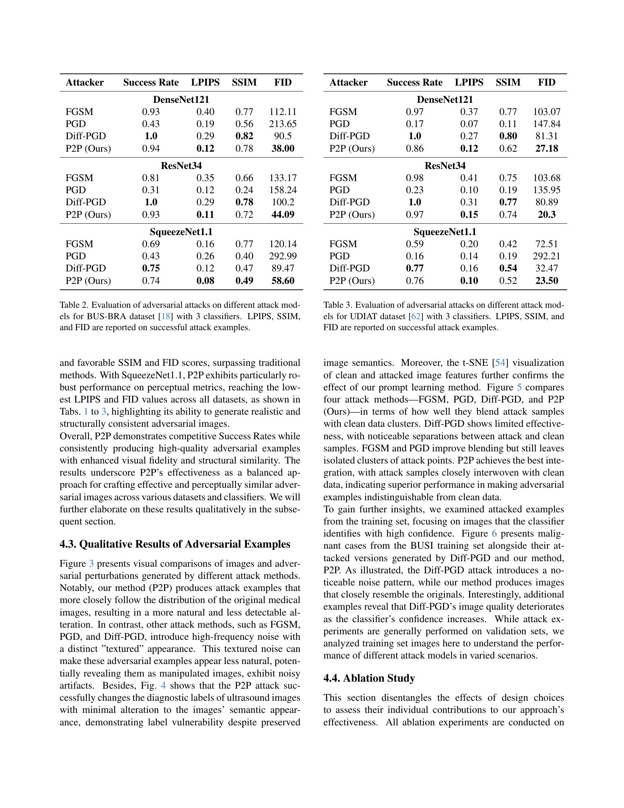
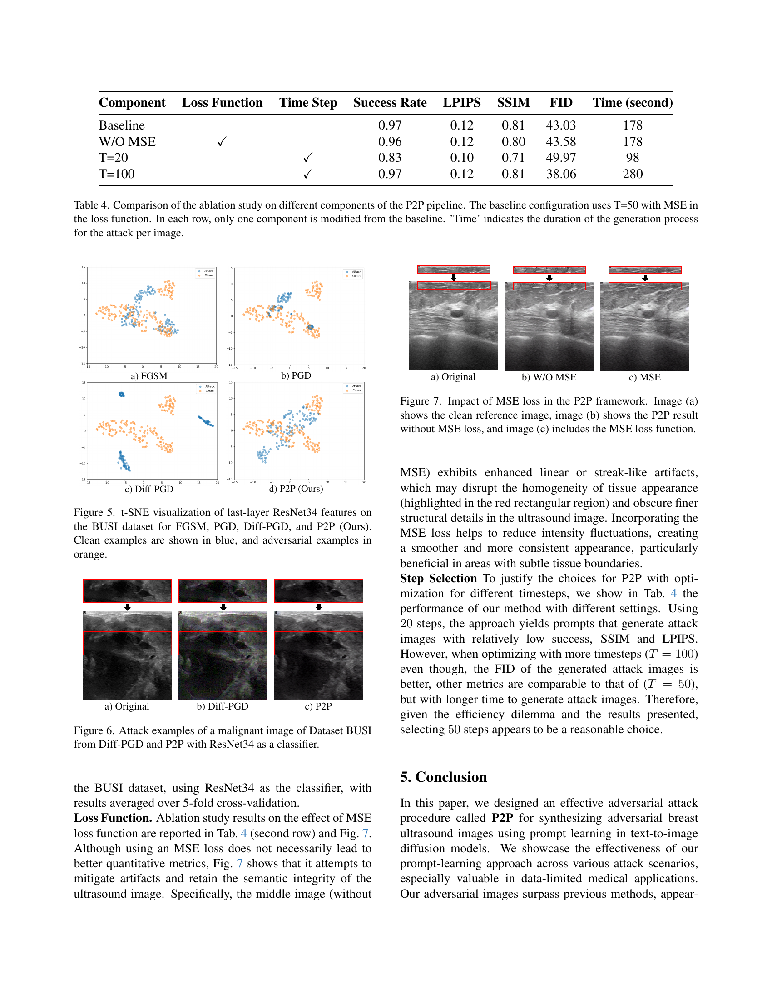
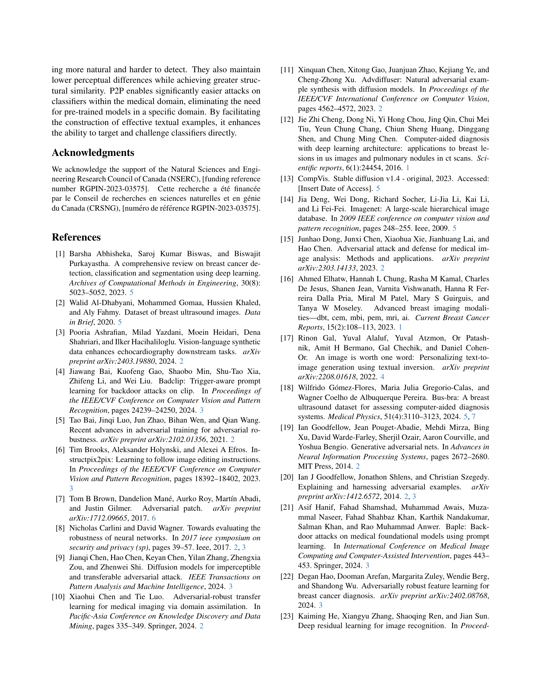
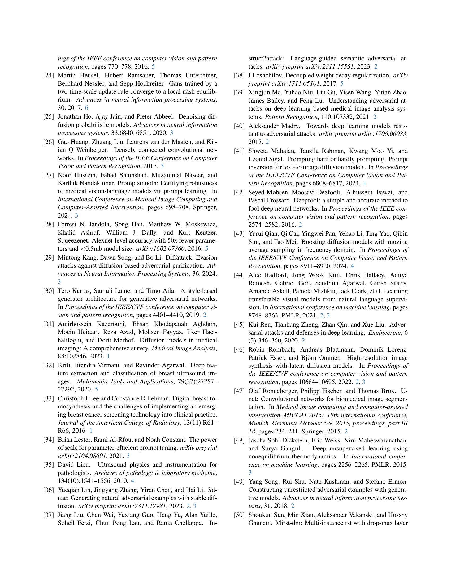
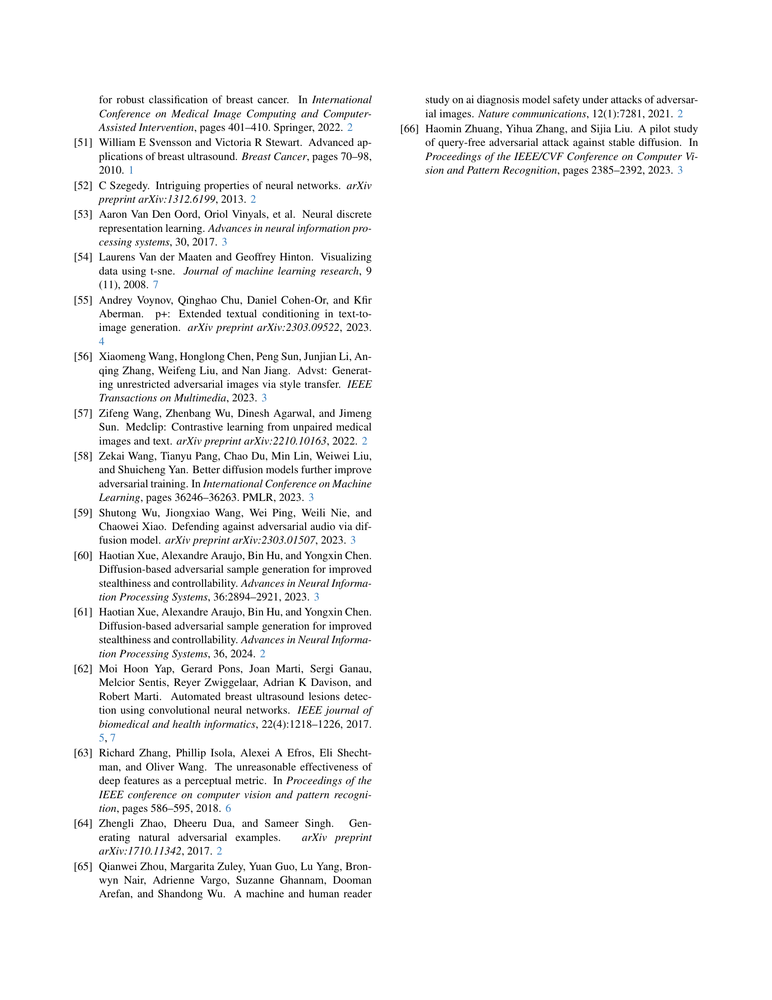
