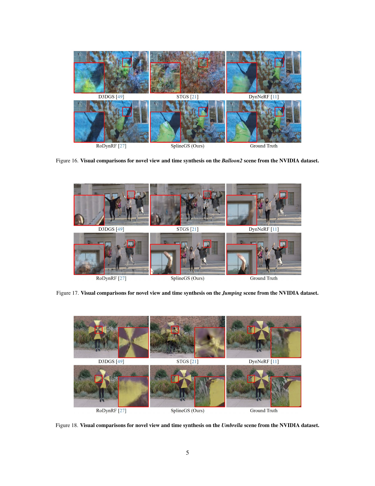

 


 2412.09982 
 Jongmin Park et el. 
 
 🤗 2024-12-17 
 



↗ arXiv


↗ Hugging Face


↗ Papers with Code


### TL;DR



**단안 비디오에서의 신규 뷰 합성**은 장면의 역동성과 다중 뷰 단서의 부족으로 인해 어려움을 겪습니다. 기존 방법은 암시적 표현의 계산 오버헤드, 그리드 기반 모델의 세부 사항 캡처 어려움, 다항식 궤적의 유연성 부족과 같은 문제에 직면합니다. 또한, 많은 방법이 부정확한 결과를 초래할 수 있는 COLMAP와 같은 외부 카메라 매개변수 추정 방법에 의존합니다.

SplineGS는 **사전 계산된 카메라 매개변수 없이 고품질의 재구성과 빠른 렌더링을 위한 COLMAP가 필요 없는 동적 3D 가우시안 스플래팅(3DGS) 프레임워크**를 제안합니다. SplineGS는 **적은 수의 제어점을 사용하여 연속적인 동적 3D 가우시안 궤적을 나타내는 모션 적응형 스플라인(MAS)을 사용**합니다. **모션 적응형 제어점 프루닝(MACP)**은 동적 모델링 무결성을 유지하면서 다양한 움직임에서 각 동적 3D 가우시안의 변형을 모델링하기 위해 제어점을 점진적으로 프루닝합니다. 또한, 사진 측량 및 기하학적 일관성을 활용하여 **카메라 매개변수 추정 및 3D 가우시안 속성에 대한 공동 최적화 전략을 제시**합니다. 실험 결과, SplineGS는 단안 비디오의 동적 장면에 대한 신규 뷰 합성 품질에서 최첨단 방법보다 훨씬 뛰어나고 렌더링 속도가 수천 배 더 빠릅니다.



#### Key Takeaways


 SplineGS는 사전 계산된 카메라 매개변수 없이 단안 비디오에서 고품질의 실시간 동적 3D 장면 재구성을 가능하게 합니다. 



 모션 적응형 스플라인(MAS)은 적은 수의 제어점을 사용하여 연속적인 동적 3D 가우시안 궤적을 효과적으로 나타냅니다. 



 모션 적응형 제어점 프루닝(MACP)은 렌더링 품질과 효율성을 최적화하여 각 스플라인 함수에 대한 제어점 수를 조정합니다. 


#### Why does it matter?
**동적 장면의 신규 뷰 합성은 3D 비전의 핵심 과제**이며, 몰입형 VR/AR 경험과 영화 제작과 같은 다양한 응용 분야를 지원합니다. 이 논문은 **실시간 렌더링 속도로 고품질 신규 뷰 합성을 가능하게 하는 새로운 프레임워크인 SplineGS를 소개**하며, 이는 이 분야의 연구에 큰 영향을 미칩니다. SplineGS는 **동적 장면의 복잡한 움직임을 효율적으로 모델링**하고 **실시간 성능**으로 고품질 렌더링을 달성할 수 있는 잠재력으로 인해 연구자들이 추가적인 연구 및 개발을 탐구할 수 있는 길을 열어줍니다.

------
#### Visual Insights

> 🔼 SplineGS는 사전 계산된 카메라 매개변수에 의존하지 않고 단안 비디오에서 새로운 시공간 뷰 합성에 대한 최첨단 렌더링 품질과 빠른 렌더링 속도를 달성합니다. (a) DAVIS 데이터 세트의 대부분 장면에 대해 COLMAP에서 합리적인 카메라 매개변수를 제공할 수 없기 때문에 [49, 21]에 대해 예측된 카메라 매개변수를 사용합니다. (b) SplineGS는 NVIDIA 데이터 세트에서 두 번째로 좋은 방법과 비교하여 PSNR이 1.1dB 더 높고 렌더링 속도가 8,000배 더 빠릅니다. 그림은 DAVIS 데이터 세트의 새로운 뷰 합성에 대한 시각적 비교와 NVIDIA 데이터 세트의 성능 향상을 보여줍니다. 즉, SplineGS가 예측한 카메라 매개변수를 사용하는 다른 방법과 비교한 정성적 결과와 SplineGS의 정량적 성능 향상을 보여주는 그래프가 포함되어 있습니다.
> 

> 
read the caption

> Figure 1: Our SplineGS achieves state-of-the-art rendering quality with fast rendering speed for novel spatio-temporal view synthesis from monocular videos without relying on pre-computed camera parameters. (a) We use our predicted camera parameters for [49, 21] since COLMAP [38] is unable to provide reasonable camera parameters for most scenes in the DAVIS dataset [35]. (b) SplineGS achieves 1.1 dB higher PSNR and 8,000×\times× faster rendering speed compared to the second-best method on the NVIDIA dataset [50].
> 


| PSNR↑ / LPIPS↓ | Method | Jumping | Skating | Truck | Umbrella | Balloon1 | Balloon2 | Playground | Average | FPS↑ |
|---|---|---|---|---|---|---|---|---|---|---| 
| COLMAP | DynNeRF (ICCV’21) [11] | 24.68 / 0.090 | 32.66 / 0.035 | 28.56 / 0.082 | 23.26 / 0.137 | 22.36 / 0.104 | 27.06 / 0.049 | 24.15 / 0.080 | 26.10 / 0.082 | 0.05 |
|  | MonoNeRF (ICCV’23) [42] | 24.26 / 0.091 | 32.06 / 0.044 | 27.56 / 0.115 | 23.62 / 0.180 | 21.89 / 0.129 | 27.36 / 0.052 | 22.61 / 0.130 | 25.62 / 0.106 | 0.05 |
|  | STGS (CVPR’24) [21] | 20.82 / 0.187 | 24.80 / 0.109 | 25.01 / 0.103 | 21.88 / 0.195 | 20.36 / 0.196 | 23.12 / 0.124 | 19.23 / 0.151 | 22.17 / 0.152 | **900** |
|  | SCGS (CVPR’24) [13] | 15.68 / 0.920 | 14.88 / 0.908 | 23.81 / 0.140 | 21.84 / 0.160 | 20.17 / 0.179 | 21.07 / 0.149 | 20.71 / 0.115 | 19.74 / 0.367 | 110 |
|  | D3DGS (CVPR’24) [49] | 22.02 / 0.266 | 24.06 / 0.227 | 23.04 / 0.247 | 22.67 / 0.192 | 21.22 / 0.202 | 25.86 / 0.118 | 22.30 / 0.111 | 23.02 / 0.195 | 25 |
|  | 4DGS (CVPR’24) [46] | 22.37 / 0.178 | 26.72 / 0.084 | 25.93 / 0.097 | 22.36 / 0.178 | 21.89 / 0.153 | 24.85 / 0.081 | 21.36 / 0.089 | 23.64 / 0.123 | 95 |
|  | RoDynRF (CVPR’23) [27] | **25.66** / *0.071* | 28.68 / 0.040 | **29.13** / *0.063* | 24.26 / *0.089* | 22.37 / 0.103 | 26.19 / 0.054 | *24.96* / *0.048* | *25.89* / *0.067* | 0.45 |
|  | Casual-FVS (ECCV’24) [19] | 23.45 / 0.100 | 29.98 / 0.045 | 25.22 / 0.090 | 23.24 / 0.096 | *23.76* / *0.079* | 24.15 / 0.081 | 22.19 / 0.074 | 24.57 / 0.081 | 48 |
|  | Ex4DGS (NeurIPS’24) [18] | 18.93 / 0.321 | 21.92 / 0.233 | 19.04 / 0.308 | 19.03 / 0.340 | 14.69 / 0.503 | 16.29 / 0.457 | 14.16 / 0.437 | 17.72 / 0.371 | 84 |
|  | MoSca (arXiv) [20] | 25.21 / 0.083 | *32.77* / *0.033* | 28.22 / 0.090 | *24.41* / 0.092 | 23.26 / 0.092 | *28.90* / *0.042* | 23.05 / 0.060 | 26.55 / 0.070 | N/A |
| COLMAP-Free | RoDynRF (CVPR’23) [27] | 24.27 / 0.100 | 28.71 / 0.046 | *28.85* / 0.066 | 23.25 / 0.104 | 21.81 / 0.122 | 25.58 / 0.064 | **25.20** / 0.052 | 25.38 / 0.079 | 0.45 |
|  | MoSca (arXiv) [20] | 25.43 / 0.080 | 32.62 / *0.033* | 28.29 / 0.086 | 24.40 / 0.091 | 23.27 / 0.091 | **29.01** / *0.042* | 23.23 / 0.058 | *26.61* / 0.069 | N/A |
|  | **SplineGS (Ours)** | *25.50* / **0.068** | **33.72** / **0.031** | 28.66 / **0.056** | **25.61** / **0.071** | **24.43** / **0.068** | 28.37 / **0.032** | 24.19 / **0.047** | **27.21** / **0.053** | *400* |

> 🔼 NVIDIA 데이터셋에서의 novel view synthesis 정량적 평가 결과. PSNR과 LPIPS 두 지표를 사용하여 여러 기존 방법들과 SplineGS를 비교하고 있다. SplineGS는 대부분의 장면에서 SOTA 성능을 보이며, 특히 RoDynRF와 DynNeRF에 비해 렌더링 속도가 각각 890배, 8000배 빠르다. MoSca는 공식 코드가 없어 렌더링 속도를 측정할 수 없었고, Casual-FVS는 공식 코드가 없어 논문에 보고된 결과를 사용했다.
> 

> 
read the caption

> Table 1: Novel view synthesis evaluation on the NVIDIA dataset. Red and Blue denote the best and second-best performances, respectively. ‘N/A’ denotes that the rendering speed for MoSca [20] is unavailable, as the authors have not provided official code. For Casual-FVS [19], we directly use the results from their paper, as official code is also unavailable.
> 

### In-depth insights

#### Dyn3DGS w/ Splines
**Dyn3DGS w/ Splines**는 동적 장면의 새로운 뷰 합성을 위한 유망한 접근 방식입니다. 이는 3D 공간에서 가우시안의 궤적을 나타내는 데 사용할 수 있는 **스플라인 기반 모델을 활용**합니다. 스플라인은 부드럽고 연속적인 곡선을 생성할 수 있기 때문에 **복잡한 움직임을 정확하게 표현**하는 데 적합합니다. 또한, 스플라인은 계산적으로 효율적이므로 **실시간 렌더링**에 적합합니다. 하지만 Dyn3DGS w/ Splines 접근 방식은 움직임이 많은 장면에서 **흐릿한 입력 프레임에 과적합**될 수 있다는 단점도 존재합니다. 이는 최종 렌더링된 새로운 뷰의 품질을 저하시킬 수 있습니다. 이러한 한계에도 불구하고 Dyn3DGS w/ Splines는 동적 장면의 고품질 새로운 뷰를 합성할 수 있는 잠재력을 가지고 있습니다.

#### Motion-Adaptive Splines
**움직임 적응형 스플라인(MAS)**은 동적 장면의 3D 가우시안 궤적을 효율적으로 나타내기 위해 **3차 Hermite 스플라인**을 활용합니다. **제어점** 세트로 정의된 MAS는 각 세그먼트의 곡률과 방향을 나타내며, 이러한 제어점은 학습 가능한 매개변수로 조정되어 **빠르고 정확한 궤적 모델링**을 가능하게 합니다. 움직임 적응형 제어점 가지치기(MACP)는 움직임의 복잡성을 기반으로 각 스플라인의 제어점 수를 동적으로 조정하여 모델링 무결성은 유지하면서 **렌더링 품질과 효율성을 최적화**합니다. 간단한 움직임은 더 적은 제어점을 사용하여 효율성을 높이는 반면, 복잡한 움직임은 더 많은 제어점을 사용하여 정확성을 보장합니다. MAS와 MACP를 결합하면 스플라인 기반 모델링의 유연성과 정밀도를 활용하여 동적 장면의 **고품질 재구성**과 **실시간 신경 렌더링**을 가능하게 합니다.

#### COLMAP-Free NVS
**COLMAP-Free NVS**는 Structure-from-Motion (SfM) 전처리 과정 없이 신경 렌더링을 수행하는 것을 목표로 합니다. 기존 방식과 달리 COLMAP과 같은 외부 도구에 의존하지 않고 카메라 매개변수를 **자체적으로 추정**합니다. 이를 통해 여러 문제점을 해결합니다. 첫째, COLMAP은 실제 환경의 단안 비디오에서 종종 부정확한 결과를 생성하는데, COLMAP-Free 방식은 이러한 **의존성을 제거**하여 정확도를 향상시킵니다. 둘째, COLMAP 전처리 과정은 **계산 비용이 높습니다**. COLMAP-Free는 이를 생략하여 **렌더링 속도를 향상**시킵니다. 마지막으로, SfM 전처리 단계를 제거함으로써 파이프라인을 **단순화**하고 **실시간 처리**에 더 적합하게 만듭니다. SplineGS와 같은 최신 기술은 MAS 및 MACP와 같은 혁신적인 방법을 사용하여 **고품질 렌더링을 유지하면서 효율성을 향상**시켜, COLMAP-Free NVS의 가능성을 보여줍니다.

#### Real-Time Perf. Gain
**실시간 성능 향상**은 본 논문에서 제시된 SplineGS의 핵심 목표입니다.  기존 방식들은 렌더링 속도가 느리거나 품질이 떨어지는 문제가 있었습니다. SplineGS는 **모션 적응형 스플라인(MAS)** 및 **제어점 가지치기(MACP)** 기법을 통해 이러한 문제를 해결합니다.  MAS는 **적은 수의 제어점으로 복잡한 움직임을 효율적으로 모델링**하여 계산량을 줄입니다. MACP는 움직임의 복잡도에 따라 **제어점의 수를 동적으로 조정**, 불필요한 계산을 제거하여 **렌더링 속도를 크게 향상**시킵니다. 덕분에 SplineGS는 **고품질 렌더링과 실시간 성능을 동시에 달성**하여 다양한 응용 분야에 적용 가능성을 높였습니다.

#### Blur/Fast Motion Limit
**빠른 움직임과 모션 블러는 SplineGS를 포함한 동적 장면 재구성 방법의 주요 한계점입니다.** 블러가 있는 프레임은 입력 영상의 품질을 저하시키고, 빠른 움직임은 정확한 궤적 추정을 어렵게 만듭니다. SplineGS는 **모션 적응 스플라인(MAS)과 모션 적응 제어점 가지치기(MACP)를 활용**하여 시간에 따른 움직이는 객체의 부드러운 궤적을 효과적으로 모델링하지만, **심한 블러나 매우 빠른 움직임이 있는 경우 정확도가 떨어질 수 있습니다.**  향후 연구에서는 블러 제거 기법을 직접 통합하거나 사전 처리 단계로 추가하여 이러한 문제를 해결할 수 있습니다. 또한 **시간적 일관성과 디테일을 향상**시키기 위한 추가적인 연구가 필요합니다.

### More visual insights

More on figures

> 🔼 SplineGS는 두 단계 최적화(웜업 및 주 훈련 단계)를 사용하는 COLMAP 없는 동적 3DGS 프레임워크입니다. 움직이는 객체에 대한 동적 3D 가우시안의 변형을 모델링하기 위해, 3차 Hermite 스플라인 함수를 기반으로 하는 새로운 Motion-Adaptive Spline(MAS) 아키텍처를 활용합니다. MAS는 각 동적 3D 가우시안의 궤적을 정확하게 모델링하고 더 빠른 렌더링 속도를 달성하기 위해 학습 가능한 제어점 세트로 구성됩니다.  웜업 단계에서는 광도 및 기하학적 일관성을 사용하여 카메라 매개변수를 대략적으로 최적화합니다. 주 훈련 단계에서는 예측된 카메라 포즈를 기반으로 3D 가우시안을 초기화하고 3D 가우시안 속성과 카메라 매개변수 추정을 공동으로 최적화합니다.
> 

> 
read the caption

> Figure 2: Overview of SplineGS. Our SplineGS leverages spline-based functions to model the deformation of dynamic 3D Gaussians with a novel Motion-Adaptive Spline (MAS) architecture. It is composed of sets of learnable control points based on a cubic Hermite spline function [2, 7] to accurately model the trajectory of each dynamic 3D Gaussian and to achieve faster rendering speed. To avoid any preprocessing of camera parameters, i.e. COLMAP-free, we adopt a two-stage optimization: warm-up and main training stages.
> 

> 🔼 NVIDIA 데이터셋에서 새로운 시점 합성에 대한 시각적 비교입니다. 빨간색 상자로 강조된 것처럼 SplineGS는 기존 방법보다 더 높은 렌더링 품질과 더 사실적인 동적 객체를 생성합니다.
> 

> 
read the caption

> Figure 3: Visual comparisons for novel view synthesis on the NVIDIA dataset.
> 

> 🔼 이 그림은 DAVIS 데이터셋에서 SplineGS와 다른 최신 방법들(D3DGS, STGS, RoDynRF)의 새로운 시점 합성에 대한 정성적 비교를 보여줍니다. SplineGS는 콜맵(COLMAP)과 같은 외부 카메라 추정 도구를 사용하지 않는 콜맵 프리(COLMAP-free) 방식임에도 불구하고, 다른 방식들에 비해 더욱 사실적이고 디테일한 렌더링 결과를 보여줍니다. 특히, 빨간색 상자로 강조된 부분은 SplineGS가 동적 객체의 움직임을 더욱 정확하게 모델링하고, 더 높은 품질의 새로운 시점 이미지를 생성하는 것을 보여줍니다. D3DGS와 STGS는 COLMAP을 통해 얻은 카메라 파라미터를 사용하여 새로운 시점을 생성했지만, DAVIS 데이터셋에서는 COLMAP이 제대로 작동하지 않아 일관성 없는 결과를 보여줍니다. 반면 SplineGS는 COLMAP 없이도 안정적으로 카메라 파라미터를 추정하여 고품질의 새로운 시점 이미지를 생성합니다.
> 

> 
read the caption

> Figure 4: Visual comparisons for novel view synthesis on the DAVIS dataset.
> 

> 🔼 이 그림은 NVIDIA 데이터셋을 사용하여 SplineGS와 다른 NeRF 기반 및 3DGS 기반 방법의 **새로운 뷰 및 시간 합성**에 대한 시각적 비교를 보여줍니다. 빨간색 상자로 강조 표시된 것처럼 SplineGS는 보이지 않는 시간 인덱스에 대해서도 SOTA 렌더링 품질을 제공하며, 움직이는 물체를 사실적으로 렌더링하고 시간적 일관성을 향상시킵니다. 반면, 다른 방법들은 보이지 않는 시간 인덱스에서 아티팩트와 블러가 발생하는 등 성능이 저하됩니다.
> 

> 
read the caption

> Figure 5: Visual comparisons for novel view and time synthesis on the NVIDIA dataset.
> 

> 🔼 이 그림은 SplineGS, D3DGS [49], STGS [21]의 움직이는 3D 가우시안의 2D 픽셀 트랙을 시각화하여 보여줍니다. D3DGS와 STGS는 움직이는 객체에 대한 모션 트래킹이 부정확한 반면, SplineGS는 더 정확한 모션 트래킹 결과를 보여줍니다. 2D 픽셀 트랙은 시간에 따르는 객체의 움직임을 시각적으로 나타낸 것으로, SplineGS가 동적 장면에서 객체의 움직임을 더 잘 모델링하고 있음을 시사합니다.
> 

> 
read the caption

> Figure 6: Visual comparisons for motion tracking. We visualize 2D pixel tracks to analyze motions of dynamic 3D Gaussians.
> 

> 🔼 이 그림은 Motion-Adaptive Control Points Pruning (MACP) ablation study에 대한 시각적 비교를 보여줍니다. 저자들은 MLP, Grid 기반 모델, 3차 및 10차 다항식 함수, 베지어 곡선 등 다양한 변형 모델로 MAS 모델을 대체했습니다. 표 3-(a)는 렌더링 품질(PSNR, LPIPS) 및 Gaussian 당 변형 지연 시간(gdef)에 중점을 둔 각 3D Gaussian 궤적 모델에 대한 정량적 비교를 제시합니다. 표 3-(a)에서 볼 수 있듯이 MAS 모델은 다른 모든 변형 모델에 비해 우수한 렌더링 품질을 달성합니다. 이전 연구 [21, 46, 49]와 일치하게, MLP 및 그리드 기반 아키텍처는 렌더링에 상당한 계산 비용이 필요함을 알 수 있습니다. 이러한 방법 중 [21]에 구현된 'Poly (3rd)'가 최상의 지연 시간을 보여줍니다. 그러나 고정 차수 다항식 함수는 다양한 동작 복잡도에 따라 유연성이 제한되어 렌더링 성능에 악영향을 미칩니다. 이를 더 자세히 살펴보기 위해 모델링 기능의 변화를 평가하기 위해 'Poly (10th)'로 실험했습니다. 그러나 이 조정은 더 시끄러운 최적화와 효율성 감소로 이어지는데, 'Poly (10th)'의 높은 지수 변수가 수치 불안정성으로 이어지기 때문입니다. 베지어 곡선[8]은 두 번째로 좋은 렌더링 품질을 제공하지만 재귀적 계산 특성으로 인해 지연 시간은 MAS보다 높습니다. MACP 기술의 효과를 평가하기 위해 전체 MACP 모델을 고정된 두 개의 제어점 수(Nc = 4 및 Nc = Nf)를 가진 다른 모델 버전과 비교했습니다. 표 3-(c) 및 그림 7에서 볼 수 있듯이 MACP가 있는 SplineGS는 고정된 Nc를 가진 ablation 모델에 비해 렌더링 품질과 gdef 간에 좋은 절충안을 달성합니다. 모든 동적 3D Gaussian에 Nc = 4를 사용하면 MAS의 동작 모델링 용량이 제한되어 메트릭이 크게 낮아지고 동적 영역에 눈에 띄는 아티팩트가 발생합니다. 또한 과도한 Nc = Nf는 MAS 모듈의 렌더링 속도를 감소시키고 여전히 MACP가 있는 전체 모델에서 달성한 품질에 미치지 못하는데, 이는 동작 과적합 때문일 수 있습니다.
> 

> 
read the caption

> Figure 7: Visual comparisons for MACP ablation study.
> 

> 🔼 (a)는 모션 적응 스플라인(MAS)을 보여줍니다. MAS는 3D 가우시안의 궤적을 시간에 따라 효율적이고 정확하게 나타내기 위해 사용되는 방법입니다. 그림에서 스플라인 곡선(Spline Curve)은 시간에 따른 3D 가우시안의 움직임을 나타내며, 제어점(Control Points)은 스플라인 곡선의 모양을 결정하는 학습 가능한 매개변수입니다. 시간 t에서의 3D 가우시안의 위치 μ(t)는 제어점을 기반으로 하는 큐빅 허마이트 스플라인 함수 S(t,P)로 계산됩니다. 이를 통해 움직이는 객체의 부드럽고 연속적인 궤적을 효과적으로 모델링할 수 있습니다.
> 

> 
read the caption

> (a) Motion-Adaptive Spline
> 

> 🔼 이 그림은 SplineGS 아키텍처에 대한 손실 함수 ablation study 결과를 보여줍니다. Lpc, Lgc, Ld-pc, LM 손실 함수 없이 ablation study를 진행했고, 각각 PSNR(dB)과 LPIPS 값을 측정했습니다. 모든 ablation study는 NVIDIA 데이터셋에서 새로운 view synthesis 실험과 동일한 설정으로 진행되었습니다. 실험 결과, 모든 손실 함수를 사용했을 때가 가장 높은 PSNR과 가장 낮은 LPIPS 값을 보이며, 모든 손실 함수가 SplineGS 아키텍처에 중요한 역할을 한다는 것을 보여줍니다. 특히 Lpc 손실 없이는 PSNR 값이 크게 감소하며, 이는 카메라 파라미터 추정의 중요성을 나타냅니다. 다른 손실 함수들 또한 전반적인 렌더링 품질에 영향을 미치는 것을 확인할 수 있습니다.
> 

> 
read the caption

> (b) Loss function
> 

> 🔼 이 그림은 Motion-Adaptive Control points Pruning (MACP) 기법의 효과를 보여주는 ablation study 결과를 나타냅니다. 고정된 개수의 제어점을 사용하는 모델 (Nc=4, Nc=Nf)과 비교하여 MACP를 사용하는 SplineGS 모델이 렌더링 품질과 변형 지연 시간 (gdef) 사이에서 더 나은 균형을 이루는 것을 확인할 수 있습니다. 모든 동적 3D Gaussian에 대해 Nc=4를 사용하는 경우, MAS의 모션 모델링 능력이 제한되어 메트릭이 낮아지고 동적 영역에서 눈에 띄는 아티팩트가 발생합니다. 반대로, 과도한 Nc=Nf는 MAS 모듈의 렌더링 속도를 감소시키고, 모션 과적합으로 인해 MACP를 사용하는 전체 모델보다 품질이 떨어집니다. 결과적으로, 효율성과 표현 품질 사이의 균형을 위해서는 Nc를 신중하게 선택하는 것이 중요합니다.
> 

> 
read the caption

> (c) Motion-Adaptive Control points Pruning
> 

> 🔼 이 그림은 MACP(Motion-Adaptive Control Points Pruning)의 효과를 분석한 결과를 보여줍니다. (a)는 'Balloon2'와 'Skating' 장면에 대해 동적 3D 가우시안의 평균 제어점 개수(Nc)를 히트맵으로 시각화한 것으로, 렌더링된 프레임과 함께 제시됩니다. 빨간색일수록 더 많은 제어점이 사용되었음을 나타냅니다. (b)는 두 장면에서 동적 3D 가우시안의 제어점 개수(Nc) 분포를 백분율(%)로 나타낸 히스토그램입니다. 그림에서 볼 수 있듯이, 'Skating'처럼 움직임이 단순한 장면에서는 대부분의 동적 3D 가우시안의 궤적을 최소한의 Nc 값으로 표현할 수 있습니다. 반면, 'Balloon2'는 더 복잡하고 다양한 움직임으로 인해 Nc 값이 더 넓게 분포되어 있습니다.
> 

> 
read the caption

> Figure 8: Analysis of MACP’s Efficacy. (a) Ncsubscript𝑁𝑐N_{c}italic_N start_POSTSUBSCRIPT italic_c end_POSTSUBSCRIPT Heatmaps as the averaged Ncsubscript𝑁𝑐N_{c}italic_N start_POSTSUBSCRIPT italic_c end_POSTSUBSCRIPT values of dynamic 3D Gaussians and their corresponding rendered frames I^tsubscript^𝐼𝑡\hat{I}_{t}over^ start_ARG italic_I end_ARG start_POSTSUBSCRIPT italic_t end_POSTSUBSCRIPT for ‘Balloon2’ and ‘Skating’ scenes. (b) Histograms of the number of control points (Ncsubscript𝑁𝑐N_{c}italic_N start_POSTSUBSCRIPT italic_c end_POSTSUBSCRIPT) in percentages (%) of dynamic 3D Gaussians in two scenes.
> 

> 🔼 이 그림은 MACP(Motion-Adaptive Control Points Pruning) 방법에 대한 절제 연구 결과를 보여줍니다. NVIDIA 데이터셋에서 novel view synthesis에 대해 다양한 pruning error threshold(ϵ) 값을 설정하여 SplineGS의 성능을 평가했습니다. 그래프의 x축은 pruning error threshold 값을 나타내고, 왼쪽 y축은 PSNR(dB) 값을, 오른쪽 y축은 dynamic 3D Gaussian의 control point 개수를 나타냅니다. 결과적으로, ϵ 값이 너무 작으면(0.2) control point pruning이 효과적으로 수행되지 않아 효율이 감소하고, ϵ 값이 너무 크면(5) pruning이 과도하게 수행되어 복잡한 움직임 궤적을 정확하게 나타낼 수 있는 control point 개수가 부족해집니다. 따라서 효율과 표현 품질 사이의 균형을 맞추기 위해 ϵ 값을 신중하게 선택하는 것이 중요합니다.
> 

> 
read the caption

> Figure 9: Ablation study on MACP. We conduct an ablation study of our Motion-Adaptive Control points Pruning (MACP) method for novel view synthesis on the NVIDIA dataset [50] by adjusting the pruning error threshold ϵitalic-ϵ\epsilonitalic_ϵ. ‘PSNR (dB)’ and ‘# Ctrl. Pts.’ denote the average PSNR value and the average number of control points for dynamic 3D Gaussians after training, computed across all scenes, respectively.
> 

> 🔼 이 그림은 SplineGS에서 동적 3D 가우시안 궤적을 새로운 뷰에 투영한 시각적 결과를 보여줍니다. 2D 트래킹 방법과 달리 SplineGS는 스플라인 기반 모션 모델링을 활용하여 시간 축을 따라 각 동적 3D 가우시안의 변형을 직접적으로 캡처하여 대상 novel view의 렌더링을 가능하게 합니다. 그림에서 보이는 3D 모션의 2D 시각화를 위해 각 동적 3D 가우시안의 궤적을 novel view의 2D 픽셀 공간에 투영합니다. SplineGS는 D3DGS [49] 및 STGS [21]와 비교하여 동적 영역을 더 효과적으로 렌더링하고 3D 가우시안 궤적의 시각화를 향상시킵니다. STGS [21]의 경우, 시간에 따라 움직이는 물체를 표현하기 위해 여러 3D 가우시안 세트의 불투명도를 조정하지만, SplineGS는 MAS를 통해 동적 3D 가우시안의 모션 궤적을 직접 모델링하여 더욱 합리적인 3D 궤적 추출을 가능하게 합니다.
> 

> 
read the caption

> Figure 10: Visual results of dynamic 3D Gaussian trajectory projected to novel views for our SplineGS.
> 

> 🔼 이 그림은 STGS [21] 모델을 사용하여 특정 시점에 새로운 뷰를 합성한 결과를 보여줍니다. (a)는 원래 시간에 따라 변하는 불투명도를 사용한 결과이고, (b)는 시간에 따라 변하지 않는 고정된 공간 불투명도를 사용한 결과입니다. 훈련 과정에서는 원래 시간에 따라 변하는 불투명도를 사용했습니다. 그림 (b)에서 볼 수 있듯이, 각 3D 가우시안의 불투명도를 시간에 따라 변하지 않는 값으로 설정하면 렌더링된 새로운 뷰 합성 결과에서 같은 움직이는 물체(예: 말 또는 낙하산)의 여러 인스턴스가 동시에 나타나는 것을 볼 수 있습니다. 이는 STGS [21]가 시간에 따라 움직이는 물체를 표현하기 위해 단일 3D 가우시안 세트의 공간적 3D 위치를 변형하는 대신, 서로 다른 3D 가우시안 세트의 불투명도를 시간적 불투명도 σi(t)를 통해 조정할 수 있음을 시사합니다. 이러한 접근 방식은 동적 렌더링 결과를 생성할 수 있지만 시간 축을 따라 3D 가우시안 궤적을 직접 추출할 수는 없습니다. 반대로, MAS를 사용하는 SplineGS는 동적 3D 가우시안의 움직임 궤적을 직접 모델링하여 더욱 합리적인 3D 궤적을 추출할 수 있습니다.
> 

> 
read the caption

> Figure 11: Visual results of novel view synthesis at a specific time using the same STGS [21] models after optimization with (a) their original time-varying opacity and (b) time-independent spatial opacity, respectively. Please note that we use their original time-varying opacity during training.
> 

> 🔼 이 그림은 SplineGS 모델의 한계점을 보여줍니다. 훈련 비디오 프레임이 흐릿한 경우, 디블러링(deblurring) 방법을 사용하지 않으면 모델이 선명한 렌더링을 효과적으로 재구성할 수 없습니다. 즉, 입력 영상의 품질이 낮으면 출력 영상의 품질 또한 낮아진다는 것을 의미합니다. SplineGS는 동적 장면 재구성을 위해 설계되었지만, 흐린 입력 프레임에 과적합될 수 있으며, 결과적으로 흐릿한 새로운 뷰가 생성될 수 있습니다.
> 

> 
read the caption

> Figure 12: Limitations of our SplineGS. When the training video frame contains blurriness, our model cannot effectively reconstruct sharp renderings due to the absence of a deblurring method.
> 

> 🔼 NVIDIA 데이터셋의 Jumping 장면에 대한 새로운 뷰 합성의 시각적 비교를 제공합니다. SplineGS(Ours)가 다른 방법(4DGS, Ex4DGS, D3DGS, STGS, DynNeRF, RoDynRF)보다 더 나은 시각적 품질을 생성하고 지면 실측(Ground Truth)에 더 가까운 것을 확인할 수 있습니다.
> 

> 
read the caption

> Figure 13: Visual comparisons for novel view synthesis on the Jumping scene from the NVIDIA dataset.
> 

> 🔼 이 그림은 NVIDIA 데이터셋의 'Playground' 장면에 대한 새로운 뷰 합성의 시각적 비교를 보여줍니다. 4DGS, Ex4DGS, D3DGS, STGS, DynNeRF, RoDynRF, SplineGS(제안된 방법), 그리고 Ground Truth 이미지가 차례대로 제시되어 있습니다. 빨간색 상자는 각각의 방법이 생성한 novel view의 품질 차이를 강조 표시합니다. SplineGS는 다른 방법들과 비교했을 때 더 높은 품질과 더 사실적인 novel view를 생성하는 것을 확인할 수 있습니다.
> 

> 
read the caption

> Figure 14: Visual comparisons for novel view synthesis on the Playground scene from the NVIDIA dataset.
> 

> 🔼 NVIDIA 데이터셋의 Truck 장면에 대한 새로운 뷰 합성의 시각적 비교를 제공합니다. SplineGS(Ours)는 4DGS, Ex4DGS, D3DGS, STGS, DynNeRF, RoDynRF와 같은 다른 최첨단 방법과 비교하여 더 나은 시각적 품질을 달성합니다. 특히 트럭과 같이 움직이는 객체가 더 선명하고 사실적으로 렌더링됩니다.
> 

> 
read the caption

> Figure 15: Visual comparisons for novel view synthesis on the Truck scene from the NVIDIA dataset.
> 

> 🔼 이 그림은 NVIDIA 데이터셋의 Balloon2 장면에 대한 새로운 뷰 및 시간 합성의 시각적 비교를 보여줍니다. 4DGS, STGS, DynNeRF, RoDynRF 및 SplineGS(제안된 방법)의 결과가 Ground Truth와 비교됩니다. SplineGS는 다른 방법과 비교했을 때 움직이는 풍선과 배경 장면 모두에서 더 나은 시각적 품질과 정확한 움직임 표현을 보여줍니다.
> 

> 
read the caption

> Figure 16: Visual comparisons for novel view and time synthesis on the Balloon2 scene from the NVIDIA dataset.
> 

More on tables


| | Method | PSNR↑ | LPIPS↓ | tOF↓ |
|---|---|---|---|---| 
| COLMAP | DynNeRF (ICCV’21) [11] | **23.36** | **0.219** | **0.921** |
| | 4DGS (CVPR’24) [46] | 17.07 | 0.459 | 6.314 |
| | D3DGS (CVPR’24) [49] | 19.63 | 0.343 | 3.225 |
| | STGS (CVPR’24) [21] | 15.72 | 0.474 | 2.105 |
| COLMAP-Free | RoDynRF (CVPR’23) [27] | 21.58 | 0.221 | 2.138 |
| | **SplineGS (Ours)** | **25.92** | **0.098** | **0.703** |
> 🔼 NVIDIA 데이터셋에서 novel view와 time synthesis에 대한 정량적 평가 결과를 비교합니다. DynNeRF, 4DGS, D3DGS, STGS는 COLMAP을 사용하고, RoDynRF와 SplineGS는 COLMAP을 사용하지 않습니다. PSNR, LPIPS, 그리고 out-of-focus blur를 측정하는 OF 지표를 사용하여 각 방법의 성능을 비교합니다. SplineGS는 다른 방법들에 비해 전반적으로 더 나은 성능을 보여줍니다.
> 

> 
read the caption

> Table 2: Novel view and time synthesis evaluation on the NVIDIA dataset.
> 


|             | PSNR↑ | LPIPS↓ | _g_def (ns)↓ |
| :---------- | :---: | :----: | :----------------: |
| MLP        | 23.51 | 0.125 |           149.41 |
| Grid       | 25.48 | 0.090 |            98.89 |
| Poly (3rd) | 25.14 | 0.111 | **1.80** |
| Poly (10th) | 24.38 | 0.120 |             7.71 |
| Bézier     | <u>**27.19**</u> | <u>**0.060**</u> |             8.78 |
| **Ours**  | **27.21**</u> | **0.053**</u> | <u>**5.63**</u> |
> 🔼 이 표는 논문에서 제안된 SplineGS 프레임워크의 구성 요소들을 제거(ablation)하여 각 구성 요소의 효과를 검증하는 실험 결과를 보여줍니다. 실험은 NVIDIA 데이터셋을 사용하여 새로운 뷰 합성(Novel View Synthesis) 환경에서 진행되었으며, Motion-Adaptive Spline (MAS), Loss function, Motion-Adaptive Control points Pruning (MACP)에 대한 ablation study를 포함합니다. 각 ablation study에서는 특정 구성 요소를 제거하거나 다른 방식으로 대체하여 SplineGS의 성능(PSNR, LPIPS, gdef)에 미치는 영향을 분석합니다.
> 

> 
read the caption

> Table 3: Ablation studies. We ablate our framework and report the average results on the NVIDIA dataset with the same setting as Novel View Synthesis experiment in Sec. 5.1.
> 


|                       | PSNR ↑ | LPIPS ↓ | 
|-----------------------|--------|---------|
| w/o $\mathcal{L}_{\text{pc}}$ | 17.49 | 0.853  |
| w/o $\mathcal{L}_{\text{gc}}$ | 26.33 | 0.067  |
| w/o $\mathcal{L}_{\text{d-pc}}$ | 26.18 | 0.066  |
| w/o $\mathcal{L}_{\text{M}}$ | 26.34 | 0.088  |
| Ours                  | **27.21** | **0.053** |

> 🔼 이 표는 각 모델의 메모리 사용량과 3D 가우시안 개수를 비교하여 SplineGS의 효율성을 보여줍니다. 메모리 사용량은 학습 후 모델의 크기를 나타내며, '# Gaussian (K)'는 학습 후 3D 가우시안의 총 개수를 나타냅니다. SplineGS는 최고 수준의 렌더링 품질을 달성하면서 Ex4DGS 대비 약 1/10의 메모리 사용량만으로 효율적인 메모리 사용을 보여줍니다.
> 

> 
read the caption

> Table 4: Memory footprint comparison results. ‘Memory footprint (MB)’ refers to the memory size of each trained model, while ‘# Gaussian (K)’ represents the total number of 3D Gaussians after training.
> 

### Full paper



