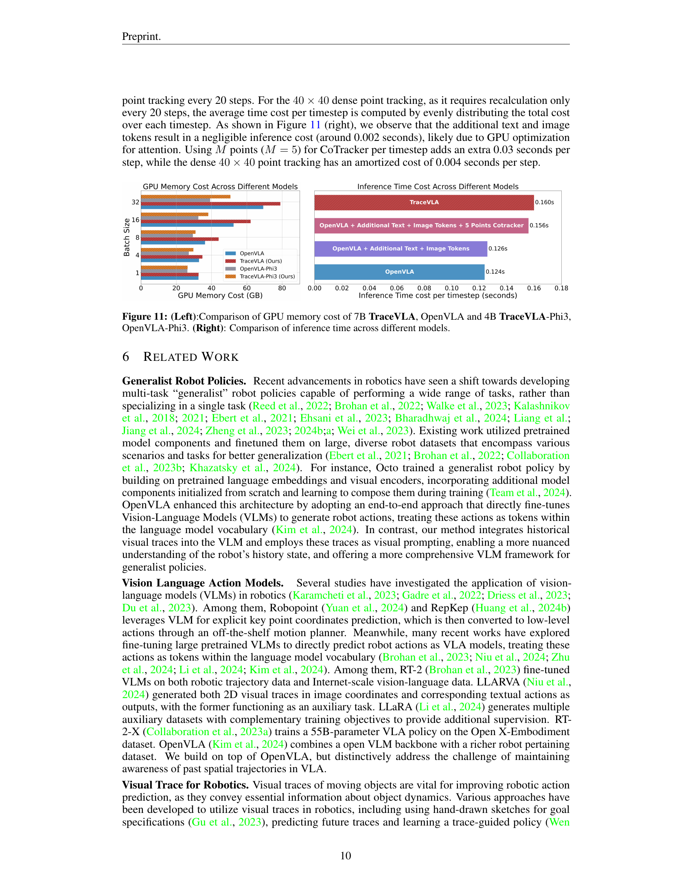
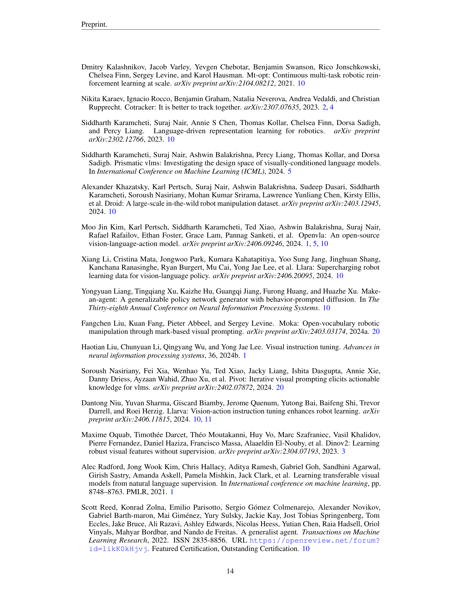

 


 2412.10345 
 Ruijie Zheng et el. 
 
 🤗 2024-12-16 
 



↗ arXiv


↗ Hugging Face


↗ Papers with Code


### TL;DR



**VLA(Vision-Language-Action) 모델**은 로봇 학습에 유망한 솔루션을 제공하지만, **시공간적 역학**을 완전히 고려하지 못해 복잡한 조작 작업에 어려움을 겪고 있습니다. 단순히 현재 이미지 입력을 행동에 매핑하는 것은 **과거 움직임**을 고려하지 않기 때문에 불충분합니다.

이 논문은 과거 상태-행동 궤적을 시각적으로 인코딩하여 VLA 모델의 시공간적 인식을 촉진하는 **비주얼 트레이스 프롬프팅**이라는 새로운 접근 방식을 제시합니다. 이는 **과거 움직임의 "흔적"**을 현재 관찰 이미지 위에 직접 오버레이하여 VLA가 공간적 역사를 효과적으로 "기억"할 수 있도록 합니다. 그 결과 **새로운 물체, 환경 및 지침에 대한 일반화 기능이 향상**되었습니다.



#### Key Takeaways


 비주얼 트레이스 프롬프팅은 로봇의 시공간적 인식을 향상시키는 간단하면서도 효과적인 방법입니다. 



 TraceVLA는 다양한 환경과 실제 로봇 작업에서 최첨단 성능을 보여줍니다. 



 콤팩트한 4B TraceVLA-Phi3는 효율성을 유지하면서 강력한 성능을 제공합니다. 


#### Why does it matter?
**로봇 조작**에서 시공간적 인식을 향상시키는 **비주얼 트레이스 프롬프팅**이라는 새로운 기법을 제시합니다. 이 논문은 VLA 모델이 **과거의 움직임을 기억**하고 **새로운 물체, 환경, 지침 및 구현에 적응**하는 능력을 향상시키는 방법을 보여주는 것으로, **보다 효율적인 로봇 학습**으로 이어집니다. 제시된 데이터 세트와 모델은 **다양한 연구 방향**을 제시하며, **복잡한 조작 작업의 일반화 가능성을 높입니다**.

------
#### Visual Insights

> 🔼 이 그림은 TraceVLA 방법을 보여줍니다. 첫 번째 이미지는 로봇이 관찰한 원본 이미지를 보여주고 두 번째 이미지는 시각적 흔적이 겹쳐진 동일한 이미지를 보여줍니다. 그런 다음 두 이미지의 시각적 토큰 사이에 구분 토큰을 삽입한 후 텍스트 토큰과 연결하여 기본 비전 언어 모델 백본에 공급하여 작업 토큰을 출력합니다.
> 

> 
read the caption

> Figure 1: An illustration of our method. The first image shows the original robot’s observation, while the second contains the same image with overlaid visual traces. A separator token is then inserted between the visual tokens of these two images, then concatenating with text tokens and feeding into the underlying vision language model backbone to output action tokens.
> 


| Models | Visual Matching | Variant Aggregation | Overall Performance |
|---|---|---|---|---|---|---| 
| | Move Near | Pick Coke Can | Open/Close Drawer | Move Near | Pick Coke Can | Open/Close Drawer | |
| OpenVLA-Phi3 | 46.1% | 46.7% | 22.5% | 51.9% | 49.7% | 22.2% | 39.9% |
| **TraceVLA**-Phi3 | 50.4% (&uarr; **4.3**) | 52.2% (&uarr; **5.5**) | 31.0% (&uarr; **8.5**) | 55.0% (&uarr; **3.1**) | 52.4% (&uarr; **2.7**) | 23.2% (&uarr; **1.0**) | 44.0% (&uarr; **4.1**) |
| OpenVLA | 47.1% | 15.3% | 49.5% | 54.0% | 52.8% | 22.5% | 40.2% |
| **TraceVLA** | 53.7% (&uarr; **6.6**) | 28.0% (&uarr; **12.7**) | **57.0**% (&uarr; **7.5**) | **56.4**% (&uarr; **2.4**) | **60.0**% (&uarr; **7.2**) | 31.0% (&uarr; **8.5**) | **47.7**% (&uarr; **7.5**) |
| Octo-Base | 3.0% | 1.3% | 1.0% | 4.2% | 17.0% | 22.0% | 8.2% |
| RT1-X | **55.0**% | **52.8**% | 22.5% | 34.2% | 54.0% | **56.0**% | 45.8% |

> 🔼 이 표는 세 가지 SimplerEnv Google 로봇 작업(Move Near, Pick Coke Can, Open/Close Drawer)에 대한 TraceVLA, OpenVLA, Octo-Base, RT1-X 모델의 성능 결과를 두 가지 평가 지표(Visual Matching, Variant Aggregation)로 보여줍니다. 각 작업에 대한 성공률을 백분율로 표시하며, 전체 성능은 모든 결과의 평균으로 계산됩니다. TraceVLA는 대부분의 작업과 지표에서 OpenVLA를 능가하며, 시각적 추적 프롬프팅 기법의 효과를 보여줍니다. Octo-Base와 RT1-X와 비교했을 때, TraceVLA는 일반적으로 더 나은 성능을 보입니다.
> 

> 
read the caption

> Table 1: Performance results on three SimplerEnv Google robot tasks under two evaluation metrics: visual matching and variant aggregation. Overall performance is calculated as the average over all the results.
> 

### In-depth insights

#### VLA Limitations
**VLA 모델은 로봇 조작 작업에서 유망한 성과를 보였지만 몇 가지 중요한 한계점을 가지고 있습니다.** 첫째, VLA는 **과거 행동의 시공간적 역학 및 관계를 완전히 이해하는 데 어려움**을 겪습니다. 이러한 한계는 복잡한 다단계 조작 작업을 수행하는 능력을 저해합니다. 둘째, VLA 모델은 **새로운 물체, 환경, 지침 또는 구현에 일반화**하는 데 어려움을 겪을 수 있습니다. 즉, 특정 작업이나 설정에 대해 훈련된 VLA 모델은 이전에 접하지 못했던 시나리오에서는 제대로 수행되지 않을 수 있습니다. 셋째, VLA 모델의 성능은 **사용되는 시각적 표현의 품질에 크게 좌우**됩니다. 시각적 입력이 노이즈가 많거나 모호하거나 불완전한 경우 VLA 모델이 정확한 동작을 예측하는 데 어려움을 겪을 수 있습니다. 마지막으로 VLA 모델을 훈련하려면 **상당한 양의 레이블이 지정된 데이터**가 필요하며, 이를 얻기 어렵고 비용이 많이 들 수 있습니다. 이러한 한계를 해결하기 위해서는 VLA 모델의 시공간적 추론 능력을 향상하고 다양한 시나리오에서 일반화 능력을 향상하며 보다 강력하고 효율적인 시각적 표현을 개발하고 레이블이 지정되지 않은 데이터 또는 자체 감독 학습 기술을 활용하는 데 중점을 둔 추가 연구가 필요합니다.

#### Visual Trace Intro
**Visual Trace Intro**는 로봇 조작 작업에서 VLA 모델의 시공간적 인식을 향상하는 새로운 접근 방식을 소개합니다. 이 기법은 로봇의 과거 움직임 궤적을 **시각적 흔적**으로 인코딩하고 이를 로봇의 원래 관측값에 오버레이하여 작동합니다. 이러한 시각적 흔적은 VLA 모델에 대한 시각적 프롬프트 역할을 하여 과거 행동에 대한 공간적 기억을 제공합니다. 이 논문에서는 시각적 흔적 프롬프트 데이터 세트를 사용하여 OpenVLA에서 미세 조정된 7B 매개변수 VLA 모델인 TraceVLA를 소개합니다. TraceVLA는 SimplerEnv의 137가지 구성과 실제 WidowX 로봇의 4가지 작업에 걸쳐 평가되어 최첨단 성능을 보여줍니다. 또한 다양한 구현 및 시나리오에서 강력한 일반화 기능을 보여줍니다.

#### TraceVLA Model
**TraceVLA**는 시각적 궤적 프롬프팅을 활용하여 VLA 모델의 시공간적 인식을 향상시킵니다. 과거 로봇 움직임의 궤적을 시각적으로 이미지에 오버레이하여 과거 행동에 대한 **공간적 기억**을 제공합니다. 이는 현재 입력만을 상태로 매핑하는 기존 VLA 모델의 한계를 극복하고, 조작 작업의 성능 및 일반화 능력을 향상시키는 데 기여합니다. TraceVLA는 OpenVLA에서 파생된 7B 매개변수 모델이며, 시각적 궤적 프롬프팅 데이터셋으로 미세 조정되었습니다. 또한 4B 매개변수 **TraceVLA-Phi3** 모델도 개발되어 추론 효율성을 높였습니다.  **SimplerEnv** 시뮬레이션 및 **WidowX 로봇** 실험을 통해 TraceVLA는 다양한 환경 및 작업에서 기존 VLA 모델보다 뛰어난 성능을 보였습니다.

#### Robot Eval Tests
**로봇 평가 테스트**는 실제 로봇의 성능을 측정하는 데 매우 중요합니다. 시뮬레이션 환경에서 학습된 정책이 실제 환경에서 얼마나 효과적으로 전이되는지, 그리고 다양한 작업과 환경 변화에 얼마나 **일반화**될 수 있는지를 평가합니다. 이러한 테스트는 일반적으로 성공률, 작업 완료 시간, **정밀도** 및 **안정성**과 같은 지표를 사용하여 측정됩니다. 로봇의 **적응성**, **견고성**, 그리고 **실제 환경에서의 유용성**을 검증하는 핵심 단계입니다.

#### Future of VLA
**VLA 모델의 미래는 공간 및 시간적 추론 능력 향상에 달려 있습니다.** 향후 연구에서는 다점 공간 궤적 예측을 통합하여 모델이 단순히 반응하는 것이 아니라 예측하고 계획할 수 있도록 하는 데 중점을 둘 것입니다. 또한 3D 포인트 클라우드 데이터를 활용하면 복잡한 장면과 개체에서 세밀한 디테일을 캡처하여 공간 표현을 더욱 풍부하게 할 수 있으므로 다양하고 동적인 시나리오에서 조작 정확도와 견고성이 향상됩니다. 자연어 명령을 따르는 능력을 향상시키면 로봇이 더 복잡한 작업을 수행하고 인간과 더 효과적으로 상호 작용할 수 있습니다. 마지막으로 더 큰 규모의 다양한 로봇 데이터 세트에서 VLA 모델을 학습시키면 다양한 조작 작업과 환경 조건에 대한 일반화 능력이 향상됩니다. 이러한 발전은 VLA 모델의 기능을 지속적으로 향상시켜 로봇 조작 분야의 발전을 주도할 것입니다.

### More visual insights

More on figures

> 🔼 이 그림은 시각적 추적 프롬프트 생성 과정을 보여줍니다. 과거 이미지 시퀀스에서 Co-tracker를 사용하여 밀집된 점 궤적을 추출하고, 움직임이 큰 활성 점 궤적을 유지합니다. 그런 다음 활성 점 궤적을 로봇의 초기 관측 프레임에 시각적 추적으로 겹쳐서 표시합니다. 시각적 추적이 있는 이미지와 원본 이미지를 모두 VLA 모델 입력으로 사용합니다.
> 

> 
read the caption

> Figure 2: An illustration of visual trace generation. Given a sequence of historical image observations, we first use Co-tracker to extract dense point trajectories and keep active point trajectories with significant movement. We then overlay active point trajectories on the robot’s initial observation frame as visual trace prompting. We feed both the image overlaid with visual traces and the original image into VLA as model input.
> 

> 🔼 이 그림은 TraceVLA 모델과 OpenVLA 모델의 성능을 비교한 막대 그래프입니다. 왼쪽 그래프는 70억 개 매개변수를 가진 두 모델(TraceVLA와 OpenVLA)의 성능을, 오른쪽 그래프는 40억 개 매개변수를 가진 두 모델(TraceVLA-Phi3와 OpenVLA-Phi3)의 성능을 비교합니다. 각 작업('Move Near', 'Pick Coke', 'Open/Close Drawer')에 대한 성공률을 막대로 표시하고 있으며, 이 성공률은 'visual matching'과 'variant aggregation' 두 평가 지표에 대한 평균값입니다. TraceVLA와 TraceVLA-Phi3는 모든 작업에서 OpenVLA 및 OpenVLA-Phi3보다 높은 성공률을 보여줍니다.
> 

> 
read the caption

> Figure 3: (Left): 7B TraceVLA vs. 7B OpenVLA. (Right): 4B TraceVLA-Phi3 vs. 4B OpenVLA-Phi3. Numbers are averaged across the visual matching and variant aggregation metrics.
> 

> 🔼 이 그림은 TraceVLA와 OpenVLA의 성능을 다양한 환경 변화에 따라 비교한 것입니다. 카메라 각도, 조명, 배경, 주의 분산 요소, 테이블 질감 등 다섯 가지 환경 변수를 적용하여 두 모델의 성능 변화를 보여줍니다. TraceVLA는 시각적 추적 프롬프팅을 사용하여 시공간적 정보를 활용함으로써, OpenVLA에 비해 다양한 환경 변화에 대한 일반화 능력이 향상되었음을 보여줍니다.
> 

> 
read the caption

> Figure 4: Comparison of OpenVLA and TraceVLA performance across various environmental variations: camera orientations, lighting, background, distractors, and table texture.
> 

> 🔼 이 그림은 실제 로봇 실험 설정을 보여줍니다. 로봇은 WidowX 250 로봇 팔이며, 천 접기, 옥수수 싱크대에 쓸어 담기, 옥수수 냄비 집어 옮기기, 칼 집어 들기와 같은 다양한 조작 기술과 물체가 포함된 4가지 실제 로봇 작업이 설계되었습니다. 각 작업에는 성공 기준과 언어 지침이 있습니다.
> 

> 
read the caption

> Figure 5: Real robot setup. We design 4 real-world robot tasks with different manipulation skills and objects.
> 

> 🔼 이 그림은 실제 로봇 실험의 일반화 능력을 테스트하기 위해 설계된 4가지 과제를 보여줍니다. 각 과제에는 새로운 물체, 목표 및 언어 지시가 포함됩니다. 과제는 다음과 같습니다. 1) 접시 오른쪽에 바나나 놓기, 2) 접시 위의 코끼리 집어 올리기, 3) AAA 배터리 들어 올리기, 4) 천 왼쪽에서 오른쪽으로 밀기.
> 

> 
read the caption

> Figure 6: Four unseen tasks for testing generalization in real robot settings.
> 

> 🔼 이 그림은 실제 로봇 WidowX-250에서 여러 조작 작업을 수행할 때 TraceVLA와 OpenVLA의 성능을 비교하여 보여줍니다. TraceVLA는 OpenVLA에 비해 전반적으로 더 나은 성능을 보여줍니다. TraceVLA는 folding cloth, pickplace corn pot, pickup knife, pickplace banana, pickplace eggplant, lift battery, push cloth 등 다양한 작업에서 더 높은 성공률을 기록했습니다. 이는 TraceVLA가 visual trace prompting을 통해 시공간적 추론 능력이 향상되었음을 보여줍니다.
> 

> 
read the caption

> ((a)) TraceVLA outperforms OpenVLA on diverse real-robot manipulation tasks.
> 

> 🔼 이 그림은 TraceVLA 모델이 이전에 본 적 없는 실제 로봇 작업에서 OpenVLA보다 더 나은 일반화 능력을 보여주는 것을 나타냅니다. 4가지 작업(바나나 집어 놓기, 코끼리 인형 집어 놓기, AAA 배터리 들어 올리기, 천 밀기)에 대한 성공적인 시도 횟수를 막대그래프로 보여줍니다. TraceVLA는 모든 작업에서 OpenVLA보다 성공률이 상당히 높습니다.
> 

> 
read the caption

> ((b)) TraceVLA showcases superior generalization on unseen real robot experiments.
> 

> 🔼 이 그림은 실제 WidowX-250 로봇에서 TraceVLA와 OpenVLA의 성능을 8가지 조작 작업에 대해 비교하여 보여줍니다. TraceVLA는 OpenVLA에 비해 다양한 작업에서 더 나은 일반화 능력을 보여줍니다.
> 

> 
read the caption

> Figure 7: Performance comparison of TraceVLA and OpenVLA on8 real-world WidowX-250 robot manipulation tasks.
> 

> 🔼 이 그림은 TraceVLA의 성능 향상에 대한 분석을 보여줍니다. 왼쪽 그래프는 기본 OpenVLA 및 OpenVLA-Phi3 모델과 비주얼 트레이스 프롬프팅을 사용한 것과 사용하지 않은 것의 미세 조정된 버전 간의 평균 성공률 비교를 보여줍니다. 오른쪽 그래프는 기본 OpenVLA, TraceVLA, 그리고 6개의 이미지 시퀀스로 미세 조정된 OpenVLA 간의 평균 성공률 비교를 보여줍니다. 왼쪽 그래프를 통해 비주얼 트레이스 프롬프팅이 미세 조정된 모델의 성능 향상에 크게 기여함을 알 수 있습니다. 오른쪽 그래프에서는 과거 이미지 관측값을 추가하는 것보다 비주얼 트레이스 프롬프팅을 사용하는 것이 VLA 모델에 시공간적 이해를 접목하는 데 더 효과적인 방법임을 보여줍니다.
> 

> 
read the caption

> Figure 8: (Left): Comparison of average success rates between the base OpenVLA and OpenVLA-Phi3 models and their finetuned versions, with and without visual trace prompting. (Right): Comparison of average success rates between the base OpenVLA,TraceVLA, and OpenVLA finetuned with a sequence of 6 images.
> 

> 🔼 이 그림은 시각적 흔적 프롬프팅과 텍스트 흔적 프롬프팅을 비교하여 시각적 흔적 프롬프팅의 효과를 보여줍니다. 왼쪽 그래프는 OpenVLA 모델과 텍스트 흔적 프롬프팅을 사용하는 VLA, 시각적 흔적 프롬프팅을 사용하는 VLA의 평균 성공률을 비교합니다. 시각적 흔적 프롬프팅을 사용하는 VLA가 다른 두 모델보다 성공률이 더 높다는 것을 알 수 있습니다. 오른쪽에는 텍스트 흔적 프롬프팅의 예가 나와 있습니다. 텍스트 흔적 프롬프팅은 이미지에서 5개 지점의 움직임 정보를 텍스트로 설명합니다.
> 

> 
read the caption

> Figure 9: (Left): Comparing visual trace prompting and text trace prompting. (Right) Text trace prompts example.
> 

> 🔼 이 그림은 TraceVLA 모델이 다양한 길이의 비주얼 추적 프롬프트에서 어떤 성능을 보이는지 보여줍니다. x축은 비주얼 추적 프롬프트의 길이(N)을 나타내고, y축은 SimplerEnv 환경에서 세 가지 로봇 조작 작업(물건 옮기기, 콜라 캔 집기, 서랍 열고 닫기)에 대한 평균 성공률을 나타냅니다. 비주얼 추적 프롬프트의 길이는 모델에 제공되는 과거 관측값의 수를 결정합니다. N 값이 클수록 더 많은 과거 정보를 포함하지만, 시각적 맥락이 복잡해지고 중요한 물체나 로봇 엔드 이펙터가 가려질 수 있습니다. 반대로 N 값이 작을수록 과거 정보는 적지만 중요한 정보가 가려질 위험은 줄어듭니다. 실험 결과, N=3일 때 가장 좋은 성능을 보였지만 N=6일 때와 비교하면 개선 폭이 크지 않았습니다. N=12와 같이 너무 큰 값을 사용하면 과거 움직임의 궤적이 겹쳐 VLM 모델의 주의를 분산시켜 성능이 저하될 수 있습니다. 따라서, N 값은 데이터셋에 따라 적절히 조정해야 하며, 일반적으로는 몇 개의 에피소드를 샘플링하여 생성된 궤적을 시각적으로 검사하여 과거 맥락과 장면의 명확성 사이의 균형을 맞추는 것이 좋습니다.
> 

> 
read the caption

> Figure 10: TraceVLA under different length of visual traces.
> 

> 🔼 이 그림은 TraceVLA 모델의 학습 메모리 비용과 추론 속도를 다른 VLA 모델과 비교하여 보여줍니다. 왼쪽 그래프는 7B TraceVLA, OpenVLA 및 4B TraceVLA-Phi3, OpenVLA-Phi3 모델의 GPU 메모리 비용을 다양한 배치 크기에서 비교합니다. 오른쪽 그래프는 서로 다른 모델에서 추론에 걸리는 시간을 비교합니다. TraceVLA는 추가적인 이미지 입력과 CoTracker 사용으로 인해 OpenVLA에 비해 메모리 및 계산 비용이 추가되지만, 배치 크기를 줄이면 메모리 차이가 줄어들고 추론 속도의 차이는 크지 않음을 보여줍니다. CoTracker를 사용한 밀집 포인트 추적은 매 20단계마다 한 번만 계산하면 되므로 평균 시간 비용은 단계당 0.004초에 불과합니다. 추가 텍스트 및 이미지 토큰은 GPU 최적화 덕분에 추론 비용에 거의 영향을 미치지 않습니다. 결론적으로 TraceVLA는 성능 향상을 위해 약간의 추가 메모리 및 계산 오버헤드를 요구하지만 여전히 관리 가능하며 심각한 영향을 미치지는 않습니다.
> 

> 
read the caption

> Figure 11: (Left):Comparison of GPU memory cost of 7B TraceVLA, OpenVLA and 4B TraceVLA-Phi3, OpenVLA-Phi3. (Right): Comparison of inference time across different models.
> 

> 🔼 이 그림은 TraceVLA와 OpenVLA 모델이 '바나나 집어서 놓기' 과제를 어떻게 수행하는지 비교하여 보여줍니다. 위쪽은 OpenVLA, 아래쪽은 TraceVLA의 결과를 나타냅니다. TraceVLA는 시각적 궤적 프롬프팅을 사용합니다. TraceVLA는 바나나를 정확히 집어 올리고 접시 오른쪽에 놓는 데 성공하는 반면, OpenVLA는 바나나를 접시 위에 직접 놓아 일반화 능력이 부족함을 보여줍니다. 이는 TraceVLA의 시각적 궤적 프롬프팅 기법이 공간적 이해와 추론 능력 향상에 도움이 된다는 것을 보여줍니다.
> 

> 
read the caption

> Figure 12: Pickplace Banana task. (Above): OpenVLA rollout. (Below): TraceVLA rollout with visual trace prompting.
> 

> 🔼 이 그림은 OpenVLA와 TraceVLA가 '천 접기' 작업을 수행하는 장면을 보여줍니다. 위쪽은 OpenVLA의 결과이고, 아래쪽은 TraceVLA의 결과입니다. TraceVLA의 경우, 로봇이 작업을 수행하는 동안 사용하는 시각적 궤적 프롬프트도 시각화되어 있습니다. TraceVLA는 천의 가장자리를 정확히 잡고 부드럽게 접는 반면, OpenVLA는 천을 접는 데 어려움을 겪습니다. 이는 TraceVLA가 과거 행동의 시각적 궤적을 활용하여 시공간적 이해 능력이 향상되었음을 보여줍니다.
> 

> 
read the caption

> Figure 13: Fold Cloth task. (Above): OpenVLA rollout. (Below): TraceVLA rollout with visual trace prompting.
> 

> 🔼 이 그림은 OpenVLA 모델과 TraceVLA 모델이 '가지 집어 접시에 놓기' 과제를 수행하는 장면을 비교하여 보여줍니다. 위쪽은 OpenVLA, 아래쪽은 TraceVLA의 rollout 장면을 보여주며, TraceVLA rollout에서는 모델이 사용하는 visual trace 프롬프트가 시각화되어 있습니다. TraceVLA 모델은 가지를 정확히 집어 접시에 놓는 데 성공하는 반면, OpenVLA 모델은 일반화 능력이 부족하여 과제 수행에 실패하는 모습을 보입니다. 이는 TraceVLA가 visual trace 프롬프트를 통해 시각적 이해력과 추론 능력이 향상되었음을 보여주는 예시입니다.
> 

> 
read the caption

> Figure 14: Pickplace Eggplant task. (Above): OpenVLA rollout. (Below): TraceVLA rollout with visual trace prompting.
> 

> 🔼 이 그래프는 관측 기록 단계 수에 따른 TraceVLA와 OpenVLA의 평균 성공률을 비교하여 보여줍니다. TraceVLA는 관측 기록 단계 수에 관계없이 OpenVLA보다 일관되게 더 높은 성공률을 보입니다. OpenVLA는 2단계 관측 기록에서 약간의 성능 향상을 보이지만, TraceVLA는 여전히 모든 단계에서 더 나은 성능을 보입니다. 이는 시각적 궤적 프롬프팅의 효과를 보여줍니다.
> 

> 
read the caption

> Figure 15: Comparison of TraceVLA against OpenVLA with different steps of observation history.
> 

> 🔼 LIBERO-Spatial은 LIBERO 벤치마크의 네 가지 테스트 스위트 중 하나입니다. LIBERO-Spatial은 동일한 물체 세트를 다양한 레이아웃으로 배치하여 모델의 공간적 관계 이해 능력을 테스트합니다. 예시 언어 지시: 접시와 라메킨 사이에 있는 검은색 그릇을 집어 접시 위에 놓으세요.
> 

> 
read the caption

> ((a)) LIBERO-Spatial
> 

> 🔼 LIBERO-Object는 LIBERO 벤치마크의 네 가지 테스트 스위트 중 하나입니다. LIBERO-Object는 일관된 장면 레이아웃을 특징으로 하지만 다양한 객체들을 도입하여 객체 유형에 대한 모델의 이해도를 평가합니다. 예시 언어 명령어: 알파벳 수프를 집어 바구니에 넣으세요.
> 

> 
read the caption

> ((b)) LIBERO-Object
> 

> 🔼 LIBERO-Goal은 LIBERO 벤치마크의 네 가지 테스트 세트 중 하나입니다. LIBERO-Goal은 물체와 레이아웃을 동일하게 유지하면서 작업 목표를 변경하여 다양한 작업 지향 행동에 대한 모델의 지식을 평가합니다. 예시 언어 지시: 알파벳 수프와 토마토 소스를 모두 바구니에 넣으세요.
> 

> 
read the caption

> ((c)) LIBERO-Goal
> 

More on tables


| Thickness | SimplerEnv Average Success Rate |
|---|---| 
| `linewidth=1` | 47.2% |
| **`linewidth=2` (TraceVLA)** | **47.7%** |
| `linewidth=3` | 47.8% |
> 🔼 이 표는 TraceVLA 모델에서 시각적 추적 프롬프트의 선 두께를 변경했을 때 SimplerEnv 벤치마크에서의 평균 성공률에 미치는 영향을 보여줍니다. 선 두께가 1, 2, 3으로 변경됨에 따라 성공률의 차이가 크지 않음을 알 수 있습니다.
> 

> 
read the caption

> Table 2: Impact of line thickness on performance.
> 


| Transparency ($\alpha$) | SimplerEnv Average Success Rate |
|---|---| 
| $\alpha=1$ (TraceVLA) | 47.7% |
| $\alpha=0.8$ | 47.3% |
> 🔼 이 표는 TraceVLA 모델에서 시각적 추적 프롬프트의 투명도(알파)를 변경하여 성능에 미치는 영향을 보여줍니다. 알파 값이 낮을수록 추적이 더 투명해집니다. 표에서 볼 수 있듯이 TraceVLA의 성능은 이러한 조정에 대해 강력하며, 시각적 추적 프롬프트의 투명도가 성능에 미치는 영향이 미미함을 보여줍니다.
> 

> 
read the caption

> Table 3: Impact of transparency on performance.
> 


| Color Scheme | SimplerEnv Average Success Rate |
|---|---| 
| RYPBG (TraceVLA) | **47.7%** |
| POBGG | 47.3% |
> 🔼 이 표는 TraceVLA 모델에서 시각적 추적 프롬프트의 색상 구성표 변화에 따른 성능 영향을 보여줍니다. 기본 RYPBG (빨강, 노랑, 보라, 파랑, 녹색) 구성표와 대안 POBBG (분홍, 주황, 파랑, 회색, 녹색) 구성표를 비교합니다. 두 가지 구성표 모두 유사한 성공률을 보여 TraceVLA 성능에 대한 색상 구성표 선택의 영향이 미미함을 나타냅니다.
> 

> 
read the caption

> Table 4: Impact of color scheme on performance.
> 


| Method | LIBERO-Spatial | LIBERO-Object | LIBERO-Goal | LIBERO-Long | Average |
|---|---|---|---|---|---| 
| **TraceVLA finetuned** | **84.6% ± 0.2%** | **85.2% ± 0.4%** | **75.1% ± 0.3%** | **54.1% ± 1.0%** | **74.8% ± 0.4%** |
| OpenVLA finetuned | 82.6% ± 0.4% | 83.8% ± 0.6% | 70.4% ± 0.5% | 45.7% ± 0.6% | 70.6% ± 0.4% |
> 🔼 이 표는 LIBERO 시뮬레이션 벤치마크에서 TraceVLA와 OpenVLA의 멀티태스크 성공률을 보여줍니다. TraceVLA는 OpenVLA보다 모든 벤치마크에서 더 높은 성공률을 보입니다.
> 

> 
read the caption

> Table 5: Multitask success rates on LIBERO simulation benchmarks.
> 

### Full paper



