 


 2412.10447 
 Jimmy Wu et el. 
 
 🤗 2024-12-17 
 



↗ arXiv


↗ Hugging Face


↗ Papers with Code


### TL;DR



**이동 조작 로봇은 실제 환경에서 다양한 작업을 수행할 수 있지만, 학습에 필요한 실제 데이터가 부족합니다.** 기존의 상용 이동 기반은 가격이 비싸거나 특정 환경에만 적합하며, 홀로노믹 기반이 아니어서 제어에 제약이 있습니다. 따라서 **연구에 적합한 저렴하고 유연한 하드웨어가 필요합니다.**

**본 논문에서는 저비용의 홀로노믹 이동 조작기인 TidyBot++를 제안합니다.** 홀로노믹 기반은 모든 평면 자유도를 독립적이고 동시에 제어할 수 있어 기존 차동 구동 기반보다 기동성이 뛰어나고 조작 작업이 간단합니다. 또한 핸드폰을 이용한 텔레오퍼레이션 인터페이스를 개발하여 **데이터 수집을 용이하게 하고 직관적인 제어를 가능하게 합니다.** 실험을 통해 수집된 데이터로 학습된 정책이 다양한 가정용 이동 조작 작업을 성공적으로 수행하는 것을 보여주며 **실제 환경에서의 효과를 입증했습니다.**



#### Key Takeaways


 저렴하고 조립하기 쉬운 홀로노믹 이동 조작기 설계 공개 



 직관적인 모바일 텔레오퍼레이션 인터페이스로 데이터 수집 간소화 



 홀로노믹 기반이 차동 구동 기반보다 데이터 수집과 정책 학습에 유리함을 입증 


#### Why does it matter?
**데이터 수집과 정책 학습 모두에 도움이 되는 저비용의 홀로노믹 이동 조작기를 오픈소싱함으로써 로봇 학습 연구에 중요한 공헌을 합니다.** 이를 통해 **이동 조작 연구의 접근성을 높이고, 대규모 데이터 수집을 용이하게 하여** 궁극적으로 로봇의 실제 환경에서의 성능 향상에 기여합니다. **이동 조작기의 새로운 디자인과 핸드폰 텔레오퍼레이션 인터페이스는** 로봇 학습 분야에서 데이터 수집과 정책 학습 방식에 혁신을 가져올 수 있는 잠재력을 가지고 있습니다.

------
#### Visual Insights

> 🔼 이 그림은 논문에서 제안된 홀로노믹 이동 조작 로봇인 TidyBot++를 보여줍니다. 왼쪽 이미지는 로봇의 전체적인 모습을 보여주고, 오른쪽 이미지는 실제 아파트 환경에서 다양한 가사 작업을 수행하는 로봇의 모습을 보여줍니다.  홀로노믹 베이스는 로봇이 모든 방향으로 자유롭게 움직일 수 있도록 해주며, 이는 다양한 작업 수행에 유리합니다. 그림의 오른쪽 부분에서는 냉장고 열기, 조리대 닦기, 식기 세척기 채우기, 쓰레기 버리기, 빨래하기, 식물에 물주기 등 로봇이 수행할 수 있는 작업의 예시를 보여줍니다.
> 

> 
read the caption

> Figure 1: We develop an open-source mobile manipulator with a holonomic base (left), and show that it can perform a variety of household tasks in a real apartment home (right).
> 


| Specification | Ours | Stretch | Tracer | Ranger Mini | Husky | Fetch | Tiago |
|---|---|---|---|---|---|---|---| 
| Holonomic | Yes | No | No | No | No | No | Yes |
| Omnidirectional | Yes | No | No | Yes | No | No | Yes |
| Swappable arm | Yes | No | Yes | Yes | Yes | No | No |
| Footprint (cm) | 50x54 | 33x34 | 57x69 | 50x74 | 67x99 | 51x56 | 54x54 |
| Weight | 34 kg | 24.5 kg | 30 kg | 63 kg | 50 kg | 113 kg | 70 kg |
| Payload | 60 kg | 10 kg | 100 kg | 80 kg | 75 kg | — | — |
| Maximum speed | 1 m/s | — | 1.6 m/s | 1.5 m/s | 1 m/s | 1 m/s | 1 m/s |
| Runtime | 8 h | 2–5 h | 4 h | 7–8 h | 3 h | 9 h | 8–10 h |
| Cost | $5.4k | $25k | $7.6k | $13k | $20k | $100k | $100k |

> 🔼 이 표는 여러 모바일 베이스와 모바일 매니퓰레이터의 사양을 비교한 표입니다. 비교 대상에는 Hello Robot의 Stretch 모바일 매니퓰레이터, AgileX의 Tracer 및 Ranger Mini 2.0 AGV, Clearpath의 Husky AGV, Fetch 및 Tiago 모바일 매니퓰레이터가 포함됩니다. 각 로봇의 홀로노믹 여부, 옴니디렉셔널 여부, 팔 교체 가능 여부, 설치 공간, 무게, 페이로드, 최대 속도, 런타임, 비용 등의 정보를 비교하여 제시합니다.
> 

> 
read the caption

> Table 1: Mobile base and mobile manipulator comparison
> 

### In-depth insights

#### Holonomic Mobility
**홀로노믹 이동성**은 로봇이 **모든 방향으로 움직이고 동시에 모든 방향으로 회전**할 수 있는 기능을 말합니다. 이는 바퀴가 있는 로봇의 경우, 측면 이동이나 제자리 회전과 같은 동작을 수행할 수 있음을 의미합니다. 이러한 유연성은 로봇의 기동성을 크게 향상시켜 좁은 공간을 탐색하고 복잡한 작업을 수행하는 데 유용합니다. 예를 들어, 홀로노믹 모바일 베이스는 로봇 팔의 작업 공간을 최대화하기 위해 측면으로 움직여야 하는 문 열기 및 캐비닛 열기와 같은 일상적인 작업을 용이하게 합니다. 이와 대조적으로, 차동 구동 베이스와 같은 비홀로노믹 로봇은 움직임이 제한적이어서 측면으로 직접 움직일 수 없으므로 이러한 작업을 수행하기가 더 어렵습니다. 홀로노믹 이동성은 텔레오퍼레이션과 운동학적 티칭에도 유용하여 작업자가 로봇의 위치를 미세하게 조정하고 복잡한 기동을 더 쉽게 수행할 수 있도록 합니다. 이러한 이점은 로봇을 **더 직관적이고 사용자 친화적으로** 만들어 줍니다. 마지막으로, 홀로노믹 베이스의 위치 제어 기능은 정책 학습 및 추론에 유용합니다. 정책은 덜 시끄럽고 더 안정적인 위치 표현을 사용하여 학습할 수 있으며 홀로노믹 기반은 원하는 위치로 이동하여 이러한 정책을 효과적으로 실행할 수 있습니다. 요약하면, 홀로노믹 이동성은 **로봇 공학, 특히 모바일 조작 분야에서 귀중한 기능**입니다.

#### Open-Source Design
**TidyBot++는 로봇 학습을 위한 오픈 소스 홀로노믹 모바일 매니퓰레이터입니다.** 저렴하고 견고하며 유연한 설계로, 다양한 로봇 팔을 지원하여 실제 가정 환경에서의 모바일 조작 작업에 적합합니다. **핵심은 홀로노믹 베이스로, 평면의 모든 자유도를 독립적이고 동시에 제어할 수 있게 해줍니다.** 이는 기존의 non-holonomic 베이스보다 기동성이 뛰어나고 조작 작업을 단순화하며, 직관적인 텔레오퍼레이션 인터페이스를 통해 데이터 수집을 용이하게 합니다.  이러한 설계는 **모바일 매니퓰레이터의 접근성을 높이고, 데이터 수집을 간소화하며, 연구 재현성을 향상시키는 데 기여합니다.** 또한, 모바일 폰 텔레오퍼레이션 인터페이스를 통해 누구나 쉽게 데이터를 수집하고 정책 학습에 활용할 수 있습니다.

#### Phone Teleop
**TidyBot++**는 로봇 학습을 위한 저비용 홀로노믹 모바일 매니퓰레이터입니다.  **휴대폰 텔레오퍼레이션 인터페이스**를 통해 데모 데이터를 쉽게 수집할 수 있도록 **WebXR API**를 활용합니다.  이 인터페이스는 휴대폰의 6-DoF 포즈를 컴퓨터로 스트리밍하여 모바일 베이스 또는 팔의 움직임으로 매핑합니다. 대부분의 최신 Android 및 iOS 휴대폰에서 WebXR이 지원되므로 **별도의 장비 없이 쉽게 원격 조작**이 가능합니다.  이러한 인터페이스로 수집한 데이터를 통해 효과적인 정책 학습이 가능하며, 실험 결과 홀로노믹 베이스는 차동 구동 방식에 비해 **텔레오퍼레이션과 정책 학습 모두에서 이점**을 제공하는 것으로 나타났습니다.  **직관적인 인터페이스를 통해 데이터 수집의 용이성을 높였고**, 이는 모바일 조작 작업의 효율적인 학습에 기여합니다.

#### Imitation Learning
**모방 학습**은 로봇이 실제 환경에서 효과적으로 동작하도록 학습시키는 강력한 방법입니다. 이 연구에서는 실내 모바일 조작 작업에 초점을 맞춰 **휴대폰 원격 조작 인터페이스**를 사용하여 데모 데이터를 수집했습니다.  냉장고 열기, 조리대 닦기, 식기 세척기 채우기, 쓰레기 버리기, 세탁물 넣기, 식물에 물주기 등 6가지 작업에 대해 50~100개의 데모를 수집하여 확산 정책을 학습시켰습니다.  결과적으로, 로봇은 학습된 정책을 통해 이러한 작업을 성공적으로 수행할 수 있었습니다.  이러한 결과는 **저비용**의 **홀로노믹** 모바일 로봇과 직관적인 **휴대폰 인터페이스**를 결합하여 효과적인 모방 학습 시스템을 구축할 수 있음을 보여줍니다. 특히, 홀로노믹 기반은 50개의 데모만으로도 작업 수행이 가능하도록 학습할 수 있게 하였으며 이는 데이터 효율성 측면에서 **큰 장점**입니다.  추가적인 데이터 수집과 정책 개선을 통해 로봇의 성능을 더욱 향상시킬 수 있을 것으로 기대됩니다.

#### Drive Comparison
**홀로노믹 드라이브**와 **차동 드라이브**의 비교 분석은 모바일 로봇의 성능에 중대한 영향을 미칩니다. 홀로노믹 드라이브는 모든 방향으로의 **즉각적인 움직임**을 가능하게 하여 제한된 공간에서의 기동성과 정밀도를 향상시킵니다. 이는 복잡한 작업이나 좁은 환경에서 특히 유용합니다. 예를 들어, 홀로노믹 기반 로봇은 장애물을 피하거나 혼잡한 환경에서 탐색하는 데 훨씬 효율적입니다. 차동 드라이브는 일반적으로 더 단순하고 비용 효율적이지만, 즉각적인 측면 이동이 불가능하고 회전을 위해서는 추가 공간이 필요하다는 단점이 있습니다. 따라서 홀로노믹 드라이브는 **정밀한 제어 및 기동성**이 필수적인 작업에 적합하며, 차동 드라이브는 단순하고 비용 효율적인 솔루션이 필요한 경우에 적합합니다.

### More visual insights

More on figures

> 🔼 이 그림은 홀로노믹 베이스에 사용되는 캐스터 휠의 단순화된 그림입니다. 그림에서 바퀴의 회전축과 swivel 메커니즘의 수직축 사이의 오프셋을 볼 수 있습니다. 이 오프셋은 캐스터의 중요한 설계 특징이며, 의자가 움직일 때 바퀴가 swivel의 수직축 뒤에서 움직이게 하여 바퀴를 자동으로 움직임 방향에 맞춥니다. 이 오프셋이 없으면 차량은 전방향으로 움직일 수 있지만(모든 방향으로 움직일 수 있음) 여전히 홀로노믹이 아니며 차량이 움직이기 전에 바퀴를 수동으로 정렬해야 합니다.
> 

> 
read the caption

> Figure 2: A simplified illustration of caster wheels on a holonomic base.
> 

> 🔼 이 그림은 논문에서 제안하는 모듈식 홀로노믹 이동 로봇 베이스의 구성 요소를 보여줍니다. 주요 부품으로는 캐스터 모듈, 전원 분배 장치, SLA 배터리, 휴대용 발전소, T-슬롯 알루미늄 프레임, 그리고 컴퓨터가 있습니다. 이러한 모듈식 설계 덕분에 로봇은 쉽게 재구성이 가능하며, 조립도 1~2일밖에 걸리지 않습니다.
> 

> 
read the caption

> Figure 3: Our mobile base is designed to be modular and easily reconfigurable. It has very few components and can be assembled in 1 to 2 days.
> 

> 🔼 이 그림은 홀로노믹 모바일 베이스에 사용되는 캐스터 휠의 단순화된 등각 투영 및 평면도를 보여줍니다. 바퀴 반경 r, 조향 및 롤 조인트  𝜑 및  𝜌, 캐스터 오프셋 bx 및 by, 베이스 원점으로부터의 캐스터 모듈 배치 (h, β)를 포함한 주요 구성 요소와 매개변수가 표시됩니다. 캐스터 오프셋은 캐스터가 움직일 때 바퀴가 회전축 뒤에서 움직이도록 하여 자동으로 바퀴를 움직임 방향에 맞추는 중요한 설계 기능입니다. 이 오프셋이 없으면 차량은 전방향으로 움직일 수 있지만(모든 방향으로 움직일 수 있음) 여전히 홀로노믹하지 않아 차량이 움직이기 전에 바퀴를 수동으로 정렬해야 합니다.
> 

> 
read the caption

> Figure 4: Isometric and top views of a simplified caster, showing the caster offsets bxsubscript𝑏𝑥b_{x}italic_b start_POSTSUBSCRIPT italic_x end_POSTSUBSCRIPT and bysubscript𝑏𝑦b_{y}italic_b start_POSTSUBSCRIPT italic_y end_POSTSUBSCRIPT, wheel radius r𝑟ritalic_r, steer and roll joints ϕitalic-ϕ\phiitalic_ϕ and ρ𝜌\rhoitalic_ρ, and caster module placement (h,β)ℎ𝛽(h,\beta)( italic_h , italic_β ) from the base origin.
> 

> 🔼 이 그림은 닦기 작업에서 홀로노믹 기반과 차동 구동 기반 로봇의 경로를 비교하여 보여줍니다. 홀로노믹 기반 로봇은 작업 공간에서 직접 앞뒤, 좌우, 대각선으로 이동할 수 있습니다. 차동 구동 기반 로봇은 좌우 이동에 제약이 있기 때문에 대상 작업 공간에 도달하기 위해 더 긴 경로를 따라 이동해야 합니다. 즉, 닦기 작업을 수행하는 동안 로봇은 앞뒤로만 움직일 수 있으므로, 옆으로 움직이려면 먼저 방향을 바꿔야 합니다. 이는 로봇이 작업을 완료하는 데 필요한 시간과 이동 거리를 증가시킵니다. 그림에서 홀로노믹 기반 로봇은 작업을 완료하기 위해 직선 경로를 따라 이동하는 반면, 차동 구동 기반 로봇은 제약 조건으로 인해 더 복잡하고 덜 효율적인 경로를 따라 이동합니다.
> 

> 
read the caption

> Figure 5: In the wipe countertop task, the differential drive robot is forced to take a less efficient path as it is subject to nonholonomic constraints.
> 

### Full paper


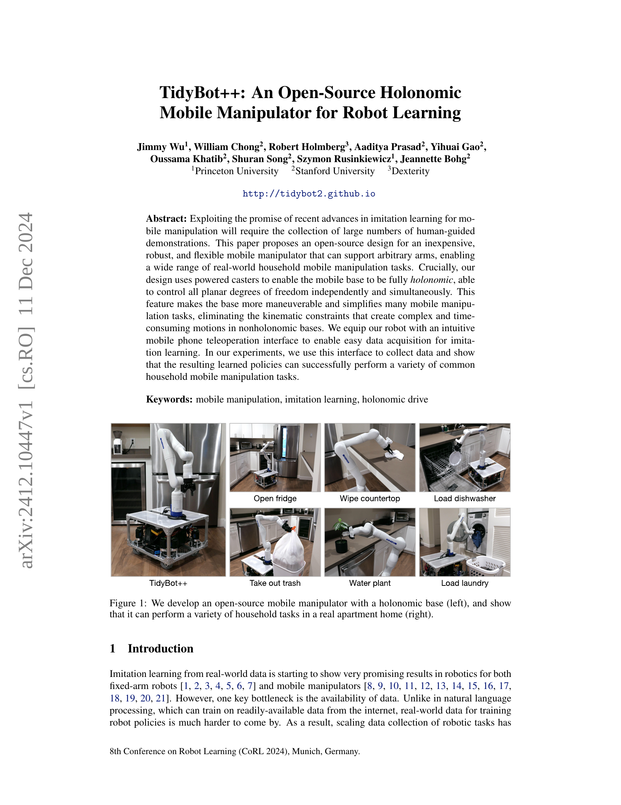
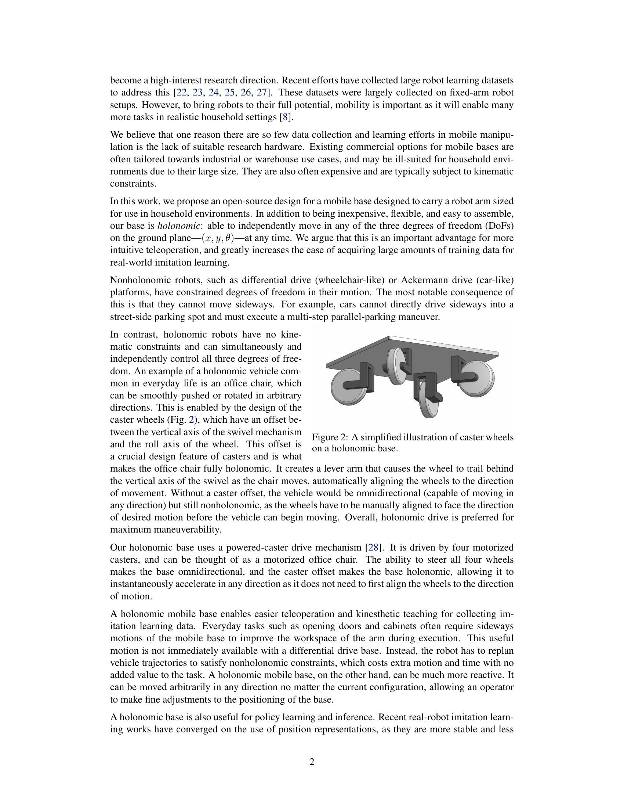
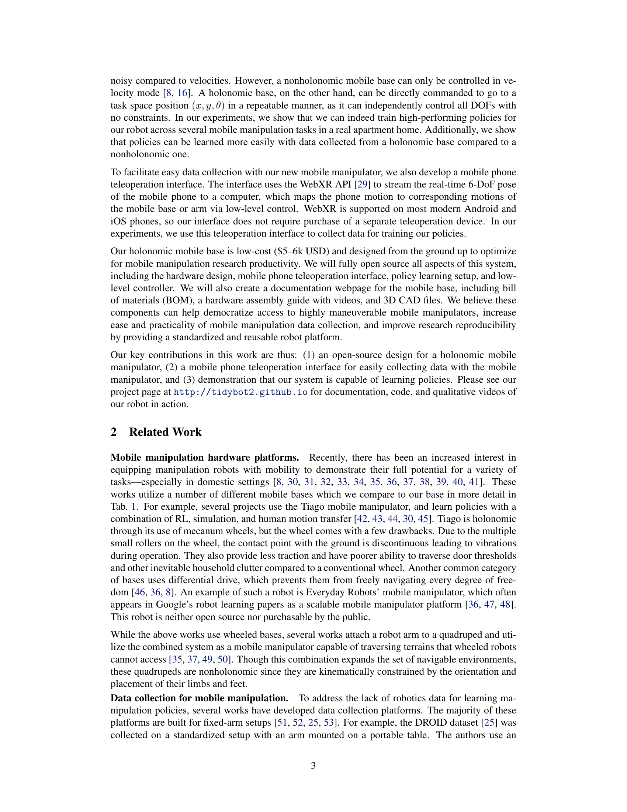
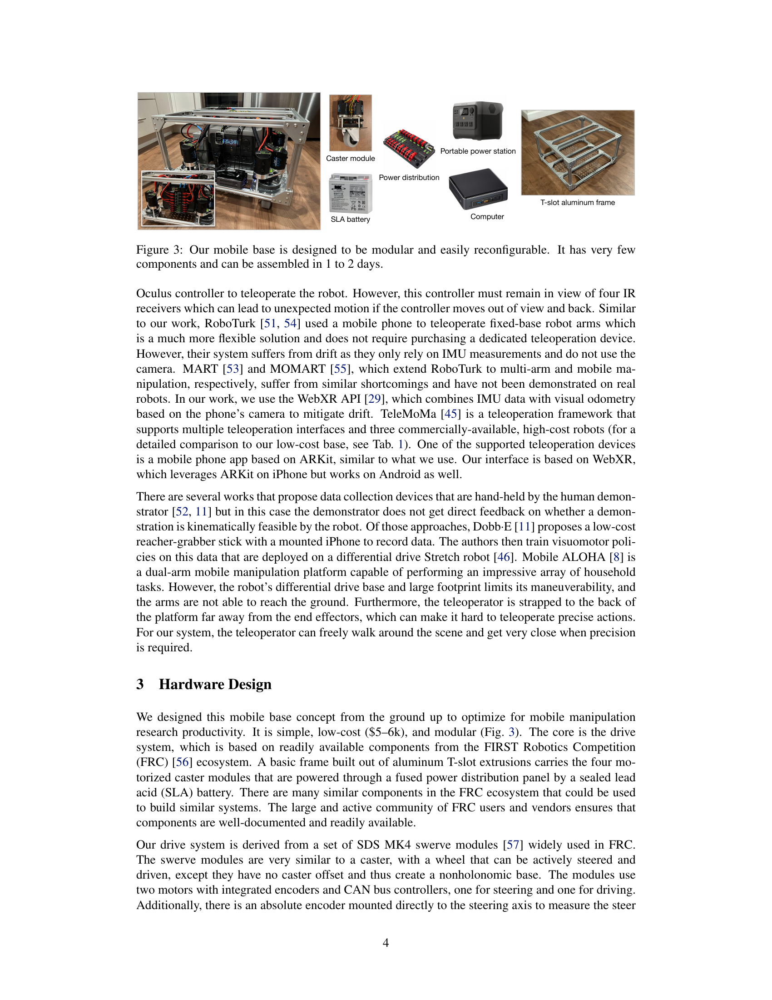
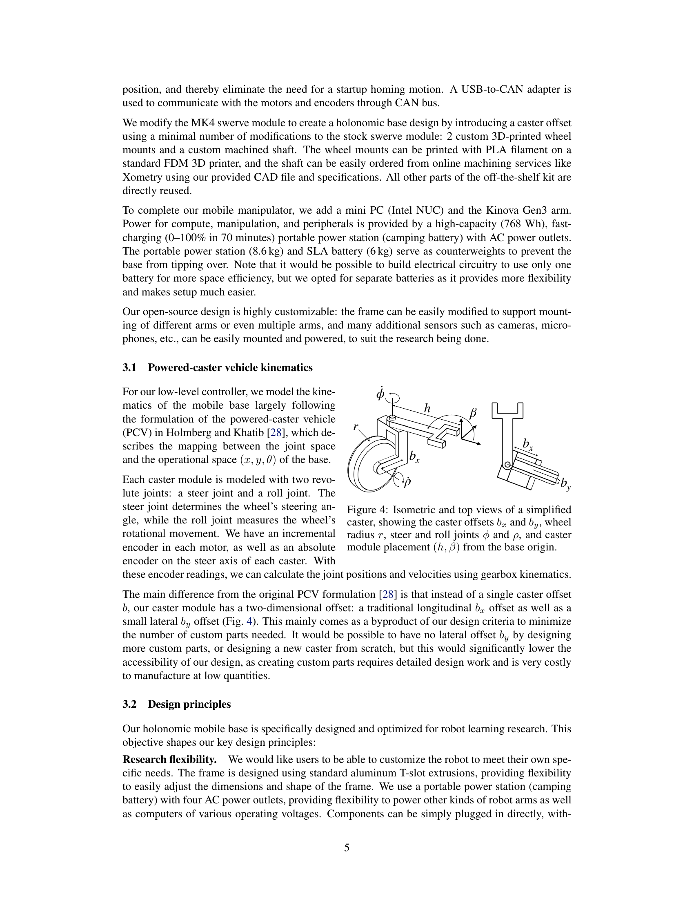
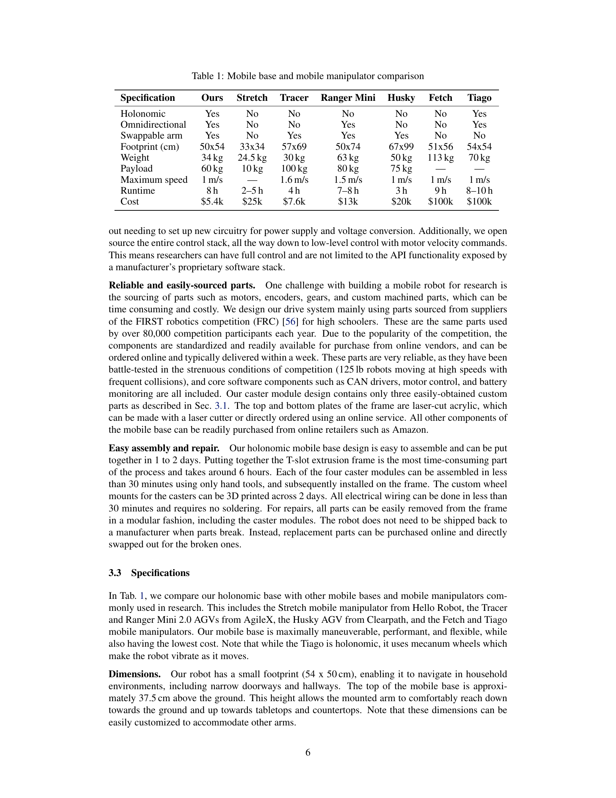
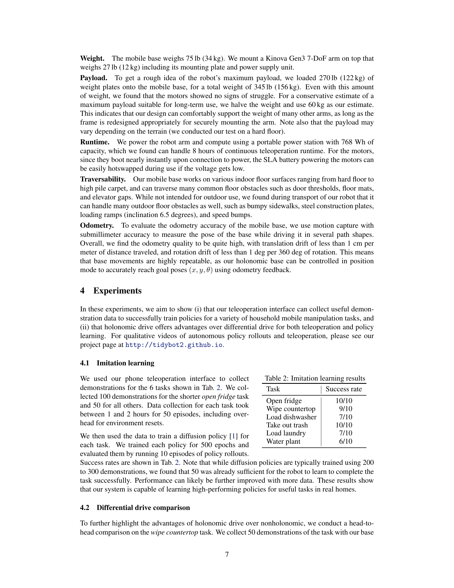
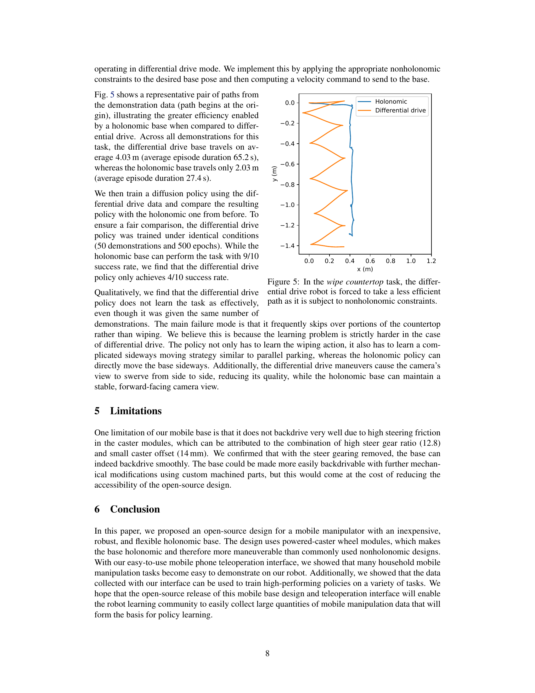
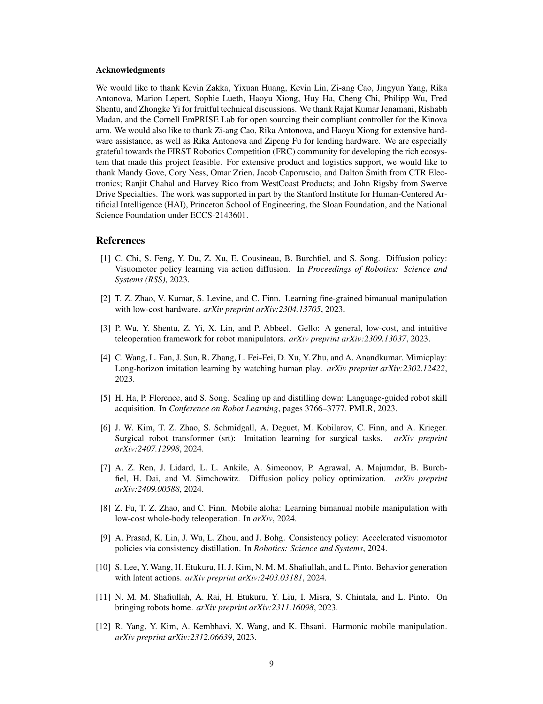
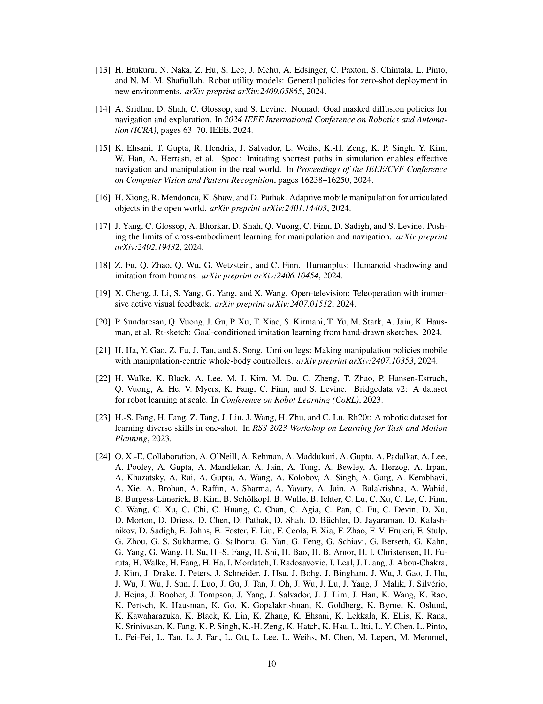
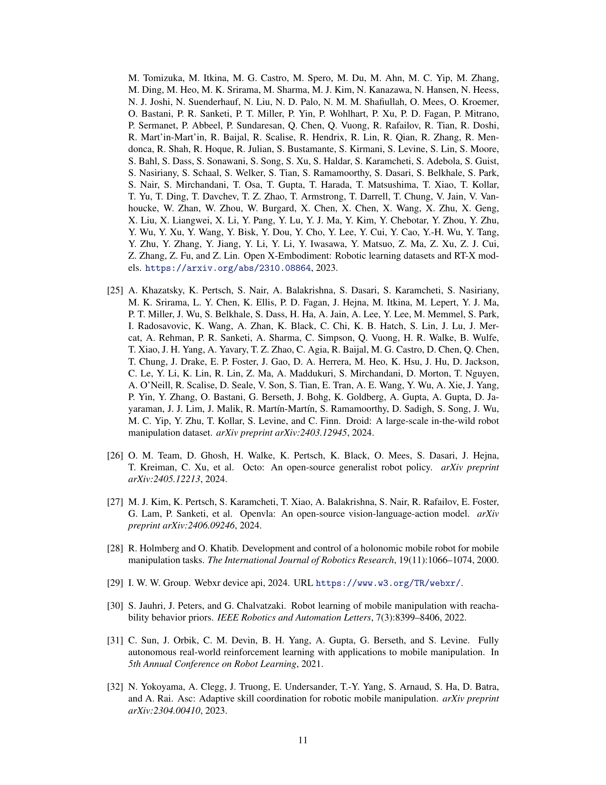
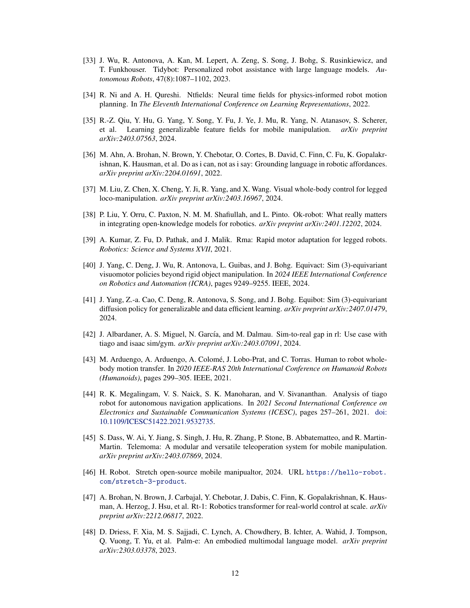
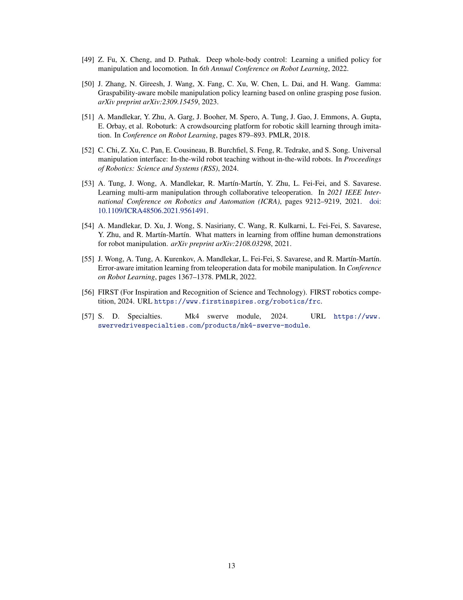
