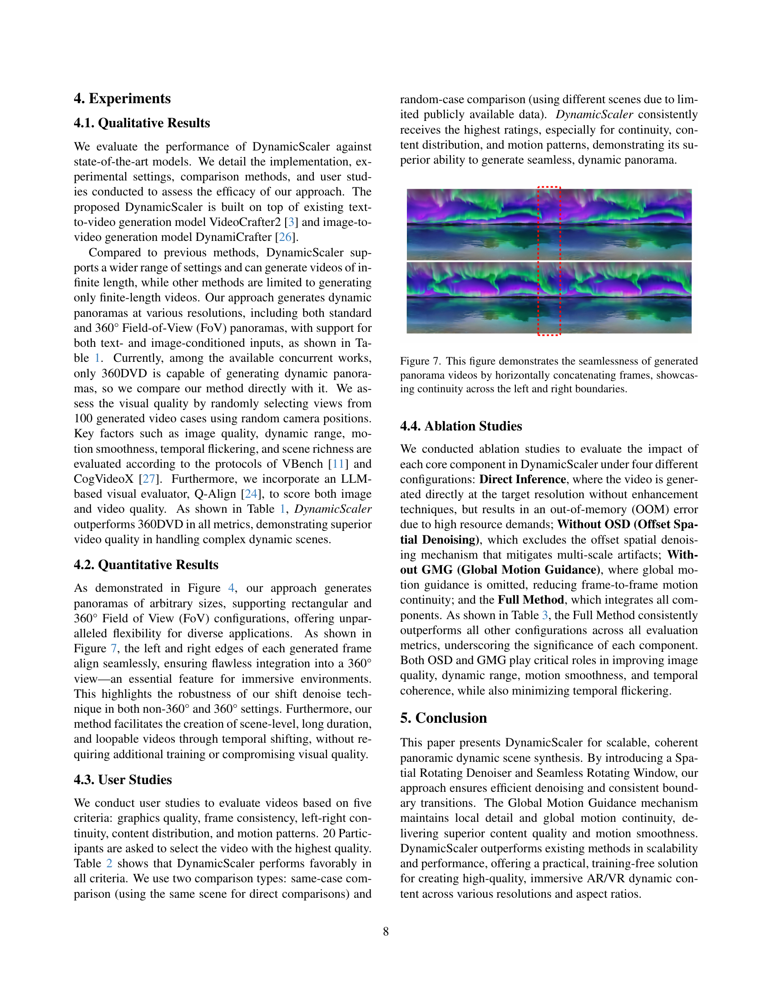

 


 2412.11100 
 Jinxiu Liu et el. 
 
 🤗 2024-12-17 
 



↗ arXiv


↗ Hugging Face


↗ Papers with Code


### TL;DR



몰입형 AR/VR 애플리케이션에 대한 수요 증가는 고품질 파노라마 비디오 생성에 대한 요구를 증가시켰습니다. 그러나 기존 비디오 확산 모델은 해상도와 종횡비가 제한되어 긴 파노라마 비디오 생성에 어려움을 겪습니다. **모션 일관성, 시간적 일관성, 시각적 품질**을 유지하면서 이러한 제약을 해결하는 것이 중요한 과제입니다.

DynamicScaler는 이러한 문제를 해결합니다. **확장 가능한 파노라마 동적 장면 합성을 위한 튜닝이 필요 없는 통합 프레임워크**를 제공합니다. 핵심 구성 요소인 Offset Shifting Denoiser는 전체 장면에서 **동적으로 디노이징 프로세스를 조정하여 원활한 전환과 공간적 일관성을 보장**합니다. Global Motion Guidance는 복잡한 모션 패턴에서 장면 전반의 일관성을 유지합니다. 이 접근 방식은 **긴 파노라마 비디오를 생성할 뿐만 아니라 루프 가능한 동적 장면도 지원하여 몰입형 경험을 향상**시킵니다.



#### Key Takeaways


 DynamicScaler는 텍스트 또는 이미지에서 360° 파노라마 비디오를 포함한 다양한 해상도와 종횡비의 파노라마 비디오를 생성할 수 있는 튜닝이 필요 없는 프레임워크입니다. 



 Offset Shifting Denoiser 및 Global Motion Guidance와 같은 새롭게 도입된 기술은 긴 파노라마 장면에서도 원활한 전환, 공간적 일관성 및 모션 충실도를 보장합니다. 



 DynamicScaler는 기존 방법보다 성능이 뛰어나며 다양한 몰입형 애플리케이션에서 고품질의 연속적이고 루프 가능한 동적 장면을 생성합니다. 


#### Why does it matter?
**파노라마 비디오 생성에서 해상도 및 메모리 제약 문제를 해결하는 데 중요한 단계**입니다. 몰입형 콘텐츠 제작의 새로운 가능성을 열어주고 AR/VR 애플리케이션, 디지털 광고 및 공간 인텔리전스와 같은 분야에 영향을 미칩니다. 이 연구는 효율적인 파노라마 비디오 합성을 위한 새로운 길을 열어 연구자들이 **해상도, 종횡비, 지속 시간, 뷰 필드의 한계를 뛰어넘도록** 합니다.

------
#### Visual Insights

> 🔼 DynamicScaler는 텍스트 또는 이미지와 텍스트를 조건으로 하여 동적 파노라마를 생성하는 프레임워크입니다. 360도 파노라마 뷰뿐만 아니라 임의의 직사각형 파노라마를 생성할 수 있으며, AR/VR 애플리케이션 및 다양한 크기의 디스플레이에 몰입형 시각 경험을 제공합니다. 샘플 이미지는 텍스트 프롬프트, 일반(원근) 동적 파노라마, 입력 이미지, 360도 동적 파노라마(등직사각형 투영으로 표시됨)를 보여줍니다.
> 

> 
read the caption

> Figure 1: We introduce DynamicScaler, a framework for generating dynamic panoramas conditioned on both images and text, or text alone. DynamicScaler enables the creation of arbitrary rectangular panoramas as well as 360° panoramic views, offering immersive visual experiences for AR/VR applications and displays of any size. (Please refer to our project page https://dynamic-scaler.pages.dev/ for better visualization.)
> 


| Source | Tuning-Free | Arbitrary
Size | 360°
Field-of-View | Text Only
Condition | Image
Condition | Video
Length | Loopable |
|---|---|---|---|---|---|---|---|---| 
| 360DVD [23] | × | ✓ | ✓ | ✓ | × | 16 | × |
| 4K4DGen [17] | × | × | ✓ | × | ✓ | 16 | × |
| Scalecrafter [10] | ✓ | ✓ | × | ✓ | × | 16 | × |
| VividDream [14] | × | ✓ | × | × | ✓ | 16 | × |
| DynamicScaler | ✓ | ✓ | ✓ | ✓ | ✓ | Infinite | ✓ |
|  | CLIP-Score ↑ | Image
Quality ↑ | Dynamic
Degree ↑ | Motion
Smoothness ↑ | Temporal
Flickering ↑ | Scene ↑ | Q-Align(I) ↑ | Q-Align(V) ↑ |
| 360DVD [23] | 0.293 | 0.436 | 0.412 | 0.917 | 0.964 | 0.417 | 0.485 | 0.532 |
| DynamicScaler | **0.302** | **0.583** | **0.783** | **0.963** | **0.982** | **0.499** | **0.632** | **0.613** |

> 🔼 이 표는 다양한 동적 장면 생성 방법들을 비교한 정량적 분석 결과를 보여줍니다. 비교 대상은 해상도 확장성, 비디오 길이, 루프 가능성과 같은 주요 기능들을 포함하며, 이미지 품질, 다이내믹 레인지, 모션 부드러움, 깜빡임, 그리고 사용자 중심 Q-Align 점수와 같은 지표를 사용합니다. DynamicScaler는 모든 지표에서 기존 방법보다 우뛰어한 성능을 보입니다.
> 

> 
read the caption

> Table 1:  Quantitative comparison of dynamic scene generation methods, with best results highlighted in bold. The evaluation covers key factors such as resolution scalability, video length, and loopability, using metrics on image quality, dynamic range, motion smoothness, and temporal flickering, and user-centric Q-Align scores. DynamicScaler outperforms existing methods across all these metrics.
> 

### In-depth insights

#### Panoramic Video
**파노라마 비디오**는 AR/VR 및 공간 지능 분야의 수요 증가로 인해 중요성이 커지고 있습니다. DynamicScaler는 이러한 비디오를 생성하기 위한 튜닝 프리 프레임워크를 제시하며, **원활한 공간 및 움직임 일관성**을 보장합니다. 오프셋 시프팅 디노이저(OSD)와 글로벌 모션 가이던스(GMG)를 통해 **다양한 해상도와 화면비, 360도 시야각**에서 고품질 파노라마 비디오를 생성합니다. OSD는 전체 파노라마 비디오를 효율적으로 디노이징하여 매끄러운 경계 전환과 장면 연속성을 보장하고 GMG는 고해상도에서 모션 일관성을 향상시킵니다. 또한, 시간적 이동을 통해 장기간 또는 루프 가능한 동적 장면 합성을 가능하게 합니다. 실험 결과 DynamicScaler는 기존 방법보다 시각적 품질과 모션 일관성 측면에서 우수하며, 몰입형 애플리케이션에 적합한 연속적이고 루프 가능한 동적 장면을 생성합니다.

#### DynamicScaler
**DynamicScaler**는 **확장 가능한 파노라마 다이내믹 장면 합성**을 위한 튜닝 없는 프레임워크입니다. **오프셋 시프팅 디노이저(OSD)**와 **원활한 회전 윈도우**를 통해 효율적인 디노이징과 일관된 경계 전환을 보장합니다. **글로벌 모션 안내(GMG)** 메커니즘은 국부적인 디테일과 전체적인 모션 연속성을 유지하여 우수한 콘텐츠 품질과 모션 부드러움을 제공합니다. DynamicScaler는 **다양한 해상도, 화면비, 360도 시야각 설정**에서 모션 일관성을 보장하며, **긴 영상 생성과 루프 영상 생성**을 지원합니다. 실험 결과, DynamicScaler는 기존 방법보다 확장성과 성능 면에서 우수하며, 몰입형 AR/VR 다이내믹 콘텐츠 제작을 위한 실용적이고 효율적인 솔루션을 제공합니다.

#### Offset Shifting
**오프셋 시프팅**은 파노라마 영상 생성에서 **공간적 확장성**을 가능하게 하는 핵심 기술입니다.  고정된 해상도의 확산 모델을 사용하면서도 **시프팅 윈도우 메커니즘**을 통해 다양한 해상도 및 화면비의 파노라마 영상 생성을 지원합니다. 이 기술은 전체 영상에 걸쳐 **일관된 노이즈 분포**를 유지하면서 **부드러운 전환**과 **공간적 일관성**을 보장합니다. 결과적으로, **몰입형 환경**에 적합한 고품질의 **끊김 없는** 파노라마 영상을 생성할 수 있습니다.

#### Motion Guidance
**움직임 안내**는 동적 장면 합성에서 중요한 역할을 합니다. **일관성**있고 사실적인 애니메이션을 생성하는 데 필수적입니다. 이 논문에서는 **글로벌 움직임 안내** 메커니즘이 **세부적인 부분의 충실도**와 **전역적 움직임의 연속성**을 보장하는 방법을 강조하고 있습니다. **계층적 접근 방식**은 **전반적인 구조**를 유지하면서 **세밀한 로컬 세부 정보**를 제공합니다. 저해상도 생성에서 시작하여 **점진적 업스케일링**을 통해 세부 정보를 구체화합니다. **인과적 글로벌 움직임 안내**를 적용하여 전체 장면 역학을 구성한 다음, 해상도를 높입니다. 이 기술은 특히 폭포와 같은 복잡한 움직임 패턴에 유용하며, 전체 파노라마 영역에서 **협調**가 필요합니다.

#### Scalable Synth
**확장 가능한 합성(Scalable Synth)**은 이미지 및 비디오 생성에서 중요한 개념입니다. 이는 다양한 해상도, 종횡비 및 파노라마 뷰에서 **일관되고 고품질의 콘텐츠**를 생성하는 기능을 의미합니다. 컴퓨팅 리소스와 메모리 효율성을 고려하면서 **다양한 출력 크기**를 처리하는 데 특히 중요합니다. 확장 가능한 합성을 달성하려면 **새로운 기술과 아키텍처**가 필요합니다. 예를 들어 효율적인 노이즈 제거, 일관된 모션 안내, 그리고 메모리 제약을 해결하는 방법이 있습니다. 이러한 기술을 통해 **몰입형 AR/VR 애플리케이션 및 다양한 크기의 디스플레이**에 적합한 동적 장면을 생성할 수 있습니다. 확장 가능한 합성은 이미지 및 비디오 생성 기능의 **새로운 가능성**을 열어주고 광고, 웨어러블 디스플레이, 공간 지능과 같은 분야에 **혁신적인 애플리케이션**을 제공합니다.

### More visual insights

More on figures

> 🔼 이 그림은 DynamicScaler의 파이프라인을 두 단계로 나누어 보여줍니다. 1) 저해상도 단계: უხეში 움직임 구조를 설정합니다. 360도 설정(노란색 블록)에서는 구형 파노라마에 맞는 움직임을 초기화하기 위해 파노라마 투영 디노이징을 사용하고, 일반 원근 설정(파란색 블록)에서는 초기 디노이징 단계에 오프셋 시프팅(겹침 포함)을 사용한 다음 나머지 디노이징 단계에 오프셋 시프팅 디노이징을 사용합니다. 2) 업스케일링 단계(녹색 블록): 저해상도 비디오의 글로벌 모션 안내를 사용하여 더 많은 시프트 윈도우를 활용하여 정제된 고해상도 파노라마를 생성합니다.
> 

> 
read the caption

> Figure 2: Our pipeline is divided into two stages: low-resolution stage establishes a coarse motion structure, 360-degree setting(the yellow block) involves Panoramic Projecting Denoise to initialize motion that fits to spherical panorama, while the regular perspective setting(the blue block) utilizes Offset Shifting with overlap for the early denoise steps, then the remaining denoise steps are completed by our Offset Shifting Denoise. The up-scaling stage(the green block) utilizes more shift windows to produce a refined, high-resolution panorama with Global Motion Guidance from the low-resoltuion video.
> 

> 🔼 이 그림은 Offset Shifting Window 메커니즘을 보여줍니다. 이 메커니즘은 임의의 가로 세로 비율과 해상도를 가진 파노라마 비디오 잠재 공간 전체를 디노이징하기 위해 디노이징 윈도우를 디노이징 단계마다 수직 및 수평으로 이동시키는 방식입니다. 일반적으로 모든 디노이징 윈도우는 매 단계마다 수직 및 수평으로 이동하며, 공간 경계를 넘어가는 윈도우를 처리하는 다양한 방법이 있습니다. 이 그림은 수직 및 수평 오프셋 이동, 창 경계를 넘어가는 윈도우 처리를 위한 패딩 및 루핑 영역을 보여줍니다.
> 

> 
read the caption

> Figure 3:  The purposed Offset Shifting Window mechanism, which involves shifting denoising windows both vertically and horizontally between denoise steps to denoise the whole panorama video latent with arbitrary aspect ratio an resolution. Generally, all denosing windows are shifted vertically and horizontally every step, with different ways to handle the windows that cross the spatial boundary.
> 

> 🔼 이 그림은 DynamicScaler 모델의 확장성을 다양한 해상도(360도 파노라마 및 직사각형 파노라마 설정 포함)와 텍스트 및 이미지 조건 생성 모두에서 보여줍니다. 텍스트를 조건으로 사용한 파노라마 비디오 생성 예시와 이미지를 조건으로 사용한 파노라마 비디오 생성 예시를 각각 보여줍니다. 결과에서 모델이 다양한 조건과 설정에서 파노라마 비디오를 생성할 수 있음을 알 수 있습니다.
> 

> 
read the caption

> Figure 4: Results showcasing the scalability of our model across various resolutions, including 360° and rectangular panorama settings as well as both text conditioned and image conditioned generation. For more results please refer to our project page.
> 

> 🔼 이 그림은 360도 파노라마 비디오를 디노이징하는 Panoramic Projecting Denoise 방법을 보여줍니다. 먼저, 구형 파노라마 비디오(equirectangular projection으로 표현됨)를 원근 투영창으로 투영합니다. 그런 다음, 투영된 원근 뷰에서 디노이징을 수행하고, 마지막으로 디노이징된 결과를 다시 equirectangular 형식으로 재투영합니다. 이 방법을 통해 일반적인(원근) 뷰 데이터셋으로 학습된 확산 모델을 사용하여 360도 파노라마 비디오를 디노이징할 수 있습니다.
> 

> 
read the caption

> Figure 5: The purposed Panoramic Projecting Denoise, where spherical panorama videos (represented as equirectangular projections) are denoised by projecting them into perspective view windows, followed by re-projection back to the equirectangular format, which allowed denoising 360 degree panoramic video with diffusion models trained in regular (perspective) views dataset.
> 

> 🔼 이 그림은 파노라마 비디오의 여러 프레임을 보여주며, 비디오 길이가 길어짐에도 불구하고 영상 품질이 일관되게 유지됨을 보여줍니다. 0번째, 16번째, 32번째, 48번째, 64번째, 80번째 프레임이 표시되어 있습니다. 이는 장시간 비디오 생성에 있어 DynamicScaler의 효과를 입증합니다.
> 

> 
read the caption

> Figure 6: Example frames from a panorama video at the 0th, 16th, 32th, 48th, 64th and 80th frames. Despite the increasing video length, the visual quality of the panorama remains consistent, demonstrating the effectiveness of our method in generating long videos.
> 

More on tables


| Methods | Graphics Quality &uarr; | Frame Consistency &uarr; | End Continuity &uarr; | Motion Pattern &uarr; | Scene Richness &uarr; |
|---|---|---|---|---|---|
| **Same Case Comparison** | | | | | |
| 360DVD [23] | 3.3 | 3.5 | 3.6 | 3.7 | 3.5 |
| Ours | **4.6** | **4.7** | **4.8** | **4.5** | **4.6** |
| **Random Case Comparison** | | | | | |
| 360DVD [23] | 3.3 | 3.4 | 3.6 | 3.9 | 3.4 |
| 4K4DGen [17] | **4.5** | 3.6 | 4.3 | 3.6 | 4.3 |
| Scalecrafter [10] | 3.5 | 3.7 | 1.9 | 4.4 | 3.6 |
| VividDream [14] | 3.6 | 3.7 | 3.8 | 3.6 | 4.1 |
| Ours | 4.3 | **3.9** | **4.5** | **4.5** | **4.4** |
> 🔼 사용자 선호도 연구 결과를 보여주는 표입니다. '동일 사례 비교'는 동일한 장면을 사용한 비교를, '무작위 사례 비교'는 일부 방법의 데이터 부족으로 인해 다른 장면을 사용한 비교를 나타냅니다. 평점은 1(최저)에서 5(최고)까지입니다. 표에서 DynamicScaler가 모든 기준에서 다른 방법들보다 우수한 성능을 보이는 것을 확인할 수 있습니다.
> 

> 
read the caption

> Table 2: User preference study results. Same Case Comparison refers to using the same case for comparison, while Random Case Comparison refers to using different cases due to the unavailability of some methods. Ratings range from 1 (lowest) to 5 (highest).
> 


|                      | Image Quality &uarr; | Dynamic Degree &uarr; | Motion Smoothness &uarr; | Temporal Flickering &uarr; | Q-Align(V) &uarr; |
|----------------------|----------------------|-----------------------|-------------------------|--------------------------|------------------|
| Direct Inference | OOM                  | OOM                   | OOM                     | OOM                      | OOM              |
| w/o OSD            | 0.564                | 0.749                 | 0.948                   | 0.905                    | 0.595            |
| w/o GMG            | 0.571                | 0.765                 | 0.961                   | 0.946                    | 0.598            |
| Full Method         | **0.587**            | **0.778**             | **0.967**               | **0.985**                | **0.616**        |
> 🔼 이 표는 이미지 품질, 다이내믹 정도, 모션 부드러움, 시간적 깜빡임과 같은 다양한 구성의 성능 비교를 보여줍니다. Direct Inference, w/o OSD, w/o GMG, Full Method 등 4가지 구성을 비교하고 있습니다. Direct Inference는 메모리 부족(OOM)으로 인해 결과를 생성하지 못했고, 다른 세 가지 구성은 Full Method가 모든 면에서 가장 좋은 성능을 보여줍니다.
> 

> 
read the caption

> Table 3:  Performance comparison of different configurations regarding image quality, dynamic degree, motion smoothness, and temporal flickering. OOM stands for Out-of-Memory.
> 

### Full paper



