 


 2412.11279 
 Hao Shao et el. 
 
 🤗 2024-12-17 
 



↗ arXiv


↗ Hugging Face


↗ Papers with Code


### TL;DR



**비디오 얼굴 바꾸기**는 콘텐츠 제작, 개인 정보 보호, 디지털 트윈 생성 등 다양한 분야에서 중요한 기술로 부상했습니다. 그러나 기존 방법들은 **시간적 일관성 유지, 큰 포즈 변화 처리, 폐색 해결**과 같은 비디오 맥락의 어려움으로 인해 어려움을 겪었습니다. 대부분의 기존 방법이 정적 이미지에 최 optimized 되어 있어 비디오에서 직접 적용하면 **일시적인 왜곡 및 깜빡임, ID 보존 부족**과 같은 문제가 발생합니다.

**VividFace**는 **확산 기반 프레임워크**와 **이미지-비디오 하이브리드 학습 전략**을 활용하여 비디오 얼굴 바꾸기의 문제를 해결합니다. **VidFaceVAE**를 사용하여 **정적 이미지 및 시간적 비디오 데이터를 모두 처리**하고 **시간적 일관성**을 효과적으로 유지합니다. **속성-ID 분리 트리플렛(AIDT)** 데이터셋은 **ID 및 포즈 특징을 분리**하도록 설계되었으며, **3D 재구성** 기술은 입력 조건으로 통합되어 **큰 포즈 변화**를 처리합니다. 또한 제안된 **폐색 데이터 augmentation**은 생성된 비디오의 안정성과 일관성을 향상시킵니다.



#### Key Takeaways


 VividFace는 이미지와 비디오 데이터 모두에서 학습된 최초의 확산 기반 비디오 얼굴 바꾸기 프레임워크입니다. 



 새로운 AIDT 데이터셋과 3D 얼굴 재구성 기법을 사용하여 얼굴 바꾸기의 시간적 일관성, ID 보존 및 시각적 품질을 향상시킵니다. 



 VividFace는 기존 방법보다 성능이 뛰어나고 추론 단계가 더 적습니다. 


#### Why does it matter?
**VividFace**는 비디오 얼굴 바꾸기 연구에 상당한 발전을 가져옵니다. **이미지-비디오 하이브리드 학습 전략**은 **시간적 일관성 문제**를 해결하고, **고품질** 결과를 산출하는 데 효과적임을 입증했습니다. 이 연구는 **확산 기반 비디오 얼굴 바꾸기**에 대한 새로운 길을 열어, **현실감**, **안정성** 및 **제어 가능성**을 향상시키는 추가 연구를 위한 길을 닦았습니다.

------
#### Visual Insights

> 🔼 VividFace의 512x512 해상도 얼굴 바꾸기 결과. 제시된 예시에서 VividFace는 원본 얼굴의 포즈와 표정 변화를 정확하게 따르는 고품질의 생생한 결과물을 생성합니다. 첫 번째 행과 두 번째 행은 각각 여성과 남성의 얼굴 바꾸기 결과를 보여주며, VividFace가 다양한 성별의 얼굴에 대해서도 효과적으로 작동함을 보여줍니다. 또한, 다양한 포즈와 표정 변화에도 불구하고 일관된 결과를 생성하는 것을 확인할 수 있습니다.
> 

> 
read the caption

> Figure 1: Face swapping results of VividFace  at 512×512512512512\times 512512 × 512 resolution. Our method produces high-fidelity and vivid outputs that accurately follow both pose and expression changes.
> 


| Method | FVD32↓ | FVD128↓ | ID retrieval ↑ | | Pose↓ | Expr.↓ |
|---|---|---|---|---|---|---| 
| SimSwap [9] | **1242.8** | **186.6** | **76.5** | **88.5** | **5.12** | 0.76 |
| FSGAN [32] | 1507.9 | 423.8 | 24.5 | 40.0 | **5.19** | **0.73** |
| DiffFace [23] | 2404.7 | 1404.9 | 1.5 | 4.1 | 18.3 | 1.58 |
| DiffSwap [49] | 1530.2 | 809.3 | 14.5 | 26.3 | 12.9 | 1.02 |
| REFace [1] | 1336.9 | 311.9 | 71.9 | 86.5 | 6.67 | 0.91 |
| **VividFace** | **1201.1** | **122.6** | **78.3** | **90.2** | 5.43 | **0.72** |

> 🔼 이 표는 다양한 비디오 얼굴 바꾸기 방법들의 정성적 비교 결과를 보여줍니다. FVD, ID 검색, 포즈 오류, 표현 오류와 같은 척도를 사용하여 VividFace를 SimSwap, FSGAN, DiffFace, DiffSwap, REFace와 같은 기존 방법들과 비교합니다. VividFace는 ID 검색과 FVD 측면에서 다른 방법들보다 우수하고, 포즈와 표현 측면에서도 경쟁력 있는 성능을 보입니다.
> 

> 
read the caption

> Table 1: Qualitative Comparison. Best is in bold and second best is underlined. our method achieves very competitive results compared with existing methods.
> 

### In-depth insights

#### Diffusion Video Swap
**Diffusion Video Swap**은 영상 내 얼굴 교체 기술을 한 단계 발전시킬 잠재력을 지닌 흥미로운 연구 분야입니다.  기존 GAN 기반 방식의 불안정성을 극복하고, **고품질**의 **자연스러운** 결과물을 생성할 수 있다는 점이 가장 큰 장점입니다.  하지만 아직 **시간적 일관성 유지**, **큰 포즈 변화 처리**, **가려짐 문제 해결** 등 몇 가지 핵심 과제가 남아있습니다.  이러한 문제들을 해결하기 위해 이미지와 영상 데이터를 함께 학습하는 hybrid 방식, 3D 얼굴 재구성 기술 접목, 새로운 데이터셋 구축 등 다양한 연구가 진행 중입니다.  Diffusion Video Swap은 향후 더욱 발전하여 엔터테인먼트, 가상현실, 의료 등 다양한 분야에 활용될 것으로 기대됩니다. 특히, **개인정보 보호** 측면에서 악용될 가능성도 있으므로 윤리적인 측면에 대한 고려도 병행되어야 할 것입니다.

#### Hybrid Training
**하이브리드 학습**은 이미지와 비디오 데이터를 결합하여 비디오 페이스 스와핑 모델을 학습시키는 **새로운 전략**입니다.  기존 비디오 기반 학습의 한계인 데이터 다양성 부족을 극복하고 **시간적 일관성**과 **고품질** 출력을 달성합니다.  이 접근법은 풍부한 정적 이미지 데이터를 활용하여 훈련 샘플의 다양성을 높이고, 비디오 시퀀스를 통해 시간적 역학을 학습합니다. 결과적으로 **안정적인** 페이스 스와핑이 가능하며, 깜빡임, 왜곡 현상 및 정체성 손실과 같은 문제를 **최소화**합니다.

#### 3D Pose Guidance
**3D 포즈 가이던스**는 비디오 얼굴 스와핑에서 중요한 역할을 합니다. 얼굴의 3D 모델을 사용하여 대상 얼굴의 포즈와 표정을 정확하게 캡처하여 **사실적인 결과**를 생성합니다. 이 기술은 **큰 포즈 변화**가 있는 어려운 상황에서도 효과적이며 **왜곡이나 아티팩트 없이 부드러운 전환**을 보장합니다. 3D 포즈 가이던스를 사용하면 **일관성과 품질**을 유지하면서 **다양한 각도와 표정**으로 얼굴을 스와핑할 수 있습니다. 이는 **현실감 있고 몰입도 높은 비디오**를 제작하려는 경우 특히 유용합니다. 또한 3D 포즈 가이던스는 **얼굴 스와핑 프로세스의 효율성을 향상**시켜 **후처리 작업**의 필요성을 줄입니다.

#### AIDT Dataset
**AIDT 데이터셋**은 VividFace의 핵심으로, 얼굴 교체 성능 향상에 중요한 역할을 합니다. 이 데이터셋은 소스 얼굴, 타겟 얼굴, GAN 생성 디커플링 얼굴의 세 이미지로 구성된 트리플렛 데이터로 이루어져 있습니다. 소스와 타겟 얼굴은 동일 인물이지만 포즈와 표정이 다르며, 디커플링 얼굴은 타겟 얼굴과 포즈와 표정은 같지만 다른 인물입니다.  이러한 구성을 통해 얼굴 인코더가 **ID, 텍스처, 속성** 특징을 분리하고 융합하는 능력을 향상시킵니다. 결과적으로, VividFace는 소스와 타겟이 다른 사람일 경우에도 일반화 성능을 향상시켜 **고품질**의 얼굴 교체 결과를 생성합니다.

#### Occlusion Robustness
**얼굴 가림(occlusion)에 대한 강건성**은 얼굴 변환(face swapping)에서 중요한 문제입니다. 가려진 얼굴은 신원 확인 및 표정 인식을 어렵게 만들어, **변환된 얼굴의 사실성과 일관성을 떨어뜨립니다**.  VividFace와 같은 **확산 기반 프레임워크**는 학습 중 다양한 가림을 적용하여 이 문제를 해결하려고 시도합니다. 이러한 **증강 기법(augmentation)**을 통해 모델은 가려진 얼굴에서도 **핵심적인 얼굴 특징을 학습**하여 더욱 강건한 변환 결과를 생성할 수 있게 됩니다. 하지만 **완벽한 가림 처리는 여전히 어려운 과제**이며, 다양한 가림 유형과 정도에 따른 추가 연구가 필요합니다. 특히, **실제 비디오에서 발생하는 복잡한 가림 상황**을 다루기 위한 연구는 더욱 중요해질 것입니다.

### More visual insights

More on figures

> 🔼 VividFace 프레임워크는 이미지-비디오 하이브리드 학습 전략을 사용하여 비디오 얼굴 교체를 수행합니다. 학습 중 프레임워크는 정적 이미지 또는 비디오 시퀀스를 무작위로 선택합니다. 생성 프로세스를 안내하기 위해 노이즈 $z_t$ 외에도 세 가지 유형의 입력이 통합됩니다. (1) 얼굴 이미지 생성을 제어하는 얼굴 영역 마스크, (2) 특히 큰 포즈 변화의 경우 포즈 및 표정을 안내하는 데 도움이 되는 3D 재구성된 얼굴, (3) 배경 정보를 제공하는 마스크된 소스 이미지. 이러한 입력은 Backbone Network를 통해 처리되어 denoising 작업을 수행합니다. Backbone Network 내에서 교차 주의 및 시간적 주의 메커니즘을 사용합니다. 시간적 주의 모듈은 프레임 전체에서 시간적 연속성과 일관성을 보장합니다. 얼굴 인코더는 대상 얼굴에서 ID 및 텍스처 특징을 추출하고 소스 얼굴에서 포즈 및 표정 세부 정보를 추출하여 교차 주의에 사용하여 사실적이고 충실도 높은 결과를 생성합니다.
> 

> 
read the caption

> Figure 2: Overview of the proposed framework. During training, our framework randomly chooses static images or video sequences as the training data. In addition to the noise ztsubscript𝑧𝑡z_{t}italic_z start_POSTSUBSCRIPT italic_t end_POSTSUBSCRIPT, three other types of inputs are integrated to guide the generation process: (1) a face region mask, which controls the generation of facial imagery; (2) a 3D reconstructed face, which helps guide the pose and expression, especially in cases of large pose variations; and (3) masked source images, which supply background information. These inputs are processed through the Backbone Network, which performs the denoising operation. Within the Backbone Network, we employ cross-attention and temporal attention mechanisms. The temporal attention module ensures temporal continuity and consistency across frames. Our face encoder extracts identity and texture features from the target face, as well as pose and expression details from the source face, and uses these features in cross-attention to produce realistic and high-fidelity results.
> 

> 🔼 제안된 VidFaceVAE의 개요는 이미지와 비디오 데이터 모두의 동시 인코딩 및 디코딩이 가능합니다. 특정 모듈은 비디오 입력용으로 특별히 설계되었으며 이미지 입력은 필요에 따라 이러한 모듈을 우회합니다. VidFaceVAE는 (2+1)D 블록으로 구성되어 2D 공간 및 1D 시간적 컨볼루션을 결합하여 의사 3D 연산자를 형성합니다. 이미지 입력의 경우 STFM(Spatial Temporal Fusion Module)은 2D ResBlock의 결과를 직접 출력하여 Temporal ResBlock을 우회합니다. 비디오 입력의 경우 STFM은 학습 가능한 계수 β를 사용하여 2D 및 시간 블록의 출력을 결합합니다. 시간적 다운샘플링 모듈은 이미지 데이터를 처리해야 하므로 VAE 프레임워크에 포함되지 않습니다. VidFaceVAE는 두 가지 주요 이점이 있는 (2+1)D 구조를 사용합니다. (1) 공간 및 시간 컨볼루션을 분리하여 전체 3D 컨볼루션보다 계산 비용을 줄입니다. (2) 사전 훈련된 2D VAE 매개변수와 SD 사전 훈련된 가중치를 재사용하여 수렴 속도를 높이고 최종 성능을 향상시킵니다. OD-VAE와 달리 시간 모듈은 이미지에서 건너뛰고 백본 네트워크는 변환기를 기반으로 하지 않으므로 3D-Causal-CNN을 사용하지 않습니다. 인과 컨볼루션은 모델 용량을 제한하며 인과 컨볼루션을 사용하여 정적 이미지를 처리해도 비디오와 이미지 모두의 성능이 향상되지 않습니다.
> 

> 
read the caption

> Figure 3: Overview of the proposed VidFaceVAE, capable of simultaneous encoding and decoding of both image and video data. Certain modules are specifically designed for video inputs, and image inputs bypass these modules as needed.
> 

> 🔼 Figure 4는 VividFace의 폐색 데이터 증강 기법을 시각화하여 보여줍니다. 이 기법은 생성된 비디오의 안정성과 일관성을 향상시키는 데 사용됩니다. Figure 4는 원본 비디오 프레임과 폐색 데이터 증강 기법이 적용된 프레임을 비교하여 보여줍니다. 폐색 데이터 증강 기법은 다양한 종류의 폐색 객체(예: 장난감, 손 등)를 추가하고 시간적 패턴을 동적으로 변화시켜 대상 이미지의 얼굴을 부분적으로 가립니다. 이를 통해 모델은 가려짐, 큰 포즈 변화, 조명 변화 등 실제 비디오에서 발생할 수 있는 다양한 어려운 상황에 대한 견고성을 높일 수 있습니다. 결과적으로, VividFace는 시간적 왜곡, 깜빡임, 얼굴 왜곡과 같은 문제를 효과적으로 완화하고 고품질의 비디오 얼굴 스왑 결과를 생성할 수 있습니다.
> 

> 
read the caption

> Figure 4: Visualization of our occlusion data augmentation, which improves the stability and consistency of the generated videos.
> 

> 🔼 AIDT 데이터셋은 소스 얼굴, 타겟 얼굴, GAN 생성 디커플링 얼굴의 세 가지 얼굴 이미지로 구성된 트리플렛 데이터입니다. 소스와 타겟 얼굴은 동일 인물이지만 포즈와 표정이 다릅니다. GAN 생성 디커플링 얼굴은 타겟 얼굴과 포즈와 표정은 같지만 다른 사람의 얼굴입니다. 이러한 구성을 통해 얼굴 교환 모델이 ID 특징과 포즈 특징을 분리하여 학습하고, 소스와 타겟이 다른 사람일 때의 일반화 성능을 향상시킵니다. 그림에서 비디오 데이터의 경우, 같은 비디오 클립 내의 다른 프레임에서 소스 얼굴을 얻을 수 있기 때문에 타겟 얼굴과 디커플링 얼굴만 표시됩니다.
> 

> 
read the caption

> Figure 5: Visualization of our AIDT dataset. For video facial data, we present only the target and decoupling faces, as the source faces can be derived from any other frame within the same video clip.
> 

> 🔼 Figure 6은 VividFace가 생성한 얼굴 교체 결과를 다른 방법들과 512x512 해상도에서 비교한 것입니다. (a)와 (d)는 일반적인 상황에서, (b)는 큰 포즈 변화가 있는 경우, (c)는 얼굴의 일부가 가려진 경우의 결과를 보여줍니다. VividFace는 다른 방법들에 비해 높은 품질의 결과를 생성하고, 큰 포즈 변화나 가려짐과 같은 어려운 상황에서도 안정적으로 얼굴 교체를 수행합니다. 추가적으로, 보충 자료에 해당하는 비디오들이 제공됩니다.
> 

> 
read the caption

> Figure 6: Qualitative comparison at 512×512512512512\times 512512 × 512 resolution. Our method generates high-fidelity results and handles challenging cases effectively, such as large poses (b) and occlusions (c). Corresponding videos are provided in the supplementary material.It is best viewed at a larger scale for optimal evaluation.
> 

> 🔼 이 그림은 얼굴 교체 프레임워크에서 텍스처 가중치와 속성 가중치의 다양한 조합에 대한 ablation study 결과를 보여줍니다. 텍스처 가중치가 증가함에 따라 ID 유사성이 향상되는 것을 관찰할 수 있지만, 너무 높게 설정하면 대상의 속성(포즈 및 표정) 보존이 손실됩니다. 반대로 속성 가중치가 증가하면 대상의 속성이 더 잘 보존되지만 ID 유사성은 감소합니다.
> 

> 
read the caption

> Figure 7: Ablation on the different combinations of texture weights and attribute weights.
> 

### Full paper


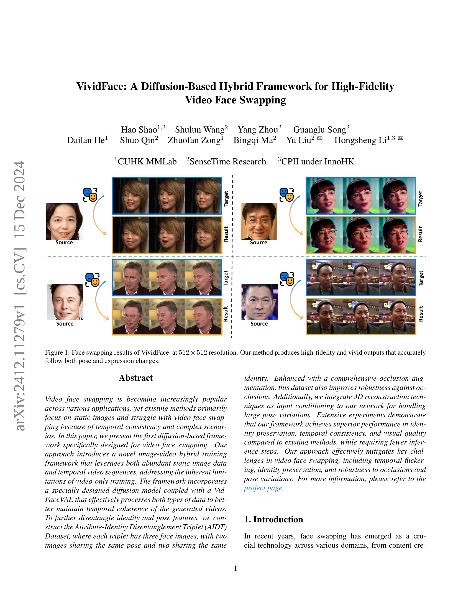
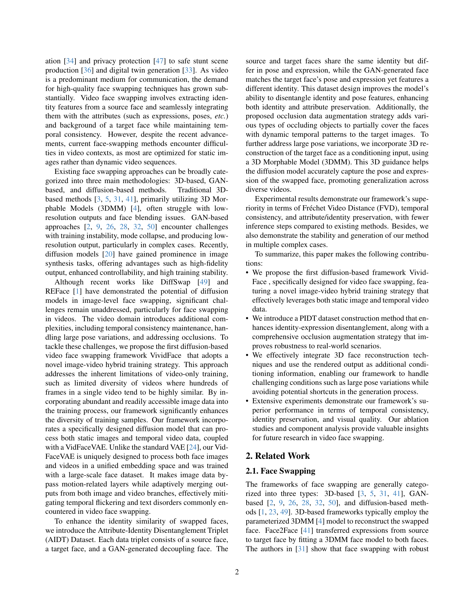
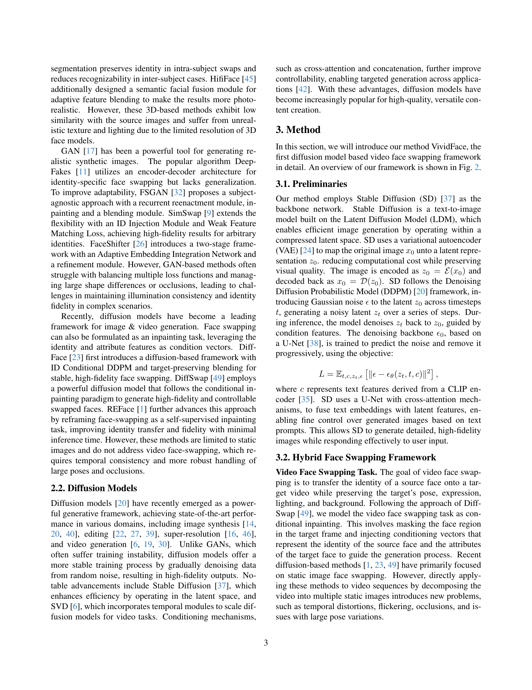
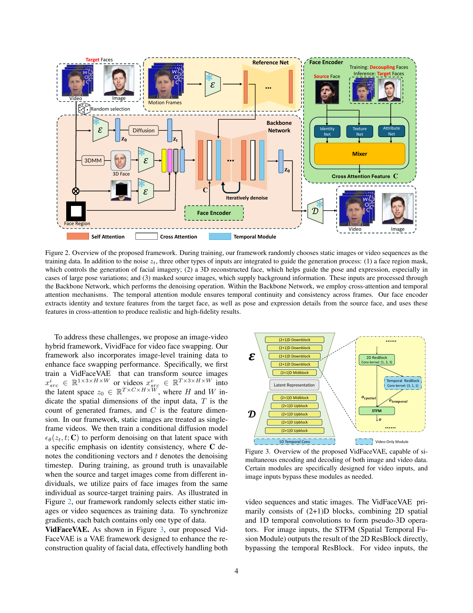
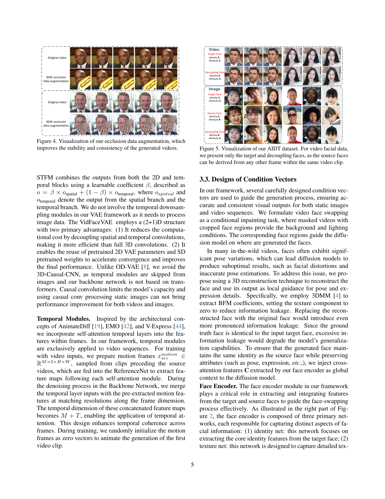
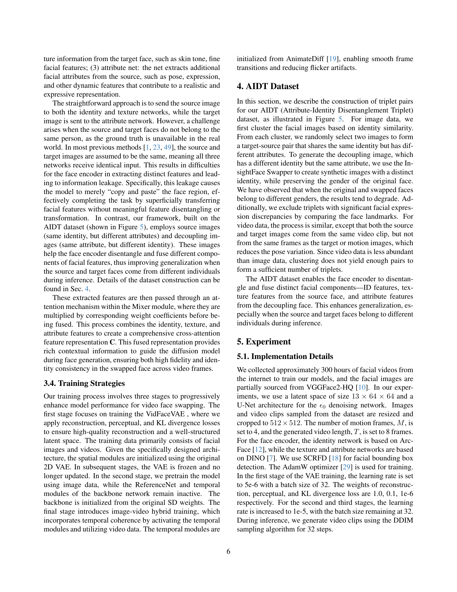
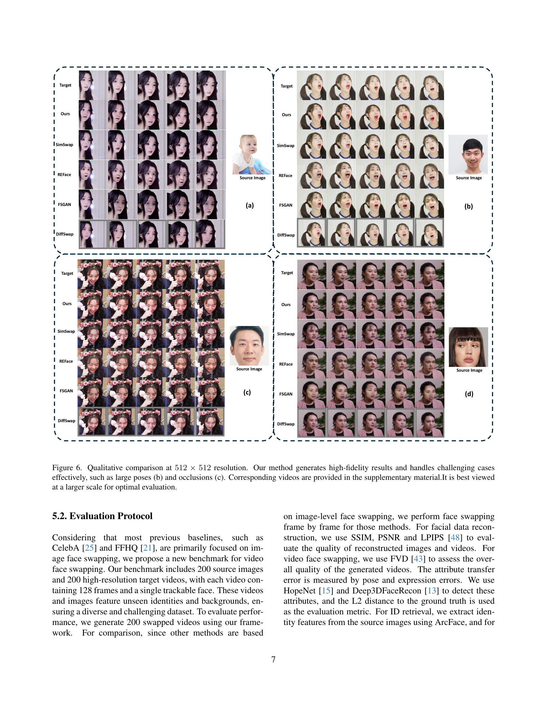
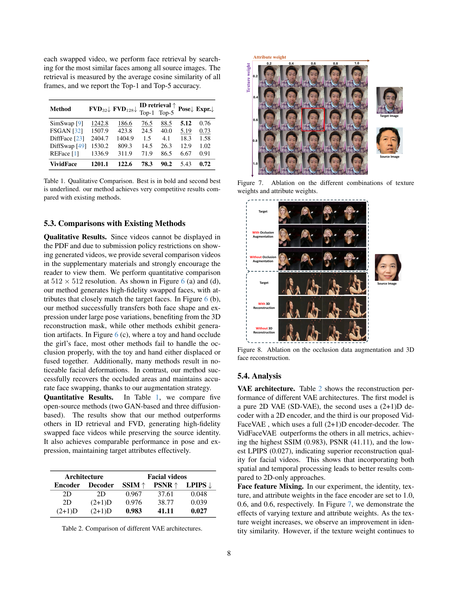
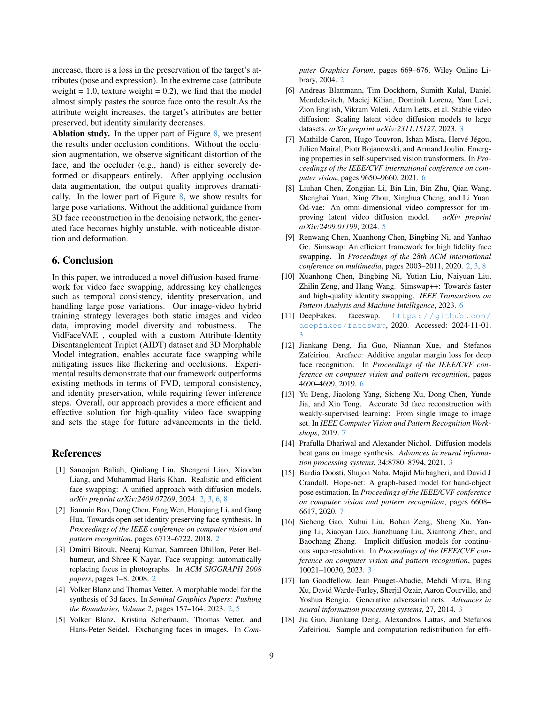
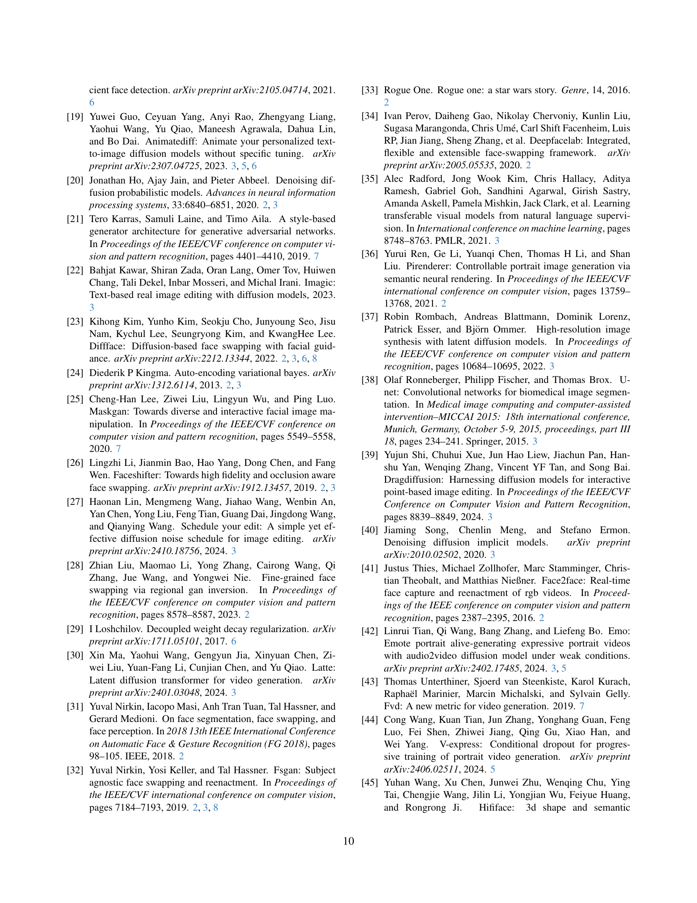
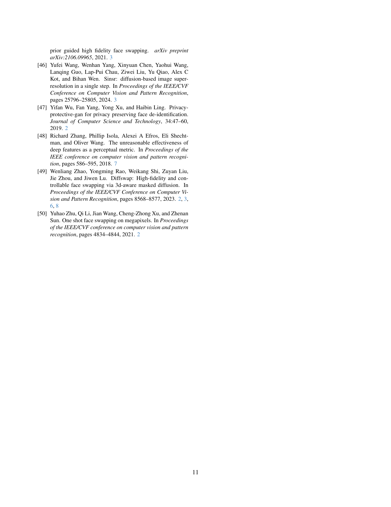
