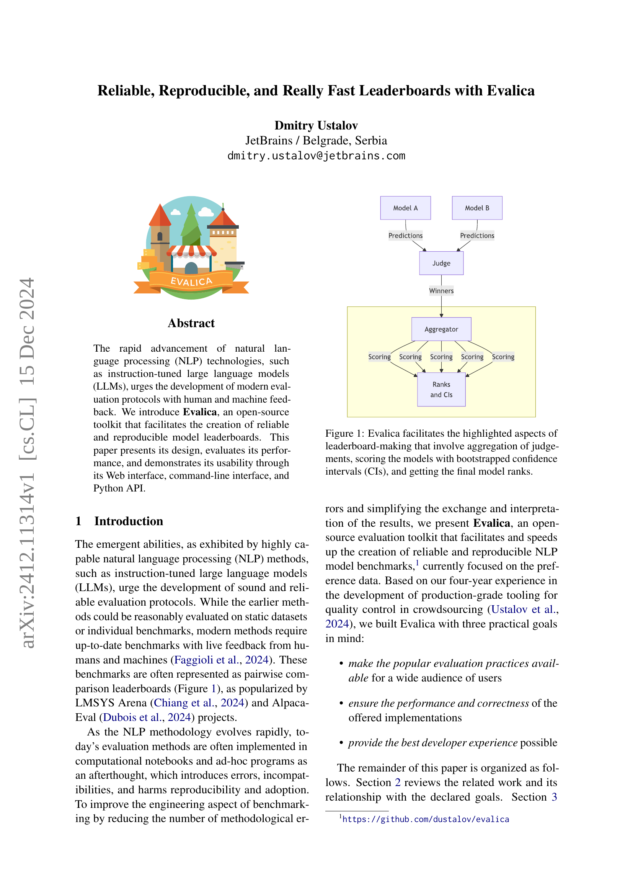
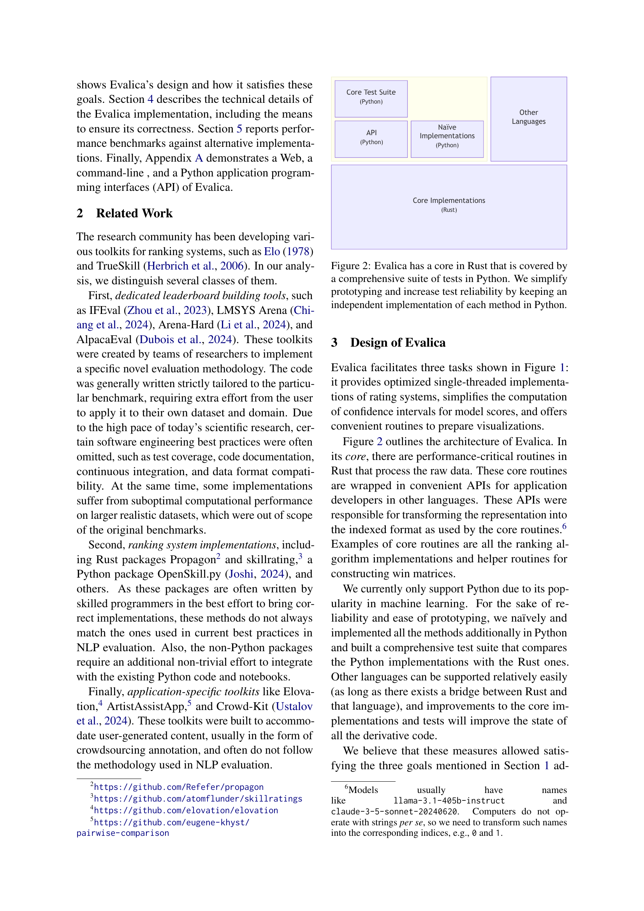
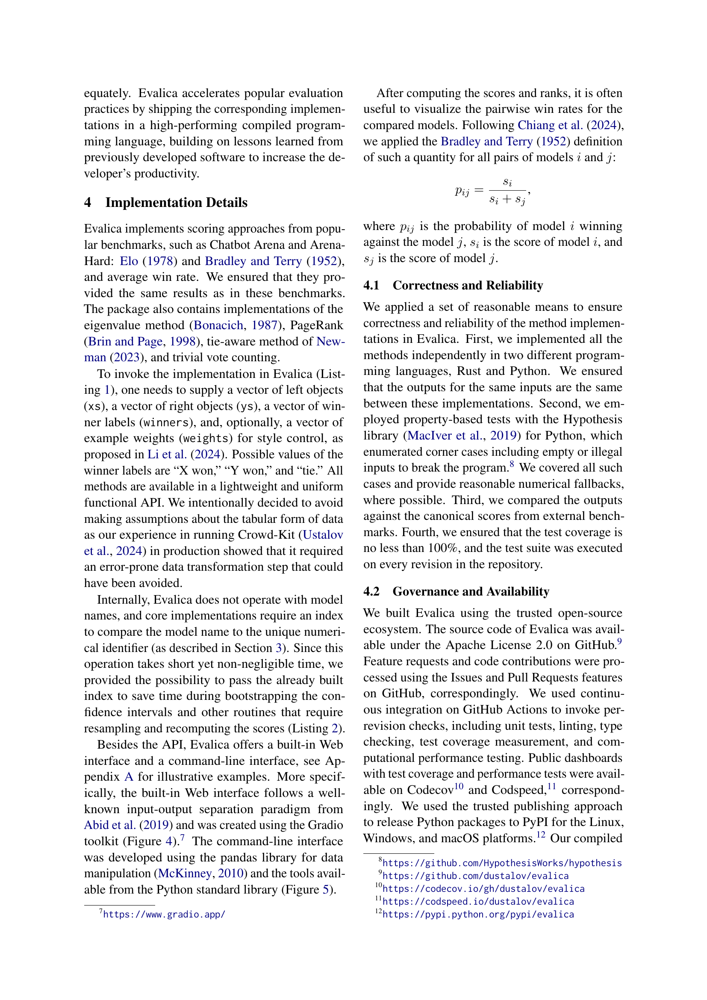
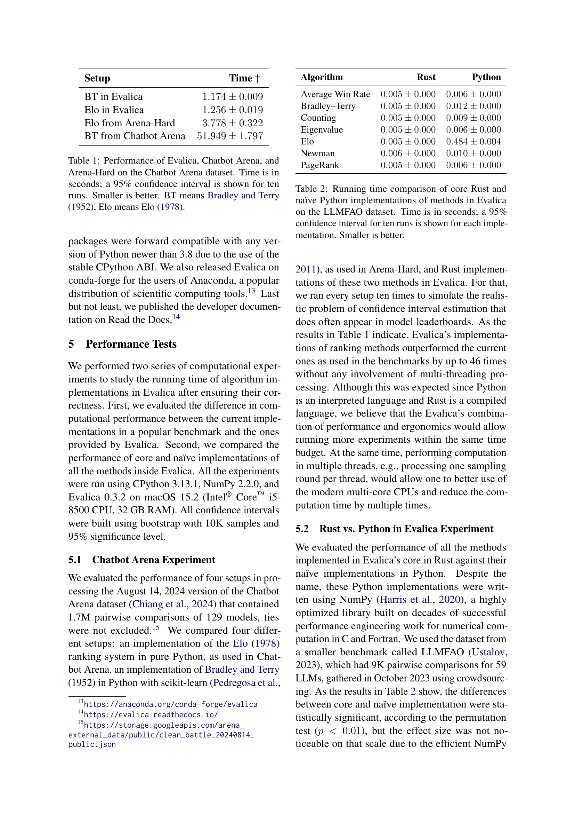
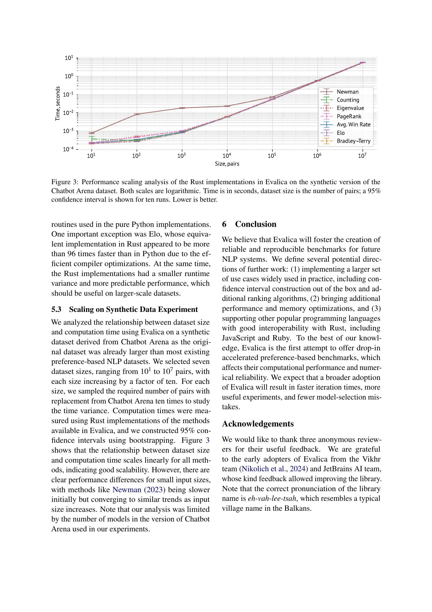
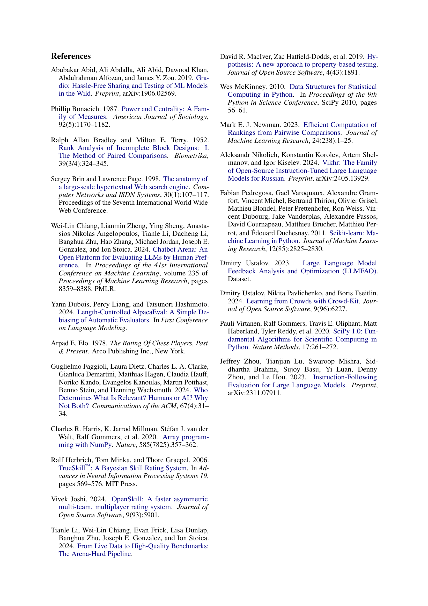
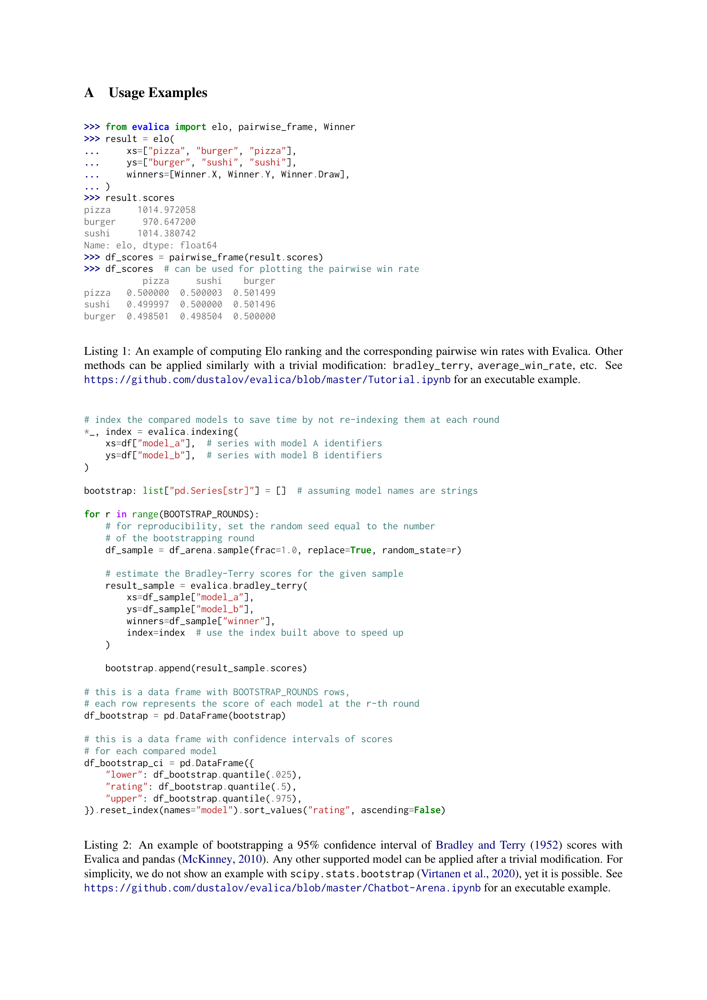
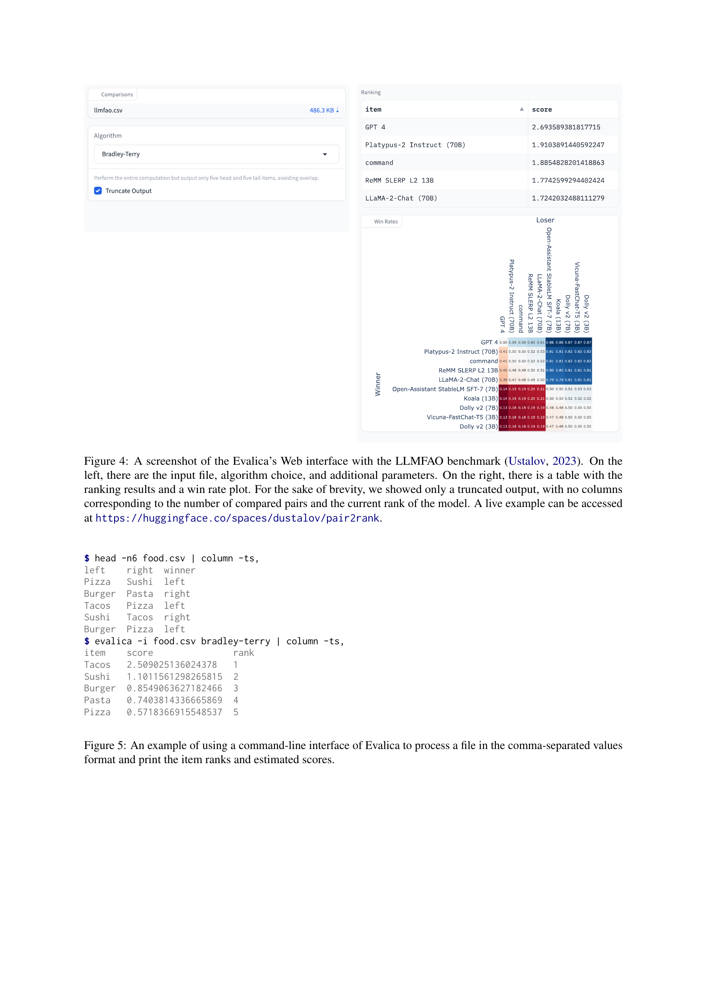

 


 2412.11314 
 Dmitry Ustalov et el. 
 
 🤗 2024-12-17 
 



↗ arXiv


↗ Hugging Face


↗ Papers with Code


### TL;DR



최근 대규모 언어 모델(LLM)과 같이 빠르게 발전하는 자연어 처리(NLP) 기술은 사람과 기계의 피드백을 통한 **현대적인 평가 프로토콜 개발의 필요성을 증가**시키고 있습니다. 기존의 정적 데이터셋이나 개별 벤치마크 기반 평가 방식은 최근 방식에 적합하지 않으며, **수동 노트북 및 임시 프로그램 기반 평가는 오류, 비호환성, 재현성 부족을 초래**합니다.

이 논문은 **신뢰할 수 있고 재현 가능하며 빠른 모델 리더보드 생성을 위한 오픈 소스 툴킷인 Evalica를 소개**합니다. Evalica는 **부트스트랩 신뢰 구간 계산 및 시각화 기능을 제공**하며, **웹 인터페이스, 명령줄 인터페이스, Python API를 통해 사용성을 극대화**합니다. **Rust로 구현된 핵심 루틴은 성능을 보장**하며, Python으로 작성된 테스트는 정확성을 검증합니다. 또한, **기존 벤치마크 대비 최대 46배 빠른 성능**을 보여줍니다.



#### Key Takeaways


 Evalica는 NLP 모델 벤치마킹을 위한 오픈 소스 툴킷입니다. 



 Evalica는 재현 가능하고 신뢰할 수 있는 리더보드 생성을 지원합니다. 



 Evalica는 웹 인터페이스, 명령줄 인터페이스, Python API를 제공합니다. 


#### Why does it matter?
**빠르게 발전하는 NLP 분야에서 벤치마킹의 중요성이 커지고 있지만, 기존 방식은 오류, 비호환성, 재현성 부족 문제를 야기**합니다. 이 논문은 이러한 문제를 해결하는 데 중요한 역할을 하며, **더욱 신뢰할 수 있고 재현 가능하며 빠른 벤치마킹 방법을 제공**하여 연구자들이 모델을 더 효과적으로 평가하고 비교할 수 있도록 합니다. 또한, **오픈 소스 툴킷인 Evalica는 연구자들이 손쉽게 벤치마킹을 구축하고 활용**할 수 있도록 지원하며, 이는 NLP 연구 발전에 크게 기여할 것으로 예상됩니다.

------
#### Visual Insights

> 🔼 Evalica는 모델 순위표 생성 과정을 용이하게 합니다. 이 그림은 평가 집계, 부트스트랩 신뢰 구간(CI)을 사용한 모델 점수 계산, 최종 모델 순위 결정과 같은 주요 측면을 보여줍니다.  모델 A와 B의 예측을 심사자가 평가하고, 집계기를 통해 점수를 계산하고, 부트스트랩 CI를 통해 순위를 매기는 과정이 시각적으로 표현되어 있습니다.
> 

> 
read the caption

> Figure 1: Evalica facilitates the highlighted aspects of leaderboard-making that involve aggregation of judgements, scoring the models with bootstrapped confidence intervals (CIs), and getting the final model ranks.
> 


| Setup | Time ↑ | 
|---|---| 
| BT in Evalica | 1.174 ± 0.009 | 
| Elo in Evalica | 1.256 ± 0.019 | 
| Elo from Arena-Hard | 3.778 ± 0.322 | 
| BT from Chatbot Arena | 51.949 ± 1.797 |

> 🔼 Evalica, Chatbot Arena, Arena-Hard의 성능 비교표입니다. Chatbot Arena 데이터셋을 사용하여 10회 실행한 결과의 평균 시간(초)과 95% 신뢰 구간을 보여줍니다. 시간이 짧을수록 성능이 좋습니다. BT는 Bradley and Terry(1952) 모델, Elo는 Elo(1978) 모델을 나타냅니다.
> 

> 
read the caption

> Table 1: Performance of Evalica, Chatbot Arena, and Arena-Hard on the Chatbot Arena dataset. Time is in seconds; a 95% confidence interval is shown for ten runs. Smaller is better. BT means Bradley and Terry (1952), Elo means Elo (1978).
> 

### In-depth insights

#### Fast Leaderboards
**빠른 리더보드**는 머신러닝 모델 평가에서 중요한 요소입니다.  Evalica와 같은 툴킷은 **속도와 재현성**을 강조하며, 순위 시스템 구현, 신뢰 구간 계산, 시각화 기능을 제공합니다. 이러한 툴킷은 **Rust**와 같은 컴파일 언어로 작성되어 **성능 향상**을 가져오며, **Python** 인터페이스를 통해 사용성을 높입니다. 벤치마크 결과, Evalica는 기존 벤치마크 대비 최대 46배 빠른 속도를 보였습니다. 즉, **빠른 실험과 모델 선택**이 가능해집니다. 또한, **데이터셋 크기에 따른 선형적 확장성**은 대규모 데이터셋에서도 효율적인 사용을 보장합니다.  결론적으로, 빠른 리더보드는 **머신러닝 개발 속도 향상**에 크게 기여할 수 있습니다.

#### Evalica Design
**Evalica는 NLP 벤치마크 생성을 위한 오픈 소스 툴킷입니다.** 주요 목표는 **신뢰성 있고 재현 가능하며 빠른 리더보드 생성**입니다.  Evalica는 **세 가지 핵심 기능**을 제공합니다.  첫째, **랭킹 시스템의 최적화된 구현**을 제공합니다. 둘째, 모델 점수에 대한 **신뢰 구간 계산을 간소화**합니다. 셋째, **시각화 생성을 위한 편리한 루틴**을 제공합니다. Evalica는 성능이 중요한 루틴은 Rust로 작성하고, 다른 언어용 API는 편의성을 위해 Python으로 래핑합니다. 또한 신뢰성을 위해 Python으로 모든 메서드를 재구현하고 포괄적인 테스트 스위트를 구축했습니다.  이러한 설계는 **성능, 사용성, 안정성을 모두 달성**하는 것을 목표로 합니다.

#### Implementation
**Evalica는 여러 주요 기능들을 구현합니다.** 챗봇 아레나와 아레나-하드 벤치마크에서 사용된 Elo 및 Bradley-Terry 점수 시스템을 효율적인 Rust로 구현하여 성능을 향상시켰습니다. 또한 평균 승률 및 기타 순위 시스템을 구현하여 다양한 평가 방법을 지원합니다.  모델 점수의 신뢰 구간 계산을 단순화하고 시각화를 위한 편리한 루틴을 제공합니다.  **Evalica는 모델 이름 대신 고유 숫자 ID를 사용하여 계산 속도를 높입니다.** 부트스트래핑과 같이 반복적인 계산이 필요한 작업 속도를 높이기 위해 미리 생성된 인덱스를 전달할 수 있도록 설계되었습니다.  **다양한 인터페이스를 제공합니다.** 가볍고 균일한 함수형 API를 제공하며, 웹 인터페이스와 명령줄 인터페이스도 내장되어 있어 다양한 사용 사례를 지원합니다.  **Rust와 Python을 함께 사용하여 안정성을 확보합니다.** 성능이 중요한 부분은 Rust로 구현하고, Python으로는 사용자 친화적인 인터페이스와 테스트 스위트를 제공합니다. 이러한 설계는 **정확성, 안정성 및 개발자 생산성 향상**에 중점을 두고 있습니다.

#### Performance
**Evalica의 성능 테스트는 주목할 만한 결과를 보여줍니다.** 챗봇 아레나 데이터셋에서 Evalica의 랭킹 시스템 구현은 기존 벤치마크 대비 최대 46배 빠른 속도를 달성했습니다. 순수 파이썬으로 구현된 엘로 시스템과 비교했을 때 Evalica의 Rust 기반 구현은 96배 이상의 속도 향상을 보였습니다. 이는 Rust의 효율적인 컴파일러 최적화 덕분입니다. 또한, 합성 데이터셋 실험에서 Evalica는 데이터셋 크기 증가에 따라 선형적으로 증가하는 계산 시간을 보여주며 **뛰어난 확장성**을 입증했습니다. NumPy를 사용한 파이썬 구현과 비교했을 때, Evalica는 특히 대규모 데이터셋에서 **더욱 안정적이고 예측 가능한 성능**을 제공합니다. 벤치마크 대비 월등한 속도와 확장성, 안정적인 성능은 Evalica가 NLP 벤치마크 구축에 **새로운 표준**을 제시할 가능성을 보여줍니다.

#### Future of Evalica
**Evalica는 빠르게 발전하는 NLP 평가 분야에서 중요한 역할을 할 것으로 예상됩니다.** 벤치마킹 도구는 단순히 점수를 제공하는 것을 넘어, 모델 개발 방향 설정 및 평가 방법론의 발전에도 영향을 미칩니다. Evalica는 **새로운 평가 지표** (예: 다양성, 공정성, 설명가능성)를 통합하여 모델의 다양한 측면을 평가할 수 있도록 발전할 수 있습니다. 또한, **다국어 지원** 강화는 필수적입니다. 다양한 언어 데이터를 처리하고 언어별 특성을 고려한 평가를 제공해야 합니다. Evalica는 **실시간 평가** 기능을 도입하여 모델 성능 변화를 즉시 추적하고 분석할 수 있도록 발전할 수 있으며, 이는 모델 개발 및 배포 과정을 효율화하는 데 기여할 것입니다. 마지막으로, Evalica는 **커뮤니티 기반 개발**을 통해 사용자 피드백을 적극적으로 반영하고, 다양한 연구 분야에 적용될 수 있는 유연한 도구로 발전할 것으로 기대됩니다.

### More visual insights

More on figures

> 🔼 Evalica의 아키텍처는 Rust로 작성된 핵심 루틴과 Python으로 작성된 포괄적인 테스트 스위트로 구성됩니다. 각 메서드에 대해 Python으로 독립적인 구현을 유지함으로써 프로토타이핑을 단순화하고 테스트 안정성을 향상시킵니다. 즉, 성능이 중요한 부분은 Rust로 구현하고, Python으로 테스트 및 프로토타이핑을 진행하여 개발 속도와 안정성을 확보합니다.
> 

> 
read the caption

> Figure 2: Evalica has a core in Rust that is covered by a comprehensive suite of tests in Python. We simplify prototyping and increase test reliability by keeping an independent implementation of each method in Python.
> 

> 🔼 Evalica의 Rust 구현 성능을 측정하기 위해 Chatbot Arena 데이터세트의 합성 버전을 사용하여 데이터세트 크기와 계산 시간 사이의 관계를 분석한 결과를 보여주는 로그 스케일 그래프입니다. 모든 방법에서 데이터세트 크기와 계산 시간 사이에 선형 관계가 있음을 나타내지만, 입력 크기가 작을 때 Newman(2023)과 같은 일부 방법은 처음에는 느리지만 입력 크기가 커짐에 따라 비슷한 추세로 수렴합니다. 모든 Rust 구현은 10회 실행에 대한 95% 신뢰 구간을 표시하며, 시간은 초 단위로, 데이터세트 크기는 쌍의 수로 측정됩니다.
> 

> 
read the caption

> Figure 3: Performance scaling analysis of the Rust implementations in Evalica on the synthetic version of the Chatbot Arena dataset. Both scales are logarithmic. Time is in seconds, dataset size is the number of pairs; a 95% confidence interval is shown for ten runs. Lower is better.
> 

> 🔼 Evalica의 웹 인터페이스 스크린샷입니다. 왼쪽에는 입력 파일, 알고리즘 선택 및 추가 매개변수가 있고 오른쪽에는 순위 결과와 승률 도표가 있는 테이블이 있습니다. 간결하게 하기 위해 비교된 쌍의 수와 모델의 현재 순위에 해당하는 열 없이 잘린 출력만 표시했습니다. 실제 예시는 https://huggingface.co/spaces/dustalov/pair2rank에서 확인할 수 있습니다.  LLMFAO 벤치마크(Ustalov, 2023)를 사용하여 Evalica의 웹 인터페이스를 보여주는 그림입니다. 왼쪽 패널에는 파일 업로드, 알고리즘 선택, 출력 제한과 같은 입력 옵션이 있습니다. 오른쪽 패널에는 모델 순위표와 승률 플롯이 표시됩니다.
> 

> 
read the caption

> Figure 4: A screenshot of the Evalica’s Web interface with the LLMFAO benchmark (Ustalov, 2023). On the left, there are the input file, algorithm choice, and additional parameters. On the right, there is a table with the ranking results and a win rate plot. For the sake of brevity, we showed only a truncated output, with no columns corresponding to the number of compared pairs and the current rank of the model. A live example can be accessed at https://huggingface.co/spaces/dustalov/pair2rank.
> 

### Full paper



