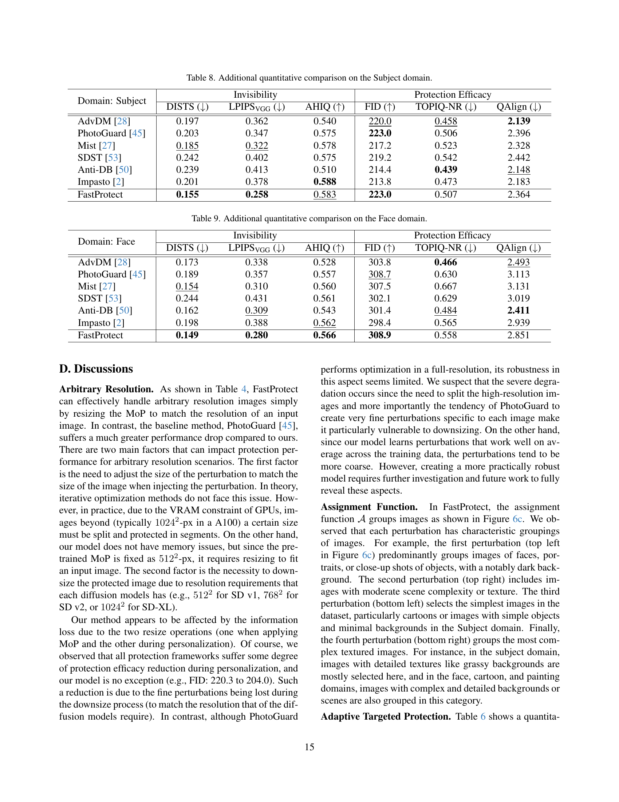

 


 2412.11423 
 Namhyuk Ahn et el. 
 
 🤗 2024-12-17 
 



↗ arXiv


↗ Hugging Face


↗ Papers with Code


### TL;DR



**생성형 AI 모델의 발전**은 이미지 생성 분야에 혁신을 가져왔지만, **예술 작품 복제 및 딥페이크 생성과 같은 위험**도 초래했습니다. 기존 이미지 보호 방법은 보호 효율성, 비가시성, 대기 시간 사이의 균형을 맞추는 데 어려움을 겪어 실용성이 제한적입니다. 특히 추론 중 **반복적인 최적화**로 인한 **높은 대기 시간**은 일반 사용자의 이미지 보호 기술 활용을 어렵게 만듭니다.

**FastProtect**는 **사전 훈련된 perturbation**과 **적응형 추론 체계**를 활용하여 이러한 문제를 해결하는 새로운 프레임워크입니다. 사전 훈련된 perturbation은 추론 시간을 대폭 단축하여 실시간 보호를 가능하게 합니다. 또한, **다중 perturbation 혼합 (MoP)** 및 **다중 레이어 보호 (MLP) 손실**을 통해 UAP의 단점을 극복하고 보호 효율성을 향상시킵니다. 추론 단계에서는 **적응형 타겟 보호** 및 **적응형 보호 강도**와 같은 새로운 기법을 도입하여 보호 효율성과 비가시성을 향상시키고, 실용적인 이미지 보호 솔루션을 제공합니다.



#### Key Takeaways


 FastProtect는 실시간으로 이미지를 보호하는 프레임워크를 제시합니다. 



 FastProtect는 기존 방법보다 200~3500배 빠르면서도 유사한 보호 효과를 제공합니다. 



 FastProtect는 적응형 타겟 보호 및 적응형 보호 강도와 같은 새로운 방법을 제시하여 보호 효율성과 비가시성을 향상시킵니다. 


#### Why does it matter?
**이미지 보호**는 생성 모델 오용 방지에 중요하지만 **효율적인 보호** 기술 부족이 걸림돌이었습니다. 본 논문은 **실시간** 이미지 보호 프레임워크 FastProtect를 제시하여 이 문제를 해결하고자 합니다. 이는 **생성 AI 보안**과 관련된 연구에 상당한 영향을 미치며, 개인과 기업이 이미지를 안전하게 공유하고 생성 AI 기술의 이점을 활용할 수 있도록 지원합니다. FastProtect의 효율성과 강력함은 이미지 보호 분야에서 **새로운 연구**의 문을 열어줍니다.

------
#### Visual Insights

> 🔼 이 그림은 이미지 크기가 증가함에 따라 FastProtect 및 다른 이미지 보호 프레임워크의 추론 지연 시간을 비교합니다. FastProtect은 이미지 크기와 관계없이 거의 일정한 지연 시간을 유지하는 반면 다른 프레임워크는 지연 시간이 기하급수적으로 증가합니다. 이는 FastProtect이 고해상도 이미지에서도 실시간 성능에 근접할 수 있음을 보여줍니다. 대조적으로, 다른 프레임워크의 긴 지연 시간은 실제 사용에 상당한 문제가 될 수 있습니다.
> 

> 
read the caption

> (a) Inference latency (log-scaled) vs. image size
> 


| Method | Invisibility (DISTS; ↓) | Protection (FID; ↑) |
|---|---|---| 
| PGD | 0.221 | 227.6 |
| UAP | 0.222 | 207.6 |

> 🔼 표 2는 다양한 이미지 보호 프레임워크의 성능을 정량적으로 비교한 표입니다. 지연 시간은 512x512 이미지에서 측정되었으며 다른 메트릭에 대한 비교는 부록에 나와 있습니다. 표에는 각 메서드의 CPU 및 GPU에서의 지연 시간, 객체, 얼굴, 그림, 만화의 네 가지 도메인에 대한 DISTS(Invisibility) 및 FID(Efficacy) 점수가 포함되어 있습니다.
> 

> 
read the caption

> Table 2: Quantitative comparison. Latency is measured on 512×\times×512 image. Comparisons of other metrics are shown in Appendix.
> 

### In-depth insights

#### Mimicry Defense
**모방 방어(Mimicry Defense)**는 디지털 이미지의 스타일과 콘텐츠를 무단으로 복제하는 것을 방지하는 데 중점을 둡니다. 확산 모델과 같은 생성 AI의 발전으로 인해 이미지 모방이 심각한 문제로 떠올랐으며, 저작권 침해, 딥페이크 및 허위 정보 생성과 같은 위협이 발생했습니다. 따라서 효과적이고 실용적인 모방 방어 기술이 매우 중요합니다. 이러한 기술은 **보호 효능, 보이지 않음 및 지연 시간**이라는 세 가지 주요 측면을 고려해야 합니다. 즉, 모방을 효과적으로 방지하고, 보호 조치가 눈에 띄지 않아야 하며, 실시간 애플리케이션에 적합하도록 신속하게 구현될 수 있어야 합니다. FastProtect와 같은 새로운 방어 프레임워크는 **섭동 사전 훈련 및 적응형 추론**과 같은 기술을 활용하여 이러한 요구 사항을 해결합니다. 섭동 사전 훈련을 통해 추론 중 오버헤드가 줄어들어 **빠른 보호**가 가능해집니다. 한편, 적응형 대상 보호 및 적응형 보호 강도와 같은 적응형 추론 체계는 **향상된 보호 효능과 보이지 않음**을 보장합니다. 이러한 발전에도 불구하고 모방 방어 분야는 눈에 띄는 왜곡을 최소화하고 다양한 이미지 및 모방 기술에 대한 견고성을 보장하기 위한 지속적인 연구가 필요합니다.

#### Perturbation Pre-training
**사전 섭동 학습**은 추론 시간 최적화를 위한 핵심 전략입니다. **혼합 섭동(MoP)**은 단일 섭동의 한계를 극복하기 위해 여러 섭동을 사용하며, 입력 이미지에 따라 적응적으로 섭동을 선택합니다. MoP는 **지정 함수(A)**를 사용하여 입력 이미지의 특징을 기반으로 최적의 섭동을 선택합니다. **다중 레이어 보호 손실(MLP)**은 여러 계층의 손실을 활용하여 섭동의 효과를 강화하고, 사전 학습 단계에서 추가 비용 없이 보호 효율성을 향상시킵니다.

#### Adaptive Inference
**적응형 추론**은 입력 이미지에 따라 **동적으로 매개변수를 조정**하여 추론을 **최적화**하는 기술입니다. 본 논문에서는 **적응형 대상 보호** 및 **적응형 보호 강도** 두 가지 핵심 기술을 소개합니다. 적응형 대상 보호는 입력 이미지의 특징을 분석하여 최적의 대상 이미지를 선택하고, 그에 맞는 **섭동을 적용**하여 보호 효율을 **극대화**합니다. 적응형 보호 강도는 이미지의 **질감 복잡도**에 따라 섭동의 강도를 조절하여 **가시성을 최소화**하면서 보호 성능을 유지합니다. 이러한 적응형 추론 기술은 **다양한 도메인의 이미지**에 대해 **강력하고 효율적인 보호**를 제공하는 데 중요한 역할을 합니다.

#### Balancing Protection & Visibility
**이미지 보호 기술은 저작권 보호와 프라이버시 침해 방지를 위해 필수적**입니다. 하지만 **강력한 보호 기법은 종종 이미지 품질 저하를 초래**하며, **낮은 보호 수준은 이미지의 무단 사용 가능성을 증가**시킵니다. 따라서 **보호 효과와 이미지 품질 유지 사이의 균형을 맞추는 것이 중요**합니다. 이상적인 보호 기법은 이미지의 시각적 품질에 영향을 미치지 않으면서도 무단 복제 및 스타일 모방을 효과적으로 방지해야 합니다. 이러한 균형점을 찾는 것은 사용자 경험과 보안 효과 모두를 고려해야 하기 때문에 어려운 과제입니다. FastProtect와 같은 새로운 접근 방식은 **사전 훈련된 perturbation과 적응형 추론**을 통해 보호 효과와 품질 간의 균형을 향상시키고자 하지만, **여전히 완벽한 해결책은 아니며 추가적인 연구가 필요**합니다.

#### Ultrafast Protection
**FastProtect는 매우 빠른 이미지 보호 기능을 제공합니다.** 기존 방식과 달리 추론 과정 중 최적화를 거치지 않고 사전 훈련된 MoP(Mixture-of-Perturbations)를 활용하여 속도를 크게 향상시켰습니다. CPU 환경에서 125배, GPU 환경에서는 175배까지 빠르며, 2048² 이미지도 거의 실시간으로 처리합니다. **기존 방식보다 200~3500배 빠른 속도를 달성했으며, 이는 실시간 이미지 보호 기능 구현에 매우 중요한 발전입니다.** 특히 고해상도 이미지가 널리 사용되는 최근 추세에 비추어 볼 때, FastProtect의 속도는 이미지 보호 기술 대중화에 큰 기여를 할 것으로 기대됩니다.

### More visual insights

More on figures

> 🔼 FastProtect는 보호 효율성(FID, 높을수록 좋음)과 비가시성(DISTS, 낮을수록 좋음) 간의 균형 측면에서 다른 보호 방법보다 개선된 성능을 보입니다. 즉, FastProtect는 다른 방법들과 비슷한 수준의 보호 효율성을 제공하면서 이미지의 시각적 품질 손상을 최소화합니다.
> 

> 
read the caption

> (b) Protection efficacy vs. invisibility
> 

> 🔼 FastProtect는 확산 모델을 이용한 이미지 스타일 모방 방지 기술입니다. 그림 1(a)는 이미지 크기에 따른 FastProtect와 기존 방법들의 추론 시간을 비교합니다. FastProtect는 2048x2048 크기의 이미지도 실시간으로 처리할 수 있을 만큼 매우 빠른 속도를 보여줍니다. 그림 1(b)는 스타일 모방 방지 효과(FID, 높을수록 좋음)와 이미지 변형 정도(DISTS, 낮을수록 좋음)의 관계를 나타냅니다. FastProtect는 기존 방법들에 비해 스타일 모방 방지 효과는 유지하면서 이미지 변형을 최소화하는 것을 보여줍니다.
> 

> 
read the caption

> Figure 1: (a) FastProtect shows unprecedented speed in protection against diffusion models. On an A100 GPU, FastProtect achieves real-time latency even for processing 20482superscript204822048^{2}2048 start_POSTSUPERSCRIPT 2 end_POSTSUPERSCRIPT-px image, while others require substantially longer time. (b) In terms of the trade-off between protection efficacy (FID, ↑↑\uparrow↑ is better) and invisibility (DISTS, ↓↓\downarrow↓ is better), FastProtect exhibits improvement over other protection methods.
> 

> 🔼 이 그림은 이미지 보호 프레임워크의 세 가지 주요 접근 방식을 비교하여 보여줍니다. (a) **반복 최적화:** 이 전통적인 접근 방식은 추론 중에 최적화를 수행하여 매우 느린 보호 속도를 초래합니다. 학습 단계가 없습니다. (b) **UAP (Universal Adversarial Perturbation):** 사전 학습된 단일 perturbation을 사용하지만 이미지에 구애받지 않는 특성으로 인해 보호 효율성이 떨어집니다. (c) **FastProtect (제안된 방법):** UAP와 유사하게 사전 학습 방식을 채택하지만, 여러 개의 perturbation을 사용하고 입력 이미지에 따라 적응적으로 perturbation을 선택하는 MoP(Mixture-of-Perturbation) 방식을 사용합니다. 또한, 다중 레이어 보호 손실을 통해 보호 효율성을 향상시키고, 추론 시 적응형 타겟 보호 및 적응형 보호 강도를 통해 효율성과 보이지 않는 perturbation을 개선합니다.
> 

> 
read the caption

> Figure 2:  Model overview. (a) Current iterative optimization approaches lack a training phase and perform optimization during inference, resulting in extremely slow protection. (b) UAP [moosavi2017universal] introduces pre-training of perturbations, but their image-agnostic nature leads to degraded protection efficacy. (c) Combining the advantages of both paradigms, FastProtect adopts a pre-training approach similar to UAP but with a novel mixture-of-perturbation scheme and multi-layer protection loss to enhance protection efficacy. At inference, adaptive targeted protection further boosts protection efficacy with minimal additional cost, and adaptive protection strength improves invisibility.
> 

> 🔼 이 표는 이미지 보호 방법의 효과를 비교합니다. PGD(Projected Gradient Descent)는 반복적 최적화를 사용하여 이미지별로 최적의 보호 효과를 제공하는 반면 UAP(Universal Adversarial Perturbation)는 사전 훈련된 단일 보호 방식을 모든 이미지에 적용하여 효율성을 높입니다. 표의 상단 부분은 DISTS(invisibility)와 FID(protection efficacy) 메트릭을 사용하여 두 방법의 성능을 비교하고, 하단 부분은 LoRA를 사용하여 생성된 모방 이미지를 보여줍니다. 결과적으로 UAP는 PGD에 비해 보호 효과가 낮지만 속도는 훨씬 빠릅니다.
> 

> 
read the caption

> Table 1: PGD vs. UAP (Top) Invisibility (DISTS) and protection efficacy (FID) comparison. (Bottom) Mimicry results via LoRA.
> 

> 🔼 이 그림은 대상 이미지의 텍스처 복잡도와 대상 이미지의 패턴 반복 횟수 사이의 관계를 보여줍니다. 간단한 텍스처 이미지는 낮은 반복 대상으로 보호되지만 높은 반복 대상을 사용하면 실패합니다. 반대로 복잡한 텍스처 이미지의 경우입니다. 즉, 입력 이미지의 텍스처 복잡도와 일치하도록 패턴 이미지를 조정해야 효과적인 보호가 가능함을 시사합니다.
> 

> 
read the caption

> Figure 3: Relationship between target image’s pattern repetition and input image’s texture. Simple textured image is successfully protected by a low repetition target, but fails when using a high repetition target; vice versa for complex texture cases.
> 

> 🔼 원본 이미지와 보호된 이미지를 LPIPS로 비교하여 사람의 인지 능력과 매우 유사한 거리 맵을 얻을 수 있습니다. 거리 맵에서 밝은 영역은 미묘한 왜곡이 더 두드러지는 영역을 나타냅니다. 즉, 사람이 보기에 왜곡이 더 잘 보이는 영역과 LPIPS 거리 맵에서 밝은 영역이 일치하는 것을 보여줍니다. 이는 FastProtect에서 사용하는 적응형 보호 강도 접근 방식의 핵심 아이디어를 뒷받침하는 그림입니다. 즉, 사람이 인지하기 쉬운 영역은 보호 강도를 낮추고, 그렇지 않은 영역은 보호 강도를 높이는 전략을 사용합니다.
> 

> 
read the caption

> Figure 4: Given the original and protected images, we obtain the LPIPS distance map, which remarkably aligns with human perception. The brighter regions on the perceptual map indicate areas where subtle distortions are more noticeable.
> 

> 🔼 Figure 5는 다양한 이미지 보호 프레임워크의 질적 비교를 보여줍니다. 상단 행에는 확대된 부분이 삽입된 보호된 이미지가 표시됩니다. 하단 행에는 개인화된 LoRA에서 생성된 두 개의 출력 이미지가 표시됩니다. 이 그림은 서로 다른 방법으로 보호된 이미지가 LoRA를 사용한 개인화에 어떤 영향을 받는지 보여줍니다. 깨끗한 이미지(a)는 LoRA에 의해 성공적으로 모방되지만, 보호된 이미지(b-h)는 LoRA가 원본 이미지를 모방하지 못하도록 합니다. 그러나 보호된 이미지에서 눈에 띄는 왜곡이 관찰될 수 있습니다. 예를 들어, AdvDM과 Anti-DB에서 보호된 이미지에는 눈에 띄는 노이즈 패턴이 나타나고, PhotoGuard는 전체적인 색상 변화가 발생하며, Mist는 이미지의 일부를 흐리게 만드는 경향이 있습니다. Impasto와 SDST에서 보호된 이미지는 상대적으로 왜곡이 덜하지만, FastProtect가 가장 눈에 띄지 않는 왜곡을 생성합니다. 이는 FastProtect가 보호 효과와 비가시성 사이에서 더 나은 균형을 이룬다는 것을 시사합니다.
> 

> 
read the caption

> Figure 5: Qualitative comparison of different protection frameworks. (Top) Protected image with a zoomed-in patch in the inset. (Bottom) Two output images from the personalized LoRA.
> 

> 🔼 이 표는 FastProtect의 각 구성 요소가 보호 효율성에 미치는 영향을 분석한 ablation study 결과를 보여줍니다. UAP는 기준선(PhotoGuard)에 비해 보호 효율성이 크게 떨어지지만, MoP를 도입하면 성능이 회복됩니다. 하지만 할당 함수 A를 사용하지 않으면 개선 효과가 제한적입니다. MLP 손실을 추가하면 보호 효율성이 크게 향상되고, 적응형 대상 보호 기능도 마찬가지로 성능을 향상시킵니다. 전반적으로 사전 훈련 및 추론 단계에서 새로운 모듈을 통합하여 FastProtect는 훨씬 빠른 추론으로 더 나은 보호 효율성을 달성할 수 있습니다.
> 

> 
read the caption

> Table 3: Ablation study.
> 

> 🔼 표 4는 FastProtect가 보호 로버스트니스 시나리오에서 어떻게 작동하는지에 대한 분석을 제공합니다. 즉, 보호된 이미지가 노이즈 추가, JPEG 압축, 임의 크기 조정과 같은 대응책에 얼마나 취약한지 분석합니다. PhotoGuard [45]가 기준선으로 사용됩니다. 이 표는 다양한 시나리오에서 PhotoGuard 및 FastProtect의 보이지 않음 및 효능 메트릭을 보여줍니다. FastProtect는 이러한 시나리오에서 기준선과 비슷한 성능을 보여줍니다.
> 

> 
read the caption

> Table 4: Analysis on protection robustness scenarios.
> 

> 🔼 이 그래프는 MoP(Mixture-of-Perturbation)의 학습 데이터셋에 따른 도메인 일반화 성능을 보여줍니다. x축은 학습에 사용된 데이터셋의 종류(Object, Face, Painting, Cartoon, All)을 나타내고, y축은 FID 점수를 나타냅니다. FID 점수가 높을수록 이미지 생성 모델이 원본 이미지와 다른 이미지를 생성함을 의미하며, 따라서 더 강력한 보호 성능을 나타냅니다. MoP는 Object, Face, Painting, Cartoon 네 가지 도메인의 데이터를 모두 사용하여 학습했을 때 가장 높은 FID 점수를 보입니다. 흥미롭게도, 특정 도메인의 데이터만 사용하여 학습했을 때에도 다른 도메인의 이미지에 대해 비교적 안정적인 보호 성능을 보이는 것을 확인할 수 있습니다. 이는 MoP가 unseen 도메인에 대해서도 효과적으로 대응할 수 있음을 시사합니다.
> 

> 
read the caption

> (a) Domain Generalization of MoP
> 

> 🔼 이 그래프는 할당 함수(Assignment Function)의 유무에 따른 MoP의 보호 효과를 FID 점수로 비교하여 보여줍니다. 할당 함수 A를 사용하지 않는 MoP(MoP w/o A)는 단일 UAP보다 성능이 향상되지만, 할당 함수 A를 사용하는 MoP는 할당 함수가 없는 MoP보다 더욱 향상된 보호 효과를 보여줍니다. 즉, 할당 함수를 통해 입력 이미지의 특징을 고려하여 MoP를 적용하면 보호 효과가 더욱 향상됨을 나타냅니다. 이는 단순히 perturbation의 수를 늘리는 것보다 이미지의 특징에 맞춰 perturbation을 적용하는 것이 중요함을 시사합니다.
> 

> 
read the caption

> (b) Effect of Assignment Function
> 

> 🔼 이 그림은 MoP(Mixture-of-Perturbation) 그룹의 예시들을 보여줍니다. MoP는 여러 개의 perturbation들을 가지고 있으며, 입력 이미지의 특징에 따라 적절한 perturbation을 선택하여 적용합니다. 그림 6c에서 각 perturbation에 할당된 대표적인 이미지들을 확인할 수 있습니다. 각 그룹의 이미지들은 특정한 특징(예: 텍스처, 장면)에 따라 그룹화되어 있습니다. 예를 들어, 첫 번째 perturbation (좌측 상단)은 주로 어두운 배경의 얼굴, 인물 사진 또는 물체의 클로즈업 이미지들을 그룹화합니다. 두 번째 perturbation (우측 상단)에는 적당한 장면 복잡도 또는 텍스처를 가진 이미지들이 포함됩니다. 세 번째 perturbation (좌측 하단)은 데이터셋에서 가장 단순한 이미지, 특히 만화 또는 Subject 도메인의 단순한 물체와 최소한의 배경을 가진 이미지를 선택합니다. 마지막으로 네 번째 perturbation (우측 하단)은 가장 복잡한 텍스처의 이미지들을 그룹화합니다. 예를 들어, Subject 도메인에서 잔디 배경과 같이 세부적인 텍스처가 있는 이미지들이 주로 여기에 선택되며, 얼굴, 만화 및 그림 도메인에서는 복잡하고 세부적인 배경이나 장면이 있는 이미지들도 이 범주에 속합니다.
> 

> 
read the caption

> (c) Examples of MoP Group
> 

> 🔼 이 그림은 사전 훈련 단계에서 제안된 모듈들을 분석한 결과를 보여줍니다. (a)는 MoP의 도메인 일반화를 나타내며, 훈련 데이터셋이 제한적이더라도 MoP가 보이지 않는 도메인을 효과적으로 처리함을 보여줍니다. (b)는 할당 함수의 효과를 나타내며, 할당 함수 A를 사용하지 않을 경우 성능 향상이 제한적임을 보여줍니다. (c)는 K=4일 때 각각의 perturbation에 할당된 대표 이미지들을 시각화하여, 이미지들이 특정 구별되는 특징(예: 텍스처, 장면)에 따라 그룹화되는 것을 보여줍니다.
> 

> 
read the caption

> Figure 6: Analysis of the proposed modules in the pre-training phase.
> 

> 🔼 (a)는 입력 이미지의 텍스처 복잡도에 따라 서로 다른 패턴 반복을 가진 타겟 이미지를 사용하여 보호 효과를 분석한 결과입니다. 단순 텍스처 이미지는 낮은 패턴 반복 타겟을 사용할 때 효과적으로 보호되지만, 높은 패턴 반복 타겟을 사용하면 보호 성능이 저하됩니다. 반대로, 복잡한 텍스처 이미지의 경우, 높은 패턴 반복 타겟이 더 효과적인 보호를 제공합니다. 이는 입력 이미지의 텍스처 복잡도와 타겟 이미지의 패턴 반복 사이에 연관성이 있음을 시사합니다. 따라서 FastProtect는 입력 이미지의 텍스처 복잡도에 따라 최적의 타겟 이미지를 선택하는 적응형 타겟 보호 방식을 사용합니다. 즉, 입력 이미지의 잠재 코드와 가장 유사한 잠재 코드를 가진 타겟 이미지를 선택하여 MoP를 적용합니다. 이를 통해 다양한 도메인의 이미지에 대해 강력한 보호 성능을 달성할 수 있습니다.
> 

> 
read the caption

> (a) Adapt. Targeted Protection
> 

> 🔼 이 그림은 FastProtect에서 적응형 보호 강도 모듈의 효과를 보여줍니다. 섭동 예산을 조정하여 보호 강도를 변경하면서 결과를 보고합니다. 이 모듈이 없으면 보호 효율과 비가시성 간의 균형이 전체 모델보다 나빠집니다. 예산이 적을 때는 섭동이 본질적으로 최소화되므로 차이가 미미할 수 있습니다. 그러나 보호 강도가 강해지면 차이가 커집니다.
> 

> 
read the caption

> (b) Adapt. Protection Strength
> 

> 🔼 이 그림은 FastProtect에 PGD(Projected Gradient Descent)를 추가로 적용하여 이미지 보호 효과를 더욱 향상시킨 결과를 보여줍니다. FastProtect는 사전 훈련된 perturbation을 사용하여 빠른 처리 속도를 제공하지만, PGD와 같은 iterative optimization 기법을 추가로 적용하면 보호 효과를 높일 수 있습니다. 그림에서 볼 수 있듯이, FastProtect + PGD는 기준선(Baseline)보다 더 적은 단계만으로도 더 높은 보호 효과를 달성합니다. 즉, FastProtect 결과물을 초기값으로 사용하여 PGD를 적용하면 효율적으로 보호 성능을 향상시킬 수 있습니다.
> 

> 
read the caption

> (c) FastProtect + PGD Refine
> 

> 🔼 Figure 7은 추론 단계에서 FastProtect의 다양한 모듈들을 분석한 결과를 보여줍니다. (a)는 적응형 타겟 보호 기법의 효과를, (b)는 적응형 보호 강도 기법의 효과를, (c)는 FastProtect에 반복 최적화 기법(PGD)을 추가 적용했을 때의 결과를 나타냅니다.   (a) 적응형 타겟 보호: 입력 이미지의 텍스처 복잡도에 따라 패턴 반복이 적거나 많은 타겟 이미지를 사용했을 때의 보호 효과 차이를 보여줍니다. FastProtect는 다양한 시나리오에서 거의 최적의 성능을 보입니다.  (b) 적응형 보호 강도: 제안된 적응형 보호 강도 기법을 사용했을 때와 사용하지 않았을 때의 보호 효과 및 보호 강도 간의 trade-off를 보여줍니다. 이 모듈을 사용하면 보호 강도와 가시성 사이의 균형이 향상됩니다.  (c) FastProtect + PGD 개선: FastProtect 결과를 초기 섭동으로 사용하고 PGD를 통해 추가로 개선했을 때의 결과를 보여줍니다. FastProtect가 반복 최적화 기술의 우수한 초기 체크포인트 역할을 하며, 더 높은 보호 효과를 얻을 수 있음을 알 수 있습니다.
> 

> 
read the caption

> Figure 7: Analysis of the proposed modules in the inference phase.
> 

More on tables


| Method | Latency | Object | Face | Painting | Cartoon |
|---|---|---|---|---|---| 
| AdvDM [liang2023adversarial] | 1210s / 35s | 0.197 / **220.0** | 0.173 / 303.8 | 0.153 / **357.6** | 0.271 / 212.5 |
| PhotoGuard [salman2023raising] | **370s** / **7s** | 0.203 / **223.0** | 0.189 / **308.7** | **0.107** / 350.9 | 0.209 / 219.1 |
| Anti-DB [van2023anti] | 7278s / 225s | 0.239 / 214.4 | 0.162 / 301.4 | 0.114 / 347.7 | 0.294 / **225.4** |
| Mist [liang2023mist] | 1440s / 40s | **0.185** / 217.2 | **0.154** / 307.5 | 0.129 / **357.0** | 0.223 / 223.7 |
| Impasto [ahn2024imperceptible] | 830s / 19s | 0.201 / 213.8 | 0.198 / 298.4 | 0.123 / 352.4 | **0.207** / 215.5 |
| SDST [xue2023toward] | 1410s / 24s | 0.242 / 219.2 | 0.244 / 302.1 | 0.152 / 354.1 | 0.237 / **222.7** |
| FastProtect | **2.9s** / **0.04s** | **0.155** / **223.0** | **0.149** / **308.9** | **0.110** / 356.1 | **0.186** / 220.3 |
> 🔼 이 표는 알려지지 않은 확산 모델과 개인화 방법을 사용하는 블랙박스 보호 시나리오에 대한 분석을 제공합니다. 표에서 Unknown Model 열은 Stable Diffusion v2.1과 SD-XL에 대한 결과를 보여주고 Unknown Personalization 열은 Textual Inversion(TI)과 DreamStyler를 사용한 결과를 보여줍니다. 각 셀은 DISTS(Invisibility)와 FID(Protection Efficacy)를 포함하고, 각 도메인(Subject, Cartoon)에 대해 PhotoGuard와 FastProtect 방법을 비교합니다.
> 

> 
read the caption

> Table 5: Analysis of black-box protection scenarios (unknown diffusion models and personalization methods).
> 


| Configuration | FID (↑) |
|---|---| 
| PhotoGuard | 227.6 |
| UAP [moosavi2017universal] | 207.6 |
| MoP (w/o \mathcal{A}) | 214.5 |
| MoP | 225.9 |
| + MLP Loss | 234.6 |
| + Adapt. Target | 238.8 |
> 🔼 표 6은 그림 7(a)에 나타난 적응형 대상 보호의 효과에 대한 정량적 보고서를 제공합니다. 그림 7(a)는 대상 이미지의 패턴 반복과 입력 이미지의 질감 사이의 관계를 분석한 그림으로, 다양한 패턴 반복을 가진 대상 이미지를 사용하여 입력 이미지의 질감 복잡성과 일치시키는 방법을 보여줍니다. 표 6은 각각 낮음, 중간, 높음의 패턴 반복을 나타내는 세 가지 패턴 이미지와 이에 따른 세 가지 MoP(Mixture of Perturbations) 모델을 사용하여, 입력 이미지 도메인(객체, 얼굴, 그림, 만화)별로 보호 효과(FID)를 측정한 결과를 보여줍니다. 또한, 적응형 대상 보호 방식을 적용한 결과도 함께 제시하여, 입력 이미지의 특성에 따라 최적의 대상 이미지를 선택하는 것이 보호 효과를 향상시키는 데 중요함을 보여줍니다.
> 

> 
read the caption

> Table 6: Quantitative report on the effect of adaptive targeted protection shown in Figure 7(a).
> 


| Domain | Method | Invisibility | Countermeasure | Countermeasure | Arbitrary Size |
|---|---|---|---|---|---| 
|---|---| Noise | JPEG |---| 
| Subject | PhotoGuard | 0.203 | 193.3 | **193.2** | 193.5 |
|  | FastProtect | **0.155** | **214.4** | 191.3 | **219.1** |
| Cartoon | PhotoGuard | 0.209 | **192.9** | 193.1 | 190.7 |
|  | FastProtect | **0.186** | 191.8 | **199.9** | **204.0** |
> 🔼 표 7은 모든 보호 프레임워크에 대해 perturbation 강도(η)를 8로 고정했을 때의 정량적 비교를 보여줍니다. 즉, perturbation 예산을 동일하게 설정하여 각 방법의 보호 효능과 비가시성 간의 trade-off를 비교합니다. 대부분의 경우 FastProtect는 적당한 보호 효능을 달성하면서 비가시성 측면에서 뛰어난 결과를 보여줍니다. 이러한 균형은 보호-비가시성 trade-off를 고려할 때 FastProtect가 매우 잘 수행됨을 시사합니다.
> 

> 
read the caption

> Table 7: Quantitative comparison when fix the perturbation strength (η𝜂\etaitalic_η) to eight for all the protection frameworks.
> 


| Domain | Method | Invisibility | → SD-v2.1 [rombach2022high] | → SD-XL [podell2023sdxl] | TI [gal2022image] | DreamStyler [ahn2023dreamstyler] |
|---|---|---|---|---|---|---|
| Subject | PhotoGuard | 0.203 | 176.6 | 190.9 | 290.2 | 224.9 |
|  | FastProtect | **0.155** | **177.5** | **218.4** | **305.6** | **231.3** |
| Cartoon | PhotoGuard | 0.209 | 179.3 | 195.1 | **306.4** | 193.7 |
|  | FastProtect | **0.186** | **188.3** | **207.3** | 305.7 | **209.9** |
> 🔼 표 8은 논문의 4.1절 '모델 비교'에서 사용된 Subject 도메인에 대한 추가적인 정량적 비교 결과를 보여줍니다. 표는 여러 이미지 보호 프레임워크의 성능을 비교하기 위해 DISTS, LPIPSVGG, AHIQ, FID, TOPIQ-NR, QAlign과 같은 다양한 메트릭을 사용합니다. Subject 도메인은 실제 사물 이미지를 포함하며, 표는 각 메트릭에 대한 각 프레임워크의 점수를 보여줍니다. 이를 통해 invisibility와 protection efficacy 간의 균형을 더 자세히 분석하고 FastProtect가 다른 프레임워크에 비해 어떤 장점을 가지는지 확인합니다.
> 

> 
read the caption

> Table 8: Additional quantitative comparison on the Subject domain.
> 


| Target Image | Inference Domains | | | |
| --- | --- | --- | --- | --- |
| | Object | Face | Painting | Cartoon |
| Low rep. | 200.1 | **327.7** | 347.5 | **237.3** |
| Mid rep. | 207.2 | 297.9 | <ins>349.3</ins> | 234.6 |
| High rep. | <ins>208.3</ins> | 270.7 | 348.5 | 211.8 |
| Adaptive target | **208.5** | <ins>320.2</ins> | **349.4** | <ins>235.4</ins> |
> 🔼 얼굴 도메인에 대한 추가적인 정량적 비교표입니다. 표에는 여러 이미지 보호 프레임워크에 대한 DISTS, LPIPSVGG, AHIQ, FID, TOPIQ-NR, QAlign 점수가 나와 있습니다. 이 표는 논문의 4.1절 '모델 비교'에 나오는 표 2에 대한 추가적인 정보를 제공하며, 얼굴 이미지 도메인에 초점을 맞춰 다양한 메트릭을 사용하여 각 프레임워크의 성능을 더 자세히 분석합니다.
> 

> 
read the caption

> Table 9: Additional quantitative comparison on the Face domain.
> 


| Method (η=8) | Latency | Object | Face | Painting | Cartoon |
|---|---|---|---|---|---| 
| AdvDM | 1210s / 35s | **0.129** / 199.5 | **0.152** / 303.7 | **0.117** / 346.8 | 0.194 / 196.5 |
| PhotoGuard | **370s** / **7s** | 0.184 / **211.9** | 0.258 / **371.1** | 0.165 / **377.4** | 0.221 / **227.6** |
| Anti-DB | 7278s / 225s | 0.164 / 197.4 | 0.193 / 317.4 | 0.143 / 343.9 | 0.231 / 184.6 |
| Mist | 1440s / 40s | 0.185 / **217.2** | 0.259 / **365.8** | 0.166 / **386.2** | 0.223 / **223.7** |
| Impasto | 830s / 19s | 0.131 / 188.9 | 0.198 / 298.4 | 0.123 / 352.4 | **0.179** / 201.1 |
| SDST | 1410s / 24s | 0.170 / 198.0 | 0.244 / 302.1 | 0.152 / 354.1 | 0.199 / 196.7 |
| FastProtect | **2.9s** / **0.04s** | **0.097** / 200.4 | **0.149** / 308.9 | **0.048** / 348.0 | **0.186** / 220.3 |
> 🔼 표 10은 그림 도메인에 대한 추가적인 정량적 비교를 제공합니다. 표에는 다양한 이미지 보호 프레임워크에 대한 DISTS, LPIPSVGG, AHIQ, FID, TOPIQ-NR, QAlign 지표가 포함되어 있습니다. 이 표는 논문의 4.1절 '모델 비교'에 나와 있는데, 여기서 저자는 그림 도메인에서 FastProtect가 다른 프레임워크에 비해 향상된 보호 효능-비가시성 절충안을 보여준다는 것을 강조합니다.
> 

> 
read the caption

> Table 10: Additional quantitative comparison on the Painting domain.
> 


| Domain: Subject | DISTS (↓) | LPIPS_{VGG} (↓) | AHIQ (↑) | FID (↑) | TOPIQ-NR (↓) | QAlign (↓) |
|---|---|---|---|---|---|---| 
| AdvDM [liang2023adversarial] | 0.197 | 0.362 | 0.540 | **220.0** | **0.458** | **2.139** |
| PhotoGuard [salman2023raising] | 0.203 | 0.347 | 0.575 | **223.0** | 0.506 | 2.396 |
| Mist [liang2023mist] | **0.185** | **0.322** | 0.578 | 217.2 | 0.523 | 2.328 |
| SDST [xue2023toward] | 0.242 | 0.402 | 0.575 | 219.2 | 0.542 | 2.442 |
| Anti-DB [van2023anti] | 0.239 | 0.413 | 0.510 | 214.4 | **0.439** | **2.148** |
| Impasto [ahn2024imperceptible] | 0.201 | 0.378 | **0.588** | 213.8 | 0.473 | 2.183 |
| FastProtect | **0.155** | **0.258** | **0.583** | **223.0** | 0.507 | 2.364 |
> 🔼 이 표는 논문의 4.1절 '모델 비교'에 있는 표 2에 대한 추가적인 정량적 비교 결과를 만화 도메인에 대해 보여줍니다. 표 2에서는 보호 강도(η)를 모든 보호 프레임워크에 대해 8로 고정했을 때의 결과를 보여주고, 본 표에서는 만화 도메인에 대한 추가적인 지표들을 포함하여 더 자세한 비교 결과를 제공합니다. 각 프레임워크에 대해 DISTS, LPIPS_VGG, AHIQ를 사용하여 보호된 이미지의 비가시성을 측정하고, FID, TOPIQ-NR, QAlign을 사용하여 개인화된 확산 모델의 보호 효율성을 평가합니다.
> 

> 
read the caption

> Table 11: Additional quantitative comparison on the Cartoon domain.
> 

### Full paper



