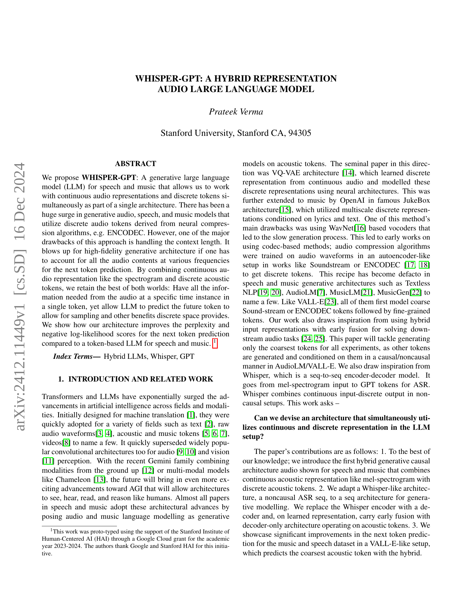
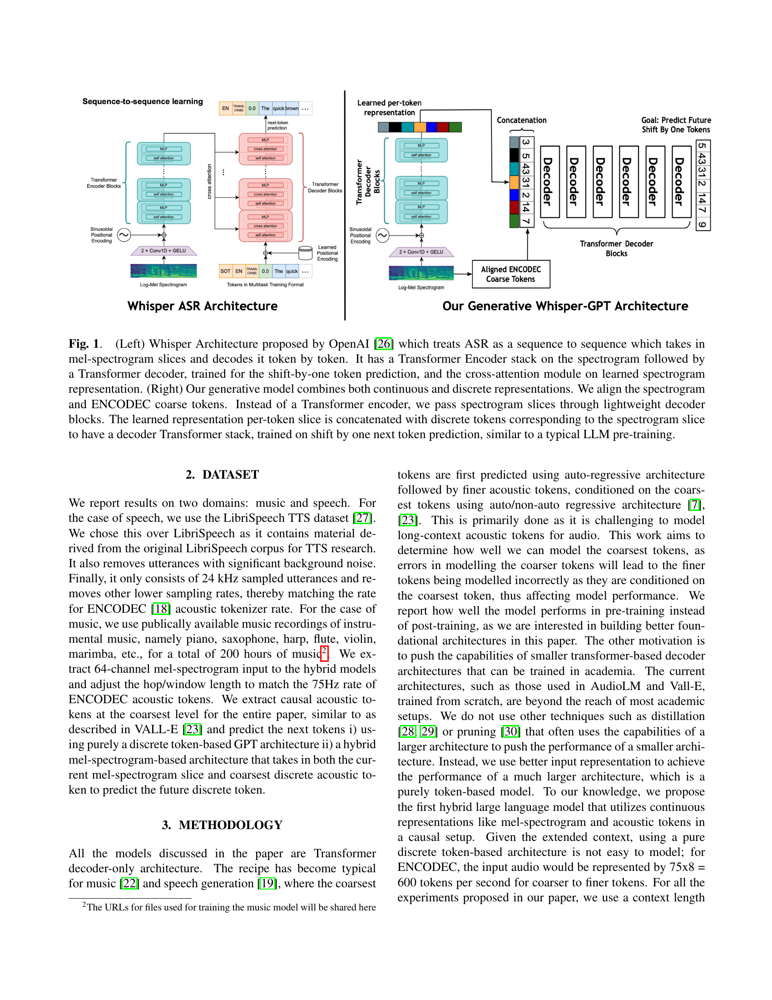
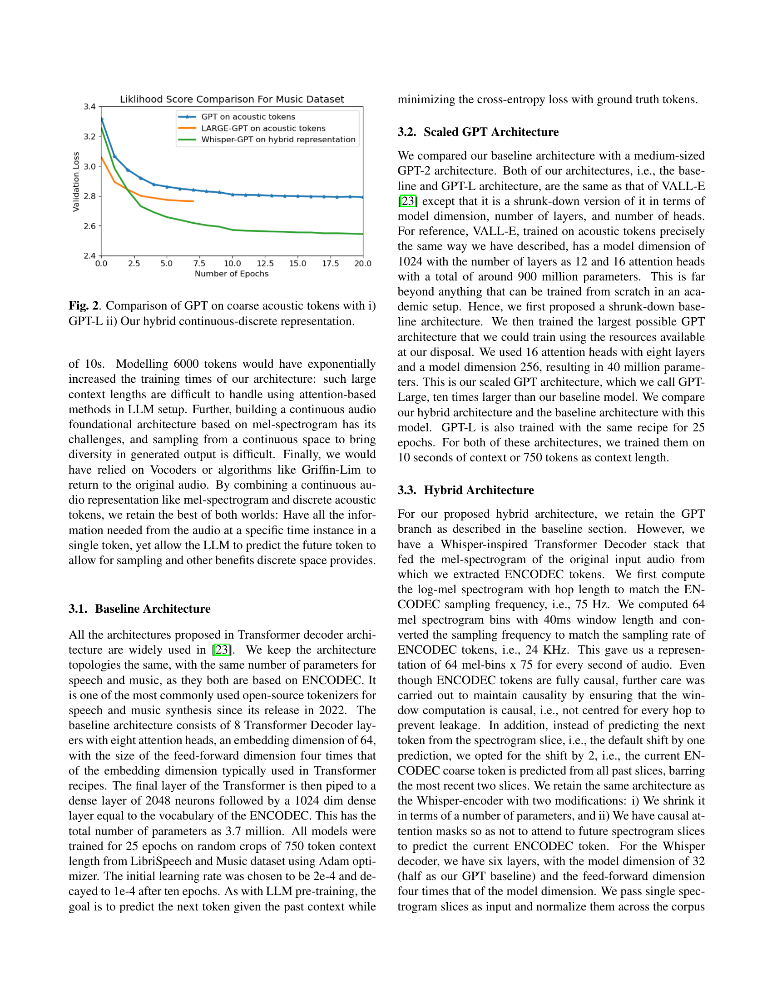
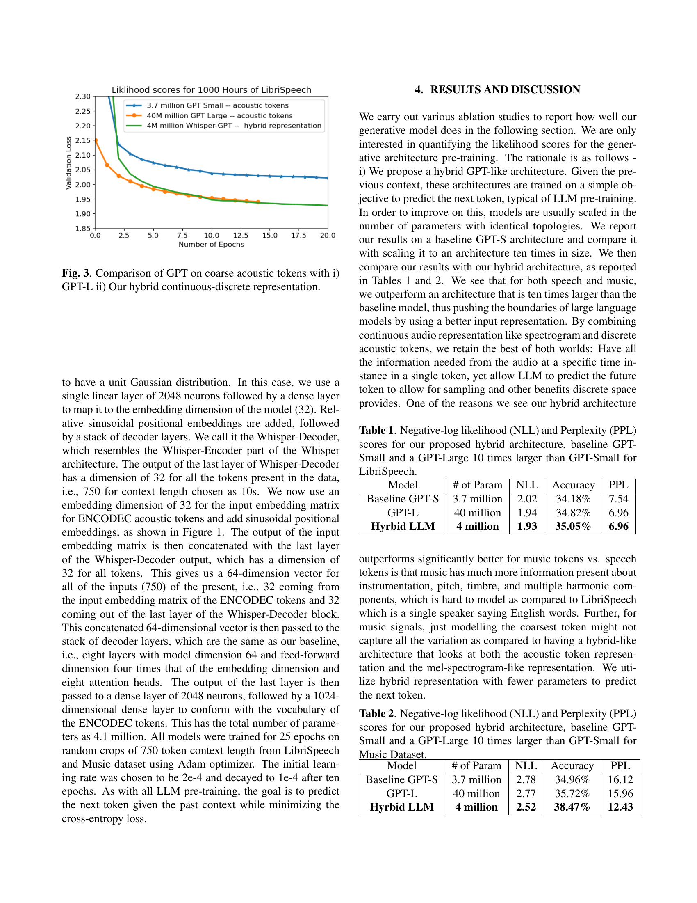
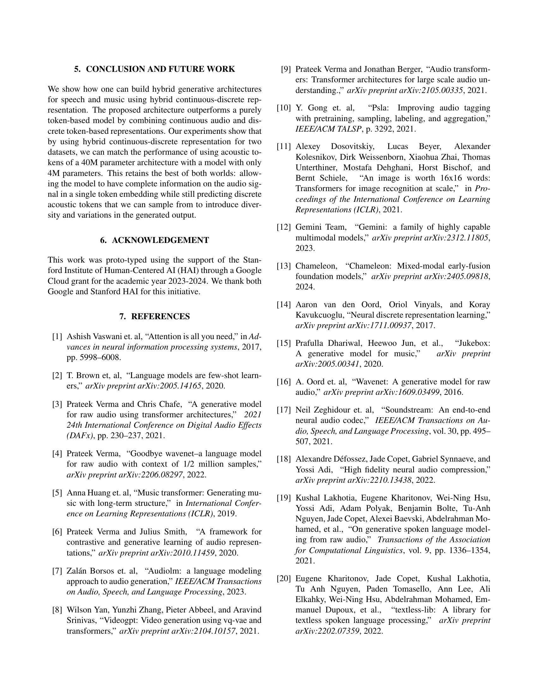
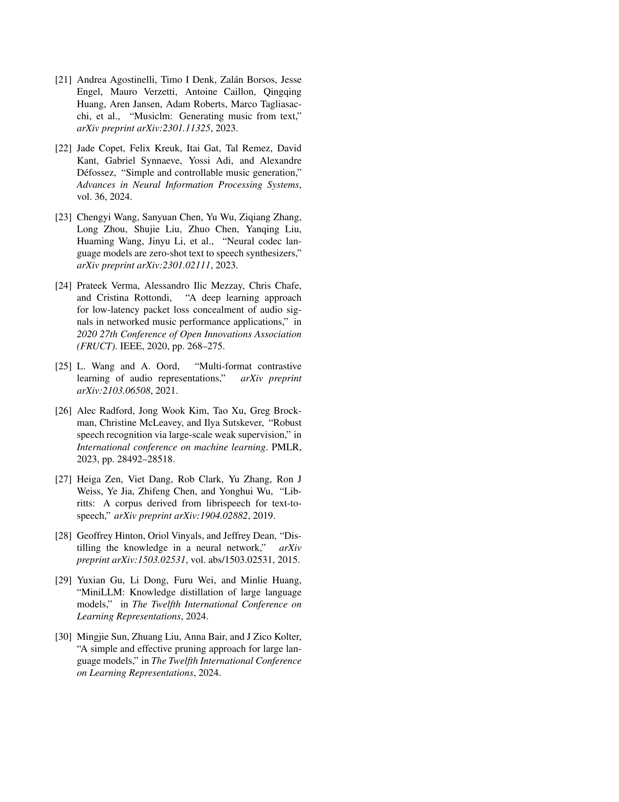

 


 2412.11449 
 Prateek Verma et el. 
 
 🤗 2024-12-17 
 



↗ arXiv


↗ Hugging Face


↗ Papers with Code


### TL;DR



**오디오 생성 모델이 발전되면서 고품질 오디오를 생성하는 분야가 발전**했습니다. 그러나 이러한 모델은 종종 **긴 컨텍스트 길이 때문에 어려움**을 겪는데, 특히 고품질 아키텍처에서 모든 주파수의 오디오 콘텐츠를 고려하는 경우 계산적으로 복잡해집니다. 이러한 **컨텍스트 길이 문제는 토큰 기반 LLM에서 특히 두드러**집니다. **WHISPER-GPT는 연속 오디오 표현(예: 스펙트로그램)과 이산 음향 토큰을 결합한 하이브리드 표현을 활용**하는 새로운 아키텍처를 제시합니다. Whisper에서 영감을 받은 이 모델은 **스펙트로그램 슬라이스를 처리하는 디코더와 이산 음향 토큰에서 작동하는 디코더 전용 아키텍처를 사용**합니다. 결과적으로 **WHISPER-GPT는 음성 및 음악 데이터 세트에서 다음 토큰 예측에 대한 perplexity 및 음의 로그 가능도 점수를 향상**시킵니다. 이 하이브리드 접근 방식은 **모든 시간 인스턴스에서 단일 토큰으로 필요한 모든 오디오 정보를 유지하면서 LLM이 샘플링 및 이산 공간이 제공하는 기타 이점을 위해 향후 토큰을 예측할 수 있도록** 합니다. 이 아키텍처는 음성 및 음악 생성 모두에서 **토큰 기반 LLM보다 성능이 뛰어나 연속 및 이산 표현을 효과적으로 통합**하는 능력을 입증했습니다. 이 방법은 **계산 비용을 줄이면서 모델 성능을 향상**시키는 길을 열어줍니다.



#### Key Takeaways


 Whisper-GPT는 연속 오디오 표현과 이산 토큰을 결합한 하이브리드 접근 방식을 사용합니다. 



 이산 토큰만 사용하는 것보다 성능이 향상되고 계산 비용이 절감됩니다. 



 음성 및 음악 생성 작업 모두에서 기존 토큰 기반 LLM보다 성능이 뛰어납니다.  


#### Why does it matter?
**하이브리드 연속-이산 표현을 사용하는 생성적 오디오 LLM은 음성 및 음악 생성에 중요한 발전**입니다. 이 논문은 **계산적으로 효율적인 훈련을 가능하게 하면서 성능을 향상시키는 새로운 아키텍처를 제시**합니다. 이는 **대규모 모델의 계산 비용에 대한 우려를 해결하는 동시에 고품질 오디오 생성**이라는 목표를 달성하는 데 기여합니다. 이러한 접근 방식은 **다양한 생성적 AI 모델에 적용 가능**하며 추가 연구를 위한 길을 열어줍니다.

------
#### Visual Insights

> 🔼 이 그림은 Whisper 아키텍처와 제안된 생성 모델인 Whisper-GPT 아키텍처를 비교하여 보여줍니다. 왼쪽의 Whisper 아키텍처는 mel-스펙트로그램 슬라이스를 입력으로 받아 토큰별로 디코딩하는 seq2seq 모델입니다. 스펙트로그램에 Transformer Encoder 스택을 적용한 후, shift-by-one 토큰 예측을 위해 훈련된 Transformer Decoder와 학습된 스펙트로그램 표현에 대한 cross-attention 모듈을 사용합니다. 오른쪽의 Whisper-GPT 아키텍처는 연속적인 mel-스펙트로그램 표현과 이산적인 ENCODEC 토큰을 결합한 하이브리드 생성 모델입니다. Transformer Encoder 대신, 스펙트로그램 슬라이스를 경량 디코더 블록에 통과시킵니다. 토큰 슬라이스별로 학습된 표현은 해당 스펙트로그램 슬라이스에 해당하는 이산 토큰과 연결되어 디코더 Transformer 스택을 구성합니다. 이 스택은 일반적인 LLM 사전 훈련과 유사하게 shift-by-one 다음 토큰 예측 방식으로 훈련됩니다.
> 

> 
read the caption

> Fig. 1:  (Left) Whisper Architecture proposed by OpenAI [26] which treats ASR as a sequence to sequence which takes in mel-spectrogram slices and decodes it token by token. It has a Transformer Encoder stack on the spectrogram followed by a Transformer decoder, trained for the shift-by-one token prediction, and the cross-attention module on learned spectrogram representation. (Right) Our generative model combines both continuous and discrete representations. We align the spectrogram and ENCODEC coarse tokens. Instead of a Transformer encoder, we pass spectrogram slices through lightweight decoder blocks. The learned representation per-token slice is concatenated with discrete tokens corresponding to the spectrogram slice to have a decoder Transformer stack, trained on shift by one next token prediction, similar to a typical LLM pre-training.
> 


| Model | # of Param | NLL | Accuracy | PPL |
|---|---|---|---|---| 
| Baseline GPT-S | 3.7 million | 2.02 | 34.18% | 7.54 |
| GPT-L | 40 million | 1.94 | 34.82% | 6.96 |
| **Hyrbid LLM** | **4 million** | **1.93** | **35.05%** | **6.96** |

> 🔼 LibriSpeech 데이터셋에 대한 음성 생성 모델 성능 비교표입니다. 제안된 하이브리드 아키텍처, 기본 GPT-Small, 그리고 GPT-Small보다 10배 큰 GPT-Large 모델의 음의 로그 우도(NLL), 정확도, 그리고 Perplexity(PPL) 점수를 보여줍니다. 하이브리드 모델은 상대적으로 적은 파라미터를 사용하면서도 큰 모델과 비슷한 성능을 보입니다.
> 

> 
read the caption

> Table 1: Negative-log likelihood (NLL) and Perplexity (PPL) scores for our proposed hybrid architecture, baseline GPT-Small and a GPT-Large 10 times larger than GPT-Small for LibriSpeech.
> 

### In-depth insights

#### Hybrid Audio LLM
**하이브리드 오디오 LLM**은 오디오의 연속적인 표현(예: 멜-스펙트로그램)과 이산적인 토큰 기반 표현(예: ENCODEC)을 결합한 아키텍처입니다. 이 접근 방식은 **두 가지 장점**을 모두 활용합니다. 스펙트로그램은 특정 시간 인스턴스의 오디오에서 필요한 모든 정보를 제공하고, 이산 토큰은 샘플링 및 이산 공간이 제공하는 기타 이점을 허용합니다. 본 논문에서 제안된 Whisper-GPT 아키텍처는 이러한 하이브리드 표현을 활용하여 음성 및 음악에 대한 생성 LLM을 구축하는 방법을 보여줍니다. 결과는 순수 토큰 기반 모델보다 성능이 향상되었음을 보여줍니다. 이는 하이브리드 접근 방식을 통해 더 적은 매개변수로 더 큰 아키텍처의 성능과 일치시킬 수 있음을 시사합니다. 이러한 결과는 오디오 생성 모델에서 **맥락 길이 문제를 해결하는 데 중요한 의미**를 갖습니다. 특히, 하이브리드 표현을 사용하면 모든 주파수의 모든 오디오 콘텐츠를 고려하지 않고도 다음 토큰을 예측할 수 있습니다. 이는 긴 오디오 시퀀스를 효율적으로 처리할 수 있도록 합니다. 또한 하이브리드 접근 방식은 오디오 생성의 다양성과 변형을 가능하게 하는 **샘플링 및 기타 이산 공간의 이점**을 제공합니다. 결론적으로, 하이브리드 오디오 LLM은 음성 및 음악 생성 작업에서 유망한 방향을 제시합니다.

#### Whisper-GPT Arch
**Whisper-GPT 아키텍처**는 음성 및 음악 생성을 위한 혁신적인 접근 방식으로, 연속 오디오 표현과 이산 토큰을 단일 아키텍처에서 동시에 활용합니다. Whisper 아키텍처에서 영감을 받은 이 모델은 멜-스펙트로그램 슬라이스를 입력으로 받아 토큰별로 디코딩합니다. Whisper-GPT는 음성 및 음악 생성을 위한 생성적 대규모 언어 모델(LLM)로, 연속 오디오 표현과 이산 토큰을 단일 아키텍처에 통합합니다. 이 하이브리드 접근 방식을 통해 이산 공간의 이점을 활용하면서 특정 시간 인스턴스에서 오디오의 모든 정보를 단일 토큰으로 유지할 수 있습니다. Whisper-GPT 아키텍처는 음성 및 음악 데이터 세트에 대한 다음 토큰 예측의 정확도와 perplexity 점수를 향상시킵니다. 이 모델은 컨텍스트 길이를 효율적으로 처리하여 고충실도 생성 아키텍처에서 중요한 과제를 해결합니다. Whisper-GPT는 연속 입력과 이산 출력을 결합한 Whisper의 seq2seq 인코더-디코더 모델에서도 영감을 얻습니다. 이 작업의 핵심 질문은 LLM 설정에서 연속 및 이산 표현을 동시에 활용하는 아키텍처를 설계할 수 있는지 여부입니다. 이 논문의 주요 기여는 음성 및 음악을 위해 멜-스펙트로그램과 같은 연속 음향 표현과 이산 음향 토큰을 결합한 최초의 하이브리드 생성 causal 아키텍처입니다. 또한 생성 모델링을 위해 비인과적 ASR seq인 Whisper와 유사한 아키텍처를 seq 아키텍처에 적용합니다. Whisper 인코더를 디코더로 교체하고 학습된 표현에서 이산 토큰에서 작동하는 디코더 전용 아키텍처와 초기 융합을 수행합니다. 마지막으로 VALL-E와 유사한 설정에서 음성 및 음악 데이터 세트의 다음 토큰 예측에서 상당한 개선을 보여줍니다. 하이브리드로 가장 거친 음향 토큰을 예측합니다.

#### Token-Spectrogram
**토큰-스펙트로그램**이라는 제목은 오디오를 나타내는 두 가지 주요 방법인 개별 토큰과 연속 스펙트로그램 표현을 결합한 것을 암시합니다. 이러한 **하이브리드 접근 방식**은 개별 토큰의 효율성과 스펙트로그램의 풍부한 정보를 활용하는 것을 목표로 합니다. 토큰은 오디오의 압축된 표현을 제공하여 효율적인 처리와 생성을 가능하게 하지만, 미세한 음향적 뉘앙스를 놓칠 수 있습니다. 반대로, 스펙트로그램은 시간에 따른 주파수 성분을 자세히 포착하여 오디오의 완전한 표현을 제공합니다. 이 두 가지를 결합함으로써 모델은 **두 가지 장점**을 모두 얻을 수 있습니다. 이러한 접근 방식은 음성 인식, 음악 생성 및 기타 오디오 관련 작업과 같은 다양한 애플리케이션에서 유용할 수 있습니다. 특히 **긴 오디오 시퀀스**를 처리할 때 토큰은 계산 비용을 줄이는 데 도움이 되는 반면, 스펙트로그램은 **고품질 오디오 출력**을 보장하는 데 도움이 됩니다.

#### Perplexity Gains
**혼합 표현**을 사용하면 음향 토큰만 사용하는 것보다 **혼잡도 점수가 크게 향상**됩니다. Whisper-GPT 아키텍처는 음성 및 음악 생성에서 연속 오디오 표현과 이산 토큰을 결합합니다. 이러한 접근 방식은 **두 가지 장점**을 모두 활용합니다. 첫째, 단일 토큰에 오디오 신호에 대한 전체 정보를 포함하여 **맥락적 이해**를 향상시킵니다. 둘째, **미래 토큰 예측**을 허용하여 생성된 출력의 다양성과 변형을 가능하게 합니다. 실험 결과에 따르면 Whisper-GPT는 **더 큰 아키텍처의 성능과 일치**하면서도 매개변수는 훨씬 적게 사용하는 것으로 나타났습니다. 이는 효율적이고 효과적인 오디오 생성을 위한 **새로운 가능성**을 제시합니다.

#### Context Length
**맥락 길이**는 오디오 생성 모델, 특히 고품질 오디오를 다룰 때 중요한 문제입니다. 긴 맥락 길이를 처리하는 것은 어렵습니다. 각 주파수의 모든 오디오 콘텐츠를 고려해야 하기 때문입니다. 이로 인해 **토큰 기반 모델의 계산 비용이 상당히 증가**할 수 있습니다. **Whisper-GPT와 같은 하이브리드 모델**은 연속 오디오 표현과 이산 토큰을 결합하여 이 문제를 해결하려고 시도하며, 이를 통해 **모든 관련 정보를 단일 토큰에 유지하면서 샘플링 및 이산 공간의 이점을 활용**할 수 있습니다. 이 접근 방식을 통해 고충실도 생성 아키텍처와 관련된 **맥락 길이 문제를 완화**하는 동시에 토큰 기반 모델의 이점을 유지할 수 있습니다.

### More visual insights

More on figures

> 🔼 이 그림은 음악 데이터셋에 대해 GPT-L(대형 GPT 모델)과 제안된 Whisper-GPT(하이브리드 연속-이산 표현) 모델을 사용한 결과를 비교하여 보여줍니다. Whisper-GPT는 거친 음향 토큰에 대한 GPT와 비교했을 때 더 낮은 검증 손실을 달성하여 더 나은 성능을 보여줍니다. x축은 에포크 수를 나타내고, y축은 검증 손실을 나타냅니다.
> 

> 
read the caption

> Fig. 2: Comparison of GPT on coarse acoustic tokens with i) GPT-L ii) Our hybrid continuous-discrete representation.
> 

> 🔼 이 그림은 음성 데이터셋 LibriSpeech에서 얻은 음향 토큰에 대한 GPT, GPT-L, 그리고 하이브리드 연속-이산 표현(Whisper-GPT)의 로그 우도 점수를 비교하여 보여줍니다. Whisper-GPT는 GPT-L보다 적은 파라미터를 사용하면서 더 나은 성능을 보입니다.
> 

> 
read the caption

> Fig. 3: Comparison of GPT on coarse acoustic tokens with i) GPT-L ii) Our hybrid continuous-discrete representation.
> 

### Full paper



