 


 2412.11586 
 Xiaokun Sun et el. 
 
 🤗 2024-12-17 
 



↗ arXiv


↗ Hugging Face


↗ Papers with Code


### TL;DR



""

**기존 아바타 생성**은 머리카락의 디테일한 표현이 부족하고, 3D 데이터 기반 학습에 의존하여 다양한 헤어스타일 생성에 어려움을 겪었습니다. 텍스트 기반 3D 아바타 생성에서 **머리카락의 사실적인 묘사**는 여전히 어려운 과제였습니다.

**StrandHead**는 텍스트에서 **3D 헤드 아바타와 머리카락을 생성**하는 새로운 프레임워크입니다. 3D 머리카락 데이터 없이 **2D 확산 모델**을 활용하여 사실적인 3D 헤어를 생성하고, '차별화 가능한 프리즘화'로 **머리카락 가닥 편집 및 물리 기반 렌더링을 지원**합니다. 또한, 머리카락 **형상 및 질감 모델링**에 새로운 손실 함수를 적용하여 **자연스럽고 다양한 헤어스타일 생성**을 가능하게 합니다. ""



#### Key Takeaways


 ""
- 3D 머리카락 데이터 없이 사전 훈련된 2D 이미지 생성 모델을 활용하여 사실적인 3D 머리카락 생성.""
 



 ""
- '차별화 가능한 프리즘화' 알고리즘을 통해 머리카락 가 geometry 편집 및 물리 기반 렌더링을 가능하게 함.""
 



 ""
- 머리카락 방향 일관성 및 곡률 정규화 손실을 도입하여 사실적이고 다양한 헤어스타일 생성.""
 


#### Why does it matter?
""
**3D 아바타 생성** 분야에서 이 논문은 획기적인 발전을 이루었습니다. 텍스트 기반 3D 헤드 아바타 생성이라는 최신 트렌드와 관련성이 높으며, **머리카락 생성 품질을 크게 향상**시켰습니다. 특히, 3D 머리카락 데이터 없이 사전 훈련된 2D 확산 모델을 활용하는 혁신적인 접근 방식은 획기적입니다. 이는 향후 텍스트 기반 3D 모델링 연구에 새로운 가능성을 열어주며, 게임, VR/AR, 메타버스 등 다양한 분야에서의 응용 가능성을 제시합니다. ""

------
#### Visual Insights

> 🔼 StrandHead는 텍스트 기반으로 3D 헤어 아바타를 생성하는 프레임워크입니다. 그림 1은 StrandHead가 생성한 다양한 3D 헤어 아바타의 예시를 보여줍니다. StrandHead는 머리카락의 내부 기하학적 구조를 정확하게 포착하여 사실적인 얼굴 디테일과 가닥 기반 헤어를 생성합니다. 이를 통해 유연한 헤어스타일 전송 및 편집, 물리 기반 렌더링 및 시뮬레이션을 지원합니다. 그림 1의 상단 부분은 렌더링된 컬러 및 노멀 맵을, 하단 부분은 Blender를 사용한 물리 기반 렌더링 결과를 보여줍니다.
> 

> 
read the caption

> Figure 1: We propose StrandHead, a text-driven framework for generating strand-disentangled 3D head avatars that feature high-fidelity facial details and strand-based hair. By accurately capturing the internal geometry of hair strands, our approach seamlessly supports flexible hairstyle transfer and editing, as well as physics-based rendering and simulation.
> 


| Task | Method | Head-Hair-Decoupled | Strand-Based Hair | Geometry & Texture | No Training Data |
|---|---|---|---|---|---| 
| Text-to-Head | [12, 30, 99, 17], [89] | ✗ | ✗ | ✓ | ✓ |
|  |  | ✓ | ✗ | ✓ | ✓ |
| Text-to-Hair | [65, 85, 28, 51], [67] | ✗ | ✗ | ✓ | ✓ |
|  |  | ✗ | ✓ | ✗ | ✗ |
| Text-to-Head-Hair | Ours | ✓ | ✓ | ✓ | ✓ |

> 🔼 표 1은 StrandHead를 기존 3D 헤드 아바타 생성 및 헤어 모델링 방법과 비교하여 헤드-헤어 분리 여부, 스트랜드 기반 헤어 생성 여부, Geometry 및 Texture 생성 여부, 훈련 데이터 필요 여부를 보여줍니다. StrandHead는 텍스트 프롬프트만 사용하여 텍스처가 있는 3D 헤드와 사실적인 스트랜드 기반 헤어스타일을 생성하는 유일한 방법이며, 추가적인 헤어 훈련 데이터가 필요하지 않습니다.
> 

> 
read the caption

> Table 1: Comparison with current related methods.
> 

### In-depth insights

#### Hair Avatar Realism
**머리카락 아바타 사실성**은 아바타 생성에서 중요한 측면입니다. 최근 딥러닝 및 3D 모델링의 발전으로 사실적인 아바타를 생성하는 데 상당한 진전이 있었습니다. StrandHead와 같은 새로운 프레임워크는 텍스트 프롬프트에서 **가닥 기반 머리카락**이 있는 **고충실도 3D 헤드 아바타**를 생성할 수 있습니다. 이러한 아바타는 사실적인 얼굴 디테일과 다양한 3D 헤어스타일을 나타내어 매끄럽고 유연한 **헤어스타일 전송, 편집 및 물리 기반 시뮬레이션**을 가능하게 합니다. 기존 방법과 달리 StrandHead는 2D 생성 확산 모델을 활용하여 3D 머리카락을 생성하므로 머리카락 훈련 데이터가 필요하지 않습니다. 이 접근 방식은 모양 초기화, 기하학적 기본 요소 및 통계적 헤어스타일 기능에 대한 일련의 사전 지식을 사용하여 안정적인 최적화 및 텍스트에 맞는 성능을 달성합니다. 광범위한 실험 결과 StrandHead가 최첨단 현실감과 생성된 3D 헤드 및 머리카락의 다양성을 달성한다는 것이 입증되었습니다. 생성된 3D 헤어는 물리적 시뮬레이션 및 기타 응용 프로그램을 위해 언리얼 엔진에서 쉽게 구현할 수도 있습니다. 머리카락 아바타 사실성의 발전은 게임, 영화, VR/AR과 같은 다양한 응용 분야에 상당한 영향을 미칠 것으로 기대됩니다.

#### 2D to 3D Hair Prior
**2D에서 3D 헤어 사전 지식으로의 전환**은 StrandHead와 같은 최첨단 3D 헤어 생성 기술의 핵심입니다. 이 접근 방식은 일반적으로 훈련 데이터가 부족한 3D 헤어 모델링의 문제점을 해결하기 위해, **풍부한 2D 이미지 데이터와 사전 지식을 활용**합니다. 2D 이미지에서 학습된 확산 모델과 같은 생성 모델을 사용하여 3D 공간에서 사실적이고 다양한 헤어스타일을 생성할 수 있습니다. 이때 **머리카락의 기하학적 사전 지식**이 중요한 역할을 합니다. 예를 들어, StrandHead는 머리카락 가닥의 원통형 구조를 기반으로 **미분 가능한 프리즘화 알고리즘**을 사용하여 3D 메시를 생성합니다. 또한, **주변 가닥 방향의 일관성 및 전체 곡률**과 같은 통계적 특징을 활용하여 생성된 헤어스타일의 사실성을 높입니다. 이러한 사전 지식은 2D 이미지 데이터로부터 3D 헤어 모델을 생성하는 최적화 프로세스를 안내하고, 텍스트 프롬프트에 맞는 **다양하면서도 사실적인 헤어스타일 생성**을 가능하게 합니다.

#### Strand Primitives
**가닥 기본 요소**는 StrandHead 프레임워크의 핵심 구성 요소로, **3D 머리카락의 사실적인 표현**을 가능하게 합니다. 이러한 기본 요소는 **원통형 구조**를 기반으로 하며, 각 가닥은 **일련의 연결된 점**으로 표현됩니다. 이러한 점들은 **방향 및 곡률**과 같은 기하학적 속성을 가지고 있어 **머리카락의 모양과 스타일을 정확하게 모델링**할 수 있습니다. StrandHead는 이러한 기본 요소들을 활용하여 텍스트 프롬프트에서 **복잡한 3D 헤어스타일을 생성**하고, **가닥 수준 편집 및 물리 기반 시뮬레이션**과 같은 다양한 작업을 수행할 수 있습니다.

#### Zero-Shot Hair Modeling
**Zero-Shot 헤어 모델링**은 3D 헤어 생성 분야에서 획기적인 발전을 의미합니다. 기존 방식과 달리 3D 헤어 데이터 없이 텍스트 프롬프트만으로 사실적인 **헤어스타일 생성**이 가능해졌습니다. 이는 2D 이미지 생성 모델의 텍스트 이해 능력과 3D 공간 모델링 기술의 결합을 통해 이루어집니다. 특히, StrandHead와 같은 모델은 **가닥 기반 표현**을 사용하여 개별 머리카락의 **기하학적 구조**를 정확하게 포착하고, 텍스처, 곱슬거림, 길이 등 다양한 스타일을 표현할 수 있습니다. 이러한 zero-shot 접근 방식은 **데이터 수집 및 훈련 비용을 절감**하고, 새로운 헤어스타일 생성의 **다양성과 유연성**을 크게 향상시킵니다. 또한, 게임, 영화, AR/VR 등 다양한 분야에서 **실시간 렌더링 및 시뮬레이션**에 적용 가능하여 3D 아바타 생성의 새로운 가능성을 열어줍니다. 하지만, 여전히 **세밀한 제어 및 텍스트와의 완벽한 일치** 등 해결해야 할 과제들이 남아있어 지속적인 연구가 필요합니다.

#### Head-Hair Disentangle
**머리-머리카락 분리**는 3D 아바타 생성에서 중요한 과제로, 머리와 머리카락을 개별적으로 모델링하여 **현실적인 스타일링과 편집**을 가능하게 합니다. StrandHead는 텍스트 프롬프트에서 **머리카락을 가닥 단위로** 생성하여 사실적인 3D 헤드 아바타를 생성합니다. 이는 **머리카락의 내부 기하학적 구조를 정확하게 포착**, 기존 방식의 한계를 극복하며, 물리 기반 렌더링 및 시뮬레이션과 같은 **다양한 응용 분야와의 호환성**을 제공합니다. 특히, 3D 데이터 없이 2D 확산 모델에서 **가닥 기반 머리카락 생성**이 가능하다는 점은 획기적입니다. 또한, **미분 가능한 프리즘화 알고리즘**을 통해 가닥을 워터타이트 프리즘 메시로 변환하여 메시 기반 렌더러 및 모델을 사용할 수 있도록 합니다. **일관성 정규화 손실**을 통해 안정적인 생성 및 텍스트 정렬 성능을 보장합니다. 결과적으로 StrandHead는 **높은 현실감과 다양성**을 제공하며, 획기적인 기술을 통해 3D 아바타 생성 분야에 큰 발전을 가져올 것으로 기대됩니다.

### More visual insights

More on figures

> 🔼 StrandHead는 두 단계로 구성됩니다. (a) 사람 머리에 특화된 확산 모델과 FLAME 기반 prior loss를 사용하여 StrandHead는 사실적이고 깔끔한 대머리 모델을 생성합니다. (b) 미분 가능한 prismatization 알고리즘, 방향 일관성 손실, 곡률 정규화 손실을 사용하여 StrandHead는 추가적인 머리카락 훈련 데이터 없이도 다양하고 사실적인 가닥 단위 머리카락을 생성합니다. 즉, 주어진 텍스트 프롬프트를 기반으로 먼저 대머리 모델을 생성한 후, 머리카락의 기하학적 prior를 활용하여 텍스트에 맞는 사실적인 머리카락을 생성합니다.
> 

> 
read the caption

> Figure 2: Strandhead consists of two stages: (a) Under the constraints of the human-specific diffusion model and the FLAME-volving prior loss, StrandHead generates a detailed and reasonable bald head. (b) By introducing a differentiable prismatization algorithm, orientation consistency loss and curvature regularization loss inspired by hair geometric priors, StrandHead achieves diverse and realistic strand-accurate hair creation without any requiring hair training data.
> 

> 🔼 이 그림은 논문에서 제안된 미분 가능한 프리즘화 알고리즘을 사용하여 머리카락 가닥을 팔각형 프리즘 메시로 변환하는 과정을 보여줍니다. 5단계로 구성된 이 알고리즘은 먼저 머리카락 가닥의 법선 벡터를 계산하고, 이를 기준으로 K개의 회전된 법선 벡터를 생성합니다. 그런 다음, 이 법선 벡터들을 따라 가닥을 이동시켜 프리즘의 측면 모서리를 형성하고, 인접한 모서리들을 연결하여 측면과 상단 및 하단 면을 구성하여 최종적으로 물로 채워진 프리즘 메시를 생성합니다. 이 알고리즘은 GPU에서 효율적이고 유연하게 구현되어 빠른 머리카락 가닥 프리즘화를 가능하게 하며, 머리카락 모델링에 새로운 가능성을 제시합니다.
> 

> 
read the caption

> Figure 3: Illustration of the process of converting a hair strand into an octagonal prism mesh using the differentiable prismatization algorithm.
> 

> 🔼 이 그림은 USC-HairSalon 데이터셋에서 이웃한 머리카락 가닥 방향의 일관성(Oori)과 머리카락 곡률(Cmean)의 분포를 보여줍니다. Oori 값이 높을수록 이웃한 가닥의 방향이 일치하며, Cmean 값이 높을수록 곱슬머리일 가능성이 높습니다. 즉, 이웃한 머리카락 가닥의 방향은 매우 일관성이 있으며, 머리카락의 곡률은 곱슬거림과 강한 양의 상관관계가 있음을 나타냅니다.
> 

> 
read the caption

> Figure 4: The distribution of Oorisubscript𝑂oriO_{\text{ori}}italic_O start_POSTSUBSCRIPT ori end_POSTSUBSCRIPT and Cmeansubscript𝐶meanC_{\text{mean}}italic_C start_POSTSUBSCRIPT mean end_POSTSUBSCRIPT in the USC-HairSalon dataset [15].  The results indicate that (1) neighboring strand orientations are highly consistent; (2) strand curvature is strongly and positively related to the haircut curliness.
> 

> 🔼 Figure 5는 StrandHead가 생성한 사실적이고 다양한 3D 헤드와 가닥 단위의 정확한 헤어컷을 보여줍니다. 위쪽 그림은 렌더링된 컬러와 헤드 및 헤어 프리즘 메시의 노멀 맵을 포함하며, 아래쪽 그림은 Blender[10]를 사용한 물리 기반 렌더링 결과를 보여줍니다. 자세한 내용은 확대해서 확인하고, 비디오 데모는 보충 자료를 참조하세요.
> 

> 
read the caption

> Figure 5: Examples of high-fidelity and diverse 3D heads and strand-accurate haircuts generated by our method. The upper visualization includes rendered color and normal maps of the head and hair prism meshes. The lower visualization shows the physics-based rendering result using Blender [10]. Please zoom in for detailed views, and refer to the Supp. Mat. for video demonstrations.
> 

> 🔼 이 그림은 StrandHead를 최신 기술(SOTA) 방법들과 비교한 결과를 보여줍니다. 머리카락을 NeRF로 표현하는 TECA는 법선 렌더링을 지원하지 않고, HAAR는 머리카락 가닥의 기하학적 형태만 생성하기 때문에 시각적 비교를 위해 미분 가능한 프리즘화를 사용하여 가닥을 프리즘 메시로 변환하고 TEXTure를 사용하여 텍스처를 생성했습니다. StrandHead는 다른 방법들과 비교하여 더욱 사실적이고 디테일한 얼굴 기하학적 구조와 질감을 생성할 뿐만 아니라, 물리 기반 렌더링 및 시뮬레이션 시스템과 통합된 사실적인 외관의 분리 가능한 가닥 단위 머리카락을 생성합니다.
> 

> 
read the caption

> Figure 6: Qualitative comparisons with the SOTA methods. Since TECA [89] uses the vanilla NeRF to represent hair, rendering normals is not supported. HAAR [67] generates only the geometry of hair strands, so we first convert the strands into prismatic meshes using differentiable prismatization and then utilize TEXTure [56] to generate texture for visualization and comparison.
> 

> 🔼 이 그림은 제안된 StrandHead 모델과 HAAR[67]을 비교한 것입니다. HAAR은 머리카락 가닥만 생성하고 머리 모델은 생성하지 않기 때문에 생성된 결과에서 머리카락과 머리가 충돌하는 현상이 빈번하게 발생합니다. 반면, StrandHead는 머리카락과 머리를 모두 생성하며, 더 나은 시각적 비교를 위해 머리카락 스타일을 약 10,000개의 가닥으로 보간하고 일관된 외관을 적용했습니다.
> 

> 
read the caption

> Figure 7: Qualitative comparison with HAAR [67]. For better visual comparison, we interpolate the hairstyles to approximately 10,000 strands and apply a consistent appearance. Since HAAR does not model heads, its generated results frequently display hair-head collisions, highlighted within the black box.
> 

> 🔼 이 그림은 StrandHead 프레임워크의 여러 구성 요소에 대한 ablation study 결과를 보여줍니다. (a)는 Strand-level 최적화를 적용하지 않았을 때, 적용했을 때의 결과를 비교하여, Strand-level 최적화의 효과를 보여줍니다. (b)는 방향 일관성 손실(orientation consistency loss)의 효과를, (c)는 곡률 정규화 손실(curvature regularization loss)의 효과를 보여줍니다. (d)는 미분 가능한 prismatization 기법과 Neural Haircut의 quad mesh 기법을 비교하여 제안된 prismatization 기법의 장점을 보여줍니다. 마지막으로 (e)는 Strand-aware texture field의 효과를 ablation study를 통해 보여줍니다. 각각의 ablation study는 해당 구성 요소가 StrandHead의 성능에 어떤 영향을 미치는지 보여줍니다.
> 

> 
read the caption

> Figure 8: Ablation study on (a) strand-level optimization, (b) orientation consistency loss, (c) curvature regularization loss, (d) differentiable prismatization, and (e) strand-aware texture field.
> 

### Full paper


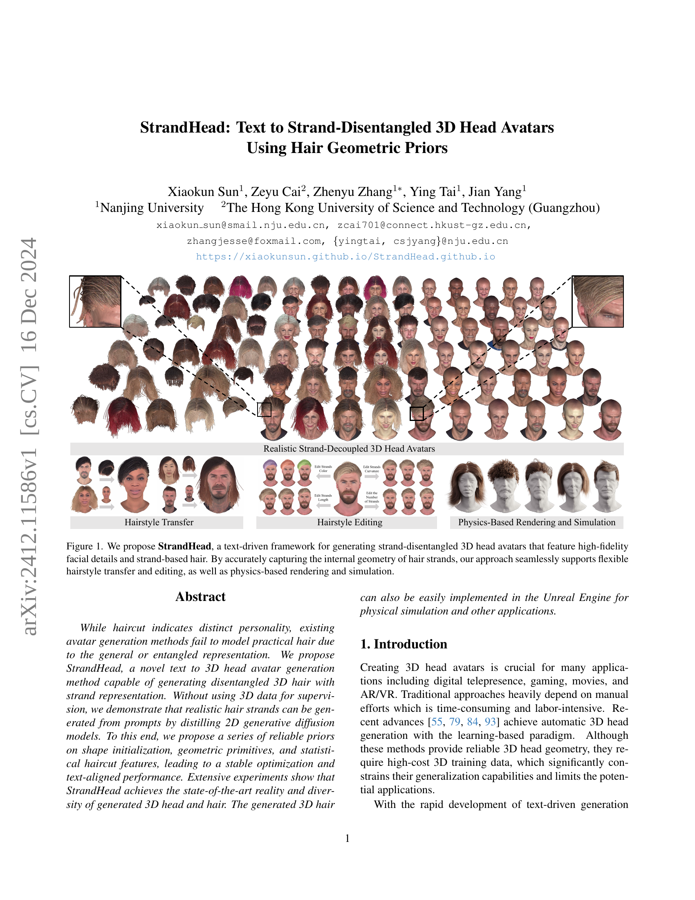
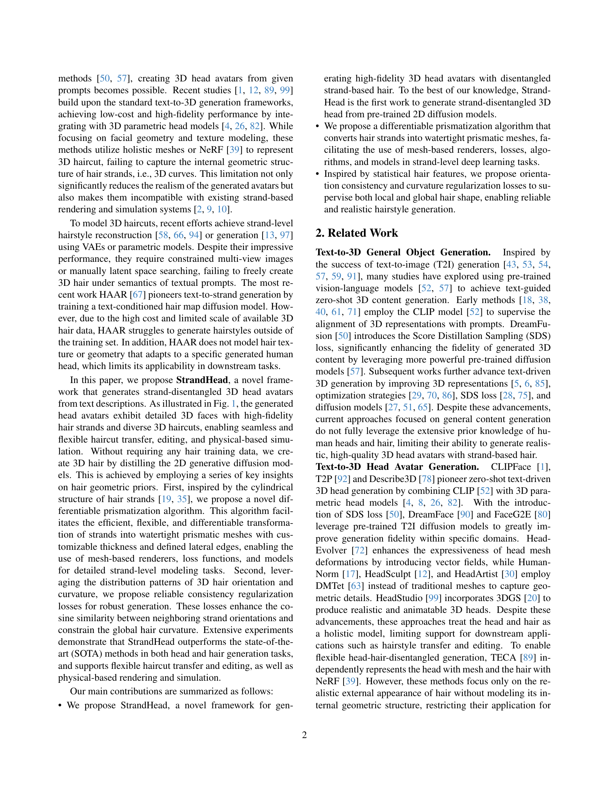
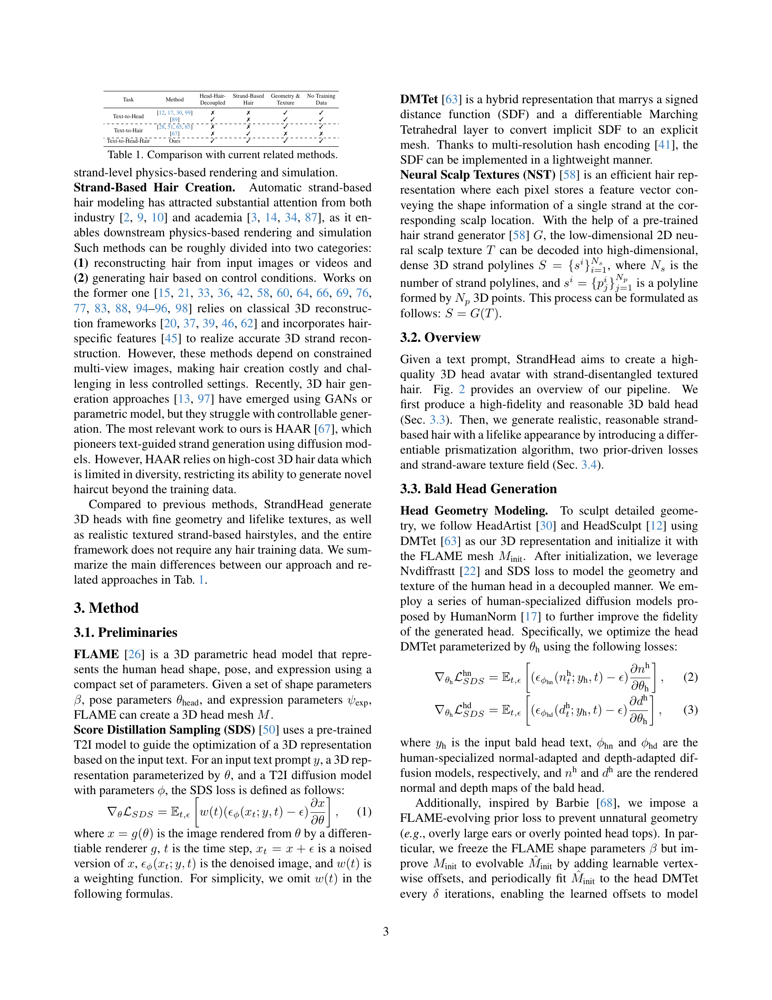
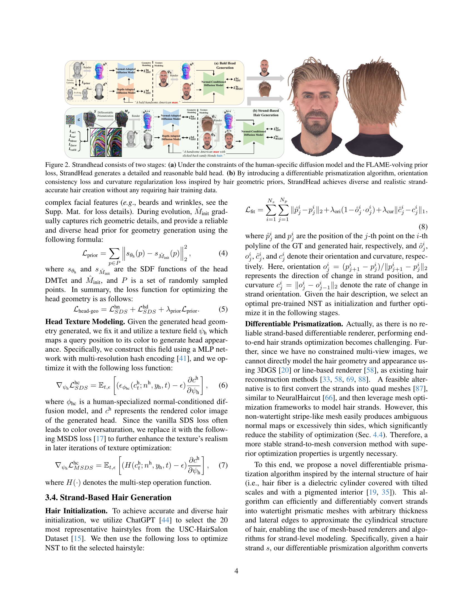
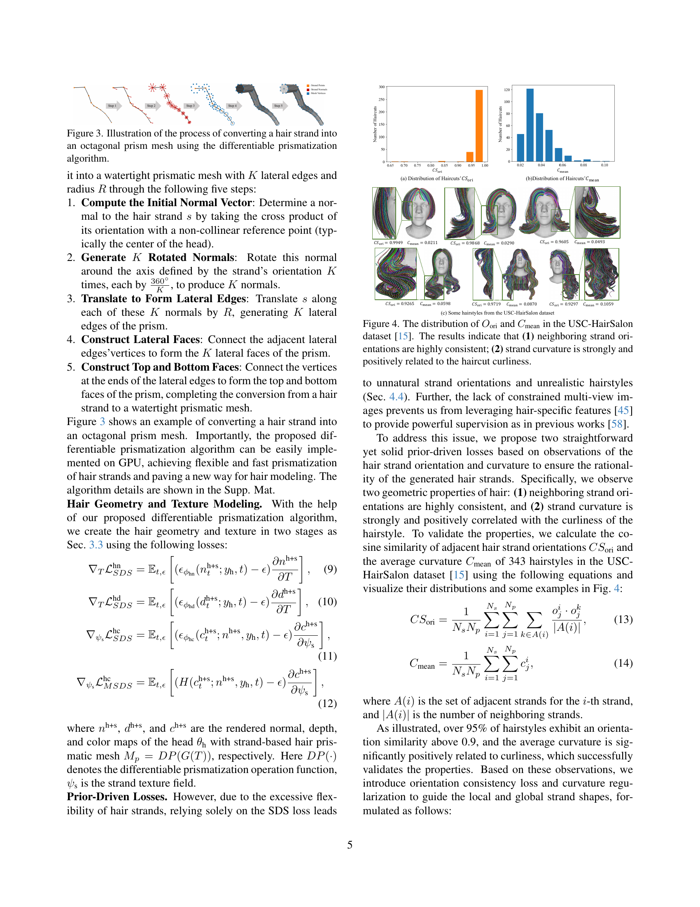
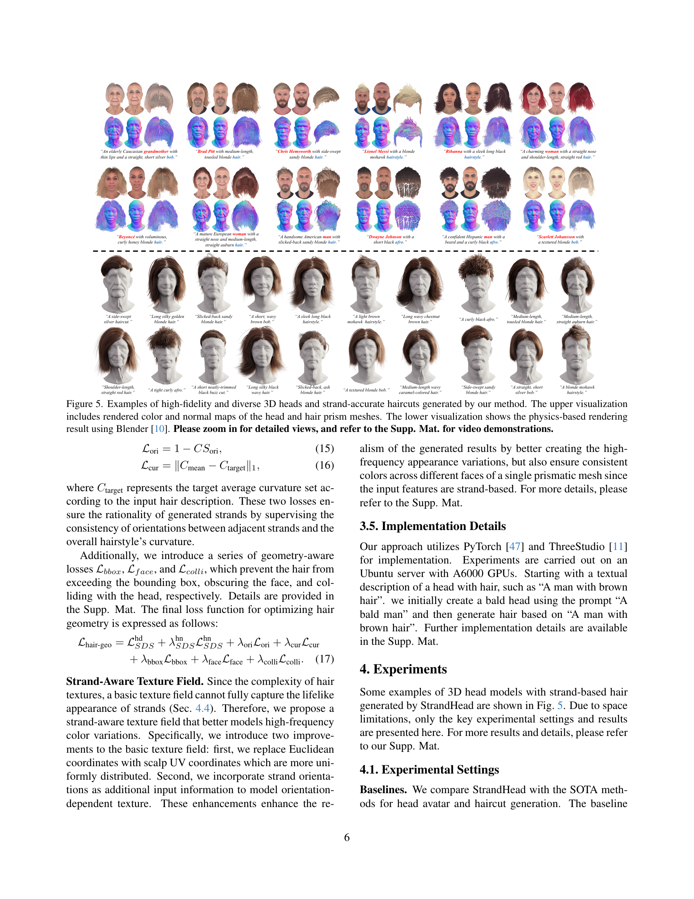
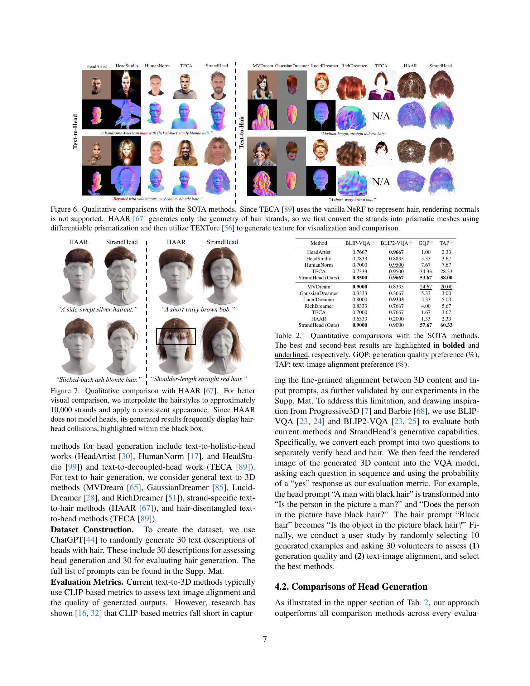
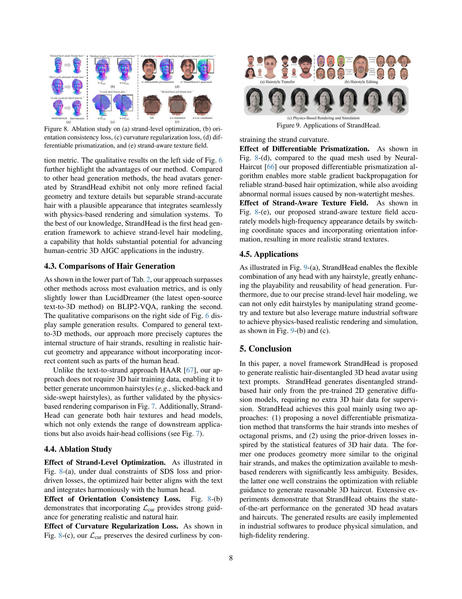
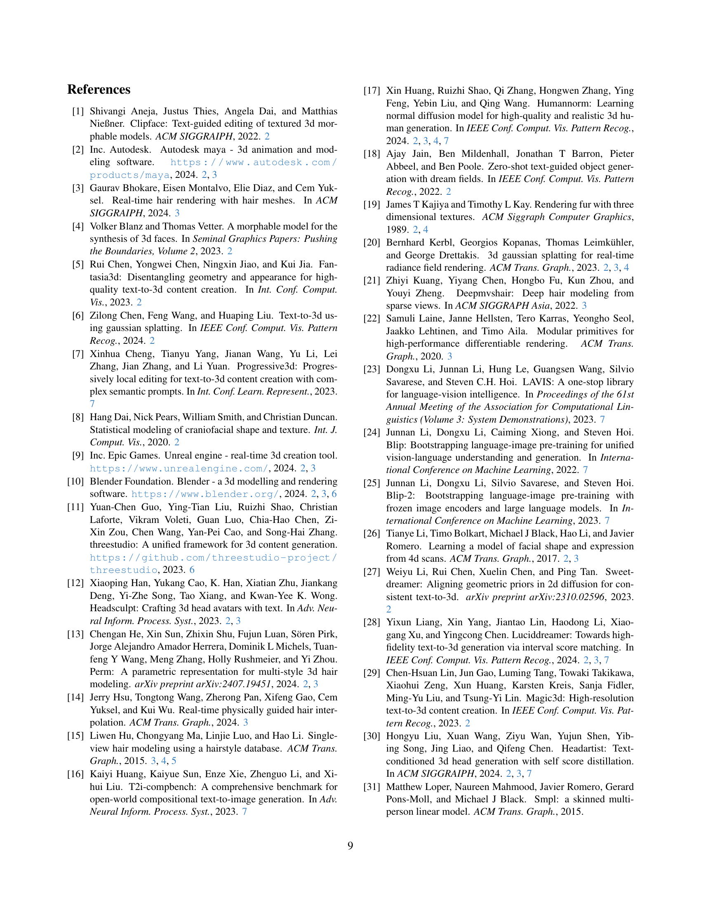
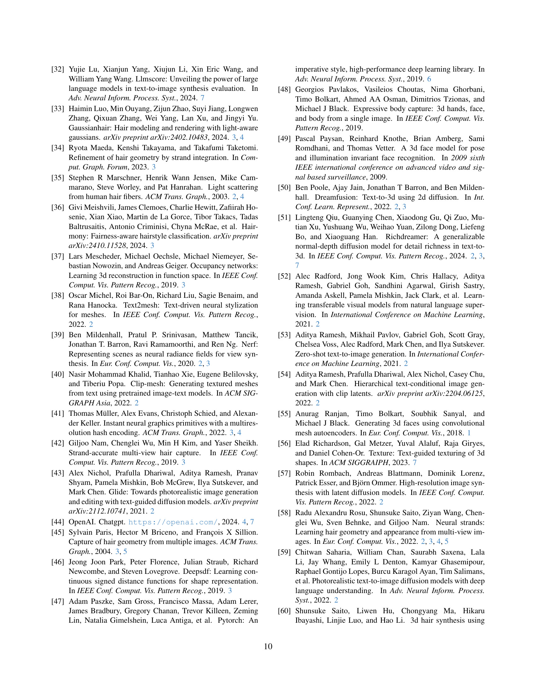
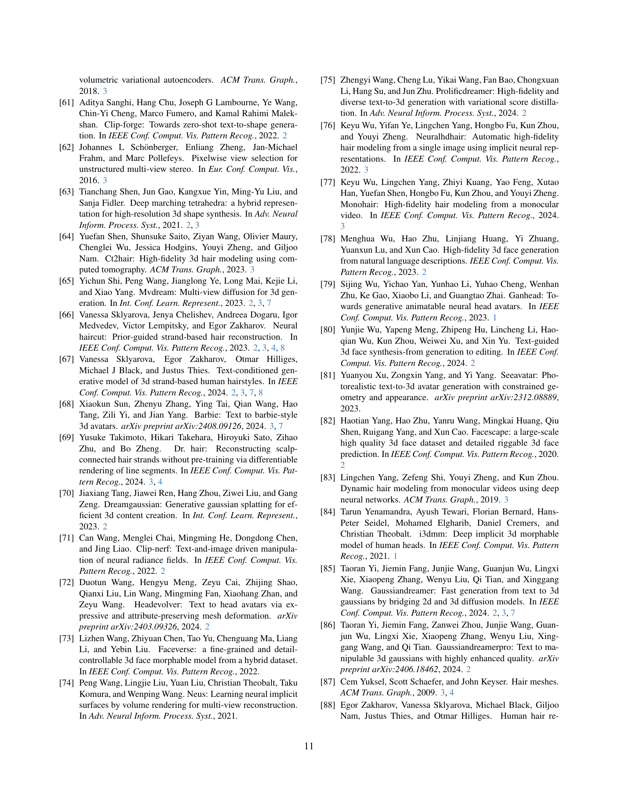
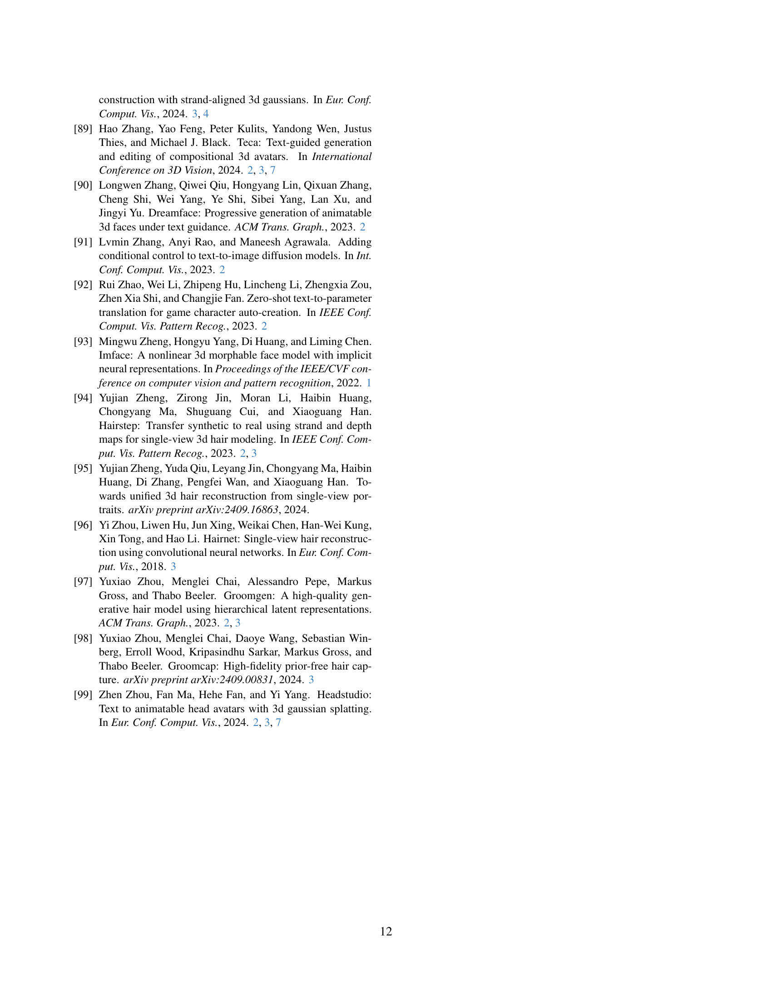
