 


 2412.11815 
 Junhao Zhuang et el. 
 
 🤗 2024-12-17 
 



↗ arXiv


↗ Hugging Face


↗ Papers with Code


### TL;DR



**만화나 만화책의 자동 채색은 인건비를 줄이고 생산성을 높일 수 있는 잠재력이** 크지만, 특히 ID 일관성을 유지하면서 여러 프레임에 걸쳐 색상을 정확하게 매핑하는 데 어려움이 있습니다. 기존의 채색 방법은 제어 가능성과 일반화가 제한되어 이러한 요구를 충족하지 못했습니다. 흑백 이미지 시퀀스를 자동으로 채색하는 것은 어렵습니다.

ColorFlow는 **참조 이미지 풀에서 색상을 매핑**하여 흑백 이미지 시퀀스에 생기를 불어넣는 **3단계 확산 기반 프레임워크**입니다. 검색 증강 파이프라인(RAP)은 참조 이미지에서 관련 색상 패치를 추출하여 시작합니다. 그런 다음 상황 내 채색 파이프라인(ICP)은 이러한 패치를 사용하여 강력한 상황 내 학습을 수행하고 두 가지 분기 설계로 채색을 수행합니다. 첫 번째 분기는 색상 ID 추출을 처리하고 두 번째 분기는 실제 채색 프로세스를 처리합니다. 마지막으로 안내형 초고해상도 파이프라인(GSRP)은 고해상도 컬러 이미지를 생성합니다. ColorFlow는 **여러 메트릭에서 기존 모델보다 우수한 성능을 보여** 주며 특히 FID 메트릭에서 37% 감소를 달성합니다. 이 프레임워크는 만화 채색 작업을 자동화하는 동시에 캐릭터와 물체 ID를 충실하게 보존하는 효과적인 솔루션을 제공합니다.



#### Key Takeaways


 ColorFlow는 ID 보존을 통해 흑백 만화 시퀀스를 채색하는 최초의 모델입니다. 



 ColorFlow는 참조 풀에서 색상을 매핑하는 검색 증강 파이프라인을 활용합니다. 



 ColorFlow-Bench는 참조 기반 채색을 위한 포괄적인 벤치마크를 설정합니다. 


#### Why does it matter?
**흑백 만화 시퀀스의 자동 채색은 애니메이션 및 만화 산업에 상당한 이점을 제공합니다.** ColorFlow는 참조 이미지에서 색상을 매핑하여 이 문제를 해결하는 최첨단 솔루션을 제시합니다. 연구원들은 이 획기적인 접근 방식을 통해 **색상 일관성과 ID 보존 문제를 해결하는 방법을 배울** 수 있습니다. ColorFlow-Bench 벤치마크는 **향후 연구를 위한 귀중한 리소스**를 제공합니다. 이 논문은 **실제 응용 프로그램이 있는 흥미로운 연구 영역을 강조**하여 혁신과 새로운 발견의 길을 열어줍니다.

------
#### Visual Insights

> 🔼 ColorFlow는 참조 이미지 풀을 사용하여 흑백 이미지 시퀀스의 다양한 요소에 대한 색상을 생성하는 모델입니다. 이 그림은 만화 시퀀스의 예를 보여주며, ColorFlow가 캐릭터의 머리 색깔 및 복장과 같은 요소의 색상을 참조 이미지와 일치시켜 색상 일관성을 유지하는 방법을 보여줍니다. ColorFlow는 이미지 시퀀스 채색에서 세분화된 ID 보존을 위해 설계된 최초의 모델입니다.
> 

> 
read the caption

> Figure 1:  ColorFlow is the first model designed for fine-grained ID preservation in image sequence colorization, utilizing contextual information. Given a reference image pool, ColorFlow accurately generates colors for various elements in black and white image sequences, including the hair color and attire of characters, ensuring color consistency with the reference images. [Best viewed in color with zoom-in].
> 


| Method | Reference-based | CLIP-IS↑ | FID↓ | PSNR↑ | SSIM↑ | AS↑ | CLIP-IS↑ | FID↓ | PSNR↑ | SSIM↑ | AS↑ |
|---|---|---|---|---|---|---|---|---|---|---|---|---| 
| MC-v2 [46] | | 0.8632 | 48.37 | 13.50 | 0.6987 | 4.753 | 0.8833 | 33.14 | 17.20 | 0.8396 | 4.845 |
| ACDO [2] | | 0.8687 | 39.38 | 15.75 | 0.7672 | 4.540 | 0.8970 | 28.12 | 21.77 | 0.9516 | 4.686 |
| EBMC [28] | ✓ | 0.8542 | 38.77 | 15.21 | 0.7592 | 4.605 | 0.8859 | 19.48 | 20.80 | 0.9474 | 4.702 |
| ScreenVAE [71] | ✓ | 0.7328 | 98.52 | 9.12 | 0.5373 | 4.160 | - | - | - | - | |
| Ours | ✓ | **0.9419** | **13.37** | **25.88** | **0.9541** | **4.924** | **0.9433** | **12.17** | **26.01** | **0.9579** | **5.011** |


> 🔼 이 표는 참조 이미지 기반 채색화에 대한 최신 모델과의 정량적 비교를 보여줍니다. 참조 이미지 없이 입력하는 Manga Colorization V2 (MC-v2), AnimeColorDeOldify (ACDO) 모델과 참조 이미지를 사용하는 Example Based Manga Colorization (EBMC), ScreenVAE 모델을 비교합니다. 각 모델은 두 가지 스타일의 입력 이미지(스크린 스타일, 그레이스케일)에 대해 CLIP-IS, FID, PSNR, SSIM, AS 등의 메트릭으로 평가됩니다. 최고 점수는 굵게 표시됩니다.
> 

> 
read the caption

> Table 1:  Quantitative comparisons with state-of-the-art models for Reference Image-based Colorization. We compare two models without reference image input Manga Colorization V2 (MC-v2) [45] and AnimeColorDeOldify (ACDO) [16], and two reference image-based colorization models, Example Based Manga Colorization (EBMC) [28] and ScreenVAE [71]. Best results are in bold.
> 

### In-depth insights

#### ColorFlow Framework
**ColorFlow 프레임워크**는 흑백 이미지 시퀀스에 생동감 있는 색상을 입히는 혁신적인 접근 방식을 소개합니다. 이 프레임워크는 참조 이미지를 활용하여 **일관된 색상 팔레트**를 보장하며, 시퀀스 전체에서 **캐릭터 및 객체 ID를 유지**합니다. ColorFlow는 **검색 강화 파이프라인(RAP)**, **맥락 내 채색 파이프라인(ICP)** 및 **안내 초고해상도 파이프라인(GSRP)**의 세 가지 주요 단계로 구성됩니다. RAP는 관련 색상 패치를 검색하고, ICP는 검색된 정보를 사용하여 정확한 채색을 수행하며, GSRP는 출력 품질을 향상시킵니다. 이 프레임워크는 만화 제작, 애니메이션 및 흑백 영화 채색과 같은 다양한 응용 분야에 적합합니다. **확장성과 제어 가능성** 덕분에 ColorFlow는 예술 산업을 혁신하고, 창의적인 전문가에게 새로운 가능성을 열어 줄 수 있는 잠재력을 가지고 있습니다.

#### Retrieval-Augmented
**검색 증강(Retrieval-Augmented)**은 검색 엔진과 대규모 언어 모델(LLM)을 결합하여 정보 검색 및 생성 능력을 향상시키는 강력한 기술입니다.  기존 LLM은 학습 데이터에 내재된 지식에 의존하는 반면, 검색 증강은 **실시간 정보 검색**을 통해 최신 정보와 다양한 출처의 지식을 활용할 수 있도록 합니다. 이를 통해 **출처의 신뢰성**을 높이고, **환각(hallucination)** 현상을 줄이며, **정보의 정확성과 범위**를 확장할 수 있습니다. 검색 증강은 질의 응답, 텍스트 요약, 콘텐츠 생성 등 다양한 작업에서 활용될 수 있으며,  **동적이고 진화하는 정보 환경**에 적응하는 데 중요한 역할을 합니다.  하지만 효율적인 검색 및 정보 통합, 검색 결과의 편향성 문제 등은 앞으로 극복해야 할 과제입니다.

#### In-Context Coloring
**맥락 내 채색**은 참조 이미지에서 색상 정보를 가져와 흑백 이미지 시퀀스를 채색하는 것을 말합니다. 이 기술은 만화 제작, 애니메이션, 흑백 필름 복원과 같은 분야에서 활용될 수 있습니다. 맥락 내 채색의 핵심은 단순히 색상을 적용하는 것이 아니라, **참조 이미지의 색상 정보를 활용하여 일관성을 유지하면서 이미지 시퀀스 전체에 걸쳐 등장인물과 객체의 색상 정체성을 보존**하는 것입니다. 예를 들어 만화 캐릭터의 머리카락 색, 의상, 배경 등의 색상을 시퀀스 전체에서 일관되게 유지해야 합니다. 이를 위해 **셀프 어텐션 메커니즘**과 같은 딥러닝 기술이 사용됩니다. 맥락 내 채색은 기존의 채색 방식에 비해 더욱 정교하고 자동화된 접근 방식을 제공하며, **시각적 스토리텔링의 품질을 향상**시키고 **제작 효율성을 높일 수 있는 잠재력**을 가지고 있습니다.

#### Sequence Colorization
**시퀀스 컬러화**는 흑백 이미지 시퀀스에 **일관된 색상을 적용하는 작업**입니다. 만화, 애니메이션, 영화 등의 산업 분야에서 컬러 작업 자동화에 대한 수요가 높아짐에 따라 이 기술의 중요성이 더욱 커지고 있습니다. 시퀀스 컬러화는 단일 이미지 컬러화와 달리, **프레임 간의 색상 일관성**을 유지해야 하므로 더욱 까다로운 과제입니다. 등장인물의 의상이나 머리카락 색상과 같이 **고유 식별 정보가 있는 요소**의 색상을 **정확하게** 표현하고, 배경의 색상 변화는 최소화하여 **자연스러운** 시퀀스를 만들어야 합니다. 이를 위해 참조 이미지를 활용하여 색상 정보를 추출하고, 딥러닝 모델을 통해 프레임 간 색상 일관성을 학습하는 방법 등이 연구되고 있습니다. 시퀀스 컬러화 기술은 **창의적인 산업 분야**의 생산성 향상에 크게 기여할 수 있는 잠재력을 가지고 있습니다.

#### Diffusion and LoRA
**확산 모델**은 노이즈 제거 과정을 통해 이미지를 생성하는 데 사용됩니다. **LoRA(Low-Rank Adaptation)**는 사전 훈련된 확산 모델의 가중치를 효율적으로 조정하는 기술입니다. LoRA를 사용하면 **계산 비용을 줄이면서** 특정 작업이나 스타일에 맞게 모델을 **미세 조정**할 수 있습니다. 이는 **새로운 개념을 학습하거나 특정 출력을 제어**하는 데 특히 유용합니다. 확산 모델에서 LoRA를 사용하면 **안정적인 확산**과 같은 사전 훈련된 모델의 강력한 생성 기능을 활용하면서 **제어 가능성과 효율성**을 향상시킬 수 있습니다.

### More visual insights

More on figures

> 🔼 ColorFlow는 만화 이미지 시퀀스의 자동 채색을 위한 프레임워크입니다. 이 그림은 ColorFlow의 세 가지 주요 구성 요소인 검색 기반 파이프라인(RAP), 문맥 내 채색 파이프라인(ICP), 안내 초고해상도 파이프라인(GSRP)을 보여줍니다. RAP는 참조 이미지 풀에서 관련 있는 색상 패치를 검색합니다. ICP는 검색된 패치에서 문맥 정보를 활용하여 흑백 이미지를 채색합니다. GSRP는 채색된 이미지를 업샘플링하여 고해상도 출력을 생성합니다. 이러한 각 구성 요소는 흑백 이미지 시퀀스에서 인스턴스의 색상 일관성을 유지하면서 고품질 채색을 보장하는 데 필수적입니다.
> 

> 
read the caption

> Figure 2:  The overview of ColorFlow. This figure presents the three primary components of our framework: the Retrieval-Augmented Pipeline (RAP), the In-context Colorization Pipeline (ICP), and the Guided Super-Resolution Pipeline (GSRP). Each component is essential for maintaining the color identity of instances across black-and-white image sequences while ensuring high-quality colorization.
> 

> 🔼 이 그림은 ColorFlow의 Patch-Wise 훈련 전략을 보여줍니다. 고해상도 이미지를 학습하는 데 필요한 계산량을 줄이기 위해, 훈련 단계에서는 이미지를 여러 패치로 나누어 학습합니다. 왼쪽 상자는 훈련 단계에서 분할된 이미지 패치와 마스크를, 오른쪽 상자는 추론 단계에서 사용되는 전체 이미지와 마스크를 보여줍니다. 이 전략을 통해 각 반복에서의 훈련 시간을 단축하고 모델의 빠른 수렴을 촉진합니다.
> 

> 
read the caption

> Figure 3:  Patch-Wise training strategy is designed to reduce the computational demands of training on high-resolution stitched images. The left box displays segmented stitched images from the training phase, with the corresponding masks also segmented accordingly. The right box presents the complete stitched image and masks for the inference phase.
> 

> 🔼 이 그림은 스크린스타일 증강 기법을 보여줍니다. 왼쪽에서 오른쪽으로, 컬러 만화, 흑백 만화, 흑백 만화와 ScreenVAE 출력물 사이의 선형 보간(비율 0.66 및 0.33), ScreenVAE 출력물이 나타납니다. ScreenVAE는 컬러 만화를 일본식 흑백 스타일로 자동 변환하는 기술입니다. 본 연구에서는 흑백 이미지와 ScreenVAE 출력물을 선형적으로 보간하여 입력 이미지를 증강시켰습니다. 이를 통해 모델이 다양한 스타일에 더 잘 적응하고 색상화 성능을 향상시킬 수 있습니다.
> 

> 
read the caption

> Figure 4:  Screenstyle augmentation. From left to right: the colored manga, the grayscale manga, linear interpolations between the grayscale manga and the ScreenVAE [71] output with proportions of 0.66 and 0.33, the ScreenVAE output.
> 

> 🔼 이 그림은 선택한 채색 영역(빨간색 원으로 표시)의 self-attention 맵에 대한 히트맵 시각화를 보여줍니다. Self-attention 맵은 ColorFlow 모델이 참조 이미지에서 색상 정보를 가져와 입력 이미지의 해당 영역을 채색하는 방법을 이해하는 데 도움이 됩니다. 히트맵의 밝은 부분은 모델이 해당 영역에 더 많은 주의를 기울이고 있음을 나타냅니다.
> 

> 
read the caption

> Figure 5:  Visualization of the heatmap for the self-attention map of the selected colorization region (encircled in red).
> 

> 🔼 이 그림은 만화 채색 작업에서 ColorFlow를 최신 기술(SOTA) 접근 방식과 비교한 결과를 보여줍니다. ColorFlow는 참조 이미지를 사용하여 원본 이미지와 매우 유사한 색상을 생성하여 뛰어난 미적 품질을 보여줍니다. 비교 대상에는 참조 이미지를 사용하지 않는 MC-v2와 ACDO, 참조 이미지 기반 채색 모델인 EBMC와 Style2Paint가 포함됩니다. ColorFlow는 다른 모델에 비해 색상 일관성 및 정확도가 크게 향상되었습니다.
> 

> 
read the caption

> Figure 6:  Comparison of our method with SOTA approaches in the manga colorization. Our method exhibits superior aesthetic quality, producing colors that more closely match the original image. [Best viewed in color with zoom-in]
> 

> 🔼 Figure 7은 애니메이션 스토리보드 채색화에서 ColorFlow와 다른 기법들을 비교한 결과를 보여줍니다. ColorFlow는 참조 이미지를 활용하여 원본 이미지의 색상과 유사하게 채색하면서 뛰어난 심미적 품질을 보여줍니다. MC-v2, EBMC, ACDO와 같은 다른 기법들은 ColorFlow만큼 정확하고 심미적으로 만족스러운 결과를 생성하지 못합니다.
> 

> 
read the caption

> Figure 7:  Comparison of ColorFlow with other approaches in the animation storyboard colorization. Our method exhibits superior aesthetic quality, producing colors that more closely match the original image. [Best viewed in color with zoom-in]
> 

> 🔼 Figure 8은 ColorFlow를 사용한 라인 아트와 자연 장면의 채색 결과를 보여줍니다. 만화, 애니메이션 스토리보드뿐만 아니라 라인 아트와 자연 사진에도 ColorFlow가 효과적으로 적용될 수 있음을 보여줍니다. 이는 ColorFlow의 견고함과 적응성을 강조하며 다양한 스타일과 콘텐츠 유형을 효과적으로 처리하는 강력한 일반화 능력을 보여줍니다.
> 

> 
read the caption

> Figure 8:  Colorization results for line art and natural scenario.
> 

> 🔼 이 그림은 ColorFlow라는 새로운 방법을 사용하여 흑백 만화 이미지를 컬러화한 결과를 보여줍니다. ColorFlow는 참조 이미지에서 색상 정보를 검색하고, 두 개의 브랜치 디자인을 사용하여 만화 프레임에서 캐릭터와 객체의 색상 일관성을 유지하면서 흑백 만화 이미지 시퀀스를 컬러화합니다.
> 

> 
read the caption

> Figure 9:  Colorization results of black and white manga using ColorFlow. [Best viewed in color with zoom-in]
> 

> 🔼 이 그림은 ColorFlow를 사용하여 라인 아트를 채색한 결과를 보여줍니다. ColorFlow는 참조 이미지에서 색상 정보를 가져와 흑백 라인 아트에 적용하여 자연스럽고 생동감 있는 채색 결과물을 생성합니다. 다양한 라인 아트 스타일과 여러 참조 이미지를 사용한 예시를 통해 ColorFlow의 범용성과 성능을 확인할 수 있습니다.
> 

> 
read the caption

> Figure 10:  Colorization results of line art using ColorFlow. [Best viewed in color with zoom-in]
> 

> 🔼 ColorFlow를 사용한 애니메이션 스토리보드 채색 결과입니다. ColorFlow는 참조 이미지를 활용하여 흑백 애니메이션 스토리보드를 자동으로 채색합니다. 결과 이미지에서 ColorFlow는 등장인물, 배경, 소품 등 다양한 요소들을 일관성 있게 채색하고, 원본 이미지의 스타일과 분위기를 잘 유지하는 것을 확인할 수 있습니다. 특히, 그림자와 하이라이트 등 세부적인 표현도 자연스럽게 구현되어 높은 품질의 결과물을 제공합니다.
> 

> 
read the caption

> Figure 11:  Colorization results of animation storyboard using ColorFlow. [Best viewed in color with zoom-in]
> 

More on tables


| Training | Inference | Inference | CLIP-IS ↑ | FID ↓ | PSNR ↑ | SSIM ↑ | AS ↑ |
|---|---|---|---|---|---|---|---| 
| RAP | RAP | GSRP | | | | | |
| | ✓ | ✓ | 0.9326 | 15.98 | 24.48 | 0.9448 | 4.921 |
| |  | ✓ | 0.9233 | 18.32 | 24.16 | 0.9410 | 4.907 |
| ✓ |  | ✓ | 0.9266 | 17.07 | 24.64 | 0.9464 | 4.914 |
| ✓ | ✓ |  | 0.9322 | 17.85 | 20.12 | 0.8077 | 4.898 |
| ✓ | ✓ | ✓ | **0.9419** | **13.37** | **25.88** | **0.9541** | **4.924** |
> 🔼 이 표는 Retrieval-Augmented Pipeline(RAP)과 Guided Super-Resolution Pipeline(GSRP)이 Retrieval-Augmented Image Sequence Colorization에 미치는 영향을 분석한 ablation study 결과를 보여줍니다. RAP는 관련 있는 참조 이미지에서 색상 정보를 검색하는 데 사용되며, GSRP는 색상화된 이미지의 해상도를 향상시키는 데 사용됩니다. 실험 결과는 RAP와 GSRP를 모두 사용하는 것이 최상의 성능을 제공함을 보여줍니다.
> 

> 
read the caption

> Table 2:  Ablation Study on the Influence of Retrieval-Augmentated Pipeline (RAP) and Guided Super-Resolution Pipeline (GSRP).
> 


| Width × Height (Pixel) | CLIP-IS↑ | FID↓ | PSNR↑ | SSIM↑ | AS↑ |
|---|---|---|---|---|---| 
| 512 × 800 | 0.9372 | 14.91 | 23.51 | 0.9414 | 4.868 |
| 1024 × 1600 | **0.9419** | **13.37** | 25.88 | 0.9541 | 4.924 |
| 1280 × 2000 | 0.9398 | 13.42 | **26.02** | **0.9580** | **4.929** |
> 🔼 이 표는 추론 해상도를 변경하면서 ColorFlow 모델의 성능을 평가한 ablation study 결과를 보여줍니다. 모델은 512x800 해상도로 학습되었지만, 더 높은 해상도(1024x1600, 1280x2000)에서도 일반화 능력을 보여주는 것을 확인할 수 있습니다.
> 

> 
read the caption

> Table 3:  Ablation of Inference Resolution.
> 


| Rank | CLIP-IS↑ | FID↓ | PSNR↑ | SSIM↑ | AS↑ |
|---|---|---|---|---|---| 
| 32 | 0.940 | 13.46 | 25.46 | 0.9521 | 4.920 |
| 64 | **0.9419** | **13.37** | **25.88** | **0.9541** | 4.924 |
| 128 | 0.9376 | 14.31 | 24.79 | 0.9461 | **4.930** |
| 192 | 0.9370 | 14.46 | 24.59 | 0.9440 | 4.914 |
> 🔼 이 표는 LoRA의 Rank 값을 변경하면서 성능 변화를 측정한 ablation study 결과를 보여줍니다. LoRA는 사전 학습된 diffusion 모델에 적용되며, Rank 값이 클수록 사전 학습된 모델 가중치에 대한 변화량이 커집니다. 표에서 볼 수 있듯이 Rank 값이 너무 크거나 작으면 성능이 저하되며, 64가 최적의 Rank 값임을 보여줍니다.
> 

> 
read the caption

> Table 4:  Ablation of LoRA Rank.
> 


| μ | CLIP-IS↑ | FID↓ | PSNR↑ | SSIM↑ | AS↑ |
|---|---|---|---|---|---| 
| 0 | 0.9351 | 14.18 | 25.12 | 0.9501 | **4.927** |
| 1.5 | **0.9419** | **13.37** | **25.88** | **0.9541** | 4.924 |
| 3 | 0.9395 | 13.51 | 25.42 | 0.9509 | 4.917 |
> 🔼 이 표는 시간 단계 이동 샘플링의 영향을 보여주는 절제 연구 결과를 담고 있습니다. 색칠 작업은 주로 높은 시간 단계에서 수행되기 때문에, μ 요소를 통해 높은 시간 단계에서의 샘플링을 강화했습니다. μ = 0, 1.5, 3에 대한 실험 결과가 표에 제시되어 있으며, 이를 통해 추가적인 시간 단계 샘플링의 효과와 μ = 1.5를 사용하는 것의 유효성을 검증할 수 있습니다.
> 

> 
read the caption

> Table 5:  Ablation of Timesteps Sampling.
> 


|                       | Ours | EBMC | MC-v2 | ACDO | ScreenVAE |
| :-------------------- | :--- | :--- | :---- | :--- | :------- |
| Aesthetic Quality ↑    | **4.577** | 3.141 | 2.891 | 2.844 | 1.547    |
| Similarity to Original ↑ | **4.673** | 3.316 | 2.984 | 2.642 | 1.385    |
| Consistency in Sequences ↑ | **4.538** | 3.399 | 3.215 | 2.540 | 1.308    |
> 🔼 사용자 연구 결과를 요약한 표입니다. 심미적 품질, 원본 이미지와의 유사성, 이미지 시퀀스의 색상 ID 일관성이라는 세 가지 기준에 따라 다양한 모델의 평균 점수를 보여줍니다. 각 기준별로 점수가 높을수록 해당 측면에서 모델의 성능이 우수함을 나타냅니다.
> 

> 
read the caption

> Table 6:  Results of the User Study. The table presents the average Score for different models based on aesthetic quality, similarity to the original image, and consistency in sequences
> 

### Full paper


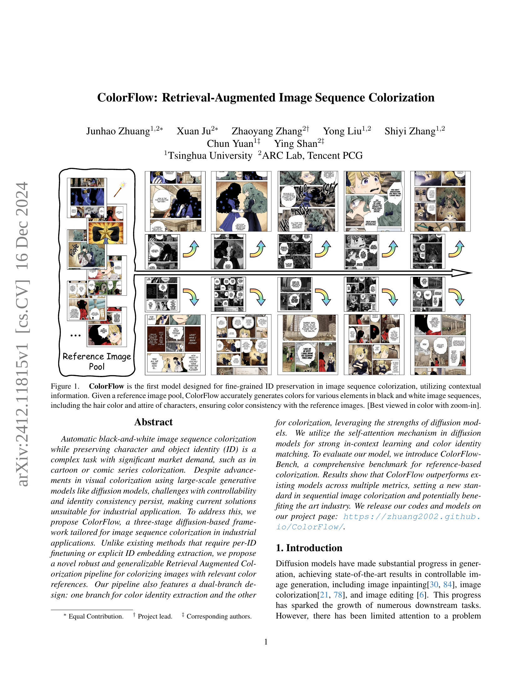
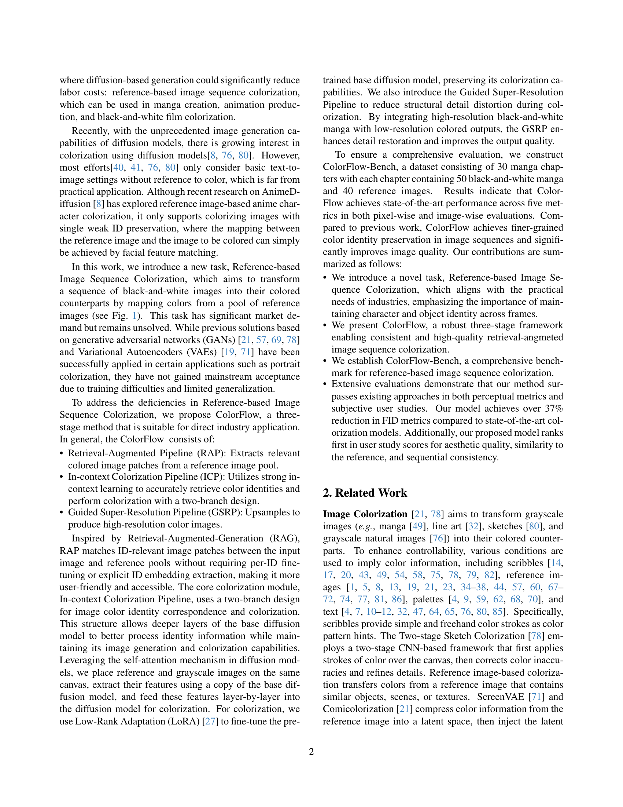
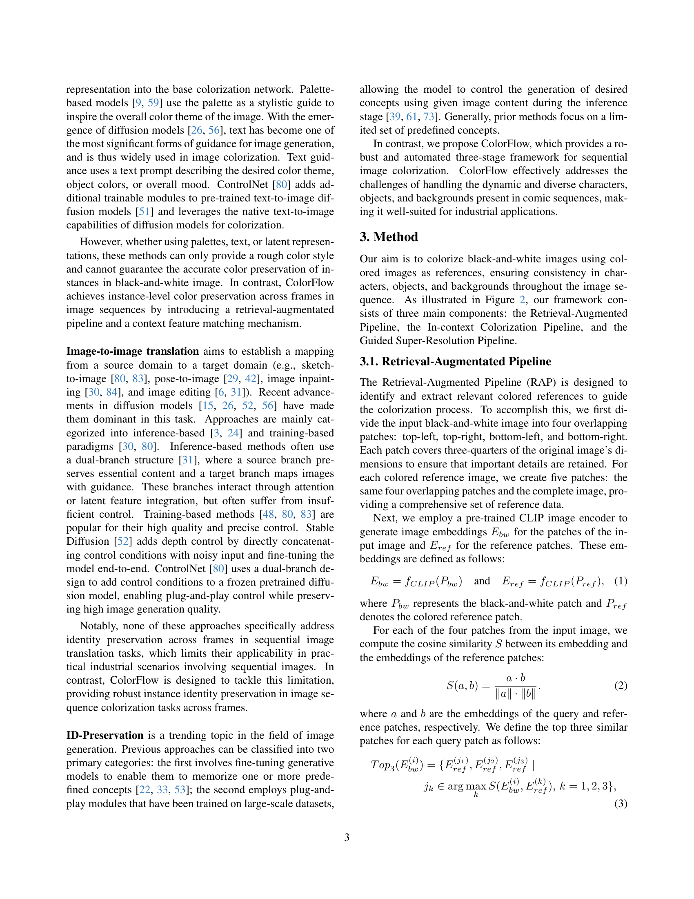
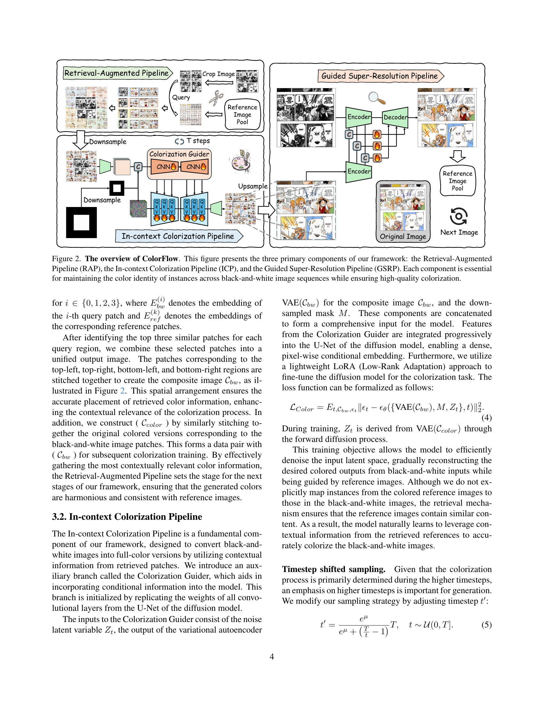
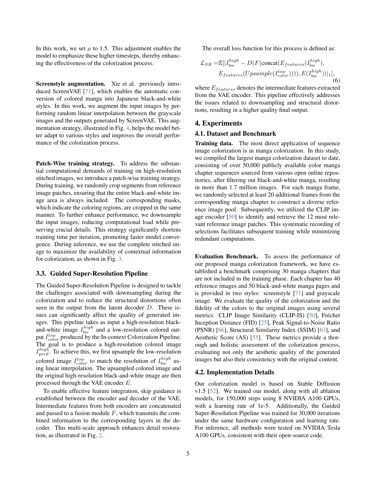
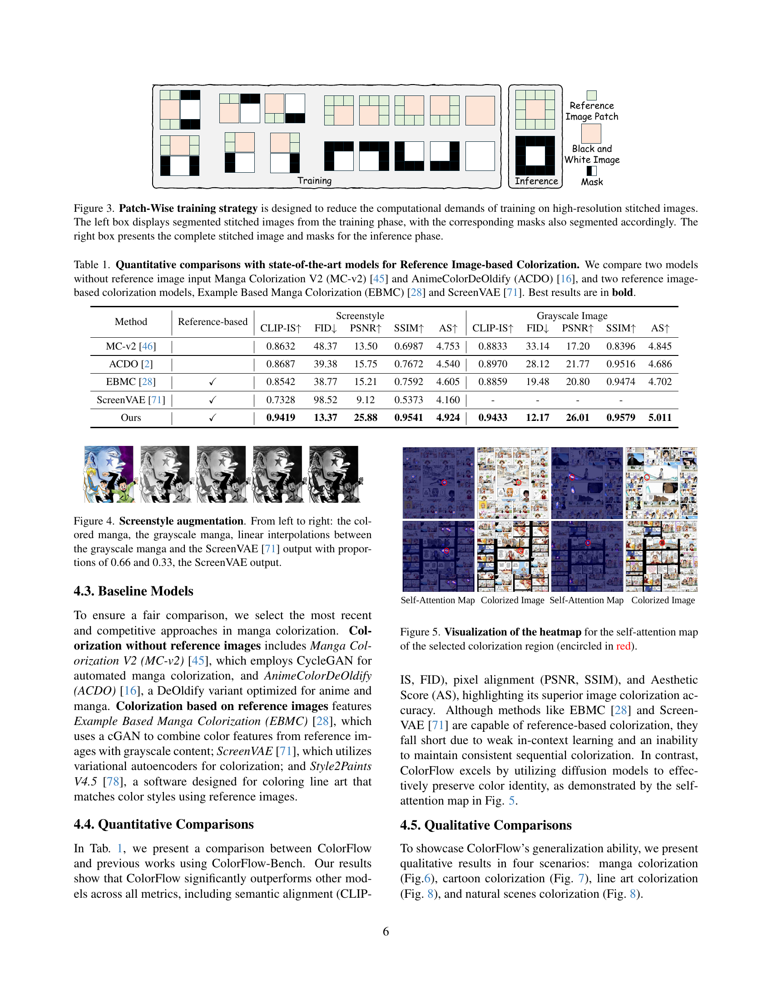
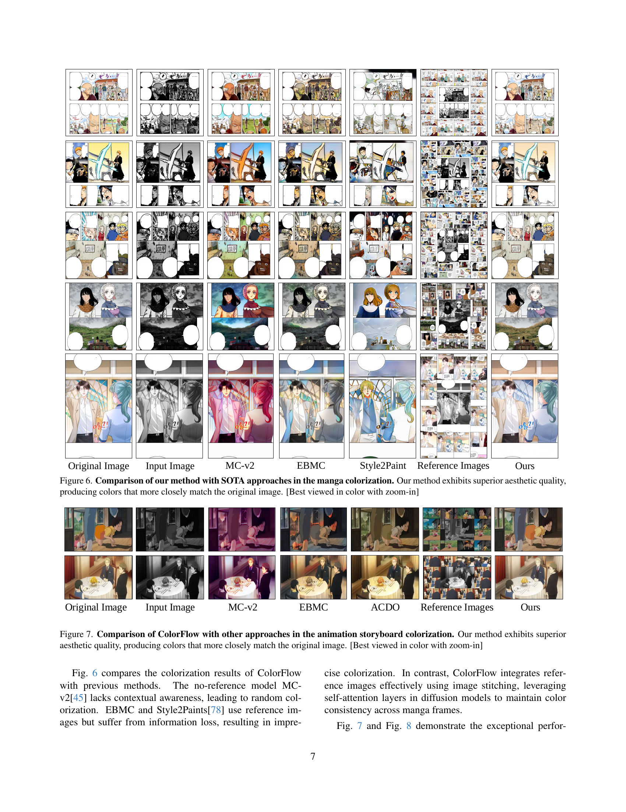
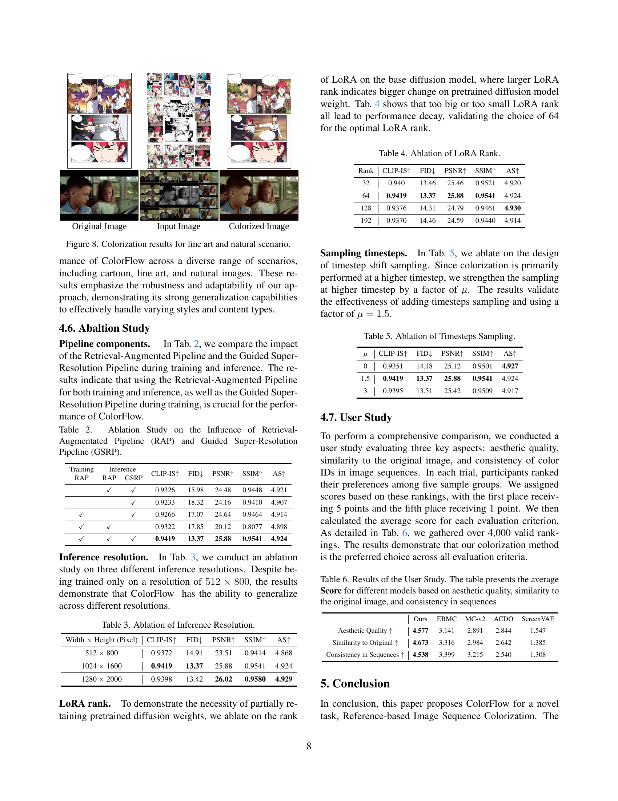
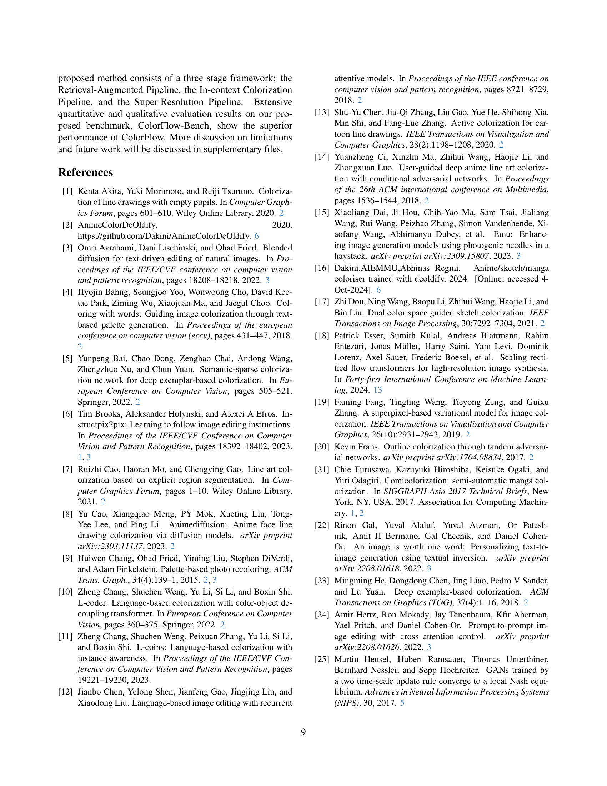
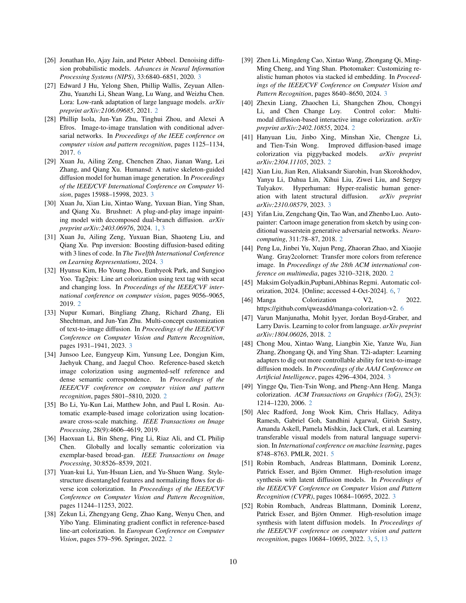
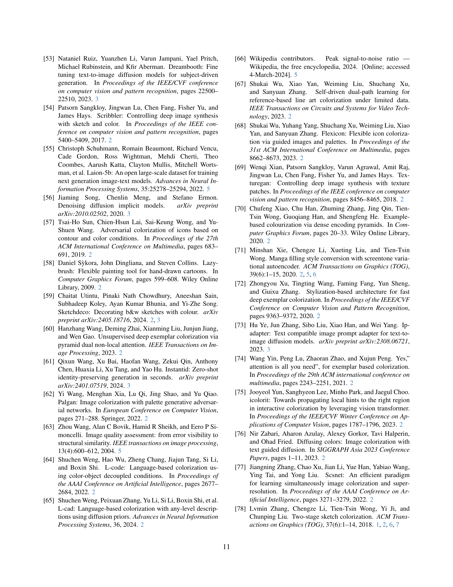
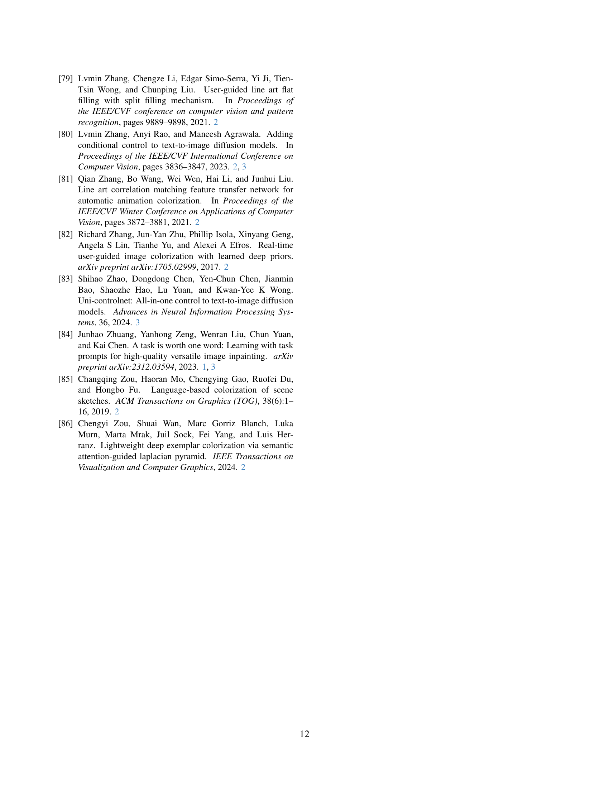
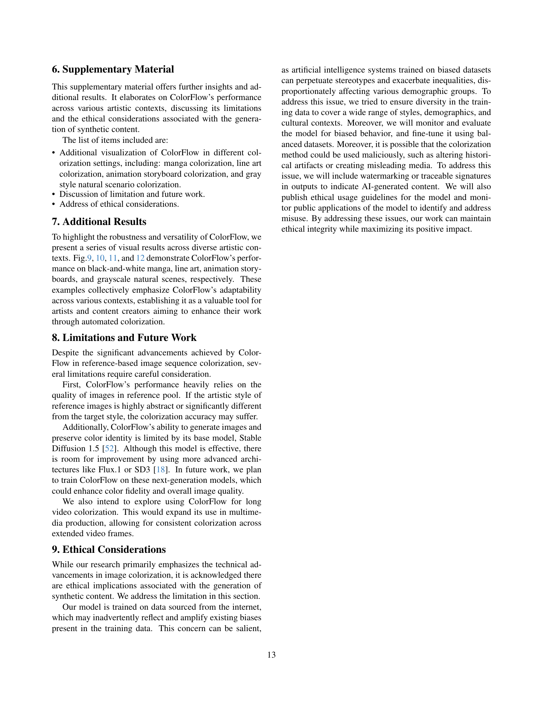

