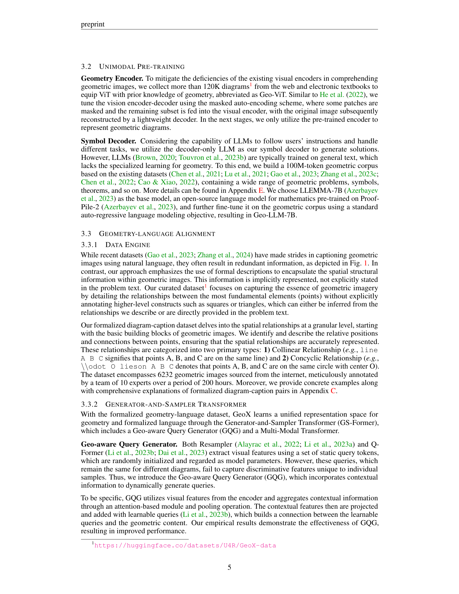

 


 2412.11863 
 Renqiu Xia et el. 
 
 🤗 2024-12-17 
 



↗ arXiv


↗ Hugging Face


↗ Papers with Code


### TL;DR



**기하학 문제 해결(GPS)은 다이어그램 이해, 기호 해석 및 복잡한 추론이 필요한 어려운 작업**. 멀티모달 대규모 언어 모델(MLLM)은 일반 작업에는 능숙하지만 자동 GPS에는 어려움을 겪습니다. 이러한 **한계는 자연 이미지와 텍스트에 대한 사전 훈련과 문제 해결 과정에서 자동 검증 부족으로 인해 발생**. 또한 현재의 기하학 전문 모델은 작업별 설계로 인해 광범위한 기하학 문제에 덜 효과적입니다.

**GeoX는 기하학적 이해 및 추론 작업에 중점을 둔 멀티모달 대규모 모델**. 기하학적 다이어그램-기호와 자연 이미지-텍스트 간의 차이점을 고려하여 단일 모드 사전 훈련을 도입하여 다이어그램 인코더와 기호 디코더를 개발하고 기하학적 이미지와 기호에 대한 이해를 향상시킵니다. 또한, 형식화된 기하학-언어 정렬을 도입하여 단일 모드 기하학 전문가 간의 양식 격차를 해소합니다. GeoX는 시각적 명령 튜닝을 통해 기하학적 이미지와 질문을 입력으로 받아 검증 가능한 솔루션을 생성합니다. **GeoX는 GeoQA, UniGeo, Geometry3K 및 PGPS9k와 같은 공개적으로 인정받는 벤치마크에서 일반 및 기하학 전문 모델보다 우수한 성능을 보입니다**.



#### Key Takeaways


 GeoX는 형식화된 시각-언어 사전 훈련을 활용하여 기하학 문제 해결 능력을 향상시킵니다. 



 GeoX는 혁신적인 Generator-and-Sampler Transformer(GS-Former)를 사용하여 기하학적 다이어그램과 기호를 이해하고 추론합니다. 



 GeoX는 공개적으로 인정받는 벤치마크에서 최첨단 결과를 달성했습니다. 


#### Why does it matter?
"
**복잡한 기하학 문제 해결을 위한 새로운 접근 방식을 제시한 중요한 논문**. 멀티모달 대규모 언어 모델(MLLM)의 한계를 해결하는 **새로운 모델인 GeoX를 소개**. GeoX는 형식화된 시각-언어 사전 훈련과 혁신적인 GS-Former 아키텍처를 활용하여 기하학적 다이어그램과 기호를 이해하고 추론하는 능력을 향상시킵니다. 이 연구는 **기하학 문제 해결 분야의 중요한 발전을 나타내며**, 컴퓨터 비전, 자연어 처리, 인공지능 분야의 연구자들에게 **새로운 연구 방향을 제시**합니다.

------
#### Visual Insights

> 🔼 이 그림은 GeoX의 주요 특징을 강조합니다. 1) GPT-4V와 GeoX 비교: GPT-4V는 종종 예상 결과 또는 해결 방법을 제공하지 못하며, 전문가의 지식과 단계별 분석이 필요한 검증 과정은 노동 집약적입니다. 2) 형식 언어와 자연어(비형식 언어) 비교: 자연어를 사용하는 기존 연구와 달리, GeoX는 효율성과 검증 가능성 때문에 형식 언어를 사용하며 기하학적 작업에 더 적합합니다. 3) GeoX는 기하학적 이미지와 질문을 입력으로 받아 검증 가능한 프로그램 시퀀스를 생성하고 솔버를 사용하여 해결하는 통합 형식으로 기하학적 작업을 해결합니다.
> 

> 
read the caption

> Figure 1: Highlights of GeoX: 1) Comparison between GPT-4V (OpenAI, 2023) and GeoX: GPT-4V often fails to provide the expected results or solving approaches. Besides, verifying GPT-4V’s solutions is labor-intensive, requiring expert knowledge and step-by-step analysis. 2) Comparison between formal and natural (informal) language: Unlike existing works (Gao et al., 2023; Zhang et al., 2024) that use natural language, we advocate for formal language due to its effectiveness and verifiability, making it more suitable for geometric tasks. 3) GeoX solves geometric tasks in a unified format by taking geometric images and questions as input, generating verifiable program sequences, and performing solving with a solver.
> 


| Methods | Metric | Total | Angle | Length |
|---|---|---|---|---| 
| **_Generalists_** | | | | | 
| mPLUG-Owl2 (Ye et al., 2023) | Top-1 | 16.0 | 16.5 | 15.9 |
| LLaVA-v1.5 (Liu et al., 2024) | Top-1 | 20.7 | 20.9 | 19.8 |
| Qwen-VL (Bai et al., 2023) | Top-1 | 24.4 | 23.7 | 24.4 |
| GPT-4V (OpenAI, 2023) | Top-1 | 43.4 | 39.3 | 49.8 |
| **_Specialists_** | | | | |
| LLaVA-v1.5 (Liu et al., 2024) + **Solver** | Top-1 | 9.4 | 14.9 | 3.2 |
| NGS (Chen et al., 2021) | Top-1 | 46.3 | - | - |
| UniMath-T5 (Liang et al., 2023) | Top-1 | 49.6 | - | - |
| UniMath-Flan-T5 (Liang et al., 2023) | Top-1 | 50.0 | - | - |
| **GeoX (Ours)** | | **54.9** | **62.8** | **45.2** |

> 🔼 GeoQA 벤치마크에서 다양한 방법의 정확도 메트릭 비교를 보여주는 표입니다. 일반적인 모델(예: mPLUG-Owl2, LLaVA, Qwen-VL, GPT-4V)과 특수 목적 모델(예: NGS, FiLM, RN, MCAN, BERT)의 성능을 비교합니다.
> 

> 
read the caption

> Table 1:  Comparison of various methods on the GeoQA benchmark with different accuracy metrics.
> 

### In-depth insights

#### GeoX: GPS via Formalized VLP
**GeoX**는 형식화된 시각-언어 사전 훈련(VLP)을 통해 기하학 문제 해결(GPS)을 위한 강력한 다중 모드 대형 언어 모델입니다. GeoX는 기하학적 다이어그램과 기호를 이해하고 추론하는 데 있어 일반 MLLM의 **한계를 해결**합니다. GeoX의 핵심은 **형식화된 훈련 체계**로, 단일 모드 사전 훈련, 형식화된 기하학-언어 정렬, 시각적 명령어 조정의 세 가지 단계로 구성됩니다. 단일 모드 사전 훈련은 기하학적 이미지와 기호에 대한 이해를 향상시킵니다. **GS-Former**를 사용한 기하학-언어 정렬은 다이어그램과 형식 언어 간의 차이를 해소합니다. 시각적 명령어 조정을 통해 GeoX는 검증 가능한 솔루션을 생성합니다. GeoX는 GeoQA, UniGeo, Geometry3K, PGPS9k와 같은 벤치마크에서 최첨단 결과를 달성하여 **복잡한 기하학적 문제에 대한 추론 능력을 입증**합니다. 이는 **형식화된 VLP가 GPS 작업 성능 향상에 크게 기여**한다는 것을 보여줍니다.

#### Unimodal & Alignment Pre-training
**단일 모드 사전 훈련**은 기하학적 다이어그램과 기호에 대한 이해를 향상시키는 데 중점을 둡니다. **기하학 인코더**는 마스크 자동 인코딩을 사용하여 기하학적 이미지를 학습하고, **기호 디코더**는 기하학 코퍼스에서 미세 조정된 디코더 전용 LLM입니다. **기하학-언어 정렬**은 형식화된 설명을 사용하여 기하학적 의미론적 특징을 효과적으로 정렬합니다. **GS-Former(생성기 및 샘플러 변환기)**는 지오메트리 콘텐츠 인식 쿼리를 생성하고 의미론적 학습의 지침에 따라 중요하지 않은 표현을 제거합니다. 이 접근 방식은 일반 MLLM의 한계를 해결하고 기하학적 문제 해결 능력을 향상시킵니다.

#### GS-Former: Query Gen & Sampling
**GS-Former: 쿼리 생성 및 샘플링**은 기하학적 문제 해결을 위한 핵심 구성 요소로, 이미지와 텍스트 간의 효과적인 정렬 및 기하학적 다이어그램의 불균일한 정보 분포 처리를 목표로 합니다. GS-Former는 두 가지 주요 모듈, 즉 Geo-aware Query Generator(GQG)와 Semantics-guided Geometry Sampler(SGS)로 구성됩니다. GQG는 맥락 정보를 통합하여 쿼리를 동적으로 생성함으로써 정적 쿼리의 한계를 극복합니다. 이를 통해 각 샘플의 고유한 특징을 효과적으로 포착할 수 있습니다. SGS는 시맨틱 학습의 지침에 따라 불균일하게 분포된 기하학적 신호에서 유익하지 않은 표현을 제거하여 모델 성능을 향상시킵니다. 이 두 가지 모듈의 조합은 기하학적 추론을 위한 풍부하고 차별적인 표현을 생성하여 효과적인 문제 해결을 가능하게 합니다.

#### Instruction Tuning for Solution Gen
**명령 튜닝은 GeoX의 핵심**으로, 기하학 문제 해결 능력을 향상시키는 데 중요한 역할을 합니다. 이 과정을 통해 모델은 주어진 기하학적 이미지와 질문을 기반으로 **검증 가능한 솔루션을 생성**하는 방법을 학습합니다. 기존 MLLM은 종종 정확한 풀이 과정 없이 정답을 제시하는 경우가 있었지만, GeoX는 명령 튜닝을 통해 풀이 과정의 **정확성과 해석 가능성을 모두 확보**합니다. 특히, GeoX는 입력 이미지와 질문을 이해하고, GS-Former를 통해 의미적으로 정렬된 기하학적 특징을 추출하며, Geo-LLM을 통해 **단계별 솔루션을 생성**합니다. 이렇게 생성된 솔루션은 Symbolic Solver에 의해 검증되어 최종 답변의 정확성을 보장합니다. 요약하자면, 명령 튜닝은 GeoX가 **효과적이고 신뢰할 수 있는 기하학 문제 해결사**로서 기능하는 데 필수적인 요소입니다.

#### Formal vs. Natural Lang. in GPS
**형식 언어**는 기하학 문제 해결에 적합합니다. 자연어는 모호하고 중복될 수 있지만 형식 언어는 명확하고 간결하며 검증 가능합니다. 기호, 모양, 숫자 및 관계에 대한 필수 정보를 제공하여 기하학적 추론을 용이하게 합니다. 형식 언어의 **검증 가능성**은 자동 GPS 시스템에서 중요한데, 이는 단계별 분석을 가능하게 하고 솔루션의 정확성을 보장하는 데 도움이 됩니다. 이와 대조적으로 자연어 캡션을 사용하면 불필요한 정보가 발생하고 해석의 어려움이 발생할 수 있습니다. 따라서 **형식 언어는 기하학적 작업에 더 적합**하며 자동 기하학 문제 해결 시스템에서 효율성과 정확성을 향상시킵니다.

### More visual insights

More on figures

> 🔼 이 그림은 GeoX 모델의 학습 과정에 대한 전체적인 개요를 보여줍니다. GeoX는 형식화된 시각-언어 사전 학습을 통해 자동 기하 문제 해결을 위한 다재다능한 방법을 제시하며, 세 가지 단계로 구성됩니다. 1단계는 기하 시각 및 언어 사전 학습으로, 기하 다이어그램과 기하 기호에 대한 GeoX의 이해 능력을 향상시킵니다. 2단계는 기하-언어 정렬 단계로, 생성기 및 샘플러 변환기(GS-Former)를 사용하여 기하 다이어그램과 형식 언어 설명 사이의 차이를 해소합니다. 3단계는 종단 간 시각 명령 조정 단계로, GeoX가 입력 기하 문제와 이미지를 기반으로 솔루션을 생성하도록 합니다.
> 

> 
read the caption

> Figure 2: Overview of GeoX for training. We present a versatile method for automatic geometric problem solving through unified formalized vision-language pre-training, which comprises three progressive stages.
> 

> 🔼 이 그림은 단일 모드 사전 훈련의 효과를 보여줍니다. 널리 사용되는 CLIP-ViT-B와 Geo-ViT-B를 비교하고, LLAMA-2-7B, LLEMMA-7B 및 Geo-LLM-7B의 세 가지 LLM 모델을 비교합니다. 각 모델의 성능은 GeoQA, UniGeo, Geometry3K, PGPS9K 벤치마크에서 평가됩니다.
> 

> 
read the caption

> Figure 3: Effectiveness of Uni-modal Pre-training. We compare the widely used CLIP-ViT-B and our Geo-ViT-B, along with three LLM models: LLAMA-2-7B, LLEMMA-7B, and our Geo-LLM-7B.
> 

> 🔼 이 그림은 GeoX 모델이 GeoQA, UniGeo, Geometry3K, PGPS9k 4가지 데이터셋에서 기하 문제를 푸는 과정을 시각적으로 보여줍니다. 각 예시는 문제에 해당하는 그림, GeoX가 예측한 풀이 과정, 정답, 그리고 GeoX의 예측값을 포함합니다. GeoX는 기하학적 기호, 숫자, 연산자를 포함하는 형식화된 프로그램 시퀀스를 생성하여 솔버가 컴파일하고 최종 답을 계산할 수 있도록 합니다.
> 

> 
read the caption

> Figure 4: Visualization results on four datasets by our GeoX.
> 

> 🔼 이 그림은 GeoX가 자연어로 된 기하학 문제를 해결하는 4가지 시각화된 예시를 보여줍니다. 그림의 각 부분은 이미지, 질문, GeoX의 예측, 실제 정답, 예측 정답으로 구성됩니다. GeoX는 접을 수 있는 테이블, 생일 모자, 회전문, 자전거와 같은 다양한 실제 이미지에 대한 기하학적 질문에 답할 수 있음을 보여줍니다.
> 

> 
read the caption

> Figure 5: Four visualized examples of geometric problem in natural images solved by our GeoX.
> 

> 🔼 이 그림은 GS-Former의 어텐션 맵을 다양한 유형의 기하학적 다이어그램(선, 직사각형, 삼각형, 원 등)에 시각화하여 보여줍니다. 밝은 영역은 의사 결정에 더 유용한 것으로 간주되는 영역을 나타내고, 어두운 영역은 의미적으로 관련이 없고 GS-Former에 의해 제거될 정보가 없는 영역을 나타냅니다.
> 

> 
read the caption

> Figure 6:  Attention map of GS-Former on different types of geometric diagrams.
> 

> 🔼 이 그림은 복잡한 기하 문제를 풀기 위해 공식화된 프로그램을 예측하는 데 있어 GPT-40과 GeoX를 비교한 것입니다. GPT-40은 변수 없이 연산만 예측하거나(예: b의 g_equal), 잘못된 변수를 사용하거나(예: c의 gougu_minus 5.0 V_1 V_2 대 gougu_minus 5.0 V_0), 잘못된 연산을 사용하는 등(예: d의 g_equal 대 g_minus) 문제를 보입니다. 반면 GeoX는 이러한 복잡하고 다양한 경우에도 정확한 솔루션을 예측할 수 있습니다.
> 

> 
read the caption

> Figure 7:  Comparison of GPT-4o and GeoX in predicting formalized programs for solving complex geometric problems.
> 

More on tables


| Methods | Metric | Total | Angle | Length |
|---|---|---|---|---| 
| **_Specialists_** | | | | | 
| LLaVA-v1.5 (Liu et al., 2024)+**Solver** | Top-10 | 29.2 | 40.5 | 15.9 |
| FiLM(Perez et al., 2018) | Top-10 | 31.7 | 34.0 | 29.7 |
| RN(Santoro et al., 2017) | Top-10 | 38.0 | 42.8 | 32.5 |
| MCAN(Yu et al., 2019) | Top-10 | 39.7 | 45.0 | 34.6 |
| BERT (Kenton & Toutanova, 2019) | Top-10 | 54.7 | 65.8 | 42.1 |
| NGS(Chen et al., 2021) | Top-10 | 56.9 | 69.8 | 39.2 |
| Geoformer(Chen et al., 2022) | Top-10 | 60.3 | 71.5 | 49.1 |
| DPE-NGS(Cao & Xiao, 2022) | Top-10 | 62.7 | 74.9 | 47.7 |
| SCA-GPS(Ning et al., 2023) | Top-10 | 64.1 | 74.9 | 50.1 |
| GeoX (Ours) | Top-10 | **69.0** | **78.2** | **58.0** |
> 🔼 UniGeo 벤치마크에서 다양한 모델의 기하학 계산 및 증명 문제 해결 성능을 비교한 표입니다. 표에는 일반 모델(예: mPLUG-Owl2, LLaVA-v1.5, Qwen-VL, GPT-4V)과 특수 모델(예: UniMath-Flan-T5-base, LLaVA-v1.5+Solver, Geoformer, UniMath-T5-base, GeoX)의 성능 지표가 포함되어 있습니다. 각 모델에 대해 계산 문제와 증명 문제의 정확도를 측정하고, 증명 문제의 경우 하위 유형별 정확도(평행, 삼각형, 사각형, 합동, 닮음)도 함께 제공합니다.
> 

> 
read the caption

> Table 2:  Comparison of model performance on UniGeo for geometry calculation and proof problems.
> 


| Methods | Accuracy |
|---|---| 
| GPT-4V (OpenAI, 2023) | 54.8 |
| GPT-4o (OpenAI, 2024) | 66.1 |
| **GeoX (Ours)** | **72.6** |
> 🔼 표 3은 Geometry3K 및 PGPS9K 벤치마크에서 다양한 모델의 성능을 비교하여 GeoX의 효율성을 보여줍니다. 이 표는 일반 모델과 특수 모델의 Completion, Choice, Top-3 정확도를 비교합니다. 특히, GeoX는 두 데이터 세트 모두에서 다른 모델보다 우수한 성능을 보입니다.
> 

> 
read the caption

> Table 3: Performance comparison on Geometry3K and PGPS9K.
> 


| Image | Caption | Image | Caption |
|---|---|---|---|
|  | `Line A E D
Line A O C
Line B O D
Line B A
Line B C
Line C D
Line B E
Line E O` |  | `Line B A
Line O A
Line A C
Line B O C
Line A D
Line D C
\\odot O lieson A C D B` |
|  | `Line A O B
Line D C
Line D B
Line O C
\\odot O lieson A D C B` |  | `Line A B
Line C D
Line E F
Line E C A
Line B D F` |
> 🔼 MathVista-GEO의 testmini 부분 집합에 대한 정확도 점수를 보여주는 표입니다. MathVista-GEO는 MathVista 데이터셋에서 Geometry 문제들만 추출한 부분 집합입니다. 이 표는 GPT-4V, GPT-40, GeoX 세 가지 모델의 정확도를 비교하고 있습니다.
> 

> 
read the caption

> Table 4:  Accuracy scores on testmini of MathVista-GEO.
> 


| Eval Mode | Prompt | 
|---|---| 
| Choice | **System Prompt:** You are an intelligent robot expert at solving geometry problems. Please answer the Question based on the image. You should provide the reasoning process, and then you must give the correct choice in the end based on your reasoning in the following form: The answer is (A), (B), (C) or (D). **Diagram:** The Diagram is https://arxiv.org/html/2412.11863/image_id.png</img>   **Question:** As shown in the figure, in triangle A B C , it is known that angle A = 80.0 , angle B = 60.0 , D E parallel B C , then the size of angle C E D is (). **Choices:** (A) 40.0 (B) 60.0 (C) 120.0 (D) 140.0 | 
| Completion | **System Prompt:** You are an intelligent robot expert at solving geometry problems. Please answer the Question based on the image. You should provide the reasoning process, and then you must give the correct answer in the end based on your reasoning in the following form: e.g., The answer is [12.1]. **Diagram:** The Diagram is https://arxiv.org/html/2412.11863/image_id.png</img>   **Question:** Line m is the perpendicular bisector of XZ, WZ = 14.9. Find WX. |
> 🔼 이 표는 형식화된 기하학적 언어와 시각적 표현 간의 정렬의 효과를 보여줍니다. 특히, 형식 언어와 자연 언어 모두 정렬에 사용될 때 Geometry3K 및 PGPS9K 벤치마크에서의 Completion, Choice, Top-3 측정항목의 성능을 비교합니다. GS-Former를 사용하지 않으면 기준 모델의 성능이 떨어지지만 GS-Former를 사용하면 성능이 크게 향상됩니다. 또한 형식 언어를 사용하는 것이 자연 언어보다 기하학적 문제 해결에 더 효과적이라는 것을 보여줍니다.
> 

> 
read the caption

> Table 5: Effectiveness of geometry-language alignment.
> 


| Model Name | Model / API Version |
|---|---| 
| mPLUG-Owl2 | mplug-owl2-llama2-7b |
| LLaVA-v1.5 | llava-v1.5-13b-hf |
| Qwen-VL | Qwen-VL-Chat |
| GPT-4V | gpt-4-vision-preview |
| GPT-4o | gpt-4o-2024-05-13 |
> 🔼 GS-Former 내 모듈의 효과를 확인하기 위한 절제 연구 결과입니다. Geo-aware Query Generator(GQG)와 Semantics-guided Geometry Sampler(SGS)가 기하-형식 언어 정렬에 사용될 때 각 모듈의 기여도를 평가합니다. 각 모듈이 있을 때와 없을 때의 성능을 비교하여, 두 모듈이 모두 있을 때 최상의 성능을 달성함을 보여줍니다.
> 

> 
read the caption

> Table 6: Ablation study of modules in GS-Former, assessing the contribution of GQG and SGS modules when GS-Former is utilized for geometry-formal language alignment.
> 


| Instruction Tuning | GeoQA | UniGeo | PGPS9K | Geometry3K |
|---|---|---|---|---| 
| Training Batch Size | 64 | 64 | 64 | 64 |
| Scheduler | Cosine Annealing | Cosine Annealing | Cosine Annealing | Cosine Annealing |
| Optimizer | AdamW | AdamW | AdamW | AdamW |
| Warmup Ratio | 0.05 | 0.05 | 0.05 | 0.03 |
| Epochs | 100 | 80 | 45 | 30 |
| Learning Rate | 3e-5 | 3e-5 | 6e-5 | 2e-5 |
| Evaluation Steps | 200 | 400 | 200 | 200 |
> 🔼 이 표는 형식화된 다이어그램-캡션 쌍의 네 가지 예시를 보여줍니다. 각 예시는 기하학적 이미지의 점 간의 두 가지 관계(동일 선상 관계 및 동일 원상 관계)를 설명하는 형식화된 캡션과 함께 기하학적 다이어그램을 포함합니다.
> 

> 
read the caption

> Table 7: Four examples of our formalized diagram-caption pairs containing two relationships among points in geometry images.
> 

### Full paper



