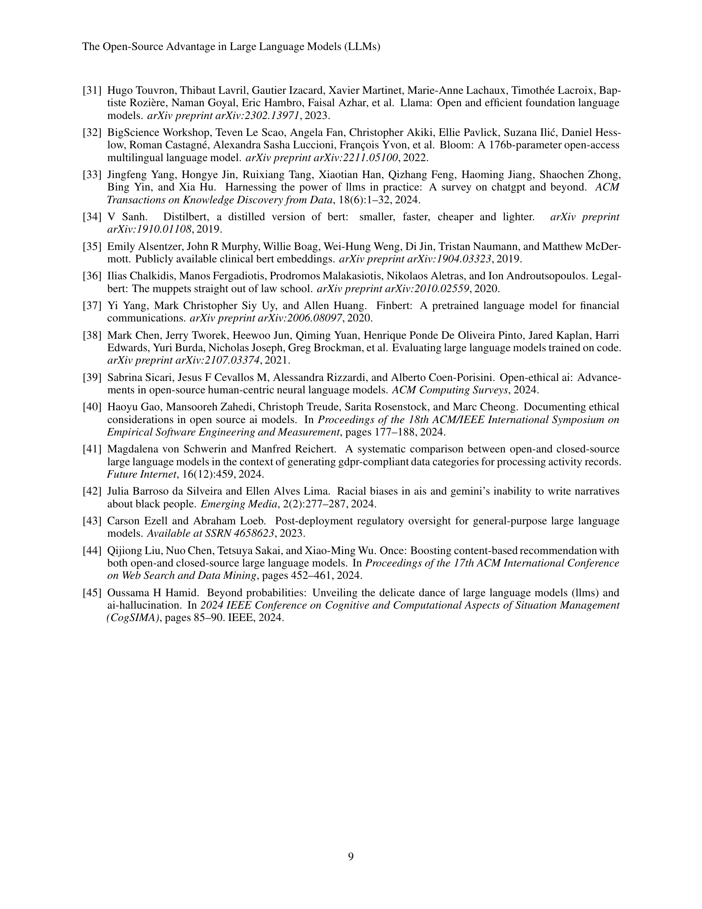

 


 2412.12004 
 Jiya Manchanda et el. 
 
 🤗 2024-12-17 
 



↗ arXiv


↗ Hugging Face


↗ Papers with Code


### TL;DR



**대규모 언어 모델(LLM)은 자연어 처리(NLP) 분야를 혁신했지만, 오픈소스와 폐쇄형 모델 사이의 긴장이 투명성, 접근성, AI 이점의 공정한 분배에 대한 중요한 질문을 제기합니다.** 폐쇄형 모델은 독점 데이터셋과 방대한 컴퓨팅 리소스를 활용하여 최첨단 성능을 달성하지만, 불투명성과 접근성 제한으로 인해 비판받고 있습니다. 반대로, 오픈소스 모델은 커뮤니티 기반 개발과 계산 효율성을 우선시하여, 특히 언어적 다양성과 특정 분야 애플리케이션에서 성능 격차를 크게 줄였습니다.

**본 논문은 오픈소스 및 폐쇄형 LLM의 혁신과 개발 프로세스를 탐구하여 주요 돌파구와 한계를 강조합니다.** Transformer 아키텍처와 같은 핵심 혁신은 양쪽 모두에 필수적이지만, 오픈소스 모델은 LoRA와 같은 효율적인 미세 조정 기술을 통해 제한된 리소스를 보완합니다. 이 논문에서는 두 모델의 성능, 접근성, 윤리적 의미를 비교하여 투명성과 독점 제어 간의 균형을 강조합니다. **본 연구는 두 패러다임의 강점을 활용하는 하이브리드 접근 방식을 통해 접근성, 경쟁력 있는 기술 성능 및 윤리적 배포를 보장하는 LLM 혁신의 미래를 제시합니다.**



#### Key Takeaways


 폐쇄형 LLM은 성능이 뛰어나지만 투명성이 부족하고, 오픈소스 LLM은 접근성이 좋지만 성능 면에서 뒤처집니다. 



 LoRA와 같은 기술은 오픈소스 LLM의 성능 격차를 줄이는 데 도움이 됩니다. 



 하이브리드 접근 방식이 LLM 개발의 미래가 될 가능성이 높습니다. 


#### Why does it matter?
**오픈소스와 폐쇄형 LLM의 장단점을 분석한 이 논문은 AI 연구자들에게 귀중한 자료입니다.** 오픈소스 모델의 투명성과 접근성은 공동연구와 혁신을 촉진하지만 벤치마킹과 윤리적 감독의 어려움을 야기합니다. 폐쇄형 모델의 성능 우위는 투명성 부족으로 인해 신뢰도와 책임성 문제를 제기합니다. 이 논문은 미래 연구 방향을 제시하여, 특히 환각 현상과 추론 능력 향상에 대한 연구를 강조합니다. **본 연구는 오픈소스와 폐쇄형 모델의 강점을 결합한 하이브리드 접근 방식을 제안하여 AI 개발의 형평성, 책임성, 기술 발전을 보장하는 데 중요한 시사점을 제공합니다.**

------
#### Visual Insights

### Full paper



