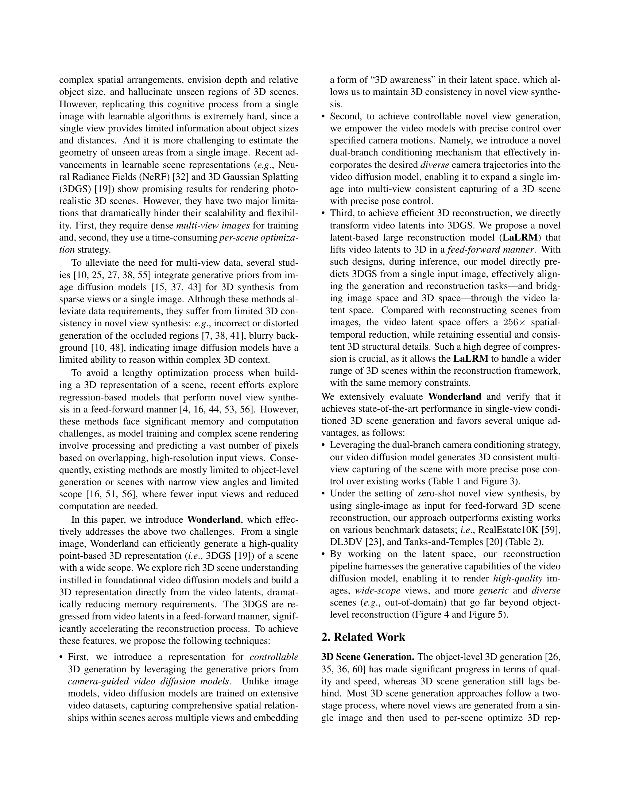
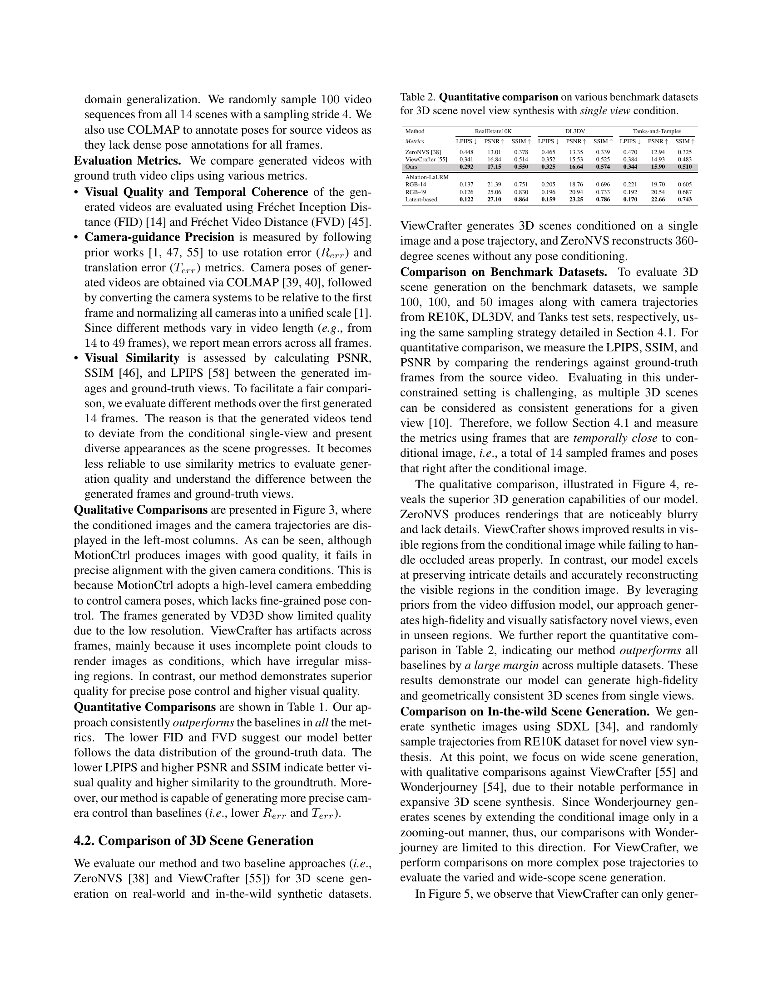

 


 2412.12091 
 Hanwen Liang et el. 
 
 🤗 2024-12-17 
 



↗ arXiv


↗ Hugging Face


↗ Papers with Code


### TL;DR



**단일 이미지에서 고품질 3D 장면을 생성**하는 것은 기존 방법이 여러 뷰 데이터, 시간이 많이 소요되는 최적화, 낮은 시각적 품질 및 왜곡된 재구성과 같은 문제에 직면해 어려움을 겪고 있습니다. 따라서 임의 이미지에서 고품질의 3D 장면을 효율적으로 만드는 방법이 중요한 문제로 대두됩니다.

**Wonderland**는 **비디오 확산 모델의 잠재 공간**을 활용하는 새로운 파이프라인을 도입하여 이러한 한계를 해결합니다. 이 모델은 지정된 카메라 궤적을 정확히 따르는 비디오를 생성하도록 설계되어 여러 뷰 정보를 유지하면서 3D 일관성을 유지하는 압축된 비디오 잠재 공간을 생성할 수 있습니다. 또한 **이중 분기 조건화 메커니즘**을 사용하여 비디오 확산 모델에 정확한 포즈 제어를 통합합니다. **잠재 공간 기반 대규모 재구성 모델(LaLRM)**을 통해 3D 장면의 렌더링 속도를 크게 높이고 메모리 요구 사항을 줄입니다. 덕분에 다양한 데이터 세트에서 **아웃도메인 이미지로 고품질 3D 장면을 생성**하는 데 탁월한 성능을 달성할 수 있습니다.



#### Key Takeaways


 Wonderland는 단일 이미지에서 고품질의 광범위한 3D 장면을 효율적으로 생성합니다. 



 이중 분기 카메라 조건화 메커니즘은 비디오 확산 모델에서 정확한 포즈 제어를 가능하게 합니다. 



 잠재 공간에서 작동하는 재구성 파이프라인은 메모리 요구 사항을 줄이고 아웃도메인 장면으로의 일반화를 향상시킵니다. 


#### Why does it matter?
**단일 이미지에서 고품질 3D 장면 생성**은 어려운 과제입니다. 이 논문은 비디오 확산 모델의 잠재 공간을 활용하여 이 문제를 해결하는 **새로운 접근 방식을 제시**합니다. 이를 통해 메모리 요구 사항이 크게 줄어들고 장면의 여러 뷰를 효율적으로 탐색할 수 있습니다. 또한 **이중 분기 카메라 조건화 메커니즘**을 도입하여 정확한 포즈 제어와 다양한 궤적 생성을 가능하게 합니다. 이 연구는 **고품질 3D 장면 생성 및 렌더링** 작업의 효율성과 확장성을 향상시켜 후속 연구에 중요한 영향을 미칠 수 있습니다.

------
#### Visual Insights

> 🔼 Wonderland는 단일 이미지를 입력으로 받아 카메라로 안내되는 비디오 확산 모델의 잠재 공간에서 3D 장면을 피드포워드 방식으로 재구성합니다. 그림은 단일 이미지에서 생성된 시각적 결과를 보여줍니다. 왼쪽 두 열에는 입력 이미지와 해당 3D 장면의 두 가지 다른 보기가 나와 있습니다. 오른쪽 두 열에는 다른 입력 이미지와 해당 3D 장면의 두 가지 다른 보기가 나와 있습니다. Wonderland는 객체의 형상과 색상을 정확하게 재구성하고 배경을 사실적으로 생성합니다.
> 

> 
read the caption

> Figure 1: Visual results generated by Wonderland. Given a single image, Wonderland reconstructs 3D scenes from the latent space of a camera-guided video diffusion model in a feed-forward manner.
> 


| Method | Dataset | FID ↓ | FVD ↓ | R_err ↓ | T_err ↓ | LPIPS ↓ | PSNR ↑ | SSIM ↑ |
|---|---|---|---|---|---|---|---|---| 
| MotionCtrl [47] | RealEstate10K | 22.58 | 229.34 | 0.231 | 0.794 | 0.296 | 14.68 | 0.402 |
| VD3D [1] |  | 21.40 | 187.55 | 0.053 | 0.126 | 0.227 | 17.26 | 0.514 |
| ViewCrafter [55] |  | 20.89 | 203.71 | 0.054 | 0.152 | 0.212 | 18.91 | 0.501 |
| **Ours** |  | **16.16** | **153.48** | **0.046** | **0.093** | **0.206** | **19.71** | **0.557** |
| MotionCtrl [47] | DL3DV | 25.58 | 248.77 | 0.467 | 1.114 | 0.309 | 14.35 | 0.385 |
| VD3D [1] |  | 22.70 | 232.97 | 0.094 | 0.237 | 0.259 | 16.28 | 0.487 |
| ViewCrafter [55] |  | 20.55 | 210.62 | 0.092 | 0.243 | 0.237 | 17.10 | 0.519 |
| **Ours** |  | **17.74** | **169.34** | **0.061** | **0.130** | **0.218** | **17.56** | **0.543** |
| MotionCtrl [47] | Tanks and Temples | 30.17 | 289.62 | 0.834 | 1.501 | 0.312 | 14.58 | 0.386 |
| VD3D [1] |  | 24.33 | 244.18 | 0.117 | 0.292 | 0.284 | 15.35 | 0.467 |
| ViewCrafter [55] |  | 22.41 | 230.56 | 0.125 | 0.306 | 0.245 | 16.20 | 0.506 |
| **Ours** |  | **19.46** | **189.32** | **0.094** | **0.172** | **0.221** | **16.87** | **0.529** |
| Lora-branch | Ablations on *RE10K* | 19.02 | 212.74 | 0.102 | 0.157 | - | - | - |
| Ctrl-branch |  | 18.75 | 205.45 | 0.058 | 0.104 | - | - | - |
| **Dual-branch** |  | **17.22** | **183.54** | **0.052** | **0.095** | - | - | - |

> 🔼 카메라 경로 제어 비디오 생성에 대한 기존 연구들과의 정량적 비교를 RealEstate10K, DL3DV, Tanks and Temples 데이터셋에서 진행했습니다. 생성된 비디오의 시각적 품질(FID, FVD), 카메라 경로 정밀도(회전 오차, 이동 오차), 시각적 유사도(LPIPS, PSNR, SSIM)를 측정하여 비교했습니다.
> 

> 
read the caption

> Table 1: Quantitative comparison to the prior arts in camera-guided video generation on RealEstate10K, DL3DV, and Tanks and Temples dataset. We report the performance for visual quality (FID and FVD), camera-guidance precision (Rerrsubscript𝑅errR_{\text{err}}italic_R start_POSTSUBSCRIPT err end_POSTSUBSCRIPT and Terrsubscript𝑇errT_{\text{err}}italic_T start_POSTSUBSCRIPT err end_POSTSUBSCRIPT), and visual similarity (LPIPS, PSNR, and SSIM).
> 

### In-depth insights

#### 3D From VideoDM
**비디오 확산 모델(VideoDM)**은 3D 장면 이해에 대한 풍부한 가능성을 제공합니다. VideoDM은 여러 뷰와 시공간적 관계를 학습하여 단일 이미지에서 **3D 장면을 재구성**하는 데 유용한 3D 인식 잠재 공간을 생성합니다. 이러한 잠재 공간에서 3D 표현을 직접 구축하면 메모리 요구 사항이 크게 줄어들고 효율적인 렌더링이 가능해집니다. 또한, 카메라 궤적 제어를 통합하면 **정확한 포즈 제어**와 **다중 뷰 일관성**을 달성할 수 있습니다. 그러나 VideoDM은 계산적으로 복잡할 수 있으며, 추론 속도를 높이기 위해 병렬 컴퓨팅 및 효율적인 노이즈 제거 전략과 같은 최적화가 필요합니다. 게다가 현재의 프레임워크는 정적 장면에 초점을 맞추고 있지만 향후 연구에서는 **동적 장면**과 **4D 콘텐츠**를 생성하는 것으로 확장될 수 있습니다.

#### Latent 3D Recon.
**잠재 3D 재구성**은 단일 이미지에서 고품질 3D 장면을 효율적으로 생성하는 것을 목표로 합니다. 이 기술은 비디오 확산 모델의 **잠재 공간**에서 얻은 **생성 사전 지식**을 활용하여 메모리 요구 사항을 크게 줄입니다. 3D 장면의 **다중 보기 일관성**을 보장하기 위해 이중 분기 카메라 조건화 메커니즘을 사용하여 **정확한 포즈 제어**를 용이하게 합니다. 또한 잠재 기반 대형 재구성 모델(LaLRM)은 비디오 잠재 공간에서 직접 3D 가우시안 스플래팅(3DGS)으로 디코딩하여 메모리 및 시간 비용을 최소화합니다. 즉, **피드포워드 방식**으로 효율적인 3D 장면 생성을 가능하게 합니다.

#### Dual Cam. Guide
**이중 카메라 안내(Dual Cam. Guide)**는 비디오 확산 모델에서 3D 일관성과 포즈 제어 기능을 향상시키는 새로운 조건화 메커니즘을 설명합니다. 이 기술은 제어 가능하고 사실적인 3D 장면 생성을 가능하게 합니다. 이 접근 방식의 핵심은 카메라 포즈 정보를 활용하여 장면의 여러 보기에 대한 일관성과 정확성을 보장하는 것입니다. 이중 분기 시스템은 ControlNet과 LoRA에서 영감을 받아 카메라 궤적을 모델에 효과적으로 통합하여 정확한 포즈 제어와 고품질 시각적 생성을 가능하게 합니다. 이 방법은 단일 이미지에서 고품질의 광범위한 3D 장면을 효율적으로 생성하는 데 중요한 역할을 합니다. 특히 ControlNet 분기는 정밀한 포즈 제어에 기여하는 반면 LoRA 분기는 장면의 정적 특성을 향상시킵니다. 두 분기를 결합하면 시각적 품질 저하 없이 제어 가능성과 일관성이 향상됩니다. 즉, 이중 카메라 안내는 단일 이미지에서 복잡한 3D 장면의 사실적이고 제어 가능한 생성을 위한 유망한 접근 방식을 제공합니다.

#### Zero-Shot NeRF
**Zero-Shot NeRF**는 새로운 이미지에서 3D 장면을 재구성하는 흥미로운 과제를 제시합니다. 이 접근 방식은 **사전 훈련 없이** 새로운 장면을 일반화하는 능력을 강조합니다. 핵심 아이디어는 여러 시점에서 장면을 캡처하는 대규모 데이터 세트에서 NeRF 모델을 훈련하는 것입니다. 이 광범위한 훈련을 통해 모델은 다양한 3D 장면의 기본 구조와 모양을 학습할 수 있습니다. 그런 다음 훈련 중에 본 적이 없는 새로운 이미지에 적용할 때 **모델은 단일 이미지만 보고** 3D 장면을 재구성할 수 있습니다. 이 능력은 zero-shot 학습의 힘을 보여주는 핵심입니다. Zero-Shot NeRF는 **새로운 뷰 합성**과 같은 다양한 애플리케이션에 상당한 가능성을 가지고 있습니다. 또한 3D 모델링, 가상현실, 증강현실 분야의 발전에 기여할 수 있습니다. 하지만 **제한된 입력**으로 복잡한 장면을 정확하게 재구성하는 데 어려움이 있습니다.  Zero-Shot NeRF는 3D 장면 이해 및 생성 분야의 중요한 진전입니다.

#### Out-Of-Domain Gen.
**Out-Of-Domain Gen.(영역 외 생성)**은 머신러닝 모델이 훈련 데이터와 다른 유형의 데이터를 얼마나 잘 생성하는지 평가하는 중요한 개념입니다. 이는 모델의 **일반화 능력**을 보여주는 핵심 지표로, 훈련 데이터에만 **과적합**되지 않고 실제 세계의 다양한 데이터에 **적응**할 수 있는지를 나타냅니다. Wonderland 연구에서는 영역 외 이미지를 입력으로 사용하여 3D 장면 생성 능력을 평가하고, 기존 방법들보다 **뛰어난 성능**을 보여주었습니다. 이는 비디오 확산 모델의 **사전 지식** 활용과 **잠재 공간**에서의 작업 덕분에 모델이 **강력한 일반화 능력**을 갖추게 되었음을 시사합니다. 특히 훈련에 사용되지 않은 다양한 종류의 장면, 예를 들어 탱크 및 사원 데이터셋에서도 **높은 품질**의 3D 장면을 생성할 수 있었던 점이 주목할 만합니다. 이러한 결과는 Wonderland가 **실제 응용 분야**에서 폭넓게 활용될 수 있는 **잠재력**을 가지고 있음을 보여줍니다.

### More visual insights

More on figures

> 🔼 이 그림은 단일 이미지를 입력으로 받아 카메라 경로를 따라 3D 인식 비디오 잠재 공간을 생성하는 카메라 유도 비디오 확산 모델과, 이 잠재 공간을 활용하여 3D 장면을 구성하는 잠재 기반 대규모 재구성 모델(LaLRM)로 구성된 Wonderland 시스템의 개요를 보여줍니다. 비디오 확산 모델은 정확한 포즈 제어를 위해 이중 분기 카메라 조건화를 사용하고, LaLRM은 잠재 공간에서 작동하여 광범위하고 고품질의 3D 장면을 효율적으로 재구성합니다.
> 

> 
read the caption

> Figure 2: Overview of Wonderland. Given a single image, a camera-guided video diffusion model follows the camera trajectory and generates a 3D-aware video latent, which is leveraged by the latent-based large reconstruction model to construct the 3D scene in a feed-forward manner. The video diffusion model involves dual-branch camera conditioning to fulfill precise pose control. The LaLRM operates in latent space and efficiently reconstructs a wide-scope and high-fidelity 3D scene.
> 

> 🔼 이 그림은 카메라 경로가 주어진 비디오 생성에서 기존 방법들(MotionCtrl, VD3D, ViewCrafter)과 제안된 Wonderland 모델을 비교한 것입니다. 각 샘플의 14번째 프레임이 비교를 위해 표시되어 있으며, 첫 번째 열은 조건부 이미지와 카메라 경로(오른쪽 하단)를 보여줍니다. 파란색 경계 상자는 비교를 돕기 위한 참조 영역을 나타내고 주황색 경계 상자는 품질이 낮은 생성 결과를 강조합니다. 또한, 오른쪽 열에는 제안된 모델의 마지막 프레임이 표시됩니다. Wonderland 모델은 정확한 카메라 제어와 고품질의 광범위한 비디오 생성 측면에서 기존 방법들보다 우수한 성능을 보입니다.
> 

> 
read the caption

> Figure 3: Qualitative comparison to prior arts in camera-guided video generation. The 14thsubscript14th14_{\mathrm{th}}14 start_POSTSUBSCRIPT roman_th end_POSTSUBSCRIPT frame in each sample is shown for comparison, with the first column displaying the conditional image and camera trajectory (bottom-right). Blue bounding boxes denote reference areas to assist comparison and orange bounding boxes highlight low-quality generations. We also show our last frames in the rightmost column. Our method outperforms the priors in both precise camera control and high-quality and wide-scope video generation.
> 

> 🔼 이 그림은 단일 이미지에서 3D 장면을 생성하는 여러 가지 방법들을 질적으로 비교한 것입니다. 파란색 상자는 조건부 이미지에서 볼 수 있는 영역을, 노란색 상자는 품질이 낮은 영역을 보여줍니다. 제안된 접근 방식은 하나의 조건부 이미지에서 훨씬 더 높은 품질의 새로운 뷰를 생성합니다.
> 

> 
read the caption

> Figure 4: Qualitative comparison for 3D scene generation. Blue bounding boxes show visible regions from conditional images and yellow bounding boxes show low-quality regions. Our approach generates much higher quality novel views from one conditional image.
> 

> 🔼 이 그림은 실제 이미지를 입력으로 사용하여 ViewCrafter, WonderJourney와 저자들의 방법을 비교하여 야생에서 3D 장면 생성에 대한 질적 비교를 보여줍니다. ViewCrafter는 제한된 영역에서만 3D 장면을 생성할 수 있으며, 뷰 범위가 커지면 품질이 크게 저하됩니다. WonderJourney는 더 넓은 시야의 장면을 생성할 수 있지만 생성된 뷰는 흐릿하고 아티팩트가 포함되는 경향이 있습니다. 이와 대조적으로, 저자들의 방법은 높은 사실성을 유지하고 외관과 3D 기하학 모두에서 일관된 확장된 장면을 생성합니다.
> 

> 
read the caption

> Figure 5: Comparison with ViewCrafter (left) and WonderJourney (right) for in-the-wild 3D scene generation from single input images.
> 

> 🔼 이 그림은 Mip-NeRF 데이터셋을 사용하여 단일 입력 이미지에서 3D 장면을 생성하는 데 있어 ZeroNVS, Cat3D와 저희 방법을 비교한 것입니다. 각 장면에서 조건부 이미지(시작) 보기(위)와 시작 보기에서 약 120도 회전한 다른 보기(아래)의 두 가지 관점에서 렌더링을 보여줍니다. 조건부 이미지에 가까운 보기의 경우 저희 방법은 Cat3D와 유사한 렌더링 품질을 달성하며 ZeroNVS보다 눈에 띄게 뛰어납니다. 하지만 보기가 조건부 이미지에서 벗어남에 따라 Cat3D는 특히 배경에서 심한 블러링 현상이 나타납니다. 반대로 저희 방법은 더 선명한 텍스처, 더 선명한 디테일, 조건부 이미지와 더 높은 일관성을 가진 장면을 생성합니다.
> 

> 
read the caption

> Figure 6: Comparison to ZeroNVS and Cat3D with Mip-Nerf dataset on 3D scene generation from single input images. For each scene, the conditional image is shown in the left-most column. We show renderings from two viewpoints, one at the conditional image (starting) view (upper) and another at around 120°-rotation from the starting view(lower).
> 

> 🔼 이 그림은 사전 훈련된 비디오 생성 모델(윗줄)과 LoRA 모듈을 사용하여 정적 장면 데이터 세트에서 미세 조정된 모델(아랫줄) 간의 비디오 생성 결과를 비교한 것입니다. 결과는 LoRA를 갖춘 정적 장면 데이터 세트에서 모델을 미세 조정하면 시각적 품질 저하 없이 훨씬 더 정적인 장면이 생성됨을 보여줍니다.
> 

> 
read the caption

> Figure A1: Comparison of video generations between the source model (upper row) and the model fine-tuned on static-scene datasets with LoRA modules (lower row). The results demonstrate that fine-tuning the model on static-scene datasets equipped with LoRA produces significantly more static scenes.
> 

> 🔼 이 그림은 실제 환경 데이터셋을 사용하여 미세 조정된 잠재 재구성 모델과 사용하지 않은 모델의 3D 렌더링 성능 비교를 보여줍니다. 위쪽 행은 실제 환경 데이터셋 없이 미세 조정된 모델의 결과를, 아래쪽 행은 실제 환경 데이터셋으로 미세 조정된 모델의 결과를 나타냅니다. 실제 환경 데이터셋을 사용한 미세 조정이 일반화 성능을 향상시키는 것을 알 수 있습니다.
> 

> 
read the caption

> Figure A2: Comparison of 3D rendering performance between latent reconstruction models fine-tuned without in-the-wild dataset (upper row) and with in-the-wild dataset (lower row). Involving in-the-wild datasets during fine-tuning improves the generalization capability.
> 

> 🔼 이 그림은 이중 분기 카메라 유도 비디오 확산 모델의 훈련 파이프라인 구조를 보여줍니다. 비디오 잠재 공간에 무작위 노이즈가 추가되고 조건부 이미지가 특징 연결을 통해 노이즈가 있는 잠재 공간에 병합됩니다. 카메라 안내는 LoRA 분기(왼쪽)와 ControlNet 분기(오른쪽)로 통합됩니다. 단순화를 위해 텍스트 토큰, 확산 시간 임베딩, 위치 임베딩 및 일부 재구성 작업은 그림에서 생략되었습니다. 기본 확산 변환기에서 텍스트 토큰은 토큰 수 차원을 따라 시각적 토큰과 연결됩니다. 따라서 연결 또는 요소별 합계 전에 카메라 토큰에 제로 패딩을 적용하여 동일한 길이를 보장합니다. 기본적으로 SiLu를 활성화 함수로 사용합니다.
> 

> 
read the caption

> Figure A3: Structure of Dual-branch Camera-guided Video Diffusion Model. We show the skeletons of the training pipeline, where random noise is added to the video latents. The conditional image is merged to the noisy latents via feature concatenation. The camera guidance is integrated with LoRA-branch (left) and ControlNet-branch (right). We ignore the text tokens, the diffusion time embeddings, the positional embeddings, and some reshaping operations for simplicity in the figure. In the foundation diffusion transformer, the text tokens are concatenated along number-of-token dimension with visual tokens. Thus we apply zero-padding to camera tokens to guarantee the same length before concatenation or element-wise sum. By default, we use SiLu as our activation function.
> 

More on tables


| Method | RealEstate10K | | | DL3DV | | | Tanks-and-Temples | | |
|---|---|---|---|---|---|---|---|---|---|---| 
| *Metrics* | LPIPS ↓ | PSNR ↑ | SSIM ↑ | LPIPS ↓ | PSNR ↑ | SSIM ↑ | LPIPS ↓ | PSNR ↑ | SSIM ↑ |
| ZeroNVS [38] | 0.448 | 13.01 | 0.378 | 0.465 | 13.35 | 0.339 | 0.470 | 12.94 | 0.325 |
| ViewCrafter [55] | 0.341 | 16.84 | 0.514 | 0.352 | 15.53 | 0.525 | 0.384 | 14.93 | 0.483 |
| **Ours** | **0.292** | **17.15** | **0.550** | **0.325** | **16.64** | **0.574** | **0.344** | **15.90** | **0.510** |
| Ablation-LaLRM | | | | | | | | | |
| RGB-14 | 0.137 | 21.39 | 0.751 | 0.205 | 18.76 | 0.696 | 0.221 | 19.70 | 0.605 |
| RGB-49 | 0.126 | 25.06 | 0.830 | 0.196 | 20.94 | 0.733 | 0.192 | 20.54 | 0.687 |
| **Latent-based** | **0.122** | **27.10** | **0.864** | **0.159** | **23.25** | **0.786** | **0.170** | **22.66** | **0.743** |
> 🔼 이 표는 단일 뷰 조건에서 3D 장면의 새로운 뷰 합성을 위해 다양한 벤치마크 데이터 세트에 대한 정량적 비교 결과를 보여줍니다. 즉, 단일 이미지 입력으로 여러 시점에서 렌더링된 새로운 뷰의 품질을 평가합니다. 품질 측정을 위해 LPIPS, PSNR, SSIM 지표를 사용하여 생성된 이미지를 ground truth 이미지와 비교합니다.
> 

> 
read the caption

> Table 2: Quantitative comparison on various benchmark datasets for 3D scene novel view synthesis with single view condition.
> 


| Expression | Specification | Explanation | 
|---|---|---| 
| **_commonly used_** | | | 
| \(x\) | \(x \in R^{T\times H\times W\times 3}\) | source video clip | 
| \(s\) | - | stride to sample clip \(x\) from source video | 
| \(z\) | \(z \in R^{t\times h\times w\times c}\) | video latent embedded from \(x\) | 
| \(\mathcal{E}\) | - | encoder from 3D-VAE | 
| \(r_s\) | \(r_s = \frac{H}{h} = \frac{W}{w}\) | spatial compression rate | 
| \(r_t\) | \(r_t = \frac{T}{t}\) | temporal compression rate | 
| \(p\) | \(p \in R^{T\times H\times W\times 6}\) | Plücker embedding of cameras of video clip \(x\) | 
| **_diffusion used_** | | | 
| \(\tau\) | - | diffusion time step | 
| \(\alpha_{\tau}, \sigma_{\tau}\) | - | diffusion noise scheduler parameters | 
| \(z_{\tau}\) | - | noisy video latent | 
| \(D_{\theta}\) | - | diffusion model parameterized by \(\theta\) | 
| \(o_v\) | \(o_v \in R^{N_v\times d_v}\) | visual tokens as a sequence in diffusion model | 
| \(o_{\mathrm{ctrl}}, o_{\mathrm{lora}}\) | \(o_{\mathrm{ctrl}}, o_{\mathrm{lora}} \in R^{N_v\times d_v}\) | camera tokens as a sequence in diffusion model | 
| \(N\) | - | number of transformer blocks in ControlNet branch | 
| **_reconstruction used_** | | | 
| \(p_l\) | - | spatial patch size applied to \(z\) in LaLRM | 
| \(o_l\) | \(o_l \in R^{N_l\times d_l}\) | visual latent tokens as a sequence in LaLRM | 
| \(N_l\) | \(N_l = t\cdot\frac{h}{p_l}\cdot\frac{w}{p_l}\) | number of visual latent tokens in LaLRM | 
| \(o_{\mathrm{p}}\) | \(o_{\mathrm{p}} \in R^{N_l\times d_l}\) | camera tokens as a sequence in LaLRM | 
| \(V\) | - | number of supervision views in LaLRM | 
| \(G\) | \(G \in R^{(T\cdot H\cdot W)\times 12}\) | Gaussian feature map in LaLRM |
> 🔼 논문에서 사용된 표기법에 대한 개요를 제공합니다. 소스 비디오 클립, 비디오에서 추출된 잠재 공간, 압축률, 카메라의 플뤼커 임베딩, 확산 시간 단계, 확산 노이즈 스케줄러 매개변수, 노이즈가 있는 비디오 잠재 공간, 확산 모델, 확산 모델의 시퀀스로서의 시각적 토큰, 확산 모델의 시퀀스로서의 카메라 토큰, ControlNet 브랜치의 변환기 블록 수, LaLRM에 적용된 z에 대한 공간적 패치 크기, LaLRM의 시퀀스로서의 시각적 잠재 토큰, LaLRM의 시각적 잠재 토큰 수, LaLRM의 시퀀스로서의 카메라 토큰, LaLRM의 감독 뷰 수, LaLRM의 가우시안 특징 맵을 포함한 다양한 표기법에 대한 설명을 제공합니다.
> 

> 
read the caption

> Table A1: Overview of the notations used in the paper.
> 


| Architecture | FID ↓ | FVD ↓ | Rerr ↓ | Terr ↓ |
|---|---|---|---|---| 
| Lora-branch | 19.02 | 212.74 | 0.102 | 0.157 |
| Ctrl-branch | 18.75 | 205.45 | 0.058 | 0.104 |
| Dual-branch | **17.22** | **183.54** | **0.052** | **0.095** |
| Dual w/o LoraModule | 17.84 | 195.07 | 0.062 | 0.101 |
| *Ctrl-branch* only |  |  |  |  |
| w/o weight copy | 18.92 | 206.75 | 0.065 | 0.108 |
| block-1 | 19.90 | 214.66 | 0.114 | 0.162 |
| blocks-10 | 19.15 | 210.74 | 0.075 | 0.126 |
| blocks-30 | 20.15 | 221.61 | 0.056 | 0.105 |
> 🔼 이 표는 카메라 기반 비디오 생성 모델의 아키텍처 설계에 대한 분석 결과를 보여줍니다. RealEstate10K 데이터셋으로 학습된 모델들의 시각적 품질(FID, FVD)과 포즈 제어 정확도(회전 오차, 변환 오차)를 측정했습니다. 표의 첫 번째 섹션은 본 논문의 표 1에서 가져왔습니다.
> 

> 
read the caption

> Table A2: Analysis on architecture designs in camera-guided video generation model. We report the performance for visual quality (FID and FVD) and pose control precision (Rerrsubscript𝑅errR_{\text{err}}italic_R start_POSTSUBSCRIPT err end_POSTSUBSCRIPT and Terrsubscript𝑇errT_{\text{err}}italic_T start_POSTSUBSCRIPT err end_POSTSUBSCRIPT) from models trained on RealEstate10K dataset. The first section of the table is adopted from Tab.1 in the main paper.
> 


| Method | RealEstate10K | | | DL3DV | | | Tanks-and-Temples | | |
|---|---|---|---|---|---|---|---|---|---|---| 
| *Metrics* | LPIPS ↓ | PSNR ↑ | SSIM ↑ | LPIPS ↓ | PSNR ↑ | SSIM ↑ | LPIPS ↓ | PSNR ↑ | SSIM ↑ |
| LaLRM– | 0.295 | 17.06 | 0.538 | 0.343 | 16.62 | 0.570 | 0.359 | 15.85 | 0.502 |
| **LaLRM** | **0.292** | **17.15** | **0.550** | **0.325** | **16.64** | **0.574** | **0.344** | **15.90** | **0.510** |
> 🔼 이 표는 사전 훈련된 LaLRM을 자체 생성된 실제 환경 데이터셋을 사용하여 추가로 미세 조정한 결과를 보여줍니다. LaLRM-은 실제 환경 데이터셋 없이 미세 조정된 모델이며, LaLRM은 실제 환경 데이터셋으로 미세 조정된 모델입니다. 표에서 LaLRM이 LaLRM-보다 다양한 벤치마크 데이터셋에서 더 나은 성능을 보이는 것을 알 수 있습니다. 이는 실제 환경 데이터셋을 사용한 추가 미세 조정이 LaLRM의 일반화 기능을 향상시킨다는 것을 보여줍니다. 즉, 보다 다양한 장면에서 더 나은 3D 장면 생성 성능을 보입니다.
> 

> 
read the caption

> Table A3: Analysis on involving in-the-wild dataset to fine-tune LaLRM. We report the performance on various benchmark datasets for novel view synthesis of 3D scenes, which are built from single view condition.
> 

### Full paper



