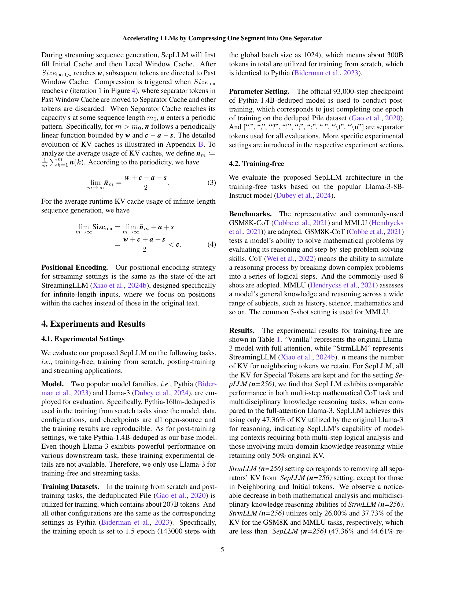

 


 2412.12094 
 Guoxuan Chen et el. 
 
 🤗 2024-12-17 
 



↗ arXiv


↗ Hugging Face


↗ Papers with Code


### TL;DR



**큰 언어 모델(LLM)은 다양한 작업에서 뛰어난 성능을 보여주지만 상당한 크기로 인해 특히 계산 요구 사항 및 추론 속도 측면에서 상당한 어려움을 겪고 있습니다.** 이러한 모델의 2차 복잡성으로 인해 더 큰 모델과 더 긴 컨텍스트로 확장할 때 문제가 발생합니다. 이러한 비효율성은 추론 속도와 훈련 시간 모두에 큰 영향을 미칩니다.

**본 논문에서는 세그먼트 정보를 구분 기호 토큰으로 압축하여 LLM 추론을 가속화하는 SepLLM이라는 플러그 앤 플레이 프레임워크를 소개합니다.** 이 접근 방식은 중복 토큰을 제거하여 속도를 높이고 효율적인 훈련 커널을 구현합니다. SepLLM은 KV 캐시 사용량을 줄이고 동시에 성능을 유지하며, 스트리밍 설정에서 긴 시퀀스의 효율적인 처리를 허용합니다. 이 프레임워크는 훈련 없음, 처음부터 훈련, 사후 훈련 설정에서 효과적임을 입증했으며 훈련 및 추론 성능 간의 격차를 해소하는 데 중요한 역할을 합니다.



#### Key Takeaways


 SepLLM은 구분 기호 토큰을 활용하여 LLM 추론을 가속화하고 긴 시퀀스를 효율적으로 처리합니다. 



 KV 캐시 활용률 감소로 메모리 제한 환경에서 추론 속도가 향상됩니다. 



 훈련 및 추론 간의 성능 격차를 해소하는 데 중점을 둡니다. 


#### Why does it matter?
**LLM 추론 속도 향상은 컴퓨팅 리소스를 절약하고 지연 시간을 줄이기 때문에 중요합니다.** SepLLM은 이러한 문제를 해결하는 데 중요한 단계를 제공합니다. 훈련 및 추론 간의 성능 격차를 해소하는 SepLLM의 능력은 실제 애플리케이션에 매우 중요합니다. 또한 KV 캐시 활용률 감소는 메모리 제한 환경에 특히 유익합니다. 스트리밍 설정에서 긴 시퀀스를 처리하는 능력은 챗봇 및 라이브 번역과 같은 다양한 애플리케이션에 대한 문을 열어줍니다.

------
#### Visual Insights

> 🔼 이 그림은 Vanilla Transformer와 제안된 SepLLM 간의 훈련 손실을 비교한 것입니다. x축은 계산 비용(TFLOPS) 또는 훈련 시간(초)을 나타내고, y축은 훈련 손실을 나타냅니다. SepLLM은 동일한 계산 비용이나 훈련 시간에서 Vanilla Transformer보다 훈련 손실이 낮음을 보여줍니다. 즉, SepLLM이 더 효율적임을 의미합니다. 또한 SepLLM이 계산 비용과 훈련 시간 모두에서 안정적으로 낮은 손실을 달성하여 일관된 성능 향상을 보여줍니다.
> 

> 
read the caption

> Figure 1: The loss comparison between vanilla Transformer and proposed SepLLM. SepLLM achieves lower loss at different computation costs and different training time consistently.
> 


|         | GSM8K-CoT |       | r.KV(%) | MMLU |        |       |       | Overall | r.KV (%) |
|---------|------------|-------|---------|------|--------|-------|-------|---------|---------|
|         | flexible   | strict |         | humanities | stem  | social | other |         |         |
| Vanilla | 77.79      | 77.26  | 100.00 | 60.49    | 56.61 | 76.50 | 72.19 | 65.72   | 100.00  |
| StrmLLM (*n*=380) | 70.89      | 71.42  | 47.54  | 57.73    | 54.46 | 74.39 | 70.13 | 63.39   | 52.50   |
| StrmLLM (*n*=256) | 69.67      | 68.61  | 26.00  | 62.10    | 54.49 | 73.06 | 69.78 | 62.10   | 37.73   |
| SepLLM (*n*=256)  | 77.18      | 77.18  | 47.36  | 57.66    | 56.49 | 76.21 | 72.19 | 64.68   | 44.61   |

> 🔼 이 표는 GSM8K-CoT 8-shot 및 MMLU 5-shot에 대한 무학습 실험의 평가 결과와 평균 실행 시간 KV 캐시 사용량을 보여줍니다. SepLLM 및 StreamingLLM의 경우 이 실험에서는 세 개의 초기 토큰의 KV가 유지됩니다. r.KV(%)는 Vanilla 대비 각 방법의 실행 시간 KV 사용량 비율을 나타냅니다.
> 

> 
read the caption

> Table 1: Evaluation results and average running time KV cache usage for training-free experiments on GSM8K-CoT 8-shots and MMLU 5-shots. For SepLLM and StreamingLLM, three initial tokens’ KV is kept for this experiment. r.KV(%) here represents the ratio of KV usage at runtime for the respective method compared to Vanilla.
> 

### In-depth insights

#### LLM Attention Bias
**LLM 주의 편향**은 이러한 모델이 특정 토큰에 불균형적으로 집중하는 경향을 나타냅니다. 이 연구에서는 의미 있는 토큰보다 구두점과 같은 구분 기호에 더 큰 주의를 기울이는 패턴을 강조합니다. 이러한 **편향은 흥미로운 의미를 지닙니다.** 첫째, LLM이 컨텍스트를 처리하는 방식에 대한 귀중한 정보를 제공합니다. 즉, LLM은 문맥 세그먼트를 구분 기호 토큰으로 압축하여 효율적인 정보 검색을 용이하게 합니다. 둘째, 추론 가속화 및 모델 압축과 같은 실질적인 응용 프로그램을 제안합니다. 구분 기호 중심의 주의 메커니즘은 계산 비용을 줄이면서 성능을 유지할 수 있습니다. 셋째, 추가 조사를 위한 잠재적인 연구 방향을 제시합니다. 주의 편향을 완화하면 LLM의 전반적인 성능과 이해력이 향상될 수 있을까요? 아니면 이러한 편향이 LLM의 기능에 중요한 역할을 할까요? 이러한 질문에 답하려면 추가 연구가 필요합니다.

#### SepLLM Framework
**SepLLM 프레임워크**는 대규모 언어 모델(LLM)의 추론 속도를 높이는 것을 목표로 합니다. 핵심 아이디어는 **구분자 토큰("," 또는 "\n" 등)에 세그먼트 정보를 압축**하는 것입니다. SepLLM은 초기 토큰, 이웃 토큰, 구분자 토큰만 유지하는 **데이터 종속 희소 주의 메커니즘**을 사용하여 나머지 토큰을 제거합니다. 이 프레임워크는 KV 캐시를 줄이고 계산량을 줄입니다. 또한 SepLLM은 훈련 및 추론 간의 불일치를 줄이기 위해 **훈련 단계에도 통합**됩니다. **플러그 앤 플레이 방식**으로 다양한 LLM에 적용할 수 있습니다. 실험 결과는 속도 향상과 성능 유지 측면에서 SepLLM의 효과를 보여주며, 특히 스트리밍 설정에서 **4백만 토큰 이상의 시퀀스를 효율적으로 처리**할 수 있음을 보여줍니다.

#### KV Cache Compression
**KV 캐시 압축**은 거대 언어 모델(LLM)의 효율성을 높이는 핵심 기술입니다. LLM은 뛰어난 성능을 보이지만, **방대한 크기로 인해 계산 및 메모리 요구량이 많습니다.** 특히 **셀프 어텐션 모듈**은 입력 토큰 수에 따라 **2차 복잡도**를 가지므로, 긴 컨텍스트를 처리할 때 병목 현상을 일으킵니다.  KV 캐시 압축은 **어텐션 점수, 토큰 선택, 클러스터링 등의 방법**을 사용하여 KV 캐시 크기를 줄여 **메모리 사용량과 추론 속도를 개선**합니다. 하지만, **훈련 단계에 적용하기 어렵고 훈련과 추론 성능 사이에 불일치**가 발생할 수 있습니다. 따라서 훈련 및 추론 모두에서 효과적인 KV 캐시 압축 기술에 대한 연구가 활발히 진행 중입니다.

#### Streaming LLMs
**스트리밍 LLM**은 입력 길이에 대한 제한 없이 실시간 텍스트 생성을 가능하게 합니다. **무한한 컨텍스트 길이**는 챗봇, 스토리텔링, 실시간 번역 및 긴 형식의 콘텐츠 생성과 같은 애플리케이션에 매우 중요합니다. SepLLM과 같은 효율적인 아키텍처를 통해 스트리밍 LLM은 **메모리 및 계산 오버헤드**를 줄이면서 이러한 기능을 달성할 수 있습니다. KV 캐시 압축, 선택적 토큰 보존 및 세그먼트 정보의 압축과 같은 전략은 스트리밍 설정에서 **성능 저하 없이** 효율적인 처리를 보장하는 데 중요한 역할을 합니다. 또한 **토큰 선택 전략 및 캐시 관리 정책**과 같은 요소를 주의 깊게 고려하면 스트리밍 LLM의 효율성을 더욱 최적화할 수 있습니다.

#### Sparse Attention
**희소 주의(Sparse Attention)**는 쿼리 토큰이 모든 키 토큰에 주의를 기울이는 것이 아니라 **일부 키 토큰에만 집중**하는 방식입니다. 이는 **계산 효율을 크게 향상**시키면서, 특정 작업에서는 **전체 주의(Full Attention)에 필적하는 성능**을 달성할 수 있습니다. 희소 주의는 **고정 패턴 주의**와 **학습 기반 주의** 두 가지 주요 범주로 나뉩니다. 고정 패턴은 **지역 윈도우**, **고정된 스트라이드 블록 패턴**을 사용하며, BigBird처럼 **전역 토큰**과 **무작위 토큰 연결**을 결합하기도 합니다. 학습 기반 주의는 **데이터 기반**으로 주의 패턴을 학습하며, SparseBERT처럼 **미분 가능한 주의 마스크**를 사용합니다. 이러한 접근 방식은 **장거리 종속성을 효과적으로 포착**할 수 있게 합니다. 하지만 희소 주의는 어떤 토큰이 중요한지 미리 알 수 없을 때 효과가 떨어질 수 있습니다. 또한 고정 패턴은 **작업에 따라 적합한 패턴을 선택**해야 하는 어려움이 있습니다.

### More visual insights

More on figures

> 🔼 이 그림은 'Natalia sold clips to 48 of her friends in April, and then she sold half as many clips in May. ...'라는 입력이 주어졌을 때, 여러 층에 걸친 어텐션 점수를 시각화한 것입니다. 쉼표(',')와 마침표('.')와 같은 구분자 토큰들이 상당히 높은 어텐션 점수를 받는 것을 확인할 수 있는데,  이는 구분자들이 문맥 정보를 효율적으로 압축하고 전달하는 역할을 한다는 것을 시사합니다.
> 

> 
read the caption

> Figure 2: The visualization of attention scores among different layers given the input “Natalia sold clips to 48 of her friends in April, and then she sold half as many clips in May. …”. Note that the separator tokens like “,” and “.” contribute massive attentions.
> 

> 🔼 이 그림은 SepLLM의 전반적인 패러다임을 보여줍니다. 왼쪽은 'ABC,DE.FG\n' 입력에 대한 훈련 또는 사전 채우기 단계의 어텐션 마스크를 나타냅니다. 오른쪽은 생성 단계에서의 KV 캐시 관리를 보여줍니다. SepLLM은 특정 레이어에서 각 토큰이 이전 레이어에서 출력된 이전 토큰의 hidden state의 일부만 볼 수 있도록 제한합니다. 이 부분집합에는 초기 몇 개 단어(attention sinks), 현재 토큰 이전의 모든 구분 기호 토큰, 현재 토큰에 가장 가까운 n개의 토큰이 포함됩니다. 훈련 또는 사전 채우기 단계에서는 입력 컨텍스트의 모든 토큰에 해당하는 모든 쿼리 벡터와 모든 키 벡터를 곱할 필요가 없습니다. 그림 3의 마스크 행렬에서 강조 표시된 요소에 해당하는 쿼리 키 쌍의 벡터만 곱하면 됩니다. 생성 단계에서는 새 토큰을 생성할 때 초기 토큰, 구분 기호 토큰 및 인접 토큰에 대한 KV 캐시만 유지됩니다. 따라서 SepLLM의 KV 캐시는 훨씬 작고 메모리가 덜 필요합니다.
> 

> 
read the caption

> Figure 3: The overall paradigm of SepLLM. The left side illustrates the attention mask in the training or pre-filling stage given the input “ABC,DE.FG\n\absent𝑛\backslash n\ italic_n”. The right side illustrates the KV cache management in the generation stage.
> 

> 🔼 SepLLM의 스트리밍 적용을 위한 프레임워크를 보여주는 그림입니다. KV 쌍은 네 개의 캐시 블록(초기 캐시, 구분자 캐시, 과거 윈도우 캐시, 로컬 윈도우 캐시)에 저장됩니다. 각 행은 반복을 나타내고, 열은 각 캐시 블록의 상태를 보여줍니다. 런타임 사용량(Sizerun)이 최대 용량(c)에 도달하면 SepLLM은 과거 윈도우 캐시에 있는 구분자 토큰의 KV 캐시를 구분자 캐시로 이동하고 다른 KV 캐시는 삭제합니다. 구분자 캐시가 최대 용량(s)에 도달하면 로컬 윈도우 캐시와 과거 윈도우 캐시의 크기가 주기적으로 변화하며, 평균적으로 전체 KV 캐시 사용량은 최대 용량(c)보다 작게 유지됩니다.
> 

> 
read the caption

> Figure 4: Overall framework of the proposed SepLLM tailored for streaming applications. The KV pairs are storaged in four cache blocks (displayed as four columns), and are updated in each iteration (shown in a single row). Once the runtime usage S⁢i⁢z⁢er⁢u⁢n𝑆𝑖𝑧subscript𝑒𝑟𝑢𝑛Size_{run}italic_S italic_i italic_z italic_e start_POSTSUBSCRIPT italic_r italic_u italic_n end_POSTSUBSCRIPT reach the max capacity c, SepLLM move KV caches of separator tokens in Past Window Cache into Separator Cache and drop other KV caches.
> 

> 🔼 이 그래프는 스크래치부터 훈련 과정에서 훈련 단계에 따른 손실 값의 변화를 보여줍니다. Vanilla Transformer, SepLLM(n=64), SepLLM(n=128), SepLLM(n=64, H), SepLLM(n=64, H/T) 등 다양한 모델 아키텍처에 대한 훈련 손실 곡선을 비교하여 SepLLM이 Vanilla Transformer에 비해 훈련 손실이 낮음을 보여줍니다. x축은 훈련 단계를, y축은 손실 값을 나타냅니다.
> 

> 
read the caption

> (a) Loss w.r.t steps
> 

> 🔼 이 그래프는 다양한 모델의 학습 손실 비율을 FLOPs(Floating Point Operations Per Second)에 따라 비교하여 보여줍니다. Vanilla Transformer 모델을 기준으로 SepLLM과 StrmLLM의 손실 비율을 FLOPs 증가에 따라 표시하고 있습니다. SepLLM은 동일한 FLOPs에서 Vanilla Transformer보다 낮은 손실 비율을 보여줍니다. 이는 SepLLM이 연산 효율성 측면에서 Vanilla Transformer보다 우수함을 시사합니다. 또한, SepLLM의 여러 변형(n=64, n=128, n=64, H, n=64, H/T) 또한 Vanilla Transformer보다 낮은 손실 비율을 보입니다.
> 

> 
read the caption

> (b) Loss Ratio w.r.t FLOPs
> 

> 🔼 이 그림은 처음부터 학습할 때의 학습 손실 곡선을 보여줍니다. 5(b)는 FLOPs에 대한 Vanilla 대비 다양한 메서드의 손실 값 비율을 보여줍니다. SepLLM은 Vanilla 모델보다 적은 FLOPs에서 더 낮은 손실을 달성하며, 특히 SepLLM(n=64, H/T)가 두드러집니다. StrmLLM은 Vanilla보다 손실 감소가 느립니다.
> 

> 
read the caption

> Figure 5: Training loss curves for training from scratch. 5(b) shows the ratio of the loss values of different methods to that of Vanilla with respect to FLOPs.
> 

> 🔼 이 그림은 사전 훈련 후 다양한 SepLLM 설정(n=64, n=128, 더 큰 학습률)을 사용한 훈련 손실 곡선을 보여줍니다. n 값을 높이고 학습률을 적절하게 높이면 손실 감소에 도움이 된다는 것을 알 수 있습니다. 또한 전체 어텐션 트랜스포머 체크포인트에서 SepLLM 아키텍처의 요구 사항에 맞는 모델로 사후 훈련을 통해 신속하게 전환할 수 있음을 보여줍니다.
> 

> 
read the caption

> Figure 6: Training loss curves for the post-training.
> 

> 🔼 스트리밍 설정에서 KV 캐시의 진화 과정을 보여줍니다. 그림에서 볼 수 있듯이, 토큰 mo 이후에는 n과 Sizerun이 주기적인 함수 형태를 띠게 되며, 사용되는 평균 KV 캐시 크기는 최대 용량인 c보다 훨씬 작습니다.
> 

> 
read the caption

> Figure 7: The evolution of KV caches in the streaming setting.
> 

More on tables


| Method | ARC-c | ARC-e | LBD-ppl | LBD-acc | LogiQA | PIQA | SciQ | Attn(%) | r.KV(%) |
|---|---|---|---|---|---|---|---|---|---|
| Vanilla | 20.14 | 46.80 | 34.83 | 33.28 | 23.81 | 62.84 | 81.50 | 100.00 | 100.00 |
| StrmLLM(*n*=64) | 20.65 | 47.39 | 44.03 | 26.74 | 21.97 | 63.82 | 75.80 | 16.58 | 15.28 |
| SepLLM(*n*=64) | 19.62 | 46.46 | 40.08 | 28.97 | 26.42 | 63.82 | 80.10 | 25.83 | 25.40 |
| SepLLM(*n*=128) | 19.97 | 47.35 | 30.16 | 33.18 | 22.73 | 64.64 | 82.60 | 35.64 | 32.27 |
| SepLLM(*n*=64,H) | 20.73 | 48.44 | 36.54 | 30.45 | 25.35 | 64.36 | 80.60 | 32.01 | 31.58 |
| SepLLM(*n*=64,H/T) | 21.42 | 47.26 | 33.41 | 32.80 | 22.73 | 63.98 | 81.20 | 38.18 | 37.75 |
> 🔼 이 표는 처음부터 학습된 모델의 성능(다운스트림 작업 성능 및 런타임 KV 캐시 사용량)을 보여줍니다. 다양한 모델 아키텍처(기준, StrmLLM, SepLLM의 변형)에 따른 성능 지표와 런타임 KV 캐시 사용량을 비교하여 SepLLM의 효과를 보여줍니다. Attn(%)는 어텐션 맵의 아랫부분 삼각형에서 '1'의 비율을 나타내고, r.KV(%)는 Vanilla 모델에 비해 각 모델이 사용하는 KV 캐시의 비율을 나타냅니다.
> 

> 
read the caption

> Table 2: The performance of downstream tasks and the usage of running-time KV cache in the training from scratch setting.
> 


| Arch. | StrmLLM | SepLLM | | | | Vanilla |
|---|---|---|---|---|---|---| 
| Setting | n=64 | n=64 | n=128 | n=64,H | n=64,H/T | full |
| FLOPs(%) | 70.11 | 71.77 | 72.58 | 72.83 | 73.90 | 100.0 |
| Attn.(%) | 6.43 | 17.21 | 22.48 | 24.11 | 31.01 | 100.0 |
> 🔼 이 표는 FLOPs(부동 소수점 연산)와 어텐션 맵 비율(Attention Map Ratio)을 비교하여 SepLLM이 기존 모델 대비 얼마나 효율적인지 보여줍니다. 어텐션 맵 비율은 어텐션 마스크의 아래쪽 삼각형에서 '1'의 비율을 나타내며, 전체 입력 토큰 중 SepLLM에서 사용하는 토큰의 비율을 의미합니다. FLOPs는 모델의 계산 복잡도를 나타내는 지표입니다. 표에서 SepLLM은 다양한 설정(n=64, n=128, n=64,H, n=64,H/T)에서 FLOPs를 약 30% 줄이는 것을 확인할 수 있으며, 이는 계산 효율성이 크게 향상되었음을 시사합니다.
> 

> 
read the caption

> Table 3: The comparison of FLOPs and Attention Map Ratio.
> 


| PG19 | 1M | 1.5M | 2M | 2.5M | 3M | 3.5M | 4M |
|---|---|---|---|---|---|---|---| 
| **StrmLLM** | 39.5 | 38.2 | 38.3 | 37.6 | 36.4 | 35.8 | 36.1 |
| SepLLM (*s*=32) | 37.7 | 36.6 | 36.6 | 36.0 | 34.9 | 34.2 | 34.5 |
| SepLLM (*s*=64) | 37.1 | 36.0 | 36.1 | 35.4 | 34.3 | 33.7 | 33.9 |
> 🔼 PG19 테스트 세트에서 StreamingLLM과 SepLLM의 perplexity를 비교한 표입니다. KV 캐시 용량(c)은 324로 고정하고, Sink Cache(a)는 두 모델 모두 4로 설정하여 공정한 비교를 진행했습니다. SepLLM은 StreamingLLM보다 perplexity가 일관되게 낮으며, 이는 SepLLM이 긴 텍스트 생성에서 더 나은 성능을 보인다는 것을 시사합니다.
> 

> 
read the caption

> Table 4: The perplexity comparison on the PG19 test set (Rae et al., 2020). For fair evaluation, we keep the KV cache capacity c as 324 and keep Sink Cache a as 4 for both StreamingLLM and SepLLM.
> 


| Length | Methods | *c* | r.KV | ppl | time (s) |
|---|---|---|---|---|---| 
| 20K | Vanilla | 20K | 10K | 302.6 | 523.8 |
|  | StrmLLM | 800 | 800 | 31.5 | 341.2 |
|  | SepLLM | 800 | 562 | 28.3 | 325.8 |
| 64K | Vanilla | 64K | 32K | 1090.8 | 3380.6 |
|  | StrmLLM | 800 | 800 | 37.9 | 1096.0 |
|  | SepLLM | 800 | 562 | 33.4 | 1049.7 |
> 🔼 PG19 테스트 세트에서 다양한 길이의 텍스트(20K 및 64K 토큰)에 대한 Vanilla, StreamingLLM, SepLLM의 perplexity와 실행 시간 비교입니다. r.KV는 생성 과정에서 평균 런타임 KV 캐시 사용량을 나타냅니다. SepLLM은 StreamingLLM과 동일한 최대 KV 캐시 용량 c에서 더 낮은 perplexity, 더 짧은 실행 시간, 더 낮은 평균 런타임 KV 사용량을 달성합니다. 특히 긴 시퀀스에서 그 차이가 두드러집니다.
> 

> 
read the caption

> Table 5: The perplexity and runing time comparison on the PG19 test set (Rae et al., 2020). r.KV means the average runtime KV cache usage in the generation process.
> 


| *s* | 5K | 10K | 15K | 20K | r.KV |
|---|---|---|---|---|---| 
| 32 | 13.11 | 11.31 | 8.74 | 8.79 | 292 |
| 48 | 13.03 | 11.26 | 8.70 | 8.76 | 300 |
| 64 | 13.01 | 11.17 | 8.67 | 8.72 | 308 |
> 🔼 이 표는 SepLLM의 다른 Separator Cache 크기(s)에 따른 WikiText 데이터셋에서의 perplexity와 평균 런타임 KV 캐시 사용량을 보여줍니다. 여기서 a=4, w=224, c=324로 설정되어 있습니다. Separator Cache 크기가 커질수록 perplexity가 감소하는 경향이 있음을 알 수 있습니다.
> 

> 
read the caption

> Table 6: The perplexity and average runtime KV cache usage of SepLLM with respect to different Separator Cache sizes (s) on WikiText (Merity et al., 2017), in which a=4, w=224, c=324.
> 


| Method | *w* | *c* | r.KV | 5K | 10K | 15K | 20K |
|---|---|---|---|---|---|---|---| 
| | 320 | 324 | 324 | 13.18 | 11.51 | 8.85 | 8.91 |
| StrmLLM | 512 | 516 | 516 | 12.87 | 11.37 | 8.74 | 8.78 |
| | 796 | 800 | 800 | 11.96 | 11.01 | 8.67 | 8.72 |
| | 224 | 324 | 308 | 13.01 | 11.17 | 8.67 | 8.72 |
| SepLLM | 320 | 516 | 452 | 12.91 | 11.26 | 8.67 | 8.72 |
| | 512 | 800 | 690 | 12.09 | 11.03 | 8.56 | 8.62 |
> 🔼 이 표는 다양한 입력 길이와 다양한 c, w에 따른 WikiText에서의 평균 다운스트림 성능(ppl)과 평균 런타임 KV 사용량을 보여줍니다. 두 방법 모두 a=4이고 SepLLM의 경우 s=64입니다. c와 w는 KV 캐시의 최대 용량과 로컬 윈도우 캐시의 최대 용량을 나타내는 하이퍼파라미터입니다. ppl은 perplexity의 약자로, 언어 모델의 성능을 측정하는 지표입니다. 숫자가 낮을수록 성능이 좋습니다. r.KV는 평균 런타임 KV 캐시 사용량을 나타냅니다.
> 

> 
read the caption

> Table 7: Average downstream performance (ppl) over different input lengths and average runtime KV usage with different c,w on WikiText, in which a=4 for both methods and s=64 for SepLLM.
> 


| Method | initial | shift | 5K | 10K | 15K | 20K | r.KV |
|---|---|---|---|---|---|---|---| 
| StrmLLM | ✓ | ✓ | 13.2 | 11.5 | 8.9 | 8.9 | 324 |
| StrmLLM | ✗ | ✓ | 14.6 | 13.2 | 10.8 | 10.9 | 324 |
| StrmLLM | ✓ | ✗ | 425.5 | 513.1 | 509.5 | 506.8 | 324 |
| StrmLLM | ✗ | ✗ | 409.4 | 540.5 | 527.5 | 558.2 | 324 |
| SepLLM | ✓ | ✓ | 13.1 | 11.3 | 8.7 | 8.8 | 292 |
| SepLLM | ✗ | ✓ | 14.9 | 14.3 | 12.4 | 12.5 | 290 |
| SepLLM | ✓ | ✗ | 192.7 | 214.6 | 175.0 | 174.4 | 292 |
| SepLLM | ✗ | ✗ | 226.4 | 264.7 | 227.5 | 228.8 | 290 |
> 🔼 이 표는 WikiText 데이터셋에서 StreamingLLM과 SepLLM의 성능(퍼플렉시티)과 평균 KV 캐시 사용량을 비교합니다. 두 모델 모두 최대 KV 캐시 용량(c)은 324로 동일하며, 초기 토큰 유지를 위한 캐시 용량(a)은 0 또는 4로 설정했습니다. SepLLM의 경우, 구분자 토큰 캐시 용량(s)은 32, 로컬 윈도우 캐시 용량(w)은 224로 설정했습니다. 이 표를 통해 초기 토큰 유지, 포지션 인코딩 이동 등의 요소가 스트리밍 설정에서 모델 성능에 미치는 영향을 분석할 수 있습니다.
> 

> 
read the caption

> Table 8:  The perplexity and average runtime KV cache usage of SepLLM and StreamingLLM tested on WikiText (Merity et al., 2017). c=324, a=0/4 for both methods. s=32,w=224 for SepLLM
> 


|                       | Vanilla (Full Attention) | SepLLM (n=64) | SepLLM (n=128) |
| :-------------------- | :----------------------- | :------------- | :-------------- |
| time per iteration (ms) | 2524.45                 | 1648.11        | 1653.11         |
| samples / second      | 405.82                  | 622.31         | 620.3           |
> 🔼 이 표는 훈련 가속화에 대한 세부 정보를 제공합니다. Vanilla(전체 어텐션) 모델, SepLLM(n=64) 및 SepLLM(n=128)의 훈련 시간을 비교하여 SepLLM이 훈련 속도를 상당히 향상시키는 것을 보여줍니다.
> 

> 
read the caption

> Table 9: The details about training acceleration.
> 


| Backbone | Arch. | *c* | r.KV | ppl | time(s) |
|---|---|---|---|---|---| 
| | Vanilla | 64K | 32K | 1037.6 | 4160.7 |
| Pythia-6.9B | StrmLLM | 800 | 800 | 15.9 | 1522.6 |
| | SepLLM | 800 | 562 | 15.8 | 1456.0 |
| | Vanilla | 64K | 32K | 1090.8 | 3380.6 |
| Llama-3-8B | StrmLLM | 800 | 800 | 37.9 | 1096.0 |
| | SepLLM | 800 | 562 | 33.4 | 1049.7 |
> 🔼 다양한 디코더 전용 모델, 즉 Llama-3와 Pythia 백본에 SepLLM을 적용한 성능 비교표입니다. PG19 테스트 데이터셋에서 64K 토큰을 생성하는 작업을 기반으로 합니다. SepLLM의 경우, a=4, s=64, w=256, c=800으로 설정했습니다.
> 

> 
read the caption

> Table 10: The comparison of SepLLM adapted to different architectures.
> 


| Backbone | *a* | *s* | *w* | *c* | r.KV | ppl | time(s) |
|---|---|---|---|---|---|---|---| 
| | 4 | 64 | 256 | 800 | 562 | 13.0 | 445.0 |
| Pythia-6.9B | 4 | 64 | 800 | 1024 | 946 | 12.7 | 450.4 |
| | 4 | 64 | 928 | 1280 | 1138 | 12.7 | 454.4 |
| Pythia-12B | 4 | 64 | 256 | 800 | 562 | 12.1 | 577.0 |
> 🔼 이 표는 다양한 크기의 Pythia 모델에 SepLLM을 적용한 결과를 비교하여 SepLLM의 일반화 성능을 보여줍니다. 구체적으로는 Pythia-6.9B와 Pythia-12B 모델에 대해 PG19 테스트 데이터셋에서 20K 토큰을 생성하는 작업을 수행했습니다.
> 

> 
read the caption

> Table 11: The comparison of SepLLM adapted to Pythia (Biderman et al., 2023) with different scales.
> 


| Length | Methods | _c_ | r.KV | ppl | time (s) |
|---|---|---|---|---|---| 
| 20K | StrmLLM | 1024 | 1024 | 8.98 | 1512.88 |
| 20K | StrmLLM | 800 | 800 | 9.02 | 1430.59 |
| 20K | SepLLM | 1024 | 906 | 8.92 | 1440.89 |
| 20K | SepLLM | 800 | 690 | 9.00 | 1368.07 |
| 64K | StrmLLM | 1024 | 1024 | 11.01 | 4844.79 |
| 64K | StrmLLM | 800 | 800 | 11.09 | 4623.90 |
| 64K | SepLLM | 1024 | 906 | 10.96 | 4619.63 |
| 64K | SepLLM | 800 | 690 | 11.07 | 4414.72 |
> 🔼 표는 SepLLM을 Falcon-40B 모델에 적용한 결과를 비교하여 보여줍니다. 비교 대상은 StreamingLLM과 Vanilla Transformer 모델이며, 20K 토큰과 64K 토큰 생성 시의 perplexity와 실행 시간을 측정했습니다.  SepLLM은 StreamingLLM보다 더 낮은 perplexity를 달성하면서도 실행 시간과 KV 캐시 사용량 측면에서 효율적인 것으로 나타났습니다.
> 

> 
read the caption

> Table 12: The comparison of SepLLM adapted to Falcon-40B (Almazrouei et al., 2023).
> 


| Backbone | Algorithm | GSM8K-CoT | r.KV (%) |
|---|---|---|---| 
| Base | Vanilla | 54.44 | 100 |
|  | SepLLM ft. | 55.95 | 47.36 |
| Instruct | Vanilla | 77.26 | 100 |
|  | SepLLM ft. | 77.63 | 47.36 |
> 🔼 이 표는 기본 모델과 지시사항 조정 모델을 사용한 Llama-3-8B 모델에서 SepLLM을 적용한 결과를 비교합니다. GSM8K-CoT 벤치마크에서 추론 능력을 평가하며, SepLLM을 적용해도 기존 어텐션 메커니즘을 사용하는 원본 모델과 비슷한 성능을 보이는 것을 확인할 수 있습니다.
> 

> 
read the caption

> Table 13: The comparison of SepLLM adapted to Llama-3-8B (Dubey et al., 2024) with base or instruct versions.
> 

### Full paper



