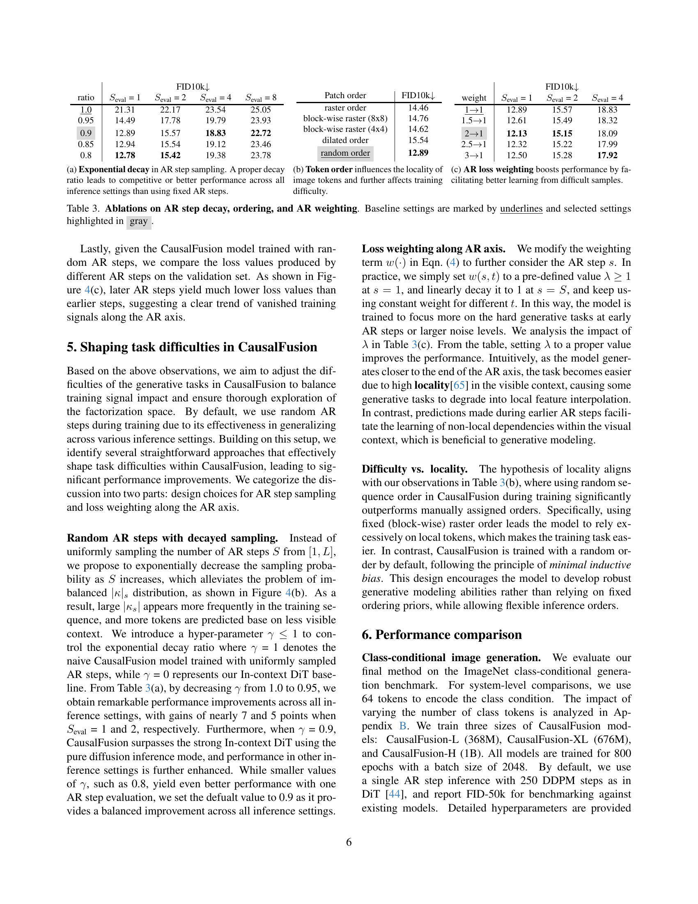
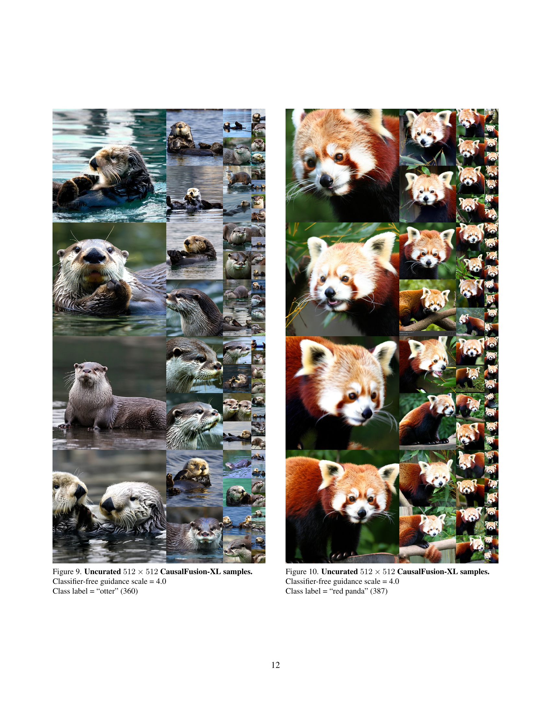

 


 2412.12095 
 Chaorui Deng et el. 
 
 🤗 2024-12-17 
 



↗ arXiv


↗ Hugging Face


↗ Papers with Code


### TL;DR



**생성 모델**은 이미지 생성에서 상당한 발전을 이루었지만 자기 회귀(AR)와 확산이라는 두 가지 주요 패러다임은 **서로 다른 데이터 분해 접근 방식**을 사용합니다. AR 모델은 **순차적 토큰 예측**에 탁월하지만 확산 모델은 고품질 이미지 합성에 널리 사용됩니다. 그러나 이러한 모델을 단일 프레임워크에 효과적으로 통합하는 데 어려움이 있으며, 두 가지 접근 방식의 고유한 장점을 모두 활용할 수 있는 잠재력이 제한됩니다.

이 논문에서는 순차적 토큰 및 노이즈 레벨 데이터 분해를 모두 통합하는 새로운 생성 모델링 프레임워크인 **CausalFusion**을 제시합니다. 이 **이중 분해** 접근 방식을 통해 AR 및 확산 생성 모드 간의 **원활한 전환**이 가능하며 두 가지 패러다임의 장점을 활용할 수 있습니다. CausalFusion은 **디코더 전용 트랜스포머**로 구현되어 **이미지 생성 벤치마크에서 최첨단 결과**를 달성하고 **맥락 내 추론을 위한 무제한 토큰 생성**을 가능하게 합니다. 또한 이 모델은 **이미지 생성 및 캡션 작업을 공동으로 수행**하는 멀티모달 기능을 보여줍니다. 즉, 단일 모델에서 **텍스트 기반 이미지 편집**이 가능합니다.



#### Key Takeaways


 CausalFusion은 확산과 자기 회귀 모델의 장점을 결합하여 최첨단 이미지 생성 성능을 달성합니다. 



 CausalFusion은 멀티모달 기능을 보여 주며 텍스트 기반 zero-shot 이미지 편집과 같은 새로운 기능을 가능하게 합니다. 



 CausalFusion은 향상된 표현 학습 능력을 보여줍니다. 


#### Why does it matter?
**CausalFusion**은 생성 모델링 분야, 특히 **확산 및 자기 회귀 모델의 통합**에 중요한 의미를 지닙니다. 이 연구는 두 패러다임의 장점을 결합한 새로운 프레임워크를 제시하고, **이미지 생성, 멀티모달 생성 및 표현 학습**에서 최첨단 결과를 달성했습니다. CausalFusion은 **두 가지 방법의 장점을 모두 활용**하여 단일 이미지 생성 및 텍스트 기반 이미지 편집과 같은 새로운 기능을 가능하게 하며, **멀티모달 모델링 및 zero-shot 이미지 조작**에 대한 새로운 길을 열어줍니다.

------
#### Visual Insights

> 🔼 이 그림은 CausalFusion이라는 새로운 이미지 생성 모델의 작동 방식을 보여줍니다. CausalFusion은 '이중 인수분해(Dual-Factorization)'라는 개념을 사용하는데, 이는 이미지 생성 과정을 순차적 토큰 생성(AR)과 노이즈 레벨 감소(Diffusion)라는 두 가지 축으로 나누어 진행하는 것을 의미합니다.   기존 DiT 모델과 비교하여, In-context DiT는 더 적은 파라미터로 성능을 크게 향상시켰습니다. CausalFusion은 이 아키텍처를 변경하지 않고도 성능을 더욱 향상시킵니다.  CausalFusion은 각 단계에서 이미지의 일부 토큰만 확산시켜 계산 복잡도를 낮으면서도 자유로운 AR 단계를 사용할 수 있습니다. 그림에서 화살표는 생성 경로를 나타내며, 각 단계에서 순차적 토큰과 노이즈 레벨 차원을 따라 생성이 어떻게 진행되는지 보여줍니다. IN1K 데이터셋에서 240 epoch 동안 훈련된 결과를 사용했습니다.
> 

> 
read the caption

> Figure 1:  Illustration of Dual-Factorization. The arrow line indicates CausalFusion’s generation path, moving from one state to the next by jointly generating along the sequential and noise-level dimension at each step. Compared to DiT, our In-context DiT substantially improves results with fewer parameters. CausalFusion further enhances performance without changing the architecture or parameter count. Results were trained on IN1K for 240 epochs. CausalFusion adopts arbitrary AR steps for image generation, but each step only diffuses partial tokens, resulting in similar (or slightly lower) computational complexity.
> 


| Model | Params (M) | FID10k↓ |
|---|---|---|
| DiT [44] | 458 | 18.24 |
| - AdaLN-zero [44] | 305 | 26.71 |
| + new recipe | 305 | 21.94 |
|     + T embedding | 308 | 20.68 |
|       + QK-norm | 308 | 18.66 |
|       + lr warmup | 308 | 17.11 |
| + All (In-context DiT) | 308 | **13.78** |

> 🔼 이 표는 In-context DiT(Diffusion Transformer) 모델의 성능을 ImageNet 256x256 데이터셋에서 240 epoch 훈련 후 FID 점수로 비교합니다. DiT 모델은 기존의 AdaLN-zero 구성 요소 대신, 클래스 및 타임스텝 조건을 토큰으로 취급하여 입력 시퀀스에 직접 추가하는 in-context 디자인을 적용했습니다. 표에서 밑줄은 기본 설정을, 회색으로 강조 표시된 부분은 선택된 설정을 나타냅니다. 본 표는 QK 정규화, 학습률 워밍업 등 다양한 설정을 통해 In-context DiT 모델의 성능 향상을 보여줍니다. 특히, 제안된 In-context DiT-L/2 모델은 단순하지만 DiT-XL/2 모델에 필적하는 FID-10k 점수인 13.78을 달성했습니다.
> 

> 
read the caption

> Table 1: In-context DiT baseline. ImageNet 256×\times×256, 240 epoch. Baseline settings are marked by underlines and selected settings highlighted in gray.
> 

### In-depth insights

#### Causal AR Diffusion
**인과적 AR 확산(Causal AR Diffusion)**은 자기 회귀적 토큰 예측과 확산 모델의 노이즈 레벨 기반 정규화를 결합한 생성 모델링 접근 방식입니다. 이는 순차적 토큰 생성과 노이즈 레벨에서의 점진적 개선을 동시에 활용합니다. AR 모델은 **장문 추론과 문맥 내 생성**에 탁월하지만, 확산 모델은 **확장 가능한 추론 연산**과 반복적인 품질 향상에 뛰어납니다. 인과적 AR 확산은 이러한 장점을 결합하여 **다양한 생성 작업에 대한 유연하고 강력한 프레임워크**를 제공합니다. **이중 인수분해**는 AR 및 확산 생성 모드 간의 원활한 전환을 가능하게 하며, 순차적 토큰과 노이즈 레벨 모두에서 데이터를 처리합니다. **인과적 AR 확산은 이산 및 연속 데이터 모두에서 멀티모달 모델을 훈련**시키는 새로운 관점을 제공하며, 이미지 생성, 텍스트 생성, 이미지 편집 및 비전-언어 공동 모델링과 같은 작업에서 유망한 결과를 보여줍니다.

#### Dual Factorization
**이중 인수분해**는 순차적 토큰과 확산 노이즈 레벨에서 데이터를 이중으로 인수분해하는 **CausalFusion**이라는 디코더 전용 트랜스포머를 제안합니다. 이 접근 방식은 순차적 토큰과 노이즈 레벨 축을 따라 데이터 분포를 인수분해하여 AR 및 확산 생성 모드 간의 원활한 전환을 가능하게 합니다. AR 모델은 순차적 축을 따라 데이터를 인수분해하여 각 토큰의 확률이 이전 토큰에 따라 달라지도록 합니다. 확산 모델은 노이즈 레벨 축을 따라 데이터를 인수분해하여 각 단계의 토큰이 이전 단계에서 자체적으로 정제된 버전이 되도록 합니다. CausalFusion은 이러한 두 가지 패러다임의 장점을 결합하여 **이미지 생성** 및 **멀티모달 생성** 시나리오에서 최첨단 결과를 달성합니다. 또한 **제로샷 이미지 조작** 및 **맥락 내 추론**과 같은 AR의 이점도 누릴 수 있습니다. CausalFusion은 이중 인수분해 평면 내에서 AR 및 확산 패러다임을 공동으로 탐색하는 유연한 프레임워크를 제공하여 생성 모델링 작업의 어려움을 해결하고 훈련 신호 영향을 조정합니다.

#### Task Difficulty
**CausalFusion은 AR 및 확산 모델의 이중 요소화로 인해 작업 난이도가 다양해지는 문제에 직면했습니다.** 확산 모델에서는 노이즈 레벨이 높을수록 학습이 어렵고, AR 모델에서는 초기 단계 예측의 가시 컨텍스트가 제한되어 오류가 누적될 수 있습니다. 또한 AR 단계 수에 따라 AR과 확산 사이의 보간이 제어되므로 훈련 난이도에 영향을 미칩니다. AR 단계가 많을수록 훈련 작업이 단순해지고, AR 단계 샘플링이 균일하면 훈련 신호가 토큰 수가 적은 AR 단계에 편향되어 모델이 가시 컨텍스트에 과도하게 의존하게 됩니다. 이러한 문제를 해결하기 위해 CausalFusion은 AR 단계 샘플링에 지수적 감쇠를 사용하고 AR 축을 따라 손실 가중치를 적용하여 작업 난이도를 조정합니다. 이를 통해 훈련 신호의 영향을 균형 있게 조정하고 요소화 공간을 철저하게 탐색하여 성능을 향상시킵니다.

#### Multimodal Fusion
**CausalFusion은 이미지 생성과 캡셔닝을 결합한 멀티모달 모델 학습에 효과적**입니다. 텍스트와 이미지를 순차적으로 입력받아 **두 모달리티 간의 관계를 학습**하며, 단일 모델로 텍스트-이미지 생성과 이미지 캡셔닝 모두 수행 가능합니다. 기존 멀티모달 생성 모델(TransFusion)보다 **뛰어난 성능**을 보이며, **제로샷 이미지 편집과 같은 다양한 작업**에도 적용 가능합니다. **CausalFusion의 듀얼 팩토라이제이션 디자인**은 텍스트와 이미지의 의미적 연결을 효과적으로 포착하여 **멀티모달 추론 능력 향상**에 기여합니다. 하지만, **학습 과정에서 텍스트와 이미지 손실 가중치 균형 조정** 등 추가 연구가 필요합니다. **향후, 멀티모달 생성 모델의 새로운 가능성**을 제시하는 CausalFusion의 발전이 기대됩니다.

#### Zero-Shot Editing
**CausalFusion은 제로샷 이미지 편집 기능을 자연스럽게 지원합니다.** 토큰의 임의 하위 집합을 예측하도록 훈련되었기 때문에 작업별 미세 조정 없이 국소 편집을 수행할 수 있습니다. 그림 2(b)에서 볼 수 있듯이, ImageNet 클래스 조건부 생성 작업에서만 사전 훈련된 모델도 고품질 편집 결과를 생성할 수 있으며, 편집 작업에 대한 견고성과 적응성을 보여줍니다. 또한 CausalFusion의 이중 인수분해 설계를 통해 맥락 일관성과 고충실도 업데이트 간의 균형을 유지하여 편집된 영역이 주변 콘텐츠와 매끄럽게 조화를 이루도록 합니다. 모델이 다양한 편집 시나리오를 처리하는 기능을 보여주는 추가 시각화는 부록 D를 참조하십시오.

### More visual insights

More on figures

> 🔼 (a) CausalFusion-XL/2 모델로 생성된 샘플 이미지들입니다. ImageNet 512x512 해상도 데이터셋으로 800 에포크 동안 학습되었고, DDPM 250 스텝, CFG=4.0 설정으로 생성되었습니다.  이 그림은 CausalFusion 모델의 이미지 생성 능력을 보여주는 다양한 샘플들을 제시합니다. 고품질의 다양한 이미지들이 생성되었음을 확인할 수 있으며, 이는 CausalFusion이 복잡한 이미지 분포를 학습했음을 시사합니다.  샘플들은 사실적인 동물, 사물, 풍경 등 다양한 범주를 포괄하고 있습니다. 이러한 결과는 CausalFusion이 ImageNet 데이터셋의 다양한 클래스에 걸쳐 효과적으로 일반화될 수 있음을 보여줍니다.
> 

> 
read the caption

> (a) Samples generated by CausalFusion-XL/2, ImageNet 512×\times×512, 800 epoch, DDPM 250 steps, CFG=4.0
> 

> 🔼 CausalFusion-XL/2 모델을 사용하여 ImageNet 512x512 해상도 이미지에서 800 epoch 동안 훈련한 제로샷 이미지 편집 결과입니다. 왼쪽에 있는 원본 이미지를 생성한 후, 이미지의 중앙, 상반부 또는 하반부를 마스킹하고 새로운 클래스 조건을 사용하여 이미지를 재생성합니다. 6장에서 자세한 내용을 확인할 수 있습니다. 이 그림은 중앙, 상반부, 하반부 마스킹과 같은 다양한 마스킹 기법과 새로운 클래스 조건을 적용하여 이미지가 어떻게 편집되는지를 보여줍니다. 제로샷 이미지 편집은 모델이 특정 편집 작업에 대해 명시적으로 학습되지 않았음에도 불구하고 편집을 수행할 수 있음을 의미합니다.
> 

> 
read the caption

> (b) Zero-shot image editing results generated by CausalFusion-XL/2, ImageNet 512×\times×512, 800 epoch. We first generate the original image (those on the left), then mask out its centre region, top-half, or bottom-half, and regenerate the image with new class conditions. Details are discussed in Sec 6.
> 

> 🔼 이 그림은 CausalFusion 모델의 시각화 결과를 보여줍니다. 모든 샘플은 ImageNet-1K 클래스 조건부 생성 작업으로만 훈련된 모델에 의해 생성되었으며, CausalFusion의 제로샷 이미지 조작 능력을 보여줍니다. (a)는 CausalFusion-XL/2 모델을 사용하여 ImageNet 512x512 해상도에서 800 epoch, DDPM 250 step, CFG=4.0으로 생성한 샘플들을 보여줍니다. (b)는 CausalFusion-XL/2 모델을 사용하여 ImageNet 512x512 해상도에서 800 epoch으로 생성한 제로샷 이미지 편집 결과를 보여줍니다. 먼저 원본 이미지(왼쪽)를 생성한 다음 중앙 영역, 상반부 또는 하반부를 마스크하고 새로운 클래스 조건으로 이미지를 다시 생성합니다. 자세한 내용은 섹션 6에서 설명합니다. 추가 시각화 결과는 부록 D를 참조하십시오.
> 

> 
read the caption

> Figure 2: Visualization results. All samples are generated by models trained only on ImageNet-1K class-conditional generation task, demonstrating CausalFusion’s zero-shot image manipulation ability. See more visualization results in Appendix D.
> 

> 🔼 이 그림은 DiT와 CausalFusion 아키텍처의 차이점을 보여줍니다. (a) DiT는 전체 이미지 토큰을 입력으로 받아 어댑티브 레이어 정규화를 통해 조건화를 통합합니다. 모든 노이즈 토큰 xt는 전체 어텐션 관찰과 함께 DiT에 입력되어 처리 중 입력에 대한 포괄적인 모델링이 가능합니다. (b) CausalFusion은 모든 입력 양식을 동일하게 처리하고, 이전에 디노이징된 토큰과 기타 문맥 입력을 조건으로 사용하면서 각 단계에서 이미지 토큰의 무작위 하위 집합 xt,κs를 디노이징합니다. 이 방법은 마스크된 특징 예측 모델의 정신을 구현하여 부분 관찰을 통해 이미지를 재구성하도록 모델을 강제합니다.
> 

> 
read the caption

> Figure 3: Conceptual comparison between the DiT and CausalFusion architectures. a) DiT incorporates conditioning via adaptive layer normalization, processing a fixed-size set of entire image tokens as input. All the noise tokens xtsubscript𝑥𝑡x_{t}italic_x start_POSTSUBSCRIPT italic_t end_POSTSUBSCRIPT are fed into DiT with full attention observation, enabling comprehensive modeling of the input during processing. b) CausalFusion treats all input modalities equally in an in-context manner, denoising a random subset of image tokens xt,κssubscript𝑥𝑡subscript𝜅𝑠x_{t,\kappa_{s}}italic_x start_POSTSUBSCRIPT italic_t , italic_κ start_POSTSUBSCRIPT italic_s end_POSTSUBSCRIPT end_POSTSUBSCRIPT at each step while causally conditioning on previously denoised tokens x0,1:κs−1subscript𝑥:01subscript𝜅𝑠1x_{0,1:\kappa_{s-1}}italic_x start_POSTSUBSCRIPT 0 , 1 : italic_κ start_POSTSUBSCRIPT italic_s - 1 end_POSTSUBSCRIPT end_POSTSUBSCRIPT, and other contextual inputs. This approach enforces the model to reconstruct the image with partial observation, embodying the spirit of masked feature prediction models [24, 67, 35].
> 

> 🔼 (a) CausalFusion에서 생성된 샘플들. ImageNet 512x512, 800 에포크, DDPM 250 스텝, CFG=4.0. 모든 샘플은 ImageNet-1K 클래스 조건부 생성 작업으로만 훈련된 모델에 의해 생성되었으며, CausalFusion의 제로샷 이미지 조작 기능을 보여줍니다. 부록 D에서 더 많은 시각화 결과를 참조하세요.
> 

> 
read the caption

> (a)
> 

> 🔼 (b) CausalFusion-XL/2를 사용하여 생성된 zero-shot 이미지 편집 결과. ImageNet 512x512, 800 epoch. 먼저 원본 이미지(왼쪽)를 생성한 다음, 중앙 영역, 상반부 또는 하반부를 마스킹하고 새로운 클래스 조건으로 이미지를 다시 생성합니다. 자세한 내용은 섹션 6에서 설명합니다. 이 예시들은 CausalFusion이 이미지의 특정 부분을 마스킹하고 새로운 클래스 조건을 제공함으로써 이미지를 수정할 수 있음을 보여줍니다. 예를 들어, 꽃 이미지의 중앙을 마스킹하고 '곰인형' 조건을 제공하면, 마스킹된 영역이 곰인형으로 채워진 이미지가 생성됩니다.
> 

> 
read the caption

> (b)
> 

> 🔼 (c) AR 손실 가중치는 어려운 샘플에서 더 나은 학습을 용이하게 함으로써 성능을 향상시킵니다. 표에서 밑줄 친 항목은 기준 설정이고 회색 블록으로 강조 표시된 설정은 선택된 설정입니다. AR 손실 가중치 λ가 증가하면 Seval=1과 Seval=2에서 성능이 향상됩니다.
> 

> 
read the caption

> (c)
> 

> 🔼 이 그림은 CausalFusion 모델 학습 과정에서 AR 단계 수, 토큰 분포, 검증 손실 간의 관계를 보여줍니다. (a)는 AR 단계 수에 따른 학습 손실을 나타냅니다. AR 단계 수가 증가할수록 학습 손실이 감소하는 경향을 보입니다. (b)는 각 AR 단계에서 예측되는 토큰 수의 분포를 보여줍니다. 균일 샘플링을 사용하는 경우, 적은 수의 토큰이 예측되는 AR 단계가 지배적으로 나타납니다. (c)는 AR 단계 수에 따른 검증 손실을 나타냅니다. 학습 손실과 마찬가지로, 후반 AR 단계의 검증 손실이 초반 AR 단계보다 낮습니다. 이는 AR 단계가 진행될수록 학습 난이도가 낮아짐을 시사하며, AR 단계 수, 토큰 분포, 학습 및 검증 손실을 조정하여 CausalFusion 모델의 성능을 향상시킬 수 있음을 보여줍니다.
> 

> 
read the caption

> Figure 4:  (a) Training loss using different number of AR steps. (b) Distribution of |κs|subscript𝜅𝑠|\kappa_{s}|| italic_κ start_POSTSUBSCRIPT italic_s end_POSTSUBSCRIPT |. (c) Validation loss at difference AR steps.
> 

> 🔼 (a) CausalFusion으로 생성된 샘플들입니다. ImageNet 512x512, 800 epoch, DDPM 250 steps, CFG=4.0로 훈련되었습니다. CausalFusion은 ImageNet-1K 클래스 조건부 생성 작업에서만 훈련되었음에도 불구하고 제로샷 이미지 조작 능력을 보여줍니다. 부록 D에서 더 많은 시각화 결과를 확인할 수 있습니다.
> 

> 
read the caption

> (a)
> 

> 🔼 이 이미지는 CausalFusion-XL/2 모델을 사용하여 ImageNet 512x512 해상도에서 생성된 제로샷 이미지 편집 결과를 보여줍니다. 모델은 800 epoch 동안 학습되었으며, 왼쪽의 이미지들은 원본 이미지입니다. 편집은 이미지의 중앙, 상반부 또는 하반부를 마스킹하고 새로운 클래스 조건으로 이미지를 다시 생성하여 수행되었습니다. 이 그림은 CausalFusion 모델이 사전 학습만으로도 다양한 제로샷 이미지 편집 작업을 수행할 수 있음을 보여주는 예시입니다. 6장에서 자세한 내용을 확인할 수 있습니다.
> 

> 
read the caption

> (b)
> 

> 🔼 (c) AR 손실 가중치는 어려운 샘플에서 더 나은 학습을 용이하게 함으로써 성능을 향상시킵니다. 표 3(c)는 AR 손실 가중치를 다르게 설정하여 실험한 결과를 보여줍니다. AR 단계가 진행될수록 가시 컨텍스트의 지역성이 높아지기 때문에 생성 작업이 더 쉬워집니다. 반대로, 초기 AR 단계에서의 예측은 시각적 컨텍스트 내에서 비-지역적 종속성 학습을 용이하게 하여 생성 모델링에 도움이 됩니다. 따라서 초기 AR 단계의 손실 가중치를 높게 설정하는 것이 생성 모델링 성능 향상에 도움이 될 수 있습니다.
> 

> 
read the caption

> (c)
> 

> 🔼 (a) 텍스트-이미지 생성 샘플입니다. 주어진 텍스트 프롬프트에 따라 CausalFusion-XL 모델이 생성한 이미지 샘플들을 보여줍니다. 각 샘플 아래에는 해당 이미지 생성에 사용된 텍스트 프롬프트가 적혀 있습니다. 이 그림은 CausalFusion 모델이 텍스트 프롬프트를 얼마나 잘 이해하고 그에 맞는 이미지를 생성하는지 보여주는 예시입니다.
> 

> 
read the caption

> (a) Samples on Text-to-Image generation.
> 

> 🔼 이 그림들은 CausalFusion XL 모델이 이미지 캡셔닝 작업을 수행한 결과를 보여줍니다. 모델은 ImageNet 캡션 데이터로 훈련되었으며, 주어진 이미지에 대해 묘사적인 캡션을 생성합니다. 예시로, '빨간색과 흰색의 스테인리스 스틸 식기세척기와 나무 캐비닛이 있는 주방', '의자에 앉아 있는 고양이' 와 같은 캡션이 생성되었습니다.
> 

> 
read the caption

> (b) Samples on Image Caption generation.
> 

> 🔼 이 그림은 CausalFusion XL 모델의 multimodal 생성 능력을 보여줍니다. 모델은 ImageNet 재캡션 데이터로 학습되었습니다. (a)는 Text-to-Image 생성 결과로, 텍스트 프롬프트를 기반으로 이미지를 생성한 것을 보여줍니다. 각 샘플 아래에는 해당 텍스트 프롬프트가 표시됩니다. (b)는 Image Captioning 결과를 보여주며, 주어진 이미지에 대해 모델이 생성한 캡션이 이미지 아래에 표시됩니다. 단일 CausalFusion XL 모델이 이미지 생성과 캡션 생성 모두에서 우수한 성능을 보이는 것을 확인할 수 있습니다.
> 

> 
read the caption

> Figure 6: Multimodal generation. Results are generated by a single CausalFusion XL model trained on ImageNet recaption data.
> 

> 🔼 (a) CausalFusion에 의해 생성된 샘플. ImageNet 512x512, 800 epoch, DDPM 250 steps, CFG=4.0. CausalFusion-XL/2 모델로 생성된 이미지들입니다. 다양한 종류의 고품질 이미지 샘플들을 보여주고 있습니다.
> 

> 
read the caption

> (a)
> 

> 🔼 이 그림은 CausalFusion-XL/2 모델을 사용하여 ImageNet 512x512 해상도와 800 에포크로 학습하여 생성한 제로샷 이미지 편집 결과를 보여줍니다. 왼쪽에 있는 이미지는 원본 이미지이고, 가운데와 오른쪽 이미지는 원본 이미지의 중앙, 상단 절반 또는 하단 절반을 마스킹하고 새로운 클래스 조건으로 이미지를 재생성한 결과입니다. 이는 CausalFusion 모델이 작업별 미세 조정 없이도 국소 편집을 수행할 수 있는 능력을 보여줍니다. 자세한 내용은 6장을 참조하세요.
> 

> 
read the caption

> (b)
> 

> 🔼 이 그림은 CausalFusion 모델의 일반화된 인과 어텐션 마스크를 보여줍니다. 입력 시퀀스는 κ₁, κ₂, κ₃ 세 개의 AR 단계로 구성되며, 각각 2개, 2개, 3개의 토큰을 포함합니다. x₀,κ₁과 x₀,κ₂는 처음 두 AR 단계의 클린 토큰이고, xt,κ₁, xt,κ₂, xt,κ₃는 노이즈가 추가된 토큰입니다. 흰색 블록은 마스크된 어텐션을, 회색 블록은 마스크되지 않은 어텐션을 나타냅니다. 각 xt,κs는 자기 자신과 이전 AR 단계의 클린 토큰 x₀,κ₁:s-₁에만 집중합니다.
> 

> 
read the caption

> Figure 7: Generalized causal mask. In this case, the input sequence is organized to have 3 AR-steps κ1subscript𝜅1\kappa_{1}italic_κ start_POSTSUBSCRIPT 1 end_POSTSUBSCRIPT, κ2subscript𝜅2\kappa_{2}italic_κ start_POSTSUBSCRIPT 2 end_POSTSUBSCRIPT, and κ3subscript𝜅3\kappa_{3}italic_κ start_POSTSUBSCRIPT 3 end_POSTSUBSCRIPT, containing 2, 2, and 3 tokens, respectively. 𝐱0,κ1subscript𝐱0subscript𝜅1\mathbf{x}_{0,\kappa_{1}}bold_x start_POSTSUBSCRIPT 0 , italic_κ start_POSTSUBSCRIPT 1 end_POSTSUBSCRIPT end_POSTSUBSCRIPT and 𝐱0,κ2subscript𝐱0subscript𝜅2\mathbf{x}_{0,\kappa_{2}}bold_x start_POSTSUBSCRIPT 0 , italic_κ start_POSTSUBSCRIPT 2 end_POSTSUBSCRIPT end_POSTSUBSCRIPT are the clean tokens at the first two AR steps, while 𝐱t,κ1subscript𝐱𝑡subscript𝜅1\mathbf{x}_{t,\kappa_{1}}bold_x start_POSTSUBSCRIPT italic_t , italic_κ start_POSTSUBSCRIPT 1 end_POSTSUBSCRIPT end_POSTSUBSCRIPT, 𝐱t,κ2subscript𝐱𝑡subscript𝜅2\mathbf{x}_{t,\kappa_{2}}bold_x start_POSTSUBSCRIPT italic_t , italic_κ start_POSTSUBSCRIPT 2 end_POSTSUBSCRIPT end_POSTSUBSCRIPT, and 𝐱t,κ3subscript𝐱𝑡subscript𝜅3\mathbf{x}_{t,\kappa_{3}}bold_x start_POSTSUBSCRIPT italic_t , italic_κ start_POSTSUBSCRIPT 3 end_POSTSUBSCRIPT end_POSTSUBSCRIPT are noised tokens. White and gray blocks denote the masked and unmasked attention, respectively. Note that, each 𝐱t,κssubscript𝐱𝑡subscript𝜅𝑠\mathbf{x}_{t,\kappa_{s}}bold_x start_POSTSUBSCRIPT italic_t , italic_κ start_POSTSUBSCRIPT italic_s end_POSTSUBSCRIPT end_POSTSUBSCRIPT only attends to itself and the clean tokens from previous AR steps 𝐱0,κ1:s−1subscript𝐱0subscript𝜅:1𝑠1\mathbf{x}_{0,\kappa_{1:s-1}}bold_x start_POSTSUBSCRIPT 0 , italic_κ start_POSTSUBSCRIPT 1 : italic_s - 1 end_POSTSUBSCRIPT end_POSTSUBSCRIPT.
> 

> 🔼 이 그림은 CausalFusion-XL 모델을 사용하여 제로샷 이미지 편집을 수행한 결과를 보여줍니다. 모델은 512x512 해상도의 ImageNet 데이터셋으로 800 epoch 동안 훈련되었으며, Classifier-free guidance scale은 3.0으로 설정되었습니다. 제로샷 이미지 편집은 원본 이미지의 일부를 마스킹하고, 마스킹되지 않은 영역과 새로운 클래스 레이블을 조건으로 이미지를 재생성하는 방식으로 수행됩니다. 그림에서 볼 수 있듯이, 모델은 '화산' 이미지에서 '텔레비전', '미닫이문', '자동차 백미러'와 같은 다양한 레이블로 편집된 고품질 결과물을 생성합니다.
> 

> 
read the caption

> Figure 8: Zero-shot editing samples. CausalFusion-XL, resolution 512×\times×512, 800 epoch, Classifier-free guidance scale = 3.0.
> 

> 🔼 이 그림은 CausalFusion-XL 모델을 사용하여 제로샷 이미지 편집을 수행한 결과를 보여줍니다. 모델은 먼저 초기 클래스 레이블을 사용하여 원본 이미지를 생성한 다음, 이미지의 일부를 가리고, 가리지 않은 영역과 새로운 클래스 레이블을 조건으로 이미지를 다시 생성합니다. 예를 들어 첫 번째 예시에서 '화산' 이미지가 생성된 후 이미지의 바깥 부분이 가려지고 '텔레비전', '미닫이문', '자동차 백미러'와 같은 새로운 레이블로 이미지가 다시 생성되었습니다. 이러한 결과는 CausalFusion-XL 모델이 작업별 미세 조정 없이 국소적인 편집을 수행할 수 있음을 보여줍니다. 또한 이중 인수분해 설계를 통해 문맥적 일관성과 높은 충실도 업데이트 사이의 균형을 유지하여 편집된 영역이 주변 콘텐츠에 자연스럽게 혼합되도록 합니다. 해상도는 256x256, 학습 에포크는 800, Classifier-free guidance scale은 1.5입니다.
> 

> 
read the caption

> Figure 9: Zero-shot editing samples. CausalFusion-XL, resolution 256×\times×256, 800 epoch, Classifier-free guidance scale = 1.5.
> 

> 🔼 이 그림은 논문의 섹션 6, '성능 비교'에 나오는 그림 10입니다. 512x512 해상도의 CausalFusion-XL 모델에서 생성된 큐레이션되지 않은 이미지 샘플들을 보여줍니다. 이미지들은 '수달'(클래스 레이블 360)이라는 단일 클래스 레이블을 조건으로 하여 생성되었으며, 분류기 없는 안내 척도는 4.0으로 설정되었습니다. 이 그림은 CausalFusion-XL 모델이 다양한 포즈, 표정, 배경의 수달 이미지들을 생성할 수 있음을 보여주며, 고품질 이미지 합성 능력을 보여줍니다.
> 

> 
read the caption

> Figure 10: Uncurated 512×512512512512\times 512512 × 512 CausalFusion-XL samples. Classifier-free guidance scale = 4.0 Class label = “otter” (360)
> 

> 🔼 이 그림은 논문의 6장 '성능 비교' 부분에 나오는 추가 샘플 중 하나입니다. 512x512 해상도의 이미지를 생성하는 CausalFusion-XL 모델의 결과물을 보여주고 있습니다. Classifier-free guidance scale은 4.0으로 설정되었고, '레서판다(387)'라는 클래스 레이블을 사용하여 생성되었습니다. 그림에서 여러 레서판다 이미지들이 다양한 포즈와 구도로 생성된 것을 확인할 수 있습니다. 이는 모델이 단일 클래스 레이블을 기반으로 다양한 이미지를 생성할 수 있음을 보여줍니다.
> 

> 
read the caption

> Figure 11: Uncurated 512×512512512512\times 512512 × 512 CausalFusion-XL samples. Classifier-free guidance scale = 4.0 Class label = “red panda” (387)
> 

> 🔼 이 그림은 CausalFusion-XL 모델을 사용하여 생성된 512x512 해상도의 스포츠카 이미지 샘플들을 보여줍니다. Classifier-free guidance scale은 4.0으로 설정되었고, 이미지의 클래스 레이블은 '스포츠카'(817)입니다. 샘플들은 다양한 각도와 색상의 스포츠카들을 보여주며, 모델이 스포츠카의 특징을 잘 학습했음을 알 수 있습니다. 일부 샘플에서는 약간의 노이즈나 왜곡이 보일 수 있지만, 전반적으로 높은 품질의 이미지를 생성합니다.
> 

> 
read the caption

> Figure 12: Uncurated 512×512512512512\times 512512 × 512 CausalFusion-XL samples. Classifier-free guidance scale = 4.0 Class label = “sports car” (817)
> 

> 🔼 이 그림은 논문의 부록 D에 있는 그림 13으로, 512x512 해상도의 이미지를 생성하는 CausalFusion-XL 모델의 결과물들을 보여줍니다. 이 샘플들은 특정 클래스 라벨('cliff', 972)에 대해 생성되었으며, Classifier-free guidance scale은 4.0으로 설정되었습니다. 여러 개의 샘플들을 통해 모델이 다양한 절벽 이미지를 생성할 수 있음을 알 수 있습니다.
> 

> 
read the caption

> Figure 13: Uncurated 512×512512512512\times 512512 × 512 CausalFusion-XL samples. Classifier-free guidance scale = 4.0 Class label = “cliff” (972)
> 

> 🔼 이 그림은 논문의 섹션 6, '성능 비교'에 있는 그림 13입니다. 512x512 해상도의 북극여우 이미지 여러 개를 보여줍니다. 이 이미지들은 CausalFusion-XL 모델로 생성되었으며, classifier-free guidance scale은 4.0으로 설정되었습니다. 클래스 레이블은 '북극여우(279)'입니다. 이 그림들은 모델이 북극여우의 다양한 포즈와 모습을 생성할 수 있음을 보여줍니다.
> 

> 
read the caption

> Figure 14: Uncurated 512×512512512512\times 512512 × 512 CausalFusion-XL samples. Classifier-free guidance scale = 4.0 Class label = “arctic fox” (279)
> 

> 🔼 512x512 해상도의 ImageNet 'lakeshore' 클래스에 대한 CausalFusion-XL의 큐레이팅되지 않은 샘플들입니다. Classifier-free guidance scale은 4.0으로 설정되었습니다. 이 그림은 CausalFusion-XL 모델이 'lakeshore' 클래스의 이미지를 얼마나 잘 생성하는지 보여줍니다. 다양한 호숫가 풍경이 생성되었으며, 일부 샘플에서는 물, 나무, 산과 같은 세부 사항을 명확하게 볼 수 있습니다.
> 

> 
read the caption

> Figure 15: Uncurated 512×512512512512\times 512512 × 512 CausalFusion-XL samples. Classifier-free guidance scale = 4.0 Class label = “lakeshore” (975)
> 

More on tables


| #AR steps | $S_{\text{eval}}$ = 1 | $S_{\text{eval}}$ = 2 | $S_{\text{eval}}$ = 4 | $S_{\text{eval}}$ = 8 |
|---|---|---|---|---| 
| $S_{\text{train}}$ = 1 | **13.78** | 356.69 | 404.67 | 390.18 |
| $S_{\text{train}}$ = 2 | 16.69 | **14.77** | 47.49 | 136.04 |
| $S_{\text{train}}$ = 4 | 24.14 | 15.37 | **18.13** | 33.14 |
| $S_{\text{train}}$ = 8 | 54.08 | 24.49 | 22.66 | **20.01** |
| $S_{\text{train}}$ = 256 | 313.28 | 321.62 | 261.26 | 192.25 |
| random | 21.31 | 22.17 | 23.54 | 25.05 |
> 🔼 이 표는 AR 단계 수를 고정하여 훈련 및 추론하는 CausalFusion 모델에 대한 실험 결과를 보여줍니다. S_train은 훈련 중에 사용된 고정 AR 단계 수를 나타내고, S_eval은 추론 중에 사용된 고정 AR 단계 수를 나타냅니다. 밑줄은 기준 설정을 나타내고, 회색으로 강조 표시된 것은 선택된 설정을 나타냅니다. 표에서 볼 수 있듯이, 고정된 AR 단계로 훈련된 CausalFusion은 다른 추론 설정으로 강건하게 전달될 수 없습니다. 예를 들어, 모든 모델은 추론 설정이 훈련과 일치하지 않을 때 상당히 나쁜 성능을 보입니다. 각 훈련 설정의 최상의 평가 결과를 비교하면 AR 단계 수를 늘리면 성능이 크게 저하되는 것을 알 수 있습니다. 특히, 8단계 CausalFusion은 FID 20.01을 산출하여 In-context DiT가 달성한 13.78 FID보다 명확하게 뒤떨어집니다. 그러나 그림 4(a)의 손실 곡선에서 AR 단계가 더 많은 모델이 AR 단계가 더 적은 모델보다 지속적으로 더 낮은 손실 값을 나타내는 반대 추세가 관찰됩니다. 이는 AR 단계 수가 증가함에 따라 학습 과제가 지나치게 단순화됨을 시사합니다.
> 

> 
read the caption

> Table 2: Ablations on AR steps. Strainsubscript𝑆trainS_{\text{train}}italic_S start_POSTSUBSCRIPT train end_POSTSUBSCRIPT and Sevalsubscript𝑆evalS_{\text{eval}}italic_S start_POSTSUBSCRIPT eval end_POSTSUBSCRIPT indicates the fixed AR steps used during training and inference, respectively. Baseline settings are marked by underlines and selected settings highlighted in gray.
> 


| ratio | $S_{\text{eval}}$ = 1 | $S_{\text{eval}}$ = 2 | $S_{\text{eval}}$ = 4 | $S_{\text{eval}}$ = 8 |
|---|---|---|---|---| 
| **1.0** | 21.31 | 22.17 | 23.54 | 25.05 |
| 0.95 | 14.49 | 17.78 | 19.79 | 23.93 |
| 0.9 | 12.89 | 15.57 | **18.83** | **22.72** |
| 0.85 | 12.94 | 15.54 | 19.12 | 23.46 |
| 0.8 | **12.78** | **15.42** | 19.38 | 23.78 |
> 🔼 이 표는 AR 단계 감쇠, 순서 지정 및 AR 가중치에 대한 절제 연구를 제시합니다. 표에서 밑줄은 기준 설정을 나타내고 회색 블록은 선택한 설정을 강조 표시합니다. AR 단계 감쇠에 대한 절제 연구는 감쇠 비율이 고정된 AR 단계를 사용하는 것보다 모든 추론 설정에서 경쟁력 있는 성능이나 더 나은 성능을 제공한다는 것을 보여줍니다. 토큰 순서 지정에 대한 절제 연구는 이미지 토큰의 지역성이 훈련 난이도에 영향을 미친다는 것을 보여줍니다. AR 손실 가중치에 대한 절제 연구는 어려운 샘플에서 더 나은 학습을 용이하게 함으로써 성능을 향상시키는 것을 보여줍니다.
> 

> 
read the caption

> Table 3: Ablations on AR step decay, ordering, and AR weighting. Baseline settings are marked by underlines and selected settings highlighted in gray.
> 


| Patch order | FID10k↓ |
|---|---| 
| raster order | 14.46 |
| block-wise raster (8x8) | 14.76 |
| block-wise raster (4x4) | 14.62 |
| dilated order | 15.54 |
| **random order** | **12.89** |
> 🔼 이 표는 ImageNet 데이터셋에서 클래스 조건부 이미지 생성에 대한 다양한 모델의 성능 비교를 보여줍니다. FID(Fréchet Inception Distance), IS(Inception Score), Pre.(Precision), Rec.(Recall)과 같은 메트릭을 사용하여 성능을 평가합니다. 256x256 및 512x512 해상도에서 CFG(Classifier-Free Guidance)를 사용했는지 여부를 명시합니다. 회색 블록으로 표시된 숫자는 추론 중에 온도 샘플링을 사용했음을 나타냅니다.
> 

> 
read the caption

> Table 4:  System performance comparison on ImageNet class-conditioned generation. Numbers marked with gray blocks use temperature sampling during inference.
> 


|weight|FID10k ↓| | |
|:---:|:---:|:---:|:---:|
| |$S_{\text{eval}}$ = 1|$S_{\text{eval}}$ = 2|$S_{\text{eval}}$ = 4|
|**1 → 1**|12.89|15.57|18.83|
|1.5 → 1|12.61|15.49|18.32|
|**2 → 1**|**12.13**|**15.15**|18.09|
|2.5 → 1|12.32|15.22|17.99|
|3 → 1|12.50|15.28|**17.92**|
> 🔼 이 표는 ImageNet 256x256 이미지 생성 벤치마크에서 CausalFusion 및 다른 최첨단 모델의 성능을 비교한 것입니다. FID(Fréchet Inception Distance), IS(Inception Score), FID30k, CIDEr 등 다양한 지표를 사용하여 모델을 평가합니다. 또한 토큰화 방법, 매개변수 수, 훈련 에포크 수, 샘플링 전략 및 샘플링 트릭과 같은 세부 정보도 제공합니다.
> 

> 
read the caption

> Table 5:  System performance comparison on 256×\times×256 ImageNet generation, compared with previously reported large models.
> 


| | Params | 256×256, w/o CFG | 256×256, w/ CFG | 512×512, w/ CFG |
|---|---|---|---|---|---|
| | | FID↓ | IS↑ | Pre.↑ | Rec.↑ | FID↓ | IS↑ | Pre.↑ | Rec.↑ | FID↓ | IS↑ | Pre.↑ | Rec.↑ |
| GIVT [63] | 304M | 5.67 | - | 0.75 | 0.59 | 3.35 | - | 0.84 | 0.53 | 2.92 | - | 0.84 | 0.55 |
| MAR-B [34] | 208M | 3.48 | 192.4 | 0.78 | 0.58 | 2.31 | 281.7 | 0.82 | 0.57 | - | - | - | - |
| LDM-4 [50] | 400M | 10.56 | 103.5 | 0.71 | 0.62 | 3.6 | 247.7 | **0.87** | 0.48 | - | - | - | - |
| CausalFusion-L | 368M | **5.12** | **166.1** | **0.73** | **0.66** | **1.94** | **264.4** | 0.82 | **0.59** | - | - | - | - |
| MAR-L [34] | 479M | 2.6 | 221.4 | 0.79 | 0.60 | 1.78 | 296.0 | 0.81 | 0.60 | 1.73 | 279.9 | - | - |
| ADM [13] | 554M | 10.94 | - | 0.69 | 0.63 | 4.59 | 186.7 | 0.82 | 0.52 | 3.85 | 221.7 | 0.84 | 0.53 |
| DiT-XL [44] | 675M | 9.62 | 121.5 | 0.67 | 0.67 | 2.27 | 278.2 | **0.83** | 0.57 | 3.04 | 240.8 | 0.84 | 0.54 |
| SiT-XL [42] | 675M | 8.3 | - | - | - | 2.06 | 270.3 | 0.82 | 0.59 | 2.62 | 252.2 | **0.84** | 0.57 |
| ViT-XL [22] | 451M | 8.10 | - | - | - | 2.06 | - | - | - | - | - | - | - |
| U-ViT-H/2 [1] | 501M | 6.58 | - | - | - | 2.29 | 263.9 | 0.82 | 0.57 | 4.05 | - | - | - |
| MaskDiT [73] | 675M | 5.69 | 178.0 | 0.74 | 0.60 | 2.28 | 276.6 | 0.80 | 0.61 | 2.50 | 256.3 | 0.83 | 0.56 |
| RDM [59] | 553M | 5.27 | 153.4 | 0.75 | 0.62 | 1.99 | 260.4 | 0.81 | 0.58 | - | - | - | - |
| CausalFusion-XL | 676M | **3.61** | **180.9** | **0.75** | **0.66** | **1.77** | **282.3** | 0.82 | **0.61** | **1.98** | **283.2** | 0.83 | **0.58** |
> 🔼 이 표는 CausalFusion 모델과 다른 최신 multimodal 모델인 TransFusion [75] 및 DiT [44]와의 성능 비교를 보여줍니다. (a) 부분은 TransFusion과의 비교로, 인식 및 생성 벤치마크에서의 성능을 보여주고, 두 모델 모두 동일한 사전 훈련 데이터를 사용하여 동일한 설정으로 훈련되었습니다. (b) 부분은 DiT와의 비교로, 인식 및 생성 벤치마크에서의 성능을 나타냅니다. 여기서 ††로 표시된 모델은 [34]에서 제안된 VAE를 사용하여 잡음이 아닌 잠재 변수를 예측하는 손실 함수로 훈련되었습니다.
> 

> 
read the caption

> Table 6:  (a) Comparison with Transfusion [75] on perception and generation benchmarks. All models are trained under the same settings using the same pretraining data. (b) Comparison with DiT [44] on perception and generation benchmarks. The model marked with ††\dagger† is trained with a VAE from [34], using a loss function to predict latent variables rather than noise.
> 


|                                         | Type    | Tokenizer | Params | Training Epoch | Sampler (Steps) | Sampling tricks | FID↓ |
| :-------------------------------------- | :------ | :-------- | :----- | :------------- | :-------------- | :------------- | :--- |
| Open-MAGVIT2-L [41]                     | AR      | MAGVIT2   | 800M   | 300            | AR(256)        | N/A            | 2.51 |
| Open-MAGVIT2-XL [41]                    | AR      | MAGVIT2   | 1.5B   | 300            | AR(256)        | N/A            | 2.33 |
| LlamaGen-3B [56]                       | AR      | custom    | 3.1B   | -              | AR(256)        | N/A            | 2.18 |
| VAR-d24 [60]                           | VAR     | custom    | 1B     | 350            | VAR            | N/A            | 2.09 |
| VAR-d30 [60]                           | VAR     | custom    | 2B     | 350            | VAR            | reject sampling | 1.73 |
| Simple-diffusion [27]                  | Diffusion | N/A       | 2B     | 800            | DDPM           | N/A            | 2.44 |
| FiTv2-3B [66]                          | Diffusion | SD        | 3B     | 256            | DDPM(250)      | N/A            | 2.15 |
| VDM++ [30]                             | Diffusion | N/A       | 2B     | -              | EDM            | -              | 2.12 |
| Large-DiT-7B [20]                      | Diffusion | SD        | 3B     | 435            | DDPM(250)      | N/A            | 2.10 |
| Flag-DiT-3B [20]                       | Diffusion | SD        | 3B     | 256            | adaptive Dopri-5 | N/A            | 1.96 |
| DiT-MoE-XL/2-8E2A [18]                 | Diffusion | SD        | 16B    | ≈1000          | DDPM(250)      | N/A            | 1.72 |
| DiMR-G/2R [38]                         | Diffusion | SD        | 1.1B   | 800            | DPM-solver(250) | N/A            | 1.63 |
| DART-XL [21]                           | AR+Diffusion | LDM       | 812M   | -              | AR(256)+FM(100) | τ sampling     | 3.98 |
| MonoFormer [72]                        | AR+Diffusion | SD        | 1.1B   | -              | DDPM(250)      | N/A            | 2.57 |
| BiGR-XL-d24 [23]                       | AR+Diffusion | custom    | 799M   | 400            | AR(256)+DDPM(100) | τ sampling     | 2.49 |
| BiGR-XXL-d32 [23]                      | AR+Diffusion | custom    | 1.5B   | 400            | AR(256)+DDPM(100) | τ sampling     | 2.36 |
| MAR-H [34]                            | AR+Diffusion | custom    | 943M   | 800            | AR(256)+DDPM(100) | τ sampling     | 1.55 |
| CausalFusion-H                         | Diffusion | custom    | 1B     | 800            | DDPM(250)      | N/A            | 1.64 |
| CausalFusion-H                         | Diffusion | custom    | 1B     | 800            | DDPM(250)      | CFG interval   | 1.57 |
> 🔼 이 표는 CausalFusion 모델 학습 시 확산 시간 단계 샘플링 전략을 비교하여 성능에 미치는 영향을 분석한 결과를 보여줍니다. 각 AR 단계에 대해 동일한 확산 시간 단계를 사용하는 기본 설정과 다른 AR 단계에 대해 서로 다른 시간 단계를 사용하는 설정, 그리고 각 AR 단계에 대해 여러 개의 시간 단계를 샘플링하는 설정을 비교합니다. 결과적으로, 어떤 샘플링 전략을 사용하더라도 성능 차이가 크지 않다는 것을 알 수 있습니다. 즉, CausalFusion 모델은 확산 시간 단계 샘플링 전략에 robust 하다는 것을 시사합니다.
> 

> 
read the caption

> Table 7: Diffusion time steps sampling strategy does not affect the performance. The default setting is underlined.
> 


|  | Source | Size | FID30k↓ | CIDEr↑ |
|:---|:---:|:---:|:---:|:---:|
|Transfusion-L [75]|IN1KCap|1M|8.1|34.5|
|CausalFusion-L|IN1KCap|1M|**7.1**|**47.9**|
> 🔼 이 표는 클래스 조건 토큰의 수가 CausalFusion 모델의 성능과 매개변수 수에 미치는 영향을 보여줍니다. 클래스 조건 토큰은 모델에 클래스 정보를 제공하는 데 사용됩니다. 표에서 볼 수 있듯이 클래스 토큰 수를 늘리면 성능이 약간 향상되지만 매개변수 수도 증가합니다. 이는 클래스 조건화에 할당된 계산량이 클래스 조건화에 사용되는 매개변수 수보다 더 중요함을 시사합니다.
> 

> 
read the caption

> Table 8: #Class tokens offers a trade-off between performance and number of parameters. The default setting is underlined.
> 


| | Params | Data | Size | FID10k↓ | Acc↑ | CIDEr↑ |
|---|---|---|---|---|---|---| 
| DiT [44] | 458M | IN1K | 1M | 18.2 | 83.5 | 94.4 |
| CausalFusion | 368M | IN1K | 1M | 11.8 | 84.2 | 98.0 |
| CausalFusion† | 368M | IN1K | 1M | **9.3** | **84.7** | **103.2** |
> 🔼 이 표는 4장과 5장의 클래스 조건부 이미지 생성에 대한 CausalFusion 모델의 세부 설정을 제공합니다. 이미지 해상도, 은닉 차원, 헤드 수, 레이어 수, cls 토큰 수, 패치 크기, 위치 임베딩, VAE, VAE 다운샘플링, 잠재 채널, 옵티마이저, 기본 학습률, 가중치 감쇠, 옵티마이저 모멘텀, 배치 크기, 학습률 스케줄, 웜업 에포크, 학습 에포크, 증강, 확산 샘플러, 확산 단계, 평가 슈트, 평가 메트릭 등의 설정값을 보여줍니다.
> 

> 
read the caption

> Table 9: Ablation study configuration.
> 


|                       | FID10k |
| --------------------- | ------ |
| shared *t* for different AR steps | 12.13 |
| random *t* for different AR steps | 12.27 |
| 4× *t* for each AR step | 12.19 |
| 8× *t* for each AR step | 12.23 |
> 🔼 이 표는 논문 6장에 나오는 표 4와 표 5의 CausalFusion 모델에 대한 자세한 설정값들을 보여줍니다. 표에는 CausalFusion-L, XL, H 모델의 hidden dimension, head 개수, layer 개수, class token 개수, positional embedding 종류, VAE 종류, latent channel 개수, optimizer, learning rate, batch size, learning rate schedule, epoch, augmentation, diffusion sampler, step, evaluation suite, evaluation metric 등의 설정값이 나와 있습니다.
> 

> 
read the caption

> Table 10: System-level comparison configuration.
> 


| #class tokens | params (M) | FID10k |
|---|---|---| 
| 4 | 308 (+3.9) | 12.13 |
| 16 | 320 (+15.6) | 12.04 |
| 64 | 368 (+62.5) | 11.84 |
| 1 (repeat 64 ×) | 305 (+1.0) | 12.29 |
| 4 (repeat 16 ×) | 308 (+ 3.9) | 11.75 |
> 🔼 이 표는 CausalFusion과 Transfusion 모델 모두에 대한 다중 모달 실험 설정을 자세히 설명합니다. 두 모델 모두 이미지와 텍스트 데이터를 공동으로 모델링하도록 훈련되었으며, 텍스트-이미지 생성과 이미지 캡션 생성 작업을 동시에 수행합니다. 표에는 이미지 해상도, 숨겨진 차원, 헤드 수, 레이어 수, 최대 텍스트 토큰, 패치 크기, 위치 임베딩, VAE, 잠재 채널, 최적화 도구, 기본 학습률, 텍스트 손실 계수, 가중치 감쇠, 최적화 도구 모멘텀, 배치 크기, 학습률 스케줄, 웜업 에포크, 훈련 에포크, 증강, 확산 샘플러, 확산 단계, 생성 평가 지표, 캡션 평가 지표 등 다양한 설정 세부 정보가 나와 있습니다.
> 

> 
read the caption

> Table 11: Multi-modal experiment configuration for both CausalFusion and Transfusion.
> 


| config | value |
|---|---| 
| image resolution | 256 × 256 |
| hidden dimension | 1024 |
| #heads | 16 |
| #layers | 24 |
| #cls tokens | 4 |
| patch size | 2 |
| positional embedding | sinusoidal |
| VAE | SD [55] |
| VAE donwsample | 8 × |
| latent channel | 4 |
| optimizer | AdamW [39] |
| base learning rate | 1e-4 |
| weight decay | 0.0 |
| optimizer momentum | β1, β2 = 0.9, 0.95 |
| batch size | 2048 |
| learning rate schedule | constant |
| warmup epochs | 40 |
| training epochs | 240 |
| augmentation | horizontal flip, center crop |
| diffusion sampler | DDPM [26] |
| diffusion steps | 250 |
| evaluation suite | ADM [13] |
| evaluation metric | FID-10k |
> 🔼 이 표는 ImageNet 분류 작업을 위한 미세 조정 설정을 보여줍니다. 사전 훈련된 CausalFusion 모델을 ImageNet 데이터셋에서 미세 조정하기 위한 최적화 프로그램, 학습률, 배치 크기, 학습률 스케줄, 증강 및 정규화 방법과 같은 다양한 하이퍼파라미터를 지정합니다.
> 

> 
read the caption

> Table 12: ImageNet classification end-to-end fine-tuning setting.
> 


| config | value |
|---|---| 
| hidden dimension | 1024 (L), 1280 (XL), 1408 (H) |
| #heads | 16 (L), 20 (XL), 22 (H) |
| #layers | 24 (L), 32 (XL), 40 (H) |
| #cls tokens | 64 |
| positional embedding | learnable |
| VAE | mar [34] |
| VAE donwsample | 16x |
| latent channel | 16 |
| optimizer | AdamW [39] |
| base learning rate | 1e-4 |
| weight decay | 0.0 |
| optimizer momentum | β1,β2=0.9,0.95 |
| batch size | 2048 |
| learning rate schedule | constant |
| warmup epochs | 40 |
| training epochs | 800 |
| augmentation | horizontal flip, center crop |
| diffusion sampler | DDPM [26] |
| diffusion steps | 250 |
| evaluation suite | ADM [13] |
| evaluation metric | FID-50k |
> 🔼 이 표는 MSCOCO 캡셔닝 작업을 위한 미세 조정 설정을 제공합니다. 여기에는 최적화 프로그램, 학습률, 가중치 감쇠, 드롭아웃, 최적화 프로그램 모멘텀, 배치 크기, 학습률 스케줄, 웜업 에포크 및 훈련 에포크와 같은 하이퍼파라미터가 포함됩니다.
> 

> 
read the caption

> Table 13: MSCOCO captioning end-to-end fine-tuning setting
> 

### Full paper



