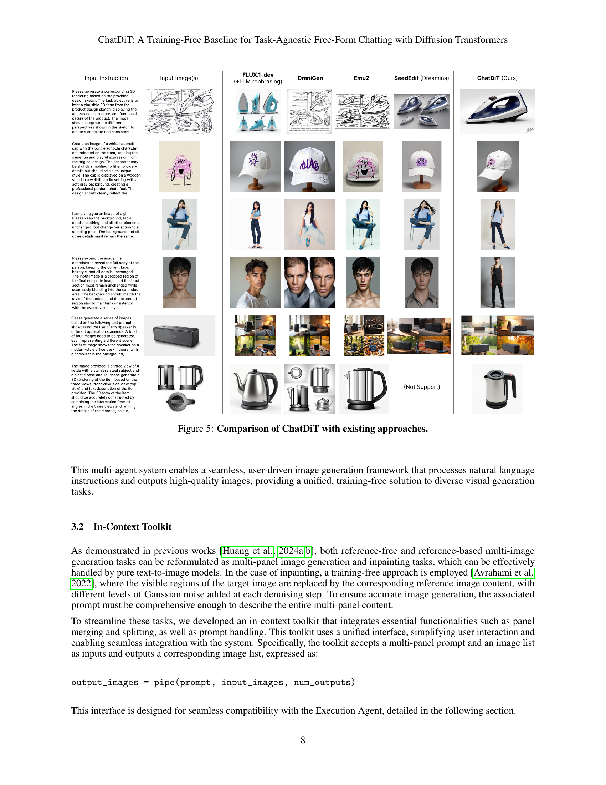

 


 2412.12571 
 Lianghua Huang et el. 
 
 🤗 2024-12-19 
 



↗ arXiv


↗ Hugging Face


↗ Papers with Code


### TL;DR



기존의 시각적 생성 모델들은 특정 작업에 맞춰 훈련되거나, 다양한 작업에 대한 적응력이 떨어지는 한계점을 가지고 있습니다. 이러한 문제를 해결하기 위해, 본 논문에서는 사전 훈련된 확산 변환기 모델을 활용하여 제로샷(zero-shot) 방식으로 다양한 시각적 과제를 해결하는 새로운 프레임워크 ChatDiT를 제안합니다. ChatDiT는 사용자의 자연어 명령을 다중 에이전트 시스템을 통해 해석하고, 효율적인 이미지 생성 전략을 수립하여 실행합니다. 이는 이미지 편집, 삽화 제작, 캐릭터 디자인 등 다양한 작업에 유연하게 적용될 수 있으며, 기존 방식들보다 뛰어난 성능을 보입니다.

ChatDiT는 다중 에이전트 시스템을 기반으로 설계되었으며, 지시사항 파악, 전략 계획, 이미지 생성 등 각 단계별로 전문화된 에이전트가 역할을 수행합니다. 특히, 자연어 인터페이스를 통해 사용자의 의도를 정확하게 파악하고, 다양한 이미지 생성 작업을 효율적으로 처리합니다. 또한,  기존 방식들과 비교하여 IDEA-Bench 벤치마크에서 우수한 성능을 보임으로써, 제로샷 일반화 능력을 실증적으로 검증합니다. 이는 사전 훈련된 모델의 잠재력을 극대화하고, 다양한 시각적 과제에 대한 효율적인 해결책을 제시하는 데 중요한 의미를 가집니다.



#### Key Takeaways


 제로샷(zero-shot) 방식으로 사전 훈련된 확산 변환기를 활용하여 다양한 시각적 과제를 해결하는 새로운 프레임워크 ChatDiT를 제시 



 다중 에이전트 시스템을 통해 사용자의 자연어 명령을 효율적으로 해석하고, 다단계 이미지 생성 전략을 계획 및 실행 



 IDEA-Bench 벤치마크에서 기존의 다른 방식들보다 뛰어난 성능을 달성하며, 제로샷 일반화 능력을 입증 


#### Why does it matter?
본 논문은 **제로샷(zero-shot)** 방식으로 다양한 시각적 과제에 적용 가능한 새로운 이미지 생성 프레임워크를 제시하여, **사전 훈련된 확산 변환기(diffusion transformers)**의 잠재력을 극대화합니다. 이는 **훈련 없이도 다양한 작업에 적응**할 수 있어 연구자들이 **새로운 응용 분야를 탐구**하고 **효율적인 시각적 생성 모델을 개발**하는 데 중요한 의미를 가집니다. 또한, **다중 에이전트 시스템과 자연어 인터페이스**를 활용하여 사용자 친화적인 인터랙티브 환경을 제공합니다. 이러한 점은 기존의 방식들보다 유연성과 효율성을 높여, **시각적 생성 모델 연구에 새로운 가능성**을 제시합니다.

------
#### Visual Insights

> 🔼 ChatDiT은 사용자의 지시와 입력 이미지를 해석하고, 컨텍스트 기반 이미지 생성 전략을 수립하고, 사전 훈련된 확산 변환기를 사용하여 계획된 작업을 실행하는 세 가지 핵심 에이전트(Instruction-Parsing Agent, Strategy-Planning Agent, Execution Agent)로 구성된 다중 에이전트 프레임워크를 보여줍니다. 선택적 Markdown Agent는 출력물을 일관성 있는 그림이 포함된 문서로 통합합니다. 각 핵심 에이전트 내의 하위 에이전트는 특정 작업을 처리하여 유연성과 정확성을 보장합니다.
> 

> 
read the caption

> Figure 1: Overview of the ChatDiT multi-agent framework. The framework consists of three core agents operating sequentially: the Instruction-Parsing Agent interprets user instructions and analyzes inputs, the Strategy-Planning Agent formulates in-context generation strategies, and the Execution Agent performs the planned actions using pretrained diffusion transformers. An optional Markdown Agent integrates the outputs into cohesive, illustrated articles. Sub-agents handle specialized tasks within each core agent, ensuring flexibility and precision in generation.
> 


| Task Type | FLUX+GPT4o | DALL-E3+GPT4o | SD3+GPT4o | Pixart+GPT4o | InstructPix2Pix | MagicBrush | Anole | Emu2 | OmniGen | ChatDiT |
|---|---|---|---|---|---|---|---|---|---|---|
| T2I | **46.06** | 24.34 | 24.04 | 14.44 | 0 | 0 | 0 | 17.98 | 21.41 | **50.91** |
| I2I | 12.13 | 6.95 | 10.79 | 7.75 | 17.58 | **19.07** | 0.64 | 7.05 | 8.17 | **21.58** |
| Is2I | 4.89 | **5.27** | 4.69 | 3.48 | 0 | 0 | 0 | **8.98** | 2.77 | 2.36 |
| T2Is | 20.15 | 14.36 | **21.59** | 17.46 | 0 | 0 | 1.74 | 0 | 0 | **27.77** |
| Is2Is | **29.17** | 14.44 | 13.06 | **21.39** | 0 | 0 | 0 | 0 | 0 | 13.33 |
| Avg. | **22.48** | 13.07 | 14.83 | 12.90 | 3.52 | 3.81 | 0.48 | 6.80 | 6.47 | **23.19** |

> 🔼 표 1은 IDEA-Bench(Liang et al., 2024)의 다양한 작업에서 ChatDiT와 다른 모델들을 비교한 결과를 보여줍니다.  성능 측정 지표는 T2I(텍스트-이미지), I2I(이미지-이미지), Is2I(이미지 집합-이미지), T2Is(텍스트-이미지 집합), Is2Is(이미지 집합-이미지 집합) 등 다양한 작업 유형에 대해 보고됩니다.  '+GPT4o'는 사용자 지시사항과 업로드된 이미지가 각 출력 이미지 프롬프트로 재구성되어 텍스트-이미지 모델이 결과를 생성할 수 있도록 하는 것을 나타냅니다. 각 작업에 대한 상위 두 점수는 빨간색(최고)과 파란색(두 번째로 높음)으로 강조 표시됩니다.
> 

> 
read the caption

> Table 1: Comparison of ChatDiT with other models across various tasks on IDEA-Bench (Liang et al., 2024). Performance metrics are reported for different task types: T2I (Text-to-Image), I2I (Image-to-Image), Is2I (Image set to Image), T2Is (Text-to-Image set), and Is2Is (Image set to Image set). “+GPT4o” indicates that user instructions and uploaded images are reformulated into per-output-image prompts, enabling text-to-image models to generate results. The top two scores for each task are highlighted in red (best) and blue (second best).
> 

### In-depth insights

#### ChatDiT: Zero-shot visuals
ChatDiT의 제로샷 비주얼 생성 능력은 **사전 훈련된 확산 트랜스포머의 컨텍스트 내 생성 능력**을 활용한 혁신적인 접근 방식에 기반합니다. 추가적인 미세 조정이나 어댑터 없이도 다양한 시각적 작업에 적응할 수 있다는 점이 특징입니다. 이는 사용자가 자연어를 통해 상호 작용하며 텍스트-이미지 기사, 그림책 편집, 이미지 수정 등을 수행할 수 있음을 시사합니다.  **다중 에이전트 시스템**을 통해 사용자 입력 해석, 전략 계획, 그리고 확산 트랜스포머를 활용한 실행이 효율적으로 이루어집니다.  **IDEA-Bench 벤치마크**에서 경쟁 시스템들을 능가하는 성능을 보여주었지만, 제로샷 일반화의 한계도 드러났습니다.  복잡한 작업이나 장문의 컨텍스트에서는 성능 저하가 발생하는데, 이는 **장기 컨텍스트 이해력 부족 및 복잡한 시각적 관계 처리의 어려움** 때문으로 분석됩니다. 따라서 **장기 컨텍스트 처리 및 복잡한 시각적 관계 처리**에 대한 향상된 모델이 향후 연구의 중요한 방향이 될 것입니다.

#### Multi-agent architecture
본 논문에서 제시된 다중 에이전트 아키텍처는 **자연어 처리 및 이미지 생성의 시너지 효과**를 통해 사용자의 의도를 효과적으로 파악하고, 이미지 생성 작업을 수행하는 핵심적인 역할을 합니다.  **Instruction-Parsing Agent, Strategy-Planning Agent, Execution Agent의 3단계 구조**는 사용자 입력을 분석하고, 생성 과정 전략을 세우며, 마지막으로 사전 훈련된 확산 변환기를 활용하여 이미지를 생성하는 흐름을 보여줍니다.  각 에이전트는 세분화된 하위 에이전트들로 구성되어 있으며, 이는 생성 과정의 유연성과 정확성을 높입니다. 특히, **전략 계획 에이전트는 다중 패널 프롬프트 생성 및 참조 이미지 선택을 담당**하여, 다양한 작업에 대한 유연한 대응이 가능하게 합니다.  **JSON 기반의 입력 및 출력 방식**은 에이전트 간의 원활한 정보 교류를 보장하며, 시스템의 안정성과 일관성을 유지합니다.  **추가적으로 마크다운 에이전트는 생성된 이미지와 텍스트를 통합하여 설명적인 문서를 생성**하는 역할을 수행합니다.  전반적으로 이 아키텍처는 **훈련 없이도 다양한 이미지 생성 작업**을 수행할 수 있도록 설계되었으며, **자연어 기반의 상호 작용**을 통해 사용자 친화적인 인터페이스를 제공합니다.  **다중 에이전트의 협력적 작업 방식**은 복잡한 이미지 생성 과제에 대한 효율적인 해결책을 제시합니다.

#### IDEA-Bench Evaluation
IDEA-Bench 평가는 제시된 ChatDiT 모델의 성능을 다양한 디자인 과제에 걸쳐 객관적으로 평가하기 위한 핵심 요소입니다. **100가지의 실제 디자인 과제와 275개의 테스트 사례**를 포함하는 포괄적인 벤치마크로서, 다양한 지시사항과 입력/출력 구성을 다룹니다.  ChatDiT는 **제로샷 능력**을 통해 기존의 다양한 접근 방식들을 능가하는 성능을 보여줍니다.  **특히 이미지 간의 관계를 정확히 파악하는 능력**은 ChatDiT의 강점으로 드러나며, 이는 복잡한 다중 이미지 생성 작업에서의 우수한 성능으로 이어집니다. 하지만 **긴 문맥 처리와 세부적인 시각적 일관성 유지**는 여전히 개선의 여지가 있는 부분입니다.  **IDEA-Bench 결과는 ChatDiT의 강점과 약점을 명확히 드러내**,  실제 응용 프로그램으로의 전환을 위한 추가 연구의 필요성을 시사합니다.  **특히 복잡한 과제에서의 성능 향상**에 초점을 맞춘 추가 연구가 필요합니다.

#### In-context toolkit
본 논문에서 제시된 '컨텍스트 내 툴킷(In-context toolkit)'은 **사전 훈련된 확산 트랜스포머(DiTs)의 제한된 긴 컨텍스트 처리 능력을 극복하기 위해 고안된 핵심 구성 요소**입니다. 이 툴킷은 다중 패널 이미지 생성 및 인페인팅 작업을 가능하게 하여 다양한 이미지 생성 작업을 통합적으로 처리할 수 있도록 합니다. **훈련이 필요 없는 접근 방식을 사용하여 타겟 이미지의 가시 영역을 참조 이미지 콘텐츠로 대체**하고 각 디노이징 단계에서 다양한 수준의 가우시안 노이즈를 추가함으로써 정확한 이미지 생성을 보장합니다.  **단일 멀티패널 프롬프트와 이미지 목록을 입력으로 받아들여 대응하는 이미지 목록을 출력**하는 간결한 인터페이스를 통해 사용자 상호작용을 간소화하고 시스템과의 원활한 통합을 가능하게 합니다. 특히, **다양한 작업에 대한 유연성을 제공**하며 멀티패널 프롬프트 및 이미지 연결을 통해 참조 기반 및 참조 없는 작업 모두를 원활하게 처리할 수 있다는 점이 특징입니다.  **실행 에이전트와의 호환성을 위해 설계**되었고,  이 툴킷은 ChatDiT의 효율적이고 유연한 이미지 생성 파이프라인의 핵심 역할을 수행합니다.

#### ChatDiT limitations
ChatDiT은 제로샷 방식의 이미지 생성 프레임워크로써 뛰어난 성능을 보이지만, 몇 가지 중요한 한계점을 가지고 있습니다. **장기적인 맥락 이해 부족**은 복잡한 작업이나 여러 이미지를 다룰 때 성능 저하로 이어집니다. 또한, **세부적인 참조 정확도 부족**으로 인해 입력 이미지의 미묘한 디테일이나 스타일 일관성이 유지되지 않을 수 있습니다. **서사 및 감정 표현의 어려움**은 복잡한 스토리나 감정을 담은 이미지 생성에 제한적입니다.  **고차원적 맥락 추론 능력의 부족**은 다양한 입력-출력 이미지 쌍을 바탕으로 새로운 입력에 대한 작업을 추론하는 데 어려움을 겪습니다. 마지막으로 **여러 주제나 요소의 복잡성 처리의 어려움**은 여러 주제나 요소가 복잡하게 얽혀있는 상황에서 이미지 생성의 일관성을 유지하는 데 문제가 있습니다. 이러한 한계점들을 해결하기 위해서는 **세부적인 참조 정확도 향상, 장기적 맥락 이해 능력 향상, 고차원적 추론 능력 향상 및 여러 요소의 복잡성 처리 능력 향상** 등의 연구가 필요합니다.

### More visual insights

More on figures

> 🔼 그림 2는 ChatDiT가 IDEA-Bench(Liang et al., 2024) 데이터셋에서 제시된 다양한 작업들을 수행한 단일 라운드 생성 결과의 예시들을 보여줍니다.  ChatDiT는 자유 형식의 자연어 상호작용을 통해 다양한 작업, 지시사항, 입력/출력 구성을 제로샷 방식으로 처리하는 다재다능함을 보여줍니다.  이 그림에 제시된 사용자 메시지는 원래 IDEA-Bench의 상세 지시사항을 공간을 절약하기 위해 간략하게 요약한 것입니다.  각 이미지는 사용자가 제시한 자연어 지시사항에 따라 생성된 결과물을 보여주며, ChatDiT가 다양한 유형의 이미지 생성과 편집 작업을 효과적으로 처리할 수 있음을 시각적으로 보여줍니다.
> 

> 
read the caption

> Figure 2: Selected single-round generation examples of ChatDiT on IDEA-Bench (Liang et al., 2024). ChatDiT demonstrates versatility by handling diverse tasks, instructions, and input-output configurations in a zero-shot manner through free-form natural language interactions. The user messages shown here are condensed summaries of the original detailed instructions from IDEA-Bench to conserve space.
> 

> 🔼 그림 3은 ChatDiT가 자연어 명령어를 기반으로 텍스트와 이미지가 번갈아 나타나는 형태의 연재물을 생성하는 능력을 보여줍니다. ChatDiT는 필요한 이미지 수를 자동으로 추정하고, 문맥 내 기능을 사용하여 생성 과정을 계획하고 실행하며, 출력물을 일관성 있고 시각적으로 매력적인 연재물로 통합합니다.  즉, 사용자가 자연어로 원하는 내용을 입력하면 ChatDiT가 이미지 개수를 스스로 판단하고, 여러 이미지를 생성하여 하나의 이야기 또는 글처럼 자연스럽게 연결하는 능력을 보여줍니다.
> 

> 
read the caption

> Figure 3: Selected illustrated article generation examples of ChatDiT. ChatDiT is able to generate interleaved text-image articles based on users’ natural language instructions. It autonomously estimates the required number of images, plans and executes the generation process using in-context capabilities, and seamlessly integrates the outputs into coherent and visually engaging illustrated articles.
> 

### Full paper



