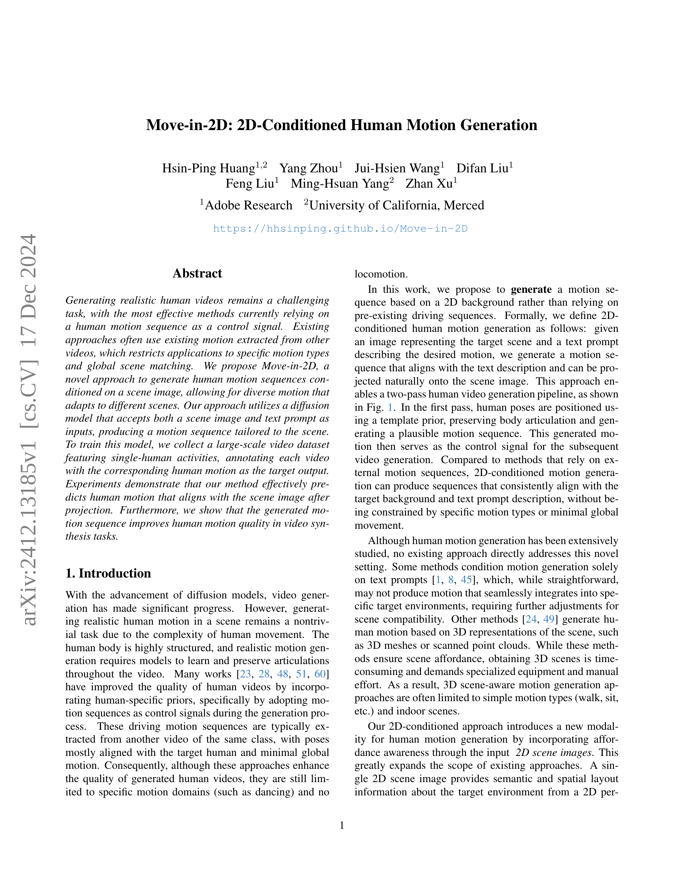
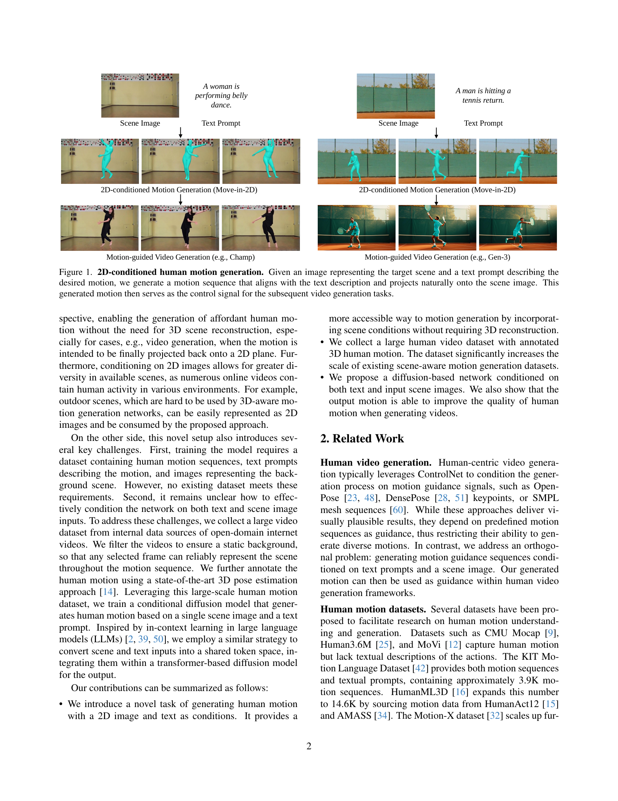
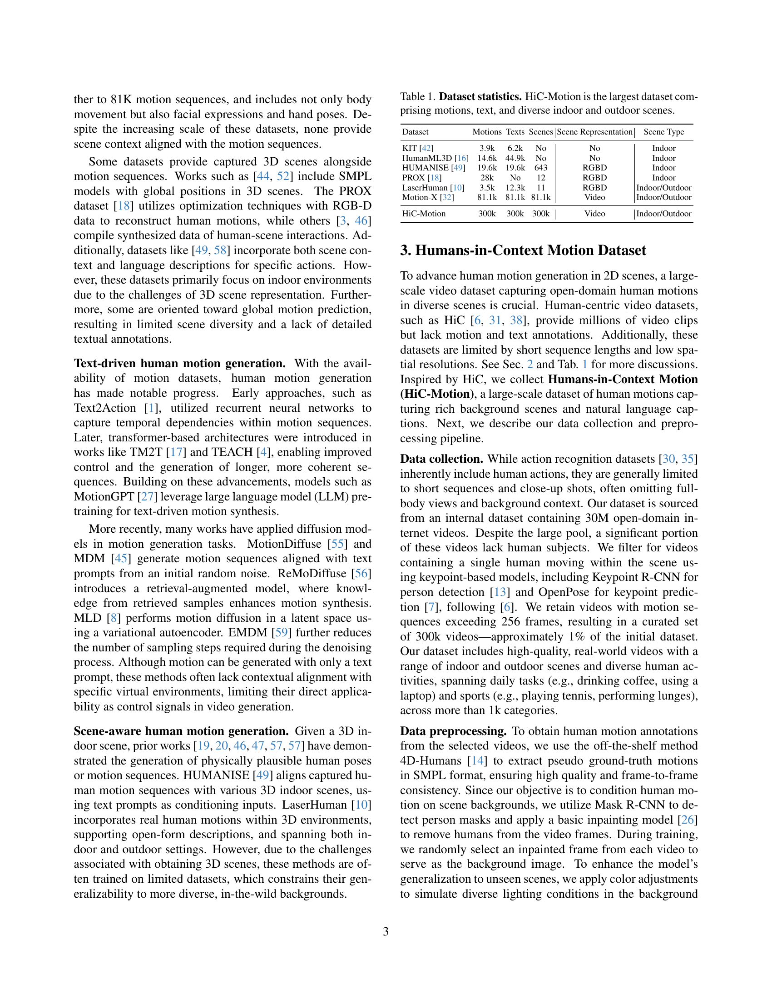
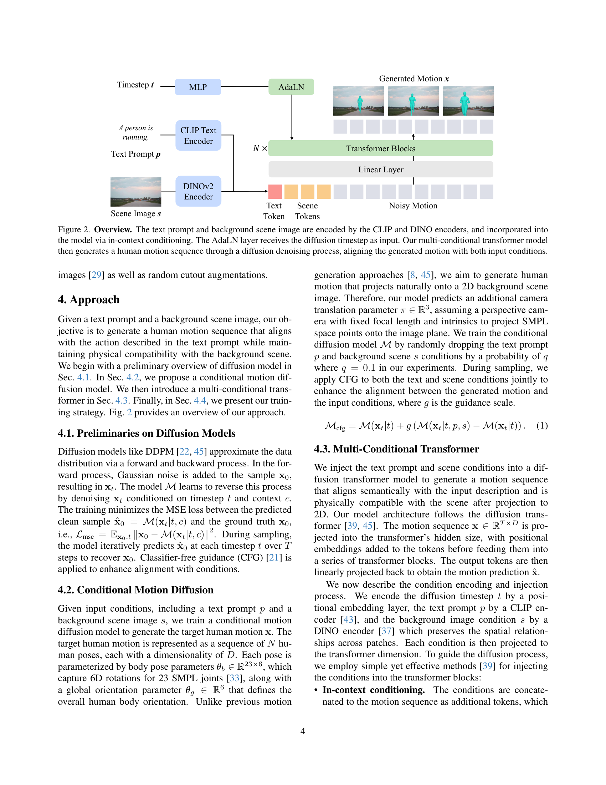
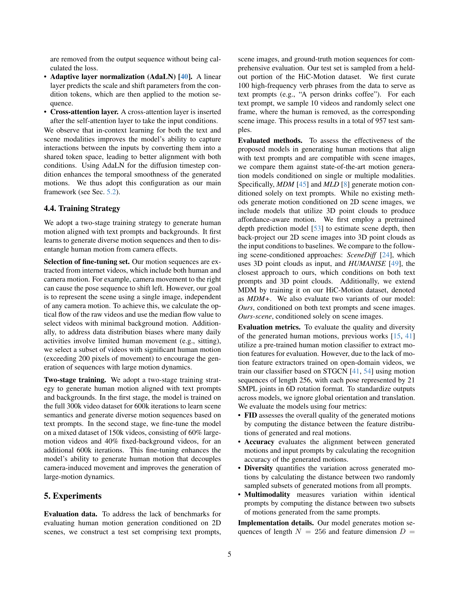
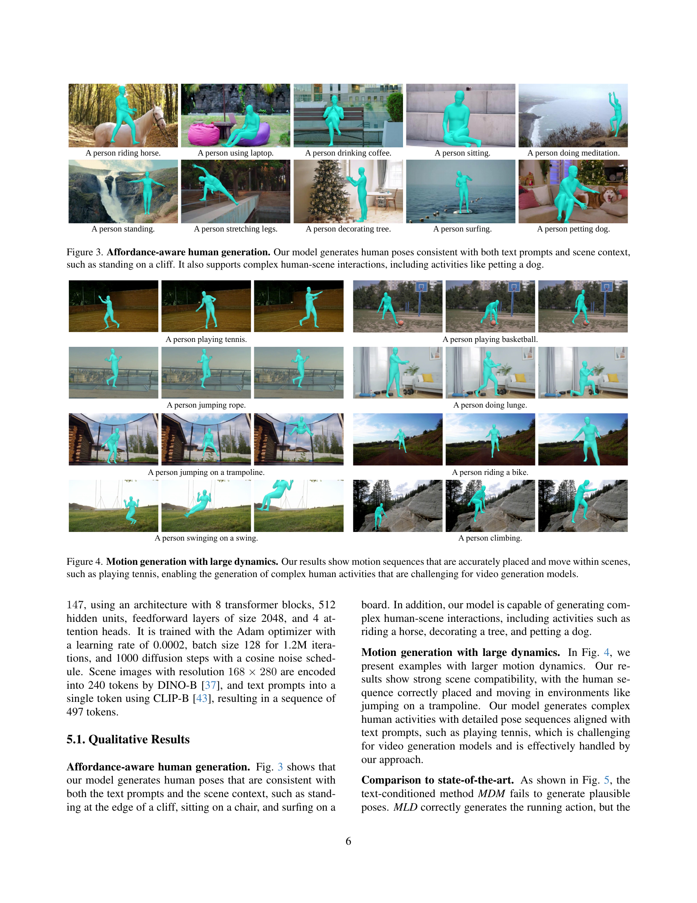
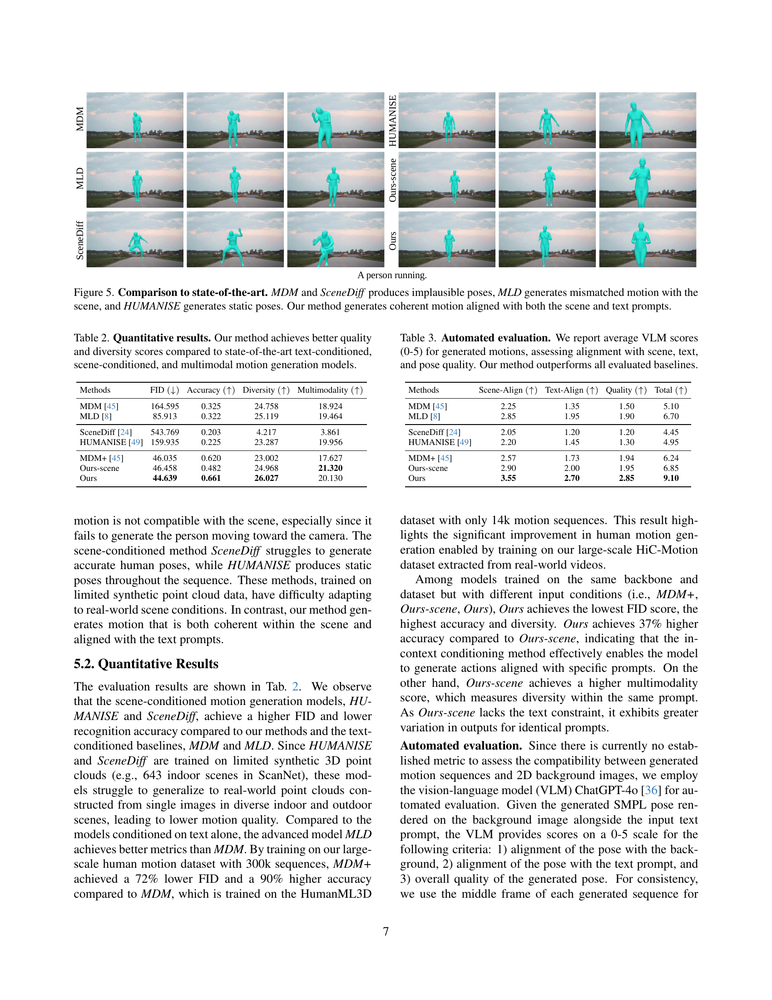
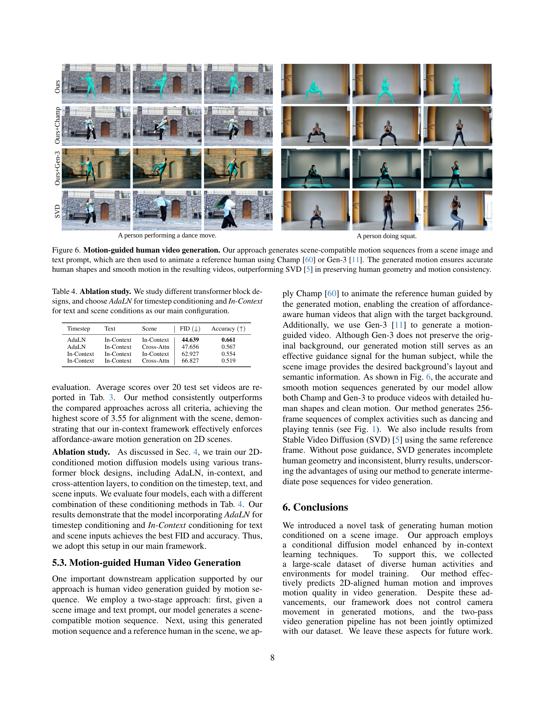
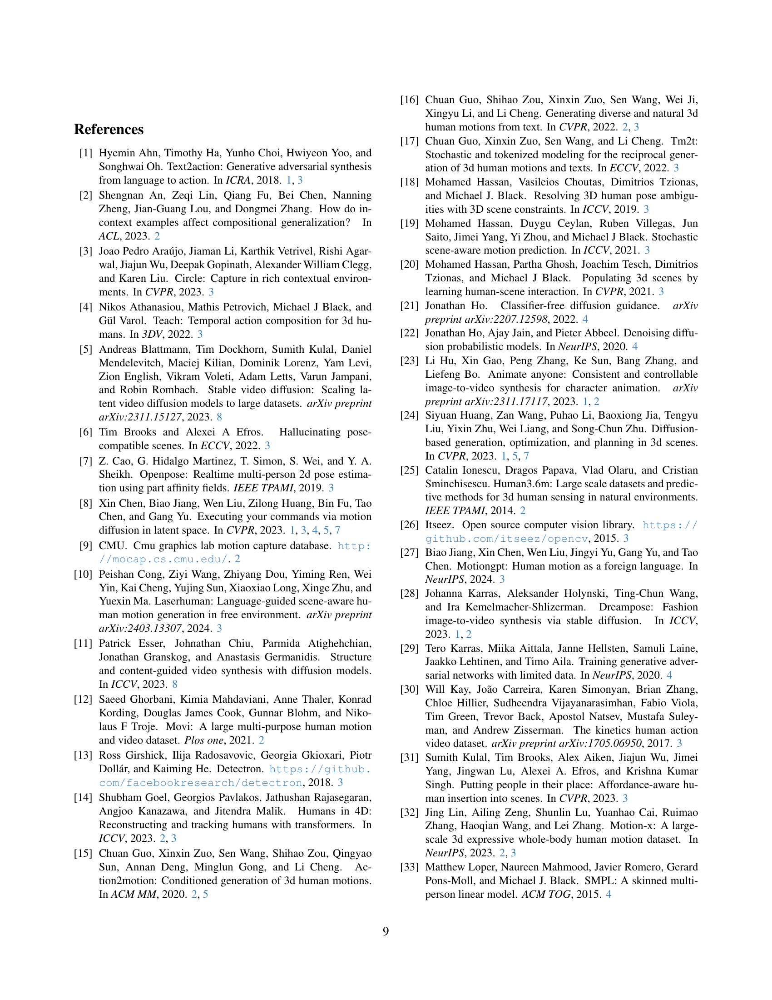
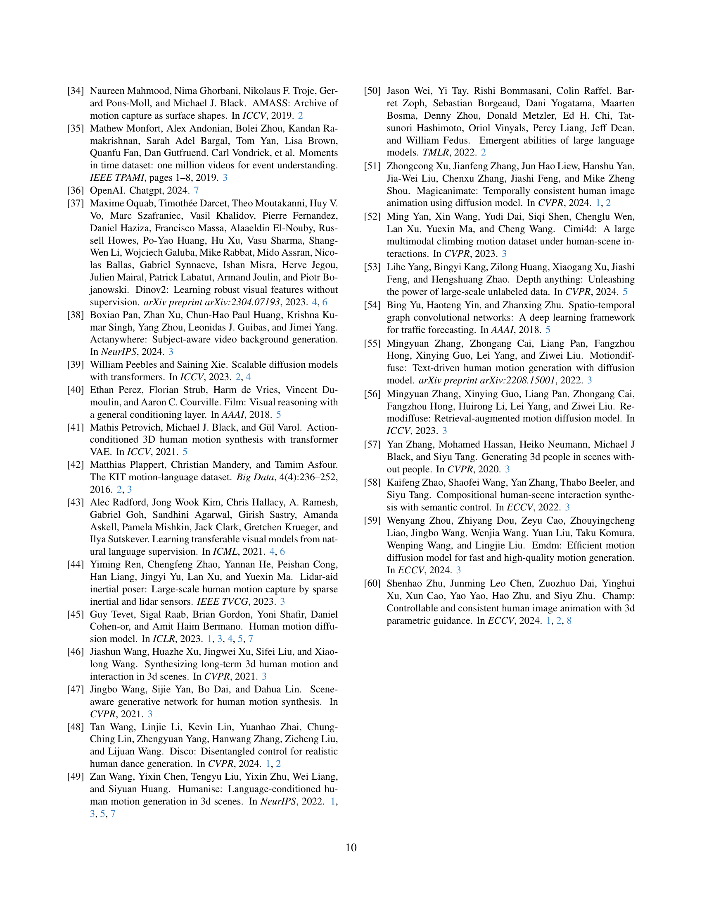

 


 2412.13185 
 Hsin-Ping Huang et el. 
 
 🤗 2024-12-20 
 



↗ arXiv


↗ Hugging Face


↗ Papers with Code


### TL;DR



기존의 인간 동작 생성 방법들은 주로 다른 영상에서 추출한 동작 시퀀스를 제어 신호로 사용하여 특정 동작 유형 및 전역 장면 매칭에 제한적이었습니다. 또한, 3D 장면 정보를 필요로 하는 방법들은 3D 장면 획득의 어려움으로 인해 실제 환경 적용에 제약이 있었습니다. 

본 논문에서는 이러한 문제점을 해결하기 위해, **2D 배경 이미지와 텍스트 프롬프트만을 사용하여 인간 동작 시퀀스를 생성하는 새로운 방법인 Move-in-2D**를 제시합니다. 이 방법은 **대규모의 인간 동작 영상 데이터셋을 구축**하고, **확산 모델과 멀티-컨디셔닝 트랜스포머를 활용**하여 2D 장면에 맞는 다양한 동작을 생성합니다. 실험 결과, 제안된 방법은 기존 방법보다 우수한 인간 동작 생성 품질을 보여주었으며, 영상 합성 작업의 성능 향상에도 기여했습니다.



#### Key Takeaways


 2D 이미지와 텍스트를 조건으로 하는 인간 동작 생성이라는 새로운 과제 제시 



 대규모 2D 기반 인간 동작 데이터셋 (HiC-Motion)을 구축하여 다양한 동작 생성 가능 



 제안된 방법은 기존 방법보다 우수한 인간 동작 생성 품질과 다양성을 보임 


#### Why does it matter?
이 논문은 **2D 이미지와 텍스트 프롬프트만을 사용하여 사실적인 인간 동작을 생성하는 새로운 방법**을 제시함으로써, 기존의 3D 기반 방법의 한계를 극복하고 다양한 응용 분야에 적용 가능성을 높였습니다. **대규모 데이터셋 구축**과 **새로운 컨디셔닝 기법**을 통해 **영상 합성 분야의 발전**에 기여하며, 향후 연구 방향을 제시합니다. 특히, **실시간 영상 합성, 가상현실, 게임 개발 등** 다양한 분야에서 활용될 수 있는 잠재력을 가지고 있습니다.

------
#### Visual Insights

> 🔼 이 그림은 2D 조건부 인간 모션 생성 과정을 보여줍니다.  타겟 장면을 나타내는 이미지와 원하는 동작을 설명하는 텍스트 프롬프트가 주어지면, 시스템은 텍스트 설명과 일치하고 장면 이미지에 자연스럽게 투영되는 모션 시퀀스를 생성합니다. 생성된 모션은 후속 비디오 생성 작업을 위한 제어 신호 역할을 합니다.  즉, 배경 이미지와 텍스트 설명만으로도 실제 사람의 움직임과 유사한 동작을 생성하고, 이를 바탕으로 실감나는 영상을 만들 수 있다는 것을 보여줍니다.
> 

> 
read the caption

> Figure 1: 2D-conditioned human motion generation. Given an image representing the target scene and a text prompt describing the desired motion, we generate a motion sequence that aligns with the text description and projects naturally onto the scene image. This generated motion then serves as the control signal for the subsequent video generation tasks.
> 


| Dataset | Motions | Texts | Scenes | Scene Representation | Scene Type |
|---|---|---|---|---|---| 
| KIT [42] | 3.9k | 6.2k | No | No | Indoor |
| HumanML3D [16] | 14.6k | 44.9k | No | No | Indoor |
| HUMANISE [49] | 19.6k | 19.6k | 643 | RGBD | Indoor |
| PROX [18] | 28k | No | 12 | RGBD | Indoor |
| LaserHuman [10] | 3.5k | 12.3k | 11 | RGBD | Indoor/Outdoor |
| Motion-X [32] | 81.1k | 81.1k | 81.1k | Video | Indoor/Outdoor |
| HiC-Motion | 300k | 300k | 300k | Video | Indoor/Outdoor |

> 🔼 표 1은 다양한 실내외 환경에서 촬영된 동작, 텍스트 및 장면을 포함하는 데이터셋의 통계를 보여줍니다. HiC-Motion 데이터셋은 가장 큰 규모의 데이터셋이며, 동작, 텍스트, 장면 정보를 모두 포함하고 있습니다. 표에는 각 데이터셋의 동작, 텍스트 및 장면 수와 장면 표현 방식 및 유형이 포함되어 있습니다.
> 

> 
read the caption

> Table 1:  Dataset statistics. HiC-Motion is the largest dataset comprising motions, text, and diverse indoor and outdoor scenes.
> 

### In-depth insights

#### 2D Motion Control
2D 운동 제어는 **2차원 공간 내에서 객체의 움직임을 제어하는 기술**을 의미합니다. 이는 로봇공학, 게임 개발, 애니메이션 제작 등 다양한 분야에서 활용되며, 효율적인 움직임 계획 및 정밀한 제어가 중요합니다. **주요 과제는 예측 불가능한 요소들을 고려하여 안정적이고 정확한 운동을 생성하는 것**입니다.  이는 시스템의 복잡성, 환경의 불확실성, 센서 오류 등 여러 가지 요인에 영향을 받습니다. 따라서, **강건하고 유연한 제어 알고리즘**이 필수적입니다.  **인공지능 기반 제어**는 최근 주목받는 방식으로, 데이터 기반 학습을 통해 환경 변화에 적응하고 최적의 제어 성능을 제공할 수 있습니다.  그러나, AI 기반 제어는 **데이터 의존성 및 해석력의 한계**를 갖고 있어, 신중한 검토가 필요합니다. 또한, **실시간 처리 성능** 역시 중요한 고려 사항입니다.  **모델의 정확성**과 **계산 복잡도** 간의 균형을 찾는 것이 핵심입니다. 결론적으로, 2D 운동 제어는 다양한 분야에서 활용 가능성이 높은 기술이지만, 효과적인 구현을 위해서는 시스템 특성과 요구 사항에 맞는 적절한 제어 전략을 선택하고, 강건성 및 실시간 처리 성능을 확보하는 것이 중요합니다.

#### Diffusion Model Use
본 논문에서는 **확산 모델(Diffusion Model)**을 핵심적으로 활용하여 2D 이미지와 텍스트 프롬프트를 조건으로 하는 인간 동작 생성이라는 새로운 과제에 접근합니다.  **이미지와 텍스트 정보를 효과적으로 결합**하여 다양하고 현실적인 인간 동작 시퀀스를 생성하는 데 초점을 맞춥니다.  기존의 모션 캡처 데이터에 의존하는 방식과 달리, **2D 이미지를 통해 배경 환경 정보를 직접적으로 활용**하여, 다양한 배경과 상황에 적응력이 뛰어난 인간 동작을 생성할 수 있다는 장점을 제공합니다.  **다양한 조건부(Conditional) 확산 모델 아키텍처**를 실험하여 모델의 성능을 최적화하였으며,  **다단계 학습 전략**을 통해 인간 동작과 카메라 움직임을 분리하여 더욱 정확하고 현실적인 동작 생성을 가능하게 합니다.  결과적으로, 본 연구는 확산 모델의 활용을 통해 **고품질의 인간 동작 생성을 위한 새로운 가능성**을 제시합니다.

#### Dataset Creation
본 논문에서 데이터셋 생성에 대한 부분은 **대규모 비디오 데이터 수집 및 주석 작업**에 초점을 맞추고 있습니다.  인터넷에서 수집한 방대한 양의 비디오 데이터 중에서 **정적 배경과 단일 인물의 움직임**을 가진 영상들을 선별하여 사용했습니다. 이는 **모션 생성 모델의 학습에 필요한 데이터의 품질을 높이고, 배경 복잡성으로 인한 학습 어려움을 최소화하기 위한 전략**입니다.  선별된 비디오 데이터에는 **최첨단 3D 자세 추정 기법을 적용하여 움직임에 대한 주석을 추가**하였습니다.  **데이터 전처리 과정**에서 배경을 제거하고, 다양한 조명 환경을 모방하여 모델의 일반화 성능을 향상시키는 작업도 포함되어 있습니다.  **결과적으로, 다양한 장면과 움직임 유형을 포괄하는 대규모 데이터셋을 구축**함으로써, 2D 장면 조건부 인간 동작 생성 모델의 성능 향상에 크게 기여할 수 있었습니다.

#### Multi-Modal Fusion
본 논문에서 다루는 멀티모달 융합은 **텍스트 프롬프트와 배경 이미지 두 가지 모달리티를 결합하여 인간 동작을 생성하는 데 중점**을 둡니다.  단순히 각 모달리티의 정보를 연결하는 것이 아니라, **CLIP과 DINO 인코더를 활용하여 각 모달리티를 공통된 토큰 공간으로 변환**시켜 상호작용을 강화합니다. 이를 통해 **텍스트로 표현된 동작 의도와 배경 이미지가 시사하는 공간적 제약 조건이 효과적으로 통합**되어, 현실감 있고 상황에 적합한 인간 동작 시퀀스가 생성됩니다. **Transformer 기반 확산 모델은 이렇게 융합된 정보를 토대로 동작을 생성**하며, AdaLN과 In-Context conditioning 기법을 통해 시간적 일관성과 조건부 생성 성능을 향상시킵니다.  **결과적으로, 제안된 방법은 단일 모달리티 기반 방법보다 훨씬 자연스럽고 정확하며 다양한 인간 동작을 생성**할 수 있으며,  비디오 생성 등 후속 작업에 활용 가능성을 보여줍니다.  **이러한 멀티모달 융합 방식의 핵심은 서로 다른 모달리티의 정보를 단순히 병렬적으로 처리하는 것이 아니라, 의미론적 및 공간적으로 통합하는 데 있습니다.**

#### Future Directions
본 논문에서 제시된 2D 조건화된 인간 동작 생성 모델은 여러 측면에서 발전 가능성을 보입니다. **향후 연구 방향**으로는 첫째, **더욱 다양하고 복잡한 배경 환경을 처리**할 수 있는 모델의 확장성을 높이는 것입니다. 현재 모델은 정적인 배경에 대해서만 효과적으로 동작하지만, 동적인 배경이나 다양한 조명 환경까지 고려하면 실제 영상과의 차이를 더욱 줄일 수 있습니다. 둘째, **다양한 인간 동작의 질적 향상**을 위해 더욱 정교한 3D 포즈 추정 기법과 모델 학습 데이터를 확보하는 노력이 필요합니다. 현재 사용된 데이터셋의 한계를 넘어, 보다 다양한 종류의 동작과 더욱 정밀한 데이터로 모델을 학습시켜 생성 영상의 현실성을 더욱 높일 수 있습니다. 셋째, **텍스트 프롬프트와 2D 이미지 간의 상호작용을 더욱 효과적으로 모델링**하는 것입니다. 텍스트 정보와 이미지 정보를 효율적으로 결합하여 인간 동작 생성에 대한 정확도와 일관성을 높이고, 보다 창의적이고 다양한 동작 생성을 가능하게 할 수 있습니다. 마지막으로, **실시간 영상 생성 시스템과의 통합**을 통해 실제 응용 분야로의 확장을 고려할 수 있습니다. 실시간으로 인간 동작을 생성하여 증강 현실(AR)이나 가상 현실(VR) 등의 분야에 적용하면 큰 시너지 효과를 창출할 수 있을 것입니다. 이러한 방향으로 연구를 진행한다면, 본 논문에서 제시된 모델은 보다 실용적이고 유용한 인간 동작 생성 기술로 발전할 수 있을 것입니다.

### More visual insights

More on figures

> 🔼 그림 2는 제안된 모델의 개요를 보여줍니다. 텍스트 프롬프트와 배경 이미지는 각각 CLIP과 DINO 인코더를 통해 인코딩되어 컨텍스트 조건화를 통해 모델에 통합됩니다. AdaLN 레이어는 확산 시간 단계를 입력으로 받습니다. 다중 조건부 트랜스포머 모델은 그 후 확산 잡음 제거 과정을 통해 인간의 움직임 시퀀스를 생성하며, 생성된 움직임이 두 입력 조건과 정렬되도록 합니다.
> 

> 
read the caption

> Figure 2: Overview. The text prompt and background scene image are encoded by the CLIP and DINO encoders, and incorporated into the model via in-context conditioning. The AdaLN layer receives the diffusion timestep as input. Our multi-conditional transformer model then generates a human motion sequence through a diffusion denoising process, aligning the generated motion with both input conditions.
> 

> 🔼 이 그림은 논문의 제안된 모델이 텍스트 프롬프트와 배경 이미지의 조합을 입력받아 얼마나 현실감 있고 적절한 인간의 자세를 생성하는지 보여줍니다.  예를 들어, 절벽 위에 서 있거나 강아지를 쓰다듬는 등, 주어진 상황과 동작에 부합하는 다양한 인간-환경 상호작용이 자연스럽게 표현되어 있습니다.  단순한 자세뿐 아니라 복잡한 상호작용까지도 정확하게 생성하는 모델의 성능을 강조합니다.
> 

> 
read the caption

> Figure 3: Affordance-aware human generation. Our model generates human poses consistent with both text prompts and scene context, such as standing on a cliff. It also supports complex human-scene interactions, including activities like petting a dog.
> 

> 🔼 이 그림은 논문에서 제시된 방법을 사용하여 생성된, 역동적인 움직임을 포함하는 다양한 인간 동작 시퀀스들을 보여줍니다. 테니스를 치는 장면처럼 복잡하고 역동적인 동작들도 정확하게 배치되어 장면 안에서 자연스럽게 움직이는 것을 확인할 수 있습니다. 이는 기존 비디오 생성 모델들이 어려움을 겪는 복잡한 인간 활동을 생성하는 데 본 논문의 방법이 효과적임을 시사합니다.
> 

> 
read the caption

> Figure 4: Motion generation with large dynamics. Our results show motion sequences that are accurately placed and move within scenes, such as playing tennis, enabling the generation of complex human activities that are challenging for video generation models.
> 

> 🔼 그림 5는 본 논문에서 제안하는 방법과 다른 최첨단 방법들의 비교 결과를 보여줍니다. 기존 방법들은 비현실적인 자세 생성(MDM, SceneDiff), 장면과 일치하지 않는 움직임 생성(MLD), 정적인 자세 생성(HUMANISE) 등의 문제점을 보였습니다. 반면, 본 논문의 방법은 텍스트 프롬프트와 배경 이미지에 맞춰 일관성 있는 움직임을 생성합니다.
> 

> 
read the caption

> Figure 5: Comparison to state-of-the-art. MDM and SceneDiff produces implausible poses, MLD generates mismatched motion with the scene, and HUMANISE generates static poses. Our method generates coherent motion aligned with both the scene and text prompts.
> 

> 🔼 이 그림은 제안된 방법을 사용하여 생성된 동작을 사용하여 참조 인물을 애니메이션화하는 과정을 보여줍니다. 장면 이미지와 텍스트 프롬프트에서 장면과 호환되는 동작 시퀀스를 생성하고, Champ[60] 또는 Gen-3[11]을 사용하여 참조 인물을 애니메이션화합니다. 결과 비디오는 정확한 인체 형태와 부드러운 동작을 보장하며, 기존의 SVD[5] 방법보다 인체 형태와 동작 일관성을 더 잘 유지합니다.
> 

> 
read the caption

> Figure 6: Motion-guided human video generation. Our approach generates scene-compatible motion sequences from a scene image and text prompt, which are then used to animate a reference human using Champ [60] or Gen-3 [11]. The generated motion ensures accurate human shapes and smooth motion in the resulting videos, outperforming SVD [5] in preserving human geometry and motion consistency.
> 

More on tables


| Methods | FID (↓) | Accuracy (↑) | Diversity (↑) | Multimodality (↑) |
|---|---|---|---|---|
| MDM [45] | 164.595 | 0.325 | 24.758 | 18.924 |
| MLD [8] | 85.913 | 0.322 | 25.119 | 19.464 |
| SceneDiff [24] | 543.769 | 0.203 | 4.217 | 3.861 |
| HUMANISE [49] | 159.935 | 0.225 | 23.287 | 19.956 |
| MDM+ [45] | 46.035 | 0.620 | 23.002 | 17.627 |
| Ours-scene | 46.458 | 0.482 | 24.968 | **21.320** |
| Ours | **44.639** | **0.661** | **26.027** | 20.130 |
> 🔼 표 2는 제안된 방법의 정량적 결과를 보여줍니다. FID(Fréchet Inception Distance), 정확도, 다양성, 다중 모드성 등의 지표를 사용하여 평가하였습니다. 제안된 방법은 최첨단의 텍스트 조건, 장면 조건, 다중 모드 모션 생성 모델들과 비교하여 더 나은 품질과 다양성 점수를 달성했습니다.
> 

> 
read the caption

> Table 2: Quantitative results. Our method achieves better quality and diversity scores compared to state-of-the-art text-conditioned, scene-conditioned, and multimodal motion generation models.
> 


| Methods | Scene-Align (↑) | Text-Align (↑) | Quality (↑) | Total (↑) |
|---|---|---|---|---|
| MDM [45] | 2.25 | 1.35 | 1.50 | 5.10 |
| MLD [8] | 2.85 | 1.95 | 1.90 | 6.70 |
| SceneDiff [24] | 2.05 | 1.20 | 1.20 | 4.45 |
| HUMANISE [49] | 2.20 | 1.45 | 1.30 | 4.95 |
| MDM+ [45] | 2.57 | 1.73 | 1.94 | 6.24 |
| Ours-scene | 2.90 | 2.00 | 1.95 | 6.85 |
| Ours | **3.55** | **2.70** | **2.85** | **9.10** |
> 🔼 표 3은 제시된 방법의 성능을 자동으로 평가한 결과를 보여줍니다. 평가는 Vision-Language Model(VLM)을 사용하여 생성된 동작의 시각적 품질과, 배경 이미지 및 텍스트 설명과의 정합성을 0에서 5점 척도로 평가하였습니다.  각 지표 (배경과의 정합도, 텍스트와의 정합도, 자세의 품질)에 대한 평균 점수와,  전체 점수가 제시되어 있습니다. 본 논문의 방법이 다른 기준 방법들보다 우수한 성능을 보임을 확인할 수 있습니다.
> 

> 
read the caption

> Table 3: Automated evaluation. We report average VLM scores (0-5) for generated motions, assessing alignment with scene, text, and pose quality. Our method outperforms all evaluated baselines.
> 


| Timestep | Text | Scene | FID (↓) | Accuracy (↑) |
|---|---|---|---|---|
| AdaLN | In-Context | In-Context | 44.639 | 0.661 |
| AdaLN | In-Context | Cross-Attn | 47.656 | 0.567 |
| In-Context | In-Context | In-Context | 62.927 | 0.554 |
| In-Context | In-Context | Cross-Attn | 66.827 | 0.519 |
> 🔼 표 4는 다양한 트랜스포머 블록 설계를 비교 분석한 결과를 보여줍니다. 시간 단계 조건화에는 AdaLN을, 텍스트 및 장면 조건에는 In-Context 방법을 사용하는 것이 본 논문의 주요 구성으로 선택되었음을 보여줍니다.  다양한 조합으로 실험하여 최적의 성능을 내는 구성을 찾는 과정을 보여주는 표입니다.  FID(Fréchet Inception Distance) 점수와 정확도 점수를 통해 각 구성의 성능을 비교 분석하였습니다.
> 

> 
read the caption

> Table 4: Ablation study. We study different transformer block designs, and choose AdaLN for timestep conditioning and In-Context for text and scene conditions as our main configuration.
> 

### Full paper



