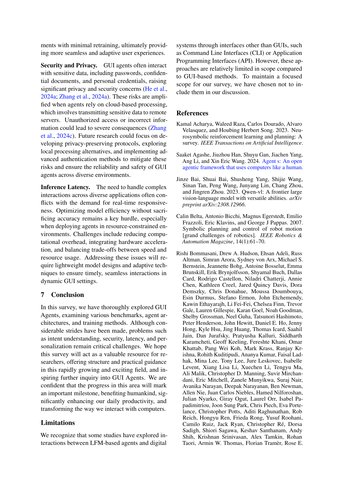

 


 2412.13501 
 Dang Nguyen et el. 
 
 🤗 2024-12-19 
 



↗ arXiv


↗ Hugging Face


↗ Papers with Code


### TL;DR



최근 **대규모 언어 모델(LLM)**의 발전으로 **GUI(Graphical User Interface) 에이전트**가 주목받고 있습니다. GUI 에이전트는 LLM을 활용하여 사용자처럼 GUI를 통해 디지털 시스템과 상호 작용하는 인공지능 에이전트입니다. 하지만 **다양한 플랫폼과 동적인 GUI 환경**, 그리고 **정교한 시각적 요소 인식** 등의 과제가 존재합니다. 이러한 과제는 GUI 에이전트의 실용성과 신뢰성에 영향을 미칩니다.

본 논문은 GUI 에이전트의 **기존 연구를 종합적으로 검토**하고, **기존 연구의 한계점을 극복**하기 위한 **새로운 프레임워크와 벤치마크**를 제시합니다. **인식, 추론, 계획, 행동** 4가지 핵심 기능으로 GUI 에이전트 아키텍처를 분류하고, 다양한 학습 방법과 평가 지표를 제시합니다. 또한 **미해결 과제와 향후 연구 방향**을 제시하여 GUI 에이전트 기술 발전에 기여하고자 합니다.



#### Key Takeaways


 대규모 언어 모델 기반 GUI 에이전트의 벤치마크, 평가 지표, 아키텍처 및 학습 방법에 대한 종합적인 분석을 제공합니다. 



 GUI 에이전트의 인식, 추론, 계획 및 행동 능력을 구분하는 통합 프레임워크를 제시합니다. 



 GUI 에이전트 연구의 주요 과제와 향후 연구 방향을 제시합니다. 


#### Why does it matter?
본 논문은 **GUI 에이전트 분야의 최신 연구 동향을 종합적으로 분석**하고, **향후 연구 방향을 제시**함으로써, 연구자들이 GUI 에이전트 기술을 더욱 발전시키고 다양한 응용 분야에 적용하는 데 중요한 역할을 합니다. **새로운 벤치마크 및 평가 지표** 제시와 **다양한 아키텍처 및 학습 방법**에 대한 분석은 관련 연구를 진행하는 연구자들에게 큰 도움을 줄 것입니다. 또한, **열린 문제점 및 과제** 제시는 향후 연구의 방향을 제시하여,  GUI 에이전트 분야의 지속적인 발전에 기여할 것으로 예상됩니다.

------
#### Visual Insights

### Full paper



