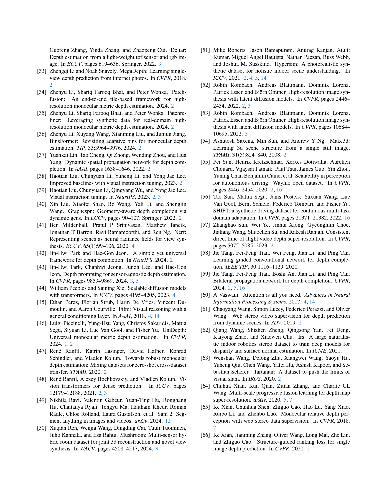
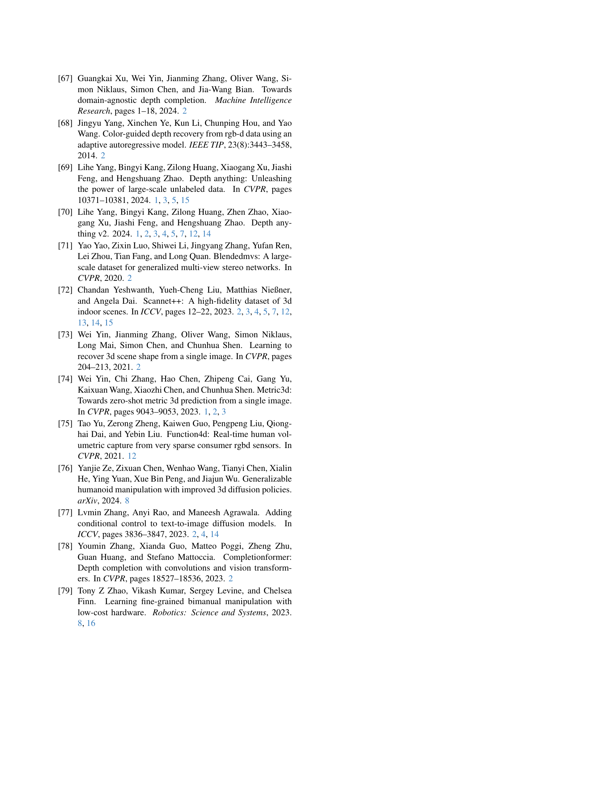

 


 2412.14015 
 Haotong Lin et el. 
 
 🤗 2024-12-19 
 



↗ arXiv


↗ Hugging Face


↗ Papers with Code


### TL;DR



기존의 단안 깊이 추정 모델들은 **척도 모호성**으로 인해 실제 응용 분야에서의 정확도가 떨어지는 문제점을 가지고 있습니다. 특히, **계량적 깊이 추정**은 자율 주행 및 로봇 조작과 같은 분야에서 매우 중요하지만, 기존 모델들은 이러한 요구사항을 충족시키지 못했습니다.

본 논문에서는 **저렴한 라이다 센서를 프롬프트로 활용**, 깊이 기반 모델의 출력을 개선하는 새로운 방법, Prompt Depth Anything을 제시합니다. 이 방법은 **다양한 스케일의 라이다 데이터를 깊이 디코더에 통합**하여 정확도를 높이고, **합성 데이터 및 실제 데이터를 결합한 확장 가능한 데이터 파이프라인**을 통해 모델 학습의 어려움을 해결합니다. 또한, **에지 어웨어 손실 함수**를 통해 정확도를 더욱 높였습니다. 실험 결과, 제안된 방법은 ARKitScenes 및 ScanNet++ 데이터셋에서 최첨단 성능을 달성하였으며, **3D 재구성 및 로봇 그래스핑**과 같은 응용 분야에서도 우수한 성능을 보였습니다.



#### Key Takeaways


 저렴한 라이다를 프롬프트로 활용하여 깊이 기반 모델의 성능을 향상시키는 새로운 패러다임 제시 



 4K 고해상도의 정확한 계량적 깊이 추정 달성 및 최첨단 성능 기록 



 3D 재구성 및 로봇 그래스핑 등 하위 작업의 성능 향상에 기여 


#### Why does it matter?
본 논문은 **정확한 계량적 깊이 추정을 위한 새로운 패러다임**을 제시하여, 컴퓨터 비전 및 로보틱스 분야 연구자들에게 중요한 의미를 가집니다. **저렴한 라이다를 프롬프트로 활용**하여 깊이 기반 모델의 성능을 향상시킨 접근 방식은 기존의 한계를 극복하고 다양한 응용 분야에 활용될 수 있는 잠재력을 보여줍니다. 특히, **4K 고해상도 깊이 추정**을 달성하고, 실제 데이터와 합성 데이터를 결합한 훈련 전략은 향후 연구에 대한 새로운 방향을 제시하며, **3D 재구성 및 로봇 그래스핑**과 같은 하위 작업에 대한 성능 향상에 기여합니다.

------
#### Visual Insights

> 🔼 그림 1은 Prompt Depth Anything의 기능과 성능을 보여줍니다. (a)는 저가형 LiDAR를 프롬프트로 사용하여 심층 기반 모델을 프롬프팅함으로써 계량적 심도 추정을 위한 새로운 패러다임을 제시합니다. (b)는 Metric3D v2의 부정확한 스케일과 불일치 문제를 해결하여 일관된 심도 추정을 가능하게 합니다. (c)는 ARKit LiDAR Depth (240x320)보다 훨씬 뛰어난 정확도로 4K 해상도의 심도 추정을 달성합니다.
> 

> 
read the caption

> Figure 1:  Illustration and capabilities of Prompt Depth Anything. (a) Prompt Depth Anything is a new paradigm for metric depth estimation, which is formulated as prompting a depth foundation model with a metric prompt, specifically utilizing a low-cost LiDAR as the prompt. (b) Our method enables consistent depth estimation, addressing the limitations of Metric3D v2 [24] that suffer from inaccurate scale and inconsistency. (c) It achieves accurate 4K accurate depth estimation, significantly surpassing ARKit LiDAR Depth (240 ×\times× 320).
> 


| Method | Resolution | L1 ↓ (384x512) | RMSE ↓ (384x512) | L1 ↓ (768x1024) | RMSE ↓ (768x1024) | L1 ↓ (1440x1920) | RMSE ↓ (1440x1920) |
|---|---|---|---|---|---|---|---| 
| Zero Shot | 384x512 |  |  |  |  |  |  |
| Net. / Post. / w/o LiDAR | 384x512 |  |  |  |  |  |  |
|  | 768x1024 |  |  |  |  |  |  |
|  | 1440x1920 |  |  |  |  |  |  |
|---|---|---|---|---|---|---|---| 
| No |  |  |  |  |  |  |  |
| **Ours** |  | **0.0135** | **0.0326** | **0.0132** | **0.0315** | **0.0138** | **0.0316** |
| **MSPF** |  | 0.0153 | 0.0369 | 0.0149 | 0.0362 | 0.0152 | 0.0363 |
|---|---|---|---|---|---|---|---| 
|  |  |  |  |  |  |  |  |
| Depth Pro∗ |  | 0.0437 | 0.0672 | 0.0435 | 0.0665 | 0.0425 | 0.0654 |
| DepthAny. v2∗ |  | 0.0464 | 0.0715 | 0.0423 | 0.0660 | 0.0497 | 0.0764 |
| ZoeDepth∗ |  | 0.0831 | 0.2873 | 0.0679 | 0.1421 | 0.0529 | 0.0793 |
|---|---|---|---|---|---|---|---| 
|  |  |  |  |  |  |  |  |
| Depth Pro∗ |  | 0.1222 | 0.1424 | 0.1225 | 0.1427 | 0.1244 | 0.1444 |
| DepthAny. v2∗ |  | 0.0978 | 0.1180 | 0.0771 | 0.0647 | 0.0906 | 0.1125 |
| ZoeDepth∗ |  | 0.2101 | 0.2784 | 0.1780 | 0.2319 | 0.1566 | 0.1788 |
|---|---|---|---|---|---|---|---| 
| Yes |  |  |  |  |  |  |  |
| **Ourssyn** |  | **0.0161** | **0.0376** | **0.0163** | **0.0371** | **0.0170** | **0.0376** |
| **D.P.** |  | 0.0251 | 0.0422 | 0.0253 | 0.0422 | 0.0249 | 0.0422 |
| **BPNet** |  | 0.1494 | 0.2106 | 0.1493 | 0.2107 | 0.1491 | 0.2100 |
|---|---|---|---|---|---|---|---| 
|  |  |  |  |  |  |  |  |
| ARKit Depth |  | 0.0251 | 0.0424 | 0.0250 | 0.0423 | 0.0254 | 0.0426 |
| DepthAny. v2 |  | 0.0716 | 0.1686 | 0.0616 | 0.1368 | 0.0494 | 0.0764 |
| DepthAny. v1 |  | 0.0733 | 0.1757 | 0.0653 | 0.1530 | 0.0527 | 0.0859 |
| Metric3D v2 |  | 0.0626 | 0.2104 | 0.0524 | 0.1721 | 0.0402 | 0.1045 |
| ZoeDepth |  | 0.1007 | 0.1917 | 0.0890 | 0.1627 | 0.0762 | 0.1135 |
| Lotus |  | 0.0853 | 0.1793 | 0.1038 | 0.1782 | 0.1941 | 0.2741 |
| Marigold |  | 0.0908 | 0.1849 | 0.0807 | 0.1565 | 0.0692 | 0.1065 |
|---|---|---|---|---|---|---|---| 
|  |  |  |  |  |  |  |  |
| Metric3D v2 |  | 0.1777 | 0.2766 | 0.1663 | 0.2491 | 0.1615 | 0.2131 |
| ZoeDepth |  | 0.6158 | 0.9577 | 0.5688 | 0.6129 | 0.5316 | 0.5605 |

> 🔼 표 1은 ARKitScenes 데이터셋에서 다양한 방법들의 정량적 비교 결과를 보여줍니다.  'Net.'은 네트워크 융합을, 'Post.'는 RANSAC을 사용한 후처리 정렬을, 'w/o LiDAR'는 출력이 계측 심도라는 것을 나타냅니다. LiDAR 심도 사용 방식에 따라 세 가지 범주로 나뉘며, 별표(*) 표시된 방법들은 해당 모델과 코드를 ARKitScenes [3] 및 ScanNet++ [72] 데이터셋으로 미세 조정한 것입니다.  각 방법의 L1 loss와 RMSE 값을 비교하여 성능을 평가합니다.  결과는 제안된 방법의 우수성을 보여줍니다.
> 

> 
read the caption

> Table 1: Quantitative comparisons on ARKitScenes dataset. The terms Net., Post. and w/o LiDAR refer to the LiDAR depth usage of models, where “Net.” denotes network fusion, “Post.” indicates post-alignment using RANSAC, and “w/o LiDAR” means the output is metric depth. Methods marked with ∗ are finetuned with their released models and code on ARKitScenes [3] and ScanNet++ [72] datasets.
> 

### In-depth insights

#### Prompting Depth
본 논문에서 제시하는 'Prompting Depth' 개념은 **기존의 깊이 추정 모델에 대한 새로운 접근 방식**을 제시합니다.  이는 단순히 모델의 성능 향상을 넘어, **저비용 LiDAR 센서를 프롬프트로 활용하여 정확한 깊이 정보를 추출**하는 혁신적인 아이디어를 담고 있습니다.  **깊이 기반 모델에 대한 프롬프트 기법 적용**이라는 독창적인 시도는 기존의 한계를 극복하고, 특히 **고해상도(4K)의 정확한 메트릭 깊이 추정**을 가능하게 합니다.  이는 자율주행 및 로봇 공학 등 다양한 분야에서 활용될 수 있으며, **합성 데이터 및 실제 데이터를 효과적으로 활용**하여 모델 학습의 어려움을 해결한 점 또한 주목할 만합니다.  특히, **LiDAR 데이터와 정밀한 GT 깊이 데이터의 부족**이라는 어려움을 **합성 데이터 생성 및 실제 데이터의 의사 GT 생성**이라는 방법으로 효과적으로 극복하고 있음을 강조할 수 있습니다.  결론적으로, 'Prompting Depth'는 **깊이 추정 분야의 패러다임 전환**을 시사하는 중요한 연구이며, **다양한 응용 분야**에 대한 가능성을 보여줍니다.

#### LiDAR Prompt Fusion
본 논문에서 제안하는 "LiDAR Prompt Fusion"은 **저비용 LiDAR 데이터를 효과적으로 활용하여 심층 신경망 기반의 깊이 추정 성능을 향상시키는 기술**입니다. 기존의 단순한 LiDAR 센서 데이터 결합 방식과 달리, **다중 스케일에서 LiDAR 정보를 DPT(Depth Prediction Transformer) 기반의 깊이 추정 모델의 디코더에 융합**하는 설계를 채택했습니다. 이를 통해 LiDAR가 제공하는 정밀한 거리 정보를 활용하여 모델의 정확도와 해상도를 크게 개선할 수 있었습니다. 특히, **LiDAR 정보를 여러 스케일의 특징 맵에 통합**하여 모델의 지역적 형상 학습 능력을 향상시키고, **합성 데이터와 실제 데이터의 한계점을 보완**하는 데이터 파이프라인과 에지 어웨어 손실 함수를 함께 사용하여 4K 해상도의 정확한 메트릭 깊이 추정 결과를 달성한 점이 핵심입니다.  **실제 응용 분야**인 3D 재구성 및 로봇 조작에서도 우수한 성능을 보이며 **실용성을 입증**했습니다.

#### Data Pipeline
본 논문에서 제시된 데이터 파이프라인은 **합성 데이터와 실제 데이터의 한계를 극복**하기 위해 고안되었습니다. 합성 데이터는 정확한 GT 심도를 제공하지만 LiDAR 데이터가 부족하고, 실제 데이터는 LiDAR 데이터를 포함하지만 GT 심도가 부정확합니다. 따라서 **합성 데이터를 위한 LiDAR 시뮬레이션 및 실제 데이터를 위한 의사 GT 심도 생성**이라는 두 가지 주요 전략을 통해 이 문제를 해결합니다.  **합성 데이터의 LiDAR 시뮬레이션은 저해상도, 노이즈가 많은 LiDAR 데이터를 모방**하여 모델이 과적합되는 것을 방지하고, 실제 데이터의 의사 GT 심도 생성은 고품질 에지를 활용하여 부정확한 GT 심도의 에러를 줄입니다. **에지-어웨어 심도 손실함수**는 합성 및 실제 데이터의 장점을 결합하여 더욱 정확한 심도 추정을 가능하게 합니다.  **데이터 파이프라인의 확장성**은 다양한 종류의 데이터를 처리할 수 있다는 점에서 큰 장점이며, 본 논문의 주요 성과 중 하나입니다.

#### Generalizability
본 논문에서 제시된 Depth Anything 모델의 일반화 성능은 다양한 해상도와 센서 입력에 대한 실험 결과를 통해 입증됩니다. **ARKit4와 ARKit6의 서로 다른 해상도의 이미지 및 LiDAR 데이터에 대한 실험 결과를 보여주는 것은 모델의 일반화 능력을 확인하는데 중요한 역할을 합니다.**  합성 데이터와 실제 데이터를 모두 사용한 훈련 과정은 모델의 강건성을 향상시켰으며, 이는 다양한 환경에서의 성능 향상으로 이어졌습니다.  특히, 실내 환경뿐 아니라 실외 환경 및 다양한 물체 유형에 대한 제로샷 테스트 결과는 **모델의 뛰어난 일반화 성능**을 보여줍니다.  **저해상도 LiDAR 데이터를 효과적으로 활용하여 고해상도의 정확한 깊이 정보를 추출하는 능력은 모델의 실용성을 높이며, 다양한 하드웨어 및 환경에 대한 적응성을 나타냅니다.**  하지만, 장거리 깊이 추정이나 일시적인 LiDAR 데이터의 깜빡임 현상과 같이 개선의 여지가 있는 부분도 존재합니다.  **향후 연구는 이러한 한계점을 극복하고 더욱 폭넓은 일반화 성능을 달성하는데 초점을 맞출 수 있습니다.**

#### Future of Prompting
프롬프트 기반 접근 방식의 미래는 **매우 밝다**.  본 논문에서 제시된 프롬프트 기법은 단순히 기존의 깊이 추정 모델의 성능을 향상시키는 것을 넘어, **새로운 패러다임**을 제시합니다. 저렴한 라이다를 프롬프트로 활용하여 정확한 깊이 정보를 추출하는 방식은, **모바일 기기의 보편화**와 함께 더욱 광범위하게 활용될 가능성이 높습니다.  향후 연구에서는 **다양한 유형의 프롬프트** (예: 고해상도 이미지, 다중센서 데이터 융합 등)와 **더욱 정교한 프롬프트 융합 기법**이 개발될 것이며, 이를 통해 깊이 추정의 정확도와 일반화 능력을 더욱 높일 수 있을 것입니다. 또한, **다양한 하드웨어와의 호환성**을 높이기 위한 연구도 진행될 것이며, 이는 자율 주행, 로보틱스 등 다양한 분야에 혁신적인 발전을 가져올 것으로 기대됩니다. 특히, **실시간 처리 성능** 개선과 **에지 디바이스에서의 구현**은 실용화를 위한 중요한 과제가 될 것입니다.  **합성 데이터와 실제 데이터의 효과적인 조합**을 통해 데이터 부족 문제를 해결하고, **새로운 응용 분야** (예: 동적 환경에서의 깊이 추정, 고해상도 3D 모델링)에 대한 연구도 활발해질 것으로 예상됩니다.

### More visual insights

More on figures

> 🔼 그림 2는 제안하는 방법인 Prompt Depth Anything의 개요를 보여줍니다. (a)는 Depth Anything 모델 [70]을 기반으로 ViT 인코더와 DPT 디코더를 사용하고, 다중 스케일 프롬프트 융합 디자인을 추가하여 각 스케일에서 메트릭 정보를 융합하는 프롬프트 융합 블록을 사용하는 것을 보여줍니다. (b)는 저렴한 LiDAR와 정밀한 GT 심도 데이터 모두를 필요로 하는 훈련 과정을 보여줍니다.  합성 데이터에 대해서는 정밀한 GT 심도 데이터를 가진 LiDAR 심도 데이터를 시뮬레이션하고, 실제 데이터의 경우 LiDAR를 사용하여 의사 GT 심도 데이터를 생성하는 확장 가능한 데이터 파이프라인을 제안합니다. 또한, 의사 GT 심도 데이터의 정확한 가장자리와 실제 데이터의 FARO 주석이 달린 GT 심도 데이터의 텍스처가 없는 영역에서의 정확한 심도를 결합하는 가장자리 인식 심도 손실을 제안합니다.
> 

> 
read the caption

> Figure 2: Overview of Prompt Depth Anything. (a) Prompt Depth Anything builds on a depth foundation model [70] with a ViT encoder and a DPT decoder, and adds a multi-scale prompt fusion design, using a prompt fusion block to fuse the metric information at each scale. (b) Since training requires both low-cost LiDAR and precise GT depth, we propose a scalable data pipeline that simulates LiDAR depth for synthetic data with precise GT depth, and generates pseudo GT depth for real data with LiDAR. An edge-aware depth loss is proposed to merge accurate edges from pseudo GT depth with accurate depth in textureless areas from FARO annotated GT depth on real data.
> 

> 🔼 그림 3은 제안된 방법에서 사용된 합성 데이터 LiDAR 시뮬레이션과 실제 데이터 의사 GT 생성에 대한 가장자리 인식 심층 손실의 효과를 보여줍니다. 가운데와 오른쪽 열은 서로 다른 모델의 깊이 예측 결과를 보여주고, 두 행은 LiDAR 시뮬레이션 및 가장자리 인식 심층 손실을 사용한 의사 GT 생성에 있어 희소 앵커 보간의 중요성을 강조합니다. 즉, 희소 앵커 보간법을 사용하여 합성 LiDAR 데이터를 생성하고, 가장자리 인식 심층 손실을 사용하여 실제 데이터의 의사 GT 깊이를 생성함으로써 더욱 정확한 깊이 예측 결과를 얻을 수 있음을 보여줍니다.
> 

> 
read the caption

> Figure 3: Effects on the synthetic data lidar simulation and real data pseudo GT generation with the edge-aware depth loss. The middle and right columns are the depth prediction results of our different models. The two rows highlight the significance of sparse anchor interpolation for lidar simulation and pseudo GT generation with edge-aware depth loss, respectively.
> 

> 🔼 그림 4는 최첨단 기법들과 제안된 방법의 정량적 비교 결과를 보여줍니다.  Metric3D v2와 Depth Any. v2는 ARKit depth를 기준으로 스케일이 조정되었습니다. 분홍색 상자는 GT depth와 depth 오차 백분율 맵을 나타내며, 빨간색은 높은 오차를, 파란색은 낮은 오차를 의미합니다.  각 이미지는 입력 이미지, 제안된 방법의 결과, ARKit Depth, MSPF, Metric3D v2, Depth Any. v2의 결과를 순차적으로 보여주어, 다양한 방법들의 성능을 직관적으로 비교할 수 있도록 합니다.  ARKitScenes과 ScanNet++ 데이터셋의 결과가 각각 상단과 하단에 표시되어, 다양한 데이터셋에 대한 일반화 성능을 평가하는 데 도움이 됩니다.
> 

> 
read the caption

> Figure 4: Qualitative comparisons with the state-of-the-art. “Metric3D v2” and “Depth Any. v2” are scale-shift corrected with ARKit depth. The pink boxes denote the GT depth and depth percentage error map, where red represents high error, and blue indicates low error.
> 

> 🔼 그림 5는 제시된 방법을 포함한 최첨단 기법들을 사용한 TSDF(Truncated Signed Distance Function) 재구성 결과를 정성적으로 비교한 것입니다.  ARKit depth를 기준으로 스케일-시프트 보정을 적용한 결과도 함께 제시하여, 스케일 차이로 인한 영향을 최소화하고 정확한 비교를 가능하게 합니다. 각 이미지는 입력 이미지, 제시된 방법의 결과, 그리고 다른 최첨단 기법들의 결과를 보여줍니다. 이를 통해 각 방법의 장단점, 특히 깊이 정보의 정확성과 일관성, 그리고 재구성된 3D 모델의 질을 시각적으로 비교할 수 있습니다.
> 

> 
read the caption

> Figure 5: Qualitative comparisons of TSDF reconstruction. *_align denotes the scale-shift corrected depth with ARKit depth.
> 

> 🔼 이 그림은 차량용 LiDAR를 거리 측정 프롬프트로 사용하여 얻은 실외 3D 재구성 결과를 보여줍니다.  단일 이동 카메라에서 획득한 고해상도 및 정확한 깊이 정보를 사용하여 실외 환경의 3D 모델을 생성합니다. 보다 자세한 영상 결과는 보충 자료를 참조하십시오.
> 

> 
read the caption

> Figure 6: Outdoor reconstruction by taking the vehicle LiDAR as metric prompt. Please refer to the supp. for more video results.
> 

> 🔼 이 그림은 다양한 환경에서 제안된 모델의 제로샷 테스트 결과를 보여줍니다. 실내, 실외, 조명이 어두운 환경, 사람이 있는 환경 등 다양한 시나리오에서 모델의 깊이 추정 성능을 시각적으로 보여주어 모델의 일반화 능력을 강조합니다. 다양한 물체의 질감(확산, 반사, 투명)도 포함되어 있습니다.
> 

> 
read the caption

> Figure 7: Zero-shot testing on diverse scenes.
> 

> 🔼 그림 8은 로봇 그래스핑 설정과 입력 신호 유형을 보여줍니다. 다양한 유형의 물체(투과성, 반사성, 확산성 물체)를 이미지, 라이다, 깊이 정보를 사용하여 파지하는 것이 목표입니다. 빨간색 사각형은 물체의 위치를 나타냅니다.  다양한 물체 유형에 대한 로봇 그래스핑 실험 설정을 보여주는 그림으로, 이미지, 라이다, 깊이 정보 등 다양한 입력을 활용하여 물체 파지 성공률을 평가합니다. 빨간 사각형은 가능한 물체 위치를 표시합니다.
> 

> 
read the caption

> Figure 8: Robotic grasping setup and input signal types. Our goal is to grasp objects of various types using image/LiDAR/depth inputs. Red rectangles indicate potential object positions.
> 

> 🔼 이 그림은 본 논문에서 제시하는 정확하고 고해상도의 깊이 정보를 활용하여 하나의 움직이는 카메라로부터 동적인 3D 재구성이 가능함을 보여줍니다. 특히, 도서관에서 걷는 사람의 재구성 결과를 보여주며, 전경은 SAM2 [49] 모델을 사용하여 분할되었습니다. 고해상도 깊이 정보 덕분에, 움직이는 사람의 형태를 정확하게 재구성할 수 있습니다.  이는 자율주행 및 로봇 조작과 같은 다양한 응용 분야에 유용하게 활용될 수 있습니다.
> 

> 
read the caption

> Figure 9:  Our accurate and high-resolution depth enables dynamic 3D reconstruction from a single moving camera. Here we illustrate the reconstruction results of a human walking in the library. The foreground is segmented with a SAM2 [49] model.
> 

> 🔼 본 그림은 제시된 모델의 다양한 해상도(512p~2160p)에 대한 일반화 성능을 보여줍니다.  다양한 해상도의 이미지에 대해 정확한 깊이 정보를 추론할 수 있음을 시각적으로 보여주는 다양한 이미지와 깊이 예측 결과를 포함하고 있습니다.  이는 모델이 다양한 해상도의 입력에 대해서도 잘 작동함을 의미합니다.
> 

> 
read the caption

> Figure 10: Generalizability to different resolutions. Our model can infer depth for images of different resolutions from 512p to 2160p.
> 

> 🔼 그림 11은 실제 데이터를 사용했을 때의 효과를 보여줍니다. 합성 데이터로만 학습한 모델과 실제 및 합성 데이터로 학습한 모델의 결과를 비교하여 실제 데이터를 추가함으로써 모델 성능이 향상되었음을 시각적으로 보여줍니다. 특히, 실제 데이터를 사용한 모델이 가장자리 부분을 더 정확하게 예측하는 것을 확인할 수 있습니다.
> 

> 
read the caption

> Figure 11: Effects of using real data.
> 

> 🔼 그림 12는 제안된 방법을 사용하여 생성한 시뮬레이션 LiDAR 데이터의 시각화 결과를 보여줍니다.  'Interp. Simu.'는 제안된 보간 방법으로, 드문 드문 존재하는 앵커 지점의 깊이 정보를 바탕으로 보간하여 생성됩니다. 이 방법은 실제 LiDAR 데이터의 노이즈를 효과적으로 모방합니다. 비교를 위해 단순히 다운샘플링된 시뮬레이션 LiDAR 데이터도 함께 제공합니다.
> 

> 
read the caption

> Figure 12: Visualization results of simulated LiDAR. “Interp. Simu.” is the proposed interpolation method, which is interpolated from sparse anchors depth. This method effectively simulates the noise of real LiDAR data. We also provide the naive downsampled simulated LiDAR for comparison.
> 

> 🔼 이 그림은 모션 블러가 제거된 리샘플링된 프레임으로 훈련했을 때와 그렇지 않았을 때의 ZipNeRF 깊이 예측 결과를 보여줍니다. 모션 블러가 제거된 리샘플링된 프레임을 사용하여 훈련했을 때 ZipNeRF 재구성이 향상됨을 보여줍니다.  즉, 흐릿한 이미지를 제외하고 더 선명한 이미지를 사용하여 훈련시킨 결과 더 정확한 깊이 정보를 얻을 수 있음을 시각적으로 보여주는 것입니다.
> 

> 
read the caption

> Figure 13: ZipNeRF depth of different training frames. Training with resampled frames removing blurred frames leads to a better ZipNeRF reconstruction.
> 

> 🔼 그림 14는 다양한 깊이 주석 유형을 보여줍니다. ScanNet++의 GT 깊이는 FARO 스캔 메쉬를 사용하여 주석이 달려 있습니다. 장면에 많은 폐색이 있기 때문에 스캔된 메쉬가 불완전하여 구멍이 많고 가장자리가 불량한 깊이 맵이 생성됩니다. NeRF 재구성을 사용하여 주석이 달린 의사 GT 깊이는 가장자리가 정확하지만 평면 영역에서는 성능이 저조합니다. 따라서 평면 영역의 정확도를 높이기 위해 가장자리 인식 손실을 제안합니다. 자세한 내용은 부록 B를 참조하십시오.
> 

> 
read the caption

> Figure 14: Illustration of different depth annotation types. Please refer to Appendix B for more descriptions.
> 

> 🔼 그림 15는 제안된 방법과 선택적 설계들을 보여줍니다.  본 논문의 C.2절을 참조하여 자세한 내용을 확인하십시오.  이 그림은 다양한 방법으로 LiDAR 정보를 DPT 기반 depth foundation model에 통합하는 방법을 비교 분석합니다. (a)는 본 논문에서 제안된 다중 스케일 프롬프트 융합 아키텍처를, (b), (c), (d)는 각각 AdaLN, Cross-Attention, ControlNet을 이용한 선택적 설계들을 보여줍니다.  각 설계의 구조와 장단점을 비교하여 최적의 설계를 선택하는 과정을 시각적으로 보여주는 그림입니다.
> 

> 
read the caption

> Figure 15: Illustrations of our method and optional designs. Please refer to Sec. C.2 for more details.
> 

More on tables


|---|---|---|---|---|---|---|---|---|---|---|
| **Zero Shot** | **Net. / Post./ w/o LiDAR** | **Depth Estimation** |  |  |  | **TSDF Reconstruction** |  |  |  |  |
|  |  | L1 ↓ | RMSE ↓ | AbsRel ↓ | δ0.5 ↑ | Acc ↓ | Comp ↓ | Prec ↑ | Recall ↑ | F-score ↑ |
|     **No** | **Ours** | **0.0250** | **0.0829** | **0.0175** | **0.9781** | **0.0699** | **0.0616** | **0.7255** | **0.8187** | **0.7619** |
|     **No** | MSPF∗ | 0.0326 | 0.0975 | 0.0226 | 0.9674 | 0.0772 | 0.0695 | 0.6738 | 0.7761 | 0.7133 |
|     **No** | DepthAny. v2∗ | 0.0510 | 0.1010 | 0.0371 | 0.9437 | 0.0808 | 0.0735 | 0.6275 | 0.7107 | 0.6595 |
|     **No** | ZoeDepth∗ | 0.0582 | 0.1069 | 0.0416 | 0.9325 | 0.0881 | 0.0801 | 0.5721 | 0.6640 | 0.6083 |
|     **No** | DepthAny. v2∗ | 0.0903 | 0.1347 | 0.0624 | 0.8657 | 0.1264 | 0.0917 | 0.4256 | 0.5954 | 0.4882 |
|     **No** | ZoeDepth∗ | 0.1675 | 0.1984 | 0.1278 | 0.5807 | 0.1567 | 0.1553 | 0.2164 | 0.2553 | 0.2323 |
|     **Yes** | **Ourssyn** | **0.0327** | **0.0966** | **0.0224** | **0.9700** | **0.0746** | **0.0666** | **0.6903** | **0.7931** | **0.7307** |
|     **Yes** | D.P. | 0.0353 | 0.0983 | 0.0242 | 0.9657 | 0.0820 | 0.0747 | 0.6431 | 0.7234 | 0.6734 |
|     **Yes** | ARKit Depth | 0.0351 | 0.0987 | 0.0241 | 0.9659 | 0.0811 | 0.0743 | 0.6484 | 0.7280 | 0.6785 |
|     **Yes** | DepthAny. v2 | 0.0592 | 0.1145 | 0.0402 | 0.9404 | 0.0881 | 0.0747 | 0.5562 | 0.6946 | 0.6127 |
|     **Yes** | Depth Pro | 0.0638 | 0.1212 | 0.0510 | 0.9212 | 0.0904 | 0.0760 | 0.5695 | 0.6916 | 0.6187 |
|     **Yes** | Metric3D v2 | 0.0585 | 0.3087 | 0.0419 | 0.9529 | 0.0785 | 0.0752 | 0.6216 | 0.6994 | 0.6515 |
|     **Yes** | Marigold | 0.0828 | 0.1412 | 0.0603 | 0.8718 | 0.0999 | 0.0781 | 0.5128 | 0.6694 | 0.5740 |
|     **Yes** | DepthPro | 0.2406 | 0.2836 | 0.2015 | 0.5216 | 0.1537 | 0.1467 | 0.2684 | 0.3752 | 0.3086 |
|     **Yes** | Metric3D v2 | 0.1226 | 0.3403 | 0.0841 | 0.8009 | 0.0881 | 0.0801 | 0.5721 | 0.6640 | 0.6083 |
> 🔼 표 2는 ScanNet++ 데이터셋에서 제안된 방법과 기존 최첨단 방법들의 정량적 비교 결과를 보여줍니다.  'Net.', 'Post.', 'w/o LiDAR' 열은 각 모델이 LiDAR 깊이 정보를 사용하는 방식을 나타냅니다.  'Net.'은 네트워크 융합 방식, 'Post.'는 RANSAC을 이용한 후처리 정렬 방식, 'w/o LiDAR'는 메트릭 깊이 정보 없이 추정하는 방식을 의미합니다.  * 표시는 ARKitScenes [3] 및 ScanNet++ [72] 데이터셋에서 공개된 코드를 사용하여 미세 조정된 방법임을 나타냅니다.  즉, 이 표는 다양한 방법들이 ScanNet++ 데이터셋에서 얼마나 정확하게 깊이를 추정하는지 정량적으로 비교 분석한 결과를 보여주는 표입니다.
> 

> 
read the caption

> Table 2: Quantitative comparisons on ScanNet++ dataset. The terms Net., Post. and w/o LiDAR refer to the LiDAR depth usage of models as the last table. Methods marked with ∗ are finetuned with their released code on ARKitScenes [3] and ScanNet++ [72] datasets.
> 


|---|---|---|---|---|---| 
| **ARKitScenes** | **ScanNet++** | | | | | 
| | L1 ↓ | AbsRel ↓ | Acc ↓ | Comp ↓ | F-Score ↑ | 
| --- | --- | --- | --- | --- | --- | 
| (a) Ourssyn (synthetic data) | 0.0163 | 0.0142 | 0.0746 | 0.0666 | 0.7307 | 
| (b) w/o prompting | 0.0605 | 0.0505 | 0.0923 | 0.0801 | 0.5696 | 
| (c) w/o foundation model | 0.0194 | 0.0169 | 0.0774 | 0.0713 | 0.7077 | 
| (d) AdaLN prompting | 0.0197 | 0.0165 | 0.0795 | 0.0725 | 0.6943 | 
| (e) Cross-atten. prompting | 0.0523 | 0.0443 | 0.0932 | 0.0819 | 0.5595 | 
| (f) Controlnet prompting | 0.0239 | 0.0206 | 0.0785 | 0.0726 | 0.6899 | 
| (g) a + ARKitScenes data | 0.0134 | 0.0115 | 0.0744 | 0.0662 | 0.7341 | 
| (h) g + ScanNet++ anno. GT | 0.0132 | 0.0114 | 0.0670 | 0.0614 | 0.7647 | 
| (i) g + ScanNet++ pseudo GT | 0.0139 | 0.0121 | 0.0835 | 0.0766 | 0.6505 | 
| (j) **Ours** (h,i+edge loss) | 0.0132 | 0.0115 | 0.0699 | 0.0616 | 0.7619 | 
> 🔼 표 3은 논문의 4.3절에서 자세히 설명하는 ARKitScenes 및 ScanNet++ 데이터셋에 대한 정량적 ablation 연구 결과를 보여줍니다.  각 ablation 실험은 depth foundation model 사용 여부, prompting architecture 디자인, training data 종류 및 edge-aware depth loss 적용 여부 등에 따른 성능 변화를 보여주는 정량적 지표(L1, AbsRel, Acc, Comp, F-score)를 제시합니다. 이를 통해 각 요소가 최종 depth estimation 성능에 미치는 영향을 분석하고, 제안된 방법의 효과를 입증합니다.
> 

> 
read the caption

> Table 3: Quantitative ablations on ARKitScenes and ScanNet++ datasets. Please refer to Sec. 4.3 for detailed descriptions.
> 


| Input Signal | Diffusive |  |  |  |
|---|---|---|---|---|
|  | Red Can | Green Can | Transparent | Specular |
|---|---|---|---|---|
| **Ours** | **1.0/1.0/1.0** | **1.0/1.0/1.0** | **0.3/1.0/1.0** | **0.8/1.0/0.9** |
| LiDAR | **1.0/1.0/1.0** | 1.0/1.0/0.2 | 0.5/0.4/0.0 | 0.7/1.0/0.0 |
| RGB | 1.0/1.0/0.0 | 1.0/1.0/0.0 | 0.2/1.0/0.0 | 0.0/0.9/0.9 |
> 🔼 표 4는 다양한 물체에 대한 로봇 그립 성공률을 보여줍니다. 세 개의 숫자는 가까운, 중간, 먼 위치에 배치된 물체를 나타냅니다. 그립 정책은 확산 물체에 대해 훈련되고 모든 물체에 대해 테스트됩니다.  표는 물체의 종류(확산, 반사, 투명 등)에 따른 그립 성공률을 보여주어 로봇이 다양한 물체를 얼마나 잘 잡을 수 있는지 평가합니다.  각 물체 유형에 대해 가까운, 중간, 먼 거리에서의 성공률이 제시되어 거리에 따른 성능 변화를 분석할 수 있도록 합니다.
> 

> 
read the caption

> Table 4: Grasping success rate on various objects. Three numbers indicate objects placed at near, middle, and far positions. The grasping policy is trained on diffusive and tested on all objects.
> 


|---|---|---|---|---|---|
| ** | ARKitScenes |  | ScanNet++ |  |  |
|  | L1 ↓ | AbsRel ↓ | Acc ↓ | Comp ↓ | F-Score ↑ |
| (a) Depth Any. as foundation | 0.0132 | 0.0115 | 0.0699 | 0.0616 | 0.7619 |
| (b) Depth Pro as foundation | 0.0169 | 0.0150 | 0.0754 | 0.0676 | 0.7202 |
| (c) Depth Pro | 0.1225 | 0.1038 | 0.0904 | 0.0760 | 0.6187 |

> 🔼 표 5는 추가적인 정량적 ablation 연구 결과를 보여줍니다.  본 논문의 부록 A.4절에서 자세한 설명을 확인할 수 있습니다. 이 표는 다른 depth foundation model을 사용했을 때, 그리고 합성 데이터와 실제 데이터를 모두 사용했을 때의 성능 변화를 보여주는 비교 실험 결과를 담고 있습니다.  특히, 다른 depth foundation model(Depth Pro)을 사용했을 때의 성능 저하와, 실제 데이터를 추가함으로써 얻을 수 있는 성능 향상을 보여줍니다.
> 

> 
read the caption

> Table 5: Additional quantitative ablations. Please refer to Sec. A.4 for detailed descriptions.
> 


| Metric | Definition |
|---|---| 
| L1 |  $
\frac{1}{N}
\sum_{i=1}^{N}|
\mathbf{D}_{i}-
\hat{
\mathbf{D}}_{i}|
$  |
| RMSE | $
\sqrt{
\frac{1}{N}
\sum_{i=1}^{N}(
\mathbf{D}_{i}-
\hat{
\mathbf{D}}_{i})^{2}}
$  |
| AbsRel | $
\frac{1}{N}
\sum_{i=1}^{N}|
\mathbf{D}_{i}-
\hat{
\mathbf{D}}_{i}|/
\mathbf{D}_{i}
$  |
| $
\delta_{0.5}
$ | $
\frac{1}{N}
\sum_{i=1}^{N}
\mathbb{I}
\left(
\max
\left(
\frac{
\mathbf{D}_{i}}{
\hat{
\mathbf{D}}_{i}},
\frac{
\hat{
\mathbf{D}}_{i}}{
\mathbf{D}_{i}}
\right)&lt;1.25^{0.5}
\right)
$  |
> 🔼 표 6은 심층 메트릭 정의를 보여줍니다.  D는 실제 깊이 값이고, D^는 예측된 깊이 값을 나타냅니다.  I는 지시 함수입니다. 이 표는 깊이 예측 성능을 평가하는 데 사용되는 다양한 메트릭(L1, RMSE, AbsRel, δ0.5)의 계산 방법을 정의하고 있습니다. 각 메트릭은 실제 깊이 값과 예측 깊이 값 사이의 차이를 기반으로 계산되며, 이를 통해 모델의 정확도를 객관적으로 평가할 수 있습니다.
> 

> 
read the caption

> Table 6: Depth metric definitions. 𝐃𝐃\mathbf{D}bold_D and 𝐃^^𝐃\hat{\mathbf{D}}over^ start_ARG bold_D end_ARG are the ground-truth and predicted depth, respectively. 𝕀𝕀\mathbb{I}blackboard_I is the indicator function.
> 


| Metric | Definition |
|---|---| 
| Acc | \mbox{mean}_{p\in P}(\min_{p^{*}\in P^{*}}||p-p^{*}||) | 
| Comp | \mbox{mean}_{p^{*}\in P^{*}}(\min_{p\in P}||p-p^{*}||) | 
| Prec | \mbox{mean}_{p\in P}(\min_{p^{*}\in P^{*}}||p-p^{*}||<.05) | 
| Recal | \mbox{mean}_{p^{*}\in P^{*}}(\min_{p\in P}||p-p^{*}||<.05) | 
| F-score | \frac{2\times\text{Perc}\times\text{Recal}}{\text{Prec}+\text{Recal}} |
> 🔼 표 7은 3D 재구성 평가 지표에 대한 정의를 보여줍니다.  특히, 예측된 메시와 실제 메시로부터 샘플링된 점 구름(point cloud)을 기반으로 계산되는 정확도(Accuracy), 완전성(Completeness), 정밀도(Precision), 재현율(Recall) 및 F-score를 정의하고 있습니다.  각 지표는 예측 점 구름과 실제 점 구름 간의 거리 차이를 기반으로 계산되어 3D 재구성 성능을 평가하는 데 사용됩니다.  즉, 예측된 3D 모델이 실제 3D 모델과 얼마나 일치하는지를 정량적으로 나타내는 지표입니다.
> 

> 
read the caption

> Table 7: Reconstruction metric definitions. P𝑃Pitalic_P and P∗superscript𝑃P^{*}italic_P start_POSTSUPERSCRIPT ∗ end_POSTSUPERSCRIPT are the point clouds sampled from predicted and ground truth mesh.
> 

### Full paper



