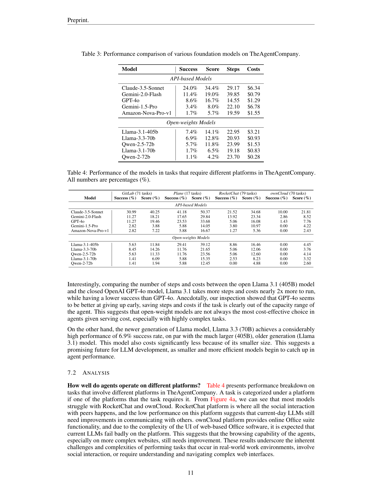

 


 2412.14161 
 Frank F. Xu et el. 
 
 🤗 2024-12-19 
 



↗ arXiv


↗ Hugging Face


↗ Papers with Code


### TL;DR



현대 사회에서 컴퓨터와 인터넷을 이용한 업무 처리가 증가하고 있으며, 대규모 언어 모델(LLM)의 발전으로 실제 환경과 상호 작용하는 AI 에이전트가 빠르게 발전하고 있습니다. 그러나 AI 에이전트가 업무 관련 작업을 얼마나 효율적으로 수행하는지에 대한 명확한 평가는 부족한 상황입니다. 이는 산업계의 AI 도입 전략과 AI가 노동 시장에 미치는 영향을 이해하는 데 중요한 문제입니다.

본 논문에서는 실제 업무 환경을 모방한 새로운 벤치마크인 TheAgentCompany를 제시합니다.  **소프트웨어 회사 환경을 시뮬레이션**하여, 웹 검색, 코드 작성, 프로그램 실행, 동료와의 소통 등 다양한 작업을 수행하는 AI 에이전트의 성능을 평가합니다.  **다양한 LLM 에이전트**를 대상으로 실험을 수행하여, 현존하는 최고 수준의 에이전트조차도 단순 작업의 일부만 자동화 가능함을 밝혔습니다. 이는 **LLM 에이전트의 자동화 능력에 대한 균형 잡힌 시각**을 제공하고, 향후 AI 에이전트 개발을 위한 방향을 제시합니다.



#### Key Takeaways


 TheAgentCompany는 실제 업무 환경을 모방한 새로운 벤치마크로, LLM 에이전트의 실제 업무 수행 능력을 평가합니다. 



 실험 결과, 최고 성능의 에이전트라도 단순 작업의 일부만 자동화할 수 있음을 보여줍니다. 



 본 연구는 AI 에이전트의 현실 세계 적용 가능성과 한계, 그리고 향후 연구 방향에 대한 시사점을 제공합니다. 


#### Why does it matter?
본 논문은 **실제 업무 환경을 시뮬레이션한 벤치마크**를 통해 LLM 에이전트의 성능을 평가함으로써, AI 에이전트의 현실 세계 적용 가능성과 한계를 명확히 제시합니다. 이는 **산업계의 AI 도입 전략 및 경제 정책 수립**에 중요한 시사점을 제공하며, 향후 AI 에이전트 연구의 새로운 방향을 제시할 수 있습니다. 특히, **다양한 직무 분야의 작업을 포괄**하고, **장기간에 걸친 작업 수행 능력**을 평가하는 등 기존 벤치마크의 한계를 극복하여, 더욱 현실적이고 포괄적인 평가를 제공합니다.

------
#### Visual Insights

> 🔼 그림 1은 TheAgentCompany 벤치마크의 개요를 보여줍니다. 재현 가능하고 자체 호스팅되는 환경, 에이전트의 커뮤니케이션 능력을 테스트하기 위한 시뮬레이션된 동료, 체크포인트 및 실행 기반 평가, 그리고 소프트웨어 엔지니어링 회사 환경에서 다양하고 현실적이며 전문적인 175가지 작업 세트를 특징으로 합니다.  이 그림은 에이전트가 웹을 탐색하고, 코드를 작성하고, 프로그램을 실행하며, 다른 동료들과 소통하는 방식으로 세상과 상호 작용하는 디지털 근로자와 유사한 방식으로 작동하는 AI 에이전트를 평가하기 위한 벤치마크의 주요 구성 요소를 시각적으로 보여줍니다.
> 

> 
read the caption

> Figure 1: An overview of TheAgentCompany benchmark. It features a reproducible and self-hosted environment, simulated colleagues to test agent communication capabilities, checkpoint and execution-based evaluation, and a set of 175 diverse, realistic and professional tasks in a software engineering company setting.
> 


| Icon | Category | Link |
|---|---|---|
|  | **Website** | https://the-agent-company.com |
|  | **Code** | https://github.com/TheAgentCompany/TheAgentCompany |
|  | **Evaluations** | https://github.com/TheAgentCompany/experiments |

> 🔼 표 1은 다양한 AI 에이전트 벤치마크를 비교 분석한 표입니다. 각 벤치마크의 에이전트가 사용할 수 있는 인터페이스(웹 브라우저, 데스크탑, API, 파이썬 스크립트, 채팅 플랫폼, bash 터미널 등), 지원하는 작업 유형(실제 직업과 관련된 작업인지 여부 포함, 소프트웨어 엔지니어링, 인사 관리, 프로젝트 관리 등), 중간 지점 평가 방식(작업을 중간 지점에서 평가하고 부분 점수를 부여하는지 여부), NPC 에이전트와의 상호 작용 여부(작업 해결 과정에서 다른 NPC 에이전트와 상호 작용할 수 있는지 여부) 등을 비교하여 보여줍니다.  실제 업무와 관련이 없는 작업은 별표(*)로 표시되어 있습니다.
> 

> 
read the caption

> Table 1: Comparison of different AI agent benchmarks. Interface: the interface agent has access to;  is web browser,  is desktop,  is API usage,  is Python script,  is chat platform,  is bash terminal. Supported Tasks: tasks in the benchmark, ∗*∗ indicate tasks with no association with real-world occupations; SE refers to software engineering, HR is human resources, PM is project manager. Checkpoint-based evaluation: if tasks are evaluated at intermediate checkpoints and assigned partial scores. Interact with NPC Agents: If the agent can interact with other NPC agents during task-solving.
> 

### In-depth insights

#### LLM Agent Benchmark
LLM 에이전트 벤치마킹은 **실제 세계 작업에 대한 LLM 에이전트의 성능을 측정**하기 위한 중요한 과정입니다.  단순히 벤치마크 점수를 얻는 것을 넘어, **다양한 작업 유형, 인터페이스, 그리고 환경 변수**를 고려하여 평가해야 합니다.  **일관성 있고 재현 가능한 결과**를 얻는 것이 중요하며, **실제 업무 환경을 정확히 모방**하는 벤치마킹 시스템이 필요합니다.  본 논문에서는 이러한 점을 고려하여 설계된 벤치마킹 프레임워크를 제시하는데,  **실제 소프트웨어 회사 환경을 시뮬레이션**하고 다양한 직무의 작업들을 포함합니다.  여기에는 웹 검색, 코드 작성, 프로그램 실행, 그리고 동료와의 소통 등이 포함됩니다. 이를 통해, **현재 LLM 에이전트의 강점과 약점을 파악**하고 **향후 발전 방향을 제시**하는 데 기여할 수 있습니다.  특히 **장기적인 작업, 점검 기반 평가, 다양한 인터페이스 지원** 등은 실제 업무 환경에서 LLM 에이전트의 성능을 정확히 반영하기 위한 핵심 요소입니다.  **단순한 작업 자동화를 넘어, 복잡한 의사결정 과정**을 포함하는 작업에 대한 평가가 중요하며,  향후 연구는 이러한 측면에 집중해야 합니다.  **AI 에이전트의 경제적, 사회적 영향**까지 고려한 폭넓은 벤치마킹 연구가 필요합니다.

#### Real-World Tasks
본 논문에서 다루는 '실제 세계 작업(Real-World Tasks)'은 단순한 인공지능 모델의 성능 평가를 넘어, **실제 업무 환경과 유사한 상황에서의 AI 에이전트의 실질적인 활용 가능성**을 측정하는 데 초점을 맞추고 있습니다.  이는 단순한 합성 데이터나 제한적인 환경이 아닌, 웹 브라우징, 코드 작성, 프로그램 실행, 동료와의 소통 등 다양한 상호작용이 필요한 복잡한 작업들을 포함합니다.  **소프트웨어 개발 회사를 모사한 환경**에서 다양한 직무(소프트웨어 엔지니어링, 프로젝트 관리, 재무 분석 등)와 관련된 실제 업무와 유사한 과제들을 수행하며, AI 에이전트의 문제 해결 능력과 실무 적용 가능성을 평가합니다.  **체크포인트 기반 평가 방식**을 통해 부분적인 성공도 점수에 반영하여 AI 에이전트의 발전 과정을 보다 정확하게 평가하고, **장기간에 걸친 복잡한 작업 수행 능력**도 평가합니다.  이러한 접근 방식은 AI 에이전트의 기술적 한계와 향후 발전 방향을 보다 명확히 제시하고, 산업계의 AI 도입 전략과 경제 정책 수립에 중요한 시사점을 제공할 수 있을 것으로 기대됩니다. 특히, **단순 반복 작업의 자동화를 넘어, 복잡한 의사결정 및 상호작용이 필요한 작업들에 대한 AI의 적용 가능성**을 탐색하는 데 기여할 것으로 예상됩니다.

#### Agent Capabilities
본 논문에서는 **에이전트의 능력(Agent Capabilities)**에 대한 심층적인 분석이 부족합니다. 다만, 다양한 실제 업무 환경을 모방한 작업들을 통해 LLM 기반 에이전트의 성능을 평가한 결과를 제시합니다.  **단순 반복 작업**은 상당 부분 자동화될 수 있지만, **복잡하고 장기적인 판단**이 요구되는 작업은 여전히 어려움을 겪는다는 점을 시사합니다. 특히 웹 브라우징, 다른 에이전트와의 소통, 복잡한 UI 환경과의 상호작용 등이 에이전트의 성능 저하에 영향을 미치는 요인으로 분석됩니다. 따라서 **상호작용 능력과 복잡한 작업 처리 능력** 향상이 향후 LLM 에이전트 발전의 중요한 과제임을 보여줍니다.  **실제 업무 환경**과 유사한 평가 환경을 구축하여 객관적인 지표를 제시한 점은 높이 평가할 만하지만, 에이전트의 능력을 더욱 세분화하여 분석하고, 개선 방향을 제시한다면 더욱 완성도 높은 연구가 될 것입니다.

#### Benchmark Design
본 논문에서 제시된 벤치마크 설계는 **실제 업무 환경을 반영한 다양한 작업 및 상호작용**을 포함하여 **현실적인 AI 에이전트 평가**를 목표로 합니다.  **소프트웨어 엔지니어링 회사 환경을 시뮬레이션**하여 개발, 프로젝트 관리, 재정 분석 등 다양한 직무의 과제를 포함합니다.  **웹 브라우징, 코드 작성, 프로그램 실행 및 동료와의 소통**과 같은 실제 업무와 유사한 상호작용을 통해 에이전트의 성능을 평가합니다.  **재현 가능성을 위해 오픈소스 소프트웨어**를 기반으로 구축되었으며, **체크포인트 기반 평가 방식**을 도입하여 작업의 부분적 완료도 점수에 반영합니다.  **다양한 LLM 에이전트의 성능을 비교** 분석하여 실제 업무 환경에서의 AI 에이전트 성능을 측정하고, **향후 발전 방향**을 제시하는 데 중요한 역할을 합니다.  **실제 업무와의 괴리감을 최소화**하기 위해 노력한 점이 돋보이며, **객관적이고 종합적인 벤치마크**를 제공하고자 하는 의도가 명확하게 드러납니다.  이는 AI 에이전트 기술의 발전과 산업적 활용에 중요한 시사점을 제공합니다.

#### Future of LLMs
LLM의 미래는 **매우 밝지만 동시에 불확실성도 내포하고 있습니다.**  현재의 LLM은 놀라운 성과를 보여주고 있지만, 아직까지는 **복잡한 실제 세계 문제 해결에는 한계**가 있습니다.  더욱 발전된 LLM은 **더욱 정교한 상호작용 능력과 추론 능력, 그리고 지식 표현 능력**을 갖추어야 할 것입니다.  **데이터의 양과 질, 그리고 모델의 크기**는 LLM의 성능을 결정짓는 중요한 요소가 될 것입니다.  **윤리적 문제와 사회적 영향** 또한 중요하게 고려되어야 할 부분입니다.  **설명 가능성과 신뢰성**을 높이는 연구는 필수적이며,  **다양한 분야의 전문가들과의 협력**을 통해 LLM의 활용 범위를 넓혀나가는 것이 중요합니다.  **개방형 모델과 폐쇄형 모델의 공존**에 대한 논의 또한 필요하며, 이러한 논의를 통해 LLM의 발전 방향을 설정해 나갈 수 있을 것입니다.  결론적으로 LLM의 미래는 기술적인 발전뿐 아니라 **사회적, 윤리적 고려**를 바탕으로 이루어져야 하며, 이를 통해 인류에게 실질적인 도움을 줄 수 있는 기술로 발전할 수 있을 것입니다.

### More visual insights

More on figures

> 🔼 그림 2는 TheAgentCompany 벤치마크에서 에이전트가 RisingWave 프로젝트의 스프린트를 관리하는 예시 워크플로우를 보여줍니다.  에이전트는 미완료된 이슈를 다음 스프린트로 이동하고, 담당자에게 알리고, 코드 커버리지 스크립트를 실행하고, 요약된 보고서를 OwnCloud에 업로드하고, 시뮬레이션된 프로젝트 매니저로부터 보고서에 대한 피드백을 통합하는 작업을 수행합니다. 이 그림은 에이전트가 실제 작업 환경에서 다양한 도구와 서비스를 사용하여 복잡한 프로젝트 관리 작업을 수행하는 방법을 보여줍니다. 각 단계는 체크포인트로 표시되어 에이전트의 진행 상황을 평가하는 데 사용됩니다.
> 

> 
read the caption

> Figure 2:  Example TheAgentCompany workflow illustrating an agent managing a sprint for the RisingWave project. The task involves identifying and moving unfinished issues to next sprint cycle, notifying assignees of those issues, running a code coverage script, uploading summarized report to OwnCloud, and incorporating feedback on report from a simulated project manager.
> 

> 🔼 그림 3은 본 논문의 실험 전반에 걸쳐 사용된 기준 에이전트인 OpenHands의 기본 CodeAct + Browsing 에이전트 아키텍처를 개괄적으로 보여줍니다.  이 아키텍처는 에이전트가 웹 브라우징, 코드 실행, 그리고 대화형 파이썬 인터프리터(IPython)를 사용하여 작업을 수행하는 방법을 보여줍니다.  에이전트는 환경과 상호작용하기 위해 브라우저, bash 쉘, 그리고 IPython 서버라는 세 가지 인터페이스를 사용합니다. 이 그림은 에이전트가 작업을 완료하기 위해 이러한 인터페이스를 통해 어떻게 행동하고 관찰하는지 보여주는  에이전트의 작업 흐름을 자세하게 설명합니다.
> 

> 
read the caption

> Figure 3:  Overview of OpenHands’ default CodeAct + Browsing agent architecture, the baseline agent used throughout the experiments.
> 

> 🔼 그림 4(a)는 다양한 플랫폼에서 에이전트의 성공률을 보여줍니다.  TheAgentCompany 벤치마크의 여러 플랫폼(GitLab, Plane, RocketChat, OwnCloud)에서 각 모델의 성공률을 비교 분석하여 시각적으로 나타낸 것입니다. 플랫폼별로 에이전트의 작업 성공률 차이를 명확하게 보여주어, 특정 플랫폼에서의 어려움을 파악하는 데 도움이 됩니다. 성공률은 플랫폼의 사용 편의성과 에이전트의 인터페이스 역량에 따라 달라짐을 시사합니다.
> 

> 
read the caption

> (a) Success rate across platforms
> 

> 🔼 그림 4(b)는 다양한 유형의 작업에 대한 여러 모델의 성공률을 보여줍니다. 작업의 특성, 즉 어떤 직업군이 일반적으로 해당 작업을 담당하는지에 따라, TheAgentCompany의 작업은 여러 작업 부서(소프트웨어 개발 엔지니어링(SDE), 프로젝트 관리(PM), 데이터 과학(DS), 관리(Admin), 인적 자원(HR), 재무(Finance) 및 기타)로 분류할 수 있습니다. 이 그림은 각 작업 유형에 따른 성공률을 보여주며, 모델의 강점과 약점을 파악하고 향후 개선 방향을 제시하는 데 유용한 정보를 제공합니다.
> 

> 
read the caption

> (b) Success rate across task categories
> 

> 🔼 그림 4는 에이전트의 성공률을 플랫폼(왼쪽)과 작업 범주(오른쪽)별로 비교한 그래프입니다. 왼쪽 그래프는 GitLab, Plane, RocketChat, OwnCloud 등 다양한 플랫폼에서 에이전트의 작업 성공률을 보여줍니다. 오른쪽 그래프는 SDE, PM, DS, Admin, HR, Finance, 기타 등 여러 작업 범주에서 에이전트의 성공률을 나타냅니다. 각 플랫폼과 작업 범주에 따른 에이전트 성능의 차이를 시각적으로 보여주어, 어떤 플랫폼이나 작업 유형에서 에이전트 성능이 더 우수한지, 또는 어려움을 겪는지를 한눈에 파악할 수 있도록 합니다.
> 

> 
read the caption

> Figure 4: Comparing agent success rate across platforms (left) and task categories (right).
> 

> 🔼 그림 5는 에이전트가 부서 예산을 준수하면서 필요한 장비를 수집하라는 과제를 받은 시뮬레이션된 동료와의 의사소통 예시를 보여줍니다. 에이전트는 요청한 품목의 총 비용이 예산을 초과함을 계산한 후 시뮬레이션된 동료와 협상하여 요청을 줄이고 효과적인 의사소통 능력을 보여줍니다. 에이전트는 요청한 물품의 총 비용이 예산을 초과한다는 것을 계산하고 시뮬레이션된 동료와 협상하여 요청을 줄임으로써 효과적인 의사소통 능력을 보여줍니다. 이 예시는 에이전트가 부서 예산 제약 조건 내에서 필요한 장비를 효율적으로 확보하기 위해 시뮬레이션된 동료와 효과적으로 협상하는 방법을 보여줍니다.
> 

> 
read the caption

> Figure 5: Simulated Colleague Communication Example 1 – The agent is tasked with collecting required equipment while adhering to the department’s budget. After calculating that the requested items exceed the budget, the agent negotiates with the simulated colleague to reduce the request, showcasing its ability of effective communication.
> 

> 🔼 그림 6은 에이전트가 신입 소프트웨어 엔지니어링 직책에 대한 채용 공고를 작성해야 하는 시뮬레이션된 대화를 보여줍니다.  이 작업을 완료하기 위해 에이전트는 시뮬레이션된 프로젝트 관리자와 소통하여 요구 사항을 수집합니다. 에이전트는 채용 공고 템플릿, 최소 및 우대 자격 요건, 그리고 이상적인 연봉 범위를 요청합니다.  이 상호 작용은 정보를 체계적으로 수집하고 효과적인 의사소통을 통해 작업 관련 요구 사항을 명확히 하는 에이전트의 능력을 평가합니다.
> 

> 
read the caption

> Figure 6: Simulated Colleague Communication Example 2 – The agent is tasked with writing a job description for a new graduate software engineering position. To fulfill the task, the agent communicates with simulated Project Manager to gather requirements. The agent requests the job description template, minimum and preferred qualifications, and the ideal salary range. This interaction evaluates the agent’s ability to gather information systematically and clarify task-related requirements through effective communication.
> 

More on tables


| Model | Success | Score | Steps | Costs |
|---|---|---|---|---|
| **API-based Models** |  |  |  |  |
| Claude-3.5-Sonnet | 24.0% | 34.4% | 29.17 | $6.34 |
| Gemini-2.0-Flash | 11.4% | 19.0% | 39.85 | $0.79 |
| GPT-4o | 8.6% | 16.7% | 14.55 | $1.29 |
| Gemini-1.5-Pro | 3.4% | 8.0% | 22.10 | $6.78 |
| Amazon-Nova-Pro-v1 | 1.7% | 5.7% | 19.59 | $1.55 |
| **Open-weights Models** |  |  |  |  |
| Llama-3.1-405b | 7.4% | 14.1% | 22.95 | $3.21 |
| Llama-3.3-70b | 6.9% | 12.8% | 20.93 | $0.93 |
| Qwen-2.5-72b | 5.7% | 11.8% | 23.99 | $1.53 |
| Llama-3.1-70b | 1.7% | 6.5% | 19.18 | $0.83 |
| Qwen-2-72b | 1.1% | 4.2% | 23.70 | $0.28 |
> 🔼 이 표는 논문의 4장 'Task Structure'에서 세 가지 도메인(소프트웨어 엔지니어링(SWE), 재무(Finance), 프로젝트 관리(PM))에 대한 예시 작업 의도와 체크포인트를 보여줍니다. 각 도메인에 대해 하나의 작업 예시가 제시되며, 각 작업은 여러 개의 체크포인트로 나뉘어 있습니다.  각 체크포인트는 작업 완료 여부를 평가하는 데 사용되며, 점수가 부여됩니다. 이를 통해 에이전트가 작업을 얼마나 잘 수행했는지 측정하고 부분적으로 완료된 작업에도 점수를 부여하는 방식을 보여줍니다.
> 

> 
read the caption

> Table 2: Example task intents and checkpoints for three domains.
> 


| Model | GitLab Success (%) | GitLab Score (%) | Plane Success (%) | Plane Score (%) | RocketChat Success (%) | RocketChat Score (%) | ownCloud Success (%) | ownCloud Score (%) |
|---|---|---|---|---|---|---|---|---|
| *API-based Models* |  |  |  |  |  |  |  |  |
| Claude-3.5-Sonnet | 30.99 | 40.25 | 41.18 | 50.37 | 21.52 | 34.68 | 10.00 | 21.81 |
| Gemini-2.0-Flash | 11.27 | 18.21 | 17.65 | 29.84 | 13.92 | 23.34 | 2.86 | 8.52 |
| GPT-4o | 11.27 | 19.46 | 23.53 | 33.68 | 5.06 | 16.08 | 1.43 | 7.76 |
| Gemini-1.5-Pro | 2.82 | 3.88 | 5.88 | 14.05 | 3.80 | 10.97 | 0.00 | 4.22 |
| Amazon-Nova-Pro-v1 | 2.82 | 7.22 | 5.88 | 16.67 | 1.27 | 5.36 | 0.00 | 2.43 |
| *Open-weights Models* |  |  |  |  |  |  |  |  |
| Llama-3.1-405b | 5.63 | 11.84 | 29.41 | 39.12 | 8.86 | 16.46 | 0.00 | 4.45 |
| Llama-3.3-70b | 8.45 | 14.26 | 11.76 | 21.65 | 5.06 | 12.06 | 0.00 | 3.76 |
| Qwen-2.5-72b | 5.63 | 11.33 | 11.76 | 23.56 | 5.06 | 12.60 | 0.00 | 4.14 |
| Llama-3.1-70b | 1.41 | 6.09 | 5.88 | 15.35 | 2.53 | 8.23 | 0.00 | 3.32 |
| Qwen-2-72b | 1.41 | 1.94 | 5.88 | 12.45 | 0.00 | 4.88 | 0.00 | 2.60 |
> 🔼 이 표는 TheAgentCompany 벤치마크에서 다양한 기초 모델들의 성능을 비교 분석한 결과를 보여줍니다.  구체적으로는 각 모델의 성공률, 부분적 성공률, 수행 단계 수, 비용 등을 제시하여 모델별 성능 차이를 명확히 보여줍니다. API 기반 모델과 오픈 가중치 모델을 모두 포함하여 비교 분석하며, 각 모델의 장단점을 파악하는 데 도움을 줍니다.
> 

> 
read the caption

> Table 3: Performance comparison of various foundation models on TheAgentCompany.
> 


| Model | SDE Success | SDE Score | PM Success | PM Score | DS Success | DS Score | Admin Success | Admin Score | HR Success | HR Score | Finance Success | Finance Score | Other Success | Other Score |
|---|---|---|---|---|---|---|---|---|---|---|---|---|---|---|
| *API-based Models* |
| Claude-3.5-Sonnet | 30.43 | 38.02 | 35.71 | 51.31 | 14.29 | 21.70 | 0.00 | 11.59 | 24.14 | 34.49 | 8.33 | 25.17 | 12.50 | 22.40 |
| Gemini-2.0-Flash | 13.04 | 18.99 | 17.86 | 31.71 | 0.00 | 6.49 | 6.67 | 15.20 | 17.24 | 23.08 | 0.00 | 4.31 | 0.00 | 10.05 |
| GPT-4o | 13.04 | 19.18 | 17.86 | 32.27 | 0.00 | 4.70 | 6.67 | 13.89 | 0.00 | 8.28 | 0.00 | 7.36 | 0.00 | 10.78 |
| Gemini-1.5-Pro | 4.35 | 5.64 | 3.57 | 13.19 | 0.00 | 4.82 | 6.67 | 9.92 | 3.45 | 11.42 | 0.00 | 2.78 | 0.00 | 8.07 |
| Amazon-Nova-Pro-v1 | 2.90 | 6.07 | 3.57 | 12.54 | 0.00 | 3.27 | 0.00 | 0.00 | 0.00 | 4.27 | 0.00 | 2.78 | 0.00 | 2.86 |
| *Open-weights Models* |
| Llama-3.1-405b | 5.80 | 11.33 | 21.43 | 35.62 | 0.00 | 5.42 | 0.00 | 3.33 | 6.90 | 12.56 | 0.00 | 5.00 | 12.50 | 17.45 |
| Llama-3.3-70b | 11.59 | 16.49 | 7.14 | 19.83 | 0.00 | 4.70 | 0.00 | 1.67 | 6.90 | 11.38 | 0.00 | 5.69 | 0.00 | 7.03 |
| Qwen-2.5-72b | 7.25 | 11.99 | 10.71 | 22.90 | 0.00 | 5.42 | 0.00 | 2.14 | 6.90 | 12.36 | 0.00 | 7.15 | 0.00 | 5.99 |
| Llama-3.1-70b | 1.45 | 4.77 | 3.57 | 15.16 | 0.00 | 5.42 | 0.00 | 2.42 | 3.45 | 7.19 | 0.00 | 3.82 | 0.00 | 2.86 |
| Qwen-2-72b | 2.90 | 3.68 | 0.00 | 7.44 | 0.00 | 4.70 | 0.00 | 0.56 | 0.00 | 4.14 | 0.00 | 3.61 | 0.00 | 4.95 |
> 🔼 표 4는 TheAgentCompany 벤치마크 내에서 다양한 플랫폼을 필요로 하는 작업에서 모델의 성능을 보여줍니다. 모든 숫자는 백분율(%)로 표시됩니다.  이 표는 각 플랫폼(GitLab, Plane, RocketChat, OwnCloud)에서 각 모델(Claude-3.5-Sonnet, Gemini-2.0-Flash, GPT-40 등)의 성공률과 점수를 보여주어,  다양한 환경에서의 AI 에이전트 성능을 비교 분석하는 데 유용한 정보를 제공합니다. 특히 각 플랫폼에 대한 특징을 고려하여 모델의 강점과 약점을 파악하는 데 도움을 줍니다.
> 

> 
read the caption

> Table 4: Performance of the models in tasks that require different platforms in TheAgentCompany. All numbers are percentages (%).
> 

### Full paper



