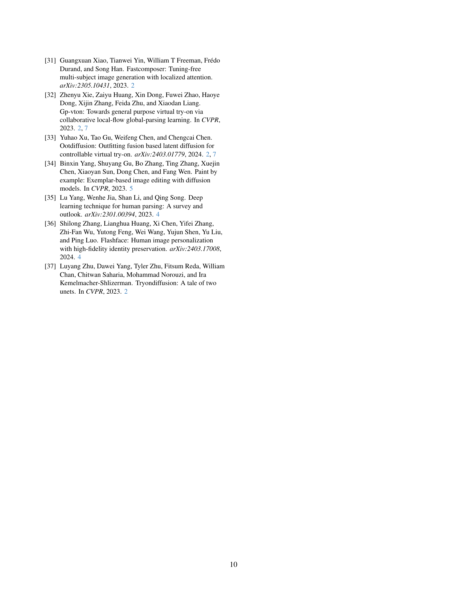

 


 2412.14168 
 Sihui Ji et el. 
 
 🤗 2024-12-19 
 



↗ arXiv


↗ Hugging Face


↗ Papers with Code


### TL;DR



기존의 가상 피팅 기술은 **의상 하나만을 대상으로 하고 유연성이 부족**하며 **다양한 자세와 체형을 지원하지 못하는 한계**가 있었습니다.  **다양한 스타일의 의상을 입은 사람의 이미지를 생성하는 것은 어려운 과제**였습니다. 

본 논문에서는 이러한 문제를 해결하기 위해 **다양한 입력 모달리티(텍스트, 의상 이미지, 인체 파라미터 모델)를 통합하고 여러 시각적 자산을 구성하는 FashionComposer라는 새로운 프레임워크를 제시합니다.**  **주제 바인딩 어텐션**이라는 독창적인 기법을 통해 여러 의상 이미지를 자연스럽게 합성하고, **일관된 신원을 유지하는 인간 앨범 생성** 및 **다양한 가상 피팅 애플리케이션**을 지원합니다.  **대규모의 다양한 데이터셋을 구축하여 모델의 성능을 향상**시켰으며, 다양한 실험을 통해 FashionComposer의 우수성을 검증했습니다.



#### Key Takeaways


 다양한 모달리티 입력(텍스트, 의상 이미지, 3D 모델)을 지원하는 유연한 패션 이미지 생성 프레임워크 



 여러 시각적 요소(의상, 얼굴 등)를 자연스럽게 합성하는 '주제 바인딩 어텐션' 기법 제시 



 일관된 신원을 유지하는 인간 앨범 생성 및 다양한 가상 피팅 애플리케이션 지원 


#### Why does it matter?
**본 논문은 다양한 모달리티의 입력을 사용하여 유연하고 구성 가능한 패션 이미지 생성을 가능하게 하는 FashionComposer라는 새로운 프레임워크를 제시합니다.** 이는 가상 피팅, 인간 앨범 생성 등 다양한 응용 분야에 적용될 수 있으며, **다양한 입력 모달리티를 처리하고 여러 시각적 자산을 구성하는 방법론을 제시하여 패션 이미지 생성 분야의 새로운 가능성을 제시합니다.**  **향후 연구 방향을 제시하고 패션 관련 산업에 미칠 영향이 크며, 특히 다양한 응용 분야로 확장 가능성을 보여주어 연구자들에게 중요한 의미를 가집니다.**

------
#### Visual Insights

> 🔼 그림 1은 FashionComposer의 응용 사례를 보여줍니다. FashionComposer는 의류 이미지, 얼굴 이미지, 매개변수화된 인체 모델과 같이 다양한 조건들을 동등한 '자산'으로 간주하여 다양하고 사실적인 패션 이미지를 합성합니다. 따라서 제어 가능한 모델 이미지 생성, 가상 피팅, 인물 사진 생성 등 다양한 패션 관련 응용 프로그램을 지원합니다.
> 

> 
read the caption

> Figure 1:  Demonstration for the applications of FashionComposer. FashionComposer takes different kinds of conditions (e.g., garment image, face image, parametric human model) equally as “assets” to composite diverse and realistic fashion images. Thus supporting various fashion-related applications like controllable model image generation, virtual try-on, human album generation, etc.
> 


| Method | CLIP-I↑ | DINO↑ | CLIP-T↑ |
|---|---|---|---|
| **Ours** | **77.60** | **40.11** | **27.71** |
| Emu2 | 69.70 | 35.96 | 20.54 |
| Collage Diffusion | 67.80 | 34.16 | 22.14 |
| AnyDoor+ControlNet | 72.40 | 37.94 | 27.00 |
| Paint-by-example+ControlNet | 64.50 | 34.60 | 23.77 |

> 🔼 표 1은 다중 객체 참조 생성 방법들과의 비교 결과를 보여줍니다. 상위 세 행은 1회 통과 다중 참조 사용자 지정 방법들을 나타내며, 하위 두 행은 미리 생성된 기본 이미지를 기반으로 하는 2단계 페인팅 파이프라인을 나타냅니다.  이 표는 여러 개의 의류 아이템을 동시에 사용하여 이미지를 생성하는 다양한 기법들의 성능을 정량적으로 비교 분석한 결과를 보여줍니다. 특히, 한 번의 처리 과정으로 다중 참조를 처리하는 방법과, 미리 생성된 이미지를 기반으로 두 단계의 처리 과정을 거치는 방법의 성능 차이를 명확하게 보여줍니다.  CLIP-I, DINO, CLIP-T 지표를 사용하여 이미지 유사도와 텍스트-이미지 일관성을 평가하였습니다.
> 

> 
read the caption

> Table 1: Comparison with multi-object reference generation methods. The first three rows represent one pass multi-reference customization methods and the last two rows represent two stage inpainting pipeline based on pre-generated base images.
> 

### In-depth insights

#### Compositional Fashion
본 논문에서 제시된 "Compositional Fashion" 개념은 **다양한 모달리티의 입력(텍스트, 의상 이미지, 3D 인체 모델 등)을 유연하게 통합하여 사실적이고 다양한 패션 이미지를 생성**하는 것을 목표로 합니다. 기존의 방식과 달리, **여러 개의 의상과 얼굴 이미지를 동시에 처리**하여 복합적인 패션 스타일을 구현할 수 있다는 점이 특징입니다. 이는 단순히 의상을 입히는 것을 넘어, **인체의 자세, 포즈, 체형 등을 매개변수로 제어하며 다양한 스타일을 생성**할 수 있게 해줍니다.  **여러 의상 아이템들을 자연스럽게 조합**하여 다채로운 패션 이미지를 만들어 내는 능력은 핵심이며, **실제 의류와의 세밀한 디테일 일치** 또한 중요한 특징입니다.  결론적으로, Compositional Fashion은 **기존의 제한적인 가상 피팅 기술을 넘어, 보다 창의적이고 실용적인 패션 이미지 생성**을 가능하게 하는 기술적 발전을 의미합니다.

#### Multi-modal Approach
본 논문은 **다양한 모달리티(텍스트, 이미지, 파라메트릭 3D 모델)**를 통합하는 다중 모달 접근 방식을 제시합니다. 이는 기존 방식의 한계를 극복하고 유연성을 높이기 위한 핵심 전략입니다. **텍스트 프롬프트는 의도를 명확히 전달하고, 이미지는 시각적 세부 정보를 제공하며, 3D 모델은 인체의 자세와 형태를 제어**합니다. 이러한 다중 모달 정보의 통합을 통해 시스템은 다양한 패션 관련 작업(가상 피팅, 인물 앨범 생성 등)에 적용될 수 있는 현실적이고 다양한 패션 이미지를 생성할 수 있습니다. 특히, **여러 개의 의류 및 얼굴 이미지를 매끄럽게 합성**하는 능력은 시스템의 주요 강점입니다. 이는 **모든 참조 이미지를 단일 '자산 라이브러리'로 구성하고 참조 UNet을 사용하여 각 이미지의 외형 특징을 추출**함으로써 구현됩니다. 또한, 제안된 **주제 바인딩 어텐션(Subject-Binding Attention)**은 각 자산의 외형 특징을 해당하는 텍스트 특징과 연결하여 모델이 각 자산을 의미에 따라 이해할 수 있도록 합니다. 이러한 다중 모달 접근 방식은 시스템의 **확장성과 유연성을 높여 여러 가지 패션 관련 응용 프로그램**에 활용될 수 있는 가능성을 보여줍니다.

#### Asset Library & Attention
본 논문에서 제안하는 "자산 라이브러리 및 어텐션" 방식은 다양한 유형의 입력(텍스트, 의상 이미지, 얼굴 이미지, 파라메트릭 인간 모델 등)을 효율적으로 처리하고 통합하는 핵심 전략입니다. **여러 시각적 요소들을 하나의 이미지에 통합하는 "자산 라이브러리"** 개념을 통해 모델의 계산 비용을 줄이고, 효율성을 높입니다. 이는 기존의 여러 개별 이미지를 처리하는 방식에 비해 훨씬 효과적인 방법입니다.  **"서브젝트-바인딩 어텐션"** 메커니즘을 통해 각 자산의 시각적 특징을 해당 텍스트 정보와 정확하게 연결하여, 모델이 각 자산의 의미를 제대로 이해하고 생성 과정에 반영할 수 있도록 합니다. 이를 통해 **다양한 의상과 얼굴 이미지, 그리고 다양한 자세의 인간 모델을 하나의 이미지에 자연스럽게 결합**할 수 있습니다.  결론적으로, "자산 라이브러리 및 어텐션" 방식은 **다중 모드 입력을 효율적이고 효과적으로 처리하는 핵심 기술**로서, 다양한 패션 관련 애플리케이션에 폭넓게 활용될 수 있는 유연성과 확장성을 제공합니다.  이는 **단일 의상 가상 피팅을 넘어서, 다중 의상 가상 피팅, 인간 앨범 생성 등 복잡한 작업을 가능하게 하는 핵심 요소**입니다.

#### Human Album Generation
본 논문에서 제시된 "Human Album Generation" 개념은 **일관된 신원을 유지하면서 다양한 자세와 의상을 입은 사람의 이미지 시리즈를 생성하는 기술**을 의미합니다. 이는 단순히 여러 이미지를 생성하는 것을 넘어, 각 이미지 간의 일관성을 유지하는 것이 핵심입니다. 이를 위해 논문에서는 **대응 관계 인식 어텐션(Correspondence-aware attention)과 잠재 코드 정렬(Latent code alignment)**이라는 두 가지 기술을 제안합니다.  대응 관계 인식 어텐션은 여러 이미지에서 동일한 신체 부위를 일관되게 표현하고, 잠재 코드 정렬은 이미지 간의 잠재적 표현을 정렬하여 일관성을 더욱 향상시킵니다. 이러한 기술을 통해, **개인의 다양한 모습을 보여주는 일관된 이미지 시리즈를 생성**, 패션쇼나 광고 등 다양한 분야에 활용 가능한 **인공지능 기반의 가상 모델 생성**을 가능하게 합니다.  **다양한 포즈와 의상 조합**을 자유롭게 구현함으로써, 기존의 한계를 뛰어넘는 **높은 유연성과 실용성**을 제공하는 기술입니다. 특히 패션 분야에서 **가상 피팅, 가상 모델 제작** 등에 혁신적인 발전을 가져올 수 있을 것으로 기대됩니다.

#### Virtual Try-on Advances
가상 피팅 기술은 전자 상거래 분야에서 혁신적인 발전을 가져왔습니다. 초기에는 이미지 왜곡 및 정확도 부족 등의 한계가 있었지만, 최근 몇 년 동안 **딥러닝 및 생성 모델의 발전**은 가상 피팅의 정확성과 현실감을 비약적으로 향상시켰습니다. 특히, **디퓨전 모델** 기반의 기술은 다양한 의류 스타일과 인체 형태에 대한 적응력을 높였으며, 여러 벌의 의상을 동시에 가상으로 입어볼 수 있는 **다중 의상 가상 피팅** 기능도 가능해졌습니다. 또한, **개인 맞춤형 가상 피팅**을 위한 기술 발전도 눈에 띄는데, 사용자의 신체 사이즈와 선호도를 고려하여 더욱 현실적이고 만족도 높은 가상 피팅 경험을 제공합니다.  하지만, 여전히 해결해야 할 과제들이 있습니다. **다양한 체형과 피부색에 대한 데이터 부족**은 가상 피팅 결과의 편향성을 초래할 수 있으며, **의류의 질감과 소재 표현의 한계**는 현실감 있는 가상 피팅 경험 구현에 어려움을 주고 있습니다. 앞으로 **더욱 다양하고 정교한 데이터** 확보와 **물리 기반 시뮬레이션 기술**과의 결합을 통해 가상 피팅 기술의 완성도를 높여야 합니다.  **개인 정보 보호**에 대한 고려도 중요한 요소입니다.  궁극적으로, 가상 피팅 기술은 사용자에게 더욱 편리하고 즐거운 쇼핑 경험을 제공하는 데 기여할 것입니다.

### More visual insights

More on figures

> 🔼 그림 2는 FashionComposer의 전체 파이프라인을 보여줍니다. FashionComposer는 의류 구성, 선택적 얼굴 이미지, 텍스트 프롬프트 및 SMPL에서 투영된 densepose 맵을 입력으로 받습니다. 텍스트 프롬프트는 인코딩되어 cross-attention 및 subject-binding attention을 통해 UNet과 결합되고, 의류 특징은 Feature Injection Attention을 통해 추출되어 잡음 제거에 사용됩니다.
> 

> 
read the caption

> Figure 2: Overall pipeline of FashionComposer. FashionComposer takes garments composition and optional face, text prompt, and a densepose map projected from SMPL as inputs. The text prompt is encoded and fused with UNets through cross-attention and subject-binding attention, while the garment features are extracted and injected for denoising through Feature Injection Attention.
> 

> 🔼 그림 3은 Emu2, Collage Diffusion, Paint by Example, AnyDoor 네 가지 다중 참조 이미지 편집 방법을 정성적으로 비교 분석한 결과를 보여줍니다. 각 방법은 여러 개의 참조 이미지를 사용하여 이미지를 생성하는데, 그림에서는 각 방법의 결과 이미지를 함께 제시하여 서로 다른 방법들의 강점과 약점을 시각적으로 비교하고 있습니다.  각 방법의 장단점을 명확히 보여주기 위해 다양한 의류와 포즈의 이미지들을 사용하여 생성된 결과를 보여줍니다. 이를 통해 FashionComposer가 제시하는 다중 참조 이미지 편집 방법의 우수성을 보다 명확하게 제시하고자 합니다.
> 

> 
read the caption

> Figure 3: Qualitative comparison with multi-reference customization methods, including Emu2 [27], Collage Diffusion [25], Paint by Example [34] and AnyDoor [6].
> 

> 🔼 그림 4는 의류 중심 패션 이미지 합성 방법들(StableGarment[30], IMAGDressing-v1[26], Magic Clothing[4])과 제안된 방법의 비교 결과를 보여줍니다. 제안된 방법은 기존 방법들보다 대상 물체의 정체성을 더 잘 보존합니다. 모든 방법들은 테스트 샘플에서 모델을 미세 조정하지 않았습니다.  즉, 그림은 여러 가지 의류 중심 패션 이미지 생성 방법을 비교 분석한 결과를 보여주며, 특히 제안된 모델이 다른 모델들보다 생성된 이미지에서 의류의 특징을 더 잘 유지한다는 것을 보여줍니다. 테스트 데이터셋으로 모델을 재 학습시키지 않았다는 점도 중요한 비교 포인트입니다.
> 

> 
read the caption

> Figure 4: Qualitative comparison with garment-centric fashion image synthesis methods, including StableGarment [30], IMAGDressing-v1 [26], and Magic Clothing [4], where ours better preserves the identity of the target objects. Note that all approaches do not finetune the model on the test samples.
> 

> 🔼 그림 5는 FashionComposer가 상의, 하의, 또는 의상 전체를 가상으로 입혀 보는 다양한 결과를 보여줍니다.  각 열은 다른 유형의 가상 피팅(상의, 하의, 전체 의상)을 나타내며, FashionComposer의 다양한 입력 조건(텍스트, 의류 이미지, 포즈, 사람 이미지)에 대한 모델의 유연성과 적응력을 보여줍니다.  다양한 스타일, 색상, 패턴의 의상들이 정확하게 사람의 신체에 맞춰 입혀진 모습을 확인할 수 있습니다.  이를 통해 FashionComposer가 다양한 의류 아이템과 신체 유형에 적용 가능하고 현실감 있는 가상 피팅 이미지를 생성할 수 있음을 보여줍니다.
> 

> 
read the caption

> Figure 5: Diverse virtual try-on results of FashionComposer for upper, lower, and outfit try-on tasks.
> 

> 🔼 그림 6은 참조 인코더(Reference UNet)의 성능을 보여주는 정성적 비교 결과입니다.  다른 방법들과 비교했을 때, Reference UNet이 의류의 세세한 디테일을 더 잘 보존한다는 것을 보여줍니다.  Reference UNet을 사용하지 않은 경우 의류의 질감이나 주름 등 미세한 부분이 손실되는 반면, Reference UNet을 사용한 경우에는 이러한 디테일이 잘 유지되어 더욱 사실적인 이미지를 생성할 수 있습니다. 이는 Reference UNet이 의류 이미지의 특징을 효과적으로 추출하고 복원하는 데 탁월함을 보여줍니다.
> 

> 
read the caption

> Figure 6: Qualitative comparison for the reference encoder. Reference UNet better preserves the fine details of the garments.
> 

> 🔼 그림 7은 제안된 주제 바인딩 어텐션에 대한 정성적 비교 실험 결과를 보여줍니다.  Bind(1)은 가장 작은 해상도의 UNet 블록의 자기 어텐션 모듈만 수정하는 것을 의미하고, Conv-in은 참조 UNet의 합성곱 입력 계층을 통해 마스크 맵을 주입하는 것을 의미합니다. 2번째와 3번째 행의 실수는 빨간색 상자로 강조 표시되어 있습니다. 이 그림은 다양한 설정에서 주제 바인딩 어텐션의 효과를 시각적으로 보여주며, 특히 부분적인 주제 바인딩이 이미지 품질에 미치는 영향을 비교 분석합니다.
> 

> 
read the caption

> Figure 7: Qualitative ablation study on subject-binding attention. Bind(1) means only modifying the self-attention modules of UNet blocks with the smallest resolution. Conv-in refers to injecting the mask map through the Convolution-in layer of the reference UNet. We highlight mistakes in rows 2-3 using red boxes.
> 

More on tables


| Methods | VITON-HD Paired SSIM ↑ | VITON-HD Paired FID ↓ | VITON-HD Paired KID ↓ | VITON-HD Paired LPIPS ↓ | Unpaired FID ↓ | Unpaired KID ↓ |
|---|---|---|---|---|---|---|
| DCI-VTON [10] | 0.8620 | 9.408 | 4.547 | 0.0606 | 12.531 | 5.251 |
| StableVITON [15] | 0.8543 | 6.439 | 0.942 | 0.0905 | 11.054 | 3.914 |
| StableGarment [30] | 0.8029 | 15.567 | 8.519 | 0.1042 | 17.115 | 8.851 |
| MV-VTON [29] | 0.8083 | 15.442 | 7.501 | 0.1171 | 17.900 | 8.861 |
| GP-VTON [32] | 0.8701 | 8.726 | 3.944 | **0.0585** | 11.844 | 4.310 |
| LaDI-VTON [21] | 0.8603 | 11.386 | 7.248 | 0.0733 | 14.648 | 8.754 |
| OOTDiffusion [33] | 0.8187 | 9.305 | 4.086 | 0.0876 | 12.408 | 4.689 |
| **Ours** | **0.8771** | **5.842** | **0.906** | 0.0727 | **9.205** | **1.3606** |
> 🔼 표 2는 VITON-HD 테스트 데이터셋을 사용한 표준 가상 피팅 작업에 대한 정량적 비교 결과를 보여줍니다.  다양한 최첨단 가상 피팅 방법들(DCI-VTON, StableVITON, StableGarment, MV-VTON, GP-VTON, LaDI-VTON, OOTDiffusion)과 제안된 방법(Ours)을 비교하여 SSIM, FID, KID, LPIPS 지표를 통해 성능을 평가합니다.  짝지어진(Paired) 및 짝지어지지 않은(Unpaired) 설정 모두에서 결과를 제시하여 모델의 일반화 성능을 평가합니다.  이 표는 제안된 방법의 정량적 성능을 명확히 보여주고 다른 방법들과 비교하여 우수성을 입증하는 데 중요한 역할을 합니다.
> 

> 
read the caption

> Table 2: Quantitative comparison for the standard virtual try-on task on the VITON-HD test dataset.
> 


| Method | CLIP-I ↑ | DINO ↑ | CLIP-T ↑ |
|---|---|---|---|
| DINOv2 Embeddings | 76.80 | 38.22 | 26.17 |
| ControlNet | 75.94 | 33.47 | 27.10 |
| Reference UNet | **77.30** | **39.39** | **27.74** |
> 🔼 이 표는 FashionComposer 모델에서 사용된 appearance encoder의 성능을 비교 분석한 결과를 보여줍니다. 세 가지 다른 appearance encoder (Reference UNet, DINOv2, ControlNet)를 사용하여 실험을 진행했으며, CLIP-I, DINO, CLIP-T 세 가지 지표를 통해 성능을 평가했습니다. 그 결과 Reference UNet이 다른 두 가지 방법보다 모든 지표에서 가장 우수한 성능을 보임을 확인했습니다. 이는 Reference UNet이 의류의 세부적인 특징을 더 잘 유지하면서 이미지 생성의 정확도와 일관성을 높이는 데 효과적임을 시사합니다.
> 

> 
read the caption

> Table 3: Quantitative study for the reference UNet. We compare with other options for the appearance encoders like DINOv2 and ControlNet. Reference UNet shows the best performance.
> 


| Method | CLIP-I ↑ | DINO ↑ | CLIP-T ↑ | Quality ↑ | Fidelity ↑ |
|---|---|---|---|---|---| 
| w/o Binding | 77.30 | 39.39 | 27.74 | 84 | 74 |
| Conv-in | 77.60 | 39.39 | 27.86 | 90 | 122 |
| Bind(1) | 77.20 | 39.42 | **28.10** | **169** | 95 |
| Bind(1,2,3) | **77.60** | **40.11** | 27.71 | 140 | **192** |
> 🔼 표 4는 제안된 주제 연결 어텐션의 정량적 연구 결과를 보여줍니다.  'Bind(1)'은 가장 작은 해상도의 UNet 상하 블록의 자기 어텐션 모듈만 증강시킨다는 것을 의미하고, 'Conv-in'은 참조 UNet의 합성곱 입력 계층을 통해 텍스트 임베딩을 주입하는 것을 의미합니다. 이 표는 다양한 설정(주제 연결 어텐션 적용 여부, 텍스트 임베딩 주입 방식 등)에 따른 CLIP-I, DINO, CLIP-T, 품질, 충실도 점수를 비교하여 제안된 방법의 효과를 정량적으로 평가합니다.
> 

> 
read the caption

> Table 4: Quantitative study for subject-binding attention. Bind(1) means only augmenting the self-attention modules of the UNet down and up blocks with the smallest resolution. Conv-in refers to injecting the text embeddings through the Convolution-in layer of the reference UNet.
> 

### Full paper



