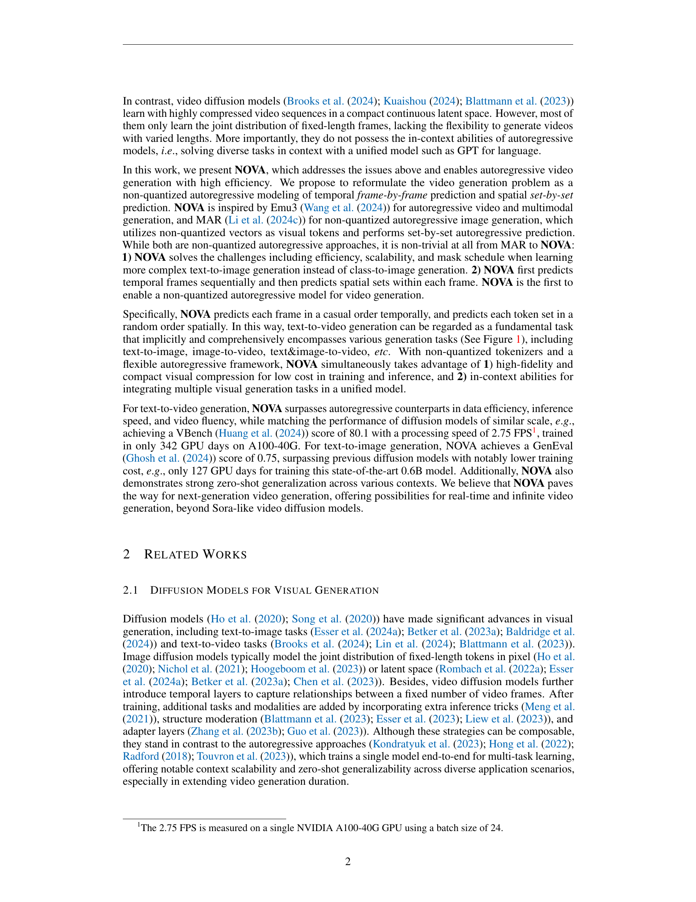

 


 2412.14169 
 Haoge Deng et el. 
 
 🤗 2024-12-19 
 



↗ arXiv


↗ Hugging Face


↗ Papers with Code


### TL;DR



기존의 자기회귀 비디오 생성 모델들은 벡터 양자화에 의존하여 비효율적이고 유연성이 부족했습니다. 또한, 고해상도 영상 생성에는 높은 계산 비용이 필요했습니다.  이러한 문제점을 해결하기 위해, 본 논문에서는 프레임 단위 예측과 공간 집합 단위 예측을 결합한 새로운 자기 회귀 방식을 제안합니다.

본 논문에서 제안하는 NOVA 모델은 벡터 양자화 없이도 고해상도 비디오 생성을 가능하게 합니다.  기존 모델들보다 **데이터 효율성, 추론 속도, 시각적 충실도, 비디오 유창성**이 뛰어나며, **훨씬 작은 모델 크기**로도 동일한 성능을 달성합니다.  또한, 다양한 제로샷 작업에서도 우수한 성능을 보여주어, **단일 모델로 다양한 응용 프로그램**을 지원할 수 있습니다.  이러한 결과는 효율적이고 유연한 비디오 생성 분야에 중요한 발전을 가져올 것으로 예상됩니다.



#### Key Takeaways


 벡터 양자화 없이 자기회귀 방식으로 비디오 생성 문제를 재정의 



 데이터 효율성, 추론 속도, 시각적 충실도, 비디오 유창성 향상 



 제로샷 응용 프로그램에서 우수한 일반화 성능 


#### Why does it matter?
이 논문은 **효율적인 영상 생성을 위한 새로운 접근 방식**을 제시하여, 연구자들이 **더욱 효과적이고 유연한 비디오 생성 모델**을 개발하는 데 도움을 줄 수 있습니다. **벡터 양자화 없이 자기 회귀 방식**을 사용하여, 데이터 효율성, 추론 속도, 시각적 충실도, 비디오 유창성을 향상시킨 것은 향후 연구에 중요한 영향을 미칠 것입니다. 특히, **다양한 제로샷 응용 프로그램**에 대한 가능성을 열어줌으로써,  비디오 생성 분야의 미래 발전에 기여할 수 있습니다.

------
#### Visual Insights

> 🔼 그림 1은 NOVA 모델의 구조와 추론 과정을 보여줍니다. 텍스트 입력을 받으면 NOVA는 시간적 순차 프레임 예측과 공간적 집합별 예측을 통해 자기 회귀적 생성을 수행합니다.  즉, 먼저 비디오 프레임을 시간 순서대로 하나씩 생성하고, 각 프레임 내에서는 여러 토큰 집합을 무작위 순서로 생성합니다. 최종적으로 연속적인 값 공간에서 확산 디노이징을 수행하여 최종 비디오를 생성합니다. 이는  이전의 고정된 길이 토큰을 사용하는 방법과 달리,  유연하고 효율적인 비디오 생성을 가능하게 합니다.
> 

> 
read the caption

> Figure 1: NOVA framework and the inference process. With text inputs, NOVA performs autoregressive generation via temporal frame-by-frame prediction and spatial set-by-set prediction. Finally, we implement diffusion denoising in a continuous-values space.
> 


| Symbol | Description |
|---|---| 
| N, n | The number of all video tokens. |
| F, f | The number of all video frames. |
| K, k | The number of sets in an image. |

> 🔼 표 1은 논문의 3.1절 '비디오 생성을 위한 자동 회귀 모델 재고찰' 에서 사용된 기호들을 설명하는 표입니다.  N은 전체 비디오 토큰 수, n은 비디오 프레임 수, F는 이미지 내 세트 수, f는 이미지 내 세트의 개수를 나타냅니다.  이 표는 논문에서 사용되는 주요 변수들의 약어와 의미를 명확하게 정의하여 독자의 이해를 돕는 역할을 합니다.  자동 회귀 모델을 사용한 비디오 생성에 대한 수학적 설명을 이해하는 데 필수적인 정보를 담고 있습니다.
> 

> 
read the caption

> Table 1: Symbology Settings.
> 

### In-depth insights

#### Autoregressive Video
자기회귀 비디오 모델은 이전 프레임의 정보를 활용하여 다음 프레임을 예측하는 방식으로 동작합니다. **시간적 순차성**을 고려하여 비디오 생성의 효율성을 높일 수 있으며, **긴 문맥 정보 처리**에도 유리합니다. 하지만 기존 자기회귀 모델들은 벡터 양자화에 의존하여 비디오의 고해상도 정보를 효율적으로 처리하는 데 어려움을 겪었습니다. 본 논문에서 제시된 NOVA 모델은 **벡터 양자화 없이** 자기회귀 방식으로 비디오를 생성하는 새로운 방법을 제시하며, 고해상도 비디오 생성에서의 효율성을 크게 향상시켰습니다. 또한 **프레임 간의 양방향 모델링**을 통해 개별 프레임 내에서의 예측 성능을 높였고, 다양한 제로샷 응용 분야에서도 우수한 성능을 보였습니다. **데이터 효율성과 추론 속도**에서도 기존 모델을 능가하며, 향후 자기회귀 비디오 생성 기술 발전에 크게 기여할 것으로 예상됩니다.

#### Non-Quantized AR
본 논문에서 제시된 비정량화 자기회귀(Non-Quantized AR) 모델은 기존의 벡터 양자화 방식을 사용하지 않고, **영상 프레임을 직접적으로 모델링**함으로써 효율성을 높였다는 점에서 주목할 만합니다.  **고해상도 영상 생성**에 있어 양자화 과정에서 발생할 수 있는 정보 손실을 최소화하여 **화질 저하 없이 효율적인 생성**이 가능해졌습니다.  이는 특히 고화질 영상 생성 및 처리에 있어 중요한 이점이며, **계산 비용 절감**에도 크게 기여할 수 있습니다.  하지만 비정량화 방식의 도입으로 인해 모델의 복잡도가 증가하고, 학습 및 추론 과정에서의 **계산량 증가**가 예상되므로, 이러한 부분에 대한 추가적인 연구가 필요합니다.  또한, **다양한 영상 생성 작업**에 대한 적용 가능성 및 확장성을 검증하고,  **다른 자기회귀 모델**과의 성능 비교 분석을 통해  비정량화 AR 모델의 우수성을 더욱 명확히 밝힐 필요가 있습니다.

#### Frame-by-Frame Pred
본 논문에서 제시된 "Frame-by-Frame Pred" 개념은 **비디오 생성 과정을 프레임 단위의 시계열 예측 문제로 재구성**하는 핵심 아이디어입니다.  이는 기존의 고정 길이 토큰 기반의 접근 방식과 달리, **임의 길이의 비디오 생성을 자유롭게 지원**하며 GPT 스타일 모델의 장점인 **문맥 내 학습 능력**을 유지합니다.  **각 프레임 내부에서는 양방향 모델링을 활용**하여 효율성을 높이고, **시간적 인과 관계를 준수**하면서도 효과적인 예측을 수행합니다. 이는 **데이터 효율성과 추론 속도 향상**으로 이어져 실시간 또는 무한한 길이의 비디오 생성을 가능하게 하는 기반이 됩니다.  **벡터 양자화(VQ) 없이** 이루어지는 점도 중요한 특징으로, 비디오의 고품질과 압축 효율을 동시에 달성하는 데 기여합니다.  결과적으로, "Frame-by-Frame Pred"는 비디오 생성 모델의 효율성과 유연성을 크게 향상시키는 혁신적인 접근 방식임을 시사합니다.

#### Set-by-Set Prediction
본 논문에서 제안하는 **'Set-by-Set Prediction'**은 기존의 픽셀 또는 토큰 단위의 순차적 예측 방식에서 벗어나, **이미지 또는 비디오 프레임 내에서 여러 개의 토큰 집합(Set)을 동시에 예측**하는 방법입니다. 이는 기존 방식의 계산 비용과 시간 소모를 줄이고, 더욱 효율적인 모델 학습 및 추론을 가능하게 합니다.  **마스크된 자기회귀 모델(Masked Autoregressive Model)**을 기반으로 하여, 각 세트 내의 토큰들 간의 상호작용을 고려하면서도, 세트들 간에는 임의의 순서로 예측하여 **병렬 처리**를 가능하게 합니다.  이는 특히 **고해상도 이미지나 장시간 비디오 생성**과 같은 복잡한 작업에서 효율성을 크게 높일 수 있습니다.  또한, **비디오의 공간적 일관성 유지**에도 도움이 되며,  **데이터 효율성 향상**에도 기여할 것으로 예상됩니다.  결론적으로, Set-by-Set Prediction은 **속도와 효율성을 높이면서도 정확도를 유지**하는 혁신적인 접근 방식이며, 차세대 영상 생성 모델 개발에 중요한 역할을 할 것으로 기대됩니다.

#### Video Extrapolation
논문에서 다루는 "비디오 외삽(Video Extrapolation)" 개념은 **기존 학습 데이터를 넘어서는 영상 시퀀스를 생성하는 능력**을 의미합니다.  이는 단순히 주어진 영상의 연장선상에서 프레임을 추가하는 것을 넘어, **영상의 맥락과 내용을 이해하고 예측하여 새로운 시퀀스를 만들어내는 고차원적인 기술**을 필요로 합니다.  **NOVA 모델은 이러한 비디오 외삽에서 강력한 성능을 보여주며,**  시간적 일관성을 유지하면서도 다양한 시나리오를 자연스럽게 생성하는 능력을 입증했습니다.  이는 **모델의 우수한 시계열 데이터 처리 능력**과 **맥락 이해 능력**을 보여주는 중요한 지표이며, 실제 응용 분야에서도 **장면 연장이나 상상력 기반 영상 생성** 등 다양한 활용 가능성을 시사합니다.  **특히, 제한된 길이의 학습 데이터로도 뛰어난 외삽 성능을 보이는 것은 모델의 효율성과 일반화 능력**을 보여주는 증거입니다.  하지만, 외삽 길이가 길어질수록 정확도가 저하되는 현상은 향후 연구의 과제로 남아있습니다.

### More visual insights

More on figures

> 🔼 그림 2는 NOVA 모델의 블록 단위 시간적 및 공간적 일반화된 자기회귀적 어텐션 메커니즘을 보여줍니다. 기존의 토큰 단위 생성과 달리 NOVA는 시간적 척도에서 각 프레임을 인과적 순서로 예측하고, 공간적 척도에서 각 토큰 집합을 무작위 순서로 예측합니다.  시간적 측면에서는 이전 프레임들만 참고하여 현재 프레임을 예측하는 인과적 마스킹을 사용하며, 공간적 측면에서는 각 프레임 내에서 토큰 집합들을 무작위로 마스킹하고 예측하여 효율성을 높입니다. 이러한 시간적 및 공간적 예측 방식을 통해 NOVA는 유연하고 효율적인 비디오 생성을 가능하게 합니다.
> 

> 
read the caption

> Figure 2: Overview of our block-wise temporal and spatial generalized autoregressive attention. Different from per-token generation, NOVA regressively predicts each frame in a casual order across the temporal scale, and predicts each token set in a random order across the spatial scale.
> 

> 🔼 이 그림은 논문의 4.3절, 질적 결과(Qualitative Results) 섹션에 포함된 그림 4입니다. 이 그림은 NOVA 모델을 사용하여 생성된 이미지들을 보여줍니다. 각 이미지는 주어진 텍스트 프롬프트에 따라 생성되었으며, 그림 캡션에 나열된 7개의 텍스트 프롬프트가 사용되었습니다. 프롬프트는 다양한 스타일과 내용의 이미지를 생성하도록 설계되었으며, 그림은 NOVA 모델의 텍스트-이미지 생성 능력을 보여주는 다양한 예시들을 보여줍니다. 각 이미지는 고품질이며, 세부 묘사와 미적 요소를 잘 담고 있습니다.  특히, 초현실적인 고양이 그림부터, 고요한 해변, 다채로운 꽃다발 등 다양한 스타일의 이미지를 생성하여 NOVA 모델의 유연성을 잘 나타냅니다. 
> 

> 
read the caption

> Figure 3: Text-to-image generation. Text prompts from left to right: (1) “A digital artwork of a cat styled in a whimsical fashion…”, (2) “A solitary lighthouse standing tall against a backdrop of stormy seas and dark, rolling clouds”, (3) “A vibrant bouquet of wildflowers on a rustic wooden table”, (4) “A selfie of an old man with a white beard”, (5) “A serene, expansive beach with no people”, (6) “A blue apple and a green cup.” and (7) “A chicken on the bottom of a balloon.”
> 

> 🔼 그림 4는 NOVA 모델이 텍스트 프롬프트를 기반으로 비디오를 생성하는 능력을 보여줍니다. 빨간색으로 강조 표시된 키워드(3D 모델, 고양이, 불꽃놀이)는 NOVA 모델이 텍스트에 명시된 대상의 움직임을 생생하게 포착하여 비디오를 생성함을 보여줍니다. 예를 들어, 3D 모델의 회전이나 고양이의 움직임, 불꽃놀이의 화려한 연출 등을 실제처럼 자연스럽게 표현합니다. 이는 NOVA 모델이 텍스트를 정확하게 이해하고 시각적인 요소들을 동적으로 생성할 수 있는 능력을 시각적으로 보여주는 예시입니다.
> 

> 
read the caption

> Figure 4: Text-to-video generation. We highlight the keywords in red color. NOVA follows the text prompts and vividly captures the motion of subjects (i.e., 3D model, cat and fireworks).
> 

> 🔼 그림 5는 영상 외삽에 대한 제로샷(zero-shot) 결과를 보여줍니다. 빨간색과 녹색으로 강조된 피사체들을 통해 외삽된 부분을 시각적으로 구분했습니다. 상단 이미지들은 모델이 생성한 영상의 일부이고, 하단 이미지들은 모델이 추가적으로 예측(외삽)한 영상의 일부입니다. 이는 모델이 훈련 데이터에 없는 영상 길이를 생성하는 능력을 보여주는 예시입니다.
> 

> 
read the caption

> Figure 5: Zero-shot video extrapolation. We highlight the subjects in red and green respectively. The top images are generated, while the bottom images are extrapolated.
> 

> 🔼 그림 6은 NOVA 모델의 제로샷 다중 작업 능력을 보여줍니다.  텍스트가 있든 없든, 물이 계속 부드럽게 흐르는 등 객체의 시간적 일관성을 성공적으로 유지합니다.  다양한 컨텍스트(텍스트, 이미지 등)에서도 일관된 비디오 생성 결과를 보여주어 제로샷 다중 작업에 대한 NOVA의 뛰어난 성능을 강조합니다.
> 

> 
read the caption

> Figure 6: Zero-shot generalization on multiple contexts. It is evident that NOVA successfully maintains temporal consistency in objects, both with and without text. Such as ensuring ”water continues to flow smoothly.” This highlights NOVA’s capability for zero-shot multitasking.
> 

> 🔼 그림 7은 비디오 생성을 위한 시간적 자기회귀 모델링(TAM)을 보여줍니다. 같은 프롬프트에서 생성된 프레임의 미묘한 변화를 강조하여 보여줍니다. 공간적 자기회귀 방식과 비교했을 때, TAM을 포함한 NOVA는 객체의 움직임 역학을 더욱 정확하게 포착할 수 있습니다.  즉, 순차적으로 프레임을 생성함으로써 동작의 자연스러운 흐름을 더 잘 나타낼 수 있다는 것을 보여줍니다.  이 그림은 시간적 순서에 따른 프레임 변화를 통해 동적 요소들을 효과적으로 표현하는 TAM의 중요성을 강조합니다.
> 

> 
read the caption

> Figure 7: Temporal autoregressive modeling (TAM) for video generation. We highlight the subtle changes in frames generated from the same prompt. Compared to spatial-only autoregressive method, the inclusion of TAM enables NOVA to more accurately capture the dynamics of subject movement.
> 

> 🔼 그림 8은 NOVA의 아키텍처 구성 요소에 대한 추가 연구 결과를 보여줍니다.  (a)와 (b)는 대규모 비디오 생성 학습에서 두 가지 주요 안정성 요소를 자세히 조사한 것입니다.  (a)는 Scaling and Shift 레이어의 매개변수 분해를 보여주고, (b)는 정규화 계층의 위치에 따른 영향을 보여줍니다.  이 그림은 Scaling and Shift 레이어의 차원 축소와 정규화 계층의 위치가 모델의 안정적인 학습과 성능에 미치는 영향을 보여줍니다.
> 

> 
read the caption

> Figure 8: Ablation studies on NOVA’s architecture components. We carefully examine the two key stability factors in large-scale video generation training, as illustrated in (a) and (b).
> 

> 🔼 그림 9는 NOVA 모델의 Scaling and Shift 레이어에서 분해 순위(decomposition ranks)의 시각화를 보여줍니다.  Scaling and Shift 레이어는 비디오 프레임 간의 움직임 변화를 효율적으로 모델링하기 위해 사용되는 구성 요소입니다. 그림의 첫 번째 줄은 비디오의 첫 번째 프레임에 대한 결과를, 두 번째 줄은 마지막 프레임에 대한 결과를 보여줍니다.  각 열은 다른 분해 순위(rank)를 사용한 결과를 나타내며, 분해 순위가 높을수록 모델이 더욱 세밀한 움직임 변화를 포착할 수 있음을 시각적으로 보여줍니다.  이는 모델의 성능과 안정성에 미치는 분해 순위의 영향을 이해하는 데 도움이 됩니다.
> 

> 
read the caption

> Figure 9: Visualization of decomposition ranks in the Scaling and Shift layer. The first row displays the results of the first frame, while the second row presents the results of the last frame.
> 

> 🔼 그림 10은 NOVA 모델의 핵심 구성 요소 중 하나인 Scaling and Shift 레이어의 구조를 보여줍니다. 이 레이어는 비디오 프레임 간의 움직임 변화를 모델링하는 방식을 보여주는 것으로, 기존의 방법과 달리 현재 프레임의 독립적인 분포를 모델링하는 대신, BOV(Begin-of-Video) 토큰을 기반으로 통합된 공간 내에서 상대적인 분포 변화를 학습합니다. 이를 통해 이전 프레임의 정보를 활용하여 현재 프레임의 예측 정확도를 높이고, 연속적인 비디오 생성의 안정성을 향상시키는 효과를 가져옵니다. 그림은 레이어의 구성 요소와 데이터 흐름을 시각적으로 보여주어, Scaling and Shift 레이어의 작동 원리를 명확하게 이해하는 데 도움을 줍니다.
> 

> 
read the caption

> Figure 10: Scaling and Shift layer. We reformulate cross-frame motion changes by learning relative distribution variations within a unified space based on BOV tokens, rather than directly modeling the unreferenced distribution of the current frame.
> 

> 🔼 그림 11은 세 가지 정규화 아키텍처를 보여줍니다. 그림에는 잔차 합산 후 정규화 계층(중간), 잔차 합산 전 정규화 계층(오른쪽) 등 다양한 구성을 요약하여 보여줍니다. 논문에서는 잔차 합산 전 정규화(Post-Norm before Res)를 표준 설계로 사용했습니다.
> 

> 
read the caption

> Figure 11: Three normalization architectures. We summarize various configurations including the pre-normalization layer (left), the post-normalization layer after residual addition (middle), and the post-normalization layer before residual addition (right). Here Post-Norm before Res is our standard design.
> 

> 🔼 그림 12는 비디오 외삽에 대한 50단계의 자기회귀적 단계에 걸친 PSNR 및 LPIPS 측정값을 보여줍니다. 시간적 척도에서 VAE의 4배 다운샘플링 비율로 인해 각 자기회귀적 단계는 4개의 프레임을 생성합니다. 수직 빨간색 선은 외삽이 훈련 길이의 3배에 도달하는 지점을 나타냅니다. 이 그래프는 시간이 지남에 따라 PSNR(Peak Signal-to-Noise Ratio) 값이 감소하고 LPIPS(Learned Perceptual Image Patch Similarity) 값이 증가하는 경향을 보여주는데, 이는 모델이 원본 비디오와 점점 더 달라짐을 시사합니다. 하지만 훈련 길이의 3배까지는 여전히 원본 비디오와 상당히 유사한 이미지 품질과 내용을 유지하고 있음을 보여줍니다.
> 

> 
read the caption

> Figure 12: PSNR and LPIPS metrics over 50 autoregressive steps in video extrapolation.  Due to the 4×\times× downsampling rate of VAE in temporal scale, each autoregressive step generates four frames. The vertical red line marks the point where the extrapolation reaches 3×\times× training length.
> 

> 🔼 그림 13은 비디오 외삽에 대한 시각화 결과를 보여줍니다.  정량적 지표(PSNR, LPIPS)는 성능 저하를 나타내지만, 생성된 프레임은 여전히 원본 비디오의 내용과 전반적인 화질을 매우 유사하게 유지합니다.  이는 모델이 학습 데이터 길이의 최대 3배에 달하는 길이의 비디오를 외삽할 수 있음을 시사합니다.  즉, 모델이 학습 데이터보다 훨씬 더 긴 비디오를 생성할 수 있음을 보여줍니다.  비록 정량적 지표는 감소하지만, 생성된 비디오의 질은 여전히 원본과 매우 유사합니다.
> 

> 
read the caption

> Figure 13: Visualization of video extrapolation. Although the metrics indicate a decline, the generated frames still closely resemble the original video in content and overall image quality. Visualization suggests that the model can extrapolate up to 3×\times× training length.
> 

> 🔼 그림 15는 NOVA 모델이 생성한 다양한 스타일의 이미지들을 보여줍니다. 각 이미지는 제시된 텍스트 프롬프트를 바탕으로 생성되었으며, 초상화, 판타지, 일상 생활, 추상적 개념 등 다양한 주제를 아우르고 있습니다. 이미지들은 높은 수준의 디테일과 미적 완성도를 보여주며, NOVA 모델이 텍스트 프롬프트를 정확하게 반영하여 이미지를 생성할 수 있는 능력을 보여줍니다.  특히, 12개의 이미지는 각각 다음과 같은 프롬프트로 생성되었습니다: (1) 긴 흰 수염을 가진 노인의 상세한 어깨 위 초상화, (2) 허리 위까지 보이는 남성 판타지 전사 캐릭터의 디지털 아트, (3) 티아라와 프릴 드레스를 입은 어린 소녀, (4) 선글라스를 쓴 해바라기가 눈 속에서 춤을 추는 모습, (5) 사람이 없는 해변, (6) 테이블 위에 놓인 두 개의 명나라 시대 꽃병(큰 꽃병이 더 화려함), (7) 험준하고 연기가 자욱한 산 위에 위풍당당하게 앉아 있는 용, (8) 용이 기사에게 불을 뿜는 모습, (9) 생생한 색감의 픽셀 아트 스타일 그래픽(말을 탄 기수가 프레임 왼쪽으로 질주하는 모습), (10) 음식 가득한 테이블(치킨라이스, 박초미, 라크사 한 그릇씩), (11) 테이블 위에 놓인 미국 지도 모양의 초밥과 빨간 와인 한 잔, (12) 빨강, 흰색, 파랑의 아름다운 불꽃놀이
> 

> 
read the caption

> Figure 14: More text-to-image visualizations. Text prompts are as follows: (1) “In the foreground is the detailed, head-and-shoulders portrait of an elderly man with a long white beard…”, (2) “a digital artwork of a fantasy warrior character. The character is male, depicted from the waist up, and appears to have a stern or serious facial expression…”, (3) “a young girl wearing a tiara and frilly dress”, (4) “A sunflower in sunglasses dances in the snow”, (5) “A beach with no people”, (6) “Two Ming vases on the table, the larger one is more colorful than the other”, (7) “A dragon perched majestically on a craggy, smoke-wreathed mountain”, (8) “a dragon breathing fire onto a knight”, (9) “a pixel art style graphic with vibrant colors. It features a single rider on a horse, both depicted in mid-gallop to the left side of the frame…”, (10) “A table full of food. There is a plate of chicken rice, a bowl of bak chor mee, and a bowl of laksa”, (11) “A map of the United States made out sushi. It is on a table next to a glass of red wine” and (12) “beautiful fireworks in the sky with red, white and blue”.
> 

More on tables


| Model | #params | #images | Color | Shape | Texture | Overall | Single | Two | Counting | Colors | Position | ColorAttr | Overall | DPG-Bench | A100 days |
|---|---|---|---|---|---|---|---|---|---|---|---|---|---|---|---|
| *Diffusion models* |  |  |  |  |  |  |  |  |  |  |  |  |  |  |  |
| PixArt-α | 0.6B | 25M | 68.86 | 55.82 | 70.44 | 0.48 | 0.98 | 0.50 | 0.44 | 0.80 | 0.08 | 0.07 | 71.11 | 753 |  |
| SD v1.5 | 1B | 2B | 37.50 | 37.24 | 42.19 | 0.43 | 0.97 | 0.38 | 0.35 | 0.76 | 0.04 | 0.06 | 63.18 | - |  |
| SD v2.1 | 1B | 2B | 56.94 | 44.95 | 49.82 | 0.50 | 0.98 | 0.37 | 0.44 | 0.85 | 0.07 | 0.17 | - | - |  |
| SDXL | 2.6B | - | 63.69 | 54.08 | 56.37 | 0.55 | 0.98 | 0.44 | 0.39 | 0.85 | 0.15 | 0.23 | 74.65 | - |  |
| DALL-E2 | 6.5B | 650M | 57.50 | 54.64 | 63.74 | 0.52 | 0.94 | 0.66 | 0.49 | 0.77 | 0.10 | 0.19 | - | - |  |
| DALL-E3 | - | - | 81.10 | 67.50 | 80.70 | 0.67 | 0.96 | 0.87 | 0.47 | 0.83 | 0.43 | 0.45 | 83.50 | - |  |
| SD3 | 2B | - | - | - | - | 0.62 | 0.98 | 0.74 | 0.63 | 0.67 | 0.34 | 0.36 | 84.10 | - |  |
| *Autoregressive models* |  |  |  |  |  |  |  |  |  |  |  |  |  |  |  |
| LlamaGen | 0.8B | 60M | - | - | - | 0.32 | 0.71 | 0.34 | 0.21 | 0.58 | 0.07 | 0.04 | - | - |  |
| Emu3 (+ Rewriter) | 8B | - | 79.13 | 58.46 | 74.22 | 0.66 | 0.99 | 0.81 | 0.42 | 0.80 | 0.49 | 0.45 | 81.60 | - |  |
| NOVA (512x512) | 0.6B | 16M | 70.75 | 55.98 | 69.79 | 0.66 | 0.98 | 0.85 | 0.58 | 0.83 | 0.20 | 0.48 | 81.76 | 127 |  |
| + Rewriter | 0.6B | 16M | 83.02 | 61.47 | 75.80 | 0.75 | 0.98 | 0.88 | 0.62 | 0.82 | 0.62 | 0.58 | - | 127 |  |
| + Videos | 0.6B | 36M | 71.80 | 47.86 | 65.31 | 0.55 | 0.98 | 0.56 | 0.48 | 0.75 | 0.15 | 0.41 | 81.77 | 342 |  |
| + Videos & Rewriter | 0.6B | 36M | 81.36 | 59.16 | 72.45 | 0.71 | 0.98 | 0.83 | 0.52 | 0.81 | 0.58 | 0.51 | - | 342 |  |
| NOVA (1024x1024) | 0.3B | 600M | 73.35 | 57.28 | 70.09 | 0.67 | 0.98 | 0.86 | 0.53 | 0.84 | 0.32 | 0.52 | 80.60 | 267 |  |
| NOVA (1024x1024) | 0.6B | 600M | 74.72 | 56.99 | 69.50 | 0.69 | 0.98 | 0.89 | 0.56 | 0.84 | 0.32 | 0.56 | 82.25 | 320 |  |
| NOVA (1024x1024) | 1.4B | 600M | 74.30 | 57.14 | 70.00 | 0.71 | 0.99 | 0.91 | 0.62 | 0.85 | 0.33 | 0.56 | 83.01 | 608 |  |
> 🔼 표 2는 다양한 벤치마크를 사용한 텍스트-이미지 생성 모델의 성능 평가 결과를 보여줍니다.  파란색과 초록색은 각각 최고 및 차고 성능을 나타냅니다.  표에는 모델 이름, 매개변수 수, 사용된 이미지 수, 색상, 모양, 질감, 전반적인 품질, 개별 항목별 점수 (단일, 이중, 개수 세기, 색상, 위치, 색상 속성), 그리고 A100 GPU 학습에 소요된 일수 등이 포함되어 있습니다.  데이터 출처는 Huang et al. (2023), Wang et al. (2024), Esser et al. (2024b)의 논문입니다.
> 

> 
read the caption

> Table 2: Text-to-image evaluation on various benchmarks. The best and second-best results are in blue and green. The data is from Huang et al. (2023),Wang et al. (2024) and Esser et al. (2024b).
> 


| Model | #params | #videos | latency | Total Score | Quality Score | Semantic Score | Aesthetic Quality | Object Class | Multiple Objects | Human Action | Spatial Relationship | Scene |
|---|---|---|---|---|---|---|---|---|---|---|---|---|
| *Closed-source models* |  |  |  |  |  |  |  |  |  |  |  |  |
| Gen-2 | - | - | - | 80.58 | 82.47 | 73.03 | 66.96 | 90.92 | 55.47 | 89.20 | 66.91 | 48.91 |
| Kling (2024-07) | - | - | - | 81.85 | 83.39 | 75.68 | 61.21 | 87.24 | 68.05 | 93.40 | 73.03 | 50.86 |
| Gen-3 | - | - | - | 82.32 | 84.11 | 75.17 | 63.34 | 87.81 | 53.64 | 96.4 | 65.09 | 54.57 |
| *Diffusion models (w/ SD init)* |  |  |  |  |  |  |  |  |  |  |  |  |
| LaVie | 3B | 25M | - | 77.08 | 78.78 | 70.31 | 54.94 | 91.82 | 33.32 | 96.8 | 34.09 | 52.69 |
| Show-1 | 4B | 10M | - | 78.93 | 80.42 | 72.98 | 57.35 | 93.07 | 45.47 | 95.60 | 53.50 | 47.03 |
| AnimateDiff-v2 | 1B | 10M | - | 80.27 | 82.90 | 69.75 | 67.16 | 90.90 | 36.88 | 92.60 | 34.60 | 50.19 |
| VideoCrafter-v2.0 | 2B | 10M | - | 80.44 | 82.20 | 73.42 | 63.13 | 92.55 | 40.66 | 95.00 | 35.86 | 55.29 |
| T2V-Turbo (VC2) | 2B | 10M | - | 81.01 | 82.57 | 74.76 | 63.04 | 93.96 | 54.65 | 95.20 | 38.67 | 55.58 |
| *Diffusion models* |  |  |  |  |  |  |  |  |  |  |  |  |
| OpenSora-v1.1 | 1B | 10M | 48s | 75.66 | 77.74 | 67.36 | 50.12 | 86.76 | 40.97 | 84.20 | 52.47 | 38.63 |
| OpenSoraPlan-v1.1 | 1B | 4.5M | 60s | 78.00 | 80.91 | 66.38 | 56.85 | 76.30 | 40.35 | 86.80 | 53.11 | 27.17 |
| OpenSora-v1.2 | 1B | 32M | 55s | 79.76 | 81.35 | 73.39 | 56.85 | 82.22 | 51.83 | 91.20 | 68.56 | 42.44 |
| CogVideoX | 2B | 35M | 90s | 80.91 | 82.18 | 75.83 | 60.82 | 83.37 | 62.63 | 98.00 | 69.90 | 51.14 |
| *Autoregressive models* |  |  |  |  |  |  |  |  |  |  |  |  |
| CogVideo | 9B | 5.4M | - | 67.01 | 72.06 | 46.83 | 38.18 | 73.4 | 18.11 | 78.20 | 18.24 | 28.24 |
| Emu3 | 8B | - | - | 80.96 | 84.09 | 68.43 | 59.64 | 86.17 | 44.64 | 77.71 | 68.73 | 37.11 |
| NOVA | 0.6B | 20M | 12s | 78.48 | 78.96 | 76.57 | 54.52 | 91.36 | 73.46 | 91.20 | 66.37 | 50.16 |
| + Rewriter | 0.6B | 20M | 12s | 80.12 | 80.39 | 79.05 | 59.42 | 92.00 | 77.52 | 95.20 | 77.52 | 54.06 |
> 🔼 표 3은 VBench를 사용한 텍스트-비디오 생성 모델 평가 결과를 보여줍니다. 기존의 비디오 생성 방법들을 명확성을 위해 서로 다른 범주로 분류했습니다. 기준 데이터는 Huang et al.(2024)에서 가져왔습니다.  표에는 각 모델의 성능 지표(총점, 품질, 의미, 미학, 개체, 다중 개체, 인간, 공간 품질 점수, 개체, 동작, 관계 점수)와 모델의 매개변수 수, 처리 비디오 수, 지연 시간 등이 포함되어 있습니다. 이를 통해 다양한 모델들의 텍스트-비디오 생성 성능을 비교 분석할 수 있습니다.
> 

> 
read the caption

> Table 3: Text-to-video evaluation on VBench. We have classified existing video generation methods into different categories for better clarity. The baseline data is sourced from Huang et al. (2024).
> 


|  |  |
|---|---| 
|(a) Parameter decomposition for Scaling and Shift layer. | (b) Normalization layer position. |
> 🔼 표 4는 NOVA 모델의 추론 시간을 계층별로 분석한 결과를 보여줍니다.  비디오 해상도 29x768x480 에서 시간적(temporal) 계층의 처리 시간은 0.03초로 매우 빠르지만, 공간적(spatial) 계층은 11.97초가 소요되어 전체 처리 시간 12초 중 상당 부분을 차지합니다. 이는 공간적 계층의 처리 속도 개선 여지가 있음을 시사합니다.
> 

> 
read the caption

> Table 4: Inference time analysis for different layers.
> 


| Resolution | Temporal Layers Time | Spatial Layers Time | Total Time |
|---|---|---|---|
| 29 × 768 × 480 | 0.03s | 11.97s | 12s |
> 🔼 표 5는 시간적 자기회귀 모델링의 성능 비교를 보여줍니다.  시간적 자기회귀 모델링(TAM)을 사용했을 때와 사용하지 않았을 때의 성능 차이를 보여주는 비교 분석 결과입니다.  총점, 역동성 정도, 추론 시간 세 가지 지표를 통해 NOVA 모델의 성능을 평가했습니다.  TAM을 사용했을 때 모델의 성능이 더 높았다는 것을 보여주는 결과입니다.
> 

> 
read the caption

> Table 5: Performance comparison on temporal autoregressive modeling.
> 


| Model | Total Score | Dynamic Degree | Infer Time |
|---|---|---|---|
| NOVA | 75.84 | 23.27 | 12s |
| NOVA (w/o TAM) | 75.38 | 11.38 | 39s |
> 🔼 표 6은 DPG-Bench 벤치마크를 기반으로 NOVA 모델의 성능을 최첨단 이미지 생성 모델들과 비교 분석한 결과를 보여줍니다.  DPG-Bench는 이미지의 다양한 속성(색상, 형태, 질감, 전체적인 품질 등)을 평가하는 벤치마크이며, 표는 각 모델의 성능을 여러 속성별로 세분화하여 제시합니다. 이를 통해 NOVA 모델의 강점과 약점을 명확히 파악하고, 다른 모델들과의 차별점을 보다 자세하게 비교 분석할 수 있습니다. 특히, NOVA 모델은 비교적 작은 모델 크기임에도 불구하고 우수한 성능을 보여주는 것을 확인할 수 있습니다.
> 

> 
read the caption

> Table 6: Comparison with state-of-the-art models on DPG-Bench.
> 

### Full paper



