 


 2412.14173 
 Yihao Meng et el. 
 
 🤗 2024-12-19 
 



↗ arXiv


↗ Hugging Face


↗ Papers with Code


### TL;DR



2D 애니메이션 제작은 캐릭터 디자인, 키프레임 애니메이션, 중간 프레임 생성, 채색 등의 복잡한 단계를 거치며, 특히 수작업 채색은 많은 시간과 비용을 필요로 합니다. 기존의 자동 채색 방법들은 참조 이미지와 스케치 간의 불일치, 시간적 일관성 부족, 고밀도 스케치 의존성 등의 문제점을 가지고 있습니다. 

AniDoc은 이러한 문제를 해결하기 위해 **비디오 확산 모델을 기반으로 한 새로운 접근 방식**을 제시합니다.  **참조 캐릭터 이미지와 스케치 간의 대응 관계를 명시적으로 고려하는 매칭 기법**을 도입하여 정확성을 높였고, **스케치를 이진화하고 배경을 보강하는 전략**을 통해 모델의 강건성을 향상시켰습니다. 또한, **희소 스케치 학습 전략**을 통해 중간 스케치의 필요성을 줄이고 시간적 일관성을 유지하는데 성공했습니다. AniDoc은 기존 방법들보다 우수한 성능을 보였으며, 애니메이션 제작 과정의 자동화 및 효율화에 기여할 수 있을 것으로 기대됩니다.



#### Key Takeaways


 AniDoc은 참조 캐릭터 디자인과 희소 스케치만으로 2D 애니메이션의 자동 채색 및 보간을 수행합니다. 



 대응 매칭 기법을 통해 참조 이미지와 스케치 간의 불일치 문제를 해결하여 정확도를 높였습니다. 



 희소 스케치 학습 전략을 통해 중간 스케치 작업을 줄여 애니메이션 제작 효율을 향상시켰습니다. 


#### Why does it matter?
이 논문은 **2D 애니메이션 제작의 비효율성을 해결하기 위해 생성 AI를 활용한 새로운 방법론**을 제시합니다.  이는 애니메이션 산업의 생산성 향상 및 비용 절감에 큰 영향을 미칠 수 있으며, 특히 **비디오 확산 모델과 대응 매칭 기법을 결합하여 영상의 일관성 및 정확성을 높인 점**이 주목할 만합니다. 또한, **희소 스케치 학습 전략을 통해 중간 스케치 작업을 줄이는 혁신적인 접근 방식**을 제시하여, 향후 애니메이션 제작 과정의 자동화 및 효율 증대에 대한 연구 방향을 제시합니다.

------
#### Visual Insights

> 🔼 그림 1은 AniDoc 모델이 캐릭터 디자인 참조 이미지를 기반으로 스케치 시퀀스를 고품질로 색상화하는 과정을 보여줍니다. 스케치의 포즈와 크기가 크게 달라도 높은 충실도를 유지하며, 마지막 줄에서 보이는 것처럼 적은 수의 스케치만으로도 효과적인 보간 및 고품질 색상화가 동시에 가능함을 보여줍니다.
> 

> 
read the caption

> Figure 1: AniDoc colorizes a sequence of sketches based on a character design reference with high fidelity, even when the sketches significantly differ in pose and scale. Additionally, the model supports sparse sketch inputs, enabling effective interpolation and high-quality colorization simultaneously, as shown in the last row.
> 

### In-depth insights

#### AniDoc: Overview
AniDoc은 2D 애니메이션 제작 과정을 간소화하는 것을 목표로 하는, 참조 이미지를 기반으로 스케치 시퀀스를 자동으로 컬러 애니메이션으로 변환하는 시스템입니다. **핵심은 참조 캐릭터 디자인과 입력 라인 아트 스케치 간의 불일치를 해결하는 대응 관계 안내 메커니즘**을 사용하는 것입니다. 이는 참조 이미지로부터의 색상 및 스타일 정보를 라인 아트에 효과적으로 통합하여 색상 정확도와 일관성을 향상시키는 데 도움이 됩니다. 또한, **모델은 스케치를 이진화하고 배경을 보강하여 실제 사용 시나리오를 반영**합니다. 이는 모델이 참조 캐릭터 디자인으로부터 색상 정보를 추출하도록 강제하고, 훈련 중 불안정성을 줄이는 데 기여합니다.  **AniDoc은 희소 스케치 훈련 전략을 채택하여 시간적 일관성을 유지하면서 중간 스케치 없이도 효과적인 보간을 가능하게 합니다.**  즉, 사용자는 시작 및 끝 스케치와 캐릭터 이미지만 제공하면 됩니다. 이러한 혁신적인 접근 방식은 애니메이션 제작의 비용을 절감하고 효율성을 높일 뿐만 아니라 창의성 증진에도 크게 기여할 것으로 기대됩니다.

#### Colorization Method
본 논문에서 제시된 색칠 방법은 **비디오 확산 모델 기반의 참조 이미지 기반 색칠**에 초점을 맞추고 있습니다. 이는 기존의 프레임 단위 색칠 방식의 한계를 극복하기 위한 시도로, **시간적 일관성 유지**에 중점을 둡니다. 이를 위해 **대응 관계 매칭 모듈**을 도입하여 참조 이미지와 스케치 간의 정합 문제를 해결하고, **이진화된 스케치와 배경 증강**을 통해 강건성을 높였습니다.  **희소 스케치 학습 전략**을 통해 중간 프레임 스케치 없이도 색칠이 가능해져 효율성을 개선했습니다.  **다단계 학습 방식**을 통해 모델의 정확도와 효율성을 높였으며, 다양한 실험 결과를 통해 기존 방식 대비 성능 향상을 보였습니다. 하지만 **다양한 배경이나 복잡한 객체**가 포함된 경우 색칠의 정확도가 떨어지는 한계점을 보이며, 추후 연구를 통해 개선될 여지가 있습니다.  **고해상도 영상 및 다양한 애니메이션 스타일** 지원을 위한 연구 또한 필요합니다.

#### Sparse Training
본 논문에서 제시된 'Sparse Training' 전략은 **비효율적인 중간 프레임 스케치의 생성을 피하기 위한 핵심**입니다.  기존의 애니메이션 제작 과정은 모든 프레임에 대한 스케치를 필요로 하지만, 이 방법은 시작과 끝 프레임의 스케치만으로도 중간 프레임을 효과적으로 생성할 수 있도록 모델을 훈련시킵니다.  이는 **시간 및 자원 절약**으로 이어지며, 애니메이션 제작의 효율성을 크게 향상시킬 수 있습니다.  두 단계로 진행되는 훈련 과정을 통해, 모델은 먼저 모든 프레임의 스케치 정보를 학습하고, 이후에는 중간 스케치 없이 시작 및 끝 프레임의 정보만으로도 **정확한 프레임 보간**을 수행하도록 학습됩니다.  **키포인트 추적 및 보간** 기술을 통해 시간적 일관성을 유지하며,  **효율성과 정확성을 동시에 만족**하는 혁신적인 접근 방식입니다.  이는 단순히 효율성 증대를 넘어, **새로운 애니메이션 제작 방식**을 제시한다는 점에서 의미가 크다고 할 수 있습니다.

#### Ablation Studies
본 논문의 "Ablation Studies" 부분은 모델의 성능에 기여하는 각 구성 요소의 중요성을 밝히는 데 중점을 둡니다. **각 모듈을 제거하거나 변경했을 때의 성능 변화를 정량적으로 분석**하여, Correspondence-guided Colorization 모듈, Binarization and Background Augmentation 전략, 그리고 Sparse Sketch Training 기법의 효과를 개별적으로 평가합니다. 이를 통해, 각 구성 요소가 모델의 전반적인 성능에 미치는 영향을 명확히 파악하고, **모델의 강점과 약점을 구체적으로 제시**할 수 있습니다.  **정량적 지표 (PSNR, SSIM, LPIPS, FID, FVD)**를 사용하여 성능 변화를 측정함으로써, 실험 결과의 신뢰도를 높입니다. 이러한 분석을 통해, 연구진은 향후 모델 개선 방향을 제시하고, 제한된 자원으로도 효율적인 애니메이션 제작을 위한 최적의 설정을 도출할 수 있을 것으로 예상됩니다.  **특히, 배경 증강 기법의 효과 분석은 실제 애니메이션 제작 환경을 반영**하여, 모델의 실용성을 높이는 데 기여하며, 희소한 스케치 데이터를 활용한 애니메이션 제작의 가능성을 보여주는 중요한 결과입니다.

#### Future Works
본 논문에서 제시된 애니메이션 제작 자동화 모델은 고무적이지만, 여전히 개선의 여지가 많습니다. **향후 연구 방향**으로는 첫째, **더욱 정교한 영상 생성 모델**을 도입하여 장면 전환 및 움직임 표현의 자연스러움을 높이는 것이 중요합니다.  둘째, **다양한 스타일의 애니메이션**에 대한 적용성을 높이기 위해, 보다 다양하고 방대한 데이터셋을 활용한 훈련이 필요합니다.  셋째, 사용자의 직관적이고 효율적인 조작을 위한 **사용자 인터페이스 개선**이 요구됩니다.  마지막으로, **복잡한 움직임과 다양한 캐릭터**에 대한 처리 성능 향상을 위해 모델의 효율성 및 안정성을 높이는 연구가 필요합니다. 이를 통해 애니메이션 제작의 효율성과 창의성을 더욱 높일 수 있을 것입니다.

### More visual insights

More on figures

> 🔼 이 그림은 2D 애니메이션 제작 과정의 워크플로우를 보여줍니다. 캐릭터 디자인, 주요 프레임 애니메이션, 중간 프레임 추가 및 채색의 네 가지 필수 단계를 순차적으로 나타냅니다. 각 단계는 애니메이션 제작에 필요한 작업과 시간을 보여주는 시각적 개요를 제공합니다.
> 

> 
read the caption

> Figure 2: Illustration of the workflow of 2D animation production.
> 

> 🔼 그림 3은 AniDoc 파이프라인의 개요를 보여줍니다. AniDoc은 두 단계의 훈련 전략을 채택합니다. 첫 번째 단계인 밀집 스케치 훈련 단계에서는 참조 이미지와 훈련 비디오의 각 프레임 간에 일치하는 키포인트 쌍을 명시적으로 추출하고, 대응 관계를 나타내는 점 지도를 구성합니다. 두 번째 단계인 희소 스케치 훈련 단계에서는 중간 프레임 스케치를 제거하고, 시작 및 끝 프레임의 일치하는 점을 사용하여 점 궤적을 보간합니다. 이 점 궤적은 중간 프레임 생성을 안내하는 역할을 합니다.
> 

> 
read the caption

> Figure 3: Overview of AniDoc pipeline. We adopt a two-stage training strategy. In the dense-sketch training stage, we explicitly extract matching keypoints pairs between the reference image and each frame of the training video, constructing point maps to represent the correspondences. In the sparse-sketch training stage, we remove the intermediate frame sketches and use the matching points from the start and end frames to interpolate point trajectories, which guide the generation of the intermediate frames.
> 

> 🔼 이 그림은 이전의 비디오 컬러링 방법 [21]이 비 이진화된 스케치를 사용할 때 발생하는 색 정보 누출 문제를 보여줍니다. 참조 이미지가 비어 있더라도, 비 이진화된 스케치가 주어지면 이전 방법은 실제 결과와 유사한 색상 패턴을 생성할 수 있습니다. 하지만 스케치를 이진화하면 컬러링 결과가 상당히 저하됩니다. 이는 이진화 과정을 통해 모델이 실제 색상 정보를 스케치 자체에서 학습하도록 강제함으로써 색 정보 누출 문제를 방지하기 때문입니다.
> 

> 
read the caption

> Figure 4: Illustration of color leakage issue in non-binarized sketch. For previous video colorization method [21], when given non-binarized sketch, even if the reference is an empty image, it can still generate colorized results with similar color pattern to the ground truth. After binarizing the sketch, the colorization results degrade significantly.
> 

> 🔼 그림 5는 기준 이미지 기반의 애니메이션 색칠 작업에서 LVCD [21], LVCD+IP-Adapter [55], ID-animator [17], ToonCrafter [52] 네 가지 방법을 시각적으로 비교한 결과를 보여줍니다. 각 방법의 장단점을 다양한 애니메이션 클립을 통해 보여주며, 특히 참조 이미지와 스케치 간의 불일치, 시간적 일관성 유지, 그리고 다양한 스타일의 애니메이션 처리 능력을 비교 분석합니다. 그림을 통해 각 모델의 강점과 약점을 명확히 파악하여, 어떤 모델이 특정 애니메이션 작업에 가장 적합한지 판단하는 데 도움이 됩니다.
> 

> 
read the caption

> Figure 5: Visual comparison of reference-based colorization with four methods LVCD [21], LVCD+IP-Adapter [55], ID-animator [17], ToonCrafter [52].
> 

> 🔼 그림 6은 AniDoc 모델의 성능에 각 구성 요소가 미치는 영향을 보여주는 실험 결과입니다.  'w/o matching'은 correspondence matching module을 사용하지 않았을 때,  'w/o binarize'는 이진화(binarization) 및 배경 증강(background augmentation)을 적용하지 않았을 때의 결과를 나타냅니다.  각 경우에 대한 정량적 지표(예: PSNR, SSIM, LPIPS, FID, FVD)를 비교하여, 각 구성 요소의 중요성을 보여줍니다.
> 

> 
read the caption

> Figure 6: Ablations on each component. “w/o matching” indicates without the corresponding matching module, “w/o binarize” indicates without binarization and background augmentation.
> 

> 🔼 그림 7은 제안된 모델의 유연한 활용성을 보여줍니다. (a)는 동일한 참조 이미지를 사용하여 서로 다른 스케치들을 채색하는 모델의 능력을 보여줍니다. (b)는 다양한 참조 이미지에 대한 모델의 강건성을 보여주며, (c)는 희소 스케치를 사용한 생성 결과를 보여줍니다. 즉, 동일한 캐릭터 디자인을 사용하여 포즈나 스케일이 다른 여러 스케치를 일관되게 채색할 수 있음을 보여주고, 또한 다른 스타일의 캐릭터 디자인 이미지를 사용하여도 스케치를 정확하게 채색하며, 마지막으로 시작과 끝 스케치만으로도 중간 프레임을 매끄럽게 보간하여 애니메이션을 생성할 수 있음을 시각적으로 보여주는 그림입니다.
> 

> 
read the caption

> Figure 7: Illustration of the flexible usage of our model. Figure (a) shows the ability of using same reference to colorize different sketches. Figure (b) demonstrates the robustness to different references. Figure (c) shows the sparse-sketch generation results.
> 

> 🔼 이 그림은 서로 다른 배경을 가진 동일한 캐릭터 이미지를 참조로 사용했을 때의 결과를 보여줍니다.  모델은 참조 이미지의 스타일을 유지하면서 다양한 배경 스타일을 생성할 수 있습니다.  캐릭터의 주요 특징(표정, 의상 등)은 일관되게 유지되지만 배경이 다양해짐으로써 시각적 풍부함이 더해집니다.
> 

> 
read the caption

> Figure S1: Illustration of reference with different backgrounds.
> 

> 🔼 본 그림은 여러 캐릭터가 포함된 참조 이미지를 사용하는 상황을 보여줍니다. 제시된 방법은 각 캐릭터 간의 대응 관계를 정확하게 추론하고 각 캐릭터에 적절하게 색상을 적용할 수 있음을 보여줍니다.  이는 모델이 다양한 자세, 각도 또는 상대적 위치에서도 여러 캐릭터를 구분하고 색상을 정확하게 적용할 수 있음을 의미합니다.
> 

> 
read the caption

> Figure S2: Illustration of the multiple characters situation. When the reference image contains multiple characters, our method can correctly infer the correspondence and apply colorization to each character accordingly.
> 

> 🔼 그림 S3은 논문의 C절인 '다양한 라인 아트 추출 방법'에서 다룬 내용을 보여줍니다. 서로 다른 라인 아트 추출 방법(기본 라인 아트 추출 방법, Anime Lineart, HED, PiDiNet)을 사용하여 추출한 결과를 보여주는 비교 그림입니다. 각 방법의 특징에 따라 라인의 두께나 디테일이 다르게 나타나며, 이에 따라 AniDoc 모델의 색상화 결과에도 차이가 있음을 시각적으로 보여줍니다.  결과적으로, 다양한 라인 아트 추출 방법에 대한 AniDoc 모델의 일반화 능력을 평가하기 위한 실험 결과를 보여주는 그림입니다.
> 

> 
read the caption

> Figure S3: Impact of different line art extraction methods.
> 

> 🔼 그림 S4는 초기 훈련 단계(1만 스텝)에서 비디오 생성 모델이 주어진 참조 디자인과 매우 유사한 정지된 비디오를 생성한다는 것을 보여줍니다.  즉, 아직 훈련이 충분하지 않아서 동적인 비디오를 생성하지 못하고, 참조 이미지를 기반으로 정지된 이미지와 유사한 결과물을 만들어낸다는 것을 의미합니다. 이는 모델이 비디오 생성 능력을 제대로 학습하기 전의 초기 단계임을 시사합니다.
> 

> 
read the caption

> Figure S4: In the early training stage (10k step), the video generation model produces static videos that closely resemble the given reference design.
> 

> 🔼 이 그림은 참조 색상 이미지와 이진화된 스케치 사이에서 의미론적 특징을 사용하여 매칭 키포인트를 효과적으로 찾을 수 있음을 보여줍니다.  간단히 말해, DIFT(Diffusion-based Invariant Feature Transform) 방법을 사용하여, 색상 정보가 포함된 참조 이미지와 색상 정보가 제거된 이진화된 스케치에서 서로 대응하는 특징점들을 정확하게 찾아 매칭시키는 과정을 시각적으로 보여줍니다. 이는 모델이 참조 이미지의 색상 정보를 스케치에 정확하게 적용하는 데 중요한 역할을 합니다.
> 

> 
read the caption

> Figure S5: Semantic feature can effectively find matching keypoints between reference color image and binarized sketch.
> 

### Full paper


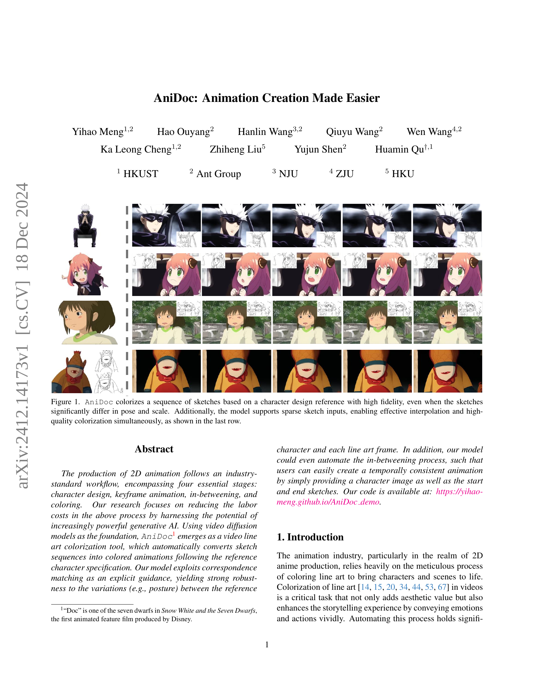
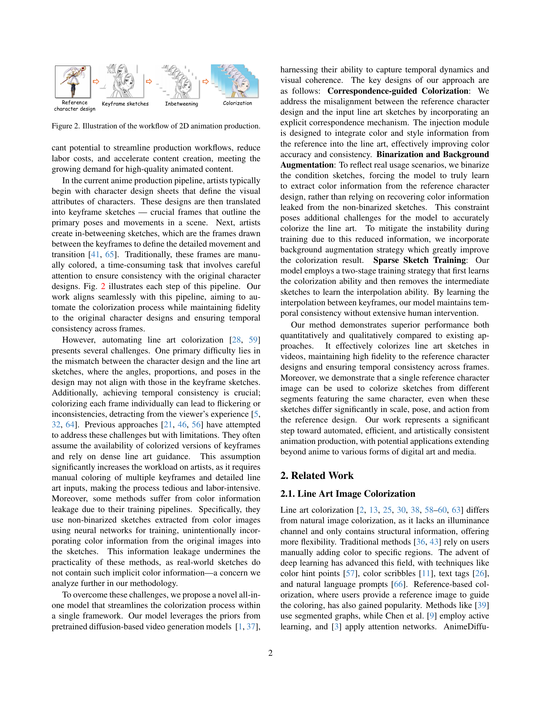
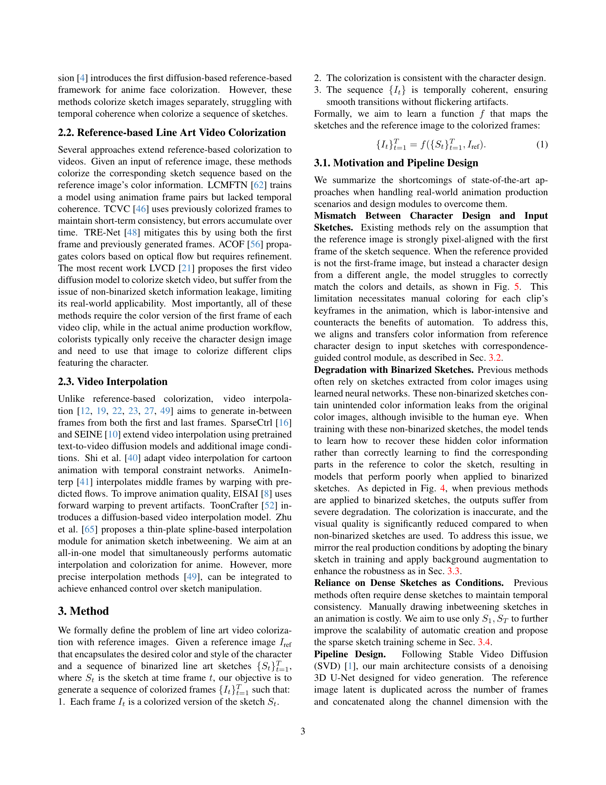
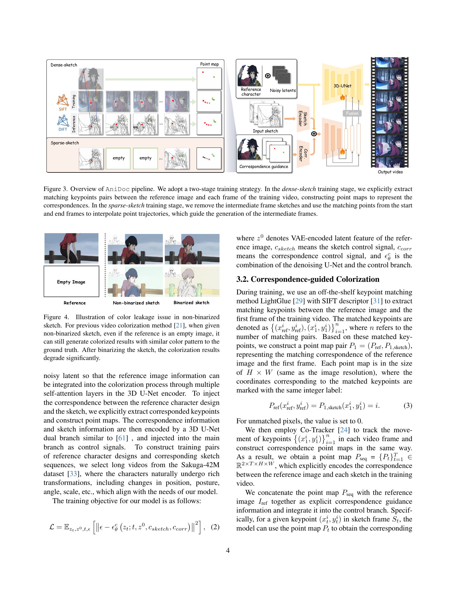
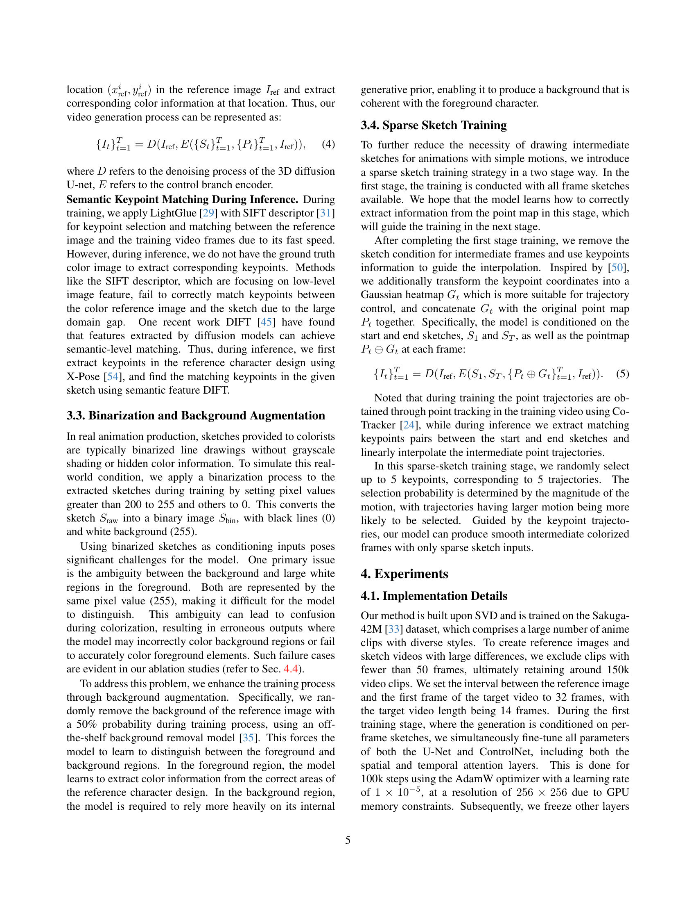
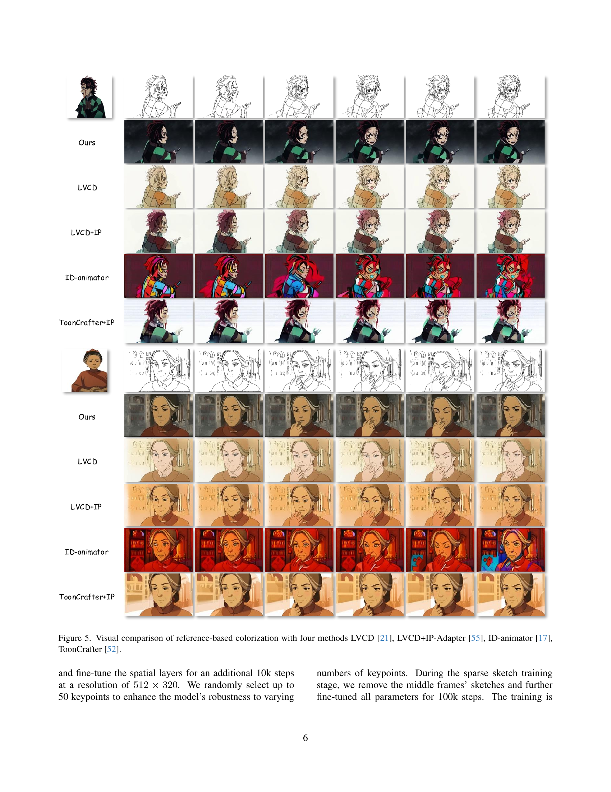
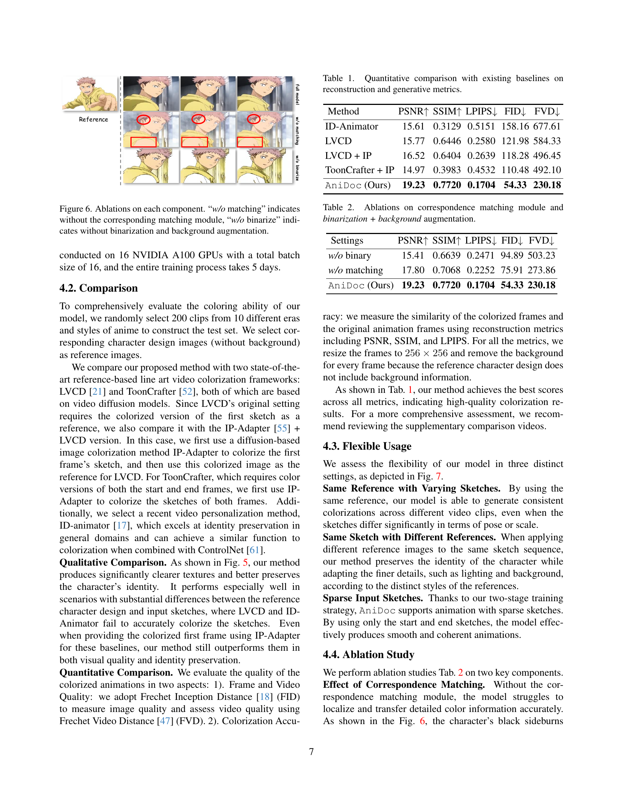
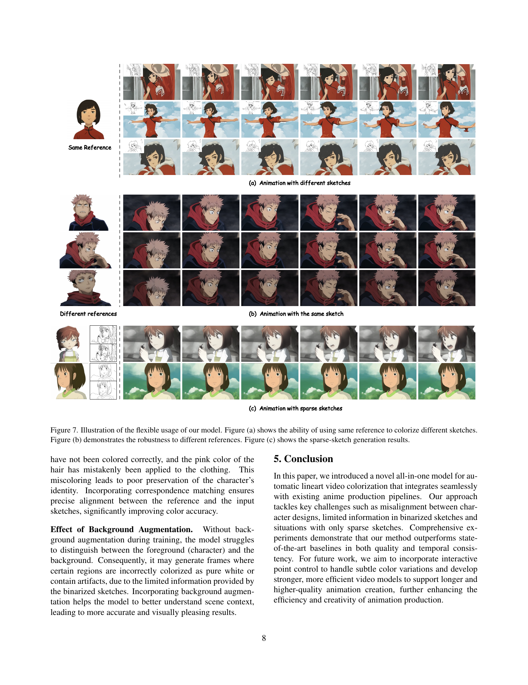
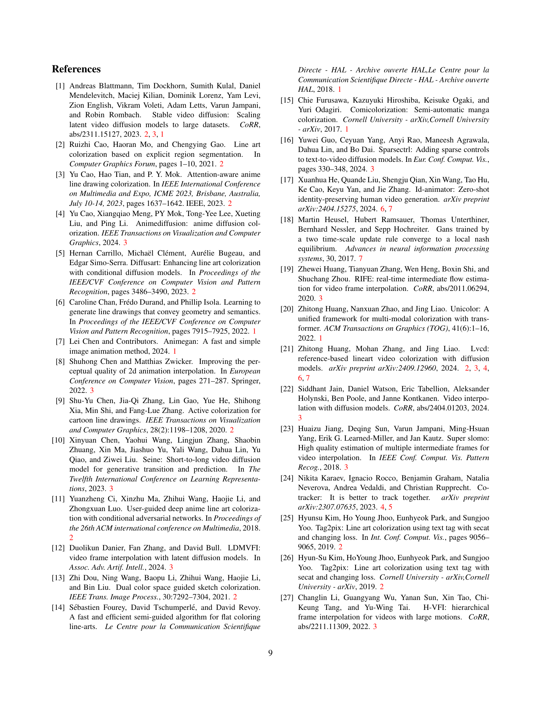
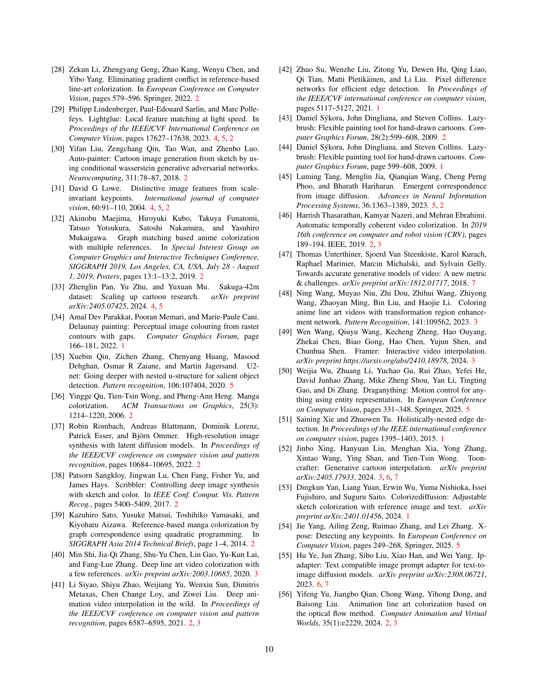
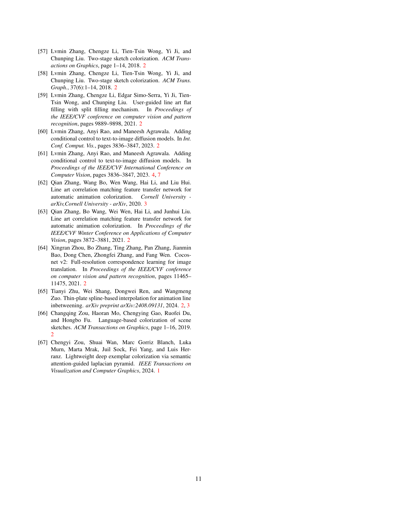
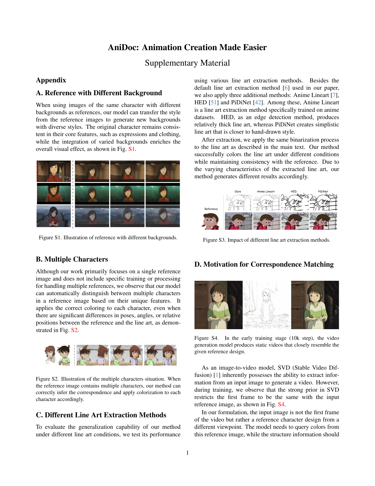
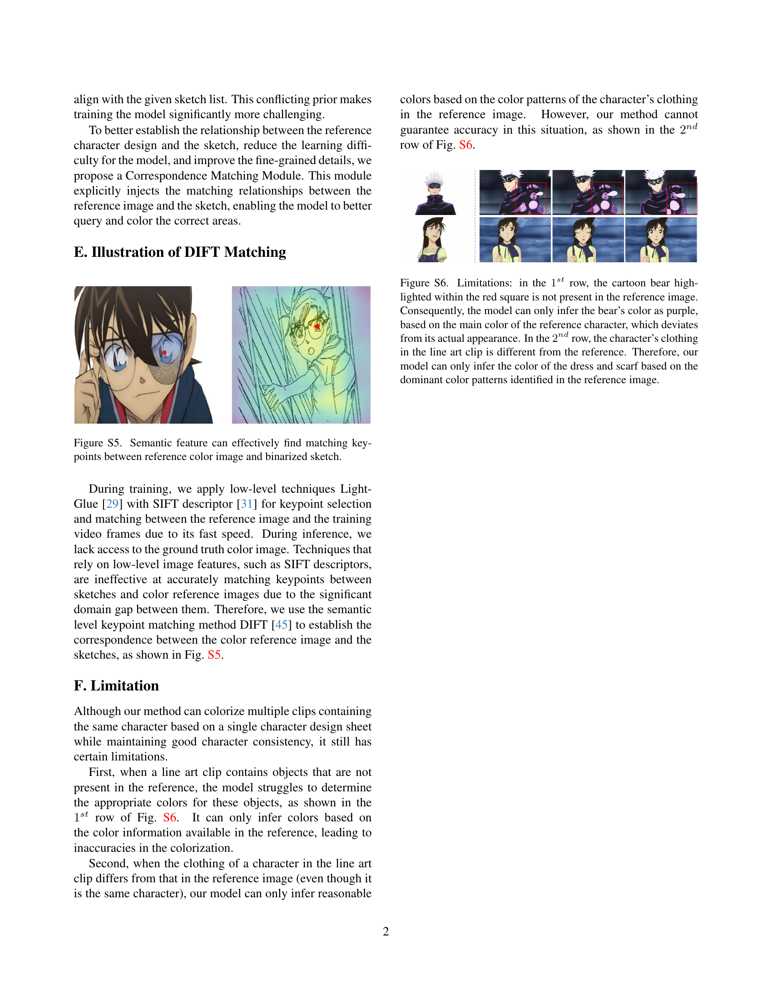
