 


 2412.14233 
 Yanpeng Sun et el. 
 
 🤗 2024-12-20 
 



↗ arXiv


↗ Hugging Face


↗ Papers with Code


### TL;DR



많은 최신 연구들이 대규모 다중 모달 모델(LMM)의 성능 향상에 집중하고 있지만, **이미지 캡션의 정확성과 포괄성 부족**이라는 문제점을 안고 있습니다. 기존의 이미지 캡션 생성 방법은 인간의 주석 작업에 의존하거나 LMM 자체에서 추출하는 방식으로 **비용이 많이 들거나 정확도가 떨어지는 한계**가 있습니다. 

본 논문에서는 이러한 문제를 해결하기 위해 **기존의 시각 전문가 모델들을 활용**하는 새로운 방법론(DCE)을 제시합니다. DCE는 **저수준 및 세분화된 속성, 물체 관계를 추출**하고 이를 LMM과 결합하여 더욱 풍부하고 정확한 이미지 캡션을 생성합니다.  실험 결과, DCE는 다양한 시각적 이해 작업에서 성능 향상을 보였으며, **오픈소스 코드와 파이프라인을 공개**하여 연구의 재현성과 확장성을 높였습니다. 이는 **비용 효율적인 고품질 이미지 캡션 생성**을 가능하게 하여, 다중 모달 모델 연구에 큰 기여를 할 것으로 기대됩니다.



#### Key Takeaways


 기존의 LMM 또는 인간의 주석에 의존하는 기존 방법론과 달리, 오프더쉘 시각 전문가 모델을 활용하여 이미지 캡션을 향상시키는 새로운 접근법 제시 



 물체의 저수준 및 세분화된 속성, 물체 관계를 탐색하고 이를 기술적 캡션에 통합하여 시각적 이해와 추론 성능 향상 



 대규모 데이터셋에 대한 주석을 제공하고, 다양한 벤치마크에서 SOTA 성능을 달성하여 제안된 방법의 효과를 입증 


#### Why does it matter?
본 논문은 **대규모 다중 모달 모델(LMM)의 성능을 향상시키는 새로운 방법론**을 제시하여, 영상 이해와 추론 작업의 발전에 크게 기여합니다. **기존의 방법론들이 LMM 또는 인간의 주석에 의존하는 반면**, 본 논문은 **기존의 시각 전문가 모델들을 활용하여 이미지 캡션을 향상시키는 독창적인 접근 방식**을 제시합니다. 이는 **비용 효율적이면서 정확도 높은 이미지 캡션 생성**을 가능하게 하여, 향후 다양한 영상 이해 관련 연구에 중요한 영향을 미칠 것으로 예상됩니다. 또한 **오픈소스 코드와 파이프라인을 공개**하여 다른 연구자들이 쉽게 접근하고 활용할 수 있도록 하여 연구의 확장성을 높였습니다.

------
#### Visual Insights

> 🔼 그림 1은 이미지 캡션 생성 방법을 비교 분석한 결과를 보여줍니다. (a)는 DCE(Descriptive Caption Enhancement Engine), 사람, 그리고 InternVL2-26B, LLaVA-NeXT, GPT-4V와 같은 일반적인 LMM(Large Multimodality Model) 세 가지 방법으로 생성된 이미지 캡션을 비교합니다. (b)는 (a)에서 생성된 캡션들이 얼마나 다양한 객체와 속성들을 기술하는지를 보여줍니다.  여기에는 객체 1~8, 객체 속성, OCR 정보, HOI(Human-Object Interaction), 2D 및 3D 공간 관계 등이 포함됩니다. 그림을 통해 각 방법이 이미지의 다양한 측면을 얼마나 잘 포착하는지, 그리고 DCE가 다른 방법에 비해 얼마나 더 풍부하고 정확한 캡션을 생성하는지를 시각적으로 비교 분석하고 있습니다.
> 

> 
read the caption

> Figure 1: (a) We present a comparison of captions from DCE, human, and generalist LMM models annotations, including InternVL2-26B, LLaVA-NeXT, and GPT-4V. (b) visualizes the extent to which the captions in (a) describe multiple objects and various attributes, including Objects 1-8, Object Attributes, OCR, HOI, 2D spatial relations and 3D spatial relations.
> 


| Attributes | Visual Specialists | Detailed Process |
|---|---|---|
| Object |  |  |
| Size | Detection model | Using **the area of the bounding box** to measure the size of the instance. |
| Depth | Depth & Detection model | **Average the depth map values within the bounding box region** to obtain the depth information. |
| Emotion | Emotion model | If the detected region is labeled as **”person”**, an emotion model is used **to extract an emotion label**. |
| OCR | OCR Model | Using an OCR model to **extract the text content and bounding box** from the region. |
| Animal | Fine Grained model | A fine-grained recognition model to identify **specific species of the animal**. |
| Plants | Fine Grained model | A fine-grained recognition model to identify **specific species of the plants**. |
| Aircrafts | Fine Grained model | A fine-grained recognition model to identify **specific model of the aircraft**. |
| Logo | Fine Grained model | A fine-grained recognition model to **identify logos** in the region. |
| Landmark | Fine Grained model | A fine-grained recognition model to **identify landmarks** within the region. |
| Food | Fine Grained model | A fine-grained recognition model to identify **specific species of the food**. |
| Celebrity | Fine Grained model | Using a fine-grained recognition model to **identify celebrity** within the region. |
| Relation |  |  |
| P2O relation | HOI Model | Using an HOI model to **determine the relationship between the person and the object**, while the bounding boxes of both the person and the object define their respective regions. |
| Count | Detection model | **Counting the number of all objects** in the image based on the detection results. |
| 2D Absolute Location | Detection model | Using the bounding box to **determine the instance’s position within the image**, including regions such as **left**, **right**, **top**, **bottom**, **center**, **top-left**, **bottom-left**, **top-right**, and **bottom-right**. |
| 2D Relative Location | Detection model | Using the bounding box to **determine the relative position among multiple objects within** the image, including regions such as **left**, **right**, **near**, **next to**, **close by**, and so on. |
| 3D Relative Location | Detection & Depth model | Using the depth attributes of different instances to **capture the 3D spatial relationships of objects** **relative to the camera**, such as ”Instance_A is **in front of** Instance_B” or ”Instance_A is **behind of** Instance_B” relative to the camera.

> 🔼 이 표는 논문에서 제안하는 접근 방식인 DCE(Descriptive Caption Enhancement)가 시각적 전문가 모델을 통해 추출하는 속성들의 요약 정보를 보여줍니다.  각 속성의 이름, 사용된 모델, 그리고 추출 과정을 상세히 설명합니다.  객체의 크기, 깊이, 감정, 텍스트 정보(OCR), 동물, 식물, 항공기, 로고, 랜드마크, 음식, 유명인 등 다양한 속성과 객체 간의 관계(P2O 관계, HOI, 2D/3D 상대 위치)를 포함하고 있어, 이미지 캡션의 풍부한 세부 정보를 이해하는 데 도움이 됩니다.
> 

> 
read the caption

> Table 1: Summary of attributes our approach extracts through visual specialists. It includes the specific attribute names, the models used, and the extraction process for each.
> 

### In-depth insights

#### Visual Specialist Boost
본 논문에서 제시된 "비주얼 스페셜리스트 부스트" 개념은 **기존의 대규모 다중 모달 모델(LMM)의 성능을 향상시키기 위해 전문적인 시각적 지식을 활용하는 접근 방식**을 의미합니다. 이는 일반적인 이미지 캡셔닝 모델이 놓치는 **세밀한 객체 속성, 객체 간의 관계, 심지어는 3D 공간적 관계까지 고려하여 더욱 풍부하고 정확한 이미지 캡션을 생성**하는 데 도움이 됩니다.  **기존 LMM은 인간의 시각적 인지 능력을 완벽히 모방하지 못하는 한계**를 가지는데, 이러한 한계를 극복하기 위해 사전 훈련된 특정 영역 전문가 모델(예: 물체 감지, 깊이 추정, 감정 인식 등)들을 활용하는 것입니다. 이러한 전문가 모델들을 통해 추출된 다양한 시각 정보들이 LLM에 전달되어, 더욱 풍부하고 정확한 이미지 캡션 생성 및 향상된 다운스트림 작업 성능으로 이어집니다. **오픈 소스 모델을 활용하여 비용 효율성을 높인 점** 또한 주목할 만합니다.

#### DCE Pipeline
본 논문에서 제시된 DCE 파이프라인은 **다양한 시각적 전문가 모델(visual specialist models)을 활용하여 이미지 캡션을 향상**시키는 효율적인 방법을 제시합니다.  **개체 수준 및 관계 수준 속성 추출**을 위한 여러 전문가 모델을 통합하여 풍부하고 정확한 묘사가 가능하도록 설계되었습니다.  **객체 위치 파악, 객체 속성 추출, 객체 간 관계 추출**의 단계를 거쳐 상세한 지역 캡션을 생성하고, 최종적으로 이를 통합하여 종합적인 이미지 캡션을 생성하는 것이 핵심입니다.  이러한 과정에서 **대규모 언어 모델(LLM)을 활용하여 추출된 시각적 정보를 문맥에 맞게 통합**하는 점이 특징이며, **기존의 LMM 기반 접근 방식보다 훨씬 저렴하고 효율적**인 방법입니다.  **오픈소스 모델을 주로 활용하여 재현성 및 확장성을 확보**한 점 또한 중요한 강점입니다.

#### LLM Integration
본 논문에서 제시된 연구는 대규모 언어 모델(LLM)을 시각적 전문가와 통합하는 방식에 대한 심도있는 논의를 제공합니다. **LLM의 통합은 단순히 기존 모델에 LLM을 추가하는 것을 넘어, 시각적 전문가가 추출한 풍부한 시각적 속성과 관계 정보를 LLM에 효과적으로 전달하는 과정**을 의미합니다. 이를 위해, 연구는 **LLM 프롬프트 엔지니어링 기법을 사용하여 시각적 전문가의 출력물을 LLM이 이해하고 처리할 수 있는 형태로 변환**하는 데 초점을 맞춥니다. 이러한 프롬프트는 객체 속성, 관계 속성, 심지어는 3D 공간 관계까지 포함하는 다양한 시각 정보를 통합하여 LLM에 전달하고, 이를 통해 더욱 정확하고 상세한 이미지 캡션을 생성하는 것을 목표로 합니다. **LLM의 효율적인 통합을 위해서는 오픈소스 모델을 적극적으로 활용하여 비용을 절감하고 효율성을 높이는 전략**이 중요하며, 이는 본 연구의 핵심적인 강점 중 하나입니다.  결과적으로, **LLM 통합 과정은 시각적 이해 능력 향상과 추론 능력 향상에 기여하며, 보다 정확하고 풍부한 멀티모달 인지 능력을 구현**하는 데 필수적임을 시사합니다.

#### Benchmark Results
본 논문의 벤치마크 결과는 **LLaVA-v1.5 및 LLaVA-NeXT 모델이 DCE-1M으로 훈련되었을 때 다양한 VQA 및 LMM 벤치마크에서 최첨단 성능을 달성했음**을 보여줍니다. 특히, 저해상도 및 고해상도 설정 모두에서 우수한 성능을 나타내어 고품질 이미지 캡션이 VQA 작업에서 시각적 이해력을 향상시키는 데 중요한 역할을 한다는 것을 강조합니다.  **DCE-1M으로 훈련된 모델은 기준 LLaVA 모델에 비해 모든 벤치마크에서 성능이 크게 향상**되었으며, 이는 고품질 캡션의 영향이 모델 변형에 의존적이지 않음을 시사합니다. 또한, ShareGPT-4V와 같은 다른 모델에 비해 대부분의 VQA 벤치마크에서 뛰어난 성능을 보였습니다.  **DCE는 객체 인식 벤치마크에서도 탁월한 성능을 보여주었는데, 이는 DCE가 생성하는 캡션에 객체의 다양성이 풍부하게 포함되어 있기 때문**입니다.  관계 속성을 통합함으로써 모델의 복잡한 관계 이해 능력이 향상되어 GQA와 같은 벤치마크에서 성능이 향상되었습니다.  하지만,  **중국어 데이터 부족으로 MMBench-CN에서 성능이 저조했고, 객체 검출 모델의 노이즈로 인해 POPE 작업에서 성능이 다소 낮았습니다.** 이러한 한계는 향후 연구의 주요 초점이 될 것입니다.

#### Future of DCE
DCE의 미래는 **다양한 비전 전문가의 통합과 대규모 데이터셋 활용**에 달려 있습니다.  **더욱 정교한 시각적 속성 추출을 위해 다양한 전문 모델을 통합**하고, **3D 공간 관계 및 복잡한 객체 간의 상호 작용을 더욱 정확하게 파악**하는 것이 중요합니다.  **다국어 지원 및 다양한 도메인의 이미지 데이터 확장**은 DCE의 활용 범위를 넓히는 데 필수적입니다.  또한, **오류 감소와 처리 속도 향상**을 위한 연구가 지속되어야 합니다.  **LLM의 발전에 따라, 보다 효율적이고 정확한 캡션 생성을 위한 최적화**도 필요합니다.  궁극적으로 **인간의 시각적 이해 능력에 더욱 가까운 수준의 캡션 생성**을 목표로, **비전 전문가와 LLM간의 상호작용을 강화**하는 연구가 DCE의 미래를 결정짓는 중요한 요소가 될 것입니다.  **설명 가능성 향상**을 통해 DCE의 의사결정 과정을 투명하게 만드는 것 또한 중요한 과제입니다.

### More visual insights

More on figures

> 🔼 그림 2는 서로 다른 이미지 캡션으로 사전 훈련한 후 LLaVA-v1.5 및 LLaVA-NeXT의 다운스트림 작업 성능을 보여줍니다. (a)와 (b)는 각각 LLaVA-v1.5와 LLaVA-NeXT 모델의 성능을 다양한 캡션으로 훈련시킨 결과를 보여주는 비교 그래프입니다. 이를 통해 다양한 캡션 데이터를 사용한 사전 훈련이 모델 성능에 미치는 영향을 정량적으로 비교 분석합니다. 각 그래프는 여러 가지 벤치마크 작업에 대한 성능 점수를 나타내며,  인간이 작성한 캡션,  기존의 LMM(Large Multimodality Model)에서 생성한 캡션, 그리고 논문에서 제안하는 DCE(Descriptive Caption Enhancement) 기법을 통해 개선된 캡션을 사용한 경우의 결과를 비교합니다.  이를 통해 DCE가 이미지 캡션의 질을 향상시키고, 그 결과 다운스트림 작업의 성능을 향상시킨다는 것을 보여줍니다.
> 

> 
read the caption

> Figure 2: Comparisons of caption quality. (a) and (b) show the downstream task performance of LLaVA-v1.5 and LLaVA-NeXT after pretraining with different image captions.
> 

> 🔼 그림 3은 DCE 파이프라인의 전체 과정을 보여줍니다. 먼저 다양한 시각적 전문가 모델(Visual Specialists)을 활용하여 이미지에서 객체(Object)와 관계(Relation) 속성을 추출합니다.  추출된 객체 속성은 대형 언어 모델(LLM)을 이용하여 상세한 영역별 캡션(detailed region captions)으로 통합됩니다. 마지막으로, 영역별 캡션과 관계 속성을 결합하여 포괄적인 이미지 캡션을 생성합니다.  즉, 시각적 전문가 모델이 이미지의 세부 정보를 추출하고, LLM이 이 정보들을 종합하여 풍부하고 정확한 설명을 생성하는 과정을 나타냅니다.
> 

> 
read the caption

> Figure 3: The DCE pipeline first utilizes various visual specialists to extract both Object and Relation attributes. Then, it uses an LLM to integrate the object attributes into detailed region captions, followed by combining the region captions with relational attributes to generate a comprehensive image caption.
> 

> 🔼 그림 4는 LLM(Large Language Model)을 사용하여 객체 속성과 참조 캡션을 고려하여 세부적인 영역 캡션을 생성하기 위한 프롬프트(명령어)를 보여줍니다.  LLM에게 전달되는 프롬프트는 시스템 메시지와 사용자 메시지 두 부분으로 구성됩니다. 시스템 메시지는 LLM에게 여러 시각적 속성을 결합하여 상세한 영역 캡션을 생성하는 AI 시각 보조 역할을 부여합니다. 참조 캡션과 다양한 시각 전문가(visual specialists)가 제공하는 객체 속성을 통합하여 포괄적이고 일관성 있는 설명을 생성하도록 지시합니다.  사용자 메시지는 실제로 LLM에게 전달되는 프롬프트로, 참조 캡션과 객체의 속성(객체 종류, 감정, OCR 정보, 세부 분류된 항공기, 동물, 식물, 로고 등)을 포함합니다. 이 프롬프트는 LLM이 이미지의 각 영역에 대한 풍부하고 정확한 설명을 생성하는 데 필요한 모든 정보를 제공합니다.
> 

> 
read the caption

> Figure 4: The prompt for using LLM to generate an region caption by considering object attributes and reference captions.
> 

> 🔼 그림 5는 LLM(Large Language Model)이 이미지 캡션을 생성하는 과정을 보여줍니다.  LLM은 이미지의 전체적인 설명과 여러 개의 지역적 설명을 입력받습니다. 지역적 설명은 이미지 영역의 위치 정보(좌표)와 해당 영역의 상세 설명으로 구성됩니다. LLM은 전체 설명과 지역별 설명의 객체들을 연결하여 중복 없이 모든 관련 정보를 통합한 완성도 높은 이미지 캡션을 생성합니다.  각 지역 설명은 이미지의 일부만을 보여주므로 초점이 다를 수 있음에도 불구하고, LLM은 모순되는 부분 없이 유용한 정보들을 모두 포함하는 캡션을 생성합니다. 특히, OCR 정보, 이미지 내 상대적 위치 정보, 객체 간 공간적 관계 정보를 최대한 유지하는 것이 중요합니다.
> 

> 
read the caption

> Figure 5: The prompt for LLM to generate an image caption by considering relation attributes, region location information and captions.
> 

> 🔼 그림 6은 DCE(Descriptive Caption Enhancement)의 속성 융합을 시각적으로 보여줍니다. DCE는 개체 속성(크기, 깊이, 감정, OCR 정보, 미세 입자 속성 등)과 관계 속성(인간-개체 상호작용, 2D 및 3D 상대 위치 등)을 결합하여 상세하고 종합적인 캡션을 생성합니다.  두 가지 예시 이미지를 통해, 기존의 일반적인 LMM(Large Multimodality Model) 기반 캡션 생성 방식보다 DCE가 훨씬 더 풍부하고 정확한 묘사를 제공함을 보여줍니다. 첫 번째 예시는 군용 제트기를, 두 번째는 꿀병들을 묘사하는데, DCE는 각 개체의 세부 정보와 개체 간의 공간적 관계를 명확하게 설명합니다. 이는 DCE가 단순히 개체를 나열하는 수준을 넘어, 이미지의 시각적, 의미적 맥락을 정확하게 포착하여 고품질 캡션을 생성하는 능력을 보여줍니다.
> 

> 
read the caption

> Figure 6: Visualization of DCE’s Attribute Fusion: DCE combines object and relational attributes to generate detailed and comprehensive captions.
> 

More on tables


| Using an HOI model to <ins>determine the relationship between the person and the object</ins>, while |
| the bounding boxes of both the person and the object define their respective regions. |
> 🔼 이 표는 10명의 자원봉사자들이 100개의 검증 샘플에 대해 수행한 속성 풍부성에 대한 인간 평가 결과를 보여줍니다.  각 샘플에 대해 InternVL2, LLaVA-NeXT, 그리고 DCE 세 가지 방법으로 생성된 캡션의 공간적 관계, 인간-객체 상호 작용, 세분화된 속성, OCR, 감정 등 다양한 속성의 풍부성을 평가했습니다.  수치는 각 속성에 대한 평균 점수를 나타내며, DCE가 다른 두 방법보다 더 풍부한 속성을 가진 캡션을 생성했음을 보여줍니다.
> 

> 
read the caption

> Table 2: Human evaluation of attribute richness, conducted on 100 validation samples with 10 volunteers.
> 


| Using the bounding box to **determine the instance’s position within the image**, including regions|
| such as **left**, **right**, **top**, **bottom**, **center**, **top-left**, **bottom-left**, **top-right**, and **bottom-right**|
> 🔼 표 3은 7가지 일반적인 시각적 질문 답변 벤치마크에 대한 다양한 모델의 성능을 보여줍니다. 빨간색과 파란색은 각 벤치마크에서 최고 및 최저 성능을 나타냅니다.  각 모델은 특정 시각적 질문 답변 작업에 대한 정확도를 백분율로 나타냅니다.  LLaVA-NeXT의 오픈소스 SFT 데이터를 사용한 결과는 별표(*)로 표시되어 있으며, 일부 개인 정보가 제외되었음을 나타냅니다.  표는 다양한 모델 아키텍처와 학습 데이터의 효과를 비교하여 시각적 질문 답변 성능에 대한 통찰력을 제공합니다.
> 

> 
read the caption

> Table 3: Performance on seven General Visual Question Answering benchmarks. The red and blue colors respectively represent the optimal and suboptimal results on each benchmark. ∗*∗ indicates the use of LLaVA-NeXT’s open-source SFT data, with certain private data excluded.
> 


| Using the bounding box to **determine the relative position among multiple objects within**
| **the image**, including regions such as **left**, **right**, **near**, **next to**, **close by**, and so on.
> 🔼 표 4는 7가지 대규모 다중 모달 벤치마크에 대한 성능을 보여줍니다. 빨간색과 파란색은 각 벤치마크에서 최적 및 최악의 결과를 각각 나타냅니다.  * 표시는 특정 개인 정보가 제외된 LLaVA-NeXT의 오픈 소스 SFT 데이터 사용을 나타냅니다.  이 표는 다양한 모델의 다중 모달 능력을 비교 평가하여 각 모델의 강점과 약점을 파악하는 데 도움이 됩니다.  각 모델의 비전 인코더, 언어 모델, 그리고 벤치마크별 성능 점수가 제시되어 있습니다.  특히,  LLaVA-NeXT 모델의 경우 오픈 소스 데이터를 사용한 경우와 그렇지 않은 경우의 성능 차이를 확인할 수 있습니다.
> 

> 
read the caption

> Table 4: Performance on seven Large Multi-Modal benchmarks. The red and blue colors respectively represent the optimal and suboptimal results on each benchmark. ∗*∗ indicates the use of LLaVA-NeXT’s open-source SFT data, with certain private data excluded.
> 


| Using the depth attributes of different instances to **capture the 3D spatial relationships of objects**
| **relative to the camera**, such as ”Instance_A is **in front of** Instance_B” or ”Instance_A is **behind of** Instance_B” relative to the camera.

> 🔼 표 5는 서로 다른 이미지 캡션 주석 방법들을 비교 분석한 표입니다.  인간이 직접 작성한 캡션, InternVL2-26B와 LLaVA-NeXT-34B 모델이 생성한 캡션, 그리고 본 논문에서 제안하는 DCE 기법을 이용해 생성한 캡션을 비교하여, OKVQA, GQA, ScienceQA, TextVQA, MMBench, MM-Vet, SEED-Bench 등 다양한 벤치마크에서의 성능을 보여줍니다. 이를 통해 DCE가 다른 방법들에 비해 더욱 정확하고 상세한 캡션을 생성하며, 다운스트림 작업에서도 더 나은 성능을 보임을 확인할 수 있습니다.
> 

> 
read the caption

> Table 5: Comparison of Different Image Captioning Annotation Methods.
> 

### Full paper


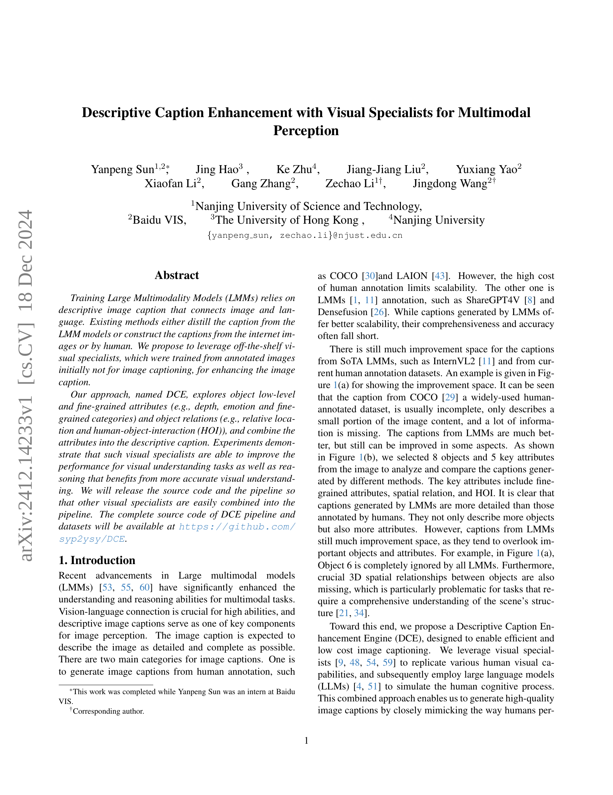
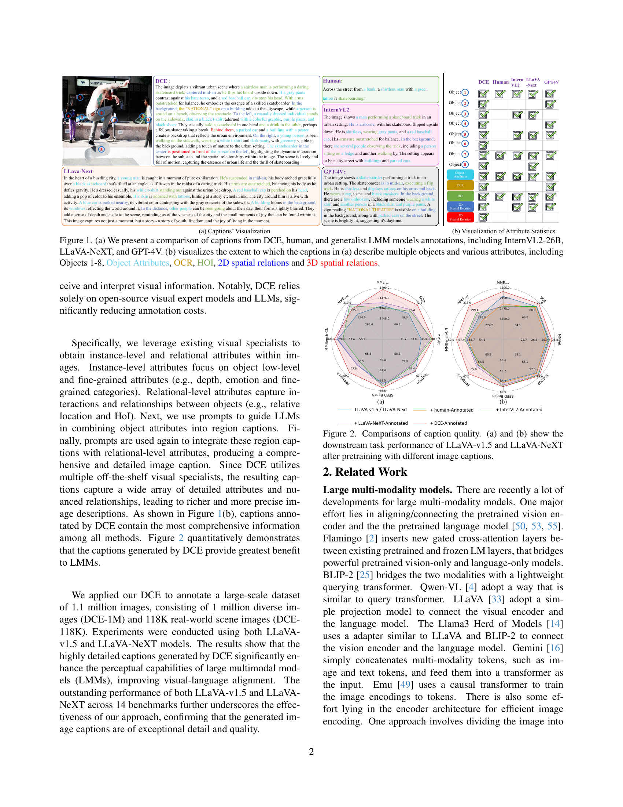
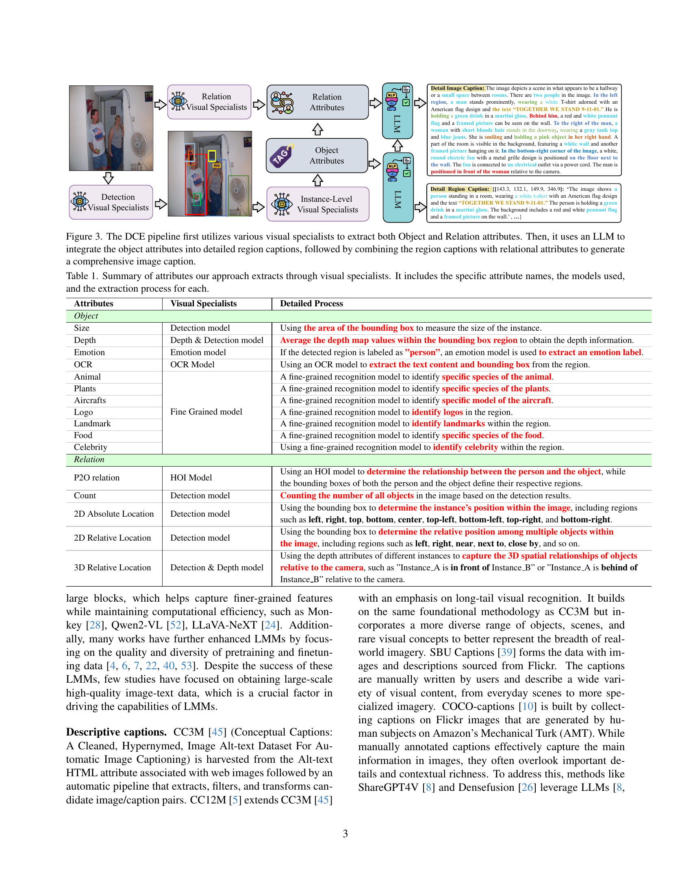
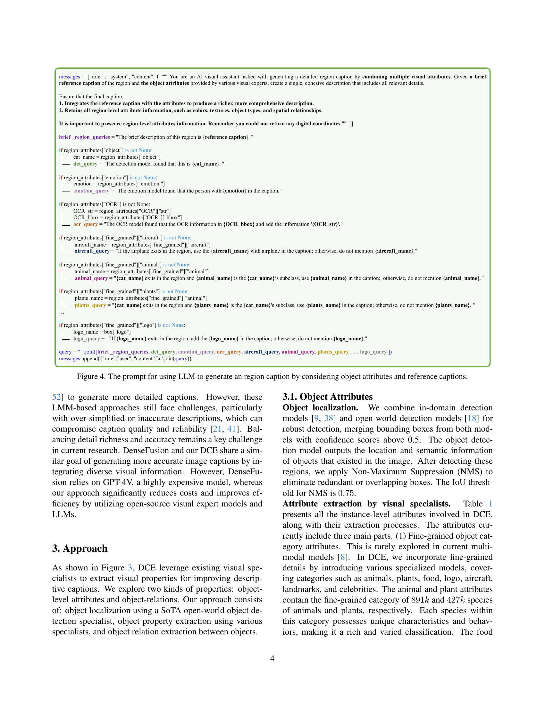
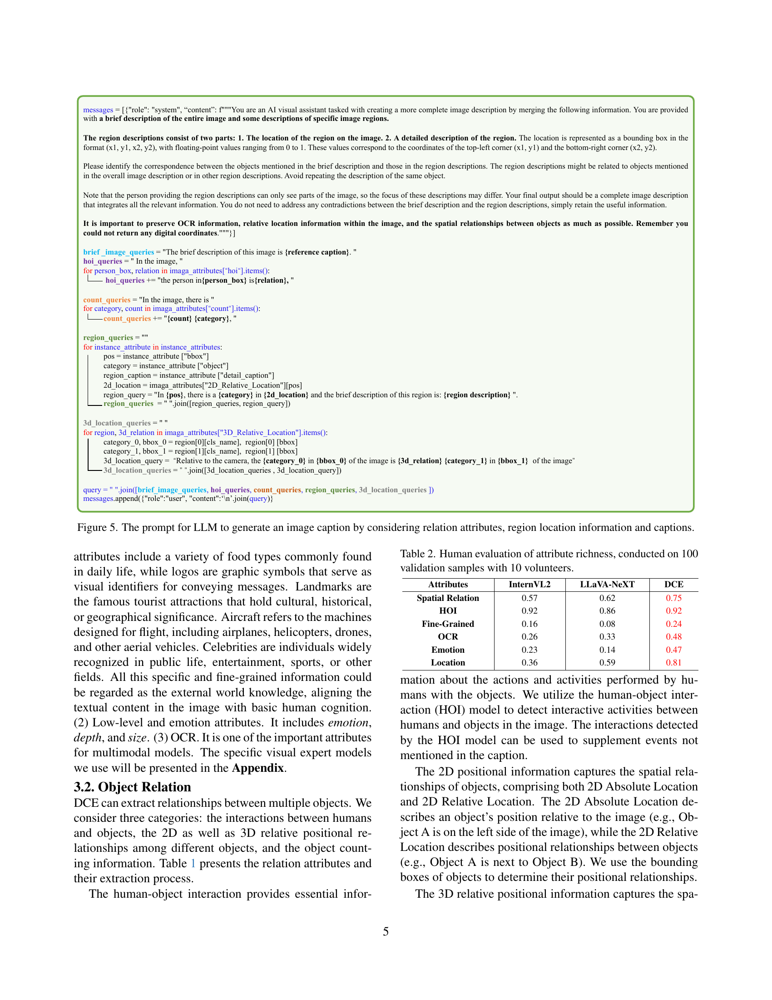
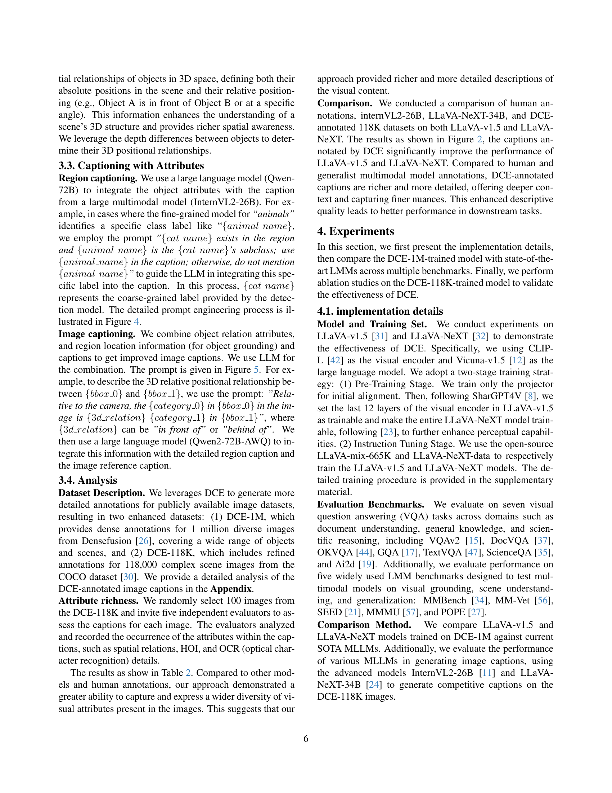
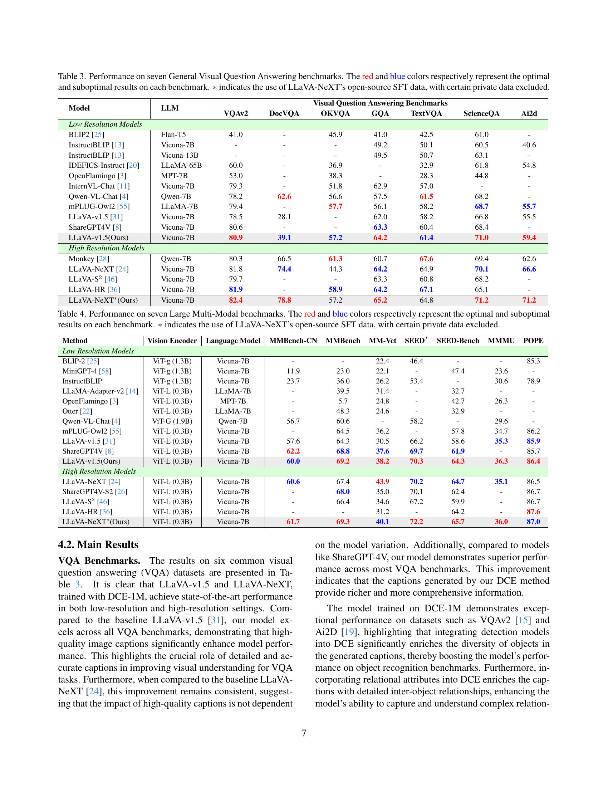
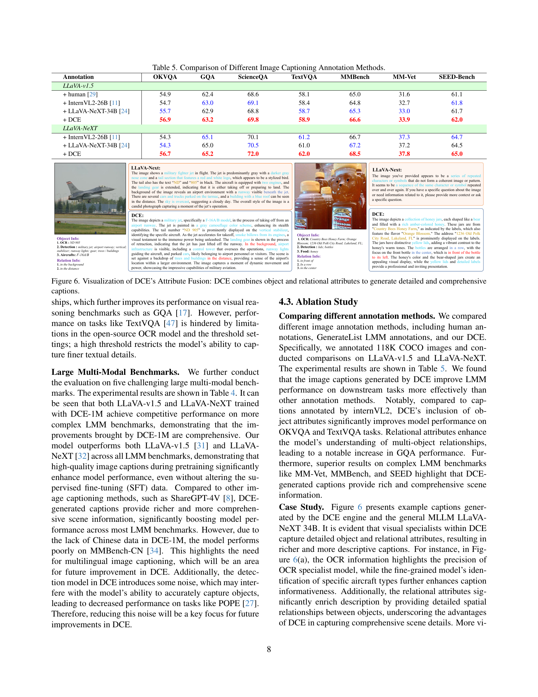
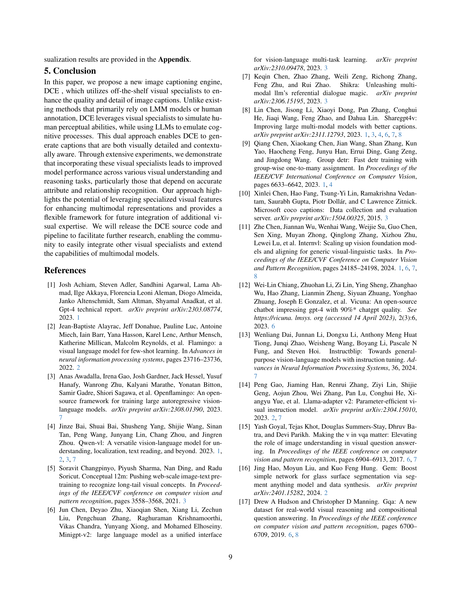
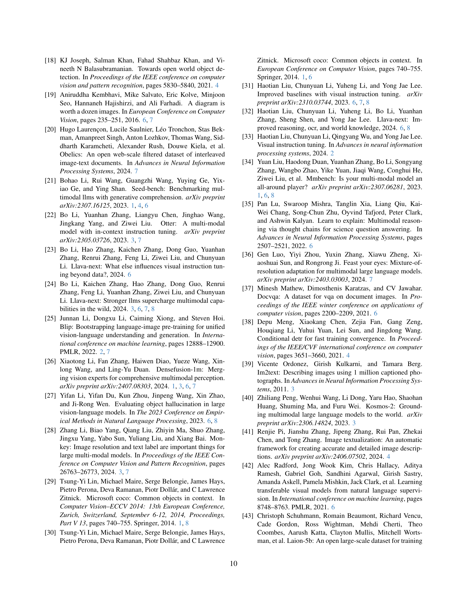
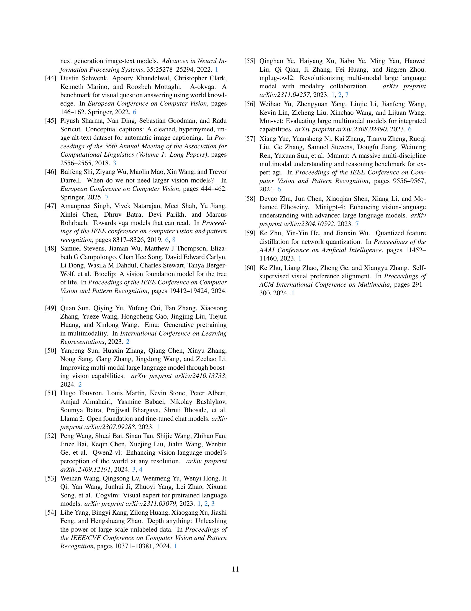
