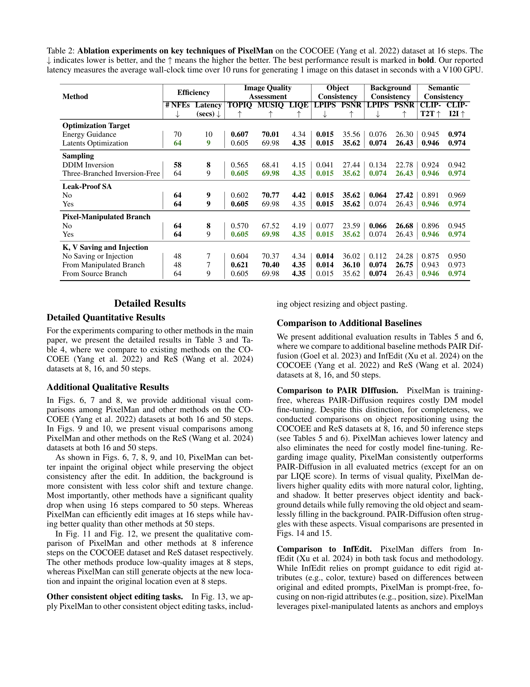

 


 2412.14283 
 Liyao Jiang et el. 
 
 🤗 2024-12-20 
 



↗ arXiv


↗ Hugging Face


↗ Papers with Code


### TL;DR



기존의 이미지 편집 연구는 **일관성 있는 객체 편집**에 어려움을 겪었습니다. 특히, 객체의 위치, 크기, 구성 등을 변경하면서 **텍스처 및 속성을 유지**하는 것은 매우 어려운 과제였습니다. 기존의 방법들은 DDIM 역변환을 사용하거나 에너지 가이드를 활용하는데, 이는 효율성이 떨어지고 이미지 왜곡을 발생시킬 수 있는 단점이 있었습니다. 

본 논문에서는 이러한 문제를 해결하기 위해 **PixelMan**이라는 새로운 방법을 제시합니다. PixelMan은 **픽셀 조작 및 생성**을 통해 객체를 직접 복제하고, 효율적인 샘플링 기법을 활용하여 원하는 위치에 자연스럽게 통합합니다. 또한, 다양한 일관성 유지 기법을 도입하여 이미지 왜곡을 방지하고, 배경과의 조화를 개선합니다. **16단계만으로도** 높은 정확도와 효율성을 달성하여 기존 방법들을 능가하는 성능을 보였습니다.



#### Key Takeaways


 PixelMan은 기존의 DDIM 역변환 방식을 사용하지 않고도 효율적인 샘플링 기법을 통해 일관성 있는 객체 편집을 달성합니다. 



 PixelMan은 픽셀 조작을 통해 객체를 직접 생성하고, 배경과의 조화 ë° 원래 위치 복구를 효과적으로 수행합니다. 



 PixelMan은 16단계만으로도 기존 최첨단 방법(일반적으로 50단계 필요)을 능가하는 성능을 보이며, 처리 속도 또한 향상시킵니다. 


#### Why does it matter?
본 논문은 **일관성 있는 객체 편집을 위한 효율적인 새로운 방법**을 제시하여, 기존의 어려움을 극복하고 **더 빠르고 정확한 결과**를 얻을 수 있게 합니다. 이는 이미지 편집 분야의 발전에 크게 기여하며, **향후 연구 방향**을 제시하는 중요한 결과물입니다. 특히, 훈련 없이 기존 모델을 활용하는 방법은 **비용 효율성** 측면에서 큰 장점을 가지며, 다양한 응용 분야에서 활용될 가능성이 높습니다.

------
#### Visual Insights

> 🔼 PixelMan의 개요를 보여주는 그림입니다. PixelMan은 일관된 이미지 편집을 위한 효율적인 반전 없는 샘플링 기법을 사용합니다.  소스 객체를 픽셀 공간의 대상 위치에 복사하고, 픽셀 조작 이미지의 잠재 변수에 고정하여 이미지 일관성을 유지합니다. 정보 누출을 완화하여 완전하고 응집력 있는 인페인팅을 달성하기 위해 누출 방지 자기 주의 메커니즘을 설계했습니다. 그림은 PixelMan의 세 가지 주요 구성 요소인 소스 분기, 픽셀 조작 분기, 대상 분기와 각 분기의 샘플링 과정을 자세히 보여줍니다. 또한, 누출 방지 자기 주의 메커니즘과 잠재 변수 최적화를 통한 편집 안내가 어떻게 이미지 일관성을 유지하고 완전한 인페인팅을 달성하는지 보여줍니다.
> 

> 
read the caption

> Figure 1:  Overview of PixelMan. An efficient inversion-free sampling approach for consistent image editing, which copies the object to target location in pixel-space, and ensure image consistency by anchoring to the latents of pixel-manipulated image. We design a leak-proof self-attention mechanism to achieve complete and cohesive inpainting by mitigating information leakage.
> 


| Input | (a) | (b) | (c) | (d) | (e) | (f) | (g) | (h) |
|---|---|---|---|---|---|---|---|---|
| Input    |  |  |  |  |  |  |  |
| SDv2-Inpainting   +AnyDoor   (50 steps, 15s)    |  |  |  |  |  |  |  |
| SelfGuidance   (50 steps, 11s)    |  |  |  |  |  |  |  |
| DragonDiffusion   (50 steps, 23s)    |  |  |  |  |  |  |  |
| DiffEditor   (50 steps, 24s)    |  |  |  |  |  |  |  |
| DiffEditor   (16 steps, 9s)    |  |  |  |  |  |  |  |
| **PixelMan**   (16 steps, 9s)    |  |  |  |  |  |  |  |

> 🔼 표 1은 PixelMan과 기존 방법들의 효율성을 비교한 표입니다. COCOEE 데이터셋에서 PixelMan은 DiffEditor보다 112개의 NFE(Network Function Evaluations)가 적고 15초 빠르다는 것을 보여줍니다.  이는 PixelMan의 연산 효율성이 우수함을 시사합니다.  NFEs는 모델의 추론 단계에서 네트워크 연산 횟수를 나타내며, 수치가 낮을수록 효율적임을 의미합니다.
> 

> 
read the caption

> Table 1: Efficiency comparisons. PixelMan at 16 steps performs 112 fewer NFEs and is 15 seconds faster than DiffEditor (Mou et al. 2024a) on the COCOEE dataset.
> 

### In-depth insights

#### Pixel Manipulation
본 논문에서 제시된 "픽셀 조작(Pixel Manipulation)" 개념은 기존의 이미지 편집 방식과는 다르게, **픽셀 단위에서 직접적인 조작을 통해 일관성 있는 객체 편집을 달성**하는 핵심 전략입니다.  이는 기존의 DDIM 역변환이나 에너지 유도 방식의 비효율성을 극복하고자 하는 시도이며, **소스 객체를 목표 위치에 직접 복사**하여 픽셀 공간에서 변화를 생성하는 방식입니다. 이를 통해 배경과 객체의 일관성을 유지하면서 효율성을 높일 수 있습니다.  **샘플링 과정에서 픽셀 조작된 이미지를 기준으로 지속적인 조정을 통해** 목표 위치로의 객체 조화 및 원래 위치의 빈 공간 채우기를 수행합니다.  결과적으로, **훈련 없이도 기존의 사전 훈련된 모델을 이용**하여 효율적인 객체 편집을 가능하게 합니다.  **훈련 기반 및 훈련 없는 방법들보다 우수한 성능**을 보이며, 16단계의 추론만으로도 우수한 결과를 얻을 수 있습니다.

#### Inversion-Free DMs
역확산 모델(Diffusion Models, DMs)에서 일관된 객체 편집을 위한 기존 방법들은 종종 역확산(Inversion) 과정에 의존해 왔습니다. 이는 계산 비용이 많이 들고, 편집 결과의 일관성을 저해할 수 있다는 단점이 있습니다.  **본 논문에서 제시된 Inversion-Free DMs는 이러한 한계를 극복하기 위해 역확산 과정 없이 직접적으로 픽셀 조작과 생성을 통해 객체 편집을 수행하는 새로운 접근 방식**을 제시합니다.  이는 효율성을 높이고, 객체와 배경의 일관성을 유지하는 데 효과적입니다.  **핵심 아이디어는 원본 객체의 복제본을 목표 위치에 직접 생성하고, 효율적인 샘플링 기법을 통해 주변 환경과 조화시키는 것**입니다.  **여기에는 이미지 일관성을 유지하기 위한 다양한 최적화 기법이 포함**되어 있습니다.  **Inversion-Free DMs는 학습이 필요 없다는 장점**도 가지고 있으며,  **실험 결과들을 통해 기존 방법들보다 적은 연산으로 더 나은 성능을 달성**함을 보여줍니다.  **특히, 16번의 추론 단계만으로도 우수한 객체 편집 결과**를 얻을 수 있다는 점은 Inversion-Free DMs의 실용적인 가치를 더욱 높입니다.

#### Consistent Editing
본 논문에서 다루는 일관된 편집(Consistent Editing)은 **기존 이미지의 객체 위치, 크기, 구성 등을 변경하면서 객체와 배경의 일관성을 유지하는 기술**입니다.  이는 단순히 객체의 속성을 바꾸는 것 이상으로, **텍스처나 속성 변화 없이 객체의 비강체적 속성만 변화시키는 복잡한 과정**을 포함합니다.  기존의 접근 방식들은 DDIM 역변환에 의존하여 효율성이 떨어지고 이미지 왜곡이 발생하는 문제가 있었습니다. 본 논문에서는 이러한 문제를 해결하기 위해 **픽셀 조작과 생성을 결합한 새로운 방법**을 제시합니다. **역변환 없이 직접 픽셀 공간에서 객체를 복제하여 목표 위치에 배치**하고, 효율적인 샘플링 기법으로 객체를 조화시키고 원래 위치를 채웁니다.  여기에는 이미지 일관성을 유지하고 다양한 최적화 기법을 활용하는 여러 가지 기법이 포함됩니다. 실험 결과, 제안된 방법은 기존의 방법들보다 적은 단계로 우수한 성능을 보였습니다.  이는 **일관성 있는 객체 편집을 위한 새로운 패러다임**을 제시하는 중요한 결과입니다.

#### Leakproof Self-Attn
본 논문에서 제시된 "Leakproof Self-Attn"는 셀프 어텐션 메커니즘의 정보 누출 문제를 해결하기 위한 중요한 기술입니다. 기존의 셀프 어텐션은 유사한 객체들 간의 정보 누출로 인해, 객체 제거 후 배경을 일관되게 재구성하는 데 어려움을 겪습니다. 이러한 문제를 해결하기 위해 **소스 객체, 타겟 객체, 그리고 유사 객체에 대한 어텐션을 방지**하는 Leakproof Self-Attention 기법을 제안합니다. 이 기법은 **셀프 어텐션 메커니즘의 상호 영역 의존성을 제어**하여 정보 누출을 완화하고, **일관성 있는 배경 재구성 및 객체와 배경의 조화로운 통합**을 가능하게 합니다.  **결과적으로, 보다 완전하고 일관된 배경 재구성과 편집된 객체의 자연스러운 통합**을 달성하여 이미지 일관성을 향상시키는 효과를 보입니다. 이는 단순히 이미지의 품질 향상뿐 아니라,  **실제 객체 편집 작업에서의 성능 향상**으로 이어지는 핵심적인 기술적 기여입니다.

#### Ablation Study
본 논문의 절제 연구는 **PixelMan 모델의 성능에 기여하는 각 구성 요소의 중요성을 객관적으로 평가**하기 위해 수행되었습니다.  구체적으로, 역전 없이 샘플링하는 기법, 누수 방지 자기 주의 메커니즘, 잠재 공간 최적화를 통한 편집 안내, 그리고 피처를 보존하는 소스 브랜치의 영향을 개별적으로 분석했습니다. **실험 결과는 각 구성 요소가 PixelMan의 전반적인 성능 향상에 상당한 영향을 미침**을 보여줍니다. 특히, 역전 없이 샘플링하는 방법은 효율성을 크게 높이고, 누수 방지 자기 주의 메커니즘은 일관성 있는 이미지 편집에 중요한 역할을 합니다. 또한, 잠재 공간 최적화 기법과 피처 보존 소스 브랜치는 이미지의 질과 일관성을 더욱 향상시키는 것으로 나타났습니다.  **이러한 절제 연구는 PixelMan 모델의 설계 원칙을 명확히 하고, 향후 유사한 모델 개발에 중요한 시사점을 제공**합니다.  **절제 연구를 통해 얻은 통찰력은 PixelMan의 강점과 한계를 명확하게 이해**하는 데 도움이 되며, **향후 개선 및 발전 방향**을 제시하는 데 중요한 역할을 합니다.

### More visual insights

More on figures

> 🔼 그림 2는 COCOEE 데이터셋에서 여러 일관된 객체 편집 방법들을 비교한 결과를 보여줍니다. PixelMan은 객체의 위치를 재배치하는 작업에서 기존 방법들보다 낮은 지연 시간과 적은 추론 단계로 일관된 객체 편집을 달성합니다.  PixelMan은 이미지 일관성을 더 잘 유지하고, 보다 응집력 있는 잉크페인팅을 수행합니다. 그림은 PixelMan을 포함한 여러 방법들의 결과 이미지들을 보여주며, 객체의 이동 전후 이미지, 배경의 변화, 그리고 객체와 배경의 조화 정도를 비교하여 PixelMan의 우수성을 시각적으로 보여줍니다.
> 

> 
read the caption

> Figure 2:  Visual comparisons on COCOEE dataset. PixelMan achieves consistent object editing for object repositioning with lower latency and fewer inference steps, while better preserving image consistency and achieving cohesive inpainting.
> 

> 🔼 그림 3(a)는 COCOEE 데이터셋을 사용하여 8단계(inference step)에서 다양한 방법들의 정량적 평가 결과를 보여줍니다. 각 방법의 성능을 9가지 지표(TOPIQ, MUSIQ, LIQE, LPIPS(neg), PSNR, CLIP-T2T, CLIP-I2I)로 비교 분석하여 레이더 차트 형태로 시각화했습니다. 각 지표는 이미지 품질, 객체 일관성, 배경 일관성, 의미 일관성 등 다양한 측면을 평가합니다.
> 

> 
read the caption

> (a) COCOEE dataset, all methods using 8 steps
> 

> 🔼 그림 (b)는 논문의 실험 결과 중 하나로, COCOEE 데이터셋을 사용하여 일관된 객체 편집 작업에 대한 다양한 방법들의 성능을 비교한 것입니다. 특히, 16단계의 추론 단계를 거친 결과를 보여주는 그림입니다.  각 방법들은 객체의 위치를 변경하는 작업(object repositioning)을 수행하였으며,  결과 이미지의 품질, 객체의 일관성, 배경의 일관성, 그리고 의미적 일관성 등을 비교 분석하기 위해 사용되었습니다.  각 방법의 시각적 결과를 비교함으로써, 제안된 PixelMan 방법의 효율성과 정확성을 보다 명확하게 이해할 수 있도록 합니다.
> 

> 
read the caption

> (b) COCOEE dataset, all methods using 16 steps
> 

> 🔼 그림 (c)는 COCOEE 데이터셋을 사용하여 여러 가지 일관된 객체 편집 방법들을 50단계에 걸쳐 비교한 결과를 보여줍니다. 각 방법의 성능을 다양한 지표(예: 이미지 품질, 객체 일관성, 배경 일관성, 의미적 일관성)를 통해 정량적으로 평가하여, 50단계라는 충분한 반복 횟수에서 각 방법의 강점과 약점을 비교 분석합니다. 그림은 각 방법들이 생성한 이미지의 시각적 결과와 정량적 지표를 함께 제시하여, 다양한 측면에서의 상대적 성능을 명확하게 비교할 수 있도록 합니다.
> 

> 
read the caption

> (c) COCOEE dataset, all methods using 50 steps
> 

> 🔼 그림은 COCOEE 데이터셋에서 일관된 객체 편집 작업에 대한 다양한 방법들의 비교 결과를 보여줍니다. PixelMan은 16단계만 사용하여 객체를 재배치하는 반면, 다른 방법들은 50단계를 사용합니다. 이를 통해 PixelMan의 효율성과 성능을 보여줍니다. 그림은 객체 위치 변경 작업에 중점을 두고, PixelMan이 경쟁력 있는 다른 방법들보다 우수한 성능을 보이는 것을 시각적으로 보여주는 여러 이미지들을 포함합니다.
> 

> 
read the caption

> (d) COCOEE dataset, PixelMan using 16 steps, others using 50 steps
> 

> 🔼 본 그림은 논문의 실험 결과를 보여주는 그림으로, ReS 데이터셋을 사용하여 일관된 객체 편집 작업의 성능을 비교 분석한 결과입니다. PixelMan 모델은 16단계의 추론 과정을 거친 반면, 다른 방법들은 50단계의 추론 과정을 거쳤습니다. 이 그림은 PixelMan이 다른 방법들보다 훨씬 적은 단계로도 우수한 성능을 보여줌을 시각적으로 보여줍니다.
> 

> 
read the caption

> (e) ReS dataset, PixelMan using 16 steps, others using 50 steps
> 

> 🔼 그림 3은 다양한 일관된 개체 편집 방법들의 정규화된 평가 지표 값을 보여주는 레이더 차트입니다.  TOPIQ, MUSIQ, LIQE는 이미지 품질 평가(IQA) 지표이고, LPIPS(음수)와 PSNR은 개체 일관성 지표이며, LPIPS(음수)와 PSNR은 배경 일관성 지표입니다. CLIP-T2T와 CLIP-I2I는 의미적 일관성 지표입니다. 자세한 결과와 추가 비교는 부록을 참조하십시오.
> 

> 
read the caption

> Figure 3:  Radar charts that shows normalized evaluation metric values of different methods. TOPIQ, MUSIQ, LIQE belong to IQA; LPIPS (neg) and PSNR belong to Object Consistency; LPIPS (neg) and PSNR belong to Background Consistency; and CLIP-T2T and CLIP-I2I belong to Semantic Consistency. Detailed results and additional comparisons in Appendix.
> 

> 🔼 그림 4는 COCOEE 데이터셋에서 16단계로 진행된 PixelMan 모델의 여러 구성 요소에 대한 에이블레이션 결과를 보여줍니다.  각 열은 다른 에이블레이션 설정(예: EG 대신 잠재 변수 최적화 사용, 누수 방지 자기 주의 메커니즘 사용 여부, 픽셀 조작 분기 사용 여부, 소스 K,V 특징 주입 여부 등)을 적용한 결과를 나타냅니다.  각 행은 다른 이미지 편집 작업을 보여주며, 각 이미지에 대해 원본 이미지와 여러 에이블레이션 설정을 적용한 결과 이미지를 비교하여 PixelMan 모델의 각 구성 요소가 최종 결과에 미치는 영향을 시각적으로 보여줍니다.  이를 통해 PixelMan 모델의 성능에 각 구성 요소가 기여하는 정도와 각 구성 요소의 중요성을 직관적으로 이해할 수 있습니다.
> 

> 
read the caption

> Figure 4:  Ablation qualitative examples on the COCOEE dataset at 16 steps.
> 

> 🔼 그림 (a)는 PixelMan이라는 모델의 세 가지 주요 구성 요소(소스 분기, 픽셀 조작 분기, 대상 분기)를 보여줍니다. 각 분기는 자체 노이즈가 있는 잠재 변수를 유지하고, 이러한 잠재 변수는 서로 다른 방식으로 초기화, 잡음 제거 및 업데이트됩니다. 소스 분기는 소스 이미지의 특징을 보존하고, 픽셀 조작 분기는 대상 위치에 소스 객체를 직접 복사하여 생성된 이미지와 소스 이미지 간의 일관성을 유지하며, 대상 분기는 픽셀 조작 이미지와 대상 이미지 사이의 차이를 생성하는 데 초점을 맞춥니다. 이 세 가지 분기는 단일 가중치 공유 UNet을 통해 효율적인 샘플링 접근 방식을 제공합니다. 픽셀 조작 잠재 변수는 앵커 역할을 하여 이미지 일관성을 유지하는 데 도움이 됩니다.
> 

> 
read the caption

> (a)  Source
> 

> 🔼 그림 5는 PixelMan의 세 가지 주요 기술에 대한 ablation 연구 결과를 보여줍니다.  (b)는 소스 브랜치에서 K와 V 특징을 저장하고 타겟 브랜치에 주입하는 과정을 제거한 결과입니다.  이를 통해, 소스 객체의 정보가 타겟 영역에 부적절하게 유입되는 것을 방지하는 역할을 하는 K, V 저장 및 주입 과정의 중요성을 보여줍니다.  7초의 처리 시간과 48회의 네트워크 함수 평가(NFEs)를 사용했습니다.
> 

> 
read the caption

> (b)  No Saving or Injection  (7s, 48 NFEs)
> 

More on tables


| Method | #Steps | NFEs | COCOEE avg(lat.) | ReS avg(lat.) |
|---|---|---|---|---|
| SD2+AnyDoor | 50 | 100 | 15 | 16 |
| SelfGuidance | 50 | 100 | 11 | 14 |
| DragonDiffusion | 50 | 160 | 23 | 30 |
| DiffEditor | 50 | 176 | 24 | 32 |
| PixelMan (ours) | 16 | 64 | 9 | 11 |
> 🔼 표 2는 PixelMan의 핵심 기술에 대한 ablation 실험 결과를 보여줍니다. COCOEE 데이터셋(Yang et al., 2022)을 사용하여 16단계로 진행된 실험 결과입니다. ↓는 낮을수록 좋고, ↑는 높을수록 좋음을 의미합니다.  가장 좋은 성능은 굵은 글씨체로 표시되어 있습니다. 보고된 지연 시간은 V100 GPU를 사용하여 이 데이터셋에서 이미지 1개를 생성하는 데 걸린 평균 실제 시간(10회 실행 평균)을 초 단위로 나타낸 것입니다.  표에는 최적화 대상, 샘플링 방법, 누수 방지 자기 주의 메커니즘(Leak-proof Self-Attention), 픽셀 조작 브랜치(Pixel-manipulated branch), K,V 저장 및 주입 등 PixelMan의 주요 구성 요소들을 제거했을 때의 성능 변화를 정량적으로 보여주는 다양한 지표들이 포함되어 있습니다.
> 

> 
read the caption

> Table 2: Ablation experiments on key techniques of PixelMan on the COCOEE (Yang et al. 2022) dataset at 16 steps. The ↓↓\downarrow↓ indicates lower is better, and the ↑↑\uparrow↑ means the higher the better. The best performance result is marked in bold. Our reported latency measures the average wall-clock time over 10 runs for generating 1 image on this dataset in seconds with a V100 GPU.
> 


| Input | (a) | (b) | (c) | (d) | (e) | (f) |
|---|---|---|---|---|---|---|
|    Input    | [https://arxiv.org/html/2412.14283/images/ablation/COCOEE/000000036603_GT_source.jpg](https://arxiv.org/html/2412.14283/images/ablation/COCOEE/000000036603_GT_source.jpg) | [https://arxiv.org/html/2412.14283/images/ablation/COCOEE/000000111930_GT_source.jpg](https://arxiv.org/html/2412.14283/images/ablation/COCOEE/000000111930_GT_source.jpg) | [https://arxiv.org/html/2412.14283/images/ablation/COCOEE/000000417250_GT_source.jpg](https://arxiv.org/html/2412.14283/images/ablation/COCOEE/000000417250_GT_source.jpg) | [https://arxiv.org/html/2412.14283/images/ablation/COCOEE/000000485981_GT_source.jpg](https://arxiv.org/html/2412.14283/images/ablation/COCOEE/000000485981_GT_source.jpg) | [https://arxiv.org/html/2412.14283/images/ablation/COCOEE/000001414195_GT_source.jpg](https://arxiv.org/html/2412.14283/images/ablation/COCOEE/000001414195_GT_source.jpg) | [https://arxiv.org/html/2412.14283/images/ablation/COCOEE/000001557820_GT_source.jpg](https://arxiv.org/html/2412.14283/images/ablation/COCOEE/000001557820_GT_source.jpg) |
| With EG   (10s, 70 NFEs) | [https://arxiv.org/html/2412.14283/images/ablation/COCOEE/000000036603_GT_ablation_eg.jpg](https://arxiv.org/html/2412.14283/images/ablation/COCOEE/000000036603_GT_ablation_eg.jpg) | [https://arxiv.org/html/2412.14283/images/ablation/COCOEE/000000111930_GT_ablation_eg.jpg](https://arxiv.org/html/2412.14283/images/ablation/COCOEE/000000111930_GT_ablation_eg.jpg) | [https://arxiv.org/html/2412.14283/images/ablation/COCOEE/000000417250_GT_ablation_eg.jpg](https://arxiv.org/html/2412.14283/images/ablation/COCOEE/000000417250_GT_ablation_eg.jpg) | [https://arxiv.org/html/2412.14283/images/ablation/COCOEE/000000485981_GT_ablation_eg.jpg](https://arxiv.org/html/2412.14283/images/ablation/COCOEE/000000485981_GT_ablation_eg.jpg) | [https://arxiv.org/html/2412.14283/images/ablation/COCOEE/000001414195_GT_ablation_eg.jpg](https://arxiv.org/html/2412.14283/images/ablation/COCOEE/000001414195_GT_ablation_eg.jpg) | [https://arxiv.org/html/2412.14283/images/ablation/COCOEE/000001557820_GT_ablation_eg.jpg](https://arxiv.org/html/2412.14283/images/ablation/COCOEE/000001557820_GT_ablation_eg.jpg) |
| With DDIM   Inversion   (8s, 58 NFEs) | [https://arxiv.org/html/2412.14283/images/ablation/COCOEE/000000036603_GT_ablation_ddim.jpg](https://arxiv.org/html/2412.14283/images/ablation/COCOEE/000000036603_GT_ablation_ddim.jpg) | [https://arxiv.org/html/2412.14283/images/ablation/COCOEE/000000111930_GT_ablation_ddim.jpg](https://arxiv.org/html/2412.14283/images/ablation/COCOEE/000000111930_GT_ablation_ddim.jpg) | [https://arxiv.org/html/2412.14283/images/ablation/COCOEE/000000417250_GT_ablation_ddim.jpg](https://arxiv.org/html/2412.14283/images/ablation/COCOEE/000000417250_GT_ablation_ddim.jpg) | [https://arxiv.org/html/2412.14283/images/ablation/COCOEE/000000485981_GT_ablation_ddim.jpg](https://arxiv.org/html/2412.14283/images/ablation/COCOEE/000000485981_GT_ablation_ddim.jpg) | [https://arxiv.org/html/2412.14283/images/ablation/COCOEE/000001414195_GT_ablation_ddim.jpg](https://arxiv.org/html/2412.14283/images/ablation/COCOEE/000001414195_GT_ablation_ddim.jpg) | [https://arxiv.org/html/2412.14283/images/ablation/COCOEE/000001557820_GT_ablation_ddim.jpg](https://arxiv.org/html/2412.14283/images/ablation/COCOEE/000001557820_GT_ablation_ddim.jpg) |
| Without   Leak-Proof SA   (9s, 64 NFEs) | [https://arxiv.org/html/2412.14283/images/ablation/COCOEE/000000036603_GT_ablation_sam.jpg](https://arxiv.org/html/2412.14283/images/ablation/COCOEE/000000036603_GT_ablation_sam.jpg) | [https://arxiv.org/html/2412.14283/images/ablation/COCOEE/000000111930_GT_ablation_sam.jpg](https://arxiv.org/html/2412.14283/images/ablation/COCOEE/000000111930_GT_ablation_sam.jpg) | [https://arxiv.org/html/2412.14283/images/ablation/COCOEE/000000417250_GT_ablation_sam.jpg](https://arxiv.org/html/2412.14283/images/ablation/COCOEE/000000417250_GT_ablation_sam.jpg) | [https://arxiv.org/html/2412.14283/images/ablation/COCOEE/000000485981_GT_ablation_sam.jpg](https://arxiv.org/html/2412.14283/images/ablation/COCOEE/000000485981_GT_ablation_sam.jpg) | [https://arxiv.org/html/2412.14283/images/ablation/COCOEE/000001414195_GT_ablation_sam.jpg](https://arxiv.org/html/2412.14283/images/ablation/COCOEE/000001414195_GT_ablation_sam.jpg) | [https://arxiv.org/html/2412.14283/images/ablation/COCOEE/000001557820_GT_ablation_sam.jpg](https://arxiv.org/html/2412.14283/images/ablation/COCOEE/000001557820_GT_ablation_sam.jpg) |
| Without   Pixel-Manipulated   Branch   (8s, 64 NFEs) | [https://arxiv.org/html/2412.14283/images/ablation/COCOEE/000000036603_GT_ablation_dup.jpg](https://arxiv.org/html/2412.14283/images/ablation/COCOEE/000000036603_GT_ablation_dup.jpg) | [https://arxiv.org/html/2412.14283/images/ablation/COCOEE/000000111930_GT_ablation_dup.jpg](https://arxiv.org/html/2412.14283/images/ablation/COCOEE/000000111930_GT_ablation_dup.jpg) | [https://arxiv.org/html/2412.14283/images/ablation/COCOEE/000000417250_GT_ablation_dup.jpg](https://arxiv.org/html/2412.14283/images/ablation/COCOEE/000000417250_GT_ablation_dup.jpg) | [https://arxiv.org/html/2412.14283/images/ablation/COCOEE/000000485981_GT_ablation_dup.jpg](https://arxiv.org/html/2412.14283/images/ablation/COCOEE/000000485981_GT_ablation_dup.jpg) | [https://arxiv.org/html/2412.14283/images/ablation/COCOEE/000001414195_GT_ablation_dup.jpg](https://arxiv.org/html/2412.14283/images/ablation/COCOEE/000001414195_GT_ablation_dup.jpg) | [https://arxiv.org/html/2412.14283/images/ablation/COCOEE/000001557820_GT_ablation_dup.jpg](https://arxiv.org/html/2412.14283/images/ablation/COCOEE/000001557820_GT_ablation_dup.jpg) |
| **PixelMan**   (9s, 64 NFEs) | [https://arxiv.org/html/2412.14283/images/ablation/COCOEE/000000036603_GT_ours16.jpg](https://arxiv.org/html/2412.14283/images/ablation/COCOEE/000000036603_GT_ours16.jpg) | [https://arxiv.org/html/2412.14283/images/ablation/COCOEE/000000111930_GT_ours16.jpg](https://arxiv.org/html/2412.14283/images/ablation/COCOEE/000000111930_GT_ours16.jpg) | [https://arxiv.org/html/2412.14283/images/ablation/COCOEE/000000417250_GT_ours16.jpg](https://arxiv.org/html/2412.14283/images/ablation/COCOEE/000000417250_GT_ours16.jpg) | [https://arxiv.org/html/2412.14283/images/ablation/COCOEE/000000485981_GT_ours16.jpg](https://arxiv.org/html/2412.14283/images/ablation/COCOEE/000000485981_GT_ours16.jpg) | [https://arxiv.org/html/2412.14283/images/ablation/COCOEE/000001414195_GT_ours16.jpg](https://arxiv.org/html/2412.14283/images/ablation/COCOEE/000001414195_GT_ours16.jpg) | [https://arxiv.org/html/2412.14283/images/ablation/COCOEE/000001557820_GT_ours16.jpg](https://arxiv.org/html/2412.14283/images/ablation/COCOEE/000001557820_GT_ours16.jpg) |
> 🔼 표 3은 COCOEE 데이터셋(Yang et al., 2022)을 사용하여 PixelMan과 다른 방법들을 비교 분석한 결과를 보여줍니다. 비교 대상 방법은 Self-Guidance(Epstein et al., 2023), DragonDiffusion(Mou et al., 2024b), DiffEditor(Mou et al., 2024a)와 학습 기반 SDv2-Inpainting+AnyDoor(Rombach et al., 2022; AI 2022b; Chen et al., 2024b) 기준 방법이 포함됩니다. 화살표는 지표의 방향(↓는 낮을수록 좋고 ↑는 높을수록 좋음)을 나타내며, 최고 성능은 굵은 글씨체로, 두 번째로 좋은 성능은 밑줄로 표시되어 있습니다.  V100 GPU를 사용하여 10회 반복 측정한 평균 처리 시간(초)이 표시되어 있습니다.
> 

> 
read the caption

> Table 3: Quantitative results on the COCOEE (Yang et al. 2022) dataset. Comparing PixelMan with other methods including Self-Guidance (Epstein et al. 2023), DragonDiffusion (Mou et al. 2024b), DiffEditor (Mou et al. 2024a), and the training-based SDv2-Inpainting+AnyDoor (Rombach et al. 2022; AI 2022b; Chen et al. 2024b) baseline. The ↓↓\downarrow↓ indicates lower is better, and the ↑↑\uparrow↑ means the higher the better. The best performance result is marked in bold and the second best result is annotated with underlines. Our reported latency measures the average wall-clock time over ten runs for generating one image on this dataset in seconds with a V100 GPU.
> 


| Method | Efficiency |  | Image Quality Assessment | Object Consistency | Background Consistency | Semantic Consistency |  |  |  |  | 
|---|---|---|---|---|---|---|---|---|---|---|---| 
| **Method** | **# NFEs**   ↓ | **Latency**   (secs) ↓ | **TOPIQ**   ↑ | **MUSIQ**   ↑ | **LIQE**   ↑ | **LPIPS**   ↓ | **PSNR**   ↑ | **LPIPS**   ↓ | **PSNR**   ↑ | **CLIP-T2T**   ↑ | **CLIP-I2I**   ↑ | 
|---|---|---|---|---|---|---|---|---|---|---|---| 
|  **Optimization Target** |  |  |  |  |  |  |  |  |  |  |  | 
| Energy Guidance | 70 | 10 | **0.607** | **70.01** | 4.34 | **0.015** | 35.56 | 0.076 | 26.30 | **0.945** | **0.974** | 
| Latents Optimization | **64** | **9** | 0.605 | 69.98 | **4.35** | **0.015** | **35.62** | **0.074** | **26.43** | 0.946 | 0.974 | 
|  **Sampling** |  |  |  |  |  |  |  |  |  |  |  | 
| DDIM Inversion | **58** | **8** | 0.565 | 68.41 | 4.15 | 0.041 | 27.44 | 0.134 | 22.78 | 0.924 | 0.942 | 
| Three-Branched Inversion-Free | 64 | 9 | **0.605** | **69.98** | **4.35** | **0.015** | **35.62** | **0.074** | **26.43** | **0.946** | **0.974** | 
|  **Leak-Proof SA** |  |  |  |  |  |  |  |  |  |  |  | 
| No | **64** | **9** | 0.602 | 70.77 | **4.42** | **0.015** | **35.62** | **0.064** | **27.42** | 0.891 | 0.969 | 
| Yes | 64 | 9 | 0.605 | 69.98 | 4.35 | 0.015 | 35.62 | 0.074 | 26.43 | **0.946** | **0.974** | 
|  **Pixel-Manipulated Branch** |  |  |  |  |  |  |  |  |  |  |  | 
| No | **64** | **8** | 0.570 | 67.52 | 4.19 | 0.077 | 23.59 | **0.066** | **26.68** | 0.896 | 0.945 | 
| Yes | 64 | 9 | **0.605** | **69.98** | **4.35** | **0.015** | **35.62** | 0.074 | 26.43 | **0.946** | **0.974** | 
|  **K, V Saving and Injection** |  |  |  |  |  |  |  |  |  |  |  | 
| No Saving or Injection | 48 | 7 | 0.604 | 70.37 | 4.34 | **0.014** | 36.02 | 0.112 | 24.28 | 0.875 | 0.950 | 
| From Manipulated Branch | 48 | 7 | **0.621** | **70.40** | **4.35** | **0.014** | **36.10** | **0.074** | **26.75** | 0.943 | 0.973 | 
| From Source Branch | 64 | 9 | 0.605 | 69.98 | 4.35 | 0.015 | 35.62 | **0.074** | 26.43 | **0.946** | **0.974** | 
> 🔼 표 4는 ReS 데이터셋(Yang et al., 2022)에 대한 정량적 결과를 보여줍니다. PixelMan과 Self-Guidance(Epstein et al., 2023), DragonDiffusion(Mou et al., 2024b), DiffEditor(Mou et al., 2024a), 그리고 학습 기반 SDv2-Inpainting+AnyDoor(Rombach et al., 2022; AI 2022b; Chen et al., 2024b) 기준 모델을 비교 분석했습니다. ↓는 낮을수록 좋고, ↑는 높을수록 좋다는 것을 의미합니다. 최고 성능 결과는 굵게 표시하고, 두 번째로 좋은 결과는 밑줄로 표시했습니다. 보고된 지연 시간은 V100 GPU를 사용하여 이 데이터셋에서 하나의 이미지를 생성하는 데 걸린 평균 실제 시간(10회 실행 평균)입니다.
> 

> 
read the caption

> Table 4: Quantitative results on the ReS (Yang et al. 2022) dataset. Comparing PixelMan with other methods including Self-Guidance (Epstein et al. 2023), DragonDiffusion (Mou et al. 2024b), DiffEditor (Mou et al. 2024a), and the training-based SDv2-Inpainting+AnyDoor (Rombach et al. 2022; AI 2022b; Chen et al. 2024b) baseline. The ↓↓\downarrow↓ indicates lower is better, and the ↑↑\uparrow↑ means the higher the better. The best performance result is marked in bold and the second best result is annotated with underlines. Our reported latency measures the average wall-clock time over ten runs for generating one image on this dataset in seconds with a V100 GPU.
> 


| Image Quality | Assessment |
|---|---|
> 🔼 표 5는 COCOEE 데이터셋(Yang et al., 2022)에 대한 정량적 결과를 보여줍니다. PixelMan과 PAIR Diffusion (Goel et al., 2023), InfEdit (Xu et al., 2024)를 포함한 추가적인 기준 모델들을 비교 분석했습니다. 화살표는 지표의 크기가 좋음을 나타내며(↓: 낮을수록 좋음, ↑: 높을수록 좋음), 가장 좋은 성능은 굵게 표시하고 두 번째로 좋은 성능은 밑줄로 표시했습니다. 지연 시간은 V100 GPU에서 이 데이터셋에 대해 이미지 하나를 생성하는 데 걸리는 평균 벽시계 시간(10회 실행)을 나타냅니다.
> 

> 
read the caption

> Table 5: Quantitative results on the COCOEE (Yang et al. 2022) dataset. Comparing PixelMan with additional baselines including PAIR Diffusion (Goel et al. 2023) and InfEdit (Xu et al. 2024). The ↓↓\downarrow↓ indicates lower is better, and the ↑↑\uparrow↑ means the higher the better. The best performance result is marked in bold and the second best result is annotated with underlines. Latency measures the average wall-clock time over ten runs for generating one image on this dataset in seconds with a V100 GPU.
> 


| Object | Consistency |
|---|---|
> 🔼 표 6은 ReS 데이터셋(Yang et al., 2022)에서 PixelMan과 PAIR Diffusion(Goel et al., 2023), InfEdit(Xu et al., 2024)를 포함한 추가적인 기준 모델들을 비교 분석한 결과를 보여줍니다.  화살표 기호(↓, ↑)는 각 지표에 대한 평가 기준을 나타내며, ↓는 값이 낮을수록 좋음을, ↑는 값이 높을수록 좋음을 의미합니다.  가장 좋은 성능은 굵은 글씨체로, 두 번째로 좋은 성능은 밑줄로 표시했습니다.  지연 시간(Latency)은 V100 GPU에서 하나의 이미지를 생성하는 데 걸린 평균 시간(10회 실행 평균)을 초 단위로 나타냅니다.  표에는 효율성(Efficiency; #NFEs, Latency), 이미지 품질 평가(Image Quality Assessment; TOPIQ, MUSIQ, LIQE), 객체 일관성(Object Consistency; LPIPS, PSNR), 배경 일관성(Background Consistency; LPIPS, PSNR), 의미 일관성(Semantic Consistency; CLIP-T2T, CLIP-I2I) 등 다양한 측면에서의 성능 비교 결과가 포함되어 있습니다.
> 

> 
read the caption

> Table 6: Quantitative on the ReS (Yang et al. 2022) dataset. Comparing PixelMan with additional baselines including PAIR Diffusion (Goel et al. 2023) and InfEdit (Xu et al. 2024). The ↓↓\downarrow↓ indicates lower is better, and the ↑↑\uparrow↑ means the higher the better. The best performance result is marked in bold and the second best result is annotated with underlines. Latency measures the average wall-clock time over ten runs for generating one image on this dataset in seconds with a V100 GPU.
> 

### Full paper



