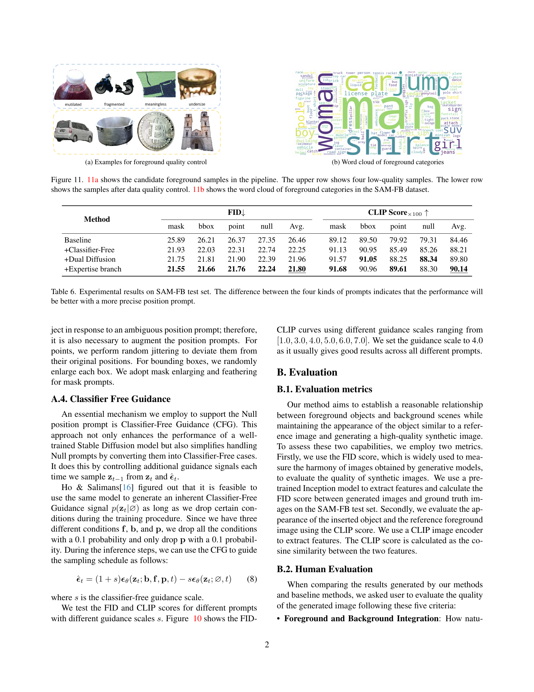

 


 2412.14462 
 Jixuan He et el. 
 
 🤗 2024-12-20 
 



↗ arXiv


↗ Hugging Face


↗ Papers with Code


### TL;DR



본 논문은 이미지 합성 분야의 난제인 **전경 개체와 배경 간의 자연스러운 조화**를 해결하기 위해 **Affordance 개념**을 도입했습니다. 기존 방법들은 제한적인 데이터와 단순한 위치 정보 처리로 인해 현실감 있는 합성에 어려움을 겪었지만, 이 논문에서는 **대규모 데이터셋(SAM-FB)을 구축**하고, **마스크 정보를 활용한 새로운 이중 확산 모델(MADD)**을 제안하여 이 문제를 해결했습니다. 

MADD는 **RGB 이미지와 마스크를 동시에 처리**하여 개체의 위치 및 형태를 정확하게 제어하고, **점, 경계 상자, 마스크 등 다양한 위치 정보**를 효과적으로 활용합니다.  실험 결과, MADD는 기존 방법들을 능가하는 성능을 보였으며, **다양한 실제 이미지에 대한 우수한 일반화 능력**을 입증했습니다. 이는 향후 이미지 편집 및 합성 기술의 발전에 크게 기여할 것으로 기대됩니다.



#### Key Takeaways


 새로운 Affordance-Aware Object Insertion 작업 정의 및 SAM-FB 데이터셋 제작 



 마스크 정보를 활용한 이중 확산 모델(MADD)을 이용한 효율적이고 현실적인 이미지 합성 



 다양한 위치 정보(점, 경계 상자, 마스크 등)에 대한 강건한 성능 및 실제 이미지에 대한 우수한 일반화 성능 


#### Why does it matter?
본 논문은 **복잡한 배경과 전경 개체 간의 상호 작용을 고려하여 개체를 자연스럽게 합성하는 새로운 방법**을 제시합니다.  이는 **현실적인 이미지 편집 및 합성 기술의 발전에 크게 기여**하며, **다양한 응용 분야에 활용될 수 있는 잠재력**을 가지고 있습니다. 특히, **다양한 위치 정보(점, 경계 상자, 마스크 등)를 효율적으로 처리하는 능력**은 사용자의 편의성을 높이고, **보다 직관적인 이미지 편집을 가능하게 합니다.** 이러한 연구는 앞으로 **더욱 발전된 이미지 합성 기술** 개발 및 **다양한 시각적 작업 자동화**에 중요한 역할을 할 것으로 예상됩니다.

------
#### Visual Insights

> 🔼 그림 2는 SAM-FB 데이터셋 구성 과정을 보여줍니다.  먼저, SA-1B 데이터셋의 이미지에서 SAM을 이용해 전경 객체의 마스크를 생성합니다. 그런 다음, 마스크 내부의 객체를 잘라내어 전경 이미지로 사용하고, 남은 배경 부분은 LAMA를 이용해 빈틈없이 채워 배경 이미지를 만듭니다.  원본 이미지는 정답(ground truth)으로 사용됩니다. 데이터셋의 품질을 높이기 위해 자동화된 주석 생성 파이프라인과 데이터 품질 관리 단계를 거칩니다.  최종적으로 3백만 개 이상의 고품질 (f, b, p, x) 형태의 훈련 샘플을 얻게 되는데, 여기서 f는 전경 이미지, b는 배경 이미지, p는 전경 객체의 위치 정보(다양한 형태의 프롬프트 포함), 그리고 x는 정답 이미지를 나타냅니다.
> 

> 
read the caption

> Figure 1: Pipeline of constructing the SAM-FB dataset. The background is inpainted and high-quality foreground objects are preserved through a data quality control stage.
> 


| Dataset | Sample No. | Category No. |
|---|---|---|
| DreamEditBench | 440 | 22 |
| MureCom | 640 | 32 |
| **SAM-FB (Ours)** | 3,160,403 | 3,439 |

> 🔼 표 1은 제안된 SAM-FB 데이터셋과 기존의 DreamEditBench, MureCom 데이터셋을 비교 분석한 표입니다.  SAM-FB 데이터셋은 기존 데이터셋들보다 훨씬 많은 훈련 샘플과 객체 카테고리를 포함하고 있음을 보여줍니다.  구체적으로, 샘플 수와 객체 카테고리 수를 비교하여 SAM-FB 데이터셋의 규모와 다양성을 강조합니다.
> 

> 
read the caption

> Table 1: Dataset comparison. Our dataset contains significantly more training samples and object categories.
> 

### In-depth insights

#### Affordance Modeling
본 논문에서 제시된 "Affordance Modeling" 개념은 **물체와 배경 간의 상호작용 및 물리적 법칙 준수**에 중점을 둡니다. 단순히 물체를 배경에 삽입하는 것이 아니라, **배경의 의미론적 풍부함**을 고려하여 물체의 위치, 크기, 방향 등을 조정하는 **지능적인 합성** 과정을 의미합니다.  이는 기존의 단순 합성 방식을 넘어 **물체의 기능성(affordance)을 고려한 현실적인 이미지 생성**을 목표로 합니다.  **마스크 기반 이중 확산 모델(MADD)**을 통해 RGB 이미지와 삽입 마스크를 동시에 디노이징함으로써, **물체의 시각적 일관성과 배경과의 조화**를 유지하는 데 기여합니다.  결과적으로, 사용자의 다양한 입력 프롬프트 (점, 바운딩 박스, 마스크 등)에 유연하게 대응하며, **자연스럽고 현실적인 물체 삽입 결과**를 얻을 수 있음을 시사합니다.  **데이터셋(SAM-FB)**의 풍부한 데이터 또한 모델의 일반화 능력 향상에 중요한 역할을 수행합니다.

#### Dual Diffusion
본 논문에서 제시된 'Dual Diffusion'은 **이미지와 마스크를 동시에 디노이징(denoising)하는 듀얼 스트림 아키텍처**를 기반으로 합니다. 이는 단순히 이미지 합성만을 목표로 하는 기존 방법들과는 달리, **삽입 대상 객체의 적절한 위치와 크기를 결정하는 데 중요한 역할**을 합니다.  **마스크를 명시적으로 모델링함으로써** 객체의 적절한 배치를 위한 공간적 제약 조건을 효과적으로 반영하고, 배경과의 시맨틱 일관성을 유지하는 데 도움이 됩니다. 이를 통해, **다양한 위치 프롬프트(점, 바운딩 박스, 마스크, 혹은 프롬프트 없이)**에도 안정적이고 현실적인 객체 삽입 결과를 얻을 수 있습니다.  **듀얼 스트림 아키텍처는 RGB 이미지와 마스크의 상호 의존성을 고려**, 상호 보완적인 정보 처리를 통해 더욱 정확하고 자연스러운 결과를 생성하는 데 기여합니다. 이러한 방식은 단순한 이미지 합성을 넘어, **포지셔닝, 뷰, 사이즈 등 다양한 측면에서 객체와 배경의 상호작용(Affordance)을 고려한 실제 이미지 편집 작업에 더욱 근접**하는 것을 보여줍니다.

#### SAM-FB Dataset
본 논문에서 제시된 SAM-FB 데이터셋은 **신뢰할 수 있는 대규모의 affordance-aware object insertion 학습 데이터**를 제공하는 데 중점을 둡니다.  기존 데이터셋의 한계를 극복하기 위해 **SA-1B 데이터셋을 기반으로 3백만 개 이상의 고품질 샘플**을 구축하여 다양한 객체 카테고리와 다양한 위치 프롬프트를 포함합니다.  **자동화된 주석 파이프라인**과 엄격한 **데이터 품질 관리** 과정을 거쳐 데이터의 정확성과 신뢰성을 확보하고 있습니다.  SAM-FB는 포인트, 바운딩 박스, 마스크 등 다양한 위치 정보를 포함하며, **null 프롬프트**를 통해 모델의 자율적인 객체 배치 능력을 평가할 수 있다는 점에서도 중요한 의미를 지닙니다.  결과적으로, SAM-FB는 affordance-aware object insertion 모델의 성능 향상과 일반화 능력 향상에 크게 기여할 것으로 예상되며, **향후 연구에 있어 중요한 기준 데이터셋**으로 자리매김할 것으로 기대됩니다.

#### Position Prompts
본 논문에서 'Position Prompts'는 객체 삽입 작업에서 **다양한 위치 정보를 모델에 제공하는 방법**을 의미합니다.  단순한 좌표값(point)부터 바운딩 박스(bounding box), 심지어는 객체의 마스크(mask) 정보나 아무런 정보가 없는 null prompt까지 다양한 형태의 위치 정보를 처리할 수 있는 능력을 보여줍니다. 이는 사용자에게 **직관적이고 유연한 객체 조작 방식**을 제공하며, **모델의 일반화 능력**을 향상시키는 데 중요한 역할을 합니다.  특히, null prompt를 처리하는 능력은 **모델이 배경과 객체 간의 상호작용 및 적절한 위치를 스스로 판단**할 수 있음을 시사하며, **고도의 affordance 이해 능력**을 보여주는 중요한 지표가 됩니다.  결론적으로, Position Prompts는 단순한 객체 배치를 넘어, **affordance-aware object insertion을 가능하게 하는 핵심 요소**임을 보여줍니다.

#### Generalization Limits
본 논문에서 제시된 어포던스 인식 객체 삽입 모델의 일반화 한계는 **데이터셋의 편향성**과 **모델 구조의 제약** 두 가지 측면에서 고찰될 수 있습니다.  **SAM-FB 데이터셋은 다양한 객체와 배경을 포함하고 있지만, 특정 영역이나 스타일의 과대표가 존재할 가능성**이 있습니다. 이러한 데이터 편향은 특정 유형의 객체-배경 조합에 대해서는 우수한 성능을 보이지만, 훈련 데이터에 없는 새로운 조합에는 일반화 성능이 저하되는 결과를 초래할 수 있습니다.  또한, **마스크 기반 이중 확산 모델은 복잡한 객체-배경 상호작용을 완벽히 포착하지 못할 수도 있습니다.**  **모델의 구조적 제한은 다양한 시각적 특징이나 상황을 충분히 고려하지 못하는 점**에서 한계를 보입니다.  따라서, 더욱 **다양하고 균형 잡힌 데이터셋**을 구축하고, **모델의 표현력을 높이는 새로운 구조**를 연구하는 것이 향후 연구 방향이 될 것입니다. 이를 통해 보다 견고하고 일반화된 어포던스 인식 객체 삽입 모델을 개발할 수 있을 것입니다.

### More visual insights

More on figures

> 🔼 이 그림은 논문의 4장(방법론)에 있는 그림 3으로, 제안된 MADD(Mask-Aware Dual Diffusion) 모델의 구조를 보여줍니다.  MADD는 배경 이미지와 전경 물체를 각각 VAE와 DINOv2 인코더를 사용하여 인코딩하고, 위치 정보(점, 경계 상자, 마스크 또는 null)를 통합된 방법으로 처리합니다. 처리된 위치 정보는 잠재 마스크  𝐦𝐭 와 결합됩니다.  잠재 마스크  𝐦𝐭 와 잠재 이미지  𝐳𝐭 는 이중 분기 구조를 통해 동시에 잡음 제거되어 RGB 이미지  𝐳 와 객체 마스크  𝐦 가 생성됩니다.  크로스 어텐션 메커니즘을 통해 DINOv2 인코더에서 생성된 전경 객체의 특징이 안내 신호 역할을 합니다. 즉, 배경과 전경의 상호 작용을 고려하여 보다 자연스럽고 현실적인 이미지 합성을 가능하게 하는 모델 구조입니다.
> 

> 
read the caption

> Figure 2: The framework of MADD. Foreground objects are encoded using a DINOv2 encoder, serving as the guidance signal through the cross-attention mechanism. The position prompt encoder unifies different types of position prompts, which are then concatenated with the latent mask 𝐦𝐭subscript𝐦𝐭\mathbf{m_{t}}bold_m start_POSTSUBSCRIPT bold_t end_POSTSUBSCRIPT. The background is encoded using a VAE encoder and then concatenated with the latent image 𝐳𝐭subscript𝐳𝐭\mathbf{z_{t}}bold_z start_POSTSUBSCRIPT bold_t end_POSTSUBSCRIPT. We use a dual branch structure to denoise RGB image 𝐳𝐳\mathbf{z}bold_z and object mask 𝐦𝐦\mathbf{m}bold_m simultaneously.
> 

> 🔼 그림 3은 제시된 프롬프트(점, 바운딩 박스, 마스크, 널) 유형에 따라 각 행이 하나의 프롬프트에 해당하는 SAM-FB 테스트 세트에서 MADD의 정성적 결과를 보여줍니다. MADD는 RGB 이미지와 객체 마스크를 동시에 예측합니다. 각 행은 다양한 유형의 위치 프롬프트(점, 바운딩 박스, 마스크 또는 널 프롬프트)를 사용하여 객체를 배경에 배치하는 모델의 능력을 보여줍니다.  다양한 프롬프트 유형에도 불구하고 모델은 배경과의 시맨틱 일관성을 유지하면서 개체를 자연스럽게 통합합니다.
> 

> 
read the caption

> Figure 3: Qualitative results of MADD on the SAM-FB test set. Each row corresponds to one type of prompt, i.e., point, bounding box, mask, and null, respectively. Our MADD simultaneously predicts the RGB image and the object mask.
> 

> 🔼 그림 5(a)는 모호한 프롬프트(점)를 사용하여 실제 이미지에서 실험한 결과를 보여줍니다.  모델은 배경과의 적절한 조화를 위해 전경 물체의 위치를 조정합니다.  자전거 앞에 있는 사람의 위치를 조정하여 공중에 뜨지 않고 바닥에 발을 딛고 서 있게 합니다. 모델이 전경 물체의 위치를 자연스럽게 조정하여 배경과의 시각적 일관성을 유지하는 능력을 보여줍니다.
> 

> 
read the caption

> (a) Location Adjustment
> 

> 🔼 그림은 모델이 전경 물체의 방향을 조정하여 배경 장면과의 적절한 어포던스 관계를 달성하는 방법을 보여줍니다.  도로에 자동차를 삽입하는 작업에서 모델은 차량의 방향을 도로의 방향에 맞춰 조정하여 자연스러운 장면을 생성합니다. 이는 단순히 물체를 배치하는 것이 아니라, 배경과의 상호작용을 고려하여 물체의 방향까지 조정함으로써 시각적 일관성을 유지하는 모델의 능력을 보여줍니다.
> 

> 
read the caption

> (b) View Adjustment
> 

> 🔼 이 그림은 배경 이미지와 전경 물체의 크기 불일치 문제를 해결하기 위해 모델이 전경 물체의 크기를 조정하는 과정을 보여줍니다.  배경 이미지의 크기와 어울리도록 전경 물체(커피콩)의 크기를 조정하여 자연스럽게 배치하는 모습을 보여주는 예시입니다.  단순히 물체를 삽입하는 것이 아니라, 배경과의 조화를 고려하여 크기를 조절하는 '적응력'을 강조하고 있습니다.
> 

> 
read the caption

> (c) Size Adjustment
> 

> 🔼 그림 5(d)는 사용자가 위치 프롬프트를 제공하지 않은 경우 모델이 자동으로 적절한 위치를 찾아 개체를 삽입하는 모습을 보여줍니다.  모델은 배경과 개체 간의 의미적 관계를 이해하고 물리적 법칙을 준수하는 위치를 선택하여 자연스러운 합성 이미지를 생성합니다. 이는 본 논문에서 제시하는 어포던스 인식 개체 삽입의 핵심적인 특징을 잘 보여주는 예시입니다.
> 

> 
read the caption

> (d) Automatic Localization
> 

> 🔼 그림 4는 모호한 프롬프트(점과 공백)를 사용하여 실제 이미지에 대한 실험 결과를 보여줍니다. 점 프롬프트를 제공했을 때, 4(a), 4(b), 4(c)는 모델이 전경 객체의 속성을 조정하여 적절한 위치에 객체를 삽입하는 것을 보여줍니다. 4(d)는 모델이 객체를 삽입할 적절한 위치를 찾을 수 있음을 보여줍니다.  즉, 모델이 제한적인 정보만으로도 객체와 배경의 상호작용을 고려하여 자연스럽게 객체를 배치할 수 있음을 시각적으로 보여주는 그림입니다.
> 

> 
read the caption

> Figure 4: We test ambiguous prompts (points and blank) on the in-the-wild images. When providing the prompt of point, 4(a), 4(b), and 4(c) show that our model can adjust properties of foreground objects to achieve the affordance insertion.4(d) illustrates that the model could find the suitable position to insert the object.
> 

> 🔼 그림 5는 MADD 모델이 포인트나 빈(null) 프롬프트와 같은 모호한 위치 지정 프롬프트에 대해 여러 가지 실행 가능한 솔루션을 제공할 수 있음을 보여줍니다.  모호한 프롬프트에도 불구하고 모델은 배경과의 의미론적 일관성을 유지하면서 적절한 위치와 크기로 개체를 배치하는 다양한 방법을 생성합니다. 이는 모델이 모호한 입력에도 불구하고 적절한 배치를 찾아낼 수 있는 능력을 보여주는 예시입니다.
> 

> 
read the caption

> Figure 5: MADD can give different feasible solutions for ambiguous prompts such as point and blank.
> 

> 🔼 이 그림은 다섯 가지 이미지 합성 방법(Ours, GLIGEN, SDXL, PBE, ObjectStitch)의 성능을 비교 분석한 결과를 보여줍니다.  각 방법에 대해 사용자가 평가한 순위 분포를 나타내는 막대 그래프입니다.  세로축은 각 순위(1~5위)에 해당하는 비율을 나타내고, 가로축은 다섯 가지 방법을 나타냅니다.  그림 (a)는 제시된 다섯 가지 방법 중, 'Ours' 방법이 1위를 차지한 비율이 가장 높고 5위를 차지한 비율이 가장 낮음을 보여줍니다. 이는 'Ours' 방법이 다른 방법들보다 이미지 합성 품질 측면에서 우수함을 시각적으로 보여주는 결과입니다.
> 

> 
read the caption

> (a) Rank distribution for different methods. Our method has the highest proportion of rank 1 and the least proportion of rank 5.
> 

> 🔼 그림 (b)는 다섯 가지 평가 기준(배경 및 전경 통합, 전경 선명도 및 세부 사항, 참조와의 전경 일관성, 전경의 조명 및 그림자, 색상 일관성) 각각에 대해 각 모델이 1위를 차지한 비율을 보여주는 파이 차트입니다. 각 파이 차트는 특정 평가 기준에 대해 각 모델이 1위를 달성한 횟수의 비율을 나타냅니다. 제시된 결과에 따르면, 본 논문에서 제안된 방법이 모든 평가 기준에서 가장 우수한 성능을 보임을 알 수 있습니다.
> 

> 
read the caption

> (b) Rank-1 distribution for each criterion. Each pie chart represents the proportion of times each model achieved Rank-1 for a specific evaluation criterion. Our method dominates every metric.
> 

> 🔼 그림 7은 다양한 기준에 따라 비교한 10개 그룹의 이미지에 대한 인간 평가 결과를 보여줍니다.  MADD 모델은 전반적인 순위와 각 기준에서 SDXL [39], GLI-GEN [29], ObjectStitch [42], PBE [47] 모델보다 성능이 뛰어남을 보여줍니다.  각 그래프는 다른 모델들과 비교하여 MADD 모델의 성능 우수성을 시각적으로 보여주는 다양한 평가 기준(전경과 배경 통합, 전경 선명도와 세부 묘사, 참조 이미지와의 전경 일관성, 전경의 조명 및 그림자, 색상 일관성)에 대한 순위 분포를 나타냅니다.
> 

> 
read the caption

> Figure 6: Human evaluation results on in-the-wild Images. We compared 10 groups of images according to different criteria. Our MADD model outperforms SDXL [39], GLI-GEN [29], ObjectStitch [42] and PBE [47] on overall ranking and each criteria.
> 

> 🔼 그림 7은 MADD 모델이 고해상도 이미지에서도 효과적으로 작동하여 더욱 선명한 가장자리, 깨끗한 반사, 그리고 향상된 질감 디테일을 생성할 수 있음을 보여줍니다.  낮은 해상도로 학습된 모델이지만, 고해상도 이미지에도 적용 가능하며,  결과물의 화질 개선을 확인할 수 있습니다.  이는 MADD 모델의 일반화 성능을 강조합니다.
> 

> 
read the caption

> Figure 7: MADD can work on images of higher resolution, generating sharper edges, clearer reflections, and improved texture details.
> 

> 🔼 그림 8은 사용자가 객체의 위치를 지정하지 않고(null prompts) 다양한 배경 이미지에 전경 객체를 삽입한 결과를 보여줍니다. 모델은 배경과 전경 객체 간의 상호작용을 고려하여 객체가 자연스럽게 배치될 수 있는 위치와 방향, 크기를 자동으로 결정합니다. 이는 모델이 단순히 객체를 배경에 붙이는 것이 아니라, 물리적 및 시각적 일관성을 유지하면서 객체를 배경에 적절히 통합할 수 있음을 보여줍니다. 예시 이미지들은 모델의 일반화 능력과 다양한 배경, 객체에 대한 적응력을 보여줍니다.
> 

> 
read the caption

> Figure 8: More in-the-wild examples with null prompts. The model can generate an affordance-feasible solution to insert the foreground objects according to the background scene.
> 

> 🔼 그림 10은 다양한 가이드 스케일 [1.0, 3.0, 4.0, 5.0, 6.0, 7.0]을 사용하여 128x128 해상도에서 FID-CLIP 점수 곡선을 보여줍니다. 이 그래프는 서로 다른 가이드 스케일이 FID(Fréchet Inception Distance) 점수와 CLIP(Contrastive Language–Image Pre-training) 점수에 미치는 영향을 보여줍니다. FID 점수는 생성된 이미지의 품질을 평가하는 지표이고, CLIP 점수는 생성된 이미지와 참조 이미지 사이의 의미적 유사성을 측정하는 지표입니다.  가이드 스케일을 조정함으로써, 모델이 이미지 합성 작업에서 얼마나 잘 조정될 수 있는지 확인할 수 있습니다.  낮은 FID 점수와 높은 CLIP 점수는 더 나은 이미지 품질과 더 높은 의미적 유사성을 나타냅니다.
> 

> 
read the caption

> Figure 9: FID-CLIP score curve on 128×128128128128\times 128128 × 128 resolution with different guidance scale [1.0,3.0,4.0,5.0,6.0,7.0]1.03.04.05.06.07.0[1.0,3.0,4.0,5.0,6.0,7.0][ 1.0 , 3.0 , 4.0 , 5.0 , 6.0 , 7.0 ].
> 

> 🔼 그림은 데이터셋의 전처리 과정에서 배경 이미지와 전경 객체 마스크에 적용된 품질 관리 필터링의 예시를 보여줍니다. 상단 행은 품질이 낮은 전경 객체 마스크의 예시이며, 하단 행은 품질 관리 필터링 후 남은 고품질 마스크를 보여줍니다. 이를 통해 논문에서 사용된 SAM-FB 데이터셋의 품질 향상 과정을 시각적으로 보여주고 있습니다.
> 

> 
read the caption

> (a) Examples for foreground quality control
> 

> 🔼 그림 (b)는 SAM-FB 데이터셋에 포함된 전경 개체의 범주들을 워드 클라우드로 시각화한 것입니다. 워드 클라우드에서 단어의 크기는 해당 범주에 속하는 이미지의 개수를 나타내며,  큰 단어일수록 더 많은 이미지가 해당 범주에 포함되어 있음을 의미합니다. 이를 통해 SAM-FB 데이터셋이 다양한 종류의 물체들을 포함하고 있음을 보여줍니다.
> 

> 
read the caption

> (b) Word cloud of foreground categories
> 

> 🔼 그림 10은 SAM-FB 데이터셋 생성 과정을 보여줍니다. (a)는 데이터셋 생성 파이프라인에서 후보가 되는 전경 객체 마스크들을 보여줍니다. 위쪽 행은 품질이 낮은 네 개의 샘플을, 아래쪽 행은 품질 관리 후의 샘플들을 보여줍니다. (b)는 SAM-FB 데이터셋에 포함된 전경 객체 카테고리들의 워드 클라우드를 보여줍니다. 워드 클라우드는 데이터셋에 다양한 종류의 객체들이 포함되어 있음을 시각적으로 보여줍니다.
> 

> 
read the caption

> Figure 10: 10(a) shows the candidate foreground samples in the pipeline. The upper row shows four low-quality samples. The lower row shows the samples after data quality control. 10(b) shows the word cloud of foreground categories in the SAM-FB dataset.
> 

> 🔼 그림 12는 세부적인 묘사가 포함된 물체의 예시입니다. 제시된 그림에서 볼 수 있듯이, 본 논문에서 제안된 모델은 SD[39], GLI-GEN[29], PBE[47] 모델과 비교했을 때, 세부적인 묘사가 있더라도 물체의 외형을 더 잘 유지합니다. 첫 번째 줄은 이미지의 질감을 유지하는 능력을, 두 번째 줄은 텍스트 질감을 유지하는 능력을 보여줍니다.
> 

> 
read the caption

> Figure 11: Example of objects with details. Our model could keep the appearance better even with some details compared with SD [39], GLI-GEN [29] and PBE [47]. The first row demonstrates the ability to keep some image texture, and the second row illustrates the ability to keep text texture.
> 

More on tables


| Method | FID ↓ (mask) | FID ↓ (bbox) | CLIP Score ↑ (mask) | CLIP Score ↑ (bbox) | MSE ↓ (mask) | MSE ↓ (bbox) |
|---|---|---|---|---|---|---|
|  [39] | 15.41 | 15.47 | 0.7079 | 0.8058 | 860 | 883 |
|  [47] | 33.68 | 24.59 | – | 0.7664 | 2373 | 1615 |
|  [29] | – | 14.21 | – | 0.7944 | – | 830 |
|  [24] | 14.49 | 14.42 | 0.8014 | 0.8637 | 857 | 845 |
| **Ours** | **13.53** | **13.60** | **0.8727** | **0.8658** | **760** | **775** |
> 🔼 표 2는 SAM-FB 테스트 세트에서 제안된 방법(MADD)과 기존 방법(Stable Diffusion, PBE, GLI-GEN, Human Affordance)의 성능을 비교한 표입니다. FID(Fréchet Inception Distance) 점수와 CLIP(Contrastive Language–Image Pre-training) 점수, MSE(Mean Squared Error)를 사용하여 이미지 생성 품질과 의미적 유사성을 평가하였습니다. FID 점수는 낮을수록 좋고, CLIP 점수는 높을수록 좋습니다. MSE 점수 또한 낮을수록 좋습니다. 각 지표에 대한 결과를 통해 MADD 모델의 우수성을 보여줍니다.
> 

> 
read the caption

> Table 2: Method comparisons on the SAM-FB test set.     Stable Diffusion,     PBE,    GLIGEN,     Human Affordance.
> 


| Prompt | Mask | Bbox | Point | Null | Avg. |
|---|---|---|---|---|---| 
| FID | **13.53** | 13.60 | 13.66 | 13.96 | 13.69 |
| MSE | **760** | 775 | 772 | 860 | 792 |
| CLIP Score | **0.8727** | 0.8658 | 0.8567 | 0.8034 | 0.8415 |
> 🔼 본 표는 SAM-FB 테스트 세트에서 다양한 위치 프롬프트(포인트, 바운딩 박스, 마스크, 널)에 따른 모델 성능을 비교 분석한 결과입니다. FID(Fréchet Inception Distance) 점수와 CLIP(Contrastive Language–Image Pre-training) 점수, MSE(Mean Squared Error)를 통해 이미지 품질과 의미적 유사성을 정량적으로 평가하였습니다. 마스크 프롬프트가 가장 높은 성능을 보였으며, 이는 정확한 위치 정보 제공의 중요성을 시사합니다.
> 

> 
read the caption

> Table 3: Comparison of position prompts on the SAM-FB test set.
> 


| Method | FID () | CLIPx100 () |
|---|---|---|
| Baseline | 25.89 | 89.12 |
| + Classifier-Free | 21.93 | 91.13 |
| + Dual diffusion | 21.75 | 91.57 |
| + Expertise branch | **21.55** | **91.68** |
> 🔼 표 4는 마스크 프롬프트를 사용하여 128x128 해상도로 SAM-FB 테스트 세트에서 수행된 제거 연구 결과를 보여줍니다.  기준 모델에 여러 가지 요소(분류기 없는 안내, 이중 확산, 전문 분기)를 추가하여 성능 향상을 확인했습니다.  각 요소가 FID(Frèchet Inception Distance) 및 CLIP(Contrastive Language-Image Pre-training) 점수에 미치는 영향을 정량적으로 분석하여 모델 성능 개선에 대한 통찰력을 제공합니다.
> 

> 
read the caption

> Table 4: Ablation study on the SAM-FB test set with 128×128128128128\times 128128 × 128 resolution using mask prompts.
> 


| Filter condition | Threshold | Reserved Percentage |
|---|---|---|
| None (Initial) | – | 100% |
| Relative Size | [0.1, 0.75] | 7.10% |
| Aspect Ratio | ≤ 3 | 6.88% |
| Components Num. | ≤ 4 | 6.71% |
| Color Std. | ≥ 45 | 1.69% |
| ResNet50 Score | ≥ 0.7 | 0.25% |
> 🔼 표 5는 전경 객체의 품질 관리 필터에 대한 예비 비율을 보여줍니다. 규칙 기반 및 학습 기반 조건을 결합하여 고품질 전경 객체만을 선택적으로 유지합니다.  즉, 다양한 필터링 기준(크기, 종횡비, 구성 요소 수, 색상 표준 편차, ResNet50 점수)을 적용하여 품질이 낮은 전경 객체를 제거하고, 높은 품질의 객체만을 남겨 데이터셋의 품질을 향상시킵니다. 이를 통해 최종 데이터셋에 포함되는 마스크의 수를 크게 줄여(0.25%) 학습의 효율성을 높이고, 모델 성능을 개선하는 데 기여합니다.
> 

> 
read the caption

> Table 5: Reserved percentage for foreground quality control filters. We combine different rule-based and learning-based conditions. Through this process, foreground objects with high quality are reserved.
> 


| Method | mask | bbox | point | null | Avg. |  | mask | bbox | point | null | Avg. |
|---|---|---|---|---|---|---|---|---|---|---|---| 
| **FID↓** |  |  |  |  |  | | **CLIP Score×100↑** |  |  |  |  |  |
| Baseline | 25.89 | 26.21 | 26.37 | 27.35 | 26.46 |  | 89.12 | 89.50 | 79.92 | 79.31 | 84.46 |
| +Classifier-Free | 21.93 | 22.03 | 22.31 | 22.74 | 22.25 |  | 91.13 | 90.95 | 85.49 | 85.26 | 88.21 |
| +Dual Diffusion | 21.75 | 21.81 | 21.90 | 22.39 | 21.96 |  | 91.57 | **91.05** | 88.25 | **88.34** | 89.80 |
| +Expertise branch | **21.55** | **21.66** | **21.76** | **22.24** | **21.80** |  | **91.68** | 90.96 | **89.61** | 88.30 | **90.14** |
> 🔼 표 6은 SAM-FB 테스트 세트에서 수행된 실험 결과를 보여줍니다.  포인트, 바운딩 박스, 마스크, 널(null) 등 네 가지 유형의 프롬프트를 사용하여 모델 성능을 비교 분석했으며, 프롬프트의 정확도가 높을수록 모델 성능이 향상됨을 보여줍니다.  즉, 위치 정보가 명확한 마스크 프롬프트가 가장 좋은 성능을 나타내고, 위치 정보가 불명확한 널 프롬프트는 성능이 상대적으로 낮습니다. 이는 모델이 더 정확한 위치 정보를 제공받을수록 객체를 배경에 더 자연스럽게 삽입할 수 있음을 시사합니다.
> 

> 
read the caption

> Table 6: Experimental results on SAM-FB test set. The difference between the four kinds of prompts indicates that the performance will be better with a more precise position prompt.
> 

### Full paper



