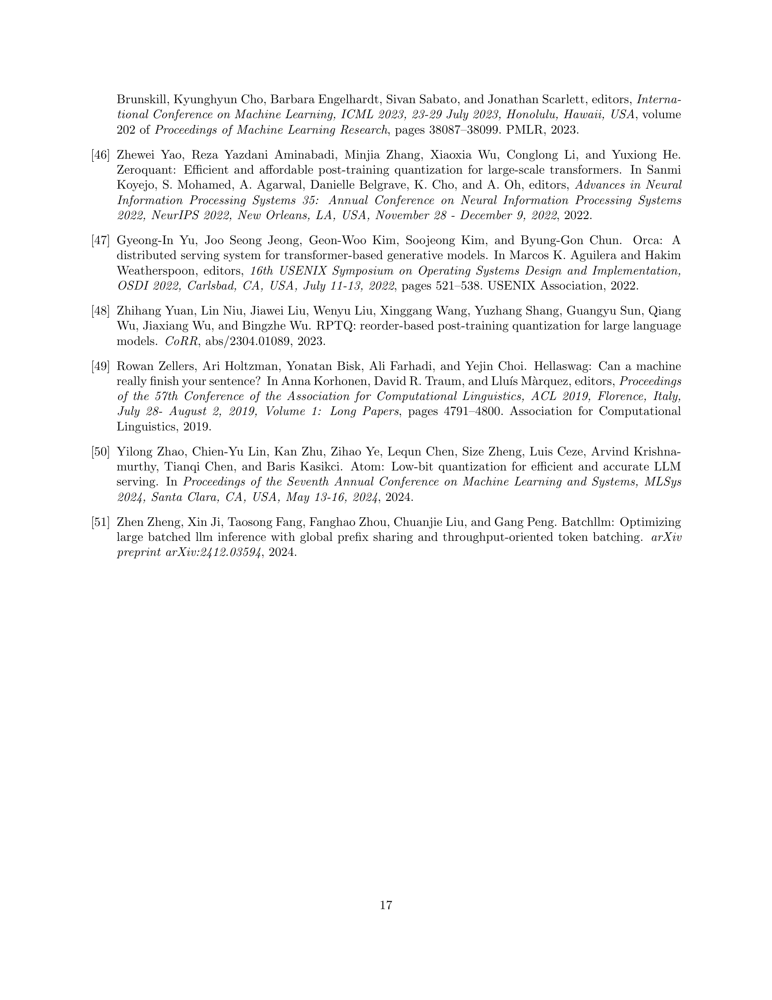

 


 2412.14590 
 Zhen Zheng et el. 
 
 🤗 2024-12-23 
 



↗ arXiv


↗ Hugging Face


↗ Papers with Code


### TL;DR



대규모 언어 모델(LLM)은 강력한 성능을 제공하지만, 메모리 소비 및 계산 비용이 많다는 단점이 있습니다. 이를 해결하기 위해 양자화 기술이 사용되지만, 기존 양자화 방법은 정확도 저하 또는 시스템 비효율성 문제를 안고 있습니다.  본 논문에서는 이러한 문제점을 해결하고자 MixLLM이라는 새로운 양자화 방법을 제안합니다.

MixLLM은 **출력 특징 간의 전역 혼합 정밀도 양자화**를 통해 **중요도가 높은 특징에는 높은 비트 너비를, 덜 중요한 특징에는 낮은 비트 너비를 할당**하는 전략을 사용합니다.  또한, **두 단계 양자화 및 GPU 커널 최적화**를 통해 시스템 효율성을 높입니다. 실험 결과, MixLLM은 기존 최첨단 방법보다 정확도를 높이고 시스템 효율성을 향상시키는 것을 보였습니다.



#### Key Takeaways


 출력 특징 간의 전역 혼합 정밀도 양자화를 통해 LLM의 메모리 소비량을 줄이면서 정확도를 높임 



 알고리즘-시스템 공동 설계를 통해 높은 정확도와 시스템 효율성을 달성하는 양자화 설정의 최적 지점을 제시 



 두 단계 양자화 및 GPU 커널 최적화를 통해 양자화 오버헤드를 줄이고 시스템 효율성을 크게 향상 


#### Why does it matter?
본 논문은 **LLM의 효율적인 양자화 및 시스템 설계**에 대한 새로운 방법론을 제시하여, 연구자들이 더 작고 빠른 LLM을 개발하고 배포하는 데 크게 기여할 수 있습니다. 특히, **다양한 비트 너비의 혼합 정밀도 양자화** 및 **GPU 커널 최적화**를 통해 정확도와 시스템 효율성을 동시에 향상시킨 점은 주목할 만합니다. 이는 향후 LLM 연구의 발전 방향을 제시하고, 새로운 연구 분야를 개척할 수 있는 잠재력을 가지고 있습니다. 더 나아가 **시스템 효율성과 정확도 사이의 균형을 맞추는 최적의 양자화 설정**을 찾는 데 초점을 맞추어 실제 환경에서의 LLM 배포에 대한 중요한 통찰력을 제공합니다.

------
#### Visual Insights

> 🔼 그림 1은 혼합 정밀도를 사용하여 출력 특징 간의 양자화와 커널 실행을 보여줍니다.  낮은 중요도의 출력 특징에는 4비트 양자화를, 높은 중요도의 출력 특징에는 8비트 양자화를 사용하여 모델의 정확도를 높이고 메모리 소비를 줄이는 방법을 나타냅니다.  선형 가중치는 4비트 또는 8비트로 양자화되고, 활성화는 8비트로 양자화됩니다.  두 개의 MatMul 연산이 병렬로 수행되고, 융합된 산포 연산을 통해 최종 출력이 생성됩니다.  이 그림은 MixLLM의 핵심적인 양자화 전략을 시각적으로 보여줍니다.
> 

> 
read the caption

> Figure 1: Illustration of the quantization with mixed-precision between output features and kernel execution.
> 


| Model | Size | Llama 3.1/3.2 1B | Llama 3.1/3.2 8B | Llama 3.1/3.2 70B | Qwen2.5 0.5B | Qwen2.5 1.5B | Qwen2.5 7B | Qwen2.5 32B | Mistral 7B v0.3 |
|---|---|---|---|---|---|---|---|---|
| baselines |  | 9.75/12.72 | 6.24/8.95 | 2.81/6.68 | 13.07/17.55 | 9.26/13.11 | 6.85/10.44 | 5.02/8.95 | 5.32/7.84 |
| float16 |  | 9.75/12.72 | 6.24/8.95 | 2.81/6.68 | 13.07/17.55 | 9.26/13.11 | 6.85/10.44 | 5.02/8.95 | 5.32/7.84 |
| W4A16 |  | 11.72/15.56 | 6.82/9.72 | 3.55/7.43 | 15.54/20.55 | 10.35/14.35 | 7.23/10.88 | 5.27/9.14 | 5.51/8.04 |
| RTN W5A16 |  | 10.15/13.25 | 6.40/9.15 | 3.16/9.52 | 13.61/18.17 | 9.52/13.38 | 6.95/10.53 | 5.09/8.99 | 5.38/7.91 |
| GPTQ W4A16 |  | 10.38/14.15 | 6.52/9.55 | Abn/Abn | 14.01/19.04 | 9.64/13.75 | 7.09/10.75 | 5.20/9.08 | 5.49/8.19 |
| AWQ W4A16 |  | 10.81/14.12 | 6.65/9.48 | 3.28/6.96 | 15.04/19.75 | 9.95/13.85 | 7.10/10.71 | 5.23/9.08 | 5.44/7.98 |
| SmoothQuant W8A8 |  | 9.89/12.91 | 6.34/9.08 | 2.92/6.77 | 13.84/18.40 | 9.63/13.49 | 7.17/10.85 | 5.12/9.04 | 5.35/7.88 |
| QoQ W4A8 |  | Abn/Abn | 6.64/9.49 | 3.49/7.07 | Abn/Abn | Abn/Abn | 7.39/11.06 | 5.55/9.31 | 5.44/7.98 |
| W4A4 |  | Abn/Abn | 8.34/11.95 | 6.16/9.91 | NA/NA | Abn/Abn | 8.15/12.05 | 6.26/9.98 | 5.83/8.50 |
| QuaRot W4A8 |  | Abn/Abn | 6.60/9.67 | 3.43/7.10 | NA/NA | Abn/Abn | 7.03/10.68 | 5.23/9.10 | 5.40/7.99 |
| W4A8 (p0) |  | 10.36/14.09 | 6.54/9.62 | 3.30/7.24 | 14.43/19.61 | 9.66/13.79 | 7.03/10.75 | 5.21/9.08 | 5.42/8.02 |
| W4.4A8 (p10) |  | 10.05/13.51 | 6.42/9.33 | 3.02/6.83 | 13.42/18.13 | 9.44/13.43 | 6.92/10.57 | 5.12/9.01 | 5.36/7.93 |
| W4.8A8 (p20) |  | 9.95/13.25 | 6.37/9.22 | 2.97/6.79 | 13.32/17.99 | 9.40/13.35 | 6.90/10.53 | 5.09/9.00 | 5.35/7.90 |
| W6A8 (p50) |  | 9.85/12.98 | 6.30/9.09 | 2.86/6.73 | 13.21/17.78 | 9.33/13.25 | 6.88/10.49 | 5.05/8.98 | 5.33/7.87 |
| MixLLM W8A8 (p100) |  | 9.76/12.75 | 6.25/8.97 | 2.81/6.68 | 13.12/17.60 | 9.28/13.14 | 6.86/10.45 | 5.02/8.96 | 5.32/7.84 |

> 🔼 표 1은 다양한 크기의 언어 모델들에 대해, wikitext2와 c4 데이터셋에서 시퀀스 길이 2048을 사용하여 perplexity를 평가한 결과를 보여줍니다.  'NA'는 해당 방법이 지원하지 않는다는 것을 의미하며, 'Abn'은 값이 10의 5제곱보다 크다는 것을 의미합니다. MixLLM의 경우, 'pn'은 8비트 정밀도를 사용하는 비율을 나타냅니다 (예: p10은 10%의 피처에 8비트를 사용). 이 표는 여러 가지 양자화 방법들의 정확도를 비교 분석하는 데 사용됩니다.  다양한 모델 크기(1B, 8B, 70B 등)와 양자화 기법(GPTQ, AWQ, SmoothQuant 등)의 perplexity를 비교하여 각 기법의 성능을 보여줍니다.
> 

> 
read the caption

> Table 1: Perplexity evaluation (↓↓\downarrow↓) on wikitext2/c4 (gray for c4), sequence length 2048. NA means no support. Abn means the value is too large (>105absentsuperscript105>10^{5}> 10 start_POSTSUPERSCRIPT 5 end_POSTSUPERSCRIPT). For MixLLM, pn means n%percent𝑛n\%italic_n % 8-bit.
> 

### In-depth insights

#### Mixed-Precision Quant
본 논문에서 제안하는 혼합 정밀도 양자화(Mixed-Precision Quantization) 기법은 **모델의 출력 특징(output feature)에 따라 다른 비트 너비(bit-width)를 할당**하여 성능 저하 없이 메모리 소비를 줄이는 데 중점을 둡니다.  이는 모든 특징이 동일한 중요도를 갖는 것이 아니라는 통찰력에 기반합니다.  **전역적 중요도(global salience)** 분석을 통해 각 출력 특징의 중요도를 판별하고, 중요한 특징에는 더 높은 비트 너비를 할당하여 정확도를 유지하면서 나머지 특징에는 낮은 비트 너비를 적용하여 메모리 효율성을 높입니다.  **알고리즘과 시스템을 공동 설계(algorithm-system co-design)**하여 양자화 구성을 최적화하고 GPU 커널을 효율적으로 최적화함으로써 시스템 효율성 또한 극대화합니다.  **특히, 2단계 양자화(two-step dequantization)와 빠른 정수-부동소수점 변환(fast data type conversion)** 기법을 통해 int8 Tensor Core를 효율적으로 활용하고, 메모리 접근, 양자화 해제 및 행렬 곱셈(MatMul) 연산을 최대한 겹쳐 처리하는 소프트웨어 파이프라인을 설계합니다. 이러한 전략을 통해 최첨단의 정확도와 시스템 효율성을 달성합니다.

#### Global Salience ID
본 논문에서 제시된 'Global Salience ID'는 **전역적 중요도 식별**을 의미하며, 기존의 각 레이어 내에서의 국소적 중요도 분석과 달리, 모델 전체 출력에 대한 영향력을 기반으로 각 출력 특징(output feature)의 중요도를 평가하는 방식입니다. 이는 **각 출력 특징이 모델 최종 출력에 미치는 영향력이 레이어별로 다르다는 점**에 착안하여 고안되었습니다.  **단순히 각 레이어 내에서의 중요도만을 고려하는 것이 아니라, 최종 손실(loss)에 미치는 전역적 영향을 고려함으로써, 보다 정확하게 중요한 특징을 식별**할 수 있습니다.  이는 결과적으로, **메모리 소비를 줄이면서도 높은 정확도를 유지**하는 혼합 정밀도(mixed-precision) 양자화 전략을 수립하는 데 중요한 역할을 합니다.  즉, 전역적 중요도가 높은 특징에는 더 높은 비트 수를 할당하고, 낮은 특징에는 낮은 비트 수를 할당하여 효율성을 극대화하는 것입니다.  **본 논문의 핵심 아이디어 중 하나로, 효과적인 LLM 양자화를 위한 새로운 최적화 공간을 제시**하는 데 기여합니다.

#### Efficient Quant System
논문에서 제시된 효율적인 양자화 시스템은 **계산 효율성과 정확성 사이의 균형**을 맞추는 데 중점을 둡니다.  핵심은 두 단계 양자화를 통해 int8 텐서 코어를 효과적으로 활용하고, 빠른 정수-부동 소수점 변환을 사용하여 양자화 오버헤드를 줄이는 것입니다.  **소프트웨어 파이프라인 설계**를 통해 메모리 액세스, 양자화 및 MatMul 연산을 최대한 겹쳐 처리하여 시스템 효율성을 높입니다.  **글로벌 중요도 식별을 통한 혼합 정밀도 양자화**는 모델 정확도 저하 없이 메모리 소비를 줄이는 데 효과적임을 보여줍니다. 이는 각 출력 특징의 중요도를 전역적으로 평가하고, 중요한 특징에는 더 높은 비트 너비를 할당함으로써 구현됩니다.  **알고리즘과 시스템의 공동 설계**를 통해 정확도와 시스템 효율성을 모두 높이는 최적의 양자화 구성을 제시합니다.  결과적으로, 제안된 시스템은 기존 방법보다 우수한 정확도와 시스템 효율성을 달성합니다.

#### Accuracy-Efficiency Tradeoff
본 논문은 **정확도와 효율성 간의 절충(Accuracy-Efficiency Tradeoff)** 문제를 심도있게 다룹니다.  대규모 언어 모델(LLM)의 크기 축소를 위한 양자화 기법의 효과를 분석하며, 기존 방법들의 한계점으로 **정확도 저하 또는 시스템 비효율성**을 지적합니다.  **MixLLM**은 출력 특징 간의 글로벌 혼합 정밀도 양자화를 통해 이러한 문제를 해결하려는 시도로, 각 출력 특징의 중요도를 파악하여 비트 할당을 최적화합니다.  이는 계층 내부가 아닌 **전역적 관점**에서 중요도를 판단하여 정확도를 유지하면서 메모리 소비를 줄이는 전략입니다.  더불어, 시스템 효율 향상을 위해 **두 단계 양자화 해제 및 소프트웨어 파이프라인 최적화**를 제시합니다.  **결과적으로, MixLLM은 기존 SOTA 대비 적은 비트 증가만으로도 PPL 증가를 크게 감소시키고, 여러 모델에서 우수한 정확도 향상을 보입니다.**  이는 단순한 알고리즘 개선이 아닌, 알고리즘과 시스템 설계의 **공동 최적화**를 통해 달성한 성과로, 효율적인 LLM 양자화를 위한 중요한 방향을 제시합니다.

#### Future Quant Research
미래 양자화 연구는 **정확도와 효율성 간의 균형**을 더욱 개선하는 데 초점을 맞춰야 합니다.  **알고리즘-시스템 공동 설계**를 통해 양자화 구성을 최적화하고, **메모리 접근, 양자화 및 행렬 곱셈 연산의 중첩**을 최대한 활용하는 소프트웨어 파이프라인을 개발해야 합니다. 또한, **다양한 모델 아키텍처 및 크기에 대한 일반성**을 확보하는 것이 중요하며, 특정 모델에 국한되지 않고 폭넓게 적용 가능한 양자화 기술 개발이 필요합니다.  **출력 특징 간의 혼합 정밀도 양자화**와 같은 새로운 최적화 공간을 탐색하고, **전역적 중요도 식별**을 통해 효율적인 자원 할당을 가능하게 하는 연구가 중요합니다.  **비정렬 양자화의 효율성 향상** 및 **다양한 양자화 기법의 장점을 통합**하는 융합 연구 또한 미래 양자화 연구의 중요한 방향입니다. 마지막으로, **실제 서비스 환경**을 고려한 성능 평가 및 최적화 연구를 통해 실용적인 양자화 기술을 개발해야 합니다.  이는 단순한 정확도 개선을 넘어, 실제 배포 및 운영 환경에서의 성능을 고려한 **종합적인 접근 방식**을 필요로 합니다.

### More visual insights

More on figures

> 🔼 그림 2는 Llama 3.1 8B 모델의 각 선형 레이어 내에서 중요도가 높은 출력 특징(out feature)의 비율을 보여줍니다.  전역적으로 중요도가 높은 특징의 비율을 10%로 설정하고, 4비트로 양자화했을 때 최종 손실에 대한 각 특징의 기여도를 기준으로 계산했습니다. 각 디코더 레이어는 순서대로 q_proj, k_proj, v_proj, o_proj, gate_proj, up_proj, down_proj를 포함합니다.  즉, 그림은 모델의 각 레이어에서 최종 손실에 큰 영향을 미치는 출력 특징이 어느 정도의 비율을 차지하는지 시각적으로 보여주는 것입니다. 특정 레이어에서 중요도가 높은 출력 특징의 비율이 다른 레이어에 비해 현저히 높거나 낮은 것을 확인할 수 있습니다.
> 

> 
read the caption

> Figure 2: The percentage of high-salient out features within each linear layer of Llama 3.1 8B model according to each feature’s contribution to the final loss after quantizing to 4-bit, with 10% high-salient features globally. Each decoder layer contains q_proj, k_proj, v_proj, o_proj, gate_proj, up_proj, and down_proj in order.
> 

> 🔼 그림 3은 부동 소수점 값과 정수 값을 이진수 (010010110xx...x)로 표현하고, 각각 연속적인 범위 내에 있음을 보여줍니다.  이진수의 앞부분 9비트는 고정되어 있고, 나머지 23비트는 가변적입니다.  이 그림은 2단계 양자화 과정에서 8비트 Tensor Core를 효율적으로 사용하기 위해 정수 값을 부동 소수점 값으로 빠르게 변환하는 방법을 설명하기 위해 사용됩니다.  특히, 특정 범위 내에서는 정수 값과 부동 소수점 값이 같은 이진 표현을 갖는다는 점을 이용하여 빠른 변환을 수행합니다. 이는 추가적인 계산 오버헤드를 줄이고 성능을 향상시키는 데 기여합니다.
> 

> 
read the caption

> Figure 3: The float and integer value of binary (010010110xx...x), each within a consecutive range.
> 

> 🔼 그림 4는 그룹 단위로 W4A8/W8A8 양자화된 MatMul에 대한 GPU 커널 소프트웨어 파이프라인을 보여줍니다. 완벽한 중첩을 가정합니다. G2S는 전역 메모리에서 공유 메모리로 로드하는 것을 나타내고, S2R은 공유 메모리에서 레지스터로 로드하는 것을, MMA는 행렬 곱셈 누적을, I2F는 정수-부동 소수점 변환을, deq는 양자화 해제를, acc는 누적을 각각 의미합니다. 이 그림은 GPU에서 효율적인 양자화 연산을 위한 MixLLM의 시스템 설계를 자세히 보여주는 것으로, 메모리 접근, 양자화 해제, MatMul 연산의 중첩을 통해 성능을 최적화하는 방법을 보여줍니다.
> 

> 
read the caption

> Figure 4: The GPU kernel software pipeline of group-wise W4A8/W8A8 quantized MatMul. It assumes perfect overlapping. G2S: load global to shared memory; S2R: load shared memory to register; MMA: matrix multiply-accumulation; I2F: integer to float conversion; deq: dequantize; acc: accumulate.
> 

> 🔼 그림 5는 A100 GPU에서 두 가지 유형의 단일 선형 계층에 대한 Torch float16 기준선에 대한 속도 향상을 보여줍니다.  x축은 토큰 수를 나타내고 y축은 속도 향상 배수를 나타냅니다.  두 가지 유형의 선형 계층은 입력 특징이 4096개이고 출력 특징이 4096개인 경우와 출력 특징이 14336개인 경우입니다. 각 선형 계층의 성능을 다양한 비트 수(W4A8, W4.4A8, W8A8)로 측정하여 float16 기준선에 대한 성능 개선 정도를 보여줍니다. 이를 통해 다양한 토큰 수에 따른 MixLLM의 성능을 비교하고, 효율성을 분석할 수 있습니다.
> 

> 
read the caption

> Figure 5: The speedup of two types of single linear layers over torch float16 baseline on the A100 GPU.
> 

> 🔼 그림 6은 Llama 3.1 8B 모델에 대한 여러 가지 설정(weight-only quantization, activation quantization, mixed-precision quantization 등) 하에서의 wikitext2 perplexity 결과를 보여줍니다.  각 설정의 perplexity 값을 비교하여 어떤 설정이 가장 좋은 성능을 보이는지, 그리고 각 설정 요소들이 perplexity에 미치는 영향을 분석하는 데 사용됩니다. 기본 설정(Basic)부터 시작하여, activation quantization, 비대칭 가중치, 그룹화된 가중치, 그룹화된 활성화 함수, 10%의 8-bit 채널 추가, Fisher 정보 행렬 사용 여부, GPTQ 적용 여부 등 다양한 설정 변화에 따른 perplexity 변화를 보여줍니다.
> 

> 
read the caption

> Figure 6: The perplexity (wikitext2) of Llama 3.1 8B model with different configurations.
> 

More on tables


| LLaMA 2 | FP16 | SqueezeLLM | OminiQuant | AfineQuant | Atom | SpinQuant | MixLLM |
|---|---|---|---|---|---|---|---| 
| 7B | 5.47 | 5.57 | 5.58/14.26 | 5.58/12.69 | 6.03 | 5.7 | 5.55 |
| 13B | 4.88 | 4.96 | 4.95/12.30 | 4.95/11.45 | 5.27 | 5.0 | 4.93 |
> 🔼 표 2는 논문에서 다룬 다양한 관련 연구들의 결과와 비교하여, Wikitext2 데이터셋에 대한 perplexity(PPL) 값을 제시합니다.  각 방법(Weight-only, Weight-activation, MixLLM 등)의 성능을 4-bit 및 8-bit 양자화 설정 하에 비교 분석하여, MixLLM의 정확도 우수성을 보여줍니다.  모델 크기(7B, 13B 등)와 사용된 양자화 기술의 종류에 따른 PPL 값의 변화를 확인할 수 있습니다.  기존 연구들과의 정량적 비교를 통해 MixLLM의 성능을 명확하게 제시하는 표입니다.
> 

> 
read the caption

> Table 2: PPL (wikitext2) comparison with the reported numbers in the related works.
> 


| Model | Result |
|---|---| 
| SqueezeLLM | W4A16 0.45% |
> 🔼 표 3은 Llama-3.1-8B, Qwen2.5-7B, Mistral-7B-v0.3 세 가지 모델의 평균 성능을 보여주는 하류 작업 평가 결과를 나타냅니다. BBH는 3샷, MMLU pro는 5샷, 기타 작업은 제로샷으로 평가되었습니다.  각 모델에 대한 여러 가지 양자화 방법의 성능을 비교하여 정확도를 보여줍니다.
> 

> 
read the caption

> Table 3: Downstream tasks evaluation (↑↑\uparrow↑) on Llama-3.1-8B/Qwen2.5-7B/Mistral-7B-v0.3. The above is the average of the three models. BBH is 3 shot, MMLU pro is 5 shot, and others are zero shot.
> 


| Model | Architecture |
|---|---| 
| OminiQuant | W4A16/W4A4 |

> 🔼 표 4는 MixLLM에서 전역적으로 10%의 8비트 출력 특징을 사용했을 때, Llama 3.1 8B 모델의 7가지 선형 레이어 종류에서 평균적으로 8비트 출력 특징이 차지하는 비율을 보여줍니다. 각 레이어 종류별 (q_proj, k_proj, v_proj, o_proj, gate_proj, up_proj, down_proj) 로 나뉘어 8비트 출력 특징의 비율이 제시됩니다. 이를 통해 MixLLM의 혼합 정밀도 양자화 전략이 모델의 각 부분에 어떻게 적용되는지를 자세히 보여줍니다.
> 

> 
read the caption

> Table 4: The average percentage of 8-bit out features in the seven classes of linear layers in Llama 3.1 8B, with 10% global 8-bit out features in MixLLM.
> 


| AfineQuant | W4A16/W4A4 |
|---|---|
> 🔼 표 5는 MixLLM에서 전역 정밀도 탐색에 필요한 시간을 보여줍니다. 모델 크기별로 소요 시간이 다르며, 1.5B, 7B, 8B 모델은 단일 A100 GPU에서 각각 7분 정도 소요되었고, 70B 모델은 4개의 A100 GPU를 사용하여 60분 미만이 소요되었습니다. 이는 한 번만 수행되는 작업이기 때문에 실제 작업 환경에서도 실용적인 시간입니다.
> 

> 
read the caption

> Table 5: The overhead of global precision search in MixLLM.
> 

### Full paper



