 


 2412.14922 
 Junyu Luo et el. 
 
 🤗 2024-12-24 
 



↗ arXiv


↗ Hugging Face


↗ Papers with Code


### TL;DR



대규모 언어 모델(LLM)의 지도 학습 미세 조정(SFT)은 특정 도메인이나 작업에 LLM을 적용하는 데 중요하지만, 실제 데이터에는 불가피하게 잡음이 포함되어 하류 작업의 성능 저하를 초래합니다. 기존의 잡음 제거 기법은 LLM의 맥락적이고 열린 응답 생성에는 적합하지 않습니다. 따라서 잡음에 강한 SFT 프레임워크가 필요합니다.

본 논문에서는 ROBUSTFT라는 강건한 SFT 프레임워크를 제안합니다. ROBUSTFT는 **다중 전문가 협업 시스템을 사용하여 잡음을 감지하고, 문맥 강화 전략을 통해 잡음이 있는 데이터를 재라벨링**합니다. 또한, **응답 엔트로피를 기반으로 효과적인 데이터 선택 메커니즘을 도입**하여 미세 조정에 고품질 샘플만 사용합니다. 다양한 LLM과 다섯 개의 데이터셋에 대한 광범위한 실험 결과, ROBUSTFT는 잡음이 많은 시나리오에서 탁월한 성능을 보이며, **잡음에 강한 LLM 미세 조정의 중요성**을 보여줍니다.



#### Key Takeaways


 ROBUSTFT는 다중 전문가 협업 시스템을 이용한 잡음 감지 및 문맥 강화 전략을 통한 잡음 제거를 수행합니다. 



 다양한 LLM과 다섯 개의 데이터셋에 대한 실험 결과, ROBUSTFT는 잡음이 많은 시나리오에서 우수한 성능을 보였습니다. 



 본 연구는 잡음이 많은 실제 데이터를 사용하는 LLM 미세 조정의 중요성을 강조하고, 향후 연구를 위한 새로운 방향을 제시합니다. 


#### Why does it matter?
본 논문은 **잡음이 많은 데이터로 인해 저하되는 대규모 언어 모델(LLM)의 성능을 향상시키는 방법**을 제시하여, 실제 환경에서 LLM을 적용하는 데 중요한 의미를 지닙니다. **잡음 감지 및 제거 기법**을 통해 더욱 **강건하고 신뢰할 수 있는 LLM 개발**에 기여할 뿐만 아니라, **다양한 하류 작업에서의 성능 향상**을 가져올 수 있습니다. 또한, **새로운 연구 방향**을 제시하여 관련 분야의 발전에 기여할 수 있습니다.

------
#### Visual Insights

> 🔼 그림 1은 감독 학습 미세 조정(SFT) 중에 노이즈 데이터가 LLM 성능에 미치는 영향을 보여줍니다. 노이즈 수준이 증가함에 따라 모델 성능이 저하되는 것을 보여주는 그래프가 포함되어 있으며, 이는 노이즈에 강한 미세 조정 기법의 중요성을 강조합니다.  LLM의 기본 성능을 나타내는 기준선과, 노이즈 데이터 비율이 30%, 50%, 70%인 세 가지 다른 노이즈 수준에서의 LLM 성능을 비교합니다.  그래프는 노이즈가 증가함에 따라 성능이 급격히 저하됨을 시각적으로 보여줍니다.
> 

> 
read the caption

> Figure 1: Impact of noisy data on LLM performance during SFT. Increasing noise levels deteriorates model performance, highlighting the critical need for noise-robust fine-tuning approaches.
> 


| Method | MMLU 30% | MMLU 50% | MMLU 70% | ARC 30% | ARC 50% | ARC 70% | PubMedQA 30% | PubMedQA 50% | PubMedQA 70% | Drop 30% | Drop 50% | Drop 70% | FPB 30% | FPB 50% | FPB 70% |
|---|---|---|---|---|---|---|---|---|---|---|---|---|---|---|
| Vanilla | 65.3 | 65.3 | 65.3 | 82.7 | 82.7 | 82.7 | 72.0 | 72.0 | 72.0 | 87.2 | 87.2 | 87.2 | 75.5 | 75.5 | 75.5 |
| Hermes-3 | 65.5 | 65.5 | 65.5 | 68.7 | 68.7 | 68.7 | 64.8 | 64.8 | 64.8 | 87.1 | 87.1 | 87.1 | 59.4 | 59.4 | 59.4 |
| Tulu-3 | 55.7 | 55.7 | 55.7 | 73.3 | 73.3 | 73.3 | 63.3 | 63.3 | 63.3 | 85.3 | 85.3 | 85.3 | 54.5 | 54.5 | 54.5 |
| SelfLabel | 64.7 | 64.7 | 64.7 | 82.1 | 82.1 | 82.1 | 71.8 | 71.8 | 71.8 | 86.8 | 86.8 | 86.8 | 82.8 | 82.8 | 82.8 |
| SFT | 59.5 | 47.5 | 37.3 | 70.7 | 61.7 | 47.5 | 66.4 | 36.7 | 32.8 | 85.3 | 78.6 | 66.4 | 79.7 | 58.4 | 34.9 |
| NoiseAL | 66.3 | 65.5 | 66.1 | 84.0 | 83.6 | 83.4 | 74.2 | 72.2 | 71.8 | 86.8 | 84.3 | 82.1 | 81.1 | 78.5 | 72.8 |
| SelfRAG | 65.3 | 65.4 | 64.1 | 83.1 | 82.7 | 82.0 | 63.2 | 60.2 | 57.0 | 86.5 | 85.5 | 83.1 | 83.8 | 76.2 | 68.2 |
| SelfSelect | 59.1 | 53.4 | 44.0 | 76.8 | 72.1 | 62.6 | 57.8 | 46.0 | 22.6 | 86.2 | 78.8 | 64.4 | 79.8 | 58.4 | 32.0 |
| **Ours** | **68.2** | **68.0** | **67.6** | **84.9** | **84.7** | **84.1** | **75.8** | **75.6** | **75.0** | **90.3** | **88.5** | **87.9** | **84.4** | **80.5** | **76.2** |
| ↑ vs. Vanilla | 4.4 | 4.1 | 3.5 | 2.7 | 2.4 | 1.7 | 5.3 | 5.0 | 4.2 | 3.6 | 1.5 | 0.8 | 11.8 | 6.6 | 0.9 |
| ↑ vs. SFT | 14.6 | 43.2 | 81.2 | 20.1 | 37.3 | 77.1 | 14.2 | 106 | 129 | 5.9 | 12.6 | 32.4 | 5.9 | 37.8 | 110 |

> 🔼 표 1은 다양한 노이즈 비율(30%, 50%, 70%) 하에서 Llama-3.1 8B 모델을 사용하여 다양한 방법들의 성능을 비교한 결과를 보여줍니다. Vanilla는 기본 모델 성능, SFT는 일반적인 지도 학습 미세조정, NoiseAL, SelfRAG, SelfSelect는 각각 다른 노이즈 저항 기법들을 나타냅니다.  'Ours'는 본 논문에서 제안하는 ROBUSTFT 방법의 결과입니다.  표에는 MMLU, ARC, PubMedQA, Drop, FPB 다섯 가지 데이터셋에 대한 결과가 제시되어 있으며, 각 방법의 정확도를 퍼센트로 나타냅니다. 마지막 두 행은 Vanilla 및 SFT 대비 ROBUSTFT의 성능 향상률을 백분율로 보여줍니다.  굵은 숫자는 각 노이즈 비율 및 데이터셋에서 가장 높은 성능을 나타냅니다.
> 

> 
read the caption

> Table 1: Performance comparison under different noise rates with Llama-3.1 8B. Best results are shown in bold. Numbers in the last two rows show relative improvements (%).
> 

### In-depth insights

#### Noisy SFT Challenges
잡음이 많은 SFT(Supervised Fine-Tuning)는 대규모 언어 모델(LLM)을 실제 환경에 적용할 때 발생하는 주요 과제입니다. **데이터 수집 과정에서 불가피하게 잡음이 발생하며**, 이는 다운스트림 작업의 모델 성능에 심각한 영향을 미칩니다. **기존의 라벨링 전략은 잡음이 포함된 응답의 가치 있는 정보를 활용하지 못하고**, 오히려 모델의 성능을 저하시키는 결과를 초래할 수 있습니다. 따라서 **잡음에 강인한 SFT 프레임워크** 개발이 시급한 과제입니다.  본 논문에서는 다양한 잡음 유형을 효과적으로 식별하고 제거하는 **견고한 SFT 접근 방식**을 제시하여 이러한 과제를 해결합니다. 특히, 다중 전문가 협업 시스템을 활용하여 우수한 잡음 검출 성능을 달성하고, 맥락 기반 전략을 통해 신뢰할 수 있는 주석을 생성하며, 응답 엔트로피를 기반으로 고품질 샘플만을 선택적으로 활용하는 데이터 선택 메커니즘을 제시합니다. 이러한 방식을 통해 잡음이 많은 시나리오에서도 탁월한 성능을 보이는 모델을 개발하는 데 기여할 수 있을 것입니다.

#### Multi-Expert Denoising
다중 전문가 기반의 잡음 제거(Multi-Expert Denoising)는 핵심적으로 **여러 개의 언어 모델을 협력적으로 활용하여 잡음이 포함된 데이터를 식별 및 수정하는 기법**입니다.  이러한 접근 방식은 단일 모델의 한계를 극복하고, **더욱 정확하고 신뢰할 수 있는 잡음 제거 성능**을 달성하는 데 중점을 둡니다.  각 전문가 모델은 서로 다른 강점과 약점을 가지고 있기 때문에, **상호 보완적인 협력을 통해 잡음 데이터를 효과적으로 식별**할 수 있습니다. 특히, **문맥 정보를 활용한 추론 및 다양한 신뢰도 척도**를 통합하여 잡음 데이터의 특성을 보다 정교하게 분석하고, 오류를 최소화하는 데 기여합니다.  **다중 전문가 시스템을 통해 얻어진 결과의 신뢰성은 잡음 제거 성능에 직접적으로 영향**을 미치므로, 이 부분에 대한 세심한 설계와 검증이 필수적입니다.  전반적으로, 다중 전문가 기반 잡음 제거는 **단순한 잡음 제거를 넘어 데이터 품질 향상을 위한 종합적인 전략**으로 볼 수 있으며,  **더 나은 하류 작업 성능**으로 이어질 수 있는 중요한 기술입니다.

#### Entropy-based Selection
본 논문에서 제안하는 엔트로피 기반 선택 방법은 **불확실성이 높은 데이터 샘플을 식별하고 제거하여** 최종 학습 데이터셋의 질을 높이는 데 중점을 둡니다.  이는 **모델의 예측 확률 분포의 엔트로피를 계산하여** 샘플의 불확실성 정도를 측정하는 방식으로 이루어집니다.  엔트로피가 높은 샘플은 모델이 예측에 확신이 없다는 것을 의미하며, 이는 노이즈나 잘못된 레이블이 존재할 가능성이 높다는 것을 시사합니다. 따라서 엔트로피 값이 낮은, 즉 **모델의 예측에 대한 확신이 높은 샘플만을 선택하여** 학습에 사용함으로써  노이즈로 인한 성능 저하를 방지하고, 더욱 신뢰할 수 있는 모델을 학습할 수 있습니다.  **본 방법은 단순히 임계값을 설정하여 노이즈 데이터를 제거하는 방식보다 훨씬 정교하며,** 데이터의 불확실성 정도를 정량적으로 측정하기 때문에 더욱 효과적입니다.  **다양한 실험 결과를 통해 엔트로피 기반 선택이 모델의 성능 향상에 크게 기여**한다는 사실을 확인할 수 있었습니다. 특히, 노이즈가 많은 데이터셋에서 그 효과가 더욱 두드러지게 나타나며, **실제 응용 환경에서의 노이즈 문제에 대한 실용적인 해결책**을 제시한다는 점에서 큰 의미를 가집니다.

#### LLM Noise Robustness
본 논문은 대규모 언어 모델(LLM)의 잡음에 대한 강건성을 심도 있게 다룹니다. **데이터 잡음은 실제 LLM 미세 조정의 주요 과제**이며, 이는 모델 성능 저하로 이어질 수 있습니다.  논문에서는 **다양한 잡음 유형을 식별하고 이러한 문제에 효과적으로 대처하기 위한 강건한 SFT 프레임워크인 ROBUSTFT를 제시**합니다. ROBUSTFT는 **다중 전문가 협업 시스템을 통한 잡음 감지 및 컨텍스트 기반 전략을 활용한 잡음 제거** 기능을 제공합니다. **엔트로피 기반 데이터 선택 메커니즘**을 통해 고품질 데이터만 미세 조정에 사용되어 모델의 강건성을 더욱 향상시킵니다. 실험 결과는 ROBUSTFT가 다양한 LLM과 데이터셋에서 탁월한 성능을 보이며 잡음에 대한 강건성을 크게 향상시킴을 보여줍니다.  **본 연구는 잡음이 많은 환경에서 LLM의 성능을 향상시키는 데 중요한 시사점**을 제공합니다.

#### Future Directions
본 논문에서 제시된 ROBUSTFT 프레임워크는 잡음이 많은 데이터로 인한 LLM 성능 저하 문제를 효과적으로 해결하는 데 기여하지만, **추후 연구를 위한 여러 가지 방향**이 존재합니다.  먼저, **다양한 잡음 유형 및 강도에 대한 ROBUSTFT의 일반화 성능을 더욱 심도 있게 분석**해야 합니다. 현재 실험은 특정 유형의 잡음에 초점을 맞추었지만, 실제 환경에서는 더욱 복합적인 잡음이 존재할 가능성이 높습니다.  다양한 잡음 데이터셋을 구축하고, 이를 바탕으로 ROBUSTFT의 견고성을 평가해야 합니다. 또한, **다양한 LLM 아키텍처 및 크기에 대한 ROBUSTFT의 적용성을 확장**하는 연구가 필요합니다.  현재 연구는 특정 LLM 모델에 집중되었지만, 더욱 다양한 모델에 대한 실험을 통해 ROBUSTFT의 일반성을 검증해야 합니다.  마지막으로, **ROBUSTFT의 효율성을 개선**하는 연구가 필요합니다.  현재 프레임워크는 다수의 LLM 모델을 활용하므로, 연산 비용이 높을 수 있습니다.  따라서,  **경량화된 모델을 활용하거나, 좀 더 효율적인 잡음 감지 및 제거 알고리즘을 개발**하는 연구가 필요하며, 이를 통해 ROBUSTFT의 실용성을 높일 수 있습니다.

### More visual insights

More on figures

> 🔼 그림 2는 ROBUSTFT의 개요를 보여줍니다. ROBUSTFT는 두 단계의 잡음 감지 및 제거 프레임워크를 통해 모델 성능을 향상시킵니다.  먼저, 전문가 LLMs 간의 협업 학습을 활용하여 잡음을 감지합니다. 다음으로, 컨텍스트 기반 추론을 사용하여 데이터의 잡음을 제거합니다.  최종적으로, 이러한 과정을 통해 강력한 다운스트림 파인튜닝이 가능해집니다. 그림에서는 잡음 감지 및 제거 과정에 사용된 다양한 구성 요소(예: Vanilla LLM, Reasoning LLM, Review Agent, Checker 등)와 데이터 흐름을 자세하게 보여줍니다.
> 

> 
read the caption

> Figure 2: Overview of RobustFT. Our RobustFT enhances model performance through a two-stage noise detection-and-denoising framework, leveraging collaborative learning among expert LLMs for noise detection and context-enhanced reasoning for data denoising, ultimately enabling robust downstream fine-tuning.
> 

> 🔼 그림 3은 다양한 노이즈 수준에서 MMLU(Massive Multitask Language Understanding) 데이터셋에 대해 ROBUSTFT 모델의 민감도 분석 결과를 보여줍니다.  β (선택 비율)과 k (컨텍스트 길이) 매개변수의 변화에 따른 정확도 변화를 다양한 노이즈 비율(30%, 50%, 70%)에서 보여줍니다.  이 분석은 ROBUSTFT 모델의 성능에 가장 적합한 하이퍼파라미터 설정을 찾기 위한 것입니다.  즉, β와 k 값을 어떻게 조정하는 것이 가장 효율적인지 실험적으로 확인하고 있습니다.  그래프를 통해 최적의 β와 k 값 범위를 파악하고, 노이즈에 따른 모델 성능 변화를 정량적으로 분석할 수 있습니다.
> 

> 
read the caption

> Figure 3: Sensitivity analysis on MMLU under different β𝛽\betaitalic_β and k𝑘kitalic_k with varying noise levels.
> 

> 🔼 그림 4는 다양한 수준의 노이즈가 포함된 MMLU와 ARC 데이터셋에서 RobustFT의 성능을 퍼플렉서티(perplexity) 관점에서 분석한 결과를 보여줍니다. 각 그래프는 특정 노이즈 비율(30%, 50%, 70%)에서의 모델의 퍼플렉서티 분포를 나타내며, RobustFT가 기존 SFT 방법에 비해 낮은 퍼플렉서티 값을 유지함으로써 노이즈에 대한 강건성을 보임을 시각적으로 보여줍니다. 이를 통해 RobustFT가 노이즈가 있는 데이터에서도 더 일관되고 신뢰할 수 있는 예측을 생성한다는 것을 알 수 있습니다.
> 

> 
read the caption

> Figure 4: Perplexity analysis of RobustFT on MMLU and ARC with varying noise levels.
> 

> 🔼 그림 5는 ROBUSTFT의 범주별 성능을 보여줍니다. 다양한 지식 영역(경제, 컴퓨터 과학, 공학, 화학, 보건, 비즈니스, 역사, 법률, 심리학, 수학, 물리, 철학 등)에 대한 모델의 정확도를 막대 그래프로 나타냅니다. 각 막대는 특정 범주에 대한 ROBUSTFT의 성능을 나타내며, 소음 수준(30%, 50%, 70%)에 따른 변화를 보여줍니다. 이 그림은 ROBUSTFT가 다양한 범주에서 일관된 성능 향상을 달성했음을 시각적으로 보여주는 동시에, 일부 범주에서는 소음에 대한 저항성이 더 크다는 점을 보여줍니다.
> 

> 
read the caption

> Figure 5: Category-wise performance of RobustFT.
> 

> 🔼 그림 6은 MMLU와 ARC 데이터셋에서 다양한 노이즈 수준(30%, 50%, 70%) 하에서 ROBUSTFT 모델의 안정성을 보여줍니다.  다섯 번의 독립적인 테스트를 통해 평균 성능과 표준 편차를 계산하여 모델의 일관성을 평가합니다.  ROBUSTFT 모델은 노이즈 수준이 증가해도 일관된 성능을 유지하며, 높은 안정성을 보여줍니다.
> 

> 
read the caption

> Figure 6: Stability analysis on MMLU and ARC.
> 

More on tables


| Model | MMLU 30% | MMLU 50% | MMLU 70% | ARC 30% | ARC 50% | ARC 70% | PubMedQA 30% | PubMedQA 50% | PubMedQA 70% | Drop 30% | Drop 50% | Drop 70% | FPB 30% | FPB 50% | FPB 70% |
|---|---|---|---|---|---|---|---|---|---|---|---|---|---|---|---| 
| *Llama3.2 3B* |  |  |  |  |  |  |  |  |  |  |  |  |  |  |  |
| Vanilla | 54.9 | 54.9 | 54.9 | 72.4 | 72.4 | 72.4 | 57.8 | 57.8 | 57.8 | 71.0 | 71.0 | 71.0 | 39.9 | 39.9 | 39.9 |
| SFT | 55.0 | 48.4 | 38.3 | 66.1 | 58.5 | 42.9 | 63.2 | 49.2 | 37.5 | 77.3 | 73.7 | 61.3 | 56.2 | 49.4 | 31.3 |
| **Ours** | **58.5** | **58.2** | **57.9** | **74.6** | **74.3** | **72.6** | **68.9** | **67.9** | **67.9** | **78.9** | **77.6** | **75.6** | **66.1** | **59.4** | **46.8** |
| *Llama3.1 8B* |  |  |  |  |  |  |  |  |  |  |  |  |  |  |  |
| Vanilla | 65.3 | 65.3 | 65.3 | 82.7 | 82.7 | 82.7 | 72.0 | 72.0 | 72.0 | 87.2 | 87.2 | 87.2 | 75.5 | 75.5 | 75.5 |
| SFT | 59.5 | 47.5 | 37.3 | 70.7 | 61.7 | 47.5 | 66.4 | 36.7 | 32.8 | 85.3 | 78.6 | 66.4 | 79.7 | 58.4 | 34.9 |
| **Ours** | **68.2** | **68.0** | **67.6** | **84.9** | **84.7** | **84.1** | **75.8** | **75.6** | **75.0** | **90.3** | **88.5** | **87.9** | **84.4** | **80.5** | **73.2** |
| *Gemma2 9B* |  |  |  |  |  |  |  |  |  |  |  |  |  |  |  |
| Vanilla | 70.3 | 70.3 | 70.3 | 90.2 | 90.2 | 90.2 | 66.4 | 66.4 | 66.4 | 90.7 | 90.7 | 90.7 | 83.1 | 83.1 | 83.1 |
| SFT | 63.6 | 52.1 | 40.3 | 77.9 | 64.6 | 55.0 | 61.7 | 39.8 | 30.4 | 88.8 | 80.5 | 67.3 | 88.1 | 60.7 | 35.6 |
| **Ours** | **72.5** | **72.1** | **71.3** | **91.8** | **91.5** | **90.4** | **70.8** | **68.8** | **66.8** | **91.9** | **91.8** | **90.9** | **91.8** | **80.8** | **87.7** |
> 🔼 표 2는 세 가지 서로 다른 모델 아키텍처(Llama3.2-3B, Llama3.1-8B, Gemma2-9B)와 다양한 노이즈 비율(30%, 50%, 70%) 하에서 각 모델의 성능을 비교 분석한 결과를 보여줍니다.  각 모델 아키텍처별로 노이즈 비율에 따른 다섯 가지 하위 작업(MMLU, ARC, PubMedQA, Drop, FPB)에서의 성능 수치가 제시되어 있으며, 각 작업에서 가장 좋은 성능을 보인 결과는 굵은 글씨체로 표시되어 있습니다. 이 표는 ROBUSTFT 모델이 다양한 모델 및 노이즈 조건에서도 효과적임을 보여주는 실험 결과를 요약하여 보여줍니다.
> 

> 
read the caption

> Table 2: Performance comparison across different model architectures and noise rates. Best results for each model are shown in bold.
> 


| Variant | MMLU 30% | MMLU 50% | MMLU 70% | ARC 30% | ARC 50% | ARC 70% |
|---|---|---|---|---|---|---|
| Llama3.1-8B |  |  |  |  |  |  |
| RobustFT | 68.2 | 68.0 | 67.6 | 84.9 | 84.7 | 84.1 |
| *w/o* Selection | 65.7 | 65.1 | 64.6 | 83.2 | 83.0 | 82.8 |
| *w/o* Checker | 65.3 | 65.0 | 64.9 | 82.7 | 82.6 | 82.2 |
| *w/o* Reviewer | 68.0 | 67.7 | 67.1 | 84.5 | 84.3 | 84.0 |
| *w/o* CER | 67.7 | 67.7 | 67.0 | 84.6 | 84.1 | 83.9 |
| *w/o* REL | 67.4 | 67.2 | 66.9 | 84.1 | 83.9 | 83.6 |
> 🔼 표 3은 MMLU와 ARC 벤치마크에서 다양한 노이즈 비율(30%, 50%, 70%)이 모델 변형에 미치는 영향을 보여주는 실험 결과를 제시합니다.  ROBUSTFT 모델의 성능에 기여하는 각 구성 요소(Checker, Reviewer, Context-Enhanced Relabeling, Reasoning-Enhanced LLM, Data Selection)들의 중요성을 알아보기 위한 ablation study 결과를 보여줍니다. 각 구성 요소를 제거했을 때의 성능 변화를 MMLU와 ARC 두 가지 벤치마크에서 노이즈 비율에 따라 비교 분석하여 ROBUSTFT 모델의 성능 향상에 기여하는 주요 요소들을 파악할 수 있습니다. 
> 

> 
read the caption

> Table 3: Ablation study showing the impact of different noise rates (30%, 50%, 70%) on model variants across MMLU and ARC benchmarks.
> 

### Full paper


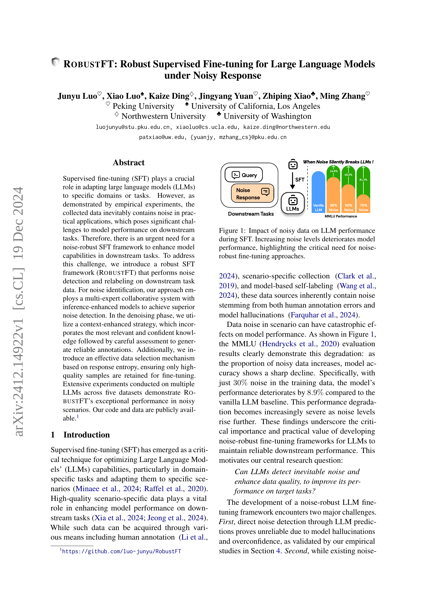
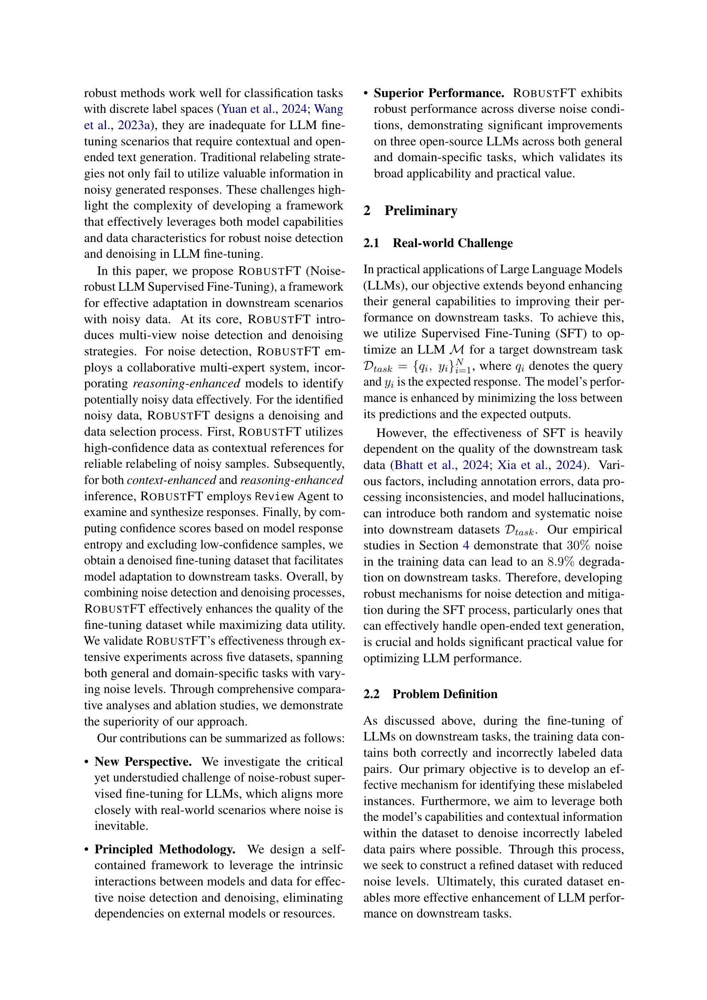
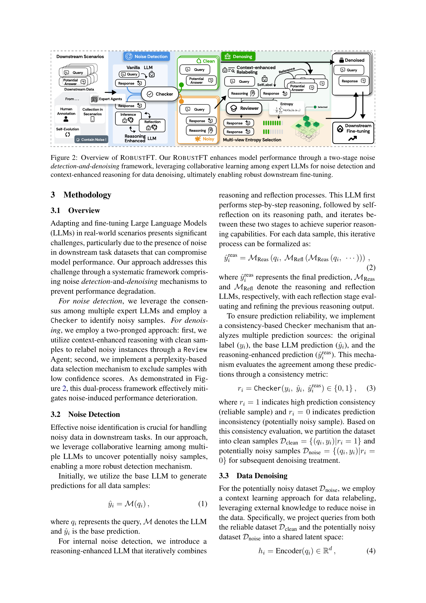
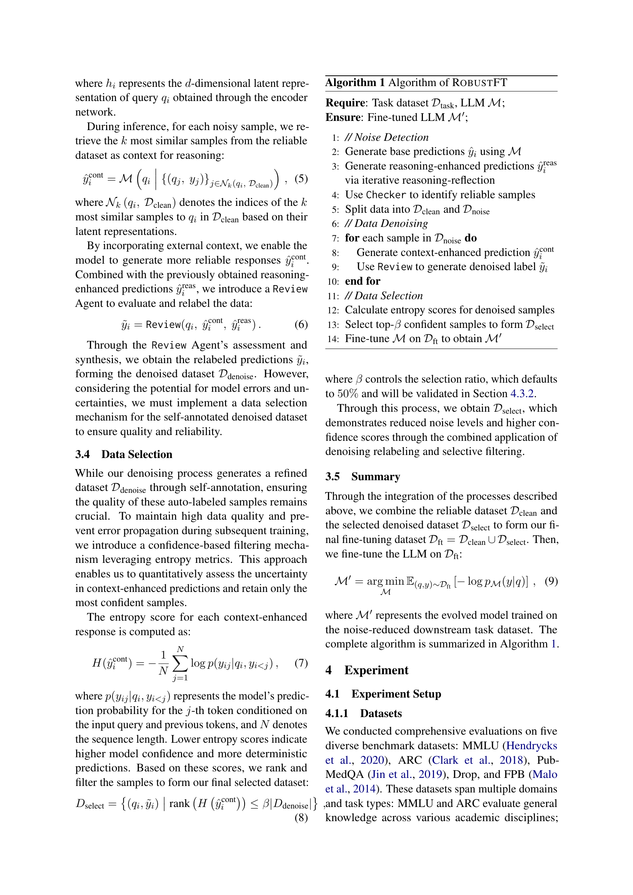
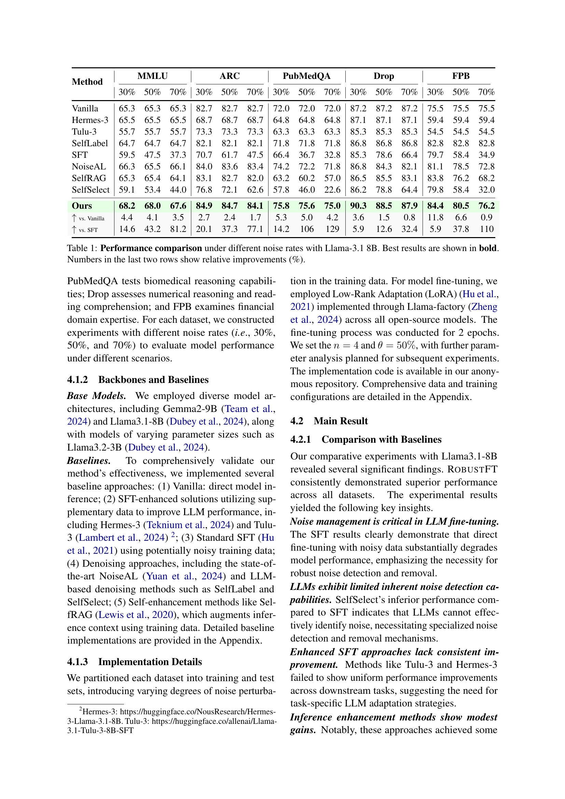
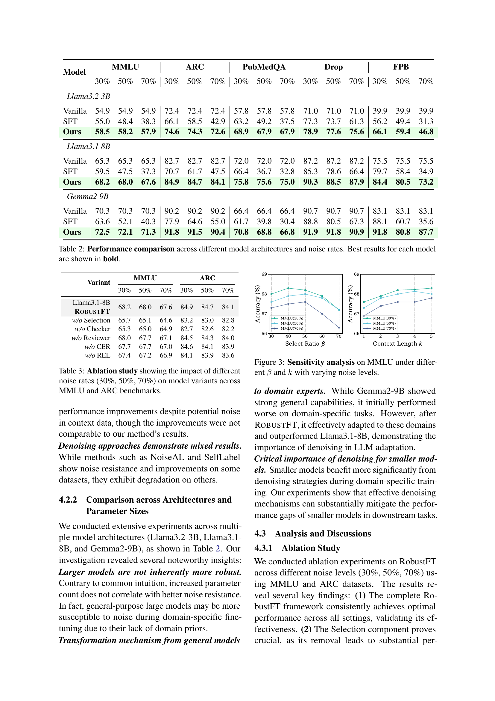
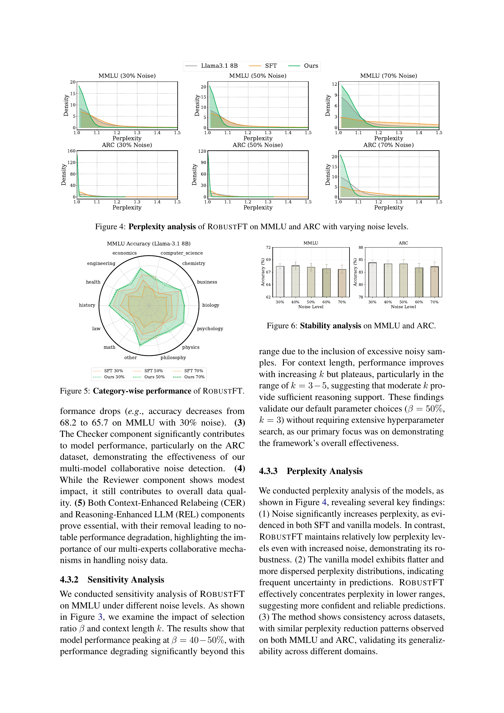
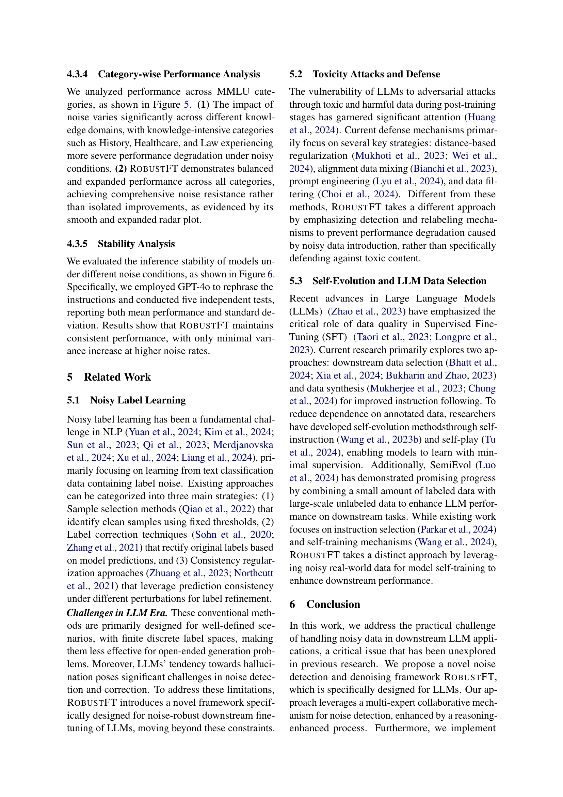
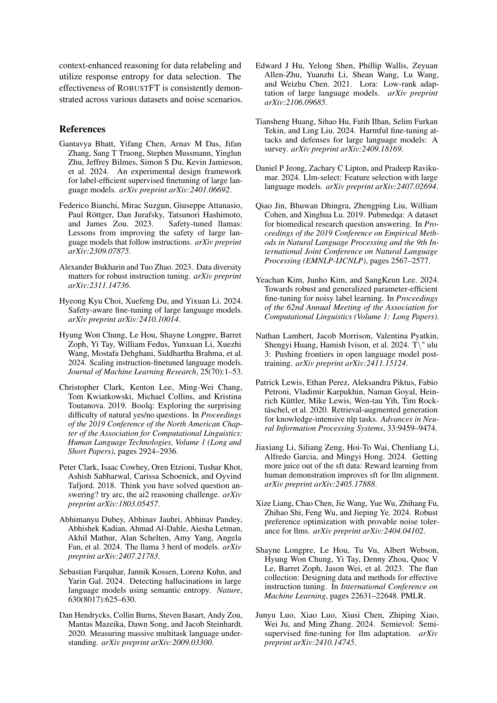
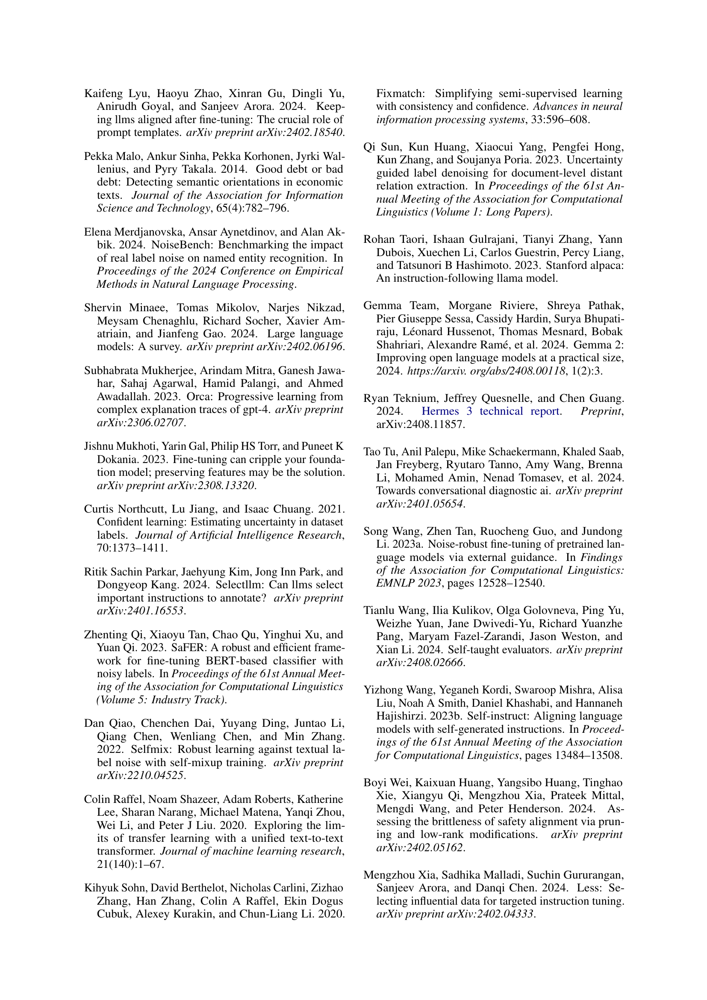
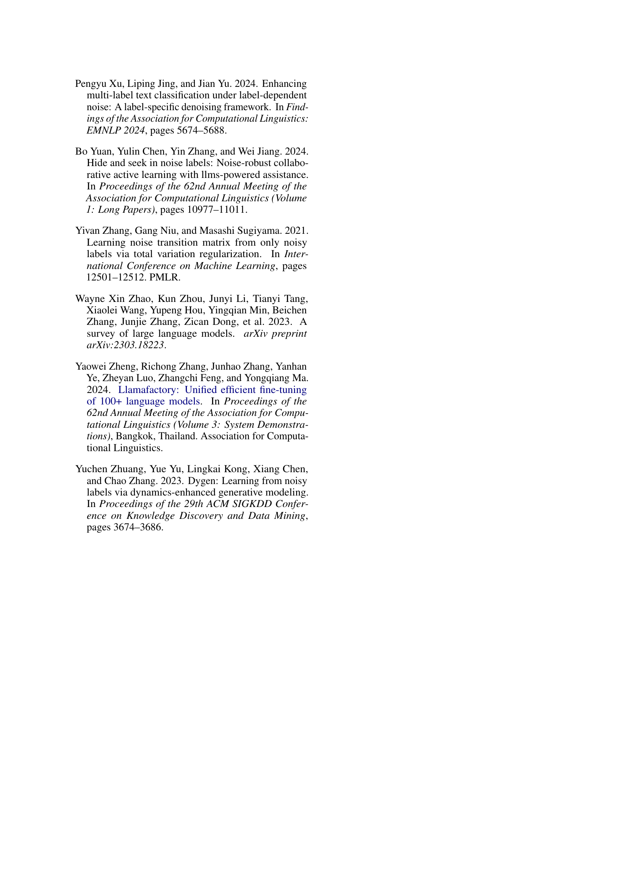
