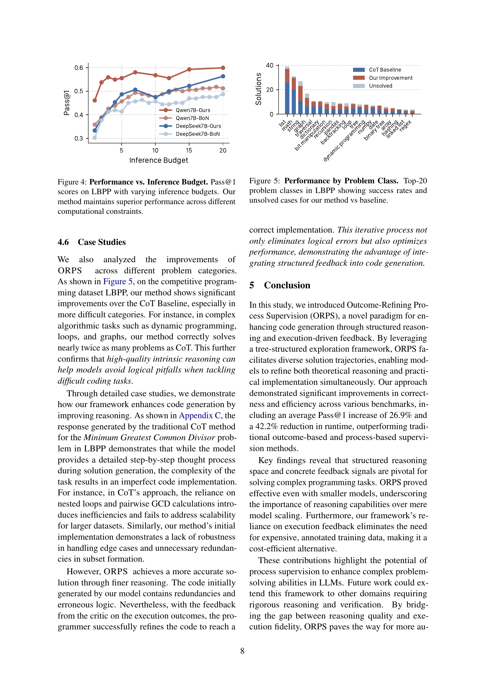

 


 2412.15118 
 Zhuohao Yu et el. 
 
 🤗 2024-12-24 
 



↗ arXiv


↗ Hugging Face


↗ Papers with Code


### TL;DR



대규모 언어 모델(LLM)은 코드 생성에 뛰어난 성능을 보이지만, 복잡한 알고리즘 추론이 필요한 과제에서는 종종 어려움을 겪습니다. 기존의 접근 방식은 최종 결과물의 질에만 초점을 맞추거나, 비용이 많이 드는 보상 모델을 학습하는 데 의존하는 등의 한계점을 가지고 있습니다.  

본 논문에서는 이러한 문제점을 해결하기 위해 Outcome-Refining Process Supervision (ORPS)라는 새로운 프레임워크를 제안합니다. ORPS는 코드 실행 결과를 활용하여 추론 과정을 직접적으로 감독하고, 여러 개의 해결책을 동시에 탐색하는 트리 구조를 사용합니다.  **실험 결과, ORPS는 기존 방법보다 정확도와 효율성을 크게 향상**시켰으며, 특히 복잡한 프로그래밍 과제에서 그 효과가 두드러졌습니다. **ORPS는 별도의 보상 모델 학습 없이도 높은 성능**을 달성하여, 코드 생성 분야의 연구에 새로운 가능성을 제시합니다.



#### Key Takeaways


 복잡한 프로그래밍 문제 해결을 위한 새로운 프레임워크 ORPS 제시 



 실행 결과를 바탕으로 한 구체적인 검증 신호를 사용하여 추론 단계를 감독하는 새로운 패러다임 제시 



 다양한 모델과 데이터셋을 사용한 실험을 통해 성공률과 효율성이 크게 향상됨을 입증 


#### Why does it matter?
본 논문은 코드 생성 분야의 어려운 문제들을 해결하기 위한 새로운 프레임워크인 ORPS를 제시하여, **복잡한 프로그래밍 과제에서 성공률과 효율성을 크게 향상**시켰다는 점에서 중요합니다. 기존의 방법들이 가진 한계점들을 극복하고 실행 가능한 결과물을 바탕으로 한 새로운 접근 방식을 제시하여, **실제 응용 분야에 대한 파급 효과가 클 것**으로 예상됩니다. 또한, 본 연구는 **다양한 모델과 데이터셋에 대한 실험 결과를 제시**하여, 제안된 방법론의 일반성과 효율성을 입증하고 있으며, 이는 다른 연구자들에게도 영감을 줄 수 있습니다. 특히, **실행 가능한 코드를 직접 활용하여 성능을 평가하는 새로운 방법론**을 제시함으로써, 향후 코드 생성 모델의 평가 방법에 대한 연구 방향을 제시할 수 있다는 점에서도 중요합니다.

------
#### Visual Insights

> 🔼 그림 1은 코드 생성 패러다임의 비교를 보여줍니다. 기존의 결과물 감독 방식은 최종 출력물의 품질만을 기준으로 모델을 안내하는 반면, 프로세스 감독 방식은 학습된 보상 모델을 사용하여 중간 추론 단계를 안내합니다. 이 논문에서 제안하는 결과물 개선 프로세스 감독 방식은 결과물 개선 자체를 감독할 프로세스로 취급하는 새로운 패러다임입니다. 이 방식은 추론 단계의 감독에 실행 신호를 활용하고, 트리 구조 탐색을 통해 여러 솔루션 경로를 동시에 유지하여 모델이 다양한 알고리즘 접근 방식을 탐색할 수 있도록 합니다.
> 

> 
read the caption

> Figure 1: Comparison of code generation paradigms.
> 


LBPP (2024)
HumanEval (2021b)
MBPP (2021)

| Model/Method | Pass@1 ↑ | Tests ↑ | Valid ↑ | Time ↓ | Pass@1 ↑ | Tests ↑ | Valid ↑ | Time ↓ | Pass@1 ↑ | Tests ↑ | Valid ↑ | Time ↓ |
|---|---|---|---|---|---|---|---|---|---|---|---|---|
| Llama-3.1-8B-Instruct (2024) | 30.9 | 44.3 | 63.0 | 176.8 | 50.0 | 68.4 | 82.9 | 98.1 | 58.0 | 64.9 | 72.4 | 91.9 |
| CoT | 30.9 | 44.3 | 63.0 | 176.8 | 50.0 | 68.4 | 82.9 | 98.1 | 58.0 | 64.9 | 72.4 | 91.9 |
| Reflexion | 34.0 | 49.3 | 67.3 | 148.5 | 54.9 | 71.1 | 83.5 | 107.5 | 58.8 | 65.0 | 71.2 | 88.6 |
| LDB (w/ T) | 25.9 | 39.8 | 58.0 | 252.2 | 54.3 | 62.3 | 66.5 | 127.1 | 43.6 | 47.1 | 49.4 | 170.7 |
| BoN | **46.9** | 64.7 | 84.6 | 107.6 | **71.3** | 84.7 | 93.3 | 77.3 | **73.5** | **79.9** | **86.4** | **72.1** |
| ORPS | 45.9 | **66.9** | **88.5** | **99.1** | 70.3 | **87.5** | **96.2** | **65.8** | 71.8 | 78.2 | 84.3 | 84.5 |
| ORPS (w/ T) | **67.1** | **81.4** | **93.7** | **89.4** | **91.4** | **95.7** | **98.1** | **63.6** | 90.4 | 93.1 | 95.6 | **59.1** |
| DeepSeek-Coder-7B-Instruct-v1.5 (2024) | 32.7 | 45.9 | 67.3 | 160.1 | 65.9 | 78.2 | 85.4 | 86.9 | 69.3 | 75.0 | 80.9 | 77.7 |
| CoT | 32.7 | 45.9 | 67.3 | 160.1 | 65.9 | 78.2 | 85.4 | 86.9 | 69.3 | 75.0 | 80.9 | 77.7 |
| Reflexion | 25.9 | 41.9 | 63.0 | 153.0 | 63.4 | 77.1 | 86.6 | 101.0 | 68.9 | 74.4 | 80.2 | 74.2 |
| LDB (w/ T) | 31.5 | 45.7 | 61.7 | 206.2 | 74.4 | 80.0 | 81.7 | 85.6 | 61.1 | 64.0 | 66.1 | 98.3 |
| BoN | 49.4 | 63.9 | 80.2 | 123.4 | 73.8 | 88.1 | 94.5 | 64.1 | **74.3** | 80.2 | 86.8 | 68.9 |
| ORPS | **56.3** | **71.1** | **88.0** | **89.4** | **76.2** | **90.0** | **96.3** | **40.6** | 73.2 | **80.3** | **87.5** | **46.8** |
| ORPS (w/ T) | **63.7** | **80.8** | **96.9** | **74.4** | **95.7** | **98.0** | **99.4** | **31.8** | **93.0** | **94.7** | **96.1** | **34.2** |
| Qwen-2.5-Coder-7B-Instruct (2024) | 40.1 | 55.3 | 72.2 | 118.6 | 72.6 | 79.0 | 82.3 | 79.2 | 79.0 | 83.3 | 88.3 | 67.3 |
| CoT | 40.1 | 55.3 | 72.2 | 118.6 | 72.6 | 79.0 | 82.3 | 79.2 | 79.0 | 83.3 | 88.3 | 67.3 |
| Reflexion | 37.7 | 57.1 | 78.4 | 111.2 | 75.6 | 81.1 | 84.1 | 73.6 | 79.0 | 84.0 | 88.7 | 63.5 |
| LDB (w/ T) | 35.8 | 49.9 | 65.4 | 187.8 | **87.8** | 90.3 | 91.5 | 76.1 | 66.9 | 69.4 | 72.0 | 96.8 |
| BoN | 53.1 | 68.8 | 85.8 | 117.9 | 77.4 | 85.1 | 87.8 | 66.8 | **82.9** | **87.2** | **91.8** | **62.6** |
| ORPS | **59.9** | **75.7** | **92.0** | **84.1** | 79.9 | **91.6** | **96.3** | **48.3** | 76.7 | 82.4 | 88.3 | 68.0 |
| ORPS (w/ T) | **77.8** | **87.9** | **96.9** | **82.4** | **96.3** | **98.0** | **98.8** | **43.9** | **94.9** | **96.4** | **97.3** | **45.3** |
| Qwen-2.5-Coder-14B-Instruct (2024) | 53.7 | 63.9 | 77.2 | 119.2 | 82.9 | 88.5 | 90.2 | 76.6 | **84.0** | **87.4** | **91.1** | 67.5 |
| CoT | 53.7 | 63.9 | 77.2 | 119.2 | 82.9 | 88.5 | 90.2 | 76.6 | **84.0** | **87.4** | **91.1** | 67.5 |
| Reflexion | 60.5 | 70.5 | 82.1 | 113.3 | 83.5 | 89.9 | 92.7 | 68.8 | 83.3 | 87.2 | **91.1** | 66.0 |
| LDB (w/ T) | 51.9 | 62.9 | 75.3 | 225.2 | **89.6** | 92.0 | 92.7 | 140.5 | 72.4 | 74.6 | 76.3 | 149.7 |
| BoN | **61.7** | 74.9 | **90.7** | 115.6 | 87.8 | **93.9** | 95.7 | 58.8 | 81.7 | 86.4 | **91.1** | **58.4** |
| ORPS | **61.7** | **77.4** | **90.7** | **84.8** | 81.7 | 91.3 | **96.3** | **41.5** | 76.3 | 82.0 | 87.9 | 58.8 |
| ORPS (w/ T) | **85.8** | **90.7** | **95.7** | **64.2** | **97.0** | **98.5** | **99.4** | **43.8** | **95.3** | **96.9** | **98.1** | **41.0** |
| GPT-4o-Mini (2024) | 50.0 | 65.9 | 80.2 | 124.5 | 79.9 | 87.5 | 90.9 | 80.5 | 78.6 | 83.5 | 87.9 | 70.3 |
| CoT | 50.0 | 65.9 | 80.2 | 124.5 | 79.9 | 87.5 | 90.9 | 80.5 | 78.6 | 83.5 | 87.9 | 70.3 |
| Reflexion | 62.3 | 73.9 | 87.7 | 93.2 | 75.0 | 83.6 | 87.2 | 75.1 | 79.4 | 84.0 | 88.3 | 67.6 |
| LDB (w/ T) | 54.9 | 67.8 | 82.7 | 220.1 | **88.4** | 92.2 | 93.9 | 133.4 | 72.8 | 75.5 | 77.8 | 157.9 |
| BoN | 64.2 | 78.6 | 93.8 | 88.9 | 82.9 | 90.2 | 92.7 | 66.5 | **80.5** | 85.5 | 89.9 | **64.6** |
| ORPS | **67.9** | **81.2** | **94.4** | **81.5** | 84.8 | **92.7** | **96.3** | **57.5** | 80.2 | **86.0** | **91.8** | 64.7 |
| ORPS (w/ T) | **88.9** | **94.3** | **98.1** | **61.6** | **97.6** | **98.7** | **99.4** | **46.2** | **95.7** | **97.3** | **98.4** | **51.4** |

> 🔼 표 1은 다양한 코드 생성 벤치마크에 대한 주요 결과를 보여줍니다. Pass@1은 모든 테스트 사례를 통과한 솔루션의 비율을 나타내고, Tests는 평균적으로 통과한 테스트 사례 수를, Valid는 컴파일 및 실행 가능한 솔루션의 비율을, Time은 표준 솔루션과 비교하여 상대적 실행 시간을 나타냅니다. 모든 지표는 백분율로 표시되며, 최고 결과는 굵게, 두 번째로 좋은 결과는 밑줄이 그어져 있습니다. 이 표는 다양한 모델과 방법을 비교하여 코드 생성 성능을 평가하는 데 사용되었습니다.
> 

> 
read the caption

> Table 1: Main Results on Code Generation Benchmarks. Pass@1: solutions passing all test cases. Tests: average test cases passed. Valid: solutions that compile and execute. Time: relative execution time, compared to the standard solution. Best results are in bold and second-best are underlined, every metric is in percentage.
> 

### In-depth insights

#### Outcome-Refining Supervision
**결과 개선 과정의 지도 학습**이라는 개념은 기존의 단순 결과에 대한 평가를 넘어, **결과 개선 과정 자체를 학습 대상으로 삼는 새로운 패러다임**을 제시합니다. 이는 코드 생성 모델이 최종 결과물 뿐 아니라, **중간 단계의 추론 과정과 실행 결과에 대한 피드백을 통해 지속적으로 개선**해나가는 것을 의미합니다.  **실행 가능한 코드를 통한 구체적인 검증 신호**를 활용하여 추론 단계를 지도하고, **트리 구조 탐색**을 통해 다양한 해결책을 동시에 모색함으로써, 더욱 안정적이고 효율적인 코드 생성을 가능하게 합니다.  **기존의 보상 모델 학습에 필요한 많은 데이터와 비용을 줄이고, 신뢰성 있는 검증을 제공**하는 것이 특징이며, 복잡한 프로그래밍 문제 해결에 효과적임을 실험적으로 증명합니다.  **모델 크기보다 추론 공간의 충분한 확보**가 더 중요하며, 실행 결과를 통한 검증은 기존 보상 모델보다 훨씬 신뢰할 수 있습니다.  전반적으로, **구체적이고 검증 가능한 신호를 통해 추론 과정을 지도**하는 접근 방식의 중요성을 보여주는 접근법입니다.

#### Execution Feedback
실행 피드백은 코드 생성 모델의 성능 향상에 중요한 역할을 합니다. **실행 결과를 직접적으로 활용하여 모델의 추론 과정을 평가하고 개선**할 수 있기 때문입니다.  기존의 프로세스 감독 방식은 보상 모델 학습에 많은 데이터를 필요로 하고, 평가의 신뢰성이 떨어지는 문제가 있었지만, 실행 피드백은 **구체적이고 검증 가능한 신호**를 제공하여 이러한 문제를 해결하는 데 도움이 됩니다.  **실행 결과를 기반으로 한 피드백**은 모델이 코드의 정확성과 효율성을 향상시키도록 유도하고, **실패 원인을 분석**하여 보다 나은 알고리즘을 개발하는 데 활용될 수 있습니다.  하지만 실행 피드백은 코드 실행이 가능해야만 사용할 수 있다는 제약이 존재하고, 복잡한 프로그램의 경우 실행 시간이 오래 걸릴 수 있다는 점을 고려해야 합니다. 또한, 실행 피드백만으로는 모델의 추론 능력을 완전히 평가하기 어려울 수 있으므로, **다른 평가 지표와 함께 사용하는 것이 효과적**일 것입니다.

#### Tree-structured Search
**트리 구조 검색**은 다양한 해결책 탐색을 위한 효과적인 전략입니다. 이는 각 노드가 부분적인 해결책이나 중간 단계를 나타내는 트리 형태의 탐색 공간을 생성하여 작동합니다. 이 방법은 **단일 경로에 국한되지 않고 여러 가지 가능성을 동시에 탐색**할 수 있게 해줍니다. 이를 통해 최적의 해결책을 찾을 확률을 높이고, **지역 최적화에 빠지는 것을 방지**하는 데 도움이 될 수 있습니다. 또한, **각 단계에서의 피드백을 활용하여** 유망한 경로를 선택하고 비효율적인 경로를 가지치기 하여 탐색 효율을 높일 수 있습니다.  **실패 가능성이 높은 경로를 조기에 배제**할 수 있어 전체적인 탐색 시간을 절약하는 데 효과적입니다. 트리 구조 검색은 문제의 복잡도가 높을수록 더욱 효과적이며, 특히 **여러 제약 조건과 다양한 해결책이 존재하는 문제**에 적합합니다.  다만, 트리의 크기가 기하급수적으로 증가할 수 있으므로 **메모리 및 계산 비용**에 대한 고려가 필요합니다.  **가지치기 전략**을 적절히 활용하여 이러한 문제를 완화하는 것이 중요합니다.

#### Ablation Study Results
 ablation study 결과는 모델 성능에 대한 주요 구성 요소의 기여도를 밝히는 데 매우 중요합니다. 이를 통해 **개별 구성 요소의 중요성을 객관적으로 평가**하고, 모델 개선을 위한 방향을 제시할 수 있습니다. 예를 들어, 특정 모듈 제거 시 성능 저하가 크다면 해당 모듈의 중요성이 높다고 판단할 수 있으며, 향후 연구 및 개발에서 이를 중점적으로 다루어야 함을 시사합니다.  반대로, 특정 모듈 제거 시 성능 변화가 미미하다면, 해당 모듈은 모델 성능에 큰 영향을 미치지 않으므로, **개발 자원을 다른 곳에 집중**하는 것이 효율적일 수 있습니다.  **결과 해석의 핵심은 통계적 유의성 검정**입니다.  단순히 성능 변화의 크기만으로 판단해서는 안 되며, 통계적 유의성 검정을 통해 실험 결과의 신뢰성을 확보해야 합니다.  마지막으로 ablation study 결과는 향후 연구를 위한 **방향 설정 및 가설 검증**에 활용될 수 있습니다. 특정 구성 요소의 중요성이 밝혀졌다면, 이를 바탕으로 해당 구성 요소를 개선하거나, 새로운 구성 요소를 추가하는 등의 후속 연구를 진행할 수 있습니다.

#### Future Work
본 논문은 코드 생성을 위한 새로운 프레임워크인 ORPS를 제시하며, **실행 가능성을 기반으로 한 결과 개선 과정 자체를 감독하는 새로운 패러다임**을 소개합니다.  추가적인 연구로는, **더욱 복잡하고 다양한 프로그래밍 과제에 대한 ORPS의 일반화 성능 향상**을 위한 연구가 필요합니다.  또한, **다양한 모델 크기와 유형에 대한 ORPS의 적용성을 확장**하는 연구가 중요합니다.  **자원 제약 환경에서의 효율적인 실행 및 최적화**에 관한 연구도 필요합니다.  **모델의 추론 능력 향상 및 자가 수정 능력 강화**를 위한 연구 또한 중요하며, **윤리적 문제점 해결 및 안전한 코드 생성 방안 마련**을 위한 노력이 필요합니다.  마지막으로,  **실세계 응용 분야를 위한 ORPS의 실용성 확보** 연구가 미래의 중요한 과제입니다. 이를 통해 ORPS가 다양한 상황에서 널리 활용될 수 있도록 연구를 지속해야 합니다.

### More visual insights

More on figures

> 🔼 그림 2는 제안하는 방법인 ORPS(Outcome-Refining Process Supervision)의 프레임워크를 개괄적으로 보여줍니다.  단계별 추론 과정에서 언어 모델은 프로그래머이자 비평가의 역할을 동시에 수행합니다. 빔 서치(beam search)를 통해 여러 개의 솔루션 경로를 동시에 유지하며, 각 상태는 추론 과정, 코드 구현, 그리고 단계별 보상을 포함합니다.  즉, 언어 모델이 코드를 생성하고, 스스로 코드를 평가하고 수정하는 과정을 반복하며 최적의 솔루션을 찾아가는 과정을 시각적으로 나타낸 것입니다.
> 

> 
read the caption

> Figure 2: Outcome-Refining Process Supervision framework overview. A language model serves as both programmer and critic in a step-by-step reasoning process. Through beam search, the framework maintains multiple solution trajectories, where each state contains reasoning chains, code implementations, and step reward.
> 

> 🔼 그림 3은 다양한 성능 지표에 대한 다차원 분석 결과를 보여줍니다. LBPP 표준 솔루션을 기준으로 정규화하고 모든 백본 모델에 걸쳐 평균을 낸 지표들을 비교 분석합니다.  측정된 지표는 코드 길이, AST 노드 수, 순환 복잡도, 인지 복잡도, 실행 속도, 페이지 부재, 분기 오류 예측, 명령어 수 등 다양하며, 이를 통해 생성된 코드의 정확성, 효율성, 그리고 유지보수 용이성을 종합적으로 평가합니다. 높은 값은 더 나은 성능을 나타냅니다.
> 

> 
read the caption

> Figure 3: Multi-dimensional Performance Analysis. Metrics are normalized against the LBPP standard solutions (1.0×) and averaged across all backbone models. Higher values indicate better performance.
> 

> 🔼 그림 4는 다양한 추론 예산(inference budget) 하에서 LBPP(Large Benchmark for Programming Problems) 데이터셋에 대한 Pass@1 점수를 보여줍니다. Pass@1 점수는 생성된 코드가 모든 테스트 사례를 통과하는 비율을 나타냅니다.  본 논문에서 제시된 방법은 다양한 계산 제약 조건 하에서도 우수한 성능을 유지한다는 것을 보여줍니다.  즉, 추론에 사용할 수 있는 계산 자원의 양이 변하더라도, 제시된 방법의 정확도는 일관되게 높은 수준을 유지함을 시각적으로 보여줍니다.
> 

> 
read the caption

> Figure 4: Performance vs. Inference Budget. Pass@1 scores on LBPP with varying inference budgets. Our method maintains superior performance across different computational constraints.
> 

> 🔼 그림 5는 LBPP 데이터셋에서 가장 많이 등장하는 상위 20개 문제 유형에 대해 제안된 ORPS 방법과 기준 방법(Baseline)의 성공률과 미해결 문제 수를 비교 분석한 결과를 보여줍니다.  각 문제 유형별로 ORPS와 기준 방법의 성공률 차이를 시각적으로 보여주어, 제안된 방법의 성능 개선 효과를 다양한 유형의 문제에 걸쳐 상세하게 평가합니다.  특히 어려운 문제 유형에서 ORPS가 얼마나 큰 성능 향상을 가져오는지 명확하게 보여줍니다.
> 

> 
read the caption

> Figure 5: Performance by Problem Class. Top-20 problem classes in LBPP showing success rates and unsolved cases for our method vs baseline.
> 

More on tables


|                     | LBPP                                                                  | HumanEval                                                             | MBPP                                                                 |
| :------------------ | :-------------------------------------------------------------------- | :-------------------------------------------------------------------- | :-------------------------------------------------------------------- |
|                     | (Matton et al., 2024)                                                   | (Chen et al., 2021b)                                                 | (Austin et al., 2021)                                                 |
| # Test Problems     | 162                                                                   | 164                                                                   | 257†                                                                  |
| # Unit Tests        | 5.1                                                                    | 6.5                                                                    | 3.0                                                                    |
| Solution Length§    | 627 / 3039                                                             | 169 / 622                                                             | 130 / 589                                                             |
| Contamination       | New Dataset                                                            | 18.9%‡                                                                | 20.8%‡                                                                |
| Difficulty          | **Competitive Programming**                                             | **Basic Functions**                                                   | **Basic Functions**                                                   |
| Task Type           | Algorithms                                                             | Func. Completion                                                      | Basic Prog.|
> 🔼 표 2는 평가에 사용된 프로그래밍 벤치마크의 특징을 보여주는 표입니다. LBPP, HumanEval, MBPP 세 가지 데이터셋에 대한 문제 수, 단위 테스트 수, 솔루션 코드 길이, 데이터 오염 정도, 난이도, 작업 유형 등의 정보를 담고 있습니다. 이 표는 각 데이터셋의 특징을 한눈에 파악하여, 실험 결과 해석 및 비교에 유용한 정보를 제공합니다.
> 

> 
read the caption

> Table 2: Dataset Statistics. Characteristics of the programming benchmarks used in evaluation.
> 


| Method | Pass@1↑ | Tests↑ | Valid↑ | Time↓ |
|---|---|---|---|---|
| **ORPS** | 59.9 | 75.7 | 92.0 | 84.1 |
|  - Execution | 43.8 | 56.4 | 72.8 | 200.5 |
|  - Reasoning | 55.6 | 74.5 | 94.4 | 124.5 |
> 🔼 표 3은 본 논문에서 제안하는 ORPS 프레임워크의 각 구성 요소가 성능에 미치는 영향을 분석한 결과를 보여줍니다.  'Execution' 열은 실행 피드백을 제거했을 때의 결과, 'Reasoning' 열은 심층 추론 과정을 제거했을 때의 결과를 나타냅니다.  모든 지표는 백분율로 표시됩니다.  실험은 실행 피드백과 심층 추론 과정이 모두 ORPS의 성능 향상에 중요한 역할을 한다는 것을 보여줍니다.  실행 피드백을 제거하면 정확도가 크게 떨어지고, 심층 추론 과정을 제거해도 정확도가 다소 감소하는 것을 확인할 수 있습니다.
> 

> 
read the caption

> Table 3: Ablation Study Results. - Execution: Remove execution feedback from our framework. - Reasoning: Remove in-depth reasoning process. Every metric is in percentage.
> 


| Category | Metric | Description |
|---|---|---|
| **Dynamic Execution Profiling** |  |  |
|  | Time Enabled | Total CPU time spent executing the code, measured in nanoseconds. Lower values indicate more efficient execution and better algorithmic optimization. |
|  | Instruction Count | Number of CPU instructions executed during runtime. Reflects computational efficiency, with lower counts suggesting more optimized code paths and better algorithm implementation. |
|  | Branch Misses | Frequency of incorrect branch predictions during execution. Lower values indicate better code predictability and CPU pipeline efficiency, resulting in faster execution times. |
|  | Page Faults | Number of times the program needs to access virtual memory. Fewer page faults suggest better memory management and more efficient memory access patterns. |
| **Static Analysis** |  |  |
|  | Code Length | Total number of lines in the source code. Generally, shorter code length indicates more concise solutions while maintaining readability and functionality. |
|  | AST Node Count | Number of nodes in the Abstract Syntax Tree. Measures structural complexity of the code, with fewer nodes suggesting simpler and more maintainable implementation. |
|  | Cyclomatic Complexity | Quantifies the number of linearly independent paths through the code. Lower values indicate easier-to-maintain and test code, reducing potential bug sources. |
|  | Cognitive Complexity | Measures how difficult the code is to understand, based on control flow structures and nesting. Lower scores suggest more readable and maintainable code that is easier to debug. |
> 🔼 표 4는 프로세스 보상 모델에 대한 분석 결과를 보여줍니다.  'Granularity'는 보상 신호의 세부 수준(라인 수준 또는 결과 수준)을 나타내고, 'Train'은 프로세스 보상 모델의 학습 여부를 나타냅니다.  이 표는 라인 수준 및 결과 수준 보상 신호를 사용한 다양한 방법을 비교하고, 각각의 방법에서 보상 모델을 학습시키는 경우와 학습시키지 않는 경우를 모두 포함합니다.  다양한 설정에 따른 Pass@1, Tests, Valid, Time 지표를 비교하여, 어떤 보상 전략과 학습 방식이 코드 생성 성능에 가장 효과적인지 보여줍니다.
> 

> 
read the caption

> Table 4: Analysis of Process Reward Model. Granularity refers to the level of detail in the reward signal (line-level or outcome-level). Train indicates whether the process reward model requires training.
> 

### Full paper



