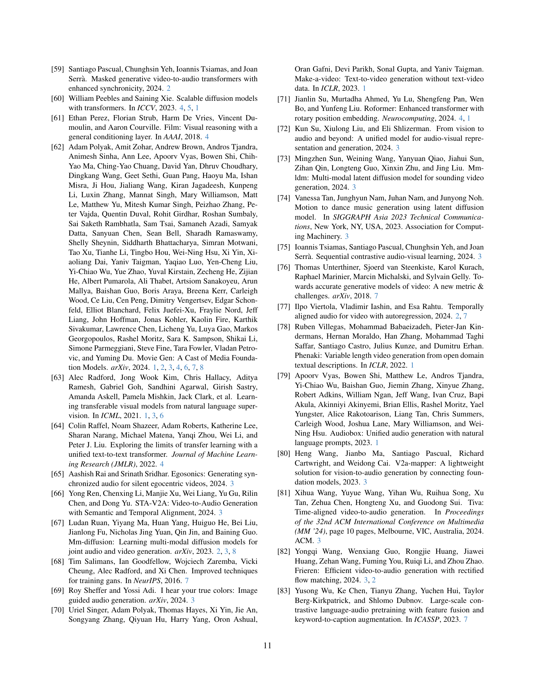

 


 2412.15191 
 Moayed Haji-Ali et el. 
 
 🤗 2024-12-20 
 



↗ arXiv


↗ Hugging Face


↗ Papers with Code


### TL;DR



기존의 비디오-오디오 및 오디오-비디오 생성 방법들은 사전 훈련된 특징 추출기에 의존하여 시간 정렬이 부정확하고 모달리티 간의 일관성이 떨어지는 문제점을 가지고 있었습니다.  또한, 각 작업에 대해 별도의 모델을 필요로 하여 효율성이 낮았습니다. 이러한 문제를 해결하기 위해 기존 연구들은 단일 모델 내에서 오디오와 비디오를 함께 생성하는 접근 방식을 시도하였으나, 성능 향상에 한계가 있었습니다.

본 논문에서는 AV-Link라는 새로운 통합 프레임워크를 제시합니다.  AV-Link는 **동결된 비디오 및 오디오 확산 모델의 활성화를 활용**하여, 시간 정렬 크로스 모달 조건화를 수행합니다. **핵심은 시간 정렬 자기 주의 연산을 통해 백본 비디오 및 오디오 확산 모델 간의 양방향 정보 교환을 가능하게 하는 Fusion Block**입니다. AV-Link는 사전 훈련된 특징 추출기에 의존하지 않고, **단일 프레임워크 내에서 비디오 기능을 사용하여 오디오를 생성하거나 오디오 기능을 사용하여 비디오를 생성**할 수 있습니다.  실험 결과, AV-Link는 동기화되고 고품질의 시청각 콘텐츠를 생성하여 기존 방법들을 능가하는 성능을 보였습니다.



#### Key Takeaways


 AV-Link는 비디오-오디오 및 오디오-비디오 생성을 위한 통합 프레임워크를 제공합니다. 



 시간 정렬 자기 주의 메커니즘을 통해 두 모달리티 간의 양방향 정보 교환을 가능하게 하는 Fusion Block을 사용합니다. 



 사전 훈련된 특징 추출기에 의존하지 않고, 사전 훈련된 동결된 흐름 일치 모델의 활성화를 직접 활용하여 시간 및 의미적 정렬 성능을 향상시킵니다. 


#### Why does it matter?
이 논문은 **비디오와 오디오 생성에 대한 통합 프레임워크**를 제시하여, 기존의 분리된 접근 방식의 한계를 극복하고 **시간적 정렬**을 개선함으로써 몰입형 미디어 생성 분야에 중요한 발전을 가져왔습니다. 특히, **사전 훈련된 특징 추출기 사용을 피하고 확산 모델의 활성화를 직접 활용**하는 독창적인 방법은 후속 연구에 새로운 방향을 제시할 뿐만 아니라, **다양한 크로스 모달 작업에 대한 일반화 가능성**을 시사합니다. 따라서, 몰입형 미디어 생성, 멀티모달 생성 모델링 등의 분야에 종사하는 연구자들에게 큰 영향을 미칠 것으로 예상됩니다.

------
#### Visual Insights

> 🔼 본 그림은 기존의 Video-to-Audio 및 Audio-to-Video 방식과 비교하여 AV-Link가 두 작업에 대한 통합 프레임워크를 제공하는 모습을 보여줍니다.  AV-Link는 CLIP이나 CLAP과 같은 다른 작업을 위해 미리 학습된 특징 추출기를 사용하는 대신, 미리 학습된 고정된 Flow Matching 모델의 활성화를 Fusion Block을 사용하여 활용함으로써 모달 간의 정확한 시간 정렬을 달성합니다. 이를 통해 경쟁력 있는 의미적 정렬과 향상된 시간적 정렬을 자체적으로 포함하는 프레임워크를 제공합니다.
> 

> 
read the caption

> Figure 1: Compared to current Video-to-Audio and Audio-to-Video methods, AV-Link provides a unified framework for these two tasks. Rather than relying on feature extractors pretrained for other tasks (e.g. CLIP [63], CLAP [16]), we directly leverage the activations from pretrained frozen Flow Matching models using a Fusion Block to achieve precise time alignment between modalities. Our approach offers competitive semantic alignment and improved temporal alignment in a self-contained framework for both modalities.
> 


|           | Prompt | FAD ↓ | FD ↓ | CLAP ↑ | IS ↑ | IB-AI ↑ | IB-AV ↑ | Ons. ACC ↑ |
| :-------- | :------ | :----: | :----: | :-----: | :----: | :-----: | :-----: | :-------: |
| Diff-Foley [52] |         | 11.00  | 28.71  |  0.06   | 7.88  |  0.115  |  0.121  |   0.14    |
| S&H [85]     |         | 29.22  | 66.51  |  0.025  | 2.09  |  0.179  |  0.189  |   0.128   |
| FoleyCrafter [97] |         | 4.62   | 18.66  |  0.080  | 9.10  |  0.204  |  0.215  |   0.166   |
| Ours (VGGSounds) |         | 2.02   | 13.68  |  0.129  | 10.06 |  0.203  |  0.214  |   0.405   |
| Ours-Joint |         | 2.19   | 13.15  |  0.122  | 9.24  |  0.205  |  0.215  |   0.409   |
| Ours        |         | 1.58   | 14.17  |  0.137  | 9.93  |  0.207  |  0.223  |   0.531   |
| S&H [85]     | ✓       | 10.72  | 25.44  |  0.186  | 6.06  |  0.30   |  0.318  |   0.08    |
| FoleyCrafter [97] | ✓       | 2.99   | 18.05  |  0.212  | 10.88 |  0.208  |  0.219  |   0.179   |
| Ours (VGGSounds) | ✓       | 1.91   | 13.19  |  0.236  | 13.57 |  0.225  |  0.238  |   0.429   |
| Ours-Joint | ✓       | 2.23   | 13.74  |  0.224  | 13.44 |  0.212  |  0.224  |   0.471   |
| Ours        | ✓       | 1.33   | 11.99  |  0.228  | 12.40 |  0.214  |  0.226  |   0.54    |

> 🔼 표 1은 VGGSounds [9] 벤치마크에서 V2A 작업에 대한 기존 연구와 AV-Link의 성능을 비교한 표입니다.  AV-Link는 비디오-오디오 생성 작업에서 경쟁력 있는 의미적 정렬과 향상된 시간적 정렬을 제공하는 통합 프레임워크입니다. 이 표에는 다양한 지표(FAD, FD, CLAP, IS, IB-AI, IB-AV, Onset ACC)를 사용하여 오디오 품질, 의미적 정렬, 시간적 정렬 등을 평가하고, 비교 대상 모델들의 성능과 AV-Link의 성능을 비교 분석하여 AV-Link의 우수성을 보여줍니다. 특히, VGGSounds 데이터셋만으로 훈련된 Fusion Block을 사용한 AV-Link의 변형 모델 결과도 함께 제시되어 있습니다.
> 

> 
read the caption

> Table 1:  Comparison of AV-Link against prior work on the V2A task on the VGGSounds [9] benchmark. We report a variant of our method with Fusion Blocks trained on VGGSounds only.
> 

### In-depth insights

#### Cross-Modal Fusion
본 논문에서 제시된 핵심 아이디어는 **시간적 정렬을 고려한 다중 모드 특징 융합**입니다. 이는 단순히 시각 및 청각 정보를 결합하는 것이 아니라, **각 모드의 시간적 흐름을 정확히 맞춰 융합**함으로써 보다 자연스럽고 일관성 있는 결과물을 생성하는 데 초점을 맞춥니다. 이를 위해, **기존의 사전 훈련된 특징 추출기 대신 동결된 확산 모델의 활성화 값을 직접 활용**하는 독창적인 방법을 제시하고 있습니다. **퓨전 블록을 통해 양방향 정보 교환**을 가능하게 함으로써, 영상에서 음향 생성, 음향에서 영상 생성 모두를 단일 프레임워크 내에서 처리할 수 있도록 효율성을 높였습니다.  **시간적 정렬 자체에 초점**을 맞춘 설계로 인해, 기존 방법들의 한계점으로 지적되었던 시간적 일치성 문제를 극복하고 **고품질의 시청각 콘텐츠**를 생성하는 데 성공하였습니다. **퓨전 블록 내의 다양한 요소들** (시간 정렬, 대칭적 특징 재주입 등)은 실험을 통해 그 효과가 검증되었으며, 향후 다중 모드 생성 모델 연구에 대한 귀중한 통찰력을 제공합니다.

#### Diffusion Feature
본 논문에서 제시된 ‘확산 특징(Diffusion Feature)’은 기존의 사전 훈련된 특징 추출기(CLIP, CLAP 등)에 의존하는 대신, **동결된(frozen) 오디오 및 비디오 확산 모델의 활성화(activations)를 직접 활용**하는 데 중점을 둡니다. 이러한 활성화는 풍부한 의미 정보와 더불어 **시간적 정렬(temporal alignment)**이라는 중요한 특징을 지니고 있어, 단순한 의미적 일치를 넘어 오디오 및 비디오 간의 정확한 시간 동기화를 가능하게 합니다. **융합 블록(Fusion Block)**은 이러한 시간적 정렬된 특징들을 양방향으로 교환하고, 자체 주의 메커니즘을 통해 각 모달리티의 생성 모델을 조건화하는 역할을 수행합니다.  결과적으로, 사전 훈련된 특징 추출기의 한계를 극복하고, **V2A 및 A2V 과제 모두에 통합된 프레임워크를 제공**하여 고품질의 동기화된 시청각 콘텐츠 생성을 가능하게 합니다.  **시간적 정렬 자체주의 메커니즘**은 특히 중요하며, 단순히 의미 정보만 활용하는 기존 방식과 차별화되는 핵심 요소입니다.

#### Temporal Alignment
본 논문에서 '시간 정렬(Temporal Alignment)'은 **다중 모드(cross-modal) 오디오-비디오 생성의 핵심 과제**로 제시됩니다. 기존의 방법들은 사전 훈련된 특징 추출기를 사용하여 의미적 정렬에는 성공했지만, 정확한 시간적 정렬에는 어려움을 겪었습니다. 이러한 문제를 해결하기 위해, **본 연구는 동결된 오디오 및 비디오 확산 모델의 활성화(activations)를 활용하여 시간적으로 정렬된 다중 모드 조건화**를 제안합니다. 특히, **융합 블록(Fusion Block)을 통해 양방향 정보 교환을 가능하게 함으로써, 오디오와 비디오 모달리티 간의 정확한 시간적 정렬**을 달성합니다. 이는 기존의 사전 훈련된 특징 추출기에 의존하는 방식과 달리, 모델 자체 내에서 시간 정렬을 수행한다는 점에서 큰 차별성을 지닙니다.  **결과적으로, AV-Link는 V2A(Video-to-Audio) 및 A2V(Audio-to-Video) 과제 모두에서 경쟁력 있는 의미적 정렬과 향상된 시간적 정렬을 제공**, 실험 결과를 통해 고품질의 동기화된 시청각 콘텐츠 생성 능력을 입증합니다.  **시간 정렬에 대한 심층적인 분석과 다양한 실험을 통해 확산 모델의 활성화가 시간적 정렬에 효과적임을 보여주는 것은 본 연구의 중요한 기여** 중 하나입니다.

#### AV-Link Model
AV-Link 모델은 비디오-오디오 및 오디오-비디오 생성을 위한 통합 프레임워크로, **동시성을 유지하는 고품질의 시청각 콘텐츠 생성**을 목표로 합니다.  핵심은 동결된 비디오 및 오디오 확산 모델의 활성화를 활용하여 **시간적으로 정렬된 교차 모드 조건화**를 수행하는 융합 블록에 있습니다. 기존의 사전 훈련된 특징 추출기를 사용하는 대신, AV-Link는 상호 보완적인 모드(예: 비디오 피쳐를 사용한 오디오 생성)의 피쳐를 직접 활용하여 **단일 프레임워크 내에서 V2A 및 A2V 작업을 통합**합니다.  **시간 정렬 자기 주의 메커니즘**을 통해 양방향 정보 교환을 가능하게 하여, 이전 연구들의 한계점인 정밀한 시간 정렬 부족 문제를 해결합니다.  결과적으로, AV-Link는 동기화되고 고품질의 시청각 콘텐츠 생성 능력을 보여주며, 몰입형 미디어 생성에 대한 잠재력을 시사합니다.  **사전 훈련된 특징 추출기에 대한 의존성을 제거**하여 모델의 효율성과 유연성을 높인 점이 특징입니다.

#### Future Works
본 논문에서 제시된 AV-Link 모델은 잠재적인 한계점에도 불구하고, 비디오-오디오 및 오디오-비디오 생성 분야에서 중요한 진전을 이루었습니다.  **향후 연구 방향은 고해상도, 고프레임 비디오 모델을 활용하여 생성 품질을 높이는 데 집중**할 수 있습니다.  현재 모델은 상대적으로 저해상도, 저프레임 비디오를 사용하기 때문에, **고해상도 비디오 생성을 위한 모델 확장 및 최적화**는 필수적입니다. 또한, **계산 비용을 줄이기 위한 효율적인 샘플링 기법** 개발도 중요한 과제입니다. AV-Link는 샘플링 단계마다 이전 활성화 값을 캐싱하는 방식을 사용하는데, 이는 계산 비용을 증가시킬 수 있습니다. 따라서, **더 효율적인 샘플링 전략을 모색**하는 것이 필요합니다.  마지막으로, **다양한 데이터셋과 작업에 대한 AV-Link의 일반화 성능을 향상**시키는 것도 중요한 연구 과제입니다. 본 논문에서 사용된 데이터셋은 특정 분야에 집중되어 있으므로, 다양한 데이터셋을 사용하여 모델의 범용성을 높이는 연구가 필요합니다.

### More visual insights

More on figures

> 🔼 그림 2는 동결된 비디오 및 오디오 백본을 연결하는 제안된 융합 블록의 설계를 보여줍니다. RoPE 기반 시간 정렬 메커니즘은 여러 모달리티 간의 대응 관계를 설정하고, 이는 자기 주의 메커니즘에 의해 활용됩니다. 비디오 및 오디오 기능은 대칭적으로 동결된 생성기에 재주입됩니다. 이 블록은 백본 전체에 걸쳐 여러 번 정기적으로 적용됩니다.  이 그림은 단순히 두 모달리티의 특징을 결합하는 것이 아니라, RoPE 기반 시간 정렬 메커니즘을 통해 시간적 일관성을 유지하면서, 자기 주의 메커니즘을 이용하여 서로 상호 작용하도록 설계되었음을 보여줍니다.  대칭적인 재주입은 두 모달리티 간의 정보 흐름을 균형 있게 유지하는 데 기여합니다.
> 

> 
read the caption

> Figure 2: Design of the proposed Fusion Block connecting the frozen video and audio backbones. A RoPE-based temporal alignment mechanism establishes correspondences between modalities that are leveraged by self attention. Video and audio features are symmetrically reinjected into the frozen generators. The block is regularly applied multiple times throughout the backbones.
> 

> 🔼 그림 3은 오디오-비디오 생성에서 조건 설정 특징을 위한 다양한 흐름 시간 단계(t)에 따른 오디오-비디오 생성 성능을 보여줍니다.  결과적으로, 조건 설정 특징이 완전히 잡음이 제거된 상태에 가까울 때(즉, t가 0.8에서 0.98 사이일 때) 최상의 성능을 달성함을 알 수 있습니다. 이는 잡음 제거 과정이 진행됨에 따라 생성 모델이 더욱 정확하고 효과적인 조건 설정 정보를 활용할 수 있음을 시사합니다.
> 

> 
read the caption

> Figure 3: Visualization of Audio-to-Video and Video-to-Audio generation performance for various value of flow timesteps t𝑡titalic_t for conditioning features. Best performance is achieved when conditioning features are close to be fully denoised, i.e. t∈[0.8,0.98]𝑡0.80.98t\in[0.8,0.98]italic_t ∈ [ 0.8 , 0.98 ].
> 

> 🔼 그림 4는 제안된 AV-Link 모델과 기존 비디오-오디오 생성 모델들의 비교 결과를 보여주는 정성적 분석 결과입니다.  AV-Link 모델은 '공놀이'와 '북소리'와 같은 비디오의 시각적 요소에 따른 소리의 발생 시점을 정확하게 맞춰 최고 수준의 시간적 정합성을 달성했습니다.  기존 모델들은 시각적 요소와 소리의 시간적 정합성이 떨어지는 모습을 보여줍니다. 부록과 웹사이트에서 추가적인 결과를 확인할 수 있습니다.
> 

> 
read the caption

> Figure 4: Qualitative V2A results. Our model achieved the best temporal alignment, matching closely the “bouncing” and “drumming” sounds entailed by the video modality. See the Appendix and Website for additional results.
> 

> 🔼 그림 5는 제안된 AV-Link 모델과 TempoTokens 모델의 A2V(Audio-to-Video) 성능을 비교한 정성적 결과를 보여줍니다. AV-Link 모델은 입력 오디오 신호에 담긴 의미(폭발, 북소리-정적-북소리)를 시각적으로 잘 표현하고 있으며, 시간적 정렬 또한 매우 정확합니다.  TempoTokens 결과와 비교했을 때, AV-Link는 더욱 자연스럽고 일관성 있는 비디오를 생성하며, 시간적 일치성이 훨씬 뛰어납니다.  AV-Link의 샘플은 3FPS로 3.3초 분량을 보여주지만, TempoTokens는 2초 분량만 표시되어 프레임 수 차이가 있습니다. 부록과 웹사이트에서 추가적인 결과를 확인할 수 있습니다.
> 

> 
read the caption

> Figure 5: Qualitative A2V results. Our model generates semantically and temporally aligned content showing to the “explosions” and “drumming→→\rightarrow→silence→→\rightarrow→drumming” events implied by the audio modality. We show 3.3s of our samples at 3 FPS while only 2s of TempoTokens samples, hence the difference in frame count. See the Appendix and Website for additional results.
> 

> 🔼 이 그림은 흐름 시간 단계(t)에 대한 로그-정규 분포(Logit-Normal distribution) 𝑝𝑡(pt)의 매개변수화에 따른 비교를 보여줍니다. 그림은 로그-정규 분포의 위치(즉, 정규 분포의 평균)가 더 높은 노이즈 수준으로 이동함에 따라 모델의 수렴 속도가 빨라지는 것을 보여줍니다. 즉, 노이즈가 많은 샘플에서 학습을 시작하는 것이 모델의 학습 속도를 높이는 데 효과적임을 시사합니다.
> 

> 
read the caption

> Figure 6: Comparison between different parametrizations for the Logit-Normal training distributions ptsubscript𝑝𝑡p_{t}italic_p start_POSTSUBSCRIPT italic_t end_POSTSUBSCRIPT for the flow timestep t𝑡titalic_t. When the location (i.e. the mean of the normal distribution) is shifted towards higher noise levels, we observe faster model convergence.
> 

> 🔼 그림 7은 연구진이 직접 촬영한 실제 영상을 사용하여, 정확한 시간적 정렬이 필요한 비디오-오디오 생성 작업에서 제안된 방법과 기존 방법들을 비교 분석한 결과를 보여줍니다.  AV-Link는 시각적 모드와 밀접하게 일치하는 오디오 신호를 생성하지만, 기존 방법들은 관련이 없는 오디오나 시각적 콘텐츠와 동기화되지 않은 오디오를 생성하는 경우가 많습니다.  자세한 내용은 웹사이트를 참조하십시오.
> 

> 
read the caption

> Figure 7: Qualitative V2A results comparing our method to baselines on in-the-wild videos captured by the authors that require precise temporal alignment. AV-Link produces audio signals that closely align to the visual modalities, while baselines often produce audio that is unrelated or not correctly synchronized with the visual content. See the Website for more results.
> 

More on tables


## Table 1: Ablation Study

| Conditioning timestep  *t*: | CLAP ↑ | IS ↑ | IB-AI ↑ | IB-AV ↑ | FAD ↓ | FD ↓ | CLAP ↑ | IS ↑ | IB-AI ↑ | IB-AV ↑ | Ons. ACC ↑ |
|---|---|---|---|---|---|---|---|---|---|---|---|---|
| _Movie Gen Benchmark_ |  |  |  |  |  |  |  |  |  |  |  |
| _VGGSounds_ |  |  |  |  |  |  |  |  |  |  |  |
| - Uniform samp. | 0.216 | 4.19 | 0.103 | 0.111 | 6.91 | 27.33 | 0.108 | 8.12 | 0.180 | 0.190 | 0.413 |
| - Fixed (ours) | 0.192 | 6.53 | 0.150 | 0.155 | 4.79 | 18.91 | 0.131 | 9.21 | 0.210 | 0.222 | 0.415 |
| Conditioning features type: |  |  |  |  |  |  |  |  |  |  |  |
| - CAVP | 0.184 | 4.62 | 0.116 | 0.120 | 3.63 | 24.36 | 0.098 | 7.37 | 0.172 | 0.180 | 0.383 |
| - CAVP w/FT | 0.169 | 5.69 | 0.136 | 0.143 | 3.33 | 23.81 | 0.098 | 9.18 | 0.197 | 0.208 | 0.371 |
| - CLIP | 0.171 | 3.26 | 0.143 | 0.150 | 2.49 | 21.47 | 0.117 | 8.56 | 0.234 | 0.247 | 0.386 |
| - MetaCLIP | 0.177 | 4.77 | 0.147 | 0.151 | 2.60 | 19.72 | 0.125 | 8.74 | 0.247 | 0.259 | 0.373 |
| - Diffusion features (ours) | 0.192 | 6.53 | 0.150 | 0.155 | 4.79 | 18.91 | 0.131 | 9.21 | 0.210 | 0.222 | 0.415 |
| Fusion block arrangement: |  |  |  |  |  |  |  |  |  |  |  |
| - After Block-1 | 0.170 | 5.67 | 0.129 | 0.135 | 5.02 | 20.90 | 0.114 | 7.84 | 0.173 | 0.170 | 0.433 |
| - After Block-11 | 0.182 | 5.92 | 0.138 | 0.140 | 5.30 | 20.14 | 0.122 | 8.52 | 0.184 | 0.191 | 0.382 |
| - After Block-22 | 0.146 | 4.29 | 0.120 | 0.123 | 6.90 | 25.20 | 0.098 | 6.83 | 0.168 | 0.174 | 0.37 |
| - Interleaved (ours) | 0.192 | 6.53 | 0.150 | 0.155 | 4.79 | 18.91 | 0.131 | 9.21 | 0.210 | 0.222 | 0.415 |
| Feature injection: |  |  |  |  |  |  |  |  |  |  |  |
| - Concat. to text w/FT | 0.186 | 4.12 | 0.124 | 0.128 | 3.36 | 20.35 | 0.100 | 9.56 | 0.186 | 0.196 | 0.355 |
| - Direct alignment | 0.098 | 2.38 | 0.029 | 0.030 | 8.16 | 42.35 | 0.065 | 3.90 | 0.094 | 0.100 | 0.283 |
| - Direct alignment w/FT | 0.110 | 3.15 | 0.028 | 0.030 | 9.26 | 36.51 | 0.07 | 6.45 | 0.129 | 0.137 | 0.257 |
| - w/o symm. feature reinj. | 0.120 | 4.57 | 0.059 | 0.062 | 6.60 | 30.27 | 0.102 | 6.17 | 0.136 | 0.143 | 0.365 |
| - Symm. cross attention | 0.170 | 5.70 | 0.118 | 0.123 | 8.47 | 22.30 | 0.126 | 8.09 | 0.194 | 0.210 | 0.410 |
| - Fusion blocks (ours) | 0.192 | 6.53 | 0.150 | 0.155 | 4.79 | 18.91 | 0.131 | 9.21 | 0.210 | 0.222 | 0.415 |
> 🔼 표 2는 본 논문에서 제안하는 AV-Link 모델의 V2A(Video-to-Audio) 성능에 대한 ablation study 결과를 보여줍니다.  다양한 변수들을 변경하며 실험하여 각 요소의 영향을 분석합니다.  'FT' 표시는 모델의 성능 향상을 위해 일부 파라미터를 추가로 미세 조정(fine-tuning)했음을 의미합니다. 표에는 다양한 실험 설정(예: 조건화 특징 유형, Fusion Block 배치, 특징 주입 방식 등)에 따른 성능 지표(FAD, FD, CLAP, IS, IB-AI, IB-AV, Onset ACC) 변화가 나타나 있습니다. 이를 통해 AV-Link 모델의 성능에 가장 크게 기여하는 요소가 무엇인지 확인하고, 모델 설계의 효율성을 평가할 수 있습니다.
> 

> 
read the caption

> Table 2:  V2A ablation results of our method. Variants marked with FT indicate backbone finetuning when few parameters are introduced.
> 


| Prompt | FID ↓ | FVD₁₂ ↓ | IB-AI ↑ | IB-AV ↑ |
|---|---|---|---|---|
| TempoTokens [93] |  | 103.09 | 2406.60 | 0.112 | 0.114 |
| Ours-Joint |  | 41.07 | 416.17 | 0.131 | 0.144 |
| Ours |  | 34.00 | 352.87 | 0.165 | 0.171 |
| TempoTokens [93] | ✓ | 76.28 | 1247.70 | 0.167 | 0.173 |
| Ours-Joint | ✓ | 32.89 | 297.75 | 0.193 | 0.206 |
| Ours | ✓ | 32.90 | 228.68 | 0.206 | 0.210 |
> 🔼 표 3은 논문에서 제시된 AV-Link 모델의 성능을 기존 A2V(Audio-to-Video) 방법들과 비교 분석한 결과를 보여줍니다. VGGSounds 데이터셋[9]을 사용하여 FID, FVD, IB-AI, IB-AV 지표를 통해 비디오 생성 품질과 오디오-비디오 의미 및 시간적 정합성을 평가했습니다. TempoTokens 모델을 포함한 여러 기준 모델들과 비교하여 AV-Link의 우수성을 보여주는 표입니다.  각 지표는 낮을수록 좋은 성능을 나타냅니다.
> 

> 
read the caption

> Table 3:  Comparison to baselines on the A2V task on VGGSounds [9].
> 


| Configuration | Prompt | _A-Qual._ | _V-Qual._ | _AV-Qual._ | _Sem. Align._ | _Temp. Align_ | 
|---|---|---|---|---|---|---|
| _Video-to-Audio:_ |  |  |  |  |  |  |
| -Diff-Foley [52] |  | 78.0 | - | 86.1 | 84.9 | 83.7 |
| -Seeing and Hearing [85] |  | 86.5 | - | 97.1 | 95.1 | 95.5 |
| -Seeing and Hearing [85] | ✓ | 76.2 | - | 87.7 | 86.8 | 88.1 |
| -FoleyCrafter [97] |  | 66.5 | - | 76.3 | 75.5 | 80.0 |
| -FoleyCrafter [97] | ✓ | 57.4 | - | 64.3 | 67.2 | 65.5 |
| -Movie Gen [62] | ✓ | 34.4 | - | 52.8 | 56.8 | 63.6 |
| _Audio-to-Video:_ |  |  |  |  |  |  |
| -TempoTokens [93] |  | - | 86.8 | 78.0 | 74.8 | 78.4 |
| -TempoTokens [93] | ✓ | - | 95.6 | 83.2 | 75.6 | 72.4 |
> 🔼 표 4는 AV-Link와 기존 방법들을 비교 분석한 사용자 연구 결과를 보여줍니다.  사용자들은 비디오-오디오 생성 품질, 오디오 품질, 비디오 품질, 의미적 정합성 및 시간적 정합성 측면에서 두 방법을 비교 평가했습니다.  표는 각 평가 기준에 대해 AV-Link가 얼마나 많은 비율로 선호되었는지 백분율(%)로 나타냅니다. 예를 들어, 'Audio-Video Quality' 열에서 AV-Link가 56.8%의 비율로 선호되었다는 것은 사용자의 절반 이상이 AV-Link가 생성한 비디오-오디오 쌍의 품질이 더 우수하다고 평가했음을 의미합니다.
> 

> 
read the caption

> Table 4:  User study comparing AV-Link against baselines. Results in % of votes in favor of our method.
> 

### Full paper



