 


 2412.15214 
 Hanlin Wang et el. 
 
 🤗 2024-12-20 
 



↗ arXiv


↗ Hugging Face


↗ Papers with Code


### TL;DR



기존의 이미지-비디오 합성 기술은 2D 공간에서의 드래그 기반 상호작용에 의존하여, **3D 공간의 객체 움직임을 정확하게 제어하는 데 어려움**을 겪었습니다. 특히, **평면 외 움직임이나 물체 간의 상호 작용이 복잡한 경우 모호성이 발생**하고 사용자의 **직관적인 3D 궤적 입력이 어려운 문제**가 있었습니다. 

본 논문에서는 이러한 문제를 해결하기 위해 **LeviTor**라는 새로운 모델을 제안합니다.  LeviTor는 **깊이 정보와 객체 마스크의 K-means 군집화를 결합한 혁신적인 3D 궤적 제어 방식**을 사용하여, 사용자가 쉽게 3D 궤적을 지정하고 정확하게 객체의 움직임을 제어할 수 있도록 합니다.  **사용자 친화적인 인터페이스**와 **고품질 비디오 확산 모델**을 활용하여, **실제와 유사한 사실적인 비디오 합성**을 가능하게 하였으며, 다양한 실험을 통해 그 효과를 검증했습니다. LeviTor는 **3D 객체 움직임 제어의 정확성과 사용자 편의성을 모두 향상**시켰다는 점에서 큰 의의를 가집니다.



#### Key Takeaways


 사용자 친화적인 3D 궤적 제어 인터페이스를 통해 복잡한 3D 객체 움직임을 쉽게 제어할 수 있습니다. 



 깊이 정보와 K-means 군집화를 결합한 혁신적인 제어 신호 표현 방식으로 객체의 움직임과 깊이 변화를 정확하게 나타냅니다. 



 기존의 2D 기반 방법의 모호성을 해소하고, 실제와 같은 사실적인 비디오를 생성하여 영상 합성 분야의 새로운 가능성을 제시합니다. 


#### Why does it matter?
본 논문은 **3D 객체 궤적 제어를 위한 혁신적인 방법**을 제시하여 영상 합성 분야에 중요한 발전을 가져왔습니다.  **사용자 친화적인 인터페이스와 정확한 3D 움직임 제어**를 통해, 기존의 2D 기반 방법의 한계를 극복하고 창의적인 영상 제작의 폭을 넓혔습니다. 이는 **영상 합성 및 관련 분야 연구에 새로운 가능성**을 제시하며, 다양한 응용 분야에서 활용될 수 있는 잠재력을 가지고 있습니다. 특히, 최근 주목받고 있는 비디오 확산 모델의 정확도 향상 및 사용자 경험 개선에 직접적인 기여를 할 수 있습니다.

------
#### Visual Insights

> 🔼 그림 1은 사용자 입력에 기반하여 제어된 간섭, 향상된 깊이 변화, 그리고 복잡한 3D 공전 운동을 사용하여 비디오를 생성할 수 있는 LeviTor의 기능을 보여줍니다. 초기 프레임이 주어지면 사용자는 추론 파이프라인을 사용하여 원하는 움직임을 나타내는 3D 궤적을 쉽게 그릴 수 있습니다. 자세한 비디오 데모는 보충 자료를 참조하십시오.
> 

> 
read the caption

> Figure 1: LeviTor is capable of generating videos with controlled occlusion, better depth changes, and complex 3D orbiting movement based on user inputs. Given an initial frame, users can easily draw 3D trajectory using our inference pipeline to represent their desired movements for designated area. We highly recommend viewing the supplementary materials for detailed video demonstrations.
> 


| Settings | Methods | FID↓ | FVD↓ | ObjMC↓ |
|---|---|---|---|---|
|  | DragAnything [47] | 36.69 | 327.41 | 42.19 |
|  | DragNUWA1.5 [53] | 44.82 | 330.17 | **33.03** |
| Single-Point | LeviTor (Ours) | **28.79** | **226.45** | 37.39 |
|  | DragAnything [47] | 36.04 | 324.95 | 38.86 |
|  | DragNUWA 1.5 [53] | 42.34 | 299.96 | **23.12** |
| Multi-Points | LeviTor (Ours) | **25.41** | **190.44** | 25.97 |

> 🔼 본 표는 논문의 4.2절 실험 결과 비교 부분에서 DAVIS 데이터셋 [6]을 사용하여 다양한 방법들(DragAnything [47], DragNUWA 1.5 [53], LeviTor (본 논문의 제안 방법))의 성능을 정량적으로 비교한 결과를 보여줍니다.  FID(Fréchet Inception Distance), FVD(Fréchet Video Distance), ObjMC(Object Motion Consistency) 세 가지 지표를 통해 비디오 생성 품질과 움직임 제어 성능을 평가합니다. 각 방법은 단일 제어점(Single-Point)과 다중 제어점(Multi-Points) 설정으로 나뉘어 실험되었으며, 각 설정에 따른 세 가지 지표의 수치를 비교하여 LeviTor의 우수성을 보여주고 있습니다.
> 

> 
read the caption

> Table 1:  Quantitative comparison on DAVIS [6].
> 

### In-depth insights

#### 3D Trajectory Control
본 논문에서 제시하는 3D 궤적 제어는 기존의 2D 기반 이미지-비디오 합성 방식의 한계를 극복하기 위한 핵심적인 개념입니다. **사용자의 직관적인 2D 입력을 3D 궤적으로 변환**하여 **깊이 정보와 객체 마스크의 클러스터링된 점들을 결합한 혁신적인 제어 신호를 생성**합니다. 이를 통해 사용자는 **단순한 2D 드래깅 동작으로 복잡한 3D 객체의 움직임을 정밀하게 제어**할 수 있으며, **폐색 및 깊이 변화를 효과적으로 표현**할 수 있습니다. **사용자 친화적인 인터페이스**를 제공하여 전문적인 지식 없이도 3D 궤적 제어가 가능하도록 지원하는 점 또한 중요한 특징입니다.  하지만 아직 **비디오 생성 모델의 성능에 의존**하는 부분이 있으며, **비강체 객체나 복잡한 동작에 대한 제어의 정확성을 높이는 추가적인 연구**가 필요합니다.  **고품질 VOS 데이터셋을 활용**하여 훈련된 모델의 성능은 우수하지만, 더 다양한 유형의 비디오와 복잡한 시나리오에 대한 추가적인 검증이 필요합니다.  결론적으로, 3D 궤적 제어는 이미지-비디오 합성 분야의 새로운 가능성을 제시하지만, 더욱 발전된 기술과 추가적인 연구를 통해 더욱 정확하고 강력한 시스템으로 발전될 수 있습니다.

#### Video Diffusion Model
영상 확산 모델은 **정적 이미지에서 동적 비디오를 생성**하는 데 널리 사용되는 강력한 도구입니다. 이 모델은 잡음이 추가된 영상 데이터에서 순차적으로 잡음을 제거하여 고품질의 영상을 생성하는 방식으로 동작합니다.  **비디오의 시간적 연속성과 일관성을 유지**하는 데 중점을 두며, 다양한 제어 기법을 통해 사용자의 의도에 따라 영상의 내용과 움직임을 조절할 수 있습니다.  **텍스트 또는 이미지 프롬프트를 기반으로 영상을 생성**하는 기능부터 **추가적인 제어 신호(예: 3D 궤적, 객체 마스크)**를 이용한 세밀한 조작까지 가능합니다.  하지만, **연산 비용이 높고, 생성 과정의 복잡성 때문에 실시간 응용에는 어려움**이 있습니다.  또한, **장면의 복잡성이나 객체 간의 상호 작용이 증가할수록 생성 성능이 저하**될 수 있습니다.  **향후 연구는 모델의 효율성 향상 및 다양한 제어 방식의 개발**에 초점을 맞출 것으로 예상됩니다.

#### Depth-Aware Control
깊이 인식 제어는 **3차원 공간에서 객체의 움직임을 정밀하게 제어**하는 핵심 기술입니다.  기존의 2차원 기반 제어 방식은 3차원 공간의 모호성으로 인해 정확한 움직임 표현에 한계가 있었으나, 깊이 정보를 활용함으로써 **정확도와 표현력을 크게 향상**시킬 수 있습니다.  **깊이 정보는 객체 간의 겹침(occlusion)과 거리감을 명확히 구분**하여 보다 사실적이고 자연스러운 움직임을 생성하는 데 기여합니다.  이를 통해 사용자는 **직관적인 인터페이스를 통해 3차원 공간에서 객체의 움직임을 자유롭게 조정**할 수 있으며, **보다 창의적인 영상 합성이 가능**해집니다.  **깊이 인식 제어는 단순한 위치 정보뿐 아니라 3차원 공간 내 객체의 상대적 위치 및 시점 변화까지 고려**하여 보다 현실적인 영상 제작을 가능케 합니다.  하지만, 정확한 깊이 정보 획득 및 처리, 그리고 다양한 환경에서의 깊이 인식 제어 알고리즘 개발 등은 여전히 해결해야 할 과제입니다.

#### User Interaction Design
이 논문은 3D 객체 궤적을 이용한 영상 합성에 대한 새로운 사용자 인터랙션 디자인을 제시합니다. **기존의 2D 기반 드래그 방식의 모호성을 해결하기 위해 깊이 차원을 추가**, 사용자가 궤적 상의 각 점에 상대적인 깊이를 할당할 수 있도록 합니다. 이는 **사용자의 직관적인 2D 드래그 조작 방식을 유지하면서 3D 공간 내 궤적 제어의 자유도를 높이는 혁신적인 접근**입니다.  **K-means 클러스터링을 통해 객체 마스크를 몇 개의 군집 점으로 추상화**하고, 이 점들과 깊이 정보, 인스턴스 정보를 결합하여 영상 확산 모델에 제어 신호로 입력합니다. 이러한 디자인은 사용자의 3D 모델링이나 애니메이션 관련 전문 지식 없이도 **직관적이고 간편하게 3D 궤적을 입력하고 제어**할 수 있게 합니다. **SAM2와 같은 고품질 VOS 데이터셋을 활용**하여 복잡한 객체 동작과 상호 작용을 효과적으로 학습시키고, **사용자 친화적인 추론 파이프라인**을 통해 사용자 경험을 향상시킵니다.

#### Future Research
본 논문에서 제시된 LeviTor 모델은 3D 객체 궤적 제어를 위한 혁신적인 방법을 제시하지만, **향후 연구를 통해 개선 및 확장될 여지**가 많습니다.  **더욱 정교한 비강체 객체의 움직임을 포착**하고, **대규모 및 비강체 객체에 대한 처리 능력 향상**을 위한 고급 비디오 기반 모델의 통합이 필요합니다.  **사용자 인터페이스 개선**을 통해 사용자 경험을 향상시키고, **다양한 컨텍스트 및 시나리오**에 적용 가능하도록 모델의 일반화 능력을 강화하는 연구가 필요합니다.  또한, **훈련 데이터의 확장**과 **모델의 효율성 개선**을 위한 연구도 중요한 과제입니다. 마지막으로, **다른 모달리티 정보 (예: 오디오, 텍스트)**와의 통합을 통해 더욱 풍부하고 현실적인 비디오 합성이 가능하도록 연구를 확장하는 것이 필요합니다.

### More visual insights

More on figures

> 🔼 그림 2는 K-means 군집화된 점들을 사용하여 객체의 움직임과 폐색을 표현한 예시를 보여줍니다.  K-means 알고리즘을 통해 객체 마스크의 픽셀들을 몇 개의 군집점으로 축약하여, 각 점의 2D 좌표와 깊이 정보를 결합하여 객체의 3D 궤적을 나타냅니다.  이러한 표현 방식은 사용자 입력을 간소화하고, 객체의 깊이 변화와 폐색을 효과적으로 나타낼 수 있습니다. 예를 들어, 오토바이가 카메라에 가까워짐에 따라 점들이 원근감에 따라 퍼져 나가고, 폐색이 발생할 때 점들의 분포가 변하는 것을 확인할 수 있습니다.
> 

> 
read the caption

> Figure 2: An example of object movement and occlusion represented by K-means clustered points.
> 

> 🔼 이 그림은 LeviTor 모델의 제어 신호 생성 과정을 보여줍니다. VOS(Video Object Segmentation) 데이터셋에서 가져온 비디오 프레임의 객체 마스크를 K-means 알고리즘을 사용하여 클러스터링하여 몇 개의 제어점을 추출합니다. 각 제어점의 깊이 정보는 DepthAnythingV2 네트워크를 통해 추정됩니다. 이렇게 얻은 2D 좌표와 깊이 정보를 결합하여 3D 궤적을 나타내는 제어 신호를 생성합니다. 생성된 제어 신호는 SVD(Stable Video Diffusion) 모델에 입력되어 3D 궤적을 따르는 비디오를 생성합니다.
> 

> 
read the caption

> Figure 3: Control signal generation process of LeviTor.
> 

> 🔼 그림 4는 LeviTor의 추론 과정을 보여줍니다. 사용자는 검색 패널과 대화형 패널을 통해 3D 궤적을 쉽게 그릴 수 있으며, 시스템은 이러한 입력을 사용하여 사용자가 원하는 비디오를 생성합니다.  이 과정은 크게 네 단계로 구성됩니다. 1단계: 사용자가 입력 이미지에서 이동시킬 개체의 마스크를 선택합니다.  2단계: 사용자는 대화형 패널을 사용하여 궤적을 그리고 각 점에 대한 상대 깊이를 지정하여 3D 궤적을 생성합니다. 3단계: 시스템은 사용자의 입력을 기반으로 3D 렌더링된 개체 마스크를 생성합니다. 4단계: 마지막으로 생성된 3D 렌더링된 개체 마스크와 궤적 정보가 비디오 확산 모델에 입력되어 사용자의 의도에 맞는 비디오가 합성됩니다.  즉, 사용자의 간단한 2D 입력을 3D 정보로 변환하여 실제감 있는 비디오 생성을 가능하게 하는 과정입니다.
> 

> 
read the caption

> Figure 4: Inference pipeline of LeviTor, which consists of user retrieval panel, interactive panel, 3D rendered object masks generation and video synthesis. Users can easily draw 3D trajectories through our retrieval panel and interactive panel, and our system later use these inputs to generate user desired videos.
> 

> 🔼 그림 5는 사용자가 2D 이미지 상에서 점들을 선택하고 깊이 값을 조정하여 3D 궤적을 입력하면, 시스템이 이를 해석하여 3D 렌더링된 객체 마스크를 생성하는 과정을 보여줍니다.  먼저 사용자의 입력을 바탕으로 3D 공간상의 점들을 계산하고, 이 점들을 이용하여 객체의 3D 모델을 생성합니다.  그 후, 이 3D 모델을 카메라 좌표계로 변환하고, 투영 변환을 거쳐 2D 이미지로 렌더링합니다.  마지막으로, K-means 군집화를 통해 렌더링된 객체 마스크의 주요 특징점을 추출하여 제어 신호로 사용합니다. 이러한 과정을 통해 사용자는 간편하게 3D 궤적을 제어할 수 있으며, 시스템은 물리 법칙에 따라 정확하고 사실적인 3D 객체의 움직임을 생성합니다.
> 

> 
read the caption

> Figure 5: 3D rendered object masks generation pipeline.
> 

> 🔼 그림 6은 LeviTor, DragAnything [47], DragNUWA [53] 세 가지 방법을 비교하여 물체의 움직임을 제어하는 성능을 보여줍니다.  LeviTor와 DragAnything은 사용자가 선택한 마스크 영역을 이동시킬 수 있지만, DragNUWA는 궤적을 직접 제어 신호로 인코딩하므로 사용자가 작업 영역을 선택할 수 없습니다. 그림 상단 두 행은 물체 간 상호 폐색 제어 평가를 보여주고, 왼쪽 하단 이미지는 앞뒤로 물체 움직임 제어 비교를, 오른쪽 하단 이미지는 복잡한 움직임 구현 사례를 보여줍니다.  결과적으로 LeviTor는 물체의 상호 폐색과 앞뒤 움직임, 그리고 복잡한 움직임 모두에 대해 더욱 정확하고 자연스러운 제어 능력을 보여줍니다.
> 

> 
read the caption

> Figure 6: Qualitative comparison with DragAnything [47] and DragNUWA [53]. LeviTor and DragAnything both support moving user-selected mask areas, whereas DragNUWA directly encodes trajectories as control signals and does not support user selection of operation areas. The top two rows show evaluation on control of mutual occlusion between objects. The left bottom images show comparison of forward and backward object movements control. The right bottom images show a case of complex motion implementation.
> 

> 🔼 그림 7은 개체 인스턴스와 깊이 정보의 영향을 보여주는 실험 결과입니다. 빨간색 상자는 확대된 세부 정보를 나타냅니다. 그림을 확대하여 자세히 살펴보세요.  인스턴스 정보 없이 생성된 비디오는 개체의 경계가 흐릿하고 비현실적이며, 깊이 정보 없이 생성된 비디오는 개체 간의 겹침 관계가 잘못 표현됩니다.  반면에 인스턴스 및 깊이 정보를 모두 사용한 LeviTor는 개체의 경계를 명확하고 현실적으로 나타냅니다.
> 

> 
read the caption

> Figure 7: Ablation on Instance and Depth information. Enlarged details are shown in red boxes. Zoom in for better viewing.
> 

> 🔼 이 그림은 추론을 위한 제어점의 수에 따른 영향을 보여주는 실험 결과입니다. 입력 이미지에 대한 제어점의 개수를 조절하여(기본값의 0.5배, 기본값의 2배) 비디오 합성 결과를 비교 분석했습니다. 제어점이 적으면 큰 움직임이 생성되지만, 물체가 변형되거나 흐릿해지는 현상이 나타나고, 제어점이 많으면 물체의 모양은 정확하게 유지되지만 움직임 자체가 제한될 수 있습니다. 따라서 사용자는 원하는 결과에 따라 제어점의 개수를 조절할 수 있습니다.
> 

> 
read the caption

> Figure 8: Ablation on number of inference control points.
> 

> 🔼 그림 S1은 추론을 위한 제어점의 수에 대한 추가 실험 결과를 보여줍니다. 기본 제어점의 수와 더 조밀하게 배치된 제어점의 두 가지 경우에 대한 비교 결과를 보여줍니다. 기본 제어점 개수를 사용했을 때는 유체의 움직임과 달리기 같은 동작을 합리적으로 표현하지만, 제어점 개수가 많아질수록 모델이 비강체 움직임을 생성할 여유가 줄어들어 공중에 떠 있는 파도나 도로 위를 미끄러지는 사람과 같은 비합리적인 결과가 나타납니다. 따라서 객체 마스크를 직접 사용하는 것보다 여러 개의 군집화된 제어점을 사용하는 것이 더 효과적입니다. 이를 통해 사용자는 강체 및 비강체 동작 모두를 생성하기 위해 필요에 따라 제어점의 수를 유연하게 조정할 수 있습니다.
> 

> 
read the caption

> Figure S1: Ablation results on the Number of Control Points for Inference. We highly recommend viewing the visualization results for detailed video demonstrations.
> 

> 🔼 그림 S2는 단일 제어점 모델과의 비교 결과를 보여줍니다. 이 그림은 사용자가 2D 이미지 상에서 점을 그리고 깊이 값을 조정하여 3D 궤적을 입력할 수 있는 직관적인 인터페이스를 보여줍니다.  단일 제어점 모델은 3D 공간에서 물체의 움직임을 정확하게 제어하는 데 어려움을 겪는 반면, 제안된 모델은 깊이 정보를 활용하여 더욱 정확하고 현실적인 결과를 생성합니다. 자세한 비디오 데모를 보시려면 동영상 결과를 직접 보시는 것을 강력히 권장합니다.
> 

> 
read the caption

> Figure S2: Comparison with Single-point Control model. We highly recommend viewing the visualization results for detailed video demonstrations.
> 

More on tables


| Depth | Instance | FID ↓ | FVD ↓ | ObjMC ↓ |
|---|---|---|---|---|
| ✗ | ✗ | 27.83 | 227.58 | 29.82 |
| ✓ | ✗ | 28.04 | 221.29 | 29.13 |
| ✗ | ✓ | 25.45 | 199.44 | **25.40** |
| ✓ | ✓ | **25.41** | **190.44** | 25.97 |
> 🔼 표 2는 객체 인스턴스 정보와 깊이 정보가 LeviTor 모델의 성능에 미치는 영향을 보여주는 실험 결과를 보여줍니다.  깊이 정보와 객체 인스턴스 정보가 모두 없는 경우,  FID, FVD, ObjMC 지표 모두 성능이 저하됨을 확인할 수 있습니다.  이를 통해 깊이 정보와 객체 인스턴스 정보가 모두 모델의 정확도 향상에 중요한 역할을 한다는 것을 알 수 있습니다. 특히, 객체 인스턴스 정보가 깊이 정보보다 더 큰 영향을 미치는 것을 확인할 수 있습니다. 이는 객체 인스턴스 정보 없이는 모델이 서로 다른 객체의 제어점을 혼동하여 모호한 결과를 생성하기 때문입니다.
> 

> 
read the caption

> Table 2:  Ablations on Object Instance and Depth information.
> 


| Methods | FID ↓ | FVD ↓ | ObjMC ↓ |
|---|---|---|---|
| Single-Point Control | 30.91 | 253.73 | 38.21 |
| Ours | **25.41** | **190.44** | **25.97** |
> 🔼 표 S1은 DAVIS 데이터셋 [6]을 사용하여 단일 지점 제어 방식과 제안된 LeviTor 모델의 정량적 비교 결과를 보여줍니다.  단일 지점 제어 방식은 객체의 마스크 중심점 하나만을 사용하여 3D 동작을 제어하는 반면, LeviTor는 여러 지점을 사용하여 더욱 정교한 3D 동작 제어를 가능하게 합니다.  표에는 FID(Fréchet Inception Distance), FVD(Fréchet Video Distance), ObjMC(Object Motion Consistency) 세 가지 지표에 대한 결과가 제시되어 있으며, 각 지표는 비디오 품질과 동작 제어 정확도를 평가하는 데 사용됩니다.  LeviTor가 단일 지점 제어 방식보다 우수한 성능을 보임을 확인할 수 있습니다.
> 

> 
read the caption

> Table S1:  Quantitative comparison with Single-point Control on DAVIS [6].
> 

### Full paper


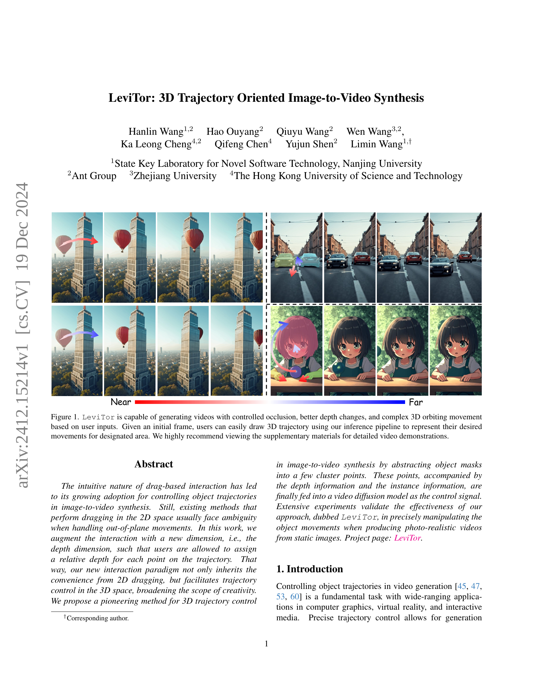
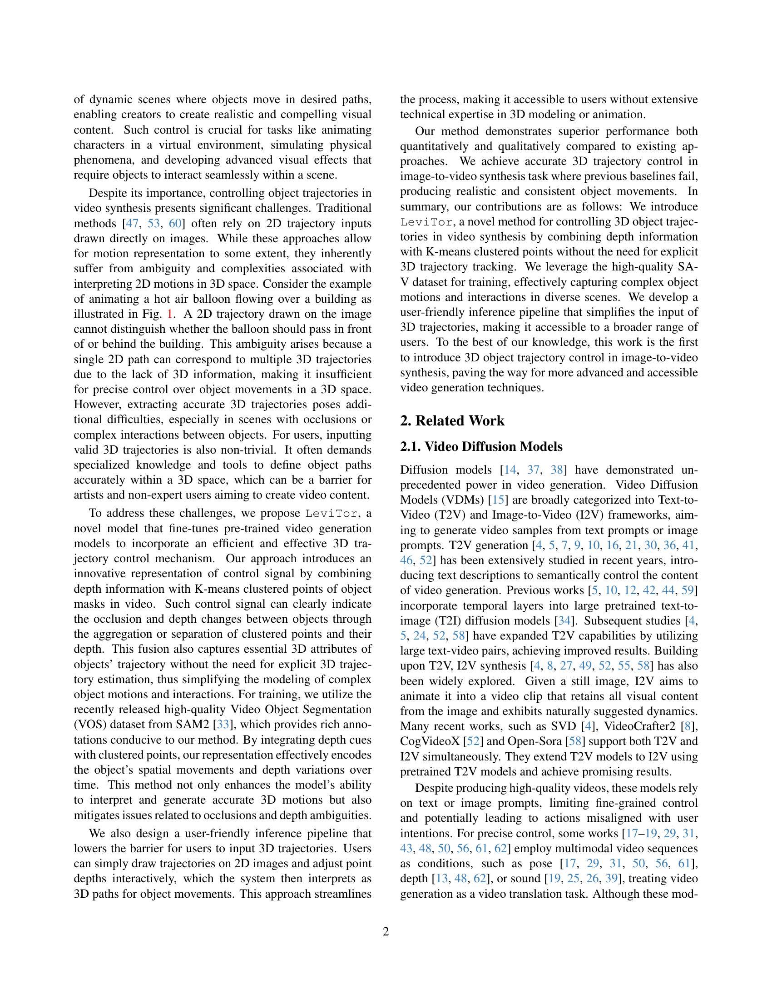
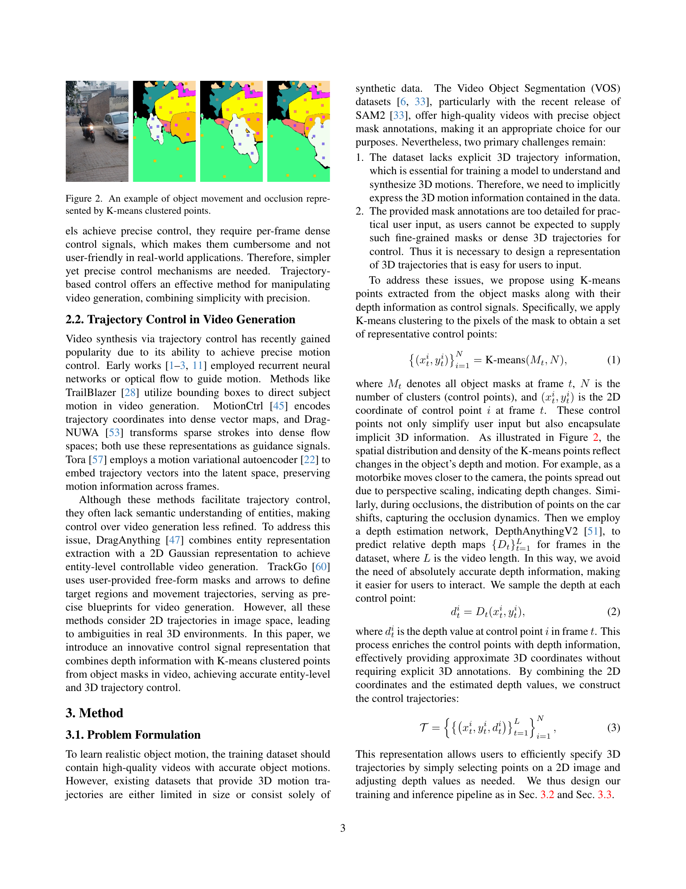
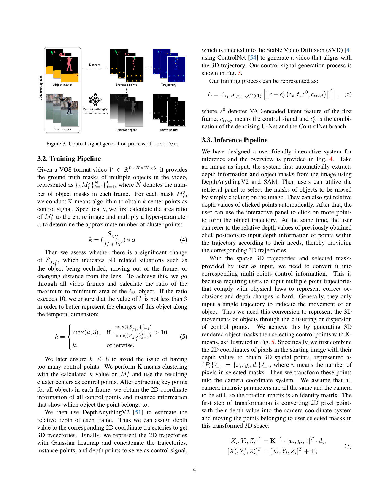
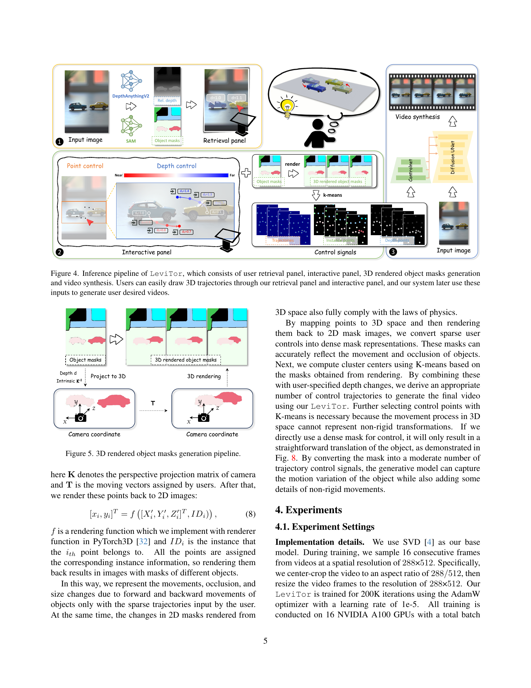
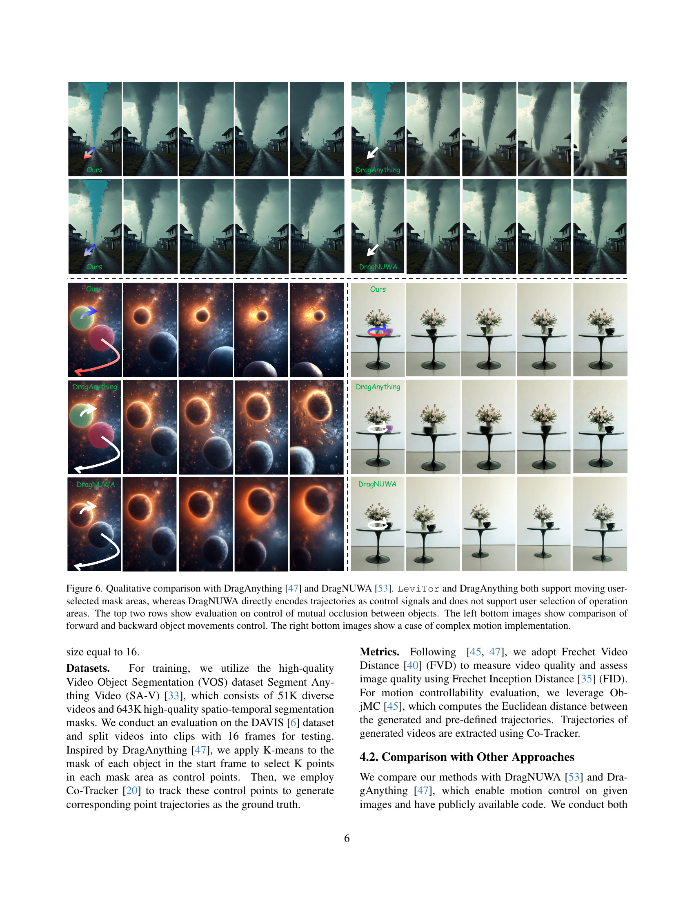
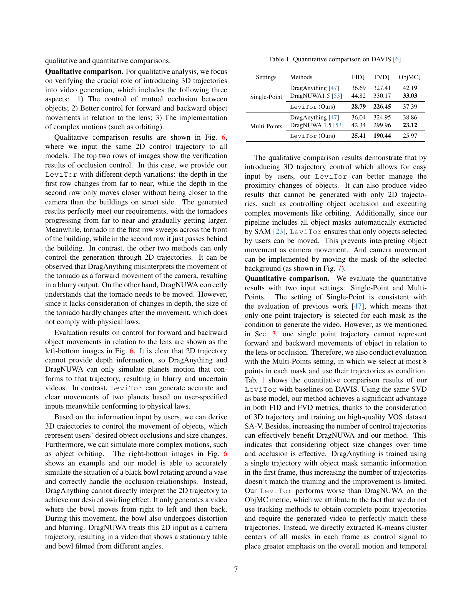
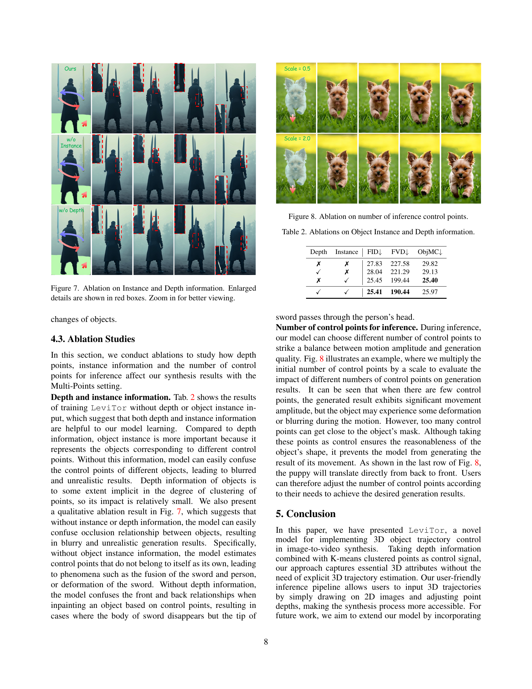
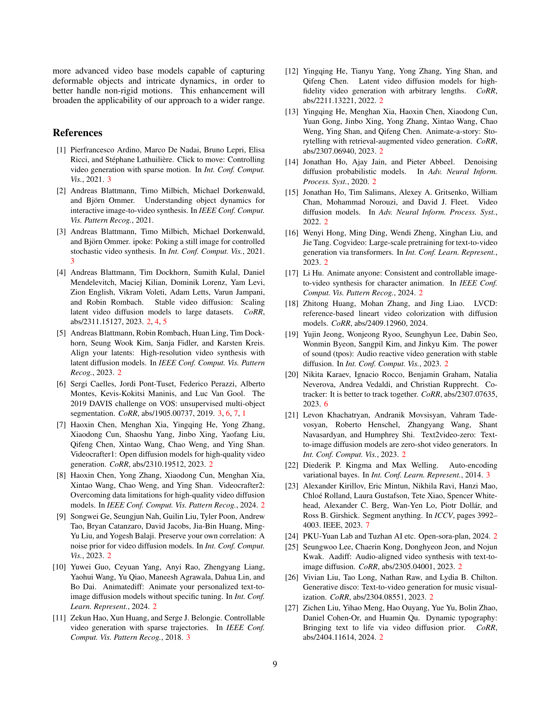
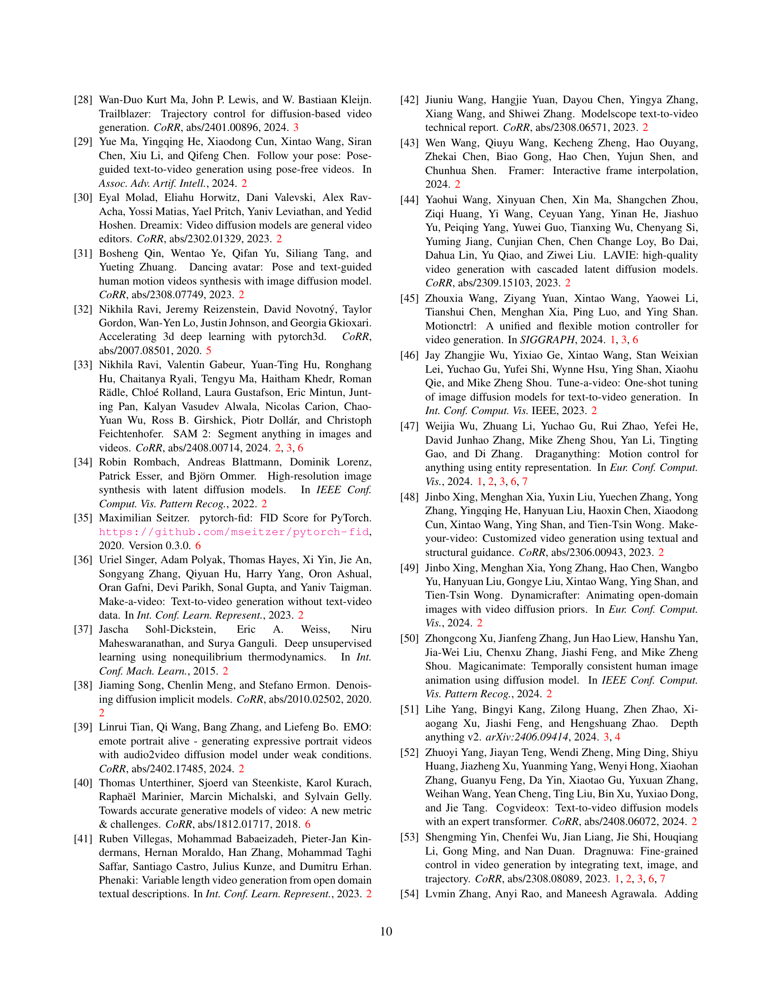
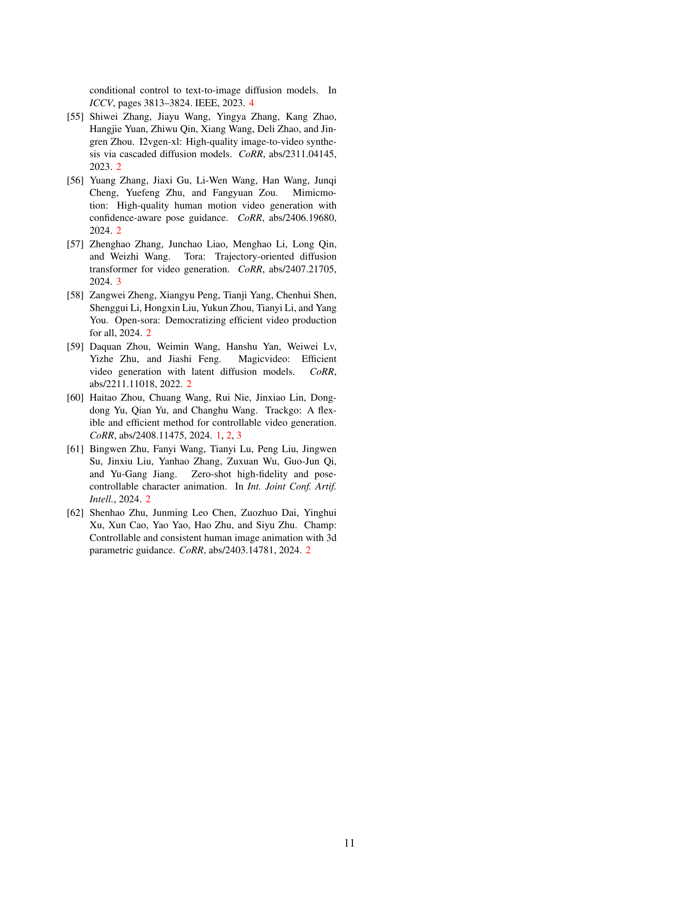
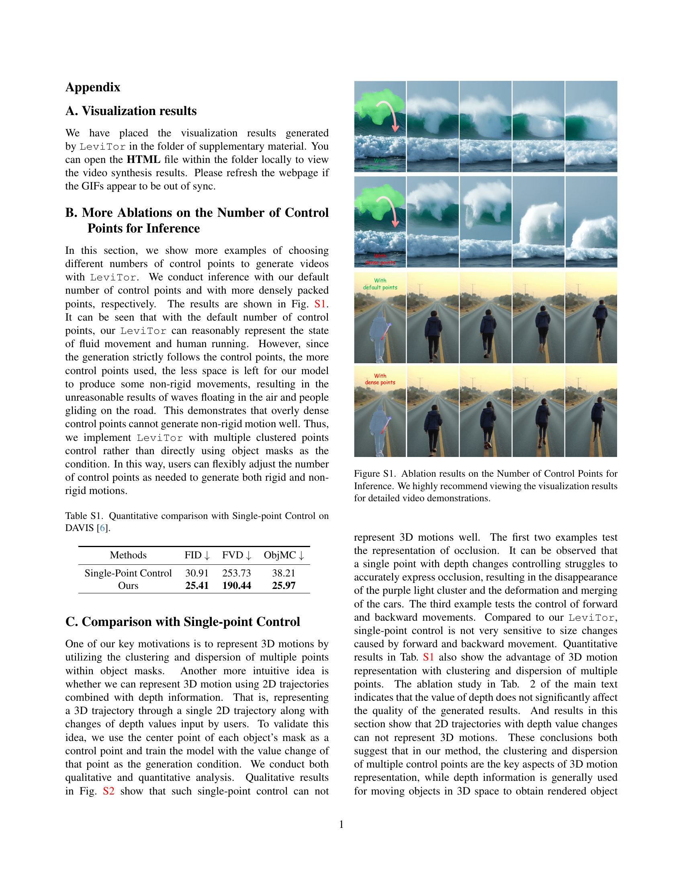
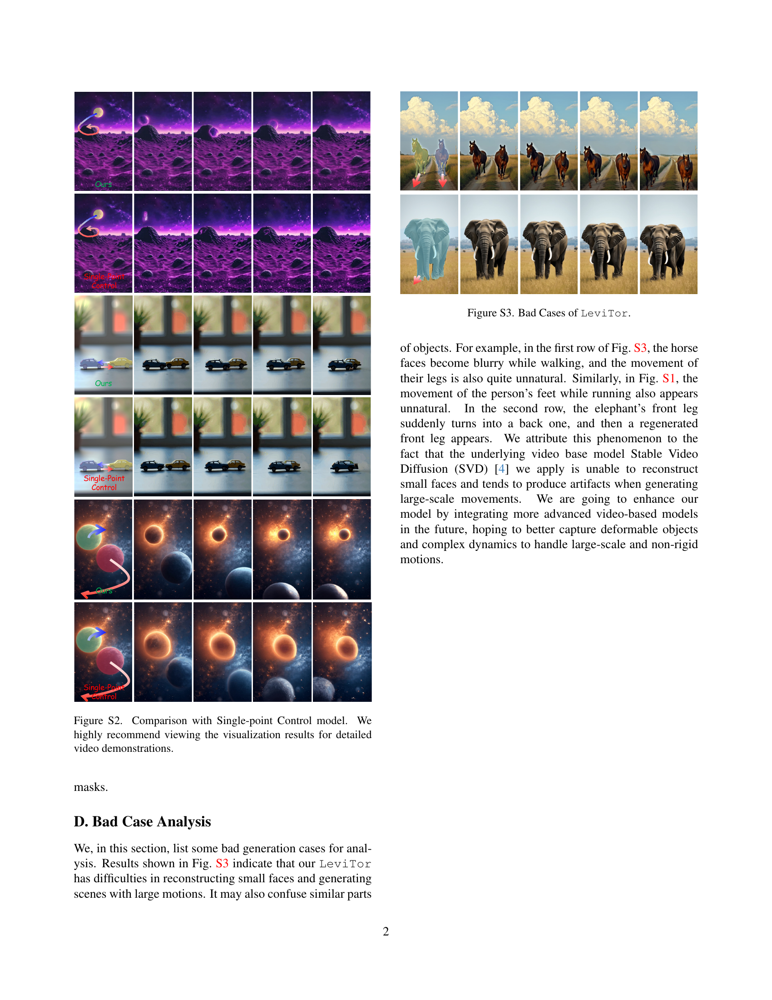
