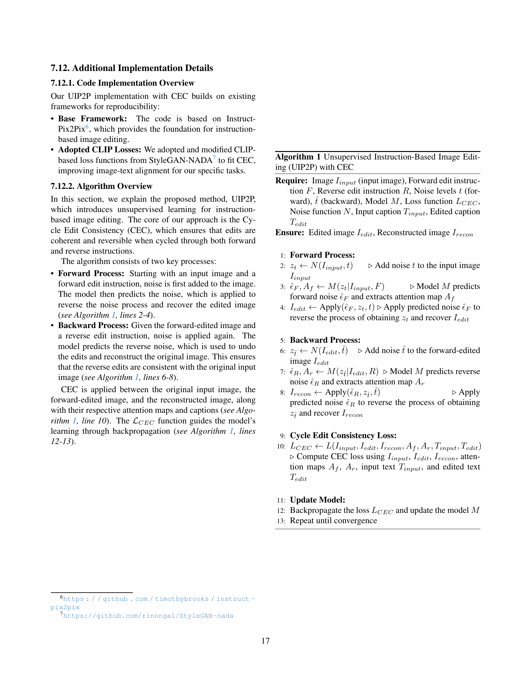

 


 2412.15216 
 Enis Simsar et el. 
 
 🤗 2024-12-20 
 



↗ arXiv


↗ Hugging Face


↗ Papers with Code


### TL;DR



기존의 지도 학습 기반 이미지 편집 모델들은 정답 데이터에 의존하며, 데이터셋의 편향성과 제한적인 편집 유형으로 인해 성능 저하 및 일반화 어려움을 겪었습니다.  특히, 사람이 직접 편집한 데이터나 기존 편집 알고리즘으로 생성한 데이터는 편향된 결과를 만들어낼 가능성이 높습니다. 이러한 문제를 해결하기 위해, 대량의 정답 데이터 없이도 정확하고 일관된 이미지 편집이 가능한 새로운 비지도 학습 기반 모델이 필요합니다.

본 논문에서는 **순환 편집 일관성(CEC)**이라는 새로운 기법을 제안하여, 이러한 문제들을 해결합니다.  CEC는 순방향과 역방향 편집 과정을 통해 일관성을 유지하고, CLIP 임베딩을 활용하여 이미지와 텍스트 간의 정렬을 강화합니다.  **실제 이미지 데이터셋**을 사용한 실험 결과, 본 논문에서 제안하는 모델이 기존 모델들보다 우수한 성능을 보임을 보여줍니다. 또한, **다양한 유형의 편집**에 대한 높은 정확도와 효율성을 달성하였으며,  **데이터셋에 대한 의존성을 줄이고 확장성을 높였다**는 점에서 큰 의미를 가집니다.



#### Key Takeaways


 비지도 학습 기반 이미지 편집 모델을 통해 기존의 지도 학습 방식의 한계점인 데이터 의존성 문제를 해결했습니다. 



 순환 편집 일관성(CEC) 기법을 도입하여, 이미지와 어텐션 공간에서의 일관성을 유지하며 정확하고 효율적인 편집을 수행합니다. 



 다양한 실제 이미지 데이터셋에서의 우수한 성능을 통해, 모델의 확장성 및 일반화 능력을 입증했습니다. 


#### Why does it matter?
본 논문은 **지도 학습 방식의 한계를 극복하고, 다양한 실제 이미지 데이터셋에서도 효과적으로 작동하는 비지도 학습 기반 이미지 편집 모델**을 제시하여, **영상 편집 분야의 발전과 확장성에 크게 기여**할 것으로 예상됩니다.  특히, 기존 방법들의 한계점인 **데이터셋의 편향성 및 제한적인 편집 유형** 문제를 해결하며, 다양한 응용 분야에서의 활용 가능성을 높였습니다. 또한, 제안된 방법의 효율성과 확장성은 향후 연구의 새로운 방향을 제시할 뿐만 아니라, **실제 응용 서비스 개발에 직접적인 영향**을 미칠 것으로 예상됩니다.

------
#### Visual Insights

> 🔼 그림 1은 본 논문에서 제안하는 비지도 학습 기반 이미지 편집 방법인 UIP2P의 성능을 보여줍니다.  기존의 지도 학습 방식과 달리, UIP2P는 사전에 편집된 이미지 데이터 없이도 정확하고 일관성 있는 이미지 편집을 수행합니다.  (a)와 (b)는 실제 이미지를, (c)와 (d)는 합성 이미지를 사용한 편집 결과를 보여주며, UIP2P가 기존 최첨단 모델들보다 더욱 정확하고, 이미지 구조를 잘 유지하면서 일관된 편집 결과를 생성함을 보여줍니다.  특히, UIP2P는 배경이나 다른 객체를 손상시키지 않고 원하는 부분만 정확하게 편집하는 것을 확인할 수 있습니다.
> 

> 
read the caption

> Figure 1: Unsupervised InstructPix2Pix. Our approach achieves more precise and coherent edits while preserving the structure of the scene. UIP2P outperforms state-of-the-art models in both real images (a. and b.) and synthetic images (c. and d.).
> 


| Input Caption | Edit Instruction | Edited Caption | Reverse Instruction |
|---|---|---|---| 
| 
IP2P
 | A man wearing a denim jacket | make the jacket a rain coat | A man wearing a rain coat | make the coat a denim jacket |
|  | A sofa in the living room | add pillows | A sofa in the living room with pillows | remove the pillows |
| … | … | … | … |
| 
CCXM
 | Person on the cover of a magazine | make the person a cat | Cat on the cover of the magazine | make the cat a person |
| A tourist rests against a concrete wall | give him a backpack | A tourist with a backpack rests against a concrete wall | remove his backpack |
| … | … | … | … |

> 🔼 표 1은 역방향 지시 생성에 대한 내용을 담고 있습니다. 기존의 InstructPix2Pix(IP2P) 데이터셋에 대해서 본 논문의 방법론을 통해 자동으로 역방향 지시어를 생성하는 과정을 보여줍니다. 수동으로 편집된 이미지가 필요 없다는 것을 보여주는 것이죠.  더 나아가 CC3M과 CC12M 데이터셋(CCXM으로 표기)에 대해서도 편집 지시어, 편집된 캡션, 역방향 지시어를 생성한 결과를 보여줍니다.  이는 GEMINI Pro와 GEMMA2와 같은 대규모 언어 모델(LLM)을 사용하여 생성되었음을 알 수 있습니다. 즉, 이 표는 본 논문에서 제안하는 비지도 학습 기반 이미지 편집 방법의 핵심적인 부분인 역방향 지시어 자동 생성 능력을 보여주는 실질적인 예시를 제공합니다.
> 

> 
read the caption

> Table 1: Reverse Instruction Generation. Our method generates reverse instructions for the IP2P dataset, eliminating the need for manually edited images. Additionally, edit instructions, edited captions, and reverse instructions are generated for CC3M and CC12M datasets—denoted as CCXM. The texts are generated by LLMs such as GEMINI Pro, and GEMMA2.
> 

### In-depth insights

#### Unsupervised Edit
**비지도 학습 기반 이미지 편집**은 기존 지도 학습 방식의 한계를 극복하기 위한 혁신적인 시도입니다. **기존 방식은 정답이 표시된 이미지 데이터셋**에 의존하여 모델을 학습시키는 반면, **비지도 학습은 이러한 제약 없이** 이미지와 텍스트 정보만으로 모델 학습을 수행합니다. 이는 데이터 수집 및 가공의 어려움을 해결하고, 모델의 일반화 능력을 향상시킬 수 있는 장점을 가집니다. 하지만 **정답 데이터 없이 학습**하기 때문에 정확도와 일관성 유지를 위한 새로운 기술이 필요하며, **주로 순환 편집 일관성(CEC)**과 같은 기법을 통해 해결하고자 합니다.  **CEC는 순방향 및 역방향 편집의 일관성**을 강조하여 편집의 정확성과 이미지 구조 유지를 동시에 달성합니다.  비지도 학습 기반 이미지 편집은 **데이터 제약에서 자유롭고**, 다양한 편집 작업에 유연하게 대처할 수 있는 가능성을 제시하지만, **성능과 안정성 면에서 추가적인 연구**가 필요한 분야입니다.

#### Cycle Consistency
본 논문에서 제안하는 순환 일관성(Cycle Consistency, CC)은 **지도 학습 방식의 한계를 극복**하기 위해 고안된 핵심 개념입니다. 기존의 지도 학습 기반 이미지 편집 방법들은 정답 이미지를 필요로 하지만, CC는 **정답 이미지 없이도 일관된 편집 결과**를 얻을 수 있도록 합니다.  **순방향 편집과 역방향 편집의 결과가 일치**하도록 하는 과정을 통해, 모델은 사용자의 의도를 보다 정확하게 이해하고, 이미지의 구조를 유지하면서 정교한 편집을 수행할 수 있습니다.  **CLIP 임베딩 공간**에서의 일관성 유지를 통해, 의미론적(semantic) 일관성까지 확보하여, 보다 자연스럽고 정확한 편집 결과를 얻는 것이 CC의 주요 장점입니다.  즉, CC는 **비지도 학습 방식**으로 **데이터셋의 한계를 뛰어넘어** 다양한 이미지 편집 작업에 적용 가능하도록 하는 혁신적인 기술이라고 할 수 있습니다.

#### CLIP-Based Edits
CLIP 기반 편집에 대한 심층적인 논의는 **영상 편집에서의 의미론적 이해와 정확성을 크게 향상시키는 잠재력**을 보여줍니다.  CLIP의 강력한 이미지-텍스트 정렬 기능은 사용자의 의도를 명확히 파악하고, **세밀한 편집 작업을 수행**하는 데 중요한 역할을 합니다. 하지만, **CLIP의 한계점 또한 존재**합니다. 예를 들어, 다의성을 지닌 단어나 모호한 지시어는 CLIP이 잘못 해석할 가능성이 있습니다. 또한, CLIP 자체는 편집 과정의 맥락을 완전히 이해하지 못하므로, **직관적이지 않거나 불완전한 편집 결과**를 초래할 수 있습니다. 따라서, CLIP 기반 편집 시스템을 설계할 때는 **이러한 한계점을 고려하여 보완책**을 마련해야 합니다.  예를 들어, 추가적인 맥락 정보를 제공하거나, 다중 모드 입력을 활용하는 방식을 통해 CLIP의 해석 정확도를 높이고 사용자 경험을 개선할 수 있을 것입니다.  **미래 연구는 CLIP의 한계를 극복하고 보다 강력한 의미론적 이해를 가능하게 하는 새로운 접근법**에 초점을 맞춰야 할 것입니다.

#### Ablation Study
본 논문의 ablation study는 **다양한 손실 함수 (loss function)들의 기여도를 정량적으로 분석**하여 모델 성능에 미치는 영향을 밝히는 데 초점을 맞추고 있습니다.  **기본 손실 함수(LCLIP, Lrecon)에 추가적인 손실 함수들을 단계적으로 추가**하면서 성능 변화를 측정하여 각 손실 함수의 중요성과 상호작용을 평가합니다. 특히,  **CLIP 유사도 손실(Lsim)과 어텐션 맵 일관성 손실(Lattn)의 효과**를 중점적으로 분석,  **Lsim은 모델이 편향 없이 편집을 수행**하도록 돕고, **Lattn은 공간적 일관성을 유지**하여 목표 영역에 대한 정확한 편집을 가능하게 함을 보여줍니다.  결과적으로, ablation study는 제안된 모델의 설계 선택이 최종 성능에 얼마나 중요한 역할을 하는지, 그리고 각 구성 요소 간의 상호 작용이 어떻게 최적의 결과를 만드는 데 기여하는지에 대한 통찰력을 제공합니다.  **모든 손실 함수를 결합했을 때 가장 높은 성능**을 달성함으로써, 제안된 접근 방식의 유효성을 더욱 강화합니다.

#### Future Directions
본 논문은 비지도 학습 기반 이미지 편집에 대한 새로운 접근 방식을 제시하며, 향후 연구 방향으로 **다양한 유형의 이미지 편집 작업에 대한 일반화 능력 향상**을 제시합니다. 이를 위해 **더욱 강력한 이미지-텍스트 정렬 모델**을 활용하거나, **다양한 데이터셋을 활용한 추가적인 학습**을 통해 모델의 범용성을 높일 수 있습니다. 또한, **편집 과정의 효율성을 높이는 연구**가 필요하며, **편집 결과의 질적 향상**을 위한 추가적인 연구도 진행되어야 합니다. 특히, **복잡하고 다의적인 사용자 지시에 대한 이해도를 높이는 연구**는 실제 응용 분야에서의 유용성을 극대화하는 데 중요한 역할을 할 것입니다. 마지막으로, **윤리적인 문제점들을 해결**하기 위한 연구가 필수적이며, 특히 **딥페이크 생성 및 악용 가능성**에 대한 심도 깊은 논의와 방지책 마련이 필요합니다.

### More visual insights

More on figures

> 🔼 그림 2는 InstructPix2Pix 데이터셋에서 Prompt-to-Prompt 방식으로 이미지 편집 시 발생하는 편향의 예시를 보여줍니다. 각 예시는 입력 이미지, Prompt-to-Prompt로 생성된 편집된 이미지, 그리고 해당 편집 지시 사항을 보여줍니다. (a)는 속성 얽힘 편집으로, 여성의 드레스를 수정하는 것이 배경도 의도치 않게 변경하는 경우를 보여줍니다. (b)는 장면 얽힘 편집으로, 오두막을 성으로 변환하는 것이 주변 요소에도 영향을 미치는 경우를 보여줍니다. (c)는 전역 장면 변경으로, 이미지를 흑백으로 변환하는 것이 전체 장면을 변경하는 경우를 보여줍니다.  이 그림은 Prompt-to-Prompt 기법의 한계점, 즉, 부분적인 수정이 전체 이미지에 예상치 못한 영향을 미칠 수 있다는 점을 시각적으로 보여줍니다.
> 

> 
read the caption

> Figure 2: Examples of biases introduced by Prompt-to-Prompt in the InstructPix2Pix dataset. Each example shows an input image and its corresponding edited image (generated by Prompt-to-Prompt) along with the associated edit instruction. (a) Attribute-entangled edits: modifying the lady’s dress also unintentionally changes the background. (b) Scene-entangled edits: transforming the cottage into a castle affects surrounding elements. (c) Global scene changes: converting the image to black and white alters the entire scene.
> 

> 🔼 그림 3은 본 논문에서 제안하는 비지도 학습 기반 이미지 편집 모델 UIP2P의 학습 구조를 보여줍니다.  입력 이미지와 앞으로 적용할 편집 지시어를 입력받아 InstructPix2Pix 모델을 사용하여 편집된 이미지를 생성합니다.  그런 다음, 반대의 편집 지시어를 적용하여 원본 이미지를 재구성함으로써 Cycle Edit Consistency (CEC)를 강화합니다.  이 과정을 통해 모델은 지시어에 따른 이미지 편집을 학습하고, 앞뒤 지시어의 일관성을 유지하며 정확한 편집 결과를 얻을 수 있도록 합니다.  CEC는 모델의 정확성과 신뢰성을 높이는 핵심 요소입니다.
> 

> 
read the caption

> Figure 3: Overview of the UIP2P training framework. The model learns instruction-based image editing by utilizing forward and reverse instructions. Starting with an input image and a forward instruction, the model generates an edited image using IP2P. A reverse instruction is then applied to reconstruct the original image, enforcing Cycle Edit Consistency (CEC).
> 

> 🔼 그림 4는 다양한 이미지 편집 작업에 대한 UIP2P의 성능을 보여줍니다. InstructPix2Pix, MagicBrush, HIVE, MGIE, SmartEdit 등 기존 방법들과 비교하여, UIP2P가 요청된 편집을 정확하게 적용하면서도 이미지의 일관성을 유지하는 우수한 성능을 보임을 보여줍니다. 그림은 다양한 데이터셋과 작업(색상 변경, 개체 추가/제거, 구조적 변경 등)에 대한 결과를 포함하며, UIP2P가 기존 방법들과 비교하여 동등하거나 더 나은 결과를 생성함을 시각적으로 보여줍니다.
> 

> 
read the caption

> Figure 4: Qualitative Examples. UIP2P performance is shown across various tasks and datasets, compared to InstructPix2Pix, MagicBrush, HIVE, MGIE, and SmartEdit. Our method demonstrates either comparable or superior results in terms of accurately applying the requested edits while preserving visual consistency.
> 

> 🔼 이 그림은 MagicBrush 테스트 세트에 대해 제로샷 정량적 비교를 보여줍니다. MagicBrush에 미세 조정되지 않은 지시 기반 이미지 편집 방법이 제시됩니다. 다중 턴 설정에서 대상 이미지는 초기 이미지에서 반복적으로 편집됩니다.  이 그림은 여러 지시 기반 이미지 편집 방법의 성능을 비교 분석하여 각 방법의 강점과 약점을 보여주고 있습니다. 특히,  MagicBrush 데이터셋에 사전 학습되지 않은 모델들의 성능을 보여줌으로써, 제로샷 성능 평가의 중요성을 강조합니다. 다중 턴 설정에서 초기 이미지가 반복적으로 수정되는 과정을 통해 모델의 점진적 편집 능력과 안정성을 평가합니다.
> 

> 
read the caption

> (a) Zero-shot Quantitative Comparison on MagicBrush [50] test set. Instruction-based editing methods that are not fine-tuned on MagicBrush are presented. In the multi-turn setting, target images are iteratively edited from the initial images.
> 

> 🔼 그림 (b)는 논문의 실험 결과 중 하나로, IP2P 테스트 데이터셋에서 UIP2P와 IP2P의 성능을 비교한 것입니다.  CLIP 이미지 유사도와 CLIP 텍스트-이미지 유사도 지표를 사용하여 두 모델의 시각적 충실도와 지시어 일치도를 평가했습니다. 결과적으로 UIP2P는 시각적 정확도와 지시어 따름 측면에서 IP2P보다 우수한 성능을 보였습니다.  즉, UIP2P가 생성한 이미지가 지시어에 더 잘 부합하고 원본 이미지의 시각적 특징을 더 잘 유지한다는 것을 의미합니다.
> 

> 
read the caption

> (b) Evaluation on the IP2P test dataset. UIP2P outperforms IP2P in both CLIP image similarity and CLIP text-image similarity metrics, demonstrating better visual fidelity and instruction alignment.
> 

> 🔼 그림 5는 제시된 논문에서 UIP2P 모델의 성능을 평가하기 위해 사용된 두 가지 데이터셋, 즉 MagicBrush 테스트셋과 IP2P 테스트셋에 대한 결과를 보여줍니다.  (a)는 MagicBrush 테스트셋에서 UIP2P 모델과 다른 여러 이미지 편집 모델들의 제로샷 성능을 비교 분석한 결과를 보여줍니다.  여기에는 CLIP 이미지 유사도와 CLIP 텍스트-이미지 유사도 지표가 포함되어 모델의 시각적 정확도와 지시어 충실도를 평가합니다. (b)는 IP2P 테스트셋에서 UIP2P 모델과 IP2P 모델의 성능을 비교하여 CLIP 이미지 유사도와 CLIP 텍스트-이미지 유사도를 통해 두 모델의 시각적 충실도와 지시어 정렬을 평가합니다.  각 그래프는 상대적인 성능을 직관적으로 보여주는 그래프 형태로 표현되어 있습니다. 특히, 다양한 설정(단일 턴, 다중 턴)과 데이터셋(IP2P, CC3M, CC12M)에서의 성능 비교를 통해 UIP2P의 견고성과 일반화 능력을 확인할 수 있습니다.
> 

> 
read the caption

> Figure 5: Evaluation on MagicBrush and IP2P test datasets.
> 

> 🔼 그림 6은 다양한 단계의 확산 과정을 사용하여 UIP2P와 IP2P의 성능을 비교 분석한 것입니다. UIP2P는 이미지 편집에 고화질을 유지하면서도 적은 단계의 확산 과정만으로도 효과적으로 이미지를 편집할 수 있음을 보여줍니다. 반면 IP2P는 이미지 품질을 유지하기 위해 더 많은 단계의 확산 과정이 필요하다는 것을 보여줍니다. 이는 UIP2P가 이미지 편집의 효율성을 높이는 데 효과적임을 시사합니다.
> 

> 
read the caption

> Figure 6: Ablation study on the number of steps. UIP2P achieves high fidelity edits on the input image with fewer steps, whereas IP2P struggles to maintain quality.
> 

More on tables


| Models | (Q1) | (Q2) |
|---|---|---|
| IP2P | 8% | 12% |
| MagicBrush | 17% | 18% |
| HIVE | 14% | 13% |
| MGIE | 20% | 19% |
| SmartEdit | 19% | 18% |
| UIP2P | 22% | 20% |
> 🔼 본 논문의 표 2는 사용자 연구 결과를 보여줍니다. 총 52명의 참가자를 대상으로 6가지 이미지 편집 방법(IP2P, MagicBrush, HIVE, MGIE, SmartEdit, UIP2P)에 대한 선호도 조사를 실시했습니다. 각 참가자는 15개의 이미지 편집 작업에 대해 가장 좋은 두 가지 방법을 선택했고, 그 기준은 편집 결과가 지시사항과 얼마나 잘 일치하는지(Q1), 그리고 지시사항과 관련 없는 영역의 디테일이 얼마나 잘 보존되는지(Q2)였습니다. 표에는 각 방법이 상위 두 가지 방법으로 선택된 비율이 요약되어 있습니다.
> 

> 
read the caption

> Table 2: User Study.
> 


| Settings | Methods | L1 ↓ | L2 ↓ | CLIP-I ↑ | DINO ↑ | CLIP-T ↑ |
|---|---|---|---|---|---|---|
| **Single-turn** | HIVE [51] | 0.1092 | 0.0341 | 0.8519 | 0.7500 | 0.2752 |
|  | InstructPix2Pix [3] | 0.1122 | 0.0371 | 0.8524 | 0.7428 | 0.2764 |
|  | UIP2P w/ IP2P Dataset | 0.0722 | 0.0193 | 0.9243 | 0.8876 | 0.2944 |
|  | UIP2P w/ CC3M Dataset | 0.0680 | 0.0183 | 0.9262 | 0.8924 | 0.2966 |
|  | UIP2P w/ CC12M Dataset | 0.0619 | 0.0174 | 0.9318 | 0.9039 | 0.2964 |
| **Multi-turn** | HIVE [51] | 0.1521 | 0.0557 | 0.8004 | 0.6463 | 0.2673 |
|  | InstructPix2Pix [3] | 0.1584 | 0.0598 | 0.7924 | 0.6177 | 0.2726 |
|  | UIP2P w/ IP2P Dataset | 0.1104 | 0.0358 | 0.8779 | 0.8041 | 0.2892 |
|  | UIP2P w/ CC3M Dataset | 0.1040 | 0.0337 | 0.8816 | 0.8130 | 0.2909 |
|  | UIP2P w/ CC12M Dataset | 0.0976 | 0.0323 | 0.8857 | 0.8235 | 0.2901 |
> 🔼 이 표는 MagicBrush 벤치마크에서 추가적인 손실 함수를 기본 손실 함수에 추가했을 때 성능이 향상되는 것을 보여주는 ablation 연구 결과를 보여줍니다. 기본 손실 함수(LCLIP, Lrecon)에  CLIP 유사도 손실(Lsim)과 어텐션 맵 일관성 손실(Lattn)을 추가함으로써 성능 향상을 확인할 수 있습니다.  Lsim은 이미지 공간과 텍스트 공간의 변화 방향을 정렬하여 이미지 수정이 의도된 의미를 반영하도록 합니다. Lattn은 순방향과 역방향 편집 모두에서 이미지의 동일한 영역에 집중하여 공간 일관성을 보장합니다.
> 

> 
read the caption

> Table 3: Ablation study on loss functions. Adding additional loss functions to the base loss functions enhances performance on the MagicBrush benchmark.
> 


| Loss | L1 ↓ | L2 ↓ | CLIP-I ↑ | DINO ↑ | CLIP-T ↑ |
|---|---|---|---|---|---| 
| Base | 0.117 | 0.032 | 0.878 | 0.806 | **0.309** |
| + $
mathcal{L}_{sim}$ | 0.089 | 0.024 | 0.906 | 0.872 | 0.301 |
| + $
mathcal{L}_{attn}$ | **0.062** | **0.017** | **0.932** | **0.904** | 0.296 |
> 🔼 이 표는 본 논문에서 제시하는 역방향 명령어 데이터셋의 유연성을 보여주는 예시입니다.  같은 캡션에 대해 여러 가지 변환을 적용하여 생성된 데이터셋을 보여줍니다.  표에는 두 가지 다른 입력 캡션과 각 캡션에 대해 네 가지의 서로 다른 편집 명령어(예: 색상 변경, 객체 추가, 객체 제거, 위치 변경)와 그에 따른 결과 캡션이 나와 있습니다.  이를 통해 본 논문의 데이터셋 생성 과정이 다양한 변환을 처리할 수 있음을 보여줍니다.  즉, 역방향 명령어를 통해 원본 이미지로 되돌릴 수 있는 다양한 편집이 가능함을 의미합니다.
> 

> 
read the caption

> Table 4: Examples of Four Possible Edits for Two Different Input Captions. Our dataset generation process showcases the flexibility of the reverse instruction dataset by demonstrating multiple transformations for the same caption.
> 


| Input Caption | Edit Instruction | Edited Caption | Reverse Instruction |
|---|---|---|---| 
A dog sitting on a couch | change the dog’s color to brown | A brown dog sitting on a couch | change the dog’s color back to white |
|  | add a ball next to the dog | A dog sitting on a couch with a ball | remove the ball |
|  | remove the dog | An empty couch | add the dog back |
|  | move the dog to the floor | A dog sitting on the floor | move the dog back to the couch |
| A car parked on the street | change the car color to red | A red car parked on the street | change the car color back to black |
|  | add a bicycle next to the car | A car parked on the street with a bicycle | remove the bicycle |
|  | remove the car | An empty street | add the car back |
|  | move the car to the garage | A car parked in the garage | move the car back to the street |
> 🔼 표 5는 MagicBrush 데이터셋을 사용한 정량적 비교 결과를 보여줍니다.  단일 턴 설정과 다중 턴 설정 모두에 대한 결과가 포함되어 있으며, 다중 턴 설정에서는 대상 이미지가 초기 이미지에서 반복적으로 편집됩니다.  표에는 다양한 평가 지표(L1, L2, CLIP-I, DINO, CLIP-T)에 대한 수치가 제시되어 있으며, 각 지표에서 가장 좋은 성능을 보인 결과는 굵은 글씨체로 표시되어 있습니다.  이를 통해 다양한 방법들의 성능을 정량적으로 비교하고, 특히 UIP2P 방법의 성능을 다른 방법들과 비교하여 UIP2P의 우수성을 보여줍니다.
> 

> 
read the caption

> Table 5: Quantitative comparison on MagicBrush [50] test set. In the multi-turn setting, target images are iteratively edited from the initial source images. Best results are in bold.
> 

### Full paper



