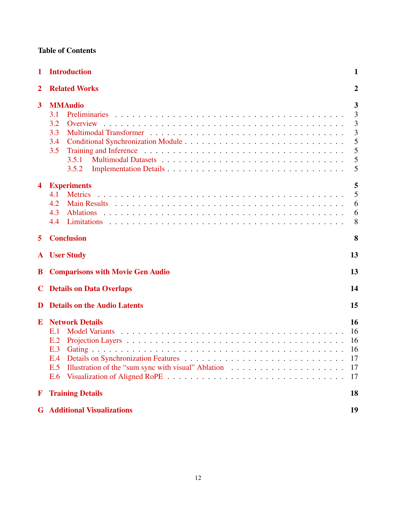

 


 2412.15322 
 Ho Kei Cheng et el. 
 
 🤗 2024-12-23 
 



↗ arXiv


↗ Hugging Face


↗ Papers with Code


### TL;DR



기존의 비디오-오디오 합성 연구는 제한된 양의 데이터로 인해 고품질의 오디오를 생성하는 데 어려움을 겪고 있었습니다. 특히, **의미적으로 일관성 있고 시간적으로 정확하게 정렬된 오디오**를 생성하는 것은 큰 과제였습니다. 또한, 기존의 방법들은 **비디오 데이터에만 의존**하여 학습하는 경우가 많아, 더 많은 데이터를 활용하는 데 한계가 있었습니다.

본 연구에서는 이러한 문제를 해결하기 위해 **다중 모드 조인트 학습 프레임워크(MMAudio)**를 제안합니다. MMAudio는 **대규모의 텍스트-오디오 데이터와 비디오-오디오 데이터를 결합**하여 학습함으로써, 의미적으로 일관성 있고 시간적으로 정확하게 정렬된 고품질의 오디오를 생성할 수 있도록 합니다. 또한, **조건부 동기화 모듈**을 통해 비디오-오디오 프레임 레벨에서의 정렬을 향상시켰습니다.  실험 결과, MMAudio는 기존의 최첨단 모델들을 능가하는 성능을 보였으며, **빠른 추론 속도**와 **적은 매개변수**를 가지고 있음을 확인했습니다.



#### Key Takeaways


 대규모 텍스트-오디오 데이터와의 조인트 학습을 통해 고품질의 비디오-오디오 합성 달성 



 조건부 동기화 모듈을 이용한 비디오-오디오 동기화 개선 



 단일 모드 성능 저하 없이 다중 모드 학습의 이점 확보 


#### Why does it matter?
본 논문은 **다중 모드 조인트 학습 프레임워크(MMAudio)**를 통해 고품질의 비디오-오디오 합성을 달성함으로써, **제한된 비디오 데이터의 한계를 극복**하고 **다양한 데이터를 활용하여** 고품질의 오디오 합성 성능을 크게 향상시켰다는 점에서 중요합니다. 또한, 제안된 **조건부 동기화 모듈**을 통해 비디오-오디오 동기화를 개선하여, **실시간 응용 분야**에 대한 가능성을 높였습니다.  이는 향후 **멀티모달 합성 연구**에 중요한 방향을 제시하고 새로운 연구의 길을 열어줄 것입니다.

------
#### Visual Insights

> 🔼 그림 1은 MMAudio 모델의 다중 모드 학습 과정을 보여줍니다.  기존의 오디오-비디오-(텍스트) 데이터셋만 사용하는 것과 달리, 풍부하고 고품질의 오디오-텍스트 데이터를 함께 사용하여 효과적인 데이터 확장을 가능하게 합니다.  추론 단계에서는 MMAudio가 비디오 및/또는 텍스트 안내를 통해 조건에 맞는 오디오를 생성합니다.  즉, 비디오와 텍스트 정보를 모두 활용하여 보다 정확하고 맥락에 맞는 오디오를 생성하는 다중 모드 학습 방식을 강조합니다.
> 

> 
read the caption

> Figure 1: In addition to training on audio-visual-(text) datasets, we perform multimodal joint training with high-quality, abundant audio-text data which enables effective data scaling. At inference, MMAudio generates conditions-aligned audio with video and/or text guidance.
> 

### In-depth insights

#### Multimodal Training
본 논문에서 제시된 다중 모달(Multimodal) 학습 방법은 **비디오와 오디오, 그리고 텍스트 데이터를 결합하여 고품질의 비디오-오디오 합성을 달성**하는 데 중점을 둡니다. 단일 모달 학습 방식과 달리, 다중 모달 학습은 더욱 풍부한 의미 정보를 담고 있는 대규모 데이터셋을 활용하여, **비디오에 담긴 의미를 오디오에 더욱 정확하게 반영**하는 동시에 **시간적 일관성을 향상**시킵니다.  **대규모 텍스트-오디오 데이터셋을 함께 학습**시켜 모델이 의미론적으로 일치하는 고품질 오디오 샘플을 생성할 수 있도록 하며, 조건부 동기화 모듈을 통해 비디오 조건과 오디오 레이턴트를 프레임 단위로 정렬함으로써, **오디오-비주얼 동기화를 개선**합니다. 이러한 다중 모달 학습 전략은 여러 모달 간의 상호 작용을 통해 더욱 강력하고 정확한 비디오-오디오 합성 모델을 구축할 수 있다는 것을 보여주는 중요한 연구 결과입니다.

#### Foley Synthesis
이 논문은 **폴리 사운드 합성**이라는 매력적인 주제에 대해 깊이 있게 다룹니다. 폴리 사운드는 영화나 비디오 게임에서 환경음이나 사운드 효과를 생성하는 데 사용되는 기술입니다. 이 논문은 기존의 폴리 사운드 합성 방법의 한계를 지적하고, **다중 모달 접근 방식**을 사용하여 고품질의 동기화된 폴리 사운드를 생성하는 새로운 프레임워크를 제시합니다. **비디오와 텍스트 데이터를 결합하여 학습**함으로써, 모델은 더욱 풍부한 의미를 이해하고 시각적 정보와 음향적 정보 사이의 연관성을 더 잘 파악하여 보다 정확하고 자연스러운 폴리 사운드를 생성할 수 있습니다. 또한, **프레임 단위의 동기화 모듈**을 도입하여 비디오와 오디오 간의 정확한 시간적 정렬을 달성함으로써, 더욱 실감나는 폴리 사운드 합성을 가능하게 합니다. 이 논문의 핵심적인 기여는 **대규모 데이터셋을 활용한 다중 모달 학습**과 **정교한 동기화 메커니즘**을 통해 고품질의 폴리 사운드 합성을 가능하게 했다는 점입니다.  향후 연구는 더욱 다양하고 복잡한 시나리오에 대한 일반화 능력 향상에 초점을 맞춰야 할 것입니다.

#### Sync Module
본 논문에서 제시된 ‘Sync Module’은 비디오-오디오 동기화 문제를 해결하기 위한 핵심 모듈로, **단순한 어텐션 메커니즘을 넘어 프레임 단위의 정밀한 시간 정렬을 가능하게 합니다.** 기존의 접근 방식들이 갖는 한계점인 단순한 어텐션을 극복하기 위해, **고해상도 시각 정보를 활용한 조건부 동기화** 전략을 채택합니다. 이를 통해, 영상과 오디오 사이의 미세한 시간적 어긋남을 효과적으로 수정하여, **사람이 인지할 수 있는 수준의 높은 정확도를 달성합니다.**  특히, 자가 지도 학습 방식의 비동기 감지기(Synchformer)를 활용하여, 오디오-비주얼 비동기화 여부를 정확하게 판단하여, 이를 모델에 통합하는 방식이 돋보입니다.  **이러한 정밀한 프레임 단위 동기화는 낮은 추론 시간을 유지하면서 고품질의 오디오 생성에 크게 기여합니다.** 또한, 다양한 프레임 속도를 갖는 영상과 오디오의 데이터 통합을 위한 ROPE(Rotary Position Embedding) 기법을 적용하여, 높은 프레임 비율의 시각적 특징과 오디오 특징을 효과적으로 정렬합니다.  결과적으로, **Sync Module은 단순한 시간적 정렬을 넘어, 의미적으로 일관성 있는 고품질 오디오 합성을 가능하게 하는 핵심적인 역할을 수행**합니다.

#### Ablation Study
본 논문의 ablation study는 **다양한 모듈 및 데이터셋 구성 요소의 영향을 체계적으로 분석**하여 모델 성능에 대한 심층적인 이해를 제공합니다.  **다중 모드 학습(multimodal training)의 중요성**, **시간 정렬 모듈(synchronization module)의 효과**, 그리고 **데이터 크기의 영향** 등을 면밀히 조사하여 각 구성 요소가 최종 결과에 미치는 영향을 정량적으로 제시합니다. 특히, **단일 모드(single-modality) 학습과의 비교**를 통해 다중 모드 학습의 우수성을 명확히 보여주고,  **모델의 일반화 성능** 개선에 대한 시사점을 제시합니다.  **실험 결과는 제안된 방법의 견고성을 뒷받침**하며, 향후 연구를 위한 중요한 지침을 제공합니다.  **특히, 시간 정렬에 대한 분석은** 음성 합성 분야에서 시간 정합(temporal alignment)의 정확성을 높이기 위한 새로운 방향을 제시하는 데 중요한 의미를 가집니다.  전반적으로, ablation study는 모델의 작동 원리를 명확히 이해하고 성능을 향상시키는 데 기여하며, **결과의 신뢰성을 높이는 데 중요한 역할**을 수행합니다.

#### Future Works
본 논문의 MMAudio 모델은 비디오-오디오 합성 분야에서 상당한 발전을 이루었지만, **여전히 개선의 여지가 많다.**  향후 연구 방향으로는 다음 세 가지를 제안할 수 있다. 첫째, **더욱 다양하고 방대한 데이터셋을 활용**하여 모델의 일반화 능력을 향상시켜야 한다. 현재 사용된 VGGSound, AudioCaps, WavCaps 데이터셋은 규모 면에서 한계가 있으며, 다양한 환경과 상황을 포괄하지 못한다. 따라서 더욱 풍부하고 다채로운 오디오-비주얼 데이터를 확보하고, 다양한 언어와 문화를 반영하는 멀티모달 데이터를 구축하는 것이 중요하다. 둘째, **모델의 효율성을 개선**해야 한다. 현재 MMAudio는 상대적으로 많은 계산 자원을 필요로 하므로, 경량화된 모델을 개발하여 실시간 처리가 가능하도록 하는 연구가 필요하다. 이를 위해서는 모델 압축, 지식 증류, 효율적인 네트워크 구조 설계 등의 기법을 활용할 수 있다. 셋째, **다른 모달리티와의 통합**을 고려해야 한다. MMAudio는 비디오, 오디오, 텍스트 세 가지 모달리티를 통합했지만, 향후 연구에서는 시각적 정보 외에도 다른 감각 정보 (촉각, 후각 등)를 통합하여 더욱 현실감 있는 오디오 합성을 구현할 수 있다.  또한, **모델의 해석성을 높이는 연구**도 중요하다. 현재 모델은 블랙박스와 같이 작동하기 때문에, 모델의 내부 동작 과정을 이해하고 분석하는 것이 어렵다. 따라서 모델의 해석성을 높이기 위한 연구가 필요하며, 이를 통해 모델의 신뢰성을 높이고 예측 불가능성을 줄일 수 있다. 이러한 추가적인 연구를 통해 MMAudio 모델은 더욱 발전하고, 다양한 분야에 적용될 수 있을 것이다.

### More visual insights

More on figures

> 🔼 그림 2는 MMAudio의 흐름 예측 네트워크를 보여줍니다. 비디오, 텍스트 및 오디오 레이턴트는 다중 모드 트랜스포머 네트워크에서 공동으로 상호 작용합니다. 동기화 모델(3.4절)은 정확한 시청각 동기화를 위해 프레임 정렬 동기화 기능을 주입합니다.  좀 더 자세히 설명하자면,  네트워크는 다양한 모드(비디오, 텍스트, 오디오)의 정보를 처리하는 다중 모드 트랜스포머 블록과 오디오 전용 트랜스포머 블록으로 구성됩니다. 입력된 비디오와 텍스트는 각각 CLIP을 통해 특징 벡터로 변환되고, 오디오는 VAE를 통해 레이턴트 공간으로 표현됩니다. 이러한 다양한 모드의 특징 벡터들은 공동으로 처리되어 시맨틱 정렬을 이룹니다.  3.4절에서 설명하는 조건부 동기화 모듈은 Synchformer로부터 추출된 프레임 수준의 시각적 특징을 사용하여 오디오와 비디오의 정확한 시간적 정렬을 담당합니다.  최종적으로, 생성된 레이턴트 벡터는 VAE를 통해 오디오 파형으로 디코딩됩니다. 이 그림은 MMAudio가 다양한 모드의 정보를 효율적으로 통합하고 시청각 동기화를 개선하는 구조를 보여줍니다.
> 

> 
read the caption

> Figure 2:  Overview of the MMAudio flow-prediction network. Video conditions, text conditions, and audio latents jointly interact in the multimodal transformer network. A synchronization model (Section 3.4) injects frame-aligned synchronization features for precise audio-visual synchrony.
> 

> 🔼 그림 3은 다양한 기존 방법들과 제안하는 방법(MMAudio)을 사용하여 생성한 오디오의 스펙트로그램과 실제 오디오의 스펙트로그램을 시각적으로 비교한 것입니다.  MMAudio는 시각적 입력에 의해 설명되지 않거나 실제 오디오에 존재하지 않는 소리를 생성하는 다른 방법들과 달리, 실제 오디오와 매우 유사한 소리 효과를 생성하는 것을 보여줍니다.  즉, MMAudio가 시각 정보와 오디오의 일치도가 가장 높다는 것을 시각적으로 보여주는 그림입니다.
> 

> 
read the caption

> Figure 3: We visualize the spectrograms of generated audio (by prior works and our method) and the ground-truth. Note our method generates the audio effects most closely aligned to the ground-truth, while other methods often generate sounds not explained by the visual input and not present in the ground-truth.
> 

> 🔼 표 2는 AudioCaps 테스트 세트에 대한 텍스트 음성 변환 결과를 보여줍니다. 공정한 비교를 위해, 저자들은 [11]의 평가 프로토콜을 따라 모든 기준 모델을 재현하였으며, 동일한 평가 프로토콜 하에 공식적으로 공개된 체크포인트를 사용하여 결과를 재현했습니다. 이 표는 다양한 모델의 성능을 비교하여 모델의 강점과 약점을 파악하는 데 도움이 됩니다.
> 

> 
read the caption

> Table 2: Text-to-audio results on the AudioCaps test set. For a fair comparison, we follow the evaluation protocol of [11] and transcribe all baselines directly from [11], who have reproduced those results using officially released checkpoints under the same evaluation protocol.
> 

### Full paper



