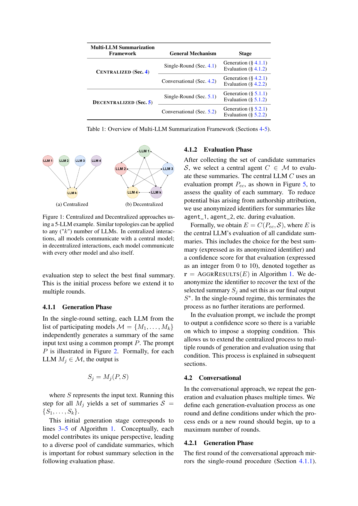

 


 2412.15487 
 Jiangnan Fang et el. 
 
 🤗 2024-12-23 
 



↗ arXiv


↗ Hugging Face


↗ Papers with Code


### TL;DR



기존의 단일 거대 언어 모델(LLM)을 이용한 장문 요약은 긴 문서의 중요 정보를 간과하거나 균형 잡히지 않은 요약을 생성하는 등의 한계를 가지고 있습니다. 본 연구는 이러한 문제를 해결하고자 **다수의 LLM을 활용한 새로운 요약 프레임워크**를 제시합니다. 이 프레임워크는 **중앙 집중식과 분산식** 두 가지 접근 방식을 제시하며, 각각의 LLM이 서로 다른 요약을 생성하고, 최종적으로 가장 좋은 요약을 선택하는 방식으로 작동합니다.

본 연구는 제시된 프레임워크를 통해 **단일 LLM 기반 요약 방식보다 최대 3배 향상된 성능**을 달성했습니다.  **프롬프트 엔지니어링, LLM 수, 생성 및 평가 전략의 다양한 조합**이 요약 품질에 미치는 영향에 대한 실험적 분석 결과 또한 제시됩니다.  **분산 방식**의 경우에도 중앙 집중 방식과 유사한 성능을 보이며, 상황에 맞는 유연한 선택지를 제공합니다.



#### Key Takeaways


 다수의 LLM을 활용한 새로운 장문 요약 프레임워크 제안 



 중앙 집중식 및 분산식 두 가지 전략 비교 분석을 통한 성능 향상 검증 



 프롬프트 엔지니어링, LLM 수, 생성 및 평가 전략 조합 등 다양한 요소가 요약 품질에 미치는 영향 분석 


#### Why does it matter?
본 논문은 **장문 요약의 어려움을 해결하기 위해 다수의 거대 언어 모델(LLM)을 활용한 새로운 프레임워크**를 제시합니다. 기존의 단일 LLM 방식의 한계를 극복하고, 여러 LLM의 강점을 결합하여 요약 품질을 향상시키는 데 중점을 둡니다. **중앙 집중식 및 분산식 두 가지 접근 방식**을 제시하고 실험적으로 그 효과를 검증하여, **장문 요약 분야의 새로운 연구 방향**을 제시합니다. 이는 다양한 분야의 연구자들에게 중요한 시사점을 제공하며, 향후 연구의 발전에 크게 기여할 것으로 예상됩니다.

------
#### Visual Insights

> 🔼 이 그림은 논문의 멀티-LLM 요약 프레임워크에서 중앙 집중식 접근 방식을 보여줍니다. 여러 개의 LLM이 입력 텍스트를 독립적으로 요약하고, 중앙 LLM이 생성된 요약들을 평가하여 최상의 요약을 선택하는 과정을 나타냅니다. 각 LLM은 서로 다른 색상의 원으로 표현되며, 중앙 LLM은 큰 원으로 표시되어 있습니다. 화살표는 LLM 간의 정보 흐름을 보여줍니다.
> 

> 
read the caption

> (a) Centralized
> 


| Multi-LLM Summarization |  |  |
|---|---|---|
| **Framework** | **General Mechanism** | **Stage** |
| **Centralized** (Sec. 4) | **Single-Round** (Sec. 4.1) | Generation (§ 4.1.1) |
|  |  | Evaluation (§ 4.1.2) |
|  | **Conversational** (Sec. 4.2) | Generation (§ 4.2.1) |
|  |  | Evaluation (§ 4.2.2) |
| **Decentralized** (Sec. 5) | **Single-Round** (Sec. 5.1) | Generation (§ 5.1.1) |
|  |  | Evaluation (§ 5.1.2) |
|  | **Conversational** (Sec. 5.2) | Generation (§ 5.2.1) |
|  |  | Evaluation (§ 5.2.2) |

> 🔼 이 표는 논문의 4장과 5장에 걸쳐 설명하는 다양한 Multi-LLM 요약 프레임워크들을 개괄적으로 보여줍니다.  각 프레임워크는 요약 생성과 평가 단계를 포함하며, 중앙 집중식 및 분산식 전략에 따라 세분화됩니다. 표에는 각 전략의 단일 라운드 및 대화형 접근 방식, 그리고 사용된 생성 및 평가 메커니즘이 요약되어 있습니다.
> 

> 
read the caption

> Table 1:  Overview of Multi-LLM Summarization Framework (Sections 4-5).
> 

### In-depth insights

#### Multi-LLM Summarization
본 논문에서 제시된 "Multi-LLM Summarization"은 **단일 LLM의 한계를 극복하기 위해 다수의 LLM을 활용하는 새로운 접근법**입니다.  중앙 집중식과 분산식 두 가지 전략을 제시하여 각각의 강점을 보여줍니다. 특히, **대규모 문서 요약에 있어 기존의 방법론보다 우수한 성능**을 보임을 실험을 통해 입증합니다.  **다양한 LLM의 조합과 상호작용 방식**을 통해 보다 정확하고 포괄적인 요약을 생성하며, 이는 특히 긴 문서에서 효과적입니다.  **프롬프트 엔지니어링 및 모델 선택**을 통해 성능을 최적화하고, 짧은 문서에 대한 요약에도 효과적임을 보여줍니다. 하지만, **계산 비용 증가** 및 다수 모델 간의 조정 과정에서 발생할 수 있는 복잡성은 추가적인 연구가 필요한 부분입니다.  **본 연구는 다양한 LLM의 시너지 효과를 활용**하여 요약 성능을 향상시키는 새로운 가능성을 제시하며, 향후 연구의 방향을 제시합니다.

#### Framework Topologies
본 논문에서 제시된 다양한 프레임워크 토폴로지는 **중앙 집중식**과 **분산식** 접근 방식이라는 두 가지 주요 전략을 중심으로 논의됩니다. 중앙 집중식 접근 방식은 여러 개의 LLM이 각자 요약문을 생성한 후, 단일 LLM 평가자가 최종 요약문을 선택하는 구조입니다. 이는 효율성이 높지만, **평가자 LLM의 편향**에 취약할 수 있습니다. 반면 분산식 접근 방식은 모든 LLM이 상호 정보를 교환하고 협력적으로 요약문을 개선하는 구조입니다. 이는 더욱 **견고하고 다양한 요약문**을 생성할 수 있지만, 복잡성과 연산 비용이 높아질 수 있습니다. 두 가지 토폴로지 모두 장단점을 가지고 있으므로, 사용자의 요구사항 및 자원 제약에 따라 적절한 토폴로지를 선택하는 것이 중요합니다.  **프롬프트 엔지니어링**, LLM의 수, 생성 및 평가 LLM의 조합 등 여러 변수가 요약 품질에 영향을 미치므로, 다양한 변수들을 고려하여 최적의 시스템을 구성해야 합니다.

#### Ablation Study
**제거 연구(Ablation Study)**는 머신러닝 모델의 성능에 특정 구성 요소가 미치는 영향을 평가하기 위해 설계되었습니다. 이 연구는 모델의 다양한 측면을 체계적으로 제거하여 각 구성 요소의 기여도를 측정하고 모델의 전반적인 성능에 대한 이해를 높이는 데 도움이 됩니다.  **본 논문에서 제거 연구는 다양한 변수(예: 모델 조합, 평가 LLM, 라운드 수 등)**에 대해 수행되었으며, 각 변수가 요약 성능에 미치는 영향을 정량적으로 분석했습니다. **이를 통해, 최적의 모델 구성 및 매개변수 설정을 도출하여 요약 성능을 향상**시킬 수 있었습니다. 특히, 다양한 LLM을 결합한 다중 LLM 접근 방식의 효과와 다양한 모델 구성의 성능 차이를 분석하여 **다중 LLM 기반 요약의 강점과 한계**를 명확하게 제시하였습니다.  **제거 연구의 결과는 모델의 설계 및 개선에 중요한 시사점**을 제공합니다.  이 연구는 다중 LLM 기반 요약 방법의 실용성과 효율성을 보여주는 동시에, 향후 연구 방향을 제시하는 데 기여할 것으로 기대됩니다.

#### Cost Analysis
본 논문의 '비용 분석' 부분은 **중앙 집중식 및 분산식 다중 LLM 요약 방법**의 계산 비용을 세부적으로 분석합니다. 특히, 각 라운드의 입력 및 출력 토큰 수를 고려하여 토큰 수가 라운드 수와 모델 수에 따라 어떻게 변하는지 보여줍니다. **중앙 집중식 방법**은 평가 단계에서 단일 LLM을 사용하기 때문에 비용이 상대적으로 적지만, **분산식 방법**은 모든 LLM이 모든 요약을 평가해야 하므로 비용이 더 많이 듭니다.  하지만, 분산식 방법은 여러 모델의 의견을 종합하여 더욱 강건한 결과를 얻을 수 있다는 장점이 있습니다.  **토큰 수 제한 및 반복 횟수 제어**를 통해 전반적인 계산 비용을 관리할 수 있음을 강조하며, 실제로 사용된 토큰 수를 제시함으로써 분석의 신뢰성을 높입니다.  **최적의 비용 대비 성능**을 얻기 위한 다양한 모델 조합 및 매개변수 설정에 대한 추가적인 분석이 필요함을 시사합니다.

#### Future Work
본 논문에서 제시된 다중 LLM 요약 프레임워크는 **장문 요약에 대한 새로운 접근 방식**을 제시하지만, 여전히 개선의 여지가 많습니다.  **다양한 LLM의 조합**에 대한 추가적인 실험을 통해 최적의 모델 조합을 찾는 연구가 필요하며, **다양한 도메인과 텍스트 유형**에 대한 적용 가능성을 더욱 확장해야 합니다.  **프롬프트 엔지니어링 기법**을 고도화하여 요약 품질을 향상시키고,  **대규모 데이터셋**을 활용한 추가적인 학습을 통해 성능을 개선할 수 있습니다. 또한, 본 연구에서 제시된 중앙 집중식 및 분산식 접근 방식 외에도 **새로운 아키텍처**를 탐색하여 효율성과 정확성을 동시에 개선하는 방안을 모색할 수 있습니다. **계산 비용 최소화**를 위한 효율적인 알고리즘 개발도 중요한 과제입니다.  마지막으로, **요약 품질 평가 지표**의 한계를 극복하기 위한 더욱 정교한 평가 방법론 연구도 필요합니다.

### More visual insights

More on tables


|               |                     | ROUGE-1 ↑ | ROUGE-L ↑ |       | BLEU-1 ↑ | BLEU-4 ↑ |       | ROUGE-1 ↑ | ROUGE-L ↑ |       | BLEU-1 ↑ | BLEU-4 ↑ |       |
| :------------ | :------------------ | :--------: | :--------: | :----: | :--------: | :--------: | :----: | :--------: | :--------: | :----: | :--------: | :--------: | :----: |
|               |                     |  ArXiv    |  ArXiv    |       |  ArXiv    |  ArXiv    |       | GovReport | GovReport |       | GovReport | GovReport |       |
|               | LLaMA3-8B           |   0.180   |   0.106   |       |   0.084   |   0.021   |       |   0.403   |   0.177   |       |   0.242   |   0.079   |       |
|               | GPT-3.5             |   0.193   |   0.114   |       |   0.093   |   0.026   |       |   0.390   |   0.178   |       |   0.226   |   0.084   |       |
|               | GPT-4o mini         |   0.217   |   0.118   |       |   0.108   |   0.020   |       |   0.384   |   0.156   |       |   0.224   |   0.058   |       |
|               | GPT-4o              |   0.165   |   0.095   |       |   0.073   |   0.015   |       |   0.372   |   0.155   |       |   0.211   |   0.059   |       |
| **Decentralized** | Multi-LLM 3 round max |   0.313   |   0.163   |       |   0.200   |   0.029   |       |   0.447   |   0.180   |       |   0.458   |   0.098   |       |
|               | Multi-LLM 1 round max |   0.339   |   0.180   |       |   0.224   |   0.043   |       |   0.468   |   0.190   |       |   0.477   |   0.112   |       |
| **Centralized**  | Multi-LLM 3 round max |   0.329   |   0.168   |       |   0.217   |   0.031   |       |   0.468   |   0.189   |       |   0.470   |   0.109   |       |
|               | Multi-LLM 1 round max |   0.333   |   0.173   |       |   0.219   |   0.036   |       |   0.479   |   0.197   |       |   0.485   |   0.121   |       |
> 🔼 표 2는 중앙 집중식 및 분산형 Multi-LLM 접근 방식에 대한 결과를 보여줍니다. Multi-LLM 파이프라인에 참여하는 모델은 GPT-3.5와 GPT-4o mini입니다. 중앙 집중식 방법의 경우 평가자로 GPT-3.5를 사용하고, 중앙 집중식 및 분산형 방법 모두에서 GPT-3.5 요약문을 동점자 결정에 사용합니다.  표에는 ArXiv와 GovReport 데이터셋에 대한 ROUGE-1, ROUGE-L, BLEU-1, BLEU-4 점수가 포함되어 있으며, 각 방법의 성능을 비교 분석할 수 있습니다. 즉, 단일 LLM 기반 방법 대비 Multi-LLM 방법의 성능 향상 정도를 확인할 수 있습니다.
> 

> 
read the caption

> Table 2:  Results for the decentralized and centralized Multi-LLM approaches. For the multi-LLM pipelines participating models are GPT-3.5 and GPT-4o mini. The results use GPT-3.5 for the evaluator in the centralized approach, and summaries from GPT-3.5 are chosen in tie-breaking for both centralized and de-centralized approaches.
> 


|                       | Max Rounds | Multi-LLM Model Combination | ROUGE-1 ↑ | ROUGE-L ↑ |  | BLEU-1 ↑ | BLEU-4 ↑ | 
| :-------------------- | :---------- | :----------------------------- | :-------- | :-------- | :- | :-------- | :-------- | 
| **Decentralized**     | **3 Rounds** | **GPT-3.5** & GPT-4o mini       | **0.328**  | **0.167**  |   | **0.217**  | **0.030**  | 
|                       |             | GPT-4o & **GPT-3.5**           | 0.313     | 0.159     |   | 0.197     | 0.025     | 
|                       |             | GPT-4o & **GPT-4o mini**       | 0.302     | 0.152     |   | 0.185     | 0.022     | 
|                       | **1 Rounds** | **GPT-3.5** & GPT-4o mini       | **0.333**  | **0.173**  |   | **0.218**  | **0.036**  | 
|                       |             | GPT-4o & **GPT-3.5**           | 0.328     | 0.170     |   | 0.212     | 0.033     | 
|                       |             | GPT-4o & **GPT-4o mini**       | 0.305     | 0.153     |   | 0.189     | 0.023     | 
| **Centralized**      | **3 Rounds** | **GPT-3.5** & GPT-4o mini       | 0.312     | 0.163     |   | 0.199     | **0.029**  | 
|                       |             | GPT-4o & **GPT-3.5**           | **0.325**  | **0.166**  |   | **0.214**  | **0.029**  | 
|                       |             | GPT-4o & **GPT-4o mini**       | 0.304     | 0.153     |   | 0.188     | 0.022     | 
|                       | **1 Rounds** | **GPT-3.5** & GPT-4o mini       | 0.338     | **0.180**  |   | 0.224     | **0.042**  | 
|                       |             | GPT-4o & **GPT-3.5**           | **0.339**  | 0.177     |   | **0.228**  | 0.039     | 
|                       |             | GPT-4o & **GPT-4o mini**       | 0.306     | 0.155     |   | 0.190     | 0.022     | 
> 🔼 표 3은 논문에서 제안된 다중 LLM 접근 방식에서 모델 조합을 다르게 사용한 결과를 보여줍니다.  'rounds'는 허용되는 최대 라운드 수를 나타내며, 모든 결과는 ArXiv 데이터셋에 대한 것입니다.  굵은 숫자는 각 라운드-모델 조합에서 가장 좋은 점수를 나타내고, 밑줄 친 숫자는 표의 각 지표에 대한 전반적으로 가장 좋은 점수를 나타냅니다.  중앙 LLM은 파란색으로 강조 표시되고, 분산형 다중 LLM 접근 방식의 경우 동점 해결에 사용된 LLM은 녹색으로 강조 표시됩니다.
> 

> 
read the caption

> Table 3: Varying the combination of models in our Multi-LLM approaches. Note rounds is the max number of rounds allowed and all results are for ArXiv. Bolded numbers are best scores for each round-model combination. Underlined numbers are overall best scores for each metric in this table. Furthermore, the central LLM is highlighted in blue and for the decentralized multi-LLM approaches, we highlight the LLM used for tie-breaking in green.
> 


|                   |                               | Input Tokens | Output Tokens | Average Tokens | Total Tokens |
|-------------------|-------------------------------|---------------|----------------|-----------------|---------------|
| Decentralized     | Multi-LLM 3 round max          | 383.73M       | 25.63M         | 14.62M          | 409.37M       |
|                   | Multi-LLM 1 round max          | 129.36M       | 11.89M         | 11.77M          | 141.25M       |
| Centralized      | Multi-LLM 3 round max          | 216.65M       | 19.55M         | 14.76M          | 236.2M        |
|                   | Multi-LLM 1 round max          | 77.69M        | 6.77M          | 10.56M          | 84.46M        |
> 🔼 표 4는 논문에서 제안된 다중 LLM 요약 방법의 비용 분석을 보여줍니다.  다중 LLM 중앙 집중식 및 분산식 접근 방식 모두에 대해 입력 토큰, 출력 토큰, 평균 토큰, 총 토큰 수를 M(백만) 단위로 분석합니다. 이 표는 각 요약 방법의 계산 비용을 비교하여 효율성을 평가하는 데 도움이 됩니다.  특히, 중앙 집중식 접근 방식과 분산식 접근 방식 간의 비용 차이를 명확하게 보여줍니다.
> 

> 
read the caption

> Table 4: Cost Analysis of our Multi-LLM Decentralized and Centralized Summarization Methods. Note M𝑀Mitalic_M= millions of tokens.
> 


|               |                       |                               | ROUGE-1 ↑ | ROUGE-L ↑ |       | BLEU-1 ↑ | BLEU-4 ↑ | ROUGE-1 ↑ | ROUGE-L ↑ |       | BLEU-1 ↑ | BLEU-4 ↑ |
| :------------ | :-------------------- | :----------------------------- | :-------: | :-------: | :----: | :-------: | :-------: | :-------: | :-------: | :----: | :-------: | :-------: |
| **GPT-4o mini Evaluator** | **Decentralized** | Multi-LLM 3 round max         |  0.317   |  0.160   |       |  0.206   |  0.026   |  **0.445** |  **0.178** |       |  **0.452** |  **0.094** |
|               |                       | Multi-LLM 1 round max         | **0.326** | **0.163** |       | **0.221** | **0.027** |  0.438   |  0.175   |       |  0.446   |  0.089   |
|               | **Centralized**      | Multi-LLM 3 round max         |  0.315   |  0.158   |       |  0.201   |  0.027   |  **0.441** |  **0.176** |       |  **0.447** |  **0.092** |
|               |                       | Multi-LLM 1 round max         | **0.330** | **0.165** |       | **0.222** | **0.028** |  0.439   |  0.175   |       |  0.446   |  0.090   |
| **GPT-3.5 Evaluator**     | **Decentralized** | Multi-LLM 3 round max         |  0.313   |  0.163   |       |  0.200   |  0.029   |  0.447   |  0.180   |       |  0.458   |  0.098   |
|               |                       | Multi-LLM 1 round max         | **0.339** | **0.180** |       | **0.224** | **0.043** |  **0.468** |  **0.190** |       |  **0.477** |  **0.112** |
|               | **Centralized**      | Multi-LLM 3 round max         |  0.329   |  0.168   |       |  0.217   |  0.031   |  0.468   |  0.189   |       |  0.470   |  0.109   |
|               |                       | Multi-LLM 1 round max         | **0.333** | **0.173** |       | **0.219** | **0.036** | **0.479** | **0.197** |       | **0.485** | **0.121** |
| **GPT-4o Evaluator**     | **Decentralized** | Multi-LLM 3 round max         | **0.326** | **0.166** |       | **0.214** | 0.030   |  0.446   |  0.179   |       |  0.456   |  0.098   |
|               |                       | Multi-LLM 1 round max         |  0.325   |  0.165   |       |  0.211   |  0.030   |  **0.456** |  **0.183** |       |  **0.461** |  **0.100** |
|               | **Centralized**      | Multi-LLM 3 round max         |  0.318   |  0.162   |       |  0.206   |  0.027   |  0.449   |  0.181   |       |  0.452   |  0.096   |
|               |                       | Multi-LLM 1 round max         | **0.327** | **0.167** |       | **0.215** | **0.031** |  **0.461** |  **0.186** |       |  **0.467** |  **0.105** |
> 🔼 표 5는 Multi-LLM 접근 방식에 대한 다양한 평가 및 동점자 결정 모델의 결과를 보여줍니다. 동점자 결정 모델은 평가 모델과 동일하게 선택됩니다. 실험 변수의 각 조합에 대해 최상의 결과는 굵게 표시하고, 전반적으로 최상의 결과는 밑줄로 표시합니다. 비교를 용이하게 하기 위해 표 2에서 가장 우수한 성능을 보인 2-LLM 결과를 다시 제시합니다.
> 

> 
read the caption

> Table 5:  Results for different evaluating and tie-breaking models for Multi-LLM approaches. The choice of the tie-breaker models is the same as the choice of evaluator model. We bold the best results for each combination of the experimental variables, and we underline the best results overall. For ease of comparison, we reproduce the best-performing 2-LLM results obtained in Table 2
> 


|   |   |   | ArXiv ROUGE-1 ↑ | ArXiv ROUGE-L ↑ |   | ArXiv BLEU-1 ↑ | ArXiv BLEU-4 ↑ |   | GovReport ROUGE-1 ↑ | GovReport ROUGE-L ↑ |   | GovReport BLEU-1 ↑ | GovReport BLEU-4 ↑ |   |
|---|---|---|---|---|---|---|---|---|---|---|---|---|---|---|
| **2-LLMs**   GPT-3.5 Evaluator | **Decentralized** | 3 rounds | 0.313 | 0.163 |  | 0.200 | 0.029 |  | 0.447 | 0.180 |  | 0.458 | 0.098 |  |
|  |  | 1 rounds | **0.339** | **0.180** |  | **0.224** | **0.043** |  | 0.468 | 0.190 |  | 0.477 | 0.112 |  |
|  | **Centralized** | 3 rounds | 0.329 | 0.168 |  | 0.217 | 0.031 |  | 0.468 | 0.189 |  | 0.470 | 0.109 |  |
|  |  | 1 rounds | 0.333 | 0.173 |  | 0.219 | 0.036 |  | **0.479** | **0.197** |  | **0.485** | **0.121** |  |
| **3-LLMs**   GPT-4o mini Evaluator | **Decentralized** | 3 rounds | **0.301** | **0.154** |  | 0.184 | **0.024** |  | 0.445 | 0.178 |  | 0.449 | 0.095 |  |
|  |  | 1 rounds | 0.299 | 0.152 |  | 0.184 | 0.023 |  | 0.442 | 0.178 |  | 0.447 | 0.094 |  |
|  | **Centralized** | 3 rounds | 0.300 | **0.153** |  | 0.185 | 0.023 |  | **0.443** | 0.178 |  | 0.447 | **0.094** |  |
|  |  | 1 rounds | 0.300 | 0.152 |  | **0.186** | 0.023 |  | 0.442 | 0.178 |  | **0.449** | 0.093 |  |
| **3-LLMs**   GPT-3.5 Evaluator | **Decentralized** | 3 rounds | 0.300 | 0.154 |  | 0.184 | 0.024 |  | 0.446 | 0.179 |  | 0.443 | 0.094 |  |
|  |  | 1 rounds | **0.309** | **0.159** |  | **0.193** | **0.027** |  | **0.451** | **0.182** |  | **0.459** | **0.099** |  |
|  | **Centralized** | 3 rounds | 0.294 | 0.151 |  | 0.177 | 0.023 |  | 0.451 | 0.181 |  | 0.440 | 0.095 |  |
|  |  | 1 rounds | **0.329** | **0.172** |  | **0.214** | **0.036** |  | **0.460** | **0.189** |  | **0.451** | **0.104** |  |
> 🔼 표 6은 세 개의 언어 모델을 사용하는 다중 LLM 프레임워크의 실험 결과를 보여줍니다.  실험 변수(모델 조합, 라운드 수, 중앙/분산 방식 등)의 각 조합에 대해 가장 좋은 결과를 굵게 표시하고, 전반적으로 가장 좋은 결과는 밑줄로 표시했습니다.  비교를 용이하게 하기 위해 표 2에서 얻은 최고 성능의 2-LLM 결과도 함께 제시했습니다. 이 표는 다양한 실험 설정에서 세 개의 LLM을 사용하는 모델이 2개의 LLM을 사용하는 모델에 비해 얼마나 더 좋은 성능을 보이는지 보여줍니다.
> 

> 
read the caption

> Table 6: Multi-LLM framework with three models. We bold the best results for each combination of the experimental variables, and we underline the best results overall. For ease of comparison, we reproduce the best-performing 2-LLM results obtained in Table 2
> 


|                       |                         |               | ROUGE-1 ↑ | ROUGE-L ↑ |   | BLEU-1 ↑ | BLEU-4 ↑ |   | ROUGE-1 ↑ | ROUGE-L ↑ |   | BLEU-1 ↑ | BLEU-4 ↑ |   |
|-----------------------|-------------------------|---------------|----------:|----------:|---|----------:|----------:|---|----------:|----------:|---|----------:|----------:|---|
| **Baseline Prompts** | **Decentralized**       | 3 round max   |   0.313   |   0.163   |   |   0.200   |   0.029   |   |   0.447   |   0.180   |   |   0.458   |   0.098   |   |
|                       |                         | 1 round max   |  **0.339** |  **0.180** |   |  **0.224** |  **0.043** |   |  **0.468** |  **0.190** |   |  **0.477** |  **0.112** |   |
|                       | **Centralized**         | 3 round max   |   0.329   |   0.168   |   |   0.217   |   0.031   |   |   0.468   |   0.189   |   |   0.470   |   0.109   |   |
|                       |                         | 1 round max   |  **0.333** |  **0.173** |   |  **0.219** |  **0.036** |   |  **0.479** |  **0.197** |   |  **0.485** |  **0.121** |   |
| **Specialized Prompts** | **Decentralized**       | 3 round max   |   0.300   |   0.155   |   |   0.201   |   0.025   |   |   0.464   |   0.174   |   |   0.441   |   0.093   |   |
|                       |                         | 1 round max   |  **0.338** |  **0.175** |   |  **0.236** |  **0.040** |   |  **0.469** |  **0.181** |   |  **0.486** |  **0.104** |   |
|                       | **Centralized**         | 3 round max   |   0.316   |   0.162   |   |   0.215   |   0.032   |   |   0.473   |   0.177   |   |   0.452   |   0.101   |   |
|                       |                         | 1 round max   |  **0.355** |  **0.181** |   |  **0.251** |  **0.049** |   |  **0.482** |  **0.185** |   |  **0.494** |  **0.115** |   |
> 🔼 표 7은 기존 방법(표 2)에서 사용된 2개의 단순 프롬프트 대신, 4개의 특수화된 기본 요약을 초기 입력으로 사용했을 때의 결과를 보여줍니다. 중앙 집중식 방법에서는 평가자로 GPT-3.5를, 분산 방식에서는 동점 해소를 위해 GPT-3.5를 사용했습니다. 두 데이터셋 모두에 대해 샘플 크기는 15입니다. 초기 생성에 사용된 프롬프트는 그림 7과 그림 8을 참조하십시오. 실험 변수 조합별 최상의 결과는 굵게 표시하고, 전반적으로 최상의 결과는 밑줄로 표시했습니다.
> 

> 
read the caption

> Table 7: Results on the use of 2 specialized prompts on where the only change in the pipeline is that 4 total specialized baseline summaries are fed in initially instead of the 2 simple prompts fed in the methodology used to curate Table 2. Note that these results use GPT-3.5 for the evaluator in the centralized approach, and for breaking ties in the decentralized multi-LLM approaches. This is for a 15 sample size for both datasets. Refer to Figure 7 and Figure 8 for the prompts used for initial generation. We bold the best results for each combination of the experimental variables, and we underline the best results overall.
> 


| Text Length | Model Type | Round | ROUGE-1 ↑ | ROUGE-L ↑ | BLEU-1 ↑ | BLEU-4 ↑ |
|---|---|---|---|---|---|---|
| Long Text | Decentralized | Multi-LLM 3 round max | 0.329 | 0.168 | 0.217 | 0.031 |
|  |  | Multi-LLM 1 round max | **0.333** | **0.173** | **0.219** | **0.036** |
|  | Centralized | Multi-LLM 3 round max | 0.313 | 0.163 | 0.200 | 0.029 |
|  |  | Multi-LLM 1 round max | **0.338** | **0.180** | **0.224** | **0.043** |
| Short Text | Decentralized | Multi-LLM 3 round max | 0.360 | 0.188 | **0.328** | 0.038 |
|  |  | Multi-LLM 1 round max | **0.369** | **0.198** | 0.309 | **0.044** |
|  | Centralized | Multi-LLM 3 round max | 0.367 | 0.194 | **0.321** | 0.041 |
|  |  | Multi-LLM 1 round max | **0.379** | **0.206** | 0.305 | **0.049** |
> 🔼 표 8은 ArXiv 데이터셋을 사용하여 분산 및 중앙 집중식 Multi-LLM 접근 방식에 대한 짧은 요약 작업의 결과를 보여줍니다.  이 표는 긴 문서에 대한 요약과 짧은 문서에 대한 요약 모두에 대한 결과를 보여주며, ROUGE-1, ROUGE-L, BLEU-1, BLEU-4 지표를 사용하여 요약 품질을 평가합니다. 중앙 집중식 접근 방식에서는 GPT-3.5를 평가자로 사용하고, 분산된 Multi-LLM 접근 방식에서는 동점을 해결하기 위해 GPT-3.5를 사용합니다.  표에는 각 접근 방식과 요약 길이에 따른 여러 측정항목(ROUGE, BLEU)의 점수가 나와있어, 모델 성능을 비교 분석하는데 유용합니다. 특히, 긴 문서와 짧은 문서에 대한 성능 차이를 보여주는 점이 중요합니다.
> 

> 
read the caption

> Table 8: Results on short summarization tasks using the ArXiv dataset for the decentralized and centralized Multi-LLM approaches. Note that these results use GPT-3.5 for the evaluator in the centralized approach, and for breaking ties in the decentralized multi-LLM approaches.
> 

### Full paper



