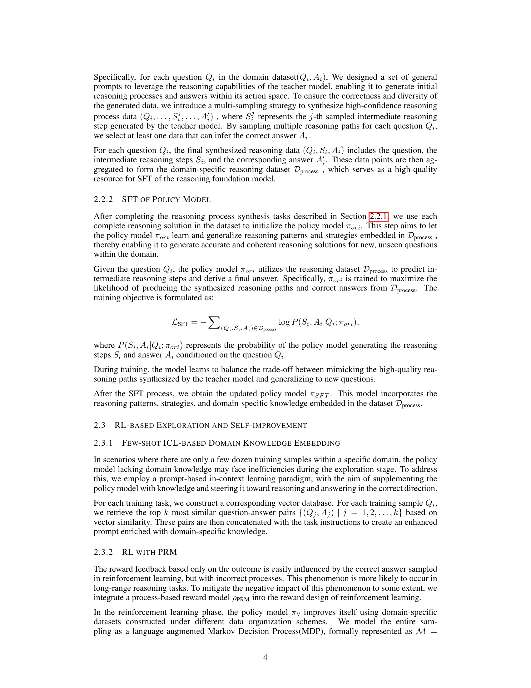

 


 2412.16849 
 Yuxiang Zhang et el. 
 
 🤗 2024-12-24 
 



↗ arXiv


↗ Hugging Face


↗ Papers with Code


### TL;DR



본 연구는 OpenAI의 강화 학습 기반 미세 조정(RFT) 방법을 기반으로, 제한된 도메인 특정 데이터를 사용하여 일반적인 추론 모델을 미세 조정하는 새로운 방법인 OpenRFT를 제시합니다.  기존 RFT 방법은 도메인 특정 데이터의 부족과 추론 단계 데이터의 부재라는 두 가지 주요한 과제에 직면합니다.  이는 도메인 특정 추론 모델의 생성 효율성을 저해하는 요인이 됩니다. 

OpenRFT는 질문 증강, 추론 과정 데이터 합성, 그리고 소수의 ICL(In-Context Learning)을 활용하여 이러한 과제를 해결합니다.  구체적으로, OpenRFT는 도메인 특정 샘플을 활용하여 질문을 다양하게 변형하고, 일반적인 추론 모델을 이용하여 추론 과정 데이터를 합성합니다.  또한, 소수의 ICL을 통해 정책 모델의 탐색 과정을 효율적으로 안내합니다.  실험 결과, OpenRFT는 SciKnowEval 평가에서 각 작업마다 100개의 도메인 특정 샘플만으로도 상당한 성능 향상을 달성했습니다. 이는 제한된 데이터로도 효과적인 도메인 특정 추론 모델을 구축할 수 있음을 보여줍니다.



#### Key Takeaways


 OpenRFT는 제한된 도메인 특정 데이터를 사용하여 일반적인 추론 모델을 효과적으로 미세 조정하는 방법을 제시합니다. 



 질문 증강, 추론 과정 데이터 합성, 그리고 소수의 ICL을 활용하여 도메인 특정 데이터의 부족과 추론 단계 데이터 부재라는 두 가지 과제를 해결합니다. 



 SciKnowEval 평가에서, OpenRFT는 각 작업에 대해 100개의 도메인 특정 샘플만으로도 상당한 성능 향상을 달성했습니다. 


#### Why does it matter?
본 논문은 **제한된 도메인 특정 데이터를 사용하여 추론 기반 모델을 미세 조정하는 새로운 방법**을 제시하여, 연구자들이 도메인 특정 작업에 대한 맞춤형 추론 모델을 효율적으로 생성할 수 있도록 합니다.  **강화 학습 기반 미세 조정의 잠재력을 보여주는 동시에, 도메인 특정 데이터의 부족과 추론 단계 데이터의 부재라는 두 가지 주요 과제를 해결하는 전략**을 제시하여, 추론 모델의 적용 범위를 확장하고, 향후 연구를 위한 새로운 가능성을 제시합니다.  이는 **특히 과학적 지식 추론과 같은 특정 분야에서의 응용 가능성**을 높입니다.  이 연구는 **일반적인 추론 모델의 활용도를 높이고, 강화 학습 기반 미세 조정의 효율성을 증명**함으로써, 관련 분야 연구에 큰 영향을 미칠 수 있습니다.

------
#### Visual Insights

> 🔼 본 그림은 논문의 OpenRFT 프레임워크를 보여줍니다. 데이터 증강(Data Augmentation), SFT 기반 모방(SFT-based Imitation), 그리고 RL 기반 탐색 및 자기 개선(RL-based Exploration and Self-Improvement)의 세 가지 모듈로 구성되어 있습니다. 데이터 증강은 질문을 다시 작성하고 옵션을 섞어 추가적인 도메인 특정 데이터를 생성하는 과정입니다. SFT 기반 모방은 강력한 추론 기반 모델을 교사 모델로 사용하여 도메인 특정 샘플에서 누락된 추론 과정을 합성하고, 이를 통해 학생 정책 모델을 미리 적응시키는 과정입니다. 마지막으로 RL 기반 탐색 및 자기 개선은 도메인 특정 샘플을 몇 번의 시도만으로 ICL(In-Context Learning) 방식으로 정책 모델에 통합하고, PRM(Process Reward Model)의 프로세스 감독 하에 RL 환경 내에서 정책 모델을 지속적으로 최적화하는 과정입니다. 이 그림은 OpenRFT의 전체적인 구조와 각 모듈의 상호 작용을 명확하게 시각적으로 보여주는 역할을 합니다.
> 

> 
read the caption

> Figure 1: OpenRFT framework.
> 


| Model/ Method | Biology (T1) | Chemistry (T2) | Chemistry (T3) | Chemistry (T4) | Physics (T5) | Materials (T6) | Materials (T7) | Materials (T8) | Avg. |
|---|---|---|---|---|---|---|---|---|---|
| GPT-4o-mini | **0.37** | 0.69 | 0.84 | **0.32** | 0.53 | 0.49 | 0.90 | 0.525 | 0.583 |
| o1-mini | 0.35 | **0.86** | **0.87** | 0.23 | **0.73** | **0.70** | **0.87** | 0.50 | **0.639** |
| Vanilla | 0.28 | 0.55 | 0.52 | 0.23 | 0.45 | 0.34 | 0.41 | 0.41 | 0.403 |
| ReFT | 0.27 | 0.50 | 0.52 | 0.23 | 0.44 | 0.33 | 0.41 | 0.50 | 0.402 |
| ReFT+PRM | 0.30 | 0.57 | 0.49 | 0.23 | 0.44 | 0.36 | 0.37 | 0.48 | 0.405 |
| SFT | <ins>0.33</ins> | 0.53 | 0.49 | 0.20 | 0.45 | 0.37 | 0.43 | 0.49 | 0.415 |
| SFT+RL(PRM) | 0.29 | 0.59 | 0.52 | 0.24 | <ins>0.47</ins> | 0.36 | 0.46 | 0.57 | 0.437 |
| SFT+RL(PRM)+DA | 0.29 | 0.63 | <ins>0.53</ins> | 0.21 | <ins>0.47</ins> | <ins>0.38</ins> | 0.48 | <ins>**0.59**</ins> | <ins>0.447</ins> |
| SFT+RL(PRM)+DA+ICL | <ins>0.33</ins> | 0.57 | 0.52 | <ins>0.28</ins> | 0.46 | 0.36 | <ins>0.49</ins> | 0.53 | 0.443 |

> 🔼 표 1은 다양한 모델과 방법의 정확도를 보여줍니다. 굵은 글씨는 가장 높은 정확도 값을 나타내고, 밑줄은 오픈소스 Skywork-o1 기반의 다양한 방법 중 가장 높은 정확도 값을 나타냅니다. 이 표는 다양한 모델(Vanilla, ReFT, ReFT+PRM, SFT, SFT+RL(PRM), SFT+RL(PRM)+DA, SFT+RL(PRM)+DA+ICL)과 비교 모델(GPT-40-mini, 01-mini)의 8가지 과학적 추론 과제(생물학, 화학, 물리학, 재료과학)에 대한 정확도를 보여줍니다. 각 과제는 여러 하위 작업으로 구성되며, 표는 각 모델의 평균 정확도와 각 과제에 대한 정확도를 보여줍니다. 이를 통해 각 모델의 강점과 약점, 그리고 다양한 방법들의 효과를 비교 분석할 수 있습니다.
> 

> 
read the caption

> Table 1: Accuracy of different models/methods. Bold indicates the highest value, while underline indicates the highest value among the different methods based on the open-source Skywork-o1.
> 

### In-depth insights

#### OpenRFT: RFT adaptation
OpenRFT는 강화 학습 기반 미세 조정(Reinforcement Fine-Tuning, RFT) 방법론을 일반적인 추론 기반 모델에 적용하여 도메인 특정 과제에 대한 성능을 향상시키는 기술입니다. **기존 RFT의 한계점인 추론 단계 데이터 부족 및 제한적인 훈련 샘플 수를 해결하기 위해 OpenRFT는 질문 증강, 추론 과정 데이터 생성, 그리고 소수 샷 학습(few-shot ICL) 등의 세 가지 전략을 활용합니다.** 이러한 전략들을 통해 도메인 특정 샘플을 효과적으로 활용하여 모델의 성능을 개선합니다. 특히, **부족한 추론 단계 데이터 문제는 추론 과정 합성 및 지도 학습(SFT)을 통해 해결**하고, **제한적인 샘플 수 문제는 데이터 증강 및 도메인 지식 임베딩 기법으로 완화**합니다. SciKnowEval 데이터셋에서의 실험 결과는 OpenRFT가 각 과제당 100개의 도메인 특정 샘플만으로도 상당한 성능 향상을 달성함을 보여줍니다.  이는 **일반적인 추론 모델을 특정 도메인에 효과적으로 적용**할 수 있음을 시사하며, **RFT 패러다임의 실용성을 높이는 중요한 발견**입니다.  향후 연구는 더욱 강력한 추론 모델과 효율적인 도메인 지식 임베딩 기법을 통해 OpenRFT의 성능을 더욱 개선하는 데 초점을 맞출 것입니다.

#### Domain-Specific RFT
도메인 특화 강화 학습 파인튜닝(RFT)은 일반적인 추론 기반 모델을 특정 도메인 작업에 적용하기 위한 새로운 패러다임을 제시합니다.  **기존의 지도 학습 방식과 달리 RFT는 강화 학습을 통해 모델이 시행착오를 통해 학습하고 추론 과정을 개선**할 수 있도록 합니다.  하지만 RFT는 **추론 단계 데이터 부족과 제한된 학습 데이터 수량이라는 두 가지 주요 과제**에 직면합니다.  이러한 문제를 해결하기 위해 도메인 특정 데이터를 활용한 질문 증강, 추론 과정 데이터 합성, 그리고 소수샷 학습(ICL)과 같은 기법들이 제시됩니다. 이는 모델이 주어진 제한된 데이터를 효과적으로 활용하여 도메인 특화된 추론 능력을 향상시키는 데 도움이 됩니다.  **도메인 특정 RFT의 핵심은 일반적인 추론 모델을 기반으로 도메인 특화된 지식과 추론 과정을 효율적으로 통합**하는 데 있습니다.  따라서 모델의 일반화 능력과 도메인 적응력 사이의 균형을 잘 맞추는 것이 중요합니다.  실험 결과는 제한된 데이터만으로도 상당한 성능 향상을 보여주지만, 더 강력한 추론 기반 모델과 충분한 데이터의 확보가  RFT의 잠재력을 완전히 실현하는 데 중요한 요소임을 시사합니다.

#### OpenRFT Framework
OpenRFT 프레임워크는 제한된 도메인 특정 샘플을 효과적으로 활용하는 데 중점을 둡니다. **데이터 증강**을 통해 더 많은 샘플을 생성하고, **강력한 추론 기반 모델을 교사로 활용**하여 부족한 추론 단계 데이터를 합성합니다.  **SFT(Supervised Fine-Tuning)**를 통해 정책 모델을 사전 적응시키고, **소량의 ICL(In-Context Learning)**을 사용하여 RL(Reinforcement Learning) 탐색 과정을 안내합니다. **PRM(Process Reward Model)**을 도입하여 추론 과정의 합리성을 감독함으로써, RL 학습의 안정성을 높입니다. 이러한 다단계 접근 방식은 제한된 데이터 환경에서도 도메인 특정 과제에 대한 성능을 향상시키는 데 효과적임을 보여줍니다.  **교사 모델과 학생 모델 간의 일관성** 유지가 중요하며, 향후 연구에서는 더욱 강력한 추론 모델과 개선된 PRM을 활용하여 성능을 더욱 개선할 수 있을 것으로 예상됩니다.

#### RFT Challenges Solved
본 논문은 RFT(Reinforcement Fine-Tuning)의 두 가지 주요 과제, 즉 **추론 단계 데이터 부족**과 **제한된 훈련 샘플 수**를 해결하는 방법을 제시합니다.  **OpenRFT**는 질문 확장, 추론 과정 데이터 합성, 그리고 소수샷 ICL(In-Context Learning)이라는 세 가지 전략을 통해 이러한 문제를 해결합니다.  질문 확장은 기존 데이터를 증폭시켜 데이터 부족 문제를 완화하고, 추론 과정 데이터 합성은 모델의 추론 과정을 학습하여 RL(Reinforcement Learning) 훈련의 안정성을 높입니다.  마지막으로 소수샷 ICL은 적은 데이터로도 효과적인 학습을 가능하게 합니다. 이러한 다각적인 접근방식을 통해 OpenRFT는 제한된 데이터 환경에서도 상당한 성능 향상을 달성하며 RFT의 실용성을 높였습니다.  **특히, 각 과제에 대한 해결책의 세부적인 기술적 접근법이 인상적이며, 이는 RFT의 실제적인 적용 가능성을 높이는 데 중요한 기여를 합니다.**

#### Future of RFT
RFT(강화 학습 파인튜닝)의 미래는 **일반화된 추론 능력**과 **데이터 효율성**을 높이는 데 집중될 것입니다.  더 강력한 기반 모델의 등장은 더 적은 데이터로도 더 나은 성능을 달성하는 데 기여할 것입니다.  **추론 과정의 투명성**을 높이기 위한 연구도 중요해질 텐데, 이를 통해 RFT 모델의 결정 과정을 이해하고 신뢰도를 높일 수 있습니다.  **데이터 증강 기술**과 **도메인 지식 통합**은 데이터 부족 문제를 해결하고 RFT의 적용 범위를 넓히는 데 중요한 역할을 할 것입니다. 또한, 다양한 도메인과 작업에 대한 RFT의 적용성을 평가하고 개선하는 연구가 활발해질 것으로 예상됩니다.  **시스템 1과 시스템 2 추론의 통합**을 통해 RFT 모델의 추론 능력을 더욱 향상시키는 연구도 중요한 방향이 될 것입니다.  궁극적으로, RFT는 다양한 분야에서 **인간 수준의 추론 능력**을 갖춘 모델 개발에 중요한 역할을 할 것으로 기대됩니다.

### More visual insights

More on figures

> 🔼 이 그림은 논문의 2.2절 'SFT 기반 모방' 섹션에 있는 그림 2입니다. 이 그림은 데이터 증강 과정을 자세히 보여줍니다. 특히, 주어진 단락을 바탕으로 원래 의미를 유지하면서 서로 다른 다섯 가지 표현을 생성하는 작업에 대한 지침을 보여줍니다. 이는 과학적 다중 선택 질문(옵션 없이)을 사용하는 예시를 포함합니다. 각 지침은 의미를 유지하면서 문장 구조를 조정하고 추가 정보 없이 다섯 가지 변형을 생성하는 방법을 설명합니다. 이 그림은 OpenRFT 프레임워크에서 제한된 도메인별 샘플을 효과적으로 활용하는 방법에 대한 자세한 설명을 제공합니다.
> 

> 
read the caption

> Figure 2: Task instructions for generating distinct expressions
> 

> 🔼 그림 3은 도메인 특정 데이터의 크기에 따른 성능을 보여줍니다.  x축은 RL 단계에서 사용된 샘플의 개수를 나타내고, y축은 정확도를 나타냅니다.  여러 가지 방법(ReFT, SFT+RL(PRM), SFT+RL(PRM)+DA)의 성능이 샘플 수가 증가함에 따라 향상되는 것을 보여줍니다.  연한 녹색 점선은 100개의 샘플을 사용한 SFT의 성능을 나타냅니다. 이는 다른 방법의 성능을 비교하는 기준선 역할을 합니다. RL 단계에서 사용된 샘플 수가 적을수록 데이터 증강의 효과가 더 크게 나타납니다. 하지만 데이터 세트의 크기가 증가함에 따라 데이터 증강의 효과는 감소하는데, 이는 LLM 기반 데이터 증강의 고유한 오류 때문일 수 있습니다.
> 

> 
read the caption

> Figure 3: Performance with different sizes of domain-specific data. The light green dashed line represents the performance of SFT with 100 samples.
> 

More on tables


| Model | Biology | Chemistry T1 | Chemistry T2 | Chemistry T3 | Physics | Materials T4 | Materials T5 | Materials T6 | Avg. |
|---|---|---|---|---|---|---|---|---|---| 
| Vanilla | 0.28 | **0.55** | **0.52** | **0.23** | **0.45** | 0.34 | 0.41 | 0.41 | 0.40 |
| SFT | **0.33** | 0.53 | 0.49 | 0.20 | **0.45** | **0.37** | **0.43** | **0.49** | **0.41** |
| SFT+ | 0.27 | 0.45 | 0.44 | 0.12 | 0.34 | 0.25 | 0.28 | 0.30 | 0.31 |
> 🔼 표 2는 학생 정책 모델 자체와 더 강력한 추론 모델인 QwQ-32B를 사용하여 추론 과정을 생성하는 방법인 SFT와 SFT+의 추론 과정 일치도 분석 결과를 보여줍니다.  SFT는 학생 정책 모델이 자체적으로 추론 단계를 생성하는 반면, SFT+는 더 강력한 모델인 QwQ-32B를 사용하여 추론 단계를 생성합니다. 표는 각 모델의 성능을 생물학, 화학, 물리학, 재료과학 분야의 여러 과제에 대해 정확도를 측정하여 비교 분석합니다. 이를 통해 학생 정책 모델과 교사 모델 간의 정렬이 모델 성능에 미치는 영향을 파악하고, 더욱 효과적인 파인튜닝 전략을 제시합니다.
> 

> 
read the caption

> Table 2: Analysis of teacher-student policy alignment. SFT and SFT+ indicate synthesizing reasoning process by the student policy itself and a stronger reasoning model QwQ-32B, respectively.
> 


| Training Stages | Pre-Training |  | Fine-Tuning |  |
|---|---|---|---|---|
|  | Training data | Learning method | Training data | Learning method |
| **System-1** | (Q) | Self-supervised learning | (Q,A) | SFT |
| **System-2** | (Q,A) | RL + Self-Play | (Q,...,Sj,...,A)4 | RFT |

4Alternatively, as configured in this paper, only providing (Q, A) pairs is feasible. For a detailed discussion, please refer to the main text.
> 🔼 본 표는 논문의 4장, '관련 연구' 섹션에 포함되어 있으며, 사전 훈련 및 미세 조정 단계에서 시스템 1과 시스템 2 추론 방식의 차이를 보여줍니다.  시스템 1은 단일 단계에서 질문에 대한 답변을 직접 추론하는 반면, 시스템 2는 중간 추론 단계를 거쳐 답변을 도출합니다.  표에는 각 시스템의 사전 훈련 및 미세 조정에 사용된 학습 방법과 학습 데이터 유형이 명시되어 있어, 두 추론 방식의 차이점을 명확하게 이해하는 데 도움이 됩니다. 특히, 시스템 1의 경우 자기 지도 학습을 사용하여 비표지 데이터로 사전 훈련하고, 작은 양의 표지 데이터를 사용하여 미세 조정하는 반면, 시스템 2는 강화 학습과 자기 대국을 사용하여 사전 훈련하고, 강화 학습 또는 미세 조정을 통해 미세 조정하는 것을 보여줍니다.
> 

> 
read the caption

> Table 3: System-1 v.s. System-2: relied training data and used learning method in the pre-training and fine-tuning stages
> 


| Methods | Reward Model | Policy Model | Target |
|---|---|---|---|
| RLHF | Human preference | Base model/ SFT model | Value Alignment |
| RL-based Knowledge Distillation | Teacher model | Student model | Model Compression |
| RFT | Domain samples | Foundation reasoning model | Specialized Reasoning |
> 🔼 표 4는 강화 학습 기반 미세 조정의 다양한 방법들을 보여줍니다.  RLHF(인간 피드백 기반 강화 학습), RL 기반 지식 증류, 그리고 RFT(강화 학습 기반 미세 조정)의 세 가지 방법을 비교하여 보상 모델의 소스, 미세 조정되는 정책 모델, 그리고 목표를 제시합니다.  RLHF는 인간의 선호도를 보상 모델로 사용하고 기본 모델이나 SFT 모델을 정책 모델로 하여 가치 정렬을 목표로 합니다.  RL 기반 지식 증류는 교사 모델을 보상 모델로 사용하고 학생 모델을 정책 모델로 하여 모델 압축을 목표로 합니다.  RFT는 도메인 특정 샘플을 보상 모델로 사용하고 기초 추론 모델을 정책 모델로 하여 특수 추론을 목표로 합니다.
> 

> 
read the caption

> Table 4: Different methods of RL-based fine-tuning.
> 

### Full paper



