 


 2412.16926 
 Jinheon Baek et el. 
 
 🤗 2024-12-24 
 



↗ arXiv


↗ Hugging Face


↗ Papers with Code


### TL;DR



최근 **장문 컨텍스트 언어 모델(LCLM)**의 등장으로 인해 **인 컨텍스트 학습(ICL)** 연구에 큰 변화가 일어났습니다. 기존에는 제한된 컨텍스트 창 크기 때문에 ICL 성능 향상을 위해 **샘플 선택 전략**을 최적화하는 데 많은 노력을 기울였습니다. 하지만 LCLM은 훨씬 많은 샘플을 포함할 수 있는 넓은 컨텍스트 창을 제공합니다.

본 논문에서는 LCLM 환경에서 기존 샘플 선택 전략의 효과를 체계적으로 재평가하고, 새로운 관점을 제시합니다. 연구진은 다양한 작업(분류, 번역, 요약, 추론)과 데이터셋을 사용하여 실험을 수행했으며, 놀랍게도 **정교한 샘플 선택 전략보다 단순한 무작위 샘플링이 더 효과적**임을 발견했습니다.  이는 LCLM의 넓어진 컨텍스트 창 덕분에 충분한 샘플만 확보하면  세련된 선택 전략 없이도 성능을 높일 수 있음을 의미합니다.  또한, **데이터 증강 기법**을 통해 저자원 언어 작업의 성능을 5% 향상시키는 데 성공했습니다.



#### Key Takeaways


 장문 컨텍스트 언어 모델(LCLM)에서 정교한 샘플 선택 기법은 무작위 샘플링보다 유의미한 성능 향상을 가져오지 못함 



 LCLM의 넓어진 컨텍스트 창을 최대한 활용하는 것이 ICL 성능 향상의 주요 과제임 



 데이터 증강 기법을 통해 저자원 언어 번역 및 추론 작업의 ICL 성능을 5% 향상시킴 


#### Why does it matter?
본 논문은 **장문 컨텍스트 언어 모델(LCLM)**의 등장으로 인해 **인 컨텍스트 학습(ICL)**의 패러다임이 **샘플 선택 전략 최적화에서 충분한 샘플 확보로 전환되었음**을 보여줍니다.  이는 LCLM의 넓어진 컨텍스트 창을 효과적으로 활용하는 새로운 접근법을 제시하며, ICL 연구에 새로운 방향을 제시하고 향후 연구의 초석을 다지는 데 중요한 의미를 지닙니다. 특히 저자원 언어 번역과 추론 작업에서 **데이터 증강 기법**을 통해 성능을 획기적으로 향상시킨 결과는 주목할 만합니다.

------
#### Visual Insights

> 🔼 본 그림은 다양한 샘플 선택 방법을 사용한 장문 컨텍스트 언어 모델(LCLM)의 다중 시도 상황 내 학습(ICL) 결과를 보여줍니다.  Retrieval(대상 질의와 유사한 예시 선택), Diversity(예시 다양성 극대화), Curriculum(쉬운 예시부터 어려운 예시 순으로 정렬), Hard(어려운 예시만 사용) 등의 기존 샘플 선택 방법과 Random(제약 없이 무작위로 예시 선택) 방법을 비교 분석했습니다. 결과적으로, 기존의 정교한 샘플 선택 방법은 단순한 Random 방법에 비해 성능 향상이 미미하거나 오히려 성능이 저하되는 경우도 있었습니다.  Augmentation 방법은 저자원 작업(번역, 추론, 분류 등)에서 LCLM의 전체 용량을 활용하기에 충분한 샘플이 없는 경우 추가적인 예시를 생성하여 기존 샘플과 함께 ICL에 사용하는 방법으로, 상당한 성능 향상을 보였습니다.
> 

> 
read the caption

> Figure 1: Results of various sample selection approaches in many-shot ICL with LCLMs. Approaches include Retrieval that selects examples similar to the target query, Diversity that aims for maximizing example variety, Curriculum that arranges examples in order from easiest to hardest, and Hard that uses only challenging examples, alongside Random that selects examples without any constraints. Results indicate that sample selection methods provide no significant improvement over the naive (random) approach and sometimes perform worse. Meanwhile, Augmentation refers to the approach that generates additional demonstrations and uses them along with original samples for ICL, for low-resource tasks (such as translation, reasoning, and classification) that do not contain enough samples to utilize the full capacity of LCLMs, showing substantial performance gains.
> 


| **LCLMs** | **Methods** | **Tran.** | **Summ.** | **Reas.** | **Clas.** | **Total** |
|---|---|---|---|---|---|---|
| **Gemini Pro** | Relevance | 0 / 6 | 0 / 3 | 0 / 4 | 0 / 5 | 0 / 18 |
|  | Diversity | 0 / 6 | 0 / 3 | 1 / 4 | 2 / 5 | 3 / 18 |
|  | Curriculum | 1 / 6 | 0 / 3 | 0 / 4 | 1 / 5 | 2 / 18 |
|  | Hard | 0 / 6 | 0 / 3 | 1 / 4 | 0 / 5 | 1 / 18 |
| **Gemini Flash** | Relevance | 0 / 6 | 0 / 3 | 0 / 4 | 2 / 5 | 2 / 18 |
|  | Diversity | 0 / 6 | 0 / 3 | 0 / 4 | 2 / 5 | 2 / 18 |
|  | Curriculum | 0 / 6 | 0 / 3 | 0 / 4 | 0 / 5 | 0 / 18 |
|  | Hard | 0 / 6 | 0 / 3 | 0 / 4 | 0 / 5 | 0 / 18 |
| **Llama 3.1** | Relevance | 1 / 6 | 0 / 3 | 1 / 4 | 1 / 5 | 3 / 18 |
|  | Diversity | 0 / 6 | 0 / 3 | 0 / 4 | 2 / 5 | 2 / 18 |
|  | Curriculum | 0 / 6 | 0 / 3 | 0 / 4 | 1 / 5 | 1 / 18 |
|  | Hard | 0 / 6 | 0 / 3 | 0 / 4 | 2 / 5 | 2 / 18 |
| **Total** | Relevance | 1 / 18 | 0 / 9 | 1 / 12 | 3 / 15 | 5 / 54 |
|  | Diversity | 0 / 18 | 0 / 9 | 1 / 12 | 6 / 15 | 7 / 54 |
|  | Curriculum | 1 / 18 | 0 / 9 | 0 / 12 | 2 / 15 | 3 / 54 |
|  | Hard | 0 / 18 | 0 / 9 | 1 / 12 | 2 / 15 | 3 / 54 |

> 🔼 표 1은 정교한 샘플 선택 방법이 무작위 샘플 선택에 비해 통계적으로 유의미한 개선을 보이는지 여부를 보여줍니다. 18개의 데이터셋에 대해, 각 작업(번역, 요약, 추론, 분류) 별로 t-검정을 실시하여 95% 신뢰 수준에서 통계적 유의성을 검증하였습니다.  각 열은 특정한 샘플 선택 방법(관련성, 다양성, 교육과정, 어려움)의 결과를 보여주며, 각 행은 특정 언어 모델(Gemini Pro, Gemini Flash, Llama 3.1)의 결과를 나타냅니다.  각 셀의 값은 해당 작업 및 언어 모델에 대해 유의미한 개선을 보인 실험 횟수를 나타내는 분수 형태 (유의미한 개선 횟수/총 실험 횟수)로 표시됩니다. 예를 들어, '0/6'은 6번의 실험 중 어떤 실험에서도 통계적으로 유의미한 개선이 없었음을 의미합니다.
> 

> 
read the caption

> Table 1: Counting the statistical significance of sophisticated selection approaches over random selection on each experiment instance, by conducting the t-test with 95% confidence threshold. Tran., Summ., Reas, Clas, denote translation, summarization, reasoning, and classification tasks, respectively.
> 

### In-depth insights

#### Long-Context ICL
본 논문은 장문 컨텍스트 언어 모델(LCLM)을 사용한 컨텍스트 학습(ICL)에서 **샘플 선택 전략의 중요성이 감소함**을 보여줍니다. 기존의 단문 컨텍스트 모델에서는 효과적이었던 정교한 샘플 선택 기법들이 LCLM의 장문 컨텍스트 환경에서는 **크게 효과가 없음**을 실험적으로 확인했습니다. 이는 LCLM이 제공하는 방대한 컨텍스트 크기 덕분에 모델이 더 많은 예시를 처리할 수 있게 되었고, 따라서 **최적의 예시 선택보다는 충분한 예시 확보가 더 중요해졌기 때문**입니다.  **무작위 샘플링**과 같은 간단한 방법도 정교한 기법들과 비슷한 성능을 보였으며, 특히 저자원 환경에서는 **데이터 증강 기법을 통해 컨텍스트 창을 최대한 활용하는 것이 성능 향상에 더 효과적**임을 발견했습니다.  하지만 컨텍스트 길이가 매우 길어지면 모델 성능이 저하될 수 있으며, 노이즈가 많은 예시는 특히 복잡한 작업에서 성능에 악영향을 미칠 수 있음을 지적합니다.  결론적으로 **LCLM 기반 ICL에서는 컨텍스트 활용 극대화와 노이즈 관리가 핵심 과제**임을 강조합니다.

#### Sample Selection
본 논문에서 다룬 '샘플 선택' 전략은 장문 컨텍스트 언어 모델(LCLM)의 등장으로 인해 기존의 중요성이 크게 감소되었음을 보여줍니다. **기존의 정교한 샘플 선택 기법들은 LCLM의 넓은 컨텍스트 창을 활용하는 데 있어 유의미한 성능 향상을 가져오지 못했습니다.**  이는 **LCLM이 컨텍스트 내에 충분한 양의 샘플만 포함되면,  샘플의 질보다는 양이 더 중요한 요소임**을 시사합니다.  **단순 무작위 샘플링 방식이 정교한 기법들과 유사하거나 더 나은 성능을 보였으며**, 계산 효율성 측면에서도 **캐싱 메커니즘 활용에 유리**하다는 점이 강조됩니다.  하지만,  **데이터 부족 시에는 컨텍스트 창을 완전히 채우지 못하는 한계**가 존재하며, 이를 해결하기 위한 **데이터 증강 기법**이 제시됩니다.  **데이터 증강은 합성 데이터 생성 및 저품질 데이터 필터링을 통해 LCLM의 성능을 5% 향상**시켰습니다.  결론적으로, LCLM 기반 ICL에서는 **샘플 선택 전략의 중요성이 감소하고, 충분한 양의 데이터 확보와 효율적인 컨텍스트 활용이 더 중요한 과제**로 부각됩니다.

#### Data Augmentation
본 논문에서 제시된 데이터 증강 기법은 **장문 컨텍스트 언어 모델(LCLM)**의 컨텍스트 창 크기를 최대한 활용하기 위한 효과적인 전략입니다.  **기존의 샘플 선택 전략이 LCLM 환경에서는 큰 효과를 보이지 않는다는 점을 발견**하고, **인위적인 데이터 생성 및 품질 검사를 통해 부족한 샘플을 보완**하는 방법을 제안합니다.  **합성 데이터 생성 과정에서는 실제 데이터의 패턴을 학습**하여 새로운 예시를 생성하고, **품질 기준을 적용하여 낮은 품질의 데이터를 제거**합니다. 이를 통해 기존 데이터와 결합하여 모델의 성능을 향상시키는 효과를 확인하였으며, **단순 무작위 샘플링과 유사한 효율성**을 유지하면서 성능 향상을 달성한 점이 주목할 만합니다.  **특히 저자원 환경의 번역 및 추론 작업에서 성능 향상이 두드러졌다**는 점은 실제 응용 가능성을 높입니다.  하지만 합성 데이터의 품질이 실제 데이터에 미치지 못하는 한계점도 존재하며, 향후 연구에서는 이 부분을 개선하여 더욱 효과적인 증강 기법을 개발해야 할 것입니다.

#### LCLM Robustness
본 논문에서는 LCLM(Long Context Language Model)의 강건성에 대한 심층적인 분석이 부족하지만, 몇 가지 중요한 통찰력을 제공합니다.  **많은 양의 예시를 사용하는 ICL(In-Context Learning) 환경에서 LCLM은 단순한 랜덤 샘플링 방법에도 상당히 강건한 것**으로 나타났습니다.  이는 기존의 정교한 샘플 선택 전략이 LCLM에서는 큰 효과를 발휘하지 못함을 시사합니다. 하지만, **맥락 창 크기의 한계와 노이즈 예시 데이터의 영향**에 대한 추가 연구가 필요합니다. 즉, LCLM의 맥락 창 크기가 충분히 크더라도 모든 예시를 효과적으로 활용하지 못하는 경우가 있으며, 노이즈가 포함된 예시 데이터는 특히 복잡한 작업에서 성능 저하를 야기할 수 있다는 점이 제기됩니다.  **데이터 증강 기법을 통해 이러한 한계를 어느 정도 극복할 수 있지만**,  더욱 정교한 데이터 증강 기법과 노이즈에 강건한 LCLM 모델 개발이 향후 연구 과제로 남아있습니다.  결론적으로,  LCLM의 강건성은 긍정적이지만,  **맥락 창 크기 관리와 데이터 품질 향상**에 대한 지속적인 연구가 필요함을 시사합니다.

#### Future of ICL
본 논문은 장문 컨텍스트 언어 모델(LCLM) 시대에 **인컨텍스트 학습(ICL)**의 미래에 대한 심도있는 논의를 제공하지는 않지만, 여러 가지 중요한 시사점을 제시합니다.  기존의 정교한 샘플 선택 전략들이 LCLM의 막대한 컨텍스트 창 크기에서는 **크게 효과적이지 않음**을 보여줍니다.  이는 ICL의 초점이 효과적인 샘플 선택에서 **충분한 샘플 확보**로 이동함을 시사합니다.  **데이터 증강** 기법을 통해 LCLM의 컨텍스트 창을 최대한 활용하는 방안이 제시되었고, 이는 향후 ICL 연구의 중요한 방향이 될 것입니다.  하지만, 과도한 컨텍스트 길이로 인한 성능 저하 현상과 노이즈 데이터에 대한 취약성은 앞으로 해결해야 할 과제입니다.  결론적으로, LCLM 시대의 ICL은 **데이터의 질과 양** 모두를 고려해야 하며, 단순한 랜덤 샘플링이 효율적일 수 있음을 보여주는 동시에,  **데이터 증강**을 통한 컨텍스트 최대 활용이 성능 향상에 중요한 요소임을 강조합니다.  향후 연구는 LCLM의 컨텍스트 창을 효과적으로 관리하고 노이즈에 강인한 ICL 기법 개발에 집중되어야 할 것입니다.

### More visual insights

More on figures

> 🔼 그림 2는 다양한 샘플 선택 방법을 사용한 문맥 내 학습(ICL)에 대한 자세한 결과를 보여줍니다. Gemini Pro(위), Gemini Flash(중간), Llama 3.1(아래) 세 가지 LCLM 모델을 사용하여 번역, 요약, 추론, 극단적 분류 등 네 가지 작업에 걸쳐 18개 데이터셋에서 실험을 진행했습니다. 각 막대는 평균 성능을 나타내며, 상단 및 하단 한계는 표준 편차를 나타냅니다. 그림은 다양한 샘플 선택 방법의 상대적 성능을 비교하여 어떤 방법이 가장 효과적인지, 그리고 각 작업과 데이터셋에 따라 성능이 어떻게 달라지는지 보여줍니다.
> 

> 
read the caption

> Figure 2: Detailed results of various sample selection approaches on ICL with LCLMs, such as Gemini Pro (Top), Gemini Flash (Middle), and Llama 3.1 (Bottom), across four different tasks (translation, summarization, reasoning, and extreme classification) with 18 datasets. Each bar represents the averaged performance, with the upper and lower limits indicating standard deviation.
> 

> 🔼 그림 3은 Gemini Pro 모델을 사용하여 ICL에서 사용되는 예시의 개수를 변화시키면서 얻은 결과를 보여줍니다. 각 과제(번역, 요약, 추론, 분류)에 대한 평균 결과를 나타냅니다.  x축은 사용된 예시의 개수이고 y축은 성능을 나타냅니다.  그림을 통해 예시 개수가 증가함에 따라 성능이 어떻게 변하는지, 그리고 각 과제에서의 성능 변화 양상을 비교 분석할 수 있습니다.
> 

> 
read the caption

> Figure 3: Results with varying the number of examples for ICL with Gemini Pro, where we average the results for each task.
> 

> 🔼 본 그림은 LCLM(Long Context Language Model)의 문맥 내에 노이즈가 포함된 예제의 비율을 변화시키면서 성능을 평가한 결과를 보여줍니다.  세로축은 노이즈가 없는 경우(노이즈 비율 0%) 대비 상대적인 성능을 나타내며, 여러 번의 실행 결과를 평균하여 나타냈습니다. 각 그래프는 서로 다른 작업(번역, 요약, 추론, 분류) 및 데이터셋에 대한 결과를 보여줍니다.  노이즈 비율이 증가함에 따라 성능이 저하되는 경향을 보이며, 특히 어려운 작업(예: 저자원 번역, GovReport 요약)에서 이러한 영향이 더 두드러지게 나타납니다.
> 

> 
read the caption

> Figure 4: Results with varying the ratio of noisy examples within the context of LCLMs, where we report the relative performance over the ICL without noisy examples (i.e., the noise ratio of 0) and the results are averaged over multiple runs.
> 

More on tables


| Methods | Summarization | Translation | Reasoning | Classification |
|---|---|---|---|---|
| Random | 0.310 ± 0.004 | 0.553 ± 0.004 | 0.650 ± 0.023 | 0.539 ± 0.007 |
| Ascending | 0.307 ± 0.006 | 0.557 ± 0.004 | 0.641 ± 0.027 | 0.534 ± 0.010 |
| Descending | 0.309 ± 0.003 | 0.552 ± 0.007 | 0.648 ± 0.021 | 0.539 ± 0.005 |
> 🔼 표 2는 LCLM 컨텍스트 내에서 ICL 샘플 순서를 바꿔가며 실험한 결과를 보여줍니다.  '오름차순(Ascending)'은 질의와 유사한 샘플이 LCLM 컨텍스트에서 앞쪽에 위치하고,  '내림차순(Descending)'은 뒤쪽에 위치하는 경우를 의미합니다. 반면, '랜덤(Random)'은 특정 순서 없이 샘플이 무작위로 배열된 경우를 나타냅니다. 이 표는 샘플 순서가 LCLM 기반 ICL 성능에 미치는 영향을 분석하기 위한 실험 결과를 제시합니다.
> 

> 
read the caption

> Table 2: Results with varying the order of ICL samples, where Ascending and Descending represent cases where examples closer to the query appear earlier and later in the LCLM context, respectively. In contrast, random denotes the case where examples are arranged randomly without a specific order.
> 


LCLMs | Methods | ENG to BEM | ENG to KMR | ENG to EWE | ENG to SPA | ENG to FRA | ENG to DEU | Date | Salient
---|---|---|---|---|---|---|---|---|---
**Gemini Pro** | Random | 0.470 ± 0.003 | 0.439 ± 0.001 | 0.419 ± 0.004 | 0.580 ± 0.006 | 0.734 ± 0.002 | 0.676 ± 0.010 | 0.854 ± 0.009 |  |  
**Gemini Pro** | Best Selection | 0.470 ± 0.004 | 0.443 ± 0.004 | 0.418 ± 0.002 | 0.583 ± 0.004 | **0.745** ± 0.005 | 0.676 ± 0.004 | **0.896** ± 0.021 |  |  
**Gemini Pro** | Augmentation | **0.487** ± 0.007 | **0.469** ± 0.003 | **0.437** ± 0.003 | **0.595** ± 0.005 | 0.748 ± 0.007 | 0.694 ± 0.005 | **0.927** ± 0.019 |  |  
LCLMs | Methods | Tracking7 | Web | Banking77 | DialogRE | Discovery | FewNERD | GoEmotion | Average
---|---|---|---|---|---|---|---|---|---
**Gemini Pro** | Random | 0.294 ± 0.029 | 0.675 ± 0.021 | 0.878 ± 0.002 | 0.661 ± 0.009 | 0.195 ± 0.007 | 0.568 ± 0.012 | 0.393 ± 0.007 | 0.574 ± 0.010
**Gemini Pro** | Best Selection | 0.311 ± 0.031 | **0.700** ± 0.028 | **0.886** ± 0.004 | **0.709** ± 0.014 | 0.204 ± 0.011 | 0.569 ± 0.006 | **0.413** ± 0.006 | **0.586** ± 0.011
**Gemini Pro** | Augmentation | 0.307 ± 0.031 | **0.768** ± 0.040 | **0.889** ± 0.004 | **0.698** ± 0.010 | **0.209** ± 0.009 | 0.574 ± 0.008 | **0.428** ± 0.006 | **0.601** ± 0.012
LCLMs | Methods | ENG to BEM | ENG to KMR | ENG to EWE | ENG to SPA | ENG to FRA | ENG to DEU | Date | Salient
---|---|---|---|---|---|---|---|---|---
**Gemini Flash** | Random | 0.419 ± 0.006 | 0.427 ± 0.004 | 0.363 ± 0.002 | 0.573 ± 0.004 | 0.726 ± 0.004 | 0.666 ± 0.005 | 0.754 ± 0.022 |  |  
**Gemini Flash** | Best Selection | 0.421 ± 0.002 | 0.434 ± 0.002 | 0.360 ± 0.003 | 0.575 ± 0.002 | 0.732 ± 0.003 | 0.673 ± 0.001 | 0.777 ± 0.030 |  |  
**Gemini Flash** | Augmentation | **0.436** ± 0.006 | **0.460** ± 0.002 | **0.378** ± 0.004 | **0.594** ± 0.007 | 0.737 ± 0.010 | 0.676 ± 0.012 | **0.804** ± 0.037 |  |  **0.714** ± 0.013
LCLMs | Methods | Tracking7 | Web | Banking77 | DialogRE | Discovery | FewNERD | GoEmotion | Average
---|---|---|---|---|---|---|---|---|---
**Gemini Flash** | Random | 0.256 ± 0.030 | 0.582 ± 0.033 | 0.868 ± 0.004 | 0.541 ± 0.008 | 0.065 ± 0.007 | 0.521 ± 0.006 | 0.362 ± 0.016 | 0.520 ± 0.011
**Gemini Flash** | Best Selection | 0.270 ± 0.031 | 0.566 ± 0.031 | 0.872 ± 0.006 | 0.547 ± 0.012 | **0.083** ± 0.007 | **0.532** ± 0.002 | **0.385** ± 0.006 | **0.528** ± 0.010
**Gemini Flash** | Augmentation | 0.281 ± 0.035 | 0.609 ± 0.040 | **0.880** ± 0.006 | **0.578** ± 0.025 | **0.090** ± 0.005 | **0.537** ± 0.009 | **0.392** ± 0.015 | **0.544** ± 0.015
> 🔼 표 3은 제안된 데이터 증강 기법을 포함하여 네 가지 다른 작업에 대한 LCLM 기반 ICL 결과를 보여줍니다.  'Random'은 기준선으로, 어떠한 선택 기준 없이 단순 무작위 샘플링을 사용하는 방법입니다. 'Best Selection'은 각 실험 단위에서 정교한 샘플 선택 방법 중 가장 좋은 성능을 달성한 모델을 나타냅니다.  'Augmentation'은 제안된 접근 방식으로, 무작위 선택과 함께 생성된 예시를 원래 샘플과 함께 사용하는 방법입니다. 표에는 Random 기준 대비 통계적으로 유의미한 결과가 굵게 표시되어 있습니다. Gemini 모델의 문맥 창 크기가 Llama 모델보다 약 10배 크기 때문에, Llama 모델은 원래 예시만으로도 사용 가능한 문맥을 완전히 활용할 수 있으므로 증강 시나리오에서는 제외되었습니다.
> 

> 
read the caption

> Table 3: Results of LCLM-enabled ICL on four different tasks, where Random indicates the naive sample selection approach without selection criteria, Best Selection indicates the model that achieves the best performance among sophisticated sample selection methods for each experiment unit, and Augmentation indicates the proposed approach that generates demonstrations and uses them alongside original samples with random selection. We emphasize statistically significant results over Random in bold. We exclude Llama from the augmentation scenario as its context capacity is approximately ten times smaller than that of Gemini, allowing it to fully utilize its available context with the original examples alone, making augmentation unnecessary.
> 


| Methods | Translation | Reasoning | Classification |
|---|---|---|---|
| Augmentation | **0.571** ± 0.005 | **0.696** ± 0.027 | **0.560** ± 0.008 |
| w/o Filtering | 0.552 ± 0.005 | 0.666 ± 0.031 | 0.548 ± 0.009 |
| w/o Original | 0.544 ± 0.002 | 0.611 ± 0.025 | 0.531 ± 0.007 |
| Only Original | 0.553 ± 0.004 | 0.650 ± 0.023 | 0.539 ± 0.007 |
> 🔼 표 4는 데이터 증강 기법의 각 구성 요소가 성능 향상에 기여하는 정도를 분석하기 위한 추가 실험 결과를 보여줍니다.  'w/o Filtering'은 필터링 과정 없이 증강된 샘플만 사용한 ICL 결과를, 'w/o Original'은 원본 샘플 없이 증강된 샘플만 사용한 ICL 결과를 나타냅니다. 'Only Original'은 생성된 샘플 없이 원본 샘플만 사용한 ICL 결과입니다. 이를 통해 각 구성 요소의 중요성과 전체 증강 기법의 효과를 명확히 파악할 수 있습니다.
> 

> 
read the caption

> Table 4: Results on ablation study, where w/o Filtering and w/o Original denote the ICL results based on augmented samples without filtering and without original samples, respectively. Only Original is the performance without generated samples.
> 


| Types | Prompts |
|---|---| 
| Translation | You are an expert translator. I am going to give you one or more example pairs of text snippets where the first is in {SOURCE_LANGUAGE} and the second is a translation of the first snippet into {TARGET_LANGUAGE}. The sentences will be written as the following format: {SOURCE_LANGUAGE}: &lt;first sentence&gt; {TARGET_LANGUAGE}: &lt;translated first sentence&gt; After the example pairs, I am going to provide another sentence in {SOURCE_LANGUAGE} and I want you to translate it into {TARGET_LANGUAGE}. Give only the translation, and no extra commentary, formatting, or chattiness. Translate the text from {SOURCE_LANGUAGE} to {TARGET_LANGUAGE}. {EXAMPLES} {TARGET_QUERY} |
| Summarization | You are an expert in article summarization. I am going to give you one or more example pairs of article and its summary in fluent English. The pairs will be written as the following format: Article: &lt;article&gt; Summary: &lt;summary&gt; After the example pairs, I am going to provide another article and I want you to summarize it. Give only the summary, and no extra commentary, formatting, or chattiness. {EXAMPLES} {TARGET_QUERY} |
| Reasoning | You are an expert in multiple-choice question answering tasks. I am going to give you one or more example pairs of question and its answer in a multiple-choice question answering format. The pairs will be written as the following format: Question: &lt;question&gt; Answer: &lt;answer&gt; After the example pairs, I am going to provide another question and I want you to predict its answer. Give only the answer that follows a consistent format as in the provided examples, and no extra commentary, formatting, or chattiness. {EXAMPLES} {TARGET_QUERY} |
> 🔼 표 5는 본 논문에서 다루는 번역, 요약 및 추론 작업에 대해 다양한 예시를 활용한 인컨텍스트 학습(ICL)에 사용된 프롬프트 목록을 보여줍니다. 각 작업 유형에 따라 프롬프트의 형식과 내용이 다르게 구성되어 있으며, 모델이 주어진 예시를 바탕으로 새로운 입력에 대한 예측을 수행하는 데 필요한 지침을 제공합니다.
> 

> 
read the caption

> Table 5: A list of prompts that we use for many-shot ICL on translation, summarization, and reasoning tasks.
> 


| Types | Prompts |
|---|---| 
| BANKING77 | I am going to give you one or more example pairs of customer service query and its intent. The pairs will be written as the following format: service query: <query> intent category: <category> After the example pairs, I am going to provide another customer service query and I want you to classify the label of it that must be one among the intent categories provided in the examples. Give only the category, and no extra commentary, formatting, or chattiness. {EXAMPLES} {TARGET_QUERY}| 
| DialogRE | I am going to give you one or more examples of the dialogue, the list of entity pairs within it, and their corresponding relation types. The examples will be written as the following format: Dialogue: <dialogue> The list of k entity pairs are (<entity 1>, <entity 2>), … The k respective relations between each entity pair are: <relation>, … After the examples, I am going to provide another dialogue along with its associated entity pairs, and I want you to classify their corresponding relation types that must be one among the relation types provided in the examples. Give only the relations, and no extra commentary, formatting, or chattiness. {EXAMPLES} {TARGET_QUERY}| 
| Discovery | I am going to give you one or more example pairs of two sentences and the conjunction word between them. The pairs will be written as the following format: <sentence 1> ( ) <sentence 2> the most suitable conjunction word in the previous ( ) is <conjunction word> After the example pairs, I am going to provide another two sentences and I want you to classify the conjunction word between them that must be one among the conjunction words provided in the examples. Give only the conjunction word, and no extra commentary, formatting, or chattiness. {EXAMPLES} {TARGET_QUERY}| 
| FewNERD | I am going to give you one or more examples of the sentence, the named entities within it, and their corresponding entity types. The examples will be written as the following format: Sentence: <sentence> <named entity>: <entity type> After the example pairs, I am going to provide another comment and I want you to classify the label of it that must be one among the emotion categories provided in the examples. Give only the category, and no extra commentary, formatting, or chattiness. {EXAMPLES} {TARGET_QUERY}| 
| GoEmotion | I am going to give you one or more example pairs of comment and its emotion category. The pairs will be written as the following format: comment: <comment> emotion category: <category> After the example pairs, I am going to provide another sentence, and I want you to classify the named entities within it and their corresponding entity types that must be one among the entity types provided in the examples. Give only the named entities and their corresponding entity types, and no extra commentary, formatting, or chattiness. {EXAMPLES} {TARGET_QUERY}|
> 🔼 표 6은 논문의 실험 설정 부분에 있는 표로, 다섯 가지 극단적인 분류 작업(extreme classification tasks)에 대해 many-shot ICL(In-context Learning)을 수행하기 위해 사용된 프롬프트들을 보여줍니다.  각 작업(BANKING77, DialogRE, Discovery, FewNERD, GoEmotion)에 대한 프롬프트 예시가 제시되어 있으며, 모델이 many-shot 학습을 통해 분류 작업을 수행하는 데 필요한 지시사항과 예시 데이터의 형식을 확인할 수 있습니다.  즉, 각 극단적 분류 작업의 특성에 맞춰 모델에게 주어지는 지시문과 예시 데이터의 형태를 보여주는 표입니다.
> 

> 
read the caption

> Table 6: A list of prompts that we use for many-shot ICL on five different extreme classification tasks.
> 


| Types | Prompts |
|---|---| 
| Generation | You are an expert in data augmentation. You will be provided with a series of demonstrations that show how a task is performed. Your objective is to generate a new example that closely follows the pattern, structure, and style of the demonstrations. Carefully analyze the key steps, transitions, and output style in the provided demonstrations. Then, create a new sample that maintains consistency in format and correctness while introducing variety in content.  Here are the demonstrations: {EXAMPLES} Now, as an expert, generate a new sample that aligns with the original demonstrations: |
| Filtering | You are an expert in assessing data quality. Given the original set of samples, your task is to carefully evaluate the provided sample in comparison to the original samples. Based on your expertise, determine whether the provided sample is of high quality, meeting or exceeding the standards set by the original set. Here are the original samples: {EXAMPLES} Now, as an expert, evaluate the provided sample: {GENERATED_SAMPLE} Please provide only a single numerical rating (1, 2, 3, 4, or 5) based on the quality of the sample, without any additional commentary, formatting, or chattiness.|
> 🔼 표 7은 인공적으로 합성된 데이터를 생성하고 품질이 낮은 데이터를 걸러내는 데 사용된 프롬프트 목록을 보여줍니다.  더 자세히 설명하면, 이 표는 논문의 데이터 증강 과정에서 사용된 두 가지 단계, 즉 합성 데이터 생성과 품질이 낮은 데이터 필터링에 대한 프롬프트를 각각 제시합니다.  각 프롬프트는 모델이 합성 데이터를 생성하거나 데이터의 품질을 평가하는 방법에 대한 지침을 제공합니다. 
> 

> 
read the caption

> Table 7: A list of prompts that we use for generating synthetic demonstrations and filtering them of low-quality.
> 

### Full paper


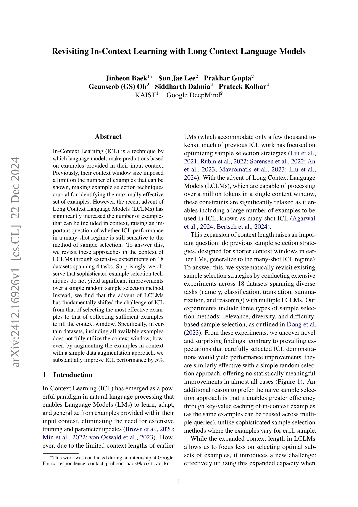
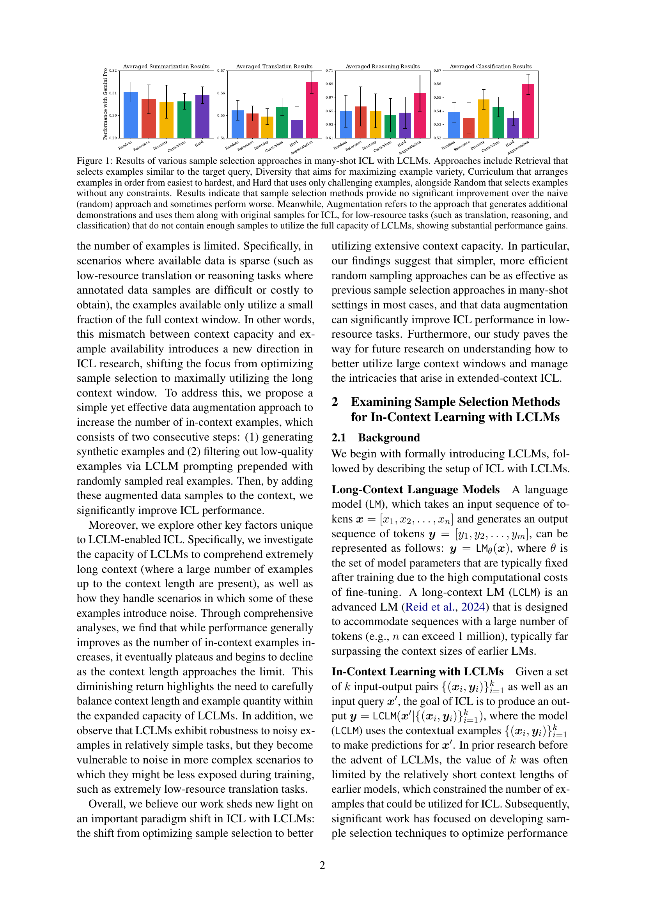
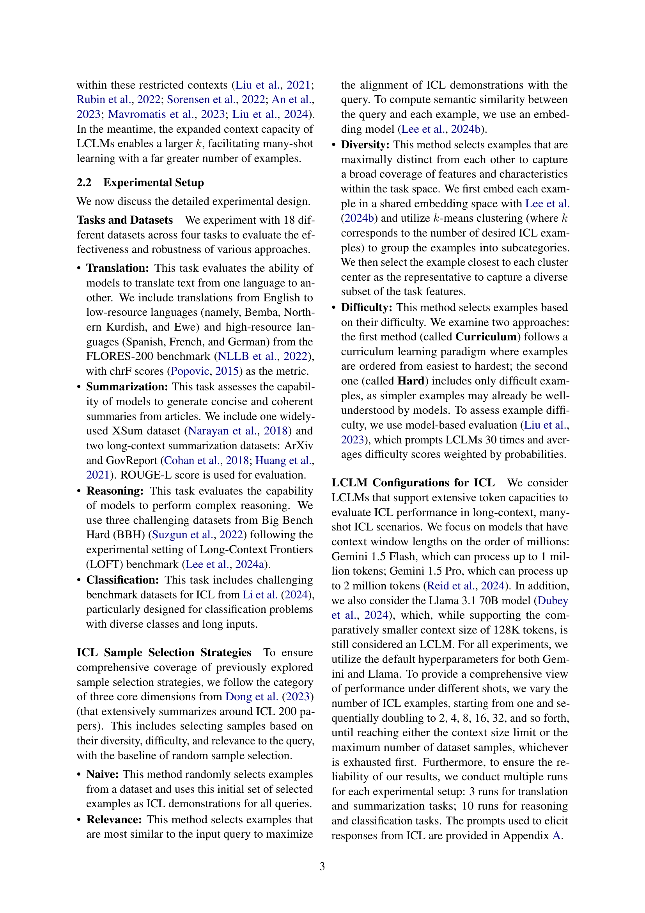
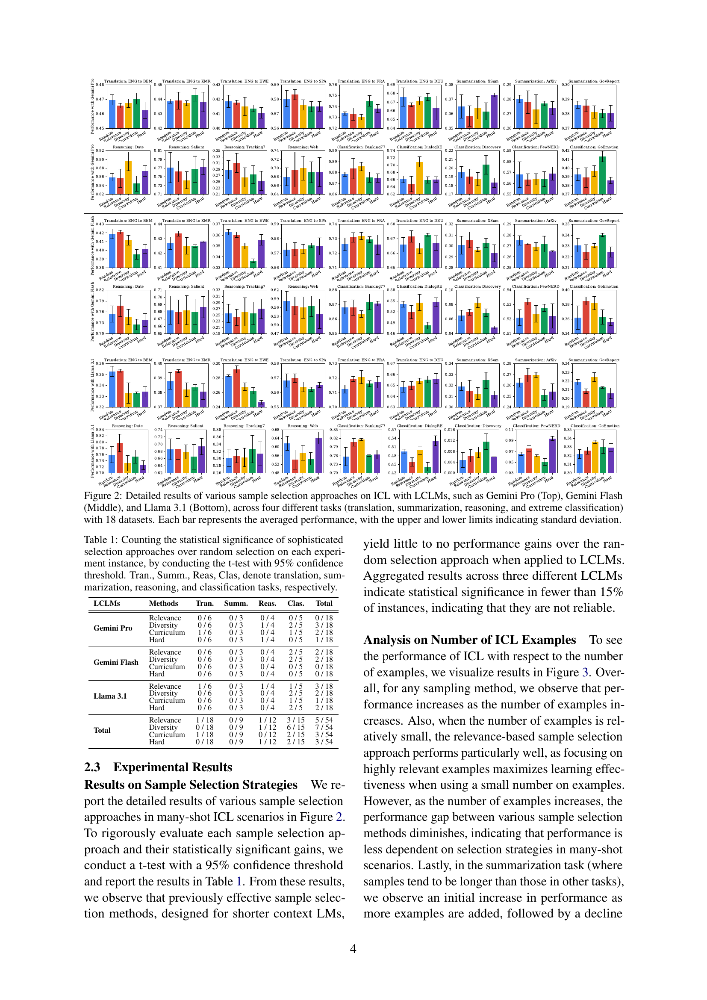
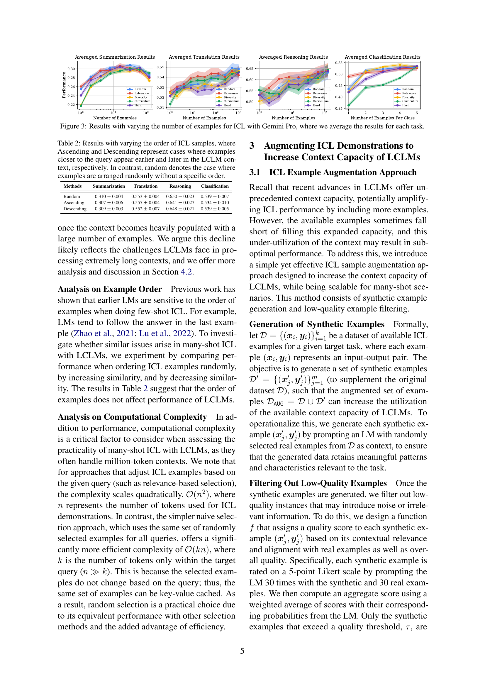
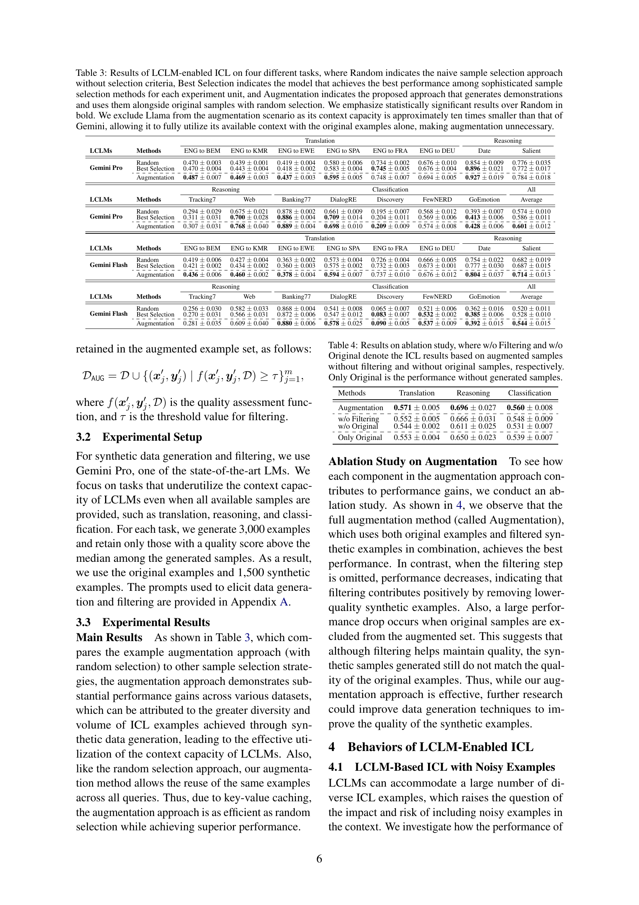
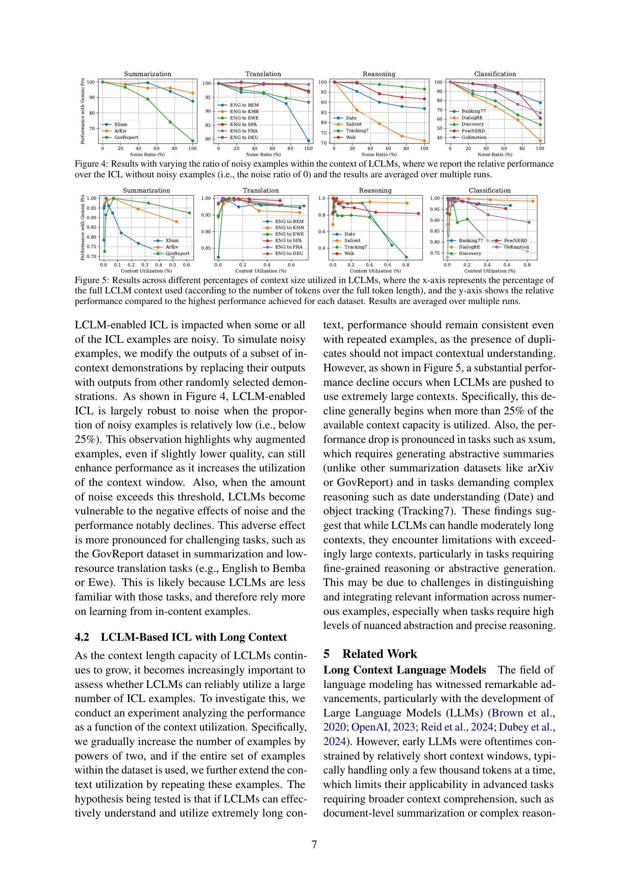
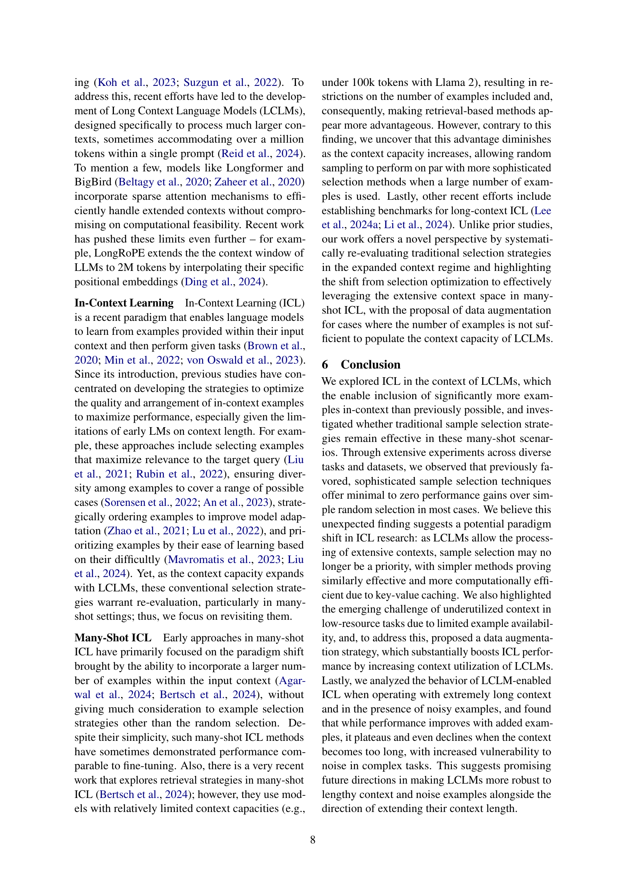
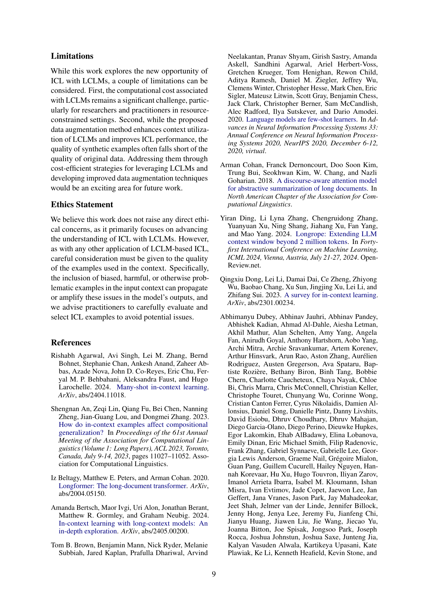
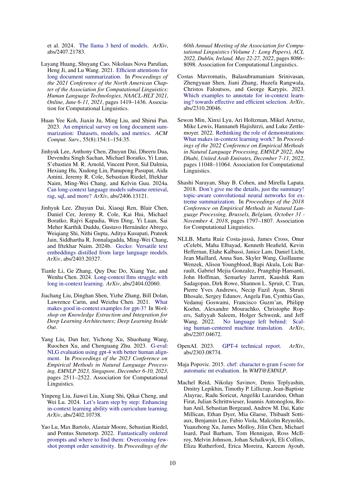
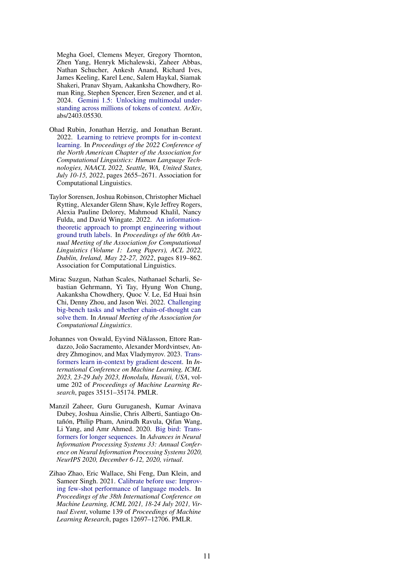
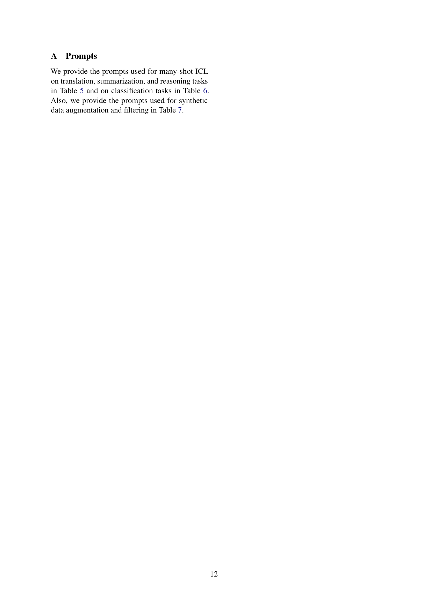
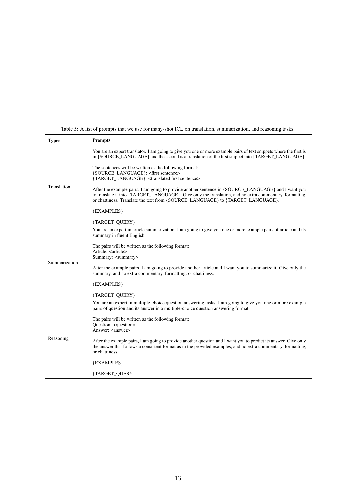
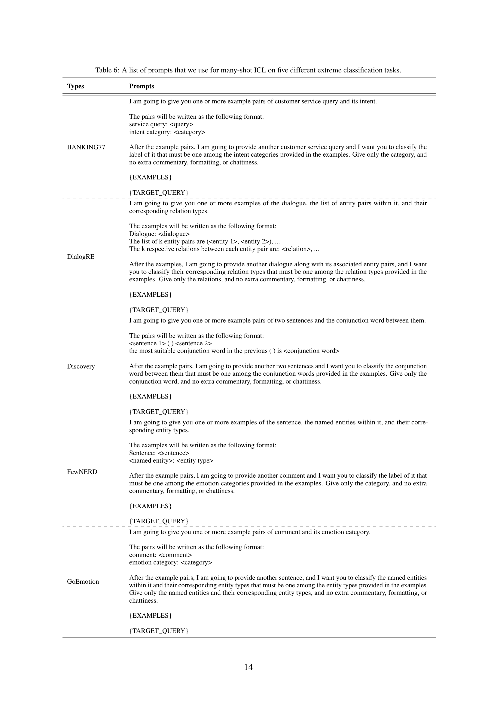

