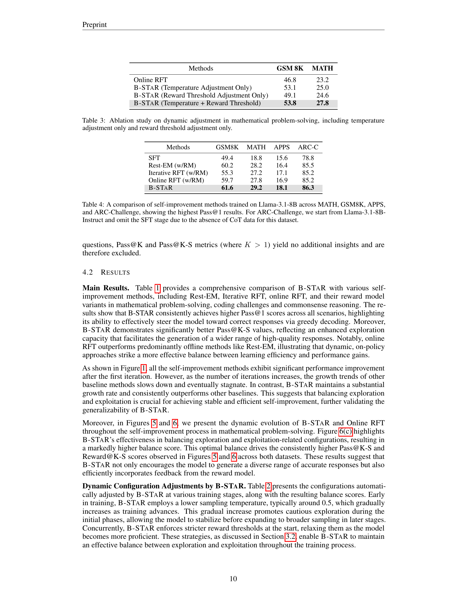

 


 2412.17256 
 Weihao Zeng et el. 
 
 🤗 2024-12-24 
 



↗ arXiv


↗ Hugging Face


↗ Papers with Code


### TL;DR



대규모 언어 모델은 수학적 문제 해결, 코딩, 상식적 추론 등 다양한 추론 능력을 보유하고 있지만, 고품질의 인간이 생성한 데이터에 대한 의존도가 높다는 한계가 있습니다.  **자기 개선 기법**은 이러한 문제를 해결하기 위한 유망한 방법으로, 모델이 자신의 출력을 사용하여 학습을 반복하는 방식입니다. 하지만 기존 자기 개선 방법은 몇 번의 반복 후 성능 향상이 정체되는 문제점을 가지고 있습니다.

본 연구는 **반복적인 자기 개선 과정에서 모델의 다양한 응답 생성 능력(탐색)과 보상의 효과(활용)를 모니터링하고 균형을 맞추는 새로운 프레임워크인 B-STAR**를 제시합니다.  수학적 추론, 코딩, 상식적 추론 과제에 대한 실험 결과, B-STAR는 기존 방법보다 우수한 성능을 달성하고 학습 과정 전반에 걸쳐 모델의 탐색 능력을 향상시키는 것으로 나타났습니다.  이를 통해 자기 학습 알고리즘의 작동 원리를 명확히 하고, 향후 연구를 위한 새로운 방향을 제시합니다.



#### Key Takeaways


 자기 개선적 추론 모델에서 **탐색(exploration)과 활용(exploitation)의 균형**이 성능 향상에 중요한 역할을 한다는 것을 밝힘 



 탐색과 활용의 역동적인 상호작용을 추적하고 분석하기 위한 정량적 지표를 제시함 



 탐색과 활용의 균형을 자동으로 조정하여 자기 개선 효율성을 최적화하는 B-STAR 프레임워크를 개발함 


#### Why does it matter?
본 논문은 **자기 개선적 추론 모델의 성능 향상을 위한 탐험과 활용의 균형**이라는 중요한 문제를 제기하며, 이를 해결하기 위한 새로운 프레임워크인 B-STAR를 제시합니다. 이는 자기 개선 학습의 한계를 극복하고 성능을 향상시키는 데 기여하며, **추론 모델 연구의 새로운 방향**을 제시할 수 있습니다. 또한, 제시된 방법론은 다른 분야의 자기 개선 학습에도 적용될 수 있는 잠재력을 가지고 있어, **폭넓은 연구 분야**에 영향을 줄 수 있습니다.

------
#### Visual Insights

> 🔼 그림 4는 B-STaR 접근 방식을 보여줍니다. 각 반복에서, 모델은 먼저 소량의 훈련 쿼리들을 사용하여 평균 균형 점수를 극대화하는 온도(tᵢ)와 보상 임계값(τᵢ) 설정을 찾습니다. 그런 다음, 최적의 온도와 임계값을 적용하여 전체 훈련 쿼리를 생성하고 보상합니다. 마지막으로, 선택된 데이터를 기반으로 모델을 업데이트합니다. 이 과정을 통해 모델은 탐색과 활용의 균형을 유지하며 지속적으로 성능을 향상시킵니다.
> 

> 
read the caption

> Figure 4: Illustration of the B-STaR approach. In each iteration, we first identify the configurations – temperature tisubscript𝑡𝑖t_{i}italic_t start_POSTSUBSCRIPT italic_i end_POSTSUBSCRIPT and reward threshold τisubscript𝜏𝑖\tau_{i}italic_τ start_POSTSUBSCRIPT italic_i end_POSTSUBSCRIPT – that maximize the average balance scores using a small subset of training queries. Next, we apply the optimal temperature and threshold to generate and reward the full set of training queries. Finally, we update the model based on the selected data.
> 


| Methods | GSM 8K P@1 | GSM 8K P@32 | GSM 8K P@32-4 | MATH P@1 | MATH P@32 | MATH P@32-4 | APPS P@1 | APPS P@32 | APPS P@32-4 | ARC-C P@1 |
|---|---|---|---|---|---|---|---|---|---|---|
| SFT | 36.6 | 88.5 | 62.2 | 17.0 | 60.8 | 31.2 | 9.3 | 43.5 | 25.5 | — |
| Rest-EM (w/o RM) | 40.5 | 89.9 | 69.8 | 22.8 | 60.0 | 33.6 | 14.5 | 43.9 | 28.2 | 70.7 |
| Rest-EM (w/ RM) | 46.3 | 90.7 | 72.2 | 24.2 | 62.8 | 37.4 | — | — | — | — |
| Iterative RFT (w/o RM) | 42.8 | 88.9 | 71.3 | 24.2 | 63.4 | 38.2 | 15.2 | 44.3 | 28.0 | 70.3 |
| Iterative RFT (w/ RM) | 46.6 | 90.2 | 74.9 | 24.4 | 62.6 | 39.0 | — | — | — | — |
| Online RFT (w/o RM) | 44.0 | 88.1 | 69.7 | 23.0 | 57.2 | 38.2 | 17.3 | 45.8 | 27.8 | 71.2 |
| Online RFT (w/ RM) | 46.8 | 91.4 | 76.5 | 23.2 | 62.6 | 39.2 | — | — | — | — |
| **B-STaR** | **53.8** | **93.6** | **81.0** | **27.8** | **67.2** | **42.2** | **19.6** | **49.3** | **30.7** | **73.0** |

> 🔼 표 1은 MATH, GSM8K, APPS 및 ARC-Challenge 데이터셋에서 다양한 자기 개선 방법들의 성능을 비교한 표입니다.  'w/ RM'은 보상 모델을 사용한 경우, 'w/o RM'은 보상 모델을 사용하지 않은 경우를 나타냅니다.  Mistral-7B 모델을 기반으로 결과를 얻었으나, APPS 데이터셋의 경우 Llama-3-8B 모델을 사용했습니다.  표에는 각 방법의 GSM8K, MATH, APPS 및 ARC-Challenge 데이터셋에 대한 Pass@1, Pass@32, Pass@32-4 성능이 제시되어 있으며, 보상 모델 사용 유무에 따른 성능 차이를 비교 분석하는 데 활용될 수 있습니다.
> 

> 
read the caption

> Table 1: Comparison of self-improvement methods across MATH, GSM8K, APPS and ARC-Challenge. Methods include variants with and without a reward model ('w/ RM' and 'w/o RM'). The results are based on the Mistral-7B model except for APPS that is from Llama-3-8B.
> 

### In-depth insights

#### Exploration Decay
본 논문에서 '탐색 감소(Exploration Decay)'는 자기 개선적 추론 모델이 반복 학습 과정에서 **새로운 솔루션을 생성하는 능력이 저하되는 현상**을 의미합니다. 초기에는 다양한 해결책을 제시하지만, 학습이 진행될수록 유사한 답변을 반복 생성하는 경향을 보입니다. 이는 모델이 **탐색보다는 활용(Exploitation)**에 치우쳐 **지나치게 특정 패턴에 집중**하기 때문입니다.  **다양성 부족**은 모델의 성능 향상을 저해하는 주요 원인이며, 이를 해결하기 위한 전략이 필요합니다.  따라서, **탐색과 활용의 균형을 유지**하는 메커니즘을 구축하여 지속적인 성능 향상을 도모해야 합니다.  이러한 탐색 감소 현상의 원인 분석 및 해결 방안 모색은 자기 개선적 추론 모델의 한계를 극복하고 성능을 향상시키는 데 중요한 역할을 합니다.  **B-STAR와 같은 동적 조정 전략**은 탐색 감소 문제를 완화하는 데 효과적인 접근법으로 제시될 수 있습니다.

#### B-STAR Framework
본 논문에서 제시된 B-STAR 프레임워크는 **자기 개선적 추론 모델에서 탐색과 활용의 균형을 자동으로 조정하는 방법론**입니다. 기존의 자기 개선 방식들이 반복 훈련 과정에서 탐색 능력이 저하되고 보상의 효과가 감소하는 문제점을 보이는 반면, B-STAR는 **탐색(exploration)과 활용(exploitation) 지표를 정량적으로 모니터링하고, 온라인 학습 방식을 통해 이러한 지표들을 동적으로 조절**합니다.  이는 **온도와 보상 임계값과 같은 하이퍼파라미터를 적응적으로 조정**함으로써 달성됩니다.  이를 통해 모델은 다양한 고품질 응답을 생성하고 (탐색), 보상 메커니즘을 효과적으로 활용하여 (활용) 성능을 지속적으로 향상시킬 수 있습니다.  **수학적 추론, 코딩, 상식 추론 등 다양한 작업에서 B-STAR의 우수성이 실험적으로 입증**되었으며, 특히 기존 방법론들보다 훨씬 안정적이고 지속적인 성능 향상을 보여줍니다.  **B-STAR는 자기 개선 알고리즘의 불투명한 측면을 해소하고,  훈련 역학에 대한 해석 가능한 통찰력을 제공**한다는 점에서 중요한 의미를 가집니다.

#### Dynamic Balancing
본 논문에서 제시된 "동적 균형 조정 (Dynamic Balancing)" 개념은 **셀프-트레이닝 모델의 탐색(Exploration)과 활용(Exploitation) 사이의 균형을 자동으로 조절하는 기법**입니다.  단순히 고정된 하이퍼파라미터를 사용하는 기존 방식과 달리, **반복적인 학습 과정 전반에 걸쳐 탐색과 활용의 역동적인 변화를 모니터링**하고, 이에 따라 온도(temperature)와 보상 임계값(reward threshold) 등의 설정값을 적응적으로 조정합니다.  이는 모델의 탐색 능력 저하 및 보상 효과 감소 현상을 완화하고, 최적의 성능을 달성하기 위한 핵심 전략입니다. **균형 점수(balance score)**라는 새로운 지표를 도입하여 탐색과 활용의 균형을 정량적으로 측정함으로써, 모델의 학습 효율을 극대화합니다.  결과적으로, **동적 균형 조정 기법은 셀프-트레이닝 과정의 투명성을 높이고, 성능 저하를 방지하며, 안정적인 성능 향상을 이끌어내는 효과적인 방법**임을 보여줍니다.

#### Reward Model Impact
보상 모델의 영향에 대한 심층적인 분석은 자기 개선 학습 과정에서 **핵심적인 역할**을 합니다.  **보상 모델의 질**은 모델이 생성한 응답 중에서 고품질 응답을 얼마나 효과적으로 식별하고 선택하는지에 직접적인 영향을 미칩니다.  **낮은 품질의 보상 모델**은 학습 과정을 저해하여 성능 향상에 제한을 초래할 수 있습니다.  반면, **고품질 보상 모델**은 모델이 다양한 고품질 응답을 생성하도록 유도하여 학습 효율을 높이고 성능 향상을 가속화합니다.  **보상 모델의 설계 및 최적화**는 자기 개선 학습의 성패를 좌우하는 중요한 요소이며,  향후 연구에서는 보상 모델의 성능을 더욱 개선하고,  다양한 유형의 문제에 적용할 수 있도록 **범용성을 확보**하는 데 초점을 맞춰야 할 것입니다.  **보상 모델의 동적 조정**은 모델의 탐색 및 활용 능력을 지속적으로 최적화하는 데 필수적입니다.  결론적으로,  보상 모델의 질과 동적 조정 능력은 자기 개선 학습의 효율성과 성능 향상에 있어서 **결정적인 요소**로 작용한다는 점을 강조해야 합니다.

#### Future Directions
본 논문은 자기 학습 추론자에서 탐험과 활용의 균형을 이루는 방법을 제시합니다. **미래 연구 방향**으로는 다음 세 가지가 제시될 수 있습니다. 첫째, **더욱 유연한 탐험-활용 제어 기법**의 개발입니다. 현재는 온도와 보상 임계값을 조정하는 단순한 방법을 사용하지만, 향후 더욱 정교한 제어 기법을 통해 더 나은 성능을 얻을 수 있을 것입니다. 둘째, **다양한 작업 및 모델 크기**에 대한 일반화 성능 향상입니다. 현재는 수학적 추론, 코딩, 상식 추론 등 제한된 작업과 모델 크기에 대한 실험만 수행되었으므로, 더욱 다양한 작업과 모델 크기에 대한 실험을 통해 일반화 성능을 검증해야 합니다. 셋째, **탐험-활용 역학에 대한 이론적 분석**의 심화입니다. 현재는 경험적 분석에만 의존하고 있지만, 탐험과 활용의 역학을 이론적으로 규명한다면 더욱 효율적인 자기 학습 알고리즘 설계에 도움이 될 것입니다.  **특히, 보상 함수의 설계 및 탐험-활용의 상호 작용**에 대한 깊이 있는 연구가 중요합니다. 이러한 미래 연구를 통해 자기 학습 추론자의 성능을 더욱 향상시키고, 그 한계를 극복할 수 있을 것으로 기대됩니다.

### More visual insights

More on tables


| Step | 500 | 1000 | 1500 | 2000 | 2500 | 3000 | 3500 | 4000 | 4500 |
|---|---|---|---|---|---|---|---|---|---| 
| Temperature | 0.5 | 0.8 | 0.9 | 1 | 1.1 | 1.1 | 0.9 | 1.1 | 1.1 |
| Reward threshold | 0 | -0.1 | -0.1 | -0.1 | -0.1 | -0.1 | -0.1 | -0.1 | -0.1 |
| Balance Score | 0.470 | 0.538 | 0.589 | 0.621 | 0.646 | 0.660 | 0.673 | 0.678 | 0.679 |
> 🔼 표 2는 수학 문제 풀이에서 B-STaR이 동적으로 구성을 조정하는 과정을 보여줍니다. 온도 증가분과 보상 임계값 증가분은 모두 0.1로 설정됩니다. 부록 D에서는 보다 세분화된 증가분에 대한 자세한 내용을 설명하고 표 5에 요약되어 있습니다. 이 표는 각 반복(iteration)마다 B-STaR이 온도와 보상 임계값을 어떻게 조정하여 탐색과 활용의 균형을 맞추는지 보여줍니다.  이는 모델의 성능 향상에 중요한 역할을 합니다. 각 반복마다 최적의 균형 점수를 얻기 위해 사용된 온도와 보상 임계값을 보여주는 데이터를 포함합니다.
> 

> 
read the caption

> Table 2: Dynamic configuration adjustments by B-STaR in mathematical problem-solving. The temperature increment and reward threshold increment are both set to 0.1. Additionally, finer-grained increments for these parameters are explored in detail in Appendix D and summarized in Table 5.
> 


| Methods | GSM 8K | MATH |
|---|---|---|
| Online RFT | 46.8 | 23.2 |
| B-STaR (Temperature Adjustment Only) | 53.1 | 25.0 |
| B-STaR (Reward Threshold Adjustment Only) | 49.1 | 24.6 |
| B-STaR (Temperature + Reward Threshold) | **53.8** | **27.8** |
> 🔼 표 3은 수학 문제 풀이에서 동적 조정에 대한 추가 분석 결과를 보여줍니다. 온라인 RFT 기법을 사용하여 온도 조정만, 보상 임계값 조정만, 그리고 온도와 보상 임계값을 동시에 조정하는 세 가지 실험을 진행했습니다. 온도와 보상 임계값을 동시에 조정했을 때 가장 좋은 성능을 보였으며, 이는 탐색과 활용의 균형이 중요함을 시사합니다.  각 조정 방법의 GSM8K와 MATH 데이터셋에 대한 Pass@1 정확도를 비교하여 동적 조정의 효과를 보여줍니다.
> 

> 
read the caption

> Table 3: Ablation study on dynamic adjustment in mathematical problem-solving, including temperature adjustment only and reward threshold adjustment only.
> 


| Methods | GSM8K | MATH | APPS | ARC-C |
|---|---|---|---|---|
| SFT | 49.4 | 18.8 | 15.6 | 78.8 |
| Rest-EM (w/RM) | 60.2 | 28.2 | 16.4 | 85.5 |
| Iterative RFT (w/RM) | 55.3 | 27.2 | 17.1 | 85.2 |
| Online RFT (w/RM) | 59.7 | 27.8 | 16.9 | 85.2 |
| B-STaR | **61.6** | **29.2** | **18.1** | **86.3** |
> 🔼 표 4는 Llama-3.1-8B 모델을 사용하여 MATH, GSM8K, APPS 및 ARC-Challenge 데이터셋에서 다양한 자기 개선 방법들의 성능을 비교한 표입니다.  Pass@1 지표를 사용하여 가장 높은 정확도를 보이는 결과를 제시하고 있습니다. ARC-Challenge 데이터셋의 경우, CoT(Chain-of-Thought) 데이터가 없어 SFT(Supervised Fine-Tuning) 단계를 생략하고 Llama-3.1-8B-Instruct 모델로부터 시작했습니다.  각 방법들의 Pass@1 점수를 비교하여 자기 개선 기법들의 효율성을 평가하고 있습니다.
> 

> 
read the caption

> Table 4: A comparison of self-improvement methods trained on Llama-3.1-8B across MATH, GSM8K, APPS, and ARC-Challenge, showing the highest Pass@1 results. For ARC-Challenge, we start from Llama-3.1-8B-Instruct and omit the SFT stage due to the absence of CoT data for this dataset.
> 


| Step | 500 | 1000 | 1500 | 2000 | 2500 | 3000 | 3500 | 4000 | 4500 |
|---|---|---|---|---|---|---|---|---|---| 
| Temperature | 0.65 | 0.75 | 1.05 | 0.95 | 1.05 | 0.85 | 1.05 | 1.15 | 1.05 |
| Reward Thresholds | -0.02 | -0.04 | -0.09 | -0.09 | -0.14 | -0.14 | -0.14 | -0.15 | -0.06 |
| Balance Score | 0.500 | 0.557 | 0.591 | 0.626 | 0.652 | 0.665 | 0.679 | 0.682 | 0.684 |
> 🔼 표 5는 수학 문제 풀이에서 B-STaR이 동적으로 하이퍼파라미터를 조정하는 과정을 보다 자세히 보여줍니다.  각 반복(iteration)마다 B-STaR이 선택한 온도(temperature)와 보상 임계값(reward threshold)을 보여주며, 이를 통해 탐색(exploration)과 활용(exploitation)의 균형을 어떻게 유지하는지 보여줍니다.  온도와 보상 임계값의 변화는 평균 균형 점수(average balance score)를 최대화하는 방향으로 이루어집니다. 이 표는 B-STaR 알고리즘의 동적 조정 메커니즘을 이해하는 데 중요한 역할을 합니다.
> 

> 
read the caption

> Table 5: Finer-grained dynamic configuration adjustments by B-STaR in mathematical problem-solving.
> 


| Configuration | GSM 8K | MATH |
|---|---|---|
| Temp = 1.0; Threshold = 0.0 | 46.8 | 23.2 |
| Temp = 1.1; Threshold = -0.1 | 40.4 | 18.2 |
| B-STaR | 53.1 | 27.8 |
> 🔼 본 표는 온라인 RFT(Rejection Sampling Fine-tuning)에서 특정 하이퍼파라미터 조합을 사용한 결과와 B-STAR의 성능을 비교한 것입니다. B-STAR 실험에서 발견된 안정적인 하이퍼파라미터 조합(온도 1.1, 보상 임계값 -0.1)을 사용하여 결과를 보고합니다. 이는 표 2의 결과를 기반으로 합니다.
> 

> 
read the caption

> Table 6: Comparison of Online RFT using specific configurations and B-STaR Performance. This table reports the results with the stable hyperparameter combinations we found in our B-STaR experiments (Temperature = 1.1, Reward thresholds = -0.1) (Table 2).
> 

### Full paper



