 


 2412.17295 
 Yueqian Wang et el. 
 
 🤗 2024-12-24 
 



↗ arXiv


↗ Hugging Face


↗ Papers with Code


### TL;DR



기존의 다중 모달 대화 연구는 주로 **두 명의 참여자** 간의 질의응답 형태에 초점을 맞춰왔으며, **실제 상황**과는 거리가 먼 한계를 가지고 있습니다.  본 논문에서는 **다수의 참여자**가 **실제 환경** 속에서 상호작용하는 다중 모달 다중 참여 대화(MMC)라는 새로운 연구 분야를 제시합니다.  이는  **대화의 맥락과 시각적 정보**를 함께 고려해야 하는 복잡성을 내포합니다.

본 연구는 이러한 문제를 해결하기 위해 **Friends-MMC**라는 새로운 데이터셋을 구축했습니다. 이 데이터셋은 Friends TV 시리즈의 대화를 기반으로 하며, 각 발화에 대한 비디오, 텍스트, 화자 정보, 얼굴 위치 정보 등 다양한 모달 정보를 포함합니다.  **대화 참여자 식별** 및 **응답 예측**이라는 두 가지 주요 과제에 대한 기준 모델을 제시하고, 특히 **화자 정보의 중요성**을 실험적으로 입증하였습니다.  이는 MMC 연구에 중요한 기여를 할 뿐 아니라, **실제 상황에 더 가까운 대화 시스템** 개발을 위한 새로운 가능성을 제시합니다.



#### Key Takeaways


 Friends-MMC라는 새로운 다중 모달 다중 참여 대화 데이터셋을 소개합니다. 



 대화 참여자 식별 및 응답 예측이라는 두 가지 핵심적인 MMC 과제를 다룹니다. 



 화자 정보가 MMC 이해에 중요한 역할을 한다는 것을 보여줍니다. 


#### Why does it matter?
이 논문은 **다중 모달 다중 참여 대화(MMC)**에 대한 새로운 연구 분야를 제시하고, 이를 위한 새로운 데이터셋인 Friends-MMC를 공개함으로써 **실제 상황에 가까운 MMC 모델링** 연구에 중요한 기여를 합니다.  **대화 참여자 식별 및 응답 예측**이라는 두 가지 핵심 과제에 대한 기준 모델을 제시하고 성능을 평가함으로써, 향후 연구 방향을 제시하고 MMC 연구를 활성화할 것입니다. 특히, **화자 정보 모델링의 중요성**을 강조하여 관련 연구 분야에 새로운 시각을 제공합니다.

------
#### Visual Insights

> 🔼 그림 1은 다중 모드 다중 참여 대화의 예시를 보여줍니다.  점선 화살표는 등장인물과 발화를 연결하여 대화의 화자 식별 작업을 보여줍니다.  점선 직사각형은 마지막 발화를 나타내어 대화 응답 예측 작업을 보여줍니다.  혼잡을 피하기 위해 비디오의 한 프레임만 시각적 맥락으로 표시됩니다.  즉, 여러 명의 화자가 동시에 등장하는 대화에서 각 발화에 대한 화자를 정확히 식별하고, 문맥을 고려하여 다음 발화를 예측하는 두 가지 과제를 보여줍니다.
> 

> 
read the caption

> Figure 1: An example of multi-modal multi-party conversation. The task of conversation speaker identification is to infer the dotted arrows pointing from characters to utterances, and the task of conversation response prediction is to infer the last utterance in the dotted rectangular. Only one frame of the video is shown as the visual context to avoid clutter.
> 


|               | 5 turns                                      | 8 turns                                      |
| :------------- | :--------------------------------------------- | :--------------------------------------------- |
|               | train | test  | test-noisy | train | test  | test-noisy |
| # sessions     | 13584 | 2017  | 2017       | 8730  | 1325  | 1325       |
| # unique turns | 21092 | 3069  | 3069       | 16990 | 2480  | 2480       |
| # words in utterance | 18.87 | 20.28 | 20.28      | 18.71 | 20.42 | 20.42      |
| # speakers in each session | 2.83  | 2.85  | 2.85       | 3.43  | 3.47  | 3.47       |
| # face tracks per clip | 2.41  | 3.12  | 2.50       | 2.39  | 3.14  | 2.52       |
| avg. secs per face track | 2.31  | 2.71  | 2.72       | 2.30  | 2.74  | 2.73       |
| % speakers not in current clip | 13.43 | 1.03  | 19.26      | 13.51 | 1.10  | 18.93      |
| % speakers not in all clips | 6.13  | 0.17  | 1.13       | 5.57  | 0.14  | 0.44       |
| # faces per frame | 1.61  | 2.20  | 1.76       | 1.60  | 2.21  | 1.78       |
| % speakers not in current frame | 24.05 | 6.52  | 25.64      | 24.15 | 6.42  | 25.30      |
| % speakers not in all frames | 9.53  | 1.01  | 3.32       | 7.45  | 0.42  | 1.37       |

> 🔼 Friends-MMC 데이터셋의 통계를 보여주는 표입니다. 학습 데이터셋, 테스트 데이터셋, 그리고 더욱 어려운 테스트-잡음 데이터셋의 크기와 특징을 보여줍니다. 각 데이터셋의 세션 수, 고유한 발화 수, 발화 당 단어 수, 세션 당 평균 참여자 수, 현재 클립 또는 프레임에 얼굴이 감지되지 않은 화자의 비율, 모든 클립 또는 프레임에 얼굴이 감지되지 않은 화자의 비율, 클립 당 평균 얼굴 추적 수, 얼굴 추적 당 평균 초, 프레임 당 평균 얼굴 수, 모든 프레임에 얼굴이 감지되지 않은 화자의 비율 등의 정보를 포함합니다.
> 

> 
read the caption

> Table 1: Dataset Statistics of Friends-MMC. We provide a train set, a test set and a more challenging test-noisy set.
> 

### In-depth insights

#### MMC Dataset Intro
본 논문에서 제시하는 MMC(Multi-modal Multi-party Conversation) 데이터셋 소개는 **실세계 대화의 복잡성을 반영하는 멀티모달 멀티파티 대화 데이터의 필요성**을 강조하는 데서 시작됩니다. 기존의 멀티모달 대화 데이터셋들이 주로 2인 대화 또는 제한된 시나리오에 초점을 맞춘 것과 달리, MMC 데이터셋은 **여러 참여자 간의 상호작용과 멀티모달 정보(텍스트, 비디오, 음성)**를 모두 포괄합니다.  **Friends-MMC 데이터셋은 인기 TV 시리즈인 Friends를 활용하여 자연스럽고 다양한 대화를 확보**하고, 각 발화에 대한 화자 정보, 얼굴 위치 정보 등의 상세한 주석을 제공합니다. 이러한 **풍부한 주석 정보는 대화의 화자 식별 및 응답 예측과 같은 다양한 과제를 수행**하는데 활용되며, **실제 환경에 가까운 복잡한 멀티모달 멀티파티 대화 연구를 위한 견고한 기반**을 제공할 것으로 예상됩니다. 특히, **기존의 방식으로는 해결하기 어려운 실제적인 문제에 대한 모델링 및 평가가 가능**하다는 점에서 의미가 있으며, **인공지능 분야의 발전에 기여할 잠재력**이 높습니다.

#### Speaker ID Method
본 논문에서 제시된 화자 식별 방법은 **다양한 모달리티(시각, 음성, 텍스트)**를 통합적으로 활용하는 것이 핵심입니다. 단순히 하나의 모달리티에 의존하는 것이 아니라, 각 모달리티의 강점을 결합하여 보다 정확하고 강인한 화자 식별 성능을 달성하고자 합니다.  **시각적 모달리티**는 영상 또는 이미지 내 얼굴 특징을 분석하여 화자를 식별하는 데 사용되며, **음성 모달리티**는 음성 신호를 분석하여 화자의 목소리를 구분하는 데 사용될 수 있습니다.  **텍스트 모달리티**는 대화 내용의 문맥 정보를 활용하여 화자를 추론하는 데 활용됩니다.  **특히 흥미로운 점은 딥러닝 기반의 사전 훈련된 모델을 활용하지 않고, 최적화 기법을 사용하여 여러 모달리티 정보를 효율적으로 결합하는 접근 방식을 취한다는 점입니다.** 이러한 접근 방식은 딥러닝 기반 모델의 복잡성과 계산 비용을 줄이는 동시에, **문맥 정보를 효과적으로 활용하여 보다 정확한 화자 식별 결과를 얻을 수 있게 해줍니다.**  다만, **본 방법의 성능은 다양한 요소 (예: 영상/음성 품질, 대화 내용의 복잡성)**에 영향을 받을 수 있으며, 이에 대한 추가적인 연구가 필요해 보입니다. 또한, **본 연구에서 사용된 데이터셋의 특징 (예: TV 시리즈)**을 고려했을 때, 다른 유형의 대화 데이터에 대한 일반화 성능을 평가하는 것이 중요합니다.

#### Response Prediction
본 논문에서 다룬 응답 예측(Response Prediction) 부분은 **다중 모달 다자간 대화(MMC)**의 핵심 과제 중 하나로, 시각적 정보와 여러 참여자의 발화 내용을 종합적으로 고려하여 다음 발화를 예측하는 것을 목표로 합니다.  기존의 단순한 질의응답 방식을 넘어, **실제 대화의 맥락과 다양한 참여자의 개성 및 관계**를 반영하는 복잡한 모델링을 요구하며, 이를 위해 **화자 식별(Speaker Identification)** 정보가 중요한 역할을 수행합니다.  실험 결과는 화자 정보를 활용했을 때, 특히 시각 정보가 제한적인 경우에 예측 성능이 향상됨을 보여줍니다.  **다양한 모달리티(텍스트, 비디오, 이미지)**와 **화자 정보**를 효과적으로 결합하는 모델 개발이 중요한 연구 과제이며, **대화의 흐름과 참여자 간의 상호작용**을 보다 정교하게 이해하고 모델링하는 새로운 접근법이 필요함을 시사합니다.  본 연구는 이러한 MMC 응답 예측 과제에 대한 심도있는 분석과 해결 방안을 제시하며, 향후 **실제 세계의 복잡한 대화 시스템 개발**에 기여할 것으로 기대됩니다.

#### Future of MMC
**다중 모달 다자간 대화(MMC)의 미래는 매우 밝습니다.**  본 논문에서 제시된 Friends-MMC 데이터셋과 같은 고품질 데이터의 지속적인 개발은 **모델 성능 향상에 크게 기여할 것입니다.** 특히, **비디오 및 오디오와 같은 다양한 모달리티를 통합하는 연구**는 보다 자연스럽고 현실적인 대화 시스템 구축으로 이어질 것입니다.  **발화자 식별 및 대화 응답 예측과 같은 핵심 과제**에 대한 심층적인 연구는 MMC 기술의 발전에 필수적입니다.  또한, **대규모 언어 모델(LLM)과의 통합**을 통해 MMC 시스템은 더욱 지능적이고 이해력이 높아질 것입니다.  **사용자의 맥락 및 감정을 더욱 정교하게 이해**하여, 보다 개인화된 응답을 제공하고, **인간과 같은 자연스러운 상호 작용**을 가능하게 할 것입니다. 마지막으로, **실제 세계의 다양한 상황에 MMC 기술을 적용**하는 연구가 활발히 진행될 것으로 예상되며, 이는 **스마트 홈, 로봇, 원격 의료 등 다양한 분야**에 혁신적인 변화를 가져올 수 있습니다.  하지만, **개인 정보 보호 및 데이터 편향 문제**에 대한 신중한 고려가 필요합니다.  **윤리적인 측면을 고려한 연구**가 더욱 중요해질 것입니다.

#### Dataset Limitations
본 논문에서 제시된 데이터셋의 한계점을 깊이 있게 고찰해 보면, **데이터 수집의 편향성**이 가장 큰 문제점으로 지적될 수 있습니다. 특정 TV 시리즈의 특정 시즌에서만 수집된 데이터는 현실 세계의 다양한 대화 상황을 충분히 반영하지 못할 가능성이 높습니다. 또한, **대화 참여자의 사회경제적 배경이나 문화적 차이**가 제한적으로 반영되어, 데이터셋의 일반화 가능성에 대한 의문이 제기됩니다.  **비언어적 정보의 부족** 또한 심각한 한계입니다.  영상 데이터만으로는 음성 톤, 몸짓, 표정 변화 등 다양한 비언어적 단서를 완벽하게 포착하기 어렵습니다.  이러한 한계점들은 **모델의 성능 및 일반화 능력**에 직접적인 영향을 미칠 수 있으며, 특히 다양한 환경에서 적용 가능한 범용적인 대화 이해 모델을 개발하는 데 어려움을 야기할 수 있습니다. 따라서, 향후 연구에서는 더욱 다양하고 균형 잡힌 데이터셋을 구축하여 이러한 한계점들을 보완하는 노력이 필요합니다.  **데이터의 균형**을 위해 다양한 대화 유형, 참여자 구성, 맥락 등을 고려한 데이터 확보가 중요하며, 비언어적 정보와 관련된 **데이터 보강** 또한 중요한 해결 과제입니다. 마지막으로, **윤리적 고려 사항** 또한 중요합니다.  개인 정보 보호 및 저작권 문제를 신중히 고려하여 데이터 수집 및 활용 과정의 투명성을 확보하는 노력이 필요합니다.

### More visual insights

More on figures

> 🔼 그림 2는 Friends-MMC 데이터셋 구성 과정을 개괄적으로 보여줍니다. 비디오 전처리 단계부터 시작하여 자막을 이용한 비디오 클립 추출, 얼굴 검출 및 추적, 얼굴 프로토타입 생성, 자동 얼굴 라벨링, 테스트 및 노이즈 테스트 세트 생성, 이미지 프레임 선택, 슬라이딩 윈도우를 이용한 세션 선택 등의 단계를 거쳐 최종적으로 Friends-MMC 데이터셋을 생성하는 과정을 시각적으로 설명합니다. 각 단계별로 사용된 방법 및 기술에 대한 자세한 설명이 포함되어 있습니다.
> 

> 
read the caption

> Figure 2: An overview of the construction process of Friends-MMC dataset.
> 

> 🔼 그림 3은 대화의 화자 식별을 위한 제안된 세 가지 모듈의 개요를 보여줍니다. 시각적 모듈(M1)은 노란색으로 표시되며, 얼굴을 인식하고 화자일 가능성을 예측합니다. 텍스트 모듈(M2)은 녹색으로 표시되며, 대화 맥락을 분석하여 화자 간의 관계를 파악합니다. 마지막으로, 시각적 및 텍스트 보상 행렬을 입력으로 받아 화자를 식별하는 최적화 솔버는 파란색으로 표시됩니다. 이 세 가지 모듈은 서로 협력하여 화자를 보다 정확하게 식별합니다.
> 

> 
read the caption

> Figure 3: Model overview of the three modules in different colors: the visual (M1subscript𝑀1M_{1}italic_M start_POSTSUBSCRIPT 1 end_POSTSUBSCRIPT) is yellow, the textual (M2subscript𝑀2M_{2}italic_M start_POSTSUBSCRIPT 2 end_POSTSUBSCRIPT) is green, and the optimization solver taking vision and text reward matrix as input is blue.
> 

More on tables


|               |                               | 5 turns | 5 turns | 8 turns | 8 turns |
| :------------ | :---------------------------- | :------ | :------ | :------ | :------ |
|               |                               | noisy   |         | noisy   |         |
| 0             | random                         | 31.82   | 32.61   | 28.54   | 29.03   |
|               | (std.dev.)                     | (0.25)  | (0.47)  | (0.49)  | (0.27)  |
| *Frame Only* |                               |         |         |         |         |
| 1             | $M_{1}$(CNN)                  | 72.88   | 63.72   | 72.90   | 62.51   |
| *Video Only* |                               |         |         |         |         |
| 2             | $M_{1}$(TalkNet)               | 80.89   | 70.91   | 81.00   | 70.50   |
| *Text Only*  |                               |         |         |         |         |
| 3             | $M_{2}$                         | 33.24   | 33.85   | 29.09   | 29.33   |
| 4             | GPT 3.5 (3-shot)               | 37.21   | 37.24   | 33.35   | 32.81   |
| *Use image and text modality* |              |         |         |         |         |
| 5             | Violet                         | 32.66   | 33.16   | 27.73   | 28.86   |
| 6             | LLaVA v1.5-13B                 | 46.30   | 42.39   | 45.73   | 41.41   |
| 7             | Emu-14B                        | 61.76   | 58.23   | 60.96   | 56.46   |
| 8             | $M_{1}$(CNN) + $M_{2}$         | 75.81   | 68.61   | 74.53   | 67.21   |
| 9             | $M_{1}$(CNN) + $M_{2}^{
eq}$   | 84.90   | 78.01   | 90.80   | 83.93   |
| 10            | GPT-4o (0-shot)                | 66.36   | 65.60   | 63.64   | 61.02   |
| 11            | Human                          | 82.25   | -       | 84.49   | -       |
| *Use video and text modality* |              |         |         |         |         |
| 12            | $M_{1}$(TalkNet) + $M_{2}$     | 83.21   | 74.12   | 83.60   | 75.00   |
| 13            | $M_{1}$(TalkNet) + $M_{2}^{
eq}$ | 90.88   | 83.09   | 95.10   | 89.69   |
> 🔼 표 2는 Friends-MMC 데이터셋의 테스트 세트와 노이즈가 추가된 테스트 세트에 대한 정확도를 보여줍니다.  M₁과 M₂는 제안된 기준 방법에서 각각 시각 모델과 텍스트 모델을 나타냅니다. M₁에서는 CNN 또는 TalkNet을 사용하여 이미지 또는 비디오를 입력으로 사용합니다. † 표시는 텍스트 모델 출력(M₂) 대신 실제 값을 상한선으로 사용했음을 나타냅니다.
> 

> 
read the caption

> Table 2: Accuracy on the test and test-noisy set of Friends-MMC. M1subscript𝑀1M_{1}italic_M start_POSTSUBSCRIPT 1 end_POSTSUBSCRIPT and M2subscript𝑀2M_{2}italic_M start_POSTSUBSCRIPT 2 end_POSTSUBSCRIPT denote the visual and textual model of our baseline method, respectively. For M1subscript𝑀1M_{1}italic_M start_POSTSUBSCRIPT 1 end_POSTSUBSCRIPT, we use CNN or TalkNet to take image or video as input. † indicates that we use ground truths instead of textual model outputs (M2subscript𝑀2M_{2}italic_M start_POSTSUBSCRIPT 2 end_POSTSUBSCRIPT) to serve as upper bounds.
> 


| Model | Speaker | 5 turns | 8 turns |
|---|---|---|---| 
| Llama2-7B | No | 30.69 | 36.98 |
|  | Random | 31.23 | 43.32 |
|  | Random History | 31.63 | 43.40 |
|  | Shuffled | 35.20 | 48.60 |
|  | Ground truth | 36.89 | 49.36 |
|  | M1(CNN) + M2 | 34.16 | 45.81 |
|  | M1(TalkNet) + M2 | 34.56 | 46.64 |
| Emu-14B | No | 30.49 | 31.09 |
|  | Random | 29.35 | 31.55 |
|  | Random History | 29.45 | 31.25 |
|  | Shuffled | 33.02 | 35.17 |
|  | Ground truth | 34.06 | 36.30 |
|  | M1(CNN) + M2 | 31.98 | 33.89 |
|  | M1(TalkNet) + M2 | 32.97 | 34.64 |
> 🔼 본 표는 대화 응답 예측의 정확도를 보여줍니다. 10개의 발화 중 하나를 선택하여 응답을 예측하는 설정에서 세 가지 다른 시나리오(무작위 스피커 이름, 무작위 기록 스피커 이름, 섞인 이름) 하에서의 정확도를 비교합니다.  각 시나리오에서 다양한 모델과 시각적 맥락(이미지 또는 비디오) 사용 여부에 따른 결과를 보여줍니다.  이는 스피커 정보가 대화 응답 예측에 미치는 영향을 분석하기 위한 것입니다.
> 

> 
read the caption

> Table 3: Accuracy of conversation response prediction by selecting one from a set of ten utterances as candidates.
> 

### Full paper


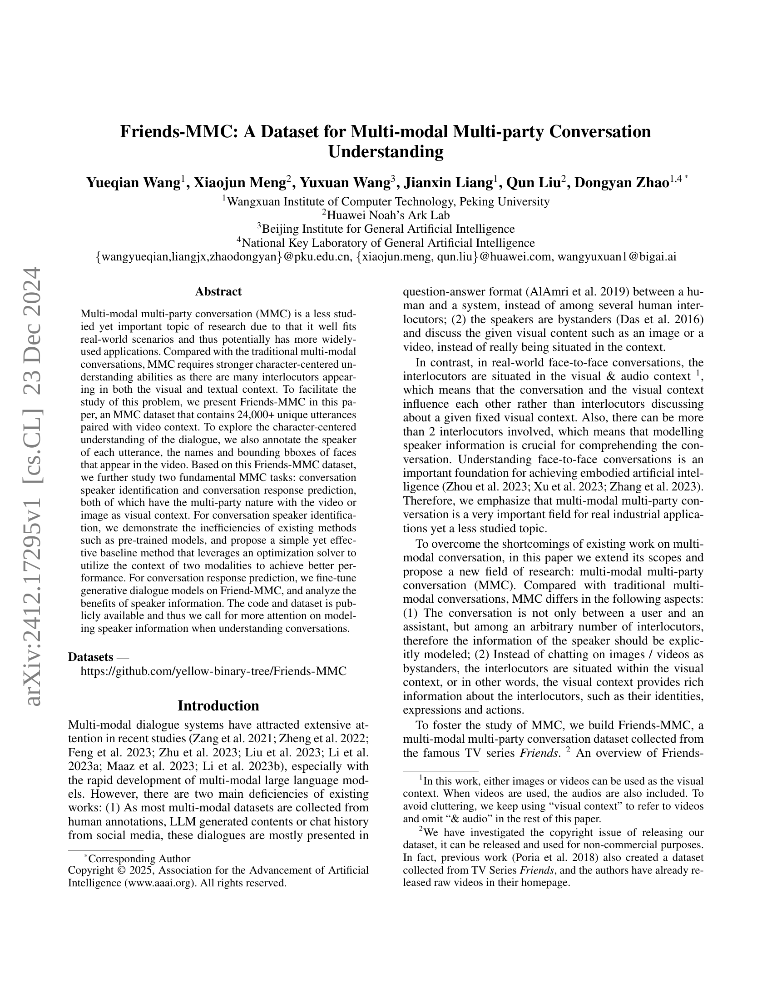
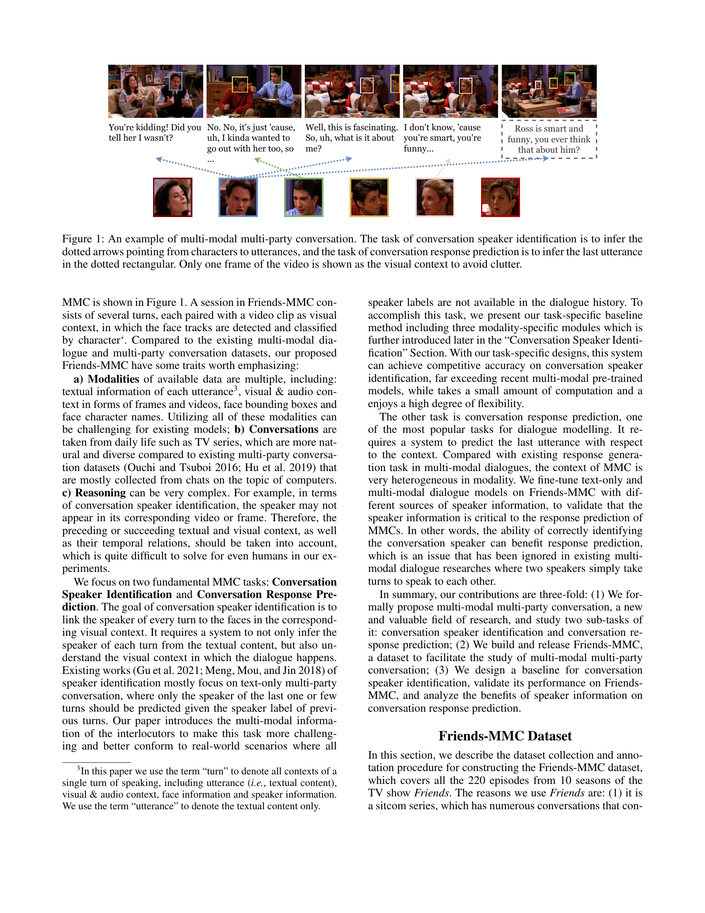
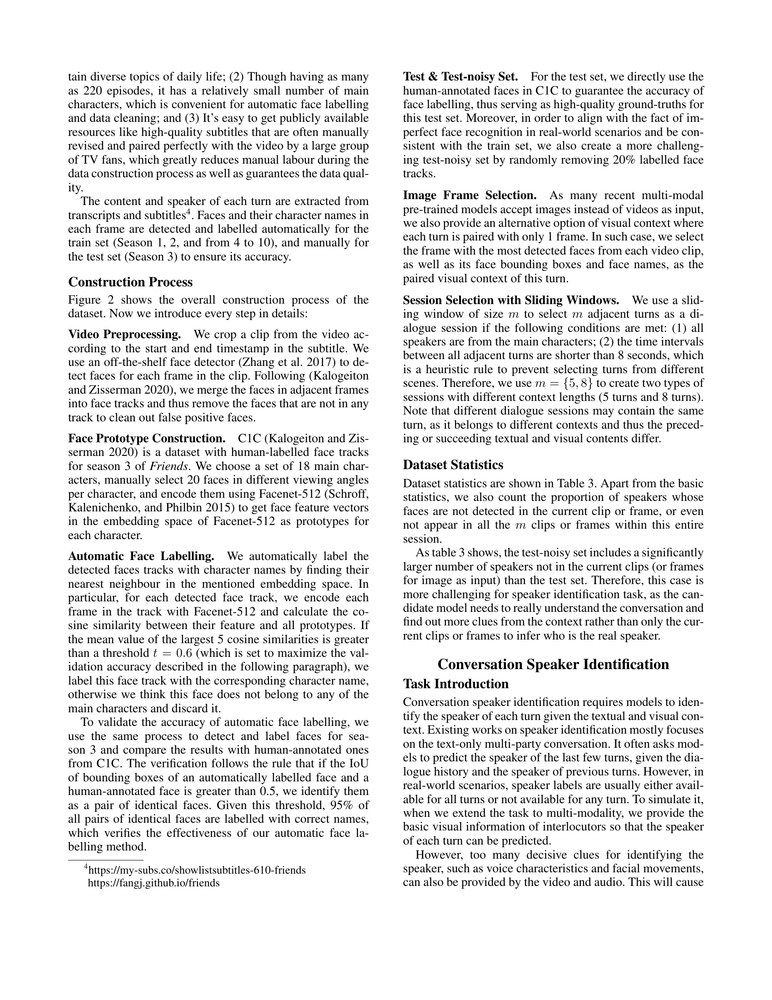
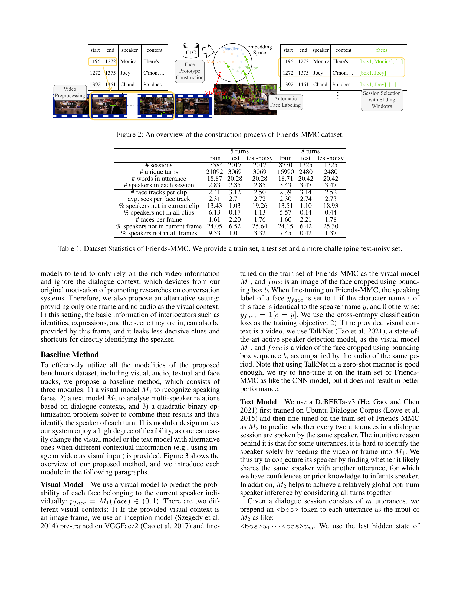
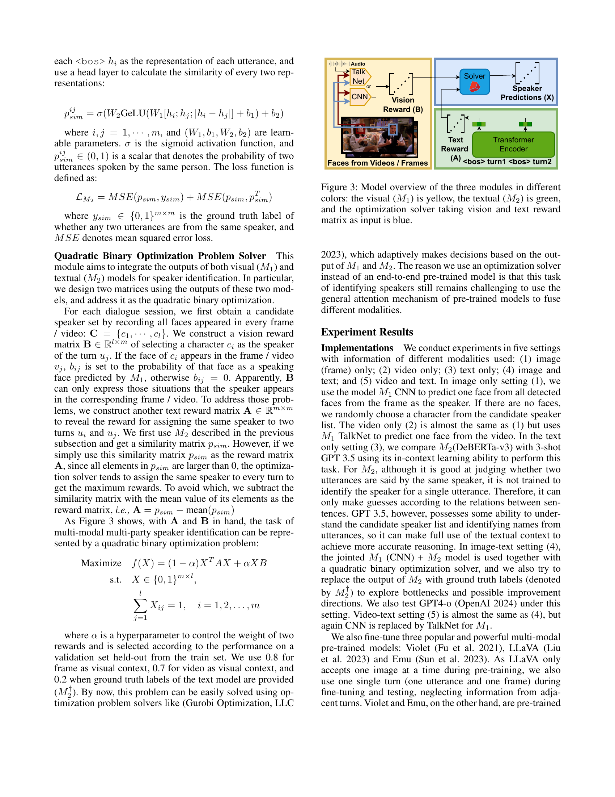
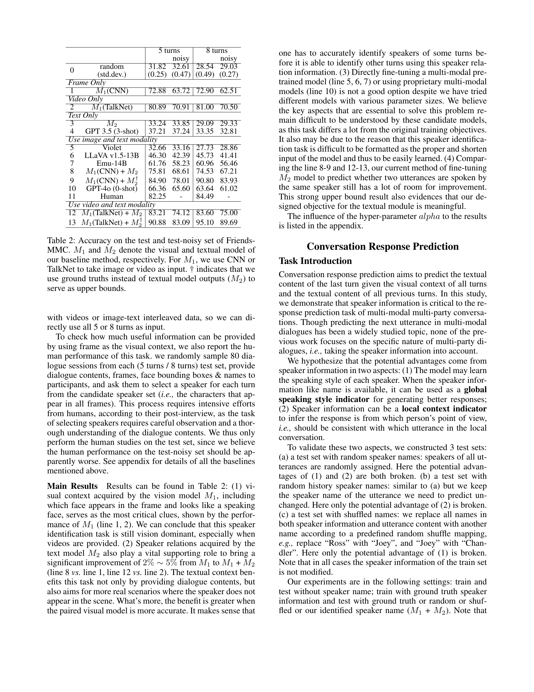
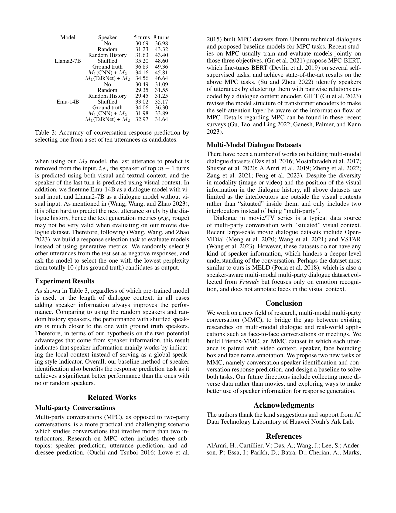
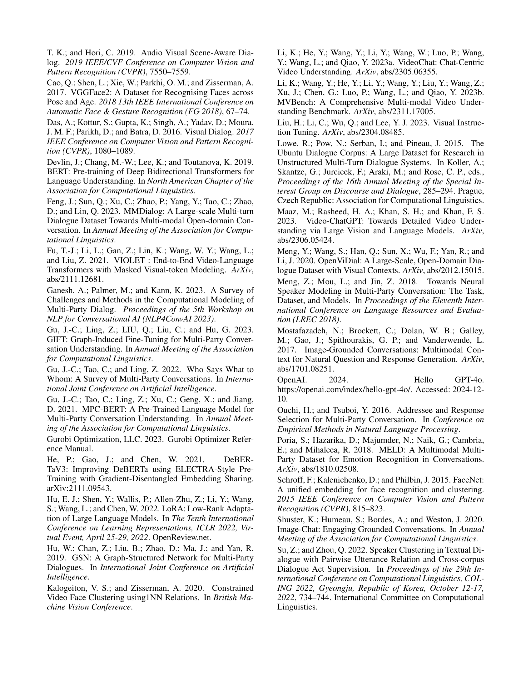
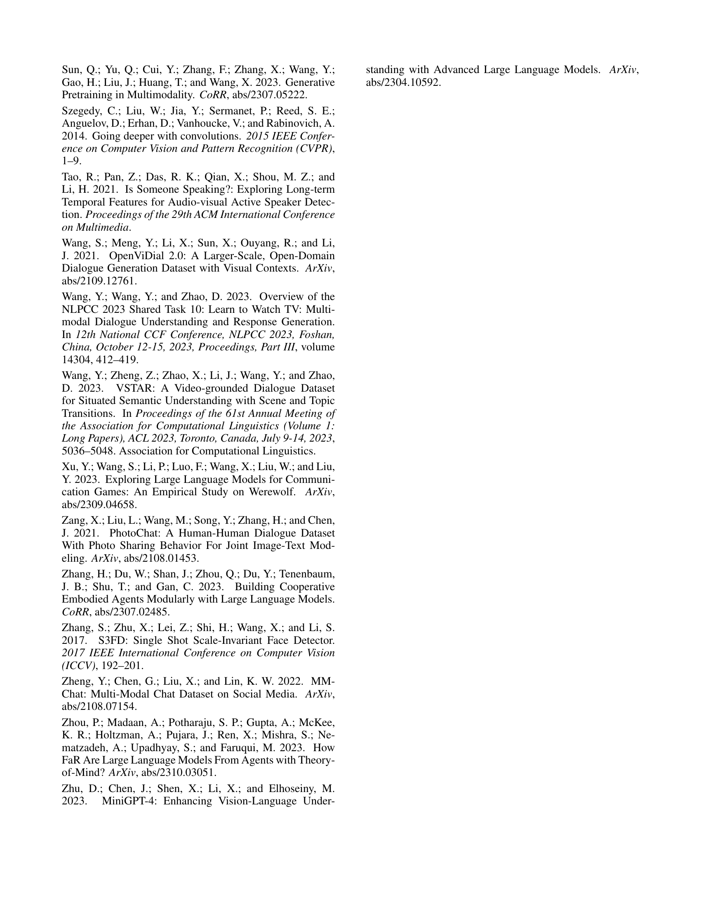
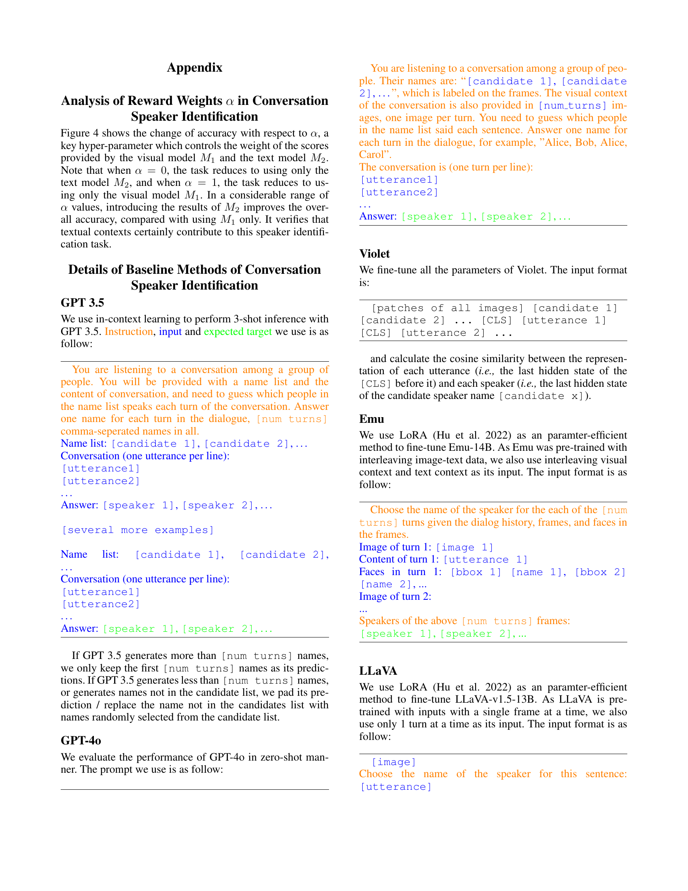
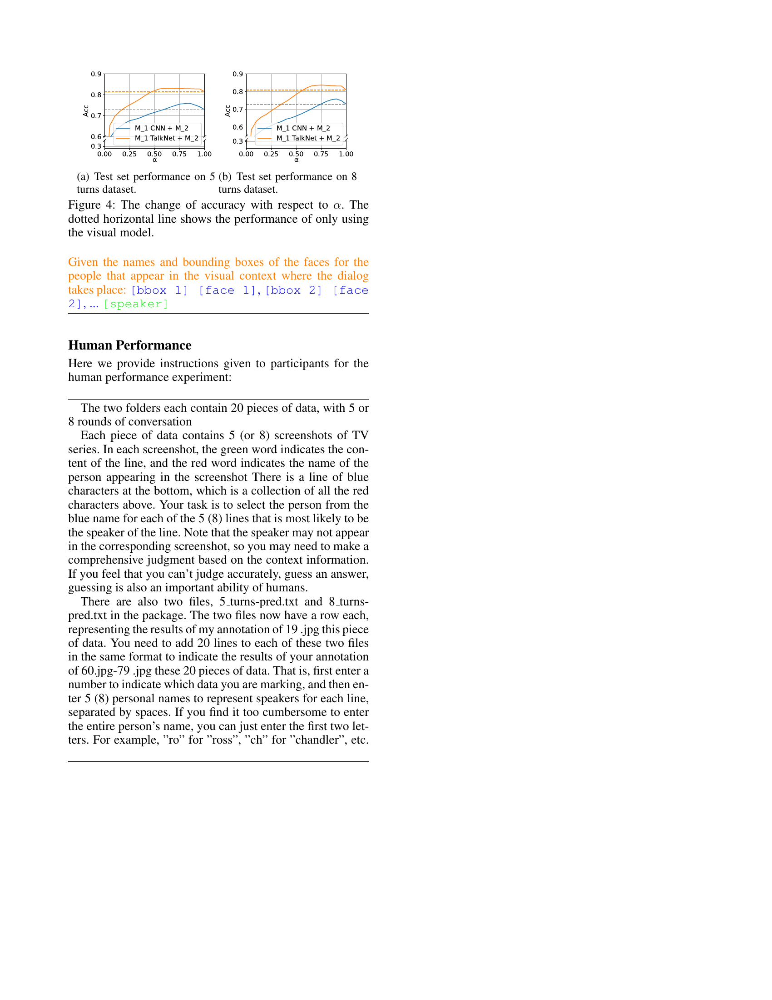
